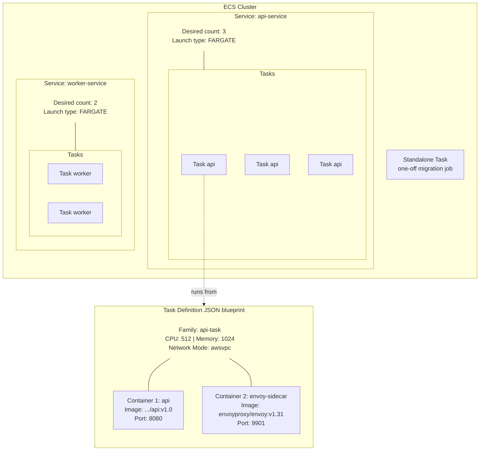
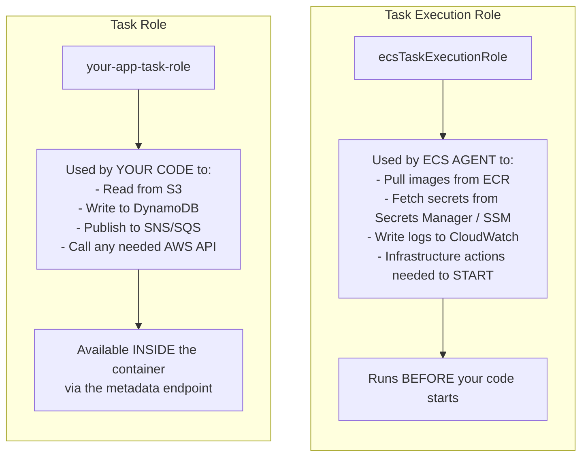
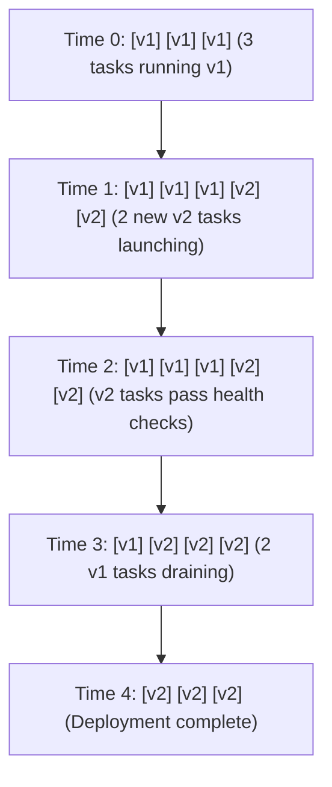
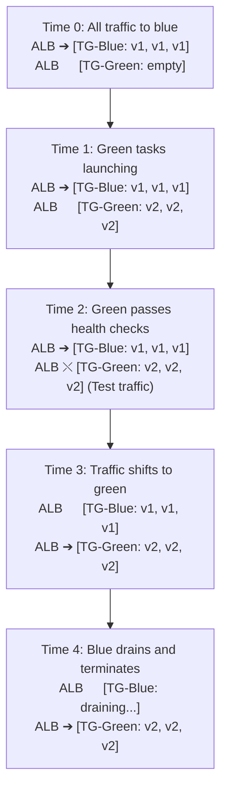

## Complexity: [COMPLEX]
## Time to Complete: 3 hours

---

## Prerequisites

Before starting this module, you should have completed:
- [Module 1.2: VPC & Networking Foundations](../module-1.2-vpc/)
- [Module 1.6: Elastic Container Registry (ECR)](../module-1.6-ecr/)
- Basic understanding of containers and Docker
- Familiarity with JSON (ECS task definitions are JSON-heavy)
- AWS CLI configured with appropriate permissions

## What You'll Be Able to Do

After completing this module, you will be able to:

- **Deploy containerized applications on ECS Fargate with task definitions, services, and load balancer integration**
- **Configure ECS service auto-scaling policies based on CPU, memory, and custom CloudWatch metrics**
- **Design ECS networking with awsvpc mode, security groups, and private subnets for production workloads**
- **Implement blue/green deployments using CodeDeploy with ECS to achieve zero-downtime releases**

---

## Why This Module Matters

In December 2020, a major US airline was running its booking system on a fleet of EC2 instances managed by a custom deployment pipeline. During a holiday travel surge, traffic spiked 3x beyond projections. The operations team scrambled to launch new instances, but the bootstrapping process -- installing dependencies, pulling container images, registering with the load balancer -- took 8 minutes per instance. For 8 minutes, customers saw timeout errors. Bookings were lost. The post-incident review estimated $2.3 million in missed revenue during that single scaling event.

They migrated to ECS on Fargate six weeks later. The next holiday surge came, and Fargate launched new containers in under 15 seconds. No EC2 instances to bootstrap. No AMIs to maintain. No capacity planning for unpredictable peaks. The traffic spike was 4x that year. Nobody noticed.

Amazon Elastic Container Service (ECS) is AWS's native container orchestration platform. If Kubernetes is the Swiss Army knife of container orchestration, ECS is a purpose-built surgical tool for running containers on AWS. It is deeply integrated with every relevant AWS service -- IAM, VPC, ALB, CloudWatch, Secrets Manager, and dozens more. Combined with Fargate (serverless compute for containers), ECS lets you focus on your application rather than the infrastructure running it.

In this module, you will learn ECS from the ground up: clusters, task definitions, services, both launch types (EC2 and Fargate), load balancer integration, IAM roles, service discovery, and debugging with ECS Exec. By the end, you will have deployed a microservice on Fargate, connected it to an Application Load Balancer, and debugged it with an interactive shell.

---

## ECS Architecture Overview

ECS has a handful of core concepts that fit together like nesting boxes. Let us walk through each one.



### Core Concepts

**Cluster**: A logical grouping of tasks and services. It is not a compute resource itself -- think of it as a namespace. You might have clusters for `production`, `staging`, and `development`.

**Task Definition**: A blueprint (JSON template) that describes how to run your containers. It specifies the Docker image, CPU/memory, port mappings, environment variables, logging, and IAM roles. Task definitions are versioned -- each update creates a new revision.

**Task**: A running instance of a task definition. One task can contain multiple containers that share the same network namespace and can communicate via `localhost`.

**Service**: A long-running configuration that maintains a desired count of tasks. If a task crashes, the service launches a replacement. Services integrate with load balancers for traffic distribution.

### EC2 Launch Type vs Fargate

This is the biggest architectural decision you will make with ECS.

| Aspect | EC2 Launch Type | Fargate Launch Type |
|--------|----------------|-------------------|
| Infrastructure | You manage EC2 instances | AWS manages compute |
| Pricing | Pay for EC2 instances (even idle capacity) | Pay per task (per-second, 1-min minimum, CPU + memory) |
| Scaling | Must scale instances AND tasks separately | Only scale tasks |
| Startup time | Seconds (on warm instances) | 45-90 seconds (cold start: microVM + ENI + image pull) |
| GPU support | Yes | No (as of 2026, use SageMaker for GPU) |
| Max task size | Limited by instance type | 16 vCPU, 120 GB memory |
| SSH access | Yes (to the EC2 host) | No (use ECS Exec) |
| Operating system patches | Your responsibility | AWS handles it |
| Cost at steady state | Cheaper for predictable, high-utilization workloads | Cheaper for variable or bursty workloads |
| Spot support | Yes (EC2 Spot instances) | Yes (Fargate Spot, 70% cheaper) |

**When to use EC2**: GPU workloads, very large containers, extreme cost optimization at high steady-state utilization, or when you need host-level access (custom kernel modules, specialized networking).

**When to use Fargate**: Everything else. Seriously. The operational overhead of managing EC2 instances is almost never worth it unless you have a specific technical reason.

---

## Task Definitions: The Container Blueprint

Task definitions are where you describe exactly how your containers should run. Let us build one step by step.

### A Production-Ready Task Definition

```json
{
  "family": "api-service",
  "networkMode": "awsvpc",
  "requiresCompatibilities": ["FARGATE"],
  "cpu": "512",
  "memory": "1024",
  "executionRoleArn": "arn:aws:iam::123456789012:role/ecsTaskExecutionRole",
  "taskRoleArn": "arn:aws:iam::123456789012:role/api-task-role",
  "containerDefinitions": [
    {
      "name": "api",
      "image": "123456789012.dkr.ecr.us-east-1.amazonaws.com/myapp/api:v1.3.0",
      "essential": true,
      "portMappings": [
        {
          "containerPort": 8080,
          "protocol": "tcp"
        }
      ],
      "environment": [
        {"name": "APP_ENV", "value": "production"},
        {"name": "LOG_LEVEL", "value": "info"}
      ],
      "secrets": [
        {
          "name": "DATABASE_URL",
          "valueFrom": "arn:aws:secretsmanager:us-east-1:123456789012:secret:prod/db-url-AbCdEf"
        },
        {
          "name": "API_KEY",
          "valueFrom": "arn:aws:ssm:us-east-1:123456789012:parameter/prod/api-key"
        }
      ],
      "logConfiguration": {
        "logDriver": "awslogs",
        "options": {
          "awslogs-group": "/ecs/api-service",
          "awslogs-region": "us-east-1",
          "awslogs-stream-prefix": "api"
        }
      },
      "healthCheck": {
        "command": ["CMD-SHELL", "curl -f http://localhost:8080/health || exit 1"],
        "interval": 30,
        "timeout": 5,
        "retries": 3,
        "startPeriod": 60
      },
      "linuxParameters": {
        "initProcessEnabled": true
      }
    }
  ],
  "runtimePlatform": {
    "cpuArchitecture": "X86_64",
    "operatingSystemFamily": "LINUX"
  }
}
```

Let us break down the key fields:

### CPU and Memory Combinations for Fargate

Fargate does not let you choose arbitrary CPU/memory combinations. Here are the valid options:

| CPU (vCPU) | Memory Options (MB) |
|------------|-------------------|
| 256 (.25 vCPU) | 512, 1024, 2048 |
| 512 (.5 vCPU) | 1024 - 4096 (in 1024 increments) |
| 1024 (1 vCPU) | 2048 - 8192 (in 1024 increments) |
| 2048 (2 vCPU) | 4096 - 16384 (in 1024 increments) |
| 4096 (4 vCPU) | 8192 - 30720 (in 1024 increments) |
| 8192 (8 vCPU) | 16384 - 61440 (in 4096 increments) |
| 16384 (16 vCPU) | 32768 - 122880 (in 8192 increments) |

> **Pause and predict**: You are migrating a legacy Java application that requires a large heap size (at least 6GB) but does very little processing (mostly waiting on database locks). You are also migrating a Node.js image processing worker that maxes out CPU but uses only 200MB of RAM. Which Fargate CPU/memory combinations would you choose for each, and why?

### IAM Roles: Execution Role vs Task Role

This is one of the most commonly confused concepts in ECS.



```bash
# Create the task execution role
aws iam create-role \
  --role-name ecsTaskExecutionRole \
  --assume-role-policy-document '{
    "Version": "2012-10-17",
    "Statement": [{
      "Effect": "Allow",
      "Principal": {"Service": "ecs-tasks.amazonaws.com"},
      "Action": "sts:AssumeRole"
    }]
  }'

# Attach the AWS managed policy for basic execution
aws iam attach-role-policy \
  --role-name ecsTaskExecutionRole \
  --policy-arn arn:aws:iam::aws:policy/service-role/AmazonECSTaskExecutionRolePolicy

# If your task uses secrets from Secrets Manager, add this:
aws iam put-role-policy \
  --role-name ecsTaskExecutionRole \
  --policy-name SecretsAccess \
  --policy-document '{
    "Version": "2012-10-17",
    "Statement": [{
      "Effect": "Allow",
      "Action": [
        "secretsmanager:GetSecretValue",
        "ssm:GetParameters"
      ],
      "Resource": [
        "arn:aws:secretsmanager:us-east-1:123456789012:secret:prod/*",
        "arn:aws:ssm:us-east-1:123456789012:parameter/prod/*"
      ]
    }]
  }'

# Create the task role (what your application code uses)
aws iam create-role \
  --role-name api-task-role \
  --assume-role-policy-document '{
    "Version": "2012-10-17",
    "Statement": [{
      "Effect": "Allow",
      "Principal": {"Service": "ecs-tasks.amazonaws.com"},
      "Action": "sts:AssumeRole"
    }]
  }'

# Add permissions your application needs
aws iam put-role-policy \
  --role-name api-task-role \
  --policy-name AppPermissions \
  --policy-document '{
    "Version": "2012-10-17",
    "Statement": [
      {
        "Effect": "Allow",
        "Action": ["s3:GetObject", "s3:PutObject"],
        "Resource": "arn:aws:s3:::my-app-bucket/*"
      },
      {
        "Effect": "Allow",
        "Action": ["dynamodb:GetItem", "dynamodb:PutItem", "dynamodb:Query"],
        "Resource": "arn:aws:dynamodb:us-east-1:123456789012:table/my-app-table"
      }
    ]
  }'
```

> **Stop and think**: You just deployed a new task. The ECS console shows the task is stuck in the `PENDING` state and eventually fails with a `CannotPullContainerError`. Later, you fix that, the container starts, but your application logs show an `AccessDenied` error when trying to write a file to an S3 bucket. Which IAM roles are misconfigured in each scenario?

### Registering the Task Definition

```bash
# Register the task definition
aws ecs register-task-definition \
  --cli-input-json file://task-definition.json

# List revisions of a task definition family
aws ecs list-task-definitions \
  --family-prefix api-service

# Describe the latest revision
aws ecs describe-task-definition \
  --task-definition api-service
```

---

## Creating Clusters and Services

### Creating an ECS Cluster

For Fargate, a cluster is just a logical namespace. No EC2 instances to provision.

```bash
# Create a cluster with Container Insights enabled
aws ecs create-cluster \
  --cluster-name production \
  --settings name=containerInsights,value=enabled \
  --configuration '{
    "executeCommandConfiguration": {
      "logging": "OVERRIDE",
      "logConfiguration": {
        "cloudWatchLogGroupName": "/ecs/exec-logs",
        "cloudWatchEncryptionEnabled": true
      }
    }
  }'
```

### Creating a Service with ALB Integration

This is where everything comes together. A service maintains your desired task count and routes traffic through a load balancer.

First, set up the ALB:

```bash
# Create an Application Load Balancer
ALB_ARN=$(aws elbv2 create-load-balancer \
  --name api-alb \
  --subnets subnet-0abc123 subnet-0def456 \
  --security-groups sg-0abc123456 \
  --scheme internet-facing \
  --type application \
  --query 'LoadBalancers[0].LoadBalancerArn' --output text)

# Create a target group (IP type for Fargate/awsvpc)
TG_ARN=$(aws elbv2 create-target-group \
  --name api-targets \
  --protocol HTTP \
  --port 8080 \
  --vpc-id vpc-0abc123 \
  --target-type ip \
  --health-check-path /health \
  --health-check-interval-seconds 15 \
  --healthy-threshold-count 2 \
  --unhealthy-threshold-count 3 \
  --query 'TargetGroups[0].TargetGroupArn' --output text)

# Create a listener
aws elbv2 create-listener \
  --load-balancer-arn ${ALB_ARN} \
  --protocol HTTP \
  --port 80 \
  --default-actions Type=forward,TargetGroupArn=${TG_ARN}
```

Now create the ECS service:

```bash
# Create the service
aws ecs create-service \
  --cluster production \
  --service-name api-service \
  --task-definition api-service:1 \
  --desired-count 3 \
  --launch-type FARGATE \
  --platform-version LATEST \
  --network-configuration '{
    "awsvpcConfiguration": {
      "subnets": ["subnet-0abc123", "subnet-0def456"],
      "securityGroups": ["sg-0abc123456"],
      "assignPublicIp": "DISABLED"
    }
  }' \
  --load-balancers '[{
    "targetGroupArn": "'"${TG_ARN}"'",
    "containerName": "api",
    "containerPort": 8080
  }]' \
  --enable-execute-command \
  --deployment-configuration '{
    "maximumPercent": 200,
    "minimumHealthyPercent": 100,
    "deploymentCircuitBreaker": {
      "enable": true,
      "rollback": true
    }
  }'
```

Let us break down the service configuration:

**`assignPublicIp: DISABLED`**: Tasks in private subnets. They reach ECR through a VPC endpoint or NAT Gateway. This is the production pattern -- in most cases, do not expose tasks directly to the internet.

**`maximumPercent: 200, minimumHealthyPercent: 100`**: During deployments, ECS can launch up to 200% of desired count (6 tasks if desired is 3) while keeping 100% healthy. This means zero-downtime rolling deployments.

**`deploymentCircuitBreaker`**: If new tasks keep failing, ECS automatically rolls back to the last working version instead of endlessly retrying. This was added in 2021 and should be enabled on every service.

**`enable-execute-command`**: Enables ECS Exec for debugging (covered later in this module).

### Service Auto Scaling

```bash
# Register the service as a scalable target
aws application-autoscaling register-scalable-target \
  --service-namespace ecs \
  --resource-id service/production/api-service \
  --scalable-dimension ecs:service:DesiredCount \
  --min-capacity 2 \
  --max-capacity 20

# Create a target tracking scaling policy based on CPU
aws application-autoscaling put-scaling-policy \
  --service-namespace ecs \
  --resource-id service/production/api-service \
  --scalable-dimension ecs:service:DesiredCount \
  --policy-name cpu-target-tracking \
  --policy-type TargetTrackingScaling \
  --target-tracking-scaling-policy-configuration '{
    "TargetValue": 60.0,
    "PredefinedMetricSpecification": {
      "PredefinedMetricType": "ECSServiceAverageCPUUtilization"
    },
    "ScaleInCooldown": 300,
    "ScaleOutCooldown": 60
  }'

# Also scale based on ALB request count
aws application-autoscaling put-scaling-policy \
  --service-namespace ecs \
  --resource-id service/production/api-service \
  --scalable-dimension ecs:service:DesiredCount \
  --policy-name requests-target-tracking \
  --policy-type TargetTrackingScaling \
  --target-tracking-scaling-policy-configuration '{
    "TargetValue": 1000.0,
    "PredefinedMetricSpecification": {
      "PredefinedMetricType": "ALBRequestCountPerTarget",
      "ResourceLabel": "app/api-alb/1234567890/targetgroup/api-targets/0987654321"
    },
    "ScaleInCooldown": 300,
    "ScaleOutCooldown": 30
  }'
```

Note the asymmetric cooldowns: 60 seconds for scale-out (react quickly to load) but 300 seconds for scale-in (avoid flapping during variable traffic).

---

## Service Discovery

ECS integrates with AWS Cloud Map for DNS-based service discovery. This allows services to find each other by name without hardcoding IP addresses or using a separate load balancer for internal communication.

```bash
# Create a Cloud Map namespace
NAMESPACE_ID=$(aws servicediscovery create-private-dns-namespace \
  --name production.internal \
  --vpc vpc-0abc123 \
  --query 'OperationId' --output text)

# Wait for the namespace to be created
aws servicediscovery get-operation --operation-id ${NAMESPACE_ID}

# Create a service discovery service
DISCOVERY_SERVICE_ID=$(aws servicediscovery create-service \
  --name api \
  --namespace-id ns-abcdef1234567890 \
  --dns-config '{
    "DnsRecords": [{"Type": "A", "TTL": 10}]
  }' \
  --health-check-custom-config FailureThreshold=1 \
  --query 'Service.Id' --output text)
```

Now create the ECS service with service discovery:

```bash
aws ecs create-service \
  --cluster production \
  --service-name api-service \
  --task-definition api-service:1 \
  --desired-count 3 \
  --launch-type FARGATE \
  --network-configuration '{
    "awsvpcConfiguration": {
      "subnets": ["subnet-0abc123", "subnet-0def456"],
      "securityGroups": ["sg-0abc123456"],
      "assignPublicIp": "DISABLED"
    }
  }' \
  --service-registries '[{
    "registryArn": "arn:aws:servicediscovery:us-east-1:123456789012:service/srv-abcdef1234567890"
  }]' \
  --enable-execute-command
```

Now any service in the VPC can reach the API at `api.production.internal`:

```bash
# From inside another container in the same VPC:
curl http://api.production.internal:8080/health
# Returns: {"status": "healthy"}

# DNS resolution returns the private IPs of running tasks:
dig api.production.internal +short
# 10.0.1.23
# 10.0.1.45
# 10.0.2.12
```

This is how microservices communicate in ECS without external load balancers for internal traffic.

---

## ECS Exec: Debugging Running Containers

ECS Exec lets you run commands inside a running Fargate container -- similar to `docker exec` or `kubectl exec`. It uses AWS Systems Manager (SSM) under the hood.

### Prerequisites for ECS Exec

Your task role needs SSM permissions, and the service must be created with `--enable-execute-command`:

```bash
# Add SSM permissions to the task role
aws iam put-role-policy \
  --role-name api-task-role \
  --policy-name ECSExecPermissions \
  --policy-document '{
    "Version": "2012-10-17",
    "Statement": [
      {
        "Effect": "Allow",
        "Action": [
          "ssmmessages:CreateControlChannel",
          "ssmmessages:CreateDataChannel",
          "ssmmessages:OpenControlChannel",
          "ssmmessages:OpenDataChannel"
        ],
        "Resource": "*"
      }
    ]
  }'
```

### Using ECS Exec

```bash
# List running tasks
aws ecs list-tasks \
  --cluster production \
  --service-name api-service

# Execute an interactive shell in a task
aws ecs execute-command \
  --cluster production \
  --task arn:aws:ecs:us-east-1:123456789012:task/production/abc123def456 \
  --container api \
  --interactive \
  --command "/bin/sh"

# Run a one-off command (non-interactive)
aws ecs execute-command \
  --cluster production \
  --task arn:aws:ecs:us-east-1:123456789012:task/production/abc123def456 \
  --container api \
  --command "cat /etc/resolv.conf"
```

### Debugging Checklist

When a container is misbehaving, here is the order of investigation:

```bash
# 1. Check service events (deployment issues, scaling events)
aws ecs describe-services \
  --cluster production \
  --services api-service \
  --query 'services[0].events[:10]'

# 2. Check task status (why did it stop?)
aws ecs describe-tasks \
  --cluster production \
  --tasks arn:aws:ecs:us-east-1:123456789012:task/production/abc123 \
  --query 'tasks[0].{Status:lastStatus,StopCode:stopCode,StopReason:stoppedReason,Containers:containers[*].{Name:name,Status:lastStatus,ExitCode:exitCode,Reason:reason}}'

# 3. Check CloudWatch logs
aws logs get-log-events \
  --log-group-name /ecs/api-service \
  --log-stream-name "api/api/abc123def456" \
  --limit 50

# 4. If the container is running, use ECS Exec to investigate
aws ecs execute-command \
  --cluster production \
  --task arn:aws:ecs:us-east-1:123456789012:task/production/abc123def456 \
  --container api \
  --interactive \
  --command "/bin/sh"

# Inside the container:
# - Check environment variables: env | sort
# - Check DNS resolution: nslookup api.production.internal
# - Check connectivity: curl -v http://dependency-service:8080/health
# - Check disk: df -h
# - Check memory: cat /proc/meminfo
# - Check processes: ps aux
```

---

## Deployment Strategies

ECS supports several deployment strategies. Understanding when to use each one prevents outages.

### Rolling Update (Default)



### Blue/Green with CodeDeploy

For production services where you want the ability to quickly roll back:

```bash
# Create a service with CODE_DEPLOY deployment controller
aws ecs create-service \
  --cluster production \
  --service-name api-service \
  --task-definition api-service:1 \
  --desired-count 3 \
  --launch-type FARGATE \
  --deployment-controller type=CODE_DEPLOY \
  --network-configuration '{
    "awsvpcConfiguration": {
      "subnets": ["subnet-0abc123", "subnet-0def456"],
      "securityGroups": ["sg-0abc123456"],
      "assignPublicIp": "DISABLED"
    }
  }' \
  --load-balancers '[{
    "targetGroupArn": "'"${TG_ARN}"'",
    "containerName": "api",
    "containerPort": 8080
  }]'
```



> **Pause and predict**: You manage a high-traffic payment processing API. A failed deployment that causes even 30 seconds of downtime will result in thousands of dropped transactions. The new version (v2) includes a subtle database connection pool bug that only manifests under high load, meaning it will pass the initial ALB health checks. If you use a Rolling Update, what will happen when v2 is deployed? How would Blue/Green mitigate this?

---

## Fargate Spot: Saving Up to 70%

Fargate Spot uses spare AWS capacity at up to 70% discount. Tasks can be interrupted with a 2-minute warning -- suitable for batch jobs, development environments, and non-critical workloads.

```bash
# Create a service with mixed Fargate and Fargate Spot
aws ecs create-service \
  --cluster production \
  --service-name worker-service \
  --task-definition worker-task:1 \
  --desired-count 5 \
  --capacity-provider-strategy '[
    {
      "capacityProvider": "FARGATE",
      "weight": 1,
      "base": 2
    },
    {
      "capacityProvider": "FARGATE_SPOT",
      "weight": 3,
      "base": 0
    }
  ]' \
  --network-configuration '{
    "awsvpcConfiguration": {
      "subnets": ["subnet-0abc123", "subnet-0def456"],
      "securityGroups": ["sg-0abc123456"],
      "assignPublicIp": "DISABLED"
    }
  }'
```

This configuration guarantees 2 tasks on regular Fargate (`base: 2`) and distributes the remaining 3 tasks with a 1:3 ratio -- roughly 1 on Fargate and 3 on Fargate Spot. For a worker service processing a queue, this is ideal: if Spot tasks are interrupted, the base tasks continue processing while replacements launch.

---

## Did You Know?

1. **ECS predates Kubernetes' public release.** Amazon launched ECS in April 2015, just months after Kubernetes 1.0 was released in July 2015. While Kubernetes won the industry mindshare war, ECS runs more containers on AWS than EKS does. Many of the largest AWS customers -- including Amazon.com itself -- use ECS internally rather than Kubernetes. AWS's own retail platform processes millions of transactions using ECS.

2. **Fargate's "serverless" containers are not actually serverless in the way Lambda is.** Each Fargate task runs on a dedicated Firecracker microVM -- the same virtualization technology that powers Lambda. Firecracker can launch a microVM in under 125 milliseconds, which is why Fargate cold starts are so fast. But unlike Lambda, Fargate tasks run continuously and you pay per-second, not per-invocation.

3. **The `awsvpc` networking mode gives every task its own ENI** (Elastic Network Interface) with a private IP address. This means security groups are applied per-task, not per-host. You can have two tasks on the same host with completely different network access rules. Before `awsvpc` (the `bridge` and `host` modes), you could not apply fine-grained network policies to individual containers, which was a serious security limitation.

4. **ECS Exec was one of the most requested features in ECS history**, with the GitHub issue gathering hundreds of thumbs-up reactions over three years before it was finally released in March 2021. Before ECS Exec, debugging a Fargate container required adding SSH servers to your container images (a terrible security practice) or relying entirely on logs. The feature uses SSM Agent embedded in the Fargate platform, so you do not need to add anything to your container image.

---

## Common Mistakes

| Mistake | Why It Happens | How to Fix It |
|---------|---------------|---------------|
| Confusing task execution role with task role | The names are similar and the documentation is not always clear | Execution role = for ECS to start your task (pull images, fetch secrets). Task role = for your application code (access S3, DynamoDB, etc.). Always create both |
| Not enabling deployment circuit breaker | It is not enabled by default | Always set `deploymentCircuitBreaker.enable: true` and `rollback: true`. Without it, a bad deployment loops forever trying to launch failing tasks |
| Using public subnets with public IPs for Fargate tasks | Seems simpler than setting up NAT Gateway or VPC endpoints | Use private subnets with either a NAT Gateway or VPC endpoints for ECR/S3/CloudWatch. Public IPs on tasks are a security risk |
| No health check in task definition | ALB health check seems sufficient | The task definition health check determines if ECS should restart the container. The ALB health check determines if the ALB routes traffic. Both are needed for reliable operation |
| Hardcoding container image tags as `latest` | Convenient during development | Use explicit version tags. With `latest`, you cannot tell what is running, cannot reproduce issues, and rollbacks do not actually roll back to the previous code |
| Not setting `linuxParameters.initProcessEnabled` | It is an obscure setting buried in the task definition | Without an init process (PID 1 signal handling), your container may not handle SIGTERM gracefully during deployments, leading to dropped connections. Usually enable it |
| Setting scale-in cooldown too low | Teams want aggressive scaling in both directions | Aggressive scale-in causes flapping during variable traffic. Set scale-out cooldown to 30-60s and scale-in cooldown to 300-600s |
| Not using Fargate Spot for non-critical workloads | Teams default to regular Fargate for everything | Use a capacity provider strategy with a `base` of regular Fargate and additional capacity on Spot. Saves 50-70% on dev/staging and batch workloads |

---

## Quiz

<details>
<summary>1. Scenario: You are migrating a monolithic application to AWS. Your team wants to run a single container for a one-off database migration script, and a fleet of 5 containers for the main web application that must automatically replace any containers that crash. How do ECS Tasks and Services map to these two requirements?</summary>

For the database migration script, you would run a standalone ECS Task. A task is simply a running instance of a task definition, perfect for one-off jobs that start, do their work, and then terminate once complete. Because you do not want the migration to run continuously or restart after it finishes successfully, a service is the wrong choice here. Conversely, for the web application, you would create an ECS Service with a desired count of 5. The service acts as an intelligent process manager that ensures exactly 5 tasks are running at all times to handle incoming traffic. By using a service, ECS integrates directly with your load balancer to distribute traffic evenly and automatically launches replacements if a task fails health checks or crashes, ensuring high availability.
</details>

<details>
<summary>2. Scenario: Your security team mandates that the `payment-processing` container must be completely isolated at the network level from the `public-api` container, even if they happen to be scheduled on the same underlying physical infrastructure. How does Fargate's `awsvpc` network mode achieve this, and what architectural constraint does this introduce?</summary>

The `awsvpc` network mode assigns each individual task its own Elastic Network Interface (ENI) with a dedicated private IP address from your VPC. This means you can attach completely different Security Groups directly to the `payment-processing` task and the `public-api` task. By doing so, you achieve strict network isolation at the ENI level regardless of where the tasks physically run, satisfying the security team's requirement. The primary architectural constraint this introduces is IP address exhaustion. Because every single task consumes an IP address from your subnet, a service scaling out to hundreds of tasks requires a VPC and subnets with a sufficiently large CIDR block (e.g., /19 or /20) to accommodate them all.
</details>

<details>
<summary>3. Scenario: You deploy a new version of your application with a misconfigured environment variable causing the container to crash immediately on startup. Your ECS service has a desired count of 4. What exactly will ECS do in response to this bad deployment if the deployment circuit breaker is NOT enabled, versus if it IS enabled?</summary>

Without the deployment circuit breaker, ECS will enter an endless loop of launching new tasks, seeing them fail health checks, stopping them, and launching more replacements indefinitely. Your service will be stuck in a "deploying" state forever, consuming resources and muddying your logs without ever stabilizing, which requires manual intervention to force a new deployment. With the circuit breaker enabled, ECS actively monitors the failure rate of the newly launched tasks during the deployment. Once a threshold of failures is reached, it automatically halts the deployment and rolls the service back to the last known healthy task definition revision. This built-in mechanism restores stability without human intervention and prevents a bad configuration from taking down your entire service.
</details>

<details>
<summary>4. Scenario: A memory leak is occurring in your production Fargate task, but it only happens after several hours of sustained traffic. The logs do not provide enough detail, and you need to run `jmap` (a Java profiling tool) inside the running container to dump the heap. How do you gain access to this container given that Fargate does not allow SSH to the host machine?</summary>

You must use ECS Exec, which leverages AWS Systems Manager (SSM) Session Manager to establish a secure WebSocket connection directly into the running container. To make this work, your task role must have the necessary `ssmmessages` IAM permissions, and your ECS service must have been created or updated with the `--enable-execute-command` flag. Once configured, you can use the AWS CLI (`aws ecs execute-command`) to drop into an interactive shell inside the container without needing an SSH server. This allows you to run your profiling tools just like you would with `docker exec`, all while maintaining a secure, centrally logged audit trail of every command executed, which is critical for compliance in production.
</details>

<details>
<summary>5. Scenario: Your company processes satellite imagery using a proprietary machine learning model that requires NVIDIA GPUs to complete processing within acceptable timeframes. At the same time, you have a lightweight Go-based API that serves the processed images to web clients with highly unpredictable traffic spikes. Which ECS launch type should you choose for each workload, and why?</summary>

For the satellite imagery processing workload, you must use the EC2 launch type because Fargate does not support GPU instances natively as of the current AWS offerings. You will need to provision EC2 instances with GPUs (like the p3 or g5 families), manage their AMIs, and register them to your ECS cluster to provide the necessary hardware acceleration. Conversely, for the Go-based API, you should use the Fargate launch type. Fargate's ability to seamlessly scale out tasks is perfect for unpredictable traffic spikes, as it abstracts away the underlying infrastructure completely. This allows you to quickly scale up to meet demand without pre-provisioning idle capacity, ensuring you pay only for the precise compute the API consumes during those bursts.
</details>

<details>
<summary>6. Scenario: You are designing the compute architecture for a system that generates end-of-month financial reports. The job takes about 45 minutes to run, is triggered asynchronously via an SQS queue, and if it fails, the system simply picks the message back up and tries again. You need to minimize AWS costs. How should you configure your ECS capacity providers for this workload?</summary>

You should run this workload entirely on Fargate Spot, which provides up to a 70% discount compared to regular Fargate pricing by utilizing spare AWS compute capacity. Because your application is driven by an SQS queue and is designed to retry automatically upon failure, it can perfectly tolerate the 2-minute interruption warning that Fargate Spot issues when AWS reclaims the capacity. If an interruption occurs, the task terminates, the SQS message visibility timeout expires, and another Spot task simply picks it up later. By setting the capacity provider strategy to use Fargate Spot exclusively for this specific worker service, you achieve massive cost savings without risking data loss. This perfectly aligns with the architectural best practice of matching fault-tolerant, asynchronous background jobs to deeply discounted, interruptible compute.
</details>

---

## Hands-On Exercise: Deploy a Microservice on Fargate

In this exercise, you will deploy a containerized API service on ECS Fargate, connect it to an Application Load Balancer, and debug it with ECS Exec.

### Setup

You need a VPC with public and private subnets, an ECR repository with a pushed image, and the IAM roles created earlier in this module.

```bash
# Set your variables (replace with your actual values)
export CLUSTER_NAME="kubedojo-exercise"
export VPC_ID="vpc-0abc123"
export PRIVATE_SUBNET_1="subnet-0abc123"
export PRIVATE_SUBNET_2="subnet-0def456"
export PUBLIC_SUBNET_1="subnet-0ghi789"
export PUBLIC_SUBNET_2="subnet-0jkl012"
export ACCOUNT_ID=$(aws sts get-caller-identity --query Account --output text)
export REGION="us-east-1"
export REGISTRY="${ACCOUNT_ID}.dkr.ecr.${REGION}.amazonaws.com"
```

### Task 1: Create the ECS Cluster

<details>
<summary>Solution</summary>

```bash
aws ecs create-cluster \
  --cluster-name ${CLUSTER_NAME} \
  --settings name=containerInsights,value=enabled \
  --configuration '{
    "executeCommandConfiguration": {
      "logging": "DEFAULT"
    }
  }'

# Verify
aws ecs describe-clusters --clusters ${CLUSTER_NAME} \
  --query 'clusters[0].{Name:clusterName,Status:status,Settings:settings}'
```
</details>

### Task 2: Create a Security Group and ALB

<details>
<summary>Solution</summary>

```bash
# Create security group for the ALB (allows inbound HTTP)
ALB_SG=$(aws ec2 create-security-group \
  --group-name ecs-alb-sg \
  --description "Security group for ECS ALB" \
  --vpc-id ${VPC_ID} \
  --query 'GroupId' --output text)

aws ec2 authorize-security-group-ingress \
  --group-id ${ALB_SG} \
  --protocol tcp --port 80 --cidr 0.0.0.0/0

# Create security group for tasks (allows inbound from ALB only)
TASK_SG=$(aws ec2 create-security-group \
  --group-name ecs-tasks-sg \
  --description "Security group for ECS tasks" \
  --vpc-id ${VPC_ID} \
  --query 'GroupId' --output text)

aws ec2 authorize-security-group-ingress \
  --group-id ${TASK_SG} \
  --protocol tcp --port 8080 --source-group ${ALB_SG}

# Create the ALB
ALB_ARN=$(aws elbv2 create-load-balancer \
  --name ecs-exercise-alb \
  --subnets ${PUBLIC_SUBNET_1} ${PUBLIC_SUBNET_2} \
  --security-groups ${ALB_SG} \
  --scheme internet-facing \
  --type application \
  --query 'LoadBalancers[0].LoadBalancerArn' --output text)

# Create target group
TG_ARN=$(aws elbv2 create-target-group \
  --name ecs-exercise-targets \
  --protocol HTTP \
  --port 8080 \
  --vpc-id ${VPC_ID} \
  --target-type ip \
  --health-check-path /health \
  --health-check-interval-seconds 15 \
  --healthy-threshold-count 2 \
  --query 'TargetGroups[0].TargetGroupArn' --output text)

# Create listener
aws elbv2 create-listener \
  --load-balancer-arn ${ALB_ARN} \
  --protocol HTTP --port 80 \
  --default-actions Type=forward,TargetGroupArn=${TG_ARN}

# Get the ALB DNS name
ALB_DNS=$(aws elbv2 describe-load-balancers \
  --load-balancer-arns ${ALB_ARN} \
  --query 'LoadBalancers[0].DNSName' --output text)

echo "ALB DNS: ${ALB_DNS}"
```
</details>

### Task 3: Register a Task Definition and Create the Service

<details>
<summary>Solution</summary>

```bash
# Create the task definition file
cat > /tmp/task-def.json <<EOF
{
  "family": "ecs-exercise",
  "networkMode": "awsvpc",
  "requiresCompatibilities": ["FARGATE"],
  "cpu": "256",
  "memory": "512",
  "executionRoleArn": "arn:aws:iam::${ACCOUNT_ID}:role/ecsTaskExecutionRole",
  "taskRoleArn": "arn:aws:iam::${ACCOUNT_ID}:role/api-task-role",
  "containerDefinitions": [
    {
      "name": "api",
      "image": "${REGISTRY}/kubedojo/ecr-exercise:v1.0.0",
      "essential": true,
      "portMappings": [
        {"containerPort": 8080, "protocol": "tcp"}
      ],
      "environment": [
        {"name": "APP_ENV", "value": "exercise"}
      ],
      "logConfiguration": {
        "logDriver": "awslogs",
        "options": {
          "awslogs-group": "/ecs/ecs-exercise",
          "awslogs-region": "${REGION}",
          "awslogs-stream-prefix": "api",
          "awslogs-create-group": "true"
        }
      },
      "healthCheck": {
        "command": ["CMD-SHELL", "curl -f http://localhost:8080/health || exit 1"],
        "interval": 30,
        "timeout": 5,
        "retries": 3,
        "startPeriod": 30
      },
      "linuxParameters": {
        "initProcessEnabled": true
      }
    }
  ]
}
EOF

# Register the task definition
aws ecs register-task-definition --cli-input-json file:///tmp/task-def.json

# Create the service
aws ecs create-service \
  --cluster ${CLUSTER_NAME} \
  --service-name api-service \
  --task-definition ecs-exercise:1 \
  --desired-count 2 \
  --launch-type FARGATE \
  --network-configuration '{
    "awsvpcConfiguration": {
      "subnets": ["'"${PRIVATE_SUBNET_1}"'", "'"${PRIVATE_SUBNET_2}"'"],
      "securityGroups": ["'"${TASK_SG}"'"],
      "assignPublicIp": "DISABLED"
    }
  }' \
  --load-balancers '[{
    "targetGroupArn": "'"${TG_ARN}"'",
    "containerName": "api",
    "containerPort": 8080
  }]' \
  --enable-execute-command \
  --deployment-configuration '{
    "maximumPercent": 200,
    "minimumHealthyPercent": 100,
    "deploymentCircuitBreaker": {"enable": true, "rollback": true}
  }'
```
</details>

### Task 4: Verify the Deployment and Test the Endpoint

<details>
<summary>Solution</summary>

```bash
# Wait for the service to stabilize
aws ecs wait services-stable \
  --cluster ${CLUSTER_NAME} \
  --services api-service

# Check service status
aws ecs describe-services \
  --cluster ${CLUSTER_NAME} \
  --services api-service \
  --query 'services[0].{DesiredCount:desiredCount,RunningCount:runningCount,Status:status,Events:events[:3]}'

# Test the endpoint through the ALB
curl http://${ALB_DNS}/
curl http://${ALB_DNS}/health
```
</details>

### Task 5: Debug with ECS Exec

Use ECS Exec to get an interactive shell inside a running task.

<details>
<summary>Solution</summary>

```bash
# Get a running task ARN
TASK_ARN=$(aws ecs list-tasks \
  --cluster ${CLUSTER_NAME} \
  --service-name api-service \
  --query 'taskArns[0]' --output text)

# Start an interactive shell
aws ecs execute-command \
  --cluster ${CLUSTER_NAME} \
  --task ${TASK_ARN} \
  --container api \
  --interactive \
  --command "/bin/sh"

# Inside the container, try:
# env | sort          # Check environment variables
# curl localhost:8080/health  # Test health endpoint locally
# cat /etc/resolv.conf        # Check DNS configuration
# exit                        # Leave the container
```
</details>

### Task 6: Configure Service Auto Scaling

Configure the service to automatically scale out when average CPU utilization exceeds 50%.

<details>
<summary>Solution</summary>

```bash
# Register the service as a scalable target (min 2, max 6 tasks)
aws application-autoscaling register-scalable-target \
  --service-namespace ecs \
  --resource-id service/${CLUSTER_NAME}/api-service \
  --scalable-dimension ecs:service:DesiredCount \
  --min-capacity 2 \
  --max-capacity 6

# Create a target tracking scaling policy for CPU
aws application-autoscaling put-scaling-policy \
  --service-namespace ecs \
  --resource-id service/${CLUSTER_NAME}/api-service \
  --scalable-dimension ecs:service:DesiredCount \
  --policy-name cpu-scaling \
  --policy-type TargetTrackingScaling \
  --target-tracking-scaling-policy-configuration '{
    "TargetValue": 50.0,
    "PredefinedMetricSpecification": {
      "PredefinedMetricType": "ECSServiceAverageCPUUtilization"
    },
    "ScaleInCooldown": 300,
    "ScaleOutCooldown": 60
  }'

# Describe the policy to verify
aws application-autoscaling describe-scaling-policies \
  --service-namespace ecs \
  --resource-id service/${CLUSTER_NAME}/api-service
```
</details>

### Task 7: Prepare for Blue/Green Deployments

To perform a CodeDeploy Blue/Green deployment, you need a secondary Target Group and a CodeDeploy Application setup.

<details>
<summary>Solution</summary>

```bash
# Create a second target group for Green deployments
TG_GREEN_ARN=$(aws elbv2 create-target-group \
  --name ecs-exercise-targets-green \
  --protocol HTTP \
  --port 8080 \
  --vpc-id ${VPC_ID} \
  --target-type ip \
  --health-check-path /health \
  --health-check-interval-seconds 15 \
  --healthy-threshold-count 2 \
  --query 'TargetGroups[0].TargetGroupArn' --output text)

# Create CodeDeploy Service Role
cat > /tmp/cd-trust.json <<EOF
{
  "Version": "2012-10-17",
  "Statement": [
    {
      "Effect": "Allow",
      "Principal": {"Service": "codedeploy.amazonaws.com"},
      "Action": "sts:AssumeRole"
    }
  ]
}
EOF

CD_ROLE_ARN=$(aws iam create-role --role-name ECSCodeDeployRole --assume-role-policy-document file:///tmp/cd-trust.json --query 'Role.Arn' --output text)
aws iam attach-role-policy --role-name ECSCodeDeployRole --policy-arn arn:aws:iam::aws:policy/AWSCodeDeployRoleForECS

# Create CodeDeploy Application
aws deploy create-application \
  --application-name ecs-exercise-app \
  --compute-platform ECS

# Create Deployment Group for Blue/Green
LISTENER_ARN=$(aws elbv2 describe-listeners --load-balancer-arn ${ALB_ARN} --query 'Listeners[0].ListenerArn' --output text)

aws deploy create-deployment-group \
  --application-name ecs-exercise-app \
  --deployment-group-name ecs-exercise-dg \
  --service-role-arn ${CD_ROLE_ARN} \
  --deployment-style deploymentType=BLUE_GREEN,deploymentOption=WITH_TRAFFIC_CONTROL \
  --blue-green-deployment-configuration '{
    "terminateBlueInstancesOnDeploymentSuccess": {
      "action": "TERMINATE",
      "terminationWaitTimeInMinutes": 5
    },
    "deploymentReadyOption": {
      "actionOnTimeout": "CONTINUE_DEPLOYMENT"
    }
  }' \
  --load-balancer-info '{
    "targetGroupPairInfoList": [{
      "targetGroups": [{"name": "ecs-exercise-targets"}, {"name": "ecs-exercise-targets-green"}],
      "prodTrafficRoute": {"listenerArns": ["'"${LISTENER_ARN}"'"]}
    }]
  }' \
  --ecs-services '[{"serviceName": "api-service", "clusterName": "'"${CLUSTER_NAME}"'"}]'
```
</details>

### Task 8: Clean Up

<details>
<summary>Solution</summary>

```bash
# Delete CodeDeploy resources
aws deploy delete-deployment-group --application-name ecs-exercise-app --deployment-group-name ecs-exercise-dg
aws deploy delete-application --application-name ecs-exercise-app
aws iam detach-role-policy --role-name ECSCodeDeployRole --policy-arn arn:aws:iam::aws:policy/AWSCodeDeployRoleForECS
aws iam delete-role --role-name ECSCodeDeployRole

# Scale down the service (this also deletes associated auto-scaling policies)
aws ecs update-service \
  --cluster ${CLUSTER_NAME} \
  --service api-service \
  --desired-count 0

# Wait for tasks to drain
aws ecs wait services-stable \
  --cluster ${CLUSTER_NAME} \
  --services api-service

# Delete the service
aws ecs delete-service \
  --cluster ${CLUSTER_NAME} \
  --service api-service \
  --force

# Delete the cluster
aws ecs delete-cluster --cluster ${CLUSTER_NAME}

# Delete ALB resources
aws elbv2 delete-listener \
  --listener-arn $(aws elbv2 describe-listeners \
    --load-balancer-arn ${ALB_ARN} \
    --query 'Listeners[0].ListenerArn' --output text)

aws elbv2 delete-target-group --target-group-arn ${TG_ARN}
aws elbv2 delete-target-group --target-group-arn ${TG_GREEN_ARN}
aws elbv2 delete-load-balancer --load-balancer-arn ${ALB_ARN}

# Delete security groups (wait for ALB to fully delete first)
echo "Waiting 30 seconds for ALB to release ENIs..."
sleep 30
aws ec2 delete-security-group --group-id ${TASK_SG}
aws ec2 delete-security-group --group-id ${ALB_SG}

# Deregister task definitions
aws ecs deregister-task-definition --task-definition ecs-exercise:1

echo "Cleanup complete"
```
</details>

### Success Criteria

- [ ] ECS cluster created with Container Insights enabled
- [ ] ALB created with proper security groups (ALB public, tasks private)
- [ ] Task definition registered with health check and logging
- [ ] Service running with 2 healthy tasks behind the ALB
- [ ] HTTP requests through ALB return expected responses
- [ ] ECS Exec provides interactive shell access to running containers
- [ ] Auto Scaling policies applied to the ECS service
- [ ] CodeDeploy Application and Deployment Group created with dual Target Groups
- [ ] All resources cleaned up

---

## Next Module

Next up: **[Module 1.8: AWS Lambda & Serverless Patterns](../module-1.8-lambda/)** -- Move beyond always-on containers to event-driven computing. You will learn Lambda's execution model, triggers, cold starts, Step Functions for orchestration, and build an S3-triggered image processing pipeline.

## Sources

- [AWS Fargate for Amazon ECS](https://docs.aws.amazon.com/AmazonECS/latest/developerguide/AWS_Fargate.html) — Authoritative overview of Fargate capabilities, Spot behavior, platform versions, and load balancing requirements.
- [Amazon ECS Task Networking Options for Fargate](https://docs.aws.amazon.com/AmazonECS/latest/developerguide/fargate-task-networking.html) — Covers ENIs, private IPs, public IP assignment, NAT gateways, and VPC endpoint patterns.
- [Monitor Amazon ECS Containers with ECS Exec](https://docs.aws.amazon.com/AmazonECS/latest/developerguide/ecs-exec.html) — Explains ECS Exec architecture, prerequisites, IAM implications, logging, and operational limits.
- [CodeDeploy Blue/Green Deployments for Amazon ECS](https://docs.aws.amazon.com/AmazonECS/latest/developerguide/deployment-type-bluegreen.html) — Details the ECS blue/green model, target-group requirements, listener setup, and deployment behavior.
