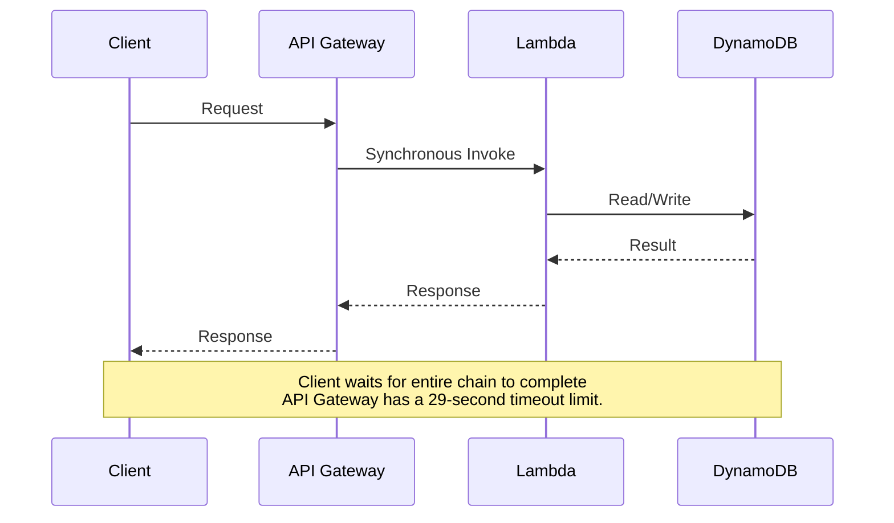
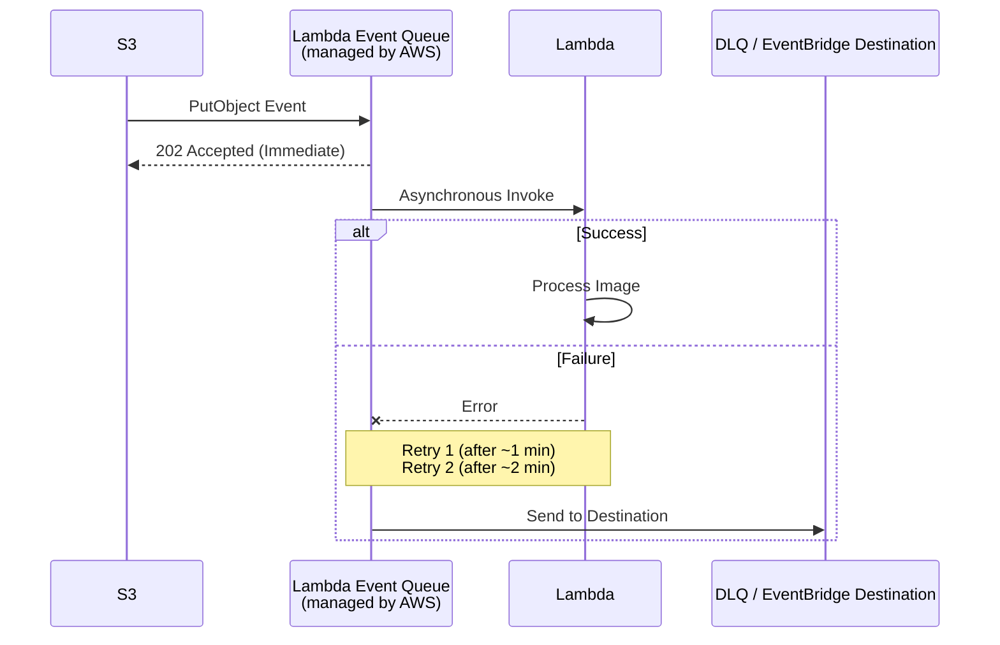
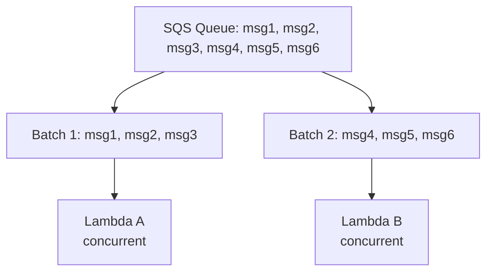
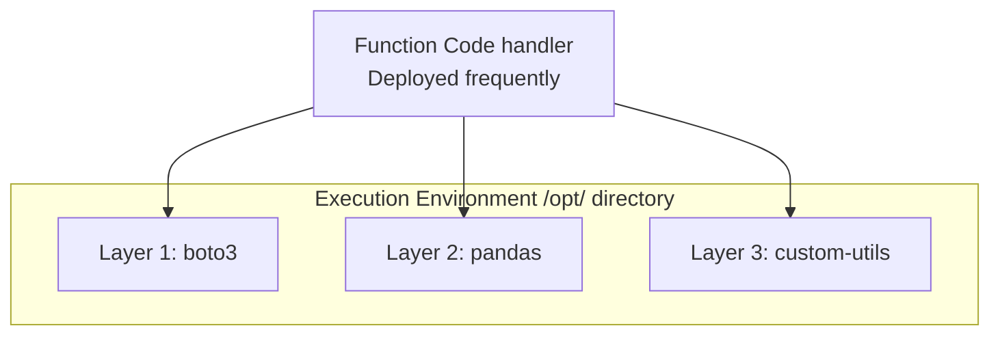
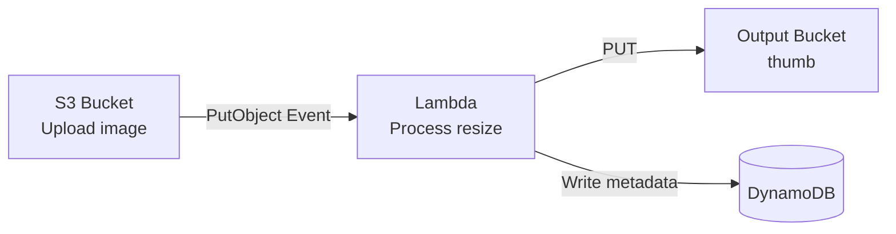
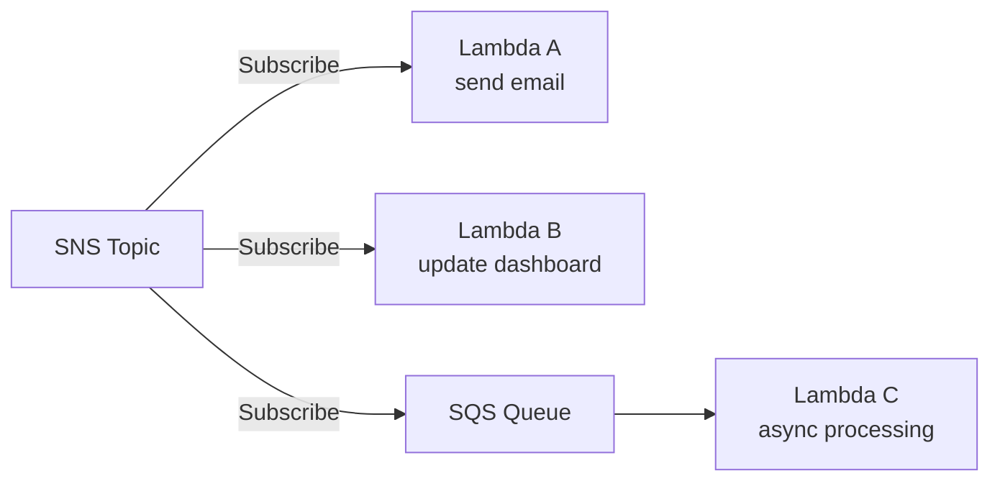
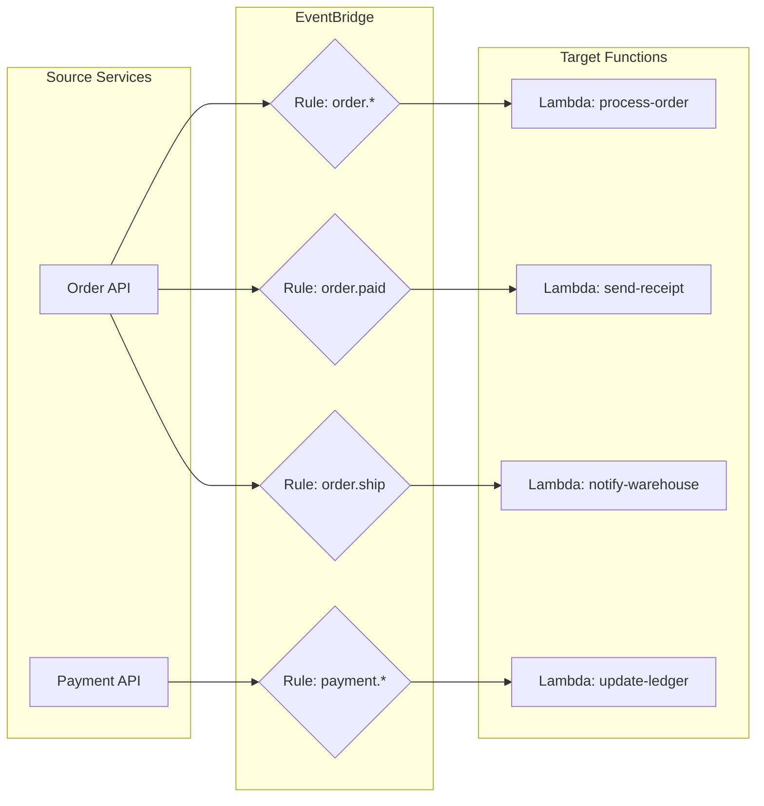

## Complexity: [MEDIUM]
## Time to Complete: 2 hours

---

## Prerequisites

Before starting this module, you should have completed:
- [Module 1.1: IAM & Security Foundations](../module-1.1-iam/)
- [Module 1.4: S3 & Storage Fundamentals](../module-1.4-s3/)
- Basic Python or Node.js knowledge (Lambda examples use Python)
- AWS CLI configured with appropriate permissions

## What You'll Be Able to Do

After completing this module, you will be able to:

- **Design** event-driven architectures leveraging Lambda event source mappings for S3, SQS, API Gateway, and EventBridge.
- **Diagnose** and mitigate Lambda cold start performance issues by configuring provisioned concurrency, memory allocation, and optimal runtimes.
- **Implement** resilient serverless processing pipelines incorporating dead-letter queues, Step Functions, and robust error handling patterns.
- **Evaluate** the architectural trade-offs between AWS Lambda and containerized workloads (ECS/EKS) based on cost, latency, and operational complexity.

---

## Why This Module Matters

In 2019, a global ride-sharing decacorn faced a catastrophic scaling wall. They were processing GPS telemetry data from over 50,000 drivers concurrently. About once per second, each driver's smartphone transmitted a location update. That amounted to 50,000 events per second, characterized by massive, unpredictable spikes during rush hours, storms, or special events, and plummeting to near-zero traffic in the dead of night. To handle this influx, they initially provisioned a massive fleet of 200 EC2 instances, relying on auto-scaling groups to fluctuate capacity based on CPU utilization metrics. 

The fundamental problem was the velocity of scaling. EC2 auto-scaling was perpetually three to four minutes behind the actual load curve. When a sudden rush hour surge hit, requests queued up across the network, and the ingested location data became inherently stale. For riders, this meant highly inaccurate ETAs and app interfaces where drivers appeared to jump entire blocks at a time. During off-peak hours, the company was hemorrhaging capital, paying thousands of dollars for powerful instances that sat practically idle. The financial impact was millions of dollars wasted annually on over-provisioned idle compute, coupled with an unquantifiable loss of customer trust due to degraded application performance during peak demand.

They engineered a complete paradigm shift by replacing their cumbersome server-based ingestion layer with AWS Lambda functions triggered directly by Amazon Kinesis data streams. Each incoming batch of GPS events quickly triggered a corresponding Lambda invocation. During rush hour, AWS automatically spun up tens of thousands of concurrent Lambda execution environments in a matter of milliseconds. At 3 AM, the infrastructure footprint dynamically shrank to near zero. Scaling became instantaneous and perfectly matched to the actual load curve. Their infrastructure compute bill plummeted by 62% because they eradicated idle resources entirely. AWS Lambda, launched in 2014, fundamentally altered cloud engineering by proving that engineering teams should focus exclusively on writing business logic while the cloud provider manages provisioning, scaling, patching, and high availability. In this module, you will master the mechanics of Lambda, advanced event-driven orchestration, and the structural strategies necessary to build highly resilient, production-grade serverless pipelines.

---

## The Execution Environment Lifecycle

AWS Lambda's execution model is fundamentally different from traditional containers or persistent virtual machines. Understanding this underlying lifecycle is absolutely essential for writing effective, performant serverless applications.

When an event triggers a Lambda function, AWS must allocate an execution environment, download your code, and start the runtime. This process is known as the lifecycle.

```mermaid
graph TD
    A[Request 1 (Cold Start)] --> B[INIT Phase<br><i>(billed as part of invocation duration)</i><br>Download code -> Start runtime -> Run init code<br>Extension init -> Runtime init -> Function init<br>~100ms-10s depending on language, package size, VPC]
    B --> C[INVOKE Phase<br><i>(billed per invocation)</i><br>Run handler function -> Return response<br>This is your actual code executing]

    C --> D[Request 2 (Warm Start - same environment reused)]
    D --> E[INVOKE Phase only<br><i>(no INIT)</i><br>Run handler function -> Return response<br>Init code NOT re-executed, connections reused]

    E --> F[Request 3 (Warm Start - reused again)]
    F --> G[INVOKE Phase only<br>Run handler function -> Return response]

    G -- "..." --> H[Environment stays warm for 5-15 minutes of inactivity]
    H --> I[Request N (after idle timeout - Cold Start again)]
    I --> J[INIT Phase<br>Download code -> Start runtime -> Run init code]
    J --> K[INVOKE Phase<br>Run handler function -> Return response]
```

The critical insight to glean from this architecture: code placed outside your primary handler function runs exactly once per cold start, and is then preserved and reused across all subsequent invocations routed to that specific execution environment. This is precisely where you should initialize heavy database connections, load external configurations, and import massive dependency libraries.

> **Stop and think**: How might this affect your approach to handling environment variables or API keys in a Lambda function?

### The Restaurant Kitchen Analogy

Think of a Lambda execution environment like a restaurant kitchen. When a customer orders a meal (an incoming event) and the kitchen is currently closed, the chefs must unlock the doors, turn on the ovens, prep their stations, and organize their ingredients. This is the **INIT phase** (the cold start), and it inherently takes time. Once the kitchen is fully prepped, the chefs cook the meal, representing the **INVOKE phase**. 

If another order comes in immediately after, the kitchen is already hot and the chefs are at their stations. They can skip the prep and go straight to cooking. This is a **Warm Start**, where only the INVOKE phase occurs. However, if no new orders arrive for a prolonged period, the restaurant manager sends the staff home and turns off the ovens to save on operating costs. The next order will trigger another cold start.

One of the most insidious bugs encountered in serverless applications involves developers initializing heavy dependencies inside the handler. Imagine a scenario where a developer accidentally instantiated a 500MB machine learning model inside the handler function. Every single API request forced the Lambda environment to reload the massive model from disk into memory. The API latency consistently hovered around eight seconds, and AWS costs skyrocketed due to the billed execution duration. Simply moving the model initialization outside the handler function reduced the P90 latency to under 200 milliseconds.

```python
# lambda_function.py

import boto3
import json
import os

# INIT CODE - runs once per cold start, reused across invocations
# Put expensive initialization HERE
dynamodb = boto3.resource('dynamodb')
table = dynamodb.Table(os.environ['TABLE_NAME'])
print("Cold start: initialized DynamoDB client")

def handler(event, context):
    """
    HANDLER CODE - runs on every invocation
    Keep this lean and fast
    """
    # The 'table' variable is already initialized from the cold start
    response = table.get_item(Key={'id': event['id']})

    return {
        'statusCode': 200,
        'body': json.dumps(response.get('Item', {}))
    }
```

---

## Execution Limits and Configuration

Before diving into trigger mechanisms, you must understand the hard and soft constraints AWS imposes on Lambda environments. Architecting within these boundaries is a core competency of serverless design.

### Lambda Execution Limits

| Limit | Value | Can Be Increased? |
|-------|-------|-------------------|
| Max execution time | 15 minutes | No (hard limit) |
| Memory allocation | 128 MB - 10,240 MB | No (choose within range) |
| vCPU | Proportional to memory (1,769 MB = 1 vCPU) | No |
| Ephemeral storage (/tmp) | 512 MB - 10,240 MB | Configurable |
| Deployment package (zip) | 50 MB (250 MB unzipped) | No |
| Container image size | 10 GB | No |
| Concurrent executions | 1,000 per region (default) | Yes (up to tens of thousands) |
| Burst concurrency | 500-3,000 (varies by region) | No |
| Environment variables | 4 KB total | No |
| Layers | 5 layers per function | No |

The memory-to-CPU relationship is the most crucial detail in this matrix. AWS Lambda does not allow you to configure CPU allocation independently. At 1,769 MB of memory, you are guaranteed exactly one full vCPU. At 128 MB, you receive only a microscopic fraction of a vCPU. Workloads that are inherently CPU-bound, such as complex image processing, cryptography, or heavy data transformations, require significantly higher memory allocations even if they consume very little actual RAM, simply because they require the computational power that scales linearly with the memory setting.

---

## Event Sources and Invocation Models

Lambda functions are entirely event-driven; they do not simply run autonomously. They must be explicitly triggered by events generated by other AWS services or external HTTP requests. Understanding the nuances of these trigger patterns is essential for designing resilient asynchronous architectures.

> **Pause and predict**: How can you leverage different AWS services to trigger your Lambda functions and build robust event-driven systems?

### Synchronous Invocations

In a synchronous invocation, the upstream caller waits actively for the Lambda function to finish executing and return a response. Any operational errors or timeouts are returned directly to the calling client.



A classic war story involving synchronous invocations revolves around API Gateway timeouts. A payment processing API utilized a synchronous API Gateway trigger to invoke a Lambda function. The Lambda function reached out to a legacy banking mainframe that occasionally required over thirty seconds to respond under heavy load. Because API Gateway imposes a hard, unchangeable 29-second timeout limit, downstream clients began receiving 504 Gateway Timeout errors, even though the backend Lambda function (which was configured with a 60-second timeout) eventually succeeded in processing the transaction. This mismatch resulted in confused users retrying their purchases and being charged twice. Synchronous serverless architectures demand strict alignment of timeouts across the entire interconnected stack.

```bash
# Create a Lambda function
aws lambda create-function \
  --function-name api-handler \
  --runtime python3.12 \
  --role arn:aws:iam::123456789012:role/lambda-execution-role \
  --handler lambda_function.handler \
  --zip-file fileb://function.zip \
  --timeout 30 \
  --memory-size 256

# Invoke synchronously (RequestResponse)
aws lambda invoke \
  --function-name api-handler \
  --invocation-type RequestResponse \
  --payload '{"id": "user-123"}' \
  response.json

cat response.json
```

### Asynchronous Invocations

In asynchronous invocations, the caller transmits the event payload and immediately receives a `202 Accepted` HTTP status code. The Lambda service internal queue processes the event in the background, utilizing built-in retry logic (typically two retries by default) if the function encounters an error.



```bash
# Configure async invocation settings
aws lambda put-function-event-invoke-config \
  --function-name image-processor \
  --maximum-retry-attempts 2 \
  --maximum-event-age-in-seconds 3600 \
  --destination-config '{
    "OnSuccess": {
      "Destination": "arn:aws:sqs:us-east-1:123456789012:success-queue"
    },
    "OnFailure": {
      "Destination": "arn:aws:sqs:us-east-1:123456789012:dead-letter-queue"
    }
  }'
```

### Stream-Based (Polling) Invocations

Stream-based triggers operate differently. The Lambda service internally polls a designated data stream or queue (such as Kinesis, DynamoDB Streams, or SQS) and processes the incoming records in configurable batches.



```bash
# Create an SQS trigger for Lambda
aws lambda create-event-source-mapping \
  --function-name order-processor \
  --event-source-arn arn:aws:sqs:us-east-1:123456789012:orders-queue \
  --batch-size 10 \
  --maximum-batching-window-in-seconds 5 \
  --function-response-types ReportBatchItemFailures
```

### Trigger Pattern Reference

| Trigger Source | Invocation Type | Retry Behavior | Common Use Case |
|---------------|----------------|----------------|-----------------|
| API Gateway | Synchronous | Caller retries | REST APIs, webhooks |
| ALB | Synchronous | Caller retries | HTTP services behind ALB |
| S3 Events | Asynchronous | 2 retries + DLQ | File processing pipelines |
| EventBridge | Asynchronous | 2 retries + DLQ | Event-driven microservices |
| SNS | Asynchronous | 2 retries + DLQ | Fan-out notifications |
| SQS | Polling | Message returns to queue | Queue processing, decoupling |
| Kinesis | Polling | Retries until data expires | Real-time stream processing |
| DynamoDB Streams | Polling | Retries until data expires | Change data capture (CDC) |
| CloudWatch Events | Asynchronous | 2 retries | Scheduled tasks (cron) |
| Cognito | Synchronous | No retry | Auth triggers |

---

## Cold Starts, Optimization, and Layers

Cold starts are frequently cited as AWS Lambda's primary drawback. However, by understanding the underlying mechanics, you can heavily mitigate their impact on production latency.

> **Pause and predict**: Based on what you know about Lambda's execution environment, what strategies do you think might help reduce cold start times?

### Cold Start Duration by Runtime

| Runtime | Typical Cold Start | With VPC | With Provisioned Concurrency |
|---------|-------------------|----------|------------------------------|
| Python 3.12 | 150-400 ms | 200-500 ms | ~0 ms (warm) |
| Node.js 20 | 150-350 ms | 200-500 ms | ~0 ms (warm) |
| Java 21 | 800-3000 ms | 1000-4000 ms | ~0 ms (warm) |
| .NET 8 | 400-900 ms | 500-1200 ms | ~0 ms (warm) |
| Go (AL2023) | 80-200 ms | 100-300 ms | ~0 ms (warm) |
| Rust (AL2023) | 50-150 ms | 80-250 ms | ~0 ms (warm) |
| Container image | 500-5000 ms | 600-6000 ms | ~0 ms (warm) |

Historically, attaching a Lambda function to an Amazon VPC introduced brutal cold starts, frequently adding eight to twelve seconds of latency while an Elastic Network Interface (ENI) was dynamically provisioned. With the introduction of Hyperplane ENIs in 2019, VPC cold starts now add a negligible 50 to 200 milliseconds. VPC attachment is no longer a valid reason to avoid serverless architectures.

### Minimizing Cold Starts

**1. Optimize the Deployment Package**

Bloated deployment packages drastically increase the duration of the INIT phase because the Lambda microVM must download and uncompress a massive payload before execution begins.

```bash
# Bad: 250 MB package with everything
pip install boto3 pandas numpy scipy scikit-learn -t .
# This includes hundreds of MB of unused code

# Better: Only install what you need
pip install boto3 -t .  # boto3 is actually pre-installed in Lambda runtime

# Best: Use Lambda Layers for shared dependencies
# Your function package stays tiny, dependencies are in layers
```

**2. Optimize Initialization Logic**

```python
# BAD: Connection created on every invocation
def handler(event, context):
    import boto3  # Import on every call
    client = boto3.client('s3')  # New client on every call
    return client.get_object(Bucket='my-bucket', Key=event['key'])

# GOOD: Connection created once, reused
import boto3  # Import once at cold start
client = boto3.client('s3')  # Client created once

def handler(event, context):
    return client.get_object(Bucket='my-bucket', Key=event['key'])
```

**3. Leverage Provisioned Concurrency**

For latency-sensitive, user-facing APIs where P99 performance is critical, Provisioned Concurrency guarantees that a specified number of execution environments remain constantly initialized and warm.

```bash
# Provision 10 warm environments for the production alias
aws lambda put-provisioned-concurrency-config \
  --function-name api-handler \
  --qualifier production \
  --provisioned-concurrent-executions 10

# Check provisioned concurrency status
aws lambda get-provisioned-concurrency-config \
  --function-name api-handler \
  --qualifier production

# Use Application Auto Scaling to adjust provisioned concurrency
aws application-autoscaling register-scalable-target \
  --service-namespace lambda \
  --resource-id function:api-handler:production \
  --scalable-dimension lambda:function:ProvisionedConcurrency \
  --min-capacity 5 \
  --max-capacity 50

aws application-autoscaling put-scaling-policy \
  --service-namespace lambda \
  --resource-id function:api-handler:production \
  --scalable-dimension lambda:function:ProvisionedConcurrency \
  --policy-name utilization-tracking \
  --policy-type TargetTrackingScaling \
  --target-tracking-scaling-policy-configuration '{
    "TargetValue": 0.7,
    "PredefinedMetricSpecification": {
      "PredefinedMetricType": "LambdaProvisionedConcurrencyUtilization"
    }
  }'
```

Provisioned concurrency incurs continuous costs because you pay for the warm execution environments even when they are idle. It should be applied strategically to user-facing paths rather than backend asynchronous processing.

### Lambda Layers

Lambda Layers empower you to package shared runtime dependencies independently from your core function code. This architectural pattern drastically reduces your deployment package size and enables the seamless sharing of common corporate libraries across hundreds of individual functions.



```bash
# Create a layer with Python dependencies
mkdir -p python-layer/python
pip install requests pillow -t python-layer/python/
cd python-layer && zip -r ../my-layer.zip python/

# Publish the layer
LAYER_ARN=$(aws lambda publish-layer-version \
  --layer-name common-dependencies \
  --zip-file fileb://my-layer.zip \
  --compatible-runtimes python3.12 \
  --compatible-architectures x86_64 arm64 \
  --query 'LayerVersionArn' --output text)

echo "Layer ARN: ${LAYER_ARN}"

# Add the layer to a function
aws lambda update-function-configuration \
  --function-name image-processor \
  --layers ${LAYER_ARN}
```

> **Pause and predict**: Considering the deployment package limits and the nature of different applications, when would you choose Lambda Layers over a Container Image for your function?

### When to Use Layers vs. Container Images

| Approach | Best For | Limits |
|----------|---------|--------|
| Zip package only | Simple functions < 50 MB | 50 MB zipped, 250 MB unzipped |
| Zip + Layers | Shared dependencies, moderate size | 5 layers, 250 MB total unzipped |
| Container Image | Large dependencies (ML models, binaries) | 10 GB image size |

For any workload necessitating machine learning frameworks like PyTorch or TensorFlow, complex scientific computing packages, or custom compiled system binaries, Container Images are the definitive solution. The 10 GB upper limit provides ample runway for enterprise-scale dependencies.

---

## Orchestrating Complexity with Step Functions

When the logic of a single Lambda function expands beyond simple transformations, developers often attempt to chain multiple functions together. AWS Step Functions provides a robust state machine orchestrator that resolves the inherent fragility of direct function-to-function invocation.

### The Pitfalls of Direct Invocation

> **Pause and predict**: If you have multiple Lambda functions that need to execute in a specific sequence, what are the potential downsides of one Lambda function directly invoking another?

Early in the serverless movement, engineering teams frequently constructed "orchestrator" Lambdas whose sole purpose was to synchronously invoke a sequence of downstream Lambdas. 

```mermaid
graph TD
    A[Lambda A (15 min timeout)] --> B[Lambda B (15 min timeout)]
    B --> C[Lambda C (15 min timeout)]
    C --> D[Lambda D]
```

This anti-pattern creates severe structural liabilities:
- The calling Lambda is actively waiting (and accumulating billing charges) while downstream functions execute.
- If a downstream function fails, error handling and complex retries must be manually coded into the orchestrator.
- If the orchestrator reaches its 15-minute maximum timeout, all downstream processes become untracked orphans.
- Debugging requires tracing deeply nested CloudWatch log streams across multiple independent functions.

### The Step Functions Solution

AWS Step Functions completely eliminates these liabilities by externalizing state management and error handling into a visual, fully managed workflow.

```mermaid
graph TD
    SM[Step Function State Machine]
    SM --> S1[State 1: Invoke Lambda A]

    S1 -- Success --> S2[State 2: Invoke Lambda B]
    S1 -- Failure --> EH1[Error Handler]

    S2 -- Success --> S3{State 3: Choice}
    S2 -- Failure --> R1[Retry (3x)]
    R1 --> EH2[Error Handler]

    S3 -- Condition A --> LC[Invoke Lambda C]
    S3 -- Condition B --> LD[Invoke Lambda D]
    S3 -- Default --> E[End]

    LC --> E
    LD --> E
```

```bash
# Create the state machine definition
cat > /tmp/state-machine.json <<'EOF'
{
  "Comment": "Image processing pipeline",
  "StartAt": "ValidateInput",
  "States": {
    "ValidateInput": {
      "Type": "Task",
      "Resource": "arn:aws:lambda:us-east-1:123456789012:function:validate-input",
      "Next": "GenerateThumbnail",
      "Catch": [{
        "ErrorEquals": ["ValidationError"],
        "Next": "HandleError",
        "ResultPath": "$.error"
      }]
    },
    "GenerateThumbnail": {
      "Type": "Task",
      "Resource": "arn:aws:lambda:us-east-1:123456789012:function:generate-thumbnail",
      "Retry": [{
        "ErrorEquals": ["States.TaskFailed"],
        "IntervalSeconds": 3,
        "MaxAttempts": 2,
        "BackoffRate": 2.0
      }],
      "Next": "StoreMetadata"
    },
    "StoreMetadata": {
      "Type": "Task",
      "Resource": "arn:aws:states:::dynamodb:putItem",
      "Parameters": {
        "TableName": "image-metadata",
        "Item": {
          "imageId": {"S.$": "$.imageId"},
          "thumbnailKey": {"S.$": "$.thumbnailKey"},
          "processedAt": {"S.$": "$$.State.EnteredTime"}
        }
      },
      "Next": "NotifyComplete"
    },
    "NotifyComplete": {
      "Type": "Task",
      "Resource": "arn:aws:states:::sns:publish",
      "Parameters": {
        "TopicArn": "arn:aws:sns:us-east-1:123456789012:image-processed",
        "Message.$": "States.Format('Image {} processed successfully', $.imageId)"
      },
      "End": true
    },
    "HandleError": {
      "Type": "Task",
      "Resource": "arn:aws:states:::sns:publish",
      "Parameters": {
        "TopicArn": "arn:aws:sns:us-east-1:123456789012:processing-errors",
        "Message.$": "States.Format('Error processing image: {}', $.error.Cause)"
      },
      "End": true
    }
  }
}
EOF

# Create the IAM role for Step Functions
aws iam create-role \
  --role-name step-functions-execution-role \
  --assume-role-policy-document '{
    "Version": "2012-10-17",
    "Statement": [{
      "Effect": "Allow",
      "Principal": {"Service": "states.amazonaws.com"},
      "Action": "sts:AssumeRole"
    }]
  }'

# Attach permissions
aws iam put-role-policy \
  --role-name step-functions-execution-role \
  --policy-name StepFunctionsPermissions \
  --policy-document '{
    "Version": "2012-10-17",
    "Statement": [
      {
        "Effect": "Allow",
        "Action": "lambda:InvokeFunction",
        "Resource": "arn:aws:lambda:us-east-1:123456789012:function:*"
      },
      {
        "Effect": "Allow",
        "Action": ["dynamodb:PutItem"],
        "Resource": "arn:aws:dynamodb:us-east-1:123456789012:table/image-metadata"
      },
      {
        "Effect": "Allow",
        "Action": "sns:Publish",
        "Resource": "arn:aws:sns:us-east-1:123456789012:*"
      }
    ]
  }'

# Create the state machine
aws stepfunctions create-state-machine \
  --name image-processing-pipeline \
  --definition file:///tmp/state-machine.json \
  --role-arn arn:aws:iam::123456789012:role/step-functions-execution-role \
  --type STANDARD
```

### Standard vs. Express Workflows

| Feature | Standard | Express |
|---------|----------|---------|
| Max duration | 1 year | 5 minutes |
| Pricing | Per state transition ($0.025/1000) | Per execution + duration |
| Execution history | 90 days in console | CloudWatch Logs only |
| At-least-once vs exactly-once | Exactly once | At-least-once |
| Best for | Long-running, business-critical workflows | High-volume, short-duration processing |

Standard workflows are highly appropriate for complex order processing, multi-day approval chains, and any scenario demanding human intervention. Express workflows are designed explicitly for massive-scale, high-throughput data ingestion, IoT event transformations, and real-time stream processing.

---

## Event-Driven Architecture Patterns

Lambda excels as the connective tissue in event-driven systems. Mastering these architectural patterns is critical for modern cloud engineering.

### Pattern 1: S3 Event Processing Pipeline

This foundational pattern is widely utilized for asynchronous file processing, image manipulation, and data ingestion.



```bash
# Add S3 trigger permission
aws lambda add-permission \
  --function-name image-processor \
  --statement-id s3-trigger \
  --action lambda:InvokeFunction \
  --principal s3.amazonaws.com \
  --source-arn arn:aws:s3:::upload-bucket \
  --source-account 123456789012

# Configure S3 to send events to Lambda
aws s3api put-bucket-notification-configuration \
  --bucket upload-bucket \
  --notification-configuration '{
    "LambdaFunctionConfigurations": [
      {
        "LambdaFunctionArn": "arn:aws:lambda:us-east-1:123456789012:function:image-processor",
        "Events": ["s3:ObjectCreated:*"],
        "Filter": {
          "Key": {
            "FilterRules": [
              {"Name": "prefix", "Value": "uploads/"},
              {"Name": "suffix", "Value": ".jpg"}
            ]
          }
        }
      }
    ]
  }'
```

### Pattern 2: Fan-Out Architecture with SNS

The fan-out pattern leverages Amazon SNS to broadcast a single incoming event to multiple independent downstream Lambda functions, enabling parallel processing without tight coupling.



### Pattern 3: Centralized Event Bus with EventBridge

Amazon EventBridge serves as a centralized nervous system for enterprise microservices, allowing discrete applications to publish events and trigger strictly decoupled Lambda functions based on intricate content routing rules.



```bash
# Create an EventBridge rule
aws events put-rule \
  --name order-created-rule \
  --event-pattern '{
    "source": ["com.myapp.orders"],
    "detail-type": ["OrderCreated"],
    "detail": {
      "total": [{"numeric": [">", 100]}]
    }
  }'

# Add Lambda as a target
aws events put-targets \
  --rule order-created-rule \
  --targets '[{
    "Id": "process-high-value-order",
    "Arn": "arn:aws:lambda:us-east-1:123456789012:function:high-value-order-processor"
  }]'
```

---

## Lambda vs. Containers: When to Choose Which

While AWS Lambda represents a massive leap in cloud capabilities, it is not a panacea for every operational workload. Mature architectural designs intelligently combine both serverless functions and robust container orchestration systems like Amazon ECS with AWS Fargate.

| Vector | AWS Lambda | Containers (ECS Fargate) |
|--------|------------|--------------------------|
| **Cost Model** | Pay per millisecond of execution. Zero cost when idle. Expensive for constant, high-throughput predictable load. | Pay per second for provisioned CPU/RAM while the task is running. Cheaper for steady, 24/7 workloads. |
| **Latency** | Subject to cold starts (100ms - 5s). Excellent for bursty traffic where occasional latency spikes are acceptable. | No cold starts once running. Consistently low latency for every request. |
| **Scaling** | Instant, automatic, per-request scaling. Scales to 1,000s of concurrent executions in seconds. | Slower, metric-based scaling (e.g., CPU utilization). Takes minutes to spin up new container tasks. |
| **Operational Complexity**| Very low. No OS patching, no container orchestration, no instance scaling policies. Focus only on code. | Medium to High. Requires writing Dockerfiles, managing image registries, tuning task definitions, and configuring auto-scaling. |
| **Execution Limits** | 15-minute maximum duration. Limited to 10 GB memory / ~6 vCPUs. | Unlimited duration. Up to 120 GB memory / 16 vCPUs (Fargate) or larger on EC2. |

**Strategic Decision Framework:**
- **Deploy AWS Lambda when:** Your application traffic is highly volatile or unpredictable, you are reacting dynamically to native AWS service events, your computational executions strictly complete under fifteen minutes, or your primary objective is to absolutely minimize operational and patching overhead.
- **Deploy Containers (ECS/EKS) when:** You manage a consistent, predictable, and steady stream of high-volume requests (which proves significantly cheaper on persistent containers), your batch processes exceed the fifteen-minute execution boundary, you require specialized underlying hardware such as dedicated GPUs, or your service demands microscopic sub-millisecond tail latency without the financial burden of large-scale provisioned concurrency.

---

## Did You Know?

1. AWS Lambda was initially unveiled at the AWS re:Invent conference in 2014, and at launch, it solely supported the Node.js runtime environment. The canonical launch demonstration featured a function dynamically resizing images uploaded to an S3 bucket. Tim Wagner, widely considered the architect of Lambda, later revealed that the most difficult engineering hurdle was not executing the isolated code, but rather engineering a radically new billing metering infrastructure capable of charging customers accurately in one-millisecond increments.
2. AWS Lambda functions typically execute within the heavily fortified confines of a Firecracker microVM. Firecracker is an open-source virtualization technology constructed specifically for the Lambda service, and it concurrently powers AWS Fargate. Each microVM ensures hardware-level security isolation between individual tenants while booting securely in under 125 milliseconds.
3. The theoretical maximum concurrency threshold across all Lambda functions within a single AWS region defaults to 1,000 executions, but AWS routinely authorizes limit increases exceeding 100,000 for massive enterprise accounts. Streaming giants like Netflix operate hundreds of thousands of concurrent Lambda executions during global peak hours to handle video encoding, data validation, and highly automated infrastructure remediation.
4. Lambda@Edge and CloudFront Functions let you run code at 450+ edge locations worldwide, executing within single-digit milliseconds of the end user. Lambda@Edge supports robust runtimes including Node.js and Python with up to a five-second execution window, whereas CloudFront Functions leverage a highly restricted JavaScript environment to achieve execution times that are typically under one millisecond. These edge capabilities are heavily utilized for complex request manipulation, sophisticated A/B testing, and instantaneous dynamic routing without ever traversing the internet back to the origin server.

---

## Common Mistakes

| Mistake | Why It Happens | How to Fix It |
|---------|---------------|---------------|
| Initializing SDK clients inside the handler | Developers follow the same patterns they use in web applications | Move all initialization (SDK clients, DB connections, config loading) outside the handler function. This code runs once per cold start and is reused for subsequent invocations |
| Setting timeout too close to the expected duration | Developers measure average execution time and set timeout just above it | Set timeout to 3-5x the expected P95 duration. Network calls to downstream services can be slow under load. A function that normally takes 2 seconds should have a 10-second timeout |
| Using Lambda for long-running processes | Lambda seems simpler than ECS for everything | Lambda has a 15-minute hard limit. For processes longer than 5-10 minutes, use ECS Fargate or Step Functions to chain multiple Lambda invocations |
| Not configuring dead letter queues for async invocations | DLQs seem optional and add complexity | Without a DLQ or failure destination, events that fail all retries are silently dropped. Always configure either a DLQ (SQS) or an OnFailure destination for asynchronous triggers |
| Using the same concurrency for all functions | Default is account-level 1,000 shared across all functions | Set reserved concurrency on critical functions to guarantee capacity. A runaway non-critical function can starve your production API by consuming all available concurrency |
| Not using ARM64 (Graviton) processors | x86_64 is the default, and developers do not think to change it | ARM64 functions cost 20% less and often run faster. Unless you have x86-specific compiled dependencies, always use arm64 architecture |
| Packaging the entire node_modules or site-packages | Default build includes everything, including dev dependencies | Use `--only=production` for npm or create a requirements.txt with only runtime dependencies. Use Lambda Layers for heavy shared libraries. Smaller packages = faster cold starts |
| Recursive Lambda invocations | Lambda writes to S3, which triggers the same Lambda, which writes to S3... | Use different source and destination buckets, or apply event filters (prefix/suffix) to prevent the function from triggering itself. AWS added recursive invocation detection in 2023, but prevention is better |

---

## Quiz

> **Stop and think**: Take a moment to reflect on the core concepts covered in this module. Can you articulate the main benefits and challenges of serverless computing with AWS Lambda?

<details>
<summary>1. You are reviewing a colleague's Lambda function that experiences 500ms of extra latency on every single invocation. You notice they are initializing their database connection inside the handler function. Why is this problematic, and what should they do instead?</summary>

Lambda reuses execution environments across invocations. Code outside the handler runs once during the cold start (INIT phase) and persists in memory for subsequent invocations. If you create a database connection inside the handler, you create a new connection on every single invocation -- which is slow (adding 50-200ms per call), wasteful (opening and closing connections unnecessarily), and can exhaust database connection limits under high concurrency. By initializing outside the handler, the connection is created once and reused for the lifetime of the execution environment (typically 5-15 minutes of inactivity).
</details>

<details>
<summary>2. Your e-commerce application uses a Lambda function to process SQS messages containing order details in batches of 10. During a deployment, a malformed order message causes the function to throw an exception. If you have not configured `ReportBatchItemFailures`, what happens to the other 9 perfectly valid orders in that batch?</summary>

Without `ReportBatchItemFailures` configured, if your function throws an error while processing any message in the batch, Lambda considers the entire batch as failed. All 10 messages return to the queue and will be processed again -- including the 9 that succeeded. This causes duplicate processing of successful messages and keeps failing on the same bad message, potentially leading to a poison pill scenario. The fix is to enable `ReportBatchItemFailures` in the event source mapping and have your function return a list of failed message IDs in the `batchItemFailures` response field. Lambda then only returns the specific failed messages to the queue while acknowledging the successful ones.
</details>

<details>
<summary>3. Your company has a critical customer-facing API backed by Lambda that suffers from slow response times during unexpected traffic spikes due to cold starts. Meanwhile, a background reporting Lambda function occasionally consumes all available account concurrency, taking the API down completely. How can you use reserved concurrency and provisioned concurrency to solve both problems?</summary>

Reserved concurrency sets a maximum limit on how many concurrent executions a function can have, carved out from the account-level pool. Applying reserved concurrency to the background reporting function will cap its usage and prevent it from starving the critical API. Provisioned concurrency, on the other hand, keeps a specified number of execution environments pre-initialized and warm, eliminating cold starts. You should configure provisioned concurrency for the customer-facing API to ensure immediate response times during traffic spikes. Reserved concurrency is about capacity management and isolation (which is free), while provisioned concurrency is about latency optimization (which costs money).
</details>

<details>
<summary>4. Your Lambda function is configured with 128 MB of memory and processes image files. It runs slowly even though memory usage is only 40 MB. Why, and how do you fix it?</summary>

Lambda allocates CPU proportionally to memory. At 128 MB, you get a tiny fraction of a vCPU. Image processing is CPU-intensive, so your function is CPU-starved even though it has plenty of RAM. The fix is to increase the memory allocation. At 1,769 MB, you get 1 full vCPU. For image processing, try 1,024-2,048 MB. The function will run faster and may actually cost less because the reduced execution time offsets the higher per-millisecond cost. AWS provides the Lambda Power Tuning tool (an open-source Step Functions-based tool) that automatically tests your function at different memory settings and finds the optimal cost/performance balance.
</details>

<details>
<summary>5. You are designing an order fulfillment system where a Lambda function charges a credit card, and if successful, calls another Lambda function to update inventory, which then calls a third function to dispatch shipping. What are the architectural flaws in having these Lambda functions directly invoke each other, and what service should you use instead?</summary>

Direct Lambda-to-Lambda invocation has several problems, primarily that the calling function must wait (and pay) while the called function runs. If the called function fails, you must implement complex retry and fallback logic manually in your code. Furthermore, if the calling function times out, the called function becomes an orphan with no coordination or visibility into the workflow state. Step Functions solves all of these issues: each Lambda runs independently without idle waiting, retries are declarative, and error handling is standardized with catch/fallback states. The visual execution history is persisted for 90 days, making debugging straightforward, and although it costs $0.025 per 1,000 state transitions, it pays for itself in reduced debugging time and robust error handling.
</details>

<details>
<summary>6. A developer on your team configures a Lambda function to trigger on `s3:ObjectCreated:*` events for a bucket named `company-images`. The function resizes the uploaded image and saves the new version back to the `company-images` bucket. What catastrophic failure will this cause, and how can it be prevented?</summary>

This configuration creates a recursive invocation loop, also known as an infinite loop. The function is triggered by an S3 PutObject event, processes the file, and writes the output to the same bucket, which immediately triggers another invocation, repeating ad infinitum. This can generate millions of invocations in minutes, resulting in massive AWS costs and potential service disruption due to concurrency exhaustion. AWS added recursive invocation detection in 2023, which automatically stops the function after detecting 16 recursive calls, but you should prevent this by design. Always use separate input and output buckets, or configure S3 event filters with different prefixes (e.g., trigger on `uploads/` prefix, write to `processed/` prefix) to ensure the output does not trigger a new execution.
</details>

<details>
<summary>7. Your data science team has built a machine learning inference function using PyTorch and OpenCV. The resulting deployment package is 850 MB, which far exceeds the Lambda zip file limits. What alternative packaging method should you use, and what are the trade-offs?</summary>

You should package the function as a container image. Container images support up to 10 GB in size, giving you more than enough room for large dependencies like PyTorch, ML models, or custom system binaries that exceed the 250 MB unzipped limit for zip packages. They also let you use your existing Docker build pipeline and test locally with `docker run`. The main trade-off is slightly slower cold starts (typically 500-5000ms compared to 150-400ms for zip) because the container image must be pulled and extracted by the Firecracker microVM. However, for functions with heavy dependencies, container images are the most practical and supported choice.
</details>

---

## Hands-On Exercise: S3 Upload to Lambda Thumbnail Generator

In this rigorous hands-on exercise, you will autonomously architect and deploy a complete event-driven processing pipeline. When a user uploads a raw image asset to a specific S3 bucket, a highly optimized Lambda function will automatically intercept the event, generate a resized thumbnail utilizing the Pillow library, and securely deposit the processed asset into a designated output bucket.

### Setup

Initialize your environment variables to ensure seamless resource generation across the subsequent tasks.

```bash
export ACCOUNT_ID=$(aws sts get-caller-identity --query Account --output text)
export REGION="us-east-1"
export INPUT_BUCKET="kubedojo-lambda-input-${ACCOUNT_ID}"
export OUTPUT_BUCKET="kubedojo-lambda-output-${ACCOUNT_ID}"
export FUNCTION_NAME="kubedojo-thumbnail-generator"
```

### Task 1: Create the S3 Buckets

Provision the foundational storage infrastructure by creating isolated input and output S3 buckets.

<details>
<summary>Solution</summary>

```bash
# Create input bucket
aws s3api create-bucket \
  --bucket ${INPUT_BUCKET} \
  --region ${REGION}

# Create output bucket
aws s3api create-bucket \
  --bucket ${OUTPUT_BUCKET} \
  --region ${REGION}

echo "Input bucket: ${INPUT_BUCKET}"
echo "Output bucket: ${OUTPUT_BUCKET}"

# Verify buckets were created
aws s3 ls | grep kubedojo-lambda
```
</details>

### Task 2: Create the Lambda Function Code

Write the core thumbnail generator function leveraging the Python Pillow image processing library. Ensure all AWS SDK clients are correctly instantiated outside the primary handler to optimize cold start performance.

<details>
<summary>Solution</summary>

```bash
mkdir -p /tmp/lambda-exercise && cd /tmp/lambda-exercise

# Create the Lambda function code
cat > lambda_function.py <<'PYTHON'
import boto3
import json
import os
import urllib.parse
from io import BytesIO

# Initialize clients outside handler (reused across invocations)
s3_client = boto3.client('s3')
OUTPUT_BUCKET = os.environ['OUTPUT_BUCKET']
THUMBNAIL_SIZE = (200, 200)

def handler(event, context):
    """Process S3 PutObject events and generate thumbnails."""

    # Import Pillow here to keep cold start fast if there is no image
    from PIL import Image

    for record in event['Records']:
        # Extract bucket and key from the S3 event
        source_bucket = record['s3']['bucket']['name']
        source_key = urllib.parse.unquote_plus(
            record['s3']['object']['key'], encoding='utf-8'
        )

        print(f"Processing: s3://{source_bucket}/{source_key}")

        # Skip if not an image
        if not source_key.lower().endswith(('.jpg', '.jpeg', '.png', '.gif')):
            print(f"Skipping non-image file: {source_key}")
            continue

        try:
            # Download the original image
            response = s3_client.get_object(
                Bucket=source_bucket, Key=source_key
            )
            image_data = response['Body'].read()
            original_size = len(image_data)

            # Open and resize the image
            image = Image.open(BytesIO(image_data))
            image.thumbnail(THUMBNAIL_SIZE, Image.LANCZOS)

            # Save thumbnail to buffer
            buffer = BytesIO()
            output_format = 'JPEG' if source_key.lower().endswith(('.jpg', '.jpeg')) else 'PNG'
            image.save(buffer, format=output_format, quality=85)
            buffer.seek(0)
            thumbnail_size = buffer.getbuffer().nbytes

            # Generate output key
            filename = os.path.basename(source_key)
            name, ext = os.path.splitext(filename)
            output_key = f"thumbnails/{name}-thumb{ext}"

            # Upload thumbnail to output bucket
            content_type = 'image/jpeg' if output_format == 'JPEG' else 'image/png'
            s3_client.put_object(
                Bucket=OUTPUT_BUCKET,
                Key=output_key,
                Body=buffer,
                ContentType=content_type,
                Metadata={
                    'original-bucket': source_bucket,
                    'original-key': source_key,
                    'original-size': str(original_size),
                    'thumbnail-size': str(thumbnail_size)
                }
            )

            print(f"Thumbnail saved: s3://{OUTPUT_BUCKET}/{output_key} "
                  f"({original_size} -> {thumbnail_size} bytes)")

        except Exception as e:
            print(f"Error processing {source_key}: {str(e)}")
            raise

    return {
        'statusCode': 200,
        'body': json.dumps({
            'message': f'Processed {len(event["Records"])} image(s)',
        })
    }
PYTHON

echo "Lambda function code created"

# Verify file was created
ls -l lambda_function.py
```
</details>

### Task 3: Create the Lambda Layer with Pillow

Package the heavy Pillow dependency as a distinct Lambda Layer to drastically minimize the primary function's deployment package size.

<details>
<summary>Solution</summary>

```bash
cd /tmp/lambda-exercise

# Create a layer with Pillow
mkdir -p pillow-layer/python
pip install Pillow -t pillow-layer/python/ --platform manylinux2014_x86_64 --only-binary=:all: --python-version 3.12
cd pillow-layer && zip -r ../pillow-layer.zip python/
cd ..

# Publish the layer
LAYER_ARN=$(aws lambda publish-layer-version \
  --layer-name pillow \
  --zip-file fileb://pillow-layer.zip \
  --compatible-runtimes python3.12 \
  --compatible-architectures x86_64 \
  --query 'LayerVersionArn' --output text)

echo "Layer ARN: ${LAYER_ARN}"
```
</details>

### Task 4: Create the IAM Role and Deploy the Function

Establish a least-privilege IAM execution role and officially deploy the Lambda function to your AWS environment, explicitly attaching the previously constructed Pillow Layer.

<details>
<summary>Solution</summary>

```bash
# Create the execution role
aws iam create-role \
  --role-name lambda-thumbnail-role \
  --assume-role-policy-document '{
    "Version": "2012-10-17",
    "Statement": [{
      "Effect": "Allow",
      "Principal": {"Service": "lambda.amazonaws.com"},
      "Action": "sts:AssumeRole"
    }]
  }'

# Attach basic Lambda execution policy (CloudWatch Logs)
aws iam attach-role-policy \
  --role-name lambda-thumbnail-role \
  --policy-arn arn:aws:iam::aws:policy/service-role/AWSLambdaBasicExecutionRole

# Add S3 read/write permissions
aws iam put-role-policy \
  --role-name lambda-thumbnail-role \
  --policy-name S3Access \
  --policy-document '{
    "Version": "2012-10-17",
    "Statement": [
      {
        "Effect": "Allow",
        "Action": ["s3:GetObject"],
        "Resource": "arn:aws:s3:::'"${INPUT_BUCKET}"'/*"
      },
      {
        "Effect": "Allow",
        "Action": ["s3:PutObject"],
        "Resource": "arn:aws:s3:::'"${OUTPUT_BUCKET}"'/*"
      }
    ]
  }'

# Wait for IAM propagation
echo "Waiting 10 seconds for IAM role propagation..."
sleep 10

# Package the function
cd /tmp/lambda-exercise
zip function.zip lambda_function.py

# Create the Lambda function
aws lambda create-function \
  --function-name ${FUNCTION_NAME} \
  --runtime python3.12 \
  --role arn:aws:iam::${ACCOUNT_ID}:role/lambda-thumbnail-role \
  --handler lambda_function.handler \
  --zip-file fileb://function.zip \
  --timeout 60 \
  --memory-size 512 \
  --environment "Variables={OUTPUT_BUCKET=${OUTPUT_BUCKET}}" \
  --layers ${LAYER_ARN}

echo "Function created: ${FUNCTION_NAME}"

# Verify function state
aws lambda get-function \
  --function-name ${FUNCTION_NAME} \
  --query 'Configuration.State' \
  --output text
```
</details>

### Task 5: Configure the S3 Trigger

Configure the S3 bucket notification system to asynchronously trigger your Lambda function exclusively when `.jpg` files are deposited into the `uploads/` prefix.

<details>
<summary>Solution</summary>

```bash
# Grant S3 permission to invoke the Lambda function
aws lambda add-permission \
  --function-name ${FUNCTION_NAME} \
  --statement-id s3-trigger-permission \
  --action lambda:InvokeFunction \
  --principal s3.amazonaws.com \
  --source-arn arn:aws:s3:::${INPUT_BUCKET} \
  --source-account ${ACCOUNT_ID}

# Configure S3 bucket notification
aws s3api put-bucket-notification-configuration \
  --bucket ${INPUT_BUCKET} \
  --notification-configuration '{
    "LambdaFunctionConfigurations": [
      {
        "LambdaFunctionArn": "arn:aws:lambda:'"${REGION}"':'"${ACCOUNT_ID}"':function:'"${FUNCTION_NAME}"'",
        "Events": ["s3:ObjectCreated:*"],
        "Filter": {
          "Key": {
            "FilterRules": [
              {"Name": "prefix", "Value": "uploads/"},
              {"Name": "suffix", "Value": ".jpg"}
            ]
          }
        }
      }
    ]
  }'

echo "S3 trigger configured"

# Verify S3 trigger
aws s3api get-bucket-notification-configuration \
  --bucket ${INPUT_BUCKET}
```
</details>

### Task 6: Test the Pipeline End-to-End

Execute a comprehensive end-to-end validation by generating a synthetic test image, uploading it to the ingestion bucket, and verifying the successful generation of the thumbnail within the output bucket.

<details>
<summary>Solution</summary>

```bash
# Setup a virtual environment and install Pillow for testing
python3 -m venv /tmp/lambda-exercise/venv
source /tmp/lambda-exercise/venv/bin/activate
pip install --quiet Pillow

# Create a test image (a simple 1000x1000 red square)
python3 -c "
from PIL import Image
img = Image.new('RGB', (1000, 1000), color='red')
img.save('/tmp/lambda-exercise/test-image.jpg', 'JPEG')
print('Test image created: 1000x1000 red square')
"

# Upload to the input bucket
aws s3 cp /tmp/lambda-exercise/test-image.jpg \
  s3://${INPUT_BUCKET}/uploads/test-image.jpg

echo "Uploaded test image. Waiting 10 seconds for processing..."
sleep 10

# Check the output bucket for the thumbnail
aws s3 ls s3://${OUTPUT_BUCKET}/thumbnails/

# Download and verify the thumbnail
aws s3 cp s3://${OUTPUT_BUCKET}/thumbnails/test-image-thumb.jpg \
  /tmp/lambda-exercise/thumbnail.jpg

python3 -c "
from PIL import Image
img = Image.open('/tmp/lambda-exercise/thumbnail.jpg')
print(f'Thumbnail size: {img.size}')
print(f'Format: {img.format}')
"

deactivate

# Check Lambda logs
LOG_STREAM=$(aws logs describe-log-streams \
  --log-group-name /aws/lambda/${FUNCTION_NAME} \
  --order-by LastEventTime --descending --limit 1 \
  --query 'logStreams[0].logStreamName' --output text)

aws logs get-log-events \
  --log-group-name /aws/lambda/${FUNCTION_NAME} \
  --log-stream-name "${LOG_STREAM}" \
  --limit 20 \
  --query 'events[*].message' --output text
```
</details>

### Cleanup

Systematically tear down all provisioned infrastructure to ensure no lingering AWS charges remain on your account.

<details>
<summary>Solution</summary>

```bash
# Delete S3 bucket contents and buckets
aws s3 rm s3://${INPUT_BUCKET} --recursive
aws s3 rm s3://${OUTPUT_BUCKET} --recursive
aws s3api delete-bucket --bucket ${INPUT_BUCKET}
aws s3api delete-bucket --bucket ${OUTPUT_BUCKET}

# Delete Lambda function
aws lambda delete-function --function-name ${FUNCTION_NAME}

# Delete Lambda layer
aws lambda delete-layer-version \
  --layer-name pillow --version-number 1

# Delete IAM role (detach policies first)
aws iam detach-role-policy \
  --role-name lambda-thumbnail-role \
  --policy-arn arn:aws:iam::aws:policy/service-role/AWSLambdaBasicExecutionRole

aws iam delete-role-policy \
  --role-name lambda-thumbnail-role \
  --policy-name S3Access

aws iam delete-role --role-name lambda-thumbnail-role

# Delete CloudWatch log group
aws logs delete-log-group \
  --log-group-name /aws/lambda/${FUNCTION_NAME}

# Clean up local files
rm -rf /tmp/lambda-exercise

echo "Cleanup complete"
```
</details>

### Success Criteria

- [ ] Input and output S3 buckets successfully created and verified.
- [ ] Lambda function deployed with the external Pillow layer attached.
- [ ] IAM execution role securely provisioned with least-privilege S3 access policies.
- [ ] S3 event trigger configured with strict prefix (`uploads/`) and suffix (`.jpg`) validation filters.
- [ ] Uploading a raw `.jpg` to the input bucket reliably generates a thumbnail in the output bucket.
- [ ] Processed thumbnail dimensions are successfully reduced to 200x200 or smaller.
- [ ] CloudWatch Lambda logs successfully demonstrate clean processing without execution errors.
- [ ] All infrastructure completely dismantled and cleaned up.

---

## Next Module

Next up: **[Module 1.9: Secrets Manager](../module-1.9-secrets/)** — Learn to definitively manage sensitive configuration data, including enterprise database credentials, third-party API keys, and TLS certificates, securely with automatic rotation, cross-account sharing capabilities, and native integration directly with AWS Lambda, ECS, and EKS workloads.

## Sources

- [Lambda Execution Environment Lifecycle](https://docs.aws.amazon.com/lambda/latest/dg/lambda-runtime-environment.html#cold-start-latency) — Explains Init, Invoke, static initialization, and cold-start behavior in the primary Lambda runtime model.
- [Lambda Quotas](https://docs.aws.amazon.com/lambda/latest/dg/gettingstarted-limits.html) — Authoritative reference for current Lambda execution, packaging, storage, and concurrency limits.
- [Choosing Standard vs. Express Step Functions Workflows](https://docs.aws.amazon.com/step-functions/latest/dg/choosing-workflow-type.html) — Clarifies duration, execution semantics, history retention, and pricing differences for Step Functions orchestration.
