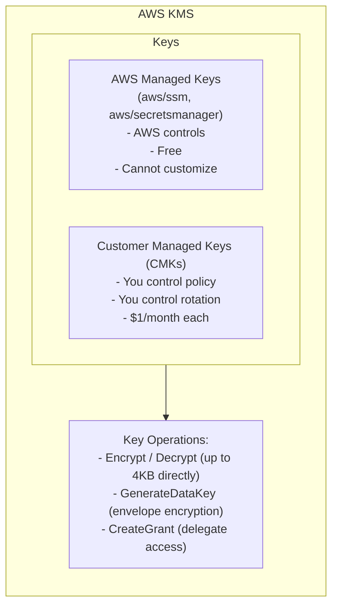
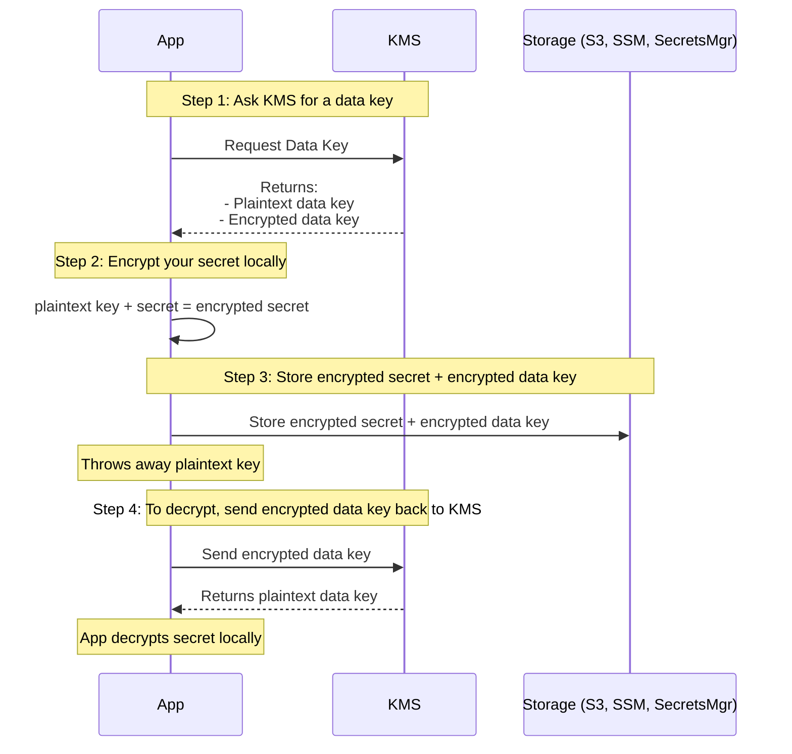
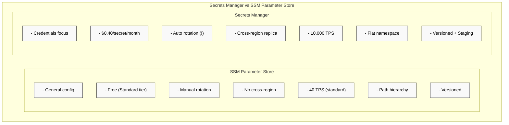
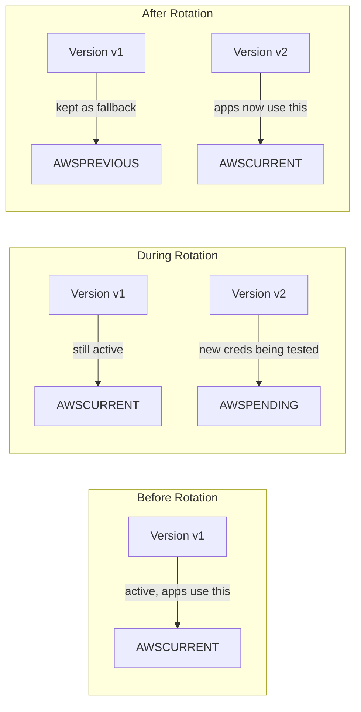
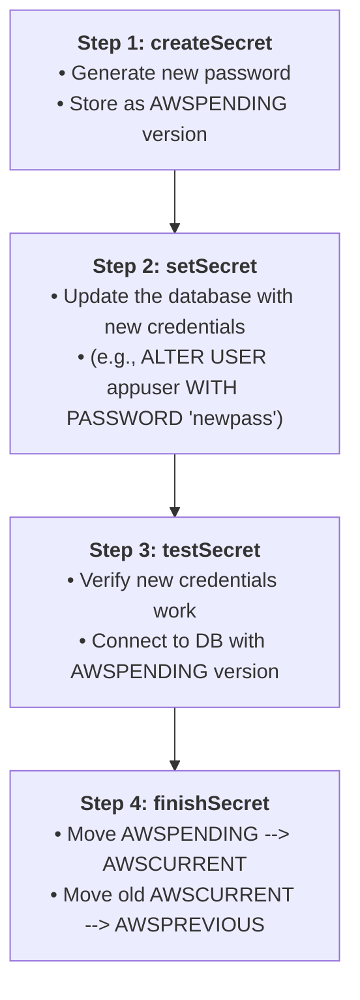

**Complexity:** `[MEDIUM]` | **Time to Complete:** 1.5 hours | **Track:** AWS DevOps Essentials

## Prerequisites

Before starting this module, ensure you have:
- Completed [Module 1.1: IAM & Access Management](../module-1.1-iam/) (IAM policies, roles, trust relationships)
- An AWS account with admin access (or scoped permissions for SSM, Secrets Manager, KMS)
- AWS CLI v2 installed and configured
- Basic understanding of encryption concepts (symmetric vs. asymmetric keys)

## What You'll Be Able to Do

After completing this module, you will be able to:

- **Configure AWS Secrets Manager with automatic rotation schedules for database credentials and API keys**
- **Implement KMS encryption key hierarchies and key policies to control access to sensitive data at rest**
- **Compare SSM Parameter Store and Secrets Manager to select the right secret storage for each use case**
- **Deploy secret injection patterns for EC2 instances, ECS tasks, and Lambda functions without hardcoding credentials**

---

## Why This Module Matters

In December 2022, a developer at a mid-sized fintech company committed a database connection string to a public GitHub repository. The string contained the master username, password, and RDS endpoint for their production PostgreSQL database. Automated bots that scrape GitHub for leaked credentials found it within 14 minutes. Within the hour, attackers had exfiltrated 2.3 million customer records including names, emails, and partial payment data. The breach cost the company $4.1 million in regulatory fines, incident response, and customer notification -- not counting the reputational damage that saw their B2B client pipeline dry up for two quarters.

This was entirely preventable. AWS provides purpose-built services for storing, rotating, and injecting secrets into your applications. The developer could have stored that connection string in AWS Secrets Manager, configured automatic rotation every 30 days, and had the application retrieve it at runtime. No credential ever touches source code. No password stays valid long enough to be useful if leaked.

In this module, you will learn how AWS approaches secrets management across the stack -- from the low-level encryption primitives in KMS, to the two competing secret-storage services (SSM Parameter Store and Secrets Manager), to the practical patterns for injecting secrets into EC2 instances, ECS tasks, and Lambda functions. By the end, you will never again be tempted to put a password in an environment variable file or a Docker image.

---

## Did You Know?

- **AWS Secrets Manager rotates over 100 million secrets per month** across its customer base. The service launched in April 2018 specifically because AWS saw how many customers were storing credentials in plaintext in S3 buckets, EC2 user data, and environment variables.

- **KMS processes over 1 trillion API calls per year**, making it one of the most-called AWS services. Every time you read an encrypted SSM parameter or retrieve a Secrets Manager secret, KMS is involved behind the scenes -- you just never see it.

- **SSM Parameter Store's free tier supports up to 10,000 parameters per account per region**, while Secrets Manager charges $0.40 per secret per month. This cost difference drives many teams to use Parameter Store for non-rotating configuration and Secrets Manager only for credentials that need automatic rotation.

- **Envelope encryption** (used by both SSM and Secrets Manager) means your actual secret is never sent to KMS. Instead, a local data key encrypts the secret, and KMS only encrypts/decrypts that small data key. This design means KMS never sees your plaintext secret and keeps API latency under 10ms for most operations.

---

## KMS: The Encryption Foundation

Before diving into secret storage, you need to understand AWS Key Management Service (KMS). Every encrypted parameter in SSM and every secret in Secrets Manager relies on KMS under the hood. Think of KMS as the locksmith who makes and manages all the keys -- but never actually sees the contents of what you lock up.

### Key Concepts



There are two types of keys you will encounter:

**AWS Managed Keys** are created and managed by AWS for specific services. When you encrypt an SSM parameter with the default key, you are using `aws/ssm`. These are free, but you cannot change their rotation schedule, key policy, or share them across accounts.

**Customer Managed Keys (CMKs)** are keys you create and control. You define who can use them via key policies, you decide the rotation schedule, and you can share them across accounts. They cost $1/month each plus $0.03 per 10,000 API calls.

### Envelope Encryption

This is the pattern that makes large-scale encryption practical:



The critical insight: KMS never sees your secret. It only sees the small data key. This means even if someone compromised KMS's internal logging, your actual database password or API key would not be exposed.

### Creating a Customer Managed Key

```bash
ACCOUNT_ID=$(aws sts get-caller-identity --query Account --output text)

# 1. Define a Key Policy (Delegating to IAM)
# Note: By granting access to the account root, we allow IAM policies to control key access.
cat <<EOF > /tmp/key-policy.json
{
  "Version": "2012-10-17",
  "Id": "app-secrets-policy",
  "Statement": [
    {
      "Sid": "Enable IAM User Permissions",
      "Effect": "Allow",
      "Principal": { "AWS": "arn:aws:iam::${ACCOUNT_ID}:root" },
      "Action": "kms:*",
      "Resource": "*"
    }
  ]
}
EOF

# 2. Create a symmetric encryption key with the policy
aws kms create-key \
  --description "Application secrets encryption key" \
  --key-usage ENCRYPT_DECRYPT \
  --key-spec SYMMETRIC_DEFAULT \
  --policy file:///tmp/key-policy.json \
  --tags TagKey=Environment,TagValue=production

# The output includes the KeyId -- save it
# Example: "KeyId": "1234abcd-12ab-34cd-56ef-1234567890ab"

# Create a human-readable alias
aws kms create-alias \
  --alias-name alias/app-secrets-key \
  --target-key-id 1234abcd-12ab-34cd-56ef-1234567890ab

# Verify the key exists
aws kms describe-key --key-id alias/app-secrets-key
```

> **Stop and think**: If an attacker gains full read access to your S3 bucket where your encrypted secrets are stored, can they decrypt your data if they do not have access to the KMS key? Why or why not?

---

## SSM Parameter Store: The Configuration Swiss Army Knife

AWS Systems Manager Parameter Store is the workhorse for configuration management. It stores three types of data -- plain strings, string lists, and encrypted secure strings -- in a hierarchical namespace that maps naturally to application configuration.

### Parameter Types

| Type | Encryption | Max Size (Standard) | Max Size (Advanced) | Cost |
|------|-----------|---------------------|---------------------|------|
| `String` | None | 4 KB | 8 KB | Free (Standard) |
| `StringList` | None | 4 KB | 8 KB | Free (Standard) |
| `SecureString` | KMS | 4 KB | 8 KB | Free (Standard) |

**Standard parameters** are free for up to 10,000 per account per region. **Advanced parameters** cost $0.05 per parameter per month, support up to 8 KB values, and parameter policies (TTL, expiration notifications). Higher throughput (up to 10,000 TPS) is an account-level setting available for both Standard and Advanced parameters.

### Hierarchical Naming

The real power of Parameter Store is its path-based hierarchy. Structure your parameters like a filesystem:

```bash
# Create parameters with a path hierarchy
aws ssm put-parameter \
  --name "/myapp/production/database/host" \
  --value "prod-db.cluster-abc123.us-east-1.rds.amazonaws.com" \
  --type String

aws ssm put-parameter \
  --name "/myapp/production/database/port" \
  --value "5432" \
  --type String

aws ssm put-parameter \
  --name "/myapp/production/database/password" \
  --value "SuperSecretPassword123!" \
  --type SecureString \
  --key-id alias/app-secrets-key

aws ssm put-parameter \
  --name "/myapp/production/feature-flags" \
  --value "dark-mode,new-checkout,beta-api" \
  --type StringList

# Retrieve a single parameter
aws ssm get-parameter \
  --name "/myapp/production/database/host"

# Retrieve a SecureString (decrypted)
aws ssm get-parameter \
  --name "/myapp/production/database/password" \
  --with-decryption

# Retrieve ALL parameters under a path
aws ssm get-parameters-by-path \
  --path "/myapp/production/" \
  --recursive \
  --with-decryption
```

That last command -- `get-parameters-by-path` -- is a game changer. Your application can load its entire configuration tree with a single API call. No need to know every parameter name in advance.

### Versioning and History

Every time you update a parameter, Parameter Store keeps the previous version:

```bash
# Update a parameter (creates version 2)
aws ssm put-parameter \
  --name "/myapp/production/database/host" \
  --value "new-prod-db.cluster-xyz789.us-east-1.rds.amazonaws.com" \
  --type String \
  --overwrite

# Get a specific version
aws ssm get-parameter \
  --name "/myapp/production/database/host:2"

# View parameter history
aws ssm get-parameter-history \
  --name "/myapp/production/database/host"
```

> **Pause and predict**: You need to store an API key that changes once a year and is read thousands of times per second by your application. Based on the features and pricing of SSM Parameter Store versus Secrets Manager, which service is more cost-effective for this specific workload?

This is invaluable for debugging. When someone says "the app broke after the config change," you can see exactly what changed and when.

---

## Secrets Manager: Purpose-Built for Credentials

While Parameter Store can hold encrypted strings, AWS Secrets Manager is designed specifically for credentials that need lifecycle management -- especially automatic rotation. If your secret is a database password, an API key, or an OAuth client secret, Secrets Manager is the right home for it.

### What Sets Secrets Manager Apart



### Creating and Retrieving Secrets

```bash
# Create a secret with key-value pairs (most common pattern)
aws secretsmanager create-secret \
  --name "myapp/production/db-credentials" \
  --description "Production RDS PostgreSQL credentials" \
  --secret-string '{"username":"appuser","password":"xK9#mP2$vL7!nQ4","host":"prod-db.cluster-abc123.us-east-1.rds.amazonaws.com","port":"5432","dbname":"myapp_prod"}'

# Retrieve the secret
aws secretsmanager get-secret-value \
  --secret-id "myapp/production/db-credentials"

# The response includes:
# - SecretString (your JSON blob)
# - VersionId (UUID)
# - VersionStages (["AWSCURRENT"])
```

### Version Stages: AWSCURRENT vs AWSPREVIOUS

Secrets Manager uses version stages to manage credential rotation without downtime:



This two-phase approach means your application never sees a moment where the old password is invalid but the new one is not yet available.

### Automatic Rotation

This is the killer feature. Secrets Manager can automatically rotate database credentials on a schedule you define:

```bash
# Enable rotation for an RDS secret
aws secretsmanager rotate-secret \
  --secret-id "myapp/production/db-credentials" \
  --rotation-lambda-arn arn:aws:lambda:us-east-1:123456789012:function:SecretsManagerRDSPostgreSQLRotation \
  --rotation-rules '{"ScheduleExpression":"rate(30 days)"}'
```

AWS provides pre-built Lambda rotation functions for:
- Amazon RDS (MySQL, PostgreSQL, Oracle, SQL Server, MariaDB)
- Amazon Redshift
- Amazon DocumentDB
- Generic credentials (you provide the rotation logic)

The rotation Lambda follows a four-step protocol:



If any step fails, the rotation rolls back and the existing AWSCURRENT credentials remain valid. Your application never breaks.

> **Stop and think**: During a database credential rotation via Secrets Manager, what happens if the `testSecret` step fails because the newly generated password does not meet the database's internal complexity requirements? How does this affect the application currently using the database?

---

## Injecting Secrets Into Compute Services

Storing secrets is only half the problem. The other half is getting them into your running application without exposing them in plaintext along the way.

### EC2 Instances

For EC2, your application retrieves secrets at startup using the AWS SDK or CLI. The instance's IAM role provides the authorization.

```bash
# IAM policy for the EC2 instance role
cat <<'EOF'
{
  "Version": "2012-10-17",
  "Statement": [
    {
      "Effect": "Allow",
      "Action": [
        "secretsmanager:GetSecretValue"
      ],
      "Resource": "arn:aws:secretsmanager:us-east-1:123456789012:secret:myapp/production/*"
    },
    {
      "Effect": "Allow",
      "Action": [
        "ssm:GetParametersByPath",
        "ssm:GetParameter"
      ],
      "Resource": "arn:aws:ssm:us-east-1:123456789012:parameter/myapp/production/*"
    },
    {
      "Effect": "Allow",
      "Action": "kms:Decrypt",
      "Resource": "arn:aws:kms:us-east-1:123456789012:key/1234abcd-12ab-34cd-56ef-1234567890ab"
    }
  ]
}
EOF
```

A Python application retrieving secrets at startup:

```python
import boto3
import json

def get_db_credentials():
    """Retrieve database credentials from Secrets Manager."""
    client = boto3.client('secretsmanager', region_name='us-east-1')

    response = client.get_secret_value(
        SecretId='myapp/production/db-credentials'
    )

    return json.loads(response['SecretString'])

# At application startup
creds = get_db_credentials()
db_host = creds['host']
db_user = creds['username']
db_pass = creds['password']
```

**Important**: Cache the secret in memory and refresh periodically (every 5-15 minutes). Calling Secrets Manager on every database connection adds latency and costs money.

### ECS / Fargate

ECS has native integration with both SSM Parameter Store and Secrets Manager. You reference secrets directly in your task definition, and the ECS agent injects them as environment variables at container startup:

```json
{
  "containerDefinitions": [
    {
      "name": "myapp",
      "image": "123456789012.dkr.ecr.us-east-1.amazonaws.com/myapp:latest",
      "essential": true,
      "secrets": [
        {
          "name": "DB_PASSWORD",
          "valueFrom": "arn:aws:secretsmanager:us-east-1:123456789012:secret:myapp/production/db-credentials-a1b2c3:password::"
        },
        {
          "name": "DB_USERNAME",
          "valueFrom": "arn:aws:secretsmanager:us-east-1:123456789012:secret:myapp/production/db-credentials:username::"
        },
        {
          "name": "LOG_LEVEL",
          "valueFrom": "arn:aws:ssm:us-east-1:123456789012:parameter/myapp/production/log-level"
        }
      ],
      "environment": [
        {
          "name": "APP_ENV",
          "value": "production"
        }
      ]
    }
  ],
  "taskRoleArn": "arn:aws:iam::123456789012:role/myapp-task-role",
  "executionRoleArn": "arn:aws:iam::123456789012:role/myapp-execution-role"
}
```

Notice the distinction between two IAM roles:

- **Task Role**: What the application code can do at runtime (e.g., read from S3, write to DynamoDB)
- **Execution Role**: What the ECS agent needs to start the container (e.g., pull image from ECR, read secrets for injection)

The execution role needs `secretsmanager:GetSecretValue` and `ssm:GetParameters` permissions. The task role only needs these if your application also reads secrets at runtime (in addition to the injected environment variables).

The `valueFrom` ARN for Secrets Manager supports a special syntax for extracting individual JSON keys:

```
arn:aws:secretsmanager:REGION:ACCOUNT:secret:SECRET_NAME:JSON_KEY:VERSION_STAGE:VERSION_ID
```

So `...:db-credentials:password::` extracts just the `password` field from the JSON secret, using the current version.

### Lambda Functions

Lambda supports the same secret injection pattern but with a different mechanism. You can use Lambda environment variables (encrypted at rest with KMS) or retrieve secrets in your function code:

```python
import boto3
import json
import os

# Option 1: Use the AWS Parameters and Secrets Lambda Extension
# (adds ~50ms cold start but caches secrets automatically)
# Set environment variable: AWS_LAMBDA_EXEC_WRAPPER=/opt/wrapper

# Option 2: Retrieve in code with caching
_secret_cache = {}

def get_cached_secret(secret_id):
    """Retrieve secret with in-memory caching."""
    if secret_id not in _secret_cache:
        client = boto3.client('secretsmanager')
        response = client.get_secret_value(SecretId=secret_id)
        _secret_cache[secret_id] = json.loads(response['SecretString'])
    return _secret_cache[secret_id]

def handler(event, context):
    creds = get_cached_secret('myapp/production/db-credentials')
    # Use creds['host'], creds['username'], creds['password']
    # The cache persists across warm invocations
    return {"statusCode": 200}
```

The **AWS Parameters and Secrets Lambda Extension** is worth knowing about. It runs as a Lambda layer, automatically caches secrets, and refreshes them on a configurable interval. This avoids each function invocation making its own API call:

```bash
# Add the extension layer to your function
aws lambda update-function-configuration \
  --function-name myapp-handler \
  --layers arn:aws:lambda:us-east-1:177933569100:layer:AWS-Parameters-and-Secrets-Lambda-Extension:12 \
  --environment "Variables={SECRETS_MANAGER_TTL=300,SSM_PARAMETER_STORE_TTL=300}"
```

---

## Security Best Practices

### Least Privilege for Secrets

Never grant `secretsmanager:GetSecretValue` on `*`. Scope permissions to exactly the secrets the application needs:

```json
{
  "Effect": "Allow",
  "Action": "secretsmanager:GetSecretValue",
  "Resource": [
    "arn:aws:secretsmanager:us-east-1:123456789012:secret:myapp/production/db-credentials-??????"
  ],
  "Condition": {
    "StringEquals": {
      "aws:RequestedRegion": "us-east-1"
    }
  }
}
```

The six question marks (`??????`) at the end match the random suffix that Secrets Manager appends to every secret ARN. This is a common gotcha -- if you use the exact secret name without the suffix wildcard, your policy will not match.

### Audit Access with CloudTrail

Every call to `GetSecretValue`, `GetParameter`, and KMS `Decrypt` is logged in CloudTrail. Set up alerts for unusual access patterns:

```bash
# Check who accessed a secret recently
aws cloudtrail lookup-events \
  --lookup-attributes AttributeKey=EventName,AttributeValue=GetSecretValue \
  --start-time "2026-03-01" \
  --end-time "2026-03-24" \
  --max-results 20
```

### Block Secrets in Code Repositories

Even with proper secrets management, developers make mistakes. Use pre-commit hooks and repository scanning:

```bash
# Install git-secrets (by AWS Labs)
brew install git-secrets  # macOS

# Configure it for AWS patterns
git secrets --register-aws --global

# Add custom patterns for your org
git secrets --add --global '(password|secret|apikey)\s*=\s*.+'

# Scan existing repo
git secrets --scan
```

---

## Common Mistakes

| Mistake | Why It Happens | How to Fix It |
|---------|---------------|---------------|
| Using Parameter Store SecureString without specifying KMS key | Developers assume default encryption is sufficient | Specify a CMK with `--key-id` so you control the key policy and can share across accounts |
| Hardcoding secret ARN with random suffix | Copy-pasting from the console includes the suffix | Use the secret name without suffix in code; use `??????` wildcard in IAM policies |
| Not granting `kms:Decrypt` in addition to secret read | Forgetting that SecureString/Secrets Manager decryption requires KMS access | Always include `kms:Decrypt` on the specific KMS key ARN in your IAM policy |
| Calling Secrets Manager on every request | "It should always be fresh" mindset | Cache secrets in memory with a TTL of 5-15 minutes; use the Lambda extension for serverless |
| Using the same secret across all environments | "We'll rotate it later" shortcuts | Use path-based naming (`/myapp/dev/...`, `/myapp/prod/...`) and separate secrets per environment |
| Storing secrets in ECS task definition environment variables | Confusing `environment` (plaintext) with `secrets` (resolved at launch) | Use the `secrets` block in container definitions, not the `environment` block for sensitive values |
| Not enabling rotation because "it's complicated" | Fear of breaking production | Start with a 90-day rotation schedule; AWS-provided Lambda functions handle RDS rotation automatically |
| Forgetting execution role permissions for ECS secret injection | Task role has permissions but execution role does not | The execution role (not task role) needs `secretsmanager:GetSecretValue` for secret injection at launch |

---

## Quiz

<details>
<summary>1. Your team is debating whether to use SSM Parameter Store or AWS Secrets Manager to store a third-party API key that must be rotated every 90 days. Which service should you choose and why?</summary>

You should choose AWS Secrets Manager because it is purpose-built for credential lifecycle management. Its defining feature is automatic rotation, allowing it to seamlessly change database passwords, API keys, and other credentials on a defined schedule using Lambda functions. While Parameter Store can store encrypted strings securely, it has no built-in rotation mechanism, meaning your team would have to build and maintain custom rotation scripts. Furthermore, Secrets Manager supports version staging (AWSCURRENT, AWSPREVIOUS, AWSPENDING), which is essential for ensuring zero-downtime during the rotation process.
</details>

<details>
<summary>2. You are presenting your security architecture to an auditor who is concerned that AWS administrators might be able to read your database passwords stored in Secrets Manager. How does envelope encryption ensure that KMS never actually sees your plaintext secret?</summary>

In envelope encryption, KMS is only responsible for generating and decrypting a small data key, not the secret itself. When an application encrypts a secret, KMS provides both a plaintext data key and an encrypted data key. The application uses the plaintext data key to encrypt the sensitive payload locally, discards the plaintext key, and stores only the encrypted secret alongside the encrypted data key. Because KMS only ever handles the 256-bit data key during decryption requests, it has zero exposure to your actual sensitive data, completely preventing AWS or its administrators from accessing the underlying plaintext secret.
</details>

<details>
<summary>3. You have just deployed a new ECS Fargate service that injects database credentials from Secrets Manager into the container as environment variables. However, the task immediately fails to start with the error message "ResourceInitializationError: unable to pull secrets." What is the most likely configuration error?</summary>

The most likely cause is that the task's execution role lacks the necessary IAM permissions to read the secret. When ECS injects secrets at container startup, the ECS agent uses the execution role—not the task role—to call `secretsmanager:GetSecretValue` and `kms:Decrypt`. Many teams incorrectly grant these permissions to the task role, forgetting that secret injection happens at the infrastructure level before the container actually starts. To fix this, you must update the execution role's IAM policy to explicitly allow reading the specific secret ARN and using the associated KMS key.
</details>

<details>
<summary>4. Your startup is launching a new microservice that requires 50 configuration values, including plaintext feature flags, internal service URLs, and a few static API tokens that do not require rotation. You have a strict infrastructure budget. Which AWS service or combination of services provides the most cost-effective solution?</summary>

You should use SSM Parameter Store for all 50 configuration values to minimize infrastructure costs. The standard tier of Parameter Store is completely free for up to 10,000 parameters per account, and it supports both plaintext strings and KMS-encrypted SecureStrings for your static API tokens. Since none of the credentials require automatic rotation, paying $0.40 per secret per month for Secrets Manager would be an unnecessary expense. By structuring your parameters with a consistent path hierarchy (e.g., `/myservice/production/`), your application can also efficiently retrieve all 50 values using a single `get-parameters-by-path` API call.
</details>

<details>
<summary>5. A critical batch processing job runs for four hours every night. Halfway through the job, Secrets Manager triggers an automatic rotation of the database credentials. Will the batch job's active database connection drop?</summary>

The batch job's existing database connections will not be affected by the rotation and will not drop. Secrets Manager rotation changes the password stored in AWS and updates the password in the database, but connections that are already established and authenticated remain perfectly valid. The only risk occurs if the batch job drops its connection and attempts to open a new one using a cached, outdated password. To handle this gracefully, AWS retains the old password under the `AWSPREVIOUS` label, ensuring that applications have a buffer period to fetch the new credentials upon encountering an authentication failure.
</details>

<details>
<summary>6. A developer creates an IAM policy to allow a Lambda function to read a secret named `myapp/prod/db-creds`. They copy the secret name directly into the Resource ARN of the policy, but the Lambda function receives an Access Denied error. What did the developer miss regarding Secrets Manager ARNs?</summary>

The developer failed to account for the random 6-character suffix that Secrets Manager automatically appends to the end of every secret ARN upon creation. Because this suffix is dynamically generated and unpredictable, an IAM policy written with just the exact secret name will not match the actual deployed ARN, resulting in an Access Denied error. To resolve this, the developer must append a 6-character wildcard (`??????`) or an asterisk (`*`) to the end of the resource ARN in the IAM policy. This ensures the policy consistently matches the secret regardless of the random characters added by AWS.
</details>

<details>
<summary>7. You recently updated a high-traffic Lambda function to retrieve an API key from Secrets Manager instead of hardcoding it. Since the deployment, latency metrics show that cold starts have increased by 800ms, causing timeouts for some downstream clients. How can you optimize the function to eliminate this latency?</summary>

You should optimize the function by attaching the AWS Parameters and Secrets Lambda Extension to your Lambda function. This extension runs as a sidecar process within the execution environment, automatically retrieving and caching secrets locally based on a configurable time-to-live (TTL). By configuring your application code to query the local extension endpoint rather than making a direct SDK call over the internet to Secrets Manager, you eliminate the API overhead on warm invocations completely. Even during cold starts, the extension typically only adds about 50ms of latency, which is a massive improvement over the 800ms penalty of a direct SDK call.
</details>

---

## Hands-On Exercise: Retrieve DB Credentials from Secrets Manager in an ECS Fargate Task

### Objective

Build a complete secrets pipeline: create a secret in Secrets Manager, configure an ECS Fargate task definition to inject it, and verify the secret appears inside the running container.

### Setup

Ensure you have:
- AWS CLI configured with sufficient permissions
- A default VPC with subnets (or know your VPC/subnet IDs)
- An ECS cluster (create one if needed: `aws ecs create-cluster --cluster-name secrets-lab`)

### Task 1: Create the Secret

Store simulated database credentials in Secrets Manager.

<details>
<summary>Solution</summary>

```bash
# Create the secret
aws secretsmanager create-secret \
  --name "secrets-lab/db-credentials" \
  --description "Lab exercise - simulated DB credentials" \
  --secret-string '{"username":"labuser","password":"L4bP@ssw0rd!2026","host":"lab-db.example.com","port":"5432","dbname":"labdb"}'

# Verify it was created
aws secretsmanager describe-secret \
  --secret-id "secrets-lab/db-credentials"

# Retrieve and verify the value
aws secretsmanager get-secret-value \
  --secret-id "secrets-lab/db-credentials" \
  --query 'SecretString' --output text
```
</details>

### Task 2: Create IAM Roles for ECS

Create the execution role (for pulling secrets at startup) and a task role.

<details>
<summary>Solution</summary>

```bash
# Create the trust policy for ECS tasks
cat > /tmp/ecs-trust-policy.json <<'EOF'
{
  "Version": "2012-10-17",
  "Statement": [
    {
      "Effect": "Allow",
      "Principal": {
        "Service": "ecs-tasks.amazonaws.com"
      },
      "Action": "sts:AssumeRole"
    }
  ]
}
EOF

# Create execution role
aws iam create-role \
  --role-name secrets-lab-execution-role \
  --assume-role-policy-document file:///tmp/ecs-trust-policy.json

# Attach the standard ECS execution policy
aws iam attach-role-policy \
  --role-name secrets-lab-execution-role \
  --policy-arn arn:aws:iam::aws:policy/service-role/AmazonECSTaskExecutionRolePolicy

# Get your account ID
ACCOUNT_ID=$(aws sts get-caller-identity --query Account --output text)

# Create inline policy for Secrets Manager access
cat > /tmp/secrets-policy.json <<EOF
{
  "Version": "2012-10-17",
  "Statement": [
    {
      "Effect": "Allow",
      "Action": "secretsmanager:GetSecretValue",
      "Resource": "arn:aws:secretsmanager:*:${ACCOUNT_ID}:secret:secrets-lab/*"
    }
  ]
}
EOF

aws iam put-role-policy \
  --role-name secrets-lab-execution-role \
  --policy-name SecretsAccess \
  --policy-document file:///tmp/secrets-policy.json

# Create task role (minimal for this lab)
aws iam create-role \
  --role-name secrets-lab-task-role \
  --assume-role-policy-document file:///tmp/ecs-trust-policy.json
```
</details>

### Task 3: Register an ECS Task Definition with Secret Injection

Create a Fargate task definition that injects the database username and password as environment variables.

<details>
<summary>Solution</summary>

```bash
ACCOUNT_ID=$(aws sts get-caller-identity --query Account --output text)
SECRET_ARN=$(aws secretsmanager describe-secret \
  --secret-id "secrets-lab/db-credentials" \
  --query 'ARN' --output text)
AWS_REGION=$(aws configure get region || echo us-east-1)

cat > /tmp/task-definition.json <<EOF
{
  "family": "secrets-lab-task",
  "networkMode": "awsvpc",
  "requiresCompatibilities": ["FARGATE"],
  "cpu": "256",
  "memory": "512",
  "executionRoleArn": "arn:aws:iam::${ACCOUNT_ID}:role/secrets-lab-execution-role",
  "taskRoleArn": "arn:aws:iam::${ACCOUNT_ID}:role/secrets-lab-task-role",
  "containerDefinitions": [
    {
      "name": "secret-reader",
      "image": "amazonlinux:2023",
      "essential": true,
      "command": ["sh", "-c", "echo DB_USER=\$DB_USERNAME && echo DB_HOST=\$DB_HOST && echo 'Password length:' \$(echo -n \$DB_PASSWORD | wc -c) && sleep 120"],
      "secrets": [
        {
          "name": "DB_USERNAME",
          "valueFrom": "${SECRET_ARN}:username::"
        },
        {
          "name": "DB_PASSWORD",
          "valueFrom": "${SECRET_ARN}:password::"
        },
        {
          "name": "DB_HOST",
          "valueFrom": "${SECRET_ARN}:host::"
        }
      ],
      "logConfiguration": {
        "logDriver": "awslogs",
        "options": {
          "awslogs-group": "/ecs/secrets-lab",
          "awslogs-region": "${AWS_REGION}",
          "awslogs-stream-prefix": "ecs",
          "awslogs-create-group": "true"
        }
      }
    }
  ]
}
EOF

aws ecs register-task-definition \
  --cli-input-json file:///tmp/task-definition.json
```
</details>

### Task 4: Run the Task and Verify Secrets Were Injected

Launch the Fargate task and check CloudWatch Logs to confirm the secrets appeared as environment variables.

<details>
<summary>Solution</summary>

```bash
# Get a subnet from the default VPC
SUBNET_ID=$(aws ec2 describe-subnets \
  --filters "Name=default-for-az,Values=true" \
  --query 'Subnets[0].SubnetId' --output text)

# Get the default security group
VPC_ID=$(aws ec2 describe-subnets \
  --subnet-ids $SUBNET_ID \
  --query 'Subnets[0].VpcId' --output text)

SG_ID=$(aws ec2 describe-security-groups \
  --filters "Name=vpc-id,Values=$VPC_ID" "Name=group-name,Values=default" \
  --query 'SecurityGroups[0].GroupId' --output text)

# Run the task
aws ecs run-task \
  --cluster secrets-lab \
  --task-definition secrets-lab-task \
  --launch-type FARGATE \
  --network-configuration "awsvpcConfiguration={subnets=[$SUBNET_ID],securityGroups=[$SG_ID],assignPublicIp=ENABLED}"

# Wait 30-60 seconds for the task to start, then check logs
aws logs get-log-events \
  --log-group-name /ecs/secrets-lab \
  --log-stream-name "$(aws logs describe-log-streams \
    --log-group-name /ecs/secrets-lab \
    --order-by LastEventTime \
    --descending \
    --query 'logStreams[0].logStreamName' --output text)" \
  --query 'events[*].message' --output text

# You should see:
# DB_USER=labuser
# DB_HOST=lab-db.example.com
# Password length: 16
```
</details>

### Task 5: Clean Up

Remove all resources created in this exercise.

<details>
<summary>Solution</summary>

```bash
# Delete the secret (force, no recovery window for lab)
aws secretsmanager delete-secret \
  --secret-id "secrets-lab/db-credentials" \
  --force-delete-without-recovery

# Deregister task definition
aws ecs deregister-task-definition \
  --task-definition secrets-lab-task:1

# Delete IAM roles
aws iam delete-role-policy \
  --role-name secrets-lab-execution-role \
  --policy-name SecretsAccess

aws iam detach-role-policy \
  --role-name secrets-lab-execution-role \
  --policy-arn arn:aws:iam::aws:policy/service-role/AmazonECSTaskExecutionRolePolicy

aws iam delete-role --role-name secrets-lab-execution-role
aws iam delete-role --role-name secrets-lab-task-role

# Delete log group
aws logs delete-log-group --log-group-name /ecs/secrets-lab

# Delete cluster (if created for this lab)
aws ecs delete-cluster --cluster-name secrets-lab
```
</details>

### Success Criteria

- [ ] Secret created in Secrets Manager with JSON key-value structure
- [ ] Execution role has `secretsmanager:GetSecretValue` permission
- [ ] Task definition uses `secrets` block (not `environment`) for sensitive values
- [ ] Fargate task runs and logs confirm injected values (`DB_USER=labuser`, `DB_HOST=lab-db.example.com`)
- [ ] Password value is not printed in plaintext (only length is shown)
- [ ] All resources cleaned up after exercise

---

## Next Module

Continue to [Module 1.10: CloudWatch & Observability](../module-1.10-cloudwatch/) -- where you will learn to monitor everything you have built so far. Secrets management tells you *what* your application needs; observability tells you *how* it is behaving.