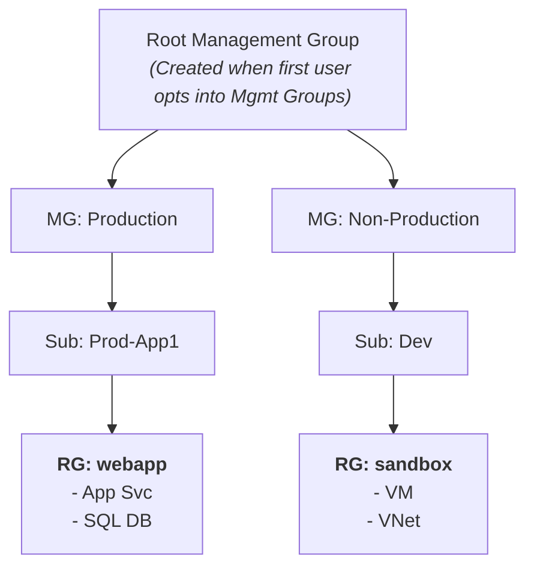
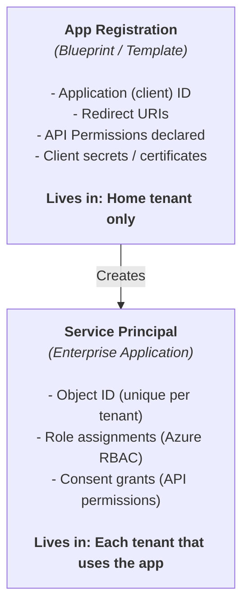
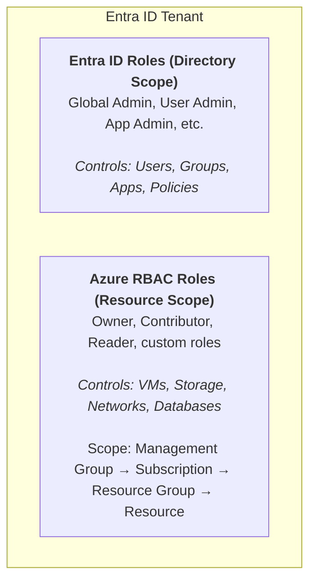

**Complexity**: [MEDIUM] | **Time to Complete**: 2.5h | **Prerequisites**: Cloud Native 101

## What You'll Be Able to Do

After completing this module, you will be able to:

- **Configure Entra ID application registrations, service principals, and Managed Identities for Azure workloads**
- **Design Azure RBAC role assignments across Management Groups, Subscriptions, and Resource Groups with least privilege**
- **Implement Conditional Access policies and Privileged Identity Management (PIM) for just-in-time access**
- **Diagnose Entra ID vs Azure RBAC permission conflicts using role assignment analysis and access reviews**

---

## Why This Module Matters

In March 2021, a security researcher discovered that a misconfigured Azure Active Directory application in a Fortune 500 company exposed the email inboxes and SharePoint files of over 16,000 employees. The application had been registered years earlier by a contractor who had long since left the company. Nobody revoked the app's permissions because nobody knew it existed. The application's client secret had been committed to a public GitHub repository, and an attacker had been quietly reading executive emails for months before the breach was discovered. The estimated cost of the incident, including regulatory fines, legal fees, and lost business, exceeded $30 million.

This story illustrates a critical truth about Azure: **identity is not just security---it is the foundation of everything**. Every action in Azure, from creating a virtual machine to reading a blob in storage, flows through the identity layer. Unlike traditional on-premises environments where you might rely on network segmentation and firewall rules as your primary defense, Azure's control plane is entirely identity-driven. If an attacker compromises a service principal with Contributor access to your subscription, no amount of network security groups will prevent them from deleting your databases.

In this module, you will learn how Microsoft Entra ID (formerly Azure Active Directory) works as the identity backbone of Azure. You will understand the hierarchy of tenants, management groups, and subscriptions. You will learn the critical differences between Entra ID roles and Azure RBAC roles---a distinction that trips up even experienced engineers. And you will master Managed Identities, the mechanism that eliminates the need for credentials in your applications entirely. By the end, you will be able to design an identity strategy that follows the principle of least privilege from the ground up.

---

## Azure's Identity Backbone: Microsoft Entra ID

Before you create a single resource in Azure, you need to understand the identity layer that governs everything. Microsoft Entra ID (still frequently called Azure AD in documentation, CLI tools, and everyday conversation) is a cloud-based identity and access management service. Think of it as the bouncer at every door in the Azure building. Every person, every application, every automated process must present credentials to Entra ID before Azure will do anything.

### What Entra ID Is (and What It Is Not)

Entra ID is **not** the same as on-premises Active Directory Domain Services (AD DS). This is one of the most persistent misconceptions in the Azure world. AD DS uses Kerberos and LDAP for authentication, organizes objects into Organizational Units (OUs) with Group Policy Objects (GPOs), and requires domain controllers running on Windows Server. Entra ID uses OAuth 2.0, OpenID Connect, and SAML for authentication, has a flat structure (no OUs, no GPOs), and is a fully managed cloud service.

| On-Premises AD DS | Microsoft Entra ID |
| :--- | :--- |
| Kerberos / NTLM / LDAP | OAuth 2.0 / OIDC / SAML |
| Organizational Units (OUs) | Flat directory (no OUs) |
| Group Policy Objects (GPOs) | Conditional Access Policies |
| Domain Controllers (servers) | Fully managed SaaS |
| Forest / Domain / Trust model | Tenant model |
| On-prem network required | Internet-accessible |
| Supports LDAP queries | Supports Microsoft Graph API |

If your organization has on-premises AD DS and wants to use the same identities in Azure, you use **Entra Connect** (formerly Azure AD Connect) to synchronize identities. This hybrid setup is extremely common in enterprises.

### The Tenant: Your Identity Boundary

A **tenant** is a dedicated instance of Entra ID that your organization receives when it signs up for any Microsoft cloud service (Azure, Microsoft 365, Dynamics 365). Think of a tenant as your organization's apartment in a massive apartment building. You share the building infrastructure with other tenants, but your apartment is completely isolated---nobody else can see your users, groups, or applications.

Every tenant has a unique identifier (a GUID) and at least one verified domain. By default, you get a domain like `yourcompany.onmicrosoft.com`, but you can (and should) add your own custom domain.

```bash
# View your current tenant
az account show --query '{TenantId:tenantId, SubscriptionName:name}' -o table

# List all tenants your account has access to
az account tenant list -o table

# Show detailed tenant information
az rest --method GET --url "https://graph.microsoft.com/v1.0/organization" \
  --query "value[0].{DisplayName:displayName, TenantId:id, Domains:verifiedDomains[].name}"
```

### The Hierarchy: Management Groups, Subscriptions, and Resource Groups

Azure organizes resources in a four-level hierarchy. Understanding this hierarchy is essential because **access control and policy inheritance flow from top to bottom**.



*Inheritance flows DOWN: Policy assigned at MG: Production → applies to ALL subscriptions, resource groups, and resources beneath it.*

| Level | Purpose | Key Facts |
| :--- | :--- | :--- |
| **Management Group** | Organize subscriptions into governance hierarchies | Up to 6 levels deep (excluding root). Max 10,000 MGs per tenant. |
| **Subscription** | Billing boundary and access control boundary | Each subscription trusts exactly one Entra ID tenant. Max ~500 resource groups per sub (soft limit). |
| **Resource Group** | Logical container for related resources | Resources can only exist in one RG. Deleting RG deletes ALL resources inside. |
| **Resource** | The actual thing (VM, database, storage account) | Inherits RBAC and policy from all levels above. |

A common mistake is treating subscriptions as purely a billing construct. They are also **security boundaries**. A user with Owner on Subscription A has zero access to Subscription B by default, even if both subscriptions are in the same tenant. This is why large organizations use multiple subscriptions to isolate environments and teams.

> **Pause and predict**: If you assign a user the 'Contributor' role at the Subscription level, but explicitly assign them the 'Reader' role at a specific Resource Group level within that subscription, what effective permissions do they have on the Resource Group?
> *Answer: They have 'Contributor' access. Azure RBAC is an additive model. Permissions flow down the hierarchy, and a lower-level assignment cannot subtract or restrict permissions granted at a higher level (unless you use Azure Blueprints or explicit Deny Assignments, which are advanced and rare).*

```bash
# List management groups
az account management-group list -o table

# Create a management group
az account management-group create --name "Production" --display-name "Production Workloads"

# Move a subscription under a management group
az account management-group subscription add \
  --name "Production" \
  --subscription "xxxxxxxx-xxxx-xxxx-xxxx-xxxxxxxxxxxx"

# List subscriptions in the current tenant
az account list -o table --query '[].{Name:name, Id:id, State:state}'
```

---

## Identities in Entra ID: Users, Groups, Service Principals, and Managed Identities

Now that you understand the organizational structure, let's dive into the identity types. In Azure, there are fundamentally two categories of identities: **human identities** (people who log in) and **workload identities** (applications and services that authenticate programmatically).

### Users

An Entra ID user represents a person. Users can be **cloud-only** (created directly in Entra ID) or **synced** (synchronized from on-premises AD DS via Entra Connect). Users can also be **guest users**, invited from other Entra ID tenants or external email providers via B2B collaboration.

```bash
# Create a cloud-only user
az ad user create \
  --display-name "Alice Engineer" \
  --user-principal-name "alice@yourcompany.onmicrosoft.com" \
  --password "TemporaryP@ss123!" \
  --force-change-password-next-sign-in true

# List all users (first 10)
az ad user list --query '[:10].{Name:displayName, UPN:userPrincipalName, Type:userType}' -o table

# Get a specific user
az ad user show --id "alice@yourcompany.onmicrosoft.com"
```

### Groups

Groups simplify access management. Instead of assigning roles to individual users, you assign roles to groups and add users to the groups. Entra ID has two group types:

- **Security groups**: Used for managing access to resources. This is what you'll use 90% of the time.
- **Microsoft 365 groups**: Used for collaboration (shared mailbox, SharePoint site, Teams channel). Also usable for RBAC, but carry extra baggage.

Groups can have **assigned membership** (manually add/remove members) or **dynamic membership** (members are automatically added/removed based on user attributes like department or job title). Dynamic groups require Entra ID P1 or P2 licensing.

```bash
# Create a security group
az ad group create \
  --display-name "Platform Engineers" \
  --mail-nickname "platform-engineers"

# Add a user to a group
USER_ID=$(az ad user show --id "alice@yourcompany.onmicrosoft.com" --query id -o tsv)
GROUP_ID=$(az ad group show --group "Platform Engineers" --query id -o tsv)
az ad group member add --group "$GROUP_ID" --member-id "$USER_ID"

# List group members
az ad group member list --group "Platform Engineers" --query '[].displayName' -o tsv
```

### Service Principals (App Registrations)

A **service principal** is the identity that an application uses to authenticate with Entra ID. But there is a subtle two-step process that confuses many people:

1. **App Registration**: A global definition of your application. Think of it as the blueprint. It lives in your home tenant and defines what permissions the app needs, what redirect URIs it uses, and what credentials it has.
2. **Service Principal (Enterprise Application)**: A local instance of the app in a specific tenant. Think of it as an installation of the blueprint. When you grant an app access to resources, you are granting access to the service principal, not the app registration.



```bash
# Create an app registration (automatically creates service principal in home tenant)
az ad app create --display-name "my-cicd-pipeline"

# Get the app ID
APP_ID=$(az ad app list --display-name "my-cicd-pipeline" --query '[0].appId' -o tsv)

# Create a client secret (AVOID THIS -- use federated credentials or certificates instead)
az ad app credential reset --id "$APP_ID" --years 1

# Preferred: Create federated credential for GitHub Actions (OIDC -- no secrets!)
az ad app federated-credential create --id "$APP_ID" --parameters '{
  "name": "github-actions-main",
  "issuer": "https://token.actions.githubusercontent.com",
  "subject": "repo:myorg/myrepo:ref:refs/heads/main",
  "audiences": ["api://AzureADTokenExchange"]
}'
```

**War Story**: A fintech startup stored a service principal's client secret in a `.env` file that was accidentally committed to a public repository. Automated scanners picked it up within 14 minutes. The service principal had Contributor access to their production subscription. By the time the team noticed, the attacker had created 38 cryptocurrency mining VMs across three regions, racking up $12,000 in compute charges before the subscription's spending limit kicked in. The fix? Managed Identities for Azure workloads and OIDC federation for CI/CD pipelines. Zero secrets to leak.

### Managed Identities: The Gold Standard

A **Managed Identity** is a special type of service principal that Azure manages for you. You never see or handle credentials---Azure automatically provisions, rotates, and revokes the tokens behind the scenes. This is the single most important identity concept for application developers on Azure.

There are two types:

| Feature | System-Assigned | User-Assigned |
| :--- | :--- | :--- |
| **Lifecycle** | Tied to the resource (delete VM = delete identity) | Independent (persists until you delete it) |
| **Sharing** | One-to-one (each resource gets its own) | One-to-many (multiple resources share one) |
| **Creation** | Enable on the resource | Create separately, then assign to resources |
| **Naming** | Named after the resource | You choose the name |
| **Best for** | Single-resource scenarios, simpler management | Shared access patterns, pre-provisioning |
| **RBAC management** | Role assignments per resource | Role assignments per identity (shared) |

```bash
# Enable system-assigned managed identity on a VM
az vm identity assign --resource-group myRG --name myVM

# Create a user-assigned managed identity
az identity create --resource-group myRG --name "app-identity"

# Assign the user-assigned identity to a VM
IDENTITY_ID=$(az identity show -g myRG -n "app-identity" --query id -o tsv)
az vm identity assign --resource-group myRG --name myVM --identities "$IDENTITY_ID"

# Grant the managed identity access to a Key Vault
PRINCIPAL_ID=$(az identity show -g myRG -n "app-identity" --query principalId -o tsv)
az role assignment create \
  --assignee "$PRINCIPAL_ID" \
  --role "Key Vault Secrets User" \
  --scope "/subscriptions/<sub-id>/resourceGroups/myRG/providers/Microsoft.KeyVault/vaults/myVault"
```

When your application code runs on a resource with a Managed Identity, it can acquire tokens without any credentials:

```python
# Python example using azure-identity SDK
from azure.identity import DefaultAzureCredential
from azure.keyvault.secrets import SecretClient

# DefaultAzureCredential automatically detects Managed Identity
credential = DefaultAzureCredential()
client = SecretClient(vault_url="https://myvault.vault.azure.net/", credential=credential)

secret = client.get_secret("database-connection-string")
print(f"Secret value: {secret.value}")
```

The `DefaultAzureCredential` class tries multiple authentication methods in order: environment variables, Managed Identity, Azure CLI, Visual Studio Code, and others. In production on Azure, it finds the Managed Identity automatically. On your laptop, it falls back to your Azure CLI login. This makes the same code work everywhere without changes.

---

## Azure RBAC vs Entra ID Roles: The Great Confusion

This is the section that will save you hours of frustration. Azure has **two separate role systems** that operate at different layers, and confusing them is one of the most common mistakes in the Azure ecosystem.

### Entra ID Roles (Directory Roles)

These roles control access to **Entra ID itself**---the directory. They govern who can create users, manage groups, register applications, configure Conditional Access policies, and perform other directory operations.

Examples:
- **Global Administrator**: Full access to Entra ID and all Microsoft services (the "root" of your tenant)
- **User Administrator**: Can create and manage users and groups
- **Application Administrator**: Can manage app registrations and enterprise applications
- **Security Reader**: Read-only access to security features

### Azure RBAC Roles (Resource Roles)

These roles control access to **Azure resources**---VMs, storage accounts, databases, networks, and everything else you deploy. They operate on the management group / subscription / resource group / resource hierarchy.

The four fundamental built-in roles:

| Role | What It Can Do | Scope |
| :--- | :--- | :--- |
| **Owner** | Full access + can assign roles to others | Can manage everything and delegate |
| **Contributor** | Full access to resources, but cannot assign roles | Can create/delete/modify resources |
| **Reader** | View-only access | Can see resources but not change anything |
| **User Access Administrator** | Can only manage role assignments | Can grant/revoke access but not modify resources |



*KEY INSIGHT: Global Administrator does NOT automatically have Azure RBAC access. They must "elevate" themselves first.*

This is a critical detail: a **Global Administrator** in Entra ID does **not** automatically have Owner or Contributor access to Azure subscriptions. They can *elevate* themselves to get User Access Administrator at the root scope, but it is not automatic. Conversely, an **Owner** on an Azure subscription cannot create or manage Entra ID users.

> **Stop and think**: A new security engineer is granted the 'Global Administrator' role in Entra ID. When they log into the Azure portal, they cannot see any Virtual Machines or Storage Accounts. Why?
> *Answer: Global Administrator is a directory role that grants control over Entra ID (users, groups, policies), not an Azure RBAC role. The engineer has no default access to Azure resources. They must explicitly elevate their access to gain the User Access Administrator role at the root scope before they can grant themselves permissions to view or manage Azure resources.*

```bash
# List Azure RBAC role assignments at subscription scope
az role assignment list --scope "/subscriptions/<sub-id>" -o table

# List all built-in Azure RBAC roles
az role definition list --query "[?roleType=='BuiltInRole'].{Name:roleName, Description:description}" -o table

# Show what a specific role can do
az role definition list --name "Contributor" --query '[0].{Actions:permissions[0].actions, NotActions:permissions[0].notActions}'
```

### Custom RBAC Roles

When built-in roles are too broad or don't fit your needs, you create custom roles. A custom role is a JSON definition that specifies exactly which actions are allowed or denied.

```json
{
  "Name": "VM Operator",
  "Description": "Can start, stop, and restart VMs but not create or delete them",
  "Actions": [
    "Microsoft.Compute/virtualMachines/start/action",
    "Microsoft.Compute/virtualMachines/restart/action",
    "Microsoft.Compute/virtualMachines/deallocate/action",
    "Microsoft.Compute/virtualMachines/powerOff/action",
    "Microsoft.Compute/virtualMachines/read",
    "Microsoft.Compute/virtualMachines/instanceView/read",
    "Microsoft.Resources/subscriptions/resourceGroups/read"
  ],
  "NotActions": [],
  "DataActions": [],
  "NotDataActions": [],
  "AssignableScopes": [
    "/subscriptions/xxxxxxxx-xxxx-xxxx-xxxx-xxxxxxxxxxxx"
  ]
}
```

```bash
# Create a custom role from a JSON file
az role definition create --role-definition @vm-operator-role.json

# Assign the custom role
az role assignment create \
  --assignee "alice@yourcompany.onmicrosoft.com" \
  --role "VM Operator" \
  --scope "/subscriptions/<sub-id>/resourceGroups/production"

# List custom roles in your subscription
az role definition list --custom-role-only true -o table
```

An important distinction: **Actions** vs **DataActions**. Actions control *management plane* operations (creating, deleting, configuring resources). DataActions control *data plane* operations (reading blobs in storage, sending messages to a queue). The role `Storage Blob Data Reader` uses DataActions, not Actions, because it grants access to the data inside storage, not to the storage account management operations.

---

## Conditional Access: Context-Aware Security

Conditional Access policies are the enforcement engine of Entra ID. They evaluate conditions (who, where, what device, what app) and make access decisions (allow, block, require MFA). Think of them as programmable if/then rules for authentication.

| Assignments (WHO) | Conditions (WHERE/WHEN/HOW) | Controls (THEN WHAT) |
| :--- | :--- | :--- |
| Users/Groups | Sign-in risk (AI-based) | Block access |
| Apps | Device platform (iOS, etc.) | Require MFA |
| Roles | Location (IP ranges) | Require device |
| | Client app type | Session limits |
| | Device state | App controls |

Common Conditional Access patterns:

1. **Require MFA for all Global Administrators** (this should be your first policy)
2. **Block sign-ins from countries where you have no employees**
3. **Require compliant devices for accessing sensitive applications**
4. **Force re-authentication every 4 hours for Azure portal access**

Conditional Access requires at least Entra ID P1 licensing. You can view and manage policies through the Azure portal or Microsoft Graph API:

```bash
# List Conditional Access policies via Graph API
az rest --method GET \
  --url "https://graph.microsoft.com/v1.0/identity/conditionalAccess/policies" \
  --query "value[].{Name:displayName, State:state}"
```

---

## Privileged Identity Management (PIM) & Access Reviews

Even with least privilege and Conditional Access, standing access is a massive security risk. Standing access means a user has a highly privileged role (like Owner or Global Administrator) 24/7, even when they are sleeping or on vacation. If their account is compromised, the attacker instantly gets those privileges.

Microsoft Entra Privileged Identity Management (PIM) solves this by providing **Just-In-Time (JIT) access**. 

With PIM, users are made *eligible* for a role rather than being permanently assigned to it. When they need to perform a privileged task, they must *activate* the role. 

The activation process can require:
- **Time-bounding**: The role automatically expires after a set period (e.g., 2 hours).
- **MFA**: The user must perform multi-factor authentication to activate.
- **Approval**: A manager or security team member must approve the activation request.
- **Ticketing**: The user must provide a valid Jira/ServiceNow ticket number as justification.

> **Stop and think**: An engineer is *eligible* for the Subscription Owner role via PIM. They activate the role, which requires approval. After approval, they try to delete a resource group but get an authorization error. 15 minutes later, the deletion succeeds. Why? 
> *Answer: Azure RBAC role assignments can take up to 10 minutes to propagate across the globally distributed authorization system. PIM works by dynamically creating a temporary role assignment when activated, so the standard propagation delay applies. The user must simply wait a few minutes after activation for the permissions to take effect.*

### Access Reviews

Over time, users accumulate permissions they no longer need—often from changing teams or temporary projects. **Access Reviews** automate the cleanup of these stale permissions.

You can configure Access Reviews to periodically (e.g., quarterly) ask users, managers, or resource owners to attest whether specific access is still required. If the reviewer says "no" or fails to respond within the timeframe, Entra ID can automatically revoke the access. This is essential for compliance standards like SOC2 and ISO 27001.

*Note: Both PIM and Access Reviews require Entra ID P2 or Microsoft Entra ID Governance licensing.*

---

## Did You Know?

1. **Microsoft Entra ID was renamed from Azure Active Directory in July 2023**, but the CLI commands still use `az ad` (not `az entra`), the PowerShell module is still `AzureAD`, and many API endpoints still reference `azure-active-directory`. This naming mismatch will persist for years because changing API surfaces would break millions of integrations worldwide.

2. **A single Entra ID tenant can contain up to 50,000 app registrations and 300,000 service principals** (as of 2025 limits). Large enterprises with extensive Microsoft 365 usage often approach the service principal limit because every Microsoft first-party app, third-party SaaS integration, and internal tool creates one.

3. **Managed Identities use the same token endpoint as any OIDC identity**, specifically the Azure Instance Metadata Service (IMDS) at `169.254.169.254`. When your code calls `DefaultAzureCredential()`, it makes an HTTP request to `http://169.254.169.254/metadata/identity/oauth2/token`. This link-local address is only accessible from within the Azure resource---it is unreachable from the internet, which is what makes Managed Identities secure by design.

4. **Azure RBAC evaluates role assignments in under 5 milliseconds per API call**, but propagation of a new role assignment can take up to 10 minutes. This delay catches people during deployments---you assign a role and immediately try to use it, and it fails. Always build in a wait or retry mechanism when programmatically assigning roles.

---

## Common Mistakes

| Mistake | Why It Happens | How to Fix It |
| :--- | :--- | :--- |
| Using client secrets for service principals in production workloads on Azure | It's the "easy" way shown in many tutorials | Use Managed Identities for Azure-hosted workloads. Use OIDC federated credentials for external CI/CD. |
| Granting Owner at subscription scope "just to get things working" | Contributor seems insufficient during initial setup | Identify the specific actions needed and use a narrower built-in role or create a custom role. |
| Confusing Entra ID roles with Azure RBAC roles | The naming is genuinely confusing, and both appear in the portal | Remember: Entra ID roles = directory operations. RBAC roles = resource operations. Check which scope you need. |
| Not using groups for role assignments | It seems faster to assign roles directly to users | Always assign RBAC roles to groups, then manage group membership. This scales and is auditable. |
| Leaving orphaned service principal secrets active | Teams create secrets for one-off tasks and forget them | Set short expiration dates. Audit with `az ad app credential list`. Use workload identity federation. |
| Setting system-assigned identity when user-assigned is more appropriate | System-assigned is the default in most tutorials | If multiple resources need the same identity/permissions, use user-assigned. It simplifies role management. |
| Not restricting the AssignableScopes of custom roles | Developers copy examples that use subscription scope | Scope custom roles to the narrowest possible scope (resource group when possible). |
| Skipping Conditional Access for break-glass accounts | Emergency accounts seem like they should bypass everything | Create Conditional Access policies for break-glass accounts that require MFA but allow access from any location. Monitor these accounts with alerts. |

---

## Quiz

<details>
<summary>1. Your company acquired a startup. You need to enforce your corporate Azure Policies on the startup's cloud environment, but their cloud costs must be billed completely separately from your corporate resources. How should you architect the hierarchy?</summary>

Create a new Management Group for the startup under your Root Management Group. Place the startup's Subscription under this new Management Group. You can apply your corporate Azure Policies at the Management Group level, which will inherit down to their Subscription. Because they remain in their own distinct Subscription, their billing is isolated and can be tied to a different payment method or invoice, while still sharing the same Entra ID tenant and governance boundaries.
</details>

<details>
<summary>2. An external auditor needs to review your Entra ID Conditional Access policies and also verify the Network Security Group (NSG) rules on your production Azure Virtual Networks. What is the minimum combination of roles you must assign them?</summary>

You must assign them **Security Reader** (an Entra ID directory role) so they can view the Conditional Access policies in the tenant. You must also assign them **Reader** (an Azure RBAC resource role) at the Subscription or Resource Group scope so they can view the NSG configurations. This highlights the separation between directory management and resource management. No single read-only role spans both the directory and resource planes by default, requiring discrete assignments.
</details>

<details>
<summary>3. A microservices application consists of an Azure App Service, an Azure Function, and an Azure Container Instance. All three components need to authenticate to the same Azure SQL Database. How should you architect the identity solution to minimize maintenance overhead?</summary>

You should create a single **User-Assigned Managed Identity**. You grant this user-assigned identity the required RBAC access to the Azure SQL Database. Then, you attach this single identity to the App Service, the Azure Function, and the Container Instance. If you used System-Assigned Managed Identities, you would have three separate identities to manage and three separate role assignments to maintain in the SQL database, increasing maintenance overhead.
</details>

<details>
<summary>4. You assigned the 'Contributor' role to a data scientist on a Resource Group containing a Storage Account. They report they can create new storage containers but get an 'Access Denied' error when trying to upload a CSV file into a container. What is causing this, and how do you fix it?</summary>

The built-in 'Contributor' role has broad `Actions` permissions, which allow management plane operations like creating containers or deleting the storage account. However, it has zero `DataActions` permissions, which are required for data plane operations like reading or writing the actual blobs and files. To fix this, you must assign the data scientist a data-plane role, such as **Storage Blob Data Contributor**. This role contains the specific `DataActions` required to upload and manipulate files within the storage containers.
</details>

<details>
<summary>5. You are designing the RBAC model for a new platform engineering team. A junior engineer suggests creating a custom role and assigning it directly to each of the 12 team members. Why should you reject this proposal, and what is the standard approach?</summary>

Assigning roles directly to individual users does not scale and creates a nightmare for lifecycle management. When someone leaves the team or changes roles, you must manually track down and remove their individual role assignments across all resources. Over time, this leads to permission bloat and orphaned access rights. Instead, you should create an Entra ID Security Group (e.g., 'Platform Engineers'), assign the RBAC role to the group, and manage access solely by adding or removing users from that group.
</details>

<details>
<summary>6. You accidentally deleted a Virtual Machine that had a System-Assigned Managed Identity with access to a production Key Vault. You quickly restore the VM from a backup with the exact same name. However, the application on the VM is now failing to read from the Key Vault. Why?</summary>

A System-Assigned Managed Identity is inextricably tied to the specific lifecycle of the Azure resource it was created on. When you deleted the original VM, its managed identity (and all associated role assignments) was permanently destroyed by Azure. When you restored the VM, Azure generated a brand new System-Assigned Managed Identity with a completely different Principal ID. You must recreate the RBAC role assignments on the Key Vault for this new identity before the application can authenticate.
</details>

---

## Hands-On Exercise: Custom RBAC Role + Managed Identity on a VM

In this exercise, you will create a custom RBAC role, set up a VM with a Managed Identity, and verify that the identity can only perform the actions allowed by the custom role.

**Prerequisites**: Azure CLI installed and authenticated (`az login`), a resource group to work in.

### Task 1: Create a Resource Group for the Exercise

```bash
# Set variables
RG_NAME="kubedojo-identity-lab"
LOCATION="eastus2"

# Create the resource group
az group create --name "$RG_NAME" --location "$LOCATION"
```

<details>
<summary>Verify Task 1</summary>

```bash
az group show --name "$RG_NAME" --query '{Name:name, Location:location, State:properties.provisioningState}' -o table
```

You should see the resource group with `Succeeded` state.
</details>

### Task 2: Create a Custom RBAC Role (Storage Blob Lister)

Create a custom role that can only list storage accounts and list blobs---but not read, write, or delete blob contents.

```bash
# Create the role definition file
cat > /tmp/blob-lister-role.json << 'EOF'
{
  "Name": "Storage Blob Lister",
  "Description": "Can list storage accounts and enumerate blobs but cannot read or modify blob content",
  "Actions": [
    "Microsoft.Storage/storageAccounts/read",
    "Microsoft.Storage/storageAccounts/listkeys/action",
    "Microsoft.Resources/subscriptions/resourceGroups/read"
  ],
  "DataActions": [
    "Microsoft.Storage/storageAccounts/blobServices/containers/read",
    "Microsoft.Storage/storageAccounts/blobServices/containers/blobs/read"
  ],
  "NotDataActions": [
    "Microsoft.Storage/storageAccounts/blobServices/containers/blobs/write",
    "Microsoft.Storage/storageAccounts/blobServices/containers/blobs/delete"
  ],
  "AssignableScopes": [
    "/subscriptions/YOUR_SUB_ID"
  ]
}
EOF

# Replace with your subscription ID
SUB_ID=$(az account show --query id -o tsv)
sed -i '' "s|YOUR_SUB_ID|$SUB_ID|g" /tmp/blob-lister-role.json 2>/dev/null || \
sed -i "s|YOUR_SUB_ID|$SUB_ID|g" /tmp/blob-lister-role.json

# Create the custom role
az role definition create --role-definition @/tmp/blob-lister-role.json
```

<details>
<summary>Verify Task 2</summary>

```bash
az role definition list --name "Storage Blob Lister" \
  --query '[0].{Name:roleName, Type:roleType, Actions:permissions[0].actions}' -o json
```

You should see the custom role with `CustomRole` type and the actions you defined.
</details>

### Task 3: Create a Storage Account with a Test Blob

```bash
# Create storage account (name must be globally unique)
STORAGE_NAME="kubedojolab$(openssl rand -hex 4)"
az storage account create \
  --name "$STORAGE_NAME" \
  --resource-group "$RG_NAME" \
  --location "$LOCATION" \
  --sku Standard_LRS

# Create a container
az storage container create \
  --name "testcontainer" \
  --account-name "$STORAGE_NAME" \
  --auth-mode login

# Upload a test blob
echo "Hello from KubeDojo identity lab" > /tmp/testfile.txt
az storage blob upload \
  --container-name "testcontainer" \
  --file /tmp/testfile.txt \
  --name "testfile.txt" \
  --account-name "$STORAGE_NAME" \
  --auth-mode login
```

<details>
<summary>Verify Task 3</summary>

```bash
az storage blob list --container-name "testcontainer" \
  --account-name "$STORAGE_NAME" --auth-mode login \
  --query '[].name' -o tsv
```

You should see `testfile.txt`.
</details>

### Task 4: Create a VM with a System-Assigned Managed Identity

```bash
az vm create \
  --resource-group "$RG_NAME" \
  --name "identity-lab-vm" \
  --image Ubuntu2204 \
  --size Standard_B1s \
  --admin-username azureuser \
  --generate-ssh-keys \
  --assign-identity '[system]' \
  --output table
```

<details>
<summary>Verify Task 4</summary>

```bash
az vm identity show --resource-group "$RG_NAME" --name "identity-lab-vm" \
  --query '{Type:type, PrincipalId:principalId}' -o table
```

You should see `SystemAssigned` type and a principal ID (a GUID).
</details>

### Task 5: Assign the Custom Role to the VM's Managed Identity

```bash
# Get the VM's managed identity principal ID
VM_PRINCIPAL_ID=$(az vm identity show \
  --resource-group "$RG_NAME" \
  --name "identity-lab-vm" \
  --query principalId -o tsv)

# Assign the custom role scoped to the storage account
STORAGE_ID=$(az storage account show --name "$STORAGE_NAME" --resource-group "$RG_NAME" --query id -o tsv)

az role assignment create \
  --assignee "$VM_PRINCIPAL_ID" \
  --role "Storage Blob Lister" \
  --scope "$STORAGE_ID"

# Wait for propagation
echo "Waiting 60 seconds for role assignment propagation..."
sleep 60
```

<details>
<summary>Verify Task 5</summary>

```bash
az role assignment list \
  --assignee "$VM_PRINCIPAL_ID" \
  --scope "$STORAGE_ID" \
  --query '[].{Role:roleDefinitionName, Scope:scope}' -o table
```

You should see `Storage Blob Lister` assigned at the storage account scope.
</details>

### Task 6: Test the Managed Identity from Inside the VM

SSH into the VM and verify that the Managed Identity can list blobs but cannot delete them.

```bash
# SSH into the VM
VM_IP=$(az vm show -g "$RG_NAME" -n "identity-lab-vm" -d --query publicIpAddress -o tsv)
ssh -o StrictHostKeyChecking=no azureuser@"$VM_IP"

# Inside the VM, install Azure CLI
curl -sL https://aka.ms/InstallAzureCLIDeb | sudo bash

# Login using the VM's managed identity
az login --identity

# This should SUCCEED: list blobs
az storage blob list --container-name "testcontainer" \
  --account-name "$STORAGE_NAME" --auth-mode login \
  --query '[].name' -o tsv

# This should SUCCEED: read blob content
az storage blob download --container-name "testcontainer" \
  --name "testfile.txt" --file /tmp/downloaded.txt \
  --account-name "$STORAGE_NAME" --auth-mode login
cat /tmp/downloaded.txt

# This should FAIL: delete blob (NotDataActions blocks this)
az storage blob delete --container-name "testcontainer" \
  --name "testfile.txt" \
  --account-name "$STORAGE_NAME" --auth-mode login
# Expected: AuthorizationPermissionMismatch error
```

<details>
<summary>Verify Task 6</summary>

If the list and read operations succeed but the delete operation returns an authorization error, you have successfully configured a custom RBAC role with a Managed Identity. The identity can enumerate and read blobs but cannot modify or delete them.
</details>

### Cleanup

```bash
# Delete everything
az group delete --name "$RG_NAME" --yes --no-wait
az role definition delete --name "Storage Blob Lister"
```

### Success Criteria

- [ ] Custom RBAC role "Storage Blob Lister" created with specific actions and data actions
- [ ] Storage account created with a test blob in a container
- [ ] VM created with system-assigned Managed Identity enabled
- [ ] Custom role assigned to the VM's Managed Identity at storage account scope
- [ ] From inside the VM, Managed Identity can list and read blobs
- [ ] From inside the VM, Managed Identity cannot delete blobs (authorization error)

---

## Next Module

[Module 3.2: Virtual Networks (VNet)](../module-3.2-vnet/) --- Learn how Azure networking works, from VNets and subnets to NSGs, peering, and the hub-and-spoke architecture that every enterprise uses.