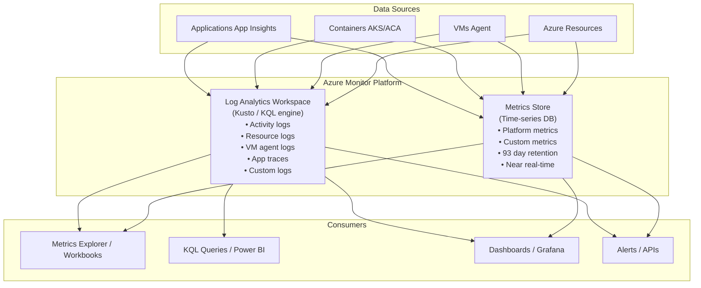
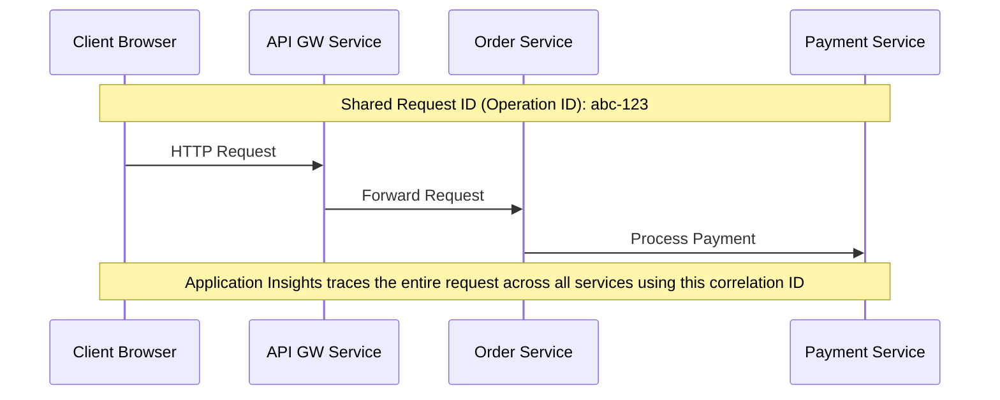

**Complexity**: [MEDIUM] | **Time to Complete**: 2.5h | **Prerequisites**: Module 3.3 (VMs), Module 3.1 (Entra ID)

## What You'll Be Able to Do

After completing this module, you will be able to:

- **Configure Azure Monitor with Log Analytics workspaces, diagnostic settings, and custom metric collection**
- **Implement alert rules with action groups, dynamic thresholds, and multi-resource metric alerts**
- **Deploy Application Insights for distributed tracing, dependency mapping, and performance anomaly detection**
- **Design centralized monitoring architectures using Azure Monitor across multiple subscriptions and resource types**

---

## Why This Module Matters

In April 2023, a logistics company running a fleet management application on Azure noticed that their customer complaints had tripled over two weeks. Drivers were reporting slow load times and intermittent errors. The engineering team had no idea what was happening because they had not configured any monitoring beyond the default Azure portal metrics. When they finally investigated, they discovered that their SQL database had been running at 98% DTU utilization for 11 days. A new reporting query, deployed two weeks earlier as part of a routine release, was running every 5 minutes and consuming massive database resources. Two weeks of degraded customer experience, a 15% spike in customer churn, and an estimated $180,000 in lost contracts---all because nobody was watching the metrics and nobody had set up an alert for "database utilization exceeds 80%."

Observability is not a luxury. It is the difference between proactively fixing problems and reactively apologizing to customers. Azure Monitor is the platform's unified observability service, collecting metrics and logs from every Azure resource, virtual machine, container, and application. Log Analytics provides the query engine to make sense of that data. Alerts turn signals into actions. Application Insights traces requests through distributed systems.

In this module, you will learn how Azure Monitor collects and organizes data, how to explore metrics in Metrics Explorer, how to write KQL (Kusto Query Language) queries against Log Analytics, how to create alerts with action groups, and how Application Insights provides end-to-end request tracing. By the end, you will deploy monitoring agents on a VM, ingest custom logs, write KQL queries, and create an alert that sends email when a threshold is breached.

---

## Azure Monitor Architecture

Azure Monitor is not a single service---it is a platform composed of several interconnected components:



> **Stop and think**: If a critical application crashes due to an out-of-memory exception, which monitoring capability (metrics or logs) would alert you that the memory was exhausted, and which would help you find the specific line of code that caused it?

### Metrics vs Logs

| Aspect | Metrics | Logs |
| :--- | :--- | :--- |
| **Data type** | Numeric time-series (counters, gauges) | Semi-structured text (JSON, syslog) |
| **Latency** | Near real-time (~1 minute) | 2-5 minutes (ingestion delay) |
| **Retention** | 93 days (free) | 31 days free, up to 12 years paid |
| **Query language** | Simple (filter, aggregate) | KQL (powerful, SQL-like) |
| **Cost** | Free (platform metrics) | $2.76/GB ingested |
| **Best for** | Dashboards, alerting on thresholds | Root cause analysis, auditing, forensics |
| **Examples** | CPU %, memory %, request count, latency | Error messages, audit events, request traces |

---

## Metrics Explorer: Real-Time Dashboards

Every Azure resource automatically emits **platform metrics** to the Azure Monitor metrics store. No configuration needed---metrics like CPU utilization, memory percentage, network bytes, and disk IOPS are collected the moment a resource is created.

```bash
# List available metrics for a VM
az monitor metrics list-definitions \
  --resource "/subscriptions/<sub>/resourceGroups/myRG/providers/Microsoft.Compute/virtualMachines/myVM" \
  --query '[].{Name:name.value, Unit:unit, Aggregation:primaryAggregationType}' -o table

# Query a specific metric (CPU percentage, last 1 hour, 5-minute intervals)
az monitor metrics list \
  --resource "/subscriptions/<sub>/resourceGroups/myRG/providers/Microsoft.Compute/virtualMachines/myVM" \
  --metric "Percentage CPU" \
  --interval PT5M \
  --start-time "$(date -u -v-1H '+%Y-%m-%dT%H:%M:%SZ' 2>/dev/null || date -u -d '-1 hour' '+%Y-%m-%dT%H:%M:%SZ')" \
  --aggregation Average Maximum \
  -o table

# Query storage account metrics
az monitor metrics list \
  --resource "/subscriptions/<sub>/resourceGroups/myRG/providers/Microsoft.Storage/storageAccounts/mystorage" \
  --metric "Transactions" \
  --interval PT1H \
  --aggregation Total \
  -o table
```

Common metrics you should always monitor:

| Resource | Critical Metrics | Alert Threshold (suggestion) |
| :--- | :--- | :--- |
| **VM** | Percentage CPU, Available Memory Bytes, Disk IOPS | CPU > 85%, Memory < 10%, Disk queue > 5 |
| **SQL Database** | DTU percentage, Connection failed | DTU > 80%, Failed connections > 10/5min |
| **Storage Account** | Availability, E2E Latency | Availability < 99.9%, Latency > 100ms |
| **App Service** | Response time, HTTP 5xx, CPU % | Response > 2s, 5xx > 5/min, CPU > 80% |
| **Container App** | Replica count, Request count, Response time | Response > 1s, Restarts > 3/hour |
| **Key Vault** | Service API Latency, Availability | Latency > 1s, Availability < 99.9% |

---

## Log Analytics Workspaces

A Log Analytics workspace is the central repository for log data. All logs---from Azure resources, VMs, containers, and applications---are sent to a workspace where you query them using KQL.

```bash
# Create a Log Analytics workspace
az monitor log-analytics workspace create \
  --resource-group myRG \
  --workspace-name kubedojo-logs \
  --location eastus2 \
  --retention-time 90

# Get workspace details
az monitor log-analytics workspace show \
  --resource-group myRG \
  --workspace-name kubedojo-logs \
  --query '{Name:name, ID:customerId, RetentionDays:retentionInDays}' -o table

# Enable diagnostic logs for a resource (send to Log Analytics)
WORKSPACE_ID=$(az monitor log-analytics workspace show \
  -g myRG -n kubedojo-logs --query id -o tsv)

az monitor diagnostic-settings create \
  --name "send-to-log-analytics" \
  --resource "/subscriptions/<sub>/resourceGroups/myRG/providers/Microsoft.KeyVault/vaults/myVault" \
  --workspace "$WORKSPACE_ID" \
  --logs '[{"category":"AuditEvent","enabled":true}]' \
  --metrics '[{"category":"AllMetrics","enabled":true}]'
```

### Common Log Tables

| Table | Source | Contains |
| :--- | :--- | :--- |
| `AzureActivity` | All resources | Control plane operations (create, delete, update) |
| `AzureDiagnostics` | Resources with diagnostics | Resource-specific logs (SQL, Key Vault, etc.) |
| `Heartbeat` | Azure Monitor Agent | VM health status (every minute) |
| `Syslog` | Linux VMs | System logs (auth, kernel, daemon) |
| `Event` | Windows VMs | Windows Event Log entries |
| `Perf` | VMs with agent | Performance counters (CPU, memory, disk) |
| `ContainerLogV2` | AKS | Container stdout/stderr |
| `AppRequests` | Application Insights | HTTP request traces |
| `AppExceptions` | Application Insights | Exception traces |

---

## KQL: Kusto Query Language

KQL is the query language for Azure Monitor logs. It is similar to SQL but uses a pipe-based syntax where each operator transforms the result of the previous one.

### KQL Fundamentals

```kusto
// Basic query structure: Table | operator1 | operator2 | ...

// Find all failed login attempts in the last 24 hours
SigninLogs
| where TimeGenerated > ago(24h)
| where ResultType != 0    // 0 = success
| project TimeGenerated, UserPrincipalName, IPAddress, ResultDescription
| order by TimeGenerated desc
| take 50

// Count errors by type in the last hour
AzureDiagnostics
| where TimeGenerated > ago(1h)
| where Category == "AuditEvent"
| where ResultType == "Failure"
| summarize FailureCount = count() by OperationName
| order by FailureCount desc

// Calculate P50, P95, P99 response times
AppRequests
| where TimeGenerated > ago(1h)
| summarize
    P50 = percentile(DurationMs, 50),
    P95 = percentile(DurationMs, 95),
    P99 = percentile(DurationMs, 99),
    Total = count()
    by bin(TimeGenerated, 5m)
| order by TimeGenerated asc

// Find VMs with high CPU (from performance counters)
Perf
| where TimeGenerated > ago(15m)
| where CounterName == "% Processor Time"
| where InstanceName == "_Total"
| summarize AvgCPU = avg(CounterValue), MaxCPU = max(CounterValue) by Computer
| where AvgCPU > 80
| order by AvgCPU desc
```

### Essential KQL Operators

| Operator | Purpose | Example |
| :--- | :--- | :--- |
| `where` | Filter rows | `where Status == 500` |
| `project` | Select/rename columns | `project Time=TimeGenerated, User` |
| `summarize` | Aggregate (count, avg, sum, etc.) | `summarize count() by Status` |
| `order by` | Sort results | `order by TimeGenerated desc` |
| `take` | Limit result count | `take 100` |
| `extend` | Add computed columns | `extend DurationSec = DurationMs / 1000` |
| `bin` | Group time into buckets | `bin(TimeGenerated, 5m)` |
| `join` | Join two tables | `join kind=inner (Table2) on Key` |
| `render` | Visualize as chart | `render timechart` |
| `ago` | Relative time | `ago(24h)`, `ago(7d)` |
| `between` | Range filter | `where Value between (10 .. 100)` |

### Practical KQL Queries for Day-to-Day Operations

```kusto
// Who deleted resources in the last 7 days?
AzureActivity
| where TimeGenerated > ago(7d)
| where OperationNameValue endswith "delete"
| where ActivityStatusValue == "Success"
| project TimeGenerated, Caller, ResourceGroup,
          Resource = tostring(split(ResourceId, "/")[-1]),
          Operation = OperationNameValue
| order by TimeGenerated desc

// Disk space usage trends (last 24 hours)
Perf
| where TimeGenerated > ago(24h)
| where ObjectName == "LogicalDisk" and CounterName == "% Free Space"
| where InstanceName !in ("_Total", "HarddiskVolume1")
| summarize AvgFreeSpace = avg(CounterValue) by Computer, InstanceName, bin(TimeGenerated, 1h)
| order by AvgFreeSpace asc

// Top 10 slowest API endpoints
AppRequests
| where TimeGenerated > ago(1h)
| where Success == true
| summarize AvgDuration = avg(DurationMs), P99 = percentile(DurationMs, 99), Count = count() by Name
| where Count > 10   // Filter out infrequent endpoints
| order by P99 desc
| take 10

// Anomaly detection: sudden spike in errors
AppExceptions
| where TimeGenerated > ago(24h)
| summarize ErrorCount = count() by bin(TimeGenerated, 15m)
| render timechart
```

---

> **Pause and predict**: If you configure an alert to trigger when CPU exceeds 90%, but you do not assign an Action Group to it, what will happen when the CPU hits 100%?

## Alerts and Action Groups

Alerts proactively notify you when conditions are met. An alert has three components: a **condition** (what to watch), an **action group** (what to do), and **severity** (how critical).

### Alert Types

| Type | Monitors | Evaluation Frequency | Use Case |
| :--- | :--- | :--- | :--- |
| **Metric alert** | Metric thresholds | 1 min | CPU > 85%, Response time > 2s |
| **Log alert** | KQL query results | 5-15 min | Error count > threshold, security events |
| **Activity log alert** | Control plane events | Real-time | Resource deleted, role assigned |
| **Smart detection** | AI-detected anomalies | Continuous | Unusual failure rate, performance degradation |

```bash
# Create an action group (email + webhook)
az monitor action-group create \
  --resource-group myRG \
  --name "platform-team" \
  --short-name "platform" \
  --email-receiver "oncall" "oncall@company.com" \
  --webhook-receiver "pagerduty" "https://events.pagerduty.com/integration/xxx/enqueue"

# Create a metric alert: VM CPU > 85% for 5 minutes
VM_ID="/subscriptions/<sub>/resourceGroups/myRG/providers/Microsoft.Compute/virtualMachines/myVM"
ACTION_GROUP_ID=$(az monitor action-group show -g myRG -n platform-team --query id -o tsv)

az monitor metrics alert create \
  --resource-group myRG \
  --name "high-cpu-alert" \
  --description "VM CPU exceeds 85% for 5 minutes" \
  --severity 2 \
  --scopes "$VM_ID" \
  --condition "avg Percentage CPU > 85" \
  --window-size 5m \
  --evaluation-frequency 1m \
  --action "$ACTION_GROUP_ID"

# Create a log alert: more than 10 errors in 15 minutes
WORKSPACE_ID=$(az monitor log-analytics workspace show -g myRG -n kubedojo-logs --query id -o tsv)

az monitor scheduled-query create \
  --resource-group myRG \
  --name "high-error-rate" \
  --description "More than 10 errors in 15 minutes" \
  --severity 1 \
  --scopes "$WORKSPACE_ID" \
  --condition "count 'AzureDiagnostics | where Category == \"AuditEvent\" | where ResultType == \"Failure\"' > 10" \
  --condition-query "AzureDiagnostics | where Category == 'AuditEvent' | where ResultType == 'Failure'" \
  --window-size 15m \
  --evaluation-frequency 5m \
  --action-groups "$ACTION_GROUP_ID"

# Create an activity log alert: resource group deleted
az monitor activity-log alert create \
  --resource-group myRG \
  --name "rg-deleted-alert" \
  --description "Resource group was deleted" \
  --condition "category=Administrative and operationName=Microsoft.Resources/subscriptions/resourceGroups/delete" \
  --action-group "$ACTION_GROUP_ID"
```

---

## Application Insights: End-to-End Tracing

Application Insights is a component of Azure Monitor focused on application performance monitoring (APM). It traces requests through distributed systems, captures exceptions, and profiles performance.



```bash
# Create Application Insights resource
az monitor app-insights component create \
  --app kubedojo-app-insights \
  --resource-group myRG \
  --location eastus2 \
  --kind web \
  --application-type web \
  --workspace "$WORKSPACE_ID"

# Get the instrumentation key and connection string
az monitor app-insights component show \
  --app kubedojo-app-insights -g myRG \
  --query '{InstrumentationKey:instrumentationKey, ConnectionString:connectionString}' -o json
```

Most Azure SDKs and popular frameworks auto-instrument when you set the `APPLICATIONINSIGHTS_CONNECTION_STRING` environment variable:

```bash
# Configure App Insights on a Container App
az containerapp update \
  --resource-group myRG \
  --name my-app \
  --set-env-vars "APPLICATIONINSIGHTS_CONNECTION_STRING=$APPINSIGHTS_CONN_STRING"
```

### Useful App Insights KQL Queries

```kusto
// Request performance by endpoint (last hour)
AppRequests
| where TimeGenerated > ago(1h)
| summarize
    AvgDuration = avg(DurationMs),
    P95 = percentile(DurationMs, 95),
    FailRate = countif(Success == false) * 100.0 / count(),
    Total = count()
    by Name
| order by Total desc

// Dependency call failures (DB, HTTP, etc.)
AppDependencies
| where TimeGenerated > ago(1h)
| where Success == false
| summarize FailCount = count() by Target, DependencyType, ResultCode
| order by FailCount desc

// End-to-end transaction search
AppRequests
| where OperationId == "abc123"
| union AppDependencies | where OperationId == "abc123"
| union AppExceptions | where OperationId == "abc123"
| project TimeGenerated, ItemType = Type, Name, DurationMs, Success, ResultCode
| order by TimeGenerated asc
```

---

## Azure Monitor Agent (AMA)

The Azure Monitor Agent replaces the legacy Log Analytics Agent (MMA/OMS). It collects performance counters, syslog, Windows events, and custom logs from VMs and sends them to Log Analytics.

```bash
# Install Azure Monitor Agent on a Linux VM
az vm extension set \
  --resource-group myRG \
  --vm-name myVM \
  --name AzureMonitorLinuxAgent \
  --publisher Microsoft.Azure.Monitor \
  --enable-auto-upgrade true

# Create a Data Collection Rule (DCR) - defines what to collect
az monitor data-collection rule create \
  --resource-group myRG \
  --name "vm-performance-rule" \
  --location eastus2 \
  --data-flows '[{
    "streams": ["Microsoft-Perf", "Microsoft-Syslog"],
    "destinations": ["logAnalyticsWorkspace"]
  }]' \
  --destinations '{
    "logAnalytics": [{
      "workspaceResourceId": "'$WORKSPACE_ID'",
      "name": "logAnalyticsWorkspace"
    }]
  }' \
  --data-sources '{
    "performanceCounters": [{
      "name": "perfCounters",
      "streams": ["Microsoft-Perf"],
      "samplingFrequencyInSeconds": 60,
      "counterSpecifiers": [
        "\\Processor(_Total)\\% Processor Time",
        "\\Memory\\Available Bytes",
        "\\LogicalDisk(_Total)\\% Free Space",
        "\\LogicalDisk(_Total)\\Disk Reads/sec",
        "\\LogicalDisk(_Total)\\Disk Writes/sec"
      ]
    }],
    "syslog": [{
      "name": "syslogDataSource",
      "streams": ["Microsoft-Syslog"],
      "facilityNames": ["auth", "authpriv", "cron", "daemon", "kern"],
      "logLevels": ["Warning", "Error", "Critical", "Alert", "Emergency"]
    }]
  }'

# Associate the DCR with the VM
DCR_ID=$(az monitor data-collection rule show -g myRG -n vm-performance-rule --query id -o tsv)
az monitor data-collection rule association create \
  --name "vm-dcr-association" \
  --resource "/subscriptions/<sub>/resourceGroups/myRG/providers/Microsoft.Compute/virtualMachines/myVM" \
  --rule-id "$DCR_ID"
```

---

## Did You Know?

1. **Log Analytics ingestion costs $2.76 per GB**, but the first 5 GB per billing account per month are free. A single VM running the Azure Monitor Agent with default performance counters and syslog collection generates approximately 1-3 GB of log data per month. However, enabling verbose application logging or NSG flow logs can push a single VM to 10+ GB per month. Always estimate your ingestion volume before enabling logging on production fleets.

2. **KQL was designed by the same team that built Azure Data Explorer** (Kusto), and it processes over 15 exabytes of data per day across Microsoft's internal telemetry systems. The same language is used in Microsoft Sentinel (SIEM), Azure Monitor, Azure Data Explorer, and Microsoft 365 Defender. Learning KQL is one of the highest-ROI skills for any Azure engineer.

3. **Azure Monitor can detect anomalies automatically using machine learning.** The `series_decompose_anomalies()` KQL function analyzes time-series data and flags data points that deviate significantly from the expected pattern. You do not need to set static thresholds---the model learns what "normal" looks like and alerts on deviations. This catches issues like "response time gradually increased 40% over 3 days" that static thresholds miss.

4. **Application Insights sampling reduces data volume without losing visibility.** By default, adaptive sampling kicks in when your application generates more than 5 events per second per server. It intelligently drops redundant telemetry (like 1000 identical successful requests) while preserving anomalies (errors, slow requests). A team generating 100 GB of App Insights data per month reduced it to 8 GB with adaptive sampling, with zero loss in diagnostic capability.

---

## Common Mistakes

| Mistake | Why It Happens | How to Fix It |
| :--- | :--- | :--- |
| Not setting up monitoring until after an incident | "We will add monitoring later" is the most expensive sentence in engineering | Set up baseline monitoring (CPU, memory, disk, response time) and alerts on day one, before the application goes to production. |
| Creating one Log Analytics workspace per resource | Misunderstanding of workspace purpose | Use one workspace per environment (dev, staging, prod) or per team. Multiple resources send logs to the same workspace. Separate workspaces fragment your data and make cross-resource queries impossible. |
| Setting alert thresholds too aggressively (e.g., CPU > 50%) | Teams want to catch problems early | Aggressive thresholds cause alert fatigue. The team ignores alerts, and real problems are missed. Set thresholds at actionable levels (CPU > 85%, not 50%). |
| Not configuring action groups on alerts | Alerts are created but nobody receives them | Every alert must have an action group. At minimum, email the on-call team. Better: integrate with PagerDuty/Opsgenie for proper incident management. |
| Using the legacy Log Analytics Agent (MMA) instead of Azure Monitor Agent | MMA appears in older documentation and tutorials | MMA is deprecated. Always use the Azure Monitor Agent (AMA) with Data Collection Rules. AMA supports identity-based auth, multiple workspaces, and data transformation. |
| Writing KQL queries that scan entire tables without time filters | The query "works" but takes 30 seconds | Always start KQL queries with a `where TimeGenerated > ago(...)` filter. Log Analytics partitions data by time, so time filters dramatically reduce scan volume and cost. |
| Not enabling diagnostic settings on critical resources | Diagnostic settings are not enabled by default | Use Azure Policy to enforce diagnostic settings across all resources. At minimum, enable them on Key Vault, SQL, storage accounts, and networking resources. |
| Logging sensitive data (passwords, tokens, PII) to Log Analytics | Applications log full request/response bodies for debugging | Implement log scrubbing. Never log request bodies, authorization headers, or user PII. Application Insights allows custom telemetry processors to redact sensitive fields before ingestion. |

---

## Quiz

<details>
<summary>1. Your team is building a new microservice and wants to be notified immediately if the HTTP 500 error rate exceeds 5% for more than a minute. They also want to be able to search the exact error messages and stack traces from those failing requests to find the root cause. How should you use Azure Monitor metrics and logs to satisfy both requirements?</summary>

You should use metrics for the alerting requirement and logs for the root cause analysis. Metrics are numeric time-series data points that are evaluated in near real-time (1-minute granularity), making them perfect for triggering fast, threshold-based alerts like a 5% error rate. Logs, on the other hand, contain rich semi-structured text data such as full stack traces and error messages, which are necessary for debugging. However, logs have a slight ingestion delay (2-5 minutes) and are more expensive to store, making them less ideal for instantaneous alerting but essential for deep investigation.
</details>

<details>
<summary>2. A critical production storage account was unexpectedly deleted sometime during the past weekend, causing an application outage. Your manager has asked you to figure out exactly who deleted the resource and when the deletion occurred. Write a KQL query that retrieves this information from the control plane logs for the last 7 days.</summary>

```kusto
AzureActivity
| where TimeGenerated > ago(7d)
| where OperationNameValue endswith "delete"
| where ActivityStatusValue == "Success"
| project
    TimeGenerated,
    Caller,
    ResourceGroup,
    ResourceType = tostring(split(ResourceId, "/")[-2]),
    ResourceName = tostring(split(ResourceId, "/")[-1]),
    OperationName = OperationNameValue
| order by TimeGenerated desc
```

This query targets the `AzureActivity` table, which records all control plane operations (like creations, updates, and deletions) across your Azure subscription. By filtering for operations ending with "delete" and a "Success" status, you isolate the exact events where resources were removed. The `project` operator then extracts only the most relevant fields—specifically the `Caller` (which identifies the user or service principal) and the precise `TimeGenerated`—allowing you to quickly answer who performed the action and when. It sorts the output by time in descending order to surface the most recent deletions first. By querying this centralized control plane log rather than resource-specific logs, you can guarantee visibility even after the resource itself is gone.
</details>

<details>
<summary>3. A junior engineer on your team suggests that to keep things organized, you should create a separate Log Analytics workspace for every single Azure App Service and SQL Database in your production environment (over 50 workspaces total). Why is this a problematic architectural decision?</summary>

Creating a separate workspace for every resource severely fragments your log data and breaks your ability to perform end-to-end tracing. When a user request fails, you often need to correlate logs from the frontend App Service with logs from the backend SQL Database. If those logs are in different workspaces, writing a single KQL query to join them becomes significantly harder, slower, and more expensive. The recommended best practice is to centralize logs into a single workspace per environment (e.g., one for production, one for staging) and use Role-Based Access Control (RBAC) to restrict who can query specific tables or resources.
</details>

<details>
<summary>4. You have a fleet of 100 Linux VMs running the Azure Monitor Agent. The security team wants to collect all `auth` and `kern` syslog events, while the platform team only wants to collect CPU and Memory performance counters. How can you configure the agents to satisfy both teams without installing two different monitoring agents?</summary>

You can satisfy both teams by using a Data Collection Rule (DCR) in Azure Monitor. A DCR is a centralized configuration resource that defines exactly what data should be collected (like performance counters or syslog facilities), how it should be transformed, and to which Log Analytics workspace it should be routed. Instead of configuring each VM's agent individually, you create one or more DCRs defining the security and platform requirements, and then associate those rules with your 100 VMs. The Azure Monitor Agent will automatically download the rules and begin collecting only the specified data streams, keeping configuration consistent and easy to manage centrally.
</details>

<details>
<summary>5. Since deploying a new application, your on-call engineers are receiving over 50 alert emails per day. Most of these alerts trigger when a VM's CPU exceeds 50% for a single minute, but the CPU drops back to 20% almost immediately. The engineers have started ignoring all monitoring emails. How should you redesign the alerting strategy to fix this?</summary>

You need to redesign the strategy to eliminate alert fatigue by adjusting both the thresholds and the evaluation windows. First, a 50% CPU spike for one minute is normal behavior for many applications; you should raise the threshold to an actionable level (e.g., 85%) and increase the window size so the alert only fires if the CPU remains elevated for 5 or 10 consecutive minutes. Second, you should route alerts based on severity: transient or non-critical issues (Sev 3/4) should be logged to a dashboard or chat channel, while only critical, user-impacting issues (Sev 0/1) should trigger emails or wake up an engineer via PagerDuty. Finally, you might consider using dynamic thresholds that rely on machine learning to alert only when the CPU deviates significantly from its historical baseline.
</details>

<details>
<summary>6. Your architecture consists of a frontend web app, an API gateway, and three backend microservices. A user reports that when they click "Checkout", the page spins for 10 seconds and then fails. You need to figure out which specific backend microservice is causing the delay. How does Application Insights track this single checkout request across all five components?</summary>

Application Insights tracks the request across multiple services by implementing distributed tracing based on the W3C Trace Context standard. When the user clicks "Checkout", the first component (the frontend web app) generates a unique Operation ID for that specific transaction. This Operation ID is automatically injected into the HTTP headers (such as `traceparent`) of all subsequent outbound calls to the API gateway and backend microservices. Because every service logs its telemetry (requests, dependencies, exceptions) using that exact same Operation ID, you can query Application Insights for that ID to visualize the entire end-to-end transaction, instantly identifying which specific microservice took 10 seconds to respond.
</details>

---

## Hands-On Exercise: Monitor Agent on VM with Custom Logs, KQL Query, and Email Alert

In this exercise, you will deploy a VM with the Azure Monitor Agent, collect performance data and custom logs, write KQL queries, and create an email alert.

**Prerequisites**: Azure CLI installed and authenticated.

### Task 1: Create Infrastructure

```bash
RG="kubedojo-monitor-lab"
LOCATION="eastus2"

az group create --name "$RG" --location "$LOCATION"

# Create Log Analytics workspace
az monitor log-analytics workspace create \
  --resource-group "$RG" \
  --workspace-name monitor-lab-logs \
  --location "$LOCATION" \
  --retention-time 30

WORKSPACE_ID=$(az monitor log-analytics workspace show \
  -g "$RG" -n monitor-lab-logs --query id -o tsv)
WORKSPACE_CUSTOMER_ID=$(az monitor log-analytics workspace show \
  -g "$RG" -n monitor-lab-logs --query customerId -o tsv)
```

<details>
<summary>Verify Task 1</summary>

```bash
az monitor log-analytics workspace show -g "$RG" -n monitor-lab-logs \
  --query '{Name:name, ID:customerId, Retention:retentionInDays}' -o table
```
</details>

### Task 2: Deploy a VM with Azure Monitor Agent

```bash
# Create a VM
az vm create \
  --resource-group "$RG" \
  --name monitor-lab-vm \
  --image Ubuntu2204 \
  --size Standard_B2s \
  --admin-username azureuser \
  --generate-ssh-keys \
  --assign-identity '[system]'

# Install Azure Monitor Agent
az vm extension set \
  --resource-group "$RG" \
  --vm-name monitor-lab-vm \
  --name AzureMonitorLinuxAgent \
  --publisher Microsoft.Azure.Monitor \
  --enable-auto-upgrade true

# Grant the VM's identity access to the DCR (Monitoring Metrics Publisher)
VM_IDENTITY=$(az vm identity show -g "$RG" -n monitor-lab-vm --query principalId -o tsv)
```

<details>
<summary>Verify Task 2</summary>

```bash
az vm extension list -g "$RG" --vm-name monitor-lab-vm \
  --query '[].{Name:name, Publisher:publisher, State:provisioningState}' -o table
```

You should see AzureMonitorLinuxAgent with Succeeded state.
</details>

### Task 3: Create a Data Collection Rule

```bash
az monitor data-collection rule create \
  --resource-group "$RG" \
  --name "vm-perf-syslog-rule" \
  --location "$LOCATION" \
  --data-flows '[{
    "streams": ["Microsoft-Perf"],
    "destinations": ["logAnalytics"]
  }, {
    "streams": ["Microsoft-Syslog"],
    "destinations": ["logAnalytics"]
  }]' \
  --destinations "{
    \"logAnalytics\": [{
      \"workspaceResourceId\": \"$WORKSPACE_ID\",
      \"name\": \"logAnalytics\"
    }]
  }" \
  --data-sources '{
    "performanceCounters": [{
      "name": "perfCounters",
      "streams": ["Microsoft-Perf"],
      "samplingFrequencyInSeconds": 30,
      "counterSpecifiers": [
        "\\Processor(_Total)\\% Processor Time",
        "\\Memory\\Available Bytes",
        "\\Memory\\% Used Memory",
        "\\LogicalDisk(_Total)\\% Free Space"
      ]
    }],
    "syslog": [{
      "name": "syslog",
      "streams": ["Microsoft-Syslog"],
      "facilityNames": ["auth", "authpriv", "daemon", "kern"],
      "logLevels": ["Warning", "Error", "Critical", "Alert", "Emergency"]
    }]
  }'

# Associate DCR with the VM
DCR_ID=$(az monitor data-collection rule show -g "$RG" -n vm-perf-syslog-rule --query id -o tsv)
VM_ID=$(az vm show -g "$RG" -n monitor-lab-vm --query id -o tsv)

az monitor data-collection rule association create \
  --name "vm-dcr-assoc" \
  --resource "$VM_ID" \
  --rule-id "$DCR_ID"
```

<details>
<summary>Verify Task 3</summary>

```bash
az monitor data-collection rule association list --resource "$VM_ID" \
  --query '[].{Name:name, RuleId:dataCollectionRuleId}' -o table
```
</details>

### Task 4: Generate Load and Wait for Data

```bash
# Generate some CPU load on the VM
az vm run-command invoke -g "$RG" -n monitor-lab-vm \
  --command-id RunShellScript \
  --scripts "stress-ng --cpu 2 --timeout 120 &" 2>/dev/null || \
az vm run-command invoke -g "$RG" -n monitor-lab-vm \
  --command-id RunShellScript \
  --scripts "for i in \$(seq 1 4); do yes > /dev/null & done; sleep 120; kill %1 %2 %3 %4 2>/dev/null"

echo "Generating CPU load... Waiting 5 minutes for data to appear in Log Analytics."
echo "(Data ingestion typically takes 3-8 minutes)"
sleep 300
```

<details>
<summary>Verify Task 4</summary>

```bash
# Query Log Analytics for performance data
az monitor log-analytics query \
  --workspace "$WORKSPACE_CUSTOMER_ID" \
  --analytics-query "Perf | where TimeGenerated > ago(10m) | where Computer contains 'monitor-lab' | summarize avg(CounterValue) by CounterName | order by CounterName asc" \
  --output table
```

You should see CPU and memory counter data.
</details>

### Task 5: Create an Alert Rule with Action Group

```bash
# Create an action group (email notification)
az monitor action-group create \
  --resource-group "$RG" \
  --name "lab-alerts" \
  --short-name "labalerts" \
  --email-receiver "lab-oncall" "your-email@example.com"

# Create a metric alert for high CPU
ACTION_GROUP_ID=$(az monitor action-group show -g "$RG" -n lab-alerts --query id -o tsv)

az monitor metrics alert create \
  --resource-group "$RG" \
  --name "vm-high-cpu" \
  --description "Alert when CPU exceeds 80% for 5 minutes" \
  --severity 2 \
  --scopes "$VM_ID" \
  --condition "avg Percentage CPU > 80" \
  --window-size 5m \
  --evaluation-frequency 1m \
  --action "$ACTION_GROUP_ID"
```

<details>
<summary>Verify Task 5</summary>

```bash
az monitor metrics alert show -g "$RG" -n vm-high-cpu \
  --query '{Name:name, Severity:severity, Enabled:enabled, Condition:criteria.allOf[0].{Metric:metricName, Operator:operator, Threshold:threshold}}' -o json
```
</details>

### Task 6: Run KQL Queries

```bash
# Query 1: Average CPU over the last 10 minutes
az monitor log-analytics query \
  --workspace "$WORKSPACE_CUSTOMER_ID" \
  --analytics-query "
    Perf
    | where TimeGenerated > ago(10m)
    | where CounterName == '% Processor Time'
    | where InstanceName == '_Total'
    | summarize AvgCPU = avg(CounterValue), MaxCPU = max(CounterValue) by bin(TimeGenerated, 1m)
    | order by TimeGenerated desc
  " --output table

# Query 2: Memory usage
az monitor log-analytics query \
  --workspace "$WORKSPACE_CUSTOMER_ID" \
  --analytics-query "
    Perf
    | where TimeGenerated > ago(10m)
    | where CounterName == '% Used Memory'
    | summarize AvgMemory = avg(CounterValue) by bin(TimeGenerated, 1m)
    | order by TimeGenerated desc
  " --output table

# Query 3: Agent heartbeat (proves the agent is reporting)
az monitor log-analytics query \
  --workspace "$WORKSPACE_CUSTOMER_ID" \
  --analytics-query "
    Heartbeat
    | where TimeGenerated > ago(10m)
    | summarize LastHeartbeat = max(TimeGenerated) by Computer, OSType, Version
  " --output table
```

<details>
<summary>Verify Task 6</summary>

All three queries should return data. If they are empty, wait another 5 minutes for data ingestion and retry. The Heartbeat query is the most reliable indicator that the agent is working.
</details>

### Cleanup

```bash
az group delete --name "$RG" --yes --no-wait
```

### Success Criteria

- [ ] Log Analytics workspace created
- [ ] VM deployed with Azure Monitor Agent and system-assigned managed identity
- [ ] Data Collection Rule created and associated with the VM
- [ ] Performance counter data visible in Log Analytics (Perf table)
- [ ] KQL queries returning CPU, memory, and heartbeat data
- [ ] Metric alert created with email action group

---

## Next Module

[Module 3.11: CI/CD with Azure DevOps & GitHub Actions](../module-3.11-cicd/) --- Learn how to build automated deployment pipelines that securely deploy to Azure using OIDC authentication, Azure Container Registry, and Container Apps.