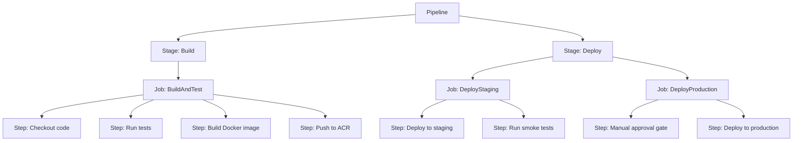
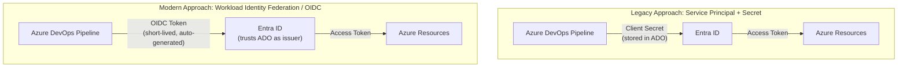
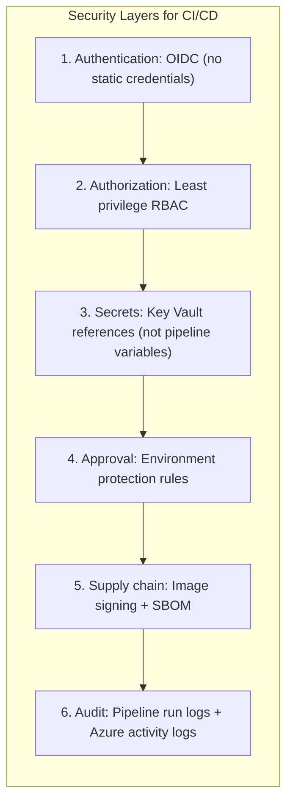

**Complexity**: [MEDIUM] | **Time to Complete**: 2h | **Prerequisites**: Module 3.6 (ACR), Module 3.7 (Container Apps), Module 3.1 (Entra ID)

## What You'll Be Able to Do

After completing this module, you will be able to:

- **Design multi-stage CI/CD pipelines incorporating container builds and release approvals for platforms like Azure DevOps and GitHub Actions**
- **Configure GitHub Actions workflows with Azure login, container builds, and Container Apps deployment steps**
- **Implement deployment approvals and staging environments using Azure DevOps and GitHub Actions environments**
- **Secure CI/CD pipelines with service connections, managed identities, and environment protection rules**

---

## Why This Module Matters

In February 2023, a major CI/CD platform disclosed that an attacker had gained access to customer repositories by compromising a shared runner environment. The attacker injected malicious code into the build process, which exfiltrated environment variables---including service principal credentials that customers had stored as pipeline secrets. Over 35,000 repositories were potentially affected. Several Azure production environments were compromised because teams had stored long-lived service principal secrets in their pipeline variables, and those secrets had full Contributor access to production subscriptions.

This incident crystallized a lesson the industry had been learning the hard way: **the CI/CD pipeline is the most privileged part of your infrastructure, and it deserves the strongest security posture.** Your pipeline has the power to deploy code to production, access secrets, and modify infrastructure. If an attacker compromises your pipeline, they own your production environment. Static credentials stored in pipeline variables are a ticking time bomb---they do not expire, they are visible to anyone with pipeline admin access, and they are one SSRF vulnerability away from being exfiltrated.

In this module, you will learn how to build secure CI/CD pipelines targeting Azure using two platforms: Azure DevOps Pipelines and GitHub Actions. You will understand YAML pipeline syntax, how Service Connections and OIDC federation eliminate static credentials, and how to deploy to Azure Container Registry and Container Apps. By the end, you will build a complete GitHub Actions pipeline that authenticates to Azure using OIDC (zero secrets), builds a container image, pushes it to ACR, and deploys it to Container Apps.

---

## Azure DevOps Pipelines

Azure DevOps is Microsoft's integrated DevOps platform providing source control (Azure Repos), CI/CD (Azure Pipelines), project management (Boards), artifact management (Artifacts), and testing (Test Plans).

### Pipeline Basics

Azure Pipelines uses YAML files (typically `azure-pipelines.yml`) to define build and deployment workflows. A pipeline consists of **stages**, **jobs**, and **steps**.



```yaml
# azure-pipelines.yml
trigger:
  branches:
    include:
      - main
  paths:
    exclude:
      - '**/*.md'
      - '.github/**'

pool:
  vmImage: 'ubuntu-latest'

variables:
  acrName: 'myacr'
  imageName: 'myapp'
  tag: '$(Build.BuildId)'

stages:
  - stage: Build
    displayName: 'Build and Push Image'
    jobs:
      - job: BuildJob
        steps:
          - task: Docker@2
            displayName: 'Build and Push to ACR'
            inputs:
              containerRegistry: 'acr-service-connection'
              repository: '$(imageName)'
              command: 'buildAndPush'
              Dockerfile: '**/Dockerfile'
              tags: |
                $(tag)
                latest

  - stage: DeployStaging
    displayName: 'Deploy to Staging'
    dependsOn: Build
    condition: succeeded()
    jobs:
      - deployment: DeployStagingJob
        environment: 'staging'
        strategy:
          runOnce:
            deploy:
              steps:
                - task: AzureContainerApps@1
                  displayName: 'Deploy to Container Apps'
                  inputs:
                    azureSubscription: 'azure-service-connection'
                    containerAppName: 'myapp-staging'
                    resourceGroup: 'myRG'
                    imageToDeploy: '$(acrName).azurecr.io/$(imageName):$(tag)'

  - stage: DeployProduction
    displayName: 'Deploy to Production'
    dependsOn: DeployStaging
    condition: succeeded()
    jobs:
      - deployment: DeployProdJob
        environment: 'production'  # Requires manual approval configured on the environment
        strategy:
          runOnce:
            deploy:
              steps:
                - task: AzureContainerApps@1
                  inputs:
                    azureSubscription: 'azure-service-connection'
                    containerAppName: 'myapp-production'
                    resourceGroup: 'myRG-prod'
                    imageToDeploy: '$(acrName).azurecr.io/$(imageName):$(tag)'
```

### Service Connections (OIDC/Workload Identity Federation)

Service Connections are how Azure DevOps authenticates with Azure. The modern approach uses **Workload Identity Federation** (OIDC), which eliminates client secrets entirely.



To create a Workload Identity Federation service connection in Azure DevOps:

1. Go to Project Settings > Service Connections > New service connection
2. Select "Azure Resource Manager"
3. Select "Workload Identity federation (automatic)" (or manual for custom setup)
4. Select your subscription and resource group scope
5. Azure DevOps automatically creates the app registration and federated credential

```bash
# Manual setup: Create app registration with federated credential for Azure DevOps
az ad app create --display-name "azure-devops-cicd"
APP_ID=$(az ad app list --display-name "azure-devops-cicd" --query '[0].appId' -o tsv)

# Create service principal
az ad sp create --id "$APP_ID"

# Add federated credential for Azure DevOps
az ad app federated-credential create --id "$APP_ID" --parameters '{
  "name": "azure-devops-federation",
  "issuer": "https://vstoken.dev.azure.com/YOUR_ORG_ID",
  "subject": "sc://YOUR_ORG/YOUR_PROJECT/YOUR_SERVICE_CONNECTION",
  "audiences": ["api://AzureADTokenExchange"]
}'

# Grant the service principal appropriate RBAC
SP_OBJECT_ID=$(az ad sp show --id "$APP_ID" --query id -o tsv)
az role assignment create \
  --assignee "$SP_OBJECT_ID" \
  --role Contributor \
  --scope "/subscriptions/<sub-id>/resourceGroups/myRG"
```

---

## GitHub Actions Targeting Azure

GitHub Actions is GitHub's built-in CI/CD platform. If your code lives on GitHub, Actions provides tight integration with zero additional tooling.

### Workflow Basics

GitHub Actions workflows live in `.github/workflows/` and are triggered by events (push, pull_request, schedule, manual dispatch).

```yaml
# .github/workflows/deploy.yml
name: Build and Deploy to Azure

on:
  push:
    branches: [main]
  pull_request:
    branches: [main]
  workflow_dispatch:  # Manual trigger

permissions:
  id-token: write   # Required for OIDC
  contents: read

env:
  ACR_NAME: myacr
  IMAGE_NAME: myapp
  RESOURCE_GROUP: myRG
  CONTAINER_APP_NAME: myapp

jobs:
  build:
    runs-on: ubuntu-latest
    outputs:
      image-tag: ${{ steps.meta.outputs.version }}
    steps:
      - name: Checkout code
        uses: actions/checkout@v4

      - name: Azure Login (OIDC)
        uses: azure/login@v2
        with:
          client-id: ${{ secrets.AZURE_CLIENT_ID }}
          tenant-id: ${{ secrets.AZURE_TENANT_ID }}
          subscription-id: ${{ secrets.AZURE_SUBSCRIPTION_ID }}

      - name: Login to ACR
        run: az acr login --name ${{ env.ACR_NAME }}

      - name: Docker meta (tags and labels)
        id: meta
        uses: docker/metadata-action@v5
        with:
          images: ${{ env.ACR_NAME }}.azurecr.io/${{ env.IMAGE_NAME }}
          tags: |
            type=sha,prefix=
            type=ref,event=branch
            type=semver,pattern={{version}}

      - name: Build and push
        uses: docker/build-push-action@v6
        with:
          context: .
          push: ${{ github.event_name != 'pull_request' }}
          tags: ${{ steps.meta.outputs.tags }}
          labels: ${{ steps.meta.outputs.labels }}

  deploy-staging:
    needs: build
    if: github.ref == 'refs/heads/main' && github.event_name != 'pull_request'
    runs-on: ubuntu-latest
    environment: staging
    steps:
      - name: Azure Login (OIDC)
        uses: azure/login@v2
        with:
          client-id: ${{ secrets.AZURE_CLIENT_ID }}
          tenant-id: ${{ secrets.AZURE_TENANT_ID }}
          subscription-id: ${{ secrets.AZURE_SUBSCRIPTION_ID }}

      - name: Deploy to Container Apps
        uses: azure/container-apps-deploy-action@v2
        with:
          resourceGroup: ${{ env.RESOURCE_GROUP }}
          containerAppName: ${{ env.CONTAINER_APP_NAME }}-staging
          imageToDeploy: ${{ env.ACR_NAME }}.azurecr.io/${{ env.IMAGE_NAME }}:${{ needs.build.outputs.image-tag }}

  deploy-production:
    needs: [build, deploy-staging]
    if: github.ref == 'refs/heads/main' && github.event_name != 'pull_request'
    runs-on: ubuntu-latest
    environment: production  # Requires approval reviewers configured in GitHub
    steps:
      - name: Azure Login (OIDC)
        uses: azure/login@v2
        with:
          client-id: ${{ secrets.AZURE_CLIENT_ID }}
          tenant-id: ${{ secrets.AZURE_TENANT_ID }}
          subscription-id: ${{ secrets.AZURE_SUBSCRIPTION_ID }}

      - name: Deploy to Container Apps
        uses: azure/container-apps-deploy-action@v2
        with:
          resourceGroup: ${{ env.RESOURCE_GROUP }}
          containerAppName: ${{ env.CONTAINER_APP_NAME }}
          imageToDeploy: ${{ env.ACR_NAME }}.azurecr.io/${{ env.IMAGE_NAME }}:${{ needs.build.outputs.image-tag }}
```

### OIDC Setup for GitHub Actions

```bash
# Create an app registration for GitHub Actions
az ad app create --display-name "github-actions-deploy"
APP_ID=$(az ad app list --display-name "github-actions-deploy" --query '[0].appId' -o tsv)
APP_OBJECT_ID=$(az ad app list --display-name "github-actions-deploy" --query '[0].id' -o tsv)

# Create service principal
az ad sp create --id "$APP_ID"

# Create federated credentials for different scenarios

# 1. For the main branch
az ad app federated-credential create --id "$APP_OBJECT_ID" --parameters '{
  "name": "github-main-branch",
  "issuer": "https://token.actions.githubusercontent.com",
  "subject": "repo:myorg/myrepo:ref:refs/heads/main",
  "audiences": ["api://AzureADTokenExchange"]
}'

# 2. For pull requests (read-only access for testing)
az ad app federated-credential create --id "$APP_OBJECT_ID" --parameters '{
  "name": "github-pull-requests",
  "issuer": "https://token.actions.githubusercontent.com",
  "subject": "repo:myorg/myrepo:pull_request",
  "audiences": ["api://AzureADTokenExchange"]
}'

# 3. For a specific environment (production)
az ad app federated-credential create --id "$APP_OBJECT_ID" --parameters '{
  "name": "github-production-env",
  "issuer": "https://token.actions.githubusercontent.com",
  "subject": "repo:myorg/myrepo:environment:production",
  "audiences": ["api://AzureADTokenExchange"]
}'

# Grant RBAC roles
SP_OBJECT_ID=$(az ad sp show --id "$APP_ID" --query id -o tsv)

# ACR push access
ACR_ID=$(az acr show -n myacr --query id -o tsv)
az role assignment create --assignee "$SP_OBJECT_ID" --role AcrPush --scope "$ACR_ID"

# Container Apps contributor access
az role assignment create \
  --assignee "$SP_OBJECT_ID" \
  --role Contributor \
  --scope "/subscriptions/<sub-id>/resourceGroups/myRG"
```

Then add to GitHub repository secrets:
- `AZURE_CLIENT_ID`: The application (client) ID
- `AZURE_TENANT_ID`: Your Entra ID tenant ID
- `AZURE_SUBSCRIPTION_ID`: Your Azure subscription ID

No secrets or passwords---OIDC handles authentication using short-lived tokens generated per workflow run.

> **Stop and think**: If an OIDC token is valid for only 10 minutes, how does a pipeline that takes 45 minutes to run maintain authentication to Azure?

---

## Self-Hosted Agents and Runners

Both Azure DevOps and GitHub Actions offer hosted runners (Microsoft/GitHub manages the VM), but you may need self-hosted runners for:
- Accessing private VNet resources (private endpoints, internal APIs)
- Using specialized hardware (GPU, high-memory)
- Reducing build times with persistent caches
- Compliance requirements (builds must run in your environment)

### Azure DevOps Self-Hosted Agent

```bash
# Deploy a self-hosted agent as a Container Instance
az container create \
  --resource-group myRG \
  --name ado-agent \
  --image mcr.microsoft.com/azure-pipelines/vsts-agent:ubuntu-22.04 \
  --cpu 2 \
  --memory 4 \
  --environment-variables \
    AZP_URL="https://dev.azure.com/myorg" \
    AZP_POOL="Self-Hosted" \
    AZP_AGENT_NAME="aci-agent-1" \
  --secure-environment-variables \
    AZP_TOKEN="$AZURE_DEVOPS_PAT" \
  --restart-policy Always
```

### GitHub Actions Self-Hosted Runner on Azure

```bash
# Deploy a runner as a VM Scale Set (recommended for auto-scaling)
# First, install the runner on a base VM, create an image, then use VMSS.

# For a single runner (quick setup):
az vm create \
  --resource-group myRG \
  --name github-runner \
  --image Ubuntu2204 \
  --size Standard_D4s_v5 \
  --admin-username azureuser \
  --generate-ssh-keys \
  --custom-data @runner-cloud-init.yaml

# runner-cloud-init.yaml would install the runner package and register it
```

For production, use the official **Actions Runner Controller (ARC)** on AKS, which auto-scales runners based on pending jobs.

> **Pause and predict**: Why might deploying a self-hosted runner inside your production virtual network introduce new security risks compared to using Microsoft-hosted runners?

---

## Pipeline Security Best Practices



| Practice | Why | Implementation |
| :--- | :--- | :--- |
| **Use OIDC, not client secrets** | Secrets can leak; OIDC tokens are ephemeral | Azure Login action with `id-token: write` permission |
| **Scope RBAC to resource groups** | Contributor on subscription is too broad | `az role assignment create --scope /subscriptions/.../resourceGroups/specific-rg` |
| **Use environments with approvals** | Prevent accidental production deploys | GitHub Environments with required reviewers |
| **Pin action versions by SHA** | Tag-based versions can be overwritten | `uses: actions/checkout@a12a3943b...` instead of `@v4` |
| **Scan images before deployment** | Catch vulnerabilities before they reach production | `trivy image myacr.azurecr.io/myapp:latest` in the pipeline |
| **Use branch protection rules** | Prevent direct pushes to main | Require PRs, status checks, and code review |

**War Story**: A startup used a service principal with Contributor access to their production subscription, stored as a GitHub secret. An attacker submitted a pull request that modified the workflow file to echo the secret to the pipeline logs. Because the repository did not have branch protection requiring approval for workflow changes, the PR was auto-merged by a bot. The secret appeared in the workflow run logs, which were public because the repository was public. Within minutes, the attacker had Contributor access to the production subscription. The fix: OIDC (no secret to leak), environment protection rules (require approval), and branch protection (require review for workflow changes).

> **Stop and think**: If you use branch protection rules to require pull request reviews, how could an attacker with Contributor access to the repository still compromise the pipeline without merging a PR?

---

## Did You Know?

1. **GitHub Actions OIDC tokens are valid for only 10 minutes** and are scoped to the specific workflow run, job, and repository. Even if an attacker intercepts a token, it expires before they can do anything meaningful. Compare this to a client secret with a 1-2 year expiry---the attack window is reduced from years to minutes.

2. **Azure DevOps supports pipeline caching** that persists across runs. A Node.js project with 500 MB of node_modules can restore its cache in 15 seconds instead of running `npm install` for 3 minutes. Over 100 pipeline runs per week, that saves 4.2 hours of build time. Use the `Cache@2` task with a hash of your lock file as the cache key.

3. **GitHub Actions hosted runners are ephemeral and fresh for every job.** Each job gets a brand-new VM with a clean filesystem. This is excellent for security (no contamination between builds) but means every job starts from scratch. Self-hosted runners persist between jobs, enabling persistent caches and pre-installed tools, but require you to manage security (ensuring one job cannot access another job's data).

4. **Azure DevOps Pipelines can deploy to any cloud**, not just Azure. The platform supports service connections for AWS, GCP, Kubernetes (any cluster), SSH targets, and generic REST APIs. A single pipeline can build in Azure DevOps, push images to ACR, and deploy to an EKS cluster on AWS.

---

## Common Mistakes

| Mistake | Why It Happens | How to Fix It |
| :--- | :--- | :--- |
| Storing Azure credentials as pipeline secrets instead of using OIDC | OIDC setup requires more initial configuration | Invest 15 minutes in OIDC setup. It eliminates secret rotation, reduces blast radius, and prevents credential exfiltration. |
| Granting Contributor at subscription scope to the pipeline identity | It is the quickest way to "make it work" | Create a custom role or use Contributor scoped to the specific resource group the pipeline deploys to. |
| Not using environments with approval gates for production | "We trust our team" or "approvals slow us down" | Environment protection rules are the last line of defense against accidental or malicious production deployments. A 30-second approval is cheap insurance. |
| Running `docker build` on the runner instead of using ACR Tasks | Teams are familiar with local Docker builds | ACR Tasks builds images in Azure, reducing build time (no push over internet), leveraging Azure network for base image pulls, and eliminating the need for Docker on the runner. |
| Using `actions/checkout@v4` instead of pinning to a specific SHA | Version tags are readable and convenient | Tags can be moved to point to different commits (supply chain attack). Pin critical actions to their full SHA: `actions/checkout@a12a3943...`. |
| Not scanning images for vulnerabilities in the pipeline | "Scanning slows down the pipeline" | Add Trivy or Microsoft Defender scan as a pipeline step. A 30-second scan catches vulnerabilities before they reach production. Better to delay a deploy than to deploy a vulnerable image. |
| Hardcoding resource names in the workflow file | It works for a single environment | Use workflow inputs, environment variables, or matrix strategies to parameterize resource names. This enables the same workflow to deploy to staging and production. |
| Not testing the deployment rollback process | "We will figure it out when we need to" | Include a rollback step or document the rollback procedure. For Container Apps, this means reactivating a previous revision. Test it before you need it. |

---

## Quiz

<details>
<summary>1. Your team currently uses an Azure Service Principal client secret stored as a GitHub secret for CI/CD deployments. Security mandates that all static credentials be rotated every 30 days. How does migrating to OIDC federation solve this operational burden, and why does it improve the pipeline's security posture?</summary>

OIDC (OpenID Connect) federation allows a CI/CD platform to authenticate with Azure without any stored secrets. The CI/CD platform generates a short-lived OIDC token that includes claims about the workflow. Azure Entra ID is configured to trust the CI/CD platform as an OIDC token issuer. When the pipeline presents the token, Entra ID validates it and issues an Azure access token. This eliminates manual rotation because no secret is stored that can be leaked, tokens are ephemeral, and they are scoped to the specific workflow run.
</details>

<details>
<summary>2. You are configuring a new GitHub Actions workflow to deploy to Azure using OIDC. However, the `azure/login` step fails with an error stating it cannot retrieve an OIDC token. You verify the Entra ID federated credential is correct. What configuration is likely missing from your workflow YAML, and why is this required?</summary>

The workflow is likely missing the `permissions: id-token: write` setting at the job or workflow level. This setting grants the workflow permission to request an OIDC token from GitHub's token endpoint. Without this permission, the `azure/login` action cannot generate the JWT needed for OIDC authentication with Azure. By default, GitHub workflows do not have this permission to enforce the principle of least privilege. You must explicitly declare that the workflow needs OIDC token generation capabilities to ensure secure access control.
</details>

<details>
<summary>3. Your company is building a container image that must pull proprietary dependencies from an internal Nexus repository hosted on an Azure Virtual Network without public internet access. Since GitHub-hosted runners operate on public IPs, how can you execute this build process successfully, and what new responsibilities does this introduce?</summary>

To access the internal Nexus repository, you must deploy a self-hosted runner within your Azure Virtual Network. This runner operates inside your private network boundary, allowing it to communicate with internal resources that Microsoft-hosted runners cannot reach. However, choosing self-hosted runners shifts the operational burden to your team. You become responsible for managing the runner's underlying virtual machine, applying security patches, and ensuring proper isolation between pipeline jobs to prevent data contamination. Additionally, you must implement scaling mechanisms, such as using Actions Runner Controller (ARC) on AKS, to handle fluctuating CI/CD workloads efficiently.
</details>

<details>
<summary>4. A junior developer accidentally pushes a commit directly to the `main` branch that drops all tables in the database. The automated pipeline successfully builds the code and deploys it to the staging environment. How can you configure your CI/CD pipeline to ensure this destructive change does not automatically deploy to the production environment?</summary>

You should utilize GitHub Environments to define deployment targets with specific protection rules, such as required manual approvals. By configuring the production environment to require designated reviewers, the pipeline will pause after the staging deployment and wait for human authorization. This acts as a critical safety gate, giving the team time to verify the staging deployment and realize the destructive nature of the commit before it reaches users. Furthermore, environments allow you to scope secrets, ensuring that the staging pipeline step cannot accidentally or maliciously access production database credentials. This combination of approvals and secret scoping prevents unauthorized or accidental production changes.
</details>

<details>
<summary>5. Your pipeline uses a popular third-party GitHub Action referenced via the tag `@v2`. An attacker gains control of the third-party repository, injects a cryptocurrency miner into the action's code, and moves the `v2` tag to point to this malicious commit. How could you have designed your pipeline to prevent this supply chain attack from executing the malware?</summary>

You could have prevented this attack by referencing the third-party action using its immutable commit SHA instead of a mutable version tag. When you reference an action by a tag, the pointer can be moved to any commit, meaning your pipeline will unknowingly pull down the newly tagged malicious code. Pinning to a specific commit SHA guarantees that the pipeline always executes the exact same code, regardless of repository compromises or tag manipulations. Even if an attacker modifies the action's repository, the SHA remains cryptographically tied to the original, safe code. Teams can use automated dependency management tools to safely update these SHAs when new, verified versions are released.
</details>

<details>
<summary>6. You are tasked with consolidating three separate, redundant GitHub Actions workflows into a single unified pipeline. This new pipeline must build a Docker image upon a push to the main branch, deploy it to a staging Azure Container App, run automated tests, and finally deploy to the production Container App only after management approval. How would you design the workflow jobs and Entra ID authentication to achieve this securely?</summary>

You should design a single workflow with three sequential jobs: a build job, a staging deploy job, and a production deploy job. The staging and production jobs must be associated with their respective GitHub Environments to leverage environment-specific variables and enforce the required manual approval gate on the production environment. For secure authentication, you should configure separate OIDC federated credentials in Entra ID for both the staging and production environments by matching the `subject` claims to those specific environments. This approach ensures the principle of least privilege, as the staging job will only receive an Azure token with Contributor access to the staging resource group. By scoping access at the environment level, you completely isolate the pipeline stages and prevent staging compromise from affecting production infrastructure.
</details>

---

## Hands-On Exercise: GitHub Actions OIDC Auth to ACR Build and Container Apps Deploy

In this exercise, you will set up OIDC authentication between GitHub Actions and Azure, build a container image with ACR Tasks, and deploy it to Container Apps.

**Prerequisites**: Azure CLI, a GitHub repository, `gh` CLI (optional).

### Task 1: Create Azure Infrastructure

```bash
RG="kubedojo-cicd-lab"
LOCATION="eastus2"
ACR_NAME="kubedojocicd$(openssl rand -hex 4)"
APP_NAME="cicd-demo-app"
ENV_NAME="cicd-demo-env"

az group create --name "$RG" --location "$LOCATION"

# Create ACR
az acr create -g "$RG" -n "$ACR_NAME" --sku Standard --location "$LOCATION"

# Create Container Apps environment
az containerapp env create -g "$RG" -n "$ENV_NAME" --location "$LOCATION"

# Deploy initial Container App
az containerapp create \
  --resource-group "$RG" \
  --name "$APP_NAME" \
  --environment "$ENV_NAME" \
  --image mcr.microsoft.com/k8se/quickstart:latest \
  --target-port 80 \
  --ingress external \
  --min-replicas 1

APP_URL=$(az containerapp show -g "$RG" -n "$APP_NAME" --query properties.configuration.ingress.fqdn -o tsv)
echo "App URL: https://$APP_URL"
```

<details>
<summary>Verify Task 1</summary>

```bash
curl -s "https://$APP_URL" | head -5
```
</details>

### Task 2: Set Up OIDC Authentication for GitHub Actions

```bash
# Create app registration
az ad app create --display-name "github-cicd-lab"
APP_ID=$(az ad app list --display-name "github-cicd-lab" --query '[0].appId' -o tsv)
APP_OBJECT_ID=$(az ad app list --display-name "github-cicd-lab" --query '[0].id' -o tsv)

# Create service principal
az ad sp create --id "$APP_ID"
SP_OBJECT_ID=$(az ad sp show --id "$APP_ID" --query id -o tsv)

# Create federated credential for your GitHub repo
GITHUB_ORG="<your-github-org>"
GITHUB_REPO="<your-repo-name>"

az ad app federated-credential create --id "$APP_OBJECT_ID" --parameters '{
  "name": "github-main",
  "issuer": "https://token.actions.githubusercontent.com",
  "subject": "repo:'"${GITHUB_ORG}"'/'"${GITHUB_REPO}"':ref:refs/heads/main",
  "audiences": ["api://AzureADTokenExchange"]
}'

# Grant RBAC: ACR Push
ACR_ID=$(az acr show -n "$ACR_NAME" --query id -o tsv)
az role assignment create --assignee "$SP_OBJECT_ID" --role AcrPush --scope "$ACR_ID"

# Grant RBAC: Container Apps Contributor
RG_ID=$(az group show -n "$RG" --query id -o tsv)
az role assignment create --assignee "$SP_OBJECT_ID" --role Contributor --scope "$RG_ID"

# Output the values you need for GitHub secrets
TENANT_ID=$(az account show --query tenantId -o tsv)
SUB_ID=$(az account show --query id -o tsv)

echo "================================"
echo "Add these as GitHub repository secrets:"
echo "AZURE_CLIENT_ID: $APP_ID"
echo "AZURE_TENANT_ID: $TENANT_ID"
echo "AZURE_SUBSCRIPTION_ID: $SUB_ID"
echo "ACR_NAME: $ACR_NAME"
echo "RESOURCE_GROUP: $RG"
echo "CONTAINER_APP_NAME: $APP_NAME"
echo "================================"
```

<details>
<summary>Verify Task 2</summary>

```bash
az ad app federated-credential list --id "$APP_OBJECT_ID" \
  --query '[].{Name:name, Subject:subject}' -o table
```

You should see the federated credential for your GitHub repository.
</details>

### Task 3: Create the Application Code

In your GitHub repository, create these files:

```bash
# Dockerfile
cat > Dockerfile << 'EOF'
FROM nginx:alpine
COPY index.html /usr/share/nginx/html/index.html
EXPOSE 80
EOF

# index.html
cat > index.html << 'EOF'
<!DOCTYPE html>
<html><body>
<h1>KubeDojo CI/CD Lab</h1>
<p>Deployed via GitHub Actions with OIDC</p>
<p>Build: BUILD_SHA</p>
</body></html>
EOF
```

<details>
<summary>Verify Task 3</summary>

Ensure both files exist in your repository root.
</details>

### Task 4: Create the GitHub Actions Workflow

```bash
mkdir -p .github/workflows

cat > .github/workflows/deploy.yml << 'WORKFLOW'
name: Build and Deploy

on:
  push:
    branches: [main]
  workflow_dispatch:

permissions:
  id-token: write
  contents: read

jobs:
  build-and-deploy:
    runs-on: ubuntu-latest
    steps:
      - name: Checkout
        uses: actions/checkout@v4

      - name: Azure Login (OIDC)
        uses: azure/login@v2
        with:
          client-id: ${{ secrets.AZURE_CLIENT_ID }}
          tenant-id: ${{ secrets.AZURE_TENANT_ID }}
          subscription-id: ${{ secrets.AZURE_SUBSCRIPTION_ID }}

      - name: Set build SHA in HTML
        run: sed -i "s/BUILD_SHA/${GITHUB_SHA::8}/" index.html

      - name: Build and push to ACR
        run: |
          az acr build \
            --registry ${{ secrets.ACR_NAME }} \
            --image cicd-demo:${{ github.sha }} \
            --image cicd-demo:latest \
            .

      - name: Deploy to Container Apps
        run: |
          az containerapp update \
            --resource-group ${{ secrets.RESOURCE_GROUP }} \
            --name ${{ secrets.CONTAINER_APP_NAME }} \
            --image ${{ secrets.ACR_NAME }}.azurecr.io/cicd-demo:${{ github.sha }}
WORKFLOW
```

<details>
<summary>Verify Task 4</summary>

The workflow file should be at `.github/workflows/deploy.yml`. After pushing to main, check the Actions tab in your GitHub repository for the workflow run.
</details>

### Task 5: Add GitHub Secrets and Trigger the Pipeline

```bash
# If you have the gh CLI installed:
gh secret set AZURE_CLIENT_ID --body "$APP_ID"
gh secret set AZURE_TENANT_ID --body "$TENANT_ID"
gh secret set AZURE_SUBSCRIPTION_ID --body "$SUB_ID"
gh secret set ACR_NAME --body "$ACR_NAME"
gh secret set RESOURCE_GROUP --body "$RG"
gh secret set CONTAINER_APP_NAME --body "$APP_NAME"

# Commit and push to trigger the pipeline
git add -A
git commit -m "feat: add CI/CD pipeline with OIDC authentication"
git push origin main
```

<details>
<summary>Verify Task 5</summary>

```bash
# Check the GitHub Actions run status
gh run list --limit 1

# Or check the deployed app
curl -s "https://$APP_URL"
```

The page should show the build SHA, confirming the pipeline deployed successfully.
</details>

### Task 6: Make a Change and Verify Automatic Deployment

```bash
# Update the HTML
cat > index.html << 'EOF'
<!DOCTYPE html>
<html><body>
<h1>KubeDojo CI/CD Lab - Updated!</h1>
<p>Automatic deployment via GitHub Actions OIDC</p>
<p>Build: BUILD_SHA</p>
<p>Zero secrets stored in the pipeline.</p>
</body></html>
EOF

git add index.html
git commit -m "feat: update landing page"
git push origin main

# Wait for the pipeline to complete
echo "Waiting for pipeline... Check https://github.com/YOUR_ORG/YOUR_REPO/actions"
```

<details>
<summary>Verify Task 6</summary>

After the pipeline completes, curl the app URL again. The updated content should be visible, confirming the automated deployment pipeline works end to end.
</details>

### Cleanup

```bash
az group delete --name "$RG" --yes --no-wait
az ad app delete --id "$APP_OBJECT_ID"
```

### Success Criteria

- [ ] ACR and Container Apps infrastructure created
- [ ] App registration with OIDC federated credential for GitHub Actions
- [ ] GitHub secrets configured (client ID, tenant ID, subscription ID)
- [ ] GitHub Actions workflow created with OIDC login, ACR build, and Container Apps deploy
- [ ] Initial deployment triggered and verified (app accessible via URL)
- [ ] Code change automatically deployed via pipeline (no manual intervention)

---

## Next Module

[Module 3.12: ARM & Bicep Basics](../module-3.12-bicep/) --- Learn infrastructure as code on Azure with ARM templates and Bicep, including modules, deployment scopes, and what-if previews for safe infrastructure changes.