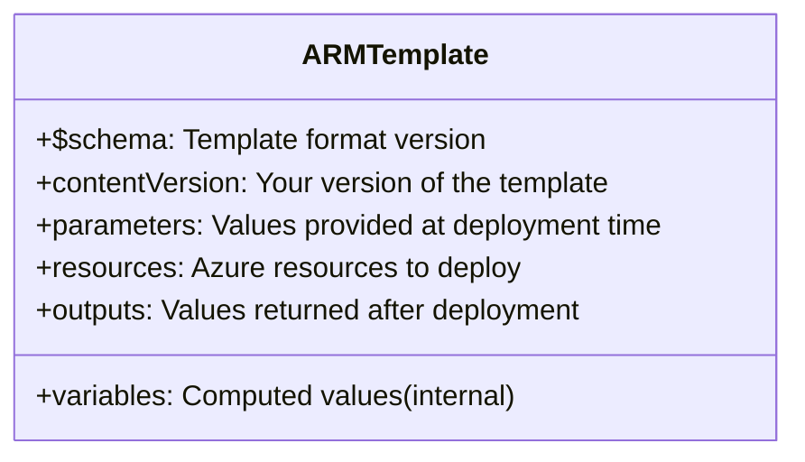
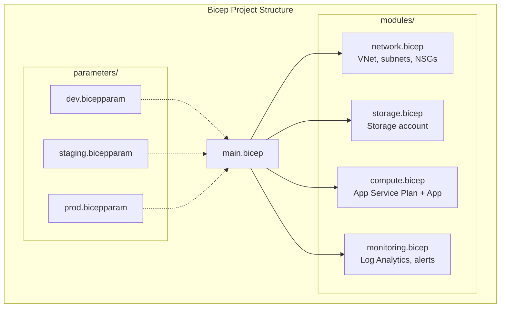
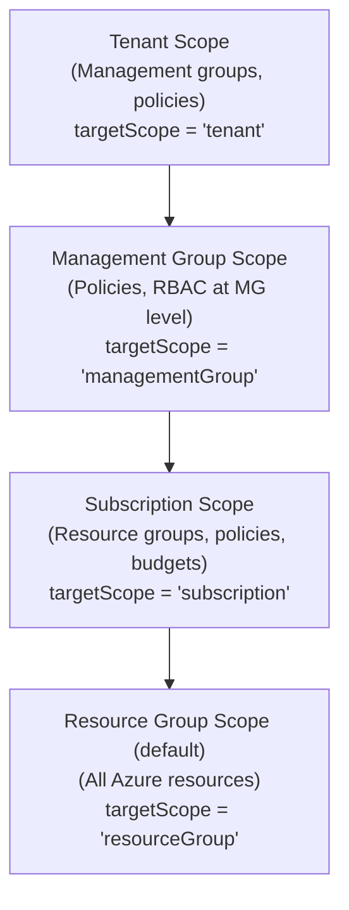

**Complexity**: [MEDIUM] | **Time to Complete**: 1.5h | **Prerequisites**: Module 3.1 (Entra ID), basic Azure CLI

## What You'll Be Able to Do

After completing this module, you will be able to:

- **Deploy Azure resources using Bicep templates with parameters, modules, and conditional logic**
- **Implement Bicep modules and template specs for reusable infrastructure components across teams**
- **Configure deployment stacks and what-if operations to preview and protect Bicep deployments**
- **Compare Bicep with ARM templates and Terraform to evaluate the right IaC tool for Azure environments**

---

## Why This Module Matters

Teams that build environments manually through the Azure portal often discover configuration drift only when they have to recreate the environment. Rebuilds can consume substantial engineering time, and undocumented differences between the intended configuration and the actual deployment can easily break services.

Once an environment is described in Bicep, provisioning the same infrastructure again usually becomes much faster and more repeatable because the deployment can be rerun with different parameters.

This is the fundamental promise of Infrastructure as Code (IaC): **your infrastructure is defined in version-controlled files, not in wiki pages, portal clicks, or tribal knowledge.** ARM templates have been Azure's native IaC format since the beginning, and Bicep is the modern, human-friendly language that compiles down to ARM. In this module, you will learn ARM template structure, Bicep syntax, modules, deployment scopes, and the what-if feature that previews changes before they are applied. By the end, you will refactor a CLI-based deployment script into a reusable Bicep template.

---

## ARM Templates: The Foundation

[Azure Resource Manager (ARM) is the deployment and management layer for Azure. Every Azure operation---whether from the portal, CLI, PowerShell, or SDK---goes through ARM. ARM templates are JSON files that define the resources you want to deploy.](https://learn.microsoft.com/en-us/azure/azure-resource-manager/management/overview)

### ARM Template Structure

```json
{
  "$schema": "https://schema.management.azure.com/schemas/2019-04-01/deploymentTemplate.json#",
  "contentVersion": "1.0.0.0",
  "parameters": {
    "environment": {
      "type": "string",
      "allowedValues": ["dev", "staging", "prod"],
      "defaultValue": "dev"
    },
    "location": {
      "type": "string",
      "defaultValue": "[resourceGroup().location]"
    }
  },
  "variables": {
    "storageName": "[format('kubedojo{0}{1}', parameters('environment'), uniqueString(resourceGroup().id))]"
  },
  "resources": [
    {
      "type": "Microsoft.Storage/storageAccounts",
      "apiVersion": "2023-01-01",
      "name": "[variables('storageName')]",
      "location": "[parameters('location')]",
      "sku": {
        "name": "Standard_LRS"
      },
      "kind": "StorageV2",
      "properties": {
        "minimumTlsVersion": "TLS1_2",
        "allowBlobPublicAccess": false
      }
    }
  ],
  "outputs": {
    "storageAccountName": {
      "type": "string",
      "value": "[variables('storageName')]"
    },
    "storageEndpoint": {
      "type": "string",
      "value": "[reference(variables('storageName')).primaryEndpoints.blob]"
    }
  }
}
```



> **Stop and think**: If an ARM template dynamically generates a storage account name using `[concat(parameters('env'), uniqueString(resourceGroup().id))]`, and the deployment fails because the name exceeds Azure's 24-character limit, how do you debug this? Since ARM templates do not support `print()` statements and the generation happens server-side, what steps must you take to discover the exact string that the ARM engine attempted to provision?

ARM templates work, but they have significant drawbacks:
- **Verbose**: Simple deployments require dozens of lines of JSON
- **Hard to read**: Nested functions like `[format('kubedojo{0}{1}', parameters('environment'), uniqueString(resourceGroup().id))]` are painful
- **No comments**: JSON does not support comments
- **No modularity**: Linked templates require external URI hosting

This is why Bicep exists.

---

## Bicep: ARM Templates for Humans

[Bicep is a domain-specific language (DSL) that compiles to ARM JSON.](https://learn.microsoft.com/en-us/azure/azure-resource-manager/bicep/overview) It provides the same capabilities with dramatically better readability and tooling.

### Bicep vs ARM Template Comparison

The same storage account in Bicep:

```bicep
// main.bicep

@allowed(['dev', 'staging', 'prod'])
param environment string = 'dev'

param location string = resourceGroup().location

var storageName = 'kubedojo${environment}${uniqueString(resourceGroup().id)}'

resource storageAccount 'Microsoft.Storage/storageAccounts@2023-01-01' = {
  name: storageName
  location: location
  sku: {
    name: 'Standard_LRS'
  }
  kind: 'StorageV2'
  properties: {
    minimumTlsVersion: 'TLS1_2'
    allowBlobPublicAccess: false
  }
}

output storageAccountName string = storageAccount.name
output storageEndpoint string = storageAccount.properties.primaryEndpoints.blob
```

The differences are stark:

| Feature | ARM JSON | Bicep |
| :--- | :--- | :--- |
| **Lines of code** | ~40 lines | ~20 lines |
| **Comments** | Not supported | `//` and `/* */` |
| **String interpolation** | `[format('a{0}b', param)]` | `'a${param}b'` |
| **Readability** | Low (nested JSON) | High (clean syntax) |
| **IntelliSense** | Limited | [Full VS Code support](https://learn.microsoft.com/en-us/azure/azure-resource-manager/bicep/overview) |
| **Modules** | Linked templates (external URLs) | [Native `module` keyword](https://learn.microsoft.com/en-us/azure/azure-resource-manager/bicep/overview) |
| **Compilation** | N/A (direct JSON) | Compiles to ARM JSON |
| **Decompilation** | N/A | [Can decompile ARM to Bicep](https://learn.microsoft.com/en-us/azure/azure-resource-manager/bicep/decompile) |

### Bicep vs Terraform

While Bicep is the native choice for Azure, Terraform is a common option for teams that need multi-cloud IaC. How do you choose between them?

| Feature | Bicep | Terraform |
| :--- | :--- | :--- |
| **State Management** | [No state file (state is in Azure)](https://learn.microsoft.com/en-us/azure/developer/terraform/comparing-terraform-and-bicep) | Requires state file management (backend) |
| **Cloud Support** | Azure only | Multi-cloud (AWS, GCP, Azure, etc.) |
| **Day 0 Support** | [Immediate support for new Azure features](https://learn.microsoft.com/en-us/azure/azure-resource-manager/bicep/overview) | Slight delay for provider updates |
| **Integration** | Native to Azure CLI and Portal | Requires separate Terraform CLI |

**Decision Framework**: Use Bicep if your organization is 100% Azure-native and you want to avoid managing state files. Use Terraform if you have a multi-cloud strategy or already use Terraform for other infrastructure (like GitHub, Datadog, or Kubernetes).

### Bicep Key Concepts

```bicep
// Parameters: Values provided at deployment time
@description('The environment name')
@allowed(['dev', 'staging', 'prod'])
param environment string

@description('Azure region for resources')
param location string = resourceGroup().location

@minValue(1)
@maxValue(10)
param instanceCount int = 2

@secure()
param adminPassword string  // Marked secure: not logged, not shown in outputs

// Variables: Computed values
var prefix = 'kubedojo-${environment}'
var tags = {
  environment: environment
  project: 'kubedojo'
  managedBy: 'bicep'
}

// Resources: Azure resources to deploy
resource vnet 'Microsoft.Network/virtualNetworks@2023-04-01' = {
  name: '${prefix}-vnet'
  location: location
  tags: tags
  properties: {
    addressSpace: {
      addressPrefixes: ['10.0.0.0/16']
    }
    subnets: [
      {
        name: 'app-subnet'
        properties: {
          addressPrefix: '10.0.1.0/24'
        }
      }
      {
        name: 'data-subnet'
        properties: {
          addressPrefix: '10.0.2.0/24'
        }
      }
    ]
  }
}

// Reference existing resources (not deployed by this template)
resource existingKeyVault 'Microsoft.KeyVault/vaults@2023-02-01' existing = {
  name: 'my-existing-vault'
  scope: resourceGroup('other-rg')  // Can reference resources in other RGs
}

// Conditional deployment
resource devStorage 'Microsoft.Storage/storageAccounts@2023-01-01' = if (environment == 'dev') {
  name: '${prefix}devstorage'
  location: location
  sku: { name: 'Standard_LRS' }
  kind: 'StorageV2'
  properties: {}
}

// Loops
resource nsgRules 'Microsoft.Network/networkSecurityGroups@2023-04-01' = [for i in range(0, instanceCount): {
  name: '${prefix}-nsg-${i}'
  location: location
  properties: {}
}]

// Outputs
output vnetId string = vnet.id
output subnetIds array = [for subnet in vnet.properties.subnets: subnet.id]
```

> **Pause and predict**: You define a resource using `if (environment == 'dev')` and subsequently expose its `id` as a template output. If you deploy this template to the 'prod' environment, the resource is skipped. What exactly happens at runtime when the ARM engine attempts to construct that output? How does Bicep handle conditional outputs when the underlying resource does not exist?

### Deploying Bicep Templates

```bash
# Deploy a Bicep template to a resource group
az deployment group create \
  --resource-group myRG \
  --template-file main.bicep \
  --parameters environment=staging instanceCount=3

# Deploy with a parameters file
az deployment group create \
  --resource-group myRG \
  --template-file main.bicep \
  --parameters @parameters.staging.json

# Preview changes (what-if) before deploying
az deployment group what-if \
  --resource-group myRG \
  --template-file main.bicep \
  --parameters environment=staging

# Validate without deploying
az deployment group validate \
  --resource-group myRG \
  --template-file main.bicep \
  --parameters environment=staging

# View deployment history
az deployment group list --resource-group myRG -o table

# Export an existing resource group to Bicep (decompile)
az bicep decompile --file exported-template.json
```

---

## Bicep Modules: Composable Infrastructure

Modules are the killer feature of Bicep. They let you break large templates into reusable components.



```bicep
// modules/storage.bicep
@description('Storage account name')
param name string

@description('Azure region')
param location string

@description('Storage account SKU')
@allowed(['Standard_LRS', 'Standard_ZRS', 'Standard_GRS'])
param skuName string = 'Standard_LRS'

param tags object = {}

resource storage 'Microsoft.Storage/storageAccounts@2023-01-01' = {
  name: name
  location: location
  tags: tags
  sku: { name: skuName }
  kind: 'StorageV2'
  properties: {
    minimumTlsVersion: 'TLS1_2'
    allowBlobPublicAccess: false
    supportsHttpsTrafficOnly: true
  }
}

output id string = storage.id
output name string = storage.name
output primaryEndpoint string = storage.properties.primaryEndpoints.blob
```

```bicep
// modules/appServicePlan.bicep
param name string
param location string
param skuName string = 'B1'
param tags object = {}

resource plan 'Microsoft.Web/serverfarms@2023-01-01' = {
  name: name
  location: location
  tags: tags
  sku: {
    name: skuName
  }
  kind: 'linux'
  properties: {
    reserved: true  // Required for Linux
  }
}

output id string = plan.id
output name string = plan.name
```

```bicep
// main.bicep - Using modules
@allowed(['dev', 'staging', 'prod'])
param environment string

param location string = resourceGroup().location

var prefix = 'kubedojo-${environment}'
var tags = {
  environment: environment
  project: 'kubedojo'
  managedBy: 'bicep'
}

// Deploy storage using the module
module storage 'modules/storage.bicep' = {
  name: 'storage-deployment'
  params: {
    name: '${replace(prefix, '-', '')}store'
    location: location
    skuName: environment == 'prod' ? 'Standard_ZRS' : 'Standard_LRS'
    tags: tags
  }
}

// Deploy App Service Plan using the module
module appPlan 'modules/appServicePlan.bicep' = {
  name: 'app-plan-deployment'
  params: {
    name: '${prefix}-plan'
    location: location
    skuName: environment == 'prod' ? 'P1v3' : 'B1'
    tags: tags
  }
}

// Reference module outputs
output storageEndpoint string = storage.outputs.primaryEndpoint
output appPlanId string = appPlan.outputs.id
```

### Bicep Parameters Files

```bicep
// parameters/staging.bicepparam
using '../main.bicep'

param environment = 'staging'
param location = 'eastus2'
```

```bash
# Deploy with a .bicepparam file
az deployment group create \
  --resource-group myRG \
  --template-file main.bicep \
  --parameters parameters/staging.bicepparam
```

### Sharing Modules: Registries and Template Specs

To share Bicep modules across teams, you need a central repository. Azure provides two native ways to share IaC components:

1. **Private Bicep Registries (ACR)**: [You can publish Bicep modules to an Azure Container Registry (ACR). Teams reference them using the `br:` scheme](https://learn.microsoft.com/en-us/azure/azure-resource-manager/bicep/private-module-registry) (e.g., `module redis 'br:myacr.azurecr.io/bicep/modules/redis:v1'`).
2. **Template Specs**: [Template specs are native Azure resources that store an ARM template for later deployment. You can compile a Bicep file and save it as a Template Spec, complete with RBAC access control and versioning](https://learn.microsoft.com/en-us/azure/azure-resource-manager/bicep/template-specs), allowing non-developers to deploy standardized infrastructure directly from the Azure Portal.

```bash
# Publish a Bicep module to a Template Spec
az ts create \
  --name standard-storage-spec \
  --version "1.0.0" \
  --resource-group myRG \
  --location eastus2 \
  --template-file modules/storage.bicep
```

---

## Deployment Scopes

[Bicep can deploy resources at four different scopes:](https://learn.microsoft.com/en-us/azure/azure-resource-manager/management/overview)



```bicep
// Subscription-scoped deployment: create a resource group + deploy into it
targetScope = 'subscription'

param location string = 'eastus2'
param environment string

resource rg 'Microsoft.Resources/resourceGroups@2022-09-01' = {
  name: 'kubedojo-${environment}'
  location: location
}

// Deploy resources into the newly created resource group
module resources 'main.bicep' = {
  name: 'resources-deployment'
  scope: rg  // Deploy into the RG we just created
  params: {
    environment: environment
    location: location
  }
}
```

```bash
# Resource group scope (default)
az deployment group create -g myRG -f main.bicep

# Subscription scope
az deployment sub create --location eastus2 -f subscription.bicep

# Management group scope
az deployment mg create --management-group-id myMG --location eastus2 -f mg.bicep

# Tenant scope
az deployment tenant create --location eastus2 -f tenant.bicep
```

---

## Deployment Stacks: Managing Resource Lifecycles

While Bicep modules organize your code, **Deployment Stacks** organize your deployed resources. A deployment stack is a native Azure resource that manages the lifecycle of a collection of resources as a single atomic unit, even if those resources span multiple resource groups or subscriptions.

The key superpower of deployment stacks is **cleanup and protection**:
- **Cleanup**: [When you remove a resource from your Bicep file and update the stack, the stack can automatically delete or detach the unmanaged resource.](https://learn.microsoft.com/en-us/azure/azure-resource-manager/bicep/deployment-stacks)
- **Protection**: [You can apply `DenySettings` to the stack, preventing anyone (even administrators) from manually modifying or deleting the managed resources via the portal or CLI.](https://learn.microsoft.com/en-us/azure/azure-resource-manager/bicep/deployment-stacks)

```bash
# Create a deployment stack with DenySettings to protect against drift
az stack group create \
  --name my-production-stack \
  --resource-group myRG \
  --template-file main.bicep \
  --deny-settings-mode denyDelete
```

---

## What-If Deployments: Preview Before You Apply

The what-if operation is your safety net. [It shows what changes a deployment would make without actually making them.](https://learn.microsoft.com/en-us/azure/azure-resource-manager/templates/deploy-what-if)

> **Pause and predict**: A colleague manually added a test subnet to your VNet via the Azure Portal. Your Bicep template defines the VNet but does not include this new subnet in its `subnets` array property. When you run a `what-if` deployment in Incremental mode, will the manual subnet be marked for deletion (-), modification (~), or ignored completely? What does this reveal about how Azure handles arrays during declarative updates?

```bash
# Preview changes
az deployment group what-if \
  --resource-group myRG \
  --template-file main.bicep \
  --parameters environment=staging
```

The output uses color-coded symbols:

```text
What-If Results:

+ Create    (new resource will be created)
~ Modify    (existing resource will be modified)
- Delete    (resource will be removed, if using complete mode)
* No change (resource exists and matches template)
! Ignore    (resource type not supported for what-if)

Example output:
Resource and property changes are indicated with these symbols:
  + Create
  ~ Modify

The deployment will update the following scope:
Scope: /subscriptions/xxx/resourceGroups/myRG

  ~ Microsoft.Storage/storageAccounts/kubedojostorage [2023-01-01]
    ~ properties.minimumTlsVersion: "TLS1_0" => "TLS1_2"

  + Microsoft.Web/serverfarms/kubedojo-staging-plan [2023-01-01]
```

Running production deployments in complete mode can delete resources that were omitted from the template. The operational lesson is to review a what-if preview carefully and reserve deletion-oriented workflows for cases where the template really represents the whole environment.

```bash
# Deployment modes
# Incremental (default): Add/modify resources, never delete
az deployment group create -g myRG -f main.bicep --mode Incremental

# Complete: Add/modify AND delete resources not in template (DANGEROUS)
az deployment group create -g myRG -f main.bicep --mode Complete

# ALWAYS use what-if before complete mode
az deployment group what-if -g myRG -f main.bicep --mode Complete
```

---

## Bicep Best Practices

### Naming Conventions

```bicep
// Use consistent, descriptive resource names
var naming = {
  storageAccount: 'st${replace(prefix, '-', '')}${uniqueString(resourceGroup().id)}'
  appServicePlan: '${prefix}-asp'
  appService: '${prefix}-app'
  keyVault: '${prefix}-kv'
  logAnalytics: '${prefix}-log'
  vnet: '${prefix}-vnet'
}
```

### Linting and Validation

```bash
# Build (compile) Bicep to ARM JSON
az bicep build --file main.bicep

# Lint check (via bicepconfig.json)
# Create bicepconfig.json for linting rules:
cat > bicepconfig.json << 'EOF'
{
  "analyzers": {
    "core": {
      "rules": {
        "no-unused-params": { "level": "warning" },
        "no-unused-vars": { "level": "warning" },
        "prefer-interpolation": { "level": "warning" },
        "secure-parameter-default": { "level": "error" },
        "explicit-values-for-loc-params": { "level": "warning" }
      }
    }
  }
}
EOF

# Validate without deploying
az deployment group validate -g myRG -f main.bicep -p environment=staging
```

---

## Did You Know?

1. **Bicep is a transparent abstraction over ARM templates.** Every Bicep file compiles to a standard ARM JSON template. There is no "Bicep runtime" or "Bicep API"---Azure only sees ARM JSON. This means the important deployment artifact remains an ARM template, which reduces dependence on Bicep-specific tooling during deployment. You can even mix Bicep and ARM JSON in the same deployment using modules.

3. Before deploying a template, what-if gives you a preview of the changes Azure Resource Manager expects to make, which makes it a useful safety check similar in spirit to Terraform plan.

4. [**Bicep supports user-defined types** (since Bicep v0.12), allowing you to define structured parameter types.](https://learn.microsoft.com/en-us/azure/azure-resource-manager/bicep/user-defined-data-types) Instead of passing 8 separate parameters for a VM configuration, you define a `vmConfig` type with all properties, getting compile-time validation and IntelliSense. This moves Bicep closer to a full programming language while remaining declarative.

---

## Common Mistakes

| Mistake | Why It Happens | How to Fix It |
| :--- | :--- | :--- |
| Using the portal to create resources instead of IaC | The portal feels faster for "quick" resources | Every resource should be in a Bicep template, even "temporary" ones. Portal-created resources are undocumented and unreproducible. |
| Hardcoding resource names and IDs | It works for the first environment | Use parameters for anything that changes between environments. Use `uniqueString()` for globally unique names. |
| Using Complete deployment mode in production | Someone thought it would "clean up" unused resources | [Prefer Incremental mode (the default) in most production cases. Complete mode deletes resources not in the template, which can destroy databases and storage accounts.](https://learn.microsoft.com/en-us/azure/azure-resource-manager/templates/deployment-modes) |
| Not running what-if before deploying | "The template worked last time" | Make what-if a mandatory CI/CD step. A 30-second preview prevents hours of incident response. |
| Writing one massive Bicep file | The template "works" at first | Break large templates into modules. Each module should represent a logical unit (networking, compute, storage). |
| Not using parameter files for different environments | Developers hardcode environment-specific values | Create parameter files per environment (`dev.bicepparam`, `staging.bicepparam`, `prod.bicepparam`). The template stays the same; only parameters change. |
| Not tagging resources in templates | Tags feel like busywork | Define tags as a variable and apply them to all resources. Tags are essential for cost allocation, ownership tracking, and automation. |
| Ignoring the API version in resource definitions | "Latest" seems like the safest choice | Pin API versions explicitly. Newer API versions can change resource property formats, breaking existing templates. Update API versions deliberately, not accidentally. |

---

## Quiz

<details>
<summary>1. Your security team uses a static analysis tool that only natively supports scanning JSON files. They mandate that Bicep cannot be used because their tool cannot parse `.bicep` files. How do you integrate Bicep into this pipeline constraint without abandoning the language?</summary>

Bicep is not a separate runtime or engine; it is a domain-specific language that transpiles directly into standard ARM JSON templates. Because Bicep acts as a transparent abstraction, you can simply add a build step to your CI pipeline (`az bicep build`) that compiles the `.bicep` files into `.json` before the security scan runs. The security team's tool will scan the transpiled JSON exactly as if you had written the ARM templates by hand. This completely satisfies the JSON-only constraint while still allowing developers to benefit from Bicep's readable syntax, modularity, and strong compile-time validation.
</details>

<details>
<summary>2. A junior engineer deploys a Bicep template containing only an App Service to a resource group that currently hosts your production SQL database. They accidentally append `--mode Complete` to the deployment command. What exactly happens to the SQL database, and why does this mode exist if it is so dangerous?</summary>

The production SQL database will be permanently deleted. Complete mode instructs the Azure Resource Manager to make the resource group match the template exactly, meaning it will create the App Service and actively destroy any existing resources within the group that are not defined in the template. This mode exists because it provides a mechanism to enforce strict infrastructure-as-code parity, ensuring that no "drift" or manually created resources accumulate in a resource group over time. However, because of its highly destructive nature, Complete mode should usually be reserved for tightly controlled, automated pipelines where the template is intended to represent the entire environment, and ideally preceded by a `what-if` preview.
</details>

<details>
<summary>3. Your organization has three product teams (Frontend, Backend, Data) that all need to deploy standard Redis caches. Currently, they each copy-paste Bicep code, leading to wildly inconsistent TLS and firewall settings. How would you redesign this using Bicep modules to enforce security standards while letting teams deploy on their own?</summary>

You would author a centralized `redis.bicep` module that hardcodes the mandatory security configurations, such as enforcing minimum TLS versions and disabling public network access, while exposing configurable properties (like name, SKU, or location) via explicit parameters. This module would be hosted in a shared Bicep registry (like an Azure Container Registry) accessible to all teams across the organization. The individual teams would then write their own `main.bicep` files and invoke your centralized module using the `module` keyword, passing in only their specific business parameters. This approach enforces enterprise-wide security compliance seamlessly because teams are forced to consume a hardened, approved infrastructure block rather than maintaining their own potentially flawed implementations.
</details>

<details>
<summary>4. During a late-night incident, a developer modifies a Bicep template to scale up an App Service Plan. They bypass the CI pipeline and run `az deployment group create` directly from their laptop. The deployment succeeds, but a completely unrelated Storage Account defined in the exact same template loses all its custom networking rules. How would running a `what-if` command have prevented this specific outage?</summary>

Running the `what-if` operation before deployment would have output a visual preview showing the exact modifications Resource Manager was about to apply across the entire target scope. It would have highlighted the Storage Account's networking rules with a modification (`~`) or deletion (`-`) symbol in the output console. This immediate visual feedback would have alerted the developer that their supposedly isolated App Service change was going to inadvertently wipe out the storage networking configuration due to template drift on their local machine. By exposing the unintended blast radius of the deployment, `what-if` transforms infrastructure changes from a blind execution into a verifiable plan, acting as a critical safety check to catch destructive side-effects.
</details>

<details>
<summary>5. You need to deploy the exact same Virtual Network architecture to Dev, Staging, and Production environments. However, Dev requires cheaper B-series VMs while Production needs P-series VMs with availability zone redundancy. How do you structure your Bicep project to achieve this without maintaining three completely separate template files?</summary>

You construct a single, unified `main.bicep` template that utilizes parameters to represent all the variables that change between environments, such as `vmSku` and `redundancyMode`. You then create three distinct parameter files (`dev.bicepparam`, `staging.bicepparam`, `prod.bicepparam`) that supply the environment-specific values to the main template. When deploying, your CI/CD pipeline references the exact same `main.bicep` file but injects the corresponding `.bicepparam` file based on the target deployment stage. This guarantees that all environments share an identical architectural foundation while remaining appropriately sized and cost-optimized, significantly reducing maintenance overhead and eliminating structural configuration drift.
</details>

<details>
<summary>6. You are tasked with deploying an Azure Policy that restricts resource creation exclusively to the `eastus` region. You want this policy to automatically apply to all current and future resource groups within your project's subscription. Which deployment scope must you target in your Bicep file, and why would targeting the default Resource Group scope fail to achieve your goal?</summary>

You must explicitly define `targetScope = 'subscription'` at the top of your Bicep file to deploy the policy at the Subscription scope. Targeting the default Resource Group scope would fail because a policy applied at the resource group level only restricts the resources provisioned within that specific group; any new resource group created outside of it would be completely unaffected by the restriction. By targeting the subscription, the policy cascades downwards, enforcing the region constraint across current and future resource groups under that subscription umbrella. This hierarchical inheritance and the need to manage top-level organizational guardrails are the primary reasons why Bicep supports distinct deployment scopes.
</details>

---

## Hands-On Exercise: Refactor CLI Script to Bicep Template

In this exercise, you will take a deployment that was done via Azure CLI commands and convert it into a reusable Bicep template with modules.

**Prerequisites**: Azure CLI with Bicep extension installed (`az bicep install`).

### The Original CLI Script (What We Are Replacing)

```bash
# This is the "click-ops" approach we are replacing:
az group create -n myapp-staging -l eastus2
az storage account create -n myappstagingstore -g myapp-staging -l eastus2 --sku Standard_LRS --kind StorageV2
az appservice plan create -n myapp-staging-plan -g myapp-staging -l eastus2 --sku B1 --is-linux
az webapp create -n myapp-staging-web -g myapp-staging -p myapp-staging-plan --runtime "NODE:20-lts"
```

### Task 1: Create the Bicep Module for Storage

```bash
mkdir -p /tmp/bicep-lab/modules
```

```bash
cat > /tmp/bicep-lab/modules/storage.bicep << 'BICEP'
@description('Storage account name (must be globally unique)')
param name string

@description('Azure region')
param location string

@description('Storage SKU')
@allowed(['Standard_LRS', 'Standard_ZRS', 'Standard_GRS'])
param skuName string = 'Standard_LRS'

@description('Resource tags')
param tags object = {}

resource storageAccount 'Microsoft.Storage/storageAccounts@2023-01-01' = {
  name: name
  location: location
  tags: tags
  sku: {
    name: skuName
  }
  kind: 'StorageV2'
  properties: {
    minimumTlsVersion: 'TLS1_2'
    allowBlobPublicAccess: false
    supportsHttpsTrafficOnly: true
  }
}

output id string = storageAccount.id
output name string = storageAccount.name
output primaryEndpoint string = storageAccount.properties.primaryEndpoints.blob
BICEP
```

<details>
<summary>Verify Task 1</summary>

```bash
az bicep build --file /tmp/bicep-lab/modules/storage.bicep
echo "Build successful if no errors above"
```
</details>

### Task 2: Create the Bicep Module for App Service

```bash
cat > /tmp/bicep-lab/modules/appservice.bicep << 'BICEP'
@description('App Service Plan name')
param planName string

@description('Web App name')
param appName string

@description('Azure region')
param location string

@description('App Service Plan SKU')
@allowed(['B1', 'B2', 'S1', 'P1v3', 'P2v3'])
param skuName string = 'B1'

@description('Runtime stack')
param runtimeStack string = 'NODE:20-lts'

@description('Resource tags')
param tags object = {}

resource appServicePlan 'Microsoft.Web/serverfarms@2023-01-01' = {
  name: planName
  location: location
  tags: tags
  sku: {
    name: skuName
  }
  kind: 'linux'
  properties: {
    reserved: true
  }
}

resource webApp 'Microsoft.Web/sites@2023-01-01' = {
  name: appName
  location: location
  tags: tags
  properties: {
    serverFarmId: appServicePlan.id
    siteConfig: {
      linuxFxVersion: runtimeStack
      alwaysOn: skuName != 'B1' // AlwaysOn not available on Basic
      ftpsState: 'Disabled'
      minTlsVersion: '1.2'
    }
    httpsOnly: true
  }
}

output appServicePlanId string = appServicePlan.id
output webAppName string = webApp.name
output webAppUrl string = 'https://${webApp.properties.defaultHostName}'
BICEP
```

<details>
<summary>Verify Task 2</summary>

```bash
az bicep build --file /tmp/bicep-lab/modules/appservice.bicep
echo "Build successful if no errors above"
```
</details>

### Task 3: Create the Main Bicep Template

```bash
cat > /tmp/bicep-lab/main.bicep << 'BICEP'
// main.bicep - Complete environment deployment

@description('Environment name')
@allowed(['dev', 'staging', 'prod'])
param environment string

@description('Azure region')
param location string = resourceGroup().location

@description('Base name for resources')
param baseName string = 'kubedojo'

// Computed values
var prefix = '${baseName}-${environment}'
var tags = {
  environment: environment
  project: baseName
  managedBy: 'bicep'
  deployedAt: utcNow('yyyy-MM-dd')
}

// Environment-specific configuration
var envConfig = {
  dev: {
    storageSku: 'Standard_LRS'
    appSku: 'B1'
  }
  staging: {
    storageSku: 'Standard_LRS'
    appSku: 'B1'
  }
  prod: {
    storageSku: 'Standard_ZRS'
    appSku: 'P1v3'
  }
}

// Deploy storage account
module storage 'modules/storage.bicep' = {
  name: 'storage-${environment}'
  params: {
    name: '${replace(prefix, '-', '')}store'
    location: location
    skuName: envConfig[environment].storageSku
    tags: tags
  }
}

// Deploy App Service
module appService 'modules/appservice.bicep' = {
  name: 'appservice-${environment}'
  params: {
    planName: '${prefix}-plan'
    appName: '${prefix}-web'
    location: location
    skuName: envConfig[environment].appSku
    tags: tags
  }
}

// Outputs
output storageAccountName string = storage.outputs.name
output storageEndpoint string = storage.outputs.primaryEndpoint
output webAppUrl string = appService.outputs.webAppUrl
output environment string = environment
BICEP
```

<details>
<summary>Verify Task 3</summary>

```bash
az bicep build --file /tmp/bicep-lab/main.bicep
echo "Build successful if no errors above"
```
</details>

### Task 4: Run What-If to Preview Changes

```bash
RG="kubedojo-bicep-lab"
az group create --name "$RG" --location eastus2

# Preview what will be created
az deployment group what-if \
  --resource-group "$RG" \
  --template-file /tmp/bicep-lab/main.bicep \
  --parameters environment=staging
```

<details>
<summary>Verify Task 4</summary>

You should see green `+` symbols indicating resources that will be created: a storage account, an App Service Plan, and a Web App. No resources should show as modified or deleted since this is a fresh deployment.
</details>

### Task 5: Deploy the Template

```bash
az deployment group create \
  --resource-group "$RG" \
  --template-file /tmp/bicep-lab/main.bicep \
  --parameters environment=staging \
  --query '{Outputs: properties.outputs, State: properties.provisioningState}' -o json
```

<details>
<summary>Verify Task 5</summary>

```bash
# Verify all resources were created
az resource list -g "$RG" --query '[].{Name:name, Type:type}' -o table

# Test the web app
WEB_URL=$(az deployment group show -g "$RG" -n main \
  --query 'properties.outputs.webAppUrl.value' -o tsv 2>/dev/null)
echo "Web App URL: $WEB_URL"
curl -s "$WEB_URL" | head -5
```

You should see a storage account, an App Service Plan, and a Web App.
</details>

### Task 6: Modify and Redeploy (See What-If in Action)

```bash
# Change the App Service SKU from B1 to B2
# Instead of editing the template, just pass a different parameter
# (In real life, you'd update the envConfig or add a parameter)

# Let's add a blob container to the storage account by updating the module
cat >> /tmp/bicep-lab/modules/storage.bicep << 'BICEP'

resource blobService 'Microsoft.Storage/storageAccounts/blobServices@2023-01-01' = {
  parent: storageAccount
  name: 'default'
}

resource uploadsContainer 'Microsoft.Storage/storageAccounts/blobServices/containers@2023-01-01' = {
  parent: blobService
  name: 'uploads'
  properties: {
    publicAccess: 'None'
  }
}
BICEP

# Preview the change
az deployment group what-if \
  --resource-group "$RG" \
  --template-file /tmp/bicep-lab/main.bicep \
  --parameters environment=staging

# Deploy the change
az deployment group create \
  --resource-group "$RG" \
  --template-file /tmp/bicep-lab/main.bicep \
  --parameters environment=staging
```

<details>
<summary>Verify Task 6</summary>

The what-if should show the storage account as unchanged (*) and the blob service + container as new (+). After deployment, verify:

```bash
az storage container list \
  --account-name "$(az storage account list -g "$RG" --query '[0].name' -o tsv)" \
  --auth-mode login --query '[].name' -o tsv
```

You should see the `uploads` container.
</details>

### Cleanup

```bash
az group delete --name "$RG" --yes --no-wait
rm -rf /tmp/bicep-lab
```

### Success Criteria

- [ ] Storage module created and compiles successfully
- [ ] App Service module created and compiles successfully
- [ ] Main template uses modules with environment-specific configuration
- [ ] What-if previewed changes before first deployment
- [ ] Initial deployment created storage account, App Service Plan, and Web App
- [ ] Template modification (adding blob container) previewed and deployed incrementally

---

## Next Steps

Congratulations on completing the Azure Essentials track! You now have a solid foundation in Azure's core services. To continue your learning:

- **[Azure Essentials README]()** --- Review the complete module index and identify areas for deeper study
- **[Kubernetes Certifications Track](/k8s/)** --- Apply your Azure knowledge to AKS and container orchestration
- **[Platform Engineering Track](/platform/)** --- Learn how to build internal developer platforms on Azure

The skills you have built across these 12 modules---identity, networking, compute, storage, DNS, containers, serverless, secrets, monitoring, CI/CD, and infrastructure as code---are the foundation of every production Azure environment. The difference between a junior and senior engineer is not knowing more services; it is knowing how to combine these fundamentals into reliable, secure, and cost-effective architectures.

## Sources

- [learn.microsoft.com: overview](https://learn.microsoft.com/en-us/azure/azure-resource-manager/management/overview) — The ARM overview explicitly describes Resource Manager as the deployment and management service, says requests from Azure APIs/tools/SDKs go through it, and defines ARM templates as JSON deployment files.
- [learn.microsoft.com: overview](https://learn.microsoft.com/en-us/azure/azure-resource-manager/bicep/overview) — The Bicep overview directly says Bicep is a transparent abstraction over ARM JSON and that the CLI converts Bicep into ARM JSON.
- [learn.microsoft.com: decompile](https://learn.microsoft.com/en-us/azure/azure-resource-manager/bicep/decompile) — Microsoft Learn has a dedicated decompile article for converting ARM template JSON into Bicep.
- [learn.microsoft.com: comparing terraform and bicep](https://learn.microsoft.com/en-us/azure/developer/terraform/comparing-terraform-and-bicep) — Microsoft's Terraform-vs-Bicep comparison explicitly says Terraform stores state and Bicep does not.
- [learn.microsoft.com: parameter files](https://learn.microsoft.com/en-us/azure/azure-resource-manager/bicep/parameter-files) — The parameter files documentation explicitly covers `.bicepparam` files and their association to Bicep files through `using`.
- [learn.microsoft.com: private module registry](https://learn.microsoft.com/en-us/azure/azure-resource-manager/bicep/private-module-registry) — The private module registry docs state that a Bicep registry is hosted on ACR and show `br:` references.
- [learn.microsoft.com: template specs](https://learn.microsoft.com/en-us/azure/azure-resource-manager/bicep/template-specs) — The template specs documentation explicitly describes them as ARM-template resources with RBAC sharing and versioning.
- [learn.microsoft.com: deployment stacks](https://learn.microsoft.com/en-us/azure/azure-resource-manager/bicep/deployment-stacks) — The deployment stacks documentation explicitly says stacks manage groups of resources together and can detach or delete removed resources.
- [learn.microsoft.com: deploy what if](https://learn.microsoft.com/en-us/azure/azure-resource-manager/templates/deploy-what-if) — The what-if documentation explicitly says it predicts changes and does not make changes to existing resources.
- [learn.microsoft.com: deployment modes](https://learn.microsoft.com/en-us/azure/azure-resource-manager/templates/deployment-modes) — The deployment modes documentation explicitly says incremental is the default and recommended mode, complete mode deletes absent resources, and what-if should be used before complete mode.
- [learn.microsoft.com: user defined data types](https://learn.microsoft.com/en-us/azure/azure-resource-manager/bicep/user-defined-data-types) — The user-defined data types documentation explicitly says Bicep CLI version 0.12.x or higher is required.
