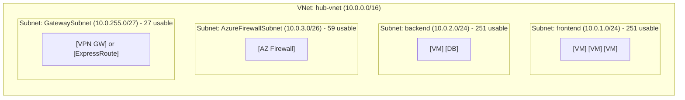
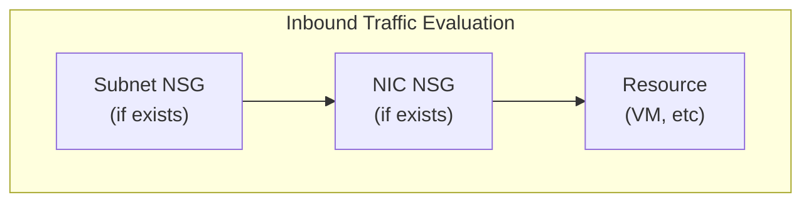
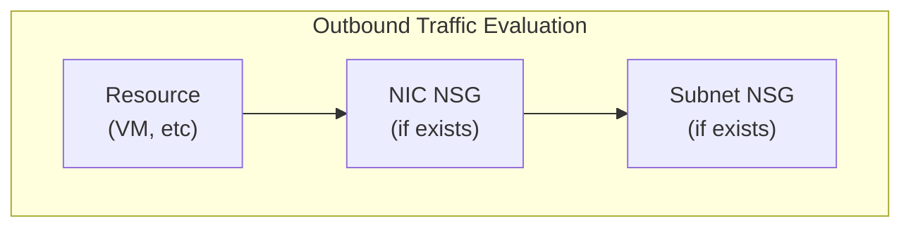
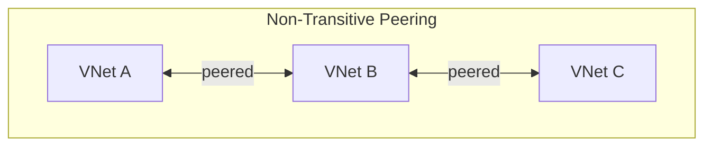
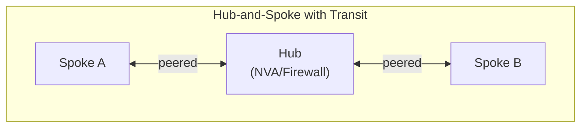
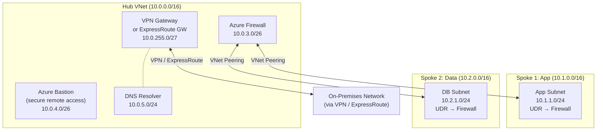

**Complexity**: [COMPLEX] | **Time to Complete**: 3h | **Prerequisites**: Module 3.1 (Entra ID & RBAC)

## What You'll Be Able to Do

After completing this module, you will be able to:

- **Design Azure VNet architectures using subnets, Network Security Groups, and User-Defined Routes**
- **Configure VNet peering for hub-and-spoke connectivity to establish centralized routing**
- **Evaluate Azure Firewall, VPN Gateway, and ExpressRoute to control and connect enterprise traffic**
- **Diagnose network traffic flow based on NSG rule evaluation and system routing behaviors**

---

## Why This Module Matters

Changes to VNet address space or peering dependencies can break shared services such as DNS, gateways, and on-premises connectivity, causing broad outages across a platform.

Networking in Azure is invisible when it works and catastrophic when it breaks. Unlike compute resources that you can scale up with a button click, or storage that you can provision in seconds, networking mistakes often cascade across your entire infrastructure. A misconfigured Network Security Group can silently block traffic for hours before anyone notices. An overlapping address space between two VNets makes peering impossible. A missing route table entry sends production traffic into a black hole.

In this module, you will learn Azure networking from the ground up. You will understand VNets and subnets, how Network Security Groups filter traffic, how VNet peering connects separate networks, and how to design the hub-and-spoke topology that forms the backbone of enterprise Azure deployments. By the end, you will be able to design and implement a multi-VNet architecture where spoke networks route all egress traffic through a central hub---a common pattern in enterprise Azure environments.

---

## VNets and Subnets: Your Private Network in the Cloud

An Azure Virtual Network (VNet) is a logically isolated network in Azure that closely mirrors a traditional network you would operate in your own data center. Think of a VNet as renting an empty floor in an office building. The floor is yours---you decide how to divide it into rooms (subnets), who can enter and leave (NSGs), and which floors you want to connect to (peering).

### VNet Fundamentals

Every VNet has an **address space** defined using CIDR notation. This is the range of private IP addresses available for use within the VNet. Azure supports the standard RFC 1918 private address ranges:

| Range | CIDR | Available Addresses | Typical Use |
| :--- | :--- | :--- | :--- |
| 10.0.0.0 - 10.255.255.255 | 10.0.0.0/8 | ~16.7 million | Large enterprise networks |
| 172.16.0.0 - 172.31.255.255 | 172.16.0.0/12 | ~1 million | Medium-sized deployments |
| 192.168.0.0 - 192.168.255.255 | 192.168.0.0/16 | ~65,000 | Small networks, labs |

A VNet is **regional**---it exists in a [single Azure region](https://learn.microsoft.com/en-us/azure/virtual-network/virtual-networks-faq). A VNet in East US and a VNet in West Europe are completely separate, isolated networks. To connect them, you need VNet peering (which we will cover shortly).

```bash
# Create a VNet with a /16 address space (65,536 addresses)
az network vnet create \
  --resource-group myRG \
  --name hub-vnet \
  --address-prefix 10.0.0.0/16 \
  --location eastus2

# You can add multiple address spaces to a single VNet
az network vnet update \
  --resource-group myRG \
  --name hub-vnet \
  --add addressSpace.addressPrefixes "10.100.0.0/16"
```

### Subnets: Dividing Your Network

Subnets are subdivisions of your VNet's address space. Every Azure resource that needs a private IP address (VMs, load balancers, private endpoints, etc.) must be placed in a subnet. Subnets serve two purposes: **organization** (grouping related resources) and **security** (applying NSGs at the subnet level).



**Note:** [Azure reserves 5 IPs per subnet](https://learn.microsoft.com/en-us/azure/virtual-network/virtual-networks-faq): `.0` (network), `.1` (gateway), `.2` & `.3` (DNS), `.255` (broadcast). So a /24 gives 256 - 5 = 251 usable addresses.

**Critical detail**: Azure reserves **5 IP addresses** in every subnet. [For a /24 subnet (256 addresses), you get 251 usable. For a /27 (32 addresses), you get 27.](https://learn.microsoft.com/en-us/azure/architecture/example-scenario/integrated-multiservices/virtual-network-integration) [For a /29 (8 addresses), you get only 3.](https://learn.microsoft.com/en-us/azure/virtual-network/virtual-network-manage-subnet) This matters when you are sizing subnets for services like AKS that consume many IPs.

Some subnets have **special names** that Azure requires for specific services:

| Subnet Name | Required For | Minimum Size |
| :--- | :--- | :--- |
| [`GatewaySubnet`](https://learn.microsoft.com/en-us/azure/vpn-gateway/vpn-gateway-vpn-faq) | VPN Gateway, ExpressRoute Gateway | /27 recommended |
| [`AzureFirewallSubnet`](https://learn.microsoft.com/en-us/azure/well-architected/service-guides/azure-firewall) | Azure Firewall | /26 required |
| [`AzureFirewallManagementSubnet`](https://learn.microsoft.com/en-us/azure/firewall/management-nic) | Azure Firewall (forced tunneling) | /26 required |
| [`AzureBastionSubnet`](https://learn.microsoft.com/en-us/azure/bastion/configuration-settings) | Azure Bastion | /26 or larger |
| `RouteServerSubnet` | Azure Route Server | /26 or larger |

```bash
# Create subnets within the VNet
az network vnet subnet create \
  --resource-group myRG \
  --vnet-name hub-vnet \
  --name frontend \
  --address-prefix 10.0.1.0/24

az network vnet subnet create \
  --resource-group myRG \
  --vnet-name hub-vnet \
  --name backend \
  --address-prefix 10.0.2.0/24

# Create the special GatewaySubnet
az network vnet subnet create \
  --resource-group myRG \
  --vnet-name hub-vnet \
  --name GatewaySubnet \
  --address-prefix 10.0.255.0/27

# List all subnets in a VNet
az network vnet subnet list --resource-group myRG --vnet-name hub-vnet -o table
```

> **Stop and think**: You need to deploy an Azure Kubernetes Service (AKS) cluster that will scale up to 50 nodes, with 30 pods per node. If you place it in a /24 subnet, what will happen during scaling? Why does the number of Azure-reserved IPs matter here?

---

## Network Security Groups (NSGs): Your Subnet-Level Firewall

A Network Security Group is a stateful firewall that filters network traffic to and from Azure resources. NSGs contain **security rules** that allow or deny traffic based on source, destination, port, and protocol. You can attach an NSG to a **subnet** (recommended) or to a **network interface** (for granular per-VM control).

### How NSG Rules Are Evaluated

[NSG rules have a **priority** (100-4096, lower number = higher priority). Azure evaluates rules from lowest priority number to highest and stops at the first match.](https://learn.microsoft.com/en-us/troubleshoot/azure/virtual-network/virtual-network-troubleshoot-nsg-blocking-traffic)



**Note:** Both NSGs must ALLOW the traffic. If either denies it, traffic is dropped.



**Note:** For outbound, NIC NSG is evaluated FIRST, then Subnet NSG.

[Every NSG includes **default rules**](https://learn.microsoft.com/en-us/azure/virtual-network/network-security-groups-overview) that you cannot delete:

| Priority | Name | Direction | Action | Source | Destination |
| :--- | :--- | :--- | :--- | :--- | :--- |
| 65000 | AllowVnetInBound | Inbound | Allow | VirtualNetwork | VirtualNetwork |
| 65001 | AllowAzureLoadBalancerInBound | Inbound | Allow | AzureLoadBalancer | * |
| 65500 | DenyAllInBound | Inbound | Deny | * | * |
| 65000 | AllowVnetOutBound | Outbound | Allow | VirtualNetwork | VirtualNetwork |
| 65001 | AllowInternetOutBound | Outbound | Allow | * | Internet |
| 65500 | DenyAllOutBound | Outbound | Deny | * | * |

[The `VirtualNetwork` service tag includes the VNet address space, all peered VNet address spaces, and on-premises address spaces connected via VPN/ExpressRoute.](https://learn.microsoft.com/en-us/azure/virtual-network/service-tags-overview) This is important---by default, all traffic within the VNet (and peered VNets) is allowed.

```bash
# Create an NSG
az network nsg create \
  --resource-group myRG \
  --name frontend-nsg

# Allow HTTPS inbound from the internet
az network nsg rule create \
  --resource-group myRG \
  --nsg-name frontend-nsg \
  --name AllowHTTPS \
  --priority 100 \
  --direction Inbound \
  --access Allow \
  --protocol Tcp \
  --source-address-prefixes Internet \
  --destination-port-ranges 443

# Allow SSH only from your IP
MY_IP=$(curl -s ifconfig.me)
az network nsg rule create \
  --resource-group myRG \
  --nsg-name frontend-nsg \
  --name AllowSSH \
  --priority 110 \
  --direction Inbound \
  --access Allow \
  --protocol Tcp \
  --source-address-prefixes "$MY_IP/32" \
  --destination-port-ranges 22

# Associate NSG with a subnet
az network vnet subnet update \
  --resource-group myRG \
  --vnet-name hub-vnet \
  --name frontend \
  --network-security-group frontend-nsg

# View effective NSG rules for a VM's NIC
az network nic list-effective-nsg \
  --resource-group myRG \
  --name myVM-nic -o table
```

> **Pause and predict**: A VM has a NIC-level NSG allowing inbound port 80, but its subnet-level NSG denies inbound port 80. If traffic arrives from the internet on port 80, will it reach the VM? Why or why not?

### Application Security Groups (ASGs)

ASGs let you group VMs logically and write NSG rules using those groups instead of explicit IP addresses. This is powerful when you have dynamic environments where VMs are created and destroyed frequently.

```bash
# Create ASGs
az network asg create --resource-group myRG --name web-servers
az network asg create --resource-group myRG --name db-servers

# Create NSG rule using ASGs instead of IPs
az network nsg rule create \
  --resource-group myRG \
  --nsg-name backend-nsg \
  --name AllowWebToDb \
  --priority 100 \
  --direction Inbound \
  --access Allow \
  --protocol Tcp \
  --source-asgs web-servers \
  --destination-asgs db-servers \
  --destination-port-ranges 5432

# Associate a VM's NIC with an ASG
az network nic ip-config update \
  --resource-group myRG \
  --nic-name web-vm-nic \
  --name ipconfig1 \
  --application-security-groups web-servers
```

Teams that encode NSG rules with individual IP addresses often create brittle operations. Using Application Security Groups lets new or replaced VMs inherit the intended policy through group membership instead of manual IP-based rule edits.

---

## VNet Peering: Connecting Networks

VNet peering creates a direct, high-bandwidth, low-latency connection between two VNets. [Traffic between peered VNets travels over the Microsoft backbone network---it never touches the public internet. Peering works across regions (called **global VNet peering**) and even across Azure subscriptions and Entra ID tenants.](https://learn.microsoft.com/en-us/azure/virtual-network/virtual-network-peering-overview)

### How Peering Works

[Peering is **non-transitive**.](https://learn.microsoft.com/en-us/azure/virtual-network/virtual-networks-faq) If VNet A is peered with VNet B, and VNet B is peered with VNet C, VNet A **cannot** reach VNet C through VNet B (unless you configure User-Defined Routes to force it, which is exactly what the hub-and-spoke topology does).



* **A can reach B:** YES
* **B can reach C:** YES
* **A can reach C:** NO (peering is not transitive)



* **A can reach B:** YES (traffic routes through Hub's NVA/Firewall)
* **Requires:** UDR on spoke subnets + "Allow Forwarded Traffic" on peering

```bash
# Create two VNets
az network vnet create -g myRG -n spoke1-vnet --address-prefix 10.1.0.0/16 --location eastus2
az network vnet create -g myRG -n spoke2-vnet --address-prefix 10.2.0.0/16 --location eastus2

# Get VNet resource IDs
HUB_VNET_ID=$(az network vnet show -g myRG -n hub-vnet --query id -o tsv)
SPOKE1_VNET_ID=$(az network vnet show -g myRG -n spoke1-vnet --query id -o tsv)

# Create peering: Hub → Spoke1
az network vnet peering create \
  --resource-group myRG \
  --name hub-to-spoke1 \
  --vnet-name hub-vnet \
  --remote-vnet "$SPOKE1_VNET_ID" \
  --allow-vnet-access \
  --allow-forwarded-traffic \
  --allow-gateway-transit    # Hub shares its gateway with spokes

# Create peering: Spoke1 → Hub
az network vnet peering create \
  --resource-group myRG \
  --name spoke1-to-hub \
  --vnet-name spoke1-vnet \
  --remote-vnet "$HUB_VNET_ID" \
  --allow-vnet-access \
  --allow-forwarded-traffic \
  --use-remote-gateways      # Spoke uses Hub's gateway

# Verify peering status
az network vnet peering list -g myRG --vnet-name hub-vnet -o table
```

Key peering flags explained:

| Flag | Meaning |
| :--- | :--- |
| `--allow-vnet-access` | Allow traffic between the peered VNets (almost always yes) |
| `--allow-forwarded-traffic` | Accept traffic that did not originate in the peer VNet (needed for transit routing) |
| `--allow-gateway-transit` | Set on the hub---lets spokes use the hub's VPN/ExpressRoute gateway |
| `--use-remote-gateways` | Set on the spoke---tells it to use the hub's gateway for on-prem connectivity |

**Critical rule**: [Peered VNets **cannot have overlapping address spaces**](https://learn.microsoft.com/en-us/azure/virtual-network/virtual-networks-faq). If hub-vnet uses `10.0.0.0/16` and spoke1-vnet also uses `10.0.0.0/16`, peering creation will fail. Plan your IP address scheme carefully before you start building.

---

## Azure Firewall and Route Tables: Controlling Traffic Flow

### User-Defined Routes (UDRs)

By default, Azure routes traffic between subnets within a VNet and between peered VNets automatically using **system routes**. But in a hub-and-spoke topology, [you want spoke traffic to go through a firewall or network virtual appliance (NVA) in the hub. This is where User-Defined Routes come in.](https://learn.microsoft.com/en-us/azure/virtual-network/virtual-network-peering-overview)

A **Route Table** is a collection of routes that you associate with a subnet. [When a route table is associated with a subnet, it overrides the default system routes.](https://learn.microsoft.com/en-us/azure/virtual-network/virtual-networks-udr-overview)

```bash
# Create a route table for spoke subnets
az network route-table create \
  --resource-group myRG \
  --name spoke-route-table \
  --disable-bgp-route-propagation true

# Add a default route that sends all traffic to the hub firewall
az network route-table route create \
  --resource-group myRG \
  --route-table-name spoke-route-table \
  --name default-to-firewall \
  --address-prefix 0.0.0.0/0 \
  --next-hop-type VirtualAppliance \
  --next-hop-ip-address 10.0.3.4    # Azure Firewall's private IP

# Associate route table with spoke subnet
az network vnet subnet update \
  --resource-group myRG \
  --vnet-name spoke1-vnet \
  --name workload \
  --route-table spoke-route-table
```

### Azure Firewall

Azure Firewall is a managed, cloud-based network security service. Unlike NSGs (which operate at Layer 3/4), [Azure Firewall can inspect traffic at Layer 7 (application level), performing URL filtering, TLS inspection, and threat intelligence-based filtering.](https://learn.microsoft.com/en-us/azure/firewall/features-by-sku)

| Feature | NSG (Layer 3/4) | Azure Firewall (Layer 3-7) |
| :--- | :--- | :--- |
| **Rules** | IP-based rules | IP, FQDN, URL-based rules |
| **Filtering** | Port filtering | Port + protocol + app inspection |
| **Engine** | Stateful | Stateful + threat intelligence |
| **Cost** | No direct NSG service charge | Azure Firewall has recurring SKU and data-processing costs |
| **Placement** | Per-subnet | Centralized (hub) |
| **Logging** | Flow logging is available via Network Watcher or VNet flow logs | Diagnostic logging is available via Azure Monitor |
| **Inspection** | No TLS inspect | TLS inspection (Premium) |

```bash
# Create Azure Firewall subnet (must be named exactly AzureFirewallSubnet)
az network vnet subnet create \
  --resource-group myRG \
  --vnet-name hub-vnet \
  --name AzureFirewallSubnet \
  --address-prefix 10.0.3.0/26

# Create public IP for the firewall
az network public-ip create \
  --resource-group myRG \
  --name fw-public-ip \
  --sku Standard \
  --allocation-method Static

# Create Azure Firewall
az network firewall create \
  --resource-group myRG \
  --name hub-firewall \
  --location eastus2 \
  --sku AZFW_VNet \
  --tier Standard

# Configure the firewall IP
az network firewall ip-config create \
  --resource-group myRG \
  --firewall-name hub-firewall \
  --name fw-ipconfig \
  --public-ip-address fw-public-ip \
  --vnet-name hub-vnet

# Get the firewall's private IP (for route tables)
FW_PRIVATE_IP=$(az network firewall show -g myRG -n hub-firewall \
  --query "ipConfigurations[0].privateIPAddress" -o tsv)
echo "Firewall private IP: $FW_PRIVATE_IP"

# Create a network rule collection (allow spoke-to-spoke traffic)
az network firewall network-rule create \
  --resource-group myRG \
  --firewall-name hub-firewall \
  --collection-name "spoke-to-spoke" \
  --priority 200 \
  --action Allow \
  --name "allow-all-spokes" \
  --protocols Any \
  --source-addresses "10.1.0.0/16" "10.2.0.0/16" \
  --destination-addresses "10.1.0.0/16" "10.2.0.0/16" \
  --destination-ports "*"

# Create an application rule (allow outbound HTTPS to specific FQDNs)
az network firewall application-rule create \
  --resource-group myRG \
  --firewall-name hub-firewall \
  --collection-name "allowed-websites" \
  --priority 300 \
  --action Allow \
  --name "allow-updates" \
  --protocols Https=443 \
  --source-addresses "10.1.0.0/16" "10.2.0.0/16" \
  --fqdn-tags "AzureKubernetesService" \
  --target-fqdns "*.ubuntu.com" "packages.microsoft.com"
```

---

## VPN Gateway vs ExpressRoute: Connecting to On-Premises

When you need to connect your Azure VNets to an on-premises data center (or another cloud), you have two options.

| Feature | VPN Gateway | ExpressRoute |
| :--- | :--- | :--- |
| **Connection type** | IPSec/IKE over public internet | Private, dedicated connection via partner |
| **Bandwidth** | Up to 10 Gbps, depending on VPN Gateway SKU | Higher bandwidth options than VPN, with standard ExpressRoute circuits up to 10 Gbps and larger capacities available through ExpressRoute Direct |
| **Latency** | Variable (internet-dependent) | Predictable, low latency |
| **Encryption** | Built-in IPSec | Not encrypted by default (add MACsec or VPN) |
| **Cost** | Lower (~$140-1,250/month for gateway) | Higher ($200-10,000+/month for circuit) |
| **Setup time** | Minutes to hours | Weeks (requires provider provisioning) |
| **SLA** | 99.9% (single) / 99.95% (active-active) | 99.95% (standard) / 99.99% (premium) |
| **Best for** | Dev/test, small offices, quick setup | Production, compliance, high-throughput |

```bash
# Create a VPN Gateway (takes 30-45 minutes to provision)
az network vnet-gateway create \
  --resource-group myRG \
  --name hub-vpn-gateway \
  --vnet hub-vnet \
  --gateway-type Vpn \
  --vpn-type RouteBased \
  --sku VpnGw2 \
  --generation Generation2 \
  --public-ip-addresses vpn-gw-pip \
  --no-wait

# Check provisioning status
az network vnet-gateway show -g myRG -n hub-vpn-gateway --query provisioningState -o tsv
```

For production workloads with sustained throughput requirements and strict latency expectations, internet-based VPN connectivity can become a bottleneck. Evaluate ExpressRoute when predictable performance and private connectivity are business-critical.

---

## The Hub-and-Spoke Topology: Enterprise Standard

The hub-and-spoke architecture is the most common network topology for enterprise Azure deployments. It centralizes shared services (firewall, VPN gateway, DNS, monitoring) in a hub VNet and connects workload VNets (spokes) via peering.



Benefits of hub-and-spoke:
1. **Cost savings**: Shared services (firewall, gateway) are deployed once in the hub
2. **Security**: All spoke egress flows through the central firewall for inspection
3. **Separation of concerns**: Each team gets their own spoke VNet with their own RBAC
4. **Scalability**: Add new spokes without modifying existing infrastructure
5. **Compliance**: Centralized logging and traffic inspection

---

## Did You Know?

1. **VNet peering traffic should be priced explicitly during design.** Azure bills peering traffic according to the current Virtual Network pricing page, and cross-region replication can create meaningful networking costs if you do not model them up front.

2. **Azure reserves exactly 5 IP addresses in every subnet**, regardless of size. In a /28 subnet (16 addresses), you lose 5 to Azure, leaving only 11 usable. The reserved addresses are: the network address (.0), Azure's default gateway (.1), Azure DNS mapping (.2 and .3), and the broadcast address (last address). This is more than AWS reserves (which takes only the first 4 and the last 1).

3. **Network flow logs can generate substantial data and ingestion costs.** In busy environments, leaving flow logs enabled continuously can create noticeable Log Analytics charges if you do not scope retention and collection carefully.

4. **Azure Firewall has meaningful fixed and usage-based cost even at low traffic levels.** For dev/test environments, teams sometimes choose simpler alternatives such as NSGs alone or a self-managed network appliance, trading lower cost for more operational work.

---

## Common Mistakes

| Mistake | Why It Happens | How to Fix It |
| :--- | :--- | :--- |
| Overlapping address spaces between VNets that need to peer | Poor IP address planning, especially when multiple teams create VNets independently | Create a centralized IP Address Management (IPAM) spreadsheet or use Azure IPAM. Plan your entire address scheme before creating any VNets. |
| Not enabling "Allow Forwarded Traffic" on peering | The default is disabled, and the peering "works" for direct traffic, so it seems fine | For hub-and-spoke with transit routing, both sides of the peering need `--allow-forwarded-traffic`. The hub also needs `--allow-gateway-transit`. |
| Putting the Azure Firewall in a subnet not named "AzureFirewallSubnet" | The requirement is not obvious until deployment fails | [Azure Firewall requires the subnet to be named exactly `AzureFirewallSubnet` with a minimum size of /26.](https://learn.microsoft.com/en-us/azure/well-architected/service-guides/azure-firewall) This is a hard-coded requirement. |
| Creating subnets that are too small for the workload | Developers estimate VM count but forget about internal load balancers, private endpoints, and future growth | Size subnets at least 2x your current need. For AKS, remember each pod gets an IP (Azure CNI), so [a 50-node cluster with 30 pods per node needs 1,500+ IPs](https://learn.microsoft.com/en-us/azure/aks/concepts-network-ip-address-planning). |
| Not associating NSGs with subnets (relying only on NIC-level NSGs) | NIC-level NSGs seem more granular and therefore "better" | Subnet-level NSGs provide a consistent security baseline. Use ASGs for per-VM differentiation within a subnet. NIC-level NSGs should be the exception, not the rule. |
| Forgetting to create the return peering (only creating one direction) | VNet peering requires a link in both directions, but Azure does not warn you until traffic fails | Always create peering in pairs. Script it so both sides are created in the same deployment. |
| Relying on implicit outbound internet access in production | Default outbound behavior and subnet defaults can change, so explicit outbound design is safer | In production, choose an explicit outbound pattern such as a firewall/NVA, NAT Gateway, or private subnets with the routes you need |
| Not planning DNS resolution across connected VNets | Name resolution across connected VNets usually requires explicit DNS design, such as Private DNS Zones linked to the relevant VNets or a centralized resolver in the hub |

---

## Quiz

<details>
<summary>1. You are designing a network for a new application environment in Azure. You have allocated a VNet with the address space 10.0.0.0/16. For the frontend web servers, you create a subnet with the prefix 10.0.1.0/24 and plan to deploy exactly 255 small virtual machines. Will this deployment succeed?</summary>

No, the deployment will fail because you do not have enough usable IP addresses. While a /24 subnet mathematically contains 256 total IP addresses, Azure automatically reserves exactly 5 addresses in every subnet for internal operational purposes. These reserved addresses include the network address, the default gateway, two for DNS mapping, and the broadcast address. This constraint leaves only 251 usable IP addresses for your resources. Therefore, attempting to deploy 255 virtual machines into this subnet will exhaust the available address pool, causing the final four VM deployments to fail with an allocation error.
</details>

<details>
<summary>2. Your company acquired a startup. Your main production network (VNet A) is peered to a shared services network (VNet B). The startup's network (VNet C) is now peered to VNet B. A developer in VNet A is trying to SSH directly into a database server in VNet C but the connection times out. What architectural characteristic of Azure networking is causing this, and how do you fix it?</summary>

The developer's SSH connection fails because Azure VNet peering is strictly non-transitive by default. Even though VNet A is connected to VNet B, and VNet B is connected to VNet C, traffic from A does not automatically route through B to reach C. To establish this communication path, you must design a transit routing architecture by deploying a routing appliance like Azure Firewall or a Network Virtual Appliance in the central hub (VNet B). You then must configure User-Defined Routes (UDRs) in VNets A and C to direct traffic to the appliance, and explicitly enable the "Allow Forwarded Traffic" setting on all peering connections.
</details>

<details>
<summary>3. Your security team mandates that all outbound traffic to the internet must be restricted to a specific list of approved domain names (FQDNs), and all traffic must be logged. A developer suggests simply applying a Network Security Group (NSG) to all subnets to meet this requirement. Will the developer's solution work?</summary>

No, the developer's solution will fail because NSGs cannot filter traffic based on domain names (FQDNs). Network Security Groups operate strictly at Layer 3/4 of the OSI model, meaning they can only filter traffic using IP addresses, ports, and basic protocols. To fulfill the security team's mandate for FQDN-based outbound filtering and comprehensive logging, you must deploy an advanced security service like Azure Firewall. Azure Firewall operates up to Layer 7 and deeply understands application-level constructs like URLs, domain names, and TLS traffic. While NSGs provide essential baseline security at the subnet level, Azure Firewall is absolutely required for centralized, advanced inspection and routing.
</details>

<details>
<summary>4. An infrastructure-as-code deployment pipeline is failing. The error occurs when attempting to deploy an Azure Firewall into a subnet named "hub-firewall-snet" (prefix 10.0.3.0/26). The developer insists the subnet size is correct. Why is the deployment failing, and what is the underlying reason Azure enforces this?</summary>

The deployment is failing because Azure requires the firewall's subnet to be named exactly "AzureFirewallSubnet" without exception. This is a hard-coded requirement within the Azure resource provider responsible for provisioning the firewall service. By enforcing a specific, reserved subnet name, Azure ensures that the service is placed in a dedicated space with appropriate sizing parameters (a minimum of /26). This strict naming convention also fundamentally prevents other infrastructure resources from being accidentally deployed alongside the firewall, which could disrupt its operation. Renaming the subnet from "hub-firewall-snet" to the required name should resolve the deployment error when you redeploy.
</details>

<details>
<summary>5. You have successfully built a hub-and-spoke architecture. VMs in Spoke 1 (10.1.0.0/16) can successfully download updates from the internet via the Azure Firewall in the hub. However, VMs in Spoke 1 cannot connect to the database servers in Spoke 2 (10.2.0.0/16). What specific configuration is likely missing in your network topology?</summary>

The most likely issue is that the Azure Firewall (or Network Virtual Appliance) in the hub VNet lacks a network rule explicitly allowing traffic between the two spoke address spaces. Because you have configured User-Defined Routes (UDRs) on the spoke subnets to send all traffic (0.0.0.0/0) directly to the firewall, the initial connection successfully reaches the hub. However, while the firewall is configured to forward internet-bound traffic, its default security posture drops any unknown internal spoke-to-spoke traffic. You must create a firewall network rule explicitly allowing traffic from 10.1.0.0/16 to 10.2.0.0/16 (and vice versa), and verify that "Allow Forwarded Traffic" is enabled on all associated peering links.
</details>

<details>
<summary>6. Your environment has 50 web servers and 50 database servers in the same subnet. Web servers scale in and out dynamically based on load. Currently, the security team updates the NSG manually with individual IP addresses every time a new web server is created, which frequently causes delays and outages. How can you redesign this security model to be dynamic and resilient?</summary>

You can fundamentally redesign the security model by implementing Application Security Groups (ASGs). ASGs allow you to logically group network interfaces (e.g., creating a "web-servers" ASG and a "db-servers" ASG) and use these abstract groups as the source or destination in your NSG rules, rather than hardcoding individual IP addresses. When the web servers scale out, the newly created VMs simply join the predefined "web-servers" ASG and automatically inherit the correct access rules to communicate with the databases. This declarative approach completely eliminates the need for manual NSG updates, drastically reducing human error and preventing deployment delays during scaling events.
</details>

<details>
<summary>7. A financial institution is migrating their core transaction processing system to Azure. This system requires constant, highly predictable latency to on-premises mainframes and transfers around 5 Gbps of data continuously. The network team has proposed deploying a VPN Gateway to save costs. Why is this proposal risky for this specific workload?</summary>

The proposal to use a VPN Gateway is highly risky because VPNs operate entirely over the public internet, meaning latency is inherently unpredictable and subject to external congestion beyond your control. Furthermore, most standard VPN Gateways cannot reliably sustain a continuous 5 Gbps throughput, which would rapidly lead to dropped packets and severe performance degradation for the critical transaction system. For a workload requiring predictable latency, high throughput, and enterprise-grade reliability, an ExpressRoute circuit must be architected. ExpressRoute provides a dedicated, private connection to the Microsoft backbone, completely bypassing the public internet and effortlessly accommodating massive multi-gigabit workloads.
</details>

---

## Hands-On Exercise: Hub-and-Spoke with VNet Peering and Spoke Egress via Hub

In this exercise, you will build a hub-and-spoke network topology with two spokes, configure VNet peering, and set up route tables so all spoke egress traffic flows through the hub.

**Prerequisites**: Azure CLI installed and authenticated, sufficient quota for VMs and public IPs.

### Task 1: Create the Hub VNet with Subnets

```bash
RG="kubedojo-network-lab"
LOCATION="eastus2"

# Create resource group
az group create --name "$RG" --location "$LOCATION"

# Create hub VNet
az network vnet create \
  --resource-group "$RG" \
  --name hub-vnet \
  --address-prefix 10.0.0.0/16 \
  --location "$LOCATION"

# Create hub subnets
az network vnet subnet create -g "$RG" --vnet-name hub-vnet \
  --name shared-services --address-prefix 10.0.1.0/24

az network vnet subnet create -g "$RG" --vnet-name hub-vnet \
  --name AzureFirewallSubnet --address-prefix 10.0.3.0/26
```

<details>
<summary>Verify Task 1</summary>

```bash
az network vnet show -g "$RG" -n hub-vnet \
  --query '{AddressSpace:addressSpace.addressPrefixes, Subnets:subnets[].{Name:name, Prefix:addressPrefix}}' -o json
```

You should see the hub VNet with two subnets.
</details>

### Task 2: Create Two Spoke VNets

```bash
# Spoke 1: Application workloads
az network vnet create -g "$RG" -n spoke1-vnet \
  --address-prefix 10.1.0.0/16 --location "$LOCATION"
az network vnet subnet create -g "$RG" --vnet-name spoke1-vnet \
  --name workload --address-prefix 10.1.1.0/24

# Spoke 2: Data workloads
az network vnet create -g "$RG" -n spoke2-vnet \
  --address-prefix 10.2.0.0/16 --location "$LOCATION"
az network vnet subnet create -g "$RG" --vnet-name spoke2-vnet \
  --name workload --address-prefix 10.2.1.0/24
```

<details>
<summary>Verify Task 2</summary>

```bash
az network vnet list -g "$RG" --query '[].{Name:name, AddressSpace:addressSpace.addressPrefixes[0]}' -o table
```

You should see three VNets: hub-vnet (10.0.0.0/16), spoke1-vnet (10.1.0.0/16), spoke2-vnet (10.2.0.0/16).
</details>

### Task 3: Create VNet Peering (Hub to Both Spokes)

```bash
# Get VNet resource IDs
HUB_ID=$(az network vnet show -g "$RG" -n hub-vnet --query id -o tsv)
SPOKE1_ID=$(az network vnet show -g "$RG" -n spoke1-vnet --query id -o tsv)
SPOKE2_ID=$(az network vnet show -g "$RG" -n spoke2-vnet --query id -o tsv)

# Hub ↔ Spoke1 peering
az network vnet peering create -g "$RG" --vnet-name hub-vnet \
  --name hub-to-spoke1 --remote-vnet "$SPOKE1_ID" \
  --allow-vnet-access --allow-forwarded-traffic

az network vnet peering create -g "$RG" --vnet-name spoke1-vnet \
  --name spoke1-to-hub --remote-vnet "$HUB_ID" \
  --allow-vnet-access --allow-forwarded-traffic

# Hub ↔ Spoke2 peering
az network vnet peering create -g "$RG" --vnet-name hub-vnet \
  --name hub-to-spoke2 --remote-vnet "$SPOKE2_ID" \
  --allow-vnet-access --allow-forwarded-traffic

az network vnet peering create -g "$RG" --vnet-name spoke2-vnet \
  --name spoke2-to-hub --remote-vnet "$HUB_ID" \
  --allow-vnet-access --allow-forwarded-traffic
```

<details>
<summary>Verify Task 3</summary>

```bash
az network vnet peering list -g "$RG" --vnet-name hub-vnet \
  --query '[].{Name:name, PeeringState:peeringState, AllowForwarded:allowForwardedTraffic}' -o table
```

Both peerings should show `Connected` state with `AllowForwarded: True`.
</details>

### Task 4: Deploy a Simulated NVA in the Hub

For this exercise, we will use a Linux VM with IP forwarding enabled as a simulated network virtual appliance, instead of a full Azure Firewall (which takes 15+ minutes to deploy and costs money).

```bash
# Create NVA VM in hub shared-services subnet
az vm create \
  --resource-group "$RG" \
  --name hub-nva \
  --image Ubuntu2204 \
  --size Standard_B1s \
  --vnet-name hub-vnet \
  --subnet shared-services \
  --private-ip-address 10.0.1.4 \
  --admin-username azureuser \
  --generate-ssh-keys \
  --public-ip-address hub-nva-pip

# Enable IP forwarding on the NIC (required for routing)
NVA_NIC=$(az vm show -g "$RG" -n hub-nva --query 'networkProfile.networkInterfaces[0].id' -o tsv)
az network nic update --ids "$NVA_NIC" --ip-forwarding true

# Enable IP forwarding inside the VM
az vm run-command invoke -g "$RG" -n hub-nva \
  --command-id RunShellScript \
  --scripts "sudo sysctl -w net.ipv4.ip_forward=1 && echo 'net.ipv4.ip_forward=1' | sudo tee -a /etc/sysctl.conf && sudo iptables -t nat -A POSTROUTING -o eth0 -j MASQUERADE"
```

<details>
<summary>Verify Task 4</summary>

```bash
az network nic show --ids "$NVA_NIC" --query '{IPForwarding:enableIPForwarding, PrivateIP:ipConfigurations[0].privateIPAddress}' -o table
```

IP forwarding should be `True` and the private IP should be `10.0.1.4`.
</details>

### Task 5: Create Route Tables for Spoke Egress via Hub

```bash
# Create route table
az network route-table create -g "$RG" -n spoke-udr \
  --disable-bgp-route-propagation true

# Default route: all traffic goes to the NVA
az network route-table route create -g "$RG" \
  --route-table-name spoke-udr \
  --name default-to-hub \
  --address-prefix 0.0.0.0/0 \
  --next-hop-type VirtualAppliance \
  --next-hop-ip-address 10.0.1.4

# Spoke1-to-Spoke2 route via NVA
az network route-table route create -g "$RG" \
  --route-table-name spoke-udr \
  --name spoke1-to-spoke2 \
  --address-prefix 10.2.0.0/16 \
  --next-hop-type VirtualAppliance \
  --next-hop-ip-address 10.0.1.4

# Spoke2-to-Spoke1 route via NVA
az network route-table route create -g "$RG" \
  --route-table-name spoke-udr \
  --name spoke2-to-spoke1 \
  --address-prefix 10.1.0.0/16 \
  --next-hop-type VirtualAppliance \
  --next-hop-ip-address 10.0.1.4

# Associate route table with both spoke subnets
az network vnet subnet update -g "$RG" --vnet-name spoke1-vnet \
  --name workload --route-table spoke-udr

az network vnet subnet update -g "$RG" --vnet-name spoke2-vnet \
  --name workload --route-table spoke-udr
```

<details>
<summary>Verify Task 5</summary>

```bash
az network route-table route list -g "$RG" --route-table-name spoke-udr -o table
```

You should see three routes, all with next-hop type `VirtualAppliance` and next-hop IP `10.0.1.4`.
</details>

### Task 6: Deploy Test VMs and Verify Connectivity

```bash
# Create a VM in each spoke
az vm create -g "$RG" -n spoke1-vm --image Ubuntu2204 --size Standard_B1s \
  --vnet-name spoke1-vnet --subnet workload --admin-username azureuser \
  --generate-ssh-keys --public-ip-address spoke1-vm-pip --no-wait

az vm create -g "$RG" -n spoke2-vm --image Ubuntu2204 --size Standard_B1s \
  --vnet-name spoke2-vnet --subnet workload --admin-username azureuser \
  --generate-ssh-keys --public-ip-address spoke2-vm-pip --no-wait

# Wait for VMs to be created
az vm wait -g "$RG" -n spoke1-vm --created
az vm wait -g "$RG" -n spoke2-vm --created

# Get spoke2 VM private IP
SPOKE2_PRIVATE_IP=$(az vm show -g "$RG" -n spoke2-vm -d --query privateIps -o tsv)

# Test connectivity from spoke1 to spoke2 (through the hub NVA)
az vm run-command invoke -g "$RG" -n spoke1-vm \
  --command-id RunShellScript \
  --scripts "ping -c 3 $SPOKE2_PRIVATE_IP && echo 'SUCCESS: Spoke-to-spoke via hub' || echo 'FAIL: No connectivity'"

# Verify traffic goes through the NVA by checking traceroute
az vm run-command invoke -g "$RG" -n spoke1-vm \
  --command-id RunShellScript \
  --scripts "traceroute -n -m 5 $SPOKE2_PRIVATE_IP"
```

<details>
<summary>Verify Task 6</summary>

The ping should succeed, and the traceroute should show a hop through `10.0.1.4` (the hub NVA) before reaching the spoke2 VM. This confirms that spoke-to-spoke traffic is flowing through the hub as designed.
</details>

### Cleanup

```bash
az group delete --name "$RG" --yes --no-wait
```

### Success Criteria

- [ ] Hub VNet created with shared-services and AzureFirewallSubnet
- [ ] Two spoke VNets created with non-overlapping address spaces
- [ ] VNet peering established bidirectionally between hub and both spokes
- [ ] NVA VM deployed in hub with IP forwarding enabled
- [ ] Route table created directing spoke traffic through hub NVA
- [ ] Spoke-to-spoke connectivity verified (traffic flows through hub)

---

## Next Module

[Module 3.3: VMs & VM Scale Sets](../module-3.3-vms/) --- Learn how to deploy and manage virtual machines in Azure, from choosing the right VM size to building highly available workloads with VM Scale Sets and Availability Zones.

## Sources

- [learn.microsoft.com: hub spoke network topology](https://learn.microsoft.com/en-us/azure/cloud-adoption-framework/ready/azure-best-practices/hub-spoke-network-topology) — General lesson point for an illustrative rewrite.
- [learn.microsoft.com: virtual networks faq](https://learn.microsoft.com/en-us/azure/virtual-network/virtual-networks-faq) — Microsoft's VNet FAQ explicitly states that a virtual network cannot span regions.
- [learn.microsoft.com: virtual network integration](https://learn.microsoft.com/en-us/azure/architecture/example-scenario/integrated-multiservices/virtual-network-integration) — Microsoft's subnet-sizing guidance includes /24 = 251 usable and /27 = 27 usable.
- [learn.microsoft.com: virtual network manage subnet](https://learn.microsoft.com/en-us/azure/virtual-network/virtual-network-manage-subnet) — Microsoft's subnet management documentation explicitly says a /29 gives three usable IPs.
- [learn.microsoft.com: vpn gateway vpn faq](https://learn.microsoft.com/en-us/azure/vpn-gateway/vpn-gateway-vpn-faq) — The VPN Gateway FAQ says the subnet must be named GatewaySubnet and recommends /27 or larger.
- [learn.microsoft.com: azure firewall](https://learn.microsoft.com/en-us/azure/well-architected/service-guides/azure-firewall) — Microsoft's Azure Firewall guidance states the firewall needs a dedicated subnet named AzureFirewallSubnet with /26 address space.
- [learn.microsoft.com: management nic](https://learn.microsoft.com/en-us/azure/firewall/management-nic) — Microsoft's management NIC documentation explicitly gives AzureFirewallManagementSubnet a minimum subnet size of /26.
- [learn.microsoft.com: configuration settings](https://learn.microsoft.com/en-us/azure/bastion/configuration-settings) — Azure Bastion documentation explicitly requires the AzureBastionSubnet name and a /26-or-larger subnet.
- [learn.microsoft.com: virtual network troubleshoot nsg blocking traffic](https://learn.microsoft.com/en-us/troubleshoot/azure/virtual-network/virtual-network-troubleshoot-nsg-blocking-traffic) — Microsoft's troubleshooting guide explicitly documents the evaluation order and the requirement that both NSGs allow the traffic.
- [learn.microsoft.com: network security groups overview](https://learn.microsoft.com/en-us/azure/virtual-network/network-security-groups-overview) — Microsoft's NSG overview lists these default rules and their priorities.
- [learn.microsoft.com: service tags overview](https://learn.microsoft.com/en-us/azure/virtual-network/service-tags-overview) — Microsoft's service-tags documentation explicitly defines what the VirtualNetwork tag contains.
- [learn.microsoft.com: virtual network peering overview](https://learn.microsoft.com/en-us/azure/virtual-network/virtual-network-peering-overview) — The VNet peering overview explicitly covers the Microsoft backbone, same-region performance, and cross-subscription/tenant support.
- [learn.microsoft.com: virtual networks udr overview](https://learn.microsoft.com/en-us/azure/virtual-network/virtual-networks-udr-overview) — Microsoft's routing documentation explicitly says custom routes can override some system routes.
- [learn.microsoft.com: features by sku](https://learn.microsoft.com/en-us/azure/firewall/features-by-sku) — Microsoft's features-by-SKU documentation directly describes these capabilities and their SKU boundaries.
- [azure.microsoft.com: log analytics](https://azure.microsoft.com/en-us/pricing/details/log-analytics/) — General lesson point for an illustrative rewrite.
- [learn.microsoft.com: firewall faq](https://learn.microsoft.com/en-us/azure/firewall/firewall-faq) — General lesson point for an illustrative rewrite.
- [learn.microsoft.com: concepts network ip address planning](https://learn.microsoft.com/en-us/azure/aks/concepts-network-ip-address-planning) — Microsoft's AKS IP-planning documentation gives a closely matching worked example and subnet-sizing formula.
