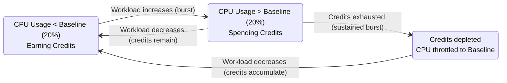
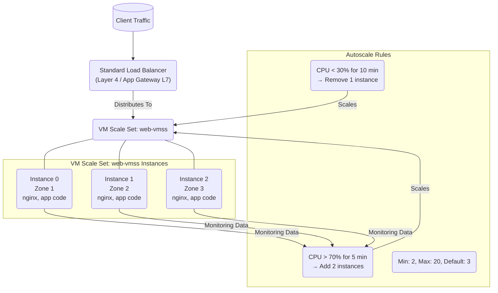

**Complexity**: [MEDIUM] | **Time to Complete**: 2h | **Prerequisites**: Module 3.2 (Virtual Networks)

## What You'll Be Able to Do

After completing this module, you will be able to:

- **Deploy Azure VMs with Availability Sets and Availability Zones for high-availability compute workloads**
- **Configure VM Scale Sets with autoscaling rules, custom images, and Flexible orchestration mode**
- **Implement Azure Spot VMs and Reserved Instances to optimize compute costs across workloads**
- **Evaluate Azure VM families (B-series, D-series, E-series, N-series) and select the right size for each workload**

---

## Why This Module Matters

A production workload running on a single Azure VM without zone redundancy, load balancing, or horizontal failover can go fully offline during an infrastructure failure, and the cost of basic high availability is often far lower than the cost of a prolonged outage.

Virtual machines remain the workhorse of cloud computing. Even in a world of containers, serverless functions, and managed services, VMs are the foundation that most of those higher-level services are built on. Understanding VM sizes, high availability constructs, disk types, and auto-scaling is fundamental to running reliable workloads on Azure. When you need full control over the operating system, when you are running software that cannot be containerized, or when you need specific hardware (like GPUs or high-memory instances), VMs are the answer.

In this module, you will learn how to choose the right VM size for your workload, how Availability Zones and Availability Sets protect you from infrastructure failures, how Managed Disks work, and how VM Scale Sets automate horizontal scaling. By the end, you will deploy a highly available web tier across multiple Availability Zones behind a Standard Load Balancer.

---

## Choosing the Right VM Size

Azure offers many VM sizes, organized into families based on the workload type they are optimized for. Choosing the right VM size is one of the most impactful decisions you will make---oversizing wastes money, undersizing causes performance problems.

### VM Size Families

| Family | Prefix | Optimized For | Example Use Cases |
| :--- | :--- | :--- | :--- |
| **General Purpose** | B, D, Ds | Balanced CPU-to-memory ratio | Web servers, small databases, dev/test |
| **Compute Optimized** | F, Fs | High CPU-to-memory ratio | Batch processing, gaming servers, CI/CD agents |
| **Memory Optimized** | E, Es, M | High memory-to-CPU ratio | Large databases, in-memory caches, SAP HANA |
| **Storage Optimized** | L, Ls | High disk throughput and IOPS | Data warehouses, large transactional databases |
| **GPU** | NC, ND, NV | GPU-accelerated workloads | ML training, rendering, video encoding |
| **High Performance** | HB, HC, HX | Fastest CPUs, InfiniBand networking | Scientific simulation, financial modeling |

### Understanding VM Size Naming

Azure VM sizes follow a naming convention that tells you a lot if you know how to read it:

```text
    Standard_D4s_v5

    Standard   = VM tier (Standard or Basic)
    D          = Family (General Purpose)
    4          = vCPUs
    s          = Premium SSD capable
    _v5        = Generation (hardware version)

    Other suffixes:
    a = AMD processor      (Standard_D4as_v5)
    d = Local temp disk     (Standard_D4ds_v5)
    i = Isolated (dedicated host)
    l = Low memory
    p = ARM-based (Ampere)  (Standard_D4ps_v5)
```

> **Stop and think**: If you needed to deploy a high-performance computing (HPC) cluster with tightly coupled nodes requiring very fast inter-node communication, which VM size family would you immediately investigate? Why?

```bash
# List all available VM sizes in a region
az vm list-sizes --location eastus2 -o table

# Filter for D-series v5 sizes
az vm list-sizes --location eastus2 \
  --query "[?starts_with(name, 'Standard_D') && contains(name, 'v5')].{Name:name, vCPUs:numberOfCores, MemoryGB:memoryInMB}" \
  -o table

# Check what sizes are available for a specific VM (for resizing)
az vm list-vm-resize-options -g myRG -n myVM -o table
```

### The B-Series: Burstable VMs

The B-series deserves special attention because it is the most cost-effective option for workloads that do not need sustained CPU. [B-series VMs accumulate CPU credits when idle and spend them during bursts.](https://learn.microsoft.com/en-us/azure/virtual-machines/sizes/general-purpose/b-family)



For a lightly used dev/test VM, a burstable B-series instance can cost materially less than a comparable D-series VM, which is why B-series is often attractive for workloads that spend much of their time idle.

**Example pattern**: For workloads like build agents that spend much of their time idle and then burst briefly, moving from fixed-performance VMs to burstable VMs can reduce compute spend substantially if the credit model fits the workload.

> **Pause and predict**: You're designing an application that processes large batch jobs nightly. These jobs run for 2-3 hours and require significant CPU, but the VMs are idle for the remaining 21 hours. Would B-series VMs be a good fit? Why or why not?

---

## High Availability: Availability Zones vs Availability Sets

Azure provides two mechanisms to protect your VMs from infrastructure failures. Understanding the difference is essential for designing reliable systems.

### Availability Zones (AZs)

[An Availability Zone is a physically separate location within an Azure region. Each zone has independent power, cooling, and networking.](https://learn.microsoft.com/en-us/azure/reliability/availability-zones-overview) If a fire destroys Zone 1, Zones 2 and 3 continue operating. Azure guarantees a [**99.99% SLA**](https://azure.microsoft.com/en-us/explore/global-infrastructure/availability-zones/) for VMs deployed across two or more zones.

```mermaid
graph LR
    subgraph "Azure Region: East US 2"
        Z1["Zone 1<br>Isolated Power, Cooling, Network<br>VM-1"]
        Z2["Zone 2<br>Isolated Power, Cooling, Network<br>VM-2"]
        Z3["Zone 3<br>Isolated Power, Cooling, Network<br>VM-3"]

        Z1 --- Z2
        Z2 --- Z3
        note over Z1,Z3: Low-latency interconnect (<2ms)
    end
```

### Availability Sets

[An Availability Set distributes VMs across **Fault Domains** (separate physical racks) and **Update Domains** (groups that Azure reboots sequentially during maintenance).](https://learn.microsoft.com/en-us/azure/virtual-machines/availability-set-overview) Availability Sets provide a [**99.95% SLA**](https://learn.microsoft.com/en-us/azure/virtual-machines/availability).

```mermaid
graph TD
    subgraph "Availability Set (3 Fault Domains, 5 Update Domains)"
        FD0[("Fault Domain 0<br>Rack 1")]
        FD1[("Fault Domain 1<br>Rack 2")]
        FD2[("Fault Domain 2<br>Rack 3")]

        FD0 --- VM1(VM-1 (UD0))
        FD0 --- VM4(VM-4 (UD3))
        FD1 --- VM2(VM-2 (UD1))
        FD1 --- VM5(VM-5 (UD4))
        FD2 --- VM3(VM-3 (UD2))

        note over FD0,FD2: During maintenance, Azure reboots one Update Domain (UD) at a time: UD0, then UD1, then UD2, etc.
    end
```

> **Stop and think**: Your company has a strict RPO (Recovery Point Objective) of 0 and an RTO (Recovery Time Objective) of under 5 minutes for a critical financial application. The application is currently running on a single VM. You need to implement high availability. Which Azure HA mechanism would you choose first, and why?

### When to Use Which

| Criteria | Availability Zones | Availability Sets |
| :--- | :--- | :--- |
| **SLA** | 99.99% | 99.95% |
| **Protection against** | Data center-level failure | Rack-level failure, planned maintenance |
| **Latency between instances** | ~1-2ms (cross-zone) | <1ms (same data center) |
| **Region support** | Most major regions, but not all | All regions |
| **Cost** | No extra charge for the VM, but cross-zone data transfer costs | No extra charge |
| **Recommendation** | Use whenever the region supports zones | Use only when zones are unavailable in a region for the desired VM size |

```bash
# Create a VM in a specific Availability Zone
az vm create \
  --resource-group myRG \
  --name web-vm-1 \
  --image Ubuntu2204 \
  --size Standard_D2s_v5 \
  --zone 1 \
  --admin-username azureuser \
  --generate-ssh-keys

# Create a VM in a different zone
az vm create \
  --resource-group myRG \
  --name web-vm-2 \
  --image Ubuntu2204 \
  --size Standard_D2s_v5 \
  --zone 2 \
  --admin-username azureuser \
  --generate-ssh-keys

# Create an Availability Set (when zones are not available)
az vm availability-set create \
  --resource-group myRG \
  --name web-avset \
  --platform-fault-domain-count 3 \
  --platform-update-domain-count 5
```

---

## Managed Disks: Storage for Your VMs

Every Azure VM needs at least one disk: the **OS disk**. Most production VMs also have one or more **data disks**. Azure Managed Disks abstract away the storage account management, giving you a simple, reliable disk resource.

### Disk Types

| Type | IOPS (max) | Throughput (max) | Use Case | Cost (128 GB) |
| :--- | :--- | :--- | :--- | :--- |
| **Standard HDD** | 500 | 60 MB/s | Backups, dev/test, infrequent access | ~$5/month |
| **Standard SSD** | 6,000 | 750 MB/s | Web servers, light databases | ~$10/month |
| **Premium SSD** | 7,500 | 250 MB/s | Production databases, high IOPS | ~$19/month |
| **Premium SSD v2** | 80,000 | 1,200 MB/s | Tier-1 databases, demanding workloads | ~$10+/month (pay per IOPS/throughput) |
| **Ultra Disk** | 160,000 | 4,000 MB/s | SAP HANA, transaction-heavy databases | ~$67+/month |

> **Pause and predict**: Your application team reports slow database queries. You investigate and find the database VM's disk queue length is consistently high. The VM is currently using a Standard SSD for its data disk. What's your immediate recommendation, and why?

```bash
# Create a VM with a Premium SSD OS disk and a 256 GB data disk
az vm create \
  --resource-group myRG \
  --name db-vm \
  --image Ubuntu2204 \
  --size Standard_D4s_v5 \
  --os-disk-size-gb 64 \
  --storage-sku Premium_LRS \
  --data-disk-sizes-gb 256 \
  --admin-username azureuser \
  --generate-ssh-keys

# Add another data disk to an existing VM
az vm disk attach \
  --resource-group myRG \
  --vm-name db-vm \
  --name db-data-disk-2 \
  --size-gb 512 \
  --sku Premium_LRS \
  --new

# List disks attached to a VM
az vm show -g myRG -n db-vm \
  --query '{OSDisk:storageProfile.osDisk.name, DataDisks:storageProfile.dataDisks[].{Name:name, SizeGB:diskSizeGb, Type:managedDisk.storageAccountType}}' -o json
```

### Disk Encryption

[Azure encrypts all Managed Disks at rest by default using platform-managed keys (PMK). For additional control, you can use:](https://learn.microsoft.com/en-us/azure/virtual-machines/disk-encryption-overview)

- **Customer-managed keys (CMK)**: You manage the encryption key in Azure Key Vault
- **Azure Disk Encryption (ADE)**: Uses BitLocker (Windows) or DM-Crypt (Linux) for OS-level encryption
- **Confidential disk encryption**: For confidential VMs, encrypts the disk with a key tied to the VM's TPM

```bash
# Enable Azure Disk Encryption on a Linux VM
az vm encryption enable \
  --resource-group myRG \
  --name db-vm \
  --disk-encryption-keyvault myKeyVault \
  --volume-type All

# Check encryption status
az vm encryption show --resource-group myRG --name db-vm -o table
```

---

## VM Extensions and Cloud-Init: Automating Configuration

Manually SSHing into VMs to install software is fragile and does not scale. Azure provides two mechanisms for automated configuration: **VM Extensions** and **cloud-init**.

### Cloud-Init

Cloud-init is the industry standard for cross-platform cloud instance initialization. It runs during the first boot of a VM and can install packages, write files, run commands, and configure services.

```yaml
# cloud-init.yaml
#cloud-config
package_update: true
package_upgrade: true

packages:
  - nginx
  - curl
  - jq

write_files:
  - path: /var/www/html/index.html
    content: |
      <!DOCTYPE html>
      <html>
      <body>
        <h1>Hello from KubeDojo VM</h1>
        <p>Hostname: HOSTNAME_PLACEHOLDER</p>
        <p>Zone: ZONE_PLACEHOLDER</p>
      </body>
      </html>

runcmd:
  - hostnamectl set-hostname $(curl -s -H Metadata:true "http://169.254.169.254/metadata/instance/compute/name?api-version=2021-02-01&format=text")
  - |
    HOSTNAME=$(hostname)
    ZONE=$(curl -s -H Metadata:true "http://169.254.169.254/metadata/instance/compute/zone?api-version=2021-02-01&format=text")
    sed -i "s/HOSTNAME_PLACEHOLDER/$HOSTNAME/" /var/www/html/index.html
    sed -i "s/ZONE_PLACEHOLDER/$ZONE/" /var/www/html/index.html
  - systemctl enable nginx
  - systemctl start nginx
```

> **Stop and think**: You need to deploy a complex application that requires a specific version of a Java Development Kit (JDK) and a set of proprietary libraries. You plan to use cloud-init. What's a potential pitfall of putting the entire installation logic in a single cloud-init script?

```bash
# Create a VM with cloud-init
az vm create \
  --resource-group myRG \
  --name web-vm \
  --image Ubuntu2204 \
  --size Standard_B2s \
  --custom-data @cloud-init.yaml \
  --admin-username azureuser \
  --generate-ssh-keys
```

### VM Extensions

VM Extensions are small applications that provide post-deployment configuration and automation. They are Azure-native and can be managed through ARM templates, CLI, or the portal.

```bash
# Install the Custom Script Extension to run a script
az vm extension set \
  --resource-group myRG \
  --vm-name web-vm \
  --name CustomScript \
  --publisher Microsoft.Azure.Extensions \
  --settings '{"commandToExecute":"apt-get update && apt-get install -y docker.io && systemctl enable docker"}'

# Install the Azure Monitor Agent
az vm extension set \
  --resource-group myRG \
  --vm-name web-vm \
  --name AzureMonitorLinuxAgent \
  --publisher Microsoft.Azure.Monitor \
  --enable-auto-upgrade true

# List extensions on a VM
az vm extension list -g myRG --vm-name web-vm -o table
```

---

## VM Scale Sets (VMSS): Horizontal Auto-Scaling

[A VM Scale Set is a group of identical, load-balanced VMs that can automatically scale in and out based on demand or a schedule.](https://learn.microsoft.com/en-us/azure/virtual-machines/availability) Think of it as a fleet of VMs managed as a single resource.

### VMSS Architecture



### Orchestration Modes

VMSS has two orchestration modes:

| Feature | Uniform (Legacy) | Flexible (Recommended) |
| :--- | :--- | :--- |
| **VM model** | All VMs identical | Mix of VM sizes and configs |
| **Zones** | Spread across zones | Spread across zones |
| **Manual VMs** | Cannot add existing VMs | Can add existing VMs |
| **Instance protection** | Limited | Full control |
| **Networking** | VMSS-managed NICs | Standard NICs |
| **Fault domains** | Configurable (max 5) | Max spreading (recommended) |

> **Pause and predict**: You have an existing application running on several standalone Azure VMs. You want to leverage the auto-scaling and high availability features of VM Scale Sets without re-creating all your VMs. Which orchestration mode would you choose, and why?

### Custom Images with VMSS

For complex applications or hardened environments, you'll often need to deploy VMs from a custom image rather than a marketplace image. This allows you to pre-install software, apply specific configurations, or include security baselines. Custom images can be created from existing VMs or built using tools like Azure Image Builder or Packer, and then stored in a Managed Image resource or a Shared Image Gallery.

A **Shared Image Gallery (SIG)** (now Azure Compute Gallery) is recommended for managing custom images. [It provides versioning, global replication, and access control for your images.](https://learn.microsoft.com/en-us/azure/virtual-machines/azure-compute-gallery)

```bash
# Example: Deploy a VMSS using a custom image from a Shared Image Gallery
# First, you need an image definition and an image version in a Shared Image Gallery.
# (Steps to create SIG, image definition, and image version are omitted for brevity)

# Assuming you have an Image Definition ID (e.g., /subscriptions/<subId>/resourceGroups/<rgName>/providers/Microsoft.Compute/galleries/<galleryName>/images/<imageDefinitionName>)
IMAGE_DEFINITION_ID="/subscriptions/<your-subscription-id>/resourceGroups/mySIGRG/providers/Microsoft.Compute/galleries/mySIG/images/myWebAppImage"

az vmss create \
  --resource-group myRG \
  --name web-vmss-custom \
  --image "$IMAGE_DEFINITION_ID" \
  --vm-sku Standard_B2s \
  --instance-count 3 \
  --zones 1 2 3 \
  --orchestration-mode Flexible \
  --admin-username azureuser \
  --generate-ssh-keys \
  --lb-sku Standard \
  --upgrade-policy-mode Automatic
```

```bash
# Create a VMSS in Flexible orchestration mode across Availability Zones
az vmss create \
  --resource-group myRG \
  --name web-vmss \
  --image Ubuntu2204 \
  --vm-sku Standard_B2s \
  --instance-count 3 \
  --zones 1 2 3 \
  --orchestration-mode Flexible \
  --admin-username azureuser \
  --generate-ssh-keys \
  --custom-data @cloud-init.yaml \
  --lb-sku Standard \
  --upgrade-policy-mode Automatic

# Configure autoscale rules
az monitor autoscale create \
  --resource-group myRG \
  --resource web-vmss \
  --resource-type Microsoft.Compute/virtualMachineScaleSets \
  --name web-autoscale \
  --min-count 2 \
  --max-count 20 \
  --count 3

# Scale out when CPU > 70% for 5 minutes
az monitor autoscale rule create \
  --resource-group myRG \
  --autoscale-name web-autoscale \
  --condition "Percentage CPU > 70 avg 5m" \
  --scale out 2

# Scale in when CPU < 30% for 10 minutes
az monitor autoscale rule create \
  --resource-group myRG \
  --autoscale-name web-autoscale \
  --condition "Percentage CPU < 30 avg 10m" \
  --scale in 1

# View VMSS instances
az vmss list-instances -g myRG -n web-vmss -o table

# View autoscale settings
az monitor autoscale show -g myRG -n web-autoscale -o json
```

---

## Azure Load Balancer: Distributing Traffic

[Azure Load Balancer operates at Layer 4 (TCP/UDP) and distributes incoming traffic across healthy VM instances.](https://learn.microsoft.com/en-us/azure/reliability/reliability-load-balancer) There are two SKUs:

| Feature | Basic (being retired) | Standard |
| :--- | :--- | :--- |
| **Backend pool size** | Up to 300 instances | Up to 1,000 instances |
| **Health probes** | TCP, HTTP | TCP, HTTP, HTTPS |
| **Availability Zones** | Not supported | Zone-redundant or zonal |
| **SLA** | No SLA | 99.99% |
| **Security** | Open by default | Closed by default (requires NSG) |
| **Cost** | Free | ~$18/month + data processing |
| **Outbound rules** | Limited | Full control |

```bash
# The VMSS creation command above automatically creates a Standard LB.
# To create one manually:

# Create public IP for the load balancer
az network public-ip create \
  --resource-group myRG \
  --name web-lb-pip \
  --sku Standard \
  --zone 1 2 3    # Zone-redundant

# Create load balancer
az network lb create \
  --resource-group myRG \
  --name web-lb \
  --sku Standard \
  --frontend-ip-name web-frontend \
  --backend-pool-name web-backend \
  --public-ip-address web-lb-pip

# Create health probe
az network lb probe create \
  --resource-group myRG \
  --lb-name web-lb \
  --name http-probe \
  --protocol Http \
  --port 80 \
  --path /health \
  --interval 15 \
  --threshold 2

# Create load balancing rule
az network lb rule create \
  --resource-group myRG \
  --lb-name web-lb \
  --name http-rule \
  --frontend-ip-name web-frontend \
  --backend-pool-name web-backend \
  --protocol Tcp \
  --frontend-port 80 \
  --backend-port 80 \
  --probe-name http-probe \
  --idle-timeout 4 \
  --enable-tcp-reset true

# IMPORTANT: Standard LB is "secure by default" -- you MUST create an NSG
# to allow traffic, or the health probes and client traffic will be blocked.
```

---

## Optimizing Costs: Spot VMs and Reserved Instances

Managing cloud costs is as critical as managing performance and availability. Azure provides several options to significantly reduce compute expenses, especially for workloads with flexible requirements.

### Azure Spot VMs

[Azure Spot Virtual Machines allow you to utilize unused Azure compute capacity at a significant discount (up to 90% off pay-as-you-go prices). The trade-off is that Azure can evict Spot VMs at any time if it needs the capacity back.](https://learn.microsoft.com/en-us/azure/architecture/guide/spot/spot-eviction)

**Use Cases**:
- **Batch processing**: Jobs that can be interrupted and restarted.
- **Development/test environments**: Non-production workloads where occasional interruptions are acceptable.
- **High-throughput stateless applications**: Workloads like rendering or media encoding where progress can be saved or work redistributed upon eviction.
- **VM Scale Sets**: Ideal for Spot VMs, as the scale set can automatically replace evicted instances or balance workload.

**Key Considerations**:
- **Eviction policy**: You can choose to deallocate or delete the VM when Azure evicts it.
- **Price caps**: You can set a maximum price you're willing to pay, but it's often more effective to let Azure choose the current Spot price for higher availability.
- **VM size and region**: Spot availability and pricing vary by VM size and region.

```bash
# Create a single Azure Spot VM
az vm create \
  --resource-group myRG \
  --name spot-batch-vm \
  --image Ubuntu2204 \
  --size Standard_D2s_v5 \
  --admin-username azureuser \
  --generate-ssh-keys \
  --priority Spot \
  --eviction-policy Deallocate \
  --max-price -1 # -1 means pay current price up to on-demand price
```

> **Pause and predict**: Your data science team needs to run daily machine learning training jobs that take several hours. These jobs are fault-tolerant and can resume from checkpoints. The budget is very constrained. What Azure VM offering would you recommend to them, and what's the primary risk they need to be aware of?

### Azure Reserved Virtual Machine Instances (RIs)

[Azure Reserved Instances allow you to commit to a specific VM size and region for a one-year or three-year term in exchange for a significant discount (up to 72% compared to pay-as-you-go). When you purchase a reservation, it applies to any qualifying VM in that region, regardless of the specific VM running.](https://learn.microsoft.com/en-us/azure/cost-management-billing/reservations/save-compute-costs-reservations)

**Use Cases**:
- **Steady-state workloads**: Applications with predictable, continuous usage (e.g., production databases, always-on web servers).
- **Long-running projects**: Any project where you know you'll need compute capacity for an extended period.

**Key Considerations**:
- **Flexibility**: Reservations offer some flexibility (e.g., instance size flexibility within the same family).
- **Utilization**: To maximize savings, you need to ensure high utilization of your reserved capacity. Unused reservation hours are wasted.
- **Payment options**: You can pay upfront or monthly.

**Spot VMs vs. Reserved Instances**:
- **Spot VMs**: Best for flexible, interruptible workloads where cost is paramount and availability can fluctuate.
- **Reserved Instances**: Best for stable, continuous workloads where predictable costs and guaranteed capacity are essential.

---

## Did You Know?

1.  **Azure periodically performs host maintenance**. Many VM-impacting maintenance events are brief, and Scheduled Events can provide advance notice for many maintenance scenarios, but some VM families or update types can still require a reboot.

2.  **The Standard_B1ls is a very small, low-cost VM** that can still be useful for lightweight workloads like a bastion-style host, a small relay service, or a simple scheduled task runner.

3.  **VM Scale Sets in Flexible orchestration mode can use instance mix to combine multiple VM sizes in one scale set**. This can improve provisioning success and cost flexibility when capacity is constrained.

4.  [**When you stop (deallocate) a VM, you stop paying for compute but continue paying for the OS disk and any data disks.**](https://learn.microsoft.com/en-us/azure/virtual-machines/states-billing) Even when compute is off, attached disks can still add up to a meaningful monthly bill across many stopped VMs. To truly eliminate disk costs, you need to delete the disks and recreate the VMs from images or snapshots.

---

## Common Mistakes

| Mistake | Why It Happens | How to Fix It |
| :--- | :--- | :--- |
| Running production on a single VM without HA | The application "works fine" and adding redundancy seems like overkill | Use at least 2 VMs across Availability Zones behind a Standard Load Balancer. The cost is minimal compared to downtime. |
| Choosing a VM size based only on vCPU count | Developers assume "4 vCPUs = 4 vCPUs" regardless of family | Different families have different CPU architectures, clock speeds, and memory ratios. Benchmark your workload on candidate sizes before committing. |
| Using Standard HDD for production workloads | It is the cheapest option and "seems fast enough in testing" | Standard HDD has only 500 IOPS max. Under production load, disk I/O becomes the bottleneck. Use Premium SSD minimum for production. |
| Not configuring a health probe on the load balancer | The default TCP probe on the backend port "seems to work" | Use an HTTP health probe that checks your application's /health endpoint. A TCP probe only verifies the port is open, not that your app is healthy. |
| Forgetting to create an NSG when using Standard Load Balancer | Basic LB allows traffic by default, so teams assume Standard does too | Standard LB blocks all traffic unless an NSG explicitly allows it. Ensure an NSG permits traffic on the load balancer's frontend port when using Standard Load Balancer. |
| Scaling up (bigger VM) instead of scaling out (more VMs) | Scaling up is simpler and requires no architecture changes | Scaling up hits a ceiling and creates a single point of failure. Design for horizontal scaling with VMSS from the start. |
| Using cloud-init for complex configuration that takes 15+ minutes | Cloud-init runs on first boot and there is no timeout feedback | For complex configurations, build a custom VM image with Packer or Azure Image Builder. Use cloud-init only for lightweight, last-mile configuration. |
| Not tagging VMs with cost allocation metadata | It seems like busywork during initial deployment | Without tags, you cannot attribute costs to teams or projects. Enforce tagging with Azure Policy. At minimum, tag with environment, team, and project. |

---

## Quiz

<details>
<summary>1. A critical, always-on microservice requires high availability and minimal downtime. Your application is deployed in the East US 2 region, which supports Availability Zones. Which high-availability strategy should you prioritize for your VMs, and why?</summary>

The primary strategy should be deploying VMs across **Availability Zones**. Availability Zones provide protection against entire data center failures by physically separating compute, networking, and storage. If one zone experiences an outage, VMs in other zones remain operational, offering a 99.99% SLA. While Availability Sets protect against rack-level failures and planned maintenance, they do not offer the same level of isolation against widespread data center issues, providing a lower 99.95% SLA. For a critical, always-on service in a zone-enabled region, Availability Zones offer superior resilience.
</details>

<details>
<summary>2. You are evaluating VM sizes for a new web application. The application is expected to have highly variable traffic, with peak loads during business hours and very low usage overnight. Cost optimization is a key concern. Which VM family would you primarily consider, and how does it help optimize costs in this scenario?</summary>

For a web application with highly variable traffic and a focus on cost optimization, the **B-series (Burstable)** VM family would be the primary consideration. B-series VMs accumulate CPU credits when they are running below their baseline performance and can spend these credits during bursts of high CPU demand. This model is ideal for workloads that don't require sustained high CPU usage. During off-peak hours, when traffic is low, the VMs earn credits, which they then use during peak business hours. This allows you to pay less than an equivalent D-series VM while still providing satisfactory performance during bursts, as long as the bursts are not continuous enough to deplete all accumulated credits.
</details>

<details>
<summary>3. Your development team needs several VMs for daily testing. These VMs are only active during working hours (9 AM - 5 PM, Monday - Friday) and can be turned off outside these times. What compute cost optimization strategy should you implement, and what is a crucial aspect to manage to fully realize the savings?</summary>

You should implement a strategy of **stopping (deallocating) the VMs outside working hours**. While stopping a VM pauses compute charges, a crucial aspect to manage is the **disks attached to the VMs**. When a VM is deallocated, you continue to pay for its OS disk and any data disks. To fully realize cost savings, it's essential to understand that disk costs can be significant. If the VMs are truly temporary or can be recreated from images daily, deleting the disks when the VMs are not in use would provide maximum savings. Otherwise, simply deallocating them reduces compute costs but retains disk costs.
</details>

<details>
<summary>4. Your company needs to deploy a critical, proprietary application onto Azure VMs. The application requires specific operating system configurations, pre-installed software, and hardened security settings that are not available in standard marketplace images. How would you ensure all VMs deployed for this application consistently meet these requirements?</summary>

To ensure all VMs consistently meet these requirements, you should use a **custom VM image** deployed via a **Shared Image Gallery (SIG)**, now known as Azure Compute Gallery. A custom image allows you to capture a VM's specific OS configuration, pre-installed applications, and security settings as a template. The Shared Image Gallery provides a centralized repository for managing, versioning, and sharing these custom images across subscriptions and regions. This approach guarantees that every VM spun up from this custom image will have the exact, pre-validated configuration, eliminating manual setup and reducing configuration drift.
</details>

<details>
<summary>5. You are setting up a VM Scale Set for a public-facing web application. To adhere to security best practices, all inbound traffic to the backend instances must be explicitly allowed. After deploying the VMSS with a Standard Load Balancer, you find that web requests are not reaching the application. What is the likely cause of the problem, and how would you resolve it?</summary>

The likely cause is that the **Network Security Group (NSG) associated with the VM Scale Set's subnet or individual VM NICs is blocking traffic**. The Standard Load Balancer is designed with a "secure by default" model, meaning it explicitly blocks all inbound traffic unless an NSG rule explicitly permits it. Unlike the older Basic Load Balancer, it does not automatically open ports. To resolve this, you must create an inbound security rule in the relevant NSG to allow traffic on the required port (e.g., TCP port 80 or 443) from the internet to your VMSS instances. This ensures that the Load Balancer can forward client requests, and its health probes can reach the backend VMs.
</details>

<details>
<summary>6. Your data engineering team runs a complex ETL (Extract, Transform, Load) pipeline that requires high disk I/O for temporary data storage. The current setup uses Premium SSDs, but they are frequently hitting I/O bottlenecks during peak processing. The budget allows for a more performant solution. Which advanced disk type should you consider, and what is its primary advantage for this workload?</summary>

For a complex ETL pipeline experiencing I/O bottlenecks with Premium SSDs and requiring higher performance, **Premium SSD v2** would be the ideal advanced disk type. Its primary advantage for this workload is the ability to **independently configure and scale IOPS and throughput**. Unlike Premium SSDs, where IOPS and throughput are tied to the disk size, Premium SSD v2 allows you to provision exactly the IOPS (up to 80,000) and throughput (up to 1,200 MB/s) needed for your workload, and you only pay for what you provision. This offers significant flexibility and cost-efficiency compared to Ultra Disks for most high-demand scenarios, as you can fine-tune performance without oversizing storage capacity.
</details>

<details>
<summary>7. Your company has a consistent, 24/7 workload running on Azure VMs for its core ERP system. The usage patterns are stable, and you anticipate needing this compute capacity for at least the next three years. What cost optimization strategy would provide the most significant, guaranteed savings for this specific workload, and why?</summary>

For a consistent, 24/7 workload with predictable usage over a three-year term, purchasing **Azure Reserved Virtual Machine Instances (RIs)** would provide the most significant and guaranteed savings. Reserved Instances offer substantial discounts (up to 72% compared to pay-as-you-go rates) in exchange for committing to a specific VM size and region for a one-year or three-year period. Since the ERP system is a stable, always-on workload, you can accurately forecast its compute needs, making it an ideal candidate for an RI. This commitment ensures you pay a much lower, predictable rate for the compute capacity, leading to considerable long-term cost reductions without sacrificing availability or performance.
</details>

---

## Hands-On Exercise: HA Web Tier on VMSS Across Availability Zones with Standard LB

In this exercise, you will deploy a highly available web application using a VM Scale Set spread across three Availability Zones, with a Standard Load Balancer distributing traffic and autoscale rules based on CPU utilization.

**Prerequisites**: Azure CLI installed and authenticated.

### Task 1: Create the Resource Group and Network

```bash
RG="kubedojo-vmss-lab"
LOCATION="eastus2"

az group create --name "$RG" --location "$LOCATION"

# Create a VNet and subnet for the VMSS
az network vnet create \
  --resource-group "$RG" \
  --name web-vnet \
  --address-prefix 10.0.0.0/16 \
  --subnet-name web-subnet \
  --subnet-prefix 10.0.1.0/24
```

<details>
<summary>Verify Task 1</summary>

```bash
az network vnet show -g "$RG" -n web-vnet --query '{AddressSpace:addressSpace.addressPrefixes[0], Subnet:subnets[0].name}' -o table
```
</details>

### Task 2: Create a Cloud-Init Configuration

```bash
cat > /tmp/web-cloud-init.yaml << 'CLOUDINIT'
#cloud-config
package_update: true
packages:
  - nginx
  - curl

write_files:
  - path: /var/www/html/index.html
    content: |
      <!DOCTYPE html>
      <html><body>
      <h1>KubeDojo VMSS Lab</h1>
      <p>Instance: INSTANCE_ID</p>
      <p>Zone: ZONE_ID</p>
      </body></html>

  - path: /var/www/html/health
    content: "OK"

runcmd:
  - |
    INSTANCE=$(curl -s -H Metadata:true "http://169.254.169.254/metadata/instance/compute/name?api-version=2021-02-01&format=text")
    ZONE=$(curl -s -H Metadata:true "http://169.254.169.254/metadata/instance/compute/zone?api-version=2021-02-01&format=text")
    sed -i "s/INSTANCE_ID/$INSTANCE/" /var/www/html/index.html
    sed -i "s/ZONE_ID/$ZONE/" /var/www/html/index.html
  - systemctl enable nginx
  - systemctl restart nginx
CLOUDINIT
```

<details>
<summary>Verify Task 2</summary>

```bash
cat /tmp/web-cloud-init.yaml | head -5
```

You should see the cloud-config header.
</details>

### Task 3: Create the VMSS with Standard Load Balancer

```bash
az vmss create \
  --resource-group "$RG" \
  --name web-vmss \
  --image Ubuntu2204 \
  --vm-sku Standard_B2s \
  --instance-count 3 \
  --zones 1 2 3 \
  --orchestration-mode Flexible \
  --admin-username azureuser \
  --generate-ssh-keys \
  --custom-data /tmp/web-cloud-init.yaml \
  --lb-sku Standard \
  --lb web-lb \
  --vnet-name web-vnet \
  --subnet web-subnet \
  --upgrade-policy-mode Automatic
```

<details>
<summary>Verify Task 3</summary>

```bash
az vmss show -g "$RG" -n web-vmss \
  --query '{Name:name, SKU:sku.name, Capacity:sku.capacity, Zones:zones}' -o table
```

You should see 3 instances across zones 1, 2, and 3.
</details>

### Task 4: Configure NSG and Health Probe

```bash
# Get the NSG name created by VMSS
NSG_NAME=$(az network nsg list -g "$RG" --query '[0].name' -o tsv)

# Allow HTTP traffic inbound
az network nsg rule create \
  --resource-group "$RG" \
  --nsg-name "$NSG_NAME" \
  --name AllowHTTP \
  --priority 100 \
  --direction Inbound \
  --access Allow \
  --protocol Tcp \
  --source-address-prefixes Internet \
  --destination-port-ranges 80

# Update the LB health probe to use HTTP
LB_PROBE=$(az network lb probe list -g "$RG" --lb-name web-lb --query '[0].name' -o tsv)
az network lb probe update \
  --resource-group "$RG" \
  --lb-name web-lb \
  --name "$LB_PROBE" \
  --protocol Http \
  --port 80 \
  --path /health
```

<details>
<summary>Verify Task 4</summary>

```bash
az network lb probe show -g "$RG" --lb-name web-lb -n "$LB_PROBE" \
  --query '{Protocol:protocol, Port:port, Path:requestPath}' -o table
```

You should see HTTP probe on port 80 with path /health.
</details>

### Task 5: Configure Autoscale Rules

```bash
VMSS_ID=$(az vmss show -g "$RG" -n web-vmss --query id -o tsv)

# Create autoscale setting
az monitor autoscale create \
  --resource-group "$RG" \
  --resource "$VMSS_ID" \
  --resource-type Microsoft.Compute/virtualMachineScaleSets \
  --name web-autoscale \
  --min-count 2 \
  --max-count 10 \
  --count 3

# Scale out: CPU > 70% for 5 minutes → add 2 instances
az monitor autoscale rule create \
  --resource-group "$RG" \
  --autoscale-name web-autoscale \
  --condition "Percentage CPU > 70 avg 5m" \
  --scale out 2

# Scale in: CPU < 25% for 10 minutes → remove 1 instance
az monitor autoscale rule create \
  --resource-group "$RG" \
  --autoscale-name web-autoscale \
  --condition "Percentage CPU < 25 avg 10m" \
  --scale in 1
```

<details>
<summary>Verify Task 5</summary>

```bash
az monitor autoscale show -g "$RG" -n web-autoscale \
  --query '{Min:profiles[0].capacity.minimum, Max:profiles[0].capacity.maximum, Default:profiles[0].capacity.default, RuleCount:profiles[0].rules|length(@)}' -o table
```

You should see min 2, max 10, default 3, and 2 rules.
</details>

### Task 6: Test the Deployment

```bash
# Get the public IP of the load balancer
LB_IP=$(az network public-ip list -g "$RG" --query '[0].ipAddress' -o tsv)
echo "Load Balancer IP: $LB_IP"

# Test the web server (run multiple times to see different instances)
for i in $(seq 1 6); do
  echo "Request $i:"
  curl -s "http://$LB_IP" | grep -o 'Instance: [^<]*\|Zone: [^<]*'
  echo "---"
done

# Check health endpoint
curl -s "http://$LB_IP/health"
```

<details>
<summary>Verify Task 6</summary>

You should see responses from different instances across different zones. The Instance and Zone values should vary as the load balancer distributes requests. The health endpoint should return "OK".
</details>

### Cleanup

```bash
az group delete --name "$RG" --yes --no-wait
```

### Success Criteria

- [ ] VMSS created with 3 instances across Availability Zones 1, 2, and 3
- [ ] Standard Load Balancer distributing HTTP traffic to VMSS instances
- [ ] HTTP health probe configured on /health endpoint
- [ ] NSG rule allowing inbound HTTP traffic from the internet
- [ ] Autoscale rules configured (scale out at 70% CPU, scale in at 25% CPU)
- [ ] curl requests to the LB IP show responses from different instances and zones

---

## Next Module

[Module 3.4: Azure Blob Storage & Data Lake](../module-3.4-blob/) --- Learn how Azure stores unstructured data at massive scale, from hot-tier serving to cold archival, with SAS tokens and identity-based access control.

## Sources

- [learn.microsoft.com: b family](https://learn.microsoft.com/en-us/azure/virtual-machines/sizes/general-purpose/b-family) — Microsoft's B-family documentation directly describes the CPU credit model and throttling behavior.
- [learn.microsoft.com: availability zones overview](https://learn.microsoft.com/en-us/azure/reliability/availability-zones-overview) — Microsoft's availability-zones overview directly states these isolation properties.
- [azure.microsoft.com: availability zones](https://azure.microsoft.com/en-us/explore/global-infrastructure/availability-zones/) — Microsoft Azure's availability-zones page explicitly markets the 99.99% VM uptime SLA.
- [learn.microsoft.com: availability set overview](https://learn.microsoft.com/en-us/azure/virtual-machines/availability-set-overview) — The availability-set overview directly defines fault domains, update domains, and their maintenance behavior.
- [learn.microsoft.com: availability](https://learn.microsoft.com/en-us/azure/virtual-machines/availability) — Microsoft's availability-options page explicitly ties availability sets to the 99.95% Azure SLA.
- [learn.microsoft.com: disk encryption overview](https://learn.microsoft.com/en-us/azure/virtual-machines/disk-encryption-overview) — Microsoft's managed-disk encryption overview directly documents default encryption-at-rest and the available encryption models.
- [learn.microsoft.com: virtual machine scale sets orchestration modes](https://learn.microsoft.com/en-us/azure/virtual-machine-scale-sets/virtual-machine-scale-sets-orchestration-modes) — Microsoft's orchestration-modes documentation explicitly calls Flexible the recommended mode and describes mixed VM-type support.
- [learn.microsoft.com: azure compute gallery](https://learn.microsoft.com/en-us/azure/virtual-machines/azure-compute-gallery) — The Azure Compute Gallery overview directly lists versioning, regional replication, and sharing capabilities.
- [learn.microsoft.com: reliability load balancer](https://learn.microsoft.com/en-us/azure/reliability/reliability-load-balancer) — Microsoft's reliability guidance directly defines Azure Load Balancer as a Layer 4 TCP/UDP service.
- [learn.microsoft.com: spot eviction](https://learn.microsoft.com/en-us/azure/architecture/guide/spot/spot-eviction) — Microsoft's Spot VM architecture guidance explicitly states the up-to-90% discount and eviction risk.
- [learn.microsoft.com: save compute costs reservations](https://learn.microsoft.com/en-us/azure/cost-management-billing/reservations/save-compute-costs-reservations) — Microsoft's reservations documentation directly states the up-to-72% savings, one- and three-year terms, and automatic application to matching resources.
- [learn.microsoft.com: states billing](https://learn.microsoft.com/en-us/azure/virtual-machines/states-billing) — Microsoft's billing-state documentation explicitly says deallocated VMs stop compute billing while resources like disks continue to incur charges.
- [Azure Managed Disk Types](https://learn.microsoft.com/en-us/azure/virtual-machines/disks-types) — Authoritative reference for current disk classes, performance envelopes, and workload-fit guidance.
- [Azure Spot Virtual Machines](https://learn.microsoft.com/en-us/azure/virtual-machines/spot-vms) — Canonical product documentation for Spot VM eviction behavior, notice timing, and operational tradeoffs.
