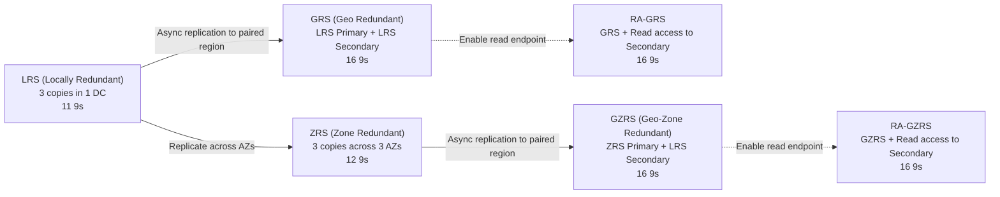
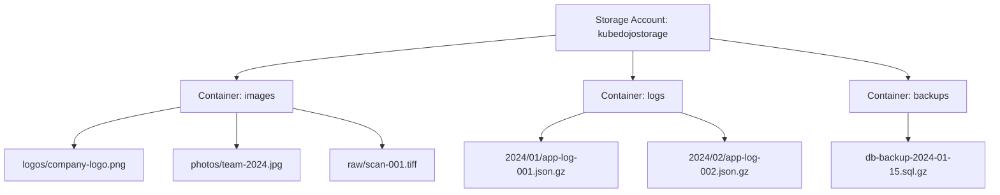
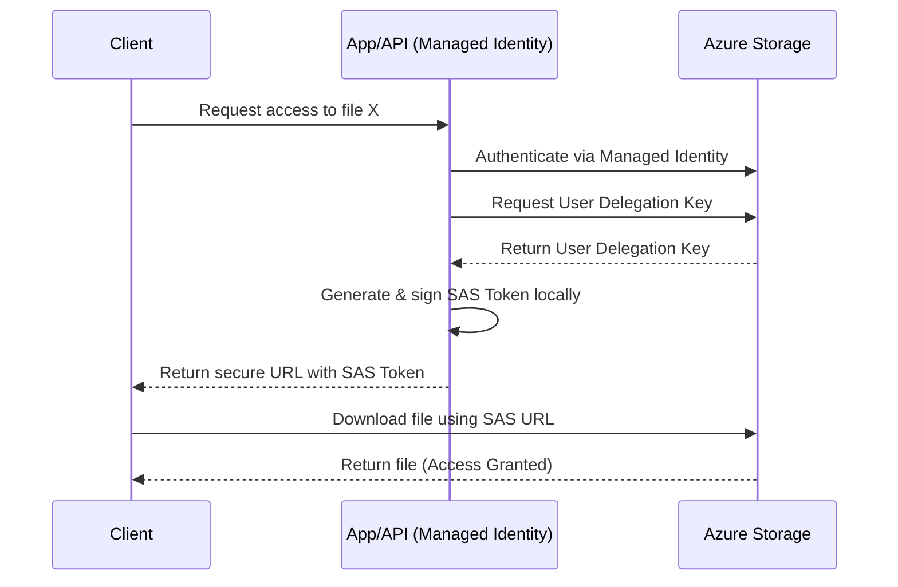
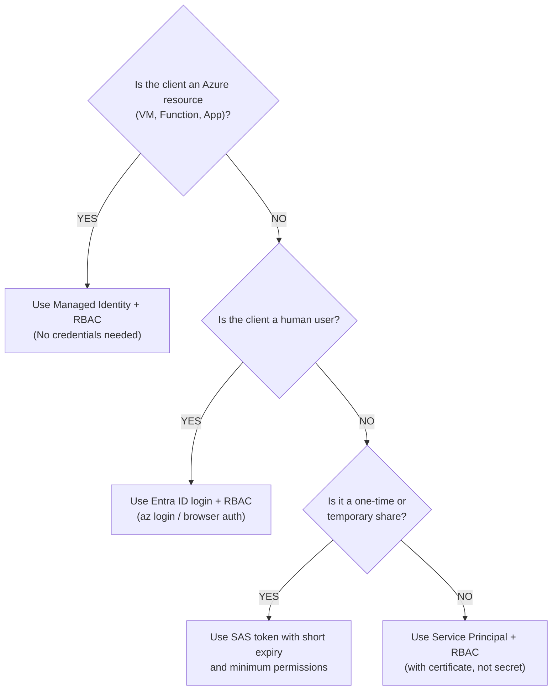

**Complexity**: [QUICK] | **Time to Complete**: 1.5h | **Prerequisites**: Module 3.1 (Entra ID & RBAC)

## What You'll Be Able to Do

After completing this module, you will be able to:

- **Configure Azure Blob Storage with access tiers (Hot, Cool, Cold, Archive) and lifecycle management policies**
- **Implement storage account security with private endpoints, SAS tokens, and Entra ID-based RBAC access**
- **Deploy blob versioning, soft delete, and immutable storage policies for data protection and compliance**
- **Design Data Lake Storage Gen2 hierarchical namespaces for analytics workloads integrated with Azure services**

---

## Why This Module Matters

In January 2022, a healthcare analytics company discovered that their Azure storage bill had silently grown from $800/month to $14,200/month over six months. The cause was mundane but devastating: an automated pipeline had been writing diagnostic logs and intermediate processing files to a Hot-tier storage account at a rate of approximately 3 TB per week. Nobody had configured lifecycle management policies, so six months of data---roughly 78 TB---sat in Hot storage at $0.018 per GB per month ($1,437/month for the data alone, plus transaction and bandwidth costs that pushed the total to $14,200). Moving 40% of that data to Cool tier (accessed less than once per month) and 50% to Archive tier (never accessed again) would have reduced storage costs by over 80%. The unnecessary spending over those six months was money that could have funded two engineering hires.

Azure Blob Storage is the foundation of data storage in Azure. It handles everything from serving website assets and storing application logs to backing enterprise data lakes and machine learning datasets. It is deceptively simple on the surface---you create a storage account, upload files, and they are stored. But beneath that simplicity lies a system with multiple access tiers, sophisticated access control mechanisms, replication options, and lifecycle management that can mean the difference between a reasonable bill and a financial disaster.

In this module, you will learn how Azure Storage Accounts work, how to choose the right access tier for your data, how SAS tokens and identity-based access control secure your blobs, and how Azure Data Lake Storage Gen2 extends Blob Storage for big data workloads. By the end, you will understand how to design a storage strategy that balances cost, performance, and security.

---

## Storage Accounts: The Container for Everything

A **Storage Account** is the top-level resource for Azure Storage. It provides a unique namespace for your data that is accessible from anywhere in the world over HTTP or HTTPS. A single storage account can hold up to 5 PiB (petabytes) of data.

### Storage Account Types

| Account Type | Supported Services | Performance Tiers | Use Case |
| :--- | :--- | :--- | :--- |
| **Standard general-purpose v2** | Blob, File, Queue, Table | Standard (HDD-backed) | Most workloads---default choice |
| **Premium block blobs** | Blob only (block blobs) | Premium (SSD-backed) | Low-latency, high-transaction workloads |
| **Premium file shares** | Files only | Premium (SSD-backed) | Enterprise file shares, databases on SMB |
| **Premium page blobs** | Page blobs only | Premium (SSD-backed) | VM disk storage (unmanaged disks---legacy) |

For the vast majority of workloads, **Standard general-purpose v2** is the right choice. Premium accounts are for specialized scenarios where you need sub-millisecond latency or extremely high transaction rates.

To translate this theory into practice, here is how you would provision both a standard and a premium storage account using the Azure CLI, ensuring secure defaults are set from the start:

```bash
# Create a standard storage account with LRS (locally redundant)
az storage account create \
  --name "kubedojostorage$(openssl rand -hex 4)" \
  --resource-group myRG \
  --location eastus2 \
  --sku Standard_LRS \
  --kind StorageV2 \
  --min-tls-version TLS1_2 \
  --allow-blob-public-access false

# Create a premium block blob account for low-latency workloads
az storage account create \
  --name "kubedojopremium$(openssl rand -hex 4)" \
  --resource-group myRG \
  --location eastus2 \
  --sku Premium_LRS \
  --kind BlockBlobStorage
```

### Redundancy Options

Azure replicates your data to protect against failures. The redundancy option you choose dictates the physical distribution of your data, heavily impacting both durability and your monthly invoice:



**Cost comparison (per GB, Hot tier, East US, approximate):**
* LRS: $0.018 (baseline)
* ZRS: $0.023 (+28%)
* GRS: $0.036 (+100%)
* RA-GRS: $0.046 (+156%)

**War Story**: A fintech startup chose LRS (cheapest) for their transaction ledger storage. When the data center experienced a power outage, their storage was offline for 3 hours. While no data was lost (LRS maintains 3 copies within the same data center), the unavailability violated their SLA with banking partners. They switched to ZRS, which would have survived the outage because it replicates across three independent data centers in the region. The extra $0.005/GB cost amounted to about $50/month for their 10 TB dataset---trivial compared to the $25,000 SLA penalty they paid.

> **Stop and think**: If your primary region suffers a complete outage, how does your application know to read from the secondary region in an RA-GRS setup? (Hint: Azure provides a distinct secondary endpoint URL, appended with `-secondary`, that your application logic must actively switch to during a failover event.)

---

## Blob Storage: Containers and Blobs

Blob (Binary Large Object) storage is organized into **containers** within a storage account. Think of containers as top-level directories. A critical architectural constraint to remember is that standard Blob Storage is fundamentally flat---there are no actual subdirectories, only virtual prefixes.


*(Note: The "/" in blob names creates a virtual directory hierarchy in the Azure portal, but the underlying storage engine treats it as a single flat string).*

### Blob Types

| Type | Max Size | Use Case |
| :--- | :--- | :--- |
| **Block Blob** | 190.7 TiB | Files, images, logs, backups---99% of workloads |
| **Append Blob** | 195 GiB | Append-only scenarios like log files |
| **Page Blob** | 8 TiB | Random read/write---used for VM disks (legacy) |

Interacting with containers and blobs programmatically is straightforward. The following commands demonstrate how to perform common file operations using Microsoft Entra ID authentication (`--auth-mode login`), strictly avoiding legacy access keys:

```bash
STORAGE_NAME="kubedojostorage"  # Replace with your actual name

# Create a container
az storage container create \
  --name "application-data" \
  --account-name "$STORAGE_NAME" \
  --auth-mode login

# Upload a file
echo '{"event": "user_login", "timestamp": "2024-06-15T10:30:00Z"}' > /tmp/event.json
az storage blob upload \
  --container-name "application-data" \
  --file /tmp/event.json \
  --name "events/2024/06/event-001.json" \
  --account-name "$STORAGE_NAME" \
  --auth-mode login

# Upload multiple files
az storage blob upload-batch \
  --destination "application-data" \
  --source /tmp/logs/ \
  --pattern "*.log" \
  --account-name "$STORAGE_NAME" \
  --auth-mode login

# List blobs in a container
az storage blob list \
  --container-name "application-data" \
  --account-name "$STORAGE_NAME" \
  --auth-mode login \
  --query '[].{Name:name, Size:properties.contentLength, Tier:properties.blobTier}' -o table

# Download a blob
az storage blob download \
  --container-name "application-data" \
  --name "events/2024/06/event-001.json" \
  --file /tmp/downloaded-event.json \
  --account-name "$STORAGE_NAME" \
  --auth-mode login
```

---

## Access Tiers: Hot, Cool, Cold, and Archive

Azure Blob Storage offers four access tiers with radically different cost profiles. The foundational economic principle of cloud storage applies here: **storage cost and access cost are inversely related**. The cheaper a gigabyte is to store, the more expensive it will be to read.

| Tier | Storage Cost (per GB) | Read Cost (per 10K ops) | Min Retention | Access Latency | Best For |
| :--- | :--- | :--- | :--- | :--- | :--- |
| **Hot** | $0.018 | $0.004 | None | Milliseconds | Frequently accessed data |
| **Cool** | $0.010 | $0.01 | 30 days | Milliseconds | Infrequently accessed (monthly) |
| **Cold** | $0.0045 | $0.01 | 90 days | Milliseconds | Rarely accessed (quarterly) |
| **Archive** | $0.002 | $5.00 + rehydration | 180 days | Hours (rehydration) | Compliance, long-term backup |

> **Cost Visualization (storing 10 TB for 1 year):**
> 
> *   **Hot:** $2,160/year storage + low access costs
> *   **Cool:** $1,200/year storage + moderate access costs
> *   **Cold:** $540/year storage + moderate access costs
> *   **Archive:** $240/year storage + HIGH access costs
>
> **The break-even heuristic:** If you access data less than once per month, Cool is cheaper. If you access it less than once per quarter, Cold is cheaper. If you never access it outside of compliance emergencies, use Archive.

You can modify tiers dynamically at the blob level, or establish default tiers at the account level. Here is how you manipulate tiering via the CLI, including initiating a costly Archive rehydration:

```bash
# Set the default access tier for a storage account
az storage account update \
  --name "$STORAGE_NAME" \
  --resource-group myRG \
  --access-tier Cool

# Set tier for individual blobs
az storage blob set-tier \
  --container-name "application-data" \
  --name "events/2024/01/event-old.json" \
  --tier Archive \
  --account-name "$STORAGE_NAME" \
  --auth-mode login

# Rehydrate a blob from Archive (takes hours)
az storage blob set-tier \
  --container-name "application-data" \
  --name "events/2024/01/event-old.json" \
  --tier Hot \
  --rehydrate-priority High \
  --account-name "$STORAGE_NAME" \
  --auth-mode login
# High priority: typically <1 hour. Standard priority: up to 15 hours.
```

> **Pause and predict**: If you upload a 100 GB backup file directly to the Archive tier and then unexpectedly delete it a week later to free up space, what financial penalty will you incur? (Hint: Review the Minimum Retention column in the table above before deleting.)

### Lifecycle Management Policies

Manually moving blobs between tiers is practically impossible at enterprise scale. Lifecycle management policies provide the operational automation required to govern data across its useful lifespan without manual intervention.

```bash
# Create a lifecycle management policy
az storage account management-policy create \
  --account-name "$STORAGE_NAME" \
  --resource-group myRG \
  --policy '{
    "rules": [
      {
        "name": "move-to-cool-after-30-days",
        "enabled": true,
        "type": "Lifecycle",
        "definition": {
          "filters": {
            "blobTypes": ["blockBlob"],
            "prefixMatch": ["logs/"]
          },
          "actions": {
            "baseBlob": {
              "tierToCool": {"daysAfterModificationGreaterThan": 30},
              "tierToArchive": {"daysAfterModificationGreaterThan": 180},
              "delete": {"daysAfterModificationGreaterThan": 365}
            }
          }
        }
      }
    ]
  }'
```

This JSON policy instructs Azure's background services to evaluate the `logs/` prefix daily. Blobs age smoothly into Cool tier, then Archive, and are ultimately purged from the system after a year---ensuring you never end up as the subject of the financial disaster war story from the introduction.

---

## Securing Blob Storage: SAS Tokens vs Identity-Based Access

Choosing how to authorize access to blob storage defines your security posture. There are three primary methods, but they are not created equal.

### 1. Account Keys (Avoid in Production)

Every storage account has two 512-bit access keys that grant **full administrative control** over the entire account. Using these keys is equivalent to giving an application the master root password to your data.

```bash
# List storage account keys
az storage account keys list \
  --account-name "$STORAGE_NAME" \
  --resource-group myRG \
  --query '[].{KeyName:keyName, Value:value}' -o table

# Rotate keys (do this regularly if you must use keys)
az storage account keys renew \
  --account-name "$STORAGE_NAME" \
  --resource-group myRG \
  --key key1
```

### 2. Shared Access Signatures (SAS Tokens)

A SAS token is a cryptographic URI query string that delegates restricted, time-bound access. It defines exactly what operations are allowed, against which specific resources, and when the delegation expires.

The most secure implementation is the **User Delegation SAS**, where an Entra ID identity (not a master key) signs the token. This creates a secure, verifiable exchange:



Here is how you generate highly scoped SAS tokens using Entra ID delegation:

```bash
# Generate a SAS token for a specific blob (read-only, expires in 1 hour)
END_DATE=$(date -u -v+1H "+%Y-%m-%dT%H:%MZ" 2>/dev/null || date -u -d "+1 hour" "+%Y-%m-%dT%H:%MZ")

az storage blob generate-sas \
  --account-name "$STORAGE_NAME" \
  --container-name "application-data" \
  --name "events/2024/06/event-001.json" \
  --permissions r \
  --expiry "$END_DATE" \
  --auth-mode login \
  --as-user \
  --output tsv

# Generate a SAS for an entire container (list + read, 24 hours)
END_DATE_24H=$(date -u -v+24H "+%Y-%m-%dT%H:%MZ" 2>/dev/null || date -u -d "+24 hours" "+%Y-%m-%dT%H:%MZ")

az storage container generate-sas \
  --account-name "$STORAGE_NAME" \
  --name "application-data" \
  --permissions lr \
  --expiry "$END_DATE_24H" \
  --auth-mode login \
  --as-user \
  --output tsv
```

SAS token permission flags:

| Flag | Permission |
| :--- | :--- |
| `r` | Read |
| `a` | Add |
| `c` | Create |
| `w` | Write |
| `d` | Delete |
| `l` | List |
| `t` | Tags |
| `x` | Execute |

### 3. Identity-Based Access (Recommended)

The gold standard for authorization is using Entra ID identities combined with Azure Role-Based Access Control (RBAC). By leveraging Managed Identities, you completely eliminate the need to generate, rotate, or secure credentials in application code.

```bash
# Grant a user read access to blob data
az role assignment create \
  --assignee "alice@yourcompany.onmicrosoft.com" \
  --role "Storage Blob Data Reader" \
  --scope "/subscriptions/<sub>/resourceGroups/myRG/providers/Microsoft.Storage/storageAccounts/$STORAGE_NAME"

# Grant a managed identity write access to a specific container
az role assignment create \
  --assignee "$MANAGED_IDENTITY_PRINCIPAL_ID" \
  --role "Storage Blob Data Contributor" \
  --scope "/subscriptions/<sub>/resourceGroups/myRG/providers/Microsoft.Storage/storageAccounts/$STORAGE_NAME/blobServices/default/containers/application-data"
```

**Key storage RBAC roles:**
*   **Storage Blob Data Reader:** Read and list blobs
*   **Storage Blob Data Contributor:** Read, write, delete blobs
*   **Storage Blob Data Owner:** Full access + set POSIX ACLs (Data Lake)
*   **Storage Blob Delegator:** Generate user delegation SAS tokens

**Authorization Method Decision Tree:**


---

## Azure Data Lake Storage Gen2

Azure Data Lake Storage Gen2 (ADLS Gen2) is not a separate physical service---it is an architectural capability built natively onto Blob Storage. When you toggle the **hierarchical namespace** feature upon creation, you gain true directory semantics, POSIX-like access control lists (ACLs), and atomic directory operations. This capability transforms Blob Storage into an enterprise analytics engine tailored for tools like Apache Spark, Databricks, and Synapse Analytics.

To utilize these big data features, you must enable the namespace during creation and interact via the file system (`fs`) commands rather than the `blob` commands:

```bash
# Create a storage account with hierarchical namespace (Data Lake)
az storage account create \
  --name "kubedojodatalake$(openssl rand -hex 4)" \
  --resource-group myRG \
  --location eastus2 \
  --sku Standard_LRS \
  --kind StorageV2 \
  --enable-hierarchical-namespace true

# Create a filesystem (equivalent to a container in blob storage)
az storage fs create \
  --name "raw-data" \
  --account-name "$DATALAKE_NAME" \
  --auth-mode login

# Create actual directories (not virtual like in blob storage)
az storage fs directory create \
  --name "2024/06/sales" \
  --file-system "raw-data" \
  --account-name "$DATALAKE_NAME" \
  --auth-mode login
```

The key differences between regular Blob Storage and ADLS Gen2 directly impact big data performance:

| Feature | Blob Storage | ADLS Gen2 |
| :--- | :--- | :--- |
| **Namespace** | Flat (virtual directories via `/`) | Hierarchical (real directories) |
| **Rename directory** | Must copy all blobs, then delete originals | Atomic single metadata operation |
| **ACLs** | RBAC only (container/account level) | RBAC + POSIX ACLs (file/directory level) |
| **Analytics tools** | Limited integration | Native Spark, Databricks, Synapse support |
| **Protocol** | Blob REST API (`blob.core.windows.net`) | Blob + DFS REST API (`dfs.core.windows.net`) |
| **Cost** | Same | Same (no premium for hierarchical namespace) |

> **Pause and predict**: If you are deploying an application that exclusively uploads and downloads millions of tiny individual images with no need for complex directory renaming or big data analytics, should you enable ADLS Gen2? (Hint: The hierarchical namespace incurs a slight performance penalty for pure single-file lookups compared to the flat blob namespace.)

---

## Did You Know?

1. **A single Azure Storage Account can handle up to 20,000 requests per second** and store up to 5 PiB of data. However, a single block blob has a throughput limit of about 300 MiB/s for reads. If you need to serve a very popular file to thousands of concurrent clients, put Azure CDN in front of the storage account rather than scaling the storage account itself.

2. **Archive tier rehydration can take up to 15 hours with Standard priority.** A team at a media company needed to restore 2 TB of archived footage for a legal discovery request. They chose Standard priority and quoted their legal team "a few hours." Fifteen hours later, the data was still rehydrating. High-priority rehydration typically completes in under an hour for blobs smaller than 10 GB, but Azure provides no hard SLA on rehydration times.

3. **Deleting a blob in Cool tier before 30 days incurs an early deletion fee.** Similarly, Cold has a 90-day minimum, and Archive has a 180-day minimum. If you upload a 100 GB file to Archive tier and then realize you need to delete it 10 days later, you still pay for 180 days of storage ($0.002 x 100 GB x 6 months = $1.20) plus the rehydration cost. Always confirm you will not need the data before archiving it.

4. **Azure Storage immutability policies (WORM---Write Once, Read Many) are legally recognized** for regulatory compliance in industries like finance and healthcare. Once a time-based retention policy is locked, even the subscription owner and Microsoft support cannot delete the data until the retention period expires. A company accidentally locked a 7-year retention policy on a 50 TB container of test data, costing them approximately $7,200 over the retention period with no way to delete it.

---

## Common Mistakes

| Mistake | Why It Happens | How to Fix It |
| :--- | :--- | :--- |
| Storing all data in Hot tier indefinitely | Hot is the default and "just works" | Implement lifecycle management policies on day one. Most logs and backups should move to Cool after 30 days. |
| Using storage account keys in application code | Keys are the first thing shown in tutorials | Use Managed Identities and RBAC for Azure-hosted apps. Use SAS tokens with short expiry for external access. |
| Creating SAS tokens with long expiry and broad permissions | Developers want tokens that "just work" without renewal | Generate SAS tokens scoped to specific containers/blobs with minimum permissions and short expiry (hours, not months). |
| Not enabling soft delete on blob storage | It seems like an unnecessary precaution until someone deletes production data | Enable soft delete with a 14-30 day retention period. It costs almost nothing but saves you from accidental deletions. |
| Choosing LRS for data that cannot be recreated | LRS is the cheapest option | Use ZRS minimum for any data that has no backup. Use GRS or RA-GRS for business-critical data like customer records. |
| Enabling public anonymous access on containers | Quick demos and testing leave public access enabled | Set `--allow-blob-public-access false` at the account level. Use SAS tokens or RBAC for legitimate sharing needs. |
| Not planning the storage account naming scheme | Storage account names must be globally unique and 3-24 characters | Adopt a naming convention early: `<company><env><region><purpose>`, e.g., `acmeprodeus2data`. |
| Using Blob Storage when Data Lake (hierarchical namespace) is needed | Teams start with blob storage and later discover they need Spark/Databricks compatibility | Decide upfront if you need analytics workloads. Enabling hierarchical namespace later requires creating a new account and migrating data. |

---

## Quiz

<details>
<summary>1. A storage account has 50 TB of log files currently residing in the Hot tier, but an analysis shows these files are only accessed approximately once per quarter. Which tier should they be migrated to, and how much would this strategic shift save annually?</summary>

*[Maps to Learning Outcome: Configure Azure Blob Storage with access tiers and lifecycle management policies]*

They should be in Cold tier. Hot tier costs $0.018/GB/month, leading to $10,800/year, whereas Cold tier reduces this to $2,700/year, saving approximately $8,100 annually. Cool tier would also offer significant savings, but since the data is accessed only quarterly, Cold tier's 90-day minimum retention perfectly aligns with the access pattern. Archive tier would save even more on storage, but the steep $5 per 10,000 read operations and hours-long rehydration time make it operationally impractical for data that still requires guaranteed quarterly access.
</details>

<details>
<summary>2. Your security team audits an application that shares monthly reports with external vendors using SAS tokens. They notice the application generates these tokens by signing them with the primary storage account key. Why is this a major security risk, and what exact mechanism should be implemented instead?</summary>

*[Maps to Learning Outcome: Implement storage account security with private endpoints, SAS tokens, and Entra ID-based RBAC access]*

Using account keys is extremely dangerous because they grant absolute, unrestricted administrative control over the entire storage account, meaning a compromised key gives an attacker systemic access. If a master key is leaked, the only remediation is to rotate it, which instantly breaks every other application across the enterprise relying on that key. Instead, you should implement User Delegation SAS tokens signed directly by an Entra ID identity. This mechanism cryptographically ties the token to a specific authenticated user, allows you to restrict access to a single container or blob, and enables granular revocation without impacting other production services.
</details>

<details>
<summary>3. You need to securely share a specific diagnostic log blob with a third-party consultant who does not have an Azure account. They only need access for the next 48 hours to complete their analysis. What is the most secure architectural approach to grant this access?</summary>

*[Maps to Learning Outcome: Implement storage account security with private endpoints, SAS tokens, and Entra ID-based RBAC access]*

You should generate a user delegation SAS token scoped explicitly to that single diagnostic blob with read-only permission (`r`) and a strict 48-hour expiry constraint. By leveraging the `--as-user` flag, the token is securely signed by Entra ID rather than the master storage account key, minimizing the blast radius if the URL is ever intercepted. Furthermore, this approach provides a standard HTTP URL, ensuring the consultant does not need their own Azure credentials or SDKs to download the file. Never generate a SAS token at the broader container level or artificially extend the expiry period "just in case", as this fundamentally violates the principle of least privilege.
</details>

<details>
<summary>4. During a high-stakes compliance audit, an inspector asks to immediately view a 5-year-old financial record that is currently stored in the Archive tier. What exactly happens when your application attempts a direct read operation on this blob, and what steps must you take to satisfy the auditor's request?</summary>

*[Maps to Learning Outcome: Configure Azure Blob Storage with access tiers and lifecycle management policies]*

Direct read operations on archived blobs are technically impossible and will immediately be rejected by Azure with a 409 Conflict error. Before the auditor can view the record, you must explicitly initiate a rehydration operation to move the blob back into the Hot or Cool tier. Because the auditor is waiting on the data, you should trigger this tier change using the 'High' rehydration priority, which typically completes in under an hour. If you had used the default 'Standard' priority to save money, the auditor might have been forced to wait up to 15 hours for the data block to become readable.
</details>

<details>
<summary>5. A data engineering team is trying to rename a virtual directory containing 10,000 parquet files in a standard Blob Storage container. The operation is taking hours, burning compute credits, and causing pipeline timeout errors. Why is this happening, and how would Azure Data Lake Storage Gen2 solve this specific problem?</summary>

*[Maps to Learning Outcome: Design Data Lake Storage Gen2 hierarchical namespaces for analytics workloads integrated with Azure services]*

Standard Blob Storage utilizes a fundamentally flat namespace where directories are merely virtual string prefixes in the file name, meaning a "directory rename" forces the underlying system to individually copy and then delete all 10,000 files over the network. Azure Data Lake Storage Gen2 introduces a true hierarchical namespace, which allows the storage engine to simply update a single metadata pointer to rename the parent directory atomically. This architectural difference reduces a multi-hour, error-prone network operation into a lightweight metadata update that completes in milliseconds. Furthermore, ADLS Gen2 provides POSIX-like access control lists, ensuring the engineering team can enforce granular security permissions across the newly restructured directory.
</details>

<details>
<summary>6. A developer wants to hardcode a storage account access key into a virtual machine's environment variables to authenticate an application that uploads processed images. As a cloud architect, you reject this design and mandate the use of a Managed Identity. Defend your architectural decision by comparing the security blast radius and operational overhead of both approaches.</summary>

*[Maps to Learning Outcome: Implement storage account security with private endpoints, SAS tokens, and Entra ID-based RBAC access]*

Hardcoding storage account keys provides the application with unlimited administrative access to every container in the account, maximizing the potential blast radius if the VM is ever breached. Furthermore, account keys lack automatic rotation mechanisms, placing a permanent and risky operational burden on the engineering team to manually manage, rotate, and distribute secrets. In stark contrast, assigning a Managed Identity with the "Storage Blob Data Contributor" role scoped explicitly to the target image container adheres perfectly to the principle of least privilege. The Azure platform automatically provisions and rotates the underlying cryptographic credentials in the background, entirely eliminating the catastrophic risk of hardcoded secrets leaking into source control or logs.
</details>

---

## Hands-On Exercise: Storage Account with Lifecycle Policies and SAS Tokens

In this exercise, you will create a storage account, configure lifecycle management, upload blobs to different tiers, practice generating scoped SAS tokens, and provision a Data Lake Gen2 namespace for big data.

**Prerequisites**: Azure CLI installed and authenticated, "Storage Blob Data Contributor" role on your subscription.

### Task 1: Create a Storage Account
*[Maps to Learning Outcome: Implement storage account security with private endpoints, SAS tokens, and Entra ID-based RBAC access]*

```bash
RG="kubedojo-storage-lab"
LOCATION="eastus2"
STORAGE_NAME="kubedojolab$(openssl rand -hex 4)"

az group create --name "$RG" --location "$LOCATION"

az storage account create \
  --name "$STORAGE_NAME" \
  --resource-group "$RG" \
  --location "$LOCATION" \
  --sku Standard_LRS \
  --kind StorageV2 \
  --min-tls-version TLS1_2 \
  --allow-blob-public-access false \
  --default-action Allow

# Assign yourself Storage Blob Data Contributor
USER_ID=$(az ad signed-in-user show --query id -o tsv)
STORAGE_ID=$(az storage account show -n "$STORAGE_NAME" -g "$RG" --query id -o tsv)
az role assignment create --assignee "$USER_ID" --role "Storage Blob Data Contributor" --scope "$STORAGE_ID"
```

<details>
<summary>Verify Task 1</summary>

```bash
az storage account show -n "$STORAGE_NAME" -g "$RG" \
  --query '{Name:name, SKU:sku.name, TLS:minimumTlsVersion, PublicAccess:allowBlobPublicAccess}' -o table
```
</details>

### Task 2: Create Containers and Upload Test Data
*[Maps to Learning Outcome: Configure Azure Blob Storage with access tiers and lifecycle management policies]*

```bash
# Create containers for different purposes
az storage container create --name "hot-data" --account-name "$STORAGE_NAME" --auth-mode login
az storage container create --name "archive-data" --account-name "$STORAGE_NAME" --auth-mode login
az storage container create --name "logs" --account-name "$STORAGE_NAME" --auth-mode login

# Generate some test files
for i in $(seq 1 5); do
  echo "{\"event\": \"test_$i\", \"timestamp\": \"$(date -u +%Y-%m-%dT%H:%M:%SZ)\"}" > "/tmp/event-$i.json"
done

# Upload to hot-data container
for i in $(seq 1 5); do
  az storage blob upload \
    --container-name "hot-data" \
    --file "/tmp/event-$i.json" \
    --name "events/event-$i.json" \
    --account-name "$STORAGE_NAME" \
    --auth-mode login
done
```

<details>
<summary>Verify Task 2</summary>

```bash
az storage blob list --container-name "hot-data" --account-name "$STORAGE_NAME" \
  --auth-mode login --query '[].{Name:name, Tier:properties.blobTier}' -o table
```

You should see 5 blobs in Hot tier.
</details>

### Task 3: Configure Lifecycle Management Policy
*[Maps to Learning Outcome: Configure Azure Blob Storage with access tiers and lifecycle management policies]*

```bash
az storage account management-policy create \
  --account-name "$STORAGE_NAME" \
  --resource-group "$RG" \
  --policy '{
    "rules": [
      {
        "name": "logs-lifecycle",
        "enabled": true,
        "type": "Lifecycle",
        "definition": {
          "filters": {
            "blobTypes": ["blockBlob"],
            "prefixMatch": ["logs/"]
          },
          "actions": {
            "baseBlob": {
              "tierToCool": {"daysAfterModificationGreaterThan": 30},
              "tierToCold": {"daysAfterModificationGreaterThan": 90},
              "tierToArchive": {"daysAfterModificationGreaterThan": 180},
              "delete": {"daysAfterModificationGreaterThan": 365}
            }
          }
        }
      }
    ]
  }'
```

<details>
<summary>Verify Task 3</summary>

```bash
az storage account management-policy show \
  --account-name "$STORAGE_NAME" \
  --resource-group "$RG" \
  --query 'policy.rules[0].{Name:name, CoolAfter:definition.actions.baseBlob.tierToCool.daysAfterModificationGreaterThan, ArchiveAfter:definition.actions.baseBlob.tierToArchive.daysAfterModificationGreaterThan, DeleteAfter:definition.actions.baseBlob.delete.daysAfterModificationGreaterThan}' -o table
```
</details>

### Task 4: Generate a Scoped SAS Token
*[Maps to Learning Outcome: Implement storage account security with private endpoints, SAS tokens, and Entra ID-based RBAC access]*

```bash
# Generate a read-only SAS token for a specific blob, valid for 1 hour
EXPIRY=$(date -u -v+1H "+%Y-%m-%dT%H:%MZ" 2>/dev/null || date -u -d "+1 hour" "+%Y-%m-%dT%H:%MZ")

SAS_TOKEN=$(az storage blob generate-sas \
  --account-name "$STORAGE_NAME" \
  --container-name "hot-data" \
  --name "events/event-1.json" \
  --permissions r \
  --expiry "$EXPIRY" \
  --auth-mode login \
  --as-user \
  --output tsv)

# Construct the full URL
BLOB_URL="https://${STORAGE_NAME}.blob.core.windows.net/hot-data/events/event-1.json?${SAS_TOKEN}"
echo "SAS URL: $BLOB_URL"

# Test the SAS URL (should return the blob content)
curl -s "$BLOB_URL"
```

<details>
<summary>Verify Task 4</summary>

The curl command should return the JSON content of event-1.json. If you try to upload or delete using this SAS URL, it should fail because the token only has read (`r`) permission.
</details>

### Task 5: Enable Soft Delete
*[Maps to Learning Outcome: Deploy blob versioning, soft delete, and immutable storage policies for data protection and compliance]*

```bash
# Enable soft delete for blobs (14 day retention)
az storage account blob-service-properties update \
  --account-name "$STORAGE_NAME" \
  --resource-group "$RG" \
  --enable-delete-retention true \
  --delete-retention-days 14

# Enable soft delete for containers (7 day retention)
az storage account blob-service-properties update \
  --account-name "$STORAGE_NAME" \
  --resource-group "$RG" \
  --enable-container-delete-retention true \
  --container-delete-retention-days 7

# Test: delete a blob, then verify it is soft-deleted
az storage blob delete \
  --container-name "hot-data" \
  --name "events/event-1.json" \
  --account-name "$STORAGE_NAME" \
  --auth-mode login

# List soft-deleted blobs
az storage blob list \
  --container-name "hot-data" \
  --account-name "$STORAGE_NAME" \
  --auth-mode login \
  --include d \
  --query '[?deleted].{Name:name, Deleted:deleted}' -o table
```

<details>
<summary>Verify Task 5</summary>

You should see the deleted blob listed with `Deleted: true`. To restore it:

```bash
az storage blob undelete \
  --container-name "hot-data" \
  --name "events/event-1.json" \
  --account-name "$STORAGE_NAME" \
  --auth-mode login
```
</details>

### Task 6: Enable and Use Data Lake Storage Gen2
*[Maps to Learning Outcome: Design Data Lake Storage Gen2 hierarchical namespaces for analytics workloads integrated with Azure services]*

In this task, you will create a storage account with a hierarchical namespace and perform an atomic directory rename, demonstrating ADLS Gen2's advantages for analytics workloads.

```bash
# Create an ADLS Gen2 enabled storage account
DL_NAME="kubedojodatalake$(openssl rand -hex 4)"
az storage account create \
  --name "$DL_NAME" \
  --resource-group "$RG" \
  --location "$LOCATION" \
  --sku Standard_LRS \
  --enable-hierarchical-namespace true \
  --allow-blob-public-access false

# Create a file system (container equivalent)
az storage fs create --name "analytics-raw" --account-name "$DL_NAME" --auth-mode login

# Create a directory hierarchy and upload a file
az storage fs directory create --name "2024/sales" --file-system "analytics-raw" --account-name "$DL_NAME" --auth-mode login
echo "data" > /tmp/data.csv
az storage fs file upload --source /tmp/data.csv --path "2024/sales/report.csv" --file-system "analytics-raw" --account-name "$DL_NAME" --auth-mode login

# Perform an atomic rename of the directory (not possible in standard blob storage without copying all files)
az storage fs directory move --name "2024/sales" --new-directory "2024/archived-sales" --file-system "analytics-raw" --account-name "$DL_NAME" --auth-mode login
```

<details>
<summary>Verify Task 6</summary>

You should be able to verify the atomic directory rename by listing the file system contents. The `archived-sales` directory should exist with the data inside it, proving the metadata structure updated instantly without copying files:

```bash
az storage fs file list --file-system "analytics-raw" --account-name "$DL_NAME" --auth-mode login --query '[].name' -o tsv
```
</details>

### Cleanup

```bash
az group delete --name "$RG" --yes --no-wait
```

### Success Criteria

- [ ] Storage account created with TLS 1.2 minimum and public access disabled
- [ ] Three containers created with test blobs uploaded
- [ ] Lifecycle management policy configured for logs container
- [ ] Scoped SAS token generated and tested with curl
- [ ] Soft delete enabled and tested (delete + verify soft-deleted blob)
- [ ] ADLS Gen2 enabled and tested with atomic directory operations

---

## Next Module

[Module 3.5: Azure DNS & Traffic Manager](../module-3.5-dns/) --- Learn how Azure handles DNS resolution for both public and private zones, and how Traffic Manager and Front Door route traffic across regions for high availability.