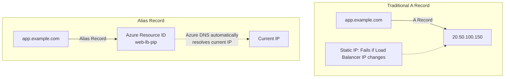
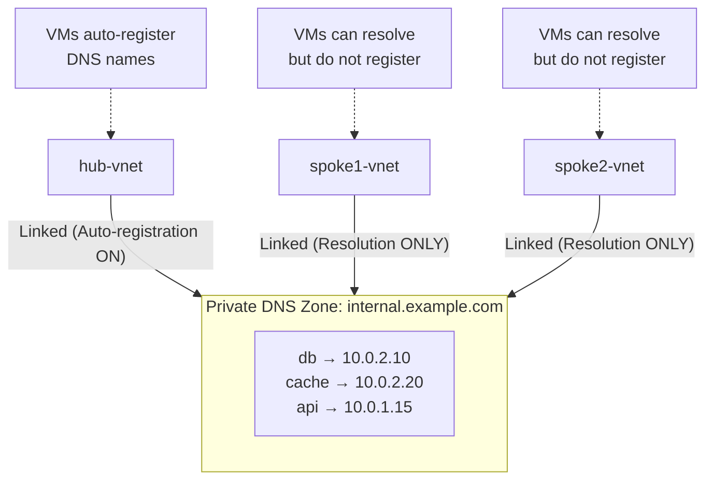
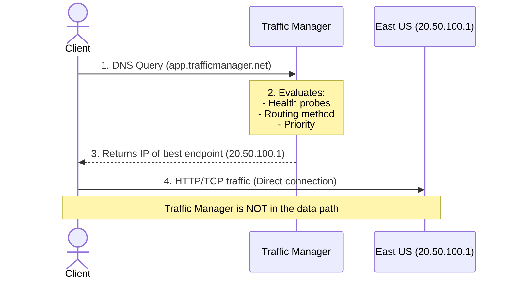
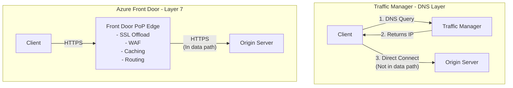

**Complexity**: [MEDIUM] | **Time to Complete**: 1.5h | **Prerequisites**: Module 3.2 (Virtual Networks)

## What You'll Be Able to Do

After completing this module, you will be able to:

- **Configure Azure DNS zones with record sets for public-facing and private VNet-linked name resolution**
- **Implement Traffic Manager profiles with priority, weighted, and performance routing for multi-region failover**
- **Deploy Azure Private DNS zones for VNet-internal service discovery across peered virtual networks**
- **Design DNS architectures combining Azure DNS, Traffic Manager, and Front Door for global traffic distribution**

---

## Why This Module Matters

A multi-region application can still fail hard if DNS points directly to one regional IP and there is no traffic-routing layer to detect failures and steer new users to a healthy region.

DNS is the invisible infrastructure that underpins every internet interaction. When it works, nobody thinks about it. When it fails, nothing works. In Azure, DNS is not just about resolving names to IP addresses---it is a critical component of high availability, traffic routing, and hybrid cloud architecture. Azure DNS handles public-facing domain resolution, Private DNS Zones handle name resolution within your virtual networks, and Traffic Manager uses DNS-based routing to distribute traffic across regions and endpoints.

In this module, you will learn how Azure DNS zones work for both public and private scenarios, how Traffic Manager routes traffic using different algorithms, and how Azure Front Door provides a modern alternative with layer-7 capabilities. By the end, you will understand how to design a DNS architecture that keeps your applications reachable even when entire regions fail.

---

## Azure DNS: Public Zones

Azure DNS allows you to host your DNS zones on [Azure's global anycast network of name servers](https://learn.microsoft.com/en-us/azure/dns/dns-faq). When you host your zone in Azure DNS, your DNS records are served from Microsoft's worldwide network of DNS servers, providing low latency and high availability.

### How DNS Zones Work

A DNS zone is a container for all the DNS records for a specific domain. When you create a zone for `example.com` in Azure DNS, [Azure assigns four name servers](https://learn.microsoft.com/en-us/azure/dns/dns-delegate-domain-azure-dns) (in the format `ns1-XX.azure-dns.com`, `ns2-XX.azure-dns.net`, `ns3-XX.azure-dns.org`, `ns4-XX.azure-dns.info`).

```bash
# Create a DNS zone
az network dns zone create \
  --resource-group myRG \
  --name example.com

# View the assigned name servers
az network dns zone show \
  --resource-group myRG \
  --name example.com \
  --query nameServers -o tsv
```

After creating the zone, you must [update your domain registrar's NS records to point to the Azure name servers](https://learn.microsoft.com/en-us/azure/dns/dns-delegate-domain-azure-dns). Until you do this, DNS queries for your domain will not reach Azure.

### Common Record Types

```bash
# A record: Maps a name to an IPv4 address
az network dns record-set a add-record \
  --resource-group myRG \
  --zone-name example.com \
  --record-set-name www \
  --ipv4-address 20.50.100.150

# AAAA record: Maps a name to an IPv6 address
az network dns record-set aaaa add-record \
  --resource-group myRG \
  --zone-name example.com \
  --record-set-name www \
  --ipv6-address 2603:1030:800:5::1

# CNAME record: Maps a name to another name (alias)
az network dns record-set cname set-record \
  --resource-group myRG \
  --zone-name example.com \
  --record-set-name blog \
  --cname blog.wordpress.com

# MX record: Mail exchange
az network dns record-set mx add-record \
  --resource-group myRG \
  --zone-name example.com \
  --record-set-name "@" \
  --exchange mail.example.com \
  --preference 10

# TXT record: Arbitrary text (SPF, DKIM, verification)
az network dns record-set txt add-record \
  --resource-group myRG \
  --zone-name example.com \
  --record-set-name "@" \
  --value "v=spf1 include:spf.protection.outlook.com -all"

# List all records in a zone
az network dns record-set list \
  --resource-group myRG \
  --zone-name example.com -o table
```

### Alias Records

Azure DNS supports **alias records**, which [point directly to an Azure resource](https://learn.microsoft.com/en-us/azure/dns/dns-alias) (like a Load Balancer, Traffic Manager profile, or CDN endpoint) instead of an IP address. The key advantage: when the resource's IP changes, the DNS record updates automatically.

```bash
# Create an alias record pointing to a Load Balancer public IP
LB_PIP_ID=$(az network public-ip show -g myRG -n web-lb-pip --query id -o tsv)

az network dns record-set a create \
  --resource-group myRG \
  --zone-name example.com \
  --name app \
  --target-resource "$LB_PIP_ID"
```



> **Stop and think**: Why does RFC 1034 prohibit CNAME records at the zone apex (e.g., `example.com`), and how does Azure DNS bypass this limitation with Alias records under the hood? What type of DNS record does the client actually receive when resolving an Alias at the apex?

---

## Azure Private DNS Zones

Private DNS Zones [provide name resolution within your Virtual Networks without exposing records to the public internet](https://learn.microsoft.com/en-us/azure/dns/private-dns-privatednszone). This is essential for internal service discovery---your web servers need to find your database by name (`db.internal.example.com`), not by memorizing IP addresses that change when you redeploy.

### How Private DNS Zones Work



```bash
# Create a private DNS zone
az network private-dns zone create \
  --resource-group myRG \
  --name internal.example.com

# Link the private DNS zone to a VNet (with auto-registration)
az network private-dns link vnet create \
  --resource-group myRG \
  --zone-name internal.example.com \
  --name hub-link \
  --virtual-network hub-vnet \
  --registration-enabled true    # VMs in this VNet auto-register

# Link to spoke VNets (resolution only, no auto-registration)
az network private-dns link vnet create \
  --resource-group myRG \
  --zone-name internal.example.com \
  --name spoke1-link \
  --virtual-network spoke1-vnet \
  --registration-enabled false

# Manually add a record
az network private-dns record-set a add-record \
  --resource-group myRG \
  --zone-name internal.example.com \
  --record-set-name db \
  --ipv4-address 10.0.2.10

# List records in the private zone
az network private-dns record-set list \
  --resource-group myRG \
  --zone-name internal.example.com -o table
```

**Auto-registration** is a powerful feature: when enabled on a VNet link, [every VM created in that VNet automatically gets a DNS record in the private zone. When the VM is deleted, the record is automatically removed](https://learn.microsoft.com/en-us/azure/dns/private-dns-autoregistration). This eliminates the need to manually manage internal DNS records.

> **Pause and predict**: You have a Private DNS Zone linked to a VNet with auto-registration enabled. You deploy a VM named `database-primary`. Later, an administrator logs into the VM's guest OS (Windows or Linux) and manually changes its IP address. What happens to the DNS record in the Private DNS Zone, and why?

### Private DNS and Private Endpoints

Private Endpoints are a mechanism to access Azure PaaS services (Storage, SQL, Key Vault, etc.) over a private IP address in your VNet instead of over the public internet. When you create a private endpoint, you need a Private DNS Zone to resolve the service's FQDN to the private IP.

```bash
# Example: Private endpoint for a storage account
# Step 1: Create the private endpoint
az network private-endpoint create \
  --resource-group myRG \
  --name storage-pe \
  --vnet-name hub-vnet \
  --subnet private-endpoints \
  --private-connection-resource-id "$STORAGE_ACCOUNT_ID" \
  --group-id blob \
  --connection-name storage-connection

# Step 2: Create the private DNS zone for blob storage
az network private-dns zone create \
  --resource-group myRG \
  --name privatelink.blob.core.windows.net

# Step 3: Link the DNS zone to your VNet
az network private-dns link vnet create \
  --resource-group myRG \
  --zone-name privatelink.blob.core.windows.net \
  --name hub-dns-link \
  --virtual-network hub-vnet \
  --registration-enabled false

# Step 4: Create DNS zone group (auto-manages DNS records)
az network private-endpoint dns-zone-group create \
  --resource-group myRG \
  --endpoint-name storage-pe \
  --name default \
  --private-dns-zone "privatelink.blob.core.windows.net" \
  --zone-name blob
```

After this setup, when a VM in hub-vnet resolves `yourstorage.blob.core.windows.net`, [the response is the private IP of the private endpoint (e.g., 10.0.5.4) instead of the public IP](https://learn.microsoft.com/en-us/azure/private-link/private-endpoint-dns). [Traffic stays entirely within Azure's backbone](https://learn.microsoft.com/en-us/azure/private-link/private-link-overview).

---

## Azure Traffic Manager: DNS-Based Global Load Balancing

[Traffic Manager is a DNS-based traffic routing service that distributes traffic across global endpoints](https://learn.microsoft.com/en-us/azure/traffic-manager/traffic-manager-overview). It works at the DNS layer (Layer 7 of DNS, technically)---when a client resolves your domain, Traffic Manager returns the IP of the most appropriate endpoint based on the routing method you configure.

### How Traffic Manager Works



**Critical insight**: Traffic Manager is **not** a proxy or a load balancer. It only participates in the DNS resolution step. After that, [the client connects directly to the endpoint](https://learn.microsoft.com/en-us/azure/traffic-manager/traffic-manager-how-it-works). This means Traffic Manager cannot see HTTP headers, cannot terminate SSL, and cannot cache content. For those features, you need Azure Front Door.

### [Routing Methods](https://learn.microsoft.com/en-us/azure/traffic-manager/traffic-manager-routing-methods)

| Method | How It Routes | Best For |
| :--- | :--- | :--- |
| **Priority** | Always sends to highest-priority healthy endpoint | Active/passive failover |
| **Weighted** | Distributes traffic by weight (e.g., 80/20) | Canary deployments, A/B testing |
| **Performance** | Routes to the closest endpoint (by latency) | Global apps needing low latency |
| **Geographic** | Routes based on the client's geographic location | Data sovereignty, regional compliance |
| **MultiValue** | Returns multiple healthy IPs (client chooses) | Increase availability with client-side retry |
| **Subnet** | Routes based on client's source IP range | VIP customers, partner-specific endpoints |

> **Stop and think**: A company uses Traffic Manager with Geographic routing to restrict data access: EU users are routed to Frankfurt, US users to Virginia. If the Virginia region suffers a total outage, what happens to the US traffic? Does it fail over to Frankfurt, or drop entirely?

```bash
# Create a Traffic Manager profile with Priority routing
az network traffic-manager profile create \
  --resource-group myRG \
  --name app-tm-profile \
  --routing-method Priority \
  --unique-dns-name app-kubedojo \
  --ttl 30 \
  --protocol HTTPS \
  --port 443 \
  --path "/health" \
  --interval 10 \
  --timeout 5 \
  --max-failures 3

# Add primary endpoint (East US)
az network traffic-manager endpoint create \
  --resource-group myRG \
  --profile-name app-tm-profile \
  --name eastus-endpoint \
  --type azureEndpoints \
  --target-resource-id "$EASTUS_PIP_ID" \
  --priority 1 \
  --endpoint-status Enabled

# Add secondary endpoint (West Europe)
az network traffic-manager endpoint create \
  --resource-group myRG \
  --profile-name app-tm-profile \
  --name westeurope-endpoint \
  --type azureEndpoints \
  --target-resource-id "$WESTEUROPE_PIP_ID" \
  --priority 2 \
  --endpoint-status Enabled

# Check endpoint health status
az network traffic-manager endpoint list \
  --resource-group myRG \
  --profile-name app-tm-profile \
  --type azureEndpoints \
  --query '[].{Name:name, Status:endpointStatus, Monitor:endpointMonitorStatus, Priority:priority}' -o table

# Test DNS resolution
nslookup app-kubedojo.trafficmanager.net
```

### Traffic Manager with Weighted Routing (Canary Deployments)

```bash
# Create a profile for canary deployment
az network traffic-manager profile create \
  --resource-group myRG \
  --name canary-tm-profile \
  --routing-method Weighted \
  --unique-dns-name canary-kubedojo \
  --ttl 10 \
  --protocol HTTPS \
  --port 443 \
  --path "/health"

# Stable version gets 90% of traffic
az network traffic-manager endpoint create \
  --resource-group myRG \
  --profile-name canary-tm-profile \
  --name stable \
  --type externalEndpoints \
  --target stable.example.com \
  --weight 90

# Canary version gets 10% of traffic
az network traffic-manager endpoint create \
  --resource-group myRG \
  --profile-name canary-tm-profile \
  --name canary \
  --type externalEndpoints \
  --target canary.example.com \
  --weight 10
```

**Scenario**: With DNS-based regional failover, new DNS queries can be steered toward a healthier region when probes detect an endpoint problem, which can reduce downtime while the primary region recovers.

---

## Azure Front Door: The Modern Alternative

Azure Front Door is a global, scalable entry point for web applications. Unlike Traffic Manager (DNS only), Front Door operates at Layer 7 (HTTP/HTTPS) and sits in the data path. It acts as a reverse proxy, [providing SSL termination, caching, WAF, and intelligent routing](https://learn.microsoft.com/en-us/azure/networking/load-balancer-content-delivery/load-balancing-content-delivery-overview).



| Feature | Traffic Manager | Azure Front Door |
| :--- | :--- | :--- |
| **Layer** | DNS (returns IP) | HTTP/HTTPS (reverse proxy) |
| **In data path** | No | Yes |
| **SSL termination** | No | Yes |
| **Caching** | No | Yes (edge caching) |
| **WAF** | No | Yes (built-in) |
| **URL path routing** | No | Yes |
| **Session affinity** | No (DNS round-robin) | Yes (cookie-based) |
| **Health probes** | TCP, HTTP, HTTPS | HTTP, HTTPS (with custom headers) |
| **Protocol support** | Any (TCP/UDP/HTTP) | HTTP/HTTPS only |
| **Cost** | Lower-cost DNS-based pricing; see current Azure pricing | Higher base fees plus request and data charges; see current Azure pricing |
| **Failover speed** | Depends on DNS caching and health-check settings | Typically faster application-layer failover with active health probes |

```bash
# Create an Azure Front Door profile (Standard tier)
az afd profile create \
  --resource-group myRG \
  --profile-name app-frontdoor \
  --sku Standard_AzureFrontDoor

# Add an endpoint
az afd endpoint create \
  --resource-group myRG \
  --profile-name app-frontdoor \
  --endpoint-name app-endpoint \
  --enabled-state Enabled

# Add an origin group (backend pool)
az afd origin-group create \
  --resource-group myRG \
  --profile-name app-frontdoor \
  --origin-group-name app-origins \
  --probe-request-type GET \
  --probe-protocol Https \
  --probe-path "/health" \
  --probe-interval-in-seconds 10 \
  --sample-size 4 \
  --successful-samples-required 3

# Add origins (backends)
az afd origin create \
  --resource-group myRG \
  --profile-name app-frontdoor \
  --origin-group-name app-origins \
  --origin-name eastus-origin \
  --host-name eastus-app.azurewebsites.net \
  --origin-host-header eastus-app.azurewebsites.net \
  --http-port 80 \
  --https-port 443 \
  --priority 1 \
  --weight 1000

# Add a route
az afd route create \
  --resource-group myRG \
  --profile-name app-frontdoor \
  --endpoint-name app-endpoint \
  --route-name default-route \
  --origin-group app-origins \
  --supported-protocols Https \
  --patterns-to-match "/*" \
  --forwarding-protocol HttpsOnly
```

### When to Choose Which

Use **Traffic Manager** when:
- You need non-HTTP routing (TCP, UDP services)
- You want the simplest, cheapest global routing
- Your endpoints handle SSL themselves
- You need Geographic routing for compliance

Use **Azure Front Door** when:
- You need SSL termination at the edge
- You want a Web Application Firewall (WAF)
- You need edge caching for static content
- You want sub-second failover (not DNS-TTL dependent)
- You need URL-based routing (e.g., `/api/*` to one backend, `/static/*` to another)

---

## Did You Know?

1. **Azure DNS is a large-scale authoritative DNS service** that uses anycast networking so queries are answered by nearby DNS servers, which improves performance and availability.

2. **[Traffic Manager health probes come from specific well-known IP ranges](https://learn.microsoft.com/en-us/azure/traffic-manager/traffic-manager-monitoring)** published by Microsoft. If your backend has IP-based firewall rules, you must whitelist these IPs or your health probes will fail and Traffic Manager will mark your endpoint as degraded. The IP ranges are published in the Azure IP Ranges JSON file, under the `AzureTrafficManager` service tag.

3. **Azure Front Door has over [192 edge locations (Points of Presence)](https://learn.microsoft.com/en-us/azure/frontdoor/edge-locations-by-region)** across 109 metro areas worldwide as of 2025. When a user in Tokyo accesses your app through Front Door, the TLS handshake terminates at a Tokyo PoP. This can substantially reduce TLS setup latency for users by terminating TLS at a nearby edge location instead of at a distant origin. The PoP then maintains a persistent, optimized connection to your origin backend.

4. **Private DNS Zone auto-registration has a limit of one registration-enabled link per VNet.** A VNet can be linked to multiple Private DNS Zones for resolution, but [only one zone can have auto-registration enabled](https://learn.microsoft.com/en-us/azure/dns/private-dns-autoregistration). This prevents conflicts where multiple zones try to register the same VM name. If you need records in multiple zones, use one zone for auto-registration and manually create records in the others.

---

## Common Mistakes

| Mistake | Why It Happens | How to Fix It |
| :--- | :--- | :--- |
| Forgetting to update NS records at the domain registrar after creating an Azure DNS zone | Azure creates the zone and records, but has no authority over the domain until NS records are delegated | After creating the zone, copy the four Azure NS records and update them at your domain registrar. Verify with `nslookup -type=NS example.com`. |
| [Setting Traffic Manager TTL too high (300s default)](https://learn.microsoft.com/en-us/azure/traffic-manager/traffic-manager-performance-considerations) | Higher TTL reduces DNS query costs | For failover scenarios, set TTL to 10-30 seconds. High TTL means clients cache stale IPs and do not fail over for minutes after an endpoint goes down. |
| Using Traffic Manager when Front Door is more appropriate | Traffic Manager is simpler and cheaper to set up | If you need SSL termination, WAF, caching, or sub-second failover, Front Door is worth the extra cost. Traffic Manager's failover speed is limited by DNS TTL. |
| Not linking Private DNS Zones to all VNets that need resolution | Only the initial VNet is linked during creation | [Every VNet that needs to resolve private DNS names must be explicitly linked to the zone.](https://learn.microsoft.com/en-us/azure/dns/private-dns-privatednszone) Forgetting a spoke VNet means VMs in that spoke cannot resolve internal names. |
| Using CNAME records at the zone apex (e.g., example.com) | [RFC 1034 prohibits CNAME at the zone apex](https://www.rfc-editor.org/rfc/rfc1034.html), but teams need it for services like Front Door | Use Azure DNS alias records instead. [Alias records can point to Azure resources at the zone apex](https://learn.microsoft.com/en-us/azure/dns/dns-alias) without violating the RFC. |
| Not using a meaningful Traffic Manager health check | A generic or misconfigured probe can stay green even when the application is unhealthy | Configure HTTP/HTTPS monitoring with a path like /health that validates real application readiness. |
| Ignoring the DNS propagation delay when making changes | DNS changes appear instant in the portal | [Changes propagate to the Azure DNS servers within 60 seconds](https://learn.microsoft.com/en-us/azure/dns/dns-faq), but clients and intermediate DNS resolvers may cache the old record for up to the TTL duration. Plan maintenance windows accordingly. |
| Creating separate private DNS zones per VNet instead of shared zones | Teams independently create zones with the same name | Use centralized Private DNS Zones linked to all VNets. If each team creates their own `internal.company.com` zone, records are fragmented and inconsistent. |

---

## Quiz

<details>
<summary>1. <strong>Scenario</strong>: Your team is hosting an e-commerce platform behind an Azure Public Load Balancer. The security team mandates that the Load Balancer must be recreated monthly using infrastructure-as-code to ensure zero configuration drift. You need to map the apex domain (`shop.com`) to this Load Balancer. Why must you use an Azure DNS alias record instead of a standard A record or CNAME?</summary>

A standard A record requires a static IP; recreating the Load Balancer would assign a new public IP, causing downtime until the A record is manually updated. A CNAME record cannot be used at the zone apex (`shop.com`) due to RFC constraints. An Azure DNS alias record solves both problems: it maps directly to the Load Balancer's Azure Resource ID, so it automatically tracks IP changes without manual intervention, and it is fully supported at the zone apex. When queried, Azure dynamically returns the current IP as a standard A record.
</details>

<details>
<summary>2. <strong>Scenario</strong>: You are designing a hub-and-spoke network architecture with one hub VNet (containing shared databases) and two spoke VNets (containing web APIs). You create a Private DNS Zone `internal.corp` to resolve internal hostnames. If you enable auto-registration for the hub VNet, how should you configure the links for the spoke VNets, and why?</summary>

You must link the Private DNS Zone to the spoke VNets with auto-registration disabled (resolution-only). Azure only allows one VNet to have auto-registration enabled per Private DNS Zone to prevent naming conflicts. By enabling auto-registration on the hub, the shared databases automatically register their DNS records. The resolution-only links on the spokes ensure the web APIs can successfully look up those database hostnames without attempting to register their own potentially conflicting names into the shared zone.
</details>

<details>
<summary>3. <strong>Scenario</strong>: During a Black Friday sale, your primary East US application crashes. Traffic Manager is configured with Priority routing (East US is Priority 1, West Europe is Priority 2) and a DNS TTL of 5 minutes (300 seconds). The health probe interval is 30 seconds. A customer in New York refreshed their browser exactly 10 seconds before the crash. How long might this customer experience downtime before being routed to West Europe, and why?</summary>

The customer could experience over 6 minutes of downtime. First, Traffic Manager must detect the failure, which takes up to 90 seconds (3 failed probes at 30-second intervals) before it updates its internal routing to point to West Europe. Second, because the DNS TTL is 300 seconds and the customer just resolved the name, their local machine or ISP DNS cache will hold onto the stale East US IP for another 4 minutes and 50 seconds. To minimize this, you must configure a lower DNS TTL (e.g., 30 seconds) and faster probe intervals.
</details>

<details>
<summary>4. <strong>Scenario</strong>: A financial startup is launching a global trading platform. They need to ensure that European traffic stays in Europe, all connections enforce TLS 1.3, static assets like charts are cached at edge locations, and any malicious SQL injection attempts are blocked before reaching the application servers. Why is Traffic Manager insufficient for this architecture, and what service must they use instead?</summary>

Traffic Manager operates strictly at the DNS layer (Layer 7 of DNS) and is not in the data path, meaning it cannot inspect or modify HTTP traffic. It cannot terminate TLS, cache content, or provide Web Application Firewall (WAF) protections against SQL injections. The startup must use Azure Front Door. Front Door acts as a Layer 7 global reverse proxy in the data path, terminating TLS at the edge, caching static assets at local Points of Presence (PoPs), and inspecting traffic with its built-in WAF before forwarding it to the backend.
</details>

<details>
<summary>5. <strong>Scenario</strong>: You provisioned an Azure SQL Database and secured it with a Private Endpoint, giving it an IP of `10.0.1.4` in your VNet. However, when your application tries to connect using `myserver.database.windows.net`, the connection times out because it's still trying to route over the public internet. What missing component is causing this, and how does it fix the problem?</summary>

The missing component is the integration between the Private Endpoint and an Azure Private DNS Zone. By default, the public FQDN of the Azure SQL Database (`myserver.database.windows.net`) continues to resolve to its public IP address on the internet. You must create a Private DNS Zone (e.g., `privatelink.database.windows.net`), link it to your VNet, and configure the Private Endpoint's DNS Zone Group. This overrides the public DNS resolution for that specific FQDN within your VNet, seamlessly returning the private IP `10.0.1.4` so the application connects securely over the internal backbone.
</details>

<details>
<summary>6. <strong>Scenario</strong>: A gaming company uses Traffic Manager with Performance routing to connect players to the lowest-latency game server. After a server in Tokyo goes offline, players in Japan complain they cannot connect for several minutes, even though a backup server in Seoul is available. You investigate and find the profile has a TTL of 300 seconds. What two specific configuration changes must you make to guarantee failover happens in under 60 seconds?</summary>

First, you must reduce the DNS TTL from 300 seconds to a much lower value, such as 10 or 30 seconds, so client machines and ISP resolvers expire the stale IP address faster. Second, you must optimize the endpoint monitoring settings by reducing the probe interval (e.g., from 30 seconds to 10 seconds) and potentially lowering the tolerated number of failures (e.g., from 3 to 2). By combining a short TTL with aggressive health probing, Traffic Manager detects the Tokyo server failure faster and clients usually query for the new Seoul IP address within tens of seconds. This ensures that the total time for failure detection and cache expiration remains strictly under one minute to minimize disruption.
</details>

---

## Hands-On Exercise: Public DNS Zone with Traffic Manager Failover

In this exercise, you will create a public DNS zone, set up a Traffic Manager profile with Priority routing and health probes, and simulate a failover.

**Prerequisites**: Azure CLI installed and authenticated. You do not need a real domain for this exercise---we will work entirely within the `trafficmanager.net` namespace.

### Task 1: Create the Resource Group and Two Simulated Endpoints

We will use Azure Container Instances as lightweight web servers to act as our "regional endpoints."

```bash
RG="kubedojo-dns-lab"
LOCATION_PRIMARY="eastus2"
LOCATION_SECONDARY="westeurope"

az group create --name "$RG" --location "$LOCATION_PRIMARY"

# Primary endpoint: a simple web server in East US 2
az container create \
  --resource-group "$RG" \
  --name primary-web \
  --image mcr.microsoft.com/azuredocs/aci-helloworld \
  --dns-name-label "kubedojo-primary-$(openssl rand -hex 4)" \
  --location "$LOCATION_PRIMARY" \
  --ports 80

# Secondary endpoint: a simple web server in West Europe
az container create \
  --resource-group "$RG" \
  --name secondary-web \
  --image mcr.microsoft.com/azuredocs/aci-helloworld \
  --dns-name-label "kubedojo-secondary-$(openssl rand -hex 4)" \
  --location "$LOCATION_SECONDARY" \
  --ports 80

# Get their FQDNs
PRIMARY_FQDN=$(az container show -g "$RG" -n primary-web --query ipAddress.fqdn -o tsv)
SECONDARY_FQDN=$(az container show -g "$RG" -n secondary-web --query ipAddress.fqdn -o tsv)
echo "Primary: $PRIMARY_FQDN"
echo "Secondary: $SECONDARY_FQDN"
```

<details>
<summary>Verify Task 1</summary>

```bash
curl -s "http://$PRIMARY_FQDN" | head -5
curl -s "http://$SECONDARY_FQDN" | head -5
```

Both should return HTML content.
</details>

### Task 2: Create a Traffic Manager Profile

```bash
TM_DNS="kubedojo-tm-$(openssl rand -hex 4)"

az network traffic-manager profile create \
  --resource-group "$RG" \
  --name app-tm \
  --routing-method Priority \
  --unique-dns-name "$TM_DNS" \
  --ttl 10 \
  --protocol HTTP \
  --port 80 \
  --path "/" \
  --interval 10 \
  --timeout 5 \
  --max-failures 2

echo "Traffic Manager DNS: ${TM_DNS}.trafficmanager.net"
```

<details>
<summary>Verify Task 2</summary>

```bash
az network traffic-manager profile show -g "$RG" -n app-tm \
  --query '{DNS:dnsConfig.fqdn, Routing:trafficRoutingMethod, TTL:dnsConfig.ttl}' -o table
```
</details>

### Task 3: Add Endpoints to Traffic Manager

```bash
# Add primary endpoint (priority 1)
az network traffic-manager endpoint create \
  --resource-group "$RG" \
  --profile-name app-tm \
  --name primary \
  --type externalEndpoints \
  --target "$PRIMARY_FQDN" \
  --priority 1 \
  --endpoint-status Enabled

# Add secondary endpoint (priority 2)
az network traffic-manager endpoint create \
  --resource-group "$RG" \
  --profile-name app-tm \
  --name secondary \
  --type externalEndpoints \
  --target "$SECONDARY_FQDN" \
  --priority 2 \
  --endpoint-status Enabled
```

<details>
<summary>Verify Task 3</summary>

```bash
az network traffic-manager endpoint list -g "$RG" --profile-name app-tm \
  --type externalEndpoints \
  --query '[].{Name:name, Target:target, Priority:priority, MonitorStatus:endpointMonitorStatus}' -o table
```

Both endpoints should show with their respective priorities. MonitorStatus may take a minute to populate.
</details>

### Task 4: Test Normal Operation

```bash
# Resolve the Traffic Manager DNS name
nslookup "${TM_DNS}.trafficmanager.net"

# Access the app through Traffic Manager
curl -s "http://${TM_DNS}.trafficmanager.net" | head -5

# You should see the primary endpoint's response
```

<details>
<summary>Verify Task 4</summary>

The nslookup should resolve to the primary endpoint's IP address. The curl should return the primary web server's content. All traffic goes to priority 1 (primary) because both endpoints are healthy.
</details>

### Task 5: Simulate Failover

```bash
# Disable the primary endpoint (simulating a regional outage)
az network traffic-manager endpoint update \
  --resource-group "$RG" \
  --profile-name app-tm \
  --name primary \
  --type externalEndpoints \
  --endpoint-status Disabled

# Wait for the change to propagate (TTL is 10 seconds)
echo "Waiting 15 seconds for DNS propagation..."
sleep 15

# Verify Traffic Manager now routes to secondary
nslookup "${TM_DNS}.trafficmanager.net"
curl -s "http://${TM_DNS}.trafficmanager.net" | head -5

# Check endpoint status
az network traffic-manager endpoint list -g "$RG" --profile-name app-tm \
  --type externalEndpoints \
  --query '[].{Name:name, Status:endpointStatus, MonitorStatus:endpointMonitorStatus}' -o table
```

<details>
<summary>Verify Task 5</summary>

After disabling the primary endpoint, the DNS resolution should now return the secondary endpoint's IP address. The curl should return the secondary web server's content. The endpoint list should show primary as Disabled and secondary as Enabled with Online monitor status.
</details>

### Task 6: Restore and Verify

```bash
# Re-enable the primary endpoint
az network traffic-manager endpoint update \
  --resource-group "$RG" \
  --profile-name app-tm \
  --name primary \
  --type externalEndpoints \
  --endpoint-status Enabled

# Wait for propagation
sleep 15

# Verify traffic returns to primary
nslookup "${TM_DNS}.trafficmanager.net"
curl -s "http://${TM_DNS}.trafficmanager.net" | head -5
```

<details>
<summary>Verify Task 6</summary>

Traffic should return to the primary endpoint (priority 1) once it is re-enabled and health probes confirm it is healthy. This demonstrates the complete failover and failback cycle.
</details>

### Cleanup

```bash
az group delete --name "$RG" --yes --no-wait
```

### Success Criteria

- [ ] Two web servers deployed in different Azure regions
- [ ] Traffic Manager profile created with Priority routing and 10-second TTL
- [ ] Both endpoints added with correct priorities
- [ ] Normal operation confirmed (traffic routes to primary)
- [ ] Failover verified (disabling primary routes traffic to secondary)
- [ ] Failback verified (re-enabling primary restores original routing)

---

## Next Module

[Module 3.6: Azure Container Registry (ACR)](../module-3.6-acr/) --- Learn how to store, manage, and secure your container images with Azure Container Registry, including authentication, ACR Tasks for automated builds, and geo-replication.

## Sources

- [learn.microsoft.com: dns faq](https://learn.microsoft.com/en-us/azure/dns/dns-faq) — The Azure DNS FAQ directly states that Azure DNS uses Anycast on Azure's global DNS name server network for fast performance and high availability.
- [learn.microsoft.com: dns delegate domain azure dns](https://learn.microsoft.com/en-us/azure/dns/dns-delegate-domain-azure-dns) — Microsoft's delegation tutorial shows Azure DNS assigning four nameservers with exactly these suffixes.
- [learn.microsoft.com: dns alias](https://learn.microsoft.com/en-us/azure/dns/dns-alias) — The Azure DNS alias-record overview says alias records reference Azure resources and update dynamically during DNS resolution.
- [learn.microsoft.com: private dns privatednszone](https://learn.microsoft.com/en-us/azure/dns/private-dns-privatednszone) — The Private DNS zone overview directly states that private-zone records are not resolvable from the Internet and work only from linked VNets.
- [learn.microsoft.com: private dns autoregistration](https://learn.microsoft.com/en-us/azure/dns/private-dns-autoregistration) — Microsoft's autoregistration doc explicitly describes automatic creation and removal of VM A records.
- [learn.microsoft.com: private endpoint dns](https://learn.microsoft.com/en-us/azure/private-link/private-endpoint-dns) — The private-endpoint DNS guidance says public DNS resolution is overridden with a private DNS zone so the FQDN resolves to the private endpoint IP.
- [learn.microsoft.com: private link overview](https://learn.microsoft.com/en-us/azure/private-link/private-link-overview) — The Azure Private Link overview directly states that traffic travels over the Microsoft backbone network and public exposure is unnecessary.
- [learn.microsoft.com: traffic manager overview](https://learn.microsoft.com/en-us/azure/traffic-manager/traffic-manager-overview) — The Traffic Manager overview directly describes the service as DNS-based routing for public-facing endpoints.
- [learn.microsoft.com: traffic manager how it works](https://learn.microsoft.com/en-us/azure/traffic-manager/traffic-manager-how-it-works) — Microsoft's how-it-works page explicitly says clients connect directly and Traffic Manager is not a proxy or gateway.
- [learn.microsoft.com: traffic manager routing methods](https://learn.microsoft.com/en-us/azure/traffic-manager/traffic-manager-routing-methods) — The Traffic Manager routing-methods documentation lists these six supported methods and their intended behaviors.
- [learn.microsoft.com: load balancing content delivery overview](https://learn.microsoft.com/en-us/azure/networking/load-balancer-content-delivery/load-balancing-content-delivery-overview) — Microsoft's load-balancing overview describes Front Door as a Layer 7 application delivery network with SSL offload, path routing, caching, and WAF-related security.
- [learn.microsoft.com: understanding pricing](https://learn.microsoft.com/en-us/azure/frontdoor/understanding-pricing) — General lesson point for an illustrative rewrite.
- [learn.microsoft.com: traffic manager monitoring](https://learn.microsoft.com/en-us/azure/traffic-manager/traffic-manager-monitoring) — The endpoint-monitoring doc directly states that firewalls must allow Traffic Manager IPs and recommends the AzureTrafficManager service tag.
- [learn.microsoft.com: edge locations by region](https://learn.microsoft.com/en-us/azure/frontdoor/edge-locations-by-region) — The current Microsoft Learn edge-location page explicitly gives these counts.
- [learn.microsoft.com: traffic manager performance considerations](https://learn.microsoft.com/en-us/azure/traffic-manager/traffic-manager-performance-considerations) — Microsoft's performance-considerations doc states the default TTL is 300 seconds and that longer caching delays traffic redirection away from failed endpoints.
- [rfc-editor.org: rfc1034.html](https://www.rfc-editor.org/rfc/rfc1034.html) — RFC 1034 states that if a CNAME is present at a node, no other data should be present.
- [Azure Front Door Overview](https://learn.microsoft.com/en-us/azure/frontdoor/front-door-overview) — Best official overview of Front Door capabilities, edge network, SSL offload, caching, and security positioning.
