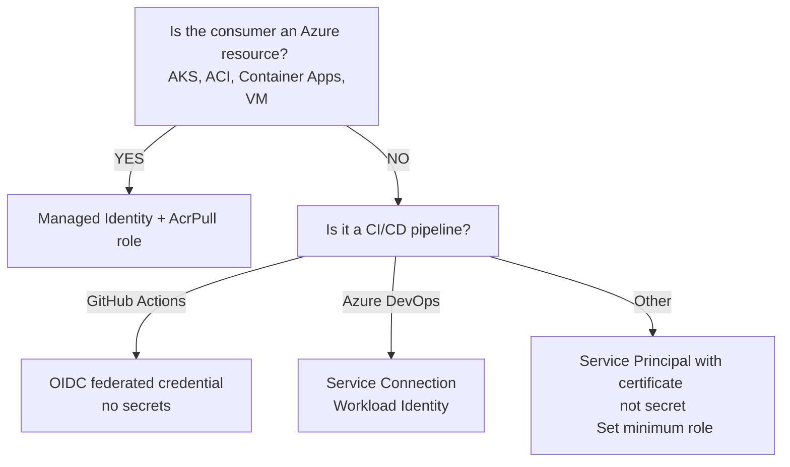
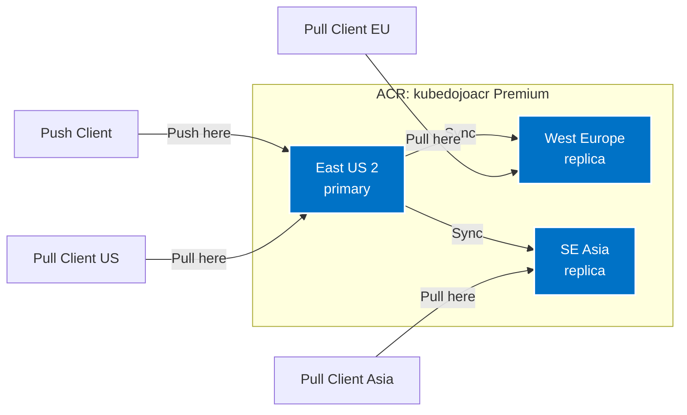

## What You'll Be Able to Do

After completing this module, you will be able to:

- **Design** a scalable Azure Container Registry architecture utilizing geo-replication and Private Link for secure, global deployments.
- **Implement** automated container image builds and patching pipelines using ACR Tasks to ensure base image security.
- **Evaluate** least-privilege authentication mechanisms for ACR access across CI/CD pipelines, virtual machines, and Kubernetes clusters.
- **Diagnose** image bloat and lifecycle issues by configuring automated purge policies and immutable tags.
- **Compare** the Basic, Standard, and Premium SKUs to select the most cost-effective registry tier for specific enterprise workloads.

## Why This Module Matters

In September 2022, a DevOps team at a mid-size fintech company called CapitalFlow pushed a new container image to their shared Docker Hub account. The image contained a critical fix for a payment processing bug that was causing transaction failures and data corruption. Twenty minutes later, their entire CI/CD pipeline ground to a halt. Docker Hub had heavily rate-limited their pulls: the free tier allows only 100 pulls per 6 hours for anonymous users and 200 for authenticated users. With 40 microservices, 3 environments, and frequent node scaling events, they were blowing past the limit every single day. 

Developers sat idle for hours waiting for rate limits to reset, and the payment bug remained in production while customers complained. The team estimated the productivity loss and failed transaction cost at roughly $8,000 per incident, and it happened three times that month before they initiated a rapid migration. They learned the hard way that infrastructure dependencies must be owned and controlled.

Container images are the atoms of modern application deployment. Every container you run—whether on Azure Kubernetes Service (AKS), Azure Container Apps, or Azure Container Instances (ACI)—starts with pulling an image from a registry. If your registry is slow, unreliable, or insecure, your entire deployment pipeline suffers. Azure Container Registry is a fully managed, highly available, private Docker registry that integrates deeply with Azure's identity system. It eliminates arbitrary rate limits, keeps your images close to your compute workloads within the exact same Azure region, and provides enterprise-grade features like automated builds, vulnerability scanning, and global geo-replication that external free-tier registries simply cannot match. In this module, you will build a production-ready container registry strategy from the ground up.

---

## ACR SKUs: Choosing the Right Tier

Azure Container Registry is designed to scale with your organization. To support everything from individual developers to global enterprises, ACR comes in three distinct SKUs (Stock Keeping Units). These SKUs dictate your performance limits, storage capacity, and access to advanced enterprise features.

| Feature | Basic | Standard | Premium |
| :--- | :--- | :--- | :--- |
| **Storage** | 10 GiB | 100 GiB | 500 GiB (expandable to 50 TiB) |
| **Read throughput** | 1,000 ReadOps/min | 3,000 ReadOps/min | 10,000 ReadOps/min |
| **Write throughput** | 100 WriteOps/min | 500 WriteOps/min | 2,000 WriteOps/min |
| **Webhooks** | 2 | 10 | 500 |
| **Geo-replication** | No | No | Yes |
| **Private Link** | No | No | Yes |
| **Content Trust** | No | No | Yes (image signing) |
| **Customer-managed keys** | No | No | Yes |
| **Approximate cost** | ~$5/month | ~$20/month | ~$50/month + replicas |

When designing your architecture, you must balance cost against capability. The **Basic** tier is excellent for individual learning and sandboxed development environments, but its strict rate limits (1,000 ReadOps/min) can easily be overwhelmed by a moderately sized Kubernetes cluster pulling images during a scale-out event. 

For most production workloads, **Standard** is the recommended baseline. It provides ten times the storage and significantly higher throughput. However, if your security team mandates that all traffic must traverse private networks, or if your application is deployed across multiple global regions, you must adopt the **Premium** tier to unlock Private Link and Geo-replication.

Importantly, Microsoft allows you to upgrade your SKU at any time without experiencing downtime or data loss.

```bash
# Create a Basic ACR (for dev/test)
az acr create \
  --resource-group myRG \
  --name kubedojoacr \
  --sku Basic \
  --location eastus2

# Upgrade to Standard (no downtime, no data loss)
az acr update --name kubedojoacr --sku Standard

# View ACR details
az acr show --name kubedojoacr \
  --query '{Name:name, SKU:sku.name, LoginServer:loginServer, Location:location}' -o table
```

Every registry you create is assigned a unique **login server** URL (for example, `kubedojoacr.azurecr.io`). This fully qualified domain name is the address your Docker CLI and Kubernetes clusters will use to communicate with the registry API.

---

## Authentication: Three Methods, One Recommendation

Securing access to your container images is arguably the most critical operational task in this module. Container registries are frequent targets for attackers because a compromised registry allows a malicious actor to inject cryptocurrency miners or backdoors directly into your production workloads. ACR supports three authentication methods, each with vastly different security profiles.

### 1. The Admin Account (Avoid in Production)

When you first create a registry, you have the option to enable an admin account. This generates a static username and a set of passwords. 

```bash
# Enable admin (NOT recommended for production)
az acr update --name kubedojoacr --admin-enabled true

# Get credentials
az acr credential show --name kubedojoacr -o table

# Login with admin credentials
az acr login --name kubedojoacr
```

While convenient for a five-minute proof of concept, the admin account violates almost every principle of modern security. The credentials are shared, meaning you cannot audit which developer or system performed a specific action. The account has full push and pull access across the entire registry, violating the principle of least privilege. Furthermore, rotating the password requires orchestrating an update across every single system that relies on it, often leading to production downtime.

### 2. Service Principals

A Service Principal is an identity created for use with applications, hosted services, and automated tools to access Azure resources. Unlike the admin account, you can create dozens of service principals and grant each one a highly specific Role-Based Access Control (RBAC) assignment.

```bash
# Create a service principal with AcrPull role (read-only)
ACR_ID=$(az acr show --name kubedojoacr --query id -o tsv)

az ad sp create-for-rbac \
  --name "acr-pull-sp" \
  --role AcrPull \
  --scopes "$ACR_ID"

# Available ACR roles:
# AcrPull   - Pull images only
# AcrPush   - Push and pull images
# AcrDelete - Delete images
# Owner     - Full access including role assignments
```

Service principals are ideal for external CI/CD pipelines (like GitLab CI or CircleCI) that need to push images into Azure but live outside of the Azure ecosystem.

### 3. Managed Identity (The Enterprise Standard)

For any workload running inside Azure, Managed Identities represent the gold standard for authentication. A Managed Identity is effectively a service principal that the Azure platform manages on your behalf. There are no passwords to generate, store, or rotate. The Azure control plane handles all credential exchanges seamlessly under the hood.

```bash
# Grant a VM's managed identity access to pull from ACR
VM_PRINCIPAL_ID=$(az vm identity show -g myRG -n myVM --query principalId -o tsv)
ACR_ID=$(az acr show --name kubedojoacr --query id -o tsv)

az role assignment create \
  --assignee "$VM_PRINCIPAL_ID" \
  --role AcrPull \
  --scope "$ACR_ID"

# For AKS, attach ACR directly (creates role assignment automatically)
az aks update \
  --resource-group myRG \
  --name myAKSCluster \
  --attach-acr kubedojoacr
```

> **Stop and think**: If a compromised CI/CD pipeline has an ACR admin password, what is the blast radius? How does that compare to a compromised pipeline with an AcrPush service principal limited to a specific repository?

To help you choose the right authentication model, refer to this architectural decision tree:

```text
    Authentication Decision Tree:

    Is the consumer an Azure resource (AKS, ACI, Container Apps, VM)?
    ├── YES → Managed Identity + AcrPull role
    │
    └── NO → Is it a CI/CD pipeline?
        ├── GitHub Actions → OIDC federated credential (no secrets)
        ├── Azure DevOps → Service Connection (Workload Identity)
        │
        └── Other → Service Principal with certificate (not secret)
                     Set minimum role (AcrPull for pull, AcrPush for push)
```

Visually, we can represent this authentication flow using the following architecture diagram:



Once authentication is established, interacting with the registry uses standard Docker CLI commands, heavily augmented by the Azure CLI to handle the credential exchange smoothly.

```bash
# Login to ACR using the Azure CLI (uses your current az login identity)
az acr login --name kubedojoacr

# Push an image
docker tag myapp:latest kubedojoacr.azurecr.io/myapp:v1.0.0
docker push kubedojoacr.azurecr.io/myapp:v1.0.0

# Pull an image
docker pull kubedojoacr.azurecr.io/myapp:v1.0.0

# List repositories in ACR
az acr repository list --name kubedojoacr -o table

# List tags for a repository
az acr repository show-tags --name kubedojoacr --repository myapp -o table

# Show image manifest details
az acr repository show-manifests --name kubedojoacr --repository myapp --detail -o table
```

---

## ACR Tasks: Serverless Container Builds

Historically, building container images required a dedicated build server running the Docker daemon. This approach is fraught with maintenance overhead, security risks (privileged containers), and scaling bottlenecks. ACR Tasks completely revolutionizes this by allowing you to offload the build execution directly to Azure's managed compute infrastructure.

### The Quick Build

With a single command, you can stream your local directory context to Azure, where a managed virtual machine provisions itself, executes your Dockerfile, pushes the resulting image directly into your registry, and then terminates.

```bash
# Build an image from a local Dockerfile (uploads context to ACR)
az acr build \
  --registry kubedojoacr \
  --image myapp:v1.0.0 \
  --file Dockerfile \
  .

# Build from a Git repository
az acr build \
  --registry kubedojoacr \
  --image myapp:v2.0.0 \
  https://github.com/myorg/myrepo.git#main

# Build a multi-architecture image
az acr build \
  --registry kubedojoacr \
  --image myapp:v1.0.0 \
  --platform linux/amd64,linux/arm64 \
  .
```

### Base Image Triggers and Automated Patching

While manual builds are excellent for local development, production systems require automation. ACR Tasks can monitor upstream base images (like `ubuntu:22.04` or `node:18-alpine`) and automatically trigger a rebuild of your application whenever the base image maintainer pushes a security patch.

```bash
# Create a task that rebuilds when the base image updates
az acr task create \
  --registry kubedojoacr \
  --name rebuild-on-base-update \
  --image myapp:{{.Run.ID}} \
  --context https://github.com/myorg/myrepo.git#main \
  --file Dockerfile \
  --git-access-token "$GITHUB_PAT" \
  --base-image-trigger-enabled true \
  --base-image-trigger-type All

# Create a scheduled task (rebuild every day at 3 AM UTC)
az acr task create \
  --registry kubedojoacr \
  --name nightly-rebuild \
  --image myapp:nightly \
  --context https://github.com/myorg/myrepo.git#main \
  --file Dockerfile \
  --git-access-token "$GITHUB_PAT" \
  --schedule "0 3 * * *"

# Manually trigger a task run
az acr task run --registry kubedojoacr --name rebuild-on-base-update

# View task run logs
az acr task logs --registry kubedojoacr --run-id cf1
```

**War Story**: A prominent e-commerce company discovered a critical zero-day vulnerability in the `node:18-alpine` base image at 2 PM on a Friday. They had over 23 distinct microservices built on top of that specific base image layer. Without ACR Tasks, orchestrating the rebuild and push of all 23 images would have taken their Jenkins CI pipeline nearly 2 hours due to sequential build constraints on a shared agent pool. Because they had configured ACR Tasks with base image triggers, the moment the patched `node` image was published to Docker Hub, ACR automatically spun up 23 parallel ephemeral build environments. All 23 microservices were rebuilt and securely pushed into their registry within 8 minutes. The engineering team merely had to orchestrate the Kubernetes rollout, saving them from a weekend of incident response.

---

## Global Distribution with Geo-Replication

When you design distributed systems, physics is your ultimate constraint. The speed of light dictates that transferring gigabytes of image data across oceans will induce significant latency. If your primary registry is in East US, but your AKS cluster is scaling out in West Europe, every pod startup is penalized by transatlantic data transfer speeds.

Furthermore, cross-region bandwidth is not free. Pulling images across regional boundaries incurs heavy egress charges on your monthly Azure bill.

Geo-replication solves this by allowing a single logical registry to exist physically in multiple Azure regions simultaneously.

```text
    ┌─────────────────────────────────────────────────────┐
    │             ACR: kubedojoacr (Premium)               │
    │                                                     │
    │  ┌──────────────┐  ┌──────────────┐  ┌────────────┐│
    │  │  East US 2   │  │  West Europe │  │  SE Asia   ││
    │  │  (primary)   │  │  (replica)   │  │  (replica) ││
    │  │              │  │              │  │            ││
    │  │  Push here   │──│─ Sync ──────►│──│─ Sync ───►││
    │  │  Pull here   │  │  Pull here   │  │  Pull here││
    │  └──────────────┘  └──────────────┘  └────────────┘│
    │                                                     │
    │  Push: Write to primary, replicated automatically   │
    │  Pull: Read from nearest replica                    │
    └─────────────────────────────────────────────────────┘
```

Here is the architectural flow converted into a Mermaid diagram:



When you push an image to your registry, Azure automatically replicates the underlying storage blobs asynchronously to all configured regions. When a client requests an image, Azure Traffic Manager intercepts the DNS request and seamlessly routes the client to the closest regional replica.

```bash
# Enable geo-replication (requires Premium SKU)
az acr replication create \
  --registry kubedojoacr \
  --location westeurope

az acr replication create \
  --registry kubedojoacr \
  --location southeastasia

# List replications
az acr replication list --registry kubedojoacr \
  --query '[].{Location:location, Status:provisioningState}' -o table
```

**War Story**: A gaming studio deployed their matchmaking service globally. They forgot to enable geo-replication and had their single Standard ACR deployed in East US. When their game launched, clusters in Asia scaled up dynamically. The transatlantic image pulls took upwards of 45 seconds per pod. Worse, at the end of the month, they received an Azure bill with thousands of dollars in unexpected inter-region egress costs. Upgrading to Premium and enabling geo-replication cost them a flat rate but entirely eliminated the egress fees and dropped pod startup time to 4 seconds.

---

## Network Security and Private Link

By default, Azure Container Registry exposes a public endpoint. While authenticated via Azure Active Directory, the registry is technically reachable from anywhere on the internet. In highly regulated industries like healthcare or finance, data exfiltration policies mandate that Platform-as-a-Service (PaaS) resources must not possess public IP addresses.

Azure Private Link allows you to project your ACR directly into your Virtual Network (VNet). The registry receives a private IP address (e.g., `10.0.5.10`), and all traffic between your virtual machines or Kubernetes nodes and the registry never leaves the Microsoft backbone network.

> **Pause and predict**: If you enable Private Link for an ACR but forget to link the Private DNS Zone to your AKS Virtual Network, what error message will the kubelet throw when trying to pull an image?

```bash
# Disable public access
az acr update --name kubedojoacr --public-network-enabled false

# Create a private endpoint for ACR
az network private-endpoint create \
  --resource-group myRG \
  --name acr-private-endpoint \
  --vnet-name hub-vnet \
  --subnet private-endpoints \
  --private-connection-resource-id "$ACR_ID" \
  --group-id registry \
  --connection-name acr-connection

# Create Private DNS Zone for ACR
az network private-dns zone create \
  --resource-group myRG \
  --name privatelink.azurecr.io

# Link DNS zone to VNet
az network private-dns link vnet create \
  --resource-group myRG \
  --zone-name privatelink.azurecr.io \
  --name acr-dns-link \
  --virtual-network hub-vnet \
  --registration-enabled false

# Create DNS zone group for automatic record management
az network private-endpoint dns-zone-group create \
  --resource-group myRG \
  --endpoint-name acr-private-endpoint \
  --name default \
  --private-dns-zone "privatelink.azurecr.io" \
  --zone-name acr
```

Once Private Link is established and the DNS zone is correctly linked to your VNet, any request to `kubedojoacr.azurecr.io` from within that VNet will transparently resolve to the private IP address instead of the public endpoint.

---

## Image Management Best Practices

Container registries are notoriously prone to storage bloat. Every time a developer merges a pull request, CI systems typically build and push a new image. Over time, terabytes of outdated, unused images accumulate, driving up storage costs and obscuring the operational state of the registry.

### Tagging Strategy

Implementing a robust tagging strategy is your first line of defense against chaos. You must absolutely avoid deploying the `:latest` tag into production, as it is a floating pointer that mutates unpredictably.

```bash
# Use semantic versioning for release images
docker tag myapp kubedojoacr.azurecr.io/myapp:1.3.2
docker tag myapp kubedojoacr.azurecr.io/myapp:1.3
docker tag myapp kubedojoacr.azurecr.io/myapp:1
docker tag myapp kubedojoacr.azurecr.io/myapp:latest

# Use Git SHA for traceability
docker tag myapp kubedojoacr.azurecr.io/myapp:sha-a1b2c3d

# Use build number for CI/CD
docker tag myapp kubedojoacr.azurecr.io/myapp:build-1234
```

### Automated Cleanup and Retention

When you overwrite an existing tag (like pushing a new build to `myapp:dev`), the old image data isn't deleted. Instead, the tag pointer moves, leaving behind an "untagged" or orphaned manifest. These orphaned layers consume expensive storage space. 

You should utilize ACR Tasks to schedule a recurring administrative command that forcefully purges old tags and orphaned manifests.

```bash
# Delete a specific tag
az acr repository delete --name kubedojoacr --image myapp:old-tag --yes

# Delete untagged manifests (orphaned layers)
az acr run --registry kubedojoacr \
  --cmd "acr purge --filter 'myapp:.*' --ago 30d --untagged" \
  /dev/null

# Set up automatic purge (run daily, delete untagged images older than 7 days)
az acr task create \
  --registry kubedojoacr \
  --name purge-untagged \
  --cmd "acr purge --filter '.*:.*' --ago 7d --untagged" \
  --context /dev/null \
  --schedule "0 4 * * *"

# Lock an image to prevent deletion (immutable tag)
az acr repository update \
  --name kubedojoacr \
  --image myapp:v1.0.0 \
  --write-enabled false
```

By scheduling `acr purge`, you ensure that your registry remains lean and cost-effective automatically, without manual intervention from the operations team.

---

## Did You Know?

1. **ACR Tasks can build images without a Dockerfile** using Cloud Native Buildpacks. Introduced to ACR in 2020, by simply specifying `--pack` in your build command, ACR automatically detects the language runtime (such as Node.js, Python, or Java) and creates an OCI-compliant image. This eliminates hundreds of hours spent maintaining complex Dockerfiles across dozens of microservices.
2. **Azure Container Registry stores images as OCI artifacts**, meaning you can store vastly more than just container images. Since the OCI Artifacts specification was adopted in 2019, you can natively store Helm charts, WebAssembly (WASM) modules, and arbitrary configuration files directly in ACR. This allows you to consolidate 100% of your deployment artifacts into a single registry system.
3. **Pulling a 1 GB image from ACR in the same Azure region takes approximately 3 to 6 seconds** thanks to direct Azure backbone connectivity. Pulling the exact same image from Docker Hub (which serves from public CDNs) typically takes 15 to 30 seconds due to the additional network hops. For a Virtual Machine Scale Set with 50 instances scaling out simultaneously, this latency difference dictates how fast your application recovers from a traffic spike.
4. **ACR supports anonymous pull** (introduced in 2021) on any SKU. When enabled, anyone can pull images without requiring authentication. This is highly useful for open-source projects distributing images publicly while still using ACR for secure push authentication. However, anonymous pull is disabled by default to prevent accidental corporate data exfiltration.

---

## Common Mistakes

| Mistake | Why It Happens | How to Fix It |
| :--- | :--- | :--- |
| Using the admin account for CI/CD pipelines | It is the first authentication method shown in quickstarts | Use service principals with AcrPush role for CI/CD, or OIDC federation for GitHub Actions. |
| Not cleaning up old images | There is no built-in retention policy enabled by default | Create an ACR Task with `acr purge` on a schedule. Delete untagged manifests weekly and old tagged images monthly. |
| Using `:latest` tag in production deployments | It seems like "latest" means "newest and best" | `:latest` is mutable---it can point to different images at different times. Use immutable tags (semantic version or Git SHA) for production. |
| Running Premium SKU for dev/test registries | Teams copy production configuration | Use Basic ($5/month) for dev/test. Premium ($50+/month) is only needed for geo-replication, Private Link, or content trust. |
| Pulling images from a different region than compute | The registry is in East US but compute is in West Europe | Use geo-replication (Premium) or create separate registries per region. Cross-region pull adds latency and egress costs. |
| Not enabling vulnerability scanning | Teams assume images are secure because they built them | Enable Microsoft Defender for Containers, which automatically scans images pushed to ACR and reports vulnerabilities. |
| Hardcoding registry URLs in Kubernetes manifests | It works today, so why abstract it? | Use a variable or Helm value for the registry URL. This lets you switch registries (e.g., from dev ACR to prod ACR) without modifying manifests. |
| Granting AcrPush when only AcrPull is needed | AcrPull seems "incomplete" | Follow least privilege. Build agents need AcrPush. Runtime workloads (AKS, ACI, Container Apps) only need AcrPull. |

---

## Quiz

<details>
<summary>1. What is the difference between an ACR admin account and a service principal for ACR authentication?</summary>

The admin account provides a single shared username/password with absolute, unfettered push, pull, and delete access to the entire registry. There is no granularity—anyone with the password has identical administrative access, resulting in zero auditability. Conversely, a service principal is a dedicated Azure identity bound to specific Role-Based Access Control (RBAC) definitions. You can cryptographically grant a service principal `AcrPull` (read-only) for specific scopes. Each service principal maintains its own lifecycle, can use certificate-based authentication, and can be independently audited or revoked without impacting other systems.
</details>

<details>
<summary>2. How does ACR geo-replication reduce image pull latency for global deployments?</summary>

When you configure geo-replication, ACR provisions read-only storage replicas of your registry across designated secondary Azure regions. When an image is pushed to the primary region, Azure asynchronously replicates those blob storage layers to the secondary regions over the Microsoft backbone. When a downstream client (such as an AKS cluster situated in West Europe) attempts to pull an image, Azure Traffic Manager intercepts the DNS resolution of your registry's login server and geographically routes the pull request to the local West Europe replica. This ensures the data travels the shortest physical distance, reducing massive 30-second transatlantic pulls into highly efficient 3-second local transfers.
</details>

<details>
<summary>3. You have an AKS cluster that needs to pull images from ACR. What is the most secure authentication method?</summary>

You must utilize Managed Identities by executing `az aks update --attach-acr`. This operational command configures the AKS kubelet identity with a system-managed Service Principal and automatically assigns it the `AcrPull` RBAC role scoped explicitly to your registry. This architectural pattern represents the pinnacle of security because zero static credentials are ever generated, stored in Kubernetes secrets, or transmitted. The platform autonomously handles the lifecycle and rotation of the underlying tokens.
</details>

<details>
<summary>4. What is the purpose of ACR Tasks base image triggers?</summary>

Base image triggers serve as an automated, serverless supply chain security mechanism. They dynamically monitor the upstream base images (such as a public `ubuntu:22.04` or `nginx:alpine` image) upon which your application Dockerfiles depend. If the maintainer of that upstream base image publishes a critical security patch, ACR Tasks instantaneously detects the delta and automatically spins up ephemeral compute to rebuild your application image, injecting the patched layers. This ensures your downstream deployments are immunized against zero-day vulnerabilities in base layers without requiring manual intervention from engineering teams.
</details>

<details>
<summary>5. Why should you avoid using the `:latest` tag in production Kubernetes deployments?</summary>

Deploying the `:latest` tag introduces catastrophic non-determinism into production environments. The tag is highly mutable; it behaves as a floating pointer that arbitrary CI pipelines can randomly overwrite. If a Kubernetes node crashes and the scheduler reschedules a pod, the kubelet will execute an image pull and blindly fetch whatever payload currently holds the `:latest` tag. This means a node failure could spontaneously upgrade a pod to an untested application version. Furthermore, debugging becomes impossible because telemetry cannot accurately correlate errors to a specific immutable cryptographic hash, and rollback procedures are invalidated because the previous state of `:latest` is fundamentally lost.
</details>

<details>
<summary>6. What additional capabilities does ACR Premium provide over Standard, and when are they worth the extra cost?</summary>

The Premium tier acts as the enterprise gateway, unlocking Geo-replication, Private Link (VNet integration), Content Trust (cryptographic image signing), and Customer-Managed Encryption Keys (CMK). The steep price increase is strategically justified when engineering a globally distributed architecture that demands sub-second scaling latency (via Geo-replication) or when operating in highly regulated compliance frameworks (like HIPAA or PCI-DSS) that strictly prohibit PaaS resources from exposing internet-routable public IP addresses (via Private Link).
</details>

<details>
<summary>7. You are designing a multi-region deployment spanning East US and West Europe. Your AKS clusters in West Europe are experiencing elevated image pull latencies when fetching from your Standard SKU ACR located in East US. Diagnose the root cause and implement a solution.</summary>

The root cause of the latency is the physical limitation of transmitting massive gigabyte-scale container layers across the transatlantic network link for every single pod scaling event. Because the registry is running the Standard SKU, it physically resides only in the East US datacenter. To resolve this, you must upgrade the registry to the Premium SKU dynamically (`az acr update --sku Premium`) and provision a Geo-replication replica in West Europe (`az acr replication create --location westeurope`). This ensures the West Europe AKS nodes pull directly from localized storage, drastically reducing startup latency and eliminating cross-region egress bandwidth costs.
</details>

<details>
<summary>8. A security audit reveals that your development team has been using the `:latest` tag for all production deployments. Evaluate the risks associated with this practice and design a remediation strategy.</summary>

The primary risk is a severe lack of operational determinism. Because `:latest` is continuously overwritten, horizontal pod autoscaling events may inadvertently deploy a mix of different application versions simultaneously, leading to split-brain application behavior and corrupted data schemas. To remediate this, you must implement a strict semantic versioning policy (e.g., `v1.2.4`) or inject the unique Git SHA commit hash directly into the image tag during the CI pipeline build phase. Additionally, you should execute an `az acr repository update --write-enabled false` command against specific production tags to render them cryptographically immutable, preventing any accidental overwrites.
</details>

---

## Hands-On Exercise: ACR Setup, Build, and Image Management

In this comprehensive exercise, you will provision an Azure Container Registry from scratch, utilize the serverless capabilities of ACR Tasks to build an image without relying on a local Docker daemon, manage complex tagging strategies, and implement a sophisticated automated storage purge policy.

**Prerequisites**: Ensure you have the Azure CLI installed locally and are actively authenticated to your Azure subscription.

### Task 1: Create an ACR

We will begin by scaffolding out the resource group and provisioning a Standard tier registry to balance cost and capability.

```bash
RG="kubedojo-acr-lab"
LOCATION="eastus2"
ACR_NAME="kubedojolab$(openssl rand -hex 4)"

az group create --name "$RG" --location "$LOCATION"

az acr create \
  --resource-group "$RG" \
  --name "$ACR_NAME" \
  --sku Standard \
  --location "$LOCATION"

echo "ACR Login Server: ${ACR_NAME}.azurecr.io"
```

<details>
<summary>Verify Task 1</summary>

```bash
az acr show -n "$ACR_NAME" --query '{Name:name, SKU:sku.name, LoginServer:loginServer}' -o table
```
</details>

### Task 2: Build an Image with ACR Tasks (No Local Docker)

In this task, we will simulate a scenario where a developer lacks local administrative privileges to run the Docker daemon. We will stream the build context directly to Azure's managed compute.

```bash
# Create a simple app
mkdir -p /tmp/acr-lab && cd /tmp/acr-lab

cat > Dockerfile << 'EOF'
FROM nginx:alpine
COPY index.html /usr/share/nginx/html/index.html
EXPOSE 80
CMD ["nginx", "-g", "daemon off;"]
EOF

cat > index.html << 'EOF'
<!DOCTYPE html>
<html><body>
<h1>Built by ACR Tasks</h1>
<p>No local Docker daemon needed.</p>
</body></html>
EOF

# Build the image in the cloud
az acr build \
  --registry "$ACR_NAME" \
  --image webapp:v1.0.0 \
  --file Dockerfile \
  /tmp/acr-lab
```

<details>
<summary>Verify Task 2</summary>

```bash
az acr repository show-tags -n "$ACR_NAME" --repository webapp -o table
```

You should see the `v1.0.0` tag successfully registered.
</details>

### Task 3: Push Multiple Tagged Versions

Now we will simulate a standard software development lifecycle by patching our HTML application and pushing subsequent semantic versions.

```bash
# Modify the app and build v1.1.0
cat > /tmp/acr-lab/index.html << 'EOF'
<!DOCTYPE html>
<html><body>
<h1>Version 1.1.0</h1>
<p>New feature: improved layout</p>
</body></html>
EOF

az acr build --registry "$ACR_NAME" --image webapp:v1.1.0 /tmp/acr-lab

# Build a third version
cat > /tmp/acr-lab/index.html << 'EOF'
<!DOCTYPE html>
<html><body>
<h1>Version 1.2.0</h1>
<p>Bug fix release</p>
</body></html>
EOF

az acr build --registry "$ACR_NAME" --image webapp:v1.2.0 /tmp/acr-lab
az acr build --registry "$ACR_NAME" --image webapp:latest /tmp/acr-lab

# List all tags
az acr repository show-tags -n "$ACR_NAME" --repository webapp --orderby time_desc -o table
```

<details>
<summary>Verify Task 3</summary>

You should observe exactly four tags chronologically ordered: v1.0.0, v1.1.0, v1.2.0, and latest.
</details>

### Task 4: Inspect Image Metadata

Understanding how to query the underlying cryptographic signatures and storage metrics of your images is essential for compliance auditing.

```bash
# Show detailed manifest information
az acr repository show-manifests \
  --name "$ACR_NAME" \
  --repository webapp \
  --detail \
  --query '[].{Digest:digest, Tags:tags, Created:createdTime, Size:imageSize}' -o table

# Show repository metadata
az acr repository show --name "$ACR_NAME" --repository webapp -o json
```

<details>
<summary>Verify Task 4</summary>

You should see complex JSON output detailing the manifest digests (SHA-256 hashes), mapping arrays for tags, precise creation timestamps, and aggregated image sizes for all pushed versions.
</details>

### Task 5: Create an Automated Purge Task

To prevent uncontrolled storage bloat, we will provision a serverless cron job inside ACR that executes a deep cleanup operation against orphaned layers.

```bash
# Create a purge task that removes untagged images older than 7 days
az acr task create \
  --registry "$ACR_NAME" \
  --name purge-untagged \
  --cmd "acr purge --filter 'webapp:.*' --ago 0d --untagged --dry-run" \
  --context /dev/null \
  --schedule "0 4 * * *"

# Run it manually to see what would be purged (dry run)
az acr task run --registry "$ACR_NAME" --name purge-untagged
```

<details>
<summary>Verify Task 5</summary>

```bash
az acr task list --registry "$ACR_NAME" \
  --query '[].{Name:name, Status:provisioningState, Schedule:trigger.timerTriggers[0].schedule}' -o table
```

You should see the `purge-untagged` task successfully provisioned with its corresponding cron schedule configuration attached.
</details>

### Cleanup

Always destroy your cloud infrastructure after completing training modules to halt unexpected billing accruals.

```bash
az group delete --name "$RG" --yes --no-wait
rm -rf /tmp/acr-lab
```

### Success Criteria Checklist

- [ ] ACR successfully provisioned leveraging the Standard SKU architecture.
- [ ] Container image cleanly built utilizing the remote compute of ACR Tasks (no local Docker dependency).
- [ ] Multiple progressive image variants pushed and correctly labeled with semantic version tags.
- [ ] Deep image manifests successfully queried and inspected for precise metadata insights.
- [ ] Automated serverless purge task actively deployed, scheduled, and validated via a dry-run execution.

---

## Next Module

[Module 3.7: ACI & Container Apps](../module-3.7-aci-aca/) — Take your newly secured container images and deploy them using the powerful serverless container orchestration options available in Azure. You will transition from quick-and-simple execution environments in Azure Container Instances to building massively scalable microservice fleets in Azure Container Apps, fully integrated with KEDA auto-scaling and Dapr runtime semantics.