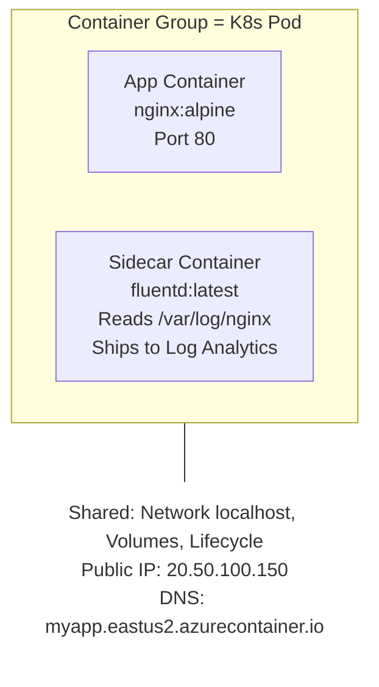
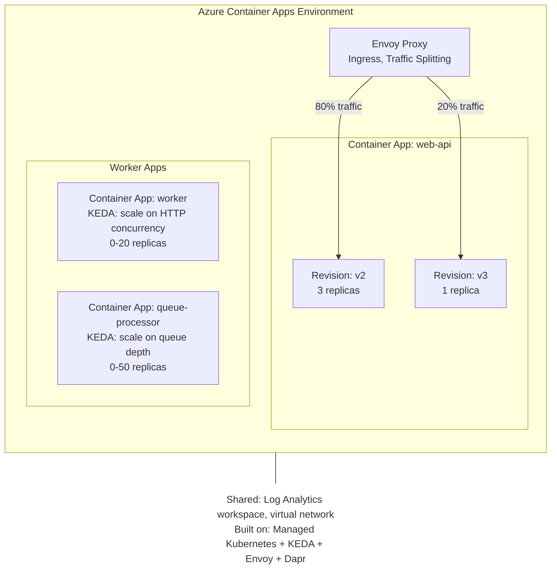

**Complexity**: [COMPLEX] | **Time to Complete**: 3h | **Prerequisites**: Module 3.6 (ACR), Module 3.1 (Entra ID)

## What You'll Be Able to Do

After completing this module, you will be able to:

- **Deploy Azure Container Instances for burst workloads with virtual network integration and GPU support**
- **Configure Azure Container Apps with Dapr integration, KEDA-based autoscaling, and revision traffic splitting**
- **Implement event-driven container architectures using Container Apps with Azure Storage Queue triggers**
- **Evaluate ACI vs Container Apps vs AKS to select the right container platform for each workload pattern**

---

## Why This Module Matters

In early 2023, a media streaming company needed to process video transcoding jobs during live events. Their traffic was extremely spiky---zero jobs during off-hours, then 500+ concurrent transcoding tasks during a live broadcast. Their existing solution used a pool of 20 always-on VMs that cost $2,800/month. During events, the pool was overwhelmed and jobs queued for 15+ minutes. During off-hours, the VMs sat idle burning money. They migrated the transcoding workers to Azure Container Apps with KEDA scaling triggered by Azure Service Bus queue depth. During live events, Container Apps scaled from zero to 200 instances in under 90 seconds. After the event, it scaled back to zero. Their monthly compute bill dropped from $2,800 to $340---an 88% reduction---while simultaneously eliminating the 15-minute queue backlog entirely.

Containers have become the standard unit of deployment, but not every workload needs the complexity of Kubernetes. Azure offers two serverless container platforms that abstract away cluster management: **Azure Container Instances (ACI)**, a raw container execution engine for simple workloads, and **Azure Container Apps (ACA)**, a higher-level platform built on Kubernetes that handles scaling, traffic routing, and service-to-service communication automatically.

In this module, you will learn when to use ACI versus Container Apps, how container groups work in ACI, how Container Apps manages revisions and traffic splitting, how KEDA auto-scaling responds to event-driven triggers, and how Dapr simplifies microservice communication. By the end, you will build an event-driven worker on Container Apps that scales based on queue length.

---

## Azure Container Instances (ACI): Containers Without Infrastructure

ACI is the simplest way to run a container in Azure. There is no cluster to manage, no orchestrator to configure, no nodes to patch. You provide a container image, specify CPU and memory, and Azure runs it. Think of ACI as the "function" of the container world---instant, stateless, and pay-per-second.

### When to Use ACI

ACI is ideal for:
- **Batch jobs and tasks**: Data processing, report generation, ETL pipelines
- **CI/CD build agents**: Ephemeral agents that spin up for a build and disappear
- **Dev/test environments**: Quick deployment without cluster overhead
- **Sidecar scenarios**: Running a container alongside another (container groups)
- **Burstable workloads from AKS**: Virtual Kubelet integration for overflow

ACI is **not** ideal for long-running web services (use Container Apps), complex microservice architectures (use AKS), or workloads needing auto-scaling (use Container Apps or AKS).

```bash
# Run a simple container
az container create \
  --resource-group myRG \
  --name hello-world \
  --image mcr.microsoft.com/azuredocs/aci-helloworld \
  --cpu 1 \
  --memory 1.5 \
  --ports 80 \
  --dns-name-label hello-kubedojo \
  --location eastus2

# View the running container
az container show -g myRG -n hello-world \
  --query '{FQDN:ipAddress.fqdn, State:provisioningState, IP:ipAddress.ip}' -o table

# View logs
az container logs -g myRG -n hello-world

# Execute a command inside the container
az container exec -g myRG -n hello-world --exec-command "/bin/sh"

# Delete when done
az container delete -g myRG -n hello-world --yes
```

### Container Groups: The ACI Pod

A **container group** is ACI's equivalent of a Kubernetes Pod. It is a collection of containers that are scheduled on the same host, share the same network namespace (they can reach each other on `localhost`), and can share volumes.



```yaml
# container-group.yaml
apiVersion: "2023-05-01"
name: web-with-sidecar
location: eastus2
properties:
  containers:
    - name: web
      properties:
        image: nginx:alpine
        ports:
          - port: 80
        resources:
          requests:
            cpu: 0.5
            memoryInGb: 0.5
        volumeMounts:
          - name: shared-logs
            mountPath: /var/log/nginx

    - name: log-shipper
      properties:
        image: fluent/fluentd:latest
        resources:
          requests:
            cpu: 0.25
            memoryInGb: 0.25
        volumeMounts:
          - name: shared-logs
            mountPath: /var/log/nginx
            readOnly: true

  osType: Linux
  ipAddress:
    type: Public
    ports:
      - protocol: TCP
        port: 80
  volumes:
    - name: shared-logs
      emptyDir: {}
```

```bash
# Deploy the container group
az container create -g myRG --file container-group.yaml

# View individual container logs within a group
az container logs -g myRG -n web-with-sidecar --container-name web
az container logs -g myRG -n web-with-sidecar --container-name log-shipper
```

### ACI Networking

ACI containers can be deployed with a **public IP** (internet-accessible) or into a **VNet subnet** (private, for internal workloads).

```bash
# Deploy ACI into a VNet (private, no public IP)
az container create \
  --resource-group myRG \
  --name private-worker \
  --image myregistry.azurecr.io/worker:latest \
  --cpu 2 \
  --memory 4 \
  --vnet hub-vnet \
  --subnet aci-subnet \
  --registry-login-server myregistry.azurecr.io \
  --registry-username "$SP_APP_ID" \
  --registry-password "$SP_PASSWORD"
```

### ACI Resource Limits and Pricing

| Resource | Linux | Windows |
| :--- | :--- | :--- |
| **Max CPU per group** | 4 cores | 4 cores |
| **Max Memory per group** | 16 GiB | 16 GiB |
| **Max containers per group** | 60 | 60 |
| **GPU support** | Yes (limited regions) | No |
| **Pricing (per vCPU/sec)** | ~$0.0000135 | ~$0.0000180 |
| **Pricing (per GB memory/sec)** | ~$0.0000015 | ~$0.0000020 |

A container running 1 vCPU and 2 GB for an hour costs approximately: (0.0000135 x 3600) + (0.0000015 x 2 x 3600) = $0.049 + $0.011 = **$0.06/hour** or about **$43/month** if running 24/7.

> **Pause and predict**: If you had a monolithic web application that receives consistent, heavy traffic 24/7, would ACI be a cost-effective hosting choice compared to a standard VM? Why or why not?

---

## Azure Container Apps (ACA): The Sweet Spot

Azure Container Apps is built on Kubernetes (specifically, a managed AKS cluster running KEDA, Envoy, and Dapr) but abstracts away all Kubernetes complexity. You define your container, scaling rules, and networking---Container Apps handles the rest.

### Architecture



### Container Apps vs ACI vs AKS

| Feature | ACI | Container Apps | AKS |
| :--- | :--- | :--- | :--- |
| **Complexity** | Lowest | Medium | Highest |
| **Auto-scaling** | No | Yes (KEDA) | Yes (HPA, KEDA, Karpenter) |
| **Scale to zero** | N/A (stops = deletes) | Yes | No (minimum 1 node) |
| **Traffic splitting** | No | Yes (revision-based) | Yes (manual with Istio/etc) |
| **Service mesh** | No | Dapr (built-in) | Istio/Linkerd (you manage) |
| **Custom domains + TLS** | No (IP/FQDN only) | Yes (auto-cert) | Yes (you manage) |
| **Persistent volumes** | Azure Files | Azure Files | Full PV/PVC support |
| **Max CPU per container** | 4 cores | 4 cores (Consumption) | Unlimited (node size) |
| **Ideal for** | Batch jobs, simple tasks | Web APIs, workers, microservices | Complex platforms, full K8s control |
| **Monthly cost baseline** | Pay per second | Free tier (180K vCPU-sec) | ~$73 (1 node min) |

```bash
# Create a Container Apps Environment
az containerapp env create \
  --resource-group myRG \
  --name kubedojo-env \
  --location eastus2

# Deploy a Container App (web API)
az containerapp create \
  --resource-group myRG \
  --name web-api \
  --environment kubedojo-env \
  --image mcr.microsoft.com/k8se/quickstart:latest \
  --target-port 80 \
  --ingress external \
  --min-replicas 1 \
  --max-replicas 10 \
  --cpu 0.5 \
  --memory 1.0Gi

# Get the app URL
az containerapp show -g myRG -n web-api --query properties.configuration.ingress.fqdn -o tsv
```

### Revisions and Traffic Splitting

Every time you update a Container App's configuration or image, a new **revision** is created. You can control how traffic is split between revisions, enabling canary deployments and blue/green deployments.

```bash
# Enable multiple active revisions
az containerapp revision set-mode \
  --resource-group myRG \
  --name web-api \
  --mode multiple

# Deploy a new revision with an updated image
az containerapp update \
  --resource-group myRG \
  --name web-api \
  --image myregistry.azurecr.io/web-api:v2.0.0 \
  --revision-suffix v2

# Split traffic: 80% to current, 20% to new revision
az containerapp ingress traffic set \
  --resource-group myRG \
  --name web-api \
  --revision-weight "web-api--v1=80" "web-api--v2=20"

# Promote: shift all traffic to the new revision
az containerapp ingress traffic set \
  --resource-group myRG \
  --name web-api \
  --revision-weight "web-api--v2=100"

# List revisions
az containerapp revision list -g myRG -n web-api \
  --query '[].{Name:name, Active:properties.active, TrafficWeight:properties.trafficWeight, Created:properties.createdTime}' -o table
```

### KEDA Auto-Scaling

Container Apps uses KEDA (Kubernetes Event-Driven Autoscaling) to scale based on event sources, not just CPU/memory. This is the killer feature for event-driven architectures.

```bash
# Scale based on HTTP concurrent requests
az containerapp create \
  --resource-group myRG \
  --name http-api \
  --environment kubedojo-env \
  --image myregistry.azurecr.io/api:v1 \
  --target-port 8080 \
  --ingress external \
  --min-replicas 0 \
  --max-replicas 30 \
  --scale-rule-name http-rule \
  --scale-rule-type http \
  --scale-rule-http-concurrency 50

# Scale based on Azure Service Bus queue depth
az containerapp create \
  --resource-group myRG \
  --name queue-worker \
  --environment kubedojo-env \
  --image myregistry.azurecr.io/worker:v1 \
  --min-replicas 0 \
  --max-replicas 50 \
  --scale-rule-name queue-rule \
  --scale-rule-type azure-servicebus \
  --scale-rule-metadata "queueName=processing" "namespace=my-sb-ns" "messageCount=5" \
  --scale-rule-auth "connection=sb-connection-string" \
  --secrets "sb-connection-string=$SB_CONNECTION_STRING"
```

Available KEDA scale triggers in Container Apps:

| Trigger | Scales On | Example Use Case |
| :--- | :--- | :--- |
| **HTTP** | Concurrent requests | Web APIs |
| **Azure Service Bus** | Queue/topic message count | Async processing |
| **Azure Storage Queue** | Queue message count | Batch processing |
| **Azure Event Hubs** | Unprocessed event count | Event streaming |
| **Cron** | Schedule | Scheduled batch jobs |
| **TCP** | Concurrent TCP connections | TCP-based services |
| **Custom** | Any Prometheus metric | Custom workloads |

### Dapr Integration

Dapr (Distributed Application Runtime) is built into Container Apps and provides building blocks for microservice communication without requiring you to learn Kubernetes networking.

```mermaid
flowchart TB
    subgraph Dapr Blocks
        direction TB
        B1["Service Invoke: Call other services by name"]
        B2["Pub/Sub: Publish/subscribe messaging"]
        B3["State Store: Key/value state management"]
        B4["Bindings: Input/output bindings (queues, DBs)"]
        B5["Secrets: Secret store integration"]
    end

    subgraph Flow Without Dapr
        direction LR
        App1[App] -- HTTP call --> API1[http://web-api.internal.company.com:8080/orders]
    end

    subgraph Flow With Dapr
        direction LR
        App2[App] -- HTTP call --> Sidecar[Dapr sidecar<br/>http://localhost:3500/v1.0/invoke/web-api/method/orders]
        Sidecar -.-> Magic[Dapr handles service discovery, retries, mTLS, observability]
        style Magic fill:none,stroke:none
    end
```



```bash
# Enable Dapr on a Container App
az containerapp create \
  --resource-group myRG \
  --name order-service \
  --environment kubedojo-env \
  --image myregistry.azurecr.io/order-service:v1 \
  --target-port 8080 \
  --ingress internal \
  --enable-dapr true \
  --dapr-app-id order-service \
  --dapr-app-port 8080 \
  --dapr-app-protocol http

# Configure a Dapr pub/sub component
az containerapp env dapr-component set \
  --resource-group myRG \
  --name kubedojo-env \
  --dapr-component-name pubsub \
  --yaml '{
    componentType: pubsub.azure.servicebus.topics,
    version: v1,
    metadata: [
      {name: connectionString, secretRef: sb-connection},
    ],
    secrets: [
      {name: sb-connection, value: "<connection-string>"}
    ],
    scopes: [order-service, notification-service]
  }'
```

**War Story**: A logistics startup had 8 microservices communicating via direct HTTP calls. When one service was slow, the calling services would timeout and retry, creating cascading failures. They enabled Dapr on Container Apps, which added automatic retries with exponential backoff, circuit breaking, and distributed tracing---all without changing application code. Their P99 latency dropped from 2.3 seconds to 180 milliseconds, and cascading failures stopped entirely because Dapr's circuit breaker would trip before the cascade could propagate.

> **Stop and think**: If your team is migrating a complex microservices architecture to Azure and wants to avoid the operational overhead of managing a full Kubernetes cluster, how does ACA's built-in Dapr integration reduce the custom code you need to write?

---

## Did You Know?

1. **Azure Container Instances can burst to thousands of simultaneous container groups.** During the first weeks of the COVID-19 pandemic, a European government agency used ACI to process 2 million pandemic benefit applications. They spun up 3,000 container instances simultaneously, processed the applications in 6 hours, and shut everything down. Total cost: approximately $240. Running equivalent VMs 24/7 for a week would have cost over $12,000.

2. **Container Apps' free grant covers approximately 6.2 million requests per month** at 50ms average execution time. The free tier includes 180,000 vCPU-seconds and 360,000 GiB-seconds per subscription per month. For a lightweight API that processes requests in 50ms with 0.25 vCPU, you get roughly 720,000 seconds of runtime per month before paying anything.

3. **KEDA can scale Container Apps from zero to 200 replicas in under 2 minutes.** The scale-from-zero cold start adds approximately 5-10 seconds (image pull + container startup), which is significantly faster than the 3-5 minutes it takes to add a new AKS node via cluster autoscaler. For event-driven workloads with bursty traffic, this responsiveness is transformative.

4. **Container Apps runs on a fully managed AKS cluster** that Microsoft operates. Each Container Apps environment maps to a dedicated Kubernetes namespace in this cluster. You can see evidence of this in the resource IDs and in the way networking is configured. However, you have zero direct access to the underlying Kubernetes API---Container Apps exposes only its own simplified API surface.

---

## Common Mistakes

| Mistake | Why It Happens | How to Fix It |
| :--- | :--- | :--- |
| Using ACI for long-running web services that need auto-scaling | ACI is the first container service teams discover | Use Container Apps for HTTP workloads that need scaling. ACI has no built-in auto-scaling or load balancing. |
| Setting min-replicas to 1 when the workload can tolerate cold starts | Fear of cold start latency | If your workload is event-driven (queue processor, scheduled job), set min-replicas to 0. You only pay when processing events. The 5-10 second cold start is usually acceptable. |
| Not configuring health probes on Container Apps | The app "works" without them | Without health probes, Container Apps cannot detect unhealthy replicas. Configure both liveness and readiness probes at minimum. |
| Using Container Apps for workloads that need Kubernetes-level control | Container Apps seems easier than AKS | If you need custom CRDs, direct pod scheduling, DaemonSets, StatefulSets with complex storage, or host-level access, you need AKS. Container Apps is not a Kubernetes replacement for complex scenarios. |
| Hardcoding connection strings in container environment variables | It works and is easy to set up | Use Container Apps secrets (which map to Kubernetes secrets) and reference them in env vars. Better yet, use Managed Identity to eliminate connection strings entirely. |
| Ignoring revision cleanup | Old revisions accumulate and count toward limits | Deactivate old revisions after promoting new ones. Container Apps has a limit on the number of revisions per app. |
| Not setting resource limits (CPU/memory) per container | Defaults "seem fine" in dev | Without limits, a misbehaving container can consume all available resources and affect other apps in the same environment. Set realistic CPU and memory limits based on load testing. |
| Using Dapr for simple point-to-point HTTP calls between two services | Dapr sounds beneficial and is free to enable | Dapr adds a sidecar container that consumes CPU and memory. For simple architectures with 2-3 services, direct HTTP is simpler. Dapr shines when you have many services and need pub/sub, state management, or cross-cutting concerns. |

---

## Quiz

<details>
<summary>1. Scenario: Your team is debating between ACI and Azure Container Apps for a new microservices deployment. A junior developer states they are essentially the same service, just with different pricing. How would you explain the fundamental architectural differences to correct this misconception?</summary>

Azure Container Instances (ACI) and Azure Container Apps (ACA) operate on fundamentally different architectures. ACI functions as a raw container execution engine, simply taking a container image and providing compute resources to run it without any built-in orchestration, traffic routing, or auto-scaling. In contrast, Azure Container Apps is built on top of a fully managed Kubernetes cluster under the hood, pre-configured with KEDA for event-driven scaling, Envoy for traffic splitting, and Dapr for microservice communication. Because ACA abstracts away the Kubernetes control plane, you receive orchestration benefits like scale-to-zero and seamless service discovery without having to manage nodes or complex YAML manifests yourself.
</details>

<details>
<summary>2. Scenario: You have been tasked with migrating two distinct workloads to Azure: a nightly PDF generation script that runs for ten minutes and stops, and an e-commerce shopping cart API that experiences highly variable traffic throughout the day. Which container service would you choose for each workload, and why?</summary>

For the nightly PDF generation script, Azure Container Instances (ACI) is the optimal choice because it is a simple, short-lived task that requires no auto-scaling, load balancing, or persistent network identity. You simply pay per second of execution, and the container group terminates once the job completes, making it highly cost-effective and operationally simple. For the e-commerce shopping cart API, Azure Container Apps (ACA) is the required solution. This workload demands responsive HTTP auto-scaling to handle traffic spikes, built-in ingress, and zero-downtime deployments via traffic splitting, all of which ACA provides natively through its managed Kubernetes foundation and Envoy proxy.
</details>

<details>
<summary>3. Scenario: Your background processing service needs to scale based on the number of pending orders in an Azure Storage Queue. A colleague suggests just using a standard CPU utilization metric of 70% to trigger scale-out events. Why is this approach flawed for queue processors, and how does KEDA scaling in Container Apps provide a better solution?</summary>

Relying on CPU-based auto-scaling for queue processors is fundamentally flawed because CPU utilization is a lagging indicator that only measures current compute usage, not the actual backlog of pending work. If your queue suddenly receives 10,000 messages while your existing instances are idle, the CPU metric won't trigger a scale-out until the instances start pulling messages and actually consume CPU cycles. KEDA solves this by directly monitoring external event sources, such as queue depth, HTTP concurrency, or topic lag, meaning it scales based on the demand signal rather than the resource consumption. Additionally, KEDA enables scaling completely to zero when the queue is empty, which is impossible with CPU scaling since you must have at least one running instance to measure CPU usage.
</details>

<details>
<summary>4. Scenario: You are performing a canary deployment for a critical payment gateway running on Container Apps. You currently have 80% of traffic routing to revision v1 and 20% to revision v2. When you observe no errors in v2, you update the ingress rules to route 100% of traffic to v2. What happens to the users currently in the middle of processing a payment on revision v1?</summary>

Users currently processing payments on revision v1 will not experience drops or interruptions. When you shift the traffic weights to 100% for revision v2, the Envoy proxy within Azure Container Apps performs a graceful drain on the newly deactivated v1 revision. This means Envoy stops routing any new incoming requests to v1, but actively allows all existing, established connections to complete their processing naturally. Once those active connections are closed or timeout according to configuration, the replicas for revision v1 will eventually be scaled down, ensuring a safe, zero-downtime transition for your users.
</details>

<details>
<summary>5. Scenario: Your architecture consists of an order service, an inventory service, and a shipping service communicating via standard REST calls over HTTP. During a recent outage, a database slowdown in the inventory service caused cascading timeouts that brought down the entire application. How would enabling Dapr on your Container Apps have mitigated this specific failure?</summary>

Direct HTTP calls between services lack inherent resilience mechanisms; if a downstream service slows down, upstream services simply wait and time out, quickly exhausting connection pools and causing cascading system failures. By enabling Dapr in Container Apps, a sidecar proxy is injected alongside your application container that intercepts these inter-service calls. Dapr automatically provides a robust service mesh layer that includes retries with exponential backoff, circuit breakers, and distributed tracing without requiring any changes to your application code. In the scenario of a slow inventory database, Dapr's circuit breaker would quickly trip, immediately rejecting calls from the order service to prevent connection pool exhaustion and allowing the rest of the system to remain stable while the inventory service recovers.
</details>

<details>
<summary>6. Scenario: You deploy an ACA background worker configured to process video rendering jobs from a Service Bus queue, with a target of 1 replica per 5 messages, min-replicas set to 0, and max-replicas set to 50. During off-peak hours, a batch upload system suddenly pushes 1,000 video jobs into the queue. Detail the exact sequence of scaling events that Container Apps will execute in response.</summary>

Initially, KEDA detects the sudden spike in queue depth and triggers a scale-out from zero replicas, with the first instance starting up after a brief 5-10 second cold start to pull the image and initialize the container. Next, KEDA evaluates your scaling rule (1 replica per 5 messages) against the backlog of 1,000 messages, calculating a desired state of 200 replicas, but strictly caps the deployment at your configured `max-replicas` limit of 50. The environment rapidly spins up to 50 concurrent replicas to chew through the queue backlog. Once the queue is entirely empty and the default cool-down period of 300 seconds passes without any new messages arriving, KEDA will gracefully scale the worker back down to zero replicas, ensuring you pay absolutely nothing for compute while the system is idle.
</details>

---

## Hands-On Exercise: Event-Driven Worker on Container Apps Scaling on Queue Length

In this exercise, you will deploy an Azure Container App that processes messages from a Storage Queue, auto-scales based on queue depth using KEDA, and scales to zero when idle.

**Prerequisites**: Azure CLI installed and authenticated.

### Task 1: Create Infrastructure

```bash
RG="kubedojo-aca-lab"
LOCATION="eastus2"
STORAGE_NAME="kubedojoaca$(openssl rand -hex 4)"
ENV_NAME="kubedojo-env"

# Create resource group
az group create --name "$RG" --location "$LOCATION"

# Create storage account for the queue
az storage account create \
  --name "$STORAGE_NAME" \
  --resource-group "$RG" \
  --location "$LOCATION" \
  --sku Standard_LRS

# Create a queue
az storage queue create \
  --name "work-items" \
  --account-name "$STORAGE_NAME"

# Get the storage connection string
STORAGE_CONN=$(az storage account show-connection-string \
  --name "$STORAGE_NAME" -g "$RG" --query connectionString -o tsv)
```

<details>
<summary>Verify Task 1</summary>

```bash
az storage queue list --account-name "$STORAGE_NAME" --query '[].name' -o tsv
```

You should see `work-items`.
</details>

### Task 2: Create the Container Apps Environment

```bash
# Create a Log Analytics workspace (required for Container Apps)
az monitor log-analytics workspace create \
  --resource-group "$RG" \
  --workspace-name kubedojo-logs

LOG_ANALYTICS_ID=$(az monitor log-analytics workspace show \
  -g "$RG" -n kubedojo-logs --query customerId -o tsv)
LOG_ANALYTICS_KEY=$(az monitor log-analytics workspace get-shared-keys \
  -g "$RG" -n kubedojo-logs --query primarySharedKey -o tsv)

# Create Container Apps environment
az containerapp env create \
  --resource-group "$RG" \
  --name "$ENV_NAME" \
  --location "$LOCATION" \
  --logs-workspace-id "$LOG_ANALYTICS_ID" \
  --logs-workspace-key "$LOG_ANALYTICS_KEY"
```

<details>
<summary>Verify Task 2</summary>

```bash
az containerapp env show -g "$RG" -n "$ENV_NAME" \
  --query '{Name:name, State:provisioningState, Location:location}' -o table
```

State should be `Succeeded`.
</details>

### Task 3: Deploy the Queue Worker Container App

```bash
# Deploy a worker that reads from the storage queue
# Using a simple Alpine container that simulates message processing
az containerapp create \
  --resource-group "$RG" \
  --name queue-worker \
  --environment "$ENV_NAME" \
  --image mcr.microsoft.com/k8se/quickstart:latest \
  --cpu 0.25 \
  --memory 0.5Gi \
  --min-replicas 0 \
  --max-replicas 10 \
  --secrets "storage-connection=$STORAGE_CONN" \
  --env-vars "STORAGE_CONNECTION=secretref:storage-connection" "QUEUE_NAME=work-items" \
  --scale-rule-name queue-scaling \
  --scale-rule-type azure-queue \
  --scale-rule-metadata "queueName=work-items" "queueLength=5" "accountName=$STORAGE_NAME" \
  --scale-rule-auth "connection=storage-connection"
```

<details>
<summary>Verify Task 3</summary>

```bash
az containerapp show -g "$RG" -n queue-worker \
  --query '{Name:name, MinReplicas:properties.template.scale.minReplicas, MaxReplicas:properties.template.scale.maxReplicas}' -o table
```

Min should be 0, max should be 10.
</details>

### Task 4: Verify Scale to Zero

```bash
# Check current replica count (should be 0 since queue is empty)
az containerapp replica list -g "$RG" -n queue-worker \
  --query 'length(@)' -o tsv

echo "Current replicas: $(az containerapp replica list -g "$RG" -n queue-worker --query 'length(@)' -o tsv)"
echo "(Should be 0 -- no messages in queue)"
```

<details>
<summary>Verify Task 4</summary>

The replica count should be 0 (or the command returns an empty list). This confirms scale-to-zero is working---no compute cost when idle.
</details>

### Task 5: Generate Load and Observe Scaling

```bash
# Send 50 messages to the queue
for i in $(seq 1 50); do
  az storage message put \
    --queue-name "work-items" \
    --content "work-item-$i" \
    --account-name "$STORAGE_NAME" \
    --connection-string "$STORAGE_CONN"
done

echo "Sent 50 messages. Waiting 30 seconds for KEDA to detect..."
sleep 30

# Check replica count (should have scaled up)
echo "Current replicas: $(az containerapp replica list -g "$RG" -n queue-worker --query 'length(@)' -o tsv)"

# Check the queue length
az storage queue show \
  --name "work-items" \
  --account-name "$STORAGE_NAME" \
  --connection-string "$STORAGE_CONN" \
  --query approximateMessageCount -o tsv
```

<details>
<summary>Verify Task 5</summary>

The replica count should have increased from 0. With 50 messages and a queueLength of 5, KEDA targets 50/5 = 10 replicas (matching our max). The exact number depends on timing and how quickly messages are processed.
</details>

### Task 6: Monitor via Log Analytics

```bash
# View container app system logs
az containerapp logs show \
  --resource-group "$RG" \
  --name queue-worker \
  --type system \
  --follow false

# Query Log Analytics for scaling events (may take a few minutes to appear)
az monitor log-analytics query \
  --workspace "$LOG_ANALYTICS_ID" \
  --analytics-query "ContainerAppSystemLogs_CL | where RevisionName_s contains 'queue-worker' | project TimeGenerated, Log_s | order by TimeGenerated desc | take 20" \
  --output table 2>/dev/null || echo "Logs may take 5-10 minutes to appear in Log Analytics"
```

<details>
<summary>Verify Task 6</summary>

You should see system logs showing replica creation events as the worker scales to meet queue demand. If logs are not yet available, wait a few minutes---Log Analytics ingestion has a delay.
</details>

### Cleanup

```bash
az group delete --name "$RG" --yes --no-wait
```

### Success Criteria

- [ ] Storage queue created with messages successfully sent
- [ ] Container Apps environment created with Log Analytics integration
- [ ] Queue worker deployed with KEDA scale rule on queue depth
- [ ] Worker scaled to zero when queue is empty (no compute cost)
- [ ] Worker scaled up when messages were added to the queue
- [ ] Logs visible showing scaling events

---

## Next Module

[Module 3.8: Azure Functions & Serverless](../module-3.8-functions/) --- Learn Azure's function-as-a-service platform with triggers, bindings, and Durable Functions for orchestrating complex serverless workflows.