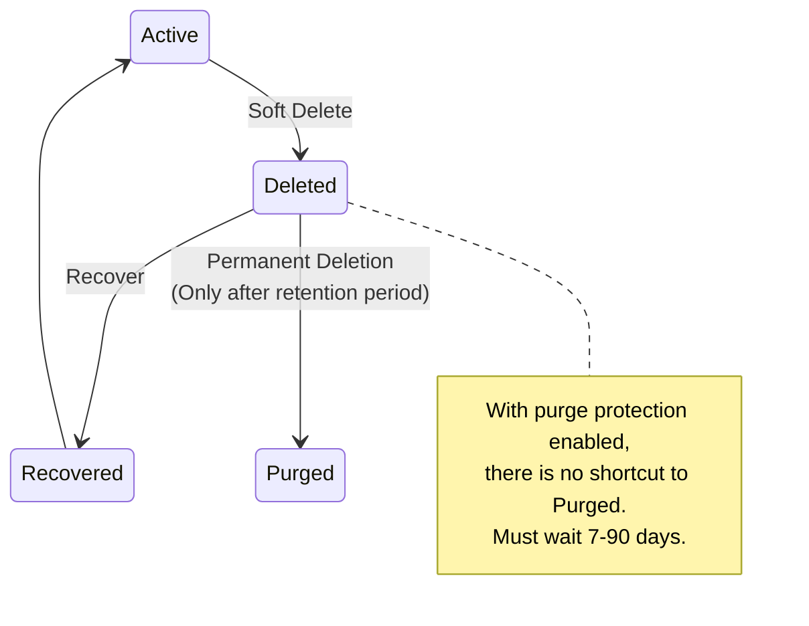
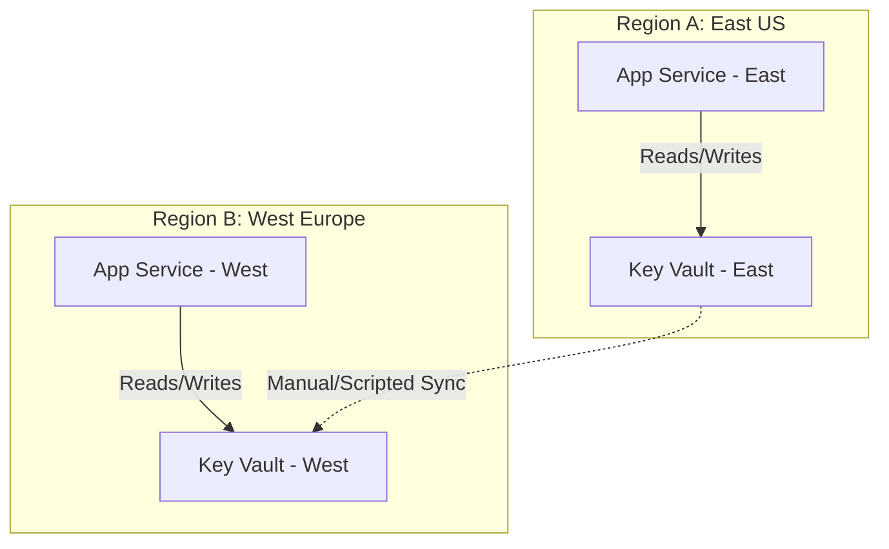

**Complexity**: [MEDIUM] | **Time to Complete**: 1.5h | **Prerequisites**: Module 3.1 (Entra ID & RBAC)

## What You'll Be Able to Do

After completing this module, you will be able to:

- **Configure Azure Key Vault with access policies and RBAC for secrets, keys, and certificate management**
- **Implement automatic secret rotation using Key Vault with Event Grid notifications and Azure Functions**
- **Deploy Key Vault integration patterns for App Service, Azure Functions, AKS, and VM workloads**
- **Design multi-region Key Vault architectures with soft delete, purge protection, and HSM-backed keys**

---

## Why This Module Matters

In December 2022, a widely-used password management company disclosed a major breach. Attackers had stolen encrypted vault data and the encryption keys needed to decrypt it. The root cause was traced back to a developer's home computer that had an old, vulnerable version of a media player installed. The attacker exploited the vulnerability, captured the developer's master credentials, and used them to access the company's cloud storage containing encrypted customer data. The breach affected 25 million users and resulted in an estimated $100 million in damages.

This incident drives home a fundamental point: **secrets management is not optional, and it is not a problem you solve with environment variables.** Every application has secrets---database passwords, API keys, encryption keys, TLS certificates. How you store and access these secrets determines whether a single compromised developer laptop leads to a minor inconvenience or a company-ending breach.

Azure Key Vault is a cloud service for securely storing and managing secrets, encryption keys, and certificates. It is backed by FIPS 140-2 Level 2 validated hardware security modules (HSMs), and integrates natively with virtually every Azure service. In this module, you will learn the three object types Key Vault manages, the two access control models (Access Policies vs RBAC), how soft delete and purge protection safeguard against accidental deletion, and how to integrate Key Vault with your applications using Managed Identities. By the end, you will store a database connection string in Key Vault and retrieve it from a Container App without any credentials in your code.

---

## Key Vault Fundamentals

### The Three Object Types

Key Vault manages three distinct categories of cryptographic and sensitive material:

| Object Type | What It Stores | Use Cases | API Endpoint |
| :--- | :--- | :--- | :--- |
| **Secrets** | Any string up to 25 KB | DB passwords, API keys, connection strings, config values | `https://myvault.vault.azure.net/secrets/` |
| **Keys** | RSA or EC cryptographic keys | Data encryption, signing, wrapping other keys | `https://myvault.vault.azure.net/keys/` |
| **Certificates** | X.509 certificates + private keys | TLS/SSL for web apps, code signing, mTLS | `https://myvault.vault.azure.net/certificates/` |

```mermaid
graph TD
    subgraph Azure Key Vault [Azure Key Vault 'myvault']
        S[Secrets<br/>- db-password<br/>- api-key-stripe<br/>- cosmos-conn-str]
        K[Keys<br/>- data-encrypt<br/>- signing-key<br/>- wrapping-key]
        C[Certificates<br/>- api-tls<br/>- mtls-cert<br/>- code-sign]
    end
    F[Features:<br/>• HSM-backed FIPS 140-2 Level 2<br/>• Versioned updates<br/>• Audit logged access<br/>• Soft delete & purge protection<br/>• Private endpoint support]
    Azure Key Vault --- F
    style F text-align:left
```

```bash
# Create a Key Vault
az keyvault create \
  --resource-group myRG \
  --name kubedojo-vault \
  --location eastus2 \
  --sku standard \
  --retention-days 90 \
  --enable-purge-protection true \
  --enable-rbac-authorization true

# Store a secret
az keyvault secret set \
  --vault-name kubedojo-vault \
  --name "db-password" \
  --value "SuperSecretP@ss123!"

# Retrieve a secret
az keyvault secret show \
  --vault-name kubedojo-vault \
  --name "db-password" \
  --query value -o tsv

# Store a multi-line secret (like a connection string)
az keyvault secret set \
  --vault-name kubedojo-vault \
  --name "cosmos-connection" \
  --value "AccountEndpoint=https://mydb.documents.azure.com:443/;AccountKey=abc123..."

# List all secrets (names only, not values)
az keyvault secret list \
  --vault-name kubedojo-vault \
  --query '[].{Name:name, Enabled:attributes.enabled, Created:attributes.created}' -o table
```

### Secret Versioning

Every time you update a secret, Key Vault creates a new version. The "current" version is always the latest, but you can access any previous version by its version identifier.

```bash
# Update a secret (creates a new version)
az keyvault secret set \
  --vault-name kubedojo-vault \
  --name "db-password" \
  --value "NewRotatedP@ss456!"

# List all versions of a secret
az keyvault secret list-versions \
  --vault-name kubedojo-vault \
  --name "db-password" \
  --query '[].{Version:id, Created:attributes.created, Enabled:attributes.enabled}' -o table

# Get a specific version
az keyvault secret show \
  --vault-name kubedojo-vault \
  --name "db-password" \
  --version "abc123def456..."
```

### Keys: Encryption Without Exposing Key Material

Key Vault keys are special: the key material never leaves the HSM. When you need to encrypt data, you send the data to Key Vault, and it returns the ciphertext. You never see the raw key.

> **Stop and think**: If the raw key material for a Key Vault key never leaves the HSM, how does an application encrypt a 50 GB video file? Sending a 50 GB payload over the network to Key Vault for encryption would be incredibly slow and inefficient. What pattern might be used instead?

```bash
# Create an RSA key
az keyvault key create \
  --vault-name kubedojo-vault \
  --name "data-encryption-key" \
  --kty RSA \
  --size 2048

# Encrypt data (the key never leaves Key Vault)
echo -n "sensitive data" | base64 > /tmp/plaintext.b64
az keyvault key encrypt \
  --vault-name kubedojo-vault \
  --name "data-encryption-key" \
  --algorithm RSA-OAEP \
  --value "$(cat /tmp/plaintext.b64)"

# Decrypt data
az keyvault key decrypt \
  --vault-name kubedojo-vault \
  --name "data-encryption-key" \
  --algorithm RSA-OAEP \
  --value "$CIPHERTEXT"
```

### Certificates: Automated TLS Management

Key Vault can issue certificates from integrated Certificate Authorities (DigiCert, GlobalSign) or manage self-signed certificates. It handles renewal automatically.

```bash
# Create a self-signed certificate
az keyvault certificate create \
  --vault-name kubedojo-vault \
  --name "api-tls-cert" \
  --policy "$(az keyvault certificate get-default-policy)"

# Import an existing PFX certificate
az keyvault certificate import \
  --vault-name kubedojo-vault \
  --name "imported-cert" \
  --file mycert.pfx \
  --password "pfx-password"

# Download the certificate (public portion)
az keyvault certificate download \
  --vault-name kubedojo-vault \
  --name "api-tls-cert" \
  --file /tmp/api-cert.pem \
  --encoding PEM
```

---

## Automated Secret Rotation

Storing secrets securely is only half the battle; secrets must be rotated regularly to limit the impact of a potential compromise. Azure Key Vault provides native rotation policies for Keys, and integrates with Event Grid to orchestrate rotation for Secrets.

### Key Vault Rotation Policies (Keys)
For cryptographic keys, you can define an automated rotation policy directly within Key Vault. This instructs the HSM to generate new key material at a scheduled interval.

```bash
# Create a rotation policy for a key (rotate 30 days before expiry)
cat > policy.json <<EOF
{
  "lifetimeActions": [
    {
      "trigger": {
        "timeBeforeExpiry": "P30D"
      },
      "action": {
        "type": "Rotate"
      }
    }
  ],
  "attributes": {
    "expiryTime": "P90D"
  }
}
EOF

az keyvault key rotation-policy update \
  --vault-name kubedojo-vault \
  --name "data-encryption-key" \
  --value @policy.json
```

> **Pause and predict**: If Key Vault automatically rotates the key material for `data-encryption-key`, what happens to the data that was encrypted using the *old* key version? Does Key Vault automatically re-encrypt your database?

### Secret Rotation via Event Grid
For secrets (like database passwords), Key Vault cannot magically change the password in the target system (e.g., Azure SQL). Instead, Key Vault emits an Event Grid event 30 days before a secret expires. This event triggers an Azure Function, which connects to the database, generates a new password, updates the database user, and saves the new version to Key Vault.

```bash
# Example flow for Secret Rotation:
# 1. Secret approaches 'Expiration Date'
# 2. Key Vault publishes 'SecretNearExpiry' event to Event Grid
# 3. Event Grid triggers an Azure Function
# 4. Function connects to Azure SQL and changes the password
# 5. Function writes the new password to Key Vault as a new version
```

---

## Access Control: Access Policies vs Azure RBAC

Key Vault supports two access control models. You must choose one at creation time (though you can switch later).

### Access Policies (Legacy)

Access Policies are vault-level permissions granted to specific identities. Each policy specifies what operations (get, set, delete, list, etc.) an identity can perform on secrets, keys, and certificates.

```bash
# Create a vault with access policies (not recommended for new vaults)
az keyvault create \
  --name old-style-vault \
  --resource-group myRG \
  --enable-rbac-authorization false

# Grant a user access to secrets
az keyvault set-policy \
  --name old-style-vault \
  --upn "alice@company.com" \
  --secret-permissions get list set

# Grant a managed identity access to keys
az keyvault set-policy \
  --name old-style-vault \
  --object-id "$MANAGED_IDENTITY_PRINCIPAL_ID" \
  --key-permissions get unwrapKey wrapKey
```

### Azure RBAC (Recommended)

RBAC uses the standard Azure role assignment model with fine-grained built-in roles:

| Role | Scope | Permissions |
| :--- | :--- | :--- |
| **Key Vault Administrator** | Vault | Full management of all objects |
| **Key Vault Secrets Officer** | Vault or secret | Manage secrets (set, delete, rotate) |
| **Key Vault Secrets User** | Vault or secret | Read secrets only |
| **Key Vault Crypto Officer** | Vault or key | Manage keys (create, delete, sign, encrypt) |
| **Key Vault Crypto User** | Vault or key | Use keys (sign, encrypt) but not manage |
| **Key Vault Certificates Officer** | Vault or cert | Manage certificates |
| **Key Vault Reader** | Vault | Read metadata (not secret values) |

```bash
# Create a vault with RBAC (recommended)
az keyvault create \
  --name kubedojo-vault \
  --resource-group myRG \
  --enable-rbac-authorization true

# Grant read-only access to secrets for a managed identity
VAULT_ID=$(az keyvault show -n kubedojo-vault --query id -o tsv)
az role assignment create \
  --assignee "$MANAGED_IDENTITY_PRINCIPAL_ID" \
  --role "Key Vault Secrets User" \
  --scope "$VAULT_ID"

# Grant secret management access to a specific secret
az role assignment create \
  --assignee "alice@company.com" \
  --role "Key Vault Secrets Officer" \
  --scope "$VAULT_ID/secrets/db-password"
```

```mermaid
graph TD
    subgraph AP [Access Policies - Legacy]
        AP_V[Vault: kubedojo-vault]
        AP_U1[alice@company.com<br/>Secrets: get, list, set]
        AP_U2[app-managed-identity<br/>Keys: get, wrapKey, unwrapKey<br/>Secrets: get]
        AP_V --> AP_U1
        AP_V --> AP_U2
        AP_N[Limitation: Cannot scope to individual secrets/keys]
        style AP_N stroke-dasharray: 5 5
    end

    subgraph RBAC [Azure RBAC - Recommended]
        RBAC_V[Vault: kubedojo-vault]
        RBAC_S1[Scope: /secrets/db-password]
        RBAC_S2[Scope: / entire vault]
        RBAC_U1[alice@company.com<br/>Role: Key Vault Secrets Officer]
        RBAC_U2[app-managed-identity<br/>Role: Key Vault Secrets User]
        RBAC_V --> RBAC_S1
        RBAC_V --> RBAC_S2
        RBAC_S1 --> RBAC_U1
        RBAC_S2 --> RBAC_U2
        RBAC_N[Advantage: Standard Azure RBAC, Conditional Access, PIM support]
        style RBAC_N stroke-dasharray: 5 5
    end
```

**War Story**: A company using Access Policies had 150 identities with vault-level secret access. When an audit asked "who can read the production database password specifically?", the answer was "all 150 identities." They could not scope Access Policies to individual secrets. After migrating to RBAC, they granted `Key Vault Secrets User` at the individual secret scope, reducing the blast radius of each identity to only the secrets it needed.

---

## Soft Delete and Purge Protection

Key Vault has two safety nets against accidental or malicious deletion:

**Soft Delete**: When you delete a secret, key, or certificate, it is not immediately destroyed. Instead, it enters a "soft-deleted" state and can be recovered during the retention period (7-90 days). Soft delete is mandatory for all vaults created after 2020.

**Purge Protection**: When enabled, even a soft-deleted object cannot be permanently destroyed (purged) until the retention period expires. Not even the vault owner or a Global Administrator can purge it early. This protects against a compromised admin account deliberately destroying secrets.

```bash
# Delete a secret (soft delete)
az keyvault secret delete --vault-name kubedojo-vault --name "db-password"

# List soft-deleted secrets
az keyvault secret list-deleted --vault-name kubedojo-vault \
  --query '[].{Name:name, DeletedDate:deletedDate, ScheduledPurge:scheduledPurgeDate}' -o table

# Recover a soft-deleted secret
az keyvault secret recover --vault-name kubedojo-vault --name "db-password"

# With purge protection disabled, you COULD permanently purge:
# az keyvault secret purge --vault-name kubedojo-vault --name "db-password"
# With purge protection enabled, this command fails until retention expires.
```



---

## Multi-Region Architectures and Disaster Recovery

For mission-critical applications deployed across multiple Azure regions (e.g., East US and West Europe), depending on a single Key Vault creates a single point of failure and introduces cross-region latency.

### High Availability within a Region
Behind the scenes, Azure Key Vault automatically replicates its contents within the region and to a paired region (e.g., East US to West US). If a single node fails, traffic is transparently routed to a healthy node.

### The Active-Active Vault Pattern
However, if an entire region goes down, the vault in the paired region enters read-only mode. For active-active applications that need to *write* secrets or manage keys during a regional outage, you must deploy independent Key Vaults in each region.



When using multiple vaults, your CI/CD pipeline or a dedicated synchronization function must ensure that identical secrets (like a third-party API key) are pushed to both vaults. For regional resources (like a region-specific database password), the local vault stores the local credential.

> **Stop and think**: If you use an Active-Active Vault pattern and rely on a CI/CD pipeline to push the same Stripe API key to `KV-East` and `KV-West`, what happens to your application if the pipeline partially fails, updating `KV-East` but failing to update `KV-West`?

---

## Integrating Key Vault with Applications

### Pattern 1: Direct SDK Access (Application Code)

```python
from azure.identity import DefaultAzureCredential
from azure.keyvault.secrets import SecretClient

# No credentials in code! DefaultAzureCredential uses Managed Identity.
credential = DefaultAzureCredential()
client = SecretClient(vault_url="https://kubedojo-vault.vault.azure.net/", credential=credential)

# Get a secret
db_password = client.get_secret("db-password")
print(f"Connected to DB with password: {db_password.value[:3]}***")

# Set a secret
client.set_secret("api-key-new", "my-new-api-key")

# List secrets (metadata only, not values)
for secret in client.list_properties_of_secrets():
    print(f"Secret: {secret.name}, Enabled: {secret.enabled}")
```

### Pattern 2: Key Vault References in App Configuration

Azure App Service, Functions, and Container Apps can reference Key Vault secrets directly in application settings, without any SDK code:

```bash
# Set a Key Vault reference in a Function App
az functionapp config appsettings set \
  --resource-group myRG \
  --name my-function-app \
  --settings "DB_PASSWORD=@Microsoft.KeyVault(SecretUri=https://kubedojo-vault.vault.azure.net/secrets/db-password/)"

# The application reads DB_PASSWORD as a normal environment variable.
# Azure resolves the Key Vault reference automatically.
```

> **Stop and think**: When passing a Key Vault reference into an App Service or Container App environment variable, the application itself is completely unaware of Key Vault. It just reads a standard environment variable. What are the security tradeoffs of this convenience compared to having the application use the Azure SDK directly?

### Pattern 3: Container Apps with Key Vault

```bash
# Create a Container App that reads secrets from Key Vault via Managed Identity
az containerapp create \
  --resource-group myRG \
  --name my-app \
  --environment my-env \
  --image myregistry.azurecr.io/app:v1 \
  --secrets "db-pass=keyvaultref:https://kubedojo-vault.vault.azure.net/secrets/db-password,identityref:/subscriptions/.../userAssignedIdentities/my-identity" \
  --env-vars "DB_PASSWORD=secretref:db-pass"
```

### Pattern 4: Kubernetes Integration (CSI Driver)

For AKS, the Azure Key Vault Provider for Secrets Store CSI Driver mounts secrets as files in the pod:

```yaml
# SecretProviderClass for AKS
apiVersion: secrets-store.csi.x-k8s.io/v1
kind: SecretProviderClass
metadata:
  name: kv-secrets
spec:
  provider: azure
  parameters:
    usePodIdentity: "false"
    useVMManagedIdentity: "true"
    userAssignedIdentityID: "<managed-identity-client-id>"
    keyvaultName: "kubedojo-vault"
    objects: |
      array:
        - |
          objectName: db-password
          objectType: secret
        - |
          objectName: api-key-stripe
          objectType: secret
    tenantId: "<tenant-id>"
  secretObjects:
    - secretName: app-secrets
      type: Opaque
      data:
        - objectName: db-password
          key: DB_PASSWORD
        - objectName: api-key-stripe
          key: STRIPE_KEY
```

---

## Key Vault Networking: Private and Secure

By default, Key Vault is accessible from the public internet (with authentication required). For production, restrict network access:

```bash
# Restrict to specific VNets and IPs
az keyvault update \
  --name kubedojo-vault \
  --default-action Deny

# Allow access from a specific subnet
az keyvault network-rule add \
  --name kubedojo-vault \
  --subnet "/subscriptions/.../subnets/app-subnet"

# Allow access from a specific IP
az keyvault network-rule add \
  --name kubedojo-vault \
  --ip-address "203.0.113.0/24"

# Or use Private Endpoint for full private access
az network private-endpoint create \
  --resource-group myRG \
  --name kv-private-endpoint \
  --vnet-name hub-vnet \
  --subnet private-endpoints \
  --private-connection-resource-id "$VAULT_ID" \
  --group-id vault \
  --connection-name kv-connection
```

> **Pause and predict**: If a user is granted `Key Vault Administrator` at the Subscription level, and a specific Key Vault has an explicit `Deny` network rule for all IP addresses except one, can the administrator still read secrets from their home IP? Which takes precedence: RBAC or Network Firewalls?

---

## Did You Know?

1. **Azure Key Vault processes over 200 billion transactions per month** across all Azure customers as of 2024. It is one of the most heavily used services in Azure because virtually every Azure service that needs secrets, keys, or certificates uses Key Vault under the hood. Azure Disk Encryption, App Service certificates, SQL Transparent Data Encryption---they all store their keys in Key Vault.

2. **Key Vault Premium SKU uses FIPS 140-2 Level 3 validated HSMs** (Marvell LiquidSecurity), while Standard uses Level 2. The difference: Level 3 HSMs have physical tamper-evidence mechanisms and identity-based authentication. Level 3 is required for certain compliance frameworks like PCI-DSS in some interpretations. Premium costs approximately $1 per key per month, while Standard key operations are billed per 10,000 operations ($0.03).

3. **Key Vault has a throttling limit of 4,000 transactions per vault per 10 seconds** for secret read operations. A team running 500 microservices that each fetched 3 secrets at startup experienced throttling when deploying all services simultaneously. The fix: cache secrets locally with a reasonable refresh interval (every 5 minutes instead of every request) and stagger deployments.

4. **Once purge protection is enabled on a vault, it cannot be disabled.** This is by design---it prevents an attacker who gains admin access from disabling the protection and then purging secrets. A team accidentally enabled purge protection on a test vault with a 90-day retention period, meaning they cannot fully clean up deleted test secrets for 3 months. Always use a shorter retention period (7 days) for non-production vaults.

---

## Common Mistakes

| Mistake | Why It Happens | How to Fix It |
| :--- | :--- | :--- |
| Storing secrets in environment variables, config files, or code | It is "faster" during development | Use Key Vault from day one. Local dev uses `DefaultAzureCredential` which falls back to Azure CLI login---no secret management needed locally. |
| Creating one vault per secret | Misunderstanding of vault purpose | A vault is a logical grouping of related secrets. Use one vault per application/environment (e.g., `app-prod-vault`, `app-dev-vault`). |
| Using Access Policies instead of RBAC on new vaults | Access Policies are the older default | Always create vaults with `--enable-rbac-authorization true`. RBAC provides per-secret scoping, Conditional Access integration, and PIM support. |
| Not enabling purge protection on production vaults | It seems overly cautious | A compromised admin could delete and purge all secrets. Purge protection ensures deleted secrets can be recovered. Enable it on all production vaults. |
| Reading secrets from Key Vault on every request | It seems like the "most secure" approach | Cache secrets in memory and refresh periodically (every 5-15 minutes). Key Vault has throttling limits, and each call adds 5-10ms latency. |
| Granting Key Vault Administrator when Key Vault Secrets User is sufficient | "Administrator" sounds like the right role for an admin | Key Vault Administrator can create, delete, and manage ALL objects. Most applications only need Key Vault Secrets User (read secrets). |
| Not rotating secrets | The initial secret "works fine" | Implement secret rotation. Use Key Vault's built-in rotation policies (preview), or use Event Grid notifications to trigger rotation logic. |
| Forgetting to configure firewall rules on production vaults | The vault works from everywhere by default | Set `--default-action Deny` and add only the necessary VNet subnets and IPs. Use Private Endpoint for the strongest isolation. |

---

## Quiz

<details>
<summary>1. You are designing the security architecture for a new e-commerce application. The application needs to connect to a SQL database, encrypt credit card numbers before storing them, and serve traffic over HTTPS. How would you categorize these requirements into Azure Key Vault object types, and why?</summary>

The three requirements directly map to Key Vault's three object types. The SQL database password should be stored as a **Secret**, because it is a raw string value that the application needs to retrieve and pass to the database driver. The credit card encryption mechanism should use a **Key**, because Key Vault can perform the cryptographic operations (encrypt/decrypt) entirely within its HSM without ever exposing the raw key material to the application. The HTTPS traffic requirement should be handled by a **Certificate**, because Key Vault can manage the X.509 certificate, securely store its private key, and automatically handle the renewal process with integrated certificate authorities.
</details>

<details>
<summary>2. Your organization currently manages Key Vault using Access Policies, but the security team has mandated that all access to production database passwords must be strictly limited to the specific application that uses them, and access must require Multi-Factor Authentication. How does migrating to Azure RBAC solve this, and why couldn't Access Policies meet the requirement?</summary>

Migrating to Azure RBAC allows you to apply granular access controls down to the individual secret level, whereas Access Policies only operate at the vault level. With Access Policies, granting an application access to read the database password would inherently grant it access to read every other secret in the vault. Furthermore, Access Policies are a legacy Key Vault-specific mechanism that does not integrate with modern Azure AD features. By using Azure RBAC, the security team can leverage Conditional Access policies to enforce MFA, and use Privileged Identity Management (PIM) to require just-in-time access approvals for human users requesting the `Key Vault Secrets Officer` role.
</details>

<details>
<summary>3. A rogue administrator account executes a script that deletes all secrets from your production Key Vault and then immediately attempts to permanently purge them to cause maximum disruption. Your vault was configured with soft delete and purge protection enabled. Walk through what happens to the secrets and why the attacker's plan fails.</summary>

When the attacker executes the deletion script, the secrets are not permanently destroyed; instead, they are moved into a soft-deleted state. In this state, the applications will immediately lose access (resulting in downtime), but the secrets themselves are safely preserved in the vault's recycle bin. When the attacker attempts to purge the soft-deleted secrets, the Key Vault service rejects the request because purge protection is enabled. Purge protection enforces a mandatory waiting period (between 7 and 90 days, depending on configuration) during which absolutely no one—including Global Administrators—can bypass the retention period. The organization can simply restore the soft-deleted secrets and revoke the rogue administrator's access.
</details>

<details>
<summary>4. Your development team is struggling with "it works on my machine" errors because they hardcode Key Vault credentials locally, but the application uses Managed Identities in production. You rewrite the code to use `DefaultAzureCredential()`. Walk through how this single line of code resolves authentication in both the local development environment and the production Container App.</summary>

The `DefaultAzureCredential` class operates by iterating through a prioritized chain of authentication providers based on the environment it detects. When a developer runs the application locally, it discovers the developer's cached Azure CLI credentials (`az login`) and uses their personal identity to request an access token for Key Vault. When the exact same code is deployed to the production Container App, the local developer credentials do not exist, so the chain falls back to the Managed Identity endpoint injected by Azure into the container environment. This abstracts the authentication mechanism away from the application logic, ensuring that no raw credentials are ever hardcoded in the source repository.
</details>

<details>
<summary>5. On Black Friday, your application automatically scales out from 10 to 200 instances in response to traffic. Immediately, the new instances crash on startup with HTTP 429 (Too Many Requests) errors originating from Azure Key Vault. The developers configured the app to fetch its 5 database connection strings from Key Vault on every incoming user request. Why did this cause an outage, and what architectural pattern should they implement to fix it?</summary>

The outage occurred because Key Vault is designed as a secure storage repository, not a high-throughput, low-latency database; it strictly throttles secret read operations to approximately 4,000 transactions per 10 seconds per vault. By reading 5 secrets on every request across thousands of concurrent operations, the scaled-out application instances massively exceeded the service limit and triggered 429 errors. To fix this architectural flaw, the team must implement an in-memory caching layer within the application. The application should fetch the secrets once during startup, cache them in memory, and only periodically poll Key Vault (e.g., every 10 minutes) to check for rotated values.
</details>

<details>
<summary>6. A startup currently injects its database password into its App Service via an environment variable called `DB_PASS`. A security consultant recommends moving this to Azure Key Vault and using a Managed Identity to access it. Compare these two approaches: what specific vulnerabilities exist in the environment variable method that Key Vault eliminates?</summary>

Storing a password directly in an environment variable leaves the plaintext credential exposed in memory dumps, process listings, debugging logs, and the Azure Portal interface for anyone with read access to the App Service. It also provides no audit trail of who viewed the password, and requires a full application restart to rotate the credential. By moving the password to Azure Key Vault and using a Managed Identity, the credential is encrypted at rest in a hardware security module (HSM) and the application's identity is authenticated via Entra ID. This approach provides fine-grained RBAC scoping, generates an immutable audit log of every access attempt, and allows the secret to be rotated independently of the application deployment lifecycle.
</details>

---

## Hands-On Exercise: DB Connection String in Key Vault, Retrieved by Container App via Managed Identity

In this exercise, you will store a secret in Key Vault, create a Container App with a Managed Identity, grant the identity access to read the secret, and verify the integration.

**Prerequisites**: Azure CLI installed and authenticated.

### Task 1: Create Key Vault with RBAC Authorization

```bash
RG="kubedojo-keyvault-lab"
LOCATION="eastus2"
VAULT_NAME="kubedojokv$(openssl rand -hex 4)"

az group create --name "$RG" --location "$LOCATION"

az keyvault create \
  --resource-group "$RG" \
  --name "$VAULT_NAME" \
  --location "$LOCATION" \
  --enable-rbac-authorization true \
  --retention-days 7 \
  --enable-purge-protection false  # false for lab (easy cleanup)

# Grant yourself Key Vault Secrets Officer so you can create secrets
USER_ID=$(az ad signed-in-user show --query id -o tsv)
VAULT_ID=$(az keyvault show -n "$VAULT_NAME" --query id -o tsv)
az role assignment create \
  --assignee "$USER_ID" \
  --role "Key Vault Secrets Officer" \
  --scope "$VAULT_ID"
```

<details>
<summary>Verify Task 1</summary>

```bash
az keyvault show -n "$VAULT_NAME" \
  --query '{Name:name, RBAC:properties.enableRbacAuthorization, SoftDelete:properties.enableSoftDelete}' -o table
```
</details>

### Task 2: Store Secrets in Key Vault

```bash
# Store a simulated database connection string
az keyvault secret set \
  --vault-name "$VAULT_NAME" \
  --name "db-connection-string" \
  --value "Server=tcp:myserver.database.windows.net,1433;Database=mydb;User=admin;Password=SuperS3cretP@ssw0rd!;"

# Store an API key
az keyvault secret set \
  --vault-name "$VAULT_NAME" \
  --name "api-key" \
  --value "sk-live-abc123def456ghi789"

# Verify secrets exist
az keyvault secret list --vault-name "$VAULT_NAME" \
  --query '[].{Name:name, Enabled:attributes.enabled}' -o table
```

<details>
<summary>Verify Task 2</summary>

```bash
az keyvault secret show --vault-name "$VAULT_NAME" --name "db-connection-string" \
  --query '{Name:name, Created:attributes.created}' -o table
```
</details>

### Task 3: Create a User-Assigned Managed Identity

```bash
IDENTITY_NAME="keyvault-reader-identity"

az identity create \
  --resource-group "$RG" \
  --name "$IDENTITY_NAME"

IDENTITY_ID=$(az identity show -g "$RG" -n "$IDENTITY_NAME" --query id -o tsv)
IDENTITY_PRINCIPAL=$(az identity show -g "$RG" -n "$IDENTITY_NAME" --query principalId -o tsv)
IDENTITY_CLIENT=$(az identity show -g "$RG" -n "$IDENTITY_NAME" --query clientId -o tsv)

# Grant the managed identity Key Vault Secrets User role
az role assignment create \
  --assignee "$IDENTITY_PRINCIPAL" \
  --role "Key Vault Secrets User" \
  --scope "$VAULT_ID"

echo "Identity Principal ID: $IDENTITY_PRINCIPAL"
echo "Identity Client ID: $IDENTITY_CLIENT"
```

<details>
<summary>Verify Task 3</summary>

```bash
az role assignment list --assignee "$IDENTITY_PRINCIPAL" --scope "$VAULT_ID" \
  --query '[].{Role:roleDefinitionName, Scope:scope}' -o table
```

You should see `Key Vault Secrets User` assigned.
</details>

### Task 4: Create Container Apps Environment and App

```bash
# Create Log Analytics workspace
az monitor log-analytics workspace create \
  --resource-group "$RG" --workspace-name kv-lab-logs
LOG_ID=$(az monitor log-analytics workspace show -g "$RG" -n kv-lab-logs --query customerId -o tsv)
LOG_KEY=$(az monitor log-analytics workspace get-shared-keys -g "$RG" -n kv-lab-logs --query primarySharedKey -o tsv)

# Create Container Apps environment
az containerapp env create \
  --resource-group "$RG" \
  --name kv-lab-env \
  --location "$LOCATION" \
  --logs-workspace-id "$LOG_ID" \
  --logs-workspace-key "$LOG_KEY"

# Deploy a Container App with the managed identity
az containerapp create \
  --resource-group "$RG" \
  --name secret-reader-app \
  --environment kv-lab-env \
  --image mcr.microsoft.com/k8se/quickstart:latest \
  --target-port 80 \
  --ingress external \
  --user-assigned "$IDENTITY_ID" \
  --min-replicas 1 \
  --max-replicas 1 \
  --env-vars "VAULT_URL=https://${VAULT_NAME}.vault.azure.net/" "AZURE_CLIENT_ID=$IDENTITY_CLIENT"
```

<details>
<summary>Verify Task 4</summary>

```bash
az containerapp show -g "$RG" -n secret-reader-app \
  --query '{Name:name, Identities:identity.userAssignedIdentities}' -o json | head -10
```

You should see the user-assigned identity attached to the Container App.
</details>

### Task 5: Verify Secret Access from the Container App

```bash
# Get the Container App's FQDN
APP_FQDN=$(az containerapp show -g "$RG" -n secret-reader-app \
  --query properties.configuration.ingress.fqdn -o tsv)
echo "App URL: https://$APP_FQDN"

# Test that the managed identity can read secrets using az CLI inside the container
# (In a real app, you'd use the Azure SDK with DefaultAzureCredential)
az containerapp exec \
  --resource-group "$RG" \
  --name secret-reader-app \
  --command "curl -s -H 'Metadata: true' 'http://169.254.169.254/metadata/identity/oauth2/token?api-version=2019-08-01&resource=https://vault.azure.net&client_id=$IDENTITY_CLIENT'" 2>/dev/null | head -1 || \
echo "Note: exec may not be available on quickstart image. Testing via CLI instead."

# Verify from outside: use Azure CLI to confirm the identity has access
az keyvault secret show \
  --vault-name "$VAULT_NAME" \
  --name "db-connection-string" \
  --query '{Name:name, Value:value}' -o table
```

<details>
<summary>Verify Task 5</summary>

The secret should be readable. In a production scenario, your application code would use the Azure SDK:

```python
from azure.identity import DefaultAzureCredential
from azure.keyvault.secrets import SecretClient

credential = DefaultAzureCredential()
client = SecretClient(vault_url="https://VAULT_NAME.vault.azure.net/", credential=credential)
secret = client.get_secret("db-connection-string")
# Use secret.value to configure your database connection
```

The `AZURE_CLIENT_ID` environment variable tells `DefaultAzureCredential` which user-assigned managed identity to use.
</details>

### Task 6: Test Soft Delete and Recovery

```bash
# Delete a secret
az keyvault secret delete --vault-name "$VAULT_NAME" --name "api-key"

# Verify it is gone from active list
az keyvault secret list --vault-name "$VAULT_NAME" \
  --query '[].name' -o tsv

# Find it in deleted secrets
az keyvault secret list-deleted --vault-name "$VAULT_NAME" \
  --query '[].{Name:name, DeletedDate:deletedDate}' -o table

# Recover it
az keyvault secret recover --vault-name "$VAULT_NAME" --name "api-key"

# Verify it is back
az keyvault secret show --vault-name "$VAULT_NAME" --name "api-key" \
  --query '{Name:name, Value:value}' -o table
```

<details>
<summary>Verify Task 6</summary>

The api-key secret should be restored to its original value after recovery. This demonstrates that soft delete protects against accidental deletions.
</details>

### Cleanup

```bash
az group delete --name "$RG" --yes --no-wait
```

### Success Criteria

- [ ] Key Vault created with RBAC authorization
- [ ] Two secrets stored (db-connection-string and api-key)
- [ ] User-assigned Managed Identity created and granted Key Vault Secrets User role
- [ ] Container App deployed with the managed identity attached
- [ ] Verified that the identity can read secrets from Key Vault
- [ ] Soft delete tested: secret deleted, found in deleted list, and recovered

---

## Next Module

[Module 3.10: Azure Monitor & Log Analytics](../module-3.10-monitor/) --- Learn how to observe your Azure infrastructure and applications with metrics, logs, KQL queries, and alerts that notify you before your customers notice problems.