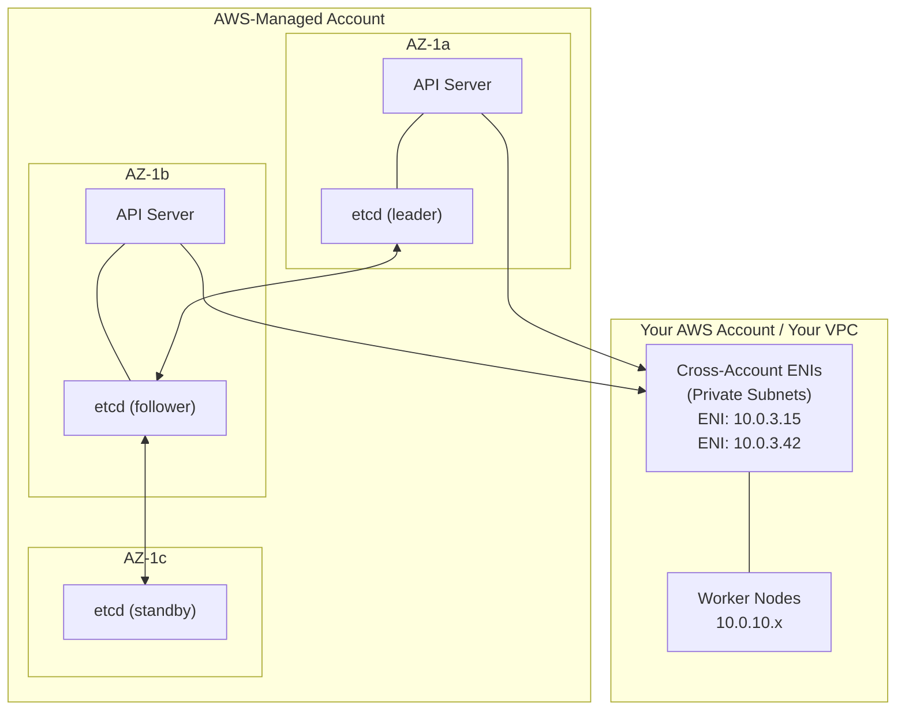
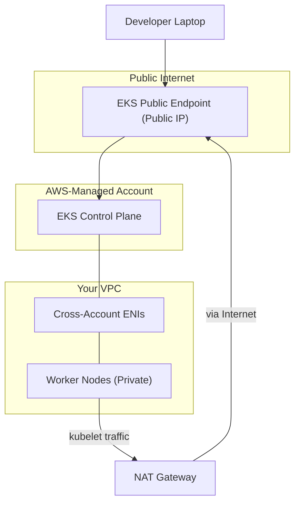
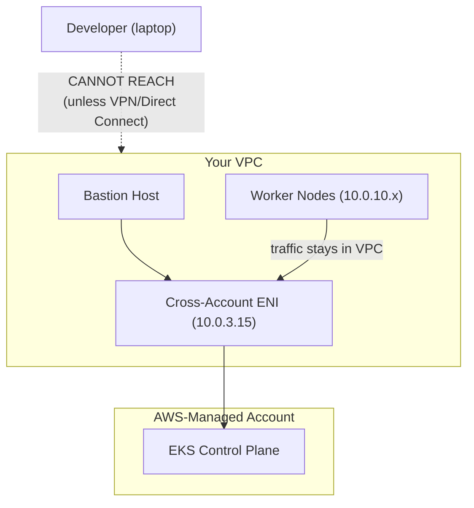
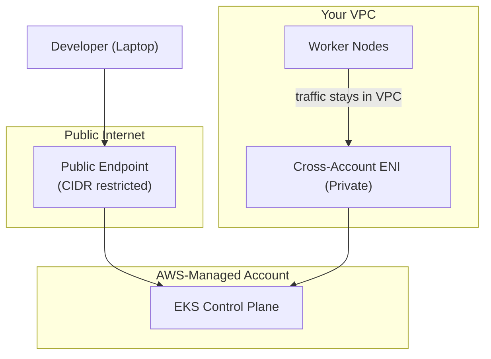
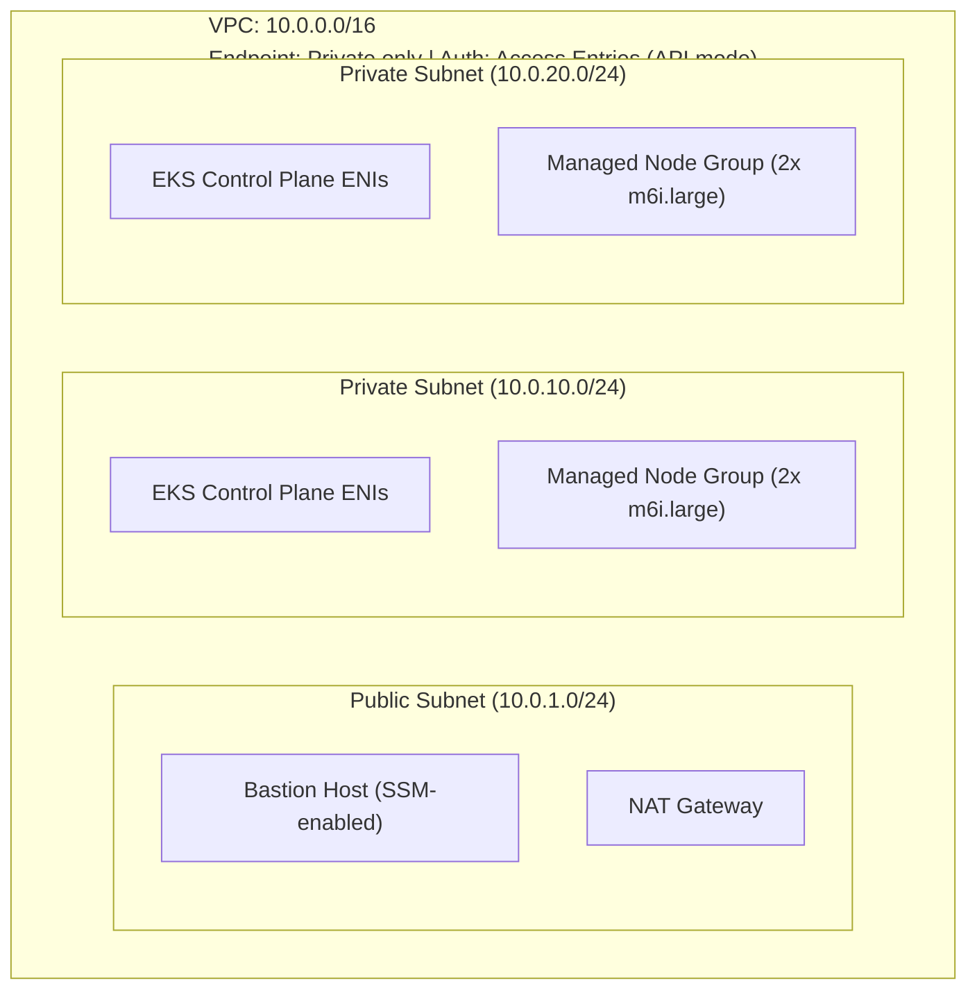

**Complexity**: [MEDIUM] | **Time to Complete**: 2.5h | **Prerequisites**: AWS Essentials, Cloud Architecture Patterns

## What You'll Be Able to Do

After completing this module, you will be able to:

- **Configure EKS clusters with private API endpoints, managed node groups, and Fargate profiles for production workloads**
- **Design EKS control plane connectivity (public, private, dual-stack) based on security and availability requirements**
- **Implement EKS Access Entries to replace the legacy aws-auth ConfigMap for cluster authentication**
- **Evaluate Managed Node Groups vs self-managed nodes vs Fargate for different workload isolation and cost profiles**

---

## Why This Module Matters

A cluster that relies only on the public API endpoint can create an unnecessary dependency on NAT or other external network paths for node-to-control-plane communication. Enabling the private endpoint keeps that traffic inside the VPC and reduces that failure mode.

This story illustrates a fundamental truth about EKS: the control plane is managed by AWS, but how you connect to it, how your nodes register with it, and how you authenticate to it are entirely your responsibility. Getting these architectural decisions wrong does not just create inconveniences -- it creates single points of failure that can take down production workloads for hours.

In this module, you will learn how the EKS control plane actually works under the hood, how to choose between public, private, and dual-stack API endpoints, when to use Managed Node Groups versus self-managed nodes versus Fargate, how EKS Add-ons simplify component lifecycle management, and how to migrate from the legacy `aws-auth` ConfigMap to the modern EKS Access Entries system.

---

## EKS Control Plane Architecture

When you create an EKS cluster, AWS provisions a highly available Kubernetes control plane that you never directly see or SSH into. Understanding what happens behind the curtain is essential for making informed architectural decisions.

### What AWS Manages For You

The EKS control plane consists of [at least two API server instances and three etcd nodes, spread across three Availability Zones](https://docs.aws.amazon.com/eks/latest/userguide/eks-architecture.html) in the AWS-owned account. You do not pay for this infrastructure directly -- it is included in the $0.10/hour cluster fee.



### Cross-Account ENIs: The Bridge

The most important architectural detail in EKS is the **cross-account Elastic Network Interface (ENI)**. When you create an EKS cluster, [AWS places ENIs from the managed control plane account into the subnets you specify in your VPC. These ENIs are how the control plane communicates with your worker nodes.](https://docs.aws.amazon.com/eks/latest/userguide/network-reqs.html)

This has critical implications:

- The subnets you provide during cluster creation must have enough free IP addresses for these ENIs
- Security Groups attached to these ENIs control traffic between the control plane and your nodes
- If you delete or modify these ENIs, your cluster will lose control plane connectivity
- The ENIs appear in your account tagged with `kubernetes.io/cluster/<cluster-name>`

```bash
# View the cross-account ENIs in your VPC
aws ec2 describe-network-interfaces \
  --filters "Name=tag:kubernetes.io/cluster/my-cluster,Values=owned" \
  --query 'NetworkInterfaces[*].{ENI:NetworkInterfaceId, SubnetId:SubnetId, PrivateIp:PrivateIpAddress, SG:Groups[0].GroupId}' \
  --output table
```

### The Cluster Security Group

EKS automatically creates a **cluster security group** that is [attached to both the cross-account ENIs and your managed node groups. This security group allows unrestricted communication between the control plane and your nodes](https://docs.aws.amazon.com/eks/latest/userguide/sec-group-reqs.html). You can find it in the cluster details:

```bash
# Retrieve the cluster security group
aws eks describe-cluster --name my-cluster \
  --query 'cluster.resourcesVpcConfig.clusterSecurityGroupId' \
  --output text
```

Do not remove or restrict this security group unless you fully understand the consequences. Misconfiguring it is one of the fastest ways to make your nodes unable to join the cluster.

> **Stop and think**: If a security group rule inadvertently blocks traffic from the worker nodes to the cross-account ENIs, what happens to the pods already running on those nodes? Do they crash immediately, or do they keep running? (Hint: Think about what the control plane actually does versus what the local kubelet does).

---

## Cluster Endpoint Access: Public, Private, or Both

The single most consequential architectural decision you make when creating an EKS cluster is how the Kubernetes API server endpoint is exposed. There are three configurations, and each has dramatically different security and connectivity characteristics.

### Public Endpoint Only (Default)

When you create an EKS cluster, [the default configuration exposes a public endpoint](https://docs.aws.amazon.com/eks/latest/userguide/cluster-endpoint.html). The API server gets a public DNS name (e.g., `https://ABCDEF1234.gr7.us-east-1.eks.amazonaws.com`) that resolves to public IP addresses.



**The problem**: Your worker nodes in private subnets must reach the API server through the public endpoint, which sends that traffic out of the VPC. This adds latency, costs money (NAT data processing fees), and creates a dependency on the NAT Gateway. If your NAT Gateway is overwhelmed or fails, your nodes lose contact with the control plane.

You can restrict the public endpoint using CIDR allowlists:

```bash
aws eks update-cluster-config --name my-cluster \
  --resources-vpc-config \
    endpointPublicAccess=true,\
    publicAccessCidrs='["203.0.113.0/24","198.51.100.0/24"]'
```

### Private Endpoint Only

With a private endpoint, the API server DNS resolves to the private IP addresses of the cross-account ENIs inside your VPC. No public endpoint exists.



**Advantages**: Node-to-control-plane traffic stays entirely within the VPC. No NAT Gateway dependency for Kubernetes operations. No public attack surface.

**Challenge**: [You cannot run `kubectl` from your laptop unless you are connected to the VPC via VPN, Direct Connect, or a bastion host](https://docs.aws.amazon.com/eks/latest/userguide/cluster-endpoint.html). CI/CD pipelines must also run inside the VPC or have network connectivity to it.

```bash
aws eks update-cluster-config --name my-cluster \
  --resources-vpc-config \
    endpointPublicAccess=false,\
    endpointPrivateAccess=true
```

### Public + Private (Recommended for Production)

[The best-practice configuration enables both endpoints](https://docs.aws.amazon.com/eks/latest/best-practices/subnets.html). Nodes use the private endpoint (traffic stays in VPC), while developers and CI/CD pipelines can use the public endpoint (optionally restricted by CIDR).



```bash
aws eks update-cluster-config --name my-cluster \
  --resources-vpc-config \
    endpointPublicAccess=true,\
    endpointPrivateAccess=true,\
    publicAccessCidrs='["203.0.113.0/24"]'
```

### Endpoint Decision Matrix

| Configuration | Node Traffic Path | kubectl Access | Security | NAT Dependency |
| :--- | :--- | :--- | :--- | :--- |
| Public only | Node -> NAT -> Internet -> API | Anywhere | Lowest | Yes (critical path) |
| Private only | Node -> ENI -> API (VPC internal) | VPN/bastion only | Highest | No |
| Public + Private | Node -> ENI -> API (VPC internal) | Anywhere (CIDR restrict) | High | No |

*War Story: The fintech failure described in the opening was exactly the "public only" pattern. When they switched to public + private with CIDR restrictions, their node fleet became completely independent of NAT Gateway health for control plane communication. The same data pipeline explosion that previously caused a four-hour outage became a non-event the next time it happened -- nodes were unaffected from a control plane communication perspective because they were talking to the control plane through the private ENIs.*

> **Pause and predict**: A developer using a laptop connected to the corporate VPN (which has a route to the VPC) tries to run `kubectl get pods` on an EKS cluster configured with a "Private Only" endpoint. Will the command succeed? Why or why not?

---

## Compute Options: Managed Node Groups vs. Self-Managed vs. Fargate

EKS gives you three fundamentally different ways to run your workloads. Each maps to a different point on the control-vs-flexibility spectrum.

### Managed Node Groups

Managed Node Groups (MNGs) are the default and most common choice. [AWS manages the EC2 instances lifecycle -- provisioning, AMI updates, draining, and termination](https://docs.aws.amazon.com/eks/latest/userguide/managed-node-groups.html) -- while you control the instance type, scaling parameters, and labels.

```bash
# Create a managed node group
aws eks create-nodegroup \
  --cluster-name my-cluster \
  --nodegroup-name standard-workers \
  --node-role arn:aws:iam::123456789012:role/EKSNodeRole \
  --subnets subnet-aaa111 subnet-bbb222 \
  --instance-types m6i.xlarge m6a.xlarge m5.xlarge \
  --scaling-config minSize=2,maxSize=10,desiredSize=3 \
  --capacity-type ON_DEMAND \
  --ami-type AL2023_x86_64_STANDARD \
  --labels environment=production,team=platform
```

Key features of MNGs:

- **Graceful updates**: When you update the AMI or instance type, MNGs cordon and drain nodes one by one, respecting PodDisruptionBudgets
- **Multiple instance types**: Specify multiple instance types to widen available capacity pools; On-Demand groups use the order you provide, and Spot groups use AWS allocation strategies such as price-capacity-optimized.
- **Automatic scaling**: Integrates with Cluster Autoscaler or Karpenter
- **Launch templates**: Customize with user data, additional security groups, or custom AMIs via launch templates

### Self-Managed Node Groups

Self-managed nodes are EC2 instances you provision yourself (usually via an Auto Scaling Group and a Launch Template) and register with the EKS cluster using the bootstrap script.

```bash
#!/bin/bash
# User data script for self-managed nodes
/etc/eks/bootstrap.sh my-cluster \
  --kubelet-extra-args '--node-labels=workload=gpu --register-with-taints=nvidia.com/gpu=:NoSchedule' \
  --container-runtime containerd
```

When to use self-managed nodes:

- You need a custom AMI with pre-baked software (e.g., GPU drivers, compliance agents)
- You require instance types not yet supported by MNGs
- You need Windows nodes with specific configurations
- You want full control over the update/drain process

The trade-off is clear: you own the entire lifecycle, including security patches, AMI updates, and drain orchestration.

### AWS Fargate

Fargate provides serverless compute for Kubernetes pods. You define a **Fargate Profile** that specifies which pods (by namespace and labels) should run on Fargate. When a matching pod is scheduled, AWS provisions a dedicated microVM for it.

```bash
# Create a Fargate profile
aws eks create-fargate-profile \
  --cluster-name my-cluster \
  --fargate-profile-name backend-services \
  --pod-execution-role-arn arn:aws:iam::123456789012:role/EKSFargatePodRole \
  --subnets subnet-aaa111 subnet-bbb222 \
  --selectors '[{"namespace":"backend","labels":{"compute":"fargate"}}]'
```

Fargate characteristics:

- **No nodes to manage**: No patching, no AMI updates, no SSH access
- **Per-pod isolation**: Each pod runs in its own Firecracker microVM
- **Cold start**: Pods on Fargate generally take noticeably longer to become ready than pods scheduled onto already-running EC2 nodes
- **Limitations**: [No DaemonSets, no privileged containers, no GPUs](https://docs.aws.amazon.com/eks/latest/userguide/fargate.html), no persistent local storage
- **Cost**: Cost depends on workload shape and operational trade-offs; Fargate can reduce node-management overhead but is not universally the cheapest option

### Compute Decision Matrix

| Feature | Managed Node Groups | Self-Managed Nodes | Fargate |
| :--- | :--- | :--- | :--- |
| **AMI updates** | AWS-managed (rolling) | You manage | N/A (serverless) |
| **DaemonSets** | Yes | Yes | No |
| **GPU support** | Yes | Yes | No |
| **Spot instances** | Yes | Yes | No |
| **Startup time** | Seconds (node exists) | Seconds (node exists) | 30-90s cold start |
| **SSH access** | Optional | Yes | No |
| **Cost model** | EC2 pricing | EC2 pricing | Per-pod vCPU+memory/sec |
| **Best for** | Most workloads | Custom/GPU/special | Batch, burstable, low-ops |

Most production clusters use a hybrid approach: Managed Node Groups for the core workload, with Fargate profiles for specific namespaces that benefit from serverless isolation (like batch jobs or tenant-isolated services).

> **Stop and think**: You have a mission-critical DaemonSet that ships logs to a central security account. You are considering migrating some of your high-burst, unpredictable web traffic to Fargate to save on over-provisioned EC2 nodes. What architectural trade-off will you immediately face regarding your logging strategy?

---

## EKS Add-ons: Managed Component Lifecycle

Every Kubernetes cluster needs certain components to function: [a CNI plugin for networking, a DNS service for service discovery, and a kube-proxy for Service routing](https://docs.aws.amazon.com/eks/latest/userguide/eks-add-ons.html). EKS Add-ons provide a managed way to install, configure, and update these components.

### Why Add-ons Matter

Before EKS Add-ons, teams installed these components using Helm charts or raw manifests. This led to version drift, forgotten upgrades, and configuration inconsistencies. EKS Add-ons solve this by:

- Tracking compatible versions for your cluster's Kubernetes version
- Providing one-click (or one-API-call) upgrades
- Preserving your custom configuration during updates
- Surfacing health status in the EKS console and API

### Core Add-ons

```bash
# List available add-ons and their versions
aws eks describe-addon-versions \
  --kubernetes-version 1.35 \
  --query 'addons[*].{Name:addonName, Latest:addonVersions[0].addonVersion}' \
  --output table
```

The essential add-ons for any EKS cluster:

| Add-on | Purpose | Default? |
| :--- | :--- | :--- |
| `vpc-cni` | Pod networking (assigns VPC IPs to pods) | Yes |
| `coredns` | Cluster DNS resolution | Yes |
| `kube-proxy` | Kubernetes Service routing rules | Yes |
| `eks-pod-identity-agent` | Pod Identity credential injection | No (but recommended) |
| `aws-ebs-csi-driver` | EBS volume provisioning | No (required for EBS PVs) |
| `aws-efs-csi-driver` | EFS volume provisioning | No (required for EFS PVs) |
| `aws-mountpoint-s3-csi-driver` | S3 mount as filesystem | No |
| `adot` | AWS Distro for OpenTelemetry | No |
| `amazon-cloudwatch-observability` | Container Insights | No |

### Installing and Updating Add-ons

```bash
# Install the EBS CSI driver add-on
aws eks create-addon \
  --cluster-name my-cluster \
  --addon-name aws-ebs-csi-driver \
  --addon-version v1.38.1-eksbuild.2 \
  --service-account-role-arn arn:aws:iam::123456789012:role/EBS-CSI-DriverRole \
  --resolve-conflicts OVERWRITE

# Check add-on status
aws eks describe-addon \
  --cluster-name my-cluster \
  --addon-name aws-ebs-csi-driver \
  --query 'addon.{Name:addonName, Version:addonVersion, Status:status, Health:health.issues}'

# Update an add-on
aws eks update-addon \
  --cluster-name my-cluster \
  --addon-name vpc-cni \
  --addon-version v1.19.2-eksbuild.1 \
  --resolve-conflicts PRESERVE
```

The `--resolve-conflicts` flag is important:

- `NONE`: Fail if your custom configuration conflicts with the add-on defaults
- `OVERWRITE`: Replace any custom configuration with add-on defaults
- [`PRESERVE`: Keep your custom configuration and only update what the add-on manages](https://docs.aws.amazon.com/eks/latest/userguide/updating-an-add-on.html)

For production, always use `PRESERVE` unless you specifically want to reset to defaults.

> **Pause and predict**: You trigger an EKS cluster upgrade from Kubernetes 1.34 to 1.35. You do not update the `vpc-cni` add-on. Several weeks later, nodes start scaling up, but new pods are stuck in `ContainerCreating`. What likely went wrong with the add-on lifecycle?

---

## Authentication: From aws-auth to EKS Access Entries

How do humans and services authenticate to an EKS cluster? This is one of the most confusing aspects of EKS, and it has undergone a major transformation. Understanding both the legacy and modern systems is essential because you will encounter both in production.

### The Legacy System: aws-auth ConfigMap

For years, EKS used a ConfigMap called `aws-auth` in the `kube-system` namespace to map AWS IAM principals (users, roles) to Kubernetes RBAC identities. This was generally a fragile arrangement.

```yaml
# The legacy aws-auth ConfigMap
apiVersion: v1
kind: ConfigMap
metadata:
  name: aws-auth
  namespace: kube-system
data:
  mapRoles: |
    - rolearn: arn:aws:iam::123456789012:role/EKSNodeRole
      username: system:node:{{EC2PrivateDNSName}}
      groups:
        - system:bootstrappers
        - system:nodes
    - rolearn: arn:aws:iam::123456789012:role/DevTeamRole
      username: dev-user
      groups:
        - dev-namespace-admin
  mapUsers: |
    - userarn: arn:aws:iam::123456789012:user/admin
      username: cluster-admin
      groups:
        - system:masters
```

Problems with `aws-auth`:

1. **Single point of failure**: One YAML syntax error in this ConfigMap [locks everyone out of the cluster (except the cluster creator)](https://docs.aws.amazon.com/eks/latest/userguide/auth-configmap.html)
2. **No audit trail**: Changes to a ConfigMap are not logged in AWS CloudTrail
3. **Race conditions**: Multiple engineers editing simultaneously can overwrite each other's changes
4. **No API management**: You cannot manage it through the AWS API -- only through `kubectl`
5. **Easy to break**: A misplaced space in YAML can corrupt the entire mapping

Directly editing `aws-auth` is risky: a bad change can break IAM-to-RBAC mappings and leave teams scrambling to recover access. Moving to access entries reduces that operational risk.

### The Modern System: EKS Access Entries

[Introduced in late 2023, EKS Access Entries](https://aws.amazon.com/about-aws/whats-new/2023/12/amazon-eks-controls-iam-cluster-access-management/) move authentication configuration out of a fragile ConfigMap and into the EKS API itself. This means you manage access using AWS API calls, with CloudTrail logging, IAM policy guardrails, and no risk of YAML-induced lockouts.

```bash
# Create an access entry for an IAM role
aws eks create-access-entry \
  --cluster-name my-cluster \
  --principal-arn arn:aws:iam::123456789012:role/DevTeamRole \
  --type STANDARD

# Associate an access policy (predefined RBAC)
aws eks associate-access-policy \
  --cluster-name my-cluster \
  --principal-arn arn:aws:iam::123456789012:role/DevTeamRole \
  --policy-arn arn:aws:eks::aws:cluster-access-policy/AmazonEKSViewPolicy \
  --access-scope type=namespace,namespaces=dev,staging
```

### Access Policy Types

EKS provides [several predefined access policies](https://docs.aws.amazon.com/eks/latest/userguide/access-policies.html) that map to common Kubernetes RBAC configurations:

| Access Policy | Equivalent RBAC | Scope |
| :--- | :--- | :--- |
| `AmazonEKSClusterAdminPolicy` | `cluster-admin` ClusterRole | Cluster-wide |
| `AmazonEKSAdminPolicy` | `admin` ClusterRole | Namespace or cluster |
| `AmazonEKSEditPolicy` | `edit` ClusterRole | Namespace or cluster |
| `AmazonEKSViewPolicy` | `view` ClusterRole | Namespace or cluster |

### Authentication Modes

EKS clusters support three authentication modes:

```bash
# Check current authentication mode
aws eks describe-cluster --name my-cluster \
  --query 'cluster.accessConfig.authenticationMode'
```

| Mode | aws-auth | Access Entries | Migration Path |
| :--- | :--- | :--- | :--- |
| `CONFIG_MAP` | Active | Disabled | Legacy only |
| `API_AND_CONFIG_MAP` | Active | Active | Transitional (recommended first step) |
| `API` | Disabled | Active | Target state |

### Migration Path: aws-auth to Access Entries

The migration is non-destructive and can be done incrementally:

```bash
# Step 1: Switch to API_AND_CONFIG_MAP mode (both systems active)
aws eks update-cluster-config --name my-cluster \
  --access-config authenticationMode=API_AND_CONFIG_MAP

# Step 2: Create access entries for all existing aws-auth mappings
# For each role in your aws-auth ConfigMap:
aws eks create-access-entry \
  --cluster-name my-cluster \
  --principal-arn arn:aws:iam::123456789012:role/DevTeamRole \
  --type STANDARD

aws eks associate-access-policy \
  --cluster-name my-cluster \
  --principal-arn arn:aws:iam::123456789012:role/DevTeamRole \
  --policy-arn arn:aws:eks::aws:cluster-access-policy/AmazonEKSEditPolicy \
  --access-scope type=namespace,namespaces=dev

# Step 3: Test that access works through the new system
# (Users should be able to authenticate without aws-auth)

# Step 4: Once verified, switch to API-only mode
aws eks update-cluster-config --name my-cluster \
  --access-config authenticationMode=API

# Step 5: Clean up the aws-auth ConfigMap
kubectl delete configmap aws-auth -n kube-system
```

> **Important**: [You cannot go backwards. Once you switch from `API_AND_CONFIG_MAP` to `API`, you cannot re-enable the ConfigMap.](https://docs.aws.amazon.com/eks/latest/userguide/setting-up-access-entries.html) Test thoroughly in the transitional mode before making the final switch.

> **Stop and think**: Your team is in the [`API_AND_CONFIG_MAP` transitional mode](https://docs.aws.amazon.com/eks/latest/userguide/migrating-access-entries.html). A developer deletes the `aws-auth` ConfigMap prematurely to "clean up." Can the team still access the cluster? What determines their access?

---

## Did You Know?

1. The EKS control plane runs in an AWS-owned account, not yours. [The $0.10/hour cluster fee](https://aws.amazon.com/eks/pricing/) covers at least two API server instances and three etcd nodes spread across three Availability Zones. AWS auto-scales the control plane based on the number of nodes and API request rate -- you generally do not need to "right-size" the control plane yourself. A cluster with 5 nodes and one with 5,000 nodes both cost $0.10/hour for the control plane itself.

2. The cross-account ENIs that EKS places in your VPC use IP addresses from your subnet CIDR range. Each ENI consumes one IP address per subnet. If you create a cluster with 2 subnets, you lose 2 IPs to control plane ENIs. In tightly sized subnets (like a `/28` with only 11 usable IPs), this can matter. AWS requires each cluster subnet to have at least six free IP addresses and recommends at least 16; plan larger subnets when your node and Pod density require them.

3. When you enable the private endpoint, [EKS creates a Route 53 private hosted zone associated with your VPC](https://docs.aws.amazon.com/eks/latest/userguide/cluster-endpoint.html). The cluster's DNS name (e.g., `ABCDEF1234.gr7.us-east-1.eks.amazonaws.com`) resolves to the private ENI IP addresses when queried from within the VPC, and to the public IP addresses when queried from the internet. This split-horizon DNS is automatic and invisible to most users.

4. The `aws-auth` ConfigMap shipped with early EKS releases and remained the primary IAM-to-RBAC integration mechanism until AWS introduced access entries in December 2023. The lesson: temporary solutions in infrastructure have a habit of becoming permanent.

---

## Common Mistakes

| Mistake | Why It Happens | How to Fix It |
| :--- | :--- | :--- |
| **Public endpoint only with no CIDR restriction** | It is the default configuration and "just works" for getting started. | Enable the private endpoint and add CIDR allowlists to the public endpoint. At minimum, restrict to your corporate IP ranges. |
| **Deleting or modifying cross-account ENIs** | Engineers see unfamiliar ENIs in their VPC and clean them up. | Tag-based policies to prevent deletion. Educate the team that ENIs tagged `kubernetes.io/cluster/<name>` are critical infrastructure. |
| **Editing aws-auth ConfigMap without backup** | Quick changes under pressure. One typo and the entire cluster is inaccessible. | Migrate to Access Entries. If still using aws-auth, make a backup such as `kubectl get configmap aws-auth -n kube-system -o yaml > aws-auth-backup.yaml` before editing. |
| **Using a single node group for all workloads** | Simplicity bias. One size fits all seems easier to manage. | Create purpose-specific node groups: general (m-type), memory-optimized (r-type), compute (c-type). Use node selectors and taints to route pods correctly. |
| **Fargate for DaemonSet-dependent workloads** | Not understanding Fargate limitations before choosing it. | Check if your workloads need DaemonSets (logging agents, monitoring, service mesh sidecars). If yes, use MNGs or self-managed nodes for those workloads. |
| **Not setting up the EKS Pod Identity agent** | Assuming IRSA is sufficient, not knowing the newer option exists. | Install the `eks-pod-identity-agent` add-on. [Pod Identity is simpler to configure and eliminates OIDC provider management.](https://docs.aws.amazon.com/eks/latest/best-practices/identity-and-access-management.html) See Module 5.3 for the full migration. |
| **Forgetting to update add-ons after cluster upgrade** | Upgrading the Kubernetes version but leaving add-ons on old versions. | [After every cluster version upgrade, check and update all add-ons to compatible versions.](https://docs.aws.amazon.com/eks/latest/userguide/updating-an-add-on.html) Incompatible add-on versions can cause networking or DNS failures. |
| **Cluster subnets too small** | Using `/28` or `/27` subnets for EKS without accounting for ENI consumption. | Use at least `/24` subnets for EKS clusters. Account for cross-account ENIs, pod IPs (VPC CNI), and node IPs. |

---

## Quiz

<details>
<summary>Question 1: Your EKS cluster has both public and private endpoints enabled. A worker node in a private subnet needs to communicate with the Kubernetes API server. Which endpoint does it use, and why does this matter for cost?</summary>

The worker node uses the **private endpoint** via the cross-account ENIs inside the VPC. The cluster DNS name resolves to the private ENI IP addresses when queried from within the VPC (split-horizon DNS). This matters for cost because the traffic stays entirely within the VPC and does not traverse the NAT Gateway. With a public-only endpoint, the same traffic would go through the NAT Gateway, incurring data processing charges ($0.045/GB) and creating a dependency on NAT Gateway availability.
</details>

<details>
<summary>Question 2: Your platform team is under a tight deadline to deprecate legacy infrastructure. An engineer proposes updating the EKS cluster directly from `CONFIG_MAP` mode to `API` mode to save time and immediately delete the `aws-auth` ConfigMap. Should you approve this plan?</summary>

**No, you should not approve this plan.** You must first transition the cluster to `API_AND_CONFIG_MAP` mode, which enables both authentication systems simultaneously. In this transitional mode, your team must create Access Entries for all existing IAM-to-Kubernetes mappings and verify they function correctly alongside the legacy system. Only after thorough testing confirms that users and CI/CD pipelines can authenticate via the API should you switch to `API` mode. This is a one-way migration; once you move to `API` mode, you cannot re-enable the ConfigMap, meaning a premature switch risks locking all users out of the cluster permanently.
</details>

<details>
<summary>Question 3: An automated cleanup script in your AWS account identifies several ENIs without attached EC2 instances and deletes them. These ENIs were tagged with `kubernetes.io/cluster/production`. What is the immediate impact on your production EKS cluster?</summary>

Deleting these cross-account ENIs immediately severs the network connection between the EKS control plane (in the AWS-managed account) and your worker nodes. Nodes will be unable to reach the API server, meaning the kubelet will stop receiving pod scheduling instructions and cannot report node health. Existing pods will continue running and serving traffic as long as they do not require control plane interaction, but the cluster cannot be managed or scaled. The cluster will appear healthy in the EKS console because the control plane itself is unharmed, but `kubectl` commands executing through the private endpoint will time out. AWS will eventually recreate the missing ENIs automatically, but the disruption can last several minutes and severely impact deployment pipelines.
</details>

<details>
<summary>Question 4: A team wants zero-operational-overhead Kubernetes. They plan to run their entire application (15 microservices) on Fargate. Their architecture includes a Datadog agent DaemonSet, Istio service mesh, and a Redis StatefulSet with local SSD storage. Will this work?</summary>

**No, this architecture will not work on Fargate.** Fargate operates as a serverless compute engine and fundamentally does not support DaemonSets, meaning the Datadog agent cannot be deployed as a node-level background process. Furthermore, Fargate does not support privileged containers, which are strictly required by some Istio service mesh init components to configure iptables routing rules. Finally, Fargate does not provide local persistent storage options, making a Redis StatefulSet dependent on local SSDs impossible to deploy. The team must redesign their architecture to use Managed Node Groups for these specific workloads, or adopt a sidecar-based approach for logging and routing if they insist on a purely serverless environment.
</details>

<details>
<summary>Question 5: After successfully upgrading your production EKS cluster's control plane from Kubernetes v1.34 to v1.35, the application teams report that their newly scheduled pods are crashing with `CrashLoopBackOff`. Upon inspection, you find that the pods are unable to resolve internal service names. What is the most likely cause of this specific failure?</summary>

The most likely cause is that the CoreDNS add-on was not updated after the cluster control plane upgrade. When you upgrade the Kubernetes version of an EKS cluster, managed add-ons like CoreDNS, VPC CNI, and kube-proxy are not automatically upgraded alongside the control plane. If the running CoreDNS version becomes deprecated or strictly incompatible with the new Kubernetes API version, DNS resolution within the cluster can fail or silently degrade. To resolve this issue, you should promptly update the CoreDNS add-on to a version explicitly tested and compatible with Kubernetes 1.35. As a best practice, review and update EKS add-ons to their compatible versions soon after any cluster version upgrade.
</details>

<details>
<summary>Question 6: A security auditor notices two different types of security groups attached to your EKS cluster configuration: the "cluster security group" and several "additional security groups." The auditor demands to know why the cluster security group has rules allowing all traffic between nodes and the control plane, and asks you to lock it down. How do you explain the architectural difference and defend the configuration?</summary>

The **cluster security group** is a foundational networking component automatically created and managed by EKS, explicitly designed to be attached to both the cross-account ENIs and your managed node groups. It contains default rules allowing unrestricted communication between the control plane and nodes, and modifying or restricting these rules is highly dangerous as it can easily break node registration and pod networking. In contrast, **additional security groups** are custom groups you optionally specify during cluster creation that are attached *only* to the cross-account ENIs, not to the worker nodes. You use these additional security groups to provide granular, restrictive control over what non-node external traffic (such as requests from a bastion host or corporate VPN) is allowed to reach the Kubernetes API server endpoints. Therefore, the cluster security group must remain open to facilitate internal cluster operations, while the additional security groups are the correct mechanism for satisfying the auditor's request to restrict administrative access.
</details>

<details>
<summary>Question 7: Your company requires that the Kubernetes API server is never accessible from the public internet. However, your CI/CD pipeline runs on GitHub Actions (outside your VPC). How can you satisfy both requirements?</summary>

To satisfy the security requirement, you must configure the EKS cluster with only the **private endpoint** enabled, completely removing the public attack surface. Because the API server DNS now resolves exclusively to internal VPC IP addresses, external CI/CD platforms like GitHub Actions cannot reach the cluster over the public internet. To bridge this gap, you must establish private connectivity by running self-hosted GitHub Actions runners directly on EC2 instances inside your VPC. Alternatively, you could utilize AWS PrivateLink or establish a site-to-site VPN connection between the external CI/CD network and your AWS environment. The critical architectural principle here is that securing the cluster behind a private endpoint shifts the burden of connectivity to the client, requiring you to bring your deployment tools into the private network boundary.
</details>

---

## Hands-On Exercise: Private Endpoint Cluster with Bastion and Access Entries Migration

In this exercise, you will create a production-grade EKS cluster with a private endpoint, set up a bastion host for access, and migrate authentication from `aws-auth` to EKS Access Entries.

**What you will build:**



### Task 1: Create the VPC Infrastructure

Set up the networking foundation for the private cluster.

<details>
<summary>Solution</summary>

```bash
# Create VPC
VPC_ID=$(aws ec2 create-vpc --cidr-block 10.0.0.0/16 --query 'Vpc.VpcId' --output text)
aws ec2 create-tags --resources $VPC_ID --tags Key=Name,Value=EKS-Private-VPC
aws ec2 modify-vpc-attribute --vpc-id $VPC_ID --enable-dns-hostnames '{"Value":true}'
aws ec2 modify-vpc-attribute --vpc-id $VPC_ID --enable-dns-support '{"Value":true}'

# Create subnets
PUB_SUB=$(aws ec2 create-subnet --vpc-id $VPC_ID --cidr-block 10.0.1.0/24 \
  --availability-zone us-east-1a --query 'Subnet.SubnetId' --output text)
PRIV_SUB1=$(aws ec2 create-subnet --vpc-id $VPC_ID --cidr-block 10.0.10.0/24 \
  --availability-zone us-east-1a --query 'Subnet.SubnetId' --output text)
PRIV_SUB2=$(aws ec2 create-subnet --vpc-id $VPC_ID --cidr-block 10.0.20.0/24 \
  --availability-zone us-east-1b --query 'Subnet.SubnetId' --output text)

# Tag subnets for EKS
aws ec2 create-tags --resources $PUB_SUB --tags Key=Name,Value=Public-Subnet
aws ec2 create-tags --resources $PRIV_SUB1 --tags Key=Name,Value=Private-Subnet-AZ1 \
  Key=kubernetes.io/role/internal-elb,Value=1
aws ec2 create-tags --resources $PRIV_SUB2 --tags Key=Name,Value=Private-Subnet-AZ2 \
  Key=kubernetes.io/role/internal-elb,Value=1

# Internet Gateway for public subnet
IGW_ID=$(aws ec2 create-internet-gateway --query 'InternetGateway.InternetGatewayId' --output text)
aws ec2 attach-internet-gateway --vpc-id $VPC_ID --internet-gateway-id $IGW_ID

# Public route table
PUB_RT=$(aws ec2 create-route-table --vpc-id $VPC_ID --query 'RouteTable.RouteTableId' --output text)
aws ec2 create-route --route-table-id $PUB_RT --destination-cidr-block 0.0.0.0/0 --gateway-id $IGW_ID
aws ec2 associate-route-table --subnet-id $PUB_SUB --route-table-id $PUB_RT
aws ec2 modify-subnet-attribute --subnet-id $PUB_SUB --map-public-ip-on-launch

# NAT Gateway for private subnets
EIP_ALLOC=$(aws ec2 allocate-address --domain vpc --query 'AllocationId' --output text)
NAT_ID=$(aws ec2 create-nat-gateway --subnet-id $PUB_SUB --allocation-id $EIP_ALLOC \
  --query 'NatGateway.NatGatewayId' --output text)
aws ec2 wait nat-gateway-available --nat-gateway-ids $NAT_ID

# Private route table
PRIV_RT=$(aws ec2 create-route-table --vpc-id $VPC_ID --query 'RouteTable.RouteTableId' --output text)
aws ec2 create-route --route-table-id $PRIV_RT --destination-cidr-block 0.0.0.0/0 --nat-gateway-id $NAT_ID
aws ec2 associate-route-table --subnet-id $PRIV_SUB1 --route-table-id $PRIV_RT
aws ec2 associate-route-table --subnet-id $PRIV_SUB2 --route-table-id $PRIV_RT

# Checkpoint: Verify VPC is available
aws ec2 describe-vpcs --vpc-ids $VPC_ID --query 'Vpcs[0].State' --output text

echo "VPC: $VPC_ID | Public: $PUB_SUB | Private: $PRIV_SUB1, $PRIV_SUB2"
```

</details>

### Task 2: Create the EKS Cluster with Private Endpoint

Create the cluster with only the private API endpoint enabled.

<details>
<summary>Solution</summary>

```bash
# Create the EKS cluster role (if not already exists)
cat > /tmp/eks-trust-policy.json << 'POLICY'
{
  "Version": "2012-10-17",
  "Statement": [{
    "Effect": "Allow",
    "Principal": {"Service": "eks.amazonaws.com"},
    "Action": "sts:AssumeRole"
  }]
}
POLICY

EKS_ROLE_ARN=$(aws iam create-role \
  --role-name EKS-Cluster-Role \
  --assume-role-policy-document file:///tmp/eks-trust-policy.json \
  --query 'Role.Arn' --output text)
aws iam attach-role-policy --role-name EKS-Cluster-Role \
  --policy-arn arn:aws:iam::aws:policy/AmazonEKSClusterPolicy

# Create the EKS cluster with private endpoint
aws eks create-cluster \
  --name dojo-private-cluster \
  --role-arn $EKS_ROLE_ARN \
  --resources-vpc-config \
    subnetIds=$PRIV_SUB1,$PRIV_SUB2,\
endpointPublicAccess=false,\
endpointPrivateAccess=true \
  --kubernetes-version 1.35 \
  --access-config authenticationMode=API_AND_CONFIG_MAP

echo "Cluster creation initiated. This takes 10-15 minutes."
aws eks wait cluster-active --name dojo-private-cluster
echo "Cluster is active."

# Create the EKS node role
cat > /tmp/node-trust-policy.json << 'POLICY'
{
  "Version": "2012-10-17",
  "Statement": [{
    "Effect": "Allow",
    "Principal": {"Service": "ec2.amazonaws.com"},
    "Action": "sts:AssumeRole"
  }]
}
POLICY

NODE_ROLE_ARN=$(aws iam create-role \
  --role-name EKS-Node-Role \
  --assume-role-policy-document file:///tmp/node-trust-policy.json \
  --query 'Role.Arn' --output text)
aws iam attach-role-policy --role-name EKS-Node-Role --policy-arn arn:aws:iam::aws:policy/AmazonEKSWorkerNodePolicy
aws iam attach-role-policy --role-name EKS-Node-Role --policy-arn arn:aws:iam::aws:policy/AmazonEC2ContainerRegistryReadOnly
aws iam attach-role-policy --role-name EKS-Node-Role --policy-arn arn:aws:iam::aws:policy/AmazonEKS_CNI_Policy

# Create managed node group
aws eks create-nodegroup \
  --cluster-name dojo-private-cluster \
  --nodegroup-name standard-workers \
  --node-role $NODE_ROLE_ARN \
  --subnets $PRIV_SUB1 $PRIV_SUB2 \
  --instance-types m6i.large \
  --scaling-config minSize=2,maxSize=2,desiredSize=2

echo "Node group creation initiated. This takes 3-5 minutes."
aws eks wait nodegroup-active --cluster-name dojo-private-cluster --nodegroup-name standard-workers
echo "Node group is active."
```

</details>

### Task 3: Deploy a Bastion Host with SSM Access

Since the API server is private, you need a way to reach it from within the VPC.

<details>
<summary>Solution</summary>

```bash
# Create an IAM role for the bastion with SSM access
cat > /tmp/bastion-trust.json << 'POLICY'
{
  "Version": "2012-10-17",
  "Statement": [{
    "Effect": "Allow",
    "Principal": {"Service": "ec2.amazonaws.com"},
    "Action": "sts:AssumeRole"
  }]
}
POLICY

aws iam create-role --role-name EKS-Bastion-Role \
  --assume-role-policy-document file:///tmp/bastion-trust.json
aws iam attach-role-policy --role-name EKS-Bastion-Role \
  --policy-arn arn:aws:iam::aws:policy/AmazonSSMManagedInstanceCore
aws iam put-role-policy --role-name EKS-Bastion-Role \
  --policy-name EKSDescribeCluster \
  --policy-document '{"Version":"2012-10-17","Statement":[{"Effect":"Allow","Action":"eks:DescribeCluster","Resource":"*"}]}'
aws iam create-instance-profile --instance-profile-name EKS-Bastion-Profile
aws iam add-role-to-instance-profile \
  --instance-profile-name EKS-Bastion-Profile \
  --role-name EKS-Bastion-Role

# Create a security group for the bastion (no inbound SSH needed with SSM)
BASTION_SG=$(aws ec2 create-security-group \
  --group-name Bastion-SG \
  --description "Bastion host - SSM only, no SSH" \
  --vpc-id $VPC_ID \
  --query 'GroupId' --output text)

# Allow Bastion to access the EKS Control Plane
CLUSTER_SG=$(aws eks describe-cluster --name dojo-private-cluster --query 'cluster.resourcesVpcConfig.clusterSecurityGroupId' --output text)
aws ec2 authorize-security-group-ingress \
  --group-id $CLUSTER_SG \
  --protocol tcp \
  --port 443 \
  --source-group $BASTION_SG

# Launch the bastion in the public subnet
BASTION_ID=$(aws ec2 run-instances \
  --image-id resolve:ssm:/aws/service/ami-amazon-linux-latest/al2023-ami-kernel-6.1-x86_64 \
  --instance-type t3.small \
  --subnet-id $PUB_SUB \
  --security-group-ids $BASTION_SG \
  --iam-instance-profile Name=EKS-Bastion-Profile \
  --tag-specifications 'ResourceType=instance,Tags=[{Key=Name,Value=EKS-Bastion}]' \
  --user-data '#!/bin/bash
curl -LO "https://dl.k8s.io/release/$(curl -L -s https://dl.k8s.io/release/stable.txt)/bin/linux/amd64/kubectl"
chmod +x kubectl && mv kubectl /usr/local/bin/
curl -LO "https://github.com/weaveworks/eksctl/releases/latest/download/eksctl_Linux_amd64.tar.gz"
tar xzf eksctl_Linux_amd64.tar.gz && mv eksctl /usr/local/bin/
' \
  --query 'Instances[0].InstanceId' --output text)

echo "Waiting for bastion instance to be ready..."
aws ec2 wait instance-status-ok --instance-ids $BASTION_ID

# Checkpoint: Verify Bastion state
aws ec2 describe-instances --instance-ids $BASTION_ID --query 'Reservations[0].Instances[0].State.Name' --output text

echo "Bastion instance: $BASTION_ID"
echo "Connect via: aws ssm start-session --target $BASTION_ID"
```

</details>

### Task 4: Configure Access Entries for Multiple Teams

Create access entries that give different teams appropriate permissions.

<details>
<summary>Solution</summary>

```bash
# Create IAM roles for the teams so the access entries have valid principals
cat > /tmp/team-trust.json << 'POLICY'
{
  "Version": "2012-10-17",
  "Statement": [{
    "Effect": "Allow",
    "Principal": {"Service": "ec2.amazonaws.com"},
    "Action": "sts:AssumeRole"
  }]
}
POLICY
aws iam create-role --role-name DevTeamRole --assume-role-policy-document file:///tmp/team-trust.json
aws iam create-role --role-name SecurityAuditRole --assume-role-policy-document file:///tmp/team-trust.json

CLUSTER_NAME="dojo-private-cluster"

# Grant the bastion role cluster-admin access
aws eks create-access-entry \
  --cluster-name $CLUSTER_NAME \
  --principal-arn arn:aws:iam::$(aws sts get-caller-identity --query Account --output text):role/EKS-Bastion-Role \
  --type STANDARD

aws eks associate-access-policy \
  --cluster-name $CLUSTER_NAME \
  --principal-arn arn:aws:iam::$(aws sts get-caller-identity --query Account --output text):role/EKS-Bastion-Role \
  --policy-arn arn:aws:eks::aws:cluster-access-policy/AmazonEKSClusterAdminPolicy \
  --access-scope type=cluster

# Create a dev team entry with namespace-scoped edit access
aws eks create-access-entry \
  --cluster-name $CLUSTER_NAME \
  --principal-arn arn:aws:iam::$(aws sts get-caller-identity --query Account --output text):role/DevTeamRole \
  --type STANDARD

aws eks associate-access-policy \
  --cluster-name $CLUSTER_NAME \
  --principal-arn arn:aws:iam::$(aws sts get-caller-identity --query Account --output text):role/DevTeamRole \
  --policy-arn arn:aws:eks::aws:cluster-access-policy/AmazonEKSEditPolicy \
  --access-scope type=namespace,namespaces=dev,staging

# Create a read-only entry for the security team
aws eks create-access-entry \
  --cluster-name $CLUSTER_NAME \
  --principal-arn arn:aws:iam::$(aws sts get-caller-identity --query Account --output text):role/SecurityAuditRole \
  --type STANDARD

aws eks associate-access-policy \
  --cluster-name $CLUSTER_NAME \
  --principal-arn arn:aws:iam::$(aws sts get-caller-identity --query Account --output text):role/SecurityAuditRole \
  --policy-arn arn:aws:eks::aws:cluster-access-policy/AmazonEKSViewPolicy \
  --access-scope type=cluster

# List all access entries
aws eks list-access-entries --cluster-name $CLUSTER_NAME --output table
```

</details>

### Task 5: Complete the Migration to API-Only Authentication

Switch the cluster to use only Access Entries, removing the aws-auth dependency.

<details>
<summary>Solution</summary>

```bash
# Verify all access entries are working by connecting via bastion
aws ssm start-session --target $BASTION_ID

# (On the bastion host)
aws eks update-kubeconfig --name dojo-private-cluster --region us-east-1
kubectl get nodes  # Should return the managed node group nodes
kubectl auth whoami  # Should show the bastion role identity

# Exit the bastion session, then switch to API-only mode
UPDATE_ID=$(aws eks update-cluster-config \
  --name dojo-private-cluster \
  --access-config authenticationMode=API \
  --query 'update.id' --output text)

# Wait for the update to complete
echo "Waiting for authentication mode update (this takes a few minutes)..."
while aws eks describe-update --name dojo-private-cluster --update-id $UPDATE_ID --query 'update.status' --output text | grep -q 'InProgress'; do
  sleep 15
done

# Verify the authentication mode
aws eks describe-cluster --name dojo-private-cluster \
  --query 'cluster.accessConfig.authenticationMode'
# Expected output: "API"

echo "Migration complete. aws-auth ConfigMap is no longer used."
```

</details>

### Task 6: Verify and Audit the Configuration

Confirm the cluster is correctly configured and document the setup.

<details>
<summary>Solution</summary>

```bash
CLUSTER_NAME="dojo-private-cluster"

# Verify endpoint configuration
aws eks describe-cluster --name $CLUSTER_NAME \
  --query 'cluster.resourcesVpcConfig.{PublicAccess:endpointPublicAccess, PrivateAccess:endpointPrivateAccess, SecurityGroupIds:securityGroupIds, SubnetIds:subnetIds}' \
  --output table

# Verify authentication mode
aws eks describe-cluster --name $CLUSTER_NAME \
  --query 'cluster.accessConfig'

# List all access entries with their policies
for arn in $(aws eks list-access-entries --cluster-name $CLUSTER_NAME --query 'accessEntries[]' --output text); do
  echo "=== $arn ==="
  aws eks list-associated-access-policies \
    --cluster-name $CLUSTER_NAME \
    --principal-arn "$arn" \
    --query 'associatedAccessPolicies[*].{Policy:policyArn, Scope:accessScope.type}' \
    --output table
done

# Check the cross-account ENIs
aws ec2 describe-network-interfaces \
  --filters "Name=tag:kubernetes.io/cluster/$CLUSTER_NAME,Values=owned" \
  --query 'NetworkInterfaces[*].{ENI:NetworkInterfaceId, PrivateIp:PrivateIpAddress, Subnet:SubnetId}' \
  --output table
```

</details>

### Clean Up

```bash
# Delete in reverse order
aws eks delete-nodegroup --cluster-name dojo-private-cluster --nodegroup-name standard-workers
aws eks wait nodegroup-deleted --cluster-name dojo-private-cluster --nodegroup-name standard-workers
aws eks delete-cluster --name dojo-private-cluster
aws eks wait cluster-deleted --name dojo-private-cluster
aws ec2 terminate-instances --instance-ids $BASTION_ID
aws iam detach-role-policy --role-name EKS-Node-Role --policy-arn arn:aws:iam::aws:policy/AmazonEKSWorkerNodePolicy
aws iam detach-role-policy --role-name EKS-Node-Role --policy-arn arn:aws:iam::aws:policy/AmazonEC2ContainerRegistryReadOnly
aws iam detach-role-policy --role-name EKS-Node-Role --policy-arn arn:aws:iam::aws:policy/AmazonEKS_CNI_Policy
aws iam delete-role --role-name EKS-Node-Role
aws iam delete-role --role-name DevTeamRole
aws iam delete-role --role-name SecurityAuditRole
aws iam remove-role-from-instance-profile --instance-profile-name EKS-Bastion-Profile --role-name EKS-Bastion-Role
aws iam delete-instance-profile --instance-profile-name EKS-Bastion-Profile
aws iam detach-role-policy --role-name EKS-Bastion-Role --policy-arn arn:aws:iam::aws:policy/AmazonSSMManagedInstanceCore
aws iam delete-role-policy --role-name EKS-Bastion-Role --policy-name EKSDescribeCluster
aws iam delete-role --role-name EKS-Bastion-Role
aws iam detach-role-policy --role-name EKS-Cluster-Role --policy-arn arn:aws:iam::aws:policy/AmazonEKSClusterPolicy
aws iam delete-role --role-name EKS-Cluster-Role
# Then clean up VPC resources (NAT GW, subnets, IGW, VPC) as in the VPC module
```

### Success Criteria

- [ ] I created an EKS cluster with the private API endpoint only
- [ ] I deployed a bastion host with SSM access (no SSH key required)
- [ ] I connected to the cluster from the bastion using `kubectl`
- [ ] I created Access Entries for three different team roles with appropriate scope
- [ ] I migrated the cluster from `API_AND_CONFIG_MAP` to `API` authentication mode
- [ ] I verified the cross-account ENIs exist in my private subnets
- [ ] I can explain why private endpoint eliminates NAT Gateway dependency for control plane traffic

---

## Next Module

With the EKS architecture foundation in place, it is time to dive deep into how pods get their IP addresses and how traffic flows. Head to [Module 5.2: EKS Networking Deep Dive (VPC CNI)](../module-5.2-eks-networking/) to master prefix delegation, IP exhaustion solutions, and the AWS Load Balancer Controller.

## Sources

- [docs.aws.amazon.com: eks architecture.html](https://docs.aws.amazon.com/eks/latest/userguide/eks-architecture.html) — AWS documents this exact control-plane layout in the EKS architecture guide.
- [aws.amazon.com: pricing](https://aws.amazon.com/eks/pricing/) — AWS pricing currently lists standard Kubernetes version support at $0.10 per cluster per hour.
- [docs.aws.amazon.com: network reqs.html](https://docs.aws.amazon.com/eks/latest/userguide/network-reqs.html) — AWS explicitly documents the 2-4 interfaces and their communication role.
- [docs.aws.amazon.com: sec group reqs.html](https://docs.aws.amazon.com/eks/latest/userguide/sec-group-reqs.html) — The EKS security group requirements page states these associations and default rules directly.
- [docs.aws.amazon.com: cluster endpoint.html](https://docs.aws.amazon.com/eks/latest/userguide/cluster-endpoint.html) — AWS documents public endpoint access as the default and describes the public-only traffic path.
- [docs.aws.amazon.com: subnets.html](https://docs.aws.amazon.com/eks/latest/best-practices/subnets.html) — The EKS subnet best-practices guide recommends public-and-private mode with restricted public CIDRs.
- [docs.aws.amazon.com: managed node groups.html](https://docs.aws.amazon.com/eks/latest/userguide/managed-node-groups.html) — AWS documents automated lifecycle management, draining behavior, and PDB handling for managed node groups.
- [docs.aws.amazon.com: fargate.html](https://docs.aws.amazon.com/eks/latest/userguide/fargate.html) — AWS documents per-pod VM isolation and these specific Fargate limitations.
- [docs.aws.amazon.com: updating an add on.html](https://docs.aws.amazon.com/eks/latest/userguide/updating-an-add-on.html) — AWS says add-ons are not auto-updated and that compatibility should be verified before updating.
- [docs.aws.amazon.com: eks add ons.html](https://docs.aws.amazon.com/eks/latest/userguide/eks-add-ons.html) — AWS documents the default self-managed add-ons and the broader curated add-on catalog separately.
- [docs.aws.amazon.com: auth configmap.html](https://docs.aws.amazon.com/eks/latest/userguide/auth-configmap.html) — The aws-auth documentation states both the deprecation and the hidden cluster-creator access behavior.
- [aws.amazon.com: amazon eks controls iam cluster access management](https://aws.amazon.com/about-aws/whats-new/2023/12/amazon-eks-controls-iam-cluster-access-management/) — AWS's launch announcement gives the date and describes the API-based access-management feature.
- [docs.aws.amazon.com: access policies.html](https://docs.aws.amazon.com/eks/latest/userguide/access-policies.html) — The access-policies guide lists these predefined EKS access-policy names.
- [docs.aws.amazon.com: migrating access entries.html](https://docs.aws.amazon.com/eks/latest/userguide/migrating-access-entries.html) — AWS states this precedence rule explicitly in the migration guide.
- [docs.aws.amazon.com: setting up access entries.html](https://docs.aws.amazon.com/eks/latest/userguide/setting-up-access-entries.html) — AWS documents this one-way authentication-mode restriction directly.
- [docs.aws.amazon.com: identity and access management.html](https://docs.aws.amazon.com/eks/latest/best-practices/identity-and-access-management.html) — AWS best-practices documentation describes Pod Identity as an agent-based feature that removes per-cluster OIDC setup.
