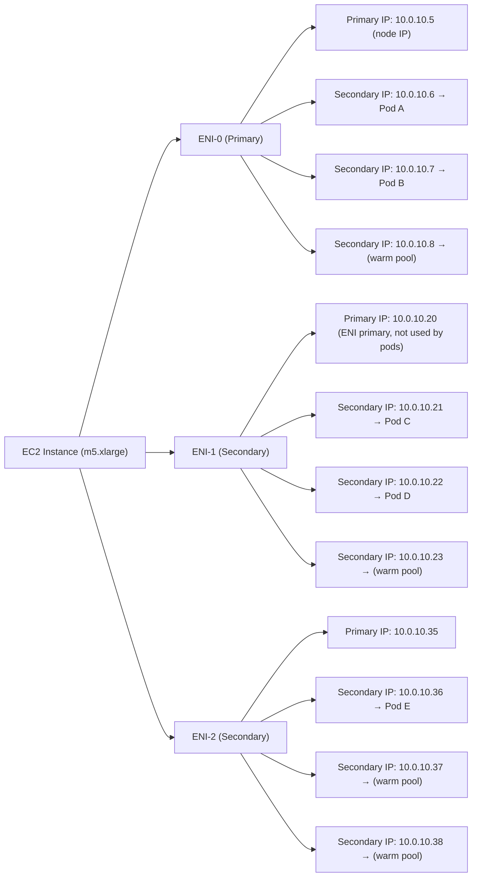
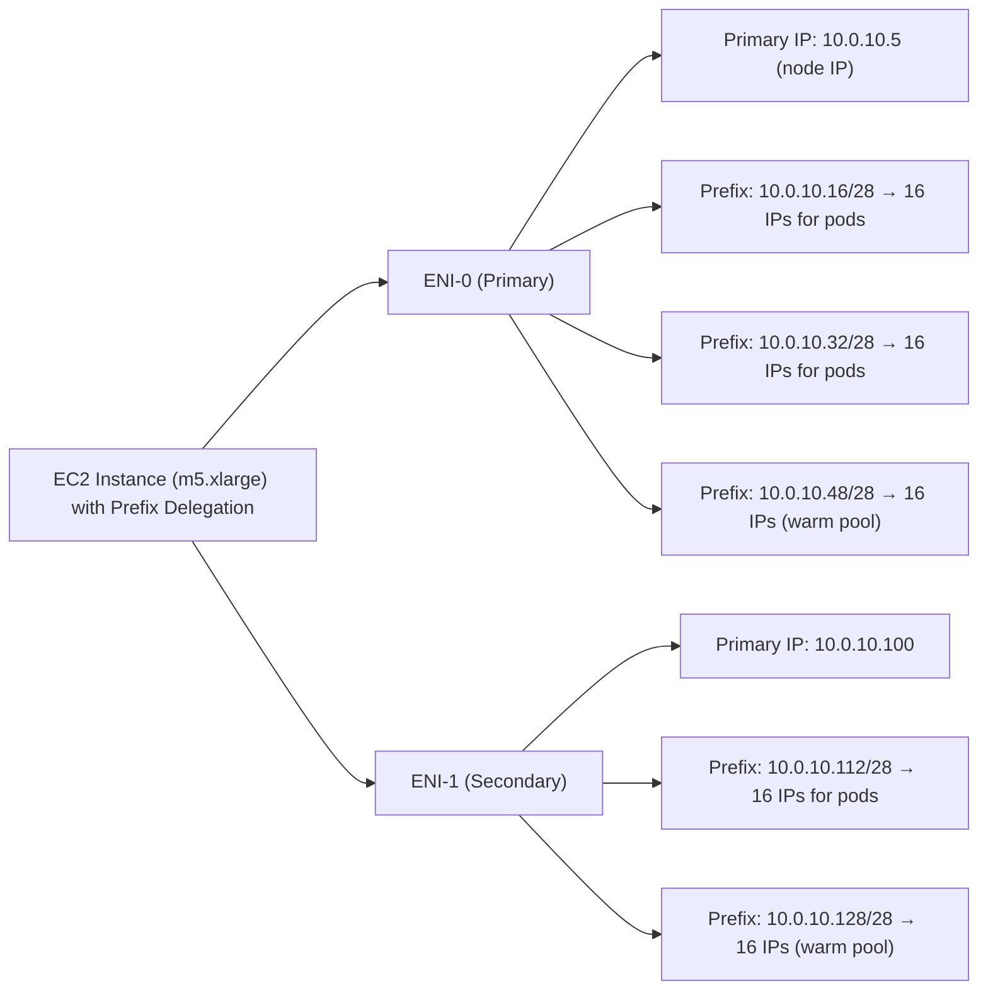
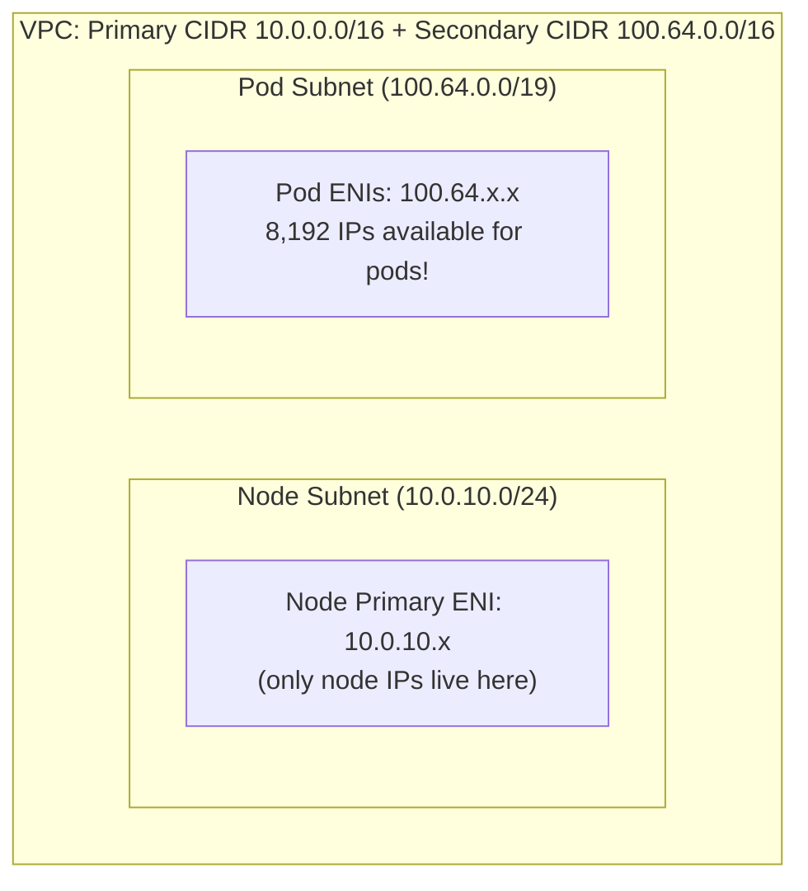
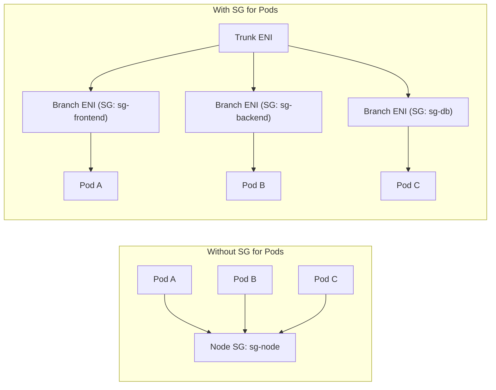
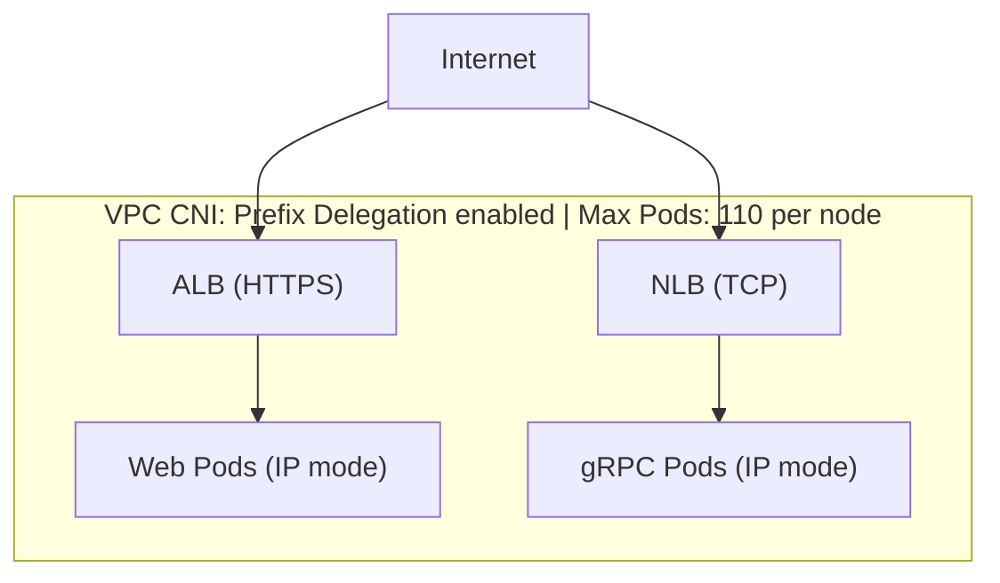

## What You'll Be Able to Do

After completing this module, you will be able to:

- **Diagnose** pod networking failures related to IP exhaustion, ENI limits, and subnet routing misconfigurations within massive multi-tenant clusters.
- **Implement** the AWS VPC CNI plugin with custom networking, prefix delegation, and secondary CIDR ranges to ensure scalable IP allocation for large-scale deployments.
- **Design** EKS networking architectures that leverage security groups for pods, enabling granular pod-level traffic isolation without relying solely on network policies.
- **Evaluate** and deploy the AWS Load Balancer Controller to dynamically provision Application Load Balancers (ALB) and Network Load Balancers (NLB) using optimized IP target types.
- **Compare** secondary IP mode against Prefix Delegation mode to accurately calculate and optimize the maximum pod density across different EC2 instance types.

---

## Why This Module Matters

A common EKS failure mode is subnet IP exhaustion: when a cluster scales quickly and the VPC CNI cannot allocate more pod IPs, new pods can fail with `FailedCreatePodSandBox` errors until you free or add address space.

This scenario illustrates a high-impact EKS failure mode: subnet IP exhaustion can stop new pods from starting even when CPU and memory remain available. Unlike most other Kubernetes distributions that rely on overlay networks (where pod IPs are virtual, internal to the cluster, and practically unlimited), [EKS natively utilizes the Amazon VPC CNI plugin. This plugin guarantees that every pod receives a real, routable IP address directly from your VPC subnet.](https://docs.aws.amazon.com/eks/latest/best-practices/vpc-cni.html) This design is both a tremendous superpower—enabling native VPC networking, direct assignment of security groups to pods, and the elimination of overlay encapsulation overhead—and a dangerous trap. It creates a finite, physical constraint on your IP address space that can violently exhaust your network at the worst possible moment during auto-scaling events.

In this module, you will master the intricate mechanics of the VPC CNI. You will thoroughly understand IP allocation modes, specifically focusing on Prefix Delegation—a feature that can multiply your IP capacity per ENI slot by 16x. You will learn the definitive strategies for solving IP exhaustion by implementing Custom Networking paired with secondary CIDRs. Furthermore, you will configure Security Groups for Pods to achieve zero-trust network isolation, set up the AWS Load Balancer Controller for highly efficient ALB and NLB ingress routing, and explore the future of EKS networking through IPv6 adoption.

---

## The Architecture of AWS VPC CNI

To understand EKS networking, you must first understand the fundamental architecture of the Amazon VPC CNI plugin. When a Pod is scheduled onto a node, the Kubelet must establish the pod's network before the application containers can start. It does this by invoking the CNI plugin.

The AWS VPC CNI consists of two primary components operating on every worker node:
1. **The CNI Binary**: This is the executable invoked by the Kubelet. It creates the Linux network namespace for the pod, sets up the `veth` (virtual ethernet) pairs connecting the pod to the host's networking stack, and configures the routing rules on the host.
2. **The IPAMD (IP Address Management Daemon)**: This is a long-running background process (running as the `aws-node` DaemonSet) that continuously monitors the node's IP usage. It proactively communicates with the AWS EC2 API to attach new Elastic Network Interfaces (ENIs) and allocate secondary IP addresses to those ENIs so that the CNI binary usually has a pool of IPs ready to assign to incoming pods.

Because EKS pods receive VPC-native IP addresses, they integrate directly with AWS networking and load-balancing constructs without an overlay network.

---

## Secondary IP Mode (Default)

In its default configuration, known as Secondary IP Mode, the VPC CNI pre-allocates individual secondary IP addresses on each node's Elastic Network Interfaces (ENIs). When a new pod is scheduled by the Kubernetes scheduler, the CNI binary typically assigns it one of these pre-allocated IPs from the IPAMD's local pool.



The strict limitation in this mode is defined by the hardware capabilities of the EC2 instance type. The AWS Nitro hypervisor enforces a hard limit on the number of ENIs an instance can attach, as well as the number of secondary IP addresses each ENI can support. 

The number of pods a node can run is directly limited by the following physical formula:

```text
Max Pods = (Number of ENIs x (IPs per ENI - 1)) + 2

For m5.xlarge:
  ENIs: 4, IPs per ENI: 15
  Max Pods = (4 x (15 - 1)) + 2 = 58
```

In this formula, the `-1` accounts for the primary IP on each ENI, which is required for the ENI itself to function on the network and cannot be assigned to user pods. The `+2` accounts for the node's foundational host-networking pods (specifically `kube-proxy` and the `aws-node` DaemonSet), which share the host's primary IP and do not consume secondary VPC IPs.

---

## The Warm Pool: WARM_ENI_TARGET and WARM_IP_TARGET

Why does the VPC CNI pre-allocate IPs instead of requesting them on-demand when a pod starts? The answer lies in AWS EC2 API latency and rate limiting. Allocating new IP capacity requires EC2 API calls, so an undersized warm pool can delay pod startup and increase the chance of API throttling during rapid scale-outs.

To prevent this, [the IPAMD maintains a "warm pool" of pre-allocated IPs. By default, it keeps an entire "warm" ENI attached to the node](https://docs.aws.amazon.com/eks/latest/best-practices/vpc-cni.html), with all of its secondary IPs fully allocated but unassigned to any pods.

```bash
# Check current VPC CNI configuration
k get daemonset aws-node -n kube-system -o json | \
  jq '.spec.template.spec.containers[0].env[] | select(.name | startswith("WARM"))'
```

While this guarantees instant pod startup, it aggressively hoards IP addresses. A large cluster can consume a substantial number of IP addresses just to satisfy default warm-pool behavior. Tuning this warm pool is your first line of defense in IP-constrained environments.

| Variable | Default | Effect |
| :--- | :--- | :--- |
| `WARM_ENI_TARGET` | `1` | Number of warm (fully pre-allocated) ENIs to keep ready |
| `WARM_IP_TARGET` | Not set | Number of warm IPs to keep ready (overrides WARM_ENI_TARGET) |
| `MINIMUM_IP_TARGET` | Not set | Minimum IPs to keep allocated at all times |

If you are running dangerously low on IPs, you must instruct the IPAMD to maintain individual warm IPs rather than entire warm ENIs:

```bash
# Configure VPC CNI to keep only 2 warm IPs instead of an entire warm ENI
k set env daemonset aws-node -n kube-system \
  WARM_IP_TARGET=2 \
  WARM_ENI_TARGET=0 \
  MINIMUM_IP_TARGET=4
```

This configuration forces the node to release excess IPs back to the VPC. Instead of wasting ~14 IPs per node on a dormant warm ENI, the node will only keep 2 unassigned IPs in reserve. The trade-off is clear: if you suddenly schedule 5 pods onto a node that only has 2 warm IPs, the 3rd, 4th, and 5th pods will experience a startup delay of a few seconds while IPAMD negotiates with the EC2 API for more addresses.

---

## Prefix Delegation Mode: The 16x Multiplier

To permanently resolve the severe density limitations of Secondary IP Mode without requiring massive subnets, AWS introduced Prefix Delegation. Prefix Delegation fundamentally transforms the IP assignment math. 

Instead of an ENI slot holding a single, discrete secondary IP address, Prefix Delegation allows that exact same ENI slot to hold [a contiguous `/28` IPv4 prefix. A `/28` prefix contains exactly 16 IP addresses.](https://docs.aws.amazon.com/eks/latest/best-practices/prefix-mode-linux.html) Because this is handled at the ENI attachment level, you effectively multiply your IP capacity by 16x without attaching a single additional ENI.

```text
Secondary IP Mode (default):           Prefix Delegation Mode:
ENI Slot → 1 IP address                ENI Slot → /28 prefix (16 IPs)

m5.xlarge:                              m5.xlarge:
  4 ENIs x 15 slots = 60 IPs max         4 ENIs x 15 slots x 16 = 960 IPs max
  Max pods: ~58                           Max pods: 110 (capped by EKS)
```

> **Stop and think**: If Prefix Delegation multiplies IP capacity by 16x, why does EKS still cap an m5.xlarge at 110 pods instead of the theoretical 960? (Hint: IP addresses are not the only resource a pod consumes on a node).

Even when prefix delegation makes far more IPs available, Amazon EKS still applies lower practical pod caps; managed node groups without a custom AMI cap nodes under 30 vCPUs at 110 pods and larger nodes at 250.

Enabling Prefix Delegation is a two-step process. First, you configure the VPC CNI:

```bash
# Enable Prefix Delegation
k set env daemonset aws-node -n kube-system \
  ENABLE_PREFIX_DELEGATION=true \
  WARM_PREFIX_TARGET=1

# IMPORTANT: Update your node group's max-pods setting
# For managed node groups, use a launch template with custom user data:
# --kubelet-extra-args '--max-pods=110'

# Verify prefix delegation is active
k get ds aws-node -n kube-system -o json | \
  jq '.spec.template.spec.containers[0].env[] | select(.name=="ENABLE_PREFIX_DELEGATION")'
```

Crucially, after enabling Prefix Delegation in the CNI, the `kubelet` on your worker nodes must be restarted with a new `--max-pods` argument. If you do not update the node's user data, the `kubelet` will continue enforcing the old 58-pod limit, completely ignoring the thousands of new IP addresses made available by the CNI.

Once correctly provisioned, the IP allocation on the node transforms significantly:



---

## Solving IP Exhaustion: Secondary CIDRs and Custom Networking

Prefix Delegation dramatically increases how many pods you can fit on a single node, but it does not magically create more IP addresses in your VPC. If your entire VPC subnet only has 251 usable addresses (a `/24`), you will still run out of IPs as you add more nodes to the cluster.

When physical IP address exhaustion looms, the industry-standard architectural solution is to attach a massive, non-routable Secondary CIDR block exclusively for pod networking. [The `100.64.0.0/10` space (RFC 6598, originally intended for Carrier-Grade NAT)](https://www.rfc-editor.org/rfc/rfc6598) is frequently utilized because it does not conflict with traditional enterprise RFC 1918 ranges (like `10.x` or `192.168.x`).

```bash
# Add secondary CIDR to VPC
aws ec2 associate-vpc-cidr-block \
  --vpc-id $VPC_ID \
  --cidr-block 100.64.0.0/16

# Create new subnets in the secondary CIDR range
POD_SUB1=$(aws ec2 create-subnet \
  --vpc-id $VPC_ID \
  --cidr-block 100.64.0.0/19 \
  --availability-zone us-east-1a \
  --query 'Subnet.SubnetId' --output text)

POD_SUB2=$(aws ec2 create-subnet \
  --vpc-id $VPC_ID \
  --cidr-block 100.64.32.0/19 \
  --availability-zone us-east-1b \
  --query 'Subnet.SubnetId' --output text)

# Tag for EKS
aws ec2 create-tags --resources $POD_SUB1 $POD_SUB2 \
  --tags Key=Name,Value=EKS-Pod-Subnet
```

By default, the VPC CNI will pull pod IPs from the exact same subnet that the EC2 instance resides in. To force the VPC CNI to use [these newly created secondary subnets](https://docs.aws.amazon.com/eks/latest/best-practices/custom-networking.html), you must enable Custom Networking. 

```bash
# Enable custom networking on the VPC CNI
k set env daemonset aws-node -n kube-system \
  AWS_VPC_K8S_CNI_CUSTOM_NETWORK_CFG=true \
  ENI_CONFIG_LABEL_DEF=topology.kubernetes.io/zone
```

With Custom Networking enabled, the IPAMD daemon looks for Custom Resource Definitions (CRDs) named `ENIConfig`. [The `ENIConfig` maps a specific Availability Zone to the new pod subnets and security groups.](https://docs.aws.amazon.com/eks/latest/best-practices/custom-networking.html) Because EKS clusters span multiple AZs, you must create one `ENIConfig` per AZ.

```yaml
# eniconfig-us-east-1a.yaml
apiVersion: crd.k8s.amazonaws.com/v1alpha1
kind: ENIConfig
metadata:
  name: us-east-1a
spec:
  subnet: subnet-aaa111    # Pod subnet in 100.64.0.0/19
  securityGroups:
    - sg-0abc123def456      # Security group for pods
```

```yaml
# eniconfig-us-east-1b.yaml
apiVersion: crd.k8s.amazonaws.com/v1alpha1
kind: ENIConfig
metadata:
  name: us-east-1b
spec:
  subnet: subnet-bbb222    # Pod subnet in 100.64.32.0/19
  securityGroups:
    - sg-0abc123def456
```

Apply these configurations to the cluster:

```bash
k apply -f eniconfig-us-east-1a.yaml
k apply -f eniconfig-us-east-1b.yaml
```

Once implemented, the architecture physically isolates the node's network traffic from the pod's network traffic. The primary ENI handles SSH, Kubelet-to-API-server communication, and internal OS networking on the `10.x` subnet. Meanwhile, all secondary ENIs are dynamically deployed into the `100.64.x` subnet to host the massive volume of pods.



> **Pause and predict**: If we place pod ENIs into a separate subnet from the node's primary ENI, what happens to the ENI slot that the node's primary interface occupies? Can pods still use it?

*Critical Architecture Note*: Because Custom Networking dictates that pod IPs can *only* live on ENIs attached to the Custom Networking subnet, the node's Primary ENI (which lives in the Node Subnet) is entirely removed from the pod scheduling pool. If an instance has 4 ENIs, only 3 are available for pods. This slightly reduces your total pod density per node unless you combine Custom Networking with Prefix Delegation—a combination that represents the gold standard for large-scale EKS clusters.

---

## Pod-Level Isolation: Security Groups for Pods

Historically, all pods running on a specific EC2 node shared that node's security groups. If a node required access to an RDS database for one specific microservice, every other pod on that node inherited that database access. While Kubernetes Network Policies provide Layer 3/4 isolation inside the cluster, many enterprises mandate zero-trust security enforced by the cloud provider's native firewall layer.

Security Groups for Pods solves this by integrating directly with the AWS Nitro hypervisor to attach VPC Security Groups dynamically at the individual pod level. It achieves this utilizing [a "Trunk and Branch" ENI architecture](https://docs.aws.amazon.com/eks/latest/best-practices/sgpp.html).



The VPC CNI transforms one of the node's standard secondary ENIs into a massive "Trunk ENI". From this trunk, it spawns dozens of lightweight "Branch ENIs". Because each branch is recognized as an independent network interface by the AWS fabric, it can be assigned its own discrete Security Group.

To leverage this powerful feature, first enable it within the VPC CNI:

```bash
# Enable the feature on the VPC CNI
k set env daemonset aws-node -n kube-system \
  ENABLE_POD_ENI=true \
  POD_SECURITY_GROUP_ENFORCING_MODE=standard
```

Then, deploy a `SecurityGroupPolicy` resource. This object uses standard label selectors to identify target pods and apply the required Security Groups transparently:

```yaml
apiVersion: vpcresources.k8s.aws/v1beta1
kind: SecurityGroupPolicy
metadata:
  name: backend-sgp
  namespace: production
spec:
  podSelector:
    matchLabels:
      app: payment-service
  securityGroups:
    groupIds:
      - sg-0abc123def456    # Allow only port 8080 from ALB
      - sg-0def789ghi012    # Allow only port 5432 to RDS
```

Whenever a pod matching `app: payment-service` is scheduled, the CNI provisions a dedicated branch ENI, applies the `sg-0abc123def456` and `sg-0def789ghi012` security groups, and attaches the interface to the pod's namespace. The pod is now isolated by AWS native firewalls. This functionality requires supported Nitro-based instance types, and you should review the current EKS service-mode limitations for Pods that use pod-level security groups.

---

## AWS Load Balancer Controller: Ingress and Egress

Historically, Kubernetes created AWS Load Balancers via an in-tree cloud provider controller that was baked directly into the Kubernetes source code. This legacy approach is deprecated. Modern EKS networking dictates the use of [the out-of-tree AWS Load Balancer Controller (LBC)](https://docs.aws.amazon.com/eks/latest/best-practices/load-balancing.html).

The AWS LBC is an intelligent operator that watches for Kubernetes `Ingress` and `Service` resources and directly orchestrates AWS Application Load Balancers (ALBs) and Network Load Balancers (NLBs) to satisfy them.

```bash
# Install via Helm
helm repo add eks https://aws.github.io/eks-charts
helm repo update

helm install aws-load-balancer-controller eks/aws-load-balancer-controller \
  -n kube-system \
  --set clusterName=my-cluster \
  --set serviceAccount.create=true \
  --set serviceAccount.annotations."eks\.amazonaws\.com/role-arn"=arn:aws:iam::123456789012:role/AWSLoadBalancerControllerRole
```

### ALB for HTTP/HTTPS Traffic

When dealing with Layer 7 traffic (HTTP, HTTPS, or gRPC over HTTP/2), the ALB provides advanced routing capabilities including path-based routing, host-based routing, and native TLS termination via AWS Certificate Manager (ACM). 

```yaml
apiVersion: networking.k8s.io/v1
kind: Ingress
metadata:
  name: web-ingress
  namespace: production
  annotations:
    alb.ingress.kubernetes.io/scheme: internet-facing
    alb.ingress.kubernetes.io/target-type: ip
    alb.ingress.kubernetes.io/certificate-arn: arn:aws:acm:us-east-1:123456789012:certificate/abc-123
    alb.ingress.kubernetes.io/listen-ports: '[{"HTTPS":443}]'
    alb.ingress.kubernetes.io/ssl-redirect: "443"
    alb.ingress.kubernetes.io/healthcheck-path: /healthz
    alb.ingress.kubernetes.io/group.name: shared-alb
spec:
  ingressClassName: alb
  rules:
    - host: app.example.com
      http:
        paths:
          - path: /
            pathType: Prefix
            backend:
              service:
                name: web-service
                port:
                  number: 80
```

The annotations on this resource hold incredible power over the physical AWS infrastructure. 

| Annotation | Purpose |
| :--- | :--- |
| `scheme: internet-facing` | Public ALB (vs. `internal` for private) |
| `target-type: ip` | Route directly to pod IPs (vs. `instance` for NodePort) |
| `group.name` | Share one ALB across multiple Ingress resources (cost savings) |
| `ssl-redirect` | Automatic HTTP-to-HTTPS redirect |
| `certificate-arn` | ACM certificate for TLS termination |

The `target-type: ip` annotation is arguably the most critical setting in EKS ingress. In legacy `instance` mode, the load balancer targets a node and NodePort, adding an extra hop through the node proxy path and shifting health checks to the node-level target rather than the pod IP itself. [Because EKS pods have real VPC IP addresses, `target-type: ip` allows the ALB to route traffic *directly* to the pod's IP](https://docs.aws.amazon.com/eks/latest/best-practices/load-balancing.html), completely bypassing the node's proxy layer.

### NLB for gRPC and TCP Traffic

For raw Layer 4 traffic, extreme low-latency requirements, or protocols that cannot be terminated by an ALB, EKS relies on the Network Load Balancer (NLB). You provision an NLB by creating a Kubernetes `Service` of type `LoadBalancer` and applying specific annotations.

```yaml
apiVersion: v1
kind: Service
metadata:
  name: grpc-service
  namespace: production
  annotations:
    service.beta.kubernetes.io/aws-load-balancer-type: external
    service.beta.kubernetes.io/aws-load-balancer-nlb-target-type: ip
    service.beta.kubernetes.io/aws-load-balancer-scheme: internet-facing
    service.beta.kubernetes.io/aws-load-balancer-healthcheck-protocol: HTTP
    service.beta.kubernetes.io/aws-load-balancer-healthcheck-path: /grpc.health.v1.Health/Check
    service.beta.kubernetes.io/aws-load-balancer-backend-protocol: tcp
    service.beta.kubernetes.io/aws-load-balancer-cross-zone-load-balancing-enabled: "true"
spec:
  type: LoadBalancer
  loadBalancerClass: service.k8s.aws/nlb
  selector:
    app: grpc-backend
  ports:
    - name: grpc
      port: 443
      targetPort: 8443
      protocol: TCP
```

The differences between ALB and NLB are distinct and determine your entire edge architecture.

| Feature | ALB (Application LB) | NLB (Network LB) |
| :--- | :--- | :--- |
| **OSI Layer** | Layer 7 (HTTP/HTTPS) | Layer 4 (TCP/UDP/TLS) |
| **Protocols** | HTTP, HTTPS, gRPC (HTTP/2) | TCP, UDP, TLS |
| **Path routing** | Yes (host, path, header) | No |
| **WebSocket** | Yes | Yes (TCP) |
| **Static IP** | No (use Global Accelerator) | Yes (Elastic IP per AZ) |
| **Latency** | ~1-5ms added | ~100us added |
| **gRPC** | ALB supports gRPC natively | NLB via TLS passthrough |
| **Cost** | $0.0225/hr + LCU | $0.0225/hr + NLCU |
| **Best for** | Web apps, REST APIs | gRPC, databases, gaming, IoT |

> **Pause and predict**: If your application uses WebSockets which require long-lived persistent connections, which load balancer type would provide the most efficient routing without connection drops during scaling events?

---

## Future-Proofing: IPv6 on EKS

The ultimate architectural solution to IPv4 exhaustion is completely bypassing it. EKS natively supports IPv6-only pods. By assigning Pods IPv6 addresses from the VPC's IPv6 allocation, you get a vastly larger address space than in IPv4-based designs and greatly reduce IPv4 exhaustion pressure.

```bash
# Create an IPv6 cluster
aws eks create-cluster \
  --name ipv6-cluster \
  --role-arn $EKS_ROLE_ARN \
  --kubernetes-network-config ipFamily=ipv6 \
  --resources-vpc-config subnetIds=$SUB1,$SUB2,endpointPublicAccess=true,endpointPrivateAccess=true \
  --kubernetes-version 1.35
```

In an IPv6 cluster:
- Pods are assigned exclusively IPv6 addresses.
- In EKS IPv6 clusters, Pods and Services use IPv6 addressing; Amazon EKS does not support dual-stacked Pods or Services.
- Internal node-to-node and pod-to-pod communication is entirely IPv6.
- IPv6 changes how Pod addressing works, but you should verify your egress and compatibility requirements against the current EKS IPv6 networking model.

However, [IPv6 must be designated during cluster creation—you cannot migrate a live IPv4 EKS cluster to IPv6.](https://docs.aws.amazon.com/eks/latest/userguide/cni-ipv6.html) Furthermore, verify that your add-ons and operators support IPv6 before rolling it out cluster-wide.

---

## Did You Know?

1. The default warm-pool behavior can consume a substantial amount of IPv4 address space on large clusters, and switching from whole warm ENIs to warm IP targets can reclaim addresses quickly.
2. Prefix Delegation was introduced in 2021 and is the newer VPC CNI mode for increasing Pod density by assigning `/28` prefixes instead of individual secondary IPv4 addresses.
3. The AWS Load Balancer Controller can share a single ALB across multiple Ingress resources, which can materially reduce fixed load balancer costs when host-based or path-based routing is acceptable.
4. Security Groups for Pods use Nitro trunk and branch ENI capabilities, and the amount of branch-interface capacity varies by instance type.

---

## Common Mistakes

| Mistake | Why It Happens | How to Fix It |
| :--- | :--- | :--- |
| **Not enabling Prefix Delegation on new clusters** | Unaware it exists, or using default VPC CNI settings from older guides. | Enable `ENABLE_PREFIX_DELEGATION=true` and update `max-pods` in your node group launch template. This should be default for all new clusters. |
| **IP exhaustion from warm ENI pre-allocation** | Default `WARM_ENI_TARGET=1` wastes 14+ IPs per node on pre-allocated but unused ENIs. | Set `WARM_IP_TARGET=2` and `WARM_ENI_TARGET=0` in the `aws-node` DaemonSet environment variables. |
| **Using `target-type: instance` with ALB** | Copying old examples that pre-date the `ip` target type. Instance mode adds a NodePort hop and loses pod-level health checks. | In most EKS cases, use `target-type: ip` with the AWS Load Balancer Controller. It routes directly to pod IPs and enables pod-level health checking. |
| **Creating a separate ALB per Ingress** | Not knowing about the `group.name` annotation for ALB sharing. | Add `alb.ingress.kubernetes.io/group.name: shared-alb` to Ingress annotations. Multiple Ingress resources share one ALB. |
| **Forgetting max-pods after enabling Prefix Delegation** | Enabling PD on the VPC CNI but not updating the kubelet configuration on nodes. | Use a launch template with `--kubelet-extra-args '--max-pods=110'` or use the EKS-recommended max-pods calculator script. |
| **Custom Networking without new node groups** | Enabling `AWS_VPC_K8S_CNI_CUSTOM_NETWORK_CFG=true` on existing nodes that were not provisioned with ENIConfig. | Custom Networking requires rolling out new node groups. Existing nodes must be drained and replaced. |
| **NLB with missing cross-zone annotation** | Assuming NLB distributes evenly across AZs by default. NLB is zonal by default -- each AZ node gets equal share regardless of pod count. | Set `aws-load-balancer-cross-zone-load-balancing-enabled: "true"` for even distribution. |
| **Security Groups for Pods on non-Nitro instances** | Using t2 or m4 instance types that do not support trunk/branch ENIs. | Use Nitro-based instances (m5, m6i, c5, r5, t3, and newer). Check the [instance type compatibility matrix](https://docs.aws.amazon.com/AWSEC2/latest/UserGuide/instance-types.html). |

---

## Quiz

<details>
<summary>Question 1: Your EKS cluster runs on m5.xlarge nodes. In secondary IP mode, each node can run 58 pods. After enabling Prefix Delegation, you expect 110 pods per node, but nodes still cap at 58 pods. What did you miss?</summary>

You forgot to update the **max-pods setting** on the nodes. Prefix Delegation changes how the VPC CNI allocates IPs, but the kubelet enforces its own pod limit independently. You need to update the launch template's user data to include `--kubelet-extra-args '--max-pods=110'` and roll out new nodes. The VPC CNI can allocate hundreds of IPs via prefix delegation, but if the kubelet still thinks the max is 58, it will reject any scheduling beyond that limit.
</details>

<details>
<summary>Question 2: Your EKS cluster is running 50 nodes of `m5.xlarge`. You notice that even though you only have 100 pods deployed across the entire cluster, you have exhausted over 700 IPs from your VPC subnet. The cluster is using default VPC CNI settings. A colleague suggests changing `WARM_ENI_TARGET` to 0 and setting `WARM_IP_TARGET=2`. Will this resolve the IP exhaustion, and what trade-off are you making?</summary>

Yes, this will recover a massive number of IPs once the warm pool is reconciled. By default, `WARM_ENI_TARGET=1` keeps an entire ENI (up to 14 secondary IPs on an m5.xlarge) fully pre-allocated per node, which means 50 nodes waste about 700 IPs just sitting idle in the warm pool. By switching to `WARM_IP_TARGET=2`, you instruct the VPC CNI to only keep 2 IPs pre-allocated per node, returning the rest to the VPC. The trade-off is that when a node needs to schedule a 3rd pod rapidly, it must make an AWS API call to attach a new ENI or assign a new IP, introducing 1-2 seconds of pod startup latency.
</details>

<details>
<summary>Question 3: You just migrated your EKS cluster to use Custom Networking to solve IP exhaustion, mapping pod IPs to a massive `100.64.0.0/16` secondary CIDR. However, immediately after rolling out the new node groups, you get alerts that `m5.xlarge` nodes are failing to schedule more than 44 pods, even though they used to schedule 58 pods before the migration. What is causing this capacity reduction, and how can you fix it?</summary>

The reduction is happening because Custom Networking reserves the node's primary ENI exclusively for node-level communication in the primary subnet, completely removing it from the pod IP allocation pool. Previously, the primary ENI could host secondary IPs for pods, but now only the secondary ENIs (which are attached to the Custom Networking subnets) can host pods. For an m5.xlarge, this reduces the usable ENIs from 4 to 3, dropping max pods from 58 to 44. To fix this and massively increase capacity, you should enable Prefix Delegation alongside Custom Networking, which will assign `/28` prefixes to those remaining ENI slots and allow the node to easily hit the EKS hard cap of 110 pods. This combination ensures pods have dedicated IP space while maximizing scheduling density per node.
</details>

<details>
<summary>Question 4: During a busy traffic spike, you have a Kubernetes Ingress with the annotation `target-type: instance` routing to pods spread across 10 nodes in 3 Availability Zones. One of the application pods suddenly crashes and begins failing its readiness probe, yet users are reporting intermittent HTTP 502 errors when accessing the service. Why is traffic still reaching the failed pod, and how do you resolve it?</summary>

With `target-type: instance`, the ALB targets the NodePort on each node, not individual pods. The ALB health checks the NodePort -- and if any pod behind that NodePort on a specific node fails, kube-proxy may still route traffic to the unhealthy pod because the ALB only sees the node as healthy or unhealthy. This means traffic can reach unhealthy pods until kube-proxy removes the endpoint. With `target-type: ip`, the ALB health-checks each pod directly and stops sending traffic to failed pods within seconds, regardless of the node. Changing the target type completely bypasses the unpredictable kube-proxy hop, providing immediate routing updates when a pod fails.
</details>

<details>
<summary>Question 5: Your team successfully implements Security Groups for Pods to isolate a sensitive payment service, attaching a dedicated security group that only allows inbound traffic on port 443. Immediately after the pods restart to apply the policy, the application begins throwing connection timeout errors because it cannot resolve the database's DNS hostname. What went wrong with the network configuration?</summary>

When you assign security groups to pods via SecurityGroupPolicy, those pods use the specified security groups **instead of** the node's security groups. By default, security groups deny all outbound traffic unless explicitly permitted. If the pod-specific security groups do not include an outbound rule allowing DNS traffic (UDP port 53 to the CoreDNS service IP, typically `10.100.0.10`), DNS resolution fails entirely. The fix is to add an outbound rule for UDP/TCP port 53 to the CoreDNS cluster IP CIDR (or the VPC CIDR) in the pod's security group. This ensures the pod can communicate with CoreDNS before attempting to reach external dependencies.
</details>

<details>
<summary>Question 6: Your platform hosts 45 different microservices, each with its own standard Kubernetes Ingress resource using the `alb` ingress class. Finance just flagged your AWS bill because you are spending over $700 per month just on Application Load Balancers. You need to reduce this cost immediately without changing the routing behavior for the clients. How can you architect this change using the AWS Load Balancer Controller, and what operational risk does it introduce?</summary>

You can consolidate all 45 microservices behind a single Application Load Balancer by adding the `alb.ingress.kubernetes.io/group.name: shared-alb` annotation to all 45 Ingress resources. The AWS Load Balancer Controller will merge these into a single ALB with path-based or host-based listener rules, reducing your fixed ALB hourly costs from 45 LBs down to just 1. However, this introduces a shared blast radius risk: if someone deploys a misconfigured Ingress that breaks the ALB listener rules, or if you exceed the AWS quota of 100 rules per ALB, all 45 microservices could experience routing failures simultaneously. It is best practice to group non-critical services together while keeping highly critical domains on dedicated ALBs. This balances cost efficiency with isolation and operational safety.
</details>

<details>
<summary>Question 7: During an unexpected traffic surge, your EKS cluster scales rapidly to handle the load, but new pods suddenly remain in a Pending state due to `FailedCreatePodSandBox: no available IP addresses`. Your VPC uses a `10.0.0.0/16` CIDR and you have exhausted all IPs in your EKS subnets. What are your two fastest options to restore scheduling capability without rebuilding the cluster?</summary>

**Option 1**: Tune the VPC CNI warm pool by setting `WARM_IP_TARGET=1` and `WARM_ENI_TARGET=0` on the `aws-node` DaemonSet. This immediately releases pre-allocated but unused IPs across all nodes, often recovering hundreds of IPs within minutes. **Option 2**: Enable Prefix Delegation (`ENABLE_PREFIX_DELEGATION=true`), which changes the allocation from individual IPs to `/28` prefixes, dramatically reducing the number of IPs consumed per ENI slot while increasing pod capacity. Both changes take effect within minutes as the aws-node DaemonSet rolls out, though Prefix Delegation requires updating max-pods on nodes (meaning a rolling restart). For a longer-term architectural fix, you should add a secondary CIDR (e.g., `100.64.0.0/16`) with Custom Networking to permanently expand the available address space.
</details>

---

## Hands-On Exercise: Prefix Delegation + ALB for Web + NLB for gRPC

In this comprehensive exercise, you will architect a highly scalable EKS networking foundation by configuring Prefix Delegation for maximum IP efficiency, deploying the AWS Load Balancer Controller, and exposing both a standard web application and a low-latency gRPC service to the internet.

**What you will build:**



### Task 1: Enable Prefix Delegation on the VPC CNI

Configure the `aws-node` DaemonSet to allocate `/28` prefixes to EC2 ENIs rather than requesting individual secondary IP addresses.

<details>
<summary>Solution</summary>

```bash
# Enable Prefix Delegation
k set env daemonset aws-node -n kube-system \
  ENABLE_PREFIX_DELEGATION=true \
  WARM_PREFIX_TARGET=1

# Wait for the DaemonSet to roll out
k rollout status daemonset aws-node -n kube-system --timeout=120s

# Verify on a node (check that prefixes are assigned, not individual IPs)
NODE_NAME=$(k get nodes -o jsonpath='{.items[0].metadata.name}')
k get node $NODE_NAME -o json | jq '.status.allocatable["vpc.amazonaws.com/pod-ens"]'

# Check ENI details via AWS CLI
INSTANCE_ID=$(k get node $NODE_NAME -o json | jq -r '.spec.providerID' | cut -d'/' -f5)
aws ec2 describe-instances --instance-ids $INSTANCE_ID \
  --query 'Reservations[0].Instances[0].NetworkInterfaces[*].{ENI:NetworkInterfaceId, Ipv4Prefixes:Ipv4Prefixes[*].Ipv4Prefix}' \
  --output json

# You should see /28 prefixes instead of individual secondary IPs
```

</details>

### Task 2: Update Node Group Max-Pods

Update the physical nodes to inform the `kubelet` that it is now permitted to schedule up to 110 pods per node, fully utilizing the newly available Prefix Delegation IP space.

<details>
<summary>Solution</summary>

```bash
# Create a new launch template with updated max-pods
cat > /tmp/eks-userdata.txt << 'USERDATA'
#!/bin/bash
/etc/eks/bootstrap.sh my-cluster \
  --kubelet-extra-args '--max-pods=110'
USERDATA

USERDATA_B64=$(base64 -i /tmp/eks-userdata.txt)

# Create launch template
LT_ID=$(aws ec2 create-launch-template \
  --launch-template-name eks-prefix-delegation \
  --launch-template-data "{
    \"UserData\": \"$USERDATA_B64\",
    \"InstanceType\": \"m6i.large\"
  }" \
  --query 'LaunchTemplate.LaunchTemplateId' --output text)

# Update the node group to use the new launch template
aws eks update-nodegroup-config \
  --cluster-name my-cluster \
  --nodegroup-name standard-workers \
  --launch-template id=$LT_ID,version=1

# Wait for the update (this triggers a rolling replacement)
aws eks wait nodegroup-active \
  --cluster-name my-cluster \
  --nodegroup-name standard-workers

# Verify max-pods on a new node
k get node -o json | jq '.items[0].status.allocatable.pods'
# Should show "110"
```

</details>

### Task 3: Install the AWS Load Balancer Controller

Provision the AWS LBC using Helm so the cluster can autonomously communicate with the AWS API to generate load balancers from manifest files.

<details>
<summary>Solution</summary>

```bash
# Add the EKS Helm repo
helm repo add eks https://aws.github.io/eks-charts
helm repo update

# Create the IAM policy for the controller
curl -o /tmp/iam_policy.json https://raw.githubusercontent.com/kubernetes-sigs/aws-load-balancer-controller/v2.11.0/docs/install/iam_policy.json

aws iam create-policy \
  --policy-name AWSLoadBalancerControllerIAMPolicy \
  --policy-document file:///tmp/iam_policy.json

# Install the controller
helm install aws-load-balancer-controller eks/aws-load-balancer-controller \
  -n kube-system \
  --set clusterName=my-cluster \
  --set serviceAccount.create=true \
  --set serviceAccount.name=aws-load-balancer-controller \
  --set serviceAccount.annotations."eks\.amazonaws\.com/role-arn"=arn:aws:iam::$(aws sts get-caller-identity --query Account --output text):role/AWSLoadBalancerControllerRole

# Verify the controller is running
k get deployment aws-load-balancer-controller -n kube-system
k get pods -n kube-system -l app.kubernetes.io/name=aws-load-balancer-controller
```

</details>

### Task 4: Deploy a Web Application Behind an ALB

Deploy an NGINX web application and expose it dynamically utilizing an Application Load Balancer functioning in direct-IP routing mode.

<details>
<summary>Solution</summary>

```bash
# Create namespace
k create namespace web-demo

# Deploy the web application
cat <<'EOF' | k apply -f -
apiVersion: apps/v1
kind: Deployment
metadata:
  name: web-app
  namespace: web-demo
spec:
  replicas: 3
  selector:
    matchLabels:
      app: web-app
  template:
    metadata:
      labels:
        app: web-app
    spec:
      containers:
        - name: nginx
          image: nginx:1.27
          ports:
            - containerPort: 80
          readinessProbe:
            httpGet:
              path: /
              port: 80
            initialDelaySeconds: 5
            periodSeconds: 10
          resources:
            requests:
              cpu: 100m
              memory: 128Mi
            limits:
              cpu: 200m
              memory: 256Mi
---
apiVersion: v1
kind: Service
metadata:
  name: web-app-svc
  namespace: web-demo
spec:
  selector:
    app: web-app
  ports:
    - port: 80
      targetPort: 80
  type: ClusterIP
---
apiVersion: networking.k8s.io/v1
kind: Ingress
metadata:
  name: web-app-ingress
  namespace: web-demo
  annotations:
    alb.ingress.kubernetes.io/scheme: internet-facing
    alb.ingress.kubernetes.io/target-type: ip
    alb.ingress.kubernetes.io/healthcheck-path: /
    alb.ingress.kubernetes.io/group.name: dojo-shared-alb
spec:
  ingressClassName: alb
  rules:
    - http:
        paths:
          - path: /
            pathType: Prefix
            backend:
              service:
                name: web-app-svc
                port:
                  number: 80
EOF

# Wait for ALB to provision (takes 2-3 minutes)
echo "Waiting for ALB to provision..."
sleep 30
ALB_URL=$(k get ingress web-app-ingress -n web-demo -o jsonpath='{.status.loadBalancer.ingress[0].hostname}')
echo "ALB URL: http://$ALB_URL"

# Test (may take a minute for DNS propagation)
curl -s -o /dev/null -w "%{http_code}" http://$ALB_URL
```

</details>

### Task 5: Deploy a gRPC Service Behind an NLB

Implement a high-performance gRPC health-check service operating over TCP port 9000, exposed via an ultra-low latency Network Load Balancer.

<details>
<summary>Solution</summary>

```bash
# Deploy a gRPC health check service (using grpcbin as example)
cat <<'EOF' | k apply -f -
apiVersion: apps/v1
kind: Deployment
metadata:
  name: grpc-service
  namespace: web-demo
spec:
  replicas: 2
  selector:
    matchLabels:
      app: grpc-service
  template:
    metadata:
      labels:
        app: grpc-service
    spec:
      containers:
        - name: grpcbin
          image: moul/grpcbin:latest
          ports:
            - containerPort: 9000
              name: grpc
            - containerPort: 9001
              name: grpc-insecure
          resources:
            requests:
              cpu: 100m
              memory: 128Mi
            limits:
              cpu: 200m
              memory: 256Mi
---
apiVersion: v1
kind: Service
metadata:
  name: grpc-nlb
  namespace: web-demo
  annotations:
    service.beta.kubernetes.io/aws-load-balancer-type: external
    service.beta.kubernetes.io/aws-load-balancer-nlb-target-type: ip
    service.beta.kubernetes.io/aws-load-balancer-scheme: internet-facing
    service.beta.kubernetes.io/aws-load-balancer-cross-zone-load-balancing-enabled: "true"
spec:
  type: LoadBalancer
  loadBalancerClass: service.k8s.aws/nlb
  selector:
    app: grpc-service
  ports:
    - name: grpc
      port: 9000
      targetPort: 9000
      protocol: TCP
EOF

# Wait for NLB to provision
sleep 30
NLB_HOST=$(k get svc grpc-nlb -n web-demo -o jsonpath='{.status.loadBalancer.ingress[0].hostname}')
echo "NLB hostname: $NLB_HOST"

# Verify NLB targets are healthy
NLB_ARN=$(aws elbv2 describe-load-balancers \
  --query "LoadBalancers[?DNSName=='$NLB_HOST'].LoadBalancerArn" --output text)
TG_ARN=$(aws elbv2 describe-target-groups \
  --load-balancer-arn $NLB_ARN \
  --query 'TargetGroups[0].TargetGroupArn' --output text)
aws elbv2 describe-target-health --target-group-arn $TG_ARN \
  --query 'TargetHealthDescriptions[*].{Target:Target.Id, Port:Target.Port, Health:TargetHealth.State}' \
  --output table
```

</details>

### Task 6: Verify Pod IP Allocation with Prefix Delegation

Probe the AWS EC2 sub-system directly to validate that your node ENIs are being assigned `/28` prefixes by the IPAMD layer, securing your cluster against IP exhaustion.

<details>
<summary>Solution</summary>

```bash
# Get pod IPs
k get pods -n web-demo -o wide

# Pick a node and inspect its ENI prefixes
NODE=$(k get pods -n web-demo -o jsonpath='{.items[0].spec.nodeName}')
INSTANCE_ID=$(k get node $NODE -o json | jq -r '.spec.providerID' | cut -d'/' -f5)

# Show allocated prefixes on the instance
aws ec2 describe-instances --instance-ids $INSTANCE_ID \
  --query 'Reservations[0].Instances[0].NetworkInterfaces[*].{
    ENI: NetworkInterfaceId,
    Prefixes: Ipv4Prefixes[*].Ipv4Prefix,
    SecondaryIPs: PrivateIpAddresses[?Primary==`false`].PrivateIpAddress
  }' --output json

# You should see Prefixes populated and SecondaryIPs empty (or minimal)
# Each prefix is a /28 = 16 IPs

# Verify max-pods
k get node $NODE -o json | jq '.status.allocatable.pods'
```

</details>

### Clean Up

Ensure you purge all resources, as unmanaged load balancers will continually accrue billing charges against your AWS account.

```bash
k delete namespace web-demo
helm uninstall aws-load-balancer-controller -n kube-system
# Clean up ALB/NLB if they persist (check the AWS console)
```

### Success Criteria

- [ ] I enabled Prefix Delegation on the VPC CNI and verified `/28` prefixes on node ENIs.
- [ ] I updated node max-pods to 110 to take advantage of Prefix Delegation.
- [ ] I installed the AWS Load Balancer Controller via Helm.
- [ ] I deployed a web application accessible through an ALB with `target-type: ip`.
- [ ] I deployed a gRPC service accessible through an NLB with cross-zone load balancing.
- [ ] I verified ALB/NLB target health shows pod IPs (not node IPs).
- [ ] I can explain why Prefix Delegation solves IP exhaustion for most clusters.

---

## Next Module

Your pods possess real, routable IP addresses directly connected to the VPC backbone, and your ingress architecture is highly available behind fully native AWS Load Balancers. However, networking is only one half of the security equation. How do these pods securely authenticate against internal AWS APIs like S3 buckets, DynamoDB tables, and SQS queues without relying on easily compromised static access keys? 

In the subsequent section, we tear down IAM complexities. Head to [Module 5.3: EKS Identity (IRSA vs Pod Identity)](../module-5.3-eks-identity/) to master the critical migration path from legacy IAM Roles for Service Accounts (IRSA) to the radically simpler AWS Pod Identity system.

## Sources

- [Amazon VPC CNI](https://docs.aws.amazon.com/eks/latest/best-practices/vpc-cni.html) — Primary AWS guide for EKS pod IP allocation, warm pools, and max-pods behavior.
- [Prefix Mode for Linux](https://docs.aws.amazon.com/eks/latest/best-practices/prefix-mode-linux.html) — Primary AWS guide for Prefix Delegation, /28 prefixes, warm prefixes, and prefix-mode caveats.
- [Custom Networking](https://docs.aws.amazon.com/eks/latest/best-practices/custom-networking.html) — Primary AWS guide for secondary CIDRs, ENIConfig, and the primary-ENI trade-off.
- [Security Groups Per Pod](https://docs.aws.amazon.com/eks/latest/best-practices/sgpp.html) — Primary AWS guide for trunk/branch ENIs, SecurityGroupPolicy, and compatibility limits.
- [Load Balancing](https://docs.aws.amazon.com/eks/latest/best-practices/load-balancing.html) — Primary AWS guide for AWS Load Balancer Controller, legacy controller status, and IP vs instance target types.
- [IPv6 Addresses to Clusters, Pods, and Services](https://docs.aws.amazon.com/eks/latest/userguide/cni-ipv6.html) — Primary AWS guide for EKS IPv6 behavior, immutability, and current dual-stack limitations.
