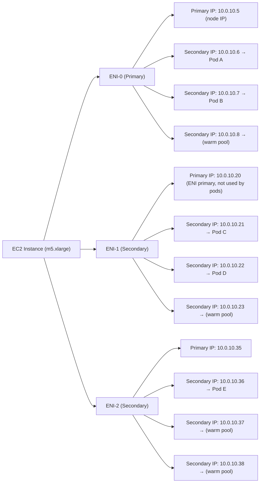
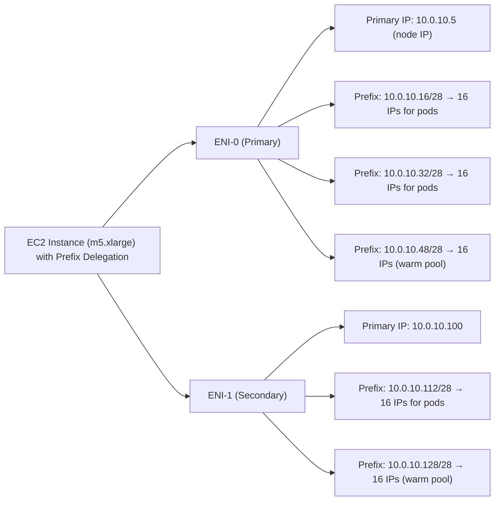
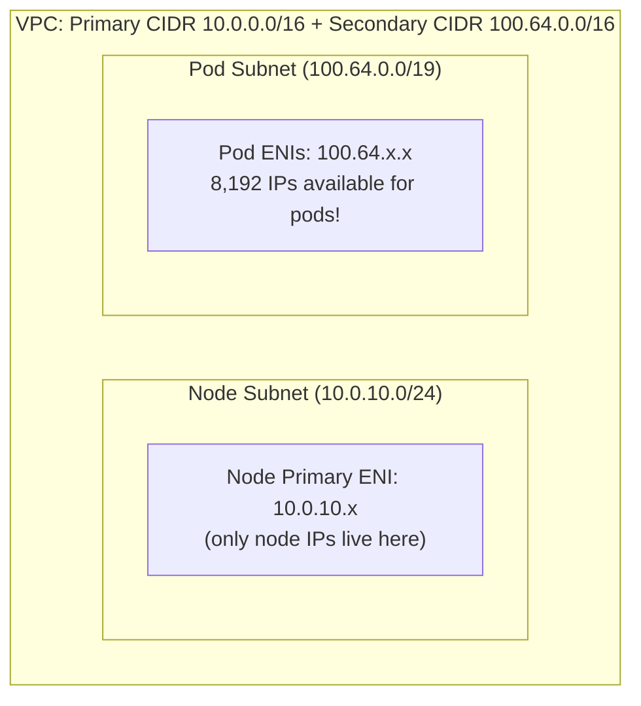
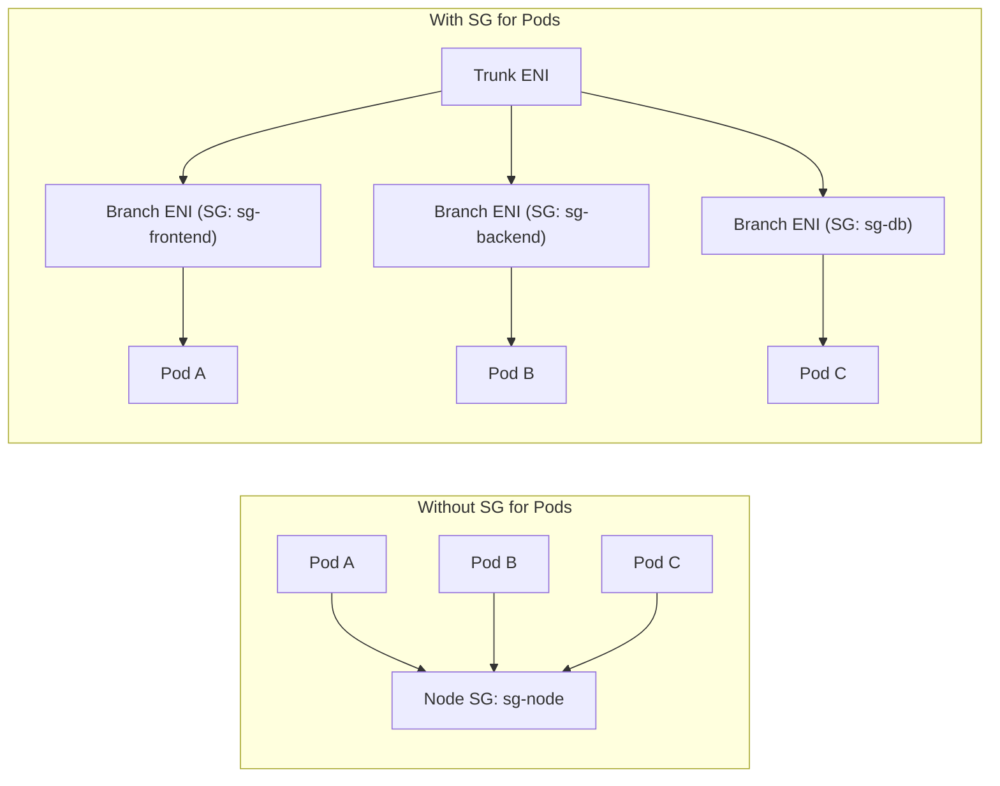
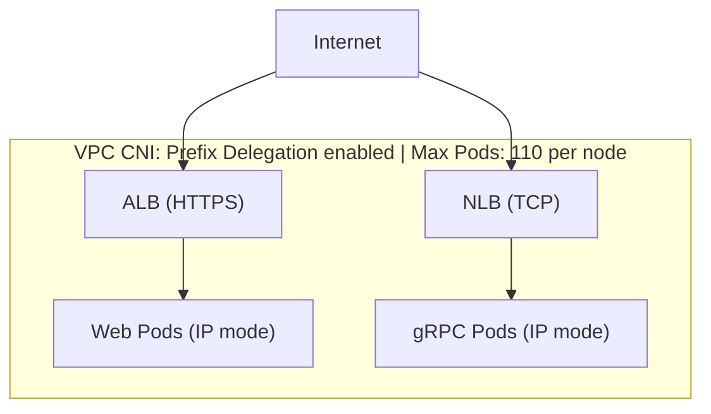

**Complexity**: [COMPLEX] | **Time to Complete**: 3.5h | **Prerequisites**: Module 5.1 (EKS Architecture & Control Plane)

## What You'll Be Able to Do

After completing this module, you will be able to:

- **Configure the AWS VPC CNI plugin with custom networking, prefix delegation, and secondary CIDR ranges for large clusters**
- **Implement EKS networking with security groups for pods, network policies, and pod-level traffic isolation**
- **Deploy AWS Load Balancer Controller to provision ALB ingress and NLB services from Kubernetes manifests**
- **Diagnose pod networking failures related to IP exhaustion, ENI limits, and subnet routing misconfigurations**

---

## Why This Module Matters

In March 2023, a major European e-commerce platform running 800 pods across 40 EKS nodes hit a wall during their annual spring sale. At 09:12, Kubernetes could not schedule new pods. The error was not about CPU or memory. It was `FailedCreatePodSandBox: failed to setup network for sandbox: no available IP addresses`. Their VPC subnets had run out of IP addresses. The VPC CNI plugin assigns a real VPC IP address to every single pod -- and with each `m5.xlarge` node consuming up to 58 IP addresses (14 ENIs x 4 secondary IPs + the node's primary IPs), their `/24` subnets were mathematically exhausted. The sale was live, customers were clicking, and the platform could not scale. The engineering team spent 90 minutes frantically adding secondary CIDR blocks and reconfiguring subnets while losing an estimated EUR 2.3 million in revenue.

This is the most common production failure mode specific to EKS. Unlike most Kubernetes distributions that use overlay networks (where pod IPs are virtual and unlimited), EKS uses the VPC CNI plugin, which gives every pod a routable VPC IP address. This is both a superpower (native VPC networking, security groups on pods, no overlay overhead) and a trap (finite IP address space that can run out at the worst possible moment).

In this module, you will master the VPC CNI mechanics, understand IP allocation modes including Prefix Delegation that 16x your IP capacity per ENI slot, learn how to solve IP exhaustion with Custom Networking and secondary CIDRs, configure Security Groups for Pods, set up the AWS Load Balancer Controller for ALB and NLB ingress, and understand EKS IPv6 networking.

---

## VPC CNI: How Pods Get Their IP Addresses

The Amazon VPC CNI plugin (`aws-node` DaemonSet) is the default networking solution for EKS. Unlike overlay networks (Calico, Cilium in overlay mode, Flannel), the VPC CNI assigns each pod a real, routable IP address from your VPC subnet. This means pods can communicate directly with any VPC resource -- RDS databases, ElastiCache clusters, Lambda functions -- without NAT or encapsulation.

### Secondary IP Mode (Default)

In the default mode, the VPC CNI pre-allocates secondary IP addresses on each node's Elastic Network Interfaces (ENIs). When a pod is scheduled, it receives one of these pre-allocated IPs.



The number of pods a node can run is directly limited by the formula:

```text
Max Pods = (Number of ENIs x (IPs per ENI - 1)) + 2

For m5.xlarge:
  ENIs: 4, IPs per ENI: 15
  Max Pods = (4 x (15 - 1)) + 2 = 58
```

The `-1` accounts for the primary IP on each ENI (used by the ENI itself, not assignable to pods). The `+2` accounts for the node's host-networking pods (kube-proxy and aws-node themselves).

### The Warm Pool: WARM_ENI_TARGET and WARM_IP_TARGET

The VPC CNI pre-allocates IPs to reduce pod startup latency. By default, it maintains one "warm" ENI (an ENI with all its IPs pre-allocated but unassigned to pods). This means a fresh node immediately consumes IPs for the entire warm ENI, even if no pods are scheduled.

```bash
# Check current VPC CNI configuration
k get daemonset aws-node -n kube-system -o json | \
  jq '.spec.template.spec.containers[0].env[] | select(.name | startswith("WARM"))'
```

Tuning the warm pool is critical for IP conservation:

| Variable | Default | Effect |
| :--- | :--- | :--- |
| `WARM_ENI_TARGET` | `1` | Number of warm (fully pre-allocated) ENIs to keep ready |
| `WARM_IP_TARGET` | Not set | Number of warm IPs to keep ready (overrides WARM_ENI_TARGET) |
| `MINIMUM_IP_TARGET` | Not set | Minimum IPs to keep allocated at all times |

For IP-constrained environments, set `WARM_IP_TARGET` instead of `WARM_ENI_TARGET`:

```bash
# Configure VPC CNI to keep only 2 warm IPs instead of an entire warm ENI
k set env daemonset aws-node -n kube-system \
  WARM_IP_TARGET=2 \
  WARM_ENI_TARGET=0 \
  MINIMUM_IP_TARGET=4
```

This reduces IP waste from ~15 IPs per node (one warm ENI) to just 2, but pod startup may be slightly slower when new ENIs need to be attached.

### Prefix Delegation Mode

Prefix Delegation fundamentally changes the IP math. Instead of assigning individual secondary IPs to each ENI slot, the VPC CNI assigns `/28` prefixes (16 IP addresses each) to each ENI slot. This multiplies your pod capacity by up to 16x per node.

```text
Secondary IP Mode (default):           Prefix Delegation Mode:
ENI Slot → 1 IP address                ENI Slot → /28 prefix (16 IPs)

m5.xlarge:                              m5.xlarge:
  4 ENIs x 15 slots = 60 IPs max         4 ENIs x 15 slots x 16 = 960 IPs max
  Max pods: ~58                           Max pods: 110 (capped by EKS)
```

EKS caps the maximum pods at 110 for most instance types (250 for some larger types), even if Prefix Delegation provides more IPs than that. The bottleneck shifts from IP addresses to node CPU and memory.

> **Stop and think**: If Prefix Delegation multiplies IP capacity by 16x, why does EKS still cap an m5.xlarge at 110 pods instead of the theoretical 960? (Hint: IP addresses are not the only resource a pod consumes on a node).

```bash
# Enable Prefix Delegation
k set env daemonset aws-node -n kube-system \
  ENABLE_PREFIX_DELEGATION=true \
  WARM_PREFIX_TARGET=1

# IMPORTANT: Update your node group's max-pods setting
# For managed node groups, use a launch template with custom user data:
# --kubelet-extra-args '--max-pods=110'

# Verify prefix delegation is active
k get ds aws-node -n kube-system -o json | \
  jq '.spec.template.spec.containers[0].env[] | select(.name=="ENABLE_PREFIX_DELEGATION")'
```

After enabling Prefix Delegation, you must also update the `max-pods` setting on your nodes. Without this, the kubelet still uses the old secondary-IP-based pod limit, and the extra IPs go to waste.

How Prefix Delegation looks on a node:



---

## Solving IP Exhaustion

Even with Prefix Delegation, large clusters can exhaust their subnet IP space. Here are the production-grade solutions.

### Solution 1: Secondary CIDR Blocks

Add a non-routable (RFC 6598) CIDR block to your VPC specifically for pod IPs. The `100.64.0.0/10` range is commonly used because it does not conflict with typical RFC 1918 ranges.

```bash
# Add secondary CIDR to VPC
aws ec2 associate-vpc-cidr-block \
  --vpc-id $VPC_ID \
  --cidr-block 100.64.0.0/16

# Create new subnets in the secondary CIDR range
POD_SUB1=$(aws ec2 create-subnet \
  --vpc-id $VPC_ID \
  --cidr-block 100.64.0.0/19 \
  --availability-zone us-east-1a \
  --query 'Subnet.SubnetId' --output text)

POD_SUB2=$(aws ec2 create-subnet \
  --vpc-id $VPC_ID \
  --cidr-block 100.64.32.0/19 \
  --availability-zone us-east-1b \
  --query 'Subnet.SubnetId' --output text)

# Tag for EKS
aws ec2 create-tags --resources $POD_SUB1 $POD_SUB2 \
  --tags Key=Name,Value=EKS-Pod-Subnet
```

### Solution 2: Custom Networking (ENIConfig)

Custom Networking tells the VPC CNI to place pod ENIs in different subnets than the node's primary ENI. Combined with secondary CIDRs, this gives pods a massive, separate IP space.

```bash
# Enable custom networking on the VPC CNI
k set env daemonset aws-node -n kube-system \
  AWS_VPC_K8S_CNI_CUSTOM_NETWORK_CFG=true \
  ENI_CONFIG_LABEL_DEF=topology.kubernetes.io/zone
```

Create ENIConfig resources that map Availability Zones to pod subnets:

```yaml
# eniconfig-us-east-1a.yaml
apiVersion: crd.k8s.amazonaws.com/v1alpha1
kind: ENIConfig
metadata:
  name: us-east-1a
spec:
  subnet: subnet-aaa111    # Pod subnet in 100.64.0.0/19
  securityGroups:
    - sg-0abc123def456      # Security group for pods
---
# eniconfig-us-east-1b.yaml
apiVersion: crd.k8s.amazonaws.com/v1alpha1
kind: ENIConfig
metadata:
  name: us-east-1b
spec:
  subnet: subnet-bbb222    # Pod subnet in 100.64.32.0/19
  securityGroups:
    - sg-0abc123def456
```

```bash
k apply -f eniconfig-us-east-1a.yaml
k apply -f eniconfig-us-east-1b.yaml
```

After enabling Custom Networking, the architecture looks like this:



> **Pause and predict**: If we place pod ENIs into a separate subnet from the node's primary ENI, what happens to the ENI slot that the node's primary interface occupies? Can pods still use it?

> **Important**: With Custom Networking, the node's primary ENI is NOT used for pod IPs. This means the max-pods formula loses one ENI: `Max Pods = ((ENIs - 1) x (IPs per ENI - 1)) + 2`. For `m5.xlarge`, that drops from 58 to 44 in secondary IP mode. Combine Custom Networking with Prefix Delegation to get the best of both worlds.

*War Story: The e-commerce company from the opening eventually implemented Custom Networking with a `100.64.0.0/16` secondary CIDR. Their pod subnets went from 251 IPs (a `/24`) to 8,192 IPs per AZ (a `/19`). Combined with Prefix Delegation, they ran their next spring sale with 2,400 pods and never came close to exhaustion. The total migration took two weeks, including new node groups -- you cannot enable Custom Networking on existing nodes.*

---

## Security Groups for Pods

By default, all pods on a node share the node's security groups. Security Groups for Pods allows you to assign VPC security groups directly to individual pods, enabling network-level isolation at the pod granularity rather than the node level.

### How It Works

Security Groups for Pods uses a feature called "branch ENIs" (also called trunk ENIs). The VPC CNI creates a trunk ENI on the node and then creates branch ENIs off that trunk, each with its own security group.



### Enabling Security Groups for Pods

```bash
# Enable the feature on the VPC CNI
k set env daemonset aws-node -n kube-system \
  ENABLE_POD_ENI=true \
  POD_SECURITY_GROUP_ENFORCING_MODE=standard
```

Create a `SecurityGroupPolicy` resource that maps pods to security groups:

```yaml
apiVersion: vpcresources.k8s.aws/v1beta1
kind: SecurityGroupPolicy
metadata:
  name: backend-sgp
  namespace: production
spec:
  podSelector:
    matchLabels:
      app: payment-service
  securityGroups:
    groupIds:
      - sg-0abc123def456    # Allow only port 8080 from ALB
      - sg-0def789ghi012    # Allow only port 5432 to RDS
```

Any pod in the `production` namespace with the label `app: payment-service` will now use these specific security groups instead of the node's security groups.

### Limitations to Know

- Pods with security groups cannot use NodePort or HostPort services
- Node must use a Nitro-based instance type (m5, m6i, c5, r5, etc.)
- Each branch ENI consumes one of the node's ENI slots, reducing pod capacity
- Security group changes require pod restart (not hot-reloaded)

---

## AWS Load Balancer Controller

The AWS Load Balancer Controller is the modern replacement for the legacy `kube-proxy`-based Service type LoadBalancer. It provisions and configures AWS Application Load Balancers (ALBs) for Ingress resources and Network Load Balancers (NLBs) for Service type LoadBalancer.

### Installation

```bash
# Install via Helm
helm repo add eks https://aws.github.io/eks-charts
helm repo update

helm install aws-load-balancer-controller eks/aws-load-balancer-controller \
  -n kube-system \
  --set clusterName=my-cluster \
  --set serviceAccount.create=true \
  --set serviceAccount.annotations."eks\.amazonaws\.com/role-arn"=arn:aws:iam::123456789012:role/AWSLoadBalancerControllerRole
```

### ALB for HTTP/HTTPS Traffic

The controller creates an ALB when you create an Ingress resource with the `alb` ingress class:

```yaml
apiVersion: networking.k8s.io/v1
kind: Ingress
metadata:
  name: web-ingress
  namespace: production
  annotations:
    alb.ingress.kubernetes.io/scheme: internet-facing
    alb.ingress.kubernetes.io/target-type: ip
    alb.ingress.kubernetes.io/certificate-arn: arn:aws:acm:us-east-1:123456789012:certificate/abc-123
    alb.ingress.kubernetes.io/listen-ports: '[{"HTTPS":443}]'
    alb.ingress.kubernetes.io/ssl-redirect: "443"
    alb.ingress.kubernetes.io/healthcheck-path: /healthz
    alb.ingress.kubernetes.io/group.name: shared-alb
spec:
  ingressClassName: alb
  rules:
    - host: app.example.com
      http:
        paths:
          - path: /
            pathType: Prefix
            backend:
              service:
                name: web-service
                port:
                  number: 80
```

Key annotations explained:

| Annotation | Purpose |
| :--- | :--- |
| `scheme: internet-facing` | Public ALB (vs. `internal` for private) |
| `target-type: ip` | Route directly to pod IPs (vs. `instance` for NodePort) |
| `group.name` | Share one ALB across multiple Ingress resources (cost savings) |
| `ssl-redirect` | Automatic HTTP-to-HTTPS redirect |
| `certificate-arn` | ACM certificate for TLS termination |

The `target-type: ip` annotation is critical for EKS. It tells the ALB to send traffic directly to pod IP addresses (which are real VPC IPs, thanks to the VPC CNI). This bypasses the kube-proxy hop and gives you direct pod-level health checking.

### NLB for gRPC and TCP Traffic

For non-HTTP workloads (gRPC, TCP, UDP), use a Service type LoadBalancer that creates an NLB:

```yaml
apiVersion: v1
kind: Service
metadata:
  name: grpc-service
  namespace: production
  annotations:
    service.beta.kubernetes.io/aws-load-balancer-type: external
    service.beta.kubernetes.io/aws-load-balancer-nlb-target-type: ip
    service.beta.kubernetes.io/aws-load-balancer-scheme: internet-facing
    service.beta.kubernetes.io/aws-load-balancer-healthcheck-protocol: HTTP
    service.beta.kubernetes.io/aws-load-balancer-healthcheck-path: /grpc.health.v1.Health/Check
    service.beta.kubernetes.io/aws-load-balancer-backend-protocol: tcp
    service.beta.kubernetes.io/aws-load-balancer-cross-zone-load-balancing-enabled: "true"
spec:
  type: LoadBalancer
  loadBalancerClass: service.k8s.aws/nlb
  selector:
    app: grpc-backend
  ports:
    - name: grpc
      port: 443
      targetPort: 8443
      protocol: TCP
```

### ALB vs. NLB Decision Matrix

| Feature | ALB (Application LB) | NLB (Network LB) |
| :--- | :--- | :--- |
| **OSI Layer** | Layer 7 (HTTP/HTTPS) | Layer 4 (TCP/UDP/TLS) |
| **Protocols** | HTTP, HTTPS, gRPC (HTTP/2) | TCP, UDP, TLS |
| **Path routing** | Yes (host, path, header) | No |
| **WebSocket** | Yes | Yes (TCP) |
| **Static IP** | No (use Global Accelerator) | Yes (Elastic IP per AZ) |
| **Latency** | ~1-5ms added | ~100us added |
| **gRPC** | ALB supports gRPC natively | NLB via TLS passthrough |
| **Cost** | $0.0225/hr + LCU | $0.0225/hr + NLCU |
| **Best for** | Web apps, REST APIs | gRPC, databases, gaming, IoT |

> **Pause and predict**: If your application uses WebSockets which require long-lived persistent connections, which load balancer type would provide the most efficient routing without connection drops during scaling events?

---

## IPv6 on EKS

EKS supports IPv6-only pods, which eliminates IP exhaustion entirely by giving every pod a unique IPv6 address from your VPC's `/56` range (over 4 billion billion IPs).

### Enabling IPv6

IPv6 must be configured at cluster creation -- you cannot migrate an existing IPv4 cluster to IPv6.

```bash
# Create an IPv6 cluster
aws eks create-cluster \
  --name ipv6-cluster \
  --role-arn $EKS_ROLE_ARN \
  --kubernetes-network-config ipFamily=ipv6 \
  --resources-vpc-config subnetIds=$SUB1,$SUB2,endpointPublicAccess=true,endpointPrivateAccess=true \
  --kubernetes-version 1.35
```

In IPv6 mode:

- Pods get IPv6 addresses only
- Services get both IPv4 and IPv6 cluster IPs (dual-stack)
- Node-to-node traffic uses IPv6
- External traffic uses IPv6 (requires IPv6-capable VPC and subnets)
- No IP exhaustion (the `/56` provides 4,722,366,482,869,645,213,696 addresses)

The trade-off is that many AWS services and third-party tools still have limited IPv6 support. Test thoroughly before adopting.

---

## Did You Know?

1. The VPC CNI's default behavior of pre-allocating one warm ENI per node means a 100-node cluster with `m5.xlarge` instances wastes approximately 1,400 IP addresses just on warm pools (14 IPs per warm ENI x 100 nodes). By switching `WARM_IP_TARGET=2` and `WARM_ENI_TARGET=0`, you can recover roughly 1,200 of those IPs immediately. For teams hitting IP exhaustion, this is often the fastest fix before migrating to Prefix Delegation.

2. Prefix Delegation was introduced in 2021 and is now the AWS-recommended default for new clusters. A single `m5.xlarge` node goes from supporting 58 pods to 110 pods (the EKS-imposed cap), while consuming fewer IP reservation calls because a `/28` prefix is allocated atomically rather than 15 individual IPs. This also reduces EC2 API throttling during large-scale node launches.

3. The AWS Load Balancer Controller's `group.name` annotation lets you share a single ALB across dozens of Ingress resources. Without it, every Ingress creates its own ALB at $16/month minimum. A team with 30 microservices each exposing an Ingress could be paying $480/month in ALB charges when a single shared ALB with path-based routing would cost $16/month plus traffic.

4. Security Groups for Pods use Nitro's "branch ENI" capability, which was originally designed for AWS ECS. The trunk/branch architecture allows up to 110 branch ENIs on a single node (depending on instance type), each with its own security group. This is the same technology that makes ECS task-level networking work, repurposed for Kubernetes pods.

---

## Common Mistakes

| Mistake | Why It Happens | How to Fix It |
| :--- | :--- | :--- |
| **Not enabling Prefix Delegation on new clusters** | Unaware it exists, or using default VPC CNI settings from older guides. | Enable `ENABLE_PREFIX_DELEGATION=true` and update `max-pods` in your node group launch template. This should be default for all new clusters. |
| **IP exhaustion from warm ENI pre-allocation** | Default `WARM_ENI_TARGET=1` wastes 14+ IPs per node on pre-allocated but unused ENIs. | Set `WARM_IP_TARGET=2` and `WARM_ENI_TARGET=0` in the `aws-node` DaemonSet environment variables. |
| **Using `target-type: instance` with ALB** | Copying old examples that pre-date the `ip` target type. Instance mode adds a NodePort hop and loses pod-level health checks. | Always use `target-type: ip` with the AWS Load Balancer Controller. It routes directly to pod IPs and enables pod-level health checking. |
| **Creating a separate ALB per Ingress** | Not knowing about the `group.name` annotation for ALB sharing. | Add `alb.ingress.kubernetes.io/group.name: shared-alb` to Ingress annotations. Multiple Ingress resources share one ALB. |
| **Forgetting max-pods after enabling Prefix Delegation** | Enabling PD on the VPC CNI but not updating the kubelet configuration on nodes. | Use a launch template with `--kubelet-extra-args '--max-pods=110'` or use the EKS-recommended max-pods calculator script. |
| **Custom Networking without new node groups** | Enabling `AWS_VPC_K8S_CNI_CUSTOM_NETWORK_CFG=true` on existing nodes that were not provisioned with ENIConfig. | Custom Networking requires rolling out new node groups. Existing nodes must be drained and replaced. |
| **NLB with missing cross-zone annotation** | Assuming NLB distributes evenly across AZs by default. NLB is zonal by default -- each AZ node gets equal share regardless of pod count. | Set `aws-load-balancer-cross-zone-load-balancing-enabled: "true"` for even distribution. |
| **Security Groups for Pods on non-Nitro instances** | Using t2 or m4 instance types that do not support trunk/branch ENIs. | Use Nitro-based instances (m5, m6i, c5, r5, t3, and newer). Check the [instance type compatibility matrix](https://docs.aws.amazon.com/AWSEC2/latest/UserGuide/instance-types.html). |

---

## Quiz

<details>
<summary>Question 1: Your EKS cluster runs on m5.xlarge nodes. In secondary IP mode, each node can run 58 pods. After enabling Prefix Delegation, you expect 110 pods per node, but nodes still cap at 58 pods. What did you miss?</summary>

You forgot to update the **max-pods setting** on the nodes. Prefix Delegation changes how the VPC CNI allocates IPs, but the kubelet enforces its own pod limit independently. You need to update the launch template's user data to include `--kubelet-extra-args '--max-pods=110'` and roll out new nodes. The VPC CNI can allocate hundreds of IPs via prefix delegation, but if the kubelet still thinks the max is 58, it will reject any scheduling beyond that limit.
</details>

<details>
<summary>Question 2: Your EKS cluster is running 50 nodes of `m5.xlarge`. You notice that even though you only have 100 pods deployed across the entire cluster, you have exhausted over 700 IPs from your VPC subnet. The cluster is using default VPC CNI settings. A colleague suggests changing `WARM_ENI_TARGET` to 0 and setting `WARM_IP_TARGET=2`. Will this resolve the IP exhaustion, and what trade-off are you making?</summary>

Yes, this will immediately recover a massive number of IPs. By default, `WARM_ENI_TARGET=1` keeps an entire ENI (up to 14 secondary IPs on an m5.xlarge) fully pre-allocated per node, which means 50 nodes waste about 700 IPs just sitting idle in the warm pool. By switching to `WARM_IP_TARGET=2`, you instruct the VPC CNI to only keep 2 IPs pre-allocated per node, returning the rest to the VPC. The trade-off is that when a node needs to schedule a 3rd pod rapidly, it must make an AWS API call to attach a new ENI or assign a new IP, introducing 1-2 seconds of pod startup latency.
</details>

<details>
<summary>Question 3: You just migrated your EKS cluster to use Custom Networking to solve IP exhaustion, mapping pod IPs to a massive `100.64.0.0/16` secondary CIDR. However, immediately after rolling out the new node groups, you get alerts that `m5.xlarge` nodes are failing to schedule more than 44 pods, even though they used to schedule 58 pods before the migration. What is causing this capacity reduction, and how can you fix it?</summary>

The reduction is happening because Custom Networking reserves the node's primary ENI exclusively for node-level communication in the primary subnet, completely removing it from the pod IP allocation pool. Previously, the primary ENI could host secondary IPs for pods, but now only the secondary ENIs (which are attached to the Custom Networking subnets) can host pods. For an m5.xlarge, this reduces the usable ENIs from 4 to 3, dropping max pods from 58 to 44. To fix this and massively increase capacity, you should enable Prefix Delegation alongside Custom Networking, which will assign `/28` prefixes to those remaining ENI slots and allow the node to easily hit the EKS hard cap of 110 pods. This combination ensures pods have dedicated IP space while maximizing scheduling density per node.
</details>

<details>
<summary>Question 4: During a busy traffic spike, you have a Kubernetes Ingress with the annotation `target-type: instance` routing to pods spread across 10 nodes in 3 Availability Zones. One of the application pods suddenly crashes and begins failing its readiness probe, yet users are reporting intermittent HTTP 502 errors when accessing the service. Why is traffic still reaching the failed pod, and how do you resolve it?</summary>

With `target-type: instance`, the ALB targets the NodePort on each node, not individual pods. The ALB health checks the NodePort -- and if any pod behind that NodePort on a specific node fails, kube-proxy may still route traffic to the unhealthy pod because the ALB only sees the node as healthy or unhealthy. This means traffic can reach unhealthy pods until kube-proxy removes the endpoint. With `target-type: ip`, the ALB health-checks each pod directly and stops sending traffic to failed pods within seconds, regardless of the node. Changing the target type completely bypasses the unpredictable kube-proxy hop, providing immediate routing updates when a pod fails.
</details>

<details>
<summary>Question 5: Your team successfully implements Security Groups for Pods to isolate a sensitive payment service, attaching a dedicated security group that only allows inbound traffic on port 443. Immediately after the pods restart to apply the policy, the application begins throwing connection timeout errors because it cannot resolve the database's DNS hostname. What went wrong with the network configuration?</summary>

When you assign security groups to pods via SecurityGroupPolicy, those pods use the specified security groups **instead of** the node's security groups. By default, security groups deny all outbound traffic unless explicitly permitted. If the pod-specific security groups do not include an outbound rule allowing DNS traffic (UDP port 53 to the CoreDNS service IP, typically `10.100.0.10`), DNS resolution fails entirely. The fix is to add an outbound rule for UDP/TCP port 53 to the CoreDNS cluster IP CIDR (or the VPC CIDR) in the pod's security group. This ensures the pod can communicate with CoreDNS before attempting to reach external dependencies.
</details>

<details>
<summary>Question 6: Your platform hosts 45 different microservices, each with its own standard Kubernetes Ingress resource using the `alb` ingress class. Finance just flagged your AWS bill because you are spending over $700 per month just on Application Load Balancers. You need to reduce this cost immediately without changing the routing behavior for the clients. How can you architect this change using the AWS Load Balancer Controller, and what operational risk does it introduce?</summary>

You can consolidate all 45 microservices behind a single Application Load Balancer by adding the `alb.ingress.kubernetes.io/group.name: shared-alb` annotation to all 45 Ingress resources. The AWS Load Balancer Controller will merge these into a single ALB with path-based or host-based listener rules, reducing your fixed ALB hourly costs from 45 LBs down to just 1. However, this introduces a shared blast radius risk: if someone deploys a misconfigured Ingress that breaks the ALB listener rules, or if you exceed the AWS quota of 100 rules per ALB, all 45 microservices could experience routing failures simultaneously. It is best practice to group non-critical services together while keeping highly critical domains on dedicated ALBs. This balances cost efficiency with isolation and operational safety.
</details>

<details>
<summary>Question 7: During an unexpected traffic surge, your EKS cluster scales rapidly to handle the load, but new pods suddenly remain in a Pending state due to `FailedCreatePodSandBox: no available IP addresses`. Your VPC uses a `10.0.0.0/16` CIDR and you have exhausted all IPs in your EKS subnets. What are your two fastest options to restore scheduling capability without rebuilding the cluster?</summary>

**Option 1**: Tune the VPC CNI warm pool by setting `WARM_IP_TARGET=1` and `WARM_ENI_TARGET=0` on the `aws-node` DaemonSet. This immediately releases pre-allocated but unused IPs across all nodes, often recovering hundreds of IPs within minutes. **Option 2**: Enable Prefix Delegation (`ENABLE_PREFIX_DELEGATION=true`), which changes the allocation from individual IPs to `/28` prefixes, dramatically reducing the number of IPs consumed per ENI slot while increasing pod capacity. Both changes take effect within minutes as the aws-node DaemonSet rolls out, though Prefix Delegation requires updating max-pods on nodes (meaning a rolling restart). For a longer-term architectural fix, you should add a secondary CIDR (e.g., `100.64.0.0/16`) with Custom Networking to permanently expand the available address space.
</details>

---

## Hands-On Exercise: Prefix Delegation + ALB for Web + NLB for gRPC

In this exercise, you will configure an EKS cluster with Prefix Delegation for maximum IP efficiency, deploy a web application behind an ALB, and a gRPC service behind an NLB.

**What you will build:**



### Task 1: Enable Prefix Delegation on the VPC CNI

Configure the VPC CNI for Prefix Delegation and verify it is working.

<details>
<summary>Solution</summary>

```bash
# Enable Prefix Delegation
k set env daemonset aws-node -n kube-system \
  ENABLE_PREFIX_DELEGATION=true \
  WARM_PREFIX_TARGET=1

# Wait for the DaemonSet to roll out
k rollout status daemonset aws-node -n kube-system --timeout=120s

# Verify on a node (check that prefixes are assigned, not individual IPs)
NODE_NAME=$(k get nodes -o jsonpath='{.items[0].metadata.name}')
k get node $NODE_NAME -o json | jq '.status.allocatable["vpc.amazonaws.com/pod-ens"]'

# Check ENI details via AWS CLI
INSTANCE_ID=$(k get node $NODE_NAME -o json | jq -r '.spec.providerID' | cut -d'/' -f5)
aws ec2 describe-instances --instance-ids $INSTANCE_ID \
  --query 'Reservations[0].Instances[0].NetworkInterfaces[*].{ENI:NetworkInterfaceId, Ipv4Prefixes:Ipv4Prefixes[*].Ipv4Prefix}' \
  --output json

# You should see /28 prefixes instead of individual secondary IPs
```

</details>

### Task 2: Update Node Group Max-Pods

Ensure the kubelet allows 110 pods to take advantage of Prefix Delegation.

<details>
<summary>Solution</summary>

```bash
# Create a new launch template with updated max-pods
cat > /tmp/eks-userdata.txt << 'USERDATA'
#!/bin/bash
/etc/eks/bootstrap.sh my-cluster \
  --kubelet-extra-args '--max-pods=110'
USERDATA

USERDATA_B64=$(base64 -i /tmp/eks-userdata.txt)

# Create launch template
LT_ID=$(aws ec2 create-launch-template \
  --launch-template-name eks-prefix-delegation \
  --launch-template-data "{
    \"UserData\": \"$USERDATA_B64\",
    \"InstanceType\": \"m6i.large\"
  }" \
  --query 'LaunchTemplate.LaunchTemplateId' --output text)

# Update the node group to use the new launch template
aws eks update-nodegroup-config \
  --cluster-name my-cluster \
  --nodegroup-name standard-workers \
  --launch-template id=$LT_ID,version=1

# Wait for the update (this triggers a rolling replacement)
aws eks wait nodegroup-active \
  --cluster-name my-cluster \
  --nodegroup-name standard-workers

# Verify max-pods on a new node
k get node -o json | jq '.items[0].status.allocatable.pods'
# Should show "110"
```

</details>

### Task 3: Install the AWS Load Balancer Controller

<details>
<summary>Solution</summary>

```bash
# Add the EKS Helm repo
helm repo add eks https://aws.github.io/eks-charts
helm repo update

# Create the IAM policy for the controller
curl -o /tmp/iam_policy.json https://raw.githubusercontent.com/kubernetes-sigs/aws-load-balancer-controller/v2.11.0/docs/install/iam_policy.json

aws iam create-policy \
  --policy-name AWSLoadBalancerControllerIAMPolicy \
  --policy-document file:///tmp/iam_policy.json

# Install the controller
helm install aws-load-balancer-controller eks/aws-load-balancer-controller \
  -n kube-system \
  --set clusterName=my-cluster \
  --set serviceAccount.create=true \
  --set serviceAccount.name=aws-load-balancer-controller \
  --set serviceAccount.annotations."eks\.amazonaws\.com/role-arn"=arn:aws:iam::$(aws sts get-caller-identity --query Account --output text):role/AWSLoadBalancerControllerRole

# Verify the controller is running
k get deployment aws-load-balancer-controller -n kube-system
k get pods -n kube-system -l app.kubernetes.io/name=aws-load-balancer-controller
```

</details>

### Task 4: Deploy a Web Application Behind an ALB

<details>
<summary>Solution</summary>

```bash
# Create namespace
k create namespace web-demo

# Deploy the web application
cat <<'EOF' | k apply -f -
apiVersion: apps/v1
kind: Deployment
metadata:
  name: web-app
  namespace: web-demo
spec:
  replicas: 3
  selector:
    matchLabels:
      app: web-app
  template:
    metadata:
      labels:
        app: web-app
    spec:
      containers:
        - name: nginx
          image: nginx:1.27
          ports:
            - containerPort: 80
          readinessProbe:
            httpGet:
              path: /
              port: 80
            initialDelaySeconds: 5
            periodSeconds: 10
          resources:
            requests:
              cpu: 100m
              memory: 128Mi
            limits:
              cpu: 200m
              memory: 256Mi
---
apiVersion: v1
kind: Service
metadata:
  name: web-app-svc
  namespace: web-demo
spec:
  selector:
    app: web-app
  ports:
    - port: 80
      targetPort: 80
  type: ClusterIP
---
apiVersion: networking.k8s.io/v1
kind: Ingress
metadata:
  name: web-app-ingress
  namespace: web-demo
  annotations:
    alb.ingress.kubernetes.io/scheme: internet-facing
    alb.ingress.kubernetes.io/target-type: ip
    alb.ingress.kubernetes.io/healthcheck-path: /
    alb.ingress.kubernetes.io/group.name: dojo-shared-alb
spec:
  ingressClassName: alb
  rules:
    - http:
        paths:
          - path: /
            pathType: Prefix
            backend:
              service:
                name: web-app-svc
                port:
                  number: 80
EOF

# Wait for ALB to provision (takes 2-3 minutes)
echo "Waiting for ALB to provision..."
sleep 30
ALB_URL=$(k get ingress web-app-ingress -n web-demo -o jsonpath='{.status.loadBalancer.ingress[0].hostname}')
echo "ALB URL: http://$ALB_URL"

# Test (may take a minute for DNS propagation)
curl -s -o /dev/null -w "%{http_code}" http://$ALB_URL
```

</details>

### Task 5: Deploy a gRPC Service Behind an NLB

<details>
<summary>Solution</summary>

```bash
# Deploy a gRPC health check service (using grpcbin as example)
cat <<'EOF' | k apply -f -
apiVersion: apps/v1
kind: Deployment
metadata:
  name: grpc-service
  namespace: web-demo
spec:
  replicas: 2
  selector:
    matchLabels:
      app: grpc-service
  template:
    metadata:
      labels:
        app: grpc-service
    spec:
      containers:
        - name: grpcbin
          image: moul/grpcbin:latest
          ports:
            - containerPort: 9000
              name: grpc
            - containerPort: 9001
              name: grpc-insecure
          resources:
            requests:
              cpu: 100m
              memory: 128Mi
            limits:
              cpu: 200m
              memory: 256Mi
---
apiVersion: v1
kind: Service
metadata:
  name: grpc-nlb
  namespace: web-demo
  annotations:
    service.beta.kubernetes.io/aws-load-balancer-type: external
    service.beta.kubernetes.io/aws-load-balancer-nlb-target-type: ip
    service.beta.kubernetes.io/aws-load-balancer-scheme: internet-facing
    service.beta.kubernetes.io/aws-load-balancer-cross-zone-load-balancing-enabled: "true"
spec:
  type: LoadBalancer
  loadBalancerClass: service.k8s.aws/nlb
  selector:
    app: grpc-service
  ports:
    - name: grpc
      port: 9000
      targetPort: 9000
      protocol: TCP
EOF

# Wait for NLB to provision
sleep 30
NLB_HOST=$(k get svc grpc-nlb -n web-demo -o jsonpath='{.status.loadBalancer.ingress[0].hostname}')
echo "NLB hostname: $NLB_HOST"

# Verify NLB targets are healthy
NLB_ARN=$(aws elbv2 describe-load-balancers \
  --query "LoadBalancers[?DNSName=='$NLB_HOST'].LoadBalancerArn" --output text)
TG_ARN=$(aws elbv2 describe-target-groups \
  --load-balancer-arn $NLB_ARN \
  --query 'TargetGroups[0].TargetGroupArn' --output text)
aws elbv2 describe-target-health --target-group-arn $TG_ARN \
  --query 'TargetHealthDescriptions[*].{Target:Target.Id, Port:Target.Port, Health:TargetHealth.State}' \
  --output table
```

</details>

### Task 6: Verify Pod IP Allocation with Prefix Delegation

Confirm that pods are using IPs from allocated prefixes, not individual secondary IPs.

<details>
<summary>Solution</summary>

```bash
# Get pod IPs
k get pods -n web-demo -o wide

# Pick a node and inspect its ENI prefixes
NODE=$(k get pods -n web-demo -o jsonpath='{.items[0].spec.nodeName}')
INSTANCE_ID=$(k get node $NODE -o json | jq -r '.spec.providerID' | cut -d'/' -f5)

# Show allocated prefixes on the instance
aws ec2 describe-instances --instance-ids $INSTANCE_ID \
  --query 'Reservations[0].Instances[0].NetworkInterfaces[*].{
    ENI: NetworkInterfaceId,
    Prefixes: Ipv4Prefixes[*].Ipv4Prefix,
    SecondaryIPs: PrivateIpAddresses[?Primary==`false`].PrivateIpAddress
  }' --output json

# You should see Prefixes populated and SecondaryIPs empty (or minimal)
# Each prefix is a /28 = 16 IPs

# Verify max-pods
k get node $NODE -o json | jq '.status.allocatable.pods'
```

</details>

### Clean Up

```bash
k delete namespace web-demo
helm uninstall aws-load-balancer-controller -n kube-system
# Clean up ALB/NLB if they persist (check the AWS console)
```

### Success Criteria

- [ ] I enabled Prefix Delegation on the VPC CNI and verified `/28` prefixes on node ENIs
- [ ] I updated node max-pods to 110 to take advantage of Prefix Delegation
- [ ] I installed the AWS Load Balancer Controller via Helm
- [ ] I deployed a web application accessible through an ALB with `target-type: ip`
- [ ] I deployed a gRPC service accessible through an NLB with cross-zone load balancing
- [ ] I verified ALB/NLB target health shows pod IPs (not node IPs)
- [ ] I can explain why Prefix Delegation solves IP exhaustion for most clusters

---

## Next Module

Your pods have IP addresses and your traffic flows through load balancers. But how do those pods authenticate to AWS services like S3, DynamoDB, and SQS? Head to [Module 5.3: EKS Identity (IRSA vs Pod Identity)](../module-5.3-eks-identity/) to master the transition from IRSA to the simpler Pod Identity system.