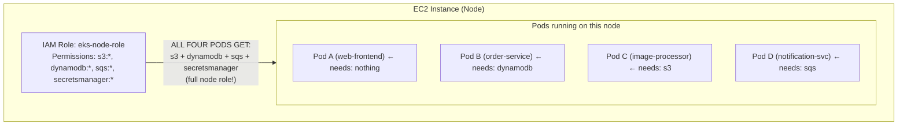
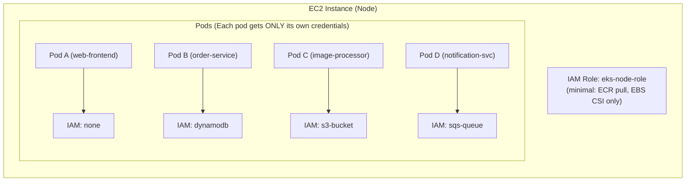
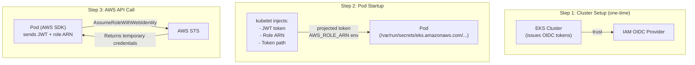
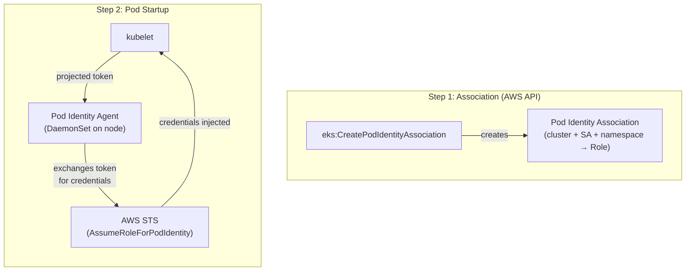
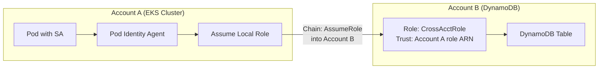
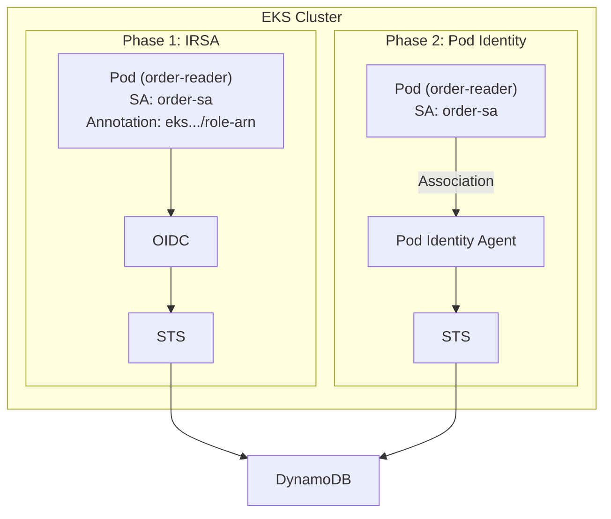

**Complexity**: [QUICK] | **Time to Complete**: 1.5h | **Prerequisites**: Module 5.1 (EKS Architecture & Control Plane)

## What You'll Be Able to Do

After completing this module, you will be able to:

- **Configure IRSA (IAM Roles for Service Accounts) and EKS Pod Identity to grant pods least-privilege AWS access**
- **Implement OIDC provider trust relationships between EKS clusters and AWS IAM for workload authentication**
- **Design cross-account access patterns for EKS workloads that need to access resources in other AWS accounts**
- **Compare IRSA vs Pod Identity and migrate workloads from the legacy approach to the modern EKS Pod Identity model**

---

## Why This Module Matters

In 2022, a healthcare SaaS company running on EKS discovered that every pod in their cluster had full access to their S3 buckets containing patient health records. The reason was painfully simple: their developers had attached an IAM instance profile with `s3:*` permissions to the node group. Since EC2 instance metadata is available to all pods on a node, any compromised pod -- including a logging sidecar from a third-party vendor -- could read, write, and delete HIPAA-protected data from any bucket. The security team discovered this during a compliance audit, not during development. The remediation involved rewriting IAM policies for 60 microservices and took three months.

This is the "node-level blast radius" problem. Without pod-level identity, every pod inherits whatever IAM permissions are attached to the underlying EC2 node. A vulnerability in one pod gives an attacker the combined permissions of every workload running on that node. The solution is pod-level IAM identity: giving each pod only the specific AWS permissions it needs, and nothing more.

EKS offers two mechanisms for this: **IAM Roles for Service Accounts (IRSA)**, which has been available since 2019, and **EKS Pod Identity**, which launched in late 2023 as a simpler replacement. In this module, you will understand how both systems work, when to use each, and how to migrate from IRSA to Pod Identity. You will also learn how to troubleshoot the most common STS errors that plague EKS identity configurations.

---

## The Problem: Node-Level IAM Is Dangerous

Before IRSA and Pod Identity existed, the only way to give pods AWS access was through the node's IAM instance profile. This is still the default if you do nothing else.



> **Stop and think**: If Pod A only serves static frontend assets and needs no AWS access whatsoever, why does it pose a critical security risk when scheduled on a node with the `eks-node-role` shown above? Consider the perspective of an attacker who achieves remote code execution inside Pod A.

If an attacker exploits a vulnerability in Pod A (which should not need any AWS access at all), they can reach the instance metadata service at `169.254.169.254` and obtain temporary credentials for the node role -- giving them access to DynamoDB, S3, SQS, and Secrets Manager.

Pod-level identity solves this:



---

## IRSA: IAM Roles for Service Accounts (The Legacy Approach)

IRSA was the first solution to pod-level identity on EKS. It works by leveraging OpenID Connect (OIDC) to establish a trust relationship between your EKS cluster and IAM.

### How IRSA Works

The flow involves four components: the EKS OIDC provider, IAM, the pod's service account, and the AWS SDK inside the pod.



### Setting Up IRSA

**Step 1: Create the OIDC provider for your cluster.**

```bash
# Get the OIDC issuer URL
OIDC_ISSUER=$(aws eks describe-cluster --name my-cluster \
  --query 'cluster.identity.oidc.issuer' --output text)

# Check if the provider already exists
aws iam list-open-id-connect-providers | grep $(echo $OIDC_ISSUER | cut -d'/' -f5)

# If not, create it
eksctl utils associate-iam-oidc-provider \
  --cluster my-cluster \
  --approve

# Or manually:
OIDC_ID=$(echo $OIDC_ISSUER | cut -d'/' -f5)
THUMBPRINT=$(openssl s_client -servername oidc.eks.us-east-1.amazonaws.com \
  -connect oidc.eks.us-east-1.amazonaws.com:443 2>/dev/null | \
  openssl x509 -fingerprint -noout | cut -d'=' -f2 | tr -d ':')

aws iam create-open-id-connect-provider \
  --url $OIDC_ISSUER \
  --client-id-list sts.amazonaws.com \
  --thumbprint-list $THUMBPRINT
```

**Step 2: Create an IAM role with a trust policy referencing the OIDC provider.**

```bash
ACCOUNT_ID=$(aws sts get-caller-identity --query Account --output text)
OIDC_ID=$(aws eks describe-cluster --name my-cluster \
  --query 'cluster.identity.oidc.issuer' --output text | cut -d'/' -f5)

cat > /tmp/irsa-trust-policy.json << EOF
{
  "Version": "2012-10-17",
  "Statement": [{
    "Effect": "Allow",
    "Principal": {
      "Federated": "arn:aws:iam::${ACCOUNT_ID}:oidc-provider/oidc.eks.us-east-1.amazonaws.com/id/${OIDC_ID}"
    },
    "Action": "sts:AssumeRoleWithWebIdentity",
    "Condition": {
      "StringEquals": {
        "oidc.eks.us-east-1.amazonaws.com/id/${OIDC_ID}:aud": "sts.amazonaws.com",
        "oidc.eks.us-east-1.amazonaws.com/id/${OIDC_ID}:sub": "system:serviceaccount:production:order-service-sa"
      }
    }
  }]
}
EOF

aws iam create-role \
  --role-name OrderServiceRole \
  --assume-role-policy-document file:///tmp/irsa-trust-policy.json

aws iam attach-role-policy \
  --role-name OrderServiceRole \
  --policy-arn arn:aws:iam::aws:policy/AmazonDynamoDBReadOnlyAccess
```

**Step 3: Annotate the Kubernetes ServiceAccount with the role ARN.**

```yaml
apiVersion: v1
kind: ServiceAccount
metadata:
  name: order-service-sa
  namespace: production
  annotations:
    eks.amazonaws.com/role-arn: arn:aws:iam::123456789012:role/OrderServiceRole
```

**Step 4: Use the ServiceAccount in your pod.**

```yaml
apiVersion: apps/v1
kind: Deployment
metadata:
  name: order-service
  namespace: production
spec:
  replicas: 3
  selector:
    matchLabels:
      app: order-service
  template:
    metadata:
      labels:
        app: order-service
    spec:
      serviceAccountName: order-service-sa
      containers:
        - name: app
          image: 123456789012.dkr.ecr.us-east-1.amazonaws.com/order-service:latest
          # AWS SDK automatically detects IRSA credentials
          # No AWS_ACCESS_KEY_ID needed!
```

### IRSA Pain Points

> **Pause and predict**: If your organization manages 50 EKS clusters across 10 AWS accounts, and a backend microservice deployed in every cluster needs to read from a single centralized S3 bucket, what operational bottlenecks will you encounter when setting up IRSA for this service?

IRSA works, but it has real operational friction:

1. **OIDC provider management**: You must create and manage the OIDC provider per cluster, per region
2. **Trust policy complexity**: Each role's trust policy includes the full OIDC issuer URL, making it cluster-specific and hard to reuse across clusters
3. **Thumbprint rotation**: The OIDC provider's TLS certificate thumbprint must be updated when certificates rotate
4. **No native AWS API**: IRSA is configured through Kubernetes annotations, not the AWS API, making it invisible to IAM teams
5. **Cross-account complexity**: Setting up IRSA across accounts requires OIDC provider federation in the target account

---

## EKS Pod Identity: The Modern Approach

EKS Pod Identity, launched in November 2023, replaces IRSA with a simpler, AWS-native approach. Instead of OIDC federation, Pod Identity uses an agent running on each node to inject credentials directly into pods.

### How Pod Identity Works



The key difference: Pod Identity does not require an OIDC provider, does not need role trust policy modifications with cluster-specific OIDC URLs, and is managed entirely through the AWS EKS API.

### Setting Up Pod Identity

**Step 1: Install the Pod Identity Agent add-on.**

```bash
aws eks create-addon \
  --cluster-name my-cluster \
  --addon-name eks-pod-identity-agent \
  --addon-version v1.3.4-eksbuild.1

# Verify the agent is running
k get daemonset eks-pod-identity-agent -n kube-system
k get pods -n kube-system -l app.kubernetes.io/name=eks-pod-identity-agent
```

**Step 2: Create an IAM role with a Pod Identity trust policy.**

```bash
cat > /tmp/pod-identity-trust.json << 'EOF'
{
  "Version": "2012-10-17",
  "Statement": [{
    "Effect": "Allow",
    "Principal": {
      "Service": "pods.eks.amazonaws.com"
    },
    "Action": [
      "sts:AssumeRole",
      "sts:TagSession"
    ]
  }]
}
EOF

aws iam create-role \
  --role-name OrderServiceRole-PodIdentity \
  --assume-role-policy-document file:///tmp/pod-identity-trust.json

aws iam attach-role-policy \
  --role-name OrderServiceRole-PodIdentity \
  --policy-arn arn:aws:iam::aws:policy/AmazonDynamoDBReadOnlyAccess
```

Notice the trust policy: it trusts `pods.eks.amazonaws.com` as a service principal. There is no cluster-specific OIDC URL. This means the same role can be used across any EKS cluster in the account without modifying the trust policy.

**Step 3: Create the Pod Identity Association.**

```bash
aws eks create-pod-identity-association \
  --cluster-name my-cluster \
  --namespace production \
  --service-account order-service-sa \
  --role-arn arn:aws:iam::123456789012:role/OrderServiceRole-PodIdentity
```

**Step 4: Create the ServiceAccount (no annotation needed!).**

```yaml
apiVersion: v1
kind: ServiceAccount
metadata:
  name: order-service-sa
  namespace: production
  # No eks.amazonaws.com/role-arn annotation needed!
```

That is it. Any pod using this ServiceAccount in the `production` namespace will automatically receive credentials for the associated IAM role. No OIDC provider, no trust policy per cluster, no annotation.

### IRSA vs Pod Identity: Complete Comparison

| Feature | IRSA | Pod Identity |
| :--- | :--- | :--- |
| **Setup complexity** | OIDC provider + trust policy per cluster | Install agent add-on + one API call |
| **Trust policy** | Cluster-specific (contains OIDC URL) | Generic (`pods.eks.amazonaws.com` service principal) |
| **Cross-cluster reuse** | Requires trust policy update per cluster | Same role works across all clusters |
| **Cross-account** | OIDC provider in target account + federation | Simpler: trust policy + association |
| **Management API** | kubectl (annotations) | AWS EKS API (CloudTrail logged) |
| **Credential delivery** | STS `AssumeRoleWithWebIdentity` | Pod Identity Agent on node |
| **OIDC provider** | Required | Not required |
| **Audit trail** | Limited (ConfigMap + annotation changes) | Full CloudTrail logging |
| **Kubernetes version** | 1.14+ | 1.24+ |
| **Maturity** | Established (since 2019) | Newer (since 2023), rapidly adopted |

### When to Still Use IRSA

Pod Identity is the recommended approach for new setups, but IRSA is still necessary in a few scenarios:

- EKS clusters running Kubernetes versions below 1.24
- Self-managed Kubernetes on EC2 (not EKS) with OIDC federation
- Edge cases where you need the OIDC token itself (not just AWS credentials) for non-AWS identity providers

---

## Cross-Account Access

Both IRSA and Pod Identity support cross-account IAM role assumption, but the setup differs significantly.

### Cross-Account with Pod Identity

> **Stop and think**: When configuring cross-account access, the trust policy in Account B specifically references the pod's IAM role ARN in Account A (`arn:aws:iam::111111111111:role/OrderServiceRole-PodIdentity`). What would be the security implications if Account B's trust policy simply trusted the entire Account A (`arn:aws:iam::111111111111:root`) instead?



```bash
# In Account A: Create the pod's role with cross-account assume permission
cat > /tmp/pod-role-policy.json << 'EOF'
{
  "Version": "2012-10-17",
  "Statement": [{
    "Effect": "Allow",
    "Action": "sts:AssumeRole",
    "Resource": "arn:aws:iam::222222222222:role/CrossAccountDynamoDBRole"
  }]
}
EOF

aws iam put-role-policy \
  --role-name OrderServiceRole-PodIdentity \
  --policy-name CrossAccountAssume \
  --policy-document file:///tmp/pod-role-policy.json

# In Account B: Create the target role with trust back to Account A's pod role
cat > /tmp/cross-account-trust.json << 'EOF'
{
  "Version": "2012-10-17",
  "Statement": [{
    "Effect": "Allow",
    "Principal": {
      "AWS": "arn:aws:iam::111111111111:role/OrderServiceRole-PodIdentity"
    },
    "Action": "sts:AssumeRole"
  }]
}
EOF

aws iam create-role \
  --role-name CrossAccountDynamoDBRole \
  --assume-role-policy-document file:///tmp/cross-account-trust.json

aws iam attach-role-policy \
  --role-name CrossAccountDynamoDBRole \
  --policy-arn arn:aws:iam::aws:policy/AmazonDynamoDBReadOnlyAccess
```

In the application code, you chain the role assumption:

```python
import boto3

# First, get credentials from Pod Identity (automatic)
sts_client = boto3.client('sts')

# Then, assume the cross-account role
response = sts_client.assume_role(
    RoleArn='arn:aws:iam::222222222222:role/CrossAccountDynamoDBRole',
    RoleSessionName='order-service-cross-account'
)

# Use the cross-account credentials
dynamodb = boto3.resource(
    'dynamodb',
    region_name='us-east-1',
    aws_access_key_id=response['Credentials']['AccessKeyId'],
    aws_secret_access_key=response['Credentials']['SecretAccessKey'],
    aws_session_token=response['Credentials']['SessionToken']
)

table = dynamodb.Table('orders')
```

---

## Troubleshooting STS Errors

Identity issues on EKS produce some of the most confusing error messages in all of AWS. Here is your troubleshooting guide.

### Error: "An error occurred (AccessDenied) when calling the AssumeRoleWithWebIdentity"

This is the most common IRSA error. The OIDC provider, trust policy, or service account does not match.

```bash
# 1. Verify the OIDC provider exists
aws iam list-open-id-connect-providers

# 2. Check the role's trust policy
aws iam get-role --role-name OrderServiceRole \
  --query 'Role.AssumeRolePolicyDocument' --output json

# 3. Verify the service account annotation
k get sa order-service-sa -n production -o json | \
  jq '.metadata.annotations["eks.amazonaws.com/role-arn"]'

# 4. Check the projected token inside the pod
k exec -it order-service-pod -n production -- \
  cat /var/run/secrets/eks.amazonaws.com/serviceaccount/token | \
  cut -d'.' -f2 | base64 -d 2>/dev/null | jq '.iss, .sub, .aud'
```

### Error: "No credentials provider found" or "Unable to locate credentials"

The AWS SDK is not detecting the injected credentials.

```bash
# Check that the environment variables are set in the pod
k exec -it order-service-pod -n production -- env | grep AWS

# For IRSA, you should see:
# AWS_ROLE_ARN=arn:aws:iam::123456789012:role/OrderServiceRole
# AWS_WEB_IDENTITY_TOKEN_FILE=/var/run/secrets/eks.amazonaws.com/serviceaccount/token

# For Pod Identity, you should see:
# AWS_CONTAINER_CREDENTIALS_FULL_URI=http://169.254.170.23/v1/credentials
# AWS_CONTAINER_AUTHORIZATION_TOKEN=<token>
```

### Error: "ExpiredTokenException"

The service account token has expired. IRSA tokens have a default lifetime of 24 hours.

```bash
# Check token expiry
k exec -it order-service-pod -n production -- \
  cat /var/run/secrets/eks.amazonaws.com/serviceaccount/token | \
  cut -d'.' -f2 | base64 -d 2>/dev/null | jq '.exp' | \
  xargs -I{} date -d @{}

# If expired, ensure the pod is using a current SDK that supports token refresh
# AWS SDK v2 (Go), Boto3 1.24+, and AWS SDK for Java v2 all support auto-refresh
```

### Debugging Checklist

```text
IRSA Not Working? Check in this order:
 1. OIDC provider exists?          → aws iam list-open-id-connect-providers
 2. Trust policy OIDC URL matches? → Compare cluster OIDC issuer with trust policy
 3. SA namespace:name matches?     → Trust policy "sub" condition must match exactly
 4. SA annotation correct?         → eks.amazonaws.com/role-arn must be set
 5. Pod using the right SA?        → spec.serviceAccountName set correctly
 6. Token file mounted?            → ls /var/run/secrets/eks.amazonaws.com/
 7. AWS SDK version supports IRSA? → Needs SDK from 2019+ with web identity support

Pod Identity Not Working? Check in this order:
 1. Agent add-on installed?        → k get ds eks-pod-identity-agent -n kube-system
 2. Agent pods running?            → k get pods -n kube-system -l app...=eks-pod-identity-agent
 3. Association exists?            → aws eks list-pod-identity-associations --cluster-name X
 4. Trust policy correct?          → Must trust pods.eks.amazonaws.com with sts:TagSession
 5. SA name and namespace match?   → Association must match exactly
 6. Env vars injected?             → AWS_CONTAINER_CREDENTIALS_FULL_URI set in pod
```

---

## Migration: IRSA to Pod Identity

Migrating from IRSA to Pod Identity can be done incrementally, service by service, with zero downtime.

### Migration Steps Per Service

```bash
# 1. Install the Pod Identity Agent (if not already)
aws eks create-addon --cluster-name my-cluster \
  --addon-name eks-pod-identity-agent

# 2. Create a new role with Pod Identity trust (or update existing)
cat > /tmp/pod-identity-trust.json << 'EOF'
{
  "Version": "2012-10-17",
  "Statement": [{
    "Effect": "Allow",
    "Principal": {"Service": "pods.eks.amazonaws.com"},
    "Action": ["sts:AssumeRole", "sts:TagSession"]
  }]
}
EOF

aws iam update-assume-role-policy \
  --role-name OrderServiceRole \
  --policy-document file:///tmp/pod-identity-trust.json

# 3. Create the Pod Identity Association
aws eks create-pod-identity-association \
  --cluster-name my-cluster \
  --namespace production \
  --service-account order-service-sa \
  --role-arn arn:aws:iam::123456789012:role/OrderServiceRole

# 4. Remove the IRSA annotation from the ServiceAccount
k annotate sa order-service-sa -n production \
  eks.amazonaws.com/role-arn-

# 5. Restart pods to pick up new credential delivery
k rollout restart deployment order-service -n production

# 6. Verify pods are using Pod Identity (not IRSA)
k exec -it $(k get pods -n production -l app=order-service -o name | head -1) \
  -n production -- env | grep AWS
# Should show AWS_CONTAINER_CREDENTIALS_FULL_URI (Pod Identity)
# Should NOT show AWS_WEB_IDENTITY_TOKEN_FILE (IRSA)
```

> **Important**: If both IRSA annotation and Pod Identity association exist for the same service account, Pod Identity takes precedence. This means you can create the association first, then remove the annotation, and pods will seamlessly switch on their next restart.

---

## Did You Know?

1. IRSA uses the `sts:AssumeRoleWithWebIdentity` API call, which is subject to the same STS rate limits as all other AssumeRole calls. At large scale (thousands of pods restarting simultaneously during a deployment), IRSA can trigger STS throttling, causing pods to fail to obtain credentials. Pod Identity mitigates this with local credential caching on the agent, reducing STS API calls.

2. The Pod Identity Agent runs as a DaemonSet that listens on `169.254.170.23:80` and `169.254.170.23:2703` on each node. When the AWS SDK inside a pod makes a credential request, it is intercepted and redirected to this local agent rather than hitting the EC2 metadata service. The agent then exchanges the pod's service account token for temporary IAM credentials.

3. Before IRSA existed (2017-2019), the community tool `kiam` and later `kube2iam` were the only options for pod-level IAM. They worked by intercepting metadata requests using iptables rules and a node-level daemon. These tools were notoriously fragile -- iptables race conditions could cause pods to receive the wrong role's credentials. IRSA eliminated this entire class of bugs by using projected service account tokens instead of metadata interception.

4. When you delete a Pod Identity association, existing pods keep their current credentials until those credentials expire (typically within an hour). New credential requests will fail immediately. This gives you a grace period during migrations, but it also means that removing an association does not instantly revoke access -- you must also restart the pods if immediate revocation is required.

---

## Common Mistakes

| Mistake | Why It Happens | How to Fix It |
| :--- | :--- | :--- |
| **Using node IAM role for application access** | Easiest path: attach policies to the node role. All pods inherit access. | Use Pod Identity (or IRSA) to assign per-pod IAM roles. Strip the node role down to only ECR pull, EBS CSI, and basic node operations. |
| **IRSA trust policy with wrong namespace or SA name** | Copy-pasting trust policies and forgetting to update the `sub` condition. | The `sub` field must exactly match `system:serviceaccount:<namespace>:<sa-name>`. Double-check with `k get sa -n <namespace>`. |
| **Forgetting `sts:TagSession` in Pod Identity trust** | Copying IRSA trust policies that only have `sts:AssumeRoleWithWebIdentity`. | Pod Identity requires both `sts:AssumeRole` and `sts:TagSession` in the trust policy's Action array. Without `TagSession`, the association silently fails. |
| **Not restarting pods after migration** | Expecting IRSA-to-Pod-Identity switch to be live without pod restart. | Credential injection happens at pod start time. You must restart pods (rolling restart) to pick up new credential delivery. |
| **Using old AWS SDK that does not support IRSA/Pod Identity** | Running applications with SDK versions from before 2019 that do not understand web identity tokens. | Update to AWS SDK v2 (Go 1.17+), Boto3 1.24+, Java SDK v2.x, or Node.js SDK v3. All modern SDKs auto-detect both IRSA and Pod Identity. |
| **Pod Identity Agent not running on Fargate** | Assuming Pod Identity works everywhere. Fargate does not run DaemonSets. | Use IRSA for Fargate pods. Pod Identity requires the agent DaemonSet, which cannot run on Fargate. |
| **OIDC thumbprint not updated after certificate rotation** | The OIDC provider's TLS certificate changes and the thumbprint becomes stale. | AWS now automatically manages the thumbprint for EKS OIDC providers. If you created the provider manually, update the thumbprint using the AWS CLI. |
| **Overly broad IAM policies on pod roles** | "We will tighten it later." Later never comes. | Follow least privilege from day one. Use IAM Access Analyzer to generate minimum-required policies from CloudTrail logs after a burn-in period. |

---

## Quiz

<details>
<summary>Question 1: Your security team discovers a vulnerability in a third-party logging DaemonSet running on your EKS cluster. The nodes use an IAM instance profile with full S3 and DynamoDB access. The logging pods themselves have no explicit AWS IAM permissions assigned. What is the potential blast radius of this vulnerability, and why does this happen?</summary>

The blast radius includes full access to all S3 buckets and DynamoDB tables permitted by the node's IAM role. This happens because, by default, any pod scheduled on an EC2 node can access the EC2 instance metadata service (IMDS) at `169.254.169.254`. When the compromised logging pod queries IMDS, AWS STS returns temporary credentials for the node's IAM instance profile. Since all pods on the node share this underlying EC2 identity, an attacker gains the aggregate permissions of every workload running on that node, completely bypassing the principle of least privilege.
</details>

<details>
<summary>Question 2: You are migrating a cluster from IRSA to EKS Pod Identity. Your IAM team is concerned because they noticed you are no longer provisioning an IAM OIDC provider for the new cluster. How do you explain to the IAM team the architectural difference that makes the OIDC provider unnecessary in the new model?</summary>

IRSA relies on OpenID Connect (OIDC) federation to establish cryptographic trust between the Kubernetes API server (which issues tokens) and AWS STS, requiring an explicit OIDC provider configuration per cluster. EKS Pod Identity eliminates this requirement by introducing a trusted node-level component: the EKS Pod Identity Agent. This agent intercepts credential requests and directly calls `sts:AssumeRoleForPodIdentity`, relying on the built-in AWS service principal `pods.eks.amazonaws.com` rather than external OIDC federation. Because the trust is brokered by a managed AWS service rather than an external identity provider, the explicit OIDC setup is no longer necessary.
</details>

<details>
<summary>Question 3: A developer deploys a new inventory microservice and configures an EKS Pod Identity association for it. However, the application crashes on startup with an "Unable to locate credentials" error from the AWS SDK. The developer confirms the IAM role exists and has the correct permissions. What three specific components or configurations should you investigate to resolve this?</summary>

First, you must verify that the EKS Pod Identity Agent DaemonSet is actually running and healthy on the specific node where the pod is scheduled, as this agent is responsible for intercepting the credential requests. Second, inspect the pod's environment variables to ensure the mutating admission webhook successfully injected `AWS_CONTAINER_CREDENTIALS_FULL_URI`; if it is missing, the pod does not know where to request credentials. Finally, check the exact namespace and service account name in the Pod Identity Association, as a simple typo between the Kubernetes deployment and the AWS association will prevent the agent from validating the pod's identity.
</details>

<details>
<summary>Question 4: During a live migration of a high-traffic payment processing service, you configure a new EKS Pod Identity association for the service account. However, you forgot to remove the existing IRSA annotation (`eks.amazonaws.com/role-arn`) from that same service account. How will the AWS SDK inside the payment pods behave when requesting credentials, and will this cause an outage?</summary>

The service will not experience an outage, and the AWS SDK will seamlessly prefer the Pod Identity credentials over the IRSA credentials. This happens because the EKS Pod Identity webhook injects the `AWS_CONTAINER_CREDENTIALS_FULL_URI` environment variable, which takes precedence in the standard AWS SDK credential provider chain over the `AWS_WEB_IDENTITY_TOKEN_FILE` variable used by IRSA. The pod will still have the IRSA token mounted in its filesystem, but it will be ignored by modern SDKs. This priority mechanism is intentionally designed to allow safe, zero-downtime migrations between the two identity systems.
</details>

<details>
<summary>Question 5: You are creating an IAM role for a new machine learning pod using EKS Pod Identity. You copy an existing trust policy from an old IRSA role, modifying the Principal to `pods.eks.amazonaws.com` and keeping the action as `sts:AssumeRole`. When the pod starts, it fails to obtain credentials. What critical permission is missing from the trust policy, and what architectural function does it serve?</summary>

The trust policy is missing the `sts:TagSession` permission, which is strictly required for EKS Pod Identity to function. When the Pod Identity Agent assumes the role on behalf of the pod, it automatically attaches session tags containing metadata like the cluster name, namespace, and service account name. These session tags are a core architectural feature that allows IAM administrators to write fine-grained resource policies (e.g., restricting S3 bucket access to a specific Kubernetes namespace). If the role's trust policy does not explicitly permit `sts:TagSession`, the initial assume role API call fails completely, preventing credential delivery.
</details>

<details>
<summary>Question 6: You are architecting a batch processing system that will run exclusively on EKS Fargate to minimize node management overhead. The batch pods require access to an SQS queue. A junior engineer suggests standardizing on EKS Pod Identity for all IAM roles. Why will this suggestion fail in a Fargate environment, and what alternative must you implement?</summary>

EKS Pod Identity relies on a node-level component, the Pod Identity Agent DaemonSet, which intercepts credential requests from pods on that node. Because EKS Fargate provisions isolated microVMs for each pod and does not support running Kubernetes DaemonSets, the required agent cannot be deployed to intercept these requests. Therefore, you must implement IAM Roles for Service Accounts (IRSA) for Fargate workloads. IRSA functions perfectly in Fargate because it relies on the Kubernetes API server injecting OIDC tokens directly into the pod's filesystem via projected volumes, completely removing the dependency on node-level agents.
</details>

---

## Hands-On Exercise: DynamoDB App -- IRSA to Pod Identity Migration

In this exercise, you will deploy a simple application that reads from a DynamoDB table using IRSA, then migrate it to Pod Identity with zero downtime.

**What you will build:**



### Task 1: Create a DynamoDB Table

<details>
<summary>Solution</summary>

```bash
# Create a simple DynamoDB table
aws dynamodb create-table \
  --table-name dojo-orders \
  --attribute-definitions AttributeName=orderId,AttributeType=S \
  --key-schema AttributeName=orderId,KeyType=HASH \
  --billing-mode PAY_PER_REQUEST

# Wait for the table to become active
aws dynamodb wait table-exists --table-name dojo-orders

# Insert test data
aws dynamodb put-item --table-name dojo-orders \
  --item '{"orderId":{"S":"ORD-001"},"customer":{"S":"Alice"},"amount":{"N":"99.95"}}'
aws dynamodb put-item --table-name dojo-orders \
  --item '{"orderId":{"S":"ORD-002"},"customer":{"S":"Bob"},"amount":{"N":"149.50"}}'
aws dynamodb put-item --table-name dojo-orders \
  --item '{"orderId":{"S":"ORD-003"},"customer":{"S":"Carol"},"amount":{"N":"75.00"}}'

# Verify
aws dynamodb scan --table-name dojo-orders --query 'Items[*].orderId.S'
```

</details>

### Task 2: Set Up IRSA (Legacy Approach)

Configure OIDC provider and create an IRSA-based role.

<details>
<summary>Solution</summary>

```bash
CLUSTER_NAME="my-cluster"
ACCOUNT_ID=$(aws sts get-caller-identity --query Account --output text)
REGION="us-east-1"

# Associate OIDC provider
eksctl utils associate-iam-oidc-provider --cluster $CLUSTER_NAME --approve

# Get OIDC ID
OIDC_ID=$(aws eks describe-cluster --name $CLUSTER_NAME \
  --query 'cluster.identity.oidc.issuer' --output text | rev | cut -d'/' -f1 | rev)

# Create IAM role with IRSA trust
cat > /tmp/irsa-trust.json << EOF
{
  "Version": "2012-10-17",
  "Statement": [{
    "Effect": "Allow",
    "Principal": {
      "Federated": "arn:aws:iam::${ACCOUNT_ID}:oidc-provider/oidc.eks.${REGION}.amazonaws.com/id/${OIDC_ID}"
    },
    "Action": "sts:AssumeRoleWithWebIdentity",
    "Condition": {
      "StringEquals": {
        "oidc.eks.${REGION}.amazonaws.com/id/${OIDC_ID}:aud": "sts.amazonaws.com",
        "oidc.eks.${REGION}.amazonaws.com/id/${OIDC_ID}:sub": "system:serviceaccount:demo:order-sa"
      }
    }
  }]
}
EOF

aws iam create-role --role-name DojoOrderReader \
  --assume-role-policy-document file:///tmp/irsa-trust.json

# Attach DynamoDB read policy
cat > /tmp/dynamo-policy.json << EOF
{
  "Version": "2012-10-17",
  "Statement": [{
    "Effect": "Allow",
    "Action": ["dynamodb:GetItem", "dynamodb:Scan", "dynamodb:Query"],
    "Resource": "arn:aws:dynamodb:${REGION}:${ACCOUNT_ID}:table/dojo-orders"
  }]
}
EOF

aws iam put-role-policy --role-name DojoOrderReader \
  --policy-name DynamoDBRead \
  --policy-document file:///tmp/dynamo-policy.json

# Create namespace and service account with IRSA annotation
k create namespace demo

cat <<EOF | k apply -f -
apiVersion: v1
kind: ServiceAccount
metadata:
  name: order-sa
  namespace: demo
  annotations:
    eks.amazonaws.com/role-arn: arn:aws:iam::${ACCOUNT_ID}:role/DojoOrderReader
EOF

# Deploy a test pod that reads from DynamoDB
cat <<'EOF' | k apply -f -
apiVersion: v1
kind: Pod
metadata:
  name: order-reader
  namespace: demo
spec:
  serviceAccountName: order-sa
  containers:
    - name: aws-cli
      image: amazon/aws-cli:latest
      command: ["sleep", "3600"]
      resources:
        requests:
          cpu: 100m
          memory: 128Mi
EOF

# Wait and test
k wait --for=condition=Ready pod/order-reader -n demo --timeout=60s
k exec -n demo order-reader -- \
  aws dynamodb scan --table-name dojo-orders --region us-east-1 \
  --query 'Items[*].{Order:orderId.S, Customer:customer.S}' --output table
```

</details>

### Task 3: Migrate to Pod Identity

Switch from IRSA to Pod Identity without service disruption.

<details>
<summary>Solution</summary>

```bash
CLUSTER_NAME="my-cluster"
ACCOUNT_ID=$(aws sts get-caller-identity --query Account --output text)

# Step 1: Install Pod Identity Agent (if not already installed)
aws eks create-addon \
  --cluster-name $CLUSTER_NAME \
  --addon-name eks-pod-identity-agent

# Wait for agent to be running
k rollout status daemonset eks-pod-identity-agent -n kube-system --timeout=120s

# Step 2: Update the role trust policy for Pod Identity
cat > /tmp/pod-identity-trust.json << 'EOF'
{
  "Version": "2012-10-17",
  "Statement": [{
    "Effect": "Allow",
    "Principal": {"Service": "pods.eks.amazonaws.com"},
    "Action": ["sts:AssumeRole", "sts:TagSession"]
  }]
}
EOF

aws iam update-assume-role-policy \
  --role-name DojoOrderReader \
  --policy-document file:///tmp/pod-identity-trust.json

# Step 3: Create Pod Identity Association
aws eks create-pod-identity-association \
  --cluster-name $CLUSTER_NAME \
  --namespace demo \
  --service-account order-sa \
  --role-arn arn:aws:iam::${ACCOUNT_ID}:role/DojoOrderReader

# Step 4: Remove the IRSA annotation
k annotate sa order-sa -n demo eks.amazonaws.com/role-arn-

# Step 5: Restart the pod to pick up new credentials
k delete pod order-reader -n demo
cat <<'EOF' | k apply -f -
apiVersion: v1
kind: Pod
metadata:
  name: order-reader
  namespace: demo
spec:
  serviceAccountName: order-sa
  containers:
    - name: aws-cli
      image: amazon/aws-cli:latest
      command: ["sleep", "3600"]
      resources:
        requests:
          cpu: 100m
          memory: 128Mi
EOF

k wait --for=condition=Ready pod/order-reader -n demo --timeout=60s

# Step 6: Verify Pod Identity is active
k exec -n demo order-reader -- env | grep AWS
# Should show AWS_CONTAINER_CREDENTIALS_FULL_URI (Pod Identity)
# Should NOT show AWS_WEB_IDENTITY_TOKEN_FILE (IRSA)

# Step 7: Confirm DynamoDB access still works
k exec -n demo order-reader -- \
  aws dynamodb scan --table-name dojo-orders --region us-east-1 \
  --query 'Items[*].{Order:orderId.S, Customer:customer.S}' --output table
```

</details>

### Task 4: Verify and Audit

Confirm the migration is complete and verify the audit trail.

<details>
<summary>Solution</summary>

```bash
# List all Pod Identity associations
aws eks list-pod-identity-associations \
  --cluster-name $CLUSTER_NAME \
  --query 'associations[*].{Namespace:namespace, SA:serviceAccount, RoleArn:associationArn}' \
  --output table

# Verify no IRSA annotation remains
k get sa order-sa -n demo -o json | jq '.metadata.annotations'
# Should be empty or not contain eks.amazonaws.com/role-arn

# Check CloudTrail for the AssumeRoleForPodIdentity event
# (This confirms Pod Identity is being used, not IRSA)
aws cloudtrail lookup-events \
  --lookup-attributes AttributeKey=EventName,AttributeValue=AssumeRoleForPodIdentity \
  --max-results 5 \
  --query 'Events[*].{Time:EventTime, User:Username}' \
  --output table
```

</details>

### Clean Up

```bash
k delete namespace demo
aws eks delete-pod-identity-association \
  --cluster-name my-cluster \
  --association-id $(aws eks list-pod-identity-associations \
    --cluster-name my-cluster --namespace demo --service-account order-sa \
    --query 'associations[0].associationId' --output text)
aws iam delete-role-policy --role-name DojoOrderReader --policy-name DynamoDBRead
aws iam delete-role --role-name DojoOrderReader
aws dynamodb delete-table --table-name dojo-orders
```

### Success Criteria

- [ ] I created a DynamoDB table and populated it with test data
- [ ] I configured IRSA with an OIDC provider, trust policy, and ServiceAccount annotation
- [ ] I verified the pod could read from DynamoDB using IRSA credentials
- [ ] I installed the Pod Identity Agent add-on
- [ ] I migrated the role's trust policy from OIDC to `pods.eks.amazonaws.com`
- [ ] I created a Pod Identity association and removed the IRSA annotation
- [ ] I verified the pod uses Pod Identity (AWS_CONTAINER_CREDENTIALS_FULL_URI env var)
- [ ] I confirmed DynamoDB access works after migration with zero downtime

---

## Next Module

Your pods have identity and can authenticate to AWS services. But where do they store data? Head to [Module 5.4: EKS Storage & Data Management](../module-5.4-eks-storage/) to master EBS, EFS, and S3 CSI drivers for stateful workloads.