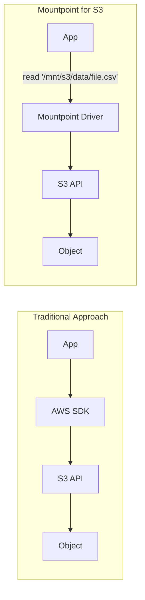
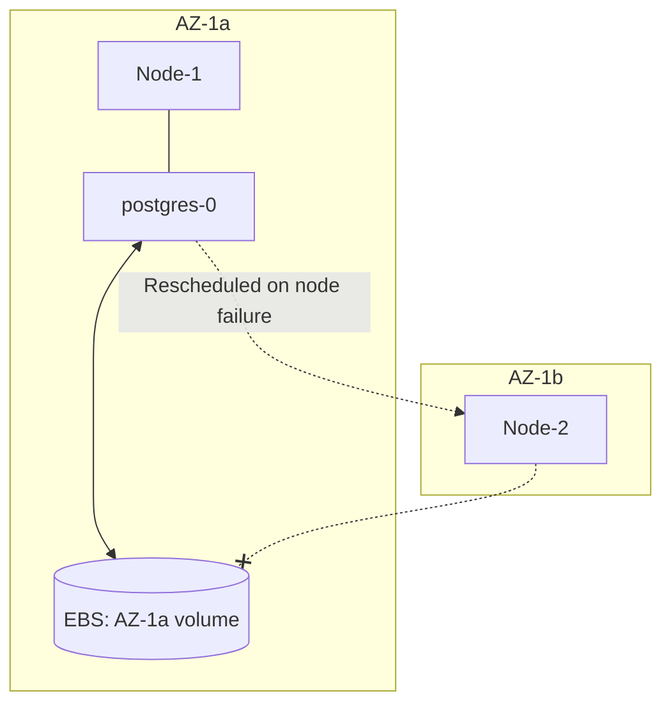
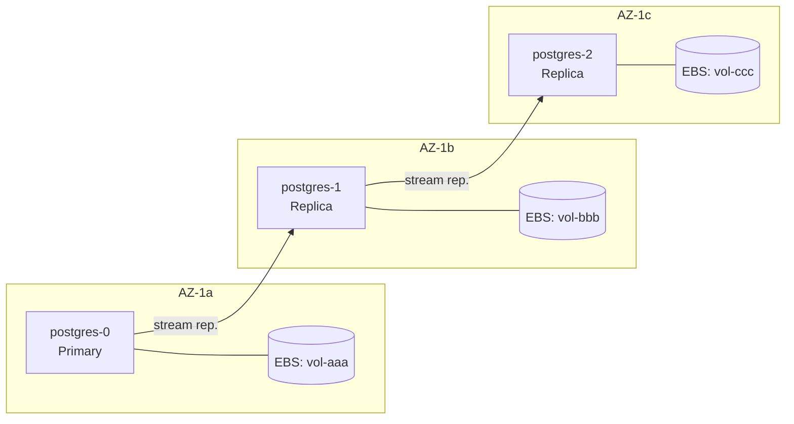
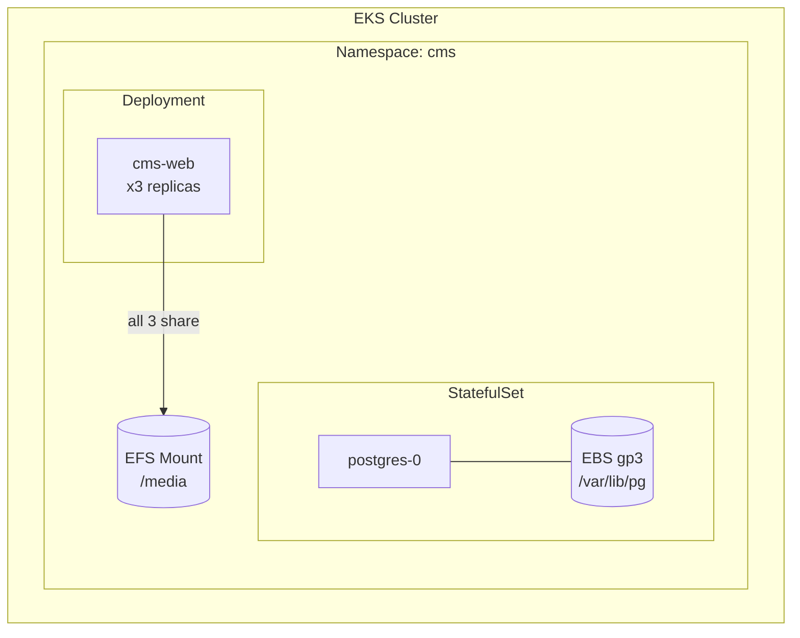

**Complexity**: [MEDIUM] | **Time to Complete**: 2h | **Prerequisites**: Module 5.1 (EKS Architecture & Control Plane)

## What You'll Be Able to Do

After completing this module, you will be able to:

- **Design** storage classes with topology-aware provisioning to bind volumes in the correct availability zone.
- **Implement** EBS and EFS CSI drivers for persistent storage in EKS with encryption and precise access modes.
- **Evaluate** EBS, EFS, and Mountpoint for S3 to select the right storage backend for various EKS workload profiles.
- **Diagnose** volume node affinity conflicts and unschedulable pod states during zonal outages.
- **Compare** application-level replication strategies against storage-level snapshots for stateful workload resilience.

---

## Why This Module Matters

A stateful workload on EKS can fail to restart after rescheduling if its EBS-backed volume is tied to a different Availability Zone, leaving the pod in `Pending` with a volume node affinity conflict.

A zonal storage mismatch during recovery can keep a critical workload offline until operators restore data in a usable zone, which is why Kubernetes storage behavior and AWS zonal constraints matter for stateful services. 

Storage on Kubernetes is deceptively complex. In a traditional virtual machine environment, you attach a disk to an instance and largely forget about it. In Kubernetes, pods are ephemeral by design; they move constantly between nodes, and the scheduler can place them across any Availability Zone in your cluster. If you do not deeply understand the storage abstractions, CSI driver mechanisms, and the geographical constraints of cloud storage, your "highly available" architecture possesses a silent, catastrophic single-AZ failure mode hiding in plain sight. In this module, you will learn to master the EBS, EFS, and Mountpoint for S3 CSI drivers, ensuring your stateful workloads are truly resilient.

---

## The Container Storage Interface (CSI)

Historically, Kubernetes included storage drivers directly within its core source code, known as "in-tree" volume plugins. As the ecosystem grew, this approach became unsustainable. The Container Storage Interface (CSI) was introduced as a standard for exposing arbitrary block and file storage systems to containerized workloads. In Kubernetes v1.35, the in-tree `awsElasticBlockStore` plugin is already removed, and AWS-backed storage integrations such as EBS, EFS, and Mountpoint for S3 rely on CSI drivers. 

The CSI architecture consists of two primary components:
1. **The Controller Plugin**: Runs as a Deployment (usually in the `kube-system` namespace) and interacts with the AWS API to provision, attach, detach, and resize volumes.
2. **The Node Plugin**: Runs as a DaemonSet on every worker node and interacts with the Linux kernel to format, mount, and unmount the block devices or network filesystems into the pod's filesystem namespace.

---

## EBS CSI Driver: High-Performance Block Storage

Amazon Elastic Block Store (EBS) provides persistent, high-performance block-level storage volumes specifically for EC2 instances. The EBS CSI driver enables Kubernetes to seamlessly manage these volumes through the `PersistentVolume` (PV) and `PersistentVolumeClaim` (PVC) abstractions.

### Installing the EBS CSI Driver

[The EBS CSI driver is managed as an EKS Add-on. To interact with the AWS API, the driver's controller pods require precise IAM permissions.](https://docs.aws.amazon.com/eks/latest/userguide/workloads-add-ons-available-eks.html) We use standard IAM Roles for Service Accounts (IRSA) or EKS Pod Identity to grant these privileges.

```bash
# Create IAM role for the EBS CSI driver
cat > /tmp/ebs-trust.json << 'EOF'
{
  "Version": "2012-10-17",
  "Statement": [{
    "Effect": "Allow",
    "Principal": {"Service": "pods.eks.amazonaws.com"},
    "Action": ["sts:AssumeRole", "sts:TagSession"]
  }]
}
EOF

aws iam create-role --role-name AmazonEKS_EBS_CSI_DriverRole \
  --assume-role-policy-document file:///tmp/ebs-trust.json

aws iam attach-role-policy --role-name AmazonEKS_EBS_CSI_DriverRole \
  --policy-arn arn:aws:iam::aws:policy/service-role/AmazonEBSCSIDriverPolicy

# Install the add-on
aws eks create-addon \
  --cluster-name my-cluster \
  --addon-name aws-ebs-csi-driver \
  --service-account-role-arn arn:aws:iam::$(aws sts get-caller-identity --query Account --output text):role/AmazonEKS_EBS_CSI_DriverRole

# Verify
k get pods -n kube-system -l app.kubernetes.io/name=aws-ebs-csi-driver
```

### StorageClass: gp3 Configuration

To dictate how EBS volumes are provisioned dynamically, we define a `StorageClass`. The `gp3` volume type is a common default for many workloads. It provides a baseline of 3,000 IOPS and 125 MiB/s throughput, and AWS lets you provision IOPS and throughput independently of volume size.

```yaml
apiVersion: storage.k8s.io/v1
kind: StorageClass
metadata:
  name: ebs-gp3
  annotations:
    storageclass.kubernetes.io/is-default-class: "true"
provisioner: ebs.csi.aws.com
parameters:
  type: gp3
  fsType: ext4
  iops: "3000"       # baseline (free), up to 16000
  throughput: "125"   # baseline (free), up to 1000 MiB/s
  encrypted: "true"
  kmsKeyId: alias/eks-ebs-key   # optional: customer-managed KMS key
reclaimPolicy: Delete
volumeBindingMode: WaitForFirstConsumer
allowVolumeExpansion: true
```

The `volumeBindingMode: WaitForFirstConsumer` parameter is arguably the most critical configuration in stateful Kubernetes deployments. [By default, Kubernetes uses `Immediate` binding, meaning the storage backend provisions the volume the millisecond the PVC is created. If the scheduler later decides the pod should run on a node in AZ-B, but the volume was provisioned in AZ-A, the pod can remain unschedulable until scheduling aligns with that zone. `WaitForFirstConsumer` intelligently delays volume creation until the pod has been fully scheduled to a specific node](https://kubernetes.io/docs/concepts/storage/storage-classes/), ensuring the EBS volume is physically manifested in the exact same Availability Zone.

> **Pause and predict**: If you forget to set `volumeBindingMode: WaitForFirstConsumer` and leave it as the default `Immediate`, and your EKS cluster spans 3 Availability Zones, what is the mathematical probability that your pod will successfully mount its newly provisioned EBS volume on the first try without node affinity rules?

### Using EBS Volumes in Pods

When consuming block storage, your application defines a `PersistentVolumeClaim`. For a database like PostgreSQL, the StatefulSet controller ensures each pod replica receives its own unique PVC generated from a `volumeClaimTemplate`.

```yaml
apiVersion: v1
kind: PersistentVolumeClaim
metadata:
  name: postgres-data
  namespace: database
spec:
  accessModes:
    - ReadWriteOnce    # EBS supports only RWO
  storageClassName: ebs-gp3
  resources:
    requests:
      storage: 100Gi
```

```yaml
apiVersion: apps/v1
kind: StatefulSet
metadata:
  name: postgres
  namespace: database
spec:
  serviceName: postgres
  replicas: 1
  selector:
    matchLabels:
      app: postgres
  template:
    metadata:
      labels:
        app: postgres
    spec:
      containers:
        - name: postgres
          image: postgres:16
          ports:
            - containerPort: 5432
          env:
            - name: POSTGRES_PASSWORD
              valueFrom:
                secretKeyRef:
                  name: postgres-secret
                  key: password
            - name: PGDATA
              value: /var/lib/postgresql/data/pgdata
          volumeMounts:
            - name: data
              mountPath: /var/lib/postgresql/data
          resources:
            requests:
              cpu: 500m
              memory: 1Gi
            limits:
              cpu: "2"
              memory: 4Gi
  volumeClaimTemplates:
    - metadata:
        name: data
      spec:
        accessModes:
          - ReadWriteOnce
        storageClassName: ebs-gp3
        resources:
          requests:
            storage: 100Gi
```

### EBS Snapshots

Data safety demands robust backup mechanisms. [The EBS CSI driver integrates natively with the Kubernetes Volume Snapshot API, allowing you to trigger AWS EBS snapshots directly via Kubernetes manifests.](https://github.com/kubernetes-sigs/aws-ebs-csi-driver)

First, you declare a `VolumeSnapshotClass` to define the driver and deletion policy.

```yaml
# Create a VolumeSnapshotClass
apiVersion: snapshot.storage.k8s.io/v1
kind: VolumeSnapshotClass
metadata:
  name: ebs-snapshot-class
driver: ebs.csi.aws.com
deletionPolicy: Retain
```

Then, you request a snapshot by referencing the target PVC.

```yaml
# Take a snapshot
apiVersion: snapshot.storage.k8s.io/v1
kind: VolumeSnapshot
metadata:
  name: postgres-snapshot-20240315
  namespace: database
spec:
  volumeSnapshotClassName: ebs-snapshot-class
  source:
    persistentVolumeClaimName: data-postgres-0
```

To restore the exact state of your volume, you reference the `VolumeSnapshot` in the `dataSource` field of a new PVC. The CSI driver interprets this and signals AWS to provision a fresh EBS volume heavily populated with the snapshot's binary data.

```yaml
apiVersion: v1
kind: PersistentVolumeClaim
metadata:
  name: postgres-restored
  namespace: database
spec:
  accessModes:
    - ReadWriteOnce
  storageClassName: ebs-gp3
  resources:
    requests:
      storage: 100Gi
  dataSource:
    name: postgres-snapshot-20240315
    kind: VolumeSnapshot
    apiGroup: snapshot.storage.k8s.io
```

### Online Volume Resizing

Scaling storage is a common operational necessity. [Because our `StorageClass` includes `allowVolumeExpansion: true`, we can dynamically resize EBS volumes without terminating the pod or suffering downtime.](https://docs.aws.amazon.com/ebs/latest/userguide/ebs-modify-volume.html) 

```bash
# Edit the PVC to request more storage
k patch pvc data-postgres-0 -n database \
  --type merge \
  -p '{"spec":{"resources":{"requests":{"storage":"200Gi"}}}}'

# Check resize progress
k get pvc data-postgres-0 -n database -o json | \
  jq '{requested: .spec.resources.requests.storage, actual: .status.capacity.storage, conditions: .status.conditions}'

# The resize happens in two phases:
# 1. AWS resizes the EBS volume (seconds)
# 2. The filesystem is expanded online (the CSI driver handles this)
```

The underlying orchestration is elegant: the EBS controller plugin commands the AWS API to expand the physical block device. Once AWS confirms the new capacity, the CSI node plugin executing on the host runs standard Linux utilities (`resize2fs` or `xfs_growfs`) to grow the filesystem structure to fill the new boundaries. 

> **Stop and think**: You just expanded an EBS volume from 100Gi to 200Gi for a temporary data migration. A week later, you realize you only need 50Gi long-term and want to reduce costs. Since EBS doesn't support shrinking volumes, what exact Kubernetes and AWS steps would you need to take to migrate your live StatefulSet data to a new 50Gi volume?

---

## EFS CSI Driver: Shared Network Filesystems

EBS has a fundamental architectural limitation: a single volume can only be mounted to a single EC2 instance at any given time. This strictly enforces the `ReadWriteOnce` access mode. But modern microservices often require a shared file repository—user uploaded media, shared application configuration, or machine learning datasets. When multiple pods across multiple distinct nodes require read and write access to the same files concurrently, Amazon Elastic File System (EFS) is the required backend.

[EFS implements the NFSv4 protocol and spans multiple Availability Zones natively, making it a regional resource rather than a zonal one.](https://docs.aws.amazon.com/efs/latest/ug/how-it-works.html)

### Setting Up EFS

Deploying EFS for EKS requires the EFS CSI driver, a dedicated IAM role, and crucially, an intricate web of security groups and subnet mount targets.

```bash
# Create IAM role for EFS CSI
aws iam create-role --role-name AmazonEKS_EFS_CSI_DriverRole \
  --assume-role-policy-document file:///tmp/ebs-trust.json  # Same Pod Identity trust

aws iam attach-role-policy --role-name AmazonEKS_EFS_CSI_DriverRole \
  --policy-arn arn:aws:iam::aws:policy/service-role/AmazonEFSCSIDriverPolicy

# Install the EFS CSI add-on
aws eks create-addon \
  --cluster-name my-cluster \
  --addon-name aws-efs-csi-driver \
  --service-account-role-arn arn:aws:iam::$(aws sts get-caller-identity --query Account --output text):role/AmazonEKS_EFS_CSI_DriverRole

# Create an EFS filesystem
EFS_ID=$(aws efs create-file-system \
  --performance-mode generalPurpose \
  --throughput-mode bursting \
  --encrypted \
  --tags Key=Name,Value=eks-shared-storage \
  --query 'FileSystemId' --output text)

# Create mount targets in each subnet (one per AZ)
# The security group must allow NFS (port 2049) from the node security group
EFS_SG=$(aws ec2 create-security-group \
  --group-name EFS-SG \
  --description "Allow NFS from EKS nodes" \
  --vpc-id $VPC_ID \
  --query 'GroupId' --output text)

# Get the cluster security group
CLUSTER_SG=$(aws eks describe-cluster --name my-cluster \
  --query 'cluster.resourcesVpcConfig.clusterSecurityGroupId' --output text)

aws ec2 authorize-security-group-ingress \
  --group-id $EFS_SG \
  --protocol tcp --port 2049 \
  --source-group $CLUSTER_SG

# Create mount targets
aws efs create-mount-target \
  --file-system-id $EFS_ID \
  --subnet-id $PRIV_SUB1 \
  --security-groups $EFS_SG

aws efs create-mount-target \
  --file-system-id $EFS_ID \
  --subnet-id $PRIV_SUB2 \
  --security-groups $EFS_SG

echo "EFS filesystem: $EFS_ID"
```

### Using EFS in Pods

EFS relies heavily on the concept of EFS Access Points for dynamic provisioning. [An Access Point is an application-specific entry point into an EFS file system that enforces POSIX identity and root directory paths](https://docs.aws.amazon.com/efs/latest/ug/efs-access-points.html), allowing different applications to safely share the same physical EFS filesystem securely.

```yaml
apiVersion: storage.k8s.io/v1
kind: StorageClass
metadata:
  name: efs-sc
provisioner: efs.csi.aws.com
parameters:
  provisioningMode: efs-ap         # Use EFS Access Points
  fileSystemId: fs-0123456789abcdef
  directoryPerms: "700"
  gidRangeStart: "1000"
  gidRangeEnd: "2000"
  basePath: "/dynamic_provisioning"
```

```yaml
apiVersion: v1
kind: PersistentVolumeClaim
metadata:
  name: shared-media
  namespace: cms
spec:
  accessModes:
    - ReadWriteMany
  storageClassName: efs-sc
  resources:
    requests:
      storage: 50Gi    # EFS is elastic; this is a soft quota
```

```yaml
apiVersion: apps/v1
kind: Deployment
metadata:
  name: cms-web
  namespace: cms
spec:
  replicas: 5    # All 5 replicas share the same EFS volume!
  selector:
    matchLabels:
      app: cms-web
  template:
    metadata:
      labels:
        app: cms-web
    spec:
      containers:
        - name: nginx
          image: nginx:1.27
          volumeMounts:
            - name: media
              mountPath: /usr/share/nginx/html/media
          resources:
            requests:
              cpu: 100m
              memory: 128Mi
      volumes:
        - name: media
          persistentVolumeClaim:
            claimName: shared-media
```

Notice the critical distinction: the PVC leverages `ReadWriteMany`. All five replicas seamlessly mount the exact same file tree at `/usr/share/nginx/html/media`. When any pod modifies an image or file, the changes are generally visible to the other replicas shortly afterward. 

> **Stop and think**: EFS is a regional service, meaning your 5 `cms-web` replicas can be scheduled across 3 different Availability Zones and still read/write to the same filesystem. But what is the hidden cost of this convenience? Consider how data actually flows when a pod in AZ-a reads a file that was physically written by a pod in AZ-b, and what AWS charges for network traffic that crosses AZ boundaries.

---

## Mountpoint for S3 CSI Driver: Object Storage as a Filesystem

The Mountpoint for S3 CSI driver is a highly specialized storage option that translates standard POSIX filesystem calls into native S3 API requests. This eliminates the need to rewrite legacy applications to use the AWS SDK while unlocking S3's unlimited scalability and unparalleled cost efficiency.

### Architecture Comparison



### Setup and Configuration

[Mountpoint for S3 is not meant for dynamic provisioning; it is strictly designed to map existing S3 buckets into pods.](https://docs.aws.amazon.com/eks/latest/userguide/s3-csi.html) Thus, you must manually construct a `PersistentVolume` targeting the bucket.

```bash
# Install the Mountpoint for S3 CSI add-on
aws eks create-addon \
  --cluster-name my-cluster \
  --addon-name aws-mountpoint-s3-csi-driver \
  --service-account-role-arn arn:aws:iam::$(aws sts get-caller-identity --query Account --output text):role/S3MountpointRole
```

```yaml
apiVersion: v1
kind: PersistentVolume
metadata:
  name: s3-training-data
spec:
  capacity:
    storage: 1Ti    # Informational only; S3 is unlimited
  accessModes:
    - ReadWriteMany
  csi:
    driver: s3.csi.aws.com
    volumeHandle: s3-csi-driver-volume
    volumeAttributes:
      bucketName: my-ml-training-data
```

```yaml
apiVersion: v1
kind: PersistentVolumeClaim
metadata:
  name: training-data-pvc
  namespace: ml
spec:
  accessModes:
    - ReadWriteMany
  storageClassName: ""    # Empty string for pre-provisioned PV
  resources:
    requests:
      storage: 1Ti
  volumeName: s3-training-data
```

```yaml
apiVersion: batch/v1
kind: Job
metadata:
  name: model-training
  namespace: ml
spec:
  template:
    spec:
      containers:
        - name: trainer
          image: 123456789012.dkr.ecr.us-east-1.amazonaws.com/model-trainer:latest
          command: ["python", "train.py", "--data-dir=/data"]
          volumeMounts:
            - name: training-data
              mountPath: /data
              readOnly: true
          resources:
            requests:
              cpu: "4"
              memory: 16Gi
      volumes:
        - name: training-data
          persistentVolumeClaim:
            claimName: training-data-pvc
      restartPolicy: Never
```

### Mountpoint Limitations
Mountpoint does not perfectly emulate a block filesystem. It comes with distinct operational caveats:
- **Write Restrictions**: You can write sequentially to entirely new files, but you cannot execute random writes, append data to an existing file, or rename files/directories. 
- **No File Locking**: Multiple pods can read the same data, but Mountpoint does not provide file locking or full shared-filesystem coordination for concurrent writers.
- **Latency Overheads**: First-byte retrieval is bounded by S3 request latency, so Mountpoint is a poor fit for transactional databases or latency-sensitive interactive apps.

---

## Stateful Workloads Across Availability Zones

The fundamental lesson learned by the ad-tech company was that high availability at the application layer means nothing if the storage layer acts as a strict geographical anchor.

### The Problem



### Solution 1: Topology-Aware Scheduling

Use `WaitForFirstConsumer` for newly provisioned zonal volumes, and remember that already-bound EBS volumes carry node-affinity constraints that keep a pod schedulable only in the volume's zone. Topology rules can help spread replicas across zones, but they do not move an orphaned zonal volume to another AZ.

```yaml
apiVersion: apps/v1
kind: StatefulSet
metadata:
  name: postgres
  namespace: database
spec:
  serviceName: postgres
  replicas: 3
  selector:
    matchLabels:
      app: postgres
  template:
    metadata:
      labels:
        app: postgres
    spec:
      topologySpreadConstraints:
        - maxSkew: 1
          topologyKey: topology.kubernetes.io/zone
          whenUnsatisfiable: DoNotSchedule
          labelSelector:
            matchLabels:
              app: postgres
      containers:
        - name: postgres
          image: postgres:16
          ports:
            - containerPort: 5432
          volumeMounts:
            - name: data
              mountPath: /var/lib/postgresql/data
          resources:
            requests:
              cpu: 500m
              memory: 1Gi
  volumeClaimTemplates:
    - metadata:
        name: data
      spec:
        accessModes:
          - ReadWriteOnce
        storageClassName: ebs-gp3    # WaitForFirstConsumer is key!
        resources:
          requests:
            storage: 100Gi
```

### Solution 2: Multiple Nodes Per AZ

You must ensure that your compute plane guarantees sufficient failover capacity within the *same* Availability Zone.

```bash
# Create a node group that spans multiple AZs with at least 2 nodes per AZ
aws eks create-nodegroup \
  --cluster-name my-cluster \
  --nodegroup-name stateful-workers \
  --node-role arn:aws:iam::123456789012:role/EKSNodeRole \
  --subnets subnet-az1a subnet-az1b subnet-az1c \
  --instance-types m6i.xlarge \
  --scaling-config minSize=6,maxSize=12,desiredSize=6 \
  --labels workload=stateful
```

By ensuring there are at least two nodes per Availability Zone, a single node crash allows the pod to simply reschedule to the surviving node located in the identical AZ, successfully reattaching the EBS volume.

### Solution 3: Application-Level Replication

For enterprise database tiers, completely abstracting resilience away from the Kubernetes storage layer is the gold standard.



In this pattern, each StatefulSet replica is deployed with its own dedicated EBS volume pinned to its respective zone. PostgreSQL manages the asynchronous or synchronous block streaming between the primary and the replicas. If an entire AWS Availability Zone burns down, the application logic detects the outage and intelligently promotes a replica in a surviving zone to assume the primary role.

---

## Storage Decision Matrix

Selecting the proper backend boils down to access patterns and IO profiles.

| Use Case | Storage Type | Access Mode | Key Constraint |
| :--- | :--- | :--- | :--- |
| Database (single writer) | EBS gp3 | ReadWriteOnce | Single AZ, plan for node failure |
| High-IOPS database | EBS io2 | ReadWriteOnce | Higher cost than gp3; exact pricing varies by Region and current AWS rates |
| Shared CMS media | EFS | ReadWriteMany | Higher latency, ~4x EBS cost |
| ML training data | Mountpoint S3 | ReadWriteMany | Read-optimized, no random writes |
| Container scratch space | emptyDir / Instance Store | N/A (ephemeral) | Lost on pod restart |
| Log shipping buffer | EBS gp3 (small) | ReadWriteOnce | Use FluentBit buffer, not large volumes |

---

## Did You Know?

1. The `WaitForFirstConsumer` volume binding mode in a StorageClass was added specifically to solve the AZ mismatch problem. Before it existed, Kubernetes would create the EBS volume immediately when the PVC was created, often in a random AZ. Then the pod scheduler would pick a different AZ for the pod, and the volume could never be attached. This single StorageClass setting prevents the most common EKS storage failure mode.

2. EBS gp3 volumes provide 3,000 IOPS and 125 MiB/s of throughput for free at every volume size. In the gp2 era, you needed a 1,000 GB volume to get 3,000 IOPS (because gp2 scales IOPS linearly with size at 3 IOPS/GB). With gp3, even a 1 GB volume gets the full 3,000 IOPS baseline. This makes gp3 cheaper than gp2 for nearly every workload.

3. EFS Infrequent Access can be much cheaper than EFS Standard for cold data, and EFS Lifecycle Management can automatically transition files after configurable inactivity windows such as 7, 14, 30, 60, or 90 days.

4. Mountpoint for S3 is implemented in Rust and is optimized for high-throughput access to large S3 datasets. For sequential-read workloads such as ML training, it can be a cost-effective alternative when the application fits Mountpoint's file-operation limits.

---

## Common Mistakes

| Mistake | Why It Happens | How to Fix It |
| :--- | :--- | :--- |
| **Missing `WaitForFirstConsumer` in StorageClass** | Using default `Immediate` binding mode. PVC creates volume in wrong AZ. Use `volumeBindingMode: WaitForFirstConsumer` for EBS StorageClasses unless you have a specific reason not to. This is not optional. |
| **Running StatefulSet with no nodes in volume's AZ** | Auto Scaler scales down nodes in one AZ, leaving orphaned volumes. | Set minimum node counts per AZ. Configure Cluster Autoscaler or Karpenter to respect `topologySpreadConstraints`. |
| **Using EBS for shared storage between pods** | Not knowing EFS exists, or assuming EBS can be mounted RWX. | Use EFS when multiple pods across nodes need shared read/write storage. If you need strict single-pod attachment semantics, use `ReadWriteOncePod` on a Kubernetes version that supports it. |
| **Not encrypting EBS volumes** | Forgetting to add `encrypted: "true"` in the StorageClass parameters. | Add `encrypted: "true"` to your StorageClass. For compliance, use a customer-managed KMS key via `kmsKeyId`. |
| **EFS without mount target in node's AZ** | Creating EFS mount targets in only one AZ, but nodes run in multiple AZs. | Create a mount target in every AZ where your EKS nodes run. Without a local mount target, pods either fail to mount or route NFS through cross-AZ traffic. |
| **Using Mountpoint S3 for random writes** | Treating S3 like a filesystem. Attempting appends or overwrites. | Mountpoint S3 supports sequential writes to new files only. For read-modify-write patterns, use the S3 SDK directly or use EFS. |
| **Not setting resource requests on storage-heavy pods** | Database pods getting OOM-killed because no memory limits were set. Set explicit memory requests on database pods, and use memory limits only when they are carefully tuned. PostgreSQL, MySQL, and Redis all benefit from explicit memory allocation. |
| **Ignoring EBS modification timing** | Assuming you can keep changing the same volume immediately after each request. | Wait for a modification to complete before issuing another one, and plan changes carefully because performance updates can take from minutes to hours to finish. |

---

## Quiz

<details>
<summary>Question 1: You are deploying a new stateful application. You create a PersistentVolumeClaim using a StorageClass with `volumeBindingMode: Immediate`. The PVC is created and bound, but when the pod using it is scheduled, the pod stays in Pending state with a "volume node affinity conflict" error. What happened?</summary>

With `Immediate` binding mode, Kubernetes provisions the EBS volume as soon as the PVC is created, completely independent of where the pod will eventually be scheduled. As a result, the volume might be created in one Availability Zone (e.g., AZ-1a), but when the scheduler later evaluates node resources to place the pod, it might select a node in a different zone (e.g., AZ-1b). Because EBS volumes are zonal resources and can only be attached to EC2 instances within the same AZ, the volume cannot be mounted to the chosen node. Consequently, the pod cannot start and remains stuck in a Pending state. The fix is to use `volumeBindingMode: WaitForFirstConsumer`, which delays volume creation until the pod is scheduled, ensuring the storage backend provisions the volume in the exact same AZ as the selected node.
</details>

<details>
<summary>Question 2: Your team is building a content management system. You need shared storage accessible by 10 pods across 3 nodes in different AZs. Which storage option should you use and why?</summary>

For this scenario, you must use **Amazon EFS** paired with the EFS CSI driver. EFS natively supports the `ReadWriteMany` (RWX) access mode, meaning multiple pods spread across multiple nodes can read and write to the shared filesystem simultaneously. Furthermore, EFS is a regional AWS service that spans all Availability Zones automatically, provided you create mount targets in each corresponding subnet. Conversely, EBS cannot be used here because it is restricted to the `ReadWriteOnce` access mode and is confined to a single Availability Zone. While Mountpoint for S3 could technically span AZs, it does not support the random writes or file modifications typically required by a content management system.
</details>

<details>
<summary>Question 3: You are managing a live database with a 50 GB EBS gp3 volume attached that needs to be resized to 200 GB. Can this be done without downtime? What about shrinking from 200 GB to 100 GB a month later?</summary>

Expanding the volume from 50 GB to 200 GB can be executed online without any downtime, provided the underlying StorageClass is configured with `allowVolumeExpansion: true`. You simply edit the PVC to request 200 GB, and the EBS CSI driver transparently handles the AWS block storage expansion and the host-level filesystem resize in the background. However, shrinking the volume from 200 GB to 100 GB is strictly impossible due to fundamental EBS limitations. EBS volumes can only be expanded, never shrunk. If you need a smaller volume, you must manually provision a new 100 GB volume, migrate the data at the application layer, and update your manifests to use the new PVC.
</details>

<details>
<summary>Question 4: Your data science team is running a machine learning training pipeline on EKS that needs to read a 5 TB dataset. When would you choose Mountpoint for S3 over EFS for this workload?</summary>

You should choose Mountpoint for S3 when the ML workload exclusively needs to read large, pre-existing datasets and expects standard POSIX filesystem semantics to access them. Since S3 storage costs are drastically lower than EFS (roughly $0.023/GB-month versus $0.30/GB-month), hosting a 5 TB dataset on S3 yields massive cost savings. Additionally, Mountpoint for S3 achieves exceptionally high sequential read throughput by automatically parallelizing multi-part downloads under the hood. You would only opt for EFS if the training pipeline needed to write intermediate checkpoints, modify files in-place, or required POSIX file locking mechanisms across parallel workers, which Mountpoint does not support.
</details>

<details>
<summary>Question 5: You are operating a PostgreSQL StatefulSet with 3 replicas spread evenly across 3 Availability Zones. AZ-1b suffers a complete hardware outage. What happens to the replica in AZ-1b, and can Kubernetes simply reschedule it to AZ-1a or AZ-1c?</summary>

When AZ-1b fails, the node hosting the replica becomes unreachable, and after the default 5-minute taint timeout, Kubernetes marks the pod for deletion. However, the Kubernetes scheduler cannot simply place a replacement pod in AZ-1a or AZ-1c because the pod is strictly bound to its specific EBS PersistentVolume. Since EBS volumes are isolated to the Availability Zone where they were created, the data physically trapped in AZ-1b cannot be attached to instances in surviving zones. The replacement pod will remain in an unschedulable `Pending` state until AZ-1b fully recovers. This scenario perfectly illustrates why application-level replication, such as PostgreSQL streaming replication across independent AZs, is absolutely essential for critical stateful workloads to survive zonal outages.
</details>

<details>
<summary>Question 6: During a rolling update of a critical database StatefulSet, you notice that two database pods briefly end up running on the exact same node and both attempt to mount the same EBS volume, leading to data corruption. How does the distinction between `ReadWriteOnce` and `ReadWriteOncePod` apply to this scenario?</summary>

The `ReadWriteOnce` (RWO) access mode guarantees that a volume is mounted as read-write by a single node, but it explicitly allows multiple pods on that specific node to mount the volume concurrently. In your scenario, the rolling update placed both the terminating pod and the new pod on the same physical host, allowing both to write to the data directory simultaneously and corrupting the database. To prevent this, you should use `ReadWriteOncePod` (RWOP), which was introduced in Kubernetes 1.27. RWOP strictly limits volume access to a single pod across the entire cluster, regardless of node placement. By using RWOP, the new pod would be blocked from mounting the volume until the old pod had completely terminated and released its lock.
</details>

---

## Hands-On Exercise: CMS with EBS for DB + EFS for Shared Media

In this comprehensive exercise, you will architect a robust content management system by marrying PostgreSQL on high-performance EBS block storage with universally shared media storage backed by EFS.

**What you will build:**



### Task 1: Install EBS and EFS CSI Drivers
Your first step is to establish the fundamental storage integrations. Using standard AWS CLI tooling, map the required IAM permissions to Kubernetes service accounts, and then bolt the driver binaries directly into your EKS control plane.

<details>
<summary>Solution</summary>

```bash
# Create IAM roles (using Pod Identity trust)
cat > /tmp/csi-trust.json << 'EOF'
{
  "Version": "2012-10-17",
  "Statement": [{
    "Effect": "Allow",
    "Principal": {"Service": "pods.eks.amazonaws.com"},
    "Action": ["sts:AssumeRole", "sts:TagSession"]
  }]
}
EOF

# EBS CSI Role
aws iam create-role --role-name EKS_EBS_CSI_Role \
  --assume-role-policy-document file:///tmp/csi-trust.json
aws iam attach-role-policy --role-name EKS_EBS_CSI_Role \
  --policy-arn arn:aws:iam::aws:policy/service-role/AmazonEBSCSIDriverPolicy

# EFS CSI Role
aws iam create-role --role-name EKS_EFS_CSI_Role \
  --assume-role-policy-document file:///tmp/csi-trust.json
aws iam attach-role-policy --role-name EKS_EFS_CSI_Role \
  --policy-arn arn:aws:iam::aws:policy/service-role/AmazonEFSCSIDriverPolicy

ACCOUNT_ID=$(aws sts get-caller-identity --query Account --output text)

# Install add-ons
aws eks create-addon --cluster-name my-cluster \
  --addon-name aws-ebs-csi-driver \
  --service-account-role-arn arn:aws:iam::${ACCOUNT_ID}:role/EKS_EBS_CSI_Role

aws eks create-addon --cluster-name my-cluster \
  --addon-name aws-efs-csi-driver \
  --service-account-role-arn arn:aws:iam::${ACCOUNT_ID}:role/EKS_EFS_CSI_Role

# Verify both drivers are running
k get pods -n kube-system -l 'app.kubernetes.io/name in (aws-ebs-csi-driver,aws-efs-csi-driver)'
```

</details>

### Task 2: Create StorageClasses and EFS Filesystem
Next, construct the `StorageClass` primitives. You must ensure `WaitForFirstConsumer` is implemented for EBS, and successfully expose EFS across all network subnets to prevent cross-AZ latency regressions.

<details>
<summary>Solution</summary>

```bash
# Create the EBS gp3 StorageClass
cat <<'EOF' | k apply -f -
apiVersion: storage.k8s.io/v1
kind: StorageClass
metadata:
  name: ebs-gp3
provisioner: ebs.csi.aws.com
parameters:
  type: gp3
  fsType: ext4
  encrypted: "true"
reclaimPolicy: Delete
volumeBindingMode: WaitForFirstConsumer
allowVolumeExpansion: true
EOF

# Create EFS filesystem
EFS_ID=$(aws efs create-file-system \
  --performance-mode generalPurpose \
  --throughput-mode bursting \
  --encrypted \
  --tags Key=Name,Value=cms-media-storage \
  --query 'FileSystemId' --output text)

# Get cluster VPC and subnets
VPC_ID=$(aws eks describe-cluster --name my-cluster \
  --query 'cluster.resourcesVpcConfig.vpcId' --output text)
CLUSTER_SG=$(aws eks describe-cluster --name my-cluster \
  --query 'cluster.resourcesVpcConfig.clusterSecurityGroupId' --output text)

# Create EFS security group
EFS_SG=$(aws ec2 create-security-group \
  --group-name CMS-EFS-SG --description "NFS for CMS" \
  --vpc-id $VPC_ID --query 'GroupId' --output text)
aws ec2 authorize-security-group-ingress \
  --group-id $EFS_SG --protocol tcp --port 2049 --source-group $CLUSTER_SG

# Create mount targets (get private subnet IDs from your cluster)
SUBNET_IDS=$(aws eks describe-cluster --name my-cluster \
  --query 'cluster.resourcesVpcConfig.subnetIds[]' --output text)
for SUBNET in $SUBNET_IDS; do
  aws efs create-mount-target \
    --file-system-id $EFS_ID \
    --subnet-id $SUBNET \
    --security-groups $EFS_SG 2>/dev/null || true
done

echo "EFS filesystem: $EFS_ID"

# Create EFS StorageClass
cat <<EOF | k apply -f -
apiVersion: storage.k8s.io/v1
kind: StorageClass
metadata:
  name: efs-sc
provisioner: efs.csi.aws.com
parameters:
  provisioningMode: efs-ap
  fileSystemId: ${EFS_ID}
  directoryPerms: "755"
  basePath: "/cms-media"
EOF
```

</details>

### Task 3: Deploy PostgreSQL with EBS Storage
Bind an EBS block device strictly to a stateful PostgreSQL database. Notice how the headless service orchestrates identity management while block placement guarantees zero-loss persistence.

<details>
<summary>Solution</summary>

```bash
k create namespace cms

# Create database secret
k create secret generic postgres-secret -n cms \
  --from-literal=password='DojoSecurePass2024!'

# Deploy PostgreSQL StatefulSet
cat <<'EOF' | k apply -f -
apiVersion: apps/v1
kind: StatefulSet
metadata:
  name: postgres
  namespace: cms
spec:
  serviceName: postgres
  replicas: 1
  selector:
    matchLabels:
      app: postgres
  template:
    metadata:
      labels:
        app: postgres
    spec:
      containers:
        - name: postgres
          image: postgres:16
          ports:
            - containerPort: 5432
          env:
            - name: POSTGRES_DB
              value: cmsdb
            - name: POSTGRES_USER
              value: cmsadmin
            - name: POSTGRES_PASSWORD
              valueFrom:
                secretKeyRef:
                  name: postgres-secret
                  key: password
            - name: PGDATA
              value: /var/lib/postgresql/data/pgdata
          volumeMounts:
            - name: data
              mountPath: /var/lib/postgresql/data
          readinessProbe:
            exec:
              command: ["pg_isready", "-U", "cmsadmin", "-d", "cmsdb"]
            initialDelaySeconds: 10
            periodSeconds: 5
          resources:
            requests:
              cpu: 250m
              memory: 512Mi
            limits:
              cpu: "1"
              memory: 2Gi
  volumeClaimTemplates:
    - metadata:
        name: data
      spec:
        accessModes:
          - ReadWriteOnce
        storageClassName: ebs-gp3
        resources:
          requests:
            storage: 20Gi
---
apiVersion: v1
kind: Service
metadata:
  name: postgres
  namespace: cms
spec:
  selector:
    app: postgres
  ports:
    - port: 5432
  clusterIP: None    # Headless service for StatefulSet
EOF

# Wait for PostgreSQL to be ready
k wait --for=condition=Ready pod/postgres-0 -n cms --timeout=120s

# Verify
k exec -n cms postgres-0 -- pg_isready -U cmsadmin -d cmsdb
```

</details>

### Task 4: Deploy CMS Web Tier with EFS Shared Storage
Distribute a lightweight NGINX fleet across the cluster. The crucial capability here is the integration of the EFS network filesystem. Confirm that data written by one pod instance is instantly visible to the others globally.

<details>
<summary>Solution</summary>

```bash
cat <<'EOF' | k apply -f -
apiVersion: v1
kind: PersistentVolumeClaim
metadata:
  name: cms-media
  namespace: cms
spec:
  accessModes:
    - ReadWriteMany
  storageClassName: efs-sc
  resources:
    requests:
      storage: 10Gi
---
apiVersion: apps/v1
kind: Deployment
metadata:
  name: cms-web
  namespace: cms
spec:
  replicas: 3
  selector:
    matchLabels:
      app: cms-web
  template:
    metadata:
      labels:
        app: cms-web
    spec:
      containers:
        - name: nginx
          image: nginx:1.27
          ports:
            - containerPort: 80
          volumeMounts:
            - name: media
              mountPath: /usr/share/nginx/html/media
          readinessProbe:
            httpGet:
              path: /
              port: 80
            initialDelaySeconds: 5
            periodSeconds: 10
          resources:
            requests:
              cpu: 100m
              memory: 128Mi
            limits:
              cpu: 200m
              memory: 256Mi
      volumes:
        - name: media
          persistentVolumeClaim:
            claimName: cms-media
---
apiVersion: v1
kind: Service
metadata:
  name: cms-web
  namespace: cms
spec:
  selector:
    app: cms-web
  ports:
    - port: 80
  type: ClusterIP
EOF

# Wait for all pods to be ready
k wait --for=condition=Ready pods -l app=cms-web -n cms --timeout=120s

# Verify all 3 replicas share the same EFS volume
# Write a file from one pod
k exec -n cms $(k get pods -n cms -l app=cms-web -o name | head -1) -- \
  sh -c 'echo "Hello from pod 1" > /usr/share/nginx/html/media/test.txt'

# Read from another pod
k exec -n cms $(k get pods -n cms -l app=cms-web -o name | tail -1) -- \
  cat /usr/share/nginx/html/media/test.txt
# Should print: "Hello from pod 1"
```

</details>

### Task 5: Take an EBS Snapshot and Resize the Volume
Test disaster preparedness. Freeze the block state of your database volume using an immutable snapshot. Then, simulate an enterprise scaling event by aggressively inflating the backing EBS capacity dynamically while the pods maintain active IO.

<details>
<summary>Solution</summary>

```bash
# Install snapshot CRDs (if not already installed)
k apply -f https://raw.githubusercontent.com/kubernetes-csi/external-snapshotter/master/client/config/crd/snapshot.storage.k8s.io_volumesnapshotclasses.yaml
k apply -f https://raw.githubusercontent.com/kubernetes-csi/external-snapshotter/master/client/config/crd/snapshot.storage.k8s.io_volumesnapshotcontents.yaml
k apply -f https://raw.githubusercontent.com/kubernetes-csi/external-snapshotter/master/client/config/crd/snapshot.storage.k8s.io_volumesnapshots.yaml

# Create VolumeSnapshotClass
cat <<'EOF' | k apply -f -
apiVersion: snapshot.storage.k8s.io/v1
kind: VolumeSnapshotClass
metadata:
  name: ebs-snapshot-class
driver: ebs.csi.aws.com
deletionPolicy: Retain
EOF

# Take a snapshot of the PostgreSQL volume
cat <<'EOF' | k apply -f -
apiVersion: snapshot.storage.k8s.io/v1
kind: VolumeSnapshot
metadata:
  name: postgres-backup
  namespace: cms
spec:
  volumeSnapshotClassName: ebs-snapshot-class
  source:
    persistentVolumeClaimName: data-postgres-0
EOF

# Check snapshot status
k get volumesnapshot postgres-backup -n cms -o json | \
  jq '{ready: .status.readyToUse, size: .status.restoreSize}'

# Resize the PVC from 20Gi to 50Gi (online, no downtime)
k patch pvc data-postgres-0 -n cms \
  --type merge \
  -p '{"spec":{"resources":{"requests":{"storage":"50Gi"}}}}'

# Monitor the resize
k get pvc data-postgres-0 -n cms -w
# Wait until CAPACITY shows 50Gi

# Verify inside the pod
k exec -n cms postgres-0 -- df -h /var/lib/postgresql/data
```

</details>

### Task 6: Verify AZ Resilience
Ensure your system obeys strict geographical boundaries. Use standard topology queries to correlate the EC2 node placement with physical volume attachments. Run a sweeping loop verifying the integrity of the EFS network mount across isolated locations.

<details>
<summary>Solution</summary>

```bash
# Check which AZ the PostgreSQL pod and volume are in
PG_NODE=$(k get pod postgres-0 -n cms -o jsonpath='{.spec.nodeName}')
PG_AZ=$(k get node $PG_NODE -o jsonpath='{.metadata.labels.topology\.kubernetes\.io/zone}')
echo "PostgreSQL pod is in AZ: $PG_AZ"

# Check the EBS volume's AZ
PV_NAME=$(k get pvc data-postgres-0 -n cms -o jsonpath='{.spec.volumeName}')
VOL_ID=$(k get pv $PV_NAME -o jsonpath='{.spec.csi.volumeHandle}')
VOL_AZ=$(aws ec2 describe-volumes --volume-ids $VOL_ID \
  --query 'Volumes[0].AvailabilityZone' --output text)
echo "EBS volume is in AZ: $VOL_AZ"

# Verify they match
if [ "$PG_AZ" = "$VOL_AZ" ]; then
  echo "PASS: Pod and volume are in the same AZ ($PG_AZ)"
else
  echo "FAIL: AZ mismatch! Pod=$PG_AZ, Volume=$VOL_AZ"
fi

# Verify EFS is accessible from all AZs
for POD in $(k get pods -n cms -l app=cms-web -o name); do
  POD_NODE=$(k get $POD -n cms -o jsonpath='{.spec.nodeName}')
  POD_AZ=$(k get node $POD_NODE -o jsonpath='{.metadata.labels.topology\.kubernetes\.io/zone}')
  echo "$POD on $POD_NODE in $POD_AZ"
  k exec -n cms $POD -- ls /usr/share/nginx/html/media/test.txt
done
```

</details>

### Clean Up

```bash
k delete namespace cms
k delete volumesnapshotclass ebs-snapshot-class
k delete storageclass ebs-gp3 efs-sc
# Delete EFS filesystem and mount targets
aws efs delete-file-system --file-system-id $EFS_ID
```

### Success Checklist

- [ ] I systematically installed EBS and EFS CSI drivers as native EKS add-ons.
- [ ] I architected an EBS gp3 StorageClass utilizing the mandatory `WaitForFirstConsumer` binding mode.
- [ ] I implemented PostgreSQL as a persistent StatefulSet securely leveraging EBS block architecture.
- [ ] I created a regional EFS filesystem with highly available mount targets across independent subnets.
- [ ] I proved that 3 distinct web replica pods can harmoniously write to an identical EFS namespace simultaneously.
- [ ] I successfully initiated an EBS volume snapshot and completed an aggressive online resize operation from 20Gi to 50Gi without impacting workload operations.
- [ ] I empirically confirmed the relational mapping guaranteeing the PostgreSQL pod is pinned to the precise availability zone of its paired EBS volume.
- [ ] I can articulate the rigid physical boundaries dictating why EBS volumes are incapable of migrating across multiple AZs automatically.

---

## Next Module

Your stateful workloads are properly anchored with robust, resilient persistent storage—but storage is only a single piece of the production puzzle. How do you scale the underlying instances efficiently, continuously observe application behavior, and rigorously control your exploding compute costs? Proceed directly to [Module 5.5: EKS Production -- Scaling, Observability & Cost](../module-5.5-eks-production/) to master Karpenter node provisioning, AWS Container Insights, and relentless cost optimization using Kubecost.

## Sources

- [Amazon EKS add-ons](https://docs.aws.amazon.com/eks/latest/userguide/workloads-add-ons-available-eks.html) — AWS reference for storage-related add-ons that can be installed and managed in EKS clusters.
- [Kubernetes Storage Classes](https://kubernetes.io/docs/concepts/storage/storage-classes/) — Canonical Kubernetes reference for StorageClass behavior, including `Immediate` and `WaitForFirstConsumer` binding modes.
- [Amazon EBS CSI driver](https://github.com/kubernetes-sigs/aws-ebs-csi-driver) — Project documentation for EBS CSI driver features such as snapshots and other storage integrations.
- [Modify an Amazon EBS volume](https://docs.aws.amazon.com/ebs/latest/userguide/ebs-modify-volume.html) — AWS guide for online EBS volume modification and expansion workflows.
- [Amazon EFS: How it works](https://docs.aws.amazon.com/efs/latest/ug/how-it-works.html) — AWS overview of EFS architecture, including NFSv4 semantics and regional multi-AZ access.
- [Working with Amazon EFS Access Points](https://docs.aws.amazon.com/efs/latest/ug/efs-access-points.html) — AWS documentation for access points that scope application paths and enforce POSIX identities.
- [Access Amazon S3 Objects with Mountpoint for Amazon S3 CSI Driver](https://docs.aws.amazon.com/eks/latest/userguide/s3-csi.html) — AWS documentation for Mountpoint CSI driver provisioning model, bucket mapping, and operational constraints.
- [Use Kubernetes Volume Storage with Amazon EBS](https://docs.aws.amazon.com/eks/latest/userguide/ebs-csi.html) — AWS’s EKS guide for EBS CSI installation, permissions, and operational considerations.
