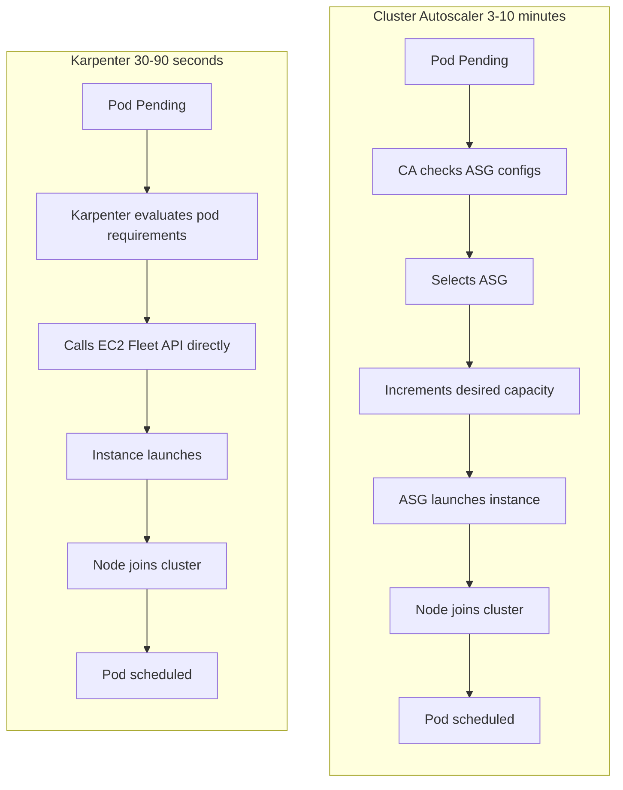
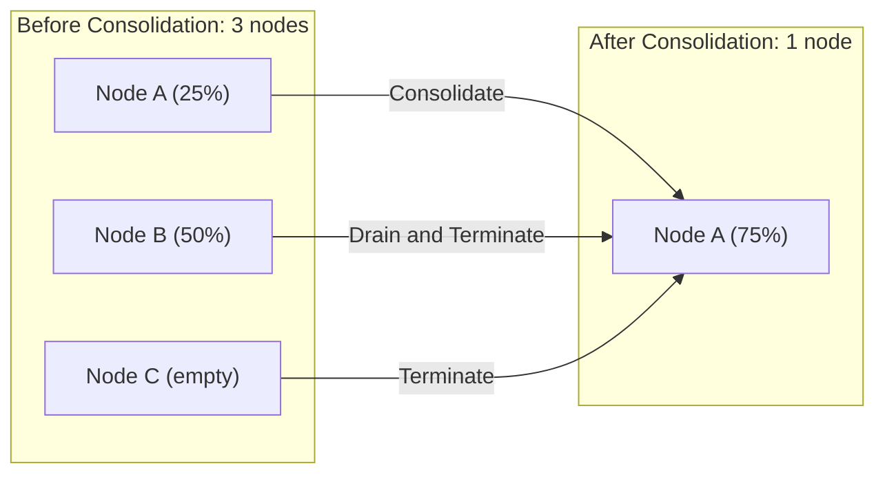
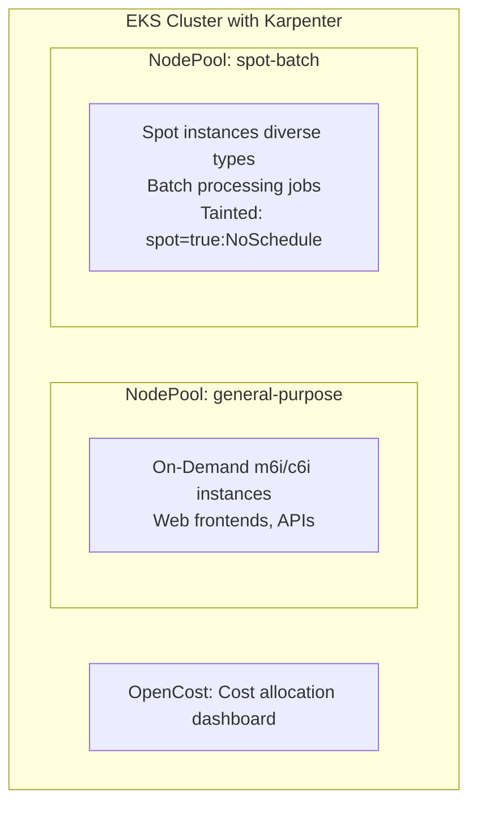

**Complexity**: [COMPLEX] | **Time to Complete**: 3h | **Prerequisites**: Module 5.1 (EKS Architecture), Module 5.2 (EKS Networking)

## What You'll Be Able to Do

After completing this module, you will be able to:

- **Implement** Karpenter for intelligent, constraint-based node autoscaling that optimizes cost and bin-packing on EKS 1.35+.
- **Design** EKS observability pipelines with CloudWatch Container Insights, AWS Distro for OpenTelemetry, and Prometheus.
- **Deploy** cost optimization strategies combining Spot instances, Savings Plans, and right-sizing for Kubernetes workloads.
- **Evaluate** cluster telemetry to diagnose scaling bottlenecks and resolve node contention incidents.
- **Debug** complex scheduling and infrastructure cost allocation issues using OpenCost and Kubecost.

---

## Why This Module Matters

In September 2023, a major video streaming company running on EKS launched a highly anticipated new series that rapidly went viral. Within twenty minutes, their backend encoding and delivery services scaled from 200 pods to 1,800 pods. The Horizontal Pod Autoscaler operated perfectly, emitting the necessary scaling events and generating the pods. However, the legacy Cluster Autoscaler fundamentally failed to keep pace. It took 8 minutes to iterate through pending pods, 3 minutes to evaluate and scale the underlying Auto Scaling Groups (ASGs), and another 2 minutes for the EC2 instances to bootstrap and join the cluster. 

By the time infrastructure capacity caught up to application demand, users had experienced 13 continuous minutes of degraded service. The outcome included widespread buffering, playback failures, and massive negative sentiment on social media platforms. The failure was a direct result of relying on legacy, group-based scaling architectures for a dynamic, modern microservices payload. Furthermore, the financial impact of this event was staggering. Because the scaling occurred entirely on On-Demand instances, the 1,800-pod spike incurred approximately $12,000 in compute costs for a single day.

Following the incident, the engineering team modernized their cluster architecture by replacing Cluster Autoscaler with Karpenter, implementing native Spot instance orchestration, and deploying OpenCost for granular namespace attribution. During subsequent traffic spikes, Karpenter detected unschedulable pods, formulated an optimized instance mix, and invoked the EC2 Fleet API directly. Compute capacity became available in under 90 seconds, completely eliminating user-facing degradation. In this module, you will master the exact architecture that enables this performance, alongside the essential observability and cost attribution frameworks required for production EKS at scale.

---

## Karpenter: Next-Generation Node Provisioning

Karpenter is an open-source, high-performance Kubernetes node provisioner built by AWS. It replaces the traditional Cluster Autoscaler with a fundamentally different paradigm. Instead of scaling pre-defined Auto Scaling Groups, Karpenter provisions individual nodes by calculating the exact aggregate requirements of pending pods and directly calling the EC2 Fleet API.

### Karpenter vs Cluster Autoscaler

To understand why Karpenter is transformative, consider an analogy: Cluster Autoscaler is like having to pre-purchase a fleet of identical delivery trucks and calling the depot for more of the exact same trucks whenever packages pile up. Karpenter, conversely, looks at the specific dimensions and weight of the pending packages and custom-builds a vehicle perfectly sized for that exact payload in under 60 seconds.



| Feature | Cluster Autoscaler | Karpenter |
| :--- | :--- | :--- |
| **Provisioning speed** | 3-10 minutes | 30-90 seconds |
| **Instance selection** | Fixed per ASG (you pre-define) | Dynamic (evaluates pod needs per launch) |
| **Bin packing** | Limited (works within ASG constraints) | Optimized (selects exact instance type for pending pods) |
| **Scale-down** | Scans for underutilized nodes periodically | Continuous consolidation (TTL, empty node, and underutilization) |
| **Spot handling** | Via ASG mixed instances policy | Native Spot support with automatic fallback |
| **Node groups** | Required (one per instance type mix) | Not required (NodePools define constraints, not specific groups) |
| **Maintenance** | ASG + Launch Template management | NodePool + EC2NodeClass CRDs |

### Installing Karpenter

Installing Karpenter requires specific IAM roles to allow the controller to manage EC2 instances. Once IAM is established, installation is handled natively via Helm targeting the modern OCI registry.

```bash
# Install Karpenter using Helm
# Install Karpenter v1.x from OCI registry (charts.karpenter.sh is deprecated)
# Karpenter needs specific IAM roles and instance profiles
# (Simplified here -- see Karpenter docs for full IAM setup)
helm install karpenter oci://public.ecr.aws/karpenter/karpenter \
  --namespace kube-system \
  --set settings.clusterName=my-cluster \
  --set clusterEndpoint=$(aws eks describe-cluster --name my-cluster --query 'cluster.endpoint' --output text) \
  --set settings.isolatedVPC=false \
  --version 1.1.0 \
  --wait
```

### NodePool: Defining Constraints

A `NodePool` is a Custom Resource Definition (CRD) that defines the acceptable boundaries for the nodes Karpenter creates. It acts as a set of constraints rather than a strict template.

```yaml
apiVersion: karpenter.sh/v1
kind: NodePool
metadata:
  name: general-purpose
spec:
  template:
    metadata:
      labels:
        team: platform
        workload-type: general
    spec:
      nodeClassRef:
        group: karpenter.k8s.aws
        kind: EC2NodeClass
        name: default
      requirements:
        - key: kubernetes.io/arch
          operator: In
          values: ["amd64"]
        - key: karpenter.sh/capacity-type
          operator: In
          values: ["on-demand", "spot"]
        - key: karpenter.k8s.aws/instance-category
          operator: In
          values: ["m", "c", "r"]         # General, compute, memory
        - key: karpenter.k8s.aws/instance-generation
          operator: Gt
          values: ["5"]                    # Only 6th gen and newer
        - key: karpenter.k8s.aws/instance-size
          operator: In
          values: ["large", "xlarge", "2xlarge"]
        - key: topology.kubernetes.io/zone
          operator: In
          values: ["us-east-1a", "us-east-1b", "us-east-1c"]
      expireAfter: 720h                     # Force node rotation every 30 days
  limits:
    cpu: "1000"                             # Max 1000 vCPUs across all nodes
    memory: 4000Gi                          # Max 4 TiB memory
  disruption:
    consolidationPolicy: WhenEmptyOrUnderutilized
    consolidateAfter: 30s
  weight: 50                                # Priority vs other NodePools
```

### EC2NodeClass: AWS Infrastructure Binding

While the `NodePool` defines Kubernetes-native scheduling constraints, the `EC2NodeClass` maps those requests to specific AWS infrastructure parameters, including subnets, security groups, block devices, and IAM profiles.

```yaml
apiVersion: karpenter.k8s.aws/v1
kind: EC2NodeClass
metadata:
  name: default
spec:
  role: KarpenterNodeRole
  amiSelectorTerms:
    - alias: al2023@latest      # Amazon Linux 2023, auto-updated
  subnetSelectorTerms:
    - tags:
        karpenter.sh/discovery: my-cluster
  securityGroupSelectorTerms:
    - tags:
        karpenter.sh/discovery: my-cluster
  blockDeviceMappings:
    - deviceName: /dev/xvda
      ebs:
        volumeSize: 100Gi
        volumeType: gp3
        iops: 3000
        throughput: 125
        encrypted: true
        deleteOnTermination: true
  metadataOptions:
    httpEndpoint: enabled
    httpProtocolIPv6: disabled
    httpPutResponseHopLimit: 1     # IMDSv2 enforcement
    httpTokens: required           # Require IMDSv2
  tags:
    Environment: production
    ManagedBy: karpenter
```

### How Karpenter Selects Instance Types

When evaluating pending pods, Karpenter executes a rapid, multi-dimensional bin-packing algorithm. It evaluates the collective resource requests and identifies the cheapest viable EC2 instance from the permitted pool.

```text
Pending Pods:
  Pod A: requests 2 CPU, 4Gi memory
  Pod B: requests 1 CPU, 8Gi memory
  Pod C: requests 4 CPU, 4Gi memory

Karpenter evaluates:
  Option 1: 3x m6i.large (2 CPU, 8Gi each) = $0.288/hr → 1 pod per node
  Option 2: 1x m6i.2xlarge (8 CPU, 32Gi) = $0.192/hr → all 3 pods on 1 node
  Option 3: 1x c6i.2xlarge (8 CPU, 16Gi) = $0.170/hr → all 3 pods, tighter fit

Karpenter selects Option 3 (cheapest that satisfies all pod requirements)
```

### Karpenter Disruption and Consolidation

Continuous optimization is a hallmark of Karpenter. Over time, as deployments scale up and down, clusters experience fragmentation. Karpenter constantly monitors the fleet to execute consolidation strategies.



---

## Spot Instance Orchestration

Spot instances represent excess AWS capacity available at steep discounts (often 60-90%). However, AWS can reclaim them at any time with a brief two-minute interruption notice. Karpenter fundamentally changes how organizations consume Spot capacity by building fallback logic and instance diversification natively into the scaler.

### Configuring Spot in Karpenter

By explicitly specifying `"spot"` in the capacity-type array, you signal to Karpenter that it should attempt to source from the Spot market first.

```yaml
apiVersion: karpenter.sh/v1
kind: NodePool
metadata:
  name: spot-batch
spec:
  template:
    spec:
      nodeClassRef:
        group: karpenter.k8s.aws
        kind: EC2NodeClass
        name: default
      requirements:
        - key: karpenter.sh/capacity-type
          operator: In
          values: ["spot"]
        - key: karpenter.k8s.aws/instance-category
          operator: In
          values: ["m", "c", "r"]
        - key: karpenter.k8s.aws/instance-size
          operator: In
          values: ["xlarge", "2xlarge", "4xlarge"]
        # Diversify across many types to reduce interruption risk
        - key: karpenter.k8s.aws/instance-generation
          operator: Gt
          values: ["4"]
      taints:
        - key: spot
          value: "true"
          effect: NoSchedule
  disruption:
    consolidationPolicy: WhenEmpty
    consolidateAfter: 30s
```

### Spot Best Practices

Tolerating Spot capacity requires a combined approach from both the infrastructure and application layers. You must diversify instance choices at the node level, and utilize PodDisruptionBudgets (PDBs) at the workload level. 

```yaml
# PodDisruptionBudget for Spot workloads
apiVersion: policy/v1
kind: PodDisruptionBudget
metadata:
  name: batch-processor-pdb
  namespace: batch
spec:
  minAvailable: "50%"
  selector:
    matchLabels:
      app: batch-processor
```

```yaml
# Deployment tolerating Spot
apiVersion: apps/v1
kind: Deployment
metadata:
  name: batch-processor
  namespace: batch
spec:
  replicas: 10
  selector:
    matchLabels:
      app: batch-processor
  template:
    metadata:
      labels:
        app: batch-processor
    spec:
      tolerations:
        - key: spot
          operator: Equal
          value: "true"
          effect: NoSchedule
      nodeSelector:
        karpenter.sh/capacity-type: spot
      terminationGracePeriodSeconds: 120
      containers:
        - name: processor
          image: 123456789012.dkr.ecr.us-east-1.amazonaws.com/batch-processor:latest
          resources:
            requests:
              cpu: "2"
              memory: 4Gi
          lifecycle:
            preStop:
              exec:
                command: ["/bin/sh", "-c", "sleep 5 && /app/graceful-shutdown"]
```

### On-Demand Fallback Pattern

A critical production architecture pattern involves configuring Karpenter to prefer Spot capacity but to gracefully fall back to On-Demand instances if the requested Spot capacity pools are exhausted or heavily contested.

```yaml
# Primary: Spot (cheap)
apiVersion: karpenter.sh/v1
kind: NodePool
metadata:
  name: compute-spot
spec:
  template:
    spec:
      nodeClassRef:
        group: karpenter.k8s.aws
        kind: EC2NodeClass
        name: default
      requirements:
        - key: karpenter.sh/capacity-type
          operator: In
          values: ["spot"]
  weight: 100    # Higher weight = preferred
```

```yaml
# Fallback: On-Demand (reliable)
apiVersion: karpenter.sh/v1
kind: NodePool
metadata:
  name: compute-ondemand
spec:
  template:
    spec:
      nodeClassRef:
        group: karpenter.k8s.aws
        kind: EC2NodeClass
        name: default
      requirements:
        - key: karpenter.sh/capacity-type
          operator: In
          values: ["on-demand"]
  weight: 10     # Lower weight = fallback only
```

Karpenter evaluates `weight` strictly. The primary `compute-spot` NodePool forces an attempt on the Spot market. Only upon an `InsufficientInstanceCapacity` error from the AWS API will Karpenter fall through to the On-Demand NodePool.

> **Stop and think**: If Karpenter provisions a Spot instance for your workload and AWS reclaims it with a two-minute warning, how does your application ensure zero downtime? (Hint: Think about PodDisruptionBudgets, replicas, and the pod lifecycle.)

---

## Control Plane Logging

Visibility into the Kubernetes control plane is non-negotiable for security forensics and debugging scheduling anomalies. Because EKS abstracts the control plane components away from user administration, AWS provides control plane logging directly to CloudWatch.

### Enabling Control Plane Logs

```bash
aws eks update-cluster-config --name my-cluster \
  --logging '{"clusterLogging":[{"types":["api","audit","authenticator","controllerManager","scheduler"],"enabled":true}]}'
```

| Log Type | What It Contains | When to Use |
| :--- | :--- | :--- |
| `api` | API server request/response logs | Debugging API errors, rate limiting |
| `audit` | Who did what, when (all API calls) | Security compliance, forensics |
| `authenticator` | Authentication decisions (IAM → K8s RBAC) | Troubleshooting access denied errors |
| `controllerManager` | Controller loops (ReplicaSet, Deployment) | Why pods are not being created |
| `scheduler` | Scheduling decisions and failures | Why pods are Pending |

Querying logs is efficiently done using CloudWatch Logs Insights. For example, to identify API clients hitting 400-level errors:

```sql
-- Find all failed API calls in the last hour
fields @timestamp, verb, requestURI, responseStatus.code, user.username
| filter responseStatus.code >= 400
| sort @timestamp desc
| limit 50
```

```sql
-- Find who deleted a specific pod
fields @timestamp, verb, requestURI, user.username, sourceIPs.0
| filter verb = "delete" and requestURI like "/api/v1/namespaces/production/pods/"
| sort @timestamp desc
| limit 20
```

> **Stop and think**: Control plane logs can be expensive at scale. An active cluster generating 50 GB/day of audit logs costs ~$25/day in CloudWatch ingestion alone. Consider enabling only `audit` and `authenticator` by default, adding the others temporarily for debugging.

---

## Container Insights: Node and Pod Metrics

While control plane logs reveal *what* happened, performance metrics reveal *why* it happened. Amazon CloudWatch Container Insights provides native metric aggregation, generating dashboards for cluster, node, pod, and container resource saturation.

### Enabling Container Insights

```bash
# Install via the EKS add-on
aws eks create-addon \
  --cluster-name my-cluster \
  --addon-name amazon-cloudwatch-observability \
  --service-account-role-arn arn:aws:iam::$(aws sts get-caller-identity --query Account --output text):role/CloudWatchObservabilityRole
```

### Key CloudWatch Metrics for EKS

| Metric | Namespace | What to Alert On |
| :--- | :--- | :--- |
| `node_cpu_utilization` | ContainerInsights | > 80% sustained |
| `node_memory_utilization` | ContainerInsights | > 85% sustained |
| `pod_cpu_utilization_over_pod_limit` | ContainerInsights | > 90% (throttling imminent) |
| `node_filesystem_utilization` | ContainerInsights | > 80% (disk pressure) |
| `cluster_failed_node_count` | ContainerInsights | > 0 |
| `pod_status_phase` (Pending) | ContainerInsights | > 0 for > 5 min |

> **Pause and predict**: You notice that `kube_pod_container_status_restarts_total` is rapidly increasing for your core API namespace, but `node_cpu_utilization` is completely normal. What might be causing the pods to restart if it isn't node-level resource starvation? (Hint: Think about memory limits, liveness probes, or application-level crashes.)

---

## Prometheus Integration

While Container Insights offers a seamless zero-ops experience, high-cardinality clusters will inevitably encounter prohibitive cost scaling. At scale, the industry standard mandates transitioning to a Prometheus-backed observability pipeline. 

### Amazon Managed Prometheus (AMP)

Amazon Managed Prometheus (AMP) provides a serverless ingestion and query backend, allowing you to use PromQL without managing underlying storage infrastructure.

```bash
# Create a workspace
WORKSPACE_ID=$(aws amp create-workspace \
  --alias eks-production \
  --query 'workspaceId' --output text)

echo "Workspace: $WORKSPACE_ID"
echo "Endpoint: https://aps-workspaces.us-east-1.amazonaws.com/workspaces/$WORKSPACE_ID"
```

### Deploying Prometheus to Scrape EKS Metrics

Deploying Prometheus via the `kube-prometheus-stack` configures local scraping and remote-writing to AMP.

```bash
# Install the Prometheus stack using Helm
helm repo add prometheus-community https://prometheus-community.github.io/helm-charts
helm repo update

# For self-managed Prometheus + Grafana:
helm install prometheus prometheus-community/kube-prometheus-stack \
  --namespace monitoring \
  --create-namespace \
  --set prometheus.prometheusSpec.retention=15d \
  --set prometheus.prometheusSpec.resources.requests.cpu=500m \
  --set prometheus.prometheusSpec.resources.requests.memory=2Gi \
  --set grafana.enabled=true \
  --set grafana.adminPassword=DojoGrafana2024

# For remote-write to Amazon Managed Prometheus:
helm install prometheus prometheus-community/kube-prometheus-stack \
  --namespace monitoring \
  --create-namespace \
  --set prometheus.prometheusSpec.remoteWrite[0].url="https://aps-workspaces.us-east-1.amazonaws.com/workspaces/$WORKSPACE_ID/api/v1/remote_write" \
  --set prometheus.prometheusSpec.remoteWrite[0].sigv4.region=us-east-1
```

### Essential PromQL Queries for EKS

Prometheus excels at complex, cross-dimensional data analysis.

```promql
# CPU usage by namespace (percentage of requests)
sum(rate(container_cpu_usage_seconds_total{container!=""}[5m])) by (namespace)
/ sum(kube_pod_container_resource_requests{resource="cpu"}) by (namespace)
* 100

# Memory usage vs limits (OOM risk indicator)
sum(container_memory_working_set_bytes{container!=""}) by (namespace, pod)
/ sum(kube_pod_container_resource_limits{resource="memory"}) by (namespace, pod)
* 100

# Pod restart rate (signals instability)
sum(rate(kube_pod_container_status_restarts_total[1h])) by (namespace, pod) > 0

# Node not Ready duration
sum(kube_node_status_condition{condition="Ready", status="true"} == 0) by (node)

# Karpenter provisioning latency (p99)
histogram_quantile(0.99, sum(rate(karpenter_provisioner_scheduling_duration_seconds_bucket[5m])) by (le))
```

---

## Cost Allocation with Kubecost and OpenCost

Kubernetes abstractly pools resources, leading directly to the "tragedy of the commons"—teams provision massive resource requests because they lack financial visibility into their architectural choices. OpenCost provides the telemetry mapping required to solve this.

### OpenCost (Open Source)

OpenCost maps real-time AWS billing data to specific pod usage telemetry, tracking expenses down to individual labels.

```bash
# Install OpenCost
helm repo add opencost https://opencost.github.io/opencost-helm-chart
helm repo update

helm install opencost opencost/opencost \
  --namespace opencost \
  --create-namespace \
  --set opencost.exporter.defaultClusterId=my-cluster \
  --set opencost.exporter.aws.spot_data_region=us-east-1 \
  --set opencost.exporter.aws.spot_data_bucket=my-spot-pricing-bucket \
  --set opencost.ui.enabled=true
```

### Kubecost (Commercial + Free Tier)

```bash
helm repo add kubecost https://kubecost.github.io/cost-analyzer
helm repo update

helm install kubecost kubecost/cost-analyzer \
  --namespace kubecost \
  --create-namespace \
  --set kubecostToken="" \
  --set prometheus.server.global.external_labels.cluster_id=my-cluster
```

### Cost Allocation Strategies

Without discipline, OpenCost will simply report massive unallocated spend. Financial attribution requires strict labeling logic.

```yaml
# Enforce cost-tracking labels on all pods
apiVersion: apps/v1
kind: Deployment
metadata:
  name: payment-service
  namespace: payments
  labels:
    app: payment-service
    team: payments-team          # Who owns this?
    environment: production      # Prod vs staging vs dev
    cost-center: cc-1234         # Finance tracking code
spec:
  template:
    metadata:
      labels:
        app: payment-service
        team: payments-team
        environment: production
        cost-center: cc-1234
```

To prevent unallocated workloads from executing, leverage an admission controller like Kyverno.

```yaml
# Kyverno policy to require cost labels
apiVersion: kyverno.io/v1
kind: ClusterPolicy
metadata:
  name: require-cost-labels
spec:
  validationFailureAction: Enforce
  rules:
    - name: check-cost-labels
      match:
        any:
          - resources:
              kinds:
                - Deployment
                - StatefulSet
                - DaemonSet
      validate:
        message: "All workloads must have 'team' and 'cost-center' labels."
        pattern:
          metadata:
            labels:
              team: "?*"
              cost-center: "?*"
```

### Reading a Cost Report

| Team | Namespace | CPU Cost | Mem Cost | Total |
| :--- | :--- | :--- | :--- | :--- |
| payments | payments | $1,240 | $890 | $2,130 |
| search | search | $3,100 | $2,450 | $5,550 |
| data-pipeline | batch | $890 | $1,200 | $2,090 |
| platform | monitoring | $420 | $680 | $1,100 |
| (idle) | (unallocated) | $1,800 | $2,300 | $4,100 |
| **TOTAL CLUSTER** | | | | **$14,970** |

In this scenario, the idle/unallocated sum ($4,100) highlights a massive surface area for savings through tighter consolidation policies or more aggressive resource right-sizing.

---

## EKS Upgrade Runbooks

Kubernetes issues minor releases routinely, and maintaining operational readiness requires rigid upgrade paths. For clusters navigating up to and beyond v1.35, the process involves careful synchronization between the control plane and data plane.

1. **Pre-flight API Checks**: Ensure tooling like `pluto` inspects your Helm charts to eliminate deprecated API usage ahead of the upgrade.
2. **Control Plane Upgrade**: Issue the upgrade sequence to AWS. The highly available architecture ensures the core API remains responsive.
3. **Core Add-on Upgrades**: Transition VPC CNI, CoreDNS, and kube-proxy components to the exact builds verified against v1.35.
4. **Data Plane (Node) Rotation**: Karpenter streamlines this exponentially. By mapping the `amiSelectorTerms` to the latest alias, node drift mechanics automatically initiate a rolling replacement across the fleet seamlessly.

> **Stop and think**: Why must you upgrade the EKS control plane *before* upgrading the worker nodes? (Hint: The Kubernetes version skew policy dictates compatibility rules between the kube-apiserver and the kubelet running on nodes.)

---

## Did You Know?

1. Karpenter evaluates over 600 EC2 instance types when deciding what to launch. For each set of pending pods, it simulates packing them onto every compatible instance type, calculates the cost, and selects the cheapest option. This evaluation happens in milliseconds thanks to an in-memory instance type database that Karpenter refreshes from the EC2 pricing API every 6 hours.

2. EKS control plane audit logs can record API requests, including the request body and response at the most detailed audit level. For a cluster with 500 pods and active HPA/VPA controllers, the audit log volume can reach 10-15 GB per day. At CloudWatch's $0.50/GB ingestion rate, that is $5-7.50/day or $150-225/month just for audit log storage. Many teams filter audit logs to only capture write operations and authentication events, reducing volume by 80%.

3. Spot instance interruption rates vary dramatically by instance type and region. In 2024 data, the `m5.xlarge` in us-east-1 had a roughly 5% monthly interruption rate, while the `m6i.xlarge` in the same region was under 3%. By diversifying across 15-20 instance types and 3 AZs, you can achieve an effective interruption rate below 2% per node per month, making Spot viable even for user-facing services behind proper redundancy.

4. Kubecost analysis across thousands of Kubernetes clusters found that the average cluster utilization (actual CPU/memory usage vs provisioned) is only 20-35%. This means 65-80% of infrastructure spend is wasted on idle resources. The three highest-impact optimizations are: (1) right-sizing pod resource requests using VPA recommendations, (2) enabling Karpenter consolidation to remove underutilized nodes, and (3) using Spot instances for stateless and fault-tolerant workloads.

---

## Common Mistakes

| Mistake | Why It Happens | How to Fix It |
| :--- | :--- | :--- |
| **Running Cluster Autoscaler and Karpenter simultaneously** | Migrating incrementally but forgetting to remove the old autoscaler. Both fight over node lifecycle. | Remove Cluster Autoscaler completely before deploying Karpenter. They are mutually exclusive. |
| **Karpenter NodePool with only one instance type** | Over-constraining instance requirements, defeating Karpenter's instance flexibility advantage. | Allow at least 10-15 instance types across multiple families (m, c, r) and generations. More diversity means better availability and pricing. |
| **No `expireAfter` on NodePool** | Nodes run indefinitely with stale AMIs and potential security vulnerabilities. | Set `expireAfter: 720h` (30 days) to force rotation. Karpenter gracefully drains nodes before termination. |
| **Spot for stateful workloads without replication** | Assuming Spot interruption will not happen. A database on a Spot node loses its EBS volume attachment during interruption. | Use On-Demand for databases and single-point-of-failure workloads. Spot is for stateless, redundant, or batch workloads only. |
| **Enabling all 5 control plane log types permanently** | "We might need them someday." Meanwhile paying $200/month for logs nobody reads. | Enable `audit` and `authenticator` always. Enable `api`, `controllerManager`, and `scheduler` only when actively debugging. |
| **No resource requests on pods** | Developers skip requests "to keep it simple." Karpenter cannot bin-pack without knowing pod resource needs. | Require resource requests via admission controller (Kyverno/OPA). Use VPA recommendations to determine appropriate values. |
| **Cost allocation without label enforcement** | Labels are optional, most teams do not add them, and 60% of cost is "unallocated." | Enforce `team` and `cost-center` labels using admission policies. Reject deployments that lack required labels. |
| **Ignoring idle cost in Kubecost** | Focusing on per-team costs while ignoring the 30%+ of cluster spend that is idle. | Review idle cost weekly. Right-size pod requests, enable Karpenter consolidation, and set aggressive `consolidateAfter` values. |

---

## Quiz

<details>
<summary>Question 1: During a massive traffic spike, your application needs 50 new nodes. With Cluster Autoscaler, this took 8 minutes, causing an outage. You switch to Karpenter and it takes 45 seconds. What architectural difference allows Karpenter to provision nodes so much faster in this scenario?</summary>

Cluster Autoscaler works by adjusting the desired capacity of existing Auto Scaling Groups. It must: (1) detect pending pods, (2) evaluate which ASG to scale, (3) increment the ASG desired count, (4) wait for the ASG to launch an instance. This involves multiple AWS API calls with propagation delays. Karpenter bypasses ASGs entirely and calls the **EC2 Fleet API directly**, requesting a specific instance type in a specific subnet. It also pre-calculates the optimal instance type based on pending pod requirements, eliminating the trial-and-error of ASG scaling. The result is 30-90 seconds vs 3-10 minutes.
</details>

<details>
<summary>Question 2: You configure a Karpenter NodePool for a batch processing job and include both `spot` and `on-demand` in the capacity-type requirements. When 100 pending batch pods appear, how does Karpenter decide whether to launch Spot or On-Demand instances to fulfill the request?</summary>

Karpenter evaluates the cost of both capacity types for each pending pod batch. It first attempts to provision **Spot instances** because they are cheaper. If Spot capacity is unavailable for the requested instance types (InsufficientInstanceCapacity error from EC2), Karpenter automatically falls back to **On-Demand**. You can influence this behavior using NodePool `weight` -- create a Spot-preferred NodePool with weight 100 and an On-Demand fallback NodePool with weight 10. Karpenter tries higher-weight NodePools first. Pods can also force On-Demand using `nodeSelector: {karpenter.sh/capacity-type: on-demand}`.
</details>

<details>
<summary>Question 3: Your cluster has 30% idle cost according to Kubecost. What three actions would have the highest impact on reducing this waste?</summary>

**(1) Right-size pod resource requests.** Use Vertical Pod Autoscaler (VPA) in recommendation mode to analyze actual usage and reduce over-provisioned requests. If a pod requests 2 CPU but only uses 0.3 CPU on average, reducing the request to 0.5 CPU frees 1.5 CPU of capacity. **(2) Enable Karpenter consolidation.** Set `consolidationPolicy: WhenEmptyOrUnderutilized` with a short `consolidateAfter` (30s). Karpenter will continuously pack pods onto fewer, better-utilized nodes and terminate empty or underutilized ones. **(3) Use Spot instances for stateless workloads.** Spot prices are 60-90% lower than On-Demand. Move all fault-tolerant workloads (web frontends, batch jobs, CI/CD runners) to Spot, keeping On-Demand only for databases and critical singletons.
</details>

<details>
<summary>Question 4: You enabled all 5 EKS control plane log types and your CloudWatch bill spiked by $300/month. Which log types should you keep enabled permanently, and which should be on-demand only?</summary>

Keep **audit** and **authenticator** logs enabled permanently. Audit logs are essential for security compliance -- they record who performed what action and when, and you cannot retroactively generate them. Authenticator logs help troubleshoot IAM-to-RBAC mapping issues. The **api**, **controllerManager**, and **scheduler** logs should be enabled only when actively debugging issues. API logs in particular are extremely high-volume (every GET, LIST, WATCH request is logged). Enable them temporarily, diagnose the issue, then disable them.
</details>

<details>
<summary>Question 5: A Spot instance running 8 pods receives a two-minute interruption notice. What happens to the pods, and how should your application handle this?</summary>

When a Spot interruption notice arrives, Karpenter (or the AWS Node Termination Handler if using Cluster Autoscaler) marks the node as unschedulable (cordons it) and begins draining pods. Kubernetes respects **PodDisruptionBudgets** during the drain, evicting pods gracefully. Each pod receives a SIGTERM signal and has until its `terminationGracePeriodSeconds` (default 30 seconds) to shut down cleanly. Applications should: (1) handle SIGTERM by finishing in-flight requests, (2) use a `preStop` lifecycle hook for cleanup, (3) have `terminationGracePeriodSeconds` set appropriately (no more than 90 seconds for Spot), and (4) be designed for redundancy so that losing one pod does not cause user-visible errors. This ensures the application layer manages its own state transition before the underlying infrastructure disappears. Spot instances will terminate exactly two minutes after the notice, regardless of whether your pods have finished shutting down.
</details>

<details>
<summary>Question 6: Your startup just launched and needs robust EKS monitoring. The platform team is debating between enabling CloudWatch Container Insights or deploying a self-managed Prometheus stack. What scenario or cluster characteristics would make Prometheus the better choice?</summary>

**Container Insights** sends metrics to CloudWatch as custom metrics. It provides pre-built dashboards, integrates with CloudWatch Alarms, and requires no infrastructure to run (just the agent DaemonSet). However, it charges per-metric ($0.30/metric/month) and can become expensive for large clusters ($1,500-3,000/month). **Prometheus** is an open-source metrics system that stores metrics locally (or in AMP) with powerful PromQL querying. It is free to run (self-managed) or lower-cost (AMP charges $0.03/10M samples). Use Container Insights for small clusters (under 20 nodes) or teams that want zero-ops monitoring. Use Prometheus for larger clusters, teams that need custom metrics, or organizations with existing Grafana dashboards.
</details>

<details>
<summary>Question 7: A developer deploys a new memory-intensive application to your Karpenter-managed EKS cluster but forgets to define CPU and memory requests in the pod spec. What will happen when Karpenter attempts to provision capacity for these pods?</summary>

Karpenter uses pod **resource requests** (not limits) to determine what instance type to provision. If a pod has no CPU or memory request, Karpenter assumes it needs zero resources and may pack it onto an already-full node, leading to severe resource contention and OOM (Out of Memory) kills. Without accurate requests, Karpenter cannot effectively bin-pack pods—it might provision the wrong instance sizes, wasting money. Furthermore, the Kubernetes scheduler treats pods without requests as "BestEffort", making them the first to be evicted under node pressure. Always set resource requests that reflect actual usage. By enforcing these requests through admission controllers, you ensure the cluster scaler has accurate constraints to work with.
</details>

---

## Hands-On Exercise: Replace Cluster Autoscaler with Karpenter + Spot Batch Processing

In this exercise, you will deploy Karpenter, create NodePools for general and Spot workloads, run a batch processing job on Spot instances, and set up basic cost visibility.

**What you will build:**



### Task 1: Remove Cluster Autoscaler (If Present)

<details>
<summary>Solution</summary>

```bash
# Check if Cluster Autoscaler is running
k get deployment cluster-autoscaler -n kube-system 2>/dev/null

# If present, remove it
helm uninstall cluster-autoscaler -n kube-system 2>/dev/null || \
  k delete deployment cluster-autoscaler -n kube-system 2>/dev/null

# Verify it is gone
k get pods -n kube-system | grep autoscaler
# Should return nothing
```

</details>

### Task 2: Install Karpenter

<details>
<summary>Solution</summary>

```bash
# Tag your subnets for Karpenter discovery
CLUSTER_NAME="my-cluster"
SUBNET_IDS=$(aws eks describe-cluster --name $CLUSTER_NAME \
  --query 'cluster.resourcesVpcConfig.subnetIds[]' --output text)

for SUBNET in $SUBNET_IDS; do
  aws ec2 create-tags --resources $SUBNET \
    --tags Key=karpenter.sh/discovery,Value=$CLUSTER_NAME
done

# Tag the cluster security group
CLUSTER_SG=$(aws eks describe-cluster --name $CLUSTER_NAME \
  --query 'cluster.resourcesVpcConfig.clusterSecurityGroupId' --output text)
aws ec2 create-tags --resources $CLUSTER_SG \
  --tags Key=karpenter.sh/discovery,Value=$CLUSTER_NAME

# Install Karpenter via Helm
CLUSTER_ENDPOINT=$(aws eks describe-cluster --name $CLUSTER_NAME \
  --query 'cluster.endpoint' --output text)

helm repo add karpenter https://charts.karpenter.sh
helm repo update

helm install karpenter karpenter/karpenter \
  --namespace kube-system \
  --set clusterName=$CLUSTER_NAME \
  --set clusterEndpoint=$CLUSTER_ENDPOINT \
  --version 1.1.0 \
  --wait

# Verify Karpenter is running
k get pods -n kube-system -l app.kubernetes.io/name=karpenter
k logs -n kube-system -l app.kubernetes.io/name=karpenter --tail=20
```

</details>

### Task 3: Create the General Purpose NodePool

<details>
<summary>Solution</summary>

```bash
cat <<'EOF' | k apply -f -
apiVersion: karpenter.k8s.aws/v1
kind: EC2NodeClass
metadata:
  name: default
spec:
  role: KarpenterNodeRole
  amiSelectorTerms:
    - alias: al2023@latest
  subnetSelectorTerms:
    - tags:
        karpenter.sh/discovery: my-cluster
  securityGroupSelectorTerms:
    - tags:
        karpenter.sh/discovery: my-cluster
  blockDeviceMappings:
    - deviceName: /dev/xvda
      ebs:
        volumeSize: 80Gi
        volumeType: gp3
        encrypted: true
        deleteOnTermination: true
  metadataOptions:
    httpEndpoint: enabled
    httpPutResponseHopLimit: 1
    httpTokens: required
  tags:
    ManagedBy: karpenter
---
apiVersion: karpenter.sh/v1
kind: NodePool
metadata:
  name: general-purpose
spec:
  template:
    metadata:
      labels:
        workload-type: general
    spec:
      nodeClassRef:
        group: karpenter.k8s.aws
        kind: EC2NodeClass
        name: default
      requirements:
        - key: kubernetes.io/arch
          operator: In
          values: ["amd64"]
        - key: karpenter.sh/capacity-type
          operator: In
          values: ["on-demand"]
        - key: karpenter.k8s.aws/instance-category
          operator: In
          values: ["m", "c", "r"]
        - key: karpenter.k8s.aws/instance-generation
          operator: Gt
          values: ["5"]
        - key: karpenter.k8s.aws/instance-size
          operator: In
          values: ["large", "xlarge", "2xlarge"]
      expireAfter: 720h
  limits:
    cpu: "200"
    memory: 800Gi
  disruption:
    consolidationPolicy: WhenEmptyOrUnderutilized
    consolidateAfter: 60s
  weight: 50
EOF

echo "General purpose NodePool created."
k get nodepool general-purpose
```

</details>

### Task 4: Create the Spot Batch NodePool

<details>
<summary>Solution</summary>

```bash
cat <<'EOF' | k apply -f -
apiVersion: karpenter.sh/v1
kind: NodePool
metadata:
  name: spot-batch
spec:
  template:
    metadata:
      labels:
        workload-type: batch
    spec:
      nodeClassRef:
        group: karpenter.k8s.aws
        kind: EC2NodeClass
        name: default
      requirements:
        - key: kubernetes.io/arch
          operator: In
          values: ["amd64"]
        - key: karpenter.sh/capacity-type
          operator: In
          values: ["spot"]
        - key: karpenter.k8s.aws/instance-category
          operator: In
          values: ["m", "c", "r"]
        - key: karpenter.k8s.aws/instance-generation
          operator: Gt
          values: ["4"]
        - key: karpenter.k8s.aws/instance-size
          operator: In
          values: ["xlarge", "2xlarge", "4xlarge"]
      taints:
        - key: spot
          value: "true"
          effect: NoSchedule
      expireAfter: 168h    # Rotate weekly for Spot
  limits:
    cpu: "500"
    memory: 2000Gi
  disruption:
    consolidationPolicy: WhenEmpty
    consolidateAfter: 30s
  weight: 100
EOF

echo "Spot batch NodePool created."
k get nodepools
```

</details>

### Task 5: Run a Batch Processing Job on Spot

<details>
<summary>Solution</summary>

```bash
k create namespace batch

cat <<'EOF' | k apply -f -
apiVersion: batch/v1
kind: Job
metadata:
  name: video-encode-batch
  namespace: batch
  labels:
    team: media
    cost-center: cc-5678
spec:
  parallelism: 10
  completions: 50
  backoffLimit: 5
  template:
    metadata:
      labels:
        app: video-encoder
        team: media
        cost-center: cc-5678
    spec:
      tolerations:
        - key: spot
          operator: Equal
          value: "true"
          effect: NoSchedule
      nodeSelector:
        karpenter.sh/capacity-type: spot
      terminationGracePeriodSeconds: 90
      containers:
        - name: encoder
          image: busybox:latest
          command:
            - /bin/sh
            - -c
            - |
              echo "Starting video encoding job..."
              echo "Processing batch item $((RANDOM % 1000))"
              sleep $((30 + RANDOM % 60))
              echo "Encoding complete."
          resources:
            requests:
              cpu: "1"
              memory: 2Gi
            limits:
              cpu: "2"
              memory: 4Gi
          lifecycle:
            preStop:
              exec:
                command: ["/bin/sh", "-c", "echo 'Saving progress...' && sleep 5"]
      restartPolicy: OnFailure
EOF

# Watch Karpenter provision Spot nodes
echo "Watching Karpenter logs for node provisioning..."
k logs -n kube-system -l app.kubernetes.io/name=karpenter -f --tail=5 &
LOG_PID=$!

# Watch pods scheduling
k get pods -n batch -w &
POD_PID=$!

# Wait a moment then check what Karpenter provisioned
sleep 30
k get nodes -l karpenter.sh/capacity-type=spot \
  -o custom-columns='NAME:.metadata.name,TYPE:.metadata.labels.node\.kubernetes\.io/instance-type,AZ:.metadata.labels.topology\.kubernetes\.io/zone,CAPACITY:karpenter\.sh/capacity-type'

# Clean up background processes
kill $LOG_PID $POD_PID 2>/dev/null
```

</details>

### Task 6: Install OpenCost and View Cost Allocation

<details>
<summary>Solution</summary>

```bash
# Install OpenCost
helm repo add opencost https://opencost.github.io/opencost-helm-chart
helm repo update

helm install opencost opencost/opencost \
  --namespace opencost \
  --create-namespace \
  --set opencost.exporter.defaultClusterId=my-cluster \
  --set opencost.ui.enabled=true

# Wait for OpenCost to be ready
k wait --for=condition=Ready pods -l app.kubernetes.io/name=opencost -n opencost --timeout=120s

# Port-forward to access the UI
k port-forward -n opencost svc/opencost 9090:9090 &

echo "OpenCost UI available at: http://localhost:9090"

# Query cost allocation via API
curl -s http://localhost:9090/allocation/compute \
  -d window=1d \
  -d aggregate=namespace \
  -d accumulate=true | jq '.data[0] | to_entries[] | {namespace: .key, totalCost: .value.totalCost}'

# Check cost by team label
curl -s http://localhost:9090/allocation/compute \
  -d window=1d \
  -d aggregate=label:team \
  -d accumulate=true | jq '.data[0] | to_entries[] | {team: .key, totalCost: .value.totalCost}'
```

</details>

### Clean Up

```bash
k delete namespace batch
k delete job video-encode-batch -n batch 2>/dev/null
helm uninstall opencost -n opencost
k delete namespace opencost
k delete nodepool spot-batch general-purpose
k delete ec2nodeclass default
helm uninstall karpenter -n kube-system
# Karpenter-managed nodes will be terminated automatically when NodePools are deleted
```

### Success Checklist

- [ ] I removed Cluster Autoscaler (if present) before installing Karpenter.
- [ ] I installed Karpenter and created an EC2NodeClass with IMDSv2 enforcement.
- [ ] I created a general-purpose NodePool with On-Demand instances and consolidation policies.
- [ ] I created a Spot batch NodePool with taints to isolate batch workloads explicitly.
- [ ] I executed a batch Job with 10 parallel pods running successfully on Spot instances.
- [ ] I verified Karpenter provisioned Spot nodes natively within 90 seconds.
- [ ] I installed OpenCost and generated cost allocation reviews by namespace and label.
- [ ] I can articulate why Karpenter's direct API interaction accelerates provisioning over legacy ASG approaches.

---

## Next Module

You have completed the EKS Deep Dive series. You now fundamentally understand advanced EKS architecture, complex networking, deep identity integrations, and granular production operations logic. To continue scaling your cloud capabilities across different vendor philosophies, explore the [AKS Deep Dive](/cloud/aks-deep-dive/) or [GKE Deep Dive](/cloud/gke-deep-dive/) series, or compare the nuances of all three providers simultaneously with the [Hyperscaler Rosetta Stone](/cloud/hyperscaler-rosetta-stone/).

## Sources

- [Scale cluster compute with Karpenter and Cluster Autoscaler](https://docs.aws.amazon.com/eks/latest/userguide/autoscaling.html) — This is the current Amazon EKS entry point for supported autoscaling options and Karpenter context.
- [Send control plane logs to CloudWatch Logs](https://docs.aws.amazon.com/eks/latest/userguide/control-plane-logs.html) — It documents the five EKS control-plane log types, defaults, and operational caveats.
- [Kubernetes Version Skew Policy](https://kubernetes.io/releases/version-skew-policy/) — It is the canonical reference for control-plane and node upgrade order compatibility.
