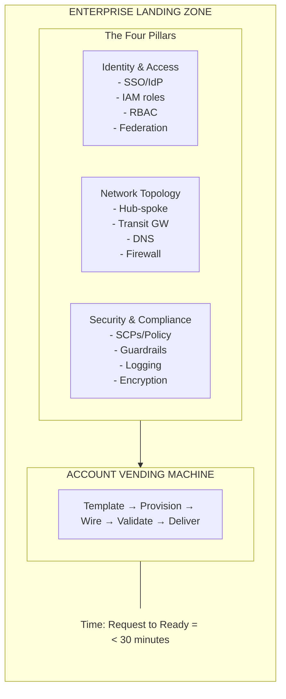
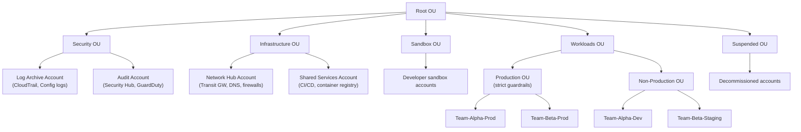
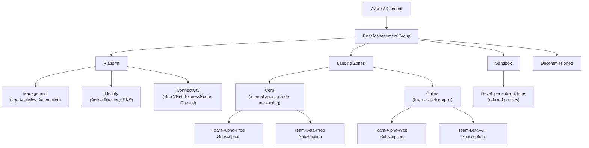
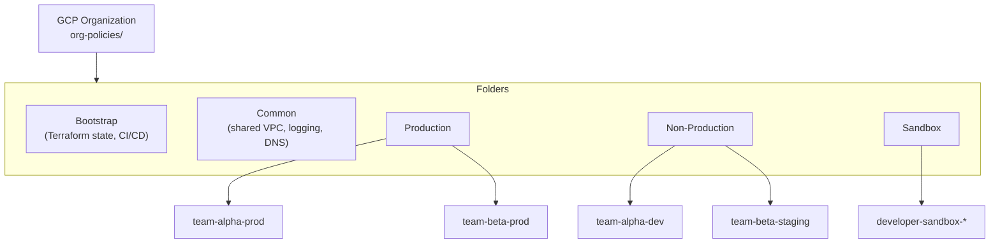
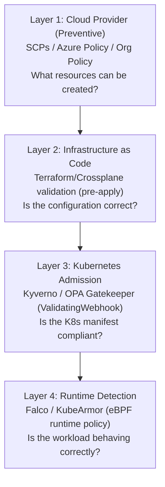
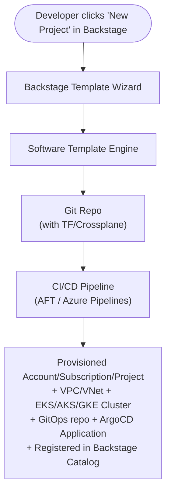
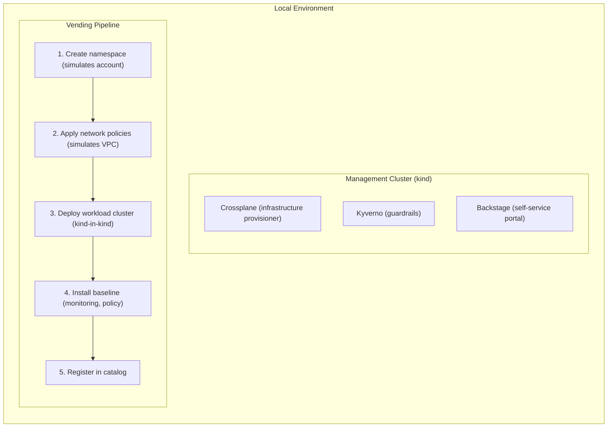

**Complexity**: [COMPLEX] | **Time to Complete**: 3h | **Prerequisites**: Cloud Essentials (AWS/Azure/GCP), Kubernetes Basics, Cloud Architecture Patterns

## What You'll Be Able to Do

After completing this module, you will be able to:

- **Design enterprise landing zones using AWS Control Tower, Azure Landing Zones, and GCP Organization Hierarchy**
- **Implement automated account vending machines that provision cloud accounts and Kubernetes platforms quickly through automation**
- **Configure guardrails (SCPs, Azure Policy, Organization Policies) that enforce security baselines across all accounts**
- **Deploy landing zone customizations that integrate Kubernetes cluster bootstrapping with GitOps from day zero**

---

## Why This Module Matters

A common failure mode in large enterprises is that environment provisioning stays manual, a small central team becomes a bottleneck, and application teams wait weeks or months for new cloud environments.

When production environment delivery is slow, launch schedules slip and the business impact can be substantial. The problem is usually manual provisioning and inconsistent handoffs, not a lack of cloud features.

Enterprise Landing Zones solve this exact problem. They are the foundational architecture that defines how an organization uses cloud at scale -- the account structure, the networking topology, the security guardrails, the identity model, and the automation that provisions all of it in minutes instead of weeks. When Kubernetes enters the picture, Landing Zones become even more critical: every cluster needs networking, identity, logging, and policy from day zero. In this module, you will learn how AWS Control Tower, Azure Landing Zones, and GCP Organization Hierarchy work, how to automate account vending with Kubernetes bootstrap included, and how to wire it all together so a team can go from "I need a cluster" to "I have a production-ready cluster" through a fast, automated provisioning flow.

---

## The Landing Zone Mental Model

Before diving into specific cloud implementations, you need to understand what a Landing Zone actually is. Think of it as the building code for a city. Before anyone constructs a building, the city has already defined the zoning regulations, the sewer and electrical grid connections, the fire code, and the permit process. A Landing Zone does the same thing for cloud infrastructure.

### The Four Pillars

Every enterprise Landing Zone, regardless of cloud provider, addresses four pillars:



**Identity and Access**: Who can do what, across every account, with centralized SSO and federated identity. This must extend from cloud IAM into Kubernetes RBAC seamlessly.

**Network Topology**: How accounts connect to each other, to on-premises data centers, and to the internet. Every Kubernetes cluster needs a network that is already wired into this topology from birth.

**Security and Compliance**: The guardrails that prevent teams from doing dangerous things (like opening port 22 to the internet) while enabling them to move fast on everything else. These guardrails must cover both cloud resources and Kubernetes configurations.

**Account Vending**: The automation that provisions new accounts (or subscriptions, or projects) with all three pillars pre-configured. This is the factory line that eliminates the fourteen-week wait.

---

## AWS Control Tower and Account Factory

AWS Control Tower is Amazon's opinionated Landing Zone solution. It builds on top of AWS Organizations, AWS SSO (now IAM Identity Center), AWS Config, and AWS CloudTrail to create a multi-account environment with pre-configured guardrails.

### Architecture Overview



> **Pause and predict**: If your organization acquires a startup running a legacy, high-risk monolithic application, which AWS Organizational Unit (OU) would you place their accounts in to isolate them from your core workloads?

### Setting Up Control Tower

```bash
# Control Tower is set up via the AWS Console, but you can manage it via CLI after setup
# List enrolled accounts
aws controltower list-enabled-controls \
  --target-identifier "arn:aws:organizations::123456789012:ou/o-abc123/ou-xyz789"

# Check guardrail status
aws controltower list-enabled-controls \
  --target-identifier "arn:aws:organizations::123456789012:ou/o-abc123/ou-xyz789" \
  --query 'enabledControls[*].{Control:controlIdentifier, Status:statusSummary.status}'
```

### Account Factory for Terraform (AFT)

The real power comes from [Account Factory for Terraform (AFT), which turns account vending into a GitOps workflow](https://docs.aws.amazon.com/controltower/latest/userguide/taf-account-provisioning.html). You define an account in a Terraform file, push to a repo, and AFT provisions the account with all Landing Zone configurations.

```hcl
# account-requests/team-alpha-production.tf
module "team_alpha_prod" {
  source = "./modules/aft-account-request"

  control_tower_parameters = {
    AccountEmail              = "team-alpha-prod@company.com"
    AccountName               = "Team-Alpha-Production"
    ManagedOrganizationalUnit = "Workloads/Production"
    SSOUserEmail              = "team-alpha-lead@company.com"
    SSOUserFirstName          = "Platform"
    SSOUserLastName           = "Team"
  }

  account_tags = {
    team        = "alpha"
    environment = "production"
    cost-center = "CC-4521"
    data-class  = "confidential"
  }

  # Custom fields that trigger account customizations
  account_customizations_name = "k8s-production-baseline"

  change_management_parameters = {
    change_requested_by = "platform-team"
    change_reason       = "New production workload account for Team Alpha"
  }
}
```

### Kubernetes Bootstrap in Account Vending

The critical extension for Kubernetes-centric organizations is wiring cluster provisioning into the account vending pipeline. When an account is created, the customization pipeline can automatically:

1. Create a VPC with the standard CIDR from the IPAM pool
2. Attach the VPC to the Transit Gateway
3. Provision an EKS cluster with the organization's baseline configuration
4. Install mandatory add-ons (logging, monitoring, policy enforcement)
5. Configure Access Entries for the team's IAM roles
6. Register the cluster with the central Backstage catalog

```bash
#!/bin/bash
# AFT account customization script: k8s-production-baseline
# This runs automatically after account creation

ACCOUNT_ID=$(aws sts get-caller-identity --query Account --output text)
REGION="us-east-1"

# Step 1: Create VPC from IPAM pool
VPC_CIDR=$(aws ec2 allocate-ipam-pool-cidr \
  --ipam-pool-id ipam-pool-0abc123 \
  --netmask-length 20 \
  --query 'IpamPoolAllocation.Cidr' --output text)

# Step 2: Deploy baseline infrastructure via Terraform
cd /opt/aft/customizations/k8s-baseline
terraform init
terraform apply -auto-approve \
  -var="account_id=${ACCOUNT_ID}" \
  -var="vpc_cidr=${VPC_CIDR}" \
  -var="cluster_name=eks-${ACCOUNT_ID}-prod" \
  -var="cluster_version=1.35"

# Step 3: Register cluster in Backstage catalog
CLUSTER_ENDPOINT=$(aws eks describe-cluster \
  --name "eks-${ACCOUNT_ID}-prod" \
  --query 'cluster.endpoint' --output text)

curl -X POST "https://backstage.internal.company.com/api/catalog/entities" \
  -H "Content-Type: application/json" \
  -d "{
    \"apiVersion\": \"backstage.io/v1alpha1\",
    \"kind\": \"Resource\",
    \"metadata\": {
      \"name\": \"eks-${ACCOUNT_ID}-prod\",
      \"annotations\": {
        \"kubernetes.io/cluster-name\": \"eks-${ACCOUNT_ID}-prod\"
      }
    },
    \"spec\": {
      \"type\": \"kubernetes-cluster\",
      \"owner\": \"team-alpha\",
      \"lifecycle\": \"production\"
    }
  }"

echo "Account ${ACCOUNT_ID} fully provisioned with EKS cluster"
```

---

## Azure Landing Zones and Subscription Vending

Azure takes a similar but structurally different approach. Instead of accounts, [Azure uses Subscriptions organized under Management Groups](https://learn.microsoft.com/en-us/azure/governance/management-groups/overview). Azure Landing Zones provide a reference architecture for organizing Azure environments at scale.

### Azure Landing Zone Architecture



### Subscription Vending with Bicep

```bicep
// subscription-vending/main.bicep
targetScope = 'managementGroup'

@description('Name of the workload team')
param teamName string

@description('Environment: dev, staging, production')
param environment string

@description('Whether to provision an AKS cluster')
param provisionAKS bool = true

// Create the subscription
module subscription 'modules/subscription.bicep' = {
  name: 'sub-${teamName}-${environment}'
  params: {
    subscriptionName: 'sub-${teamName}-${environment}'
    managementGroupId: environment == 'production' ? 'mg-landing-zones-corp' : 'mg-landing-zones-sandbox'
    billingScope: '/providers/Microsoft.Billing/billingAccounts/1234/enrollmentAccounts/5678'
    tags: {
      team: teamName
      environment: environment
      costCenter: 'CC-${teamName}'
    }
  }
}

// Deploy networking into the new subscription
module networking 'modules/spoke-vnet.bicep' = {
  name: 'net-${teamName}-${environment}'
  scope: subscription
  params: {
    vnetName: 'vnet-${teamName}-${environment}'
    vnetAddressSpace: '10.${uniqueOctet}.0.0/16'
    hubVnetId: '/subscriptions/hub-sub-id/resourceGroups/rg-hub/providers/Microsoft.Network/virtualNetworks/vnet-hub'
    firewallPrivateIp: '10.0.1.4'
  }
}

// Deploy AKS if requested
module aks 'modules/aks-baseline.bicep' = if (provisionAKS) {
  name: 'aks-${teamName}-${environment}'
  scope: subscription
  params: {
    clusterName: 'aks-${teamName}-${environment}'
    kubernetesVersion: '1.35'
    subnetId: networking.outputs.aksSubnetId
    aadAdminGroupId: '${teamName}-k8s-admins'  // Azure AD group
    enableDefender: environment == 'production'
    enablePolicyAddon: true
  }
}
```

### Identity Integration: Azure AD to AKS

Azure's biggest advantage for enterprises already using Microsoft is [the seamless identity chain from Azure AD through to Kubernetes RBAC](https://learn.microsoft.com/en-us/azure/aks/azure-ad-rbac):

```bash
# Azure AD Group → AKS RBAC (no aws-auth equivalent needed)
# The AKS cluster natively understands Azure AD tokens

# Create an Azure AD group for cluster admins
az ad group create --display-name "aks-team-alpha-admins" \
  --mail-nickname "aks-team-alpha-admins"

# Assign the group as AKS cluster admin
az role assignment create \
  --assignee-object-id $(az ad group show -g "aks-team-alpha-admins" --query id -o tsv) \
  --role "Azure Kubernetes Service Cluster Admin Role" \
  --scope "/subscriptions/$SUB_ID/resourceGroups/rg-alpha/providers/Microsoft.ContainerService/managedClusters/aks-alpha-prod"

# Developers get namespace-scoped access
az role assignment create \
  --assignee-object-id $(az ad group show -g "aks-team-alpha-devs" --query id -o tsv) \
  --role "Azure Kubernetes Service Cluster User Role" \
  --scope "/subscriptions/$SUB_ID/resourceGroups/rg-alpha/providers/Microsoft.ContainerService/managedClusters/aks-alpha-prod"
```

> **Stop and think**: Look at the Azure identity integration. If an engineer transfers from Team Alpha to Team Beta, how many Kubernetes role bindings need to be updated to revoke their old access and grant their new access?

---

## GCP Organization Hierarchy and Project Factory

[Google Cloud organizes resources under an Organization, with Folders providing the hierarchy and Projects serving as the account boundary](https://docs.cloud.google.com/resource-manager/docs/cloud-platform-resource-hierarchy).

### GCP Landing Zone Structure



### Project Factory with Terraform

Google's Cloud Foundation Toolkit provides a [Project Factory module that automates project vending](https://github.com/terraform-google-modules/terraform-google-project-factory):

```hcl
# project-factory/team-alpha-prod.tf
module "team_alpha_prod" {
  source  = "terraform-google-modules/project-factory/google"
  version = "~> 15.0"

  name                    = "team-alpha-prod"
  org_id                  = "123456789"
  folder_id               = google_folder.production.id
  billing_account         = "AABBCC-112233-DDEEFF"
  default_service_account = "disable"

  activate_apis = [
    "container.googleapis.com",
    "compute.googleapis.com",
    "monitoring.googleapis.com",
    "logging.googleapis.com",
    "dns.googleapis.com",
  ]

  shared_vpc         = "vpc-host-project"
  shared_vpc_subnets = [
    "projects/vpc-host-project/regions/us-central1/subnetworks/team-alpha-prod-nodes",
    "projects/vpc-host-project/regions/us-central1/subnetworks/team-alpha-prod-pods",
    "projects/vpc-host-project/regions/us-central1/subnetworks/team-alpha-prod-services",
  ]

  labels = {
    team        = "alpha"
    environment = "production"
    cost_center = "cc_4521"
  }
}

# GKE cluster in the vended project
module "gke_alpha_prod" {
  source  = "terraform-google-modules/kubernetes-engine/google//modules/private-cluster"
  version = "~> 33.0"

  project_id        = module.team_alpha_prod.project_id
  name              = "gke-alpha-prod"
  region            = "us-central1"
  network           = "vpc-host-network"
  subnetwork        = "team-alpha-prod-nodes"
  ip_range_pods     = "team-alpha-prod-pods"
  ip_range_services = "team-alpha-prod-services"

  enable_private_nodes    = true
  enable_private_endpoint = false
  master_ipv4_cidr_block  = "172.16.0.0/28"

  release_channel = "REGULAR"

  node_pools = [
    {
      name         = "general"
      machine_type = "e2-standard-4"
      min_count    = 2
      max_count    = 10
      auto_upgrade = true
    }
  ]
}
```

---

## Guardrails: Preventive and Detective Controls

Landing Zones without guardrails are just organized chaos. In this module, we will focus on two broad guardrail categories: **preventive** controls that block risky actions and **detective** controls that identify policy drift or noncompliance after the fact.

### Preventive Guardrails Across Clouds

| Guardrail | AWS (SCP) | Azure (Policy) | GCP (Org Policy) |
| :--- | :--- | :--- | :--- |
| Deny public S3/Storage buckets | SCP on OU | `Deny` effect policy | `constraints/storage.publicAccessPrevention` |
| Require encryption at rest | Use organization-level controls that explicitly enforce approved encryption settings | Use Azure Policy effects that audit or remediate encryption settings based on policy design | Use organization policies or service-specific controls that explicitly govern encryption settings where supported |
| Restrict regions | SCP deny non-approved regions | `AllowedLocations` | `constraints/gcp.resourceLocations` |
| Limit high-risk privilege escalation paths | Restrict privileged IAM actions with narrowly scoped exceptions | Use policy definitions that block or tightly govern elevated permissions | Use organization policies and IAM controls that reduce risky credential and privilege patterns |
| Require tags/labels | SCP deny untagged resources | `Require tag` initiative | Custom org policy |
| Block public Kubernetes API | SCP deny public EKS endpoint | `Deny public AKS` | `constraints/container.restrictPublicCluster` |

### Example: AWS SCP for Kubernetes Guardrails

```json
{
  "Version": "2012-10-17",
  "Statement": [
    {
      "Sid": "DenyPublicEKSEndpoint",
      "Effect": "Deny",
      "Action": [
        "eks:CreateCluster",
        "eks:UpdateClusterConfig"
      ],
      "Resource": "*",
      "Condition": {
        "ForAnyValue:StringEquals": {
          "eks:endpointPublicAccess": "true"
        }
      }
    },
    {
      "Sid": "DenyEKSWithoutLogging",
      "Effect": "Deny",
      "Action": "eks:CreateCluster",
      "Resource": "*",
      "Condition": {
        "Null": {
          "eks:logging": "true"
        }
      }
    },
    {
      "Sid": "RequireEKSEncryption",
      "Effect": "Deny",
      "Action": "eks:CreateCluster",
      "Resource": "*",
      "Condition": {
        "Null": {
          "eks:encryptionConfig": "true"
        }
      }
    }
  ]
}
```

### Connecting Cloud Guardrails to Kubernetes Policy

The key insight that most organizations miss is that cloud guardrails and Kubernetes policy engines must work together as a unified system. Cloud guardrails can restrict some cluster-level settings, but you still need in-cluster policy to govern Kubernetes objects such as Services, Ingresses, and workloads. For that, you need an in-cluster policy engine.



> **Pause and predict**: Before we look at Backstage, list out the automated steps a pipeline should take to fulfill a 'New Kubernetes Cluster' request. What needs to happen between the developer clicking 'Submit' and them receiving a kubeconfig?

---

## Backstage as the Enterprise Front Door

Backstage, [originally built by Spotify and now a CNCF incubating project](https://github.com/backstage/backstage), is one way to build an internal developer portal for platform teams. It serves as the self-service portal where teams request infrastructure without needing to understand the underlying automation.

### How Backstage Fits Into Account Vending



### Backstage Software Template for K8s Environment

```yaml
# backstage-templates/new-k8s-environment.yaml
apiVersion: scaffolder.backstage.io/v1beta3
kind: Template
metadata:
  name: new-k8s-environment
  title: Request New Kubernetes Environment
  description: Provision a new cloud account with a production-ready K8s cluster
  tags:
    - kubernetes
    - infrastructure
spec:
  owner: platform-team
  type: environment

  parameters:
    - title: Team Information
      required:
        - teamName
        - costCenter
      properties:
        teamName:
          title: Team Name
          type: string
          pattern: '^[a-z][a-z0-9-]{2,20}$'
        costCenter:
          title: Cost Center
          type: string

    - title: Environment Configuration
      required:
        - environment
        - cloudProvider
        - region
      properties:
        environment:
          title: Environment
          type: string
          enum: ['development', 'staging', 'production']
        cloudProvider:
          title: Cloud Provider
          type: string
          enum: ['aws', 'azure', 'gcp']
        region:
          title: Region
          type: string
          enum: ['us-east-1', 'eu-west-1', 'ap-southeast-1']

    - title: Cluster Configuration
      properties:
        clusterSize:
          title: Cluster Size
          type: string
          enum: ['small', 'medium', 'large']
          default: 'medium'
          description: |
            small: 2-5 nodes, dev/test workloads
            medium: 3-20 nodes, production services
            large: 5-100 nodes, high-traffic production
        enableServiceMesh:
          title: Enable Istio Service Mesh
          type: boolean
          default: false
        enableGPU:
          title: Include GPU Node Pool
          type: boolean
          default: false

  steps:
    - id: generate-terraform
      name: Generate Infrastructure Code
      action: fetch:template
      input:
        url: ./skeleton
        values:
          teamName: ${{ parameters.teamName }}
          environment: ${{ parameters.environment }}
          cloudProvider: ${{ parameters.cloudProvider }}
          region: ${{ parameters.region }}
          clusterSize: ${{ parameters.clusterSize }}

    - id: create-repo
      name: Create Infrastructure Repository
      action: publish:github
      input:
        repoUrl: github.com?owner=company-infra&repo=env-${{ parameters.teamName }}-${{ parameters.environment }}
        defaultBranch: main

    - id: trigger-pipeline
      name: Trigger Provisioning Pipeline
      action: github:actions:dispatch
      input:
        repoUrl: github.com?owner=company-infra&repo=env-${{ parameters.teamName }}-${{ parameters.environment }}
        workflowId: provision.yml

    - id: register-catalog
      name: Register in Backstage Catalog
      action: catalog:register
      input:
        repoContentsUrl: ${{ steps['create-repo'].output.repoContentsUrl }}
        catalogInfoPath: /catalog-info.yaml

  output:
    links:
      - title: Infrastructure Repository
        url: ${{ steps['create-repo'].output.remoteUrl }}
      - title: Provisioning Pipeline
        url: ${{ steps['trigger-pipeline'].output.runUrl }}
```

*War Story: Self-service account vending usually reduces setup time dramatically and cuts down on one-off "snowflake" environments because every cluster starts from the same template and baseline.*

---

## Did You Know?

1. AWS Control Tower is built for governing large multi-account AWS environments, and AFT provides a Terraform-based workflow for automating account provisioning.

2. Azure landing zone guidance has evolved over time, and the current approach is more opinionated about common platform decisions than earlier guidance.

3. The distinction between approval-heavy gates and automated guardrails is a useful way to think about cloud governance. Gates rely on human approval before proceeding, while guardrails encode policy in automation. In Kubernetes terms, automated policy enforcement acts like a guardrail, while manual manifest review acts like a gate.

4. Backstage has a broad ecosystem around developer portals and software templates, which makes it a natural fit for self-service infrastructure patterns like account vending.

---

## Common Mistakes

| Mistake | Why It Happens | How to Fix It |
| :--- | :--- | :--- |
| **One giant account for everything** | Simplicity. "We only have 3 teams, we do not need multiple accounts." Then the organization grows to 30 teams. | Start with multi-account from day one. The overhead is minimal with automation, and retrofitting is extremely painful. |
| **Landing Zone without Kubernetes integration** | The Landing Zone team is a separate group from the Kubernetes platform team. They design the zone without considering K8s networking, identity, or policy needs. | Include Kubernetes architects in Landing Zone design. Every account template should include VPC sizing for pod CIDRs, IAM roles for cluster operations, and policy baseline for K8s. |
| **Manual account vending** | "We only create accounts once a quarter, automation is overkill." Then demand spikes and the queue grows to months. | Automate account vending from the start. Even if you provision one account per month, the automation ensures consistency and eliminates human error. |
| **Guardrails too restrictive** | Security team designs guardrails without developer input. Developers cannot deploy basic workloads. Shadow IT begins. | Co-design guardrails with developers. Start permissive and tighten based on actual incidents. Monitor guardrail denials to find legitimate use cases being blocked. |
| **No DNS strategy in the Landing Zone** | DNS is treated as an afterthought. Each account manages its own DNS, leading to naming conflicts and resolution failures across the hub-spoke network. | Design DNS delegation as part of the Landing Zone: a central Route53/Azure DNS/Cloud DNS zone with automatic subdomain delegation per account. |
| **Ignoring IPAM from the start** | VPC CIDR ranges assigned ad-hoc. Over time, overlapping CIDRs can block shared networking and leave too little address space for Kubernetes pods and services. | Use a centralized IPAM approach. Assign CIDRs from a pool that accounts for node IPs, pod IPs, and service IPs per cluster. |
| **Backstage template without validation** | Templates allow any input. Teams create clusters with names that violate DNS conventions or sizes that exceed their budget approval. | Add JSON Schema validation to Backstage templates. Implement approval workflows for production environments. Connect cost estimation to the template wizard. |
| **No Landing Zone lifecycle plan** | Landing Zone is deployed once and then rarely updated. Cloud providers release new capabilities, but the baseline never adopts them. | Treat the Landing Zone as a product with a roadmap. Review provider changes regularly and test baseline updates before rollout. |

---

## Quiz

<details>
<summary>Question 1: You are the lead architect for a retail company moving to Kubernetes. A colleague suggests saving time by creating a single AWS account containing one massive EKS cluster, and using Kubernetes namespaces to isolate the 15 different product teams. Why is this a dangerous architectural decision for an enterprise?</summary>

A single account creates an insurmountable blast radius problem and an IAM complexity nightmare. First, all teams share the same AWS service quotas (like EC2 instance limits, EBS volumes, and VPC IP addresses). One team's runaway autoscaling event can easily exhaust quotas, causing outages for all other teams sharing the account. Second, restricting AWS API access via IAM requires writing incredibly complex, error-prone resource-level conditions to ensure teams cannot modify each other's cloud resources outside the cluster. Finally, a security breach escaping one team's namespace or a compromised node could potentially expose the IAM credentials used by other teams, making the entire organization vulnerable to a single point of failure.
</details>

<details>
<summary>Question 2: Your security team discovers that several development clusters were accidentally provisioned with public API endpoints. They want to ensure this never happens again, but they also want to audit existing clusters. Which types of guardrails should you implement for each requirement, and how do they function differently?</summary>

To stop new public endpoints from being created, you must implement a preventive guardrail, such as an AWS Service Control Policy (SCP) or an Azure Policy with a Deny effect. Preventive guardrails actively intercept and block non-compliant API requests before the resource is ever provisioned, ensuring the problem cannot occur. To audit the existing clusters, you need a detective guardrail, such as AWS Config rules or Azure Policy in Audit mode. Detective guardrails scan already-provisioned resources, identify non-compliant configurations, and generate alerts without breaking existing workloads. Using both in tandem provides a comprehensive governance strategy.
</details>

<details>
<summary>Question 3: A new engineering team joins the company and urgently needs a staging environment. They log into the Backstage portal and submit a 'New Kubernetes Environment' request. Describe the exact automated sequence of events that translates this web form submission into a fully provisioned, registered Kubernetes cluster.</summary>

The process begins when Backstage takes the form inputs and uses its software template engine to generate infrastructure-as-code files tailored to the team's parameters. Next, Backstage creates a new Git repository and commits these generated files to it. The creation of this repository triggers a CI/CD pipeline (such as GitHub Actions or AFT) which acts as the vending machine. This pipeline executes the Terraform or Bicep code to provision the cloud account, establish the VPC network topology, deploy the Kubernetes cluster, and configure identity integrations. Finally, the pipeline concludes by making an API call back to Backstage to register the newly created cluster in the service catalog, completing the self-service loop.
</details>

<details>
<summary>Question 4: The networking team has assigned your new AWS account a /24 VPC CIDR block (256 IP addresses) because they assume you are only deploying a single EKS cluster with 10 worker nodes. Six weeks later, your cluster networking completely fails. What architectural reality of cloud-native Kubernetes did the networking team fail to account for?</summary>

The networking team failed to account for the fact that in cloud-native networking models like AWS VPC CNI, most Kubernetes pods are assigned a real, routable IP address directly from the VPC subnet. If a node runs 30 pods, that single node consumes 30+ IP addresses. A relatively small cluster of 10 nodes running standard microservices can easily consume 400 or more IP addresses, completely exhausting a /24 allocation. Enterprise landing zones must utilize centralized IP Address Management (IPAM) to assign large CIDR blocks (typically /16 or /17) to Kubernetes accounts to prevent this exact type of catastrophic IP exhaustion.
</details>

<details>
<summary>Question 5: You are designing the identity architecture for a multi-cloud landing zone spanning AWS and Azure. The security mandate requires that a user's corporate identity directly maps to their Kubernetes namespace permissions. Contrast how you will implement this identity propagation mechanism in AWS EKS versus Azure AKS.</summary>

In Azure AKS, the implementation is highly direct because AKS natively integrates with Azure AD (Entra ID). You can directly reference Azure AD Group Object IDs inside your Kubernetes `RoleBinding` manifests, allowing AKS to natively validate the Azure AD tokens passed by developers. In contrast, AWS EKS requires an intermediary translation layer to bridge AWS IAM and Kubernetes RBAC. You must configure EKS Access Entries (or the legacy aws-auth ConfigMap) to explicitly map an AWS IAM Role ARN to a Kubernetes username and group. Therefore, in Azure the identity flows seamlessly from tenant to cluster, whereas AWS requires your vending pipeline to explicitly build and maintain mapping configurations.
</details>

<details>
<summary>Question 6: The central IT department spent six months building a pristine GCP Landing Zone with strict organizational policies, centralized networking, and standardized service accounts. They hand it over to the Kubernetes platform team to deploy GKE. Within days, the platform team reports they are completely blocked. What is the most likely architectural cause of this failure?</summary>

The failure occurred because the Landing Zone was designed without accommodating the specific, complex infrastructure requirements of a Kubernetes control plane and its add-ons. Common blind spots include strict firewall policies that break webhook communication between the GKE control plane and worker nodes, or Shared VPC subnet allocations that are far too small for alias IP ranges required by pods. Furthermore, organization-level policies might inadvertently deny the creation of internal load balancers or restrict the service account permissions required by the cluster autoscaler to provision new nodes. To prevent this, enterprise landing zones must be co-designed with Kubernetes architects to ensure the foundation actually supports the intended workloads.
</details>

<details>
<summary>Question 7: A junior developer uses the Backstage portal to request a 100-node production Kubernetes cluster with expensive GPU instances, intended to process a massive new data pipeline. As the platform architect, how should you design the account vending workflow to handle this specific request safely while still maintaining automated self-service?</summary>

The workflow should process this request using an automated business approval gate rather than blocking it for a manual infrastructure code review. Because the Backstage template generates standardized, pre-approved infrastructure code with built-in guardrails, the technical correctness of the cluster is already guaranteed. However, because this request targets a production environment and incurs massive cost, the workflow should pause and automatically route an approval request to the team's cost center owner and the security lead. Once those stakeholders approve the business case and budget, the CI/CD pipeline should resume and automatically provision the cluster without any human engineer needing to touch the provisioning tools.
</details>

---

## Hands-On Exercise: Build a Mini Landing Zone with Account Vending

In this exercise, you will simulate an enterprise Landing Zone using local tools. You will create a multi-account structure, implement guardrails, and build a self-service vending pipeline that provisions a Kubernetes cluster.

**What you will build:**



### Task 1: Create the Management Cluster

Set up the local management cluster that will serve as your Landing Zone control plane.

<details>
<summary>Solution</summary>

```bash
# Create a kind cluster to act as the management cluster
cat <<'EOF' > /tmp/mgmt-cluster.yaml
kind: Cluster
apiVersion: kind.x-k8s.io/v1alpha4
name: landing-zone-mgmt
nodes:
  - role: control-plane
  - role: worker
  - role: worker
EOF

kind create cluster --config /tmp/mgmt-cluster.yaml

# Verify the cluster is running
k get nodes
# NAME                               STATUS   ROLES           AGE   VERSION
# landing-zone-mgmt-control-plane    Ready    control-plane   45s   v1.35.0
# landing-zone-mgmt-worker           Ready    <none>          30s   v1.35.0
# landing-zone-mgmt-worker2          Ready    <none>          30s   v1.35.0
```

</details>

### Task 2: Install the Guardrail Layer

Deploy Kyverno and create policies that simulate enterprise guardrails (no privileged containers, mandatory labels, resource limits required).

<details>
<summary>Solution</summary>

```bash
# Install Kyverno
helm repo add kyverno https://kyverno.github.io/kyverno/
helm install kyverno kyverno/kyverno -n kyverno --create-namespace --wait

# Create enterprise guardrail policies
cat <<'EOF' | k apply -f -
apiVersion: kyverno.io/v1
kind: ClusterPolicy
metadata:
  name: require-team-label
  annotations:
    policies.kyverno.io/description: "All namespaces must have a team label"
spec:
  validationFailureAction: Enforce
  rules:
    - name: check-team-label
      match:
        any:
          - resources:
              kinds:
                - Namespace
      exclude:
        any:
          - resources:
              namespaces:
                - kube-system
                - kube-public
                - kube-node-lease
                - kyverno
                - default
      validate:
        message: "Namespace must have a 'team' label. This is required by the Landing Zone policy."
        pattern:
          metadata:
            labels:
              team: "?*"
---
apiVersion: kyverno.io/v1
kind: ClusterPolicy
metadata:
  name: deny-privileged
spec:
  validationFailureAction: Enforce
  rules:
    - name: deny-privileged-containers
      match:
        any:
          - resources:
              kinds:
                - Pod
      exclude:
        any:
          - resources:
              namespaces:
                - kube-system
                - kyverno
      validate:
        message: "Privileged containers are not allowed by Landing Zone policy."
        pattern:
          spec:
            containers:
              - securityContext:
                  privileged: "!true"
---
apiVersion: kyverno.io/v1
kind: ClusterPolicy
metadata:
  name: require-resource-limits
spec:
  validationFailureAction: Enforce
  rules:
    - name: check-limits
      match:
        any:
          - resources:
              kinds:
                - Pod
      exclude:
        any:
          - resources:
              namespaces:
                - kube-system
                - kyverno
      validate:
        message: "All containers must have CPU and memory limits set."
        pattern:
          spec:
            containers:
              - resources:
                  limits:
                    memory: "?*"
                    cpu: "?*"
EOF

# Test the guardrails
echo "Testing: namespace without team label (should fail)"
k create namespace bad-namespace 2>&1 || true

echo "Testing: namespace with team label (should succeed)"
k create namespace good-namespace --dry-run=server -o yaml \
  | k label --local -f - team=alpha --dry-run=client -o yaml \
  | k apply -f - --dry-run=server
```

</details>

### Task 3: Create an Account Vending Script

Build a script that simulates account vending -- creating a namespace with all the Landing Zone baseline configurations.

<details>
<summary>Solution</summary>

```bash
cat <<'SCRIPT' > /tmp/vend-account.sh
#!/bin/bash
set -euo pipefail

TEAM_NAME=$1
ENVIRONMENT=$2

NAMESPACE="${TEAM_NAME}-${ENVIRONMENT}"
echo "=== Vending account: ${NAMESPACE} ==="

# Step 1: Create namespace with required labels
echo "[1/5] Creating namespace with Landing Zone labels..."
cat <<EOF | kubectl apply -f -
apiVersion: v1
kind: Namespace
metadata:
  name: ${NAMESPACE}
  labels:
    team: ${TEAM_NAME}
    environment: ${ENVIRONMENT}
    managed-by: landing-zone
    cost-center: "cc-${TEAM_NAME}"
EOF

# Step 2: Apply network policies (simulates VPC isolation)
echo "[2/5] Applying network isolation policies..."
cat <<EOF | kubectl apply -f -
apiVersion: networking.k8s.io/v1
kind: NetworkPolicy
metadata:
  name: default-deny-ingress
  namespace: ${NAMESPACE}
spec:
  podSelector: {}
  policyTypes:
    - Ingress
---
apiVersion: networking.k8s.io/v1
kind: NetworkPolicy
metadata:
  name: allow-same-namespace
  namespace: ${NAMESPACE}
spec:
  podSelector: {}
  ingress:
    - from:
        - podSelector: {}
  policyTypes:
    - Ingress
EOF

# Step 3: Create resource quotas
echo "[3/5] Setting resource quotas..."
cat <<EOF | kubectl apply -f -
apiVersion: v1
kind: ResourceQuota
metadata:
  name: landing-zone-quota
  namespace: ${NAMESPACE}
spec:
  hard:
    requests.cpu: "8"
    requests.memory: 16Gi
    limits.cpu: "16"
    limits.memory: 32Gi
    pods: "50"
    services.loadbalancers: "2"
EOF

# Step 4: Create RBAC for the team
echo "[4/5] Configuring RBAC..."
cat <<EOF | kubectl apply -f -
apiVersion: rbac.authorization.k8s.io/v1
kind: Role
metadata:
  name: team-developer
  namespace: ${NAMESPACE}
rules:
  - apiGroups: ["", "apps", "batch"]
    resources: ["pods", "deployments", "services", "configmaps", "secrets", "jobs"]
    verbs: ["get", "list", "watch", "create", "update", "patch", "delete"]
  - apiGroups: [""]
    resources: ["pods/log", "pods/exec"]
    verbs: ["get", "create"]
---
apiVersion: rbac.authorization.k8s.io/v1
kind: RoleBinding
metadata:
  name: team-developer-binding
  namespace: ${NAMESPACE}
subjects:
  - kind: Group
    name: "team-${TEAM_NAME}-developers"
    apiGroup: rbac.authorization.k8s.io
roleRef:
  kind: Role
  name: team-developer
  apiGroup: rbac.authorization.k8s.io
EOF

# Step 5: Deploy baseline monitoring
echo "[5/5] Deploying baseline services..."
cat <<EOF | kubectl apply -f -
apiVersion: v1
kind: ConfigMap
metadata:
  name: landing-zone-config
  namespace: ${NAMESPACE}
data:
  team: "${TEAM_NAME}"
  environment: "${ENVIRONMENT}"
  provisioned-at: "$(date -u +%Y-%m-%dT%H:%M:%SZ)"
  landing-zone-version: "2.1.0"
EOF

echo ""
echo "=== Account vended successfully ==="
echo "Namespace:    ${NAMESPACE}"
echo "Team:         ${TEAM_NAME}"
echo "Environment:  ${ENVIRONMENT}"
echo "Quotas:       CPU 8/16 req/limit, Memory 16/32Gi req/limit"
echo "Network:      Default deny ingress, allow same-namespace"
echo "RBAC:         team-${TEAM_NAME}-developers -> team-developer role"
SCRIPT

chmod +x /tmp/vend-account.sh

# Vend accounts for two teams
/tmp/vend-account.sh alpha production
/tmp/vend-account.sh beta development

# Verify the vended accounts
k get namespaces -l managed-by=landing-zone
k get resourcequota -A -l managed-by!=null 2>/dev/null || k get resourcequota -n alpha-production
k get networkpolicy -n alpha-production
```

</details>

### Task 4: Test Guardrail Enforcement

Verify that the guardrails prevent non-compliant resources in vended accounts.

<details>
<summary>Solution</summary>

```bash
# Test 1: Try to create a privileged pod (should be denied)
echo "--- Test: Privileged pod (expect DENIED) ---"
cat <<'EOF' | k apply -f - 2>&1 || true
apiVersion: v1
kind: Pod
metadata:
  name: bad-privileged-pod
  namespace: alpha-production
spec:
  containers:
    - name: evil
      image: nginx:1.27
      securityContext:
        privileged: true
      resources:
        limits:
          cpu: 100m
          memory: 128Mi
EOF

# Test 2: Try to create a pod without resource limits (should be denied)
echo "--- Test: Pod without limits (expect DENIED) ---"
cat <<'EOF' | k apply -f - 2>&1 || true
apiVersion: v1
kind: Pod
metadata:
  name: no-limits-pod
  namespace: alpha-production
spec:
  containers:
    - name: wasteful
      image: nginx:1.27
EOF

# Test 3: Create a compliant pod (should succeed)
echo "--- Test: Compliant pod (expect SUCCESS) ---"
cat <<'EOF' | k apply -f -
apiVersion: v1
kind: Pod
metadata:
  name: good-pod
  namespace: alpha-production
spec:
  containers:
    - name: web
      image: nginx:1.27
      securityContext:
        privileged: false
      resources:
        limits:
          cpu: 100m
          memory: 128Mi
        requests:
          cpu: 50m
          memory: 64Mi
EOF

# Verify the compliant pod is running
k get pods -n alpha-production
```

</details>

### Task 5: Audit the Landing Zone

Generate a compliance report for all vended accounts.

<details>
<summary>Solution</summary>

```bash
cat <<'SCRIPT' > /tmp/audit-landing-zone.sh
#!/bin/bash
echo "========================================="
echo "  LANDING ZONE COMPLIANCE AUDIT REPORT"
echo "  Generated: $(date -u +%Y-%m-%dT%H:%M:%SZ)"
echo "========================================="
echo ""

# List all vended namespaces
NAMESPACES=$(kubectl get namespaces -l managed-by=landing-zone -o jsonpath='{.items[*].metadata.name}')

for NS in $NAMESPACES; do
  echo "--- Namespace: $NS ---"
  TEAM=$(kubectl get namespace $NS -o jsonpath='{.metadata.labels.team}')
  ENV=$(kubectl get namespace $NS -o jsonpath='{.metadata.labels.environment}')
  echo "  Team: $TEAM | Environment: $ENV"

  # Check network policies
  NP_COUNT=$(kubectl get networkpolicy -n $NS --no-headers 2>/dev/null | wc -l)
  if [ "$NP_COUNT" -ge 1 ]; then
    echo "  Network Policies: PASS ($NP_COUNT policies)"
  else
    echo "  Network Policies: FAIL (no policies found)"
  fi

  # Check resource quotas
  RQ_COUNT=$(kubectl get resourcequota -n $NS --no-headers 2>/dev/null | wc -l)
  if [ "$RQ_COUNT" -ge 1 ]; then
    echo "  Resource Quotas: PASS ($RQ_COUNT quotas)"
  else
    echo "  Resource Quotas: FAIL (no quotas found)"
  fi

  # Check RBAC
  ROLE_COUNT=$(kubectl get role -n $NS --no-headers 2>/dev/null | wc -l)
  if [ "$ROLE_COUNT" -ge 1 ]; then
    echo "  RBAC Roles: PASS ($ROLE_COUNT roles)"
  else
    echo "  RBAC Roles: FAIL (no roles found)"
  fi

  # Check Kyverno policy reports
  VIOLATIONS=$(kubectl get policyreport -n $NS -o jsonpath='{.items[*].summary.fail}' 2>/dev/null)
  if [ -z "$VIOLATIONS" ] || [ "$VIOLATIONS" = "0" ]; then
    echo "  Policy Violations: PASS (0 violations)"
  else
    echo "  Policy Violations: WARN ($VIOLATIONS violations)"
  fi

  echo ""
done

echo "========================================="
echo "  Guardrail Policy Summary"
echo "========================================="
kubectl get clusterpolicy -o custom-columns=NAME:.metadata.name,ACTION:.spec.validationFailureAction,READY:.status.ready
SCRIPT

chmod +x /tmp/audit-landing-zone.sh
bash /tmp/audit-landing-zone.sh
```

</details>

### Clean Up

```bash
kind delete cluster --name landing-zone-mgmt
rm /tmp/mgmt-cluster.yaml /tmp/vend-account.sh /tmp/audit-landing-zone.sh
```

### Success Criteria

- [ ] I created a management cluster with Kyverno guardrails installed
- [ ] I deployed three guardrail policies (team label, no privileged, resource limits)
- [ ] I built and ran an account vending script that provisions namespaces with full baseline
- [ ] I successfully vended accounts for two teams
- [ ] I verified that guardrails block non-compliant resources
- [ ] I generated a compliance audit report for all vended accounts
- [ ] I can explain the four pillars of an enterprise Landing Zone

---

## Next Module

With the Landing Zone foundation in place, it is time to go deeper into the policy layer. Head to [Module 10.2: Cloud Governance & Policy as Code](../module-10.2-governance/) to learn how AWS SCPs, Azure Policies, and GCP Organization Policies map to Kubernetes policy engines like Kyverno and OPA Gatekeeper, and how to build a unified governance model across cloud and cluster.

## Sources

- [AWS Control Tower Account Factory for Terraform provisioning](https://docs.aws.amazon.com/controltower/latest/userguide/taf-account-provisioning.html) — Explains how AFT handles account requests, provisioning, and customization workflows.
- [Azure management groups overview](https://learn.microsoft.com/en-us/azure/governance/management-groups/overview) — Defines the management-group hierarchy used to organize and govern Azure subscriptions.
- [Use Microsoft Entra ID to control access to AKS cluster resources with Azure RBAC](https://learn.microsoft.com/en-us/azure/aks/azure-ad-rbac) — Documents AKS authentication with Entra ID and authorization through Azure/Kubernetes RBAC mappings.
- [Google Cloud resource hierarchy](https://docs.cloud.google.com/resource-manager/docs/cloud-platform-resource-hierarchy) — Defines the organization-folder-project model that underpins GCP landing-zone structure.
- [Terraform Google Project Factory](https://github.com/terraform-google-modules/terraform-google-project-factory) — Official module repository for vending opinionated Google Cloud projects with shared services enabled.
- [Backstage](https://github.com/backstage/backstage) — Official project repository describing Backstage's origins and current CNCF-hosted status.
- [What Is AWS Control Tower?](https://docs.aws.amazon.com/controltower/latest/userguide/what-is-control-tower.html) — Authoritative overview of AWS Control Tower as a landing-zone and governance service.
- [What is an Azure landing zone?](https://learn.microsoft.com/en-us/azure/cloud-adoption-framework/ready/landing-zone/) — Microsoft's reference guidance for Azure landing-zone architecture and operating model.
