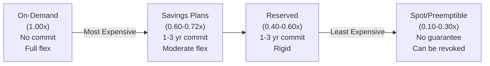
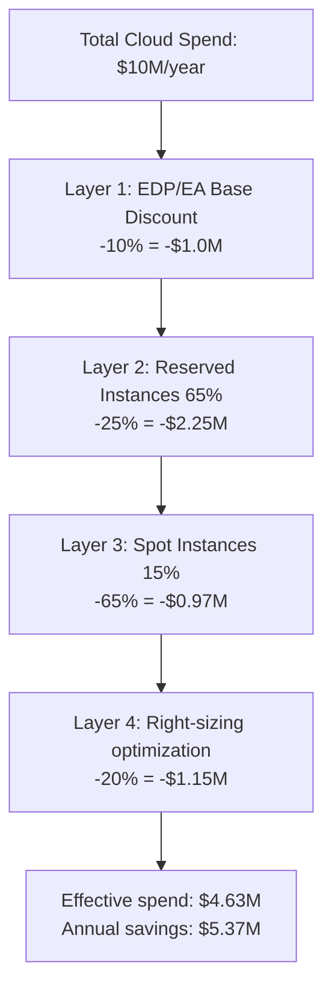
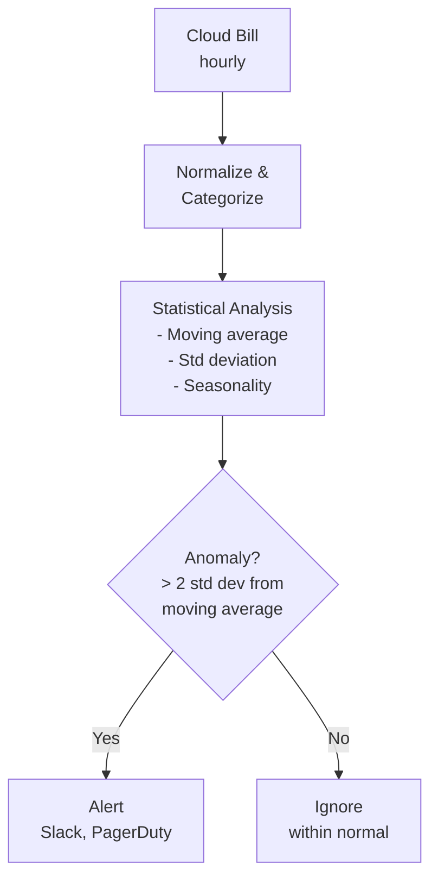
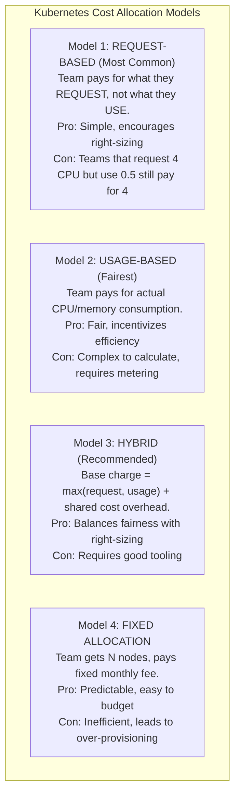
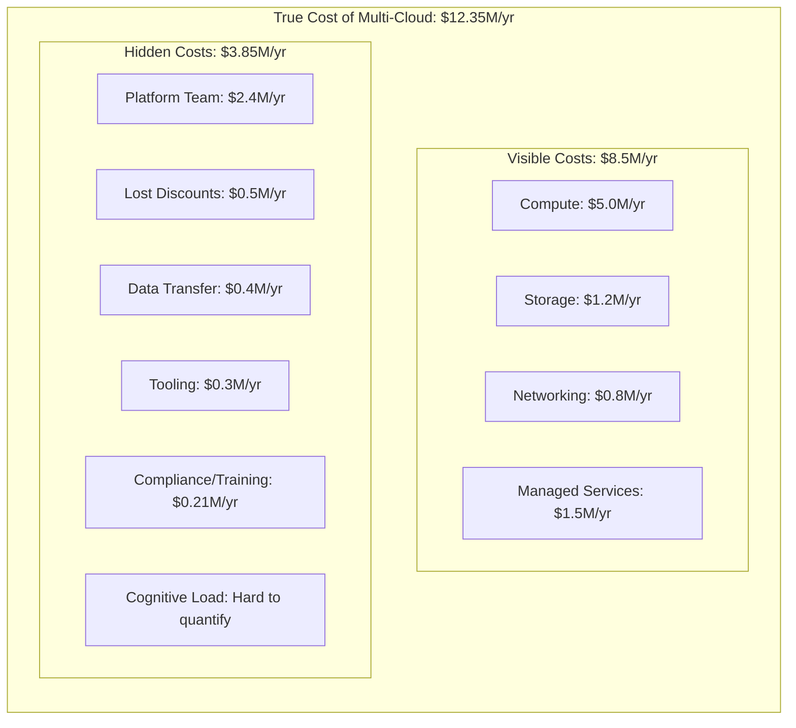
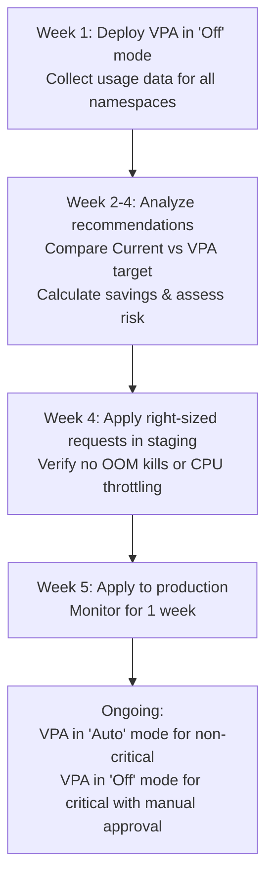
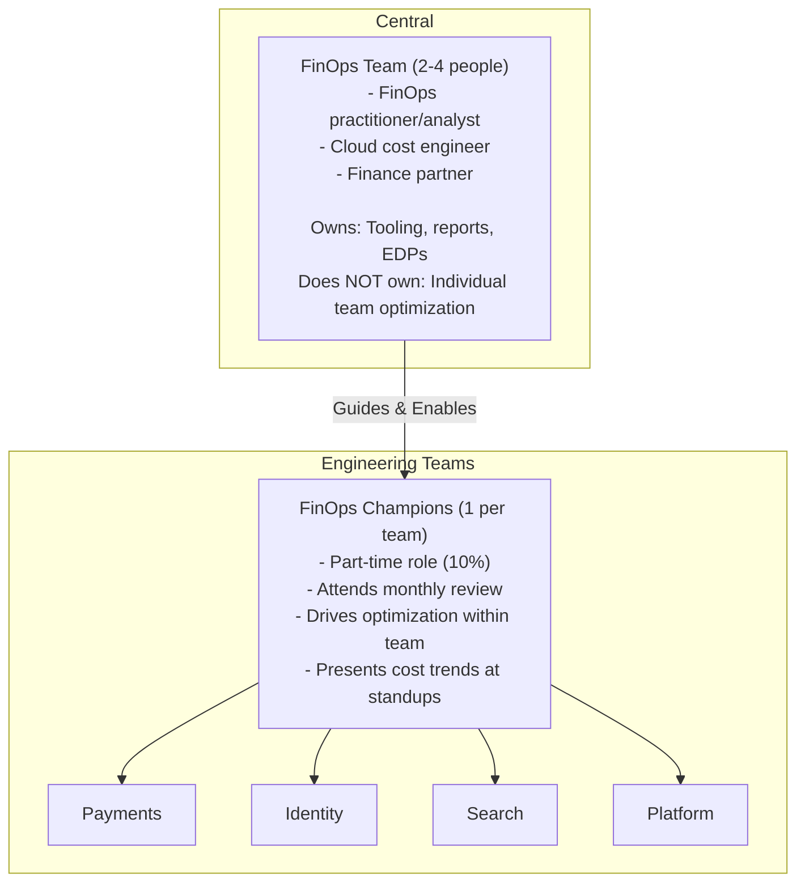

**Complexity**: [COMPLEX] | **Time to Complete**: 2h | **Prerequisites**: Cloud Essentials (AWS/Azure/GCP), Kubernetes Resource Management, Enterprise Landing Zones (Module 10.1)

## What You'll Be Able to Do

After completing this module, you will be able to:

- **Implement enterprise FinOps practices with cloud billing integration, team-level cost allocation, and Kubernetes cost attribution**
- **Configure multi-cloud cost visibility using Kubecost, OpenCost, or FOCUS-compliant tools across the fleet**
- **Design chargeback and showback models that map Kubernetes namespace and label costs to business units**
- **Deploy automated cost optimization pipelines that enforce resource quotas, right-size recommendations, and waste detection**

---

## Why This Module Matters

In March 2024, the CFO of a Series D SaaS company called an emergency board meeting. Their cloud bill had grown from $1.2 million per month to $4.8 million per month in 18 months -- a 4x increase while revenue grew only 1.6x. The engineering team had no explanation. When pressed, the VP of Engineering admitted they did not know which teams or services were responsible for the growth. Their Kubernetes clusters ran hundreds of services, each requesting resources based on "better safe than sorry" estimates. The average CPU utilization across their fleet was 11%. They were paying for 9x more compute than they actually used.

The board demanded a plan. The company hired a FinOps consultant who discovered: (1) 23% of their spend was on idle resources that no team claimed ownership of, (2) their Reserved Instance coverage was 18% when it should have been 60-70%, (3) three teams were running GPU instances for machine learning experiments that finished months ago but whose clusters were never decommissioned, and (4) cross-region data transfer costs were $340,000/month because two services that communicated constantly were deployed in different regions for no good reason.

This story is not unusual. It is the norm. The FinOps Foundation's 2024 State of FinOps report found that 73% of organizations consider cloud waste their top FinOps challenge, and the average organization wastes 28% of its cloud spend. At enterprise scale -- where cloud bills reach $10-100 million per year -- that waste translates to millions of dollars that could fund entire engineering teams.

FinOps at enterprise scale is not about nickel-and-diming individual pod requests. It is about building the organizational capability to understand, forecast, and optimize cloud spending as a continuous practice. In this module, you will learn cloud economics at scale, how Enterprise Discount Programs work, forecasting and anomaly detection, chargeback models for shared Kubernetes clusters, the true cost of multi-cloud, and how to build a FinOps culture.

---

## Cloud Economics at Scale

### The Cloud Pricing Model

Cloud providers price compute, storage, and networking differently, but they share a common pattern: the more you commit, the less you pay per unit.



> **Pause and predict**: If you commit to a 3-year Savings Plan, what happens if your application architecture changes and requires half as much compute before the term expires?

### Enterprise Discount Programs (EDPs)

At enterprise scale ($1M+/year), cloud providers offer negotiated discounts through Enterprise Discount Programs:

| Provider | Program | Typical Discount | Commitment |
| :--- | :--- | :--- | :--- |
| **AWS** | Enterprise Discount Program (EDP) | 5-15% on total spend | 1-5 year, minimum annual commit |
| **Azure** | Enterprise Agreement (EA) | 5-20% on consumption | 1-3 year, minimum annual commit |
| **GCP** | Committed Use Discounts (CUD) + Negotiated | 5-30% on specific services | 1-3 year per service |



### Kubernetes-Specific Cost Drivers

| Cost Driver | What It Is | Why It Grows | How to Optimize |
| :--- | :--- | :--- | :--- |
| **Over-provisioned pods** | Requests set too high, pods use fraction of allocated resources | Fear of OOM kills, copy-paste from examples | Right-size using VPA recommendations, Goldilocks |
| **Idle clusters** | Dev/test clusters running 24/7 but used only during business hours | Forgot to scale down, no automation | Auto-scaling to 0 nodes off-hours, cluster hibernation |
| **Cross-AZ traffic** | Pods talking to services in different AZs | Default round-robin load balancing ignores topology | Topology-aware routing, colocate communicating services |
| **Persistent volumes** | Over-sized PVs, snapshot retention too long | Provisioned "just in case," no lifecycle management | Right-size PVs, automate snapshot expiry, use dynamic provisioning |
| **NAT Gateway** | All outbound traffic from private subnets goes through NAT | Default architecture for private EKS | Use VPC endpoints for AWS services, reduce external calls |
| **Load Balancers** | One ALB/NLB per Service of type LoadBalancer | Developers create LoadBalancer Services by default | Use an Ingress Controller (one LB for many services) |
| **Data transfer** | Cross-region, cross-cloud, internet egress | Microservices sprawl, poor placement decisions | Place communicating services in the same region/AZ |

> **Stop and think**: Why is cross-AZ traffic often a hidden cost in Kubernetes clusters, and how does default load balancing contribute to this without engineers realizing it?

---

## Forecasting and Anomaly Detection

### Cost Forecasting Model

```bash
# AWS Cost Explorer: Forecast next 3 months
aws ce get-cost-forecast \
  --time-period Start=$(date -u +%Y-%m-01),End=$(date -u -d "+3 months" +%Y-%m-01) \
  --metric UNBLENDED_COST \
  --granularity MONTHLY \
  --query '{
    Forecast: ResultsByTime[*].{
      Period: TimePeriod.Start,
      Mean: MeanValue,
      Min: PredictionIntervalLowerBound,
      Max: PredictionIntervalUpperBound
    }
  }' --output table
```

### Anomaly Detection Pipeline



```bash
# AWS Cost Anomaly Detection setup
aws ce create-anomaly-monitor \
  --anomaly-monitor '{
    "MonitorName": "k8s-cost-monitor",
    "MonitorType": "DIMENSIONAL",
    "MonitorDimension": "SERVICE"
  }'

aws ce create-anomaly-subscription \
  --anomaly-subscription '{
    "SubscriptionName": "k8s-cost-alerts",
    "MonitorArnList": ["arn:aws:ce::123456789012:anomalymonitor/abc-123"],
    "Subscribers": [
      {"Address": "finops-team@company.com", "Type": "EMAIL"},
      {"Address": "arn:aws:sns:us-east-1:123456789012:finops-alerts", "Type": "SNS"}
    ],
    "Threshold": 100,
    "ThresholdExpression": {
      "Dimensions": {
        "Key": "ANOMALY_TOTAL_IMPACT_ABSOLUTE",
        "Values": ["100"],
        "MatchOptions": ["GREATER_THAN_OR_EQUAL"]
      }
    },
    "Frequency": "DAILY"
  }'
```

---

## Chargeback for Shared Kubernetes Clusters

The hardest FinOps problem in Kubernetes is attributing costs to teams when multiple teams share the same cluster and nodes. A node running pods from 5 different teams needs its cost split fairly.

### Chargeback Models



> **Pause and predict**: If you use a strict usage-based chargeback model, who ultimately pays for the idle capacity that was requested by a pod but never consumed?

### OpenCost: Open-Source Kubernetes Cost Allocation

```bash
# Install OpenCost (CNCF sandbox project)
helm repo add opencost https://opencost.github.io/opencost-helm-chart
helm install opencost opencost/opencost \
  --namespace opencost --create-namespace \
  --set opencost.exporter.defaultClusterId=eks-prod-east \
  --set opencost.exporter.aws.spot_data_region=us-east-1 \
  --set opencost.exporter.aws.spot_data_bucket=company-spot-pricing \
  --set opencost.ui.enabled=true

# Query cost allocation by namespace
curl -s "http://localhost:9003/allocation/compute?window=7d&aggregate=namespace" | \
  jq '.data[0] | to_entries | sort_by(.value.totalCost) | reverse | .[:10] |
  .[] | {namespace: .key, totalCost: (.value.totalCost | . * 100 | round / 100),
  cpuCost: (.value.cpuCost | . * 100 | round / 100),
  memoryCost: (.value.ramCost | . * 100 | round / 100),
  cpuEfficiency: (.value.cpuEfficiency | . * 100 | round),
  memoryEfficiency: (.value.ramEfficiency | . * 100 | round)}'
```

### Kubecost: Enterprise Cost Management

```yaml
# Kubecost deployment for detailed cost allocation
# helm install kubecost kubecost/cost-analyzer --namespace kubecost --create-namespace

# Kubecost cost allocation API
# GET /model/allocation?window=30d&aggregate=namespace,label:team
# Response includes:
# - CPU cost (request-based + usage-based)
# - Memory cost (request-based + usage-based)
# - Network cost (in-zone, cross-zone, internet)
# - PV cost (per namespace)
# - Shared cost (control plane, monitoring, system pods)
# - Efficiency score (usage / request ratio)
```

### Building a Chargeback Report

```bash
#!/bin/bash
# chargeback-report.sh

echo "============================================="
echo "  KUBERNETES COST CHARGEBACK REPORT"
echo "  Period: $(date -d "-30 days" +%Y-%m-%d) to $(date +%Y-%m-%d)"
echo "  Cluster: eks-prod-east"
echo "============================================="

# Get node costs (total cluster cost)
NODE_COUNT=$(kubectl get nodes --no-headers | wc -l | tr -d ' ')
# Assume m6i.xlarge at $0.192/hr on-demand
HOURLY_COST=$(echo "$NODE_COUNT * 0.192" | bc)
MONTHLY_COST=$(echo "$HOURLY_COST * 730" | bc)

echo ""
echo "--- Cluster Cost Summary ---"
echo "  Nodes: $NODE_COUNT"
echo "  Estimated Monthly Cost: \$$(printf '%.2f' $MONTHLY_COST)"

echo ""
echo "--- Cost Allocation by Namespace ---"
echo "  (Based on resource requests)"

TOTAL_CPU_REQ=0
for NS in $(kubectl get namespaces -o jsonpath='{.items[*].metadata.name}' | tr ' ' '\n' | grep -v '^kube-' | grep -v '^default$'); do
  # Sum CPU requests in millicores
  CPU_REQ=$(kubectl get pods -n $NS -o json 2>/dev/null | \
    jq '[.items[].spec.containers[].resources.requests.cpu // "0" |
    if endswith("m") then rtrimstr("m") | tonumber
    elif . == "0" then 0
    else (tonumber * 1000) end] | add // 0')

  MEM_REQ=$(kubectl get pods -n $NS -o json 2>/dev/null | \
    jq '[.items[].spec.containers[].resources.requests.memory // "0" |
    if endswith("Mi") then rtrimstr("Mi") | tonumber
    elif endswith("Gi") then rtrimstr("Gi") | tonumber * 1024
    elif . == "0" then 0
    else 0 end] | add // 0')

  if [ "$CPU_REQ" -gt 0 ] || [ "$MEM_REQ" -gt 0 ]; then
    echo "  $NS: CPU=${CPU_REQ}m, Memory=${MEM_REQ}Mi"
  fi
done

echo ""
echo "--- Optimization Recommendations ---"

# Check for over-provisioned pods
echo "  Top over-provisioned pods (requests >> usage):"
kubectl top pods -A --no-headers 2>/dev/null | while read NS NAME CPU MEM; do
  # Compare actual usage to requests
  REQ_CPU=$(kubectl get pod $NAME -n $NS -o jsonpath='{.spec.containers[0].resources.requests.cpu}' 2>/dev/null)
  if [ -n "$REQ_CPU" ]; then
    echo "    $NS/$NAME: using $CPU (requested $REQ_CPU)"
  fi
done | head -10

echo ""
echo "============================================="
```

---

## The True Cost of Multi-Cloud

Most enterprises underestimate the true cost of multi-cloud because they only count compute and storage. The hidden costs are significant.

### Multi-Cloud Cost Model



> **Stop and think**: Why do multi-cloud strategies often dilute Enterprise Discount Program (EDP) negotiation leverage with primary cloud vendors?

### When Multi-Cloud Makes Financial Sense

| Scenario | Cost Justification |
| :--- | :--- |
| Best-of-breed services (GCP ML + AWS compute) | Productivity gains > multi-cloud overhead |
| Regulatory (data residency requiring specific provider) | Compliance cost of violation > multi-cloud cost |
| M&A (acquired company on different cloud) | Migration cost > ongoing multi-cloud cost (short-term) |
| Vendor negotiation leverage | Demonstrable multi-cloud capability reduces EDP rates |
| DR across providers (true zero-dependency) | Business continuity value > infrastructure duplication cost |

| Scenario | Cost Justification |
| :--- | :--- |
| "Avoiding vendor lock-in" (abstract fear) | No concrete savings, only added complexity |
| "Each team picks their own cloud" (no strategy) | Fragmentation without benefit |
| Political (CTO wants resume-building) | Cost center, not value driver |

---

## Right-Sizing Kubernetes Workloads

### Vertical Pod Autoscaler (VPA) for Recommendations

```yaml
# Install VPA and use it in recommendation-only mode
# Validated for Kubernetes v1.35+
apiVersion: autoscaling.k8s.io/v1
kind: VerticalPodAutoscaler
metadata:
  name: payment-service-vpa
  namespace: payments
spec:
  targetRef:
    apiVersion: apps/v1
    kind: Deployment
    name: payment-service
  updatePolicy:
    updateMode: "Off"  # Recommendation only, no auto-update
  resourcePolicy:
    containerPolicies:
      - containerName: payment-service
        minAllowed:
          cpu: 50m
          memory: 64Mi
        maxAllowed:
          cpu: "4"
          memory: 8Gi
```

```bash
# Read VPA recommendations
kubectl get vpa payment-service-vpa -n payments -o jsonpath='{.status.recommendation.containerRecommendations[0]}' | jq .
# Output:
# {
#   "containerName": "payment-service",
#   "lowerBound": {"cpu": "100m", "memory": "128Mi"},
#   "target": {"cpu": "250m", "memory": "384Mi"},
#   "upperBound": {"cpu": "800m", "memory": "1Gi"},
#   "uncappedTarget": {"cpu": "250m", "memory": "384Mi"}
# }
#
# If current requests are cpu: 2, memory: 4Gi
# VPA recommends cpu: 250m, memory: 384Mi
# Savings: 87.5% CPU, 90.6% memory
```

### Goldilocks: Dashboard for Right-Sizing

```bash
# Install Goldilocks (VPA-based right-sizing dashboard)
helm repo add fairwinds-stable https://charts.fairwinds.com/stable
helm install goldilocks fairwinds-stable/goldilocks \
  --namespace goldilocks --create-namespace

# Enable Goldilocks for a namespace
kubectl label namespace payments goldilocks.fairwinds.com/enabled=true

# Goldilocks creates VPA objects for every Deployment and provides
# a dashboard showing current requests vs recommended requests
# Dashboard: http://goldilocks-dashboard.goldilocks.svc:80
```

### Automated Right-Sizing Pipeline



---

## Building a FinOps Culture

### The FinOps Maturity Model

| Stage | Characteristics | Actions |
| :--- | :--- | :--- |
| **Crawl** | No cost visibility. Teams do not know their spend. | Install OpenCost/Kubecost. Create basic dashboards. Tag resources with team/environment. |
| **Walk** | Teams see their costs. Basic optimization (Reserved Instances). | Implement chargeback reports. Set up anomaly alerts. Right-size top 20 workloads. |
| **Run** | Real-time cost awareness. Automated optimization. Cost is a design consideration. | Automated right-sizing. FinOps in CI/CD (cost estimate per PR). Cost goals per team. |

### FinOps Team Structure



---

## Did You Know?

1. The average Kubernetes cluster runs at 11-15% CPU utilization and 25-35% memory utilization, according to Datadog's 2024 Container Report. This means enterprises are paying for 3-9x more compute than they use. The primary cause is not laziness -- it is fear of OOM kills and CPU throttling combined with the difficulty of predicting resource needs for microservices with variable traffic patterns. The Vertical Pod Autoscaler was specifically designed to solve this, but only 12% of organizations use it.

2. AWS data transfer pricing is the most complex cost category in cloud computing. There are at least 23 different data transfer pricing dimensions: intra-AZ, inter-AZ, inter-region, internet egress, VPN, Direct Connect, NAT Gateway, VPC peering, Transit Gateway, PrivateLink, CloudFront, S3 Transfer Acceleration, and more. A single API call from an EKS pod to an S3 bucket in a different AZ incurs 3 separate data transfer charges: NAT Gateway processing ($0.045/GB), inter-AZ transfer ($0.01/GB), and S3 request pricing. AWS intentionally makes this complex because data transfer is one of their highest-margin services.

3. Enterprise Discount Programs (EDPs) with AWS typically require a minimum commitment of $1 million per year. The discount starts at 5% for a 1-year $1M commitment and can reach 15% for a 5-year $100M+ commitment. However, the EDP discount is applied AFTER all other discounts (Reserved Instances, Savings Plans, Spot). This means the EDP is most valuable for on-demand spend that cannot be covered by other commitment mechanisms. Some enterprises have negotiated EDPs where the discount is applied to the TOTAL bill, but this requires significant leverage.

4. OpenCost, the CNCF sandbox project for Kubernetes cost allocation, was originally developed internally at Kubecost and open-sourced in 2022. It uses a clever algorithm to allocate shared node costs to individual pods: it calculates each pod's share of the node based on the maximum of (resource request, actual usage) for each resource dimension. This "max of request and usage" approach is considered the fairest model because it penalizes both over-requesting (wasting capacity) and over-consuming (using more than requested without paying for it).

---

## Common Mistakes

| Mistake | Why It Happens | How to Fix It |
| :--- | :--- | :--- |
| **No resource requests on pods** | Developers do not set requests. All pods are "best effort." Cost allocation is impossible. | Enforce requests via Kyverno/Gatekeeper admission policy. Pods without requests should be rejected. |
| **Reserved Instances purchased without analysis** | Finance buys RIs based on current spend snapshot without understanding utilization patterns. RIs go unused when workloads are right-sized. | Analyze 90-day usage patterns before purchasing. Buy RIs for the FLOOR of usage, not the ceiling. Use Savings Plans for flexibility. |
| **Chargeback without context** | Teams receive a bill but cannot understand why it increased. No breakdown by service, workload, or time period. | Use OpenCost/Kubecost with per-service granularity. Show cost per deployment, not just per namespace. Include efficiency metrics alongside costs. |
| **Spot instances for stateful workloads** | Over-enthusiastic cost optimization. "Everything on Spot saves 70%." Then Spot reclamation takes down the database. | Use Spot only for stateless, fault-tolerant workloads (batch jobs, stateless web servers with multiple replicas). Never for databases, single-replica services, or services with long startup times. |
| **Ignoring data transfer costs** | Compute dominates the bill, so data transfer is overlooked. Then it grows to 15-25% of total spend. | Monitor data transfer costs separately. Use VPC endpoints for AWS service communication. Colocate high-traffic services in the same AZ. Use S3 gateway endpoints (free). |
| **Cost optimization as a one-time project** | "We did a right-sizing exercise last quarter." But workloads change constantly. | Treat FinOps as a continuous practice, not a project. Monthly cost reviews. Automated anomaly detection. VPA running continuously. |
| **No team ownership of costs** | Cloud bill goes to "IT department." No team knows or cares about their cost contribution. | Implement chargeback or showback. Every team sees their monthly cost. Set cost efficiency goals alongside delivery goals. |
| **Multi-cloud for negotiation without tracking** | "We will use Azure to negotiate with AWS." But the Azure spend is never large enough to matter, and the overhead of managing two clouds exceeds any discount gained. | If using multi-cloud for negotiation leverage, the secondary cloud spend must be credible (>20% of total). Otherwise, the leverage argument is hollow and the multi-cloud overhead is pure waste. |

---

## Quiz

<details>
<summary>Question 1: Your EKS cluster has 20 m6i.xlarge nodes running 24/7. Your monitoring shows the average CPU utilization is only 14%, but developers insist they need this capacity for traffic spikes. How would you calculate the monthly waste and implement a strategy to reduce it without risking application stability?</summary>

**Answer:**
Each m6i.xlarge costs $0.192/hr ($140/month). 20 nodes = $2,800/month. At 14% utilization, roughly 86% is wasted. However, you cannot simply cut 86% of nodes because memory utilization might be the binding constraint and you need spike headroom.

First, right-size pods using Vertical Pod Autoscaler (VPA) recommendations, which safely identifies the actual baseline and spike needs. This increases packing efficiency from 14% to ~40%, allowing you to reduce from 20 to 8 nodes. Then, apply Savings Plans to the remaining baseline nodes.

**Why:** You must use VPA rather than blind cuts because it continuously analyzes historical usage metrics to establish true baselines and peak demands. This ensures pods still have enough resources to handle their actual traffic spikes without facing OOM kills or CPU throttling, which maintains application stability. Once the workloads are operating at their optimally right-sized levels, you will have a much smaller, highly utilized node footprint. Furthermore, applying Savings Plans only after right-sizing ensures you do not financially commit to paying for capacity you are about to eliminate. By following this ordered approach, you maximize savings while entirely avoiding the risk of locking into a bloated baseline.
</details>

<details>
<summary>Question 2: Your finance team wants to charge the 'Search' team for their Kubernetes usage. The 'Search' team requested 40 CPUs but only used 5 CPUs on average last month. Which chargeback model (request-based, usage-based, or hybrid) should you implement, and why?</summary>

**Answer:**
You should implement a hybrid chargeback model.

If you use request-based, the team pays for 40 CPUs, which encourages them to reduce requests, but does not reflect actual consumption. If you use usage-based, they pay for 5 CPUs, which is fair to their actual load, but leaves the business paying for the 35 CPUs of reserved capacity that no other team could use. The hybrid model charges for the maximum of (request, usage) plus shared cluster overhead.

**Why:** The hybrid model is the most effective because it fundamentally aligns financial accountability with cluster mechanics. It holds teams responsible for the capacity they lock up through resource requests, preventing them from blindly over-provisioning "just in case." Simultaneously, it captures their actual consumption if it unexpectedly exceeds their baseline requests. This dual mechanism naturally incentivizes developers to tune their requests closely to their actual usage patterns, directly reducing overall cluster waste. Over time, this leads to higher packing density on nodes and fewer idle resources that central IT has to subsidize.
</details>

<details>
<summary>Question 3: Your company currently spends $5M/year on AWS and $2M/year on Azure. A consultant recommends migrating all Azure workloads to AWS to gain "negotiation leverage" for a better Enterprise Discount Program (EDP) tier. Under what circumstances would this migration be a financially poor decision?</summary>

**Answer:**
This would be a poor decision if the strategic value or the migration cost of the Azure workloads exceeds the additional EDP discount gained from AWS.

Consolidating to $7M on AWS might improve your EDP discount from 8% to 10% (saving roughly $140K/year). However, migrating applications between clouds typically costs hundreds of thousands of dollars in engineering time. If the Azure workloads rely heavily on proprietary Azure services (like Cosmos DB or Active Directory), the refactoring effort could far exceed the $140K/year savings.

**Why:** The true cost of multi-cloud goes far beyond the monthly compute bill; it includes massive hidden operational costs like platform team cognitive load, security compliance overhead, and tooling duplication. Conversely, the true cost of migration involves significant engineering capital, extended project timelines, and considerable operational risk. Negotiation leverage alone is rarely enough to justify such a migration unless the workloads are entirely cloud-agnostic and the secondary cloud's footprint is purely accidental. When refactoring proprietary managed services is required, the engineering labor costs will almost always dwarf the marginal gains from a slightly improved EDP discount tier.
</details>

<details>
<summary>Question 4: Your platform team manages a stable, stateful database cluster on 5 large EC2 instances that will definitely not change instance types for the next 3 years. Meanwhile, your Kubernetes node groups constantly scale up and down, cycling through various instance families depending on spot availability and workload demands. Should you purchase Savings Plans or Reserved Instances for these workloads?</summary>

**Answer:**
You should purchase Standard Reserved Instances (RIs) for the database cluster and Compute Savings Plans for the Kubernetes node groups.

The database cluster's infrastructure is static, so it can benefit from the highest possible discount (up to 60-72%) offered by standard RIs, which lock you into a specific instance type and region. The Kubernetes cluster requires flexibility because instance types and sizes change frequently; Compute Savings Plans provide a smaller discount (up to 66%) but apply automatically across instance families, sizes, and regions.

**Why:** Standard Reserved Instances offer the deepest possible financial discounts in exchange for rigid, long-term commitments to specific instance families and regions. This makes them the perfect financial instrument for immutable, long-lived infrastructure like stateful database clusters where the capacity needs are highly predictable. On the other hand, Compute Savings Plans offer slightly lower discounts but provide incredible operational flexibility across instance families, sizes, and even regions. This flexibility is absolutely essential for modern, autoscaling Kubernetes node groups where instance types dynamically shift based on spot availability, cluster autoscaler decisions, and evolving application demands.
</details>

<details>
<summary>Question 5: Your cluster has 200 microservices that generate a massive amount of inter-service traffic. During an audit, you discover your cross-AZ data transfer costs are $260,000/year. You cannot reduce the amount of data the services send. How do you reduce this cost without changing the application code?</summary>

**Answer:**
You must implement topology-aware routing in your Kubernetes cluster.

By default, Kubernetes Services use round-robin load balancing, meaning roughly 67% of traffic in a 3-AZ cluster will cross an AZ boundary, incurring a $0.01/GB charge. By configuring `topologySpreadConstraints` and enabling Service topology hints, you instruct the kube-proxy or service mesh to route traffic preferentially to pod endpoints located in the same Availability Zone as the sender.

**Why:** Topology-aware routing resolves the costly data transfer issue directly at the cluster's networking layer by keeping traffic localized within the same availability zone. When configured correctly, the kube-proxy or service mesh will intelligently route requests to a local pod endpoint before falling back to endpoints in other zones. This effectively eliminates the cross-AZ data transfer premium for the vast majority of internal microservice communication. Importantly, this optimization does not require any code changes from developers or architecture redesigns. Furthermore, keeping network requests within the same physical datacenter drastically reduces the cloud bill while simultaneously improving overall service latency and reliability.
</details>

<details>
<summary>Question 6: You have installed Kubecost and created detailed dashboards, but engineering teams are still heavily over-provisioning their pods and ignoring the data. How do you shift the engineering culture so that teams actively participate in FinOps?</summary>

**Answer:**
You need to introduce accountability, incentives, and education, moving beyond just providing visibility.

Implement showback or chargeback models so each team receives a specific monthly bill for their namespace. Include cost-efficiency metrics alongside their standard reliability SLIs (like latency and error rates). Create a "FinOps Champion" program to embed cost awareness directly within the engineering teams, and offer incentives such as allowing teams to reinvest a percentage of their saved cloud spend into new tooling or offsites.

**Why:** Providing raw visibility into cloud costs rarely changes developer behavior if the engineers are not actively measured or rewarded on their efficiency. Without clear accountability, teams will continue to prioritize speed and reliability over cost, leading to persistent over-provisioning. By explicitly integrating cost metrics into the existing engineering health dashboards alongside latency and error rates, you make efficiency a core operational requirement. Furthermore, incentivizing these savings through budget reinvestment or recognition transforms cost optimization from an annoying central IT mandate into a localized, gamified goal. This cultural shift ensures that financial responsibility becomes an organic part of the daily engineering lifecycle.
</details>

---

## Hands-On Exercise: Build a Kubernetes Cost Dashboard

In this exercise, you will deploy a cost analysis environment, calculate resource efficiency, build a chargeback report, and create an optimization plan.

### Task 1: Create the Cost Lab Cluster with Workloads

<details>
<summary>Solution</summary>

```bash
# Validated for Kubernetes v1.35+
kind create cluster --name finops-lab --image kindest/node:v1.35.0

# Create team namespaces with cost labels
for TEAM in payments identity search platform; do
  cat <<EOF | kubectl apply -f -
apiVersion: v1
kind: Namespace
metadata:
  name: $TEAM
  labels:
    team: $TEAM
    cost-center: "cc-${TEAM}"
EOF
done

# Deploy workloads with varying resource requests (some over-provisioned)
cat <<'EOF' | kubectl apply -f -
# Payments: reasonably sized
apiVersion: apps/v1
kind: Deployment
metadata:
  name: payment-api
  namespace: payments
  labels:
    app: payment-api
spec:
  replicas: 3
  selector:
    matchLabels:
      app: payment-api
  template:
    metadata:
      labels:
        app: payment-api
    spec:
      containers:
        - name: api
          image: nginx:1.27.3
          resources:
            requests:
              cpu: 200m
              memory: 256Mi
            limits:
              cpu: 500m
              memory: 512Mi
---
# Identity: massively over-provisioned
apiVersion: apps/v1
kind: Deployment
metadata:
  name: auth-service
  namespace: identity
  labels:
    app: auth-service
spec:
  replicas: 5
  selector:
    matchLabels:
      app: auth-service
  template:
    metadata:
      labels:
        app: auth-service
    spec:
      containers:
        - name: auth
          image: nginx:1.27.3
          resources:
            requests:
              cpu: "2"
              memory: 4Gi
            limits:
              cpu: "4"
              memory: 8Gi
---
# Search: moderately over-provisioned
apiVersion: apps/v1
kind: Deployment
metadata:
  name: search-engine
  namespace: search
  labels:
    app: search-engine
spec:
  replicas: 2
  selector:
    matchLabels:
      app: search-engine
  template:
    metadata:
      labels:
        app: search-engine
    spec:
      containers:
        - name: search
          image: nginx:1.27.3
          resources:
            requests:
              cpu: 500m
              memory: 1Gi
            limits:
              cpu: "1"
              memory: 2Gi
---
# Platform: minimal
apiVersion: apps/v1
kind: Deployment
metadata:
  name: monitoring-agent
  namespace: platform
  labels:
    app: monitoring-agent
spec:
  replicas: 1
  selector:
    matchLabels:
      app: monitoring-agent
  template:
    metadata:
      labels:
        app: monitoring-agent
    spec:
      containers:
        - name: agent
          image: nginx:1.27.3
          resources:
            requests:
              cpu: 100m
              memory: 128Mi
            limits:
              cpu: 200m
              memory: 256Mi
EOF

# Wait for all pods to be ready
for NS in payments identity search platform; do
  kubectl wait --for=condition=ready pod -l app -n $NS --timeout=60s 2>/dev/null || true
done

echo "Workloads deployed. Some are intentionally over-provisioned for the exercise."
```

</details>

### Task 2: Analyze Resource Efficiency

<details>
<summary>Solution</summary>

```bash
cat <<'SCRIPT' > /tmp/efficiency-report.sh
#!/bin/bash
echo "============================================="
echo "  RESOURCE EFFICIENCY ANALYSIS"
echo "  $(date -u +%Y-%m-%dT%H:%M:%SZ)"
echo "============================================="

# Assume m6i.xlarge: 4 vCPU, 16GB RAM, $0.192/hr
NODE_CPU_MILLIS=4000
NODE_MEM_MI=16384
NODE_HOURLY_COST=0.192
NODE_MONTHLY_COST=$(echo "$NODE_HOURLY_COST * 730" | bc)
NODE_COUNT=$(kubectl get nodes --no-headers | wc -l | tr -d ' ')

echo ""
echo "--- Cluster Resources ---"
TOTAL_CPU=$((NODE_COUNT * NODE_CPU_MILLIS))
TOTAL_MEM=$((NODE_COUNT * NODE_MEM_MI))
echo "  Nodes: $NODE_COUNT"
echo "  Total CPU: ${TOTAL_CPU}m"
echo "  Total Memory: ${TOTAL_MEM}Mi"
echo "  Monthly Cost: \$$(echo "$NODE_COUNT * $NODE_MONTHLY_COST" | bc)"

echo ""
echo "--- Per-Namespace Resource Analysis ---"
printf "  %-15s %-10s %-12s %-10s %-12s\n" "NAMESPACE" "CPU_REQ" "MEM_REQ" "REPLICAS" "EST_MONTHLY"

TOTAL_NS_CPU=0
TOTAL_NS_MEM=0

for NS in payments identity search platform; do
  CPU_REQ=$(kubectl get pods -n $NS -o json | \
    jq '[.items[].spec.containers[].resources.requests.cpu // "0" |
    if endswith("m") then rtrimstr("m") | tonumber
    elif . == "0" then 0
    else (tonumber * 1000) end] | add // 0')

  MEM_REQ=$(kubectl get pods -n $NS -o json | \
    jq '[.items[].spec.containers[].resources.requests.memory // "0" |
    if endswith("Mi") then rtrimstr("Mi") | tonumber
    elif endswith("Gi") then rtrimstr("Gi") | tonumber * 1024
    elif . == "0" then 0
    else 0 end] | add // 0')

  REPLICAS=$(kubectl get pods -n $NS --no-headers | wc -l | tr -d ' ')

  # Estimate cost based on proportion of node resources
  CPU_FRACTION=$(echo "scale=4; $CPU_REQ / $TOTAL_CPU" | bc)
  MEM_FRACTION=$(echo "scale=4; $MEM_REQ / $TOTAL_MEM" | bc)
  # Use the larger fraction (the binding constraint)
  if [ "$(echo "$CPU_FRACTION > $MEM_FRACTION" | bc)" -eq 1 ]; then
    COST_FRACTION=$CPU_FRACTION
  else
    COST_FRACTION=$MEM_FRACTION
  fi
  MONTHLY=$(echo "scale=2; $COST_FRACTION * $NODE_COUNT * $NODE_MONTHLY_COST" | bc)

  printf "  %-15s %-10s %-12s %-10s \$%-11s\n" "$NS" "${CPU_REQ}m" "${MEM_REQ}Mi" "$REPLICAS" "$MONTHLY"

  TOTAL_NS_CPU=$((TOTAL_NS_CPU + CPU_REQ))
  TOTAL_NS_MEM=$((TOTAL_NS_MEM + MEM_REQ))
done

echo ""
echo "--- Cluster Efficiency ---"
CPU_UTIL=$(echo "scale=1; $TOTAL_NS_CPU * 100 / $TOTAL_CPU" | bc)
MEM_UTIL=$(echo "scale=1; $TOTAL_NS_MEM * 100 / $TOTAL_MEM" | bc)
echo "  CPU Request Utilization: ${CPU_UTIL}%"
echo "  Memory Request Utilization: ${MEM_UTIL}%"
echo "  (Note: This is request-based. Actual usage is likely much lower.)"

echo ""
echo "--- Optimization Recommendations ---"
# Identity team analysis
IDENTITY_CPU=$(kubectl get pods -n identity -o json | \
  jq '[.items[].spec.containers[].resources.requests.cpu // "0" |
  if endswith("m") then rtrimstr("m") | tonumber
  else (tonumber * 1000) end] | add // 0')

if [ "$IDENTITY_CPU" -gt 5000 ]; then
  echo "  [HIGH] identity namespace: ${IDENTITY_CPU}m CPU requested"
  echo "         5 replicas x 2000m = 10000m. Likely needs right-sizing."
  echo "         Recommendation: Deploy VPA, analyze for 2 weeks, likely reduce to 200-500m per pod."
  SAVINGS=$(echo "scale=0; ($IDENTITY_CPU - 2500) * $NODE_MONTHLY_COST / $NODE_CPU_MILLIS" | bc)
  echo "         Estimated savings: ~\$${SAVINGS}/month"
fi

echo ""
echo "============================================="
SCRIPT

chmod +x /tmp/efficiency-report.sh
bash /tmp/efficiency-report.sh
```

</details>

### Task 3: Build the Chargeback Report

<details>
<summary>Solution</summary>

```bash
cat <<'SCRIPT' > /tmp/chargeback-report.sh
#!/bin/bash
NODE_HOURLY=0.192
NODE_MONTHLY=$(echo "$NODE_HOURLY * 730" | bc)
NODE_COUNT=$(kubectl get nodes --no-headers | wc -l | tr -d ' ')
CLUSTER_MONTHLY=$(echo "$NODE_COUNT * $NODE_MONTHLY" | bc)
NODE_CPU=4000
NODE_MEM=16384
TOTAL_CPU=$((NODE_COUNT * NODE_CPU))
TOTAL_MEM=$((NODE_COUNT * NODE_MEM))

echo "============================================="
echo "  MONTHLY CHARGEBACK REPORT"
echo "  Cluster: finops-lab"
echo "  Period: $(date +%B' '%Y)"
echo "============================================="
echo ""
echo "  Total Cluster Cost: \$$CLUSTER_MONTHLY"
echo ""
printf "  %-15s | %-8s | %-10s | %-8s | %-10s | %-8s\n" \
  "TEAM" "CPU_REQ" "MEM_REQ" "CPU%" "MEM%" "CHARGE"
printf "  %-15s-+-%-8s-+-%-10s-+-%-8s-+-%-10s-+-%-8s\n" \
  "---------------" "--------" "----------" "--------" "----------" "--------"

TOTAL_CHARGE=0
for NS in payments identity search platform; do
  CPU_REQ=$(kubectl get pods -n $NS -o json | \
    jq '[.items[].spec.containers[].resources.requests.cpu // "0" |
    if endswith("m") then rtrimstr("m") | tonumber
    elif . == "0" then 0
    else (tonumber * 1000) end] | add // 0')

  MEM_REQ=$(kubectl get pods -n $NS -o json | \
    jq '[.items[].spec.containers[].resources.requests.memory // "0" |
    if endswith("Mi") then rtrimstr("Mi") | tonumber
    elif endswith("Gi") then rtrimstr("Gi") | tonumber * 1024
    elif . == "0" then 0
    else 0 end] | add // 0')

  CPU_PCT=$(echo "scale=1; $CPU_REQ * 100 / $TOTAL_CPU" | bc)
  MEM_PCT=$(echo "scale=1; $MEM_REQ * 100 / $TOTAL_MEM" | bc)

  # Charge based on max(CPU%, MEM%) of cluster cost
  if [ "$(echo "$CPU_PCT > $MEM_PCT" | bc)" -eq 1 ]; then
    MAX_PCT=$CPU_PCT
  else
    MAX_PCT=$MEM_PCT
  fi
  CHARGE=$(echo "scale=2; $MAX_PCT * $CLUSTER_MONTHLY / 100" | bc)
  TOTAL_CHARGE=$(echo "scale=2; $TOTAL_CHARGE + $CHARGE" | bc)

  printf "  %-15s | %-8s | %-10s | %-7s%% | %-9s%% | \$%-7s\n" \
    "$NS" "${CPU_REQ}m" "${MEM_REQ}Mi" "$CPU_PCT" "$MEM_PCT" "$CHARGE"
done

# Shared/unallocated costs
UNALLOCATED=$(echo "scale=2; $CLUSTER_MONTHLY - $TOTAL_CHARGE" | bc)
printf "  %-15s | %-8s | %-10s | %-8s | %-10s | \$%-7s\n" \
  "shared/system" "-" "-" "-" "-" "$UNALLOCATED"

echo ""
echo "  Total Allocated: \$$TOTAL_CHARGE"
echo "  Shared/System:   \$$UNALLOCATED"
echo "  Cluster Total:   \$$CLUSTER_MONTHLY"
echo ""
echo "============================================="
SCRIPT

chmod +x /tmp/chargeback-report.sh
bash /tmp/chargeback-report.sh
```

</details>

### Task 4: Create an Optimization Plan

<details>
<summary>Solution</summary>

```bash
cat <<'SCRIPT' > /tmp/optimization-plan.sh
#!/bin/bash
echo "============================================="
echo "  COST OPTIMIZATION PLAN"
echo "  Generated: $(date -u +%Y-%m-%dT%H:%M:%SZ)"
echo "============================================="

echo ""
echo "--- Priority 1: Right-Size Identity Namespace ---"
echo "  Current: 5 replicas x 2 CPU, 4Gi = 10 CPU, 20Gi total"
echo "  Nginx containers typically use <100m CPU, <128Mi memory"
echo "  Recommended: 3 replicas x 200m CPU, 256Mi"
echo "  Action: Deploy VPA in Off mode, collect 2 weeks data"
echo "  Estimated savings: ~80% of identity namespace cost"

echo ""
echo "--- Priority 2: Right-Size Search Namespace ---"
echo "  Current: 2 replicas x 500m CPU, 1Gi"
echo "  Recommended: 2 replicas x 200m CPU, 256Mi"
echo "  Action: Apply VPA recommendations"
echo "  Estimated savings: ~60% of search namespace cost"

echo ""
echo "--- Priority 3: Cluster Right-Sizing ---"
echo "  After pod right-sizing, total cluster resource requests will decrease"
echo "  This enables node count reduction via Cluster Autoscaler"
echo "  Current nodes: $(kubectl get nodes --no-headers | wc -l | tr -d ' ')"
echo "  Estimated nodes after optimization: 1-2 (for kind lab)"

echo ""
echo "--- Priority 4: Commitment Discounts ---"
echo "  After right-sizing stabilizes (4 weeks), purchase:"
echo "  - Compute Savings Plan for 60% of steady-state compute"
echo "  - Remaining 40% on-demand for flexibility"
echo "  Estimated additional savings: 25-37% on committed portion"

echo ""
echo "--- Implementation Timeline ---"
echo "  Week 1: Deploy VPA in Off mode for all namespaces"
echo "  Week 2-3: Collect usage data"
echo "  Week 4: Apply right-sized requests in staging"
echo "  Week 5: Apply to production, monitor"
echo "  Week 6: Reduce node count, verify stability"
echo "  Week 8: Purchase Savings Plans based on new baseline"
echo ""
echo "============================================="
SCRIPT

chmod +x /tmp/optimization-plan.sh
bash /tmp/optimization-plan.sh
```

</details>

### Task 5: Apply Right-Sizing and Measure Impact

<details>
<summary>Solution</summary>

```bash
echo "=== BEFORE OPTIMIZATION ==="
echo "Identity namespace resources:"
kubectl get pods -n identity -o custom-columns=\
NAME:.metadata.name,\
CPU_REQ:.spec.containers[0].resources.requests.cpu,\
MEM_REQ:.spec.containers[0].resources.requests.memory

# Apply right-sized resources
kubectl patch deployment auth-service -n identity --type=json \
  -p='[
    {"op":"replace","path":"/spec/replicas","value":3},
    {"op":"replace","path":"/spec/template/spec/containers/0/resources/requests/cpu","value":"200m"},
    {"op":"replace","path":"/spec/template/spec/containers/0/resources/requests/memory","value":"256Mi"},
    {"op":"replace","path":"/spec/template/spec/containers/0/resources/limits/cpu","value":"500m"},
    {"op":"replace","path":"/spec/template/spec/containers/0/resources/limits/memory","value":"512Mi"}
  ]'

kubectl patch deployment search-engine -n search --type=json \
  -p='[
    {"op":"replace","path":"/spec/template/spec/containers/0/resources/requests/cpu","value":"200m"},
    {"op":"replace","path":"/spec/template/spec/containers/0/resources/requests/memory","value":"256Mi"},
    {"op":"replace","path":"/spec/template/spec/containers/0/resources/limits/cpu","value":"500m"},
    {"op":"replace","path":"/spec/template/spec/containers/0/resources/limits/memory","value":"512Mi"}
  ]'

# Wait for rollout
kubectl rollout status deployment/auth-service -n identity --timeout=60s
kubectl rollout status deployment/search-engine -n search --timeout=60s

echo ""
echo "=== AFTER OPTIMIZATION ==="
echo "Identity namespace resources:"
kubectl get pods -n identity -o custom-columns=\
NAME:.metadata.name,\
CPU_REQ:.spec.containers[0].resources.requests.cpu,\
MEM_REQ:.spec.containers[0].resources.requests.memory

echo ""
echo "=== IMPACT: Re-running chargeback report ==="
bash /tmp/chargeback-report.sh
```

</details>

### Clean Up

```bash
kind delete cluster --name finops-lab
rm /tmp/efficiency-report.sh /tmp/chargeback-report.sh /tmp/optimization-plan.sh
```

### Success Criteria

- [ ] I deployed workloads with varying resource profiles (some intentionally over-provisioned)
- [ ] I analyzed resource efficiency and identified over-provisioned namespaces
- [ ] I built a chargeback report showing cost allocation per team
- [ ] I created a prioritized optimization plan with timeline
- [ ] I applied right-sizing to over-provisioned workloads and measured the impact
- [ ] I can explain the difference between request-based and usage-based chargeback
- [ ] I can describe the layered discount model (EDP + RI/SP + Spot + right-sizing)

---

## Next Module

Congratulations on completing the Enterprise & Hybrid phase of the Cloud Deep Dive track. You now have the knowledge to design, secure, and optimize enterprise Kubernetes architectures across cloud and on-premises environments. Return to the [Enterprise & Hybrid README]() to review the full phase and explore advanced topics.