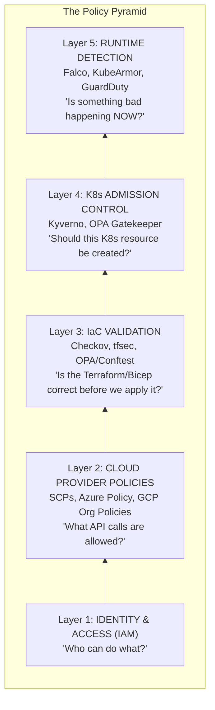
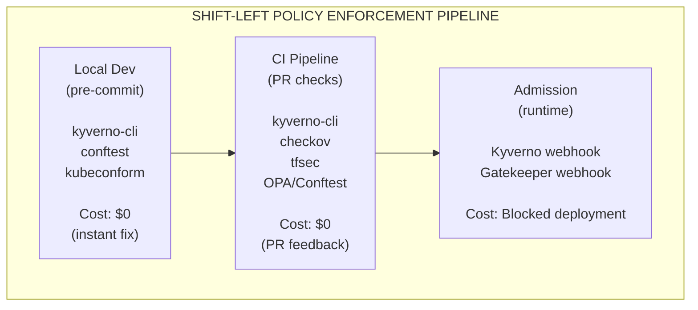
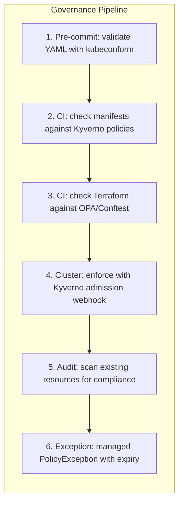

**Complexity**: [COMPLEX] | **Time to Complete**: 2.5h | **Prerequisites**: Enterprise Landing Zones (Module 10.1), Kubernetes RBAC basics, YAML/JSON fundamentals

## What You'll Be Able to Do

After completing this module, you will be able to:

- **Design** policy-as-code using OPA Gatekeeper, Kyverno, and cloud-native policy engines for Kubernetes governance
- **Implement** cloud governance frameworks (AWS Config Rules, Azure Policy, GCP Organization Policies) for Kubernetes infrastructure
- **Evaluate** tag-based governance strategies that enforce cost allocation, ownership, and compliance across clusters
- **Deploy** automated remediation workflows that detect and correct governance violations without human intervention

---

## Why This Module Matters

The 2019 Capital One metadata-service breach (see *Node Metadata Security*) <!-- incident-xref: capital-one-2019 --> shows why cloud governance and Kubernetes controls must be aligned; misaligned guardrails let SSRF-style pivots move from perimeter weakness to broad platform compromise.

This incident highlights a pattern that is alarmingly common across the industry: the cloud governance team and the Kubernetes platform team operating in completely separate, isolated silos. The cloud architecture team might not understand Kubernetes admission control intricacies, while the Kubernetes cluster administrators might lack visibility into overarching organizational SCPs. When these critical governance layers do not align, massive security gaps emerge. An attacker only needs one misconfigured ingress path or one overly permissive service account to compromise the entire system.

Policy as Code solves this systemic problem by treating governance rules exactly the same way you treat application code: version-controlled, continuously tested, peer-reviewed, and automatically enforced. In this comprehensive module, you will learn how cloud provider policy systems work in practice, how Kubernetes policy engines complement them effectively, how to build a unified governance model, and how to rigorously manage exceptions without creating security holes. You will design, implement, and evaluate comprehensive policy frameworks running on modern Kubernetes environments (targeting v1.35+).

---

## The Policy Pyramid

Governance in a cloud-native enterprise is not a single, monolithic layer. It is a highly structured pyramid, with each distinct layer handling different concerns at different points in the resource lifecycle. Relying on just one layer is akin to having a bank vault with a thick, impenetrable door but no surrounding walls.



Each ascending layer catches potential issues that the layer below cannot possibly evaluate. Identity and Access Management (IAM) controls who can call specific cloud APIs, but it cannot intrinsically enforce that every single S3 bucket has KMS encryption enabled. Service Control Policies (SCPs) can enforce encryption globally at the account level, but they lack the context to inspect individual Kubernetes deployment manifests. Kubernetes admission control can reject improperly configured manifests at the API server level, but it cannot stop a running container from suddenly spawning a malicious reverse shell. Runtime detection acts as the final safety net to catch behavioral anomalies in real-time. A robust cloud governance posture requires active enforcement across every single tier of this pyramid.

> **Stop and think**: Why is an implicit deny strategy crucial for top-level organizational policies like SCPs?

---

## Cloud Provider Policy Systems

Before traffic ever reaches your Kubernetes clusters, it must traverse the cloud provider's network and control plane. Cloud provider policies form the outermost perimeter of your governance strategy.

### AWS Service Control Policies (SCPs)

SCPs are the top-level preventive control mechanism in AWS Organizations. They define the absolute maximum permissions available to any principal in a given AWS account. Think of them as an unbreakable ceiling. Even if an IAM policy explicitly grants `s3:*` to an administrator, an SCP that denies `s3:DeleteBucket` will absolutely override the IAM policy and block the deletion.

```json
{
  "Version": "2012-10-17",
  "Statement": [
    {
      "Sid": "DenyUnapprovedRegions",
      "Effect": "Deny",
      "Action": "*",
      "Resource": "*",
      "Condition": {
        "StringNotEquals": {
          "aws:RequestedRegion": [
            "us-east-1",
            "us-west-2",
            "eu-west-1"
          ]
        },
        "ForAllValues:StringNotLike": {
          "aws:PrincipalArn": [
            "arn:aws:iam::*:role/OrganizationAdmin"
          ]
        }
      }
    },
    {
      "Sid": "DenyPublicEKS",
      "Effect": "Deny",
      "Action": [
        "eks:CreateCluster",
        "eks:UpdateClusterConfig"
      ],
      "Resource": "*",
      "Condition": {
        "StringEquals": {
          "eks:endpointPublicAccess": "true"
        }
      }
    },
    {
      "Sid": "RequireIMDSv2",
      "Effect": "Deny",
      "Action": "ec2:RunInstances",
      "Resource": "arn:aws:ec2:*:*:instance/*",
      "Condition": {
        "StringNotEquals": {
          "ec2:MetadataHttpTokens": "required"
        }
      }
    },
    {
      "Sid": "DenyLeaveOrganization",
      "Effect": "Deny",
      "Action": "organizations:LeaveOrganization",
      "Resource": "*"
    }
  ]
}
```

There are several critical gotchas with AWS SCPs that trip up many platform teams. First, [SCPs do not actually grant any permissions; they only restrict them.](https://docs.aws.amazon.com/organizations/latest/userguide/orgs_manage_policies_scps.html) An SCP that explicitly allows `s3:*` does not give anyone S3 access -- it merely removes the restriction, leaving IAM to decide. Second, SCPs do not apply to the central management account of the organization, a common blindspot that requires separate governance. Third, SCPs are evaluated with an implicit deny posture; if an action is not explicitly allowed somewhere in the SCP hierarchy, it is automatically denied.

### Azure Policy

Azure Policy takes a conceptually different approach. Instead of a simple allow/deny mechanism, it supports multiple specialized "effects" that dynamically determine exactly what happens when a resource violates the organizational policy.

```json
{
  "properties": {
    "displayName": "AKS clusters must use Azure CNI with network policy",
    "policyType": "Custom",
    "mode": "Indexed",
    "description": "Ensures all AKS clusters use Azure CNI networking with Calico or Azure network policy enabled.",
    "parameters": {},
    "policyRule": {
      "if": {
        "allOf": [
          {
            "field": "type",
            "equals": "Microsoft.ContainerService/managedClusters"
          },
          {
            "anyOf": [
              {
                "field": "Microsoft.ContainerService/managedClusters/networkProfile.networkPlugin",
                "notEquals": "azure"
              },
              {
                "field": "Microsoft.ContainerService/managedClusters/networkProfile.networkPolicy",
                "exists": "false"
              }
            ]
          }
        ]
      },
      "then": {
        "effect": "Deny"
      }
    }
  }
}
```

[The various Azure Policy effects allow for nuanced governance architectures](https://learn.microsoft.com/en-us/azure/governance/policy/concepts/effect-basics):

| Effect | Behavior | Use Case |
| :--- | :--- | :--- |
| `Deny` | Block resource creation/update | Preventive: enforce hard requirements |
| `Audit` | Allow but log non-compliance | Detective: visibility without blocking |
| `DeployIfNotExists` | Auto-remediate by deploying a resource | Enforce logging, diagnostics, extensions |
| `Modify` | Alter resource properties during creation | Add tags, enable encryption automatically |
| `Disabled` | Policy exists but is not enforced | Testing or temporary exception |
| `DenyAction` | Block specific actions on existing resources | Prevent deletion of critical resources |

The `DeployIfNotExists` effect is exceptionally powerful for managing Kubernetes fleets at scale. You can design a policy that [automatically installs the Azure Policy extension for AKS (which runs OPA Gatekeeper inside the cluster transparently)](https://learn.microsoft.com/en-us/azure/governance/policy/concepts/policy-for-kubernetes) whenever a new AKS cluster is provisioned:

```json
{
  "if": {
    "field": "type",
    "equals": "Microsoft.ContainerService/managedClusters"
  },
  "then": {
    "effect": "DeployIfNotExists",
    "details": {
      "type": "Microsoft.ContainerService/managedClusters/extensions",
      "name": "microsoft-azure-policy",
      "existenceCondition": {
        "field": "Microsoft.ContainerService/managedClusters/extensions/extensionType",
        "equals": "microsoft.policyinsights"
      },
      "deployment": {
        "properties": {
          "mode": "incremental",
          "template": {
            "resources": [
              {
                "type": "Microsoft.ContainerService/managedClusters/extensions",
                "apiVersion": "2023-05-01",
                "name": "[concat(field('name'), '/microsoft-azure-policy')]",
                "properties": {
                  "extensionType": "microsoft.policyinsights",
                  "autoUpgradeMinorVersion": true
                }
              }
            ]
          }
        }
      }
    }
  }
}
```

### GCP Organization Policies

Google Cloud Platform (GCP) Organization Policies use constraints -- predefined or highly customized rules that restrict resource configurations across the entire hierarchical structure of folders and projects.

```yaml
# Deny public GKE clusters
constraint: constraints/container.restrictPublicCluster
listPolicy:
  allValues: DENY
```

```yaml
# Restrict which regions can host GKE clusters
constraint: constraints/gcp.resourceLocations
listPolicy:
  allowedValues:
    - us-central1
    - us-east4
    - europe-west1
```

```yaml
# Require Shielded GKE Nodes
constraint: constraints/container.requireShieldedNodes
booleanPolicy:
  enforced: true
```

GCP also supports deeply custom organization policy constraints utilizing the Common Expression Language (CEL), offering fine-grained logical control over cluster provisioning:

```yaml
# Custom constraint: GKE clusters must have Binary Authorization enabled
apiVersion: orgpolicy.googleapis.com/v2
kind: CustomConstraint
metadata:
  name: custom.gkeRequireBinaryAuthorization
spec:
  resourceTypes:
    - container.googleapis.com/Cluster
  condition: >
    resource.binaryAuthorization.evaluationMode == "PROJECT_SINGLETON_POLICY_ENFORCE"
  actionType: DENY
  displayName: "GKE clusters must enable Binary Authorization"
  description: "All GKE clusters must have Binary Authorization enabled to enforce container image signing."
```

---

## Kubernetes Policy Engines: Kyverno vs OPA Gatekeeper

Cloud provider policies forcefully stop at the cloud API boundary. Once a functional Kubernetes cluster exists, you absolutely must deploy an in-cluster policy engine to govern the workloads and objects being deployed inside the cluster.

> **Pause and predict**: If you mutate a resource during admission control, how does that affect the validation step that follows?

### Kyverno

[Kyverno is a policy engine designed specifically for Kubernetes.](https://github.com/kyverno/kyverno) It uses Kubernetes-native YAML to define comprehensive policies. The philosophy is straightforward: if you can write a standard Kubernetes manifest, you already possess the foundational knowledge to write a Kyverno policy. This represents its primary operational advantage, as the learning curve is minimal for teams already deeply fluent in YAML logic.

```yaml
# Kyverno: Deny containers running as root
apiVersion: kyverno.io/v1
kind: ClusterPolicy
metadata:
  name: deny-run-as-root
  annotations:
    policies.kyverno.io/title: Deny Running as Root
    policies.kyverno.io/severity: high
spec:
  validationFailureAction: Enforce
  background: true
  rules:
    - name: check-run-as-non-root
      match:
        any:
          - resources:
              kinds:
                - Pod
      validate:
        message: >
          Running as root is not allowed. Set
          spec.securityContext.runAsNonRoot to true or
          spec.containers[*].securityContext.runAsNonRoot to true.
        pattern:
          spec:
            =(initContainers):
              - securityContext:
                  runAsNonRoot: true
            containers:
              - securityContext:
                  runAsNonRoot: true
```

```yaml
# Kyverno: Mutate to add default resource limits
apiVersion: kyverno.io/v1
kind: ClusterPolicy
metadata:
  name: add-default-resources
spec:
  rules:
    - name: add-default-limits
      match:
        any:
          - resources:
              kinds:
                - Pod
      mutate:
        patchStrategicMerge:
          spec:
            containers:
              - (name): "*"
                resources:
                  limits:
                    +(memory): "256Mi"
                    +(cpu): "200m"
                  requests:
                    +(memory): "128Mi"
                    +(cpu): "100m"
```

```yaml
# Kyverno: Generate NetworkPolicy for every new namespace
apiVersion: kyverno.io/v1
kind: ClusterPolicy
metadata:
  name: generate-default-networkpolicy
spec:
  rules:
    - name: default-deny-ingress
      match:
        any:
          - resources:
              kinds:
                - Namespace
      exclude:
        any:
          - resources:
              namespaces:
                - kube-system
                - kube-public
      generate:
        apiVersion: networking.k8s.io/v1
        kind: NetworkPolicy
        name: default-deny-ingress
        namespace: "{{request.object.metadata.name}}"
        synchronize: true
        data:
          spec:
            podSelector: {}
            policyTypes:
              - Ingress
```

### OPA Gatekeeper

Gatekeeper utilizes Rego, a highly robust, purpose-built policy language derived from the Open Policy Agent (OPA) project. Rego is considerably more powerful than YAML pattern matching but intrinsically demands a steeper learning curve. [Gatekeeper structurally separates the policy logic, known as the ConstraintTemplate, from the dynamic configuration, known as the Constraint.](https://github.com/open-policy-agent/gatekeeper)

```yaml
# Gatekeeper: ConstraintTemplate (the logic)
apiVersion: templates.gatekeeper.sh/v1
kind: ConstraintTemplate
metadata:
  name: k8sdenypublicloadbalancer
spec:
  crd:
    spec:
      names:
        kind: K8sDenyPublicLoadBalancer
      validation:
        openAPIV3Schema:
          type: object
          properties:
            allowedNamespaces:
              type: array
              items:
                type: string
  targets:
    - target: admission.k8s.gatekeeper.sh
      rego: |
        package k8sdenypublicloadbalancer

        violation[{"msg": msg}] {
          input.review.object.kind == "Service"
          input.review.object.spec.type == "LoadBalancer"
          not input.review.object.metadata.annotations["service.beta.kubernetes.io/aws-load-balancer-internal"]
          namespace := input.review.object.metadata.namespace
          not namespace_allowed(namespace)
          msg := sprintf("Public LoadBalancer services are not allowed in namespace '%v'. Add annotation 'service.beta.kubernetes.io/aws-load-balancer-internal: true' or use an allowed namespace.", [namespace])
        }

        namespace_allowed(namespace) {
          allowed := input.parameters.allowedNamespaces[_]
          namespace == allowed
        }
```

```yaml
# Gatekeeper: Constraint (the configuration)
apiVersion: constraints.gatekeeper.sh/v1beta1
kind: K8sDenyPublicLoadBalancer
metadata:
  name: deny-public-lb-except-ingress
spec:
  match:
    kinds:
      - apiGroups: [""]
        kinds: ["Service"]
  parameters:
    allowedNamespaces:
      - ingress-nginx
      - istio-system
```

The choice between Kyverno and Gatekeeper often comes down to organizational maturity and existing technology stacks.

| Feature | Kyverno | OPA Gatekeeper |
| :--- | :--- | :--- |
| **Policy language** | Kubernetes-native YAML | Rego (purpose-built) |
| **Learning curve** | Low (YAML knowledge sufficient) | High (Rego is a new language) |
| **Validation** | Yes | Yes |
| **Mutation** | Yes | Yes (via Gatekeeper mutator CRDs) |
| **Generation** | Yes (create resources from policies) | No |
| **Image verification** | Yes (cosign, Notary) | Via external data |
| **Background scanning** | Yes (audit existing resources) | Yes (audit existing resources) |
| **Policy exceptions** | PolicyException resource | Config constraint match exclusions |
| **Multi-tenancy** | Namespace-scoped policies | Namespace-scoped constraints |
| **CNCF status** | Graduated | Part of the OPA ecosystem; OPA is a CNCF graduated project |
| **Best for** | Teams wanting simplicity and mutation/generation | Teams needing complex logic or already using OPA |

---

## Mapping Cloud Policies to Kubernetes Policies

The true transformational power of Policy as Code is entirely realized when you create a deeply unified governance model where cloud policies and Kubernetes policies actively reinforce one another. Here is a definitive mapping of common enterprise requirements bridged seamlessly across both systemic layers:

| Requirement | Cloud Policy | Kubernetes Policy |
| :--- | :--- | :--- |
| No public endpoints | SCP: deny public EKS/AKS/GKE | Kyverno: deny Service type LoadBalancer without internal annotation |
| Encryption at rest | SCP: deny unencrypted EBS/disks | Kyverno: require encrypted StorageClass |
| Image provenance | ECR/ACR/Artifact Registry policies | Kyverno: verify image signatures (cosign) |
| Resource tagging | SCP: deny untagged resources | Kyverno: require labels matching cloud tags |
| Network segmentation | SCP: deny public subnets in EKS VPCs | Kyverno: generate NetworkPolicy on namespace creation |
| Least privilege | IAM: minimal role permissions | Kyverno: deny privileged containers, deny hostNetwork |
| Logging | SCP: require CloudTrail/audit logs | Kyverno: require sidecar logging or FluentBit DaemonSet |
| Cost control | AWS Budgets / Azure Cost Alerts | Kyverno: enforce resource limits, deny unrestricted replicas |

### Example: Unified Policy for Image Provenance

This specific example demonstrates exactly how a single overarching governance requirement (e.g., "all container images running in production must be cryptographically signed") forcefully spans both the cloud and Kubernetes layers for defense-in-depth:

```bash
# Layer 1 (Cloud): ECR repository policy requiring signed images
aws ecr put-lifecycle-policy --repository-name my-app \
  --lifecycle-policy-text '{
    "rules": [{
      "rulePriority": 1,
      "description": "Keep only signed images",
      "selection": {
        "tagStatus": "tagged",
        "tagPrefixList": ["v"],
        "countType": "imageCountMoreThan",
        "countNumber": 50
      },
      "action": { "type": "expire" }
    }]
  }'
```

```yaml
# Layer 2 (Kubernetes): Kyverno policy verifying cosign signatures
apiVersion: kyverno.io/v1
kind: ClusterPolicy
metadata:
  name: verify-image-signatures
spec:
  validationFailureAction: Enforce
  webhookTimeoutSeconds: 30
  rules:
    - name: verify-cosign-signature
      match:
        any:
          - resources:
              kinds:
                - Pod
      verifyImages:
        - imageReferences:
            - "123456789012.dkr.ecr.*.amazonaws.com/*"
          attestors:
            - entries:
                - keyless:
                    subject: "https://github.com/my-org/*"
                    issuer: "https://token.actions.githubusercontent.com"
                    rekor:
                      url: "https://rekor.sigstore.dev"
          mutateDigest: true
          verifyDigest: true
```

---

## Exception Management

Every realistic enterprise governance system inherently requires a structured way to handle legitimate, business-critical exceptions. The pivotal question is whether these exceptions are managed through fragile bureaucratic approval processes or through immutable code.

### The Exception Anti-Pattern

```text
BAD: Exception via email
  1. Developer emails security team: "I need public LB for 2 weeks"
  2. Security team discusses in Slack
  3. Someone says "ok" in a thread
  4. Developer manually edits the policy
  5. Exception is never removed
  6. 18 months later, auditor finds 200 "temporary" exceptions
```

### The Policy Exception Pattern

By utilizing native Kubernetes Custom Resource Definitions (CRDs) precisely designed for exceptions, teams can programmatically track overrides, strictly assign accountability, and enforce definitive expiration dates.

```yaml
# Kyverno PolicyException (the right way)
apiVersion: kyverno.io/v2beta1
kind: PolicyException
metadata:
  name: allow-public-lb-for-demo
  namespace: demo-team
  labels:
    exception-owner: security-team
    exception-ticket: SEC-4521
    exception-expires: "2025-04-15"
spec:
  exceptions:
    - policyName: deny-public-loadbalancer
      ruleNames:
        - check-internal-annotation
  match:
    any:
      - resources:
          kinds:
            - Service
          namespaces:
            - demo-team
          names:
            - demo-frontend-svc
  conditions:
    any:
      - key: "{{request.object.metadata.annotations.exception-approved-by}}"
        operator: Equals
        value: "security-team"
```

```bash
# Automated exception lifecycle with expiry checking
cat <<'SCRIPT' > /tmp/check-expired-exceptions.sh
#!/bin/bash
# Run this in CI/CD or as a CronJob
TODAY=$(date +%Y-%m-%d)

kubectl get policyexception -A -o json | jq -r \
  '.items[] |
   select(.metadata.labels."exception-expires" != null) |
   select(.metadata.labels."exception-expires" < "'$TODAY'") |
   "\(.metadata.namespace)/\(.metadata.name) expired on \(.metadata.labels."exception-expires")"'
SCRIPT
```

### Shift-Left: Catching Policy Violations Before Deployment

The absolute most effective governance strategy dynamically catches violations as early as procedurally possible -- ideally before the offending code ever leaves the developer's local workstation. This practice is commonly known as shifting security left.



By tightly integrating policy validation tools into pre-commit hooks and Continuous Integration pipelines, organizations save substantial debugging time and fundamentally prevent deployment failures.

```bash
# Pre-commit hook: validate K8s manifests against Kyverno policies
# .pre-commit-config.yaml entry:
# - repo: local
#   hooks:
#     - id: kyverno-validate
#       name: Kyverno Policy Check
#       entry: bash -c 'kyverno apply policies/ --resource $@' --
#       files: '\.ya?ml$'

# CI pipeline step: validate with kyverno-cli
kyverno apply policies/ \
  --resource deployment.yaml \
  --policy-report \
  --output /tmp/policy-report.json

# Check the report
cat /tmp/policy-report.json | jq '.summary'
# { "pass": 12, "fail": 0, "warn": 2, "error": 0 }

# CI pipeline step: validate Terraform with Checkov
checkov -d ./terraform \
  --framework terraform \
  --check CKV_AWS_39,CKV_AWS_58,CKV_AWS_337 \
  --output json

# CI pipeline step: validate with Conftest (OPA for config files)
conftest test deployment.yaml \
  --policy ./opa-policies/ \
  --output json
```

---

## Did You Know?

1. AWS Organizations currently enforces a 5,120-character maximum size for each SCP document, so large organizations often need to split broad guardrails across multiple policies.
2. OPA is a general-purpose policy engine used for authorization and policy enforcement across Kubernetes, CI/CD, APIs, and other systems, with Rego as its policy language.
3. Kyverno was originally created by Nirmata and became popular with Kubernetes teams because it lets them define many policies using Kubernetes-native resources and familiar tooling.
4. The formalized concept of "Policy as Code" was prominently championed by HashiCorp's Sentinel toolsuite in 2017, but the underlying practice heavily dates back to SELinux mandatory access control policies pioneered in the early 2000s. The major architectural innovation was adopting standard software engineering methodologies directly into governance.

---

## Common Mistakes

| Mistake | Why It Happens | How to Fix It |
| :--- | :--- | :--- |
| **Cloud policies and K8s policies designed in silos** | Different teams own each layer. Cloud team does not understand K8s. Platform team does not understand SCPs. | Create a unified governance council. Map every compliance requirement across both layers. Use the mapping table approach from this module. |
| **Audit-only policies that stay in audit mode indefinitely** | Teams set policies to "audit" mode for testing and then delay flipping to "enforce" because they fear breaking things. | Set a timeline: 30 days audit, then enforce. Use CI/CD policy validation (shift-left) to catch violations before they hit the cluster. |
| **Exception without expiry** | Rushed exception granted to unblock a release. No one tracks the cleanup. | Every exception must have a ticket number, an owner, and an expiry date. Automate expiry checking with a CronJob or CI pipeline. |
| **Over-relying on cloud policies, ignoring K8s** | "Our SCPs are comprehensive, we do not need Kyverno." But SCPs cannot see inside a Kubernetes cluster. | Cloud policies protect cloud resources. K8s policies protect workloads. You need both. A Kubernetes Service of type `LoadBalancer` can expose workloads externally, so cloud-account guardrails alone are not sufficient without Kubernetes-level policy. |
| **Writing Rego when YAML would suffice** | Engineering team defaults to Gatekeeper because "OPA is the standard." But their policies are simple pattern matching. | Evaluate both Kyverno and Gatekeeper honestly. If your policies are mostly "require label X" or "deny privilege Y," Kyverno is simpler. Use Gatekeeper when you need cross-resource logic. |
| **Not testing policies before deployment** | Policy deployed directly to production cluster. A mutation policy with a typo adds invalid annotations to every pod. Cluster-wide outage. | Always test policies in a staging cluster first. Use `kyverno apply` or `gator test` in CI. Run in audit mode before enforce mode. |
| **SCP character limit workarounds using wildcards** | SCP too long, so engineer replaces specific actions with `*` wildcards. This makes the policy either too permissive or too restrictive. | Split complex SCPs into multiple policies. Use condition keys instead of action lists where possible. [AWS allows up to 5 SCPs per OU.](https://docs.aws.amazon.com/en_en/organizations/latest/userguide/orgs_reference_limits.html) |
| **Forgetting the management account** | SCPs do not apply to the management account. Critical governance gaps exist there. | Use the management account only for Organizations management. Move all workloads to member accounts. Apply detective controls (Config rules, GuardDuty) to the management account separately. |

---

## Quiz

<details>
<summary>Question 1: An AWS SCP denies all actions in region ap-southeast-1. A developer assumes an IAM role that has full S3 access (s3:*) and tries to create a bucket in ap-southeast-1. What happens and why?</summary>

The request is **denied**. SCPs define the maximum available permissions for all principals in an account. Even though the IAM policy grants `s3:*`, the SCP creates a ceiling that blocks all actions in ap-southeast-1. The effective permissions are the intersection of the IAM policy and all SCPs in the path from the organization root to the account. SCPs do not grant permissions -- they only restrict them. This is a fundamental difference from IAM policies and is the reason SCPs are so effective as guardrails: no one in the account, regardless of their IAM permissions, can bypass the SCP.
</details>

<details>
<summary>Question 2: Your company uses Azure Policy with a "Deny" effect to prevent AKS clusters without network policy enabled. A team creates an AKS cluster via Terraform and the deployment fails. They request an exception. How should you handle this?</summary>

Create a **policy exemption** in Azure Policy using the `Microsoft.Authorization/policyExemptions` resource. Azure Policy supports two exemption categories: `Waiver` (the resource is non-compliant but exempted) and `Mitigated` (the requirement is met through other means). The exemption should be scoped to the specific resource, have an expiration date, and reference a tracking ticket. This formalizes the exception within the platform itself, preventing drift and undocumented workarounds. Never disable the entire policy, as that impacts all other compliant deployments.
</details>

<details>
<summary>Question 3: A platform engineering team needs to ensure all newly created namespaces automatically receive a default-deny NetworkPolicy, and they want to block any Pod from running as root. They also want to transparently add a standard `company-managed: true` label to all Deployments. How would these three requirements map to Kyverno rule types?</summary>

These requirements map directly to Kyverno's core rule types: generate, validate, and mutate. To automatically create a NetworkPolicy when a namespace appears, you would use a **generate** rule, which creates secondary resources based on triggers. To block Pods from running as root, you would use a **validate** rule, which acts as a traditional admission gate that rejects non-compliant configurations. To transparently add the standard label to Deployments without failing the developer's request, you would use a **mutate** rule, which modifies the resource on the fly during admission.
</details>

<details>
<summary>Question 4: Your CI pipeline uses Checkov to validate Terraform and kyverno-cli to validate Kubernetes manifests. A developer's PR passes both checks, but the deployment is still rejected by the Kyverno webhook in the cluster. How is this possible?</summary>

Several scenarios can cause this. First, the cluster might have **newer policies** that the CI pipeline does not have, because the pipeline validates against a snapshot while the cluster is updated continuously. Second, the Kyverno webhook evaluates the **final rendered resource**, which may differ from the manifest file if Helm templating, Kustomize overlays, or ArgoCD sync modified it. Finally, the policy might use **external data** (like ConfigMap references or API calls) that produce different results in the cluster context than in the isolated CI environment. The fix is to validate the fully-rendered manifests and keep CI policy sets strictly synced with cluster policies via GitOps.
</details>

<details>
<summary>Question 5: An organization has 300 Kubernetes clusters across 3 cloud providers. They want a single policy set that works everywhere. Should they use Kyverno or OPA Gatekeeper? Justify your answer.</summary>

For **pure Kubernetes policy**, either can work since both run as admission webhooks and are cloud-agnostic. However, if the goal is a single policy language across the entire stack (cloud resources + Kubernetes + CI/CD + API authorization), **OPA Gatekeeper** has an advantage because Rego policies can be reused with standalone OPA for Terraform validation (Conftest), API authorization, and custom services. Kyverno is Kubernetes-specific and cannot validate Terraform or authorize API calls. That said, at 300 clusters, operational simplicity matters enormously. Kyverno's YAML-based policies are easier for platform teams to maintain across a large fleet without deep Rego expertise, so many organizations choose Kyverno for K8s and Conftest for IaC.
</details>

<details>
<summary>Question 6: A platform team deploys a Kyverno mutation policy that adds the label `env: dev` to all Pods missing an env label. Meanwhile, the security team deploys a validation policy that requires the `env` label to match the namespace's `environment` annotation. If a developer deploys an unlabelled Pod to a namespace annotated with `environment: prod`, what happens?</summary>

The Pod deployment will be rejected because Kyverno processes **mutations before validations** in a deterministic order. First, the mutation policy will apply the `env: dev` label to the Pod since it was missing. Next, the validation policy will compare the Pod's newly mutated `env: dev` label against the namespace's `environment: prod` annotation. Since the values do not match, the validation fails and blocks the deployment. This highlights a policy design flaw; mutations should read the desired value from context rather than hardcoding defaults to avoid conflicting with validations.
</details>

---

## Hands-On Exercise: Build a Unified Cloud + K8s Governance Pipeline

In this exercise, you will create a multi-layer governance system that comprehensively validates both infrastructure code and Kubernetes manifests, effectively implements shift-left policy checking, and successfully manages exceptions properly.



### Task 1: Set Up the Policy Test Environment

First, create an isolated Kubernetes environment running locally using kind. We will then install Kyverno to serve as our dynamic admission controller.

<details>
<summary>Solution</summary>

```bash
# Create the governance lab cluster
kind create cluster --name governance-lab

# Install Kyverno
helm repo add kyverno https://kyverno.github.io/kyverno/
helm repo update
helm install kyverno kyverno/kyverno -n kyverno --create-namespace --wait

# Verify Kyverno is running
k get pods -n kyverno
```

</details>

### Task 2: Create a Comprehensive Policy Set

Next, apply a multi-faceted set of policies covering strict security boundaries, standard resource constraints, container provenance, metadata labeling, and automated network containment.

<details>
<summary>Solution</summary>

```bash
cat <<'EOF' | k apply -f -
# Policy 1: Deny privileged containers
apiVersion: kyverno.io/v1
kind: ClusterPolicy
metadata:
  name: deny-privileged
spec:
  validationFailureAction: Enforce
  rules:
    - name: deny-privileged-containers
      match:
        any:
          - resources:
              kinds:
                - Pod
      exclude:
        any:
          - resources:
              namespaces:
                - kube-system
                - kyverno
      validate:
        message: "Privileged containers are denied by governance policy GOV-001."
        pattern:
          spec:
            containers:
              - securityContext:
                  privileged: "!true"
---
# Policy 2: Require resource limits
apiVersion: kyverno.io/v1
kind: ClusterPolicy
metadata:
  name: require-resource-limits
spec:
  validationFailureAction: Enforce
  rules:
    - name: check-limits
      match:
        any:
          - resources:
              kinds:
                - Pod
      exclude:
        any:
          - resources:
              namespaces:
                - kube-system
                - kyverno
      validate:
        message: "All containers must have CPU and memory limits (GOV-002)."
        pattern:
          spec:
            containers:
              - resources:
                  limits:
                    memory: "?*"
                    cpu: "?*"
---
# Policy 3: Deny latest tag
apiVersion: kyverno.io/v1
kind: ClusterPolicy
metadata:
  name: deny-latest-tag
spec:
  validationFailureAction: Enforce
  rules:
    - name: check-image-tag
      match:
        any:
          - resources:
              kinds:
                - Pod
      exclude:
        any:
          - resources:
              namespaces:
                - kube-system
                - kyverno
      validate:
        message: "Images must use a specific tag, not ':latest' (GOV-003)."
        pattern:
          spec:
            containers:
              - image: "!*:latest"
---
# Policy 4: Require team and cost-center labels on namespaces
apiVersion: kyverno.io/v1
kind: ClusterPolicy
metadata:
  name: require-namespace-labels
spec:
  validationFailureAction: Enforce
  rules:
    - name: check-labels
      match:
        any:
          - resources:
              kinds:
                - Namespace
      exclude:
        any:
          - resources:
              names:
                - kube-*
                - default
                - kyverno
      validate:
        message: "Namespaces must have 'team' and 'cost-center' labels (GOV-004)."
        pattern:
          metadata:
            labels:
              team: "?*"
              cost-center: "?*"
---
# Policy 5: Generate default NetworkPolicy on namespace creation
apiVersion: kyverno.io/v1
kind: ClusterPolicy
metadata:
  name: generate-network-policy
spec:
  rules:
    - name: default-deny-ingress
      match:
        any:
          - resources:
              kinds:
                - Namespace
      exclude:
        any:
          - resources:
              names:
                - kube-*
                - default
                - kyverno
      generate:
        apiVersion: networking.k8s.io/v1
        kind: NetworkPolicy
        name: default-deny-ingress
        namespace: "{{request.object.metadata.name}}"
        synchronize: true
        data:
          spec:
            podSelector: {}
            policyTypes:
              - Ingress
---
# Policy 6: Mutate to add standard labels
apiVersion: kyverno.io/v1
kind: ClusterPolicy
metadata:
  name: add-governance-labels
spec:
  rules:
    - name: add-managed-by-label
      match:
        any:
          - resources:
              kinds:
                - Deployment
                - StatefulSet
      mutate:
        patchStrategicMerge:
          metadata:
            labels:
              +(governance.company.com/policy-version): "2.1"
              +(governance.company.com/managed-by): "platform-team"
EOF

echo "Policies deployed:"
k get clusterpolicy
```

</details>

### Task 3: Shift-Left with kyverno-cli

To truly enact policy as code, validation must happen dynamically in the CI pipeline before manifests touch the API server. Install the kyverno-cli utility and validate good and bad local deployment manifests to observe the strict failure modes.

<details>
<summary>Solution</summary>

```bash
# Install kyverno CLI
# On macOS:
brew install kyverno
# Or download directly:
# curl -LO https://github.com/kyverno/kyverno/releases/latest/download/kyverno-cli_v1.13.0_linux_amd64.tar.gz

# Create a sample set of manifests to validate
mkdir -p /tmp/governance-lab/manifests /tmp/governance-lab/policies

# Export cluster policies to local files for CLI validation
k get clusterpolicy deny-privileged -o yaml > /tmp/governance-lab/policies/deny-privileged.yaml
k get clusterpolicy require-resource-limits -o yaml > /tmp/governance-lab/policies/require-limits.yaml
k get clusterpolicy deny-latest-tag -o yaml > /tmp/governance-lab/policies/deny-latest.yaml

# Create a GOOD manifest
cat <<'EOF' > /tmp/governance-lab/manifests/good-deployment.yaml
apiVersion: apps/v1
kind: Deployment
metadata:
  name: web-app
  namespace: team-alpha
spec:
  replicas: 3
  selector:
    matchLabels:
      app: web-app
  template:
    metadata:
      labels:
        app: web-app
    spec:
      containers:
        - name: web
          image: nginx:1.27.3
          securityContext:
            privileged: false
            runAsNonRoot: true
            runAsUser: 1000
          resources:
            limits:
              cpu: 200m
              memory: 256Mi
            requests:
              cpu: 100m
              memory: 128Mi
EOF

# Create a BAD manifest (multiple violations)
cat <<'EOF' > /tmp/governance-lab/manifests/bad-deployment.yaml
apiVersion: apps/v1
kind: Deployment
metadata:
  name: yolo-app
  namespace: team-beta
spec:
  replicas: 1
  selector:
    matchLabels:
      app: yolo
  template:
    metadata:
      labels:
        app: yolo
    spec:
      containers:
        - name: danger
          image: nginx:latest
          securityContext:
            privileged: true
EOF

# Validate with kyverno-cli
echo "=== Validating GOOD manifest ==="
kyverno apply /tmp/governance-lab/policies/ \
  --resource /tmp/governance-lab/manifests/good-deployment.yaml 2>&1 || true

echo ""
echo "=== Validating BAD manifest ==="
kyverno apply /tmp/governance-lab/policies/ \
  --resource /tmp/governance-lab/manifests/bad-deployment.yaml 2>&1 || true
```

</details>

### Task 4: Test Policy Enforcement in the Cluster

We will systematically attempt to provision non-compliant Pods to witness Kyverno actively rejecting requests. Following that, we will successfully deploy compliant workloads.

<details>
<summary>Solution</summary>

```bash
# Create a compliant namespace
cat <<'EOF' | k apply -f -
apiVersion: v1
kind: Namespace
metadata:
  name: team-alpha
  labels:
    team: alpha
    cost-center: cc-4521
EOF

# Verify NetworkPolicy was auto-generated
echo "Auto-generated NetworkPolicy:"
k get networkpolicy -n team-alpha

# Test: Deploy a non-compliant pod (should fail)
echo "--- Testing non-compliant pod (expect failure) ---"
cat <<'EOF' | k apply -f - 2>&1 || true
apiVersion: v1
kind: Pod
metadata:
  name: bad-pod
  namespace: team-alpha
spec:
  containers:
    - name: bad
      image: nginx:latest
      securityContext:
        privileged: true
EOF

# Test: Deploy a compliant pod (should succeed)
echo "--- Testing compliant pod (expect success) ---"
cat <<'EOF' | k apply -f -
apiVersion: v1
kind: Pod
metadata:
  name: good-pod
  namespace: team-alpha
spec:
  containers:
    - name: web
      image: nginx:1.27.3
      securityContext:
        privileged: false
      resources:
        limits:
          cpu: 100m
          memory: 128Mi
        requests:
          cpu: 50m
          memory: 64Mi
EOF

k get pods -n team-alpha
```

</details>

### Task 5: Implement a Policy Exception

For scenarios requiring temporary leeway, formalize a tracked exception via a PolicyException Custom Resource, heavily scoped by conditions.

<details>
<summary>Solution</summary>

```bash
# Scenario: team-alpha needs a privileged init container for a volume
# permission fix (a common pattern with persistent volumes)

cat <<'EOF' | k apply -f -
apiVersion: kyverno.io/v2beta1
kind: PolicyException
metadata:
  name: allow-init-privileged-alpha
  namespace: team-alpha
  labels:
    exception-owner: security-team
    exception-ticket: SEC-8823
    exception-expires: "2025-06-01"
spec:
  exceptions:
    - policyName: deny-privileged
      ruleNames:
        - deny-privileged-containers
  match:
    any:
      - resources:
          kinds:
            - Pod
          namespaces:
            - team-alpha
  conditions:
    any:
      - key: "{{request.object.metadata.labels.exception-approved}}"
        operator: Equals
        value: "SEC-8823"
EOF

# Now test: a pod with the exception label should be allowed
echo "--- Testing with exception label ---"
cat <<'EOF' | k apply -f -
apiVersion: v1
kind: Pod
metadata:
  name: volume-fix-pod
  namespace: team-alpha
  labels:
    exception-approved: "SEC-8823"
spec:
  containers:
    - name: app
      image: nginx:1.27.3
      securityContext:
        privileged: true
      resources:
        limits:
          cpu: 100m
          memory: 128Mi
EOF

# List all exceptions
echo "Active exceptions:"
k get policyexception -A
```

</details>

### Task 6: Generate a Governance Compliance Report

Policy engines seamlessly evaluate resources in the background. Construct a dynamic script to gather these results and synthesize an executive-level summary mapping compliance across namespaces.

<details>
<summary>Solution</summary>

```bash
cat <<'SCRIPT' > /tmp/governance-report.sh
#!/bin/bash
echo "============================================="
echo "  GOVERNANCE COMPLIANCE REPORT"
echo "  Generated: $(date -u +%Y-%m-%dT%H:%M:%SZ)"
echo "============================================="

echo ""
echo "--- Cluster Policies ---"
kubectl get clusterpolicy -o custom-columns=\
NAME:.metadata.name,\
ACTION:.spec.validationFailureAction,\
READY:.status.ready,\
RULES:.status.rulecount.validate

echo ""
echo "--- Policy Reports by Namespace ---"
for NS in $(kubectl get namespaces -o jsonpath='{.items[*].metadata.name}' | tr ' ' '\n' | grep -v kube- | grep -v default | grep -v kyverno); do
  PASS=$(kubectl get policyreport -n $NS -o jsonpath='{.items[*].summary.pass}' 2>/dev/null)
  FAIL=$(kubectl get policyreport -n $NS -o jsonpath='{.items[*].summary.fail}' 2>/dev/null)
  WARN=$(kubectl get policyreport -n $NS -o jsonpath='{.items[*].summary.warn}' 2>/dev/null)
  echo "  $NS: pass=${PASS:-0} fail=${FAIL:-0} warn=${WARN:-0}"
done

echo ""
echo "--- Active Exceptions ---"
kubectl get policyexception -A -o custom-columns=\
NAMESPACE:.metadata.namespace,\
NAME:.metadata.name,\
TICKET:.metadata.labels.exception-ticket,\
EXPIRES:.metadata.labels.exception-expires 2>/dev/null || echo "  No exceptions found"

echo ""
echo "--- Non-Compliant Resources (from background scan) ---"
kubectl get clusterpolicyreport -o json 2>/dev/null | \
  jq -r '.items[].results[] | select(.result == "fail") | "  \(.policy): \(.resources[0].namespace)/\(.resources[0].name) - \(.message)"' 2>/dev/null \
  || echo "  No violations found in background scan"

echo ""
echo "============================================="
SCRIPT

chmod +x /tmp/governance-report.sh
bash /tmp/governance-report.sh
```

</details>

### Clean Up

```bash
kind delete cluster --name governance-lab
rm -rf /tmp/governance-lab /tmp/governance-report.sh
```

### Success Criteria

- [ ] I deployed 6 Kyverno policies effectively covering holistic security, cost, and operational concerns
- [ ] I deeply validated manifests locally running using kyverno-cli (shift-left philosophy)
- [ ] I explicitly verified that non-compliant resources are fully blocked at admission
- [ ] I reliably confirmed that compliant resources are successfully admitted
- [ ] I strongly verified that namespace creation transparently auto-generates a NetworkPolicy
- [ ] I intentionally created a managed PolicyException utilizing ticket tracking alongside robust expiry
- [ ] I flawlessly generated an encompassing governance compliance report targeting all cluster namespaces
- [ ] I can articulate and explain the five definitive layers comprising the structured Policy Pyramid

---

## Next Module

Now that you profoundly understand how to mandate rigid governance seamlessly across both cloud accounts and Kubernetes clusters, it is vital to intricately connect these robust policies directly to major compliance frameworks. Head to [Module 10.3: Continuous Compliance & CSPM](../module-10.3-compliance/) to learn how to explicitly map your internal rules to comprehensive SOC2, PCI-DSS, and HIPAA controls, aggressively automate evidence collection, and structurally integrate Trivy and Falco seamlessly with enterprise cloud security hubs.

## Sources

- [AWS Organizations Service Control Policies](https://docs.aws.amazon.com/organizations/latest/userguide/orgs_manage_policies_scps.html) — Authoritative reference for SCP behavior, scope, and evaluation.
- [Understand Azure Policy for Kubernetes Clusters](https://learn.microsoft.com/en-us/azure/governance/policy/concepts/policy-for-kubernetes) — Explains how Azure Policy governs AKS and how it integrates with Gatekeeper-based enforcement.
- [Google Cloud Organization Policy Constraints](https://cloud.google.com/resource-manager/docs/organization-policy/org-policy-constraints) — Covers built-in constraints and the governance model used across folders, projects, and organizations.
- [Kyverno Official Repository](https://github.com/kyverno/kyverno) — Provides the upstream project overview for Kyverno's policy model and core capabilities.
