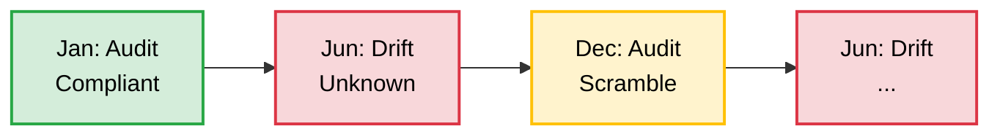
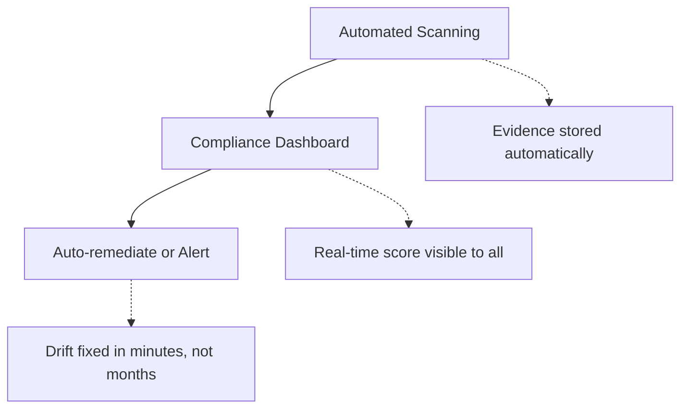
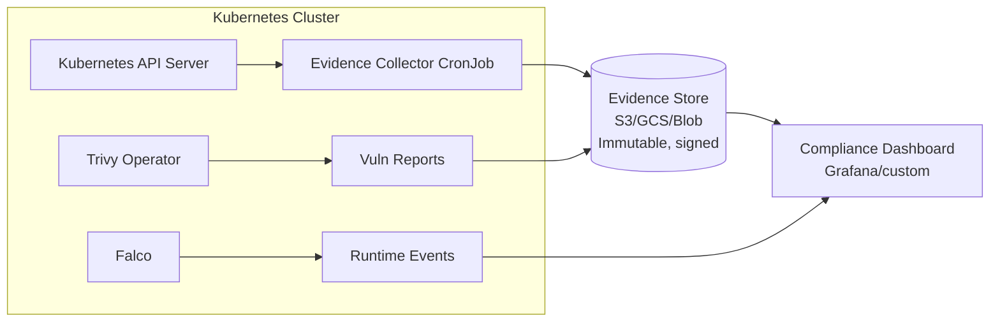
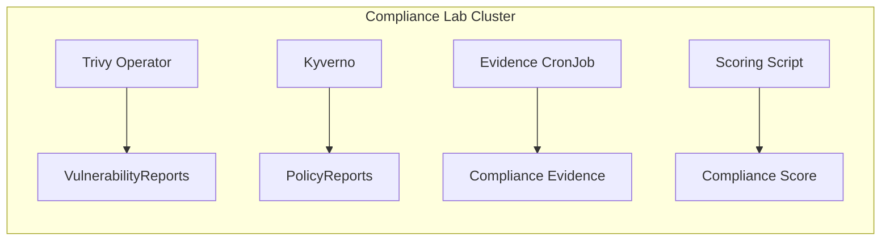

**Complexity**: [COMPLEX] | **Time to Complete**: 2h | **Prerequisites**: Cloud Governance & Policy as Code (Module 10.2), Kubernetes Security Basics

## What You'll Be Able to Do

After completing this module, you will be able to:

- **Configure continuous compliance scanning using CSPM tools (Prisma Cloud, Wiz, cloud-native) for Kubernetes infrastructure**
- **Implement audit logging pipelines that capture and retain Kubernetes API server events for regulatory compliance**
- **Deploy CIS Kubernetes Benchmark scanning and automated remediation for cluster hardening across environments**
- **Design compliance-as-code workflows that generate evidence artifacts for SOC 2, HIPAA, PCI DSS, and ISO 27001 audits**

---

## Why This Module Matters

In January 2024, a healthcare SaaS company passed their SOC 2 Type II audit with flying colors. Three months later, an automated scanner discovered that 14 of their EKS clusters had Kubernetes audit logging disabled, 6 clusters were running containers with known critical CVEs, and their production namespace had no network policies. None of these issues existed during the audit. They had accumulated in the 90 days since the auditor's snapshot. The company's CISO described the situation as "compliance theater" -- they were compliant on audit day and non-compliant every other day.

This pattern is devastatingly common. Traditional compliance works on a point-in-time model: auditors come in, check a list, issue a certificate, and leave for 12 months. But infrastructure changes continuously. A single misconfigured Terraform apply, a Helm chart upgrade that removes a security context, or a new team deploying without proper guardrails can invalidate the entire compliance posture within hours of the audit ending.

Continuous compliance flips this model. Instead of proving compliance once per year, you prove it every minute of every day through automated evidence collection, real-time monitoring of compliance drift, and immediate remediation of violations. In this module, you will learn how CSPM tools work, how to map Kubernetes configurations to SOC 2, PCI-DSS, and HIPAA controls, how to automate evidence collection for auditors, and how to integrate vulnerability management tools like Trivy and Falco with cloud security hubs.

---

## From Point-in-Time to Continuous Compliance

### The Traditional Compliance Model (Broken)



**Reality Check:** 
- **"Compliance Sprint"**: 6 weeks of panic before an audit.
- **Actual Status**: Compliant ~2 months/year, non-compliant ~10 months.

### The Continuous Compliance Model (What You Want)



**Audit Day Reality:** "Here is the dashboard. Every control has 12 months of continuous, immutable evidence."

---

## CSPM: Cloud Security Posture Management

CSPM tools continuously scan your cloud environment for misconfigurations, policy violations, and security risks. They are the "detective controls" from the Policy Pyramid in Module 10.2, operating at the cloud infrastructure layer.

### Cloud-Native CSPM Tools

| Tool | Provider | Kubernetes Support | Key Differentiator |
| :--- | :--- | :--- | :--- |
| AWS Security Hub | AWS | EKS findings via GuardDuty, Inspector | Aggregates findings from 50+ AWS services |
| Microsoft Defender for Cloud | Azure | AKS + Arc-enabled K8s | CWPP + CSPM in one, cross-cloud |
| Google Security Command Center | GCP | GKE Security Posture Dashboard | Built-in GKE workload vulnerability scanning |
| Prisma Cloud (Palo Alto) | Multi-cloud | Full K8s lifecycle | Most comprehensive, also most expensive |
| Wiz | Multi-cloud | Agentless K8s scanning | Graph-based risk analysis, no agents needed |
| Aqua Security | Multi-cloud | Deep K8s + runtime | Strongest open-source ecosystem (Trivy, Tracee) |

### AWS Security Hub + EKS Integration

```bash
# Enable Security Hub
aws securityhub enable-security-hub \
  --enable-default-standards

# Enable EKS-related findings
# GuardDuty for EKS runtime threat detection
aws guardduty create-detector \
  --enable \
  --features '[
    {"Name": "EKS_AUDIT_LOGS", "Status": "ENABLED"},
    {"Name": "EKS_RUNTIME_MONITORING", "Status": "ENABLED",
     "AdditionalConfiguration": [
       {"Name": "EKS_ADDON_MANAGEMENT", "Status": "ENABLED"}
     ]}
  ]'

# AWS Inspector for container vulnerability scanning
aws inspector2 enable --resource-types ECR
# Inspector automatically scans ECR images and reports CVEs to Security Hub

# View EKS-related findings in Security Hub
aws securityhub get-findings \
  --filters '{
    "ProductName": [{"Value": "GuardDuty", "Comparison": "EQUALS"}],
    "ResourceType": [{"Value": "AwsEksCluster", "Comparison": "EQUALS"}],
    "SeverityLabel": [{"Value": "CRITICAL", "Comparison": "EQUALS"}]
  }' \
  --query 'Findings[*].{Title:Title, Severity:Severity.Label, Resource:Resources[0].Id}' \
  --output table
```

### Microsoft Defender for Cloud + AKS

```bash
# Enable Defender for Containers (covers AKS)
az security pricing create \
  --name Containers \
  --tier Standard

# Enable Defender for AKS on a specific cluster
az aks update \
  --resource-group rg-production \
  --name aks-prod \
  --enable-defender

# View security recommendations for AKS
az security assessment list \
  --query "[?contains(resourceDetails.id, 'managedClusters')].{
    Name:displayName,
    Status:status.code,
    Severity:metadata.severity
  }" --output table

# Export Defender findings to Log Analytics for compliance dashboards
az monitor diagnostic-settings create \
  --name defender-to-la \
  --resource "/subscriptions/$SUB_ID/resourceGroups/rg-production/providers/Microsoft.ContainerService/managedClusters/aks-prod" \
  --workspace "/subscriptions/$SUB_ID/resourceGroups/rg-monitoring/providers/Microsoft.OperationalInsights/workspaces/la-security" \
  --logs '[{"category": "kube-audit-admin", "enabled": true, "retentionPolicy": {"enabled": true, "days": 365}}]'
```

---

## Mapping Kubernetes to Compliance Frameworks

The most challenging part of Kubernetes compliance is translating abstract framework requirements into concrete technical controls. Here is how common controls map to Kubernetes configurations:

> **Stop and think**: If an auditor asks for proof that your cluster is secure, what technical artifacts could you realistically provide to them within an hour?

### SOC 2 Trust Services Criteria

| SOC 2 Control | Category | Kubernetes Implementation | Evidence Source |
| :--- | :--- | :--- | :--- |
| CC6.1 - Logical access controls | Security | RBAC roles scoped to namespaces, Azure AD/OIDC integration, no cluster-admin for developers | `kubectl get clusterrolebindings`, RBAC audit logs |
| CC6.3 - Encryption of data at rest | Security | etcd encryption, encrypted PersistentVolumes (EBS/Azure Disk with KMS) | Cluster encryption config, StorageClass parameters |
| CC6.6 - Encryption in transit | Security | mTLS via service mesh, TLS on Ingress, Kubernetes API TLS | Istio PeerAuthentication, Ingress TLS config |
| CC7.1 - Detection of unauthorized changes | Security | Kubernetes audit logs, Falco runtime detection | Audit log exports, Falco alerts in SIEM |
| CC7.2 - Monitoring for anomalies | Security | Prometheus alerts, GuardDuty EKS findings, anomaly detection | Alert rules, Security Hub findings |
| CC8.1 - Change management | Availability | GitOps (ArgoCD), admission webhooks preventing direct `kubectl apply` | Git commit history, ArgoCD sync logs |
| A1.2 - Recovery mechanisms | Availability | Pod disruption budgets, multi-AZ deployments, Velero backups | PDB configs, node topology, backup logs |

### PCI-DSS v4.0 (for Payment Processing)

| PCI-DSS Requirement | Kubernetes Control | How to Evidence |
| :--- | :--- | :--- |
| 1.3.1 - Inbound traffic restricted | NetworkPolicy default-deny + explicit allow rules | `kubectl get networkpolicy -A -o yaml` |
| 2.2.1 - Only necessary services | Minimal base images, no unnecessary sidecar containers | Image scan showing package count, Dockerfile |
| 6.3.3 - Vulnerability management | Trivy scanning in CI/CD, admission control blocking critical CVEs | Trivy scan reports, Kyverno image verification |
| 7.2.1 - Access based on need-to-know | Namespace-scoped RBAC, no wildcard permissions | RBAC audit showing role bindings |
| 8.3.1 - MFA for administrative access | OIDC with MFA for kubectl, no static ServiceAccount tokens | IdP configuration, audit logs showing auth method |
| 10.2.1 - Audit logs for access | Kubernetes audit policy at RequestResponse level | Audit log samples, log retention proof |
| 11.5.1 - File integrity monitoring | Read-only root filesystems, Falco file access alerts | SecurityContext configs, Falco rule output |

### HIPAA (for Healthcare Data)

| HIPAA Safeguard | Kubernetes Control | Evidence |
| :--- | :--- | :--- |
| Access Control (164.312(a)) | RBAC + OIDC, namespace isolation for PHI workloads | Role definitions, namespace labels |
| Audit Controls (164.312(b)) | Kubernetes audit logs retained 6+ years | Log retention policy, sample exports |
| Integrity (164.312(c)) | Image signing (cosign), read-only filesystems | Kyverno image verification policy, SecurityContext |
| Transmission Security (164.312(e)) | mTLS everywhere, encrypted Ingress | Service mesh config, TLS certificates |
| Encryption (164.312(a)(2)(iv)) | etcd encryption, PV encryption, in-transit encryption | Encryption configuration dumps |

---

## Automated Evidence Collection

The key to continuous compliance is automating evidence collection so that auditors never wait for manual data gathering. Every control should have a corresponding evidence pipeline.

### Building an Evidence Collection Pipeline



### Evidence Collection CronJob

```yaml
# compliance-evidence-collector.yaml
apiVersion: batch/v1
kind: CronJob
metadata:
  name: compliance-evidence-collector
  namespace: compliance-system
spec:
  schedule: "0 */6 * * *"  # Every 6 hours
  jobTemplate:
    spec:
      template:
        spec:
          serviceAccountName: evidence-collector
          containers:
            - name: collector
              image: bitnami/kubectl:1.35
              command:
                - /bin/bash
                - -c
                - |
                  TIMESTAMP=$(date -u +%Y%m%dT%H%M%SZ)
                  EVIDENCE_DIR="/evidence/${TIMESTAMP}"
                  mkdir -p ${EVIDENCE_DIR}

                  echo "=== Collecting compliance evidence: ${TIMESTAMP} ==="

                  # CC6.1: RBAC Configuration
                  echo "Collecting RBAC evidence..."
                  kubectl get clusterrolebindings -o json > ${EVIDENCE_DIR}/clusterrolebindings.json
                  kubectl get rolebindings -A -o json > ${EVIDENCE_DIR}/rolebindings.json
                  kubectl get clusterroles -o json > ${EVIDENCE_DIR}/clusterroles.json

                  # CC6.3: Encryption configuration
                  echo "Collecting encryption evidence..."
                  kubectl get storageclass -o json > ${EVIDENCE_DIR}/storageclasses.json

                  # CC7.1: Network policies
                  echo "Collecting network policy evidence..."
                  kubectl get networkpolicy -A -o json > ${EVIDENCE_DIR}/networkpolicies.json

                  # CC8.1: Policy enforcement
                  echo "Collecting policy evidence..."
                  kubectl get clusterpolicy -o json > ${EVIDENCE_DIR}/kyverno-policies.json
                  kubectl get policyreport -A -o json > ${EVIDENCE_DIR}/policy-reports.json
                  kubectl get clusterpolicyreport -o json > ${EVIDENCE_DIR}/cluster-policy-reports.json

                  # PCI 6.3.3: Vulnerability status
                  echo "Collecting vulnerability evidence..."
                  kubectl get vulnerabilityreports -A -o json > ${EVIDENCE_DIR}/vulnerability-reports.json 2>/dev/null || echo '{}' > ${EVIDENCE_DIR}/vulnerability-reports.json

                  # A1.2: Availability controls
                  echo "Collecting availability evidence..."
                  kubectl get pdb -A -o json > ${EVIDENCE_DIR}/pdbs.json
                  kubectl get nodes -o json > ${EVIDENCE_DIR}/nodes.json

                  # Generate summary
                  cat <<SUMMARY > ${EVIDENCE_DIR}/summary.json
                  {
                    "timestamp": "${TIMESTAMP}",
                    "cluster": "$(kubectl config current-context)",
                    "controls": {
                      "rbac_bindings": $(kubectl get clusterrolebindings --no-headers | wc -l | tr -d ' '),
                      "network_policies": $(kubectl get networkpolicy -A --no-headers | wc -l | tr -d ' '),
                      "kyverno_policies": $(kubectl get clusterpolicy --no-headers | wc -l | tr -d ' '),
                      "pdbs": $(kubectl get pdb -A --no-headers | wc -l | tr -d ' '),
                      "nodes": $(kubectl get nodes --no-headers | wc -l | tr -d ' ')
                    }
                  }
                  SUMMARY

                  echo "Evidence collected to ${EVIDENCE_DIR}"
                  ls -la ${EVIDENCE_DIR}
              volumeMounts:
                - name: evidence-volume
                  mountPath: /evidence
          volumes:
            - name: evidence-volume
              persistentVolumeClaim:
                claimName: compliance-evidence-pvc
          restartPolicy: OnFailure
```

### Compliance Score Dashboard

```bash
# compliance-score.sh - Calculate a compliance score from collected evidence
#!/bin/bash

calculate_score() {
  local CHECKS_PASSED=0
  local CHECKS_TOTAL=0

  # Check 1: All namespaces have NetworkPolicies
  NAMESPACES_WITHOUT_NETPOL=$(kubectl get namespaces -o jsonpath='{.items[*].metadata.name}' | tr ' ' '\n' | while read ns; do
    if [ "$ns" != "kube-system" ] && [ "$ns" != "kube-public" ] && [ "$ns" != "kube-node-lease" ] && [ "$ns" != "default" ]; then
      COUNT=$(kubectl get networkpolicy -n "$ns" --no-headers 2>/dev/null | wc -l)
      if [ "$COUNT" -eq 0 ]; then echo "$ns"; fi
    fi
  done | wc -l)
  CHECKS_TOTAL=$((CHECKS_TOTAL + 1))
  if [ "$NAMESPACES_WITHOUT_NETPOL" -eq 0 ]; then
    CHECKS_PASSED=$((CHECKS_PASSED + 1))
    echo "  [PASS] All namespaces have NetworkPolicies"
  else
    echo "  [FAIL] $NAMESPACES_WITHOUT_NETPOL namespaces missing NetworkPolicies"
  fi

  # Check 2: No cluster-admin bindings for non-system users
  DANGEROUS_BINDINGS=$(kubectl get clusterrolebindings -o json | \
    jq '[.items[] | select(.roleRef.name == "cluster-admin") |
    select(.subjects[]? | .name != "system:masters" and (.name | startswith("system:") | not))] | length')
  CHECKS_TOTAL=$((CHECKS_TOTAL + 1))
  if [ "$DANGEROUS_BINDINGS" -eq 0 ]; then
    CHECKS_PASSED=$((CHECKS_PASSED + 1))
    echo "  [PASS] No non-system cluster-admin bindings"
  else
    echo "  [FAIL] $DANGEROUS_BINDINGS non-system cluster-admin bindings found"
  fi

  # Check 3: Kyverno policies are in Enforce mode
  AUDIT_ONLY=$(kubectl get clusterpolicy -o json | \
    jq '[.items[] | select(.spec.validationFailureAction == "Audit")] | length')
  CHECKS_TOTAL=$((CHECKS_TOTAL + 1))
  if [ "$AUDIT_ONLY" -eq 0 ]; then
    CHECKS_PASSED=$((CHECKS_PASSED + 1))
    echo "  [PASS] All policies in Enforce mode"
  else
    echo "  [WARN] $AUDIT_ONLY policies still in Audit mode"
  fi

  # Check 4: No critical vulnerabilities in running workloads
  CRITICAL_VULNS=$(kubectl get vulnerabilityreports -A -o json 2>/dev/null | \
    jq '[.items[].report.summary.criticalCount // 0] | add // 0')
  CHECKS_TOTAL=$((CHECKS_TOTAL + 1))
  if [ "$CRITICAL_VULNS" -eq 0 ]; then
    CHECKS_PASSED=$((CHECKS_PASSED + 1))
    echo "  [PASS] No critical vulnerabilities in running workloads"
  else
    echo "  [FAIL] $CRITICAL_VULNS critical vulnerabilities found"
  fi

  # Check 5: PodDisruptionBudgets exist for production workloads
  DEPLOYMENTS=$(kubectl get deployments -A --no-headers | wc -l | tr -d ' ')
  PDBS=$(kubectl get pdb -A --no-headers 2>/dev/null | wc -l | tr -d ' ')
  CHECKS_TOTAL=$((CHECKS_TOTAL + 1))
  if [ "$PDBS" -gt 0 ]; then
    CHECKS_PASSED=$((CHECKS_PASSED + 1))
    echo "  [PASS] PodDisruptionBudgets present ($PDBS PDBs for $DEPLOYMENTS deployments)"
  else
    echo "  [FAIL] No PodDisruptionBudgets found"
  fi

  # Calculate score
  SCORE=$(( (CHECKS_PASSED * 100) / CHECKS_TOTAL ))
  echo ""
  echo "  COMPLIANCE SCORE: ${SCORE}% (${CHECKS_PASSED}/${CHECKS_TOTAL} checks passed)"
}

echo "============================================="
echo "  CONTINUOUS COMPLIANCE SCORE"
echo "  $(date -u +%Y-%m-%dT%H:%M:%SZ)"
echo "============================================="
calculate_score
```

---

## Vulnerability Lifecycle Management

Vulnerabilities in container images are a continuous compliance concern. The lifecycle from discovery to remediation must be automated.

> **Pause and predict**: If you only scan container images in your CI/CD pipeline, what happens when a new vulnerability is discovered for an image that is already running in production?

### Trivy Operator for In-Cluster Scanning

```bash
# Install Trivy Operator
helm repo add aqua https://aquasecurity.github.io/helm-charts/
helm install trivy-operator aqua/trivy-operator \
  --namespace trivy-system --create-namespace \
  --set trivy.ignoreUnfixed=true \
  --set operator.scanJobsConcurrentLimit=3 \
  --set operator.vulnerabilityScannerEnabled=true \
  --set operator.configAuditScannerEnabled=true \
  --set operator.rbacAssessmentEnabled=true

# View vulnerability reports
kubectl get vulnerabilityreports -A \
  -o custom-columns=\
NAMESPACE:.metadata.namespace,\
NAME:.metadata.name,\
CRITICAL:.report.summary.criticalCount,\
HIGH:.report.summary.highCount,\
MEDIUM:.report.summary.mediumCount

# Get detailed CVEs for a specific workload
kubectl get vulnerabilityreport -n production \
  -l trivy-operator.resource.name=my-app \
  -o jsonpath='{range .items[*].report.vulnerabilities[?(@.severity=="CRITICAL")]}{.vulnerabilityID} {.title} {.fixedVersion}{"\n"}{end}'
```

> **Stop and think**: Why export Trivy findings to a central security hub rather than just viewing them with `kubectl` natively inside the cluster?

### Integrating Trivy with Cloud Security Hubs

```yaml
# trivy-to-securityhub.yaml
# CronJob that exports Trivy findings to AWS Security Hub
apiVersion: batch/v1
kind: CronJob
metadata:
  name: trivy-to-securityhub
  namespace: trivy-system
spec:
  schedule: "0 */4 * * *"
  jobTemplate:
    spec:
      template:
        spec:
          serviceAccountName: trivy-exporter
          containers:
            - name: exporter
              image: amazon/aws-cli:2.22
              env:
                - name: AWS_REGION
                  value: "us-east-1"
                - name: CLUSTER_NAME
                  valueFrom:
                    configMapKeyRef:
                      name: cluster-info
                      key: cluster-name
              command:
                - /bin/bash
                - -c
                - |
                  ACCOUNT_ID=$(aws sts get-caller-identity --query Account --output text)
                  FINDINGS='[]'

                  # Convert Trivy critical/high findings to ASFF format
                  kubectl get vulnerabilityreports -A -o json | \
                  jq -r --arg acct "$ACCOUNT_ID" --arg region "$AWS_REGION" --arg cluster "$CLUSTER_NAME" \
                  '[.items[] |
                    .report.vulnerabilities[] |
                    select(.severity == "CRITICAL" or .severity == "HIGH") |
                    {
                      "SchemaVersion": "2018-10-08",
                      "Id": .vulnerabilityID,
                      "ProductArn": "arn:aws:securityhub:\($region):\($acct):product/\($acct)/default",
                      "GeneratorId": "trivy-operator",
                      "AwsAccountId": $acct,
                      "Types": ["Software and Configuration Checks/Vulnerabilities/CVE"],
                      "CreatedAt": (now | strftime("%Y-%m-%dT%H:%M:%SZ")),
                      "UpdatedAt": (now | strftime("%Y-%m-%dT%H:%M:%SZ")),
                      "Severity": {"Label": .severity},
                      "Title": .title,
                      "Description": (.description // "No description"),
                      "Resources": [{
                        "Type": "Container",
                        "Id": "arn:aws:eks:\($region):\($acct):cluster/\($cluster)",
                        "Details": {"Other": {"image": .resource, "fixedVersion": (.fixedVersion // "none")}}
                      }]
                    }
                  ]' > /tmp/findings.json

                  # Import to Security Hub (batch of 100)
                  TOTAL=$(jq length /tmp/findings.json)
                  echo "Exporting $TOTAL findings to Security Hub"
                  jq -c '.[:100]' /tmp/findings.json | \
                    aws securityhub batch-import-findings --findings file:///dev/stdin
          restartPolicy: OnFailure
```

### Falco for Runtime Compliance

Falco detects runtime violations that no static scanner can catch -- like a container exec'ing a shell, reading sensitive files, or making unexpected network connections.

```yaml
# falco-rules-compliance.yaml
# Custom Falco rules mapped to compliance controls
- rule: PCI-DSS 10.2 - Sensitive File Access
  desc: Detect read of sensitive files (credential files, private keys)
  condition: >
    open_read and
    (fd.name startswith /etc/shadow or
     fd.name startswith /etc/pam.d or
     fd.name contains id_rsa or
     fd.name contains .kube/config) and
    container and
    not proc.name in (sshd, su, sudo)
  output: >
    Sensitive file read in container
    (user=%user.name file=%fd.name container=%container.name
     image=%container.image.repository pod=%k8s.pod.name
     namespace=%k8s.ns.name)
  priority: WARNING
  tags: [pci-dss, soc2, filesystem]

- rule: HIPAA 164.312(e) - Unencrypted Outbound Connection
  desc: Detect outbound connections on non-TLS ports from PHI namespaces
  condition: >
    evt.type = connect and
    fd.typechar = 4 and
    fd.ip != "0.0.0.0" and
    fd.sport in (80, 8080, 3306, 5432, 27017) and
    k8s.ns.name startswith "phi-" and
    not fd.sip in (rfc_1918_addresses)
  output: >
    Unencrypted outbound connection from PHI namespace
    (command=%proc.cmdline connection=%fd.name
     pod=%k8s.pod.name namespace=%k8s.ns.name)
  priority: CRITICAL
  tags: [hipaa, network]

- rule: SOC2 CC7.1 - Container Shell Access
  desc: Detect interactive shell access to containers
  condition: >
    spawned_process and
    container and
    proc.name in (bash, sh, zsh, dash) and
    proc.tty != 0 and
    not container.image.repository in (allowed_debug_images)
  output: >
    Shell spawned in container
    (user=%user.name shell=%proc.name container=%container.name
     image=%container.image.repository pod=%k8s.pod.name)
  priority: WARNING
  tags: [soc2, runtime]
```

---

## Building a Compliance Dashboard

A compliance dashboard brings together findings from all layers into a single view that auditors, security teams, and engineering leadership can use.

```mermaid
flowchart TD
    subgraph COMPLIANCE DASHBOARD
        Score[Overall Score: 94% | SOC2: 96% | PCI: 91% | HIPAA: 95%]
        
        Score --> Cloud[Cloud Layer: 12/12 pass, 0 crit]
        Score --> K8s[K8s Layer: 18/19 pass, 1 warn]
        Score --> Runtime[Runtime Layer: 3 alerts, 0 crit]
        
        Cloud --> Stats[Vulnerabilities: 0 Crit, 12 High, 89 Med<br/>Policy Violations: 3 blocked, 0 bypassed<br/>Exceptions Active: 2]
        K8s --> Stats
        Runtime --> Stats
    end
```

---

## Did You Know?

1. SOC 2 audits cost between $30,000 and $200,000 per engagement, depending on scope and auditor. Companies that implement continuous compliance tooling report spending 60-70% less on audit preparation because evidence is pre-collected and always current. The average "compliance sprint" before a traditional audit consumes 400-600 engineering hours. Continuous compliance reduces this to under 40 hours of auditor interaction time.

2. PCI-DSS v4.0, released in March 2022, introduced "customized approach" as an alternative to the traditional "defined approach." This means organizations can now propose their own controls as long as they meet the intent of the requirement. For Kubernetes environments, this is significant: you can argue that a service mesh providing mTLS meets PCI requirement 4.2.1 (strong cryptography for transmitting cardholder data) even though the original requirement was written for TLS on web servers.

3. Trivy, the open-source vulnerability scanner, scans over 1 billion container images per month across its user base. It detects vulnerabilities in OS packages, language-specific dependencies (npm, pip, Go modules), IaC misconfigurations, and Kubernetes manifests. A single Trivy scan of an average container image takes 8-15 seconds and checks against a database of over 150,000 known CVEs.

4. The average time from CVE publication to exploit availability decreased from 45 days in 2020 to 15 days in 2024, according to Mandiant's threat intelligence reports. This means organizations running quarterly vulnerability scans are almost certainly running exploitable containers. Continuous scanning with tools like Trivy Operator catches new CVEs within hours of database updates, reducing the exposure window from months to hours.

---

## Common Mistakes

| Mistake | Why It Happens | How to Fix It |
| :--- | :--- | :--- |
| **Treating compliance as a yearly event** | Traditional audit cycle mentality. "We passed the audit, we are good for 12 months." | Implement continuous scanning. Compliance score visible daily. Alert on drift within hours, not months. |
| **Manual evidence collection** | Small team, "we will automate later." Evidence is gathered by hand before each audit. | Deploy the evidence collection CronJob from this module. Automate from day one. Manual collection does not scale past 3 clusters. |
| **Scanning images only in CI/CD, not runtime** | "We scan before deploy, so production is clean." But new CVEs are published daily against already-deployed images. | Install Trivy Operator for continuous in-cluster scanning. It re-scans running workloads when the CVE database updates. |
| **Compliance controls without mapping** | Policies exist but no one can explain which compliance control they satisfy. Auditor asks "show me your access control evidence" and the team scrambles. | Create and maintain a control mapping table (like the ones in this module). Every policy should reference the compliance control it implements. |
| **Ignoring Kubernetes audit logs** | Audit logging costs money (storage) and adds latency. Teams disable it for cost savings. | Kubernetes audit logs are required by SOC 2, PCI-DSS, and HIPAA. The cost of storage is trivial compared to the cost of a compliance failure. Enable at minimum the Metadata level. |
| **No vulnerability remediation SLA** | Vulnerabilities are found but nobody owns the fix. Critical CVEs sit for weeks. | Define SLAs: Critical = 24 hours, High = 7 days, Medium = 30 days. Automate escalation. Block deployments with critical CVEs via admission control. |
| **Compliance dashboard only visible to security team** | Developers do not know their compliance status until something breaks. | Make the compliance dashboard visible to all engineering teams. Compliance is everyone's responsibility, not just security's. |
| **Over-classifying data** | Everything is labeled "PCI" or "HIPAA" out of caution. Every cluster gets the strictest controls, slowing everyone down. | Classify data properly. Only workloads handling cardholder data need PCI controls. Only workloads with PHI need HIPAA controls. Use namespace labels to scope compliance policies. |

---

## Quiz

<details>
<summary>Question 1: Your SOC 2 auditor asks for evidence of access control (CC6.1) for your Kubernetes clusters. What specific evidence would you provide?</summary>

You must provide a combination of configuration artifacts and access logs to prove both the intended state and the actual behavior. Configuration artifacts, such as exported JSONs of `ClusterRoleBindings` and OIDC identity provider mappings, prove that the system is configured to restrict access appropriately. However, configuration alone does not prove that unauthorized access did not occur. Therefore, you must also provide Kubernetes audit logs showing successful and failed authentication events to prove that the controls are actively working. Providing both ensures the auditor sees that policies are not just defined, but also actively enforced.
</details>

<details>
<summary>Question 2: A new critical CVE is published affecting the base image used by 80% of your containers. Your current vulnerability scan runs weekly. Is this sufficient for PCI-DSS compliance?</summary>

No, a weekly scanning cadence is not sufficient. PCI-DSS v4.0 requirement 6.3.3 requires that vulnerabilities are identified and addressed in a timely manner. A weekly scan means your environment could be exposed to a known critical vulnerability for up to seven days before you even realize it exists. With exploit availability averaging 15 days from CVE publication, a weekly scan cycle leaves an extremely tight window for remediation. Best practice requires continuous scanning with tools like Trivy Operator, which re-evaluates running workloads immediately whenever the CVE database updates.
</details>

<details>
<summary>Question 3: During a compliance review, your security team discovers that a container deployed yesterday is actively making outbound connections to an unknown IP address on port 4444. The deployment pipeline had successfully run a Trivy scan before deploying, showing zero vulnerabilities. Your compliance manager asks how this could happen and what tool could have detected it. How do you explain the situation and the necessary architectural changes?</summary>

Trivy operates as a static scanner, meaning it only examines container images and manifests for known vulnerabilities or misconfigurations prior to deployment. It cannot detect zero-day exploits, compromised credentials, or malicious behavior that is initiated after the container is already running. In this scenario, the container might have been compromised at runtime via an unpatched application flaw, leading to the unexpected network traffic. To detect this behavior, you need a runtime security tool like Falco deployed in your cluster. Falco monitors system calls in real-time and would have immediately triggered an alert upon detecting the unauthorized outbound network connection, providing the necessary detective controls that static scanning lacks.
</details>

<details>
<summary>Question 4: Your e-commerce company recently acquired a telehealth startup, and engineering leadership wants to consolidate workloads into a single Kubernetes cluster to save costs. This means the cluster will process both PCI cardholder data and HIPAA PHI. The compliance team is worried about cross-contamination. How should you structure the cluster to satisfy the requirements of both frameworks without building separate clusters?</summary>

You must use namespace-based isolation with distinct compliance scopes to prevent cross-contamination and satisfy both frameworks. By creating separate namespaces for payment and healthcare workloads, you can apply strict `NetworkPolicies` that block all traffic between the distinct applications. Furthermore, you can use Kyverno or Gatekeeper to enforce framework-specific policies dynamically based on namespace labels. You must also implement separate ServiceAccounts and strict RBAC rules so that developers working on the PCI app cannot access the HIPAA namespace. Ultimately, enabling separate audit log streams for each namespace will ensure that evidence collection remains isolated and clearly scoped for different auditors.
</details>

<details>
<summary>Question 5: During an ISO 27001 audit, the auditor notices that developers have permissions to push images directly to the production container registry. They issue a finding stating that a malicious developer could bypass CI/CD security checks and deploy a compromised image directly. How can you implement a Kubernetes-native mechanism to mathematically guarantee that only images built and verified by the official CI/CD pipeline can run in production?</summary>

You should implement container image signing using tools like cosign paired with an admission controller like Kyverno or Gatekeeper. In this architecture, your trusted CI/CD pipeline cryptographically signs the image after it passes all security scans, storing the signature in the registry. When Kubernetes attempts to schedule a pod, the admission controller verifies the signature against the CI/CD pipeline's public key before allowing the deployment to proceed. If a developer manually pushes an image to the registry, it will lack the CI/CD pipeline's cryptographic signature. The admission controller will subsequently reject the deployment, completely eliminating the risk of unverified code reaching production.
</details>

<details>
<summary>Question 6: Your organization recently purchased a Cloud Security Posture Management (CSPM) tool. The dashboard shows a perfect 100% score for your AWS environment, confirming that your EKS clusters have private endpoints and encrypted storage. However, a penetration tester was still able to compromise a pod and read sensitive data. Your CTO is confused why the CSPM tool did not catch the vulnerability. How do you explain the limitation of the current tooling and what is needed to fix it?</summary>

A CSPM tool exclusively evaluates the configuration of the cloud infrastructure layer, ensuring things like network endpoints and storage buckets are properly secured. It does not have visibility into the actual workloads or the code running inside the containers on that infrastructure. The penetration tester likely exploited a vulnerable application dependency or a container running as root, which are workload-level issues that a CSPM cannot see. To detect and prevent these types of attacks, you must integrate a Cloud Workload Protection Platform (CWPP) alongside your CSPM. The CWPP will scan the container images for CVEs and monitor runtime behavior, providing the necessary defense-in-depth required for comprehensive Kubernetes compliance.
</details>

---

## Hands-On Exercise: Build a Continuous Compliance Pipeline

In this exercise, you will set up Trivy Operator for vulnerability scanning, create compliance evidence collection, and build a compliance scoring system.

**What you will build:**



### Task 1: Create the Lab Cluster with Compliance Tools

<details>
<summary>Solution</summary>

```bash
# Create the cluster
kind create cluster --name compliance-lab

# Install Kyverno
helm repo add kyverno https://kyverno.github.io/kyverno/
helm install kyverno kyverno/kyverno -n kyverno --create-namespace --wait

# Install Trivy Operator
helm repo add aqua https://aquasecurity.github.io/helm-charts/
helm install trivy-operator aqua/trivy-operator \
  -n trivy-system --create-namespace \
  --set trivy.ignoreUnfixed=true \
  --set operator.vulnerabilityScannerEnabled=true \
  --set operator.configAuditScannerEnabled=true \
  --wait

# Verify installations
echo "=== Kyverno pods ==="
kubectl get pods -n kyverno
echo "=== Trivy Operator pods ==="
kubectl get pods -n trivy-system
```

</details>

### Task 2: Deploy Compliance Policies

<details>
<summary>Solution</summary>

```bash
# Deploy a comprehensive policy set
cat <<'EOF' | kubectl apply -f -
apiVersion: kyverno.io/v1
kind: ClusterPolicy
metadata:
  name: soc2-cc6-deny-privileged
  annotations:
    compliance/framework: "SOC2"
    compliance/control: "CC6.1"
spec:
  validationFailureAction: Enforce
  rules:
    - name: deny-privileged
      match:
        any:
          - resources:
              kinds:
                - Pod
      exclude:
        any:
          - resources:
              namespaces:
                - kube-system
                - kyverno
                - trivy-system
      validate:
        message: "[SOC2 CC6.1] Privileged containers violate access control policy."
        pattern:
          spec:
            containers:
              - securityContext:
                  privileged: "!true"
---
apiVersion: kyverno.io/v1
kind: ClusterPolicy
metadata:
  name: pci-req1-require-netpol
  annotations:
    compliance/framework: "PCI-DSS"
    compliance/control: "1.3.1"
spec:
  validationFailureAction: Audit
  background: true
  rules:
    - name: check-netpol-exists
      match:
        any:
          - resources:
              kinds:
                - Deployment
      exclude:
        any:
          - resources:
              namespaces:
                - kube-system
                - kyverno
                - trivy-system
      validate:
        message: "[PCI-DSS 1.3.1] Namespace must have a NetworkPolicy before deploying workloads."
        deny:
          conditions:
            all:
              - key: "{{ request.object.metadata.namespace }}"
                operator: AnyNotIn
                value: "{{ request.object.metadata.namespace }}"
---
apiVersion: kyverno.io/v1
kind: ClusterPolicy
metadata:
  name: pci-req6-deny-critical-cve
  annotations:
    compliance/framework: "PCI-DSS"
    compliance/control: "6.3.3"
spec:
  validationFailureAction: Enforce
  rules:
    - name: deny-latest-tag
      match:
        any:
          - resources:
              kinds:
                - Pod
      exclude:
        any:
          - resources:
              namespaces:
                - kube-system
                - kyverno
                - trivy-system
      validate:
        message: "[PCI-DSS 6.3.3] Container images must use specific version tags, not :latest."
        pattern:
          spec:
            containers:
              - image: "!*:latest"
EOF

echo "Compliance policies deployed:"
kubectl get clusterpolicy -o custom-columns=NAME:.metadata.name,FRAMEWORK:.metadata.annotations.compliance/framework,CONTROL:.metadata.annotations.compliance/control
```

</details>

### Task 3: Deploy Test Workloads and Observe Scanning

<details>
<summary>Solution</summary>

```bash
# Create a compliant namespace
cat <<'EOF' | kubectl apply -f -
apiVersion: v1
kind: Namespace
metadata:
  name: production
  labels:
    environment: production
    compliance: pci-soc2
EOF

# Deploy a workload that Trivy Operator will scan
cat <<'EOF' | kubectl apply -f -
apiVersion: apps/v1
kind: Deployment
metadata:
  name: web-app
  namespace: production
spec:
  replicas: 2
  selector:
    matchLabels:
      app: web-app
  template:
    metadata:
      labels:
        app: web-app
    spec:
      containers:
        - name: web
          image: nginx:1.27.3
          securityContext:
            privileged: false
          resources:
            limits:
              cpu: 100m
              memory: 128Mi
            requests:
              cpu: 50m
              memory: 64Mi
          ports:
            - containerPort: 80
EOF

# Wait for Trivy to scan
echo "Waiting for Trivy Operator to scan workloads (this may take 60-120 seconds)..."
sleep 30

# Check for vulnerability reports
echo "=== Vulnerability Reports ==="
kubectl get vulnerabilityreports -n production 2>/dev/null || echo "Reports still generating, try again in 30 seconds"

# Check for config audit reports
echo "=== Config Audit Reports ==="
kubectl get configauditreports -n production 2>/dev/null || echo "Reports still generating"
```

</details>

### Task 4: Build the Compliance Score Calculator

<details>
<summary>Solution</summary>

```bash
cat <<'SCRIPT' > /tmp/compliance-score.sh
#!/bin/bash
echo "============================================="
echo "  CONTINUOUS COMPLIANCE REPORT"
echo "  Cluster: $(kubectl config current-context)"
echo "  Time:    $(date -u +%Y-%m-%dT%H:%M:%SZ)"
echo "============================================="

PASS=0
FAIL=0
WARN=0

check() {
  local name=$1
  local status=$2
  local detail=$3
  if [ "$status" = "PASS" ]; then
    PASS=$((PASS + 1))
    echo "  [PASS] $name - $detail"
  elif [ "$status" = "WARN" ]; then
    WARN=$((WARN + 1))
    echo "  [WARN] $name - $detail"
  else
    FAIL=$((FAIL + 1))
    echo "  [FAIL] $name - $detail"
  fi
}

echo ""
echo "--- SOC 2 Controls ---"

# CC6.1: Access Control
CLUSTER_ADMIN_BINDINGS=$(kubectl get clusterrolebindings -o json | \
  jq '[.items[] | select(.roleRef.name == "cluster-admin") | select(.subjects != null) | .subjects[] | select(.name | startswith("system:") | not)] | length' 2>/dev/null || echo 0)
if [ "$CLUSTER_ADMIN_BINDINGS" -le 1 ]; then
  check "CC6.1 Access Control" "PASS" "cluster-admin bindings within limit ($CLUSTER_ADMIN_BINDINGS)"
else
  check "CC6.1 Access Control" "FAIL" "$CLUSTER_ADMIN_BINDINGS non-system cluster-admin bindings"
fi

# CC6.3: No privileged containers
PRIV_POLICY=$(kubectl get clusterpolicy soc2-cc6-deny-privileged -o jsonpath='{.spec.validationFailureAction}' 2>/dev/null)
if [ "$PRIV_POLICY" = "Enforce" ]; then
  check "CC6.3 Deny Privileged" "PASS" "Policy in Enforce mode"
else
  check "CC6.3 Deny Privileged" "FAIL" "Policy not enforced (mode: ${PRIV_POLICY:-missing})"
fi

echo ""
echo "--- PCI-DSS Controls ---"

# PCI 1.3.1: Network Policies
NS_WITHOUT_NETPOL=0
for NS in $(kubectl get namespaces -o jsonpath='{.items[*].metadata.name}' | tr ' ' '\n' | grep -v '^kube-' | grep -v '^default$' | grep -v '^kyverno$' | grep -v '^trivy-system$'); do
  NP=$(kubectl get networkpolicy -n "$NS" --no-headers 2>/dev/null | wc -l | tr -d ' ')
  if [ "$NP" -eq 0 ]; then
    NS_WITHOUT_NETPOL=$((NS_WITHOUT_NETPOL + 1))
  fi
done
if [ "$NS_WITHOUT_NETPOL" -eq 0 ]; then
  check "PCI 1.3.1 Network Segmentation" "PASS" "All namespaces have NetworkPolicies"
else
  check "PCI 1.3.1 Network Segmentation" "FAIL" "$NS_WITHOUT_NETPOL namespaces missing NetworkPolicies"
fi

# PCI 6.3.3: Vulnerability Management
CRIT_VULNS=$(kubectl get vulnerabilityreports -A -o json 2>/dev/null | jq '[.items[].report.summary.criticalCount // 0] | add // 0' 2>/dev/null || echo "N/A")
if [ "$CRIT_VULNS" = "0" ]; then
  check "PCI 6.3.3 Vulnerability Mgmt" "PASS" "No critical vulnerabilities"
elif [ "$CRIT_VULNS" = "N/A" ]; then
  check "PCI 6.3.3 Vulnerability Mgmt" "WARN" "Trivy reports not yet available"
else
  check "PCI 6.3.3 Vulnerability Mgmt" "FAIL" "$CRIT_VULNS critical vulnerabilities found"
fi

echo ""
echo "--- Infrastructure Controls ---"

# Kyverno health
KYVERNO_PODS=$(kubectl get pods -n kyverno --no-headers 2>/dev/null | grep Running | wc -l | tr -d ' ')
if [ "$KYVERNO_PODS" -ge 1 ]; then
  check "Policy Engine Health" "PASS" "$KYVERNO_PODS Kyverno pods running"
else
  check "Policy Engine Health" "FAIL" "Kyverno not running"
fi

# Trivy Operator health
TRIVY_PODS=$(kubectl get pods -n trivy-system --no-headers 2>/dev/null | grep Running | wc -l | tr -d ' ')
if [ "$TRIVY_PODS" -ge 1 ]; then
  check "Vulnerability Scanner Health" "PASS" "$TRIVY_PODS Trivy Operator pods running"
else
  check "Vulnerability Scanner Health" "FAIL" "Trivy Operator not running"
fi

echo ""
TOTAL=$((PASS + FAIL + WARN))
SCORE=0
if [ "$TOTAL" -gt 0 ]; then
  SCORE=$(( (PASS * 100) / TOTAL ))
fi
echo "============================================="
echo "  SCORE: ${SCORE}%  (${PASS} pass / ${WARN} warn / ${FAIL} fail)"
echo "============================================="
SCRIPT

chmod +x /tmp/compliance-score.sh
bash /tmp/compliance-score.sh
```

</details>

### Task 5: Fix Compliance Gaps and Re-score

<details>
<summary>Solution</summary>

```bash
# Fix: Add NetworkPolicy to the production namespace
cat <<'EOF' | kubectl apply -f -
apiVersion: networking.k8s.io/v1
kind: NetworkPolicy
metadata:
  name: default-deny-ingress
  namespace: production
spec:
  podSelector: {}
  policyTypes:
    - Ingress
---
apiVersion: networking.k8s.io/v1
kind: NetworkPolicy
metadata:
  name: allow-web-traffic
  namespace: production
spec:
  podSelector:
    matchLabels:
      app: web-app
  ingress:
    - from: []
      ports:
        - protocol: TCP
          port: 80
  policyTypes:
    - Ingress
EOF

echo "NetworkPolicies applied to production namespace"
kubectl get networkpolicy -n production

# Re-run compliance score
echo ""
echo "=== RE-SCORING AFTER REMEDIATION ==="
bash /tmp/compliance-score.sh
```

</details>

### Clean Up

```bash
kind delete cluster --name compliance-lab
rm /tmp/compliance-score.sh
```

### Success Criteria

- [ ] I deployed Trivy Operator and observed vulnerability reports for running workloads
- [ ] I created compliance-annotated Kyverno policies mapping to SOC 2 and PCI-DSS controls
- [ ] I built a compliance scoring script that checks multiple control categories
- [ ] I identified compliance gaps (missing NetworkPolicies) and remediated them
- [ ] I re-ran the compliance score and verified improvement
- [ ] I can explain the difference between point-in-time and continuous compliance
- [ ] I can map at least 3 SOC 2 controls to specific Kubernetes configurations

---

## Next Module

With continuous compliance in place, it is time to bridge the gap between cloud and on-premises infrastructure. Head to [Module 10.4: Hybrid Cloud Architecture (On-Prem to Cloud)](../module-10.4-hybrid/) to learn about VPN vs Direct Connect, extending cloud identity to on-premises Kubernetes, and building unified control planes with EKS Anywhere and Anthos.