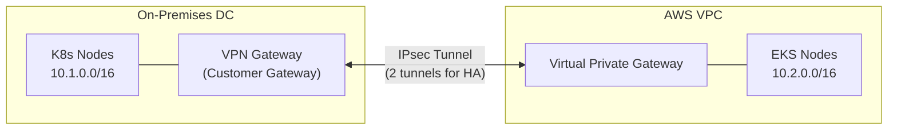
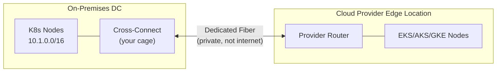
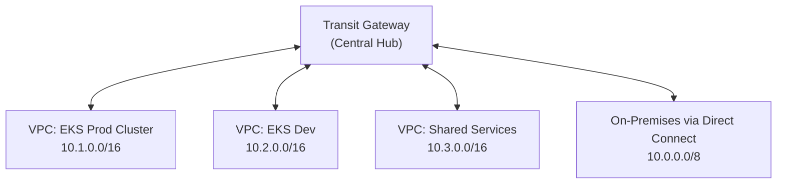
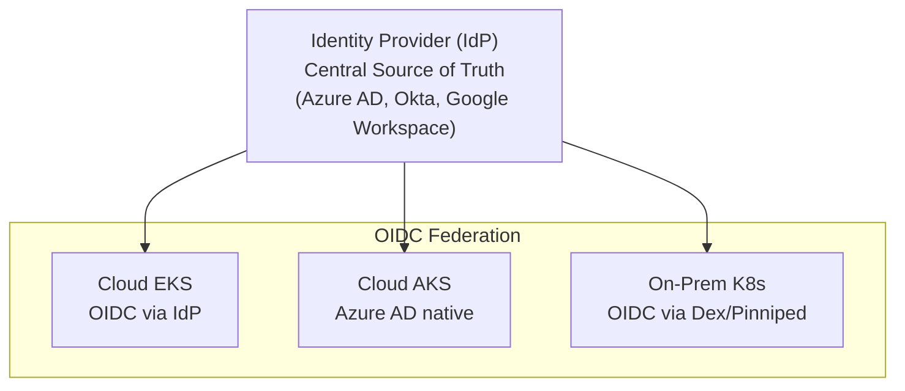
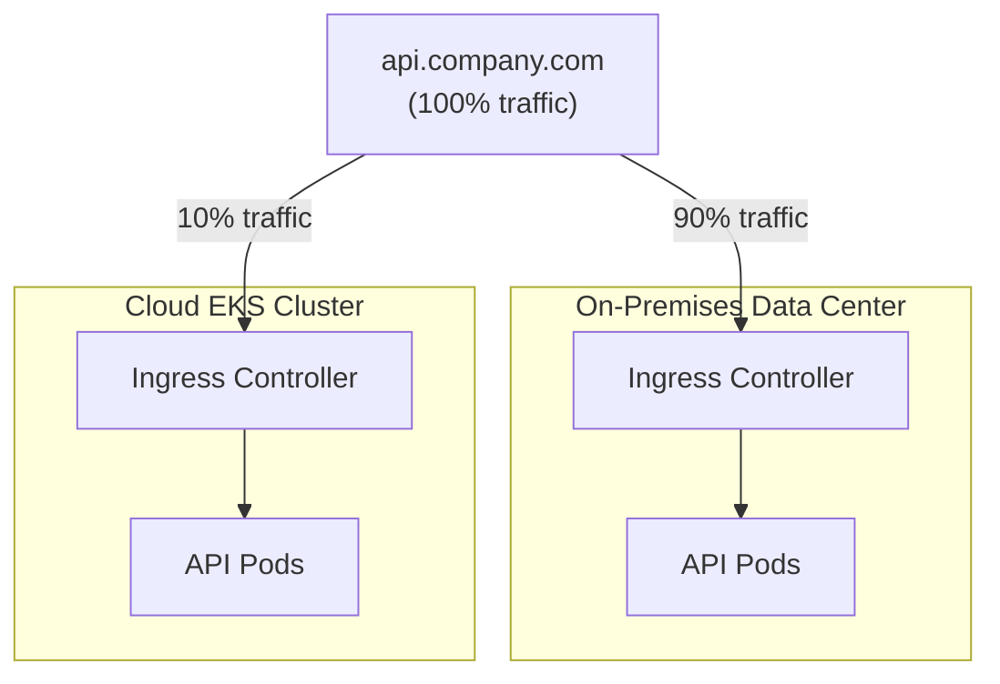
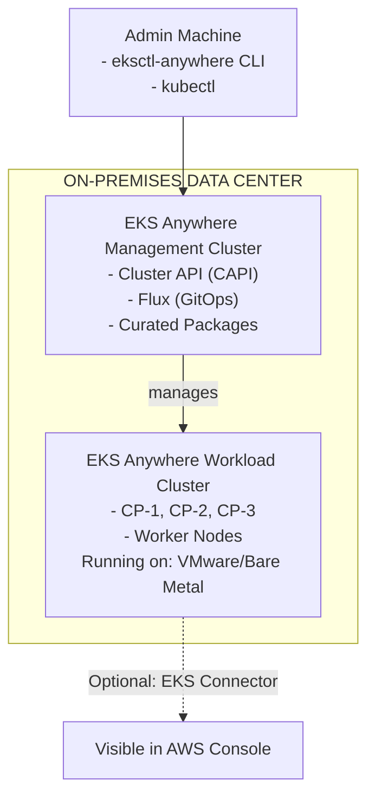
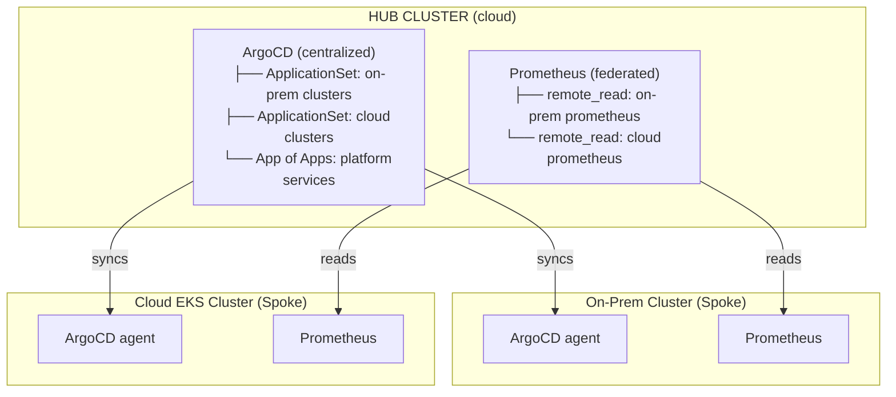
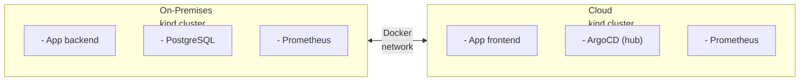

**Complexity**: [COMPLEX] | **Time to Complete**: 3h | **Prerequisites**: Cloud Architecture Patterns, Networking Fundamentals, Enterprise Landing Zones (Module 10.1)

## What You'll Be Able to Do

After completing this module, you will be able to:

- **Design hybrid cloud architectures that connect on-premises Kubernetes clusters to cloud provider services**
- **Configure site-to-site VPN and Direct Connect/ExpressRoute/Cloud Interconnect for secure hybrid connectivity**
- **Implement workload migration strategies that gradually shift traffic from on-premises to cloud Kubernetes clusters**
- **Evaluate hybrid orchestration platforms (Anthos, Azure Arc, EKS Anywhere) for on-premises Kubernetes management**

---

## Why This Module Matters

In 2023, a major European bank began migrating its trading platform from on-premises data centers to AWS. The migration was planned as a "lift and shift" over 18 months. Six months in, they discovered a fundamental problem: their regulatory framework required that certain trading data never leave the country. Their on-premises data centers were in Frankfurt, but the low-latency market data feeds connected directly to those data centers via dedicated fiber. Moving the trading engine to the cloud meant adding 3-8 milliseconds of latency to market data -- enough to cost them $12 million per year in missed arbitrage opportunities. They also could not fully decommission the data center because their mainframe-based settlement system had 22 years of business logic that would take 5+ years to rewrite.

> **Stop and think**: If the bank's trading engine stayed on-premises but analytics moved to the cloud, how might they keep the data in sync without overwhelming the network?

The bank's CTO made the pragmatic decision that most enterprises eventually reach: they would not fully migrate to the cloud. Instead, they would build a hybrid architecture where the trading engine stayed on-premises (for latency-sensitive market data), the settlement system stayed on-premises (until the rewrite completed), and everything else -- customer-facing APIs, analytics, machine learning workloads, and new microservices -- ran on EKS in AWS. This required seamless networking between on-premises and cloud, unified identity across both environments, consistent Kubernetes operations regardless of where the cluster ran, and data replication strategies that respected regulatory boundaries.

This module teaches you how to build that architecture. You will learn how to connect on-premises infrastructure to cloud providers via VPN and dedicated connections, how to extend cloud identity to on-premises Kubernetes clusters, how to replicate data across the hybrid boundary, and how to use EKS Anywhere, Anthos, and other solutions to create a unified Kubernetes control plane.

---

## Connectivity: VPN vs Dedicated Connections

The foundation of any hybrid architecture is the network connection between your data center and the cloud. There are two fundamental approaches, and the choice between them affects everything from latency to cost to reliability.

> **Pause and predict**: Given the 1.25 Gbps bandwidth limit of an AWS Site-to-Site VPN tunnel, how long would it take to transfer a 500GB database backup? What does this mean for disaster recovery planning?

### Site-to-Site VPN

A site-to-site VPN creates an encrypted tunnel over the public internet between your on-premises network equipment and the cloud provider's VPN gateway.



**Bandwidth**: Up to 1.25 Gbps per tunnel (AWS)
**Latency**: Variable (internet-dependent), typically 20-100ms
**Cost**: ~$0.05/hr per VPN connection (~$36/month)
**Setup time**: Hours

```bash
# AWS: Create a Site-to-Site VPN connection
# Step 1: Create a Customer Gateway (your on-premises router's public IP)
CGW_ID=$(aws ec2 create-customer-gateway \
  --type ipsec.1 \
  --public-ip 203.0.113.50 \
  --bgp-asn 65000 \
  --query 'CustomerGateway.CustomerGatewayId' --output text)

# Step 2: Create a Virtual Private Gateway and attach to VPC
VGW_ID=$(aws ec2 create-vpn-gateway \
  --type ipsec.1 \
  --amazon-side-asn 64512 \
  --query 'VpnGateway.VpnGatewayId' --output text)
aws ec2 attach-vpn-gateway --vpn-gateway-id $VGW_ID --vpc-id $VPC_ID

# Step 3: Create the VPN connection (2 tunnels automatically)
VPN_ID=$(aws ec2 create-vpn-connection \
  --type ipsec.1 \
  --customer-gateway-id $CGW_ID \
  --vpn-gateway-id $VGW_ID \
  --options '{"StaticRoutesOnly":false}' \
  --query 'VpnConnection.VpnConnectionId' --output text)

# Step 4: Download the configuration for your on-premises router
aws ec2 describe-vpn-connections \
  --vpn-connection-ids $VPN_ID \
  --query 'VpnConnections[0].CustomerGatewayConfiguration' \
  --output text > vpn-config.xml
```

### Dedicated Connections (Direct Connect / ExpressRoute / Cloud Interconnect)

Dedicated connections provide a private physical link between your data center and the cloud provider. The traffic never touches the public internet.



**Bandwidth**: 1 Gbps, 10 Gbps, or 100 Gbps
**Latency**: Consistent, typically 1-5ms
**Cost**: $0.30/hr for 1Gbps (AWS Direct Connect) + data transfer
**Setup time**: 2-12 weeks (physical circuit provisioning)

### Comparison Matrix

| Feature | Site-to-Site VPN | Dedicated Connection |
| :--- | :--- | :--- |
| **Bandwidth** | Up to 1.25 Gbps/tunnel | 1-100 Gbps |
| **Latency** | 20-100ms (variable) | 1-5ms (consistent) |
| **Reliability** | Internet-dependent | SLA-backed (99.9-99.99%) |
| **Encryption** | Built-in (IPsec) | Optional (MACsec on 10/100G) |
| **Cost** | Low ($36/month base) | High ($1,600+/month for 1Gbps) |
| **Setup time** | Hours | Weeks to months |
| **Use case** | Dev/test, failover, low bandwidth | Production, latency-sensitive, high bandwidth |
| **Kubernetes impact** | Acceptable for API calls, config sync | Required for data replication, cross-cluster traffic |

### Transit Gateway: The Hub for Hybrid Networking

For enterprises with multiple VPCs and on-premises connections, AWS Transit Gateway (or Azure Virtual WAN, GCP Network Connectivity Center) acts as a centralized hub.



*Note: Route Tables remain separate for prod, dev, shared, and on-prem. Pod CIDRs must be routable across TGW for cross-cluster communication.*

```bash
# Create Transit Gateway
TGW_ID=$(aws ec2 create-transit-gateway \
  --description "Hybrid-Hub" \
  --options "AmazonSideAsn=64512,AutoAcceptSharedAttachments=disable,DefaultRouteTableAssociation=disable,DefaultRouteTablePropagation=disable,DnsSupport=enable" \
  --query 'TransitGateway.TransitGatewayId' --output text)

# Attach VPCs
aws ec2 create-transit-gateway-vpc-attachment \
  --transit-gateway-id $TGW_ID \
  --vpc-id $PROD_VPC_ID \
  --subnet-ids $PROD_SUBNET_1 $PROD_SUBNET_2

# Attach Direct Connect Gateway
aws directconnect create-direct-connect-gateway-association \
  --direct-connect-gateway-id $DX_GW_ID \
  --gateway-id $TGW_ID \
  --allowed-prefixes "10.1.0.0/16,10.2.0.0/16,10.3.0.0/16"

# Route on-prem traffic through Transit Gateway
aws ec2 create-transit-gateway-route \
  --transit-gateway-route-table-id $TGW_RT_ID \
  --destination-cidr-block 10.0.0.0/8 \
  --transit-gateway-attachment-id $DX_ATTACHMENT_ID
```

*War Story: A logistics company connected 12 VPCs and 3 on-premises data centers through a Transit Gateway. Their Kubernetes clusters worked perfectly within each VPC but cross-cluster communication failed intermittently. The root cause: their pod CIDR ranges (assigned by VPC CNI) overlapped across VPCs because each VPC used the same secondary CIDR. Transit Gateway cannot route overlapping CIDRs. They had to redesign their entire IP address plan -- a painful, weeks-long process that could have been avoided with centralized IPAM from the start.*

---

## Extending Cloud Identity to On-Premises

In a hybrid architecture, you need a single identity system that works across both cloud and on-premises Kubernetes clusters. Developers should not need separate credentials for each environment.

> **Stop and think**: If your corporate Identity Provider goes down, what happens to developers trying to access the on-premises Kubernetes cluster via Pinniped? How would break-glass access work?

### Identity Architecture Options



### Pinniped: Unified Kubernetes Authentication

Pinniped is a project that provides identity federation for any Kubernetes cluster. It is especially valuable for on-premises clusters that cannot natively integrate with cloud identity providers.

```yaml
# Install Pinniped Supervisor (on a management cluster)
# This acts as the OIDC bridge between your IdP and Kubernetes clusters

# pinniped-supervisor-config.yaml
apiVersion: config.supervisor.pinniped.dev/v1alpha1
kind: FederationDomain
metadata:
  name: company-federation
  namespace: pinniped-supervisor
spec:
  issuer: https://pinniped.internal.company.com
  tls:
    secretName: pinniped-tls-cert

---
# Connect Pinniped to your corporate IdP (e.g., Okta)
apiVersion: idp.supervisor.pinniped.dev/v1alpha1
kind: OIDCIdentityProvider
metadata:
  name: okta-idp
  namespace: pinniped-supervisor
spec:
  issuer: https://company.okta.com/oauth2/default
  authorizationConfig:
    additionalScopes:
      - groups
      - email
    allowPasswordGrant: false
  claims:
    username: email
    groups: groups
  client:
    secretName: okta-client-secret

---
# On each on-prem cluster, install Pinniped Concierge
# pinniped-concierge-config.yaml
apiVersion: authentication.concierge.pinniped.dev/v1alpha1
kind: JWTAuthenticator
metadata:
  name: company-jwt
spec:
  issuer: https://pinniped.internal.company.com
  audience: on-prem-cluster-1
  tls:
    certificateAuthorityData: <base64-encoded-ca-cert>
```

```bash
# Developer workflow (same for cloud and on-prem)
# Install the Pinniped CLI
brew install vmware-tanzu/pinniped/pinniped-cli

# Generate kubeconfig for an on-prem cluster
pinniped get kubeconfig \
  --kubeconfig-context on-prem-cluster-1 \
  > /tmp/on-prem-kubeconfig.yaml

# The kubeconfig triggers browser-based OIDC login
# Same Okta credentials work for cloud and on-prem clusters
kubectl --kubeconfig /tmp/on-prem-kubeconfig.yaml get nodes
```

---

## Data Replication Across the Hybrid Boundary

Data is the hardest part of hybrid cloud. Unlike stateless applications that can run anywhere, data has gravity -- it is expensive and slow to move, and regulatory constraints often dictate where it can live.

### Data Replication Patterns

| Pattern | Use Case | Latency Tolerance | Tools |
| :--- | :--- | :--- | :--- |
| **Active-Passive** | DR, read replicas | Minutes | AWS DMS, Azure Site Recovery |
| **Active-Active** | Multi-region writes | Sub-second | CockroachDB, YugabyteDB, Cassandra |
| **Event Streaming** | Real-time sync | Seconds | Kafka MirrorMaker, Confluent Replicator |
| **Batch Sync** | Analytics, reporting | Hours | AWS DataSync, Rclone, rsync |
| **Cache-Aside** | Read-heavy, latency-sensitive | Milliseconds | Redis Enterprise, Hazelcast |

### Cross-Environment Database Replication

```yaml
# PostgreSQL streaming replication across hybrid boundary
# On-prem primary → Cloud read replica

# On the on-prem primary (postgresql.conf)
# wal_level = replica
# max_wal_senders = 5
# wal_keep_size = 1GB

# On the cloud replica (Kubernetes StatefulSet)
apiVersion: apps/v1
kind: StatefulSet
metadata:
  name: postgres-replica
  namespace: database
spec:
  serviceName: postgres-replica
  replicas: 1
  selector:
    matchLabels:
      app: postgres-replica
  template:
    metadata:
      labels:
        app: postgres-replica
    spec:
      containers:
        - name: postgres
          image: postgres:16.2
          env:
            - name: PGDATA
              value: /var/lib/postgresql/data/pgdata
          command:
            - bash
            - -c
            - |
              # Initialize as a streaming replica of the on-prem primary
              if [ ! -f "$PGDATA/PG_VERSION" ]; then
                pg_basebackup -h 10.0.50.100 -U replicator \
                  -D $PGDATA -Fp -Xs -P -R
              fi
              exec postgres \
                -c primary_conninfo='host=10.0.50.100 port=5432 user=replicator password=secret' \
                -c primary_slot_name='cloud_replica'
          ports:
            - containerPort: 5432
          volumeMounts:
            - name: pgdata
              mountPath: /var/lib/postgresql/data
          resources:
            limits:
              cpu: "2"
              memory: 4Gi
  volumeClaimTemplates:
    - metadata:
        name: pgdata
      spec:
        accessModes: ["ReadWriteOnce"]
        storageClassName: gp3-encrypted
        resources:
          requests:
            storage: 500Gi
```

### Kafka for Cross-Environment Event Streaming

```yaml
# Kafka MirrorMaker 2 for hybrid event streaming
# Replicates topics from on-prem Kafka to cloud Kafka
apiVersion: kafka.strimzi.io/v1beta2
kind: KafkaMirrorMaker2
metadata:
  name: hybrid-mirror
  namespace: kafka
spec:
  version: 3.7.0
  replicas: 3
  connectCluster: cloud-kafka
  clusters:
    - alias: onprem-kafka
      bootstrapServers: onprem-kafka-bootstrap.datacenter.internal:9093
      tls:
        trustedCertificates:
          - secretName: onprem-ca-cert
            certificate: ca.crt
      authentication:
        type: tls
        certificateAndKey:
          secretName: mirror-maker-cert
          certificate: tls.crt
          key: tls.key
    - alias: cloud-kafka
      bootstrapServers: kafka-bootstrap.kafka.svc:9092
      config:
        config.storage.replication.factor: 3
        offset.storage.replication.factor: 3
        status.storage.replication.factor: 3
  mirrors:
    - sourceCluster: onprem-kafka
      targetCluster: cloud-kafka
      sourceConnector:
        config:
          replication.factor: 3
          offset-syncs.topic.replication.factor: 3
          sync.topic.acls.enabled: false
          replication.policy.class: "org.apache.kafka.connect.mirror.IdentityReplicationPolicy"
      topicsPattern: "trading\\..*|settlement\\..*"
      groupsPattern: ".*"
```

---

## Workload Migration Strategies

Once your hybrid infrastructure is connected and identities are unified, the next challenge is actually moving workloads from on-premises to the cloud. A "big bang" cutover is rarely successful for complex applications. Instead, enterprises use progressive traffic shifting to migrate workloads safely.

> **Pause and predict**: If you shift 1% of traffic to a new cloud cluster and monitor it for 24 hours, what specific metrics would tell you it is safe to increase the traffic to 10%?

### Pattern 1: Weighted DNS Routing

The simplest approach to traffic shifting is at the DNS layer. By configuring your DNS provider (like Route 53 or external-dns) to return multiple IP addresses with specific weights, you can control the percentage of users routed to each environment.

```yaml
# Example: AWS Route 53 Weighted Record via ExternalDNS annotation
apiVersion: networking.k8s.io/v1
kind: Ingress
metadata:
  name: api-gateway
  annotations:
    external-dns.alpha.kubernetes.io/hostname: api.company.com
    external-dns.alpha.kubernetes.io/aws-weight: "10" # 10% to cloud
    external-dns.alpha.kubernetes.io/set-identifier: "cloud-eks-cluster"
spec:
  rules:
    - host: api.company.com
      http:
        paths:
          - path: /
            pathType: Prefix
            backend:
              service:
                name: api-gateway
                port:
                  number: 80
```

*Pros*: Simple to implement, works across any geographic distance.
*Cons*: DNS caching by client browsers and ISPs can cause traffic to linger on the old cluster long after you update the weights. Fails over slowly.

### Pattern 2: Multi-Cluster Ingress

For HTTP/HTTPS workloads, a multi-cluster Ingress controller (like GKE Multi-Cluster Ingress or a globally distributed load balancer like AWS Global Accelerator) can distribute traffic across on-premises and cloud clusters.



*Pros*: Immediate traffic shifting without DNS caching issues. Can route based on HTTP headers (e.g., routing internal test users to the cloud cluster first).
*Cons*: Requires a centralized load balancer that can reach both environments (often requiring Direct Connect).

### Pattern 3: Multi-Cluster Service Mesh

The most advanced migration strategy uses a service mesh like Istio or Linkerd configured for multi-cluster routing. This allows you to shift traffic not just at the edge, but for internal service-to-service communication across the hybrid boundary.

If `Service A` (on-prem) calls `Service B`, the service mesh can route 90% of those calls to the on-prem `Service B` pods and 10% to the cloud `Service B` pods over the hybrid network link.

*Pros*: Granular control, mutual TLS across the hybrid boundary, deep observability.
*Cons*: High complexity. Requires a fast, reliable network connection (Direct Connect) to prevent cross-cluster latency from causing cascading timeouts.

---

## EKS Anywhere, Anthos, and Hybrid Kubernetes Platforms

Several solutions exist for running cloud-managed Kubernetes on-premises. Each takes a different approach to the "same Kubernetes, different infrastructure" problem.

### Solution Comparison

| Feature | EKS Anywhere | GKE Enterprise (Anthos) | Azure Arc-enabled K8s | Rancher |
| :--- | :--- | :--- | :--- | :--- |
| **Provider** | AWS | Google | Microsoft | SUSE |
| **On-prem infra** | VMware, bare metal, Nutanix | VMware, bare metal | Any K8s cluster | Any K8s cluster |
| **Cloud parity** | EKS API compatible | GKE API compatible | AKS policy/monitoring | Cloud-agnostic |
| **Management plane** | Optional EKS connector | Mandatory GCP connection | Mandatory Azure connection | Self-hosted |
| **Cost** | Free (support extra) | Per-vCPU licensing | Free (extensions extra) | Free (Rancher Prime extra) |
| **GitOps** | Flux (built-in) | Config Sync (built-in) | GitOps with Flux | Fleet (built-in) |
| **Best for** | AWS-centric orgs | GCP-centric orgs | Azure-centric orgs | Multi-cloud, vendor-neutral |

### EKS Anywhere Architecture

> **Pause and predict**: If the EKS Anywhere Management Cluster loses connectivity to the Workload Cluster, do the applications on the Workload Cluster stop running? Why or why not?



```bash
# Create an EKS Anywhere cluster on VMware
# Step 1: Generate cluster configuration
eksctl anywhere generate clusterconfig hybrid-prod \
  --provider vsphere > cluster-config.yaml
```

```yaml
# cluster-config.yaml (simplified)
apiVersion: anywhere.eks.amazonaws.com/v1alpha1
kind: Cluster
metadata:
  name: hybrid-prod
spec:
  clusterNetwork:
    cniConfig:
      cilium: {}
    pods:
      cidrBlocks:
        - 192.168.0.0/16
    services:
      cidrBlocks:
        - 10.96.0.0/12
  controlPlaneConfiguration:
    count: 3
    endpoint:
      host: 10.0.100.10
    machineGroupRef:
      kind: VSphereMachineConfig
      name: hybrid-prod-cp
  datacenterRef:
    kind: VSphereDatacenterConfig
    name: hybrid-prod-dc
  kubernetesVersion: "1.35"
  workerNodeGroupConfigurations:
    - count: 5
      machineGroupRef:
        kind: VSphereMachineConfig
        name: hybrid-prod-worker
      name: workers
  gitOpsRef:
    kind: FluxConfig
    name: hybrid-prod-flux

---
apiVersion: anywhere.eks.amazonaws.com/v1alpha1
kind: VSphereDatacenterConfig
metadata:
  name: hybrid-prod-dc
spec:
  datacenter: dc-frankfurt
  server: vcenter.internal.company.com
  network: /dc-frankfurt/network/k8s-prod
  thumbprint: "AB:CD:EF:..."
  insecure: false

---
apiVersion: anywhere.eks.amazonaws.com/v1alpha1
kind: VSphereMachineConfig
metadata:
  name: hybrid-prod-worker
spec:
  diskGiB: 100
  folder: /dc-frankfurt/vm/k8s
  memoryMiB: 16384
  numCPUs: 4
  osFamily: ubuntu
  resourcePool: /dc-frankfurt/host/cluster-1/Resources/k8s-pool
  template: /dc-frankfurt/vm/templates/ubuntu-2204-k8s-1.35
```

```bash
# Step 2: Create the cluster
eksctl anywhere create cluster -f cluster-config.yaml

# Step 3: (Optional) Connect to AWS for visibility
eksctl anywhere register cluster hybrid-prod \
  --aws-region us-east-1

# Step 4: Install curated packages (same add-ons as EKS)
eksctl anywhere install package harbor \
  --cluster hybrid-prod \
  --config harbor-config.yaml
```

### Latency Budget For Hybrid Operations

| Operation | VPN | Direct Connect |
| :--- | :--- | :--- |
| **kubectl get pods** | 50-150ms | 5-15ms |
| **ArgoCD sync check** | 50-150ms | 5-15ms |
| **Cross-cluster service call** | 40-120ms | 3-10ms |
| **Database replication (streaming)** | 40-120ms | 3-10ms |
| **Prometheus remote write** | 50-150ms | 5-15ms |
| **Container image pull (1GB)** | 8-25s | 0.8-2s |
| **Velero backup (100GB)** | 13-40min | 1.5-4min |

**Rule of thumb:**
- **Control plane operations:** VPN is acceptable
- **Data plane operations:** Direct Connect strongly recommended
- **Real-time service calls:** Direct Connect required

---

## Unified Control Plane Patterns

The ultimate goal of hybrid architecture is a single pane of glass for managing Kubernetes across all environments.

> **Stop and think**: In a Hub-Spoke GitOps architecture, what happens if the network link between the Cloud Hub and the On-Prem Spoke goes down for 4 hours while developers are merging code to the main branch?

### Pattern 1: Hub-Spoke with GitOps



```yaml
# ArgoCD ApplicationSet for hybrid fleet management
apiVersion: argoproj.io/v1alpha1
kind: ApplicationSet
metadata:
  name: platform-services
  namespace: argocd
spec:
  generators:
    - clusters:
        selector:
          matchLabels:
            environment: production
  template:
    metadata:
      name: 'platform-{{name}}'
    spec:
      project: platform
      source:
        repoURL: https://github.com/company/platform-services.git
        targetRevision: main
        path: 'overlays/{{metadata.labels.location}}'
      destination:
        server: '{{server}}'
        namespace: platform-system
      syncPolicy:
        automated:
          prune: true
          selfHeal: true
        syncOptions:
          - CreateNamespace=true
```

---

## Did You Know?

1. AWS Direct Connect has over 115 locations globally as of 2025, but provisioning a new connection still takes 2-12 weeks because it involves physical fiber cross-connects. Some enterprises maintain "dark fiber" connections -- provisioned but unused circuits -- specifically so they can activate new Direct Connect links in hours instead of weeks. These dark fiber circuits cost about $500/month in cross-connect fees alone.

2. Google's Anthos was rebranded to "GKE Enterprise" in 2023 after Google found that the "Anthos" name confused customers who did not associate it with Kubernetes. The per-vCPU pricing ($0.01/hr for on-prem clusters) was also criticized as expensive for large deployments. A 100-node cluster with 4 vCPUs per node costs roughly $2,900/month just for the Anthos license, on top of the infrastructure costs.

3. EKS Anywhere was launched in 2021 as a free, open-source project. AWS makes money not from EKS Anywhere itself but from the "EKS Anywhere Enterprise Subscription" ($24,000/year per cluster for 24/7 support) and from workloads that eventually migrate to cloud EKS. Internal AWS metrics show that 68% of EKS Anywhere clusters also connect to at least one cloud EKS cluster within their first year.

4. The average enterprise with a hybrid cloud strategy maintains connections to 2.3 cloud providers and 1.8 data centers simultaneously, according to a 2024 Flexera survey. The most common combination is AWS + Azure + one on-premises data center. The "single cloud" strategy that analysts predicted in 2018 has not materialized -- instead, enterprises have become deliberately multi-cloud, though usually with one primary and one secondary provider.

---

## Common Mistakes

| Mistake | Why It Happens | How to Fix It |
| :--- | :--- | :--- |
| **VPN as the sole production connection** | Quick to set up. "We will upgrade to Direct Connect later." Then production grows to depend on internet stability. | Use VPN for non-production and as a failover path. Direct Connect for production workloads. Design for this from day one. |
| **Overlapping IP ranges between on-prem and cloud** | On-prem uses 10.0.0.0/8 extensively. Cloud VPCs also default to 10.x. Pod CIDRs overlap because no one coordinated. | Centralized IPAM from the start. Reserve distinct ranges: on-prem 10.0-10.63, cloud 10.64-10.127, pods 10.128-10.191. Document and enforce. |
| **Separate identity systems for cloud and on-prem K8s** | Cloud K8s uses cloud-native auth. On-prem K8s uses static tokens or client certs. Different credentials, different RBAC, inconsistent access. | Deploy Pinniped or Dex as a unified OIDC bridge. One IdP, one login, consistent RBAC across all clusters. |
| **Trying to do active-active across the hybrid boundary** | Architect designs active-active database replication across 50ms VPN link. Application assumes single-digit-ms latency for distributed locks. | Be honest about latency constraints. Active-active across a WAN requires CRDT-based or conflict-free databases (CockroachDB, YugabyteDB). Not all workloads can tolerate this. |
| **No local container registry on-prem** | On-prem clusters pull images from cloud ECR/ACR/Artifact Registry across the WAN link. Slow pulls, failed deployments during network blips. | Deploy Harbor or a registry mirror on-prem. Pre-cache images. Set `imagePullPolicy: IfNotPresent` for on-prem workloads. |
| **Managing on-prem clusters with SSH and scripts** | "We have always managed servers this way." But Kubernetes clusters need declarative management, not imperative scripts. | Use GitOps (ArgoCD/Flux) for all clusters, including on-prem. Cluster API or EKS Anywhere for infrastructure lifecycle. No SSH management. |
| **Ignoring DNS split-horizon** | On-prem services use `.internal.company.com`. Cloud services use different domains. Cross-environment service discovery breaks. | Design a unified DNS strategy. Use CoreDNS forwarding, Route53 Resolver endpoints, or a service mesh for cross-environment service discovery. |
| **No monitoring for the connection itself** | Teams monitor applications but not the VPN/Direct Connect link. When the link degrades, everything breaks and no one knows why. | Monitor connection latency, packet loss, and bandwidth utilization. Alert when latency exceeds baseline by 2x. CloudWatch metrics for Direct Connect, custom probes for VPN. |

---

## Quiz

<details>
<summary>Question 1: Your on-premises Kubernetes cluster needs to pull container images from Amazon ECR. The cluster connects to AWS via a site-to-site VPN. Image pulls take 90 seconds for a 500MB image. How would you improve this?</summary>

Several approaches can significantly improve this process. First, you should deploy an on-premises registry mirror (such as Harbor with a proxy cache) that pulls images from ECR once and serves them locally to all nodes. Subsequent pulls will happen at local-network speeds, eliminating the WAN latency. Second, you can implement an automated process to pre-pull images as part of the deployment pipeline, ensuring they are cached on the nodes before the new pods are scheduled. Third, consider optimizing the image size using multi-stage builds or distroless base images, which often reduce a 500MB footprint down to 50-100MB. Finally, if the business budget allows, upgrading to a Direct Connect circuit would drastically reduce the transfer time from 90 seconds to just a few seconds.
</details>

<details>
<summary>Question 2: Your network engineering team is allocating IP ranges for a new hybrid cloud expansion. They suggest reusing the 10.244.0.0/16 range for pods in both the on-premises and AWS EKS clusters, arguing that the clusters are separate. Why will this cause a major outage when you deploy a multi-cluster service mesh?</summary>

In a single-cloud or fully isolated deployment, pod CIDRs only need to be routable within their local VPC or cluster network. However, in a hybrid architecture with a multi-cluster service mesh, traffic must be routed directly between pods across the transit gateway or VPN. If both the on-premises and cloud clusters use the exact same 10.244.0.0/16 pod CIDR, the underlying network routers will experience a conflict and cannot determine the correct destination for packets. Cross-cluster service calls, database connections initiated from pods, and centralized monitoring scrapes will all instantly fail. To prevent this, you must implement centralized IPAM that assigns unique, non-overlapping CIDR ranges to every cluster's pod and service networks.
</details>

<details>
<summary>Question 3: Your company's CTO has mandated a unified Kubernetes strategy across AWS and your VMware-based on-premises data centers. The platform team is debating between using `kubeadm` to build a custom distribution versus adopting EKS Anywhere. What are the operational trade-offs they must consider before making this decision?</summary>

Opting for EKS Anywhere provides significant operational advantages, including declarative lifecycle management via Cluster API and pre-integrated tools like Flux for GitOps. It also ensures strict version compatibility with cloud-based EKS and provides curated, heavily tested add-ons right out of the box. However, this convenience comes with strict trade-offs, primarily a deep vendor dependency on AWS's release cycles and limited support for underlying infrastructure (e.g., VMware or Bare Metal, but not Hyper-V). Conversely, using `kubeadm` offers complete architectural freedom and avoids vendor lock-in, but places the entire burden of engineering the cluster lifecycle, integrating add-ons, and building GitOps pipelines squarely on your platform team. Ultimately, the decision hinges on whether the organization prefers to buy a standardized operational model or build a highly customized one.
</details>

<details>
<summary>Question 4: Your company has a Direct Connect to AWS and an ExpressRoute to Azure. You want unified monitoring across all clusters. What architecture would you recommend?</summary>

The most robust approach is to implement a federated Prometheus architecture with a highly available central aggregation layer. You should deploy a local Prometheus instance on each cluster (on-premises, AWS, and Azure) to collect metrics and provide short-term buffering during network partitions. Because you have high-bandwidth dedicated connections available, you can reliably use Thanos or Prometheus `remote_write` to ship these metrics to a central storage tier without saturating the network links. This central store, handling long-term retention and global querying, should be placed in the cloud environment with the most reliable connectivity or in a managed service like Grafana Cloud. This design guarantees that if a network link drops, local Prometheus nodes will buffer the metrics, seamlessly backfilling the central dashboard once connectivity is restored.
</details>

<details>
<summary>Question 5: You have successfully connected your on-premises data center to AWS via Direct Connect. However, developers complain that they use their corporate Okta single sign-on for the EKS clusters, but must use static `kubeconfig` files with client certificates for the on-premises clusters. How does a tool like Pinniped solve this specific pain point?</summary>

Pinniped acts as a unified identity federation bridge that standardizes the authentication flow across any type of Kubernetes cluster. It features a Supervisor component that integrates directly with your corporate Identity Provider (like Okta) and a Concierge component installed on every target cluster to validate the resulting tokens. Instead of managing static certificates or setting up separate OIDC integrations for each on-premises cluster, administrators configure a single identity source. Developers can then use a single `pinniped login` command that triggers a familiar browser-based OIDC login flow. Ultimately, this ensures that the same corporate credentials and RBAC policies govern access across the entire hybrid fleet, dramatically reducing administrative overhead and improving security.
</details>

<details>
<summary>Question 6: Your startup is extending its on-premises development environment into the cloud to access specialized GPU nodes. The CTO wants to immediately order a 10Gbps Direct Connect circuit to link the environments. Under what specific conditions would you advise starting with a Site-to-Site VPN instead, and when would the Direct Connect become strictly necessary?</summary>

For an initial development environment expansion, a Site-to-Site VPN is generally the superior starting point because it can be provisioned in hours and costs a fraction of dedicated fiber. Because these are development workloads, occasional internet-induced latency spikes or minor packet loss will likely not cause business-impacting outages. You should advise starting with a VPN to rapidly unblock the engineering teams and validate the architectural patterns. A Direct Connect circuit becomes strictly necessary only when you transition to production workloads that require consistent single-digit millisecond latency, or when synchronous data replication and large-scale cross-cluster service mesh traffic saturate the VPN's bandwidth. Ultimately, most mature enterprises maintain both, using Direct Connect for heavy production data and keeping the VPN as an automatic failover path.
</details>

---

## Hands-On Exercise: Simulate a Hybrid Cloud Architecture

In this exercise, you will simulate a hybrid environment using two kind clusters -- one representing the cloud and one representing on-premises -- with network connectivity, shared identity, and cross-cluster service discovery.

**What you will build:**



### Task 1: Create the Hybrid Clusters

<details>
<summary>Solution</summary>

```bash
# Create a shared Docker network (simulates VPN/Direct Connect)
docker network create hybrid-net 2>/dev/null || true

# Create the "on-premises" cluster
cat <<'EOF' > /tmp/onprem-cluster.yaml
kind: Cluster
apiVersion: kind.x-k8s.io/v1alpha4
name: onprem
networking:
  podSubnet: "10.244.0.0/16"
  serviceSubnet: "10.96.0.0/12"
nodes:
  - role: control-plane
  - role: worker
EOF

# Create the "cloud" cluster
cat <<'EOF' > /tmp/cloud-cluster.yaml
kind: Cluster
apiVersion: kind.x-k8s.io/v1alpha4
name: cloud
networking:
  podSubnet: "10.245.0.0/16"
  serviceSubnet: "10.112.0.0/12"
nodes:
  - role: control-plane
  - role: worker
EOF

kind create cluster --config /tmp/onprem-cluster.yaml
kind create cluster --config /tmp/cloud-cluster.yaml

# Connect both clusters to the shared network
docker network connect hybrid-net onprem-control-plane
docker network connect hybrid-net cloud-control-plane

echo "=== On-prem cluster ==="
kubectl --context kind-onprem get nodes
echo "=== Cloud cluster ==="
kubectl --context kind-cloud get nodes
```

</details>

### Task 2: Deploy Workloads Simulating Hybrid Architecture

<details>
<summary>Solution</summary>

```bash
# Deploy a backend service on the "on-prem" cluster
kubectl --context kind-onprem create namespace backend
cat <<'EOF' | kubectl --context kind-onprem apply -f -
apiVersion: apps/v1
kind: Deployment
metadata:
  name: api-backend
  namespace: backend
spec:
  replicas: 2
  selector:
    matchLabels:
      app: api-backend
  template:
    metadata:
      labels:
        app: api-backend
    spec:
      containers:
        - name: api
          image: nginx:1.27.3
          ports:
            - containerPort: 80
          resources:
            limits:
              cpu: 100m
              memory: 128Mi
---
apiVersion: v1
kind: Service
metadata:
  name: api-backend
  namespace: backend
spec:
  selector:
    app: api-backend
  ports:
    - port: 80
      targetPort: 80
EOF

# Deploy a frontend service on the "cloud" cluster
kubectl --context kind-cloud create namespace frontend
cat <<'EOF' | kubectl --context kind-cloud apply -f -
apiVersion: apps/v1
kind: Deployment
metadata:
  name: web-frontend
  namespace: frontend
spec:
  replicas: 2
  selector:
    matchLabels:
      app: web-frontend
  template:
    metadata:
      labels:
        app: web-frontend
    spec:
      containers:
        - name: web
          image: nginx:1.27.3
          ports:
            - containerPort: 80
          resources:
            limits:
              cpu: 100m
              memory: 128Mi
---
apiVersion: v1
kind: Service
metadata:
  name: web-frontend
  namespace: frontend
spec:
  selector:
    app: web-frontend
  ports:
    - port: 80
      targetPort: 80
EOF

echo "=== On-prem workloads ==="
kubectl --context kind-onprem get pods -n backend
echo "=== Cloud workloads ==="
kubectl --context kind-cloud get pods -n frontend
```

</details>

### Task 3: Test Cross-Cluster Connectivity

<details>
<summary>Solution</summary>

```bash
# Get the on-prem cluster's internal IP (simulates the Direct Connect path)
ONPREM_IP=$(docker inspect onprem-control-plane --format '{{range .NetworkSettings.Networks}}{{.IPAddress}}{{end}}' | head -1)
CLOUD_IP=$(docker inspect cloud-control-plane --format '{{range .NetworkSettings.Networks}}{{.IPAddress}}{{end}}' | head -1)

echo "On-prem cluster IP: $ONPREM_IP"
echo "Cloud cluster IP: $CLOUD_IP"

# Verify connectivity between clusters (simulates VPN tunnel)
docker exec cloud-control-plane ping -c 3 $ONPREM_IP
docker exec onprem-control-plane ping -c 3 $CLOUD_IP

echo ""
echo "Cross-cluster connectivity verified."
echo "In a real hybrid setup, this path would go through:"
echo "  - Direct Connect (1-5ms latency)"
echo "  - or VPN tunnel (20-100ms latency)"
```

</details>

### Task 4: Implement Cross-Cluster Monitoring

<details>
<summary>Solution</summary>

```bash
# Deploy a simple monitoring ConfigMap on each cluster that
# simulates federated monitoring configuration

for CTX in kind-onprem kind-cloud; do
  CLUSTER_NAME=$(echo $CTX | sed 's/kind-//')
  kubectl --context $CTX create namespace monitoring 2>/dev/null || true

  cat <<EOF | kubectl --context $CTX apply -f -
apiVersion: v1
kind: ConfigMap
metadata:
  name: monitoring-config
  namespace: monitoring
data:
  cluster-name: "${CLUSTER_NAME}"
  cluster-type: "$([ $CLUSTER_NAME = 'onprem' ] && echo 'on-premises' || echo 'cloud')"
  prometheus-config: |
    global:
      scrape_interval: 30s
      external_labels:
        cluster: ${CLUSTER_NAME}
        environment: $([ $CLUSTER_NAME = 'onprem' ] && echo 'datacenter' || echo 'aws')
    remote_write:
      - url: http://thanos-receive.monitoring.svc:19291/api/v1/receive
    scrape_configs:
      - job_name: kubernetes-pods
        kubernetes_sd_configs:
          - role: pod
EOF
done

echo "=== On-prem monitoring config ==="
kubectl --context kind-onprem get configmap monitoring-config -n monitoring -o yaml | grep -A5 "external_labels"
echo "=== Cloud monitoring config ==="
kubectl --context kind-cloud get configmap monitoring-config -n monitoring -o yaml | grep -A5 "external_labels"
```

</details>

### Task 5: Build a Hybrid Inventory Report

<details>
<summary>Solution</summary>

```bash
cat <<'SCRIPT' > /tmp/hybrid-inventory.sh
#!/bin/bash
echo "========================================"
echo "  HYBRID CLOUD INVENTORY REPORT"
echo "  $(date -u +%Y-%m-%dT%H:%M:%SZ)"
echo "========================================"

for CTX in kind-onprem kind-cloud; do
  CLUSTER=$(echo $CTX | sed 's/kind-//')
  echo ""
  echo "--- Cluster: $CLUSTER ---"
  echo "  Nodes:       $(kubectl --context $CTX get nodes --no-headers | wc -l | tr -d ' ')"
  echo "  Namespaces:  $(kubectl --context $CTX get namespaces --no-headers | wc -l | tr -d ' ')"
  echo "  Pods:        $(kubectl --context $CTX get pods -A --no-headers | wc -l | tr -d ' ')"
  echo "  Services:    $(kubectl --context $CTX get services -A --no-headers | wc -l | tr -d ' ')"
  echo "  Deployments: $(kubectl --context $CTX get deployments -A --no-headers | wc -l | tr -d ' ')"

  echo "  Workload Namespaces:"
  for NS in $(kubectl --context $CTX get namespaces -o jsonpath='{.items[*].metadata.name}' | tr ' ' '\n' | grep -v '^kube-' | grep -v '^default$' | grep -v '^local-path-storage$'); do
    PODS=$(kubectl --context $CTX get pods -n $NS --no-headers 2>/dev/null | wc -l | tr -d ' ')
    if [ "$PODS" -gt 0 ]; then
      echo "    $NS: $PODS pods"
    fi
  done
done

echo ""
echo "========================================"
echo "  CONNECTIVITY STATUS"
echo "========================================"
ONPREM_IP=$(docker inspect onprem-control-plane --format '{{range .NetworkSettings.Networks}}{{.IPAddress}}{{end}}' | head -1)
CLOUD_IP=$(docker inspect cloud-control-plane --format '{{range .NetworkSettings.Networks}}{{.IPAddress}}{{end}}' | head -1)
echo "  On-prem IP: $ONPREM_IP"
echo "  Cloud IP:   $CLOUD_IP"

LATENCY=$(docker exec cloud-control-plane ping -c 3 -q $ONPREM_IP 2>/dev/null | tail -1 | awk -F'/' '{print $5}')
echo "  Cross-cluster latency: ${LATENCY}ms (Docker network, simulated)"
SCRIPT

chmod +x /tmp/hybrid-inventory.sh
bash /tmp/hybrid-inventory.sh
```

</details>

### Clean Up

```bash
kind delete cluster --name onprem
kind delete cluster --name cloud
docker network rm hybrid-net 2>/dev/null || true
rm /tmp/onprem-cluster.yaml /tmp/cloud-cluster.yaml /tmp/hybrid-inventory.sh
```

### Success Criteria

- [ ] I created two kind clusters simulating on-premises and cloud environments
- [ ] I deployed workloads on both clusters representing a hybrid application
- [ ] I verified network connectivity between the two clusters
- [ ] I configured simulated monitoring federation with cluster-specific labels
- [ ] I built a hybrid inventory report covering both environments
- [ ] I can explain the trade-offs between VPN and Direct Connect
- [ ] I can describe how Pinniped or Dex provides unified identity across hybrid clusters

---

## Next Module

With hybrid connectivity established, it is time to manage multiple clusters at scale. Head to [Module 10.5: Multi-Cloud Fleet Management (Azure Arc / GKE Fleet)](../module-10.5-fleet-management/) to learn how Azure Arc and Google Fleet Manager let you manage Kubernetes clusters across any environment from a single control plane.