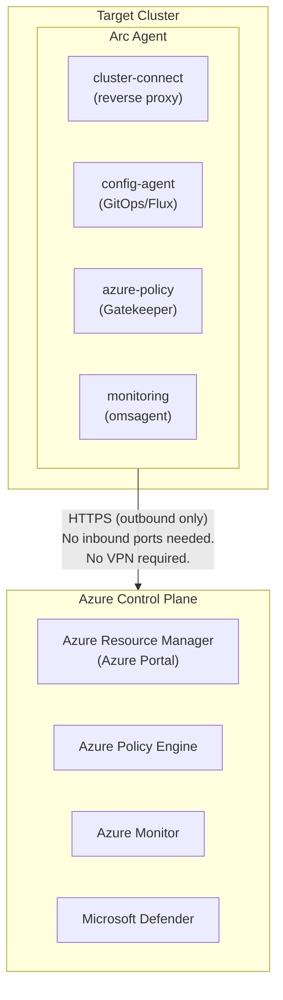
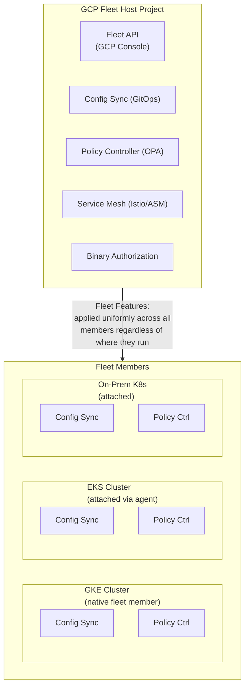
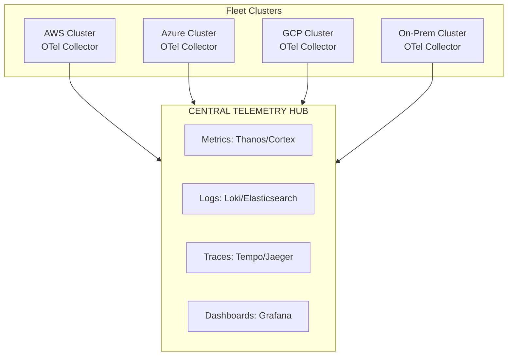
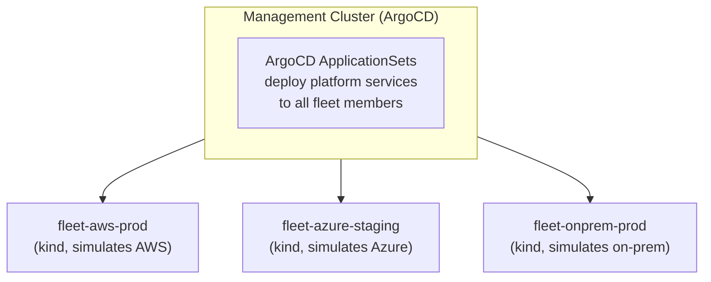

## What You'll Be Able to Do

After completing this module, you will be able to:

- **Design** fleet topology strategies that balance centralized governance with individual team autonomy in massive multi-cluster, multi-cloud environments.
- **Implement** fleet-wide GitOps delivery pipelines using ArgoCD ApplicationSets and Kustomize base/overlay patterns to distribute baseline platform services.
- **Compare** and **evaluate** the architectural tradeoffs between Azure Arc-enabled Kubernetes and Google Kubernetes Engine (GKE) Fleet management paradigms.
- **Diagnose** configuration drift and policy violations across disparate clusters using centralized telemetry and Open Policy Agent (OPA) Gatekeeper.
- **Debug** cross-cluster connectivity, synchronization, and authentication issues within a distributed Kubernetes fleet.

---

## Why This Module Matters

In late 2023, a major global financial services company, Capital One, operated over 150 Kubernetes clusters distributed across three major cloud providers and two legacy on-premises data centers. Each cluster was treated as an independent silo. Every cluster possessed its own bespoke deployment pipeline, a unique and isolated monitoring stack, an independently managed policy engine, and a dedicated team responsible for executing manual lifecycle upgrades. When a critical, highly publicized Common Vulnerabilities and Exposures (CVE) alert affecting the Kubernetes API server was announced, their centralized security organization faced an impossible task: they needed to instantly assess, audit, and patch every single cluster across the global infrastructure. 

Due to the absence of a unified management plane, the incident response devolved into chaos. It took the platform engineering teams 11 days merely to script and execute custom discovery queries to determine which clusters were actually affected by the vulnerability. It took an additional six weeks to orchestrate the patching process across all environments. During this extended vulnerability window, auditors discovered that nine clusters were running undocumented, heavily deprecated versions of Kubernetes that were no longer receiving security patches. Nobody had noticed these rogue clusters because nobody possessed a unified, fleet-wide view of the infrastructure. The financial impact of this compliance and security failure was severe, resulting in a $1.5 million regulatory fine and countless hours of redirected engineering effort that halted product feature development for an entire fiscal quarter.

The incident report identified a fundamental organizational and architectural failure: the company had a sprawling collection of clusters, but they did not have a coherent fleet. Each cluster was managed as a fragile pet, individually configured through ad-hoc scripts. The organization had no centralized infrastructure inventory, no mechanism to push critical configuration changes to all clusters simultaneously, and no unified dashboard to monitor compliance, security, or operational health. Fleet management tools are engineered specifically to solve this exact problem. By treating your entire collection of Kubernetes clusters as a single, logically unified manageable entity, tools like Azure Arc, GKE Fleet, and robust GitOps controllers provide centralized inventory, deterministic policy distribution, scalable configuration management, and comprehensive observability across clusters, regardless of their physical or cloud location. In this module, you will learn the operational realities of multi-cloud fleet management, how Azure Arc and Google Fleet architectures function, how to successfully centralize telemetry and security policies, and how to implement deterministic multi-cloud GitOps at an enterprise scale.

---

## The Multi-Cloud Reality Check

Before diving into the specific configuration commands and architectural diagrams of fleet management tools, it is crucial to conduct an honest, objective assessment of why enterprises end up in a multi-cloud posture and what that architectural decision actually costs the business. Multi-cloud is rarely a deliberate Day 1 strategy; it is usually an evolutionary accident.

### Why Enterprises End Up in a Multi-Cloud Posture

Most enterprises do not select a multi-cloud architecture because it is inherently superior for greenfield development. Instead, they find themselves operating across multiple cloud service providers (CSPs) through the following common vectors:

1. **Corporate Acquisitions and Mergers**: Company A is heavily invested in AWS and acquires Company B, which runs its entire platform on Azure. The initial acquisition plan outlines a consolidation strategy estimated to take three years, but due to shifting business priorities, the migration is permanently paused, leaving the parent company operating in both clouds indefinitely.
2. **Best-of-Breed Service Selection**: The machine learning and data science teams demand Google Cloud Platform (GCP) to leverage Vertex AI and BigQuery. Simultaneously, the core platform engineering team standardizes on AWS for Elastic Kubernetes Service (EKS) due to existing expertise, while the enterprise IT department mandates Microsoft Azure for Active Directory integration and legacy Windows workloads.
3. **Strict Regulatory and Data Sovereignty Requirements**: Certain European Union data must remain within a highly specific geographic region that only one particular cloud provider supports with the required compliance certifications, forcing the company to deploy a subset of its infrastructure to a secondary CSP.
4. **Vendor Negotiation and Lock-in Mitigation**: Executives believe that maintaining a multi-cloud footprint provides leverage during contract renewals. The threat of moving workloads from AWS to Azure is only credible if the organization has proven it can successfully operate production workloads in Azure.
5. **Shadow IT and Decentralized Budgeting**: An isolated product team begins experimenting with a secondary cloud provider using a departmental credit card. By the time central IT security discovers the rogue accounts, critical production workloads are already serving customer traffic and cannot be easily migrated.

### The Real Cost of Multi-Cloud Architecture

Operating across multiple clouds introduces massive operational complexity. You are not simply duplicating your infrastructure; you are multiplying your operational burden, training requirements, and tooling costs.

| Category | Single Cloud | Multi-Cloud (3 CSPs) |
| :--- | :--- | :--- |
| **Platform team size** | 5-8 engineers | 12-20 engineers |
| **Training budget** | $15K/year | $45-60K/year |
| **Tooling licenses** | $50K/year | $100-200K/year |
| **Data transfer costs** | Internal only | $50-200K/year |
| **Compliance audits** | 1 scope | 3 scopes |
| **Incident complexity** | Low | High (finger-pointing) |
| **Negotiation leverage** | Low | Medium |

The net effect of a multi-cloud strategy is typically a doubling or tripling of operational costs for a marginal architectural benefit. The singular exception is when an organization genuinely leverages the absolute "best-of-breed" proprietary services unique to each provider, rather than simply running commoditized Kubernetes clusters on disparate infrastructure.

> **Stop and think**: Look at the table above. If your organization is operating in multiple clouds purely due to an un-merged acquisition, are you extracting any of the "best-of-breed" benefits, or are you just paying the multi-cloud operational tax?

---

## Azure Arc for Kubernetes

Azure Arc is Microsoft's strategic solution for hybrid and multi-cloud management. It effectively extends the Azure management plane (specifically the Azure Resource Manager, or ARM) to any conformant Kubernetes cluster, regardless of its physical location or underlying infrastructure. With Azure Arc, you can securely connect an AWS EKS cluster, a Google GKE cluster, a sprawling on-premises kubeadm bare-metal cluster, or even a constrained edge-computing device cluster directly to the Azure portal. Once connected, these disparate clusters are treated as first-class Azure resources, allowing you to manage them using standard Azure APIs, Role-Based Access Control (RBAC), and governance tools.

### How Azure Arc Works Under the Hood

Azure Arc relies on an intelligent, lightweight agent architecture deployed within the target Kubernetes cluster. This agent establishes a persistent, secure outbound connection to the Azure control plane.



The Arc agent architecture circumvents traditional networking headaches. Because the connection is entirely outbound over standard HTTPS (port 443), you do not need to open any inbound firewall ports, configure complex site-to-site Virtual Private Networks (VPNs), or establish dedicated ExpressRoute connections. The `cluster-connect` component acts as a reverse proxy, allowing Azure services to securely interrogate the cluster's local API server.

### Connecting a Cluster to Azure Arc

To bring a cluster under Azure Arc's management umbrella, you utilize the Azure CLI. The process deploys the necessary Arc agents into the `azure-arc` namespace on your target cluster.

```bash
# Prerequisites: Azure CLI with connectedk8s extension
az extension add --name connectedk8s
az extension add --name k8s-configuration

# Connect an EKS cluster to Azure Arc
# First, ensure your kubeconfig points to the target cluster
export KUBECONFIG=~/.kube/eks-production-config

az connectedk8s connect \
  --name eks-prod-us-east-1 \
  --resource-group rg-arc-fleet \
  --location eastus \
  --tags "provider=aws" "environment=production" "team=platform" \
  --distribution eks \
  --infrastructure aws

# Verify the connection
az connectedk8s show \
  --name eks-prod-us-east-1 \
  --resource-group rg-arc-fleet \
  --query '{Name:name, Status:connectivityStatus, Distribution:distribution, Infrastructure:infrastructure}'

# List all Arc-connected clusters
az connectedk8s list \
  --resource-group rg-arc-fleet \
  --query '[].{Name:name, Status:connectivityStatus, Provider:infrastructure, K8sVersion:kubernetesVersion}' \
  --output table
```

### Enforcing Azure Policy for Arc-Connected Clusters

One of the most powerful capabilities of Azure Arc is the ability to project Azure Policies directly into your Kubernetes clusters. Behind the scenes, Azure Arc translates your Azure Policy definitions into Open Policy Agent (OPA) Gatekeeper constraints. The Arc agent automatically installs the Gatekeeper admission controller on the target cluster and continuously synchronizes policy states between the cluster and the Azure Policy engine.

```bash
# Assign a policy to enforce no privileged containers across ALL Arc clusters
az policy assignment create \
  --name deny-privileged-containers \
  --display-name "Deny privileged containers on all Arc clusters" \
  --policy "/providers/Microsoft.Authorization/policyDefinitions/95edb821-ddaf-4404-9732-666045e056b4" \
  --scope "/subscriptions/$SUB_ID/resourceGroups/rg-arc-fleet" \
  --params '{"effect": {"value": "deny"}}'

# This installs OPA Gatekeeper on every Arc-connected cluster
# and deploys the constraint automatically

# Check compliance across the fleet
az policy state list \
  --resource-group rg-arc-fleet \
  --filter "policyDefinitionName eq '95edb821-ddaf-4404-9732-666045e056b4'" \
  --query '[].{Resource:resourceId, Compliance:complianceState}' \
  --output table
```

> **Pause and predict**: If you assign a "deny privileged containers" policy to your fleet, what happens to existing privileged pods that were deployed before the policy was assigned? Will they be terminated? (Hint: Think about how admission controllers work.)

### Implementing GitOps with Arc (Powered by Flux)

Azure Arc includes native support for GitOps configuration management, leveraging the open-source Flux continuous delivery tool under the hood. You can define a Git repository containing your Kubernetes manifests, Helm releases, or Kustomize overlays, and instruct Azure Arc to continuously synchronize that desired state to your cluster fleet.

```bash
# Deploy a GitOps configuration to all Arc clusters with a specific tag
az k8s-configuration flux create \
  --name platform-baseline \
  --cluster-name eks-prod-us-east-1 \
  --resource-group rg-arc-fleet \
  --cluster-type connectedClusters \
  --namespace flux-system \
  --scope cluster \
  --url https://github.com/company/fleet-config.git \
  --branch main \
  --kustomization name=platform path=./platform/base prune=true \
  --kustomization name=monitoring path=./monitoring/overlays/production prune=true \
  --kustomization name=policies path=./policies/production prune=true
```

> **Pause and predict**: If your Git repository becomes temporarily unavailable, will your Arc-connected clusters stop functioning, or will they continue running their current state? How does this affect your disaster recovery strategy?

---

## Google Fleet (GKE Enterprise)

Google Cloud approaches fleet management through the architectural concept of a "Fleet"—a logical, strictly enforced grouping of both GKE and external (non-GKE) Kubernetes clusters that share normalized configurations, identities, and policies. While Azure Arc focuses heavily on projecting individual cloud services down to independent clusters, Google Fleet emphasizes defining a homogenous, unified platform layer that stretches seamlessly across all member clusters.

### GKE Fleet Architecture

In Google Fleet, a central GCP "Host Project" acts as the authoritative control plane. This project houses the Fleet API, enabling cross-cluster features such as Config Sync, Policy Controller, and unified Service Mesh.



### Registering Clusters in a Google Fleet

GKE clusters residing within the same GCP project can be registered automatically or with minimal friction. For external clusters such as AWS EKS, Azure AKS, or on-premises deployments, Google Fleet utilizes a Connect agent (similar to Azure Arc's reverse proxy) combined with sophisticated Workload Identity federation to ensure secure, passwordless authentication back to the GCP control plane.

```bash
# Register a GKE cluster (automatic for GKE clusters in the fleet project)
gcloud container fleet memberships register gke-prod-us \
  --gke-cluster us-central1/gke-prod-us \
  --enable-workload-identity

# Register an external cluster (EKS, AKS, on-prem)
# First, generate a registration manifest
gcloud container fleet memberships register eks-prod-east \
  --context=arn:aws:eks:us-east-1:123456789012:cluster/eks-prod \
  --kubeconfig=/path/to/eks-kubeconfig \
  --enable-workload-identity \
  --public-issuer-url=https://oidc.eks.us-east-1.amazonaws.com/id/ABC123

# List fleet members
gcloud container fleet memberships list \
  --format="table(name, uniqueId, authority.workloadIdentityPool, state.code)"
```

### Fleet-Wide Configuration with Config Sync

Google's proprietary GitOps engine, Config Sync, is fundamentally integrated with the Fleet architecture. Unlike standard ArgoCD or Flux deployments which require you to manually install and bootstrap the controller on every cluster, Config Sync is managed as a "Fleet Feature". You define the synchronization parameters centrally at the Fleet level, and Google Cloud handles deploying, upgrading, and monitoring the synchronization agents across all registered clusters.

```yaml
# config-sync-config.yaml
# Applied once, syncs to all fleet members
apiVersion: configmanagement.gke.io/v1
kind: ConfigManagement
metadata:
  name: config-management
spec:
  sourceFormat: unstructured
  git:
    syncRepo: https://github.com/company/fleet-config.git
    syncBranch: main
    secretType: token
    policyDir: fleet-policies
  policyController:
    enabled: true
    templateLibraryInstalled: true
    referentialRulesEnabled: true
    logDeniesEnabled: true
    mutationEnabled: true
```

Applying this configuration enables GitOps simultaneously across every cluster in the fleet:

```bash
# Enable Config Sync for the entire fleet
gcloud beta container fleet config-management enable

# Apply configuration to all fleet members
gcloud beta container fleet config-management apply \
  --membership=gke-prod-us \
  --config=config-sync-config.yaml

# Check sync status across the fleet
gcloud beta container fleet config-management status \
  --format="table(Name, Status, Last_Synced_Token, Sync_Errors)"
```

> **Stop and think**: If you apply a Config Sync configuration that accidentally deletes a critical namespace across your entire fleet, how quickly will that change propagate, and what guardrails should you have in place to prevent it?

### Fleet-Wide Policy with Policy Controller

GKE's Policy Controller is a managed instance of OPA Gatekeeper. It enforces compliance and security guardrails across the entire fleet. Constraint templates define the logic (written in Rego), while constraints apply that logic to specific Kubernetes resources.

**Constraint Template Definition:**

```yaml
# fleet-policies/constraint-templates/require-labels.yaml
apiVersion: templates.gatekeeper.sh/v1
kind: ConstraintTemplate
metadata:
  name: k8srequiredlabels
spec:
  crd:
    spec:
      names:
        kind: K8sRequiredLabels
      validation:
        openAPIV3Schema:
          type: object
          properties:
            labels:
              type: array
              items:
                type: string
  targets:
    - target: admission.k8s.gatekeeper.sh
      rego: |
        package k8srequiredlabels
        violation[{"msg": msg}] {
          provided := {l | input.review.object.metadata.labels[l]}
          required := {l | l := input.parameters.labels[_]}
          missing := required - provided
          count(missing) > 0
          msg := sprintf("Missing required labels: %v", [missing])
        }
```

**Constraint Application:**

```yaml
# fleet-policies/constraints/require-team-label.yaml
apiVersion: constraints.gatekeeper.sh/v1beta1
kind: K8sRequiredLabels
metadata:
  name: require-team-label
spec:
  enforcementAction: deny
  match:
    kinds:
      - apiGroups: ["apps"]
        kinds: ["Deployment", "StatefulSet"]
  parameters:
    labels:
      - "team"
      - "cost-center"
```

---

## Centralized Telemetry for Multi-Cloud Fleets

A multi-cluster fleet without centralized observability is a massive liability. Operating independently isolated Prometheus and Grafana instances per cluster leads to alert fatigue, disjointed incident response, and a complete lack of global situational awareness. You must construct a unified hub to consolidate metrics, logs, and distributed traces from every cluster.

### Telemetry Architecture

To achieve this, the industry standard approach relies on deploying lightweight OpenTelemetry (OTel) Collectors on every cluster. These agents scrape local cluster metrics, enrich the data with critical cluster-identifying labels (e.g., `cluster_name`, `provider`, `region`), and securely forward the payload to a robust central telemetry hub backed by scalable data stores like Thanos, Loki, or Tempo.



### OpenTelemetry Collector for Fleet Telemetry

Configuring the OTel Collector requires defining a pipeline consisting of receivers (how data enters the collector), processors (how data is transformed or enriched), and exporters (where the data is sent). It is vital to inject global metadata identifiers during the processing phase so that data can be filtered and aggregated accurately at the central hub.

```yaml
# otel-collector-fleet.yaml
# Deploy on each cluster with cluster-specific labels
apiVersion: v1
kind: ConfigMap
metadata:
  name: otel-collector-config
  namespace: monitoring
data:
  config.yaml: |
    receivers:
      prometheus:
        config:
          scrape_configs:
            - job_name: kubernetes-pods
              kubernetes_sd_configs:
                - role: pod
              relabel_configs:
                - source_labels: [__meta_kubernetes_pod_annotation_prometheus_io_scrape]
                  action: keep
                  regex: true
      otlp:
        protocols:
          grpc:
            endpoint: 0.0.0.0:4317

    processors:
      resource:
        attributes:
          - key: cluster.name
            value: "${CLUSTER_NAME}"
            action: upsert
          - key: cluster.provider
            value: "${CLOUD_PROVIDER}"
            action: upsert
          - key: cluster.region
            value: "${CLUSTER_REGION}"
            action: upsert
          - key: cluster.environment
            value: "${ENVIRONMENT}"
            action: upsert
      batch:
        timeout: 30s
        send_batch_size: 1024

    exporters:
      otlphttp/metrics:
        endpoint: https://telemetry-hub.company.com/api/v1/push
        headers:
          Authorization: "Bearer ${TELEMETRY_TOKEN}"
      otlphttp/traces:
        endpoint: https://telemetry-hub.company.com/api/v1/traces
        headers:
          Authorization: "Bearer ${TELEMETRY_TOKEN}"

    service:
      pipelines:
        metrics:
          receivers: [prometheus]
          processors: [resource, batch]
          exporters: [otlphttp/metrics]
        traces:
          receivers: [otlp]
          processors: [resource, batch]
          exporters: [otlphttp/traces]
```

> **Stop and think**: If your central telemetry hub goes down, what happens to the telemetry data generated by your 50 clusters? How should you configure your OTel Collectors to handle this scenario?

### Fleet Health Dashboard Query Examples

With centralized data appropriately labeled, creating powerful fleet-wide PromQL dashboards becomes straightforward. You can easily visualize cross-cluster performance and isolate localized anomalies.

```promql
# Cluster count by provider and status
count by (cluster_provider, cluster_environment) (
  up{job="kubernetes-apiservers"}
)

# API server latency P99 across the fleet
histogram_quantile(0.99,
  sum by (cluster_name, le) (
    rate(apiserver_request_duration_seconds_bucket{verb!="WATCH"}[5m])
  )
)

# Node readiness across the fleet
sum by (cluster_name) (kube_node_status_condition{condition="Ready", status="true"})
/
sum by (cluster_name) (kube_node_info)

# Pod restart rate by cluster (anomaly detection)
sum by (cluster_name) (
  increase(kube_pod_container_status_restarts_total[1h])
) > 50
```

---

## Multi-Cloud GitOps at Scale

GitOps for a fleet of fifty or a hundred clusters requires significantly more sophisticated patterns than managing a single ArgoCD instance serving a handful of environments. You cannot afford to manually configure a new GitOps synchronization pipeline every time a cluster is provisioned. You need automation that scales gracefully.

### ArgoCD ApplicationSet for Fleet-Wide Deployment

ArgoCD addresses this scaling challenge through `ApplicationSets`. An ApplicationSet functions as a template factory. It monitors a source of truth—such as the list of clusters securely registered within ArgoCD's backend—and automatically generates a dedicated ArgoCD `Application` resource for every cluster that matches a specific label selector.

```yaml
# fleet-gitops/applicationset-platform.yaml
apiVersion: argoproj.io/v1alpha1
kind: ApplicationSet
metadata:
  name: fleet-platform-services
  namespace: argocd
spec:
  generators:
    # Generate an Application for every cluster registered in ArgoCD
    - clusters:
        selector:
          matchExpressions:
            - key: environment
              operator: In
              values:
                - production
                - staging
  template:
    metadata:
      name: 'platform-{{name}}'
      labels:
        fleet-component: platform
    spec:
      project: fleet-platform
      source:
        repoURL: https://github.com/company/fleet-platform.git
        targetRevision: main
        path: 'clusters/{{metadata.labels.provider}}/{{metadata.labels.environment}}'
      destination:
        server: '{{server}}'
        namespace: platform-system
      syncPolicy:
        automated:
          prune: true
          selfHeal: true
        retry:
          limit: 5
          backoff:
            duration: 5s
            factor: 2
            maxDuration: 3m
        syncOptions:
          - CreateNamespace=true
          - ServerSideApply=true
```

### Fleet Git Repository Structure

A scalable GitOps repository must intelligently separate shared, universal configurations from provider-specific overrides. By utilizing Kustomize's base and overlay architecture, you ensure that core platform services (like monitoring and security tooling) remain consistent, while gracefully accommodating the unique networking plugins, storage classes, or image registry configurations required by different environments.

```text
fleet-platform/
├── base/                          # Shared across all clusters
│   ├── monitoring/
│   │   ├── prometheus.yaml
│   │   ├── otel-collector.yaml
│   │   └── kustomization.yaml
│   ├── policy/
│   │   ├── kyverno-policies.yaml
│   │   └── kustomization.yaml
│   └── security/
│       ├── falco.yaml
│       └── kustomization.yaml
│
├── clusters/
│   ├── aws/
│   │   ├── production/
│   │   │   ├── kustomization.yaml    # patches for AWS prod
│   │   │   └── values-override.yaml
│   │   └── staging/
│   │       └── kustomization.yaml
│   ├── azure/
│   │   ├── production/
│   │   │   └── kustomization.yaml    # patches for Azure prod
│   │   └── staging/
│   │       └── kustomization.yaml
│   └── onprem/
│       └── production/
│           └── kustomization.yaml    # patches for on-prem
│
└── fleet-sync.yaml                   # ApplicationSet definition
```

In the overlay directory for a specific provider, you construct Kustomize patches that dynamically mutate the base manifests before they are applied to the cluster API. For example, AWS clusters might require specific CloudWatch logging configurations and strict Elastic Container Registry (ECR) policies:

```yaml
# clusters/aws/production/kustomization.yaml
apiVersion: kustomize.config.k8s.io/v1beta1
kind: Kustomization
resources:
  - ../../../base/monitoring
  - ../../../base/policy
  - ../../../base/security
patches:
  - target:
      kind: ConfigMap
      name: otel-collector-config
    patch: |-
      - op: replace
        path: /data/config.yaml
        value: |
          # AWS-specific: export to CloudWatch as well
          exporters:
            awscloudwatchlogs:
              log_group_name: /eks/fleet-telemetry
              log_stream_name: ${CLUSTER_NAME}
  - target:
      kind: ClusterPolicy
      name: require-image-registry
    patch: |-
      - op: replace
        path: /spec/rules/0/validate/pattern/spec/containers/0/image
        value: "123456789012.dkr.ecr.*.amazonaws.com/*"
```

---

## Did You Know?

1. Azure Arc has successfully connected over 26,000 Kubernetes clusters as of early 2026, encompassing a diverse ecosystem of clusters running on AWS, GCP, and specialized edge devices. Microsoft notably does not charge a premium for the basic Arc connection tier. Their revenue model is strictly driven by the optional enablement of advanced extensions (such as Azure Policy, deep Monitoring, and Microsoft Defender). Depending on consumption, these extensions cost approximately $6-15 per vCPU/month. A substantial 100-node cluster operating with 4 vCPUs per node and utilizing all extensions can easily accrue $2,400-6,000/month in Arc extension fees alone.
2. Google officially renamed "Anthos" to "GKE Enterprise" in 2023, partly responding to enterprise customers struggling to pronounce or relate to the branding. The original name "Anthos" was derived from the Greek word for "flower," intended to symbolize organic growth and technological adaptation. Despite this significant marketing rebrand, the fundamental underlying technology stack has been remarkably stable. Architectural pillars like Config Sync, Policy Controller, and the Service Mesh (heavily based on upstream Istio) have remained the definitive core components since the platform's ambitious original launch in 2019.
3. The average enterprise Kubernetes fleet expands its cluster count by a staggering 35% year-over-year, according to a comprehensive 2024 Datadog industry survey. Crucially, organizations that have formally implemented robust fleet management tooling experience an even more rapid growth rate (42% year-over-year) compared to organizations lacking such automation (21% year-over-year). This data strongly suggests that advanced fleet management tools do not merely manage pre-existing infrastructural complexity; they fundamentally reduce the friction of cluster lifecycle operations, actively enabling and accelerating the creation of decentralized, purpose-built clusters.
4. Rancher, originally engineered by Rancher Labs and subsequently absorbed by SUSE following a massive $600 million corporate acquisition in 2020, currently oversees the management of over 180,000 discrete clusters worldwide. In stark contrast to hyperscaler-bound solutions like Azure Arc and GKE Fleet, Rancher maintains a fully vendor-neutral, self-hosted deployment model. Its dedicated "Fleet" component (which somewhat confusingly shares an identical conceptual name with Google's proprietary Fleet offering) orchestrates complex GitOps-based multi-cluster synchronization, mathematically scaling to manage tens of thousands of downstream clusters from a single management plane instance.

---

## Common Mistakes

| Mistake | Why It Happens | How to Fix It |
| :--- | :--- | :--- |
| **Connecting clusters to Arc/Fleet without a strategy** | "Let us just connect everything and see what happens." Clusters flood in without naming conventions, tags, or ownership. | Define a fleet taxonomy first: naming conventions, required tags (provider, environment, team, region), grouping strategy. Then connect clusters. |
| **Using fleet management as the sole management layer** | "Arc/Fleet replaces our need for per-cluster tools." But fleet tools provide a subset of cluster management features. | Fleet tools handle cross-cluster concerns (policy, config sync, observability). Per-cluster concerns (node management, storage, networking) still need per-cluster tools. |
| **Same configuration for all clusters** | "One size fits all -- push the same policies and monitoring everywhere." But dev clusters do not need production-grade monitoring, and on-prem clusters have different storage classes. | Use the base/overlay pattern: shared base configurations with per-environment and per-provider patches. Kustomize overlays are ideal for this. |
| **Ignoring fleet telemetry costs** | Centralized monitoring of 50 clusters generates enormous data volumes. Teams are surprised by a $30K/month observability bill. | Set retention policies, use sampling for traces, aggregate metrics at the cluster level before shipping. Calculate telemetry costs per cluster before enabling fleet-wide collection. |
| **No cluster lifecycle management** | Fleet management connects existing clusters but nobody plans for cluster creation, upgrades, or decommissioning at fleet scale. | Combine fleet management with Cluster API or Crossplane for lifecycle. Fleet tools manage what runs in clusters; lifecycle tools manage the clusters themselves. |
| **Multi-cloud GitOps without abstractions** | Git repo contains provider-specific configs scattered everywhere. Changing a policy means editing 3 different files for 3 providers. | Use the base/overlay pattern shown in this module. Provider-specific differences go in overlay patches, not in the base configuration. |

---

## Quiz

<details>
<summary>Question 1: Your organization recently acquired a company that runs 15 EKS clusters. You currently manage 20 GKE clusters using Google Fleet. Your CTO asks if you should use Azure Arc or Google Fleet to unify management, noting they heard Arc requires inbound firewall ports. How do you evaluate the architectural differences to advise the CTO?</summary>

Azure Arc does not require inbound firewall ports; it uses an agent installed inside the target cluster that maintains an outbound HTTPS connection to the Azure Control Plane. This allows it to bypass inbound firewall restrictions safely. Google Fleet also uses an agent for non-GKE clusters, but it operates with a stronger concept of "fleet features"—capabilities like Config Sync and Policy Controller that are enabled at the fleet level and distributed to all members. Because you already use Google Fleet for 20 GKE clusters, attaching the 15 EKS clusters to your existing Fleet is likely the most seamless approach. Fleet excels in homogeneous configuration distribution, whereas Arc would be more suited if you were heavily invested in Azure management tools (like Azure Monitor or Defender) and needed a-la-carte extension selection per cluster.
</details>

<details>
<summary>Question 2: Your company has 40 clusters: 25 on AWS, 10 on Azure, and 5 on-premises. You are tasked with selecting a fleet management platform and need to choose between Azure Arc and Google Fleet. What factors should drive the decision for your specific environment?</summary>

You need to consider several key factors to make an informed decision. First, evaluate your existing cloud investment: if the company already uses Azure AD for identity, Azure Monitor for observability, and Azure DevOps for CI/CD, Arc integrates seamlessly with these tools. Second, assess team expertise; Arc requires Azure knowledge, while Fleet requires GCP knowledge, so you should lean towards the ecosystem your team already understands. Third, analyze your feature requirements, such as whether you need Fleet's built-in Istio service mesh or Arc's integration with Windows containers. Finally, compare the total cost for your fleet size and consider vendor neutrality, potentially evaluating self-hosted options like Rancher or EKS Connector with ArgoCD if avoiding a third cloud dependency is a priority.
</details>

<details>
<summary>Question 3: Your platform team is struggling to manage GitOps deployments across 50 clusters spread across AWS, Azure, and on-premises environments. Engineers are currently copying and pasting entire configuration repositories for each cluster, leading to massive configuration drift. How should you restructure your GitOps approach to solve this multi-cloud configuration problem?</summary>

You should implement the base/overlay pattern using a tool like Kustomize to separate what you want to deploy from how it differs per environment. The base directory will contain configurations that are identical across all clusters, such as the standard monitoring stack, core policy definitions, and security tools. Overlay directories will contain patches specific to each cloud provider or environment, such as overriding the image registry URL for AWS (ECR) versus Azure (ACR). When you need to update a fleet-wide policy, you only change the base, and the change propagates to all clusters automatically. This completely eliminates the need to maintain multiple distinct copies of configuration files, ensuring consistency at scale while cleanly managing provider-specific deviations.
</details>

<details>
<summary>Question 4: A fleet-wide policy update is pushed via GitOps. It works on 39 out of 40 clusters. The 40th cluster (an on-premises kubeadm cluster running Kubernetes 1.32) rejects the policy. What happened and how do you handle it?</summary>

The most likely cause is a Kubernetes version incompatibility between the policy manifest and the older API server. If the policy uses an API version or feature only available in Kubernetes 1.35+ (such as a newer Gatekeeper constraint template format), the 1.32 cluster's API server will reject the resource during the apply phase. This highlights a common fleet management challenge where version skew across clusters breaks unified deployments. To handle this, you should include version gates in your GitOps configuration, such as using ArgoCD ApplicationSets to filter which policies sync based on cluster version labels. Alternatively, you can use conditional patches in Kustomize overlays to adjust policies for older clusters, or implement automated pre-flight checks in your pipeline to validate manifests against target cluster versions before attempting to sync.
</details>

<details>
<summary>Question 5: The CFO noticed a massive spike in cloud spending after your team enabled centralized monitoring for a 50-cluster fleet. The observability platform bill is now $40,000 per month. What are the primary drivers of these telemetry costs at fleet scale, and how can you architect a solution to reduce them?</summary>

The primary drivers of telemetry costs at fleet scale are the sheer volume of active metric time series and log ingestion data. A single Kubernetes cluster can generate up to 100,000 active metric time series and gigabytes of logs per day, which scales linearly and becomes prohibitively expensive when using managed services charging per metric or gigabyte. To reduce these costs, you should implement filtering at the source, shipping only golden signals (latency, traffic, errors, saturation) to the central hub rather than all available metrics. You can also aggregate per-pod metrics into per-deployment metrics before shipping and apply strict sampling rates to distributed traces (e.g., 1% for normal traffic, 100% for errors). Finally, setting aggressive retention tiers—keeping data hot for only 7 days and moving the rest to cold storage like S3—will drastically cut the ongoing storage costs.
</details>

<details>
<summary>Question 6: An executive mandates that since the company has adopted Azure Arc for fleet management, you must uninstall all provider-specific tools like `eksctl` and Terraform AWS providers to "simplify tooling". Why will this mandate cause operational failures, and what specific examples should you provide to push back?</summary>

This mandate will cause operational failures because fleet management tools handle cross-cluster concerns, not the deep, provider-specific cluster-internal operations required for lifecycle management. Fleet tools act as a coordination layer for policy, configuration, and observability, but they lack the APIs to interact with the underlying cloud infrastructure. For example, while Azure Arc can push an OPA Gatekeeper policy to an EKS cluster, it cannot configure Karpenter provisioners or adjust EKS managed node group scaling parameters, which still require AWS-specific tools. Similarly, Arc can deploy a Kubernetes StorageClass manifest, but it cannot provision or resize the underlying AWS EBS volumes or Azure Disks, meaning per-cluster management tools remain absolutely essential.
</details>

---

## Hands-On Exercise: Build a Multi-Cluster Fleet with GitOps

In this exercise, you will actively engineer a robust fleet architecture spanning three `kind` clusters that simulate disparate cloud environments. You will implement centralized GitOps deployment workflows, enforce normalized configuration, and programmatically generate a comprehensive fleet inventory and health dashboard.

**What you will build:**



### Task 1: Create the Fleet Clusters

Initialize the underlying infrastructure by provisioning the local Kubernetes clusters required to simulate the distributed multi-cloud environment.

<details>
<summary>Solution</summary>

```bash
# Create three clusters
for CLUSTER in fleet-mgmt fleet-aws-prod fleet-azure-staging; do
  kind create cluster --name $CLUSTER
done

# Verify all clusters are running
for CLUSTER in fleet-mgmt fleet-aws-prod fleet-azure-staging; do
  echo "=== $CLUSTER ==="
  kubectl --context kind-$CLUSTER get nodes
done
```

</details>

### Task 2: Install ArgoCD on the Management Cluster

Deploy the core GitOps controller onto the designated management cluster to serve as the unified control plane for your entire fleet.

<details>
<summary>Solution</summary>

```bash
# Install ArgoCD on management cluster
kubectl --context kind-fleet-mgmt create namespace argocd
kubectl --context kind-fleet-mgmt apply -n argocd \
  -f https://raw.githubusercontent.com/argoproj/argo-cd/stable/manifests/install.yaml

# Wait for ArgoCD to be ready
kubectl --context kind-fleet-mgmt wait --for=condition=available \
  deployment/argocd-server -n argocd --timeout=120s

# Get the admin password
ARGOCD_PW=$(kubectl --context kind-fleet-mgmt -n argocd \
  get secret argocd-initial-admin-secret \
  -o jsonpath='{.data.password}' | base64 -d)
echo "ArgoCD admin password: $ARGOCD_PW"
```

</details>

### Task 3: Register Fleet Clusters in ArgoCD

Securely authenticate and register the downstream workload clusters with the central ArgoCD management cluster, defining critical metadata via labels.

<details>
<summary>Solution</summary>

```bash
# Get the API server URLs for each fleet cluster
AWS_SERVER=$(kubectl --context kind-fleet-aws-prod config view --minify -o jsonpath='{.clusters[0].cluster.server}')
AZURE_SERVER=$(kubectl --context kind-fleet-azure-staging config view --minify -o jsonpath='{.clusters[0].cluster.server}')

# Add fleet clusters to ArgoCD via CLI or Secrets
# Using the Secret method (no argocd CLI needed)
for CLUSTER_INFO in "fleet-aws-prod:aws:production:kind-fleet-aws-prod" "fleet-azure-staging:azure:staging:kind-fleet-azure-staging"; do
  NAME=$(echo $CLUSTER_INFO | cut -d: -f1)
  PROVIDER=$(echo $CLUSTER_INFO | cut -d: -f2)
  ENV=$(echo $CLUSTER_INFO | cut -d: -f3)
  CTX=$(echo $CLUSTER_INFO | cut -d: -f4)

  SERVER=$(kubectl --context $CTX config view --minify -o jsonpath='{.clusters[0].cluster.server}')
  CA_DATA=$(kubectl --context $CTX config view --minify --raw -o jsonpath='{.clusters[0].cluster.certificate-authority-data}')

  # Create a ServiceAccount for ArgoCD in the target cluster
  kubectl --context $CTX create serviceaccount argocd-manager -n kube-system 2>/dev/null || true
  kubectl --context $CTX create clusterrolebinding argocd-manager \
    --clusterrole=cluster-admin --serviceaccount=kube-system:argocd-manager 2>/dev/null || true

  # Create a long-lived token secret for the service account (Required in K8s 1.24+)
  cat <<EOF | kubectl --context $CTX apply -f -
apiVersion: v1
kind: Secret
metadata:
  name: argocd-manager-token
  namespace: kube-system
  annotations:
    kubernetes.io/service-account.name: argocd-manager
type: kubernetes.io/service-account-token
EOF

  # Wait for token controller to populate the secret
  sleep 2

  TOKEN=$(kubectl --context $CTX -n kube-system get secret argocd-manager-token -o jsonpath='{.data.token}' | base64 -d)

  cat <<EOF | kubectl --context kind-fleet-mgmt apply -f -
apiVersion: v1
kind: Secret
metadata:
  name: cluster-$NAME
  namespace: argocd
  labels:
    argocd.argoproj.io/secret-type: cluster
    provider: $PROVIDER
    environment: $ENV
type: Opaque
stringData:
  name: $NAME
  server: $SERVER
  config: |
    {
      "bearerToken": "$TOKEN",
      "tlsClientConfig": {
        "insecure": true
      }
    }
EOF

  echo "Registered cluster: $NAME (provider=$PROVIDER, env=$ENV)"
done

# Verify clusters are registered
kubectl --context kind-fleet-mgmt get secrets -n argocd -l argocd.argoproj.io/secret-type=cluster
```

</details>

### Task 4: Deploy Platform Services Across the Fleet

Utilize standardized configuration manifests to propagate essential platform services universally across all registered members of the fleet.

<details>
<summary>Solution</summary>

```bash
# Create platform baseline configmaps on each cluster via ArgoCD Applications
# Since we don't have a Git repo, we'll use a direct approach to demonstrate the pattern

for CTX in kind-fleet-aws-prod kind-fleet-azure-staging; do
  CLUSTER_NAME=$(echo $CTX | sed 's/kind-//')

  # Create platform namespace
  kubectl --context $CTX create namespace platform-system 2>/dev/null || true

  # Deploy fleet-standard configuration
  cat <<EOF | kubectl --context $CTX apply -f -
apiVersion: v1
kind: ConfigMap
metadata:
  name: fleet-identity
  namespace: platform-system
  labels:
    managed-by: fleet-management
data:
  cluster-name: "$CLUSTER_NAME"
  fleet-version: "1.0.0"
  managed-by: "fleet-mgmt-cluster"
  registered-at: "$(date -u +%Y-%m-%dT%H:%M:%SZ)"
---
apiVersion: v1
kind: ConfigMap
metadata:
  name: fleet-monitoring-config
  namespace: platform-system
  labels:
    managed-by: fleet-management
data:
  scrape-interval: "30s"
  retention: "7d"
  external-labels: |
    cluster=$CLUSTER_NAME
    fleet=enterprise
---
apiVersion: networking.k8s.io/v1
kind: NetworkPolicy
metadata:
  name: fleet-default-deny
  namespace: platform-system
  labels:
    managed-by: fleet-management
spec:
  podSelector: {}
  policyTypes:
    - Ingress
    - Egress
  egress:
    - to: []
      ports:
        - protocol: TCP
          port: 443
        - protocol: TCP
          port: 53
        - protocol: UDP
          port: 53
EOF

  echo "Platform services deployed to $CLUSTER_NAME"
done
```

</details>

### Task 5: Build a Fleet Inventory and Health Report

Execute programmatic queries to collate global health indicators, configuration statuses, and node capacities into a centralized operations report.

<details>
<summary>Solution</summary>

```bash
cat <<'SCRIPT' > /tmp/fleet-report.sh
#!/bin/bash
echo "============================================="
echo "  FLEET INVENTORY & HEALTH REPORT"
echo "  $(date -u +%Y-%m-%dT%H:%M:%SZ)"
echo "============================================="

TOTAL_NODES=0
TOTAL_PODS=0
TOTAL_CLUSTERS=0
HEALTHY=0

for CTX in kind-fleet-aws-prod kind-fleet-azure-staging; do
  CLUSTER=$(echo $CTX | sed 's/kind-//')
  TOTAL_CLUSTERS=$((TOTAL_CLUSTERS + 1))

  echo ""
  echo "--- Cluster: $CLUSTER ---"

  # Get cluster info
  FLEET_ID=$(kubectl --context $CTX get configmap fleet-identity -n platform-system -o jsonpath='{.data.cluster-name}' 2>/dev/null || echo "NOT REGISTERED")
  echo "  Fleet ID: $FLEET_ID"

  # Node health
  NODES=$(kubectl --context $CTX get nodes --no-headers 2>/dev/null | wc -l | tr -d ' ')
  READY_NODES=$(kubectl --context $CTX get nodes --no-headers 2>/dev/null | grep " Ready" | wc -l | tr -d ' ')
  echo "  Nodes: $READY_NODES/$NODES ready"
  TOTAL_NODES=$((TOTAL_NODES + NODES))

  # Pod count
  PODS=$(kubectl --context $CTX get pods -A --no-headers --field-selector=status.phase=Running 2>/dev/null | wc -l | tr -d ' ')
  echo "  Running Pods: $PODS"
  TOTAL_PODS=$((TOTAL_PODS + PODS))

  # K8s version
  VERSION=$(kubectl --context $CTX get nodes -o jsonpath='{.items[0].status.nodeInfo.kubeletVersion}' 2>/dev/null)
  echo "  Kubernetes Version: $VERSION"

  # Fleet services check
  FLEET_CONFIGS=$(kubectl --context $CTX get configmap -n platform-system -l managed-by=fleet-management --no-headers 2>/dev/null | wc -l | tr -d ' ')
  NETPOLS=$(kubectl --context $CTX get networkpolicy -n platform-system -l managed-by=fleet-management --no-headers 2>/dev/null | wc -l | tr -d ' ')

  if [ "$FLEET_CONFIGS" -ge 2 ] && [ "$NETPOLS" -ge 1 ]; then
    echo "  Fleet Services: HEALTHY ($FLEET_CONFIGS configs, $NETPOLS netpols)"
    HEALTHY=$((HEALTHY + 1))
  else
    echo "  Fleet Services: DEGRADED (configs=$FLEET_CONFIGS, netpols=$NETPOLS)"
  fi
done

echo ""
echo "============================================="
echo "  FLEET SUMMARY"
echo "============================================="
echo "  Total Clusters: $TOTAL_CLUSTERS"
echo "  Healthy Clusters: $HEALTHY/$TOTAL_CLUSTERS"
echo "  Total Nodes: $TOTAL_NODES"
echo "  Total Running Pods: $TOTAL_PODS"
echo "  Fleet Health: $(( (HEALTHY * 100) / TOTAL_CLUSTERS ))%"
echo "============================================="
SCRIPT

chmod +x /tmp/fleet-report.sh
bash /tmp/fleet-report.sh
```

</details>

### Clean Up

Once the exercise is successfully validated, safely tear down the simulated multi-cluster infrastructure.

```bash
kind delete cluster --name fleet-mgmt
kind delete cluster --name fleet-aws-prod
kind delete cluster --name fleet-azure-staging
docker network rm hybrid-net 2>/dev/null || true
rm /tmp/fleet-report.sh
```

### Success Criteria

- [ ] I actively engineered three distinct `kind` clusters accurately simulating a broad multi-cloud fleet topology.
- [ ] I successfully installed ArgoCD onto the designated management cluster to serve as the unified control plane.
- [ ] I properly registered downstream fleet clusters into ArgoCD, diligently applying strict provider and environment taxonomy labels.
- [ ] I deterministically deployed standardized platform configurations universally across all simulated fleet members.
- [ ] I programmatically assembled and generated an aggregated fleet-wide inventory and health metrics report.
- [ ] I can articulate and critically compare the primary architectural variations distinguishing Azure Arc from Google Fleet.
- [ ] I can explicitly describe the Kustomize base/overlay architectural pattern for managing complex multi-cloud GitOps pipelines.

---

## Next Module

Now that you have mastered the complex orchestration strategies necessary to govern a massive fleet of pre-existing clusters, it is time to shift your focus to how those clusters are instantiated in the first place. You need a mechanism to declaratively provision entire Kubernetes control planes as easily as you deploy simple application Pods. Head immediately to [Module 10.6: Multi-Cloud Provisioning with Cluster API](../module-10.6-cluster-api/) to learn how the powerful Cluster API framework, along with its specific infrastructure providers (such as CAPA, CAPZ, and CAPG), empowers you to predictably create, systematically upgrade, and elastically scale Kubernetes clusters across literally any infrastructure foundation by exclusively using native Kubernetes APIs.