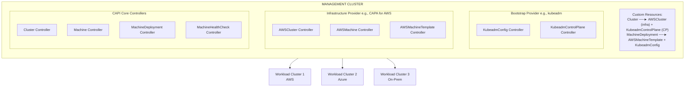
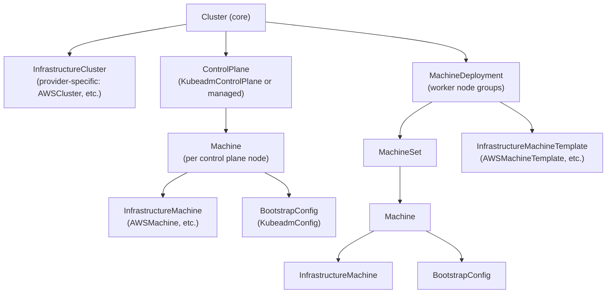
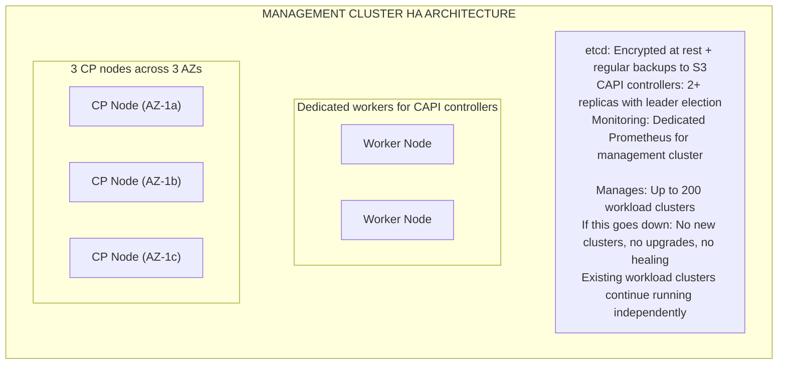
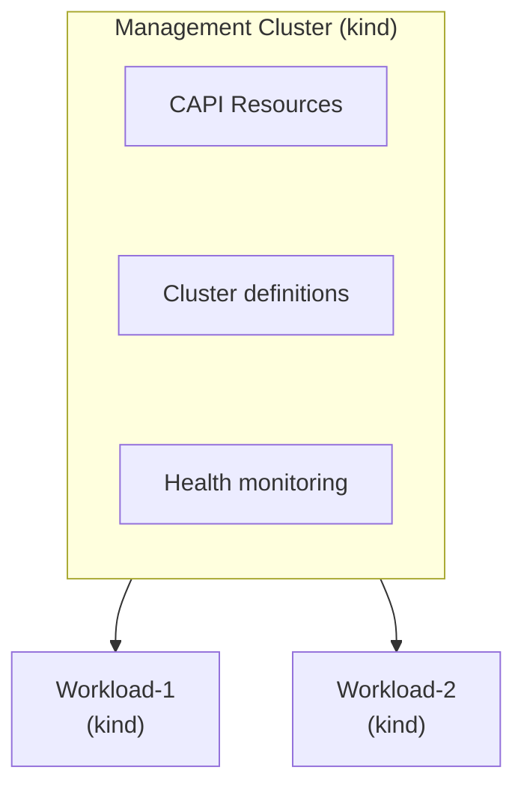

**Complexity**: [COMPLEX] | **Time to Complete**: 3h | **Prerequisites**: Multi-Cloud Fleet Management (Module 10.5), Kubernetes Custom Resources, Infrastructure as Code Basics

## What You'll Be Able to Do

After completing this module, you will be able to:

- **Deploy Cluster API management clusters to provision and lifecycle-manage Kubernetes clusters across multiple clouds**
- **Configure Cluster API providers (CAPA, CAPG, CAPZ) for automated cluster creation on AWS, GCP, and Azure**
- **Implement cluster templates and ClusterClasses for standardized, self-service cluster provisioning**
- **Design multi-cloud provisioning pipelines that use Cluster API with GitOps for declarative cluster fleet management**

---

## Why This Module Matters

In early 2026, a fintech company with 28 Kubernetes clusters across AWS, Azure, and on-premises hit a crisis. Their Kubernetes version matrix looked like a horror movie: 6 clusters on 1.31, 9 on 1.32, 8 on 1.33, 3 on 1.34, and 2 still on 1.30 (which had lost upstream security support three months earlier). Each cluster had been provisioned using a different method: some with eksctl, some with Terraform, some with Azure CLI scripts, and the on-premises clusters with kubeadm. Upgrading a single cluster was a bespoke operation that took 2-4 days of an engineer's time, because each provisioning method had its own upgrade procedure, its own state management, and its own failure modes.

When the Linux Foundation announced that CKA exams would move to Kubernetes 1.35, the platform team calculated that bringing all clusters to 1.35 would take 56-112 engineer-days. Their team had 6 engineers. The math did not work. Two clusters on 1.30 were accumulating unpatched CVEs daily.

Cluster API (CAPI) was designed to solve exactly this problem. Instead of using different tools to manage clusters on different infrastructure, CAPI provides a single, Kubernetes-native API for creating, upgrading, and deleting clusters across any provider. You describe your desired cluster state in a Kubernetes manifest, and CAPI controllers reconcile the real world to match. Upgrading 28 clusters becomes changing 28 YAML files and watching the controllers roll out the changes. In this module, you will learn how Cluster API works, how its provider ecosystem (CAPA for AWS, CAPZ for Azure, CAPG for GCP) maps to each cloud, how to manage the full cluster lifecycle declaratively, and how to scale CAPI for enterprise use.

---

## How Cluster API Works

Cluster API treats Kubernetes clusters the same way Kubernetes treats pods: as declarative resources managed by controllers. You have a **management cluster** that runs the CAPI controllers, and those controllers create and manage **workload clusters** on target infrastructure.

### Architecture Overview

> **Stop and think**: If the management cluster goes down, what happens to the applications running on Workload Cluster 1? How does CAPI's architecture separate lifecycle management from the workload data plane?



### The CAPI Resource Hierarchy



---

## Setting Up a Management Cluster

The management cluster is the control plane for your fleet's lifecycle. It needs to be highly available and carefully managed -- if the management cluster goes down, you cannot create, upgrade, or repair workload clusters.

```bash
# Install clusterctl (the CAPI CLI)
curl -L https://github.com/kubernetes-sigs/cluster-api/releases/latest/download/clusterctl-$(uname -s | tr '[:upper:]' '[:lower:]')-amd64 -o clusterctl
chmod +x clusterctl && sudo mv clusterctl /usr/local/bin/

# Initialize CAPI with the AWS provider
# Prerequisites: AWS credentials configured, kind cluster running
export AWS_REGION=us-east-1
export AWS_ACCESS_KEY_ID=<your-access-key>
export AWS_SECRET_ACCESS_KEY=<your-secret-key>
export AWS_B64ENCODED_CREDENTIALS=$(clusterawsadm bootstrap credentials encode-as-profile)

# Bootstrap IAM resources in AWS (creates CloudFormation stack)
clusterawsadm bootstrap iam create-cloudformation-stack --config bootstrap-config.yaml

# Initialize the management cluster with multiple providers
clusterctl init \
  --infrastructure aws,azure \
  --bootstrap kubeadm \
  --control-plane kubeadm

# Verify providers are installed
clusterctl describe cluster --show-conditions all 2>/dev/null || true
kubectl get providers -A
```

---

## CAPI Providers: CAPA, CAPZ, CAPG

Each cloud provider has a dedicated CAPI infrastructure provider that translates generic CAPI resources into provider-specific API calls.

### CAPA (Cluster API Provider AWS)

CAPA supports two modes: **unmanaged** (kubeadm on EC2) and **managed** (EKS).

```yaml
# AWS EKS Cluster via CAPA (managed mode)
apiVersion: cluster.x-k8s.io/v1beta1
kind: Cluster
metadata:
  name: eks-prod-east
  namespace: fleet
spec:
  clusterNetwork:
    pods:
      cidrBlocks:
        - 10.120.0.0/16
    services:
      cidrBlocks:
        - 10.121.0.0/16
  controlPlaneRef:
    apiVersion: controlplane.cluster.x-k8s.io/v1beta2
    kind: AWSManagedControlPlane
    name: eks-prod-east-cp
  infrastructureRef:
    apiVersion: infrastructure.cluster.x-k8s.io/v1beta2
    kind: AWSManagedCluster
    name: eks-prod-east

---
apiVersion: controlplane.cluster.x-k8s.io/v1beta2
kind: AWSManagedControlPlane
metadata:
  name: eks-prod-east-cp
  namespace: fleet
spec:
  region: us-east-1
  version: v1.35.0
  sshKeyName: eks-key
  eksClusterName: eks-prod-east
  endpointAccess:
    public: true
    private: true
    publicCIDRs:
      - 203.0.113.0/24
  iamAuthenticatorConfig:
    mapRoles:
      - rolearn: arn:aws:iam::123456789012:role/PlatformTeam
        username: platform-admin
        groups:
          - system:masters
  logging:
    apiServer: true
    audit: true
    authenticator: true
    controllerManager: true
    scheduler: true
  encryptionConfig:
    provider: kms
    resources:
      - secrets
  addons:
    - name: vpc-cni
      version: v1.19.2-eksbuild.1
      conflictResolution: overwrite
    - name: coredns
      version: v1.11.4-eksbuild.2
    - name: kube-proxy
      version: v1.35.0-eksbuild.1

---
apiVersion: infrastructure.cluster.x-k8s.io/v1beta2
kind: AWSManagedCluster
metadata:
  name: eks-prod-east
  namespace: fleet

---
# Worker nodes via MachinePool (maps to EKS Managed Node Group)
apiVersion: cluster.x-k8s.io/v1beta1
kind: MachinePool
metadata:
  name: eks-prod-east-workers
  namespace: fleet
spec:
  clusterName: eks-prod-east
  replicas: 5
  template:
    spec:
      clusterName: eks-prod-east
      bootstrap:
        dataSecretName: ""
      infrastructureRef:
        apiVersion: infrastructure.cluster.x-k8s.io/v1beta2
        kind: AWSManagedMachinePool
        name: eks-prod-east-workers

---
apiVersion: infrastructure.cluster.x-k8s.io/v1beta2
kind: AWSManagedMachinePool
metadata:
  name: eks-prod-east-workers
  namespace: fleet
spec:
  eksNodegroupName: general-workers
  instanceType: m6i.xlarge
  scaling:
    minSize: 3
    maxSize: 20
  diskSize: 100
  amiType: AL2023_x86_64_STANDARD
  labels:
    workload-type: general
    environment: production
  updateConfig:
    maxUnavailable: 1
```

### CAPZ (Cluster API Provider Azure)

```yaml
# Azure AKS Cluster via CAPZ (managed mode)
apiVersion: cluster.x-k8s.io/v1beta1
kind: Cluster
metadata:
  name: aks-prod-westeu
  namespace: fleet
spec:
  clusterNetwork:
    services:
      cidrBlocks:
        - 10.130.0.0/16
  controlPlaneRef:
    apiVersion: infrastructure.cluster.x-k8s.io/v1beta1
    kind: AzureManagedControlPlane
    name: aks-prod-westeu
  infrastructureRef:
    apiVersion: infrastructure.cluster.x-k8s.io/v1beta1
    kind: AzureManagedCluster
    name: aks-prod-westeu

---
apiVersion: infrastructure.cluster.x-k8s.io/v1beta1
kind: AzureManagedControlPlane
metadata:
  name: aks-prod-westeu
  namespace: fleet
spec:
  subscriptionID: "00000000-0000-0000-0000-000000000000"
  resourceGroupName: rg-fleet-westeu
  location: westeurope
  version: v1.35.0
  networkPlugin: azure
  networkPolicy: calico
  dnsServiceIP: 10.130.0.10
  aadProfile:
    managed: true
    adminGroupObjectIDs:
      - "aaaaaaaa-bbbb-cccc-dddd-eeeeeeeeeeee"
  sku:
    tier: Standard

---
apiVersion: infrastructure.cluster.x-k8s.io/v1beta1
kind: AzureManagedCluster
metadata:
  name: aks-prod-westeu
  namespace: fleet

---
apiVersion: infrastructure.cluster.x-k8s.io/v1beta1
kind: AzureManagedMachinePool
metadata:
  name: aks-prod-westeu-pool1
  namespace: fleet
spec:
  mode: System
  sku: Standard_D4s_v5
  osDiskSizeGB: 128
  scaling:
    minSize: 3
    maxSize: 15
  enableAutoScaling: true
```

### CAPG (Cluster API Provider GCP)

```yaml
# GCP GKE Cluster via CAPG (managed mode)
apiVersion: cluster.x-k8s.io/v1beta1
kind: Cluster
metadata:
  name: gke-prod-central
  namespace: fleet
spec:
  clusterNetwork:
    pods:
      cidrBlocks:
        - 10.140.0.0/14
    services:
      cidrBlocks:
        - 10.144.0.0/20
  controlPlaneRef:
    apiVersion: infrastructure.cluster.x-k8s.io/v1beta1
    kind: GCPManagedControlPlane
    name: gke-prod-central
  infrastructureRef:
    apiVersion: infrastructure.cluster.x-k8s.io/v1beta1
    kind: GCPManagedCluster
    name: gke-prod-central

---
apiVersion: infrastructure.cluster.x-k8s.io/v1beta1
kind: GCPManagedControlPlane
metadata:
  name: gke-prod-central
  namespace: fleet
spec:
  project: company-prod
  location: us-central1
  clusterName: gke-prod-central
  releaseChannel: REGULAR
  enableAutopilot: false

---
apiVersion: infrastructure.cluster.x-k8s.io/v1beta1
kind: GCPManagedCluster
metadata:
  name: gke-prod-central
  namespace: fleet
spec:
  project: company-prod
  region: us-central1

---
apiVersion: infrastructure.cluster.x-k8s.io/v1beta1
kind: GCPManagedMachinePool
metadata:
  name: gke-prod-central-pool1
  namespace: fleet
spec:
  machineType: e2-standard-4
  diskSizeGb: 100
  diskType: pd-ssd
  scaling:
    minCount: 3
    maxCount: 15
  management:
    autoUpgrade: true
    autoRepair: true
```

---

## Cluster Lifecycle Operations

### Upgrading a Cluster

> **Pause and predict**: If you manually edit a `Machine` object using `kubectl edit` to change its instance type directly, what will the CAPI controllers do during the next reconciliation loop?

The primary advantage of CAPI is declarative upgrades. Change the version in the manifest, and the controller handles the rolling upgrade.

```bash
# Upgrade EKS cluster from 1.34 to 1.35
kubectl patch awsmanagedcontrolplane eks-prod-east-cp -n fleet \
  --type merge \
  -p '{"spec":{"version":"v1.35.0"}}'

# Watch the upgrade progress
kubectl get cluster eks-prod-east -n fleet -w

# Upgrade worker nodes (they follow after control plane)
kubectl patch awsmanagedmachinepool eks-prod-east-workers -n fleet \
  --type merge \
  -p '{"spec":{"updateConfig":{"maxUnavailable":2}}}'

# Monitor machine rollout
kubectl get machines -n fleet -l cluster.x-k8s.io/cluster-name=eks-prod-east
```

### Fleet-Wide Upgrade Script

```bash
#!/bin/bash
# upgrade-fleet.sh - Upgrade all clusters to a target version
TARGET_VERSION="v1.35.0"
NAMESPACE="fleet"

echo "=== Fleet Upgrade Plan ==="
echo "Target version: $TARGET_VERSION"
echo ""

# List all clusters and their current versions
for CLUSTER in $(kubectl get clusters -n $NAMESPACE -o jsonpath='{.items[*].metadata.name}'); do
  CURRENT=$(kubectl get cluster $CLUSTER -n $NAMESPACE -o jsonpath='{.spec.topology.version}' 2>/dev/null)
  if [ -z "$CURRENT" ]; then
    # Try managed control plane
    CP_REF=$(kubectl get cluster $CLUSTER -n $NAMESPACE -o jsonpath='{.spec.controlPlaneRef.name}')
    CP_KIND=$(kubectl get cluster $CLUSTER -n $NAMESPACE -o jsonpath='{.spec.controlPlaneRef.kind}')
    CURRENT=$(kubectl get $CP_KIND $CP_REF -n $NAMESPACE -o jsonpath='{.spec.version}' 2>/dev/null)
  fi

  if [ "$CURRENT" != "$TARGET_VERSION" ]; then
    echo "  UPGRADE NEEDED: $CLUSTER ($CURRENT → $TARGET_VERSION)"
  else
    echo "  UP TO DATE: $CLUSTER ($CURRENT)"
  fi
done

echo ""
read -p "Proceed with upgrades? (y/n) " CONFIRM
if [ "$CONFIRM" != "y" ]; then exit 0; fi

# Execute upgrades
for CLUSTER in $(kubectl get clusters -n $NAMESPACE -o jsonpath='{.items[*].metadata.name}'); do
  CP_REF=$(kubectl get cluster $CLUSTER -n $NAMESPACE -o jsonpath='{.spec.controlPlaneRef.name}')
  CP_KIND=$(kubectl get cluster $CLUSTER -n $NAMESPACE -o jsonpath='{.spec.controlPlaneRef.kind}')
  CURRENT=$(kubectl get $CP_KIND $CP_REF -n $NAMESPACE -o jsonpath='{.spec.version}')

  if [ "$CURRENT" != "$TARGET_VERSION" ]; then
    echo "Upgrading $CLUSTER..."
    kubectl patch $CP_KIND $CP_REF -n $NAMESPACE \
      --type merge \
      -p "{\"spec\":{\"version\":\"$TARGET_VERSION\"}}"
    echo "  Upgrade initiated for $CLUSTER"
  fi
done
```

### MachineHealthCheck: Auto-Remediation

CAPI can automatically detect and replace unhealthy nodes:

```yaml
apiVersion: cluster.x-k8s.io/v1beta1
kind: MachineHealthCheck
metadata:
  name: eks-prod-east-health
  namespace: fleet
spec:
  clusterName: eks-prod-east
  maxUnhealthy: 40%
  nodeStartupTimeout: 10m
  selector:
    matchLabels:
      cluster.x-k8s.io/cluster-name: eks-prod-east
  unhealthyConditions:
    - type: Ready
      status: "False"
      timeout: 5m
    - type: Ready
      status: Unknown
      timeout: 5m
    - type: MemoryPressure
      status: "True"
      timeout: 3m
    - type: DiskPressure
      status: "True"
      timeout: 3m
  remediationTemplate:
    apiVersion: infrastructure.cluster.x-k8s.io/v1beta2
    kind: AWSMachineTemplate
    name: eks-prod-east-remediation
```

---

## Immutable Node Infrastructure and BYOI

### Bring Your Own Image (BYOI)

Enterprise clusters often need custom node images with pre-installed agents, specific kernel modules, or hardened OS configurations.

> **Stop and think**: Why is baking agents into the custom machine image (BYOI) often preferred over using a DaemonSet for security tools like Falco?

```bash
# Build a custom AMI for EKS nodes using Packer
cat <<'EOF' > eks-node.pkr.hcl
packer {
  required_plugins {
    amazon = {
      version = ">= 1.3.0"
      source  = "github.com/hashicorp/amazon"
    }
  }
}

source "amazon-ebs" "eks-node" {
  ami_name      = "eks-node-custom-{{timestamp}}"
  instance_type = "m6i.large"
  region        = "us-east-1"

  source_ami_filter {
    filters = {
      name                = "amazon-eks-node-1.35-*"
      virtualization-type = "hvm"
      root-device-type    = "ebs"
    }
    owners      = ["602401143452"]  # Amazon EKS AMI account
    most_recent = true
  }

  ssh_username = "ec2-user"
}

build {
  sources = ["source.amazon-ebs.eks-node"]

  # Install compliance agents
  provisioner "shell" {
    inline = [
      "sudo yum install -y amazon-ssm-agent",
      "sudo systemctl enable amazon-ssm-agent",

      # Install Falco for runtime security
      "sudo rpm --import https://falco.org/repo/falcosecurity-packages.asc",
      "sudo curl -s -o /etc/yum.repos.d/falcosecurity.repo https://falco.org/repo/rpm/falcosecurity.repo",
      "sudo yum install -y falco",

      # CIS hardening
      "sudo sysctl -w net.ipv4.conf.all.send_redirects=0",
      "sudo sysctl -w net.ipv4.conf.default.send_redirects=0",
      "echo 'net.ipv4.conf.all.send_redirects = 0' | sudo tee -a /etc/sysctl.d/99-cis.conf",

      # Pre-pull common images to speed up pod startup
      "sudo ctr images pull docker.io/library/nginx:1.27.3",
      "sudo ctr images pull docker.io/library/redis:7.4"
    ]
  }
}
EOF

packer build eks-node.pkr.hcl
```

```yaml
# Reference the custom AMI in CAPI
apiVersion: infrastructure.cluster.x-k8s.io/v1beta2
kind: AWSMachineTemplate
metadata:
  name: custom-node-template
  namespace: fleet
spec:
  template:
    spec:
      instanceType: m6i.xlarge
      ami:
        id: ami-0abc123def456789  # Your custom AMI
      iamInstanceProfile: nodes.cluster-api-provider-aws.sigs.k8s.io
      sshKeyName: eks-key
      rootVolume:
        size: 100
        type: gp3
        encrypted: true
```

---

## Scaling CAPI for Enterprise

### Management Cluster High Availability

> **Pause and predict**: If the management cluster requires etcd to store all CAPI objects, what happens if etcd corruption occurs and you have no backups?



### Management Cluster Lifecycle: Clusterctl Move

When you need to upgrade or replace the management cluster itself, `clusterctl move` transfers all CAPI resources to a new management cluster:

```bash
# Create a new management cluster
kind create cluster --name new-mgmt

# Initialize CAPI on the new cluster
clusterctl init --infrastructure aws,azure \
  --bootstrap kubeadm --control-plane kubeadm

# Move all CAPI objects from old to new management cluster
clusterctl move \
  --to-kubeconfig new-mgmt.kubeconfig \
  --namespace fleet

# Verify all clusters are now managed by the new management cluster
kubectl --kubeconfig new-mgmt.kubeconfig get clusters -n fleet
```

### Multi-Tenancy in CAPI

For enterprises with multiple teams managing their own clusters:

> **Stop and think**: How does namespace isolation in the management cluster translate to the workload clusters? Can Team Alpha manage Team Beta's clusters if they are in different namespaces?

```yaml
# Namespace per team with RBAC
apiVersion: v1
kind: Namespace
metadata:
  name: team-alpha-clusters
  labels:
    team: alpha
---
apiVersion: rbac.authorization.k8s.io/v1
kind: Role
metadata:
  name: cluster-operator
  namespace: team-alpha-clusters
rules:
  - apiGroups: ["cluster.x-k8s.io"]
    resources: ["clusters", "machinedeployments", "machinepools"]
    verbs: ["get", "list", "watch", "create", "update", "patch", "delete"]
  - apiGroups: ["infrastructure.cluster.x-k8s.io"]
    resources: ["awsmanagedclusters", "awsmanagedcontrolplanes", "awsmanagedmachinepools"]
    verbs: ["get", "list", "watch", "create", "update", "patch", "delete"]
  - apiGroups: ["controlplane.cluster.x-k8s.io"]
    resources: ["*"]
    verbs: ["get", "list", "watch", "create", "update", "patch", "delete"]
---
apiVersion: rbac.authorization.k8s.io/v1
kind: RoleBinding
metadata:
  name: team-alpha-cluster-operators
  namespace: team-alpha-clusters
subjects:
  - kind: Group
    name: team-alpha-platform
    apiGroup: rbac.authorization.k8s.io
roleRef:
  kind: Role
  name: cluster-operator
  apiGroup: rbac.authorization.k8s.io
```

---

## Did You Know?

1. Cluster API manages over 15,000 production clusters globally as of 2025. The largest known CAPI deployment is at a hyperscaler that uses a single management cluster to manage 2,800 workload clusters across 40 regions. The management cluster itself runs on 12 nodes with 384GB of RAM to handle the etcd load from all the CAPI custom resources.

2. The `clusterctl move` command was one of the most requested features in CAPI history. Before it existed, upgrading the management cluster required a terrifying dance of backing up etcd, rebuilding the cluster, and restoring -- and any mistake meant losing the ability to manage all workload clusters. The move command was added in CAPI v0.4 (2021) and reduced management cluster migrations from a 4-hour operation to a 15-minute operation.

3. CAPI's MachineHealthCheck was inspired by Kubernetes' own node controller but goes further. The Kubernetes node controller can mark nodes as NotReady but cannot replace them -- that is left to the cloud provider's auto-scaling group or a human operator. CAPI's MachineHealthCheck detects the unhealthy node AND triggers replacement by creating a new Machine object and draining the old one. Average time from node failure to replacement: 8-12 minutes with CAPI, versus "whenever someone notices" without it.

4. The CAPI project has 19 infrastructure providers as of 2025, covering everything from major clouds (AWS, Azure, GCP, IBM) to virtualization platforms (VMware, Nutanix, OpenStack) to bare metal (MAAS, Tinkerbell) to edge (KubeVirt, Harvester). The provider ecosystem is the largest of any Kubernetes SIG project, with over 400 contributors across all providers.

---

## Common Mistakes

| Mistake | Why It Happens | How to Fix It |
| :--- | :--- | :--- |
| **Running the management cluster on the same infrastructure it manages** | Convenience. "Let us run the CAPI management cluster on EKS so it is managed." But if EKS has an outage, you cannot repair your EKS clusters. | Run the management cluster on a different infrastructure than your primary workload clusters. Use kind on a dedicated VM, or a different cloud provider. |
| **Not backing up the management cluster's etcd** | "It is just a management plane, the workload clusters run independently." True, but without etcd, you lose all cluster definitions and cannot upgrade or repair any cluster. | Automated etcd snapshots every 6 hours to durable storage (S3, GCS). Test restores quarterly. |
| **Manually editing CAPI resources** | Engineer uses `kubectl edit` to change a machine spec instead of updating the template and rolling out. The next reconciliation reverts the change. | Treat CAPI resources as immutable templates. All changes go through the template/spec, not direct editing. Use GitOps for CAPI manifests. |
| **No MachineHealthCheck configured** | "Our nodes never fail." Until they do, and the unhealthy node sits there for days because nobody noticed. | Always configure MachineHealthCheck with reasonable timeouts (5 minutes for NotReady, 3 minutes for pressure conditions). Set maxUnhealthy to prevent cascading replacements. |
| **Over-provisioning the management cluster** | "More resources means more reliable." But a management cluster managing 10 workload clusters does not need 16 nodes. | Size the management cluster based on workload cluster count. Rule of thumb: 3 CP + 2 workers handles up to 50 workload clusters. Scale beyond that only when etcd latency increases. |
| **Mixing CAPI and manual cluster management** | Some clusters managed by CAPI, others by Terraform/eksctl. Different upgrade procedures, different state tracking, different failure modes. | Commit to CAPI for all clusters or none. Partial adoption creates the worst of both worlds -- you need expertise in both systems and neither covers everything. |

---

## Quiz

<details>
<summary>Question 1: You are the platform lead for a financial services company. A critical network switch failure in your primary data center brings down the CAPI management cluster entirely. Your 15 workload clusters running on AWS and Azure are still online. The network team says the management cluster will be offline for 12 hours. What is the immediate impact on the applications running in your workload clusters?</summary>

**There is no immediate impact on the applications running in the workload clusters.**
The management cluster is only responsible for cluster lifecycle operations such as provisioning new clusters, executing rolling upgrades, and auto-remediating unhealthy nodes via the MachineHealthCheck controller. Because the CAPI controllers run out-of-band on the management cluster, their absence does not affect the data plane or control plane of the existing workload clusters. Your applications will continue to run, services will route traffic, and native Kubernetes features like Horizontal Pod Autoscalers within the workload clusters will function normally. However, during the 12-hour outage, you will be unable to provision new node groups, scale existing groups (if CAPI manages scaling), or automatically replace nodes that fail.
</details>

<details>
<summary>Question 2: Your team needs to provision a new set of worker nodes for an EKS cluster using CAPI. You require the cloud provider to handle the actual instance lifecycle, including rolling updates and health management, rather than having CAPI manage each node individually. Which CAPI resource should you configure for this scenario, and why?</summary>

**You should configure a MachinePool rather than a MachineDeployment.**
A MachineDeployment creates individual Machine objects that CAPI manages one by one, which gives you maximum control but bypasses the cloud provider's native scaling and lifecycle mechanisms. In contrast, a MachinePool delegates node management to the infrastructure provider's native services, such as EKS Managed Node Groups, AKS Node Pools, or GCP Managed Instance Groups. By using a MachinePool, CAPI simply specifies the desired node count and configuration, while the cloud provider handles the underlying instances. This approach is significantly more efficient for managed Kubernetes services because it leverages the provider's built-in optimizations for rolling updates and node health management.
</details>

<details>
<summary>Question 3: Your organization manages 28 Kubernetes clusters across multiple clouds. A critical CVE in Kubernetes 1.34 is announced, requiring an immediate upgrade to 1.35. Before adopting CAPI, this process took your team over 100 engineer-hours. Walk through how your team will execute this upgrade using CAPI, and explain why the effort is drastically reduced.</summary>

**You will update the `spec.version` field to `v1.35.0` in the control plane object for each cluster, typically by modifying the declarative YAML manifests in your Git repository.**
Once the manifests are updated and applied to the management cluster, the CAPI controllers automatically orchestrate the upgrade process. The controllers handle the complex choreography of replacing control plane nodes one by one (ensuring quorum is maintained) and then rolling out new worker nodes via MachineDeployments or MachinePools. The human effort is reduced to simply changing the version strings in the infrastructure-as-code repository and monitoring the rollout dashboards. This declarative approach eliminates the need to run bespoke, imperative upgrade scripts for different environments, reducing the required effort from hundreds of hours to just a few hours of monitoring.
</details>

<details>
<summary>Question 4: You are migrating your CAPI management cluster from an on-premises VM to a highly available EKS cluster to improve reliability. You have 50 production workload clusters currently managed by the on-premises cluster. How do you transfer control of these workload clusters to the new management cluster without causing downtime for the workloads?</summary>

**You will use the `clusterctl move` command to transfer the CAPI resources to the new management cluster.**
First, you initialize CAPI on the new EKS management cluster. Then, you execute `clusterctl move --to-kubeconfig new-mgmt.kubeconfig`, which pauses reconciliation on the old cluster and safely migrates all CAPI objects (such as Clusters, Machines, and provider-specific resources) to the new cluster. This operation is completely non-disruptive to the workload clusters because they operate independently of the management cluster's location. The migration ensures that state is preserved and prevents split-brain scenarios where two management clusters attempt to reconcile the same workload clusters simultaneously.
</details>

<details>
<summary>Question 5: Your security team mandates that every Kubernetes node must boot with a CIS-hardened OS, the corporate root CA, and a specific version of the Falco agent pre-installed. They reject the idea of using DaemonSets to install these post-boot due to the security window before the pods start. How do you implement this requirement using CAPI?</summary>

**You will implement a Bring Your Own Image (BYOI) pipeline using a tool like Packer to bake the required components into a custom machine image, then reference that image in your CAPI templates.**
By building a custom AMI or VM image that includes the CIS-hardened OS, the root CA, and the Falco agent, you ensure that nodes are fully compliant the moment they boot. Once the image is built, you update the infrastructure-specific machine template (e.g., `AWSMachineTemplate`) in your management cluster with the new image ID. CAPI will then use this custom image for all new nodes it provisions. When you need to update the agent or the OS, you simply build a new image, update the CAPI template, and the controllers will perform a rolling replacement of the nodes to apply the new image fleet-wide.
</details>

<details>
<summary>Question 6: To reduce infrastructure costs, a junior engineer suggests running the CAPI management cluster as a workload on your largest production EKS cluster. Explain why this architectural decision introduces an unacceptable operational risk.</summary>

**This architecture creates a circular dependency and a critical correlated failure risk.**
If the AWS region hosting your production EKS cluster experiences an outage, or if the EKS cluster itself goes down, you lose the management cluster at the exact moment you need it to repair or rebuild your infrastructure. Without the management cluster, you cannot provision new clusters in a different region, auto-remediate failed nodes via MachineHealthChecks, or perform lifecycle operations to recover the environment. By coupling the management plane to the data plane it manages, you create a scenario where a single failure domain can compromise your entire recovery strategy. Best practices dictate that the management cluster must be decoupled from the infrastructure it manages, typically by running it on a different cloud provider, a dedicated highly available VM (using `kind` or `k3s`), or an on-premises environment.
</details>

---

## Hands-On Exercise: Manage Cluster Lifecycle with CAPI (Simulated)

In this exercise, you will simulate CAPI operations using kind clusters representing the management and workload layers. You will practice cluster creation, upgrades, health monitoring, and management cluster migration.

**What you will build:**



### Task 1: Create the Management and Workload Clusters

<details>
<summary>Solution</summary>

```bash
# Create management cluster
kind create cluster --name capi-mgmt

# Create workload clusters (simulating CAPI-provisioned clusters)
kind create cluster --name capi-workload-1
kind create cluster --name capi-workload-2

# Verify all clusters
for C in capi-mgmt capi-workload-1 capi-workload-2; do
  echo "=== $C ==="
  kubectl --context kind-$C get nodes -o wide
done
```

</details>

### Task 2: Create CAPI-Style Resource Definitions

<details>
<summary>Solution</summary>

```bash
# Simulate CAPI by creating cluster inventory resources on the management cluster
for WL_CLUSTER in capi-workload-1 capi-workload-2; do
  VERSION=$(kubectl --context kind-$WL_CLUSTER get nodes -o jsonpath='{.items[0].status.nodeInfo.kubeletVersion}')

  cat <<EOF | kubectl --context kind-capi-mgmt apply -f -
apiVersion: v1
kind: ConfigMap
metadata:
  name: cluster-${WL_CLUSTER}
  namespace: default
  labels:
    cluster-api.cattle.io/cluster-name: ${WL_CLUSTER}
    cluster-type: workload
data:
  cluster-name: "${WL_CLUSTER}"
  kubernetes-version: "${VERSION}"
  desired-version: "v1.35.0"
  provider: "kind"
  region: "local"
  status: "provisioned"
  control-plane-nodes: "1"
  worker-nodes: "0"
  created-at: "$(date -u +%Y-%m-%dT%H:%M:%SZ)"
  health-check-interval: "60s"
  max-unhealthy-percentage: "40"
EOF

  echo "Registered cluster: $WL_CLUSTER (version: $VERSION)"
done

# View the cluster inventory
echo ""
echo "=== Cluster Inventory ==="
kubectl --context kind-capi-mgmt get configmaps -l cluster-type=workload \
  -o custom-columns=NAME:.metadata.name,VERSION:.data.kubernetes-version,STATUS:.data.status
```

</details>

### Task 3: Implement Health Monitoring

<details>
<summary>Solution</summary>

```bash
cat <<'SCRIPT' > /tmp/capi-health-check.sh
#!/bin/bash
echo "=== CAPI Health Check ==="
echo "Time: $(date -u +%Y-%m-%dT%H:%M:%SZ)"
echo ""

MGMT_CTX="kind-capi-mgmt"

for CM in $(kubectl --context $MGMT_CTX get configmaps -l cluster-type=workload -o jsonpath='{.items[*].metadata.name}'); do
  CLUSTER_NAME=$(kubectl --context $MGMT_CTX get configmap $CM -o jsonpath='{.data.cluster-name}')
  CTX="kind-${CLUSTER_NAME}"

  echo "--- Cluster: $CLUSTER_NAME ---"

  # Check if cluster is reachable
  if kubectl --context $CTX get nodes &>/dev/null; then
    echo "  Connectivity: OK"

    # Check node health
    TOTAL_NODES=$(kubectl --context $CTX get nodes --no-headers | wc -l | tr -d ' ')
    READY_NODES=$(kubectl --context $CTX get nodes --no-headers | grep " Ready" | wc -l | tr -d ' ')
    NOT_READY=$((TOTAL_NODES - READY_NODES))

    if [ "$NOT_READY" -eq 0 ]; then
      echo "  Nodes: $READY_NODES/$TOTAL_NODES Ready [HEALTHY]"
      kubectl --context $MGMT_CTX patch configmap $CM \
        --type merge -p '{"data":{"status":"healthy","last-check":"'$(date -u +%Y-%m-%dT%H:%M:%SZ)'"}}'
    else
      echo "  Nodes: $READY_NODES/$TOTAL_NODES Ready [DEGRADED - $NOT_READY unhealthy]"
      kubectl --context $MGMT_CTX patch configmap $CM \
        --type merge -p '{"data":{"status":"degraded","last-check":"'$(date -u +%Y-%m-%dT%H:%M:%SZ)'"}}'
    fi

    # Check system pods
    SYSTEM_PODS=$(kubectl --context $CTX get pods -n kube-system --no-headers | wc -l | tr -d ' ')
    RUNNING_SYSTEM=$(kubectl --context $CTX get pods -n kube-system --no-headers --field-selector=status.phase=Running | wc -l | tr -d ' ')
    echo "  System Pods: $RUNNING_SYSTEM/$SYSTEM_PODS Running"

  else
    echo "  Connectivity: FAILED [UNREACHABLE]"
    kubectl --context $MGMT_CTX patch configmap $CM \
      --type merge -p '{"data":{"status":"unreachable","last-check":"'$(date -u +%Y-%m-%dT%H:%M:%SZ)'"}}'
  fi
  echo ""
done

# Summary
echo "=== Fleet Health Summary ==="
kubectl --context $MGMT_CTX get configmaps -l cluster-type=workload \
  -o custom-columns=CLUSTER:.data.cluster-name,STATUS:.data.status,VERSION:.data.kubernetes-version,LAST_CHECK:.data.last-check
SCRIPT

chmod +x /tmp/capi-health-check.sh
bash /tmp/capi-health-check.sh
```

</details>

### Task 4: Simulate a Cluster Upgrade

<details>
<summary>Solution</summary>

```bash
# Simulate updating the desired version (in real CAPI, this triggers an upgrade)
echo "=== Simulating Upgrade Request ==="
kubectl --context kind-capi-mgmt patch configmap cluster-capi-workload-1 \
  --type merge \
  -p '{"data":{"desired-version":"v1.35.0","status":"upgrading"}}'

echo "Upgrade request registered:"
kubectl --context kind-capi-mgmt get configmap cluster-capi-workload-1 \
  -o custom-columns=CLUSTER:.data.cluster-name,CURRENT:.data.kubernetes-version,DESIRED:.data.desired-version,STATUS:.data.status

# Simulate upgrade completion
sleep 3
echo ""
echo "=== Simulating Upgrade Completion ==="
kubectl --context kind-capi-mgmt patch configmap cluster-capi-workload-1 \
  --type merge \
  -p '{"data":{"kubernetes-version":"v1.35.0","status":"healthy"}}'

echo "Upgrade complete:"
kubectl --context kind-capi-mgmt get configmaps -l cluster-type=workload \
  -o custom-columns=CLUSTER:.data.cluster-name,VERSION:.data.kubernetes-version,STATUS:.data.status
```

</details>

### Task 5: Simulate Management Cluster Migration

<details>
<summary>Solution</summary>

```bash
# Create a "new" management cluster
kind create cluster --name capi-mgmt-new

echo "=== Migrating CAPI resources (simulated clusterctl move) ==="

# Export all cluster definitions from old management cluster
kubectl --context kind-capi-mgmt get configmaps -l cluster-type=workload -o yaml > /tmp/capi-export.yaml

# Import into new management cluster
kubectl --context kind-capi-mgmt-new apply -f /tmp/capi-export.yaml

echo ""
echo "=== Verification: Clusters on NEW management cluster ==="
kubectl --context kind-capi-mgmt-new get configmaps -l cluster-type=workload \
  -o custom-columns=CLUSTER:.data.cluster-name,VERSION:.data.kubernetes-version,STATUS:.data.status

echo ""
echo "=== Old management cluster (would be decommissioned) ==="
kubectl --context kind-capi-mgmt get configmaps -l cluster-type=workload \
  -o custom-columns=CLUSTER:.data.cluster-name,VERSION:.data.kubernetes-version,STATUS:.data.status

echo ""
echo "Migration complete. In real CAPI, 'clusterctl move' handles this."
```

</details>

### Clean Up

```bash
kind delete cluster --name capi-mgmt
kind delete cluster --name capi-mgmt-new
kind delete cluster --name capi-workload-1
kind delete cluster --name capi-workload-2
rm /tmp/capi-health-check.sh /tmp/capi-export.yaml
```

### Success Criteria

- [ ] I created a management cluster and two workload clusters
- [ ] I registered workload clusters in the management cluster's inventory
- [ ] I implemented a health check that monitors all workload clusters
- [ ] I simulated a cluster version upgrade through the management cluster
- [ ] I simulated a management cluster migration (like clusterctl move)
- [ ] I can explain the CAPI resource hierarchy (Cluster, Machine, MachineDeployment)
- [ ] I can describe the difference between CAPI managed and unmanaged modes

---

## Next Module

With infrastructure provisioning automated, it is time to connect services across those clusters. Head to [Module 10.7: Multi-Cloud Service Mesh (Istio Multi-Cluster)](../module-10.7-multi-cloud-mesh/) to learn how Istio's multi-cluster topologies enable cross-cloud service discovery, failover, and mTLS with a unified root of trust.