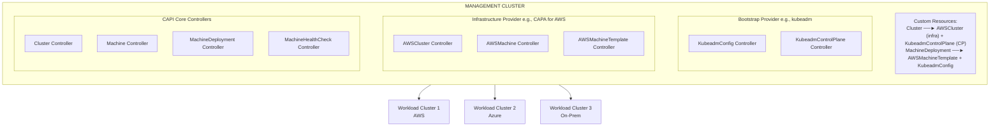
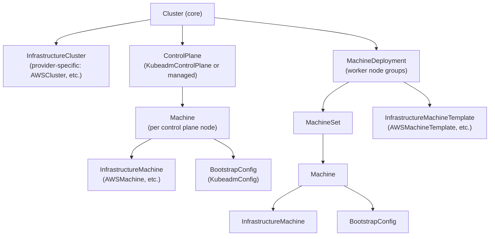
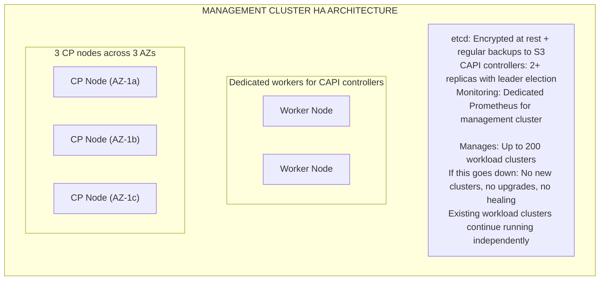
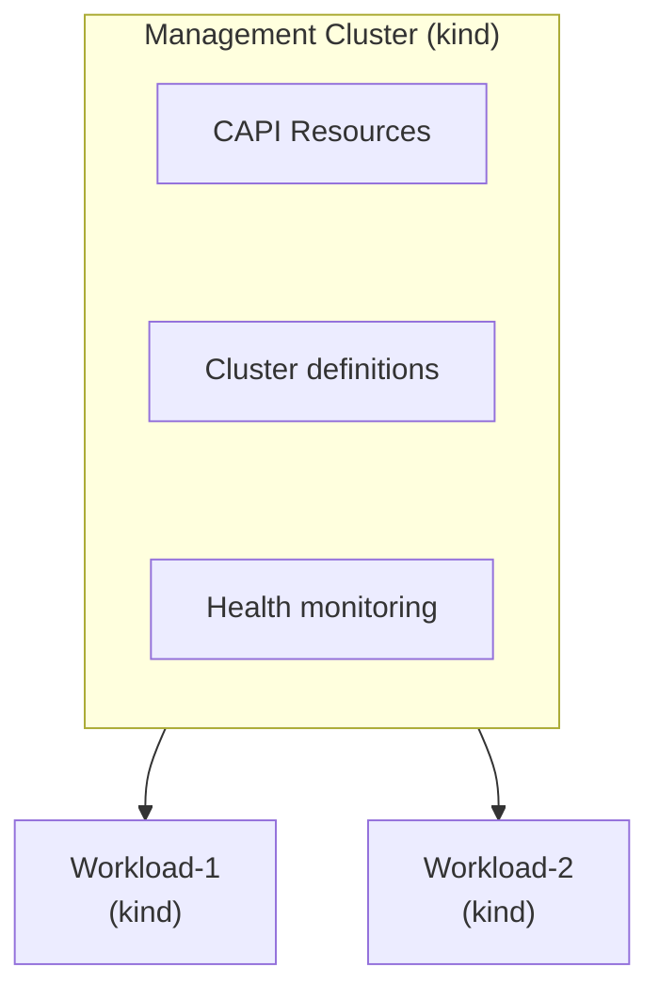

**Complexity**: [COMPLEX] | **Time to Complete**: 3h | **Prerequisites**: Multi-Cloud Fleet Management (Module 10.5), Kubernetes Custom Resources, Infrastructure as Code Basics

## What You Will Be Able to Do

After completing this extensive technical module, you will be equipped to:

- **Design** highly available Cluster API management cluster architectures to orchestrate Kubernetes fleets securely across multiple cloud providers.
- **Implement** declarative, multi-cloud cluster provisioning pipelines utilizing Cluster API providers (CAPA, CAPZ, CAPG) for AWS, Azure, and GCP environments.
- **Execute** zero-downtime, fleet-wide Kubernetes version upgrades by manipulating declarative Cluster API resource states and managing rollout strategies.
- **Diagnose** and **remediate** node-level infrastructure failures automatically by configuring advanced MachineHealthCheck and remediation templates.
- **Evaluate** custom machine image strategies (Bring Your Own Image) to enforce organizational compliance standards and embed security agents prior to node boot.

---

## Why This Module Matters

As organizations accumulate Kubernetes clusters across multiple clouds and provisioning stacks, version skew and inconsistent lifecycle tooling can turn routine upgrades into slow, high-risk operations.

When upgrade procedures diverge across clusters, urgent security patching can overwhelm a small platform team and leave older environments exposed longer than is acceptable.

Cluster API (CAPI) was engineered specifically by the Kubernetes Special Interest Group (SIG) Cluster Lifecycle to solve this exact enterprise scaling problem. Instead of forcing teams to juggle disparate infrastructure-as-code tools to manage clusters on varying cloud providers, [Cluster API provides a unified, Kubernetes-native API for creating, upgrading, configuring, and deleting clusters across any underlying infrastructure](https://github.com/kubernetes-sigs/cluster-api). By leveraging the declarative nature of Kubernetes, you describe your desired cluster state in standard YAML manifests, and the CAPI controllers autonomously reconcile the physical infrastructure to match that state. Upgrading twenty-eight clusters transforms from a multi-week ordeal of imperative scripting into a simple GitOps commit that updates twenty-eight YAML files, allowing the automated controllers to handle the complex choreography of rolling out nodes. In this module, you will completely master the internal mechanics of Cluster API, enabling you to orchestrate massive global fleets with minimal operational overhead.

---

## The Architecture of Cluster API

Cluster API elevates the core concepts of Kubernetes to the infrastructure level. Just as Kubernetes manages the lifecycle of Pods across worker nodes, Cluster API manages the lifecycle of entire Kubernetes clusters across physical or virtual infrastructure. To achieve this, CAPI introduces a strict separation of concerns between the **management cluster** and the **workload clusters**.

The management cluster is a dedicated Kubernetes cluster whose sole purpose is to run the CAPI controllers and store the Custom Resource Definitions (CRDs) that define your fleet. The workload clusters are the actual target environments where your business applications reside.

### The Separation of Lifecycle and Workload

The most critical architectural principle of Cluster API is the isolation of control planes. The management cluster operates out-of-band relative to the workload clusters. It continuously observes the declared state of the infrastructure (e.g., "I want an EKS cluster with five worker nodes") and makes API calls to the target cloud provider to ensure reality matches the declaration.

> **Stop and think**: If the management cluster goes down, what happens to the applications running on Workload Cluster 1? How does CAPI's architecture separate lifecycle management from the workload data plane?



Within the management cluster, the controller ecosystem is divided into three distinct layers:
1. **Core Providers**: These controllers manage the generic representations of infrastructure, such as `Cluster`, `Machine`, and `MachineDeployment` resources. They are entirely agnostic to the underlying cloud provider.
2. **Infrastructure Providers**: These specialized controllers translate the generic CAPI requests into specific API calls for a given cloud (e.g., translating a generic `Machine` request into an `AWSMachine` request that provisions an EC2 instance).
3. **Bootstrap Providers**: These controllers are responsible for transforming a raw, newly booted virtual machine or bare-metal server into a fully functioning Kubernetes node. The most common bootstrap provider utilizes `kubeadm` to join nodes to the cluster securely.

### The Resource Hierarchy

To fully grasp how CAPI operates, you must understand its Custom Resource hierarchy. CAPI brilliantly mirrors the standard Kubernetes workload hierarchy. Just as a `Deployment` manages `ReplicaSets`, which in turn manage individual `Pods`, CAPI utilizes a `MachineDeployment` to manage `MachineSets`, which in turn manage individual infrastructure `Machines`.



When you define a `Cluster` resource, you must provide references to an `InfrastructureCluster` (which dictates the provider-specific networking, VPCs, and load balancers) and a `ControlPlane` (which dictates how the API server and etcd components are constructed). Similarly, worker nodes are defined via a `MachineDeployment`, which references an `InfrastructureMachineTemplate` to define the compute instance size, and a `BootstrapConfig` to define how the node joins the cluster upon booting.

---

## Setting Up a Management Cluster

Before you can orchestrate a fleet, you must establish your central management cluster. A common paradox with Cluster API is the "chicken-and-egg" problem: you need a Kubernetes cluster to run the controllers that create Kubernetes clusters. 

To solve this, operators typically leverage an ephemeral bootstrap cluster using a lightweight tool like `kind` (Kubernetes IN Docker) running on an administrative workstation or a CI/CD runner. Once the ephemeral `kind` cluster is operational, you use the `clusterctl` CLI tool to inject the CAPI controllers into it. This temporary management cluster can then provision a highly available, permanent management cluster in the cloud. Once the permanent cluster exists, you use `clusterctl move` to migrate the controller state to the permanent home, and destroy the ephemeral bootstrap cluster.

Below, we detail the initial setup phase utilizing an AWS environment as our target infrastructure.

```bash
# Install clusterctl (the CAPI CLI)
curl -L https://github.com/kubernetes-sigs/cluster-api/releases/latest/download/clusterctl-$(uname -s | tr '[:upper:]' '[:lower:]')-amd64 -o clusterctl
chmod +x clusterctl && sudo mv clusterctl /usr/local/bin/

# Initialize CAPI with the AWS provider
# Prerequisites: AWS credentials configured, kind cluster running
export AWS_REGION=us-east-1
export AWS_ACCESS_KEY_ID=<your-access-key>
export AWS_SECRET_ACCESS_KEY=<your-secret-key>
export AWS_B64ENCODED_CREDENTIALS=$(clusterawsadm bootstrap credentials encode-as-profile)

# Bootstrap IAM resources in AWS (creates CloudFormation stack)
clusterawsadm bootstrap iam create-cloudformation-stack --config bootstrap-config.yaml

# Initialize the management cluster with multiple providers
clusterctl init \
  --infrastructure aws,azure \
  --bootstrap kubeadm \
  --control-plane kubeadm

# Verify providers are installed
clusterctl describe cluster --show-conditions all 2>/dev/null || true
kubectl get providers -A
```

The `clusterawsadm` command is a dedicated utility provided by the AWS CAPI community that idempotently configures the necessary Identity and Access Management (IAM) roles and policies in your AWS account. Without these roles, the controllers in your management cluster would lack the authorization required to spin up EC2 instances or configure Elastic Load Balancers.

---

## Multi-Cloud Infrastructure Providers

The true power of Cluster API lies in its modular provider ecosystem. While the core API remains consistent, the infrastructure providers handle the complex translation logic required to interact with AWS, Azure, GCP, VMware, and dozens of other environments. Modern enterprise architectures heavily favor utilizing Managed Kubernetes offerings (like EKS, AKS, and GKE) rather than building raw clusters from virtual machines. CAPI fully supports managed offerings, streamlining the definitions significantly.

### CAPA (Cluster API Provider AWS)

When provisioning an Amazon EKS cluster, you utilize CAPA in "managed mode." This mode delegating the control plane management to AWS, while CAPI handles the declarative desired state of the infrastructure. The configuration requires coordinating several distinct Custom Resources.

```yaml
# AWS EKS Cluster via CAPA (managed mode)
apiVersion: cluster.x-k8s.io/v1beta1
kind: Cluster
metadata:
  name: eks-prod-east
  namespace: fleet
spec:
  clusterNetwork:
    pods:
      cidrBlocks:
        - 10.120.0.0/16
    services:
      cidrBlocks:
        - 10.121.0.0/16
  controlPlaneRef:
    apiVersion: controlplane.cluster.x-k8s.io/v1beta2
    kind: AWSManagedControlPlane
    name: eks-prod-east-cp
  infrastructureRef:
    apiVersion: infrastructure.cluster.x-k8s.io/v1beta2
    kind: AWSManagedCluster
    name: eks-prod-east
```

The core `Cluster` resource bridges the generic networking definitions with the AWS-specific implementations. It explicitly references the `AWSManagedControlPlane` resource, which defines the EKS specific properties.

```yaml
apiVersion: controlplane.cluster.x-k8s.io/v1beta2
kind: AWSManagedControlPlane
metadata:
  name: eks-prod-east-cp
  namespace: fleet
spec:
  region: us-east-1
  version: v1.35.0
  sshKeyName: eks-key
  eksClusterName: eks-prod-east
  endpointAccess:
    public: true
    private: true
    publicCIDRs:
      - 203.0.113.0/24
  iamAuthenticatorConfig:
    mapRoles:
      - rolearn: arn:aws:iam::123456789012:role/PlatformTeam
        username: platform-admin
        groups:
          - system:masters
  logging:
    apiServer: true
    audit: true
    authenticator: true
    controllerManager: true
    scheduler: true
  encryptionConfig:
    provider: kms
    resources:
      - secrets
  addons:
    - name: vpc-cni
      version: v1.19.2-eksbuild.1
      conflictResolution: overwrite
    - name: coredns
      version: v1.11.4-eksbuild.2
    - name: kube-proxy
      version: v1.35.0-eksbuild.1
```

The `AWSManagedControlPlane` exposes critical enterprise security features directly through the declarative API. Notice how we enable comprehensive audit logging, mandate envelope encryption for Kubernetes secrets using AWS KMS, and restrict public endpoint access to a specific corporate CIDR block (`203.0.113.0/24`). Furthermore, we statically define the versions of essential EKS addons (VPC CNI, CoreDNS) to prevent unexpected drift.

```yaml
apiVersion: infrastructure.cluster.x-k8s.io/v1beta2
kind: AWSManagedCluster
metadata:
  name: eks-prod-east
  namespace: fleet
```

```yaml
# Worker nodes via MachinePool (maps to EKS Managed Node Group)
apiVersion: cluster.x-k8s.io/v1beta1
kind: MachinePool
metadata:
  name: eks-prod-east-workers
  namespace: fleet
spec:
  clusterName: eks-prod-east
  replicas: 5
  template:
    spec:
      clusterName: eks-prod-east
      bootstrap:
        dataSecretName: ""
      infrastructureRef:
        apiVersion: infrastructure.cluster.x-k8s.io/v1beta2
        kind: AWSManagedMachinePool
        name: eks-prod-east-workers
```

```yaml
apiVersion: infrastructure.cluster.x-k8s.io/v1beta2
kind: AWSManagedMachinePool
metadata:
  name: eks-prod-east-workers
  namespace: fleet
spec:
  eksNodegroupName: general-workers
  instanceType: m6i.xlarge
  scaling:
    minSize: 3
    maxSize: 20
  diskSize: 100
  amiType: AL2023_x86_64_STANDARD
  labels:
    workload-type: general
    environment: production
  updateConfig:
    maxUnavailable: 1
```

Instead of managing individual `Machine` resources for worker nodes, we utilize a `MachinePool`. A `MachinePool` lets CAPI delegate worker-node lifecycle to the cloud provider's native pool abstraction. Settings such as `maxUnavailable` bound rollout concurrency, but workload availability still depends on replica design, disruption budgets, and provider behavior.

### CAPZ (Cluster API Provider Azure)

The Azure provider follows the exact same architectural pattern, but targets Azure Kubernetes Service (AKS). The abstraction layer allows platform engineers to leverage their existing CAPI knowledge across completely different clouds.

```yaml
# Azure AKS Cluster via CAPZ (managed mode)
apiVersion: cluster.x-k8s.io/v1beta1
kind: Cluster
metadata:
  name: aks-prod-westeu
  namespace: fleet
spec:
  clusterNetwork:
    services:
      cidrBlocks:
        - 10.130.0.0/16
  controlPlaneRef:
    apiVersion: infrastructure.cluster.x-k8s.io/v1beta1
    kind: AzureManagedControlPlane
    name: aks-prod-westeu
  infrastructureRef:
    apiVersion: infrastructure.cluster.x-k8s.io/v1beta1
    kind: AzureManagedCluster
    name: aks-prod-westeu
```

```yaml
apiVersion: infrastructure.cluster.x-k8s.io/v1beta1
kind: AzureManagedControlPlane
metadata:
  name: aks-prod-westeu
  namespace: fleet
spec:
  subscriptionID: "00000000-0000-0000-0000-000000000000"
  resourceGroupName: rg-fleet-westeu
  location: westeurope
  version: v1.35.0
  networkPlugin: azure
  networkPolicy: calico
  dnsServiceIP: 10.130.0.10
  aadProfile:
    managed: true
    adminGroupObjectIDs:
      - "aaaaaaaa-bbbb-cccc-dddd-eeeeeeeeeeee"
  sku:
    tier: Standard
```

```yaml
apiVersion: infrastructure.cluster.x-k8s.io/v1beta1
kind: AzureManagedCluster
metadata:
  name: aks-prod-westeu
  namespace: fleet
```

```yaml
apiVersion: infrastructure.cluster.x-k8s.io/v1beta1
kind: AzureManagedMachinePool
metadata:
  name: aks-prod-westeu-pool1
  namespace: fleet
spec:
  mode: System
  sku: Standard_D4s_v5
  osDiskSizeGB: 128
  scaling:
    minSize: 3
    maxSize: 15
  enableAutoScaling: true
```

Notice the provider-specific differences in the `AzureManagedControlPlane`. We must define the `subscriptionID` and `resourceGroupName`. We also explicitly declare `networkPlugin: azure` and `networkPolicy: calico` directly within the manifest, ensuring the cluster networking is consistently enforced at provision time.

### CAPG (Cluster API Provider GCP)

Finally, the Google Cloud Platform provider targets Google Kubernetes Engine (GKE). The symmetry across the major clouds allows a platform team to build standard GitOps pipelines that can deploy uniformly regardless of the destination datacenter.

```yaml
# GCP GKE Cluster via CAPG (managed mode)
apiVersion: cluster.x-k8s.io/v1beta1
kind: Cluster
metadata:
  name: gke-prod-central
  namespace: fleet
spec:
  clusterNetwork:
    pods:
      cidrBlocks:
        - 10.140.0.0/14
    services:
      cidrBlocks:
        - 10.144.0.0/20
  controlPlaneRef:
    apiVersion: infrastructure.cluster.x-k8s.io/v1beta1
    kind: GCPManagedControlPlane
    name: gke-prod-central
  infrastructureRef:
    apiVersion: infrastructure.cluster.x-k8s.io/v1beta1
    kind: GCPManagedCluster
    name: gke-prod-central
```

```yaml
apiVersion: infrastructure.cluster.x-k8s.io/v1beta1
kind: GCPManagedControlPlane
metadata:
  name: gke-prod-central
  namespace: fleet
spec:
  project: company-prod
  location: us-central1
  clusterName: gke-prod-central
  releaseChannel: REGULAR
  enableAutopilot: false
```

```yaml
apiVersion: infrastructure.cluster.x-k8s.io/v1beta1
kind: GCPManagedCluster
metadata:
  name: gke-prod-central
  namespace: fleet
spec:
  project: company-prod
  region: us-central1
```

```yaml
apiVersion: infrastructure.cluster.x-k8s.io/v1beta1
kind: GCPManagedMachinePool
metadata:
  name: gke-prod-central-pool1
  namespace: fleet
spec:
  machineType: e2-standard-4
  diskSizeGb: 100
  diskType: pd-ssd
  scaling:
    minCount: 3
    maxCount: 15
  management:
    autoUpgrade: true
    autoRepair: true
```

In the CAPG configuration, we specify the [`releaseChannel: REGULAR` setting, allowing Google to manage the cadence of minor patch updates](https://cloud.google.com/kubernetes-engine/docs/concepts/release-channels) if desired, while we maintain declarative control over the major architecture and networking layout.

---

## Declarative Cluster Lifecycle Operations

> **Pause and predict**: If you manually edit a `Machine` object using `kubectl edit` to change its instance type directly, what will the CAPI controllers do during the next reconciliation loop?

The fundamental promise of CAPI is declarative cluster management. If you imperatively modify a controller-managed resource, later reconciliation often overwrites or nullifies that change unless you also update the intended source of truth. This is why teams usually pair CAPI with GitOps workflows.

### Upgrading a Cluster

Upgrading a fleet of clusters manually is a terrifying prospect fraught with the potential for control plane degradation and workload outages. With CAPI, upgrading an entire cluster is as simple as updating the version string in the YAML manifest and committing it to version control.

```bash
# Upgrade EKS cluster from 1.34 to 1.35
kubectl patch awsmanagedcontrolplane eks-prod-east-cp -n fleet \
  --type merge \
  -p '{"spec":{"version":"v1.35.0"}}'

# Watch the upgrade progress
kubectl get cluster eks-prod-east -n fleet -w

# Upgrade worker nodes (they follow after control plane)
kubectl patch awsmanagedmachinepool eks-prod-east-workers -n fleet \
  --type merge \
  -p '{"spec":{"updateConfig":{"maxUnavailable":2}}}'

# Monitor machine rollout
kubectl get machines -n fleet -l cluster.x-k8s.io/cluster-name=eks-prod-east
```

When the version string is modified, the CAPI controllers and underlying providers coordinate replacement and draining steps to minimize disruption during rollout. Actual downtime risk still depends on provider behavior, workload redundancy, readiness handling, and disruption-budget design.

### Fleet-Wide Upgrade Script

For enterprises managing dozens or hundreds of clusters, automation can interrogate the management cluster to assess the state of the fleet and trigger rolling upgrades programmatically. The following script illustrates how you can interact with the CAPI data plane to enforce a baseline version across all environments.

```bash
#!/bin/bash
# upgrade-fleet.sh - Upgrade all clusters to a target version
TARGET_VERSION="v1.35.0"
NAMESPACE="fleet"

echo "=== Fleet Upgrade Plan ==="
echo "Target version: $TARGET_VERSION"
echo ""

# List all clusters and their current versions
for CLUSTER in $(kubectl get clusters -n $NAMESPACE -o jsonpath='{.items[*].metadata.name}'); do
  CURRENT=$(kubectl get cluster $CLUSTER -n $NAMESPACE -o jsonpath='{.spec.topology.version}' 2>/dev/null)
  if [ -z "$CURRENT" ]; then
    # Try managed control plane
    CP_REF=$(kubectl get cluster $CLUSTER -n $NAMESPACE -o jsonpath='{.spec.controlPlaneRef.name}')
    CP_KIND=$(kubectl get cluster $CLUSTER -n $NAMESPACE -o jsonpath='{.spec.controlPlaneRef.kind}')
    CURRENT=$(kubectl get $CP_KIND $CP_REF -n $NAMESPACE -o jsonpath='{.spec.version}' 2>/dev/null)
  fi

  if [ "$CURRENT" != "$TARGET_VERSION" ]; then
    echo "  UPGRADE NEEDED: $CLUSTER ($CURRENT → $TARGET_VERSION)"
  else
    echo "  UP TO DATE: $CLUSTER ($CURRENT)"
  fi
done

echo ""
read -p "Proceed with upgrades? (y/n) " CONFIRM
if [ "$CONFIRM" != "y" ]; then exit 0; fi

# Execute upgrades
for CLUSTER in $(kubectl get clusters -n $NAMESPACE -o jsonpath='{.items[*].metadata.name}'); do
  CP_REF=$(kubectl get cluster $CLUSTER -n $NAMESPACE -o jsonpath='{.spec.controlPlaneRef.name}')
  CP_KIND=$(kubectl get cluster $CLUSTER -n $NAMESPACE -o jsonpath='{.spec.controlPlaneRef.kind}')
  CURRENT=$(kubectl get $CP_KIND $CP_REF -n $NAMESPACE -o jsonpath='{.spec.version}')

  if [ "$CURRENT" != "$TARGET_VERSION" ]; then
    echo "Upgrading $CLUSTER..."
    kubectl patch $CP_KIND $CP_REF -n $NAMESPACE \
      --type merge \
      -p "{\"spec\":{\"version\":\"$TARGET_VERSION\"}}"
    echo "  Upgrade initiated for $CLUSTER"
  fi
done
```

### MachineHealthCheck: Auto-Remediation

In a massive fleet, hardware failures, kernel panics, and hypervisor crashes are statistical guarantees. Instead of relying on manual intervention or external cloud provider tools to detect and replace degraded nodes, CAPI provides native auto-remediation via the `MachineHealthCheck` component.

```yaml
apiVersion: cluster.x-k8s.io/v1beta1
kind: MachineHealthCheck
metadata:
  name: eks-prod-east-health
  namespace: fleet
spec:
  clusterName: eks-prod-east
  maxUnhealthy: 40%
  nodeStartupTimeout: 10m
  selector:
    matchLabels:
      cluster.x-k8s.io/cluster-name: eks-prod-east
  unhealthyConditions:
    - type: Ready
      status: "False"
      timeout: 5m
    - type: Ready
      status: Unknown
      timeout: 5m
    - type: MemoryPressure
      status: "True"
      timeout: 3m
    - type: DiskPressure
      status: "True"
      timeout: 3m
  remediationTemplate:
    apiVersion: infrastructure.cluster.x-k8s.io/v1beta2
    kind: AWSMachineTemplate
    name: eks-prod-east-remediation
```

The configuration above illustrates the intent of `MachineHealthCheck`: if a matched health condition persists past its timeout, remediation can be triggered, while short-circuit settings such as `maxUnhealthy` limit how much remediation happens during broader outages.

---

## Immutable Node Infrastructure and BYOI

Enterprise security postures often mandate that no compute instance may join a network unless it has been hardened according to strict Center for Internet Security (CIS) benchmarks and possesses all necessary security compliance agents pre-installed. While you *could* utilize Kubernetes DaemonSets to deploy these agents after a node boots, this creates an unacceptable window of vulnerability. Between the time the virtual machine boots and the time the DaemonSet successfully initializes the agent, malicious workloads could be scheduled onto the node. 

### Bring Your Own Image (BYOI)

> **Stop and think**: Why is baking agents into the custom machine image (BYOI) often preferred over using a DaemonSet for security tools like Falco?

To eliminate this vulnerability window, sophisticated platform teams utilize a Bring Your Own Image (BYOI) pipeline. By employing a tool like HashiCorp Packer, they statically bake the compliance agents, the hardened OS configurations, and even large container images directly into a custom cloud image.

```bash
# Build a custom AMI for EKS nodes using Packer
cat <<'EOF' > eks-node.pkr.hcl
packer {
  required_plugins {
    amazon = {
      version = ">= 1.3.0"
      source  = "github.com/hashicorp/amazon"
    }
  }
}

source "amazon-ebs" "eks-node" {
  ami_name      = "eks-node-custom-{{timestamp}}"
  instance_type = "m6i.large"
  region        = "us-east-1"

  source_ami_filter {
    filters = {
      name                = "amazon-eks-node-1.35-*"
      virtualization-type = "hvm"
      root-device-type    = "ebs"
    }
    owners      = ["602401143452"]  # Amazon EKS AMI account
    most_recent = true
  }

  ssh_username = "ec2-user"
}

build {
  sources = ["source.amazon-ebs.eks-node"]

  # Install compliance agents
  provisioner "shell" {
    inline = [
      "sudo yum install -y amazon-ssm-agent",
      "sudo systemctl enable amazon-ssm-agent",

      # Install Falco for runtime security
      "sudo rpm --import https://falco.org/repo/falcosecurity-packages.asc",
      "sudo curl -s -o /etc/yum.repos.d/falcosecurity.repo https://falco.org/repo/rpm/falcosecurity.repo",
      "sudo yum install -y falco",

      # CIS hardening
      "sudo sysctl -w net.ipv4.conf.all.send_redirects=0",
      "sudo sysctl -w net.ipv4.conf.default.send_redirects=0",
      "echo 'net.ipv4.conf.all.send_redirects = 0' | sudo tee -a /etc/sysctl.d/99-cis.conf",

      # Pre-pull common images to speed up pod startup
      "sudo ctr images pull docker.io/library/nginx:1.27.3",
      "sudo ctr images pull docker.io/library/redis:7.4"
    ]
  }
}
EOF

packer build eks-node.pkr.hcl
```

Once the custom Amazon Machine Image (AMI) is constructed and hardened, you simply update the CAPI `AWSMachineTemplate` to reference the new ID. Nodes provisioned from this template onward should inherit the same baseline security posture as they boot.

```yaml
# Reference the custom AMI in CAPI
apiVersion: infrastructure.cluster.x-k8s.io/v1beta2
kind: AWSMachineTemplate
metadata:
  name: custom-node-template
  namespace: fleet
spec:
  template:
    spec:
      instanceType: m6i.xlarge
      ami:
        id: ami-0abc123def456789  # Your custom AMI
      iamInstanceProfile: nodes.cluster-api-provider-aws.sigs.k8s.io
      sshKeyName: eks-key
      rootVolume:
        size: 100
        type: gp3
        encrypted: true
```

---

## Scaling CAPI for Enterprise Operations

The management cluster is the central nervous system of your entire multi-cloud infrastructure. If it fails, your workload clusters will continue to serve traffic independently, but your ability to provision new clusters, execute rolling upgrades, or remediate failed nodes largely ceases until the management cluster is restored.

### Management Cluster High Availability

> **Pause and predict**: If the management cluster requires etcd to store all CAPI objects, what happens if etcd corruption occurs and you have no backups?

If you lose the [management cluster's `etcd` database without a functional backup](https://kubernetes.io/docs/tasks/administer-cluster/configure-upgrade-etcd/), the CAPI controllers lose all awareness of the infrastructure they manage. You will be completely unable to safely manage the fleet, potentially forcing you into a catastrophic scenario where you must manually reverse-engineer or reconstruct state. Therefore, the management cluster must be architected with extreme resilience in mind.



### Management Cluster Lifecycle: Clusterctl Move

Inevitably, the management cluster itself will require infrastructure upgrades or migration to a more robust hosting environment. The `clusterctl move` command enables seamless transference of the CAPI custom resources and controller states from a source management cluster to a destination management cluster. During the move, the source controllers pause reconciliation, the state is safely transferred to the destination, and the new controllers resume management without the workload clusters ever being impacted.

```bash
# Create a new management cluster
kind create cluster --name new-mgmt

# Initialize CAPI on the new cluster
clusterctl init --infrastructure aws,azure \
  --bootstrap kubeadm --control-plane kubeadm

# Move all CAPI objects from old to new management cluster
clusterctl move \
  --to-kubeconfig new-mgmt.kubeconfig \
  --namespace fleet

# Verify all clusters are now managed by the new management cluster
kubectl --kubeconfig new-mgmt.kubeconfig get clusters -n fleet
```

### Multi-Tenancy in CAPI

In sophisticated organizations, multiple development teams may require autonomous control over their own cluster fleets while sharing a single centralized management cluster. CAPI inherently supports standard Kubernetes Role-Based Access Control (RBAC) and Namespace isolation.

> **Stop and think**: How does namespace isolation in the management cluster translate to the workload clusters? Can Team Alpha manage Team Beta's clusters if they are in different namespaces?

By placing Team Alpha's CAPI resources inside the `team-alpha-clusters` namespace and enforcing strict RBAC policies, they are physically prevented from accidentally mutating or deleting Team Beta's infrastructure. The workload clusters themselves remain completely independent entities; the isolation solely governs the administrative APIs within the management cluster.

```yaml
# Namespace per team with RBAC
apiVersion: v1
kind: Namespace
metadata:
  name: team-alpha-clusters
  labels:
    team: alpha
```

```yaml
apiVersion: rbac.authorization.k8s.io/v1
kind: Role
metadata:
  name: cluster-operator
  namespace: team-alpha-clusters
rules:
  - apiGroups: ["cluster.x-k8s.io"]
    resources: ["clusters", "machinedeployments", "machinepools"]
    verbs: ["get", "list", "watch", "create", "update", "patch", "delete"]
  - apiGroups: ["infrastructure.cluster.x-k8s.io"]
    resources: ["awsmanagedclusters", "awsmanagedcontrolplanes", "awsmanagedmachinepools"]
    verbs: ["get", "list", "watch", "create", "update", "patch", "delete"]
  - apiGroups: ["controlplane.cluster.x-k8s.io"]
    resources: ["*"]
    verbs: ["get", "list", "watch", "create", "update", "patch", "delete"]
```

```yaml
apiVersion: rbac.authorization.k8s.io/v1
kind: RoleBinding
metadata:
  name: team-alpha-cluster-operators
  namespace: team-alpha-clusters
subjects:
  - kind: Group
    name: team-alpha-platform
    apiGroup: rbac.authorization.k8s.io
roleRef:
  kind: Role
  name: cluster-operator
  apiGroup: rbac.authorization.k8s.io
```

---

## Did You Know?

---

## Common Mistakes

| Mistake | Why It Happens | How to Fix It |
| :--- | :--- | :--- |
| **Running the management cluster on the same infrastructure it manages** | Convenience. "Let us run the CAPI management cluster on EKS so it is managed." But if EKS has an outage, you cannot repair your EKS clusters. | Run the management cluster on a different infrastructure than your primary workload clusters. Use kind on a dedicated VM, or a different cloud provider. |
| **Not backing up the management cluster's etcd** | "It is just a management plane, the workload clusters run independently." True, but without etcd, you lose all cluster definitions and cannot upgrade or repair any cluster. | Automate etcd backups to durable storage and test restores regularly. |
| **Manually editing CAPI resources** | Engineer uses `kubectl edit` to change a machine spec instead of updating the template and rolling out. The next reconciliation reverts the change. | Treat CAPI resources as immutable templates. All changes go through the template/spec, not direct editing. Use GitOps for CAPI manifests. |
| **No MachineHealthCheck configured** | "Our nodes never fail." Until they do, and the unhealthy node sits there for days because nobody noticed. | Configure `MachineHealthCheck` with timeouts that match your failure-detection goals, and set short-circuit limits such as `maxUnhealthy` to avoid cascading remediation. |
| **Over-provisioning the management cluster** | "More resources means more reliable." But a management cluster managing 10 workload clusters does not need 16 nodes. | Size the management cluster based on actual controller load, reconciliation frequency, and etcd performance rather than relying on a single universal cluster-count rule of thumb. |
| **Mixing CAPI and manual cluster management** | Some clusters managed by CAPI, others by Terraform/eksctl. Different upgrade procedures, different state tracking, different failure modes. | Commit to CAPI for all clusters or none. Partial adoption creates the worst of both worlds -- you need expertise in both systems and neither covers everything. |
| **Ignoring API rate limits during massive scaling** | Large parallel rollouts can trigger cloud-provider throttling and slow or destabilize reconciliation. | Stage large rollouts and tune controller-side rate limiting according to the provider and controller guidance for your environment. |

---

## Quiz

<details>
<summary>Question 1: You are the platform lead for a financial services company. A critical network switch failure in your primary data center brings down the CAPI management cluster entirely. Your 15 workload clusters running on AWS and Azure are still online. The network team says the management cluster will be offline for 12 hours. What is the immediate impact on the applications running in your workload clusters?</summary>

**There is no immediate impact on the applications running in the workload clusters.**
The management cluster is only responsible for cluster lifecycle operations such as provisioning new clusters, executing rolling upgrades, and auto-remediating unhealthy nodes via the MachineHealthCheck controller. Because the CAPI controllers run out-of-band on the management cluster, their absence does not affect the data plane or control plane of the existing workload clusters. Your applications will continue to run, services will route traffic, and native Kubernetes features like Horizontal Pod Autoscalers within the workload clusters will function normally. However, during the 12-hour outage, you will be unable to provision new node groups, scale existing groups (if CAPI manages scaling), or automatically replace nodes that fail.
</details>

<details>
<summary>Question 2: Your team needs to provision a new set of worker nodes for an EKS cluster using CAPI. You require the cloud provider to handle the actual instance lifecycle, including rolling updates and health management, rather than having CAPI manage each node individually. Which CAPI resource should you configure for this scenario, and why?</summary>

**You should configure a MachinePool rather than a MachineDeployment.**
A MachineDeployment creates individual Machine objects that CAPI manages one by one, which gives you maximum control but bypasses the cloud provider's native scaling and lifecycle mechanisms. In contrast, a MachinePool delegates node management to the infrastructure provider's native services, such as EKS Managed Node Groups, AKS Node Pools, or GCP Managed Instance Groups. By using a MachinePool, CAPI simply specifies the desired node count and configuration, while the cloud provider handles the underlying instances. This approach is significantly more efficient for managed Kubernetes services because it leverages the provider's built-in optimizations for rolling updates and node health management.
</details>

<details>
<summary>Question 3: Your organization manages 28 Kubernetes clusters across multiple clouds. A critical CVE in Kubernetes 1.34 is announced, requiring an immediate upgrade to 1.35. Before adopting CAPI, this process took your team over 100 engineer-hours. Walk through how your team will execute this upgrade using CAPI, and explain why the effort is drastically reduced.</summary>

**You will update the `spec.version` field to `v1.35.0` in the control plane object for each cluster, typically by modifying the declarative YAML manifests in your Git repository.**
Once the manifests are updated and applied to the management cluster, the CAPI controllers automatically orchestrate the upgrade process. The controllers handle the complex choreography of replacing control plane nodes one by one (ensuring quorum is maintained) and then rolling out new worker nodes via MachineDeployments or MachinePools. The human effort is reduced to simply changing the version strings in the infrastructure-as-code repository and monitoring the rollout dashboards. This declarative approach eliminates the need to run bespoke, imperative upgrade scripts for different environments, reducing the required effort from hundreds of hours to just a few hours of monitoring.
</details>

<details>
<summary>Question 4: You are migrating your CAPI management cluster from an on-premises VM to a highly available EKS cluster to improve reliability. You have 50 production workload clusters currently managed by the on-premises cluster. How do you transfer control of these workload clusters to the new management cluster without causing downtime for the workloads?</summary>

**You will use the `clusterctl move` command to transfer the CAPI resources to the new management cluster.**
First, you initialize CAPI on the new EKS management cluster. Then, you execute `clusterctl move --to-kubeconfig new-mgmt.kubeconfig`, which pauses reconciliation on the old cluster and safely migrates all CAPI objects (such as Clusters, Machines, and provider-specific resources) to the new cluster. This operation is completely non-disruptive to the workload clusters because they operate independently of the management cluster's location. The migration ensures that state is preserved and prevents split-brain scenarios where two management clusters attempt to reconcile the same workload clusters simultaneously.
</details>

<details>
<summary>Question 5: Your security team mandates that every Kubernetes node must boot with a CIS-hardened OS, the corporate root CA, and a specific version of the Falco agent pre-installed. They reject the idea of using DaemonSets to install these post-boot due to the security window before the pods start. How do you implement this requirement using CAPI?</summary>

**You will implement a Bring Your Own Image (BYOI) pipeline using a tool like Packer to bake the required components into a custom machine image, then reference that image in your CAPI templates.**
By building a custom AMI or VM image that includes the CIS-hardened OS, the root CA, and the Falco agent, you ensure that nodes are fully compliant the moment they boot. Once the image is built, you update the infrastructure-specific machine template (e.g., `AWSMachineTemplate`) in your management cluster with the new image ID. CAPI will then use this custom image for all new nodes it provisions. When you need to update the agent or the OS, you simply build a new image, update the CAPI template, and the controllers will perform a rolling replacement of the nodes to apply the new image fleet-wide.
</details>

<details>
<summary>Question 6: To reduce infrastructure costs, a junior engineer suggests running the CAPI management cluster as a workload on your largest production EKS cluster. Explain why this architectural decision introduces an unacceptable operational risk.</summary>

**This architecture creates a circular dependency and a critical correlated failure risk.**
If the AWS region hosting your production EKS cluster experiences an outage, or if the EKS cluster itself goes down, you lose the management cluster at the exact moment you need it to repair or rebuild your infrastructure. Without the management cluster, you cannot provision new clusters in a different region, auto-remediate failed nodes via MachineHealthChecks, or perform lifecycle operations to recover the environment. By coupling the management plane to the data plane it manages, you create a scenario where a single failure domain can compromise your entire recovery strategy. Best practices dictate that the management cluster must be decoupled from the infrastructure it manages, typically by running it on a different cloud provider, a dedicated highly available VM (using `kind` or `k3s`), or an on-premises environment.
</details>

---

## Hands-On Exercise: Manage Cluster Lifecycle with CAPI (Simulated)

In this exercise, you will simulate CAPI operations using lightweight local `kind` clusters that represent the management and workload layers. You will actively practice cluster creation, upgrades, health monitoring scripts, and performing a management cluster migration.

**What you will build:**



### Task 1: Create the Management and Workload Clusters

Begin by establishing the physical nodes utilizing `kind`. This replicates the separation of concerns discussed earlier.

<details>
<summary>Solution</summary>

```bash
# Create management cluster
kind create cluster --name capi-mgmt

# Create workload clusters (simulating CAPI-provisioned clusters)
kind create cluster --name capi-workload-1
kind create cluster --name capi-workload-2

# Verify all clusters
for C in capi-mgmt capi-workload-1 capi-workload-2; do
  echo "=== $C ==="
  kubectl --context kind-$C get nodes -o wide
done
```

</details>

### Task 2: Create CAPI-Style Resource Definitions

Since we are simulating the ecosystem, we will utilize `ConfigMap` resources inside our management cluster to represent the declarative state of the workload clusters that CAPI would traditionally track via CRDs.

<details>
<summary>Solution</summary>

```bash
# Simulate CAPI by creating cluster inventory resources on the management cluster
for WL_CLUSTER in capi-workload-1 capi-workload-2; do
  VERSION=$(kubectl --context kind-$WL_CLUSTER get nodes -o jsonpath='{.items[0].status.nodeInfo.kubeletVersion}')

  cat <<EOF | kubectl --context kind-capi-mgmt apply -f -
apiVersion: v1
kind: ConfigMap
metadata:
  name: cluster-${WL_CLUSTER}
  namespace: default
  labels:
    cluster-api.cattle.io/cluster-name: ${WL_CLUSTER}
    cluster-type: workload
data:
  cluster-name: "${WL_CLUSTER}"
  kubernetes-version: "${VERSION}"
  desired-version: "v1.35.0"
  provider: "kind"
  region: "local"
  status: "provisioned"
  control-plane-nodes: "1"
  worker-nodes: "0"
  created-at: "$(date -u +%Y-%m-%dT%H:%M:%SZ)"
  health-check-interval: "60s"
  max-unhealthy-percentage: "40"
EOF

  echo "Registered cluster: $WL_CLUSTER (version: $VERSION)"
done

# View the cluster inventory
echo ""
echo "=== Cluster Inventory ==="
kubectl --context kind-capi-mgmt get configmaps -l cluster-type=workload \
  -o custom-columns=NAME:.metadata.name,VERSION:.data.kubernetes-version,STATUS:.data.status
```

</details>

### Task 3: Implement Health Monitoring

In this task, we will simulate the behavior of the `MachineHealthCheck` controller by actively polling the workload clusters from the context of our management cluster and updating their status.

<details>
<summary>Solution</summary>

```bash
cat <<'SCRIPT' > /tmp/capi-health-check.sh
#!/bin/bash
echo "=== CAPI Health Check ==="
echo "Time: $(date -u +%Y-%m-%dT%H:%M:%SZ)"
echo ""

MGMT_CTX="kind-capi-mgmt"

for CM in $(kubectl --context $MGMT_CTX get configmaps -l cluster-type=workload -o jsonpath='{.items[*].metadata.name}'); do
  CLUSTER_NAME=$(kubectl --context $MGMT_CTX get configmap $CM -o jsonpath='{.data.cluster-name}')
  CTX="kind-${CLUSTER_NAME}"

  echo "--- Cluster: $CLUSTER_NAME ---"

  # Check if cluster is reachable
  if kubectl --context $CTX get nodes &>/dev/null; then
    echo "  Connectivity: OK"

    # Check node health
    TOTAL_NODES=$(kubectl --context $CTX get nodes --no-headers | wc -l | tr -d ' ')
    READY_NODES=$(kubectl --context $CTX get nodes --no-headers | grep " Ready" | wc -l | tr -d ' ')
    NOT_READY=$((TOTAL_NODES - READY_NODES))

    if [ "$NOT_READY" -eq 0 ]; then
      echo "  Nodes: $READY_NODES/$TOTAL_NODES Ready [HEALTHY]"
      kubectl --context $MGMT_CTX patch configmap $CM \
        --type merge -p '{"data":{"status":"healthy","last-check":"'$(date -u +%Y-%m-%dT%H:%M:%SZ)'"}}'
    else
      echo "  Nodes: $READY_NODES/$TOTAL_NODES Ready [DEGRADED - $NOT_READY unhealthy]"
      kubectl --context $MGMT_CTX patch configmap $CM \
        --type merge -p '{"data":{"status":"degraded","last-check":"'$(date -u +%Y-%m-%dT%H:%M:%SZ)'"}}'
    fi

    # Check system pods
    SYSTEM_PODS=$(kubectl --context $CTX get pods -n kube-system --no-headers | wc -l | tr -d ' ')
    RUNNING_SYSTEM=$(kubectl --context $CTX get pods -n kube-system --no-headers --field-selector=status.phase=Running | wc -l | tr -d ' ')
    echo "  System Pods: $RUNNING_SYSTEM/$SYSTEM_PODS Running"

  else
    echo "  Connectivity: FAILED [UNREACHABLE]"
    kubectl --context $MGMT_CTX patch configmap $CM \
      --type merge -p '{"data":{"status":"unreachable","last-check":"'$(date -u +%Y-%m-%dT%H:%M:%SZ)'"}}'
  fi
  echo ""
done

# Summary
echo "=== Fleet Health Summary ==="
kubectl --context $MGMT_CTX get configmaps -l cluster-type=workload \
  -o custom-columns=CLUSTER:.data.cluster-name,STATUS:.data.status,VERSION:.data.kubernetes-version,LAST_CHECK:.data.last-check
SCRIPT

chmod +x /tmp/capi-health-check.sh
bash /tmp/capi-health-check.sh
```

</details>

### Task 4: Simulate a Cluster Upgrade

Update the declarative state within the management cluster to observe how the conceptual workflow triggers an upgrade state.

<details>
<summary>Solution</summary>

```bash
# Simulate updating the desired version (in real CAPI, this triggers an upgrade)
echo "=== Simulating Upgrade Request ==="
kubectl --context kind-capi-mgmt patch configmap cluster-capi-workload-1 \
  --type merge \
  -p '{"data":{"desired-version":"v1.35.0","status":"upgrading"}}'

echo "Upgrade request registered:"
kubectl --context kind-capi-mgmt get configmap cluster-capi-workload-1 \
  -o custom-columns=CLUSTER:.data.cluster-name,CURRENT:.data.kubernetes-version,DESIRED:.data.desired-version,STATUS:.data.status

# Simulate upgrade completion
sleep 3
echo ""
echo "=== Simulating Upgrade Completion ==="
kubectl --context kind-capi-mgmt patch configmap cluster-capi-workload-1 \
  --type merge \
  -p '{"data":{"kubernetes-version":"v1.35.0","status":"healthy"}}'

echo "Upgrade complete:"
kubectl --context kind-capi-mgmt get configmaps -l cluster-type=workload \
  -o custom-columns=CLUSTER:.data.cluster-name,VERSION:.data.kubernetes-version,STATUS:.data.status
```

</details>

### Task 5: Simulate Management Cluster Migration

Execute a manual state transfer, mirroring the behavior of the `clusterctl move` operation that enables you to safely migrate your control plane without dropping workload access.

<details>
<summary>Solution</summary>

```bash
# Create a "new" management cluster
kind create cluster --name capi-mgmt-new

echo "=== Migrating CAPI resources (simulated clusterctl move) ==="

# Export all cluster definitions from old management cluster
kubectl --context kind-capi-mgmt get configmaps -l cluster-type=workload -o yaml > /tmp/capi-export.yaml

# Import into new management cluster
kubectl --context kind-capi-mgmt-new apply -f /tmp/capi-export.yaml

echo ""
echo "=== Verification: Clusters on NEW management cluster ==="
kubectl --context kind-capi-mgmt-new get configmaps -l cluster-type=workload \
  -o custom-columns=CLUSTER:.data.cluster-name,VERSION:.data.kubernetes-version,STATUS:.data.status

echo ""
echo "=== Old management cluster (would be decommissioned) ==="
kubectl --context kind-capi-mgmt get configmaps -l cluster-type=workload \
  -o custom-columns=CLUSTER:.data.cluster-name,VERSION:.data.kubernetes-version,STATUS:.data.status

echo ""
echo "Migration complete. In real CAPI, 'clusterctl move' handles this."
```

</details>

### Clean Up

```bash
kind delete cluster --name capi-mgmt
kind delete cluster --name capi-mgmt-new
kind delete cluster --name capi-workload-1
kind delete cluster --name capi-workload-2
rm /tmp/capi-health-check.sh /tmp/capi-export.yaml
```

### Success Criteria

- [ ] I actively deployed a simulated management cluster alongside two distinct workload clusters.
- [ ] I registered the individual workload clusters directly into the management cluster's central inventory.
- [ ] I implemented an automated health check script capable of monitoring node health across all downstream workload clusters.
- [ ] I seamlessly simulated a full cluster version upgrade orchestrated strictly through the management cluster's declarative state.
- [ ] I simulated a critical management cluster migration (replicating `clusterctl move`).
- [ ] I can definitively explain the overarching CAPI resource hierarchy mapping `Cluster`, `Machine`, and `MachineDeployment`.
- [ ] I understand and can describe the crucial distinctions between CAPI in managed modes versus unmanaged modes.

---

## Next Module

With multi-cloud infrastructure provisioning fully automated and declaratively managed, it is time to connect microservices safely across those disparate clusters. Head to [Module 10.7: Multi-Cloud Service Mesh (Istio Multi-Cluster)](../module-10.7-multi-cloud-mesh/) to learn how Istio's multi-cluster topologies enable seamless cross-cloud service discovery, automatic regional failover, and stringent mTLS networking powered by a unified root of trust.

## Sources

- [github.com: cluster api](https://github.com/kubernetes-sigs/cluster-api) — The project README directly describes Cluster API as a SIG Cluster Lifecycle subproject focused on declarative APIs and tooling for provisioning, upgrading, and operating multiple clusters.
- [cloud.google.com: release channels](https://cloud.google.com/kubernetes-engine/docs/concepts/release-channels) — Google's GKE release-channel documentation directly describes Regular as a balance of feature availability and stability and explains automated upgrade cadence.
- [kubernetes.io: configure upgrade etcd](https://kubernetes.io/docs/tasks/administer-cluster/configure-upgrade-etcd/) — Kubernetes' etcd operations guide explicitly says etcd is the backing store for all cluster data and emphasizes periodic backups for disaster recovery.
- [Cluster API Provider AWS](https://github.com/kubernetes-sigs/cluster-api-provider-aws) — Useful for CAPA-specific EKS, IAM bootstrapping, and managed node-pool behavior.
- [Cluster API Provider Azure](https://github.com/kubernetes-sigs/cluster-api-provider-azure) — Useful for CAPZ-managed AKS resources and Azure-specific managed-cluster behavior.
- [Cluster API Provider GCP](https://github.com/kubernetes-sigs/cluster-api-provider-gcp) — Useful for CAPG-managed GKE resources and GCP-specific provider behavior.
