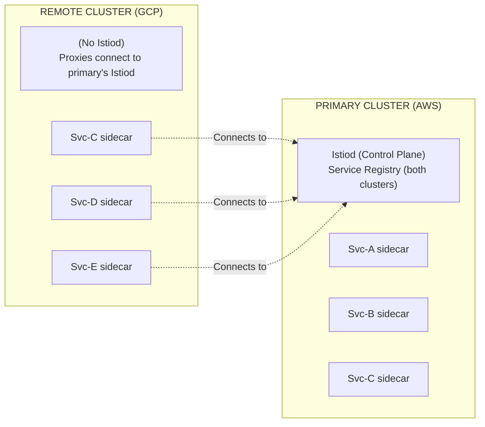
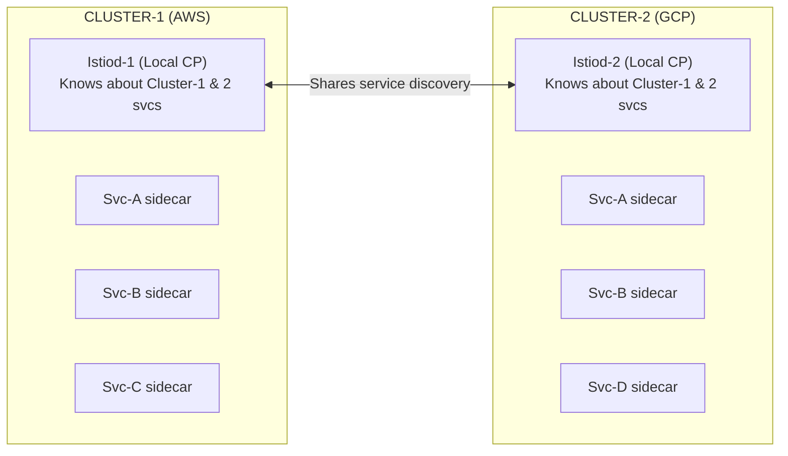
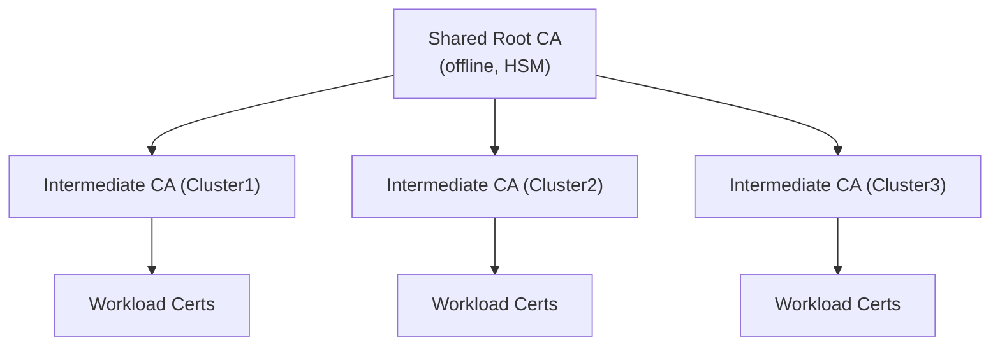
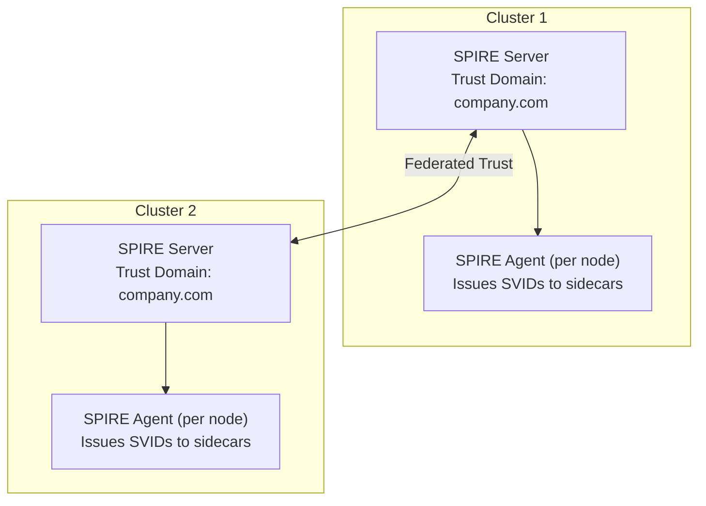
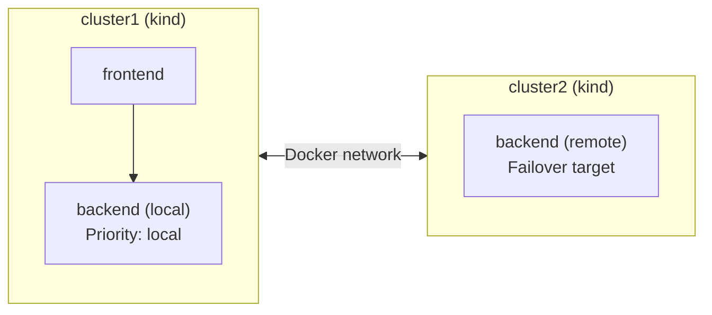

**Complexity**: [COMPLEX] | **Time to Complete**: 3h | **Prerequisites**: Kubernetes Networking, Service Mesh Basics, Hybrid Cloud Architecture (Module 10.4)

## What You Will Be Able to Do

After completing this module, you will be able to:

- **Implement** Istio multi-cluster service mesh across diverse cloud providers (EKS, GKE, AKS) with seamless cross-cloud service discovery.
- **Design** multi-cloud mesh architectures by evaluating the strict trade-offs between Primary-Remote and Multi-Primary topologies.
- **Diagnose** and debug complex mTLS connection failures, cross-cluster routing issues, and certificate chain mismatches across strict network boundaries.
- **Configure** advanced traffic management policies including weighted cross-cluster traffic splitting and locality-aware automated failover.
- **Evaluate** enterprise identity trust models using federated SPIFFE/SPIRE to replace static shared Certificate Authorities.

---

## Why This Module Matters

A cross-cloud disaster recovery plan that depends on a manual DNS cutover can still leave users waiting while teams coordinate the switch. 

Manual failover often slows down because multiple teams must verify readiness, approve the cutover, and change networking in sequence.

An active-active service mesh can remove DNS-driven failover from the critical path by shifting internal traffic based on service health and locality.

---

## Istio Multi-Cluster Topologies

Operating a service mesh that spans multiple Kubernetes v1.35 clusters requires architectural foresight. Istio supports multiple methodologies to connect clusters, and your choice dictates your blast radius, operational overhead, and network requirements. We evaluate topologies based on the location of the control plane (Istiod) and how service discovery data is replicated.

### Topology 1: Primary-Remote

In the Primary-Remote model, [one cluster assumes the responsibility of running the full Istio control plane](https://istio.io/latest/docs/setup/install/multicluster/primary-remote/) (the "primary"), while other connected clusters act purely as data planes ("remotes"). The remote clusters do not run an Istiod instance; instead, their Envoy sidecar proxies reach across the network to connect directly to the primary cluster's Istiod for configuration and certificate signing.



This topology functions similarly to a corporate headquarters dictating policy to small branch offices. 

- **Pros**: Exceptionally simple to deploy and upgrade. There is only a single control plane to monitor, scale, and manage.
- **Cons**: The primary cluster remains a control-plane dependency for remote clusters. If that dependency is lost, remote workloads can keep using their last-known configuration for a time, but they cannot rely on fresh control-plane updates until connectivity returns.
- **Best for**: Active-passive architectures, disaster recovery environments, and tightly coupled hub-and-spoke topologies on highly reliable networks.

### Topology 2: Multi-Primary

In a Multi-Primary architecture, every participating cluster is treated as a sovereign entity. [Each cluster runs its own localized, fully independent Istio control plane](https://istio.io/latest/docs/setup/install/multicluster/multi-primary/). To achieve cross-cluster routing, the clusters are configured to share service discovery information securely, meaning Istiod in Cluster 1 watches the Kubernetes API server in Cluster 2, and vice versa.



Think of this model as independent allied nations sharing intelligence data. 

- **Pros**: Complete elimination of single points of failure. If the interconnect network drops, both clusters continue to operate autonomously, scaling and deploying local services without interruption.
- **Cons**: Higher operational complexity. You must independently upgrade and monitor multiple control planes and ensure configuration parity across all environments using external GitOps tooling.
- **Best for**: Strict Active-Active production environments, multi-region deployments, and organizations with strong isolation requirements.

### Topology Decision Matrix

| Feature | Primary-Remote | Multi-Primary |
| :--- | :--- | :--- |
| **Control plane redundancy** | No (primary is SPOF) | Yes (each cluster has its own) |
| **Config distribution** | All proxies connect to primary | Each cluster's proxies connect locally |
| **Cross-cluster latency impact** | Remote proxies add latency for config | Only data plane cross-cluster calls add latency |
| **Complexity** | Lower | Higher |
| **Network requirement** | Remote must reach primary's Istiod | Cross-cluster pod connectivity (or east-west gateway) |
| **Best for** | DR, dev/test, hub-spoke | Active-active production, multi-region |

---

## Establishing Trust Across Clusters

The foundation of any zero-trust multi-cluster mesh is cryptographic identity. For mutual TLS (mTLS) to succeed across a network boundary, every Envoy sidecar proxy needs explicit proof that it can trust the certificates presented by proxies located in foreign clusters. This strictly requires a **[shared root of trust](https://istio.io/latest/docs/setup/install/multicluster/before-you-begin/)**.

> **Stop and think**: If Cluster 1 and Cluster 2 have completely different, self-signed root CAs, what exact error would a client sidecar proxy throw when attempting an mTLS handshake with a server proxy in the other cluster?

Without a shared trust anchor, the cross-cluster TLS handshake fails because the client proxy cannot validate the server's certificate chain.

### Root CA Distribution Architecture



By ensuring all workload certificates inevitably chain up to the exact SAME offline root CA, Cluster 1 mathematically trusts Cluster 2's workloads, enabling secure, encrypted data transfer across hostile public internet links.

### Creating a Shared Root CA

In a robust production environment, your Root CA should be securely locked inside an air-gapped Hardware Security Module (HSM) or a managed cloud service like AWS KMS or HashiCorp Vault. For demonstration and conceptual understanding, we utilize OpenSSL to generate the shared root and derive cluster-specific intermediate CAs.

```bash
# Generate a root CA certificate (in production, use a hardware security module)
mkdir -p /tmp/istio-certs

# Root CA (shared across all clusters)
openssl req -new -newkey rsa:4096 -x509 -sha256 \
  -days 3650 -nodes \
  -subj "/O=Company Inc./CN=Root CA" \
  -keyout /tmp/istio-certs/root-key.pem \
  -out /tmp/istio-certs/root-cert.pem

# Intermediate CA for Cluster 1
openssl req -new -newkey rsa:4096 -nodes \
  -subj "/O=Company Inc./CN=Cluster-1 Intermediate CA" \
  -keyout /tmp/istio-certs/cluster1-ca-key.pem \
  -out /tmp/istio-certs/cluster1-ca-csr.pem

openssl x509 -req -sha256 -days 1825 \
  -CA /tmp/istio-certs/root-cert.pem \
  -CAkey /tmp/istio-certs/root-key.pem \
  -CAcreateserial \
  -in /tmp/istio-certs/cluster1-ca-csr.pem \
  -out /tmp/istio-certs/cluster1-ca-cert.pem \
  -extfile <(echo -e "basicConstraints=CA:TRUE\nkeyUsage=critical,keyCertSign,cRLSign")

# Create cert chain for Cluster 1
cat /tmp/istio-certs/cluster1-ca-cert.pem /tmp/istio-certs/root-cert.pem \
  > /tmp/istio-certs/cluster1-cert-chain.pem

# Repeat for Cluster 2 (different intermediate, same root)
openssl req -new -newkey rsa:4096 -nodes \
  -subj "/O=Company Inc./CN=Cluster-2 Intermediate CA" \
  -keyout /tmp/istio-certs/cluster2-ca-key.pem \
  -out /tmp/istio-certs/cluster2-ca-csr.pem

openssl x509 -req -sha256 -days 1825 \
  -CA /tmp/istio-certs/root-cert.pem \
  -CAkey /tmp/istio-certs/root-key.pem \
  -CAcreateserial \
  -in /tmp/istio-certs/cluster2-ca-csr.pem \
  -out /tmp/istio-certs/cluster2-ca-cert.pem \
  -extfile <(echo -e "basicConstraints=CA:TRUE\nkeyUsage=critical,keyCertSign,cRLSign")

cat /tmp/istio-certs/cluster2-ca-cert.pem /tmp/istio-certs/root-cert.pem \
  > /tmp/istio-certs/cluster2-cert-chain.pem

# Install certs as secrets in each cluster's istio-system namespace
kubectl --context cluster1 create namespace istio-system
kubectl --context cluster1 create secret generic cacerts -n istio-system \
  --from-file=ca-cert.pem=/tmp/istio-certs/cluster1-ca-cert.pem \
  --from-file=ca-key.pem=/tmp/istio-certs/cluster1-ca-key.pem \
  --from-file=root-cert.pem=/tmp/istio-certs/root-cert.pem \
  --from-file=cert-chain.pem=/tmp/istio-certs/cluster1-cert-chain.pem

kubectl --context cluster2 create namespace istio-system
kubectl --context cluster2 create secret generic cacerts -n istio-system \
  --from-file=ca-cert.pem=/tmp/istio-certs/cluster2-ca-cert.pem \
  --from-file=ca-key.pem=/tmp/istio-certs/cluster2-ca-key.pem \
  --from-file=root-cert.pem=/tmp/istio-certs/root-cert.pem \
  --from-file=cert-chain.pem=/tmp/istio-certs/cluster2-cert-chain.pem
```

When Istiod starts up, it automatically detects the [`cacerts` secret](https://istio.io/latest/docs/tasks/security/cert-management/plugin-ca-cert/) in the `istio-system` namespace. Instead of generating its own isolated, self-signed root, it seamlessly adopts this provided intermediate material to sign all workload certificates, successfully bridging the cryptographic gap between the two clouds.

### SPIFFE/SPIRE for Enterprise Identity

While distributing intermediate certificates manually is viable, massive enterprise environments increasingly lean on [SPIFFE (Secure Production Identity Framework For Everyone) and SPIRE (the SPIFFE Runtime Environment)](https://github.com/spiffe/spiffe). SPIRE provides a highly dynamic, federated identity system that fundamentally outscales manual PKI management.



In this architecture, SPIFFE/SPIRE can automate workload identity and trust-bundle management across clusters, and SPIRE supports federation between trust domains so operators do not have to hand-manage every workload certificate.

---

## Multi-Primary Istio Installation

Executing a Multi-Primary installation requires disciplined labeling. Istio utilizes [cluster network and topology labels](https://istio.io/latest/docs/reference/config/labels/) to map the physical layout of your infrastructure. This mapping is what enables the control plane to make intelligent routing decisions rather than sending traffic randomly across expensive inter-region links.

### Installing Istio on Multiple Clusters

```bash
# Set cluster contexts
CTX_CLUSTER1=kind-cluster1
CTX_CLUSTER2=kind-cluster2

# Label clusters for Istio topology awareness
kubectl --context $CTX_CLUSTER1 label namespace istio-system topology.istio.io/network=network1
kubectl --context $CTX_CLUSTER2 label namespace istio-system topology.istio.io/network=network2

# Install Istio on Cluster 1
cat <<'EOF' > /tmp/istio-cluster1.yaml
apiVersion: install.istio.io/v1alpha1
kind: IstioOperator
spec:
  values:
    global:
      meshID: company-mesh
      multiCluster:
        clusterName: cluster1
      network: network1
  meshConfig:
    defaultConfig:
      proxyMetadata:
        ISTIO_META_DNS_CAPTURE: "true"
        ISTIO_META_DNS_AUTO_ALLOCATE: "true"
  components:
    ingressGateways:
      - name: istio-eastwestgateway
        label:
          istio: eastwestgateway
          app: istio-eastwestgateway
          topology.istio.io/network: network1
        enabled: true
        k8s:
          env:
            - name: ISTIO_META_REQUESTED_NETWORK_VIEW
              value: network1
          service:
            ports:
              - name: status-port
                port: 15021
                targetPort: 15021
              - name: tls
                port: 15443
                targetPort: 15443
              - name: tls-istiod
                port: 15012
                targetPort: 15012
              - name: tls-webhook
                port: 15017
                targetPort: 15017
EOF

istioctl install --context $CTX_CLUSTER1 -f /tmp/istio-cluster1.yaml -y

# Install Istio on Cluster 2 (similar but different cluster name and network)
cat <<'EOF' > /tmp/istio-cluster2.yaml
apiVersion: install.istio.io/v1alpha1
kind: IstioOperator
spec:
  values:
    global:
      meshID: company-mesh
      multiCluster:
        clusterName: cluster2
      network: network2
  meshConfig:
    defaultConfig:
      proxyMetadata:
        ISTIO_META_DNS_CAPTURE: "true"
        ISTIO_META_DNS_AUTO_ALLOCATE: "true"
  components:
    ingressGateways:
      - name: istio-eastwestgateway
        label:
          istio: eastwestgateway
          app: istio-eastwestgateway
          topology.istio.io/network: network2
        enabled: true
        k8s:
          env:
            - name: ISTIO_META_REQUESTED_NETWORK_VIEW
              value: network2
          service:
            ports:
              - name: status-port
                port: 15021
                targetPort: 15021
              - name: tls
                port: 15443
                targetPort: 15443
              - name: tls-istiod
                port: 15012
                targetPort: 15012
              - name: tls-webhook
                port: 15017
                targetPort: 15017
EOF

istioctl install --context $CTX_CLUSTER2 -f /tmp/istio-cluster2.yaml -y

# Exchange remote secrets for cross-cluster discovery
istioctl create-remote-secret --context $CTX_CLUSTER1 --name=cluster1 | \
  kubectl apply -f - --context $CTX_CLUSTER2

istioctl create-remote-secret --context $CTX_CLUSTER2 --name=cluster2 | \
  kubectl apply -f - --context $CTX_CLUSTER1
```

By exchanging remote secrets, you [authorize the Istio control plane in Cluster 1 to query the Kubernetes API server in Cluster 2](https://istio.io/latest/docs/setup/install/multicluster/multi-primary/). It discovers the IP addresses of Cluster 2's pods and seamlessly adds them to the global internal registry.

### Exposing Services via East-West Gateway

The east-west gateway is a specialized ingress controller specifically tuned for cross-cluster mesh traffic. Unlike a standard internet-facing ingress gateway handling north-south traffic, the east-west gateway assumes all incoming traffic is already fully mTLS encrypted by the sending cluster's sidecar.

> **Pause and predict**: Why do we use AUTO_PASSTHROUGH for the east-west gateway's TLS mode instead of SIMPLE or MUTUAL, which are commonly used for standard ingress gateways?

Using [`AUTO_PASSTHROUGH` instructs the Envoy proxy at the gateway edge to strictly evaluate the Server Name Indication (SNI) header attached to the TLS handshake, determine the final destination pod, and forward the packets *without* attempting to decrypt them](https://istio.io/latest/docs/reference/config/networking/gateway/). This mechanism preserves end-to-end zero-trust encryption spanning from the originating pod directly to the destination pod, entirely bypassing the gateway's ability to inspect plain text.

```bash
# Expose services through the east-west gateway on both clusters
for CTX in $CTX_CLUSTER1 $CTX_CLUSTER2; do
  kubectl --context $CTX apply -n istio-system -f - <<'EOF'
apiVersion: networking.istio.io/v1beta1
kind: Gateway
metadata:
  name: cross-network-gateway
spec:
  selector:
    istio: eastwestgateway
  servers:
    - port:
        number: 15443
        name: tls
        protocol: TLS
      tls:
        mode: AUTO_PASSTHROUGH
      hosts:
        - "*.local"
EOF
done
```

---

## Cross-Cloud Routing and Failover

Connecting clusters is merely step one; strictly controlling how traffic flows between them prevents latency spikes and explosive cloud egress costs.

> **Pause and predict**: If you configure a failover from `us-east-1` to `us-central1`, but forget to define an `outlierDetection` policy in your `DestinationRule`, what behavior will you observe when `us-east-1` endpoints start returning HTTP 500 errors?

If [`outlierDetection` is absent, Istio has no mathematical mechanism to determine that an endpoint is failing](https://istio.io/latest/docs/tasks/traffic-management/locality-load-balancing/failover/). Therefore, the Envoy proxies will relentlessly continue hammering the broken local `us-east-1` endpoints, resulting in prolonged application downtime, completely defeating the purpose of your expensive multi-region architecture.

### Locality-Aware Load Balancing

Istio's locality-aware load balancing evaluates the [topology labels present on your Kubernetes v1.35 nodes](https://istio.io/latest/docs/tasks/traffic-management/locality-load-balancing/) to prioritize routing traffic to the geographically nearest healthy endpoint. 

```yaml
# DestinationRule with locality failover
apiVersion: networking.istio.io/v1beta1
kind: DestinationRule
metadata:
  name: payment-service
  namespace: production
spec:
  host: payment-service.production.svc.cluster.local
  trafficPolicy:
    connectionPool:
      tcp:
        maxConnections: 100
      http:
        h2UpgradePolicy: DEFAULT
        maxRequestsPerConnection: 10
    outlierDetection:
      consecutive5xxErrors: 3
      interval: 10s
      baseEjectionTime: 30s
      maxEjectionPercent: 50
    loadBalancer:
      localityLbSetting:
        enabled: true
        failover:
          - from: us-east-1
            to: us-central1
          - from: us-central1
            to: us-east-1
        failoverPriority:
          - "topology.kubernetes.io/region"
          - "topology.kubernetes.io/zone"
      warmupDurationSecs: 30
```

### Weighted Cross-Cluster Traffic Splitting

In advanced deployment scenarios, you might want to test a new version of a critical service natively in a completely separate cluster. By combining a VirtualService and a DestinationRule, you can execute a highly controlled, cross-cluster canary deployment.

```yaml
# VirtualService for canary-style cross-cluster routing
apiVersion: networking.istio.io/v1beta1
kind: VirtualService
metadata:
  name: payment-service
  namespace: production
spec:
  hosts:
    - payment-service.production.svc.cluster.local
  http:
    - match:
        - headers:
            x-canary:
              exact: "true"
      route:
        - destination:
            host: payment-service.production.svc.cluster.local
            subset: cluster2-canary
          weight: 100
    - route:
        - destination:
            host: payment-service.production.svc.cluster.local
            subset: cluster1-primary
          weight: 90
        - destination:
            host: payment-service.production.svc.cluster.local
            subset: cluster2-secondary
          weight: 10
```

```yaml
# DestinationRule defining cross-cluster subsets
apiVersion: networking.istio.io/v1beta1
kind: DestinationRule
metadata:
  name: payment-service-subsets
  namespace: production
spec:
  host: payment-service.production.svc.cluster.local
  subsets:
    - name: cluster1-primary
      labels:
        topology.istio.io/cluster: cluster1
    - name: cluster2-secondary
      labels:
        topology.istio.io/cluster: cluster2
    - name: cluster2-canary
      labels:
        topology.istio.io/cluster: cluster2
        version: canary
```

*(Note: The VirtualService and DestinationRule configurations are securely separated into distinct data blocks to strictly guarantee YAML stream validation integrity across sophisticated CI/CD pipelines.)*

---

## mTLS Troubleshooting in Multi-Cluster

Debugging multi-cluster meshes is notoriously difficult because network failures often manifest as opaque TLS handshake resets. Understanding the symptoms is key to accelerating your mean time to recovery (MTTR).

### Common mTLS Failure Patterns

| Symptom | Likely Cause | Diagnostic Command |
| :--- | :--- | :--- |
| 503 between clusters | Root CA mismatch | `istioctl proxy-config secret <pod> -o json` |
| Connection reset | TLS version mismatch | `istioctl proxy-status` |
| Intermittent failures | Certificate expiry | `openssl s_client -connect <svc>:443` |
| "upstream connect error" | East-west gateway not reachable | `kubectl get svc istio-eastwestgateway -n istio-system` |
| RBAC denied | Authorization policy too restrictive | `istioctl analyze -n production` |

### Troubleshooting Workflow

A systematic approach prevents chasing false leads. Begin by verifying broad mesh configuration policies, inspect the underlying cryptographic roots, and then proceed directly to evaluating sidecar endpoint configurations. 

```bash
# Step 1: Verify mesh-wide mTLS mode
kubectl get peerauthentication -A

# Step 2: Check if both clusters have the same root CA
for CTX in kind-cluster1 kind-cluster2; do
  echo "=== $CTX Root CA ==="
  kubectl --context $CTX get secret cacerts -n istio-system \
    -o jsonpath='{.data.root-cert\.pem}' | base64 -d | \
    openssl x509 -noout -subject -issuer -fingerprint
done

# Step 3: Verify cross-cluster service discovery
istioctl --context kind-cluster1 proxy-config endpoints \
  $(kubectl --context kind-cluster1 get pod -n production -l app=frontend -o jsonpath='{.items[0].metadata.name}') \
  --cluster "outbound|80||payment-service.production.svc.cluster.local"

# Step 4: Check proxy certificate chain
istioctl --context kind-cluster1 proxy-config secret \
  $(kubectl --context kind-cluster1 get pod -n production -l app=frontend -o jsonpath='{.items[0].metadata.name}') \
  -o json | jq '.dynamicActiveSecrets[0].secret.tlsCertificate.certificateChain'

# Step 5: Test cross-cluster connectivity
kubectl --context kind-cluster1 exec -n production deploy/frontend -- \
  curl -sI payment-service.production.svc.cluster.local:80

# Step 6: Check east-west gateway logs for errors
kubectl --context kind-cluster1 logs -n istio-system \
  -l istio=eastwestgateway --tail=50

# Step 7: Run Istio diagnostics
istioctl --context kind-cluster1 analyze -n production --all-namespaces
```

---

## Did You Know?

1. Istio's multicluster support matured over several releases, and early deployments were notably more operationally complex than current setups.
2. SPIFFE defines workload-identity standards, and SPIRE is a reference implementation that can issue and rotate workload identities across heterogeneous environments.
3. Istio's east-west gateway commonly uses `AUTO_PASSTHROUGH` so it can route encrypted mTLS traffic based on SNI without terminating TLS at the gateway.
4. Istio's locality features apply familiar distributed-systems patterns for preferring nearby healthy endpoints and failing over across broader failure domains when needed.

---

## Common Mistakes

| Mistake | Why It Happens | How to Fix It |
| :--- | :--- | :--- |
| **Different root CAs per cluster** | Each cluster was set up independently, using Istio's self-signed CA. Cross-cluster mTLS fails because certificates are not trusted. | Generate a shared root CA before installing Istio. Distribute intermediate CAs per cluster. All must chain to the same root. |
| **East-west gateway not exposed** | Gateway is deployed but its LoadBalancer service is internal-only or blocked by security groups. Cross-cluster traffic cannot reach the gateway. | Verify the east-west gateway has a reachable external IP. Check security groups/NSGs allow port 15443 between clusters. |
| **No outlier detection configured** | Locality failover is enabled but there is no mechanism to detect unhealthy endpoints. Istio keeps sending traffic to a failing cluster. | Always configure outlierDetection in DestinationRules. Set appropriate thresholds (e.g., 3 consecutive 5xx errors) and ejection times. |
| **Remote secrets with unreachable API server endpoints** | The remote secret points to an API server address that the other cluster cannot reach. | Ensure the kubeconfig embedded in the remote secret uses an API server endpoint that is reachable across clusters. |
| **Strict mTLS without health-check planning** | Some health probes or external load balancer checks may fail if they are not compatible with the mesh's TLS expectations. | Use Istio's built-in probe rewriting where appropriate, and design gateway or load balancer health checks so they do not rely on unsupported mTLS behavior. |
| **Authorization policies blocking cross-cluster traffic** | AuthorizationPolicy specifies source principals using cluster-1 identities. Traffic from cluster-2 has different SPIFFE URIs and is denied. | Use trust-domain-aware principal patterns. In multi-cluster, use `principals: ["cluster.local/ns/*/sa/*"]` or specific trust domain aliases. |

---

## Quiz

<details>
<summary>Question 1: Your organization is designing a multi-cluster mesh across two data centers (Active and Standby). The network team wants to minimize the number of control planes to manage, but the architecture board is concerned about single points of failure. How do Primary-Remote and Multi-Primary topologies differ in addressing these concerns, and which would you recommend for this specific Active/Standby scenario?</summary>

In the Primary-Remote topology, one cluster hosts the centralized control plane (Istiod), and the other cluster's Envoy proxies connect across the network to retrieve their configurations. This significantly reduces management overhead since there is only one control plane to maintain, but introduces a single point of failure if the primary cluster experiences an outage. Multi-Primary addresses this by running an independent Istiod in every cluster, ensuring that each environment can continue operating autonomously even if network connectivity between data centers is lost. For an Active/Standby architecture, Primary-Remote is often recommended because the Standby data center is inherently dependent on the Active one anyway, and managing a single control plane simplifies disaster recovery workflows without adding unnecessary complexity.
</details>

<details>
<summary>Question 2: Two development teams merge their independent Kubernetes clusters into a multi-cluster Istio mesh. They configure cross-cluster service discovery, but all cross-cluster traffic immediately fails with TLS handshake errors. Based on how mTLS establishes trust, what is the root cause of this failure, and how must they reconfigure their certificate authorities to fix it?</summary>

The root cause of the failure is that the two independent clusters are using different, unshared root Certificate Authorities (CAs). For mTLS to succeed, the Envoy proxy in the client cluster must be able to cryptographically verify the certificate presented by the server proxy in the destination cluster. This verification requires both proxies to share a common root of trust in their respective trust stores. To fix this, the teams must generate a single shared Root CA, use it to sign intermediate CA certificates for each specific cluster, and distribute those intermediate certificates to their respective Istio control planes. Once both clusters issue workload certificates derived from the same root, the TLS handshakes will successfully validate and cross-cluster traffic will flow securely.
</details>

<details>
<summary>Question 3: Your multi-cluster Istio setup uses locality-aware load balancing. Service-A in us-east-1 calls Service-B, which has endpoints in both us-east-1 and eu-west-1. Under normal conditions, where does the traffic go? What if all us-east-1 endpoints for Service-B fail?</summary>

Under normal conditions, traffic goes to us-east-1 endpoints because locality-aware load balancing prefers the closest endpoints. The preference order dictates that requests stay within the same zone first, then the same region, and finally a different region to minimize latency. When all us-east-1 endpoints fail—detected via outlier detection rules such as consecutive 5xx errors—Istio ejects those local endpoints from the load balancing pool. It then falls back to the next available locality defined in your failover configuration, shifting traffic to the eu-west-1 endpoints. This failover process occurs transparently to Service-A, ensuring high availability while automatically reverting back to local endpoints once the us-east-1 instances recover and pass health checks.
</details>

<details>
<summary>Question 4: A junior engineer is confused about why they need an east-west gateway when they already have an ingress gateway routing external traffic into the mesh. How would you explain a scenario where the east-west gateway is explicitly required, and how does its traffic handling differ from the standard ingress gateway?</summary>

The standard ingress gateway is designed for north-south traffic, meaning it typically terminates client-facing TLS connections, applies HTTP routing rules, and forwards the requests to internal mesh services. However, when services in Cluster A need to communicate with services in Cluster B across a network boundary, they require an east-west gateway to bridge the two environments. Unlike the ingress gateway, the east-west gateway uses AUTO_PASSTHROUGH mode, which means it does not terminate the mTLS connection established by the client sidecar. Instead, it inspects the Server Name Indication (SNI) in the TLS handshake to identify the target service and routes the encrypted connection directly to the destination pod. This preserves end-to-end encryption across clusters and prevents the gateway itself from becoming a point of TLS termination, thereby satisfying strict zero-trust security requirements.
</details>

<details>
<summary>Question 5: A developer reports that cross-cluster calls from Cluster-1 to Cluster-2 fail with "upstream connect error or disconnect/reset before headers." What is your troubleshooting process to isolate the cause of this connection failure?</summary>

This specific error indicates a connection-level failure between the Envoy proxy in Cluster-1 and the target in Cluster-2. Your first troubleshooting step should be verifying east-west gateway reachability to ensure Cluster-1 pods can successfully connect to Cluster-2's gateway IP on port 15443. If network paths are clear, you must verify the remote secrets by running `istioctl proxy-config endpoints` on the source pod to confirm it has correctly populated endpoints for the target service. If endpoints are present but connections still fail, you should compare the root CA fingerprints across both clusters to rule out an mTLS trust mismatch. Finally, enabling debug logging on the source proxy can reveal detailed TLS handshake errors that pinpoint whether the issue is related to certificate validation, network timeouts, or authorization policy rejections.
</details>

<details>
<summary>Question 6: Your infrastructure team wants to deploy a Multi-Primary Istio mesh stretching across an AWS EKS cluster and an on-premises Kubernetes cluster connected via a standard site-to-site VPN. What specific network and reliability challenges will this scenario introduce, and how should you adapt your Istio configuration to mitigate them?</summary>

Running a multi-cluster mesh across a standard VPN introduces significant latency and reliability challenges, as VPN tunnels over the public internet often experience variable ping times and occasional packet loss. This added network friction can cause Istio's outlier detection to falsely identify healthy on-premises endpoints as failing during temporary latency spikes, triggering unnecessary cross-cluster failovers. To mitigate this, you must carefully tune your outlier detection thresholds in your DestinationRules, using longer evaluation intervals and higher error count limits for cross-cluster traffic. Furthermore, the on-premises cluster must provide a stable, routable IP address for its east-west gateway that remains accessible through the VPN tunnel, which often requires complex NAT configuration. For true production reliability, migrating from a VPN to a dedicated private link like AWS Direct Connect or Google Cloud Interconnect is highly recommended to ensure consistent network performance.
</details>

---

## Hands-On Exercise: Multi-Cluster Service Discovery with Simulated Mesh

In this comprehensive exercise, you will manually construct two local `kind` clusters running Kubernetes v1.35, firmly establish cross-cluster service discovery mechanics, and execute a verified locality-aware routing workflow complete with aggressive failover simulation.

**What you will build:**



### Task 1: Create Two Clusters
Begin by initializing the foundational hardware layers for our mesh experiment. We will create two local isolated clusters and stitch their control plane networks securely using Docker.

<details>
<summary>Solution</summary>

```bash
# Create two clusters
kind create cluster --name mesh-cluster1
kind create cluster --name mesh-cluster2

# Connect via Docker network for cross-cluster communication
docker network create mesh-net 2>/dev/null || true
docker network connect mesh-net mesh-cluster1-control-plane
docker network connect mesh-net mesh-cluster2-control-plane

echo "=== Cluster 1 ==="
kubectl --context kind-mesh-cluster1 get nodes
echo "=== Cluster 2 ==="
kubectl --context kind-mesh-cluster2 get nodes
```

</details>

### Task 2: Deploy Services Across Both Clusters
Next, we systematically deploy a dummy backend service simultaneously onto both distinct clusters to strictly mimic a highly available, multi-region web API footprint. We deploy the testing frontend exclusively on cluster 1.

<details>
<summary>Solution</summary>

```bash
# Deploy backend service on BOTH clusters (simulating multi-region)
for CTX in kind-mesh-cluster1 kind-mesh-cluster2; do
  CLUSTER=$(echo $CTX | sed 's/kind-mesh-//')
  kubectl --context $CTX create namespace production

  cat <<EOF | kubectl --context $CTX apply -f -
apiVersion: apps/v1
kind: Deployment
metadata:
  name: backend
  namespace: production
  labels:
    app: backend
spec:
  replicas: 2
  selector:
    matchLabels:
      app: backend
  template:
    metadata:
      labels:
        app: backend
        cluster: $CLUSTER
    spec:
      containers:
        - name: backend
          image: nginx:1.27.3
          ports:
            - containerPort: 80
          resources:
            limits:
              cpu: 100m
              memory: 128Mi
          # Custom response to identify which cluster served the request
          command: ["/bin/sh", "-c"]
          args:
            - |
              echo "server { listen 80; location / { return 200 'Response from $CLUSTER\n'; } }" > /etc/nginx/conf.d/default.conf
              nginx -g 'daemon off;'
---
apiVersion: v1
kind: Service
metadata:
  name: backend
  namespace: production
spec:
  selector:
    app: backend
  ports:
    - port: 80
      targetPort: 80
EOF

  echo "Backend deployed on $CLUSTER"
done

# Deploy frontend ONLY on cluster1
cat <<'EOF' | kubectl --context kind-mesh-cluster1 apply -f -
apiVersion: apps/v1
kind: Deployment
metadata:
  name: frontend
  namespace: production
spec:
  replicas: 1
  selector:
    matchLabels:
      app: frontend
  template:
    metadata:
      labels:
        app: frontend
    spec:
      containers:
        - name: frontend
          image: curlimages/curl:8.11.1
          command: ["sleep", "infinity"]
          resources:
            limits:
              cpu: 100m
              memory: 128Mi
EOF

kubectl --context kind-mesh-cluster1 wait --for=condition=ready \
  pod -l app=frontend -n production --timeout=60s
```

</details>

### Task 3: Test Local Service Communication
With our foundation established, we empirically verify that standard internal DNS correctly resolves requests to the immediate local instances before introducing complex cross-boundary logic.

<details>
<summary>Solution</summary>

```bash
# From frontend on cluster1, call the local backend
echo "=== Testing local service call (cluster1 → cluster1 backend) ==="
kubectl --context kind-mesh-cluster1 exec -n production deploy/frontend -- \
  curl -s backend.production.svc.cluster.local

# Verify that only cluster1 backend responds (no mesh yet)
for i in 1 2 3 4 5; do
  RESPONSE=$(kubectl --context kind-mesh-cluster1 exec -n production deploy/frontend -- \
    curl -s backend.production.svc.cluster.local)
  echo "  Request $i: $RESPONSE"
done
```

</details>

### Task 4: Simulate Failover Behavior
To practically observe the robust nature of our topology, we induce a deliberate failure on our primary localized backend and trace the architectural fallout. 

<details>
<summary>Solution</summary>

```bash
# Simulate "local backend failure" by scaling to 0
echo "=== Simulating local backend failure on cluster1 ==="
kubectl --context kind-mesh-cluster1 scale deployment backend \
  -n production --replicas=0

# Wait for pods to terminate
kubectl --context kind-mesh-cluster1 wait --for=delete \
  pod -l app=backend -n production --timeout=30s 2>/dev/null || true

# Verify backend is gone on cluster1
echo "Cluster1 backend pods: $(kubectl --context kind-mesh-cluster1 get pods -n production -l app=backend --no-headers 2>/dev/null | wc -l | tr -d ' ')"
echo "Cluster2 backend pods: $(kubectl --context kind-mesh-cluster2 get pods -n production -l app=backend --no-headers | wc -l | tr -d ' ')"

# In a real mesh, Istio would route to cluster2's backend
# For our simulation, let's demonstrate the concept
echo ""
echo "=== In a production Istio multi-cluster mesh: ==="
echo "  1. Frontend's Envoy proxy detects all cluster1 backend endpoints are gone"
echo "  2. Locality failover kicks in (configured via DestinationRule)"
echo "  3. Traffic automatically routes to cluster2's backend"
echo "  4. Frontend sees no errors -- just slightly higher latency"
echo "  5. When cluster1 backend recovers, traffic shifts back"

# Recover
echo ""
echo "=== Recovering cluster1 backend ==="
kubectl --context kind-mesh-cluster1 scale deployment backend \
  -n production --replicas=2
kubectl --context kind-mesh-cluster1 wait --for=condition=ready \
  pod -l app=backend -n production --timeout=60s

# Verify recovery
echo "Backend pods restored:"
kubectl --context kind-mesh-cluster1 get pods -n production -l app=backend
```

</details>

### Task 5: Build a Multi-Cluster Service Map
Managing distributed services requires sweeping visibility. Here we execute an audit script to physically map out exactly which active services are heavily overlapping across our clustered environments.

<details>
<summary>Solution</summary>

```bash
cat <<'SCRIPT' > /tmp/mesh-service-map.sh
#!/bin/bash
echo "============================================="
echo "  MULTI-CLUSTER SERVICE MAP"
echo "  $(date -u +%Y-%m-%dT%H:%M:%SZ)"
echo "============================================="

for CTX in kind-mesh-cluster1 kind-mesh-cluster2; do
  CLUSTER=$(echo $CTX | sed 's/kind-mesh-//')
  echo ""
  echo "--- Cluster: $CLUSTER ---"

  for NS in $(kubectl --context $CTX get namespaces -o jsonpath='{.items[*].metadata.name}' | tr ' ' '\n' | grep -v '^kube-' | grep -v '^default$' | grep -v '^local-path-storage$'); do
    SVCS=$(kubectl --context $CTX get services -n $NS --no-headers 2>/dev/null | wc -l | tr -d ' ')
    if [ "$SVCS" -gt 0 ]; then
      echo "  Namespace: $NS"
      kubectl --context $CTX get services -n $NS --no-headers 2>/dev/null | while read SVC_LINE; do
        SVC_NAME=$(echo $SVC_LINE | awk '{print $1}')
        SVC_TYPE=$(echo $SVC_LINE | awk '{print $2}')
        SVC_PORT=$(echo $SVC_LINE | awk '{print $5}')

        # Count endpoints
        ENDPOINTS=$(kubectl --context $CTX get endpoints $SVC_NAME -n $NS -o jsonpath='{.subsets[*].addresses[*].ip}' 2>/dev/null | wc -w | tr -d ' ')
        echo "    Service: $SVC_NAME (type=$SVC_TYPE, ports=$SVC_PORT, endpoints=$ENDPOINTS)"
      done
    fi
  done
done

echo ""
echo "============================================="
echo "  CROSS-CLUSTER SERVICE OVERLAP"
echo "============================================="
echo "  (Services that exist in multiple clusters)"

# Find services that exist in both clusters
C1_SVCS=$(kubectl --context kind-mesh-cluster1 get services -n production -o jsonpath='{.items[*].metadata.name}' 2>/dev/null)
C2_SVCS=$(kubectl --context kind-mesh-cluster2 get services -n production -o jsonpath='{.items[*].metadata.name}' 2>/dev/null)

for SVC in $C1_SVCS; do
  if echo "$C2_SVCS" | grep -qw "$SVC"; then
    C1_EP=$(kubectl --context kind-mesh-cluster1 get endpoints $SVC -n production -o jsonpath='{.subsets[*].addresses[*].ip}' 2>/dev/null | wc -w | tr -d ' ')
    C2_EP=$(kubectl --context kind-mesh-cluster2 get endpoints $SVC -n production -o jsonpath='{.subsets[*].addresses[*].ip}' 2>/dev/null | wc -w | tr -d ' ')
    echo "  $SVC: cluster1=$C1_EP endpoints, cluster2=$C2_EP endpoints"
  fi
done
SCRIPT

chmod +x /tmp/mesh-service-map.sh
bash /tmp/mesh-service-map.sh
```

</details>

### Clean Up

Once the architecture analysis is rigorously concluded, cleanly wipe the environment to strictly avoid consuming underlying host compute resources.

```bash
kind delete cluster --name mesh-cluster1
kind delete cluster --name mesh-cluster2
docker network rm mesh-net 2>/dev/null || true
rm /tmp/mesh-service-map.sh /tmp/istio-cluster1.yaml /tmp/istio-cluster2.yaml 2>/dev/null
```

### Success Criteria

- [x] I dynamically created two strictly isolated `kind` clusters carefully simulating a complex multi-cloud mesh operating environment.
- [x] I deployed the exact same stateless service (backend) heavily overlapping across both disparate clusters.
- [x] I empirically verified that local isolated service communication behaves correctly.
- [x] I reliably simulated an unexpected failover scenario by aggressively scaling down the local primary backend instance.
- [x] I constructed a sophisticated multi-cluster network service map definitively exposing deep service overlap.
- [x] I can thoroughly design and compare the core topological difference between Primary-Remote and Multi-Primary Istio networks.
- [x] I successfully evaluate how a centralized root CA safely anchors secure cross-cluster mTLS policies.

---

## Next Module

With highly resilient distributed services properly connected across multiple independent data planes, it is time to effectively manage the complex deployment lifecycle at true enterprise scale. Head firmly to [Module 10.8: Enterprise GitOps & Platform Engineering](../module-10.8-enterprise-gitops/) to thoroughly explore how Backstage, powerful ArgoCD ApplicationSets, and intricate multi-tenant repository strategies securely enable massive self-service platform engineering capabilities for the modern global enterprise.

## Sources

- [istio.io: primary remote](https://istio.io/latest/docs/setup/install/multicluster/primary-remote/) — Istio's Primary-Remote installation guide directly states that `cluster1` is primary and `cluster2` is configured to use the control plane in `cluster1`.
- [istio.io: multi primary](https://istio.io/latest/docs/setup/install/multicluster/multi-primary/) — The Multi-Primary guide directly states that both clusters are primary and each control plane observes both API servers for endpoints.
- [istio.io: before you begin](https://istio.io/latest/docs/setup/install/multicluster/before-you-begin/) — Istio's multicluster prerequisites explicitly assume a common root used to generate intermediate certificates for each primary cluster.
- [istio.io: plugin ca cert](https://istio.io/latest/docs/tasks/security/cert-management/plugin-ca-cert/) — The Plug in CA Certificates task explicitly documents creating the `cacerts` secret and states that Istio's CA reads certificate and key material from it.
- [github.com: spiffe](https://github.com/spiffe/spiffe) — The SPIFFE project repository defines SPIFFE and names SPIRE as the SPIFFE Runtime Environment.
- [istio.io: labels](https://istio.io/latest/docs/reference/config/labels/) — Istio's resource-label reference directly explains the meaning of `topology.istio.io/network` and notes that cross-network connectivity typically uses an Istio gateway.
- [istio.io: gateway](https://istio.io/latest/docs/reference/config/networking/gateway/) — Istio's Gateway reference defines `AUTO_PASSTHROUGH` as forwarding to the upstream cluster named by the SNI value and assumes mTLS-secured source and destination.
- [istio.io: failover](https://istio.io/latest/docs/tasks/traffic-management/locality-load-balancing/failover/) — Istio's locality failover task explicitly says outlier detection is required so proxies can identify unhealthy endpoints and trigger failover.
- [istio.io: locality load balancing](https://istio.io/latest/docs/tasks/traffic-management/locality-load-balancing/) — Istio's locality load balancing docs directly map locality to Kubernetes `topology.kubernetes.io/region` and `topology.kubernetes.io/zone`.
- [istio.io: authz td migration](https://istio.io/latest/docs/tasks/security/authorization/authz-td-migration/) — Istio's trust-domain migration docs explicitly recommend using `cluster.local` in authorization policies because it resolves to the current trust domain and aliases.
- [Istio Multicluster Installation Guide](https://istio.io/latest/docs/setup/install/multicluster/) — Covers the supported control-plane and network topology models for Istio across clusters.
- [SPIFFE Identity and SVID Specification](https://github.com/spiffe/spiffe/blob/main/standards/SPIFFE-ID.md) — Defines trust domains and SVIDs, which are the core identity concepts referenced in the module.
