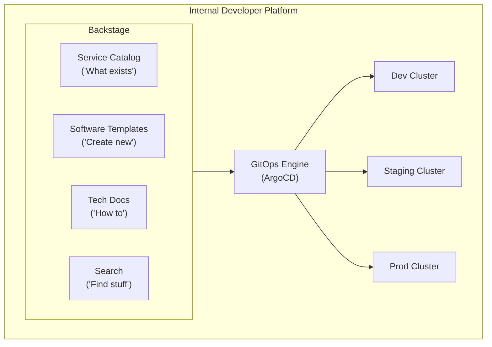

**Complexity**: [COMPLEX] | **Time to Complete**: 2.5h | **Prerequisites**: GitOps Basics (ArgoCD/Flux), Kubernetes RBAC, Multi-Cloud Fleet Management (Module 10.5)

## What You'll Be Able to Do

After completing this module, you will be able to:

- **Design enterprise GitOps architectures using Argo CD or Flux with multi-tenant repository structures**
- **Implement progressive delivery pipelines with Argo Rollouts for canary and blue/green deployments at scale**
- **Configure GitOps promotion workflows across dev, staging, and production environments with approval gates**
- **Deploy GitOps-based platform engineering patterns that enable self-service application deployment for development teams**

---

## Why This Module Matters

At enterprise scale, letting each team run its own ArgoCD instance can create patching delays, inconsistent configuration, and fragmented governance.

Meanwhile, the developer experience was deteriorating. New teams faced manual namespace requests, hand-edited GitOps configuration, ad hoc monitoring setup, and poorly documented secrets workflows, which made onboarding to production much slower than it needed to be.

Enterprise GitOps is not just "install ArgoCD." It is the discipline of building a self-service platform where teams can deploy, operate, and observe their applications through Git workflows, without needing to understand the underlying infrastructure. In this module, you will learn how to build a Backstage-powered Internal Developer Platform, scale ArgoCD with ApplicationSets and App of Apps patterns, design multi-tenant Git repository strategies, implement RBAC for GitOps, and manage secrets in an enterprise GitOps workflow.

---

## The Internal Developer Platform

An Internal Developer Platform (IDP) is the self-service layer that sits between developers and infrastructure. It codifies organizational standards into templates and workflows that make it easy to do the right thing and hard to do the wrong thing.

> **Stop and think**: If a developer has to ask a platform engineer to create a namespace, is it a platform or just a ticketing system? How does GitOps change this dynamic?

### What a Good IDP Provides



### Backstage for Platform Engineering

[Backstage provides four core capabilities](https://github.com/backstage/backstage) that transform GitOps from "YAML editing in Git" to a self-service platform:

```yaml
# backstage-template: create-microservice.yaml
apiVersion: scaffolder.backstage.io/v1beta3
kind: Template
metadata:
  name: create-microservice
  title: Create a New Microservice
  description: |
    Provision a new microservice with CI/CD, monitoring,
    ArgoCD deployment, and Backstage catalog entry.
spec:
  owner: platform-team
  type: service

  parameters:
    - title: Service Details
      required:
        - serviceName
        - team
        - description
      properties:
        serviceName:
          title: Service Name
          type: string
          pattern: '^[a-z][a-z0-9-]{2,30}$'
          description: "Lowercase letters, numbers, hyphens. 3-31 characters."
        team:
          title: Owning Team
          type: string
          enum: ['payments', 'identity', 'notifications', 'search', 'platform']
        description:
          title: Description
          type: string
          maxLength: 200

    - title: Technical Configuration
      properties:
        language:
          title: Language
          type: string
          enum: ['go', 'python', 'typescript', 'java']
          default: 'go'
        deployTarget:
          title: Deployment Target
          type: string
          enum: ['eks-prod', 'aks-prod', 'gke-prod']
          default: 'eks-prod'
        requiresDatabase:
          title: Needs Database?
          type: boolean
          default: false
        publicFacing:
          title: Internet-Facing?
          type: boolean
          default: false

  steps:
    - id: scaffold
      name: Generate Service Scaffold
      action: fetch:template
      input:
        url: ./skeletons/${{ parameters.language }}
        values:
          serviceName: ${{ parameters.serviceName }}
          team: ${{ parameters.team }}
          deployTarget: ${{ parameters.deployTarget }}

    - id: create-repo
      name: Create GitHub Repository
      action: publish:github
      input:
        repoUrl: github.com?owner=company-services&repo=${{ parameters.serviceName }}
        defaultBranch: main
        protectDefaultBranch: true
        requireCodeOwnerReviews: true

    - id: create-argocd-app
      name: Register with ArgoCD
      action: argocd:create-resources
      input:
        appName: ${{ parameters.serviceName }}
        projectName: ${{ parameters.team }}
        repoURL: ${{ steps['create-repo'].output.remoteUrl }}
        path: k8s/overlays/production
        destServer: ${{ parameters.deployTarget }}
        destNamespace: ${{ parameters.team }}

    - id: register-catalog
      name: Register in Backstage Catalog
      action: catalog:register
      input:
        repoContentsUrl: ${{ steps['create-repo'].output.repoContentsUrl }}
        catalogInfoPath: /catalog-info.yaml

  output:
    links:
      - title: Repository
        url: ${{ steps['create-repo'].output.remoteUrl }}
      - title: ArgoCD Application
        url: https://argocd.company.com/applications/${{ parameters.serviceName }}
```

---

## Scaling ArgoCD for Enterprise

### The Problem with One ArgoCD Per Team

```text
BAD: 87 ArgoCD instances
  - 87 separate upgrades when CVEs are announced
  - 87 different configurations to maintain
  - No cross-team visibility
  - Massive resource waste (each instance runs 3+ pods)

GOOD: 1-3 centralized ArgoCD instances
  - Centralized patching and configuration
  - Multi-tenant RBAC via ArgoCD Projects
  - Cross-team visibility and governance
  - Resource efficient
```

### App of Apps Pattern

The App of Apps pattern [uses a root ArgoCD Application that manages other Applications](https://argo-cd.readthedocs.io/en/latest/operator-manual/cluster-bootstrapping/). This creates a hierarchy where one top-level Application bootstraps the entire platform.

```yaml
# root-app/app-of-apps.yaml
apiVersion: argoproj.io/v1alpha1
kind: Application
metadata:
  name: platform-root
  namespace: argocd
spec:
  project: platform
  source:
    repoURL: https://github.com/company/platform-config.git
    targetRevision: main
    path: apps
  destination:
    server: https://kubernetes.default.svc
    namespace: argocd
  syncPolicy:
    automated:
      prune: true
      selfHeal: true
```

```text
platform-config/
├── apps/                      # Root Application points here
│   ├── monitoring.yaml        # Application for monitoring stack
│   ├── logging.yaml          # Application for logging stack
│   ├── cert-manager.yaml     # Application for cert-manager
│   ├── kyverno.yaml          # Application for policy engine
│   ├── team-payments.yaml    # ApplicationSet for payments team
│   ├── team-identity.yaml    # ApplicationSet for identity team
│   └── team-search.yaml      # ApplicationSet for search team
│
├── platform/                  # Platform services configs
│   ├── monitoring/
│   ├── logging/
│   ├── cert-manager/
│   └── kyverno/
│
└── teams/                     # Team-specific configs
    ├── payments/
    ├── identity/
    └── search/
```

### ApplicationSets: Dynamic Application Generation

[ApplicationSets generate ArgoCD Applications dynamically based on templates and generators.](https://argo-cd.readthedocs.io/en/release-2.14/operator-manual/applicationset/) They are the key to scaling from tens to hundreds of applications.

> **Pause and predict**: If you have 100 microservices, writing 100 Application manifests is tedious. How might ArgoCD automate the creation of these manifests?

```yaml
# Generator: Create an Application for every directory in a Git repo
apiVersion: argoproj.io/v1alpha1
kind: ApplicationSet
metadata:
  name: team-payments-services
  namespace: argocd
spec:
  generators:
    - git:
        repoURL: https://github.com/company/payments-services.git
        revision: main
        directories:
          - path: services/*
  template:
    metadata:
      name: 'payments-{{path.basename}}'
      labels:
        team: payments
    spec:
      project: payments
      source:
        repoURL: https://github.com/company/payments-services.git
        targetRevision: main
        path: '{{path}}/k8s/overlays/production'
      destination:
        server: https://kubernetes.default.svc
        namespace: payments
      syncPolicy:
        automated:
          prune: true
          selfHeal: true
        syncOptions:
          - CreateNamespace=true
          - ServerSideApply=true
        retry:
          limit: 3
          backoff:
            duration: 5s
            factor: 2
            maxDuration: 3m
```

```yaml
# Generator: Deploy to every cluster with matching labels
apiVersion: argoproj.io/v1alpha1
kind: ApplicationSet
metadata:
  name: monitoring-fleet
  namespace: argocd
spec:
  generators:
    - clusters:
        selector:
          matchLabels:
            monitoring: enabled
  template:
    metadata:
      name: 'monitoring-{{name}}'
    spec:
      project: platform
      source:
        repoURL: https://github.com/company/platform-config.git
        targetRevision: main
        path: platform/monitoring
        helm:
          valueFiles:
            - 'values-{{metadata.labels.environment}}.yaml'
      destination:
        server: '{{server}}'
        namespace: monitoring
      syncPolicy:
        automated:
          prune: true
          selfHeal: true
```

```yaml
# Generator: Matrix - combine clusters with services
apiVersion: argoproj.io/v1alpha1
kind: ApplicationSet
metadata:
  name: platform-services-matrix
  namespace: argocd
spec:
  generators:
    - matrix:
        generators:
          - clusters:
              selector:
                matchLabels:
                  environment: production
          - list:
              elements:
                - service: kyverno
                  path: platform/kyverno
                - service: falco
                  path: platform/falco
                - service: otel-collector
                  path: platform/otel-collector
  template:
    metadata:
      name: '{{service}}-{{name}}'
    spec:
      project: platform
      source:
        repoURL: https://github.com/company/platform-config.git
        targetRevision: main
        path: '{{path}}'
      destination:
        server: '{{server}}'
        namespace: '{{service}}-system'
```

---

## Multi-Tenant Git Repository Strategy

How you organize Git repositories determines how scalable and maintainable your GitOps platform is. There are three common patterns.

> **Stop and think**: In a mono-repo, a syntax error in the root directory might break the platform. In a repo-per-team, how do you enforce a new security policy across 50 repositories?

### Pattern 1: Mono-Repo

```text
company-k8s/
├── platform/               # Platform team owns this
│   ├── monitoring/
│   ├── logging/
│   └── policy/
├── teams/
│   ├── payments/           # Payments team owns this subtree
│   │   ├── service-a/
│   │   ├── service-b/
│   │   └── service-c/
│   ├── identity/           # Identity team owns this subtree
│   │   ├── auth-service/
│   │   └── user-service/
│   └── search/
└── CODEOWNERS              # Enforce ownership via GitHub CODEOWNERS
```

**Pros**: Single source of truth. Cross-cutting changes in one PR. Easy to search. **Cons**: Large repos are slow. CODEOWNERS is one layer of access control. One team's bad merge affects everyone.

### Pattern 2: Repo Per Team

```text
company/
├── platform-config/          # Platform team
├── payments-k8s/            # Payments team
├── identity-k8s/            # Identity team
├── search-k8s/             # Search team
└── fleet-config/            # ArgoCD configuration (platform team)
```

**Pros**: Team autonomy. Clean access control per repo. Independent merge queues. **Cons**: Cross-cutting changes require PRs to multiple repos. Harder to enforce consistency.

### Pattern 3: Hybrid (Recommended for Enterprise)

```text
# Central platform repo (platform team owns)
platform-config/
├── argocd/                   # App of Apps, ApplicationSets
├── platform-services/        # Monitoring, logging, policy
├── cluster-configs/          # Per-cluster configurations
└── team-onboarding/          # Templates for new team repos

# Per-team repos (teams own their own)
payments-k8s/
├── services/
│   ├── payment-processor/
│   │   ├── base/
│   │   └── overlays/
│   │       ├── dev/
│   │       ├── staging/
│   │       └── production/
│   └── invoice-service/
├── shared/
│   ├── network-policies/
│   └── resource-quotas/
└── catalog-info.yaml        # Backstage catalog entry
```

```yaml
# CODEOWNERS for team repo
# payments-k8s/.github/CODEOWNERS

# Platform team must approve changes to shared configs
/shared/ @company/platform-team

# Payments team owns their services
/services/ @company/payments-team

# Production overlays require senior review
/services/*/overlays/production/ @company/payments-leads @company/platform-team
```

---

## RBAC for Enterprise GitOps

ArgoCD's RBAC system uses **Projects** to isolate teams and [control what they can deploy, where they can deploy it, and which Git repos they can use](https://argo-cd.readthedocs.io/en/latest/user-guide/projects/).

### ArgoCD Project per Team

```yaml
apiVersion: argoproj.io/v1alpha1
kind: AppProject
metadata:
  name: payments
  namespace: argocd
spec:
  description: "Payments team services"

  # Which repos can this project use?
  sourceRepos:
    - 'https://github.com/company/payments-k8s.git'
    - 'https://github.com/company/shared-charts.git'

  # Where can this project deploy?
  destinations:
    - namespace: payments
      server: https://kubernetes.default.svc
    - namespace: payments
      server: https://eks-prod.company.internal
    - namespace: payments-staging
      server: https://eks-staging.company.internal

  # What cluster resources can this project create?
  clusterResourceWhitelist:
    - group: ''
      kind: Namespace

  # What namespaced resources are allowed?
  namespaceResourceWhitelist:
    - group: ''
      kind: '*'
    - group: apps
      kind: '*'
    - group: networking.k8s.io
      kind: '*'

  # What resources are DENIED?
  namespaceResourceBlacklist:
    - group: ''
      kind: ResourceQuota    # Only platform team sets quotas
    - group: ''
      kind: LimitRange        # Only platform team sets limits

  # Enforce signed commits
  signatureKeys:
    - keyID: "ABCDEF1234567890"

  # Sync windows (no deployments during maintenance)
  syncWindows:
    - kind: deny
      schedule: '0 2 * * *'    # Deny syncs between 2-6 AM
      duration: 4h
      applications:
        - '*'
    - kind: allow
      schedule: '0 6 * * 1-5'  # Allow during business hours M-F
      duration: 14h
      applications:
        - '*'
```

### RBAC Policy for ArgoCD

```csv
# argocd-rbac-cm ConfigMap data
# Format: p, <role>, <resource>, <action>, <project>/<object>, <allow/deny>

# Platform admins: full access to everything
p, role:platform-admin, applications, *, */*, allow
p, role:platform-admin, clusters, *, *, allow
p, role:platform-admin, repositories, *, *, allow
p, role:platform-admin, projects, *, *, allow

# Payments team: manage their own apps, read-only on platform
p, role:payments-team, applications, get, payments/*, allow
p, role:payments-team, applications, sync, payments/*, allow
p, role:payments-team, applications, action/*, payments/*, allow
p, role:payments-team, applications, create, payments/*, allow
p, role:payments-team, applications, delete, payments/*, allow
p, role:payments-team, logs, get, payments/*, allow
p, role:payments-team, exec, create, payments/*, deny
p, role:payments-team, applications, get, platform/*, allow

# Read-only role for all teams (view platform apps)
p, role:viewer, applications, get, */*, allow
p, role:viewer, logs, get, */*, allow

# Map SSO groups to roles
g, company:platform-engineers, role:platform-admin
g, company:payments-developers, role:payments-team
g, company:all-engineers, role:viewer
```

---

## Secrets in Enterprise GitOps

The biggest challenge in GitOps is secrets: you cannot store plaintext secrets in Git, but GitOps requires everything to be in Git. [Several solutions exist, each with different trade-offs.](https://argo-cd.readthedocs.io/en/latest/operator-manual/secret-management/)

### Secrets Management Comparison

| Solution | How It Works | Pros | Cons |
| :--- | :--- | :--- | :--- |
| **Sealed Secrets** | Encrypt secrets with a cluster-specific key. Only the cluster can decrypt. | Simple, no external dependencies | Key per cluster, rotation is manual |
| **External Secrets Operator (ESO)** | Syncs secrets from AWS Secrets Manager, Azure Key Vault, HashiCorp Vault | External source of truth, centralized management | Dependency on external service |
| **SOPS + age/KMS** | Encrypt YAML values in-place in Git. Decrypt at sync time. | Secrets versioned in Git (encrypted), audit trail | Key management complexity |
| **Vault Agent Injector** | HashiCorp Vault injects secrets via sidecar | Rich policy engine, dynamic secrets | Vault is complex to operate, sidecar overhead |
| **ArgoCD Vault Plugin** | Decrypt/fetch secrets during ArgoCD sync | No sidecar, centralized vault | Tight coupling between ArgoCD and Vault |

### External Secrets Operator (Recommended for Enterprise)

```yaml
# Install ESO
# helm install external-secrets external-secrets/external-secrets -n external-secrets --create-namespace

# Create a SecretStore that connects to AWS Secrets Manager
apiVersion: external-secrets.io/v1beta1
kind: ClusterSecretStore
metadata:
  name: aws-secrets-manager
spec:
  provider:
    aws:
      service: SecretsManager
      region: us-east-1
      auth:
        jwt:
          serviceAccountRef:
            name: external-secrets-sa
            namespace: external-secrets

---
# Create an ExternalSecret that syncs a specific secret
apiVersion: external-secrets.io/v1beta1
kind: ExternalSecret
metadata:
  name: database-credentials
  namespace: payments
spec:
  refreshInterval: 1h
  secretStoreRef:
    name: aws-secrets-manager
    kind: ClusterSecretStore
  target:
    name: database-credentials
    creationPolicy: Owner
  data:
    - secretKey: DB_HOST
      remoteRef:
        key: payments/production/database
        property: host
    - secretKey: DB_PASSWORD
      remoteRef:
        key: payments/production/database
        property: password
    - secretKey: DB_USERNAME
      remoteRef:
        key: payments/production/database
        property: username
```

### [SOPS](https://github.com/getsops/sops) for Git-Native Secrets

```bash
# Encrypt a secret with SOPS + AWS KMS
# .sops.yaml in the repo root configures encryption rules

cat <<'EOF' > .sops.yaml
creation_rules:
  - path_regex: .*\.enc\.yaml$
    kms: arn:aws:kms:us-east-1:123456789012:key/abc-123-def-456
    encrypted_regex: ^(data|stringData)$
EOF

# Create a secret and encrypt it
cat <<'EOF' > database-secret.enc.yaml
apiVersion: v1
kind: Secret
metadata:
  name: database-credentials
  namespace: payments
type: Opaque
stringData:
  DB_HOST: prod-db.company.internal
  DB_PASSWORD: super-secret-password
  DB_USERNAME: payments_svc
EOF

# Encrypt the secret (only data/stringData fields are encrypted)
sops --encrypt --in-place database-secret.enc.yaml

# The encrypted file looks like:
# apiVersion: v1
# kind: Secret
# metadata:
#   name: database-credentials
#   namespace: payments
# type: Opaque
# stringData:
#   DB_HOST: ENC[AES256_GCM,data:abc123...]
#   DB_PASSWORD: ENC[AES256_GCM,data:def456...]
#   DB_USERNAME: ENC[AES256_GCM,data:ghi789...]

# Commit the encrypted file to Git (safe!)
git add database-secret.enc.yaml
git commit -m "feat: Add payments database credentials (encrypted)"
```

---

## Progressive Delivery with Argo Rollouts

While ArgoCD excels at syncing the desired state from Git to Kubernetes, it relies on standard Kubernetes deployment strategies (like `RollingUpdate`) which lack advanced traffic control. For enterprise applications where downtime or regression is costly, you need **progressive delivery**.

Argo Rollouts is a Kubernetes controller and set of CRDs that provide advanced deployment capabilities such as blue/green, canary, canary analysis, and experimentation.

> **Pause and predict**: If a bad version of a microservice passes all CI/CD tests but fails under real-world user traffic, how can you minimize the blast radius before rolling back?

### The Rollout Resource

The `Rollout` custom resource [acts as a drop-in replacement for the standard Kubernetes `Deployment`](https://argoproj.github.io/argo-rollouts/features/analysis/). It manages the creation, scaling, and deletion of ReplicaSets based on a defined strategy.

```yaml
apiVersion: argoproj.io/v1alpha1
kind: Rollout
metadata:
  name: payments-processor
  namespace: payments
spec:
  replicas: 5
  selector:
    matchLabels:
      app: payments-processor
  template:
    metadata:
      labels:
        app: payments-processor
    spec:
      containers:
      - name: processor
        image: company/payments-processor:v2.1.0
  strategy:
    canary:
      steps:
      - setWeight: 10
      - pause: {duration: 10m} # Wait 10 minutes at 10% traffic
      - setWeight: 30
      - pause: {} # Wait indefinitely for manual approval
      - setWeight: 100
```

### Automated Rollback with AnalysisRuns

To truly scale progressive delivery, human approval must be replaced with automated metrics analysis. Argo Rollouts integrates with Prometheus, Datadog, or New Relic via an `AnalysisTemplate`.

```yaml
apiVersion: argoproj.io/v1alpha1
kind: AnalysisTemplate
metadata:
  name: success-rate
  namespace: payments
spec:
  args:
  - name: service-name
  metrics:
  - name: success-rate
    interval: 1m
    successCondition: result[0] >= 0.99
    failureLimit: 3
    provider:
      prometheus:
        address: http://prometheus.monitoring.svc.cluster.local:9090
        query: |
          sum(rate(http_requests_total{service="{{args.service-name}}",status=~"2.."}[1m])) 
          / 
          sum(rate(http_requests_total{service="{{args.service-name}}"}[1m]))
```

When you link this `AnalysisTemplate` to your `Rollout`, Argo Rollouts will automatically query Prometheus during the canary steps. If the success rate drops below 99% three times, [the rollout is automatically aborted, typically routing traffic back to the stable version without human intervention](https://argoproj.github.io/argo-rollouts/features/analysis/).

---

## Did You Know?

1. Backstage is widely used for internal developer portals, and large organizations such as Spotify use it to centralize service catalogs, templates, documentation, and developer workflows.

2. Large ArgoCD installations can manage thousands of applications and many clusters, but they require careful tuning of reconciliation, repository access, and controller resources at scale.

3. External Secrets Operator emerged from community consolidation efforts around Kubernetes external-secrets patterns and supports a broad set of secret backends.

4. SOPS is a widely used tool for encrypting structured secret files such as YAML and JSON in Git-based workflows.

---

## Common Mistakes

| Mistake | Why It Happens | How to Fix It |
| :--- | :--- | :--- |
| **One ArgoCD per team** | Teams want autonomy. Platform team does not want to manage multi-tenant ArgoCD. | Invest in multi-tenant ArgoCD with Projects and RBAC. One or two centralized instances are far easier to maintain than 50+ team instances. |
| **ApplicationSets without sync waves** | All applications in an ApplicationSet try to sync simultaneously. CRDs not installed before resources that depend on them. Sync failures cascade. | Use sync waves and sync hooks to control deployment order. Deploy CRDs before custom resources. Deploy namespaces before workloads. |
| **Git repo too large for ArgoCD** | A very large mono-repo can slow ArgoCD repository operations and lengthen sync times, especially if each application has to scan more content than it needs. | Use shallow clones (`--depth 1`), split large repos, or use ApplicationSets with directory generators to limit what ArgoCD syncs per Application. |
Later often does not come. Credential scanning finds secrets in Git history even after removal. | Use External Secrets Operator or SOPS from day one. Add pre-commit hooks that detect secrets (`gitleaks`, `talisman`). Rotate any secrets found in Git history immediately. |
| **No ArgoCD sync windows** | Teams deploy at 3 AM on a Saturday, break production, and nobody is awake to respond. | Configure sync windows on ArgoCD Projects. Deny automatic syncs outside business hours for production. Allow manual overrides with justification. |
| **RBAC too permissive** | "Just give everyone admin to unblock them." ArgoCD becomes a free-for-all where anyone can deploy anything anywhere. | Design RBAC from the start. Projects per team. Source repo restrictions. Destination namespace restrictions. Deny cluster-scoped resources for non-platform teams. |
| **No Backstage templates for common tasks** | Developers still need to manually create repos, configure ArgoCD, set up monitoring. The platform exists but the self-service layer does not. | Invest in Backstage templates for the top 5 use cases: new service, new environment, new database, new team onboarding, debug session. |
| **ArgoCD managing its own configuration** | ArgoCD tries to sync its own ConfigMaps and Secrets. A bad configuration change locks ArgoCD out. | Keep ArgoCD self-management in a separate, manually-controlled Application with `automated: false`. Critical configs (RBAC, repos, clusters) require manual sync. |

---

## Quiz

<details>
<summary>Question 1: Scenario: Your rapidly expanding enterprise just acquired three smaller companies, bringing the total number of engineering teams to 40. The CTO asks if you should provision a dedicated ArgoCD instance for each team to ensure isolation. Should you use one ArgoCD instance or one per team? Justify your architecture decision.</summary>

Use one centralized ArgoCD instance (or at most 2-3 for HA across regions) rather than one per team. With 40 teams, running 40 individual instances means maintaining 40 separate RBAC configurations and performing 40 isolated upgrades whenever a critical CVE is announced, which is operationally unsustainable. A centralized instance managed via ArgoCD Projects provides cross-team visibility, uniform governance, and drastically reduces resource overhead by eliminating redundant controller pods. The trade-off is that this centralized instance becomes critical platform infrastructure, requiring high availability, rigorous monitoring, and dedicated platform engineers to operate it reliably at scale.
</details>

<details>
<summary>Question 2: Scenario: Your platform team is provisioning a new Kubernetes cluster. They need to install monitoring, logging, cert-manager, and Kyverno immediately upon creation. Instead of running `kubectl apply` for each tool, they want the cluster to bootstrap itself. How does the App of Apps pattern solve this bootstrapping problem, and what are its operational limitations?</summary>

The App of Apps pattern solves the bootstrapping problem by utilizing a single root ArgoCD Application that points to a Git directory containing the manifests for all core platform tools. Once you apply this single root Application to the new cluster, ArgoCD automatically discovers, creates, and syncs all the child Applications, ensuring the entire platform is provisioned in a consistent, declarative state without manual intervention. However, a major operational limitation is that if the root Application's directory contains invalid YAML or an error occurs at the root level, the sync can fail globally, potentially cascading to all child applications. Additionally, relying solely on App of Apps makes dynamic cluster targeting difficult, which is why ApplicationSets are generally preferred for dynamic, multi-cluster environments.
</details>

<details>
<summary>Question 3: Scenario: A critical database is deployed in your production cluster, and the 'payments' team stores its credentials in AWS Secrets Manager. They use the External Secrets Operator to sync these credentials into Kubernetes. Suddenly, AWS Secrets Manager experiences a regional outage. What happens to the running applications, and what operational challenges might arise during the outage?</summary>

When AWS Secrets Manager experiences an outage, ESO cannot refresh the secrets, but the existing Kubernetes Secrets created during the last successful sync remain fully functional within the cluster. Pods that are currently running will continue to use the in-memory copy of the secrets, and newly scheduled pods can still mount the existing Kubernetes Secrets without issue. However, problems arise if a secret value needs to be rotated urgently or if a new ExternalSecret resource is created, as the initial sync cannot complete until the provider is back online. To mitigate the impact of temporary provider outages, you should configure a reasonable refresh interval (such as 1 hour) and ensure critical secrets are fully synced during the initial deployment phase.
</details>

<details>
<summary>Question 4: Scenario: Your centralized ArgoCD installation has grown to manage 500 Applications distributed across 20 distinct clusters. Recently, developers have started complaining that sync times are unacceptably slow and the ArgoCD user interface frequently times out. What specific tuning adjustments would you apply to stabilize the system under this load?</summary>

To optimize an ArgoCD instance at this scale, you should first increase the `--app-resync` interval from the default 180 seconds to a higher value like 300 or 600 seconds to reduce the frequency of application state evaluations. Next, enable controller sharding by configuring multiple application controller replicas with the `--shard` flag, allowing each controller to manage a dedicated subset of the 20 clusters. You can also improve performance by enabling Server-Side Apply to reduce the calculation overhead for diffs, and by relying on Git webhooks instead of polling to handle repository changes more efficiently. Finally, ensure Redis and the repo-server are sized and observed appropriately for your workload, and consider splitting the instance by environment if a single centralized installation continues to struggle under the load.
</details>

<details>
<summary>Question 5: Scenario: A rapidly growing fintech startup has expanded from 2 to 15 engineering teams over the last year. They currently store all their Kubernetes manifests in a single mono-repo. Recently, deployment pipelines have slowed to a crawl, and teams are stepping on each other's changes. Why is the mono-repo failing them at this scale, and how would migrating to a hybrid repository strategy resolve these operational bottlenecks?</summary>

The mono-repo becomes a bottleneck at scale because as the number of teams and manifests grows, Git clone and fetch operations take significantly longer, delaying ArgoCD sync times and slowing down continuous integration pipelines. Furthermore, a single repository means that one team introducing a syntax error or triggering a complex merge conflict can block the deployment queue for the entire engineering organization. By migrating to a hybrid repository strategy, the platform team maintains a central repository for global configurations and standardized policies, ensuring strict governance. Concurrently, each engineering team receives their own repository for their specific microservices, granting them independent merge queues, isolated access controls, and true deployment autonomy without impacting the broader platform.
</details>

<details>
<summary>Question 6: Scenario: The 'payments' team and 'identity' team share a central ArgoCD instance. A developer on the 'payments' team accidentally modifies their Application manifest to target the `identity-prod` namespace. How does ArgoCD's architecture prevent the 'payments' team from overwriting the 'identity' team's workloads, even if they commit this change to their repository?</summary>

This cross-tenant deployment attempt is blocked by enforcing strict boundary restrictions using ArgoCD AppProjects. The platform team configures the 'payments' AppProject to explicitly define allowed destination namespaces, restricting them solely to the 'payments' environment. When the developer commits the invalid manifest targeting the 'identity' namespace, the ArgoCD application controller evaluates the target against the AppProject's destination whitelist and rejects the sync operation entirely because it is not permitted. The key enforcement point here is the AppProject destination restriction, which prevents the application from syncing to the unauthorized namespace.
</details>

<details>
<summary>Question 7: Scenario: Your team uses Argo Rollouts for progressive delivery with an AnalysisTemplate connected to Prometheus. During a canary deployment at 20% traffic, the background AnalysisRun queries the error rate metric and determines the failure threshold is breached. What sequence of automated actions does Argo Rollouts take immediately after the failure, and why is this critical for the user experience?</summary>

When an AnalysisRun breaches the defined failure limit, Argo Rollouts aborts the progressive delivery process and typically routes traffic back to the stable, known-good ReplicaSet. It then scales down the failing canary ReplicaSet to zero, halting any further exposure to the buggy version. This instantaneous, automated rollback is critical because it minimizes the blast radius of a bad release to only a fraction of users for a very short duration, preventing widespread outages or degraded user experiences without waiting for human intervention or manual Git reverts. Furthermore, this proactive approach frees developers from manually monitoring metrics during deployments, allowing them to focus on resolving the underlying issue identified by the rollout failure.
</details>

---

## Hands-On Exercise: Build an Enterprise GitOps Platform

In this exercise, you will set up a multi-tenant ArgoCD installation with Project-based RBAC, ApplicationSets, and External Secrets Operator.

### Task 1: Create the Lab Cluster and Install ArgoCD

<details>
<summary>Solution</summary>

```bash
kind create cluster --name enterprise-gitops

# Install ArgoCD
kubectl create namespace argocd
kubectl apply -n argocd -f https://raw.githubusercontent.com/argoproj/argo-cd/stable/manifests/install.yaml
kubectl wait --for=condition=available deployment/argocd-server -n argocd --timeout=120s

ARGOCD_PW=$(kubectl -n argocd get secret argocd-initial-admin-secret \
  -o jsonpath='{.data.password}' | base64 -d)
echo "ArgoCD admin password: $ARGOCD_PW"
```

</details>

### Task 2: Configure Multi-Tenant ArgoCD Projects

<details>
<summary>Solution</summary>

```bash
# Create team namespaces
for TEAM in payments identity search platform; do
  kubectl create namespace $TEAM
done

# Create ArgoCD Projects for each team
cat <<'EOF' | kubectl apply -f -
apiVersion: argoproj.io/v1alpha1
kind: AppProject
metadata:
  name: payments
  namespace: argocd
spec:
  description: "Payments team"
  sourceRepos:
    - '*'
  destinations:
    - namespace: payments
      server: https://kubernetes.default.svc
  clusterResourceWhitelist: []
  namespaceResourceWhitelist:
    - group: ''
      kind: '*'
    - group: apps
      kind: '*'
    - group: networking.k8s.io
      kind: '*'
---
apiVersion: argoproj.io/v1alpha1
kind: AppProject
metadata:
  name: identity
  namespace: argocd
spec:
  description: "Identity team"
  sourceRepos:
    - '*'
  destinations:
    - namespace: identity
      server: https://kubernetes.default.svc
  clusterResourceWhitelist: []
  namespaceResourceWhitelist:
    - group: ''
      kind: '*'
    - group: apps
      kind: '*'
---
apiVersion: argoproj.io/v1alpha1
kind: AppProject
metadata:
  name: platform
  namespace: argocd
spec:
  description: "Platform team - full access"
  sourceRepos:
    - '*'
  destinations:
    - namespace: '*'
      server: '*'
  clusterResourceWhitelist:
    - group: '*'
      kind: '*'
EOF

echo "ArgoCD Projects:"
kubectl get appprojects -n argocd
```

</details>

### Task 3: Deploy Applications with the App of Apps Pattern

<details>
<summary>Solution</summary>

```bash
# Create a simulated application for the payments team
cat <<'EOF' | kubectl apply -f -
apiVersion: argoproj.io/v1alpha1
kind: Application
metadata:
  name: payments-processor
  namespace: argocd
  labels:
    team: payments
spec:
  project: payments
  source:
    repoURL: https://github.com/argoproj/argocd-example-apps.git
    targetRevision: HEAD
    path: guestbook
  destination:
    server: https://kubernetes.default.svc
    namespace: payments
  syncPolicy:
    automated:
      prune: true
      selfHeal: true
    syncOptions:
      - CreateNamespace=true
---
apiVersion: argoproj.io/v1alpha1
kind: Application
metadata:
  name: identity-auth
  namespace: argocd
  labels:
    team: identity
spec:
  project: identity
  source:
    repoURL: https://github.com/argoproj/argocd-example-apps.git
    targetRevision: HEAD
    path: guestbook
  destination:
    server: https://kubernetes.default.svc
    namespace: identity
  syncPolicy:
    automated:
      prune: true
      selfHeal: true
    syncOptions:
      - CreateNamespace=true
EOF

# Wait for sync
sleep 15

echo "=== ArgoCD Applications ==="
kubectl get applications -n argocd -o custom-columns=\
NAME:.metadata.name,\
PROJECT:.spec.project,\
STATUS:.status.sync.status,\
HEALTH:.status.health.status,\
NAMESPACE:.spec.destination.namespace
```

</details>

### Task 4: Test RBAC Enforcement

<details>
<summary>Solution</summary>

```bash
# Test: Try to create an application in the payments project targeting the identity namespace
echo "=== Test: Cross-namespace deployment (should fail) ==="
cat <<'EOF' | kubectl apply -f - 2>&1 || true
apiVersion: argoproj.io/v1alpha1
kind: Application
metadata:
  name: payments-in-wrong-namespace
  namespace: argocd
spec:
  project: payments
  source:
    repoURL: https://github.com/argoproj/argocd-example-apps.git
    targetRevision: HEAD
    path: guestbook
  destination:
    server: https://kubernetes.default.svc
    namespace: identity
  syncPolicy:
    automated:
      prune: true
EOF

# The application might be created but sync should fail
echo ""
echo "=== Check if the cross-namespace app synced ==="
sleep 5
kubectl get application payments-in-wrong-namespace -n argocd \
  -o jsonpath='{.status.conditions[*].message}' 2>/dev/null || echo "Application rejected or sync failed as expected"

# Clean up the test
kubectl delete application payments-in-wrong-namespace -n argocd 2>/dev/null || true

echo ""
echo "=== Legitimate applications ==="
kubectl get applications -n argocd -o custom-columns=\
NAME:.metadata.name,PROJECT:.spec.project,SYNC:.status.sync.status
```

</details>

### Task 5: Build a Platform Dashboard

<details>
<summary>Solution</summary>

```bash
cat <<'SCRIPT' > /tmp/platform-dashboard.sh
#!/bin/bash
echo "============================================="
echo "  ENTERPRISE GITOPS PLATFORM DASHBOARD"
echo "  $(date -u +%Y-%m-%dT%H:%M:%SZ)"
echo "============================================="

echo ""
echo "--- ArgoCD Health ---"
ARGO_PODS=$(kubectl get pods -n argocd --no-headers | grep Running | wc -l | tr -d ' ')
echo "  ArgoCD Pods Running: $ARGO_PODS"

echo ""
echo "--- Projects ---"
kubectl get appprojects -n argocd --no-headers | while read LINE; do
  PROJECT=$(echo $LINE | awk '{print $1}')
  APP_COUNT=$(kubectl get applications -n argocd -o json | jq "[.items[] | select(.spec.project == \"$PROJECT\")] | length")
  echo "  $PROJECT: $APP_COUNT applications"
done

echo ""
echo "--- Applications by Sync Status ---"
SYNCED=$(kubectl get applications -n argocd -o json | jq '[.items[] | select(.status.sync.status == "Synced")] | length')
OUTOFSYNC=$(kubectl get applications -n argocd -o json | jq '[.items[] | select(.status.sync.status == "OutOfSync")] | length')
UNKNOWN=$(kubectl get applications -n argocd -o json | jq '[.items[] | select(.status.sync.status == "Unknown")] | length')
echo "  Synced: $SYNCED"
echo "  OutOfSync: $OUTOFSYNC"
echo "  Unknown: $UNKNOWN"

echo ""
echo "--- Applications by Health ---"
HEALTHY=$(kubectl get applications -n argocd -o json | jq '[.items[] | select(.status.health.status == "Healthy")] | length')
PROGRESSING=$(kubectl get applications -n argocd -o json | jq '[.items[] | select(.status.health.status == "Progressing")] | length')
DEGRADED=$(kubectl get applications -n argocd -o json | jq '[.items[] | select(.status.health.status == "Degraded")] | length')
echo "  Healthy: $HEALTHY"
echo "  Progressing: $PROGRESSING"
echo "  Degraded: $DEGRADED"

echo ""
echo "--- Team Namespace Resources ---"
for NS in payments identity search; do
  PODS=$(kubectl get pods -n $NS --no-headers 2>/dev/null | wc -l | tr -d ' ')
  SVCS=$(kubectl get services -n $NS --no-headers 2>/dev/null | wc -l | tr -d ' ')
  echo "  $NS: $PODS pods, $SVCS services"
done

echo ""
echo "============================================="
SCRIPT

chmod +x /tmp/platform-dashboard.sh
bash /tmp/platform-dashboard.sh
```

</details>

### Clean Up

```bash
kind delete cluster --name enterprise-gitops
rm /tmp/platform-dashboard.sh
```

### Success Criteria

- [ ] I installed ArgoCD with multi-tenant Projects for 3 teams
- [ ] I deployed applications scoped to team namespaces
- [ ] I verified that cross-namespace deployment is prevented by Project RBAC
- [ ] I built a platform dashboard showing application sync and health status
- [ ] I can explain the App of Apps pattern and when to use ApplicationSets
- [ ] I can describe at least 3 secrets management strategies for GitOps
- [ ] I can design a Git repository strategy for a 10+ team organization

---

## Next Module

With the GitOps platform in place, it is time to secure it with Zero Trust principles. Head to [Module 10.9: Zero Trust Architecture in Hybrid Cloud](../module-10.9-zero-trust/) to learn about BeyondCorp, Identity-Aware Proxies, micro-segmentation, and how to remove VPNs from your enterprise architecture.

## Sources

- [github.com: backstage](https://github.com/backstage/backstage) — The Backstage project README directly describes these core platform capabilities.
- [argo-cd.readthedocs.io: cluster bootstrapping](https://argo-cd.readthedocs.io/en/latest/operator-manual/cluster-bootstrapping/) — Argo CD's cluster bootstrapping documentation explicitly describes App of Apps and warns that it is admin-only.
- [argo-cd.readthedocs.io: applicationset](https://argo-cd.readthedocs.io/en/release-2.14/operator-manual/applicationset/) — The ApplicationSet documentation describes generator-based creation of Applications from Git, clusters, and other sources.
- [argo-cd.readthedocs.io: projects](https://argo-cd.readthedocs.io/en/latest/user-guide/projects/) — The Projects documentation lists these exact project-scoping controls.
- [argo-cd.readthedocs.io: rbac](https://argo-cd.readthedocs.io/en/stable/operator-manual/rbac/) — The Argo CD RBAC documentation defines these application-specific resources and their scoping format.
- [argo-cd.readthedocs.io: gpg verification](https://argo-cd.readthedocs.io/en/release-2.9/user-guide/gpg-verification/) — Argo CD's GnuPG verification documentation shows project-level enforcement and the `signatureKeys` field.
- [argo-cd.readthedocs.io: secret management](https://argo-cd.readthedocs.io/en/latest/operator-manual/secret-management/) — Argo CD's secret-management guidance explicitly recommends the destination-cluster pattern and names these tools.
- [github.com: sops](https://github.com/getsops/sops) — The SOPS README states the supported file formats and encryption backends directly.
- [argoproj.github.io: analysis](https://argoproj.github.io/argo-rollouts/features/analysis/) — The Argo Rollouts analysis overview explicitly describes `Rollout` as a drop-in `Deployment` replacement with analysis support.
- [argo-cd.readthedocs.io: webhook](https://argo-cd.readthedocs.io/en/stable/operator-manual/webhook/) — The webhook documentation states that Argo CD polls every three minutes and that webhooks are used to remove that delay.
- [argo-cd.readthedocs.io: high availability](https://argo-cd.readthedocs.io/en/stable/operator-manual/high_availability/) — The HA guide documents controller sharding and the required replica-count configuration.
