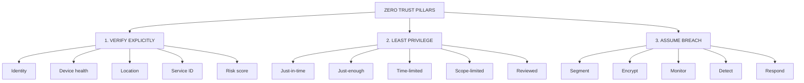
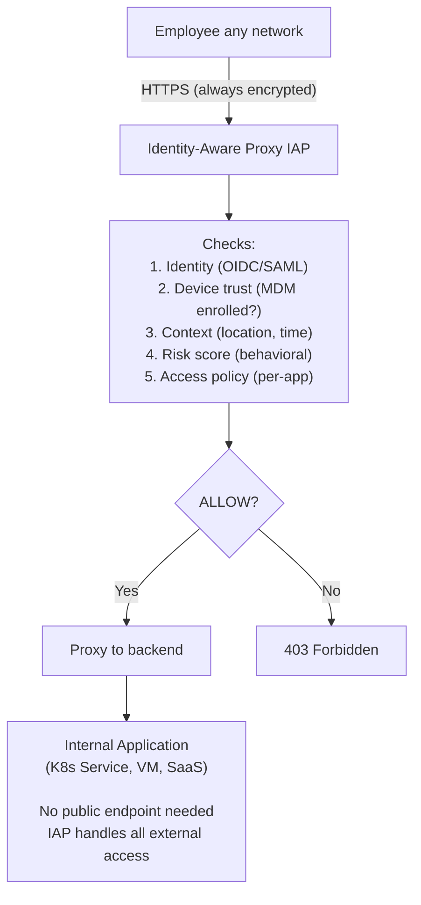
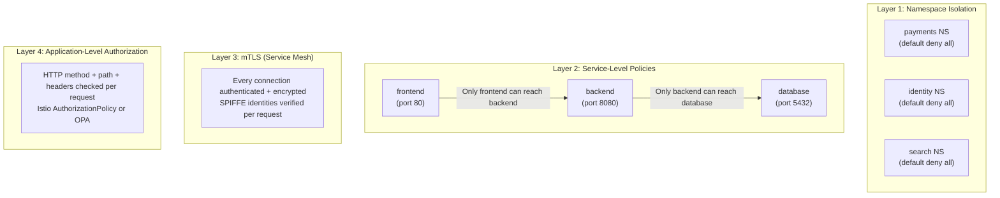
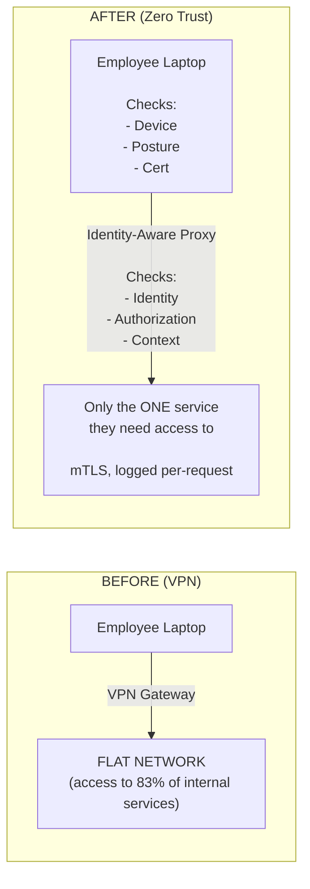

**Complexity**: [COMPLEX] | **Time to Complete**: 2.5h | **Prerequisites**: Kubernetes Networking, Identity & Access Management, Service Mesh Basics

## What You'll Be Able to Do

After completing this module, you will be able to:

- **Design** zero trust network architectures for Kubernetes using service mesh mTLS, network policies, and SPIFFE identities.
- **Implement** workload identity verification with SPIFFE/SPIRE across multi-cluster and multi-cloud environments.
- **Evaluate** micro-segmentation policies that enforce least-privilege network access at the pod and service level.
- **Compare** traditional VPN-based perimeter security with Identity-Aware Proxies (IAP) for human-to-machine access.
- **Diagnose** unauthorized lateral movement attempts using default-deny network strategies and layer 7 authorization policies.

---

## Why This Module Matters

Organizations that rely on perimeter-based VPN access can suffer serious breaches when attackers reuse stolen credentials and then move laterally across broadly reachable internal services before detection. The lesson is that network location should not substitute for identity and authorization.

This is the fundamental flaw of perimeter security: it creates a hard outer shell and a soft, vulnerable interior. A traditional VPN gives you an all-or-nothing binary state. You are either considered outside and have absolutely no access, or you are inside and have access to almost everything on the corporate flat network. In a modern computing environment where contractors, remote employees, managed cloud services, and ephemeral Kubernetes clusters all need varying levels of granular access, the perimeter model is dangerously inadequate and operationally brittle.

Zero Trust flips this model entirely. Each request should prove its identity, demonstrate it is authorized for the specific action, and pass through policy evaluation before being granted access. This applies regardless of whether the request originates from a deep internal data center, a Kubernetes pod, an employee's laptop at a coffee shop, or a third-party cloud service. In this module, you will learn the core principles of Zero Trust architecture, how Identity-Aware Proxies work, how to implement micro-segmentation in Kubernetes, how to replace legacy VPNs, and how to secure your software supply chain using SLSA frameworks.

---

## Zero Trust Principles

Zero trust is not a single product or tool you can buy off the shelf. It is an architectural mindset and a set of guiding principles designed to eliminate implicit trust from IT systems. Let us explore the foundational concepts that make zero trust effective in a hybrid cloud environment.

### The Three Pillars

The entire zero trust philosophy rests on [three major pillars](https://learn.microsoft.com/en-us/security/zero-trust/adopt/zero-trust-adoption-overview). Every architectural decision you make should map back to one of these core tenets.



Let us break down what these pillars mean in a practical Kubernetes context:
1. Verify Explicitly: Never rely on network location (like an internal IP address range) as a proxy for identity. A pod in the `payments` namespace must present a cryptographic identity (like a SPIFFE verifiable document) to prove it is the payment service, and its request must be evaluated against context such as device health or risk scores.
2. Least Privilege: Provide access only to the specific resources required, only for the duration needed, and only with the minimum necessary permissions. Just-in-time access and scope-limited tokens prevent long-lived credentials from being exploited if leaked.
3. Assume Breach: Design your architecture under the assumption that attackers are already inside your network. This forces you to segment networks aggressively, encrypt all data in transit (mTLS), and implement comprehensive monitoring to detect anomalies rapidly.

Think of traditional security like a medieval castle with a moat. Once you lower the drawbridge (VPN) and someone walks in, they can freely roam the courtyard, the armory, and the kitchen. Zero trust is like a modern high-security research facility. Having a badge gets you in the front door, but every single room, elevator, and filing cabinet requires you to swipe that badge again. Furthermore, the system checks if you are scheduled to be in that room at that specific time, and security cameras monitor your behavior while you are inside.

### Zero Trust vs Perimeter Security

| Aspect | Perimeter Security | Zero Trust |
| :--- | :--- | :--- |
| **Trust model** | Inside network = trusted | Nothing trusted by default |
| **Network access** | VPN grants broad access | Per-resource access based on identity + context |
| **Lateral movement** | Easy once inside | Micro-segmented, each service independently secured |
| **Authentication** | Once at VPN login | Continuous, per-request |
| **Authorization** | Network-level (IP, VLAN) | Application-level (identity, role, context) |
| **Encryption** | At the perimeter (TLS termination) | Everywhere (mTLS between all services) |
| **Monitoring** | Perimeter logs (firewall) | Every transaction logged and analyzed |
| **Kubernetes impact** | Cluster accessible via VPN | Each pod/service independently authenticated |

---

## BeyondCorp: Google's Zero Trust Implementation

> **Stop and think**: If there is no VPN, how do employees securely access internal applications without exposing those applications to the public internet?

Google pioneered Zero Trust at enterprise scale with [BeyondCorp, their internal access model that eliminated the corporate VPN entirely](https://www.usenix.org/publications/login/dec14/ward). Every Google employee accesses internal applications the same way from any network. There is no concept of a "corporate network" that grants additional trust or privileges.

### BeyondCorp Architecture

The BeyondCorp architecture replaces the network perimeter with an identity and context-aware proxy. The proxy acts as the single gateway to internal applications.



In this model, the Identity-Aware Proxy (IAP) is the brain of the operation. It intercepts every request and performs a rigorous evaluation before forwarding traffic. The application itself can reside anywhere -- in a local data center, an AWS VPC, or a managed Kubernetes cluster -- and never needs to expose a public IP address or manage its own authentication logic.

### Identity-Aware Proxy Implementations

There are several ways to implement an IAP depending on your cloud provider and operational preferences.

| Provider | Service | How It Works |
| :--- | :--- | :--- |
| **GCP** | Cloud IAP | [Built-in proxy for GCE, GKE, App Engine. Checks Google Identity + device trust via Endpoint Verification.](https://docs.cloud.google.com/iap/docs) |
| **AWS** | Verified Access | Evaluates identity (IAM Identity Center) + device posture (Jamf, CrowdStrike) per request. Runs at the VPC level. |
| **Azure** | Azure AD Application Proxy | [Proxies requests to on-prem/cloud apps. Evaluates Conditional Access policies per request.](https://learn.microsoft.com/en-us/azure/active-directory/app-proxy/application-proxy-secure-api-access) |
| **Open Source** | Self-hosted identity-aware proxies | Self-hosted proxies can integrate with identity providers, but you must operate and secure the access layer yourself. |

### AWS Verified Access for Kubernetes

If you are operating in AWS, Verified Access provides a native way to implement Zero Trust without managing proxy infrastructure yourself. [Verified Access integrates directly with your Identity Provider (IdP) and your device management solutions to evaluate trust on every request.](https://docs.aws.amazon.com/verified-access/latest/ug/how-it-works.html)

The following script demonstrates how to configure AWS Verified Access to protect a Kubernetes Ingress endpoint.

```bash
# Create a Verified Access trust provider (connects to your IdP)
VA_TRUST=$(aws ec2 create-verified-access-trust-provider \
  --trust-provider-type user \
  --user-trust-provider-type oidc \
  --oidc-options '{
    "Issuer": "https://company.okta.com/oauth2/default",
    "AuthorizationEndpoint": "https://company.okta.com/oauth2/default/v1/authorize",
    "TokenEndpoint": "https://company.okta.com/oauth2/default/v1/token",
    "UserInfoEndpoint": "https://company.okta.com/oauth2/default/v1/userinfo",
    "ClientId": "0oa1234567abcdefg",
    "ClientSecret": "secret123",
    "Scope": "openid profile email groups"
  }' \
  --query 'VerifiedAccessTrustProvider.VerifiedAccessTrustProviderId' --output text)

# Create a Verified Access instance
VA_INSTANCE=$(aws ec2 create-verified-access-instance \
  --query 'VerifiedAccessInstance.VerifiedAccessInstanceId' --output text)

# Attach the trust provider to the instance
aws ec2 attach-verified-access-trust-provider \
  --verified-access-instance-id $VA_INSTANCE \
  --verified-access-trust-provider-id $VA_TRUST

# Create an endpoint that points to your K8s ingress
VA_GROUP=$(aws ec2 create-verified-access-group \
  --verified-access-instance-id $VA_INSTANCE \
  --query 'VerifiedAccessGroup.VerifiedAccessGroupId' --output text)

aws ec2 create-verified-access-endpoint \
  --verified-access-group-id $VA_GROUP \
  --endpoint-type load-balancer \
  --attachment-type vpc \
  --domain-certificate-arn arn:aws:acm:us-east-1:123456789012:certificate/abc-123 \
  --application-domain dashboard.company.com \
  --endpoint-domain-prefix dashboard \
  --load-balancer-options '{
    "LoadBalancerArn": "arn:aws:elasticloadbalancing:us-east-1:123456789012:loadbalancer/app/k8s-ingress/abc123",
    "Port": 443,
    "Protocol": "https",
    "SubnetIds": ["subnet-aaa", "subnet-bbb"]
  }' \
  --policy-document '{
    "Version": "2012-10-17",
    "Statement": [{
      "Effect": "Allow",
      "Principal": "*",
      "Action": "ec2:*",
      "Resource": "*",
      "Condition": {
        "StringEquals": {
          "verified_access.groups": ["engineering"]
        }
      }
    }]
  }'
```

### Pomerium: Open-Source Identity-Aware Proxy for Kubernetes

For organizations that prefer open-source solutions or operate across multiple clouds, Pomerium is an excellent choice. It integrates seamlessly into Kubernetes and can route traffic based on OIDC claims, including device trust attributes.

```yaml
# Deploy Pomerium as an IAP in front of Kubernetes services
apiVersion: v1
kind: ConfigMap
metadata:
  name: pomerium-config
  namespace: pomerium
data:
  config.yaml: |
    authenticate_service_url: https://authenticate.company.com
    identity_provider: oidc
    identity_provider_url: https://company.okta.com/oauth2/default
    identity_provider_client_id: 0oa1234567abcdefg
    identity_provider_client_secret_file: /secrets/idp-client-secret

    policy:
      # ArgoCD: only platform engineers
      - from: https://argocd.company.com
        to: http://argocd-server.argocd.svc.cluster.local:80
        allowed_groups:
          - platform-engineers
        cors_allow_preflight: true
        preserve_host_header: true

      # Grafana: all engineers, read-only for non-SRE
      - from: https://grafana.company.com
        to: http://grafana.monitoring.svc.cluster.local:3000
        allowed_groups:
          - all-engineers
        set_request_headers:
          X-Grafana-Role: |
            {{- if .Groups | has "sre-team" -}}Admin{{- else -}}Viewer{{- end -}}

      # Backstage: all engineers
      - from: https://backstage.company.com
        to: http://backstage.backstage.svc.cluster.local:7007
        allowed_groups:
          - all-engineers

      # Kubernetes Dashboard: platform team only, with device trust
      - from: https://k8s-dashboard.company.com
        to: http://kubernetes-dashboard.kubernetes-dashboard.svc.cluster.local:443
        tls_skip_verify: true
        allowed_groups:
          - platform-engineers
        allowed_idp_claims:
          device_trust:
            - "managed"
```

---

## Micro-Segmentation in Kubernetes

> **Pause and predict**: If an attacker compromises a frontend pod in a default Kubernetes cluster, what prevents them from reaching the database pod directly?

Micro-segmentation applies the Zero Trust principle of "assume breach" directly at the network level. Instead of a flat network where any pod can talk to any other pod across the cluster, micro-segmentation restricts communication to only the explicitly allowed and required paths.

### Defense in Depth with Network Policies

A robust zero trust deployment requires multiple layers of policy enforcement. If one layer fails or is misconfigured, the next layer acts as a safety net.



### Comprehensive Network Policy Set

> **Pause and predict**: If you apply a default-deny NetworkPolicy to a namespace, what happens to the DNS resolution for the pods within that namespace?

To build a true zero trust environment in Kubernetes, you must start with a default-deny posture. By explicitly denying all traffic, you ensure that no service can communicate unless a policy explicitly allows it. We separate the comprehensive network policy set into individual definitions to guarantee strict YAML compliance across all parsers.

The first step is establishing the default-deny baseline for the namespace.

```yaml
# Layer 1: Default deny all ingress and egress in every namespace
apiVersion: networking.k8s.io/v1
kind: NetworkPolicy
metadata:
  name: default-deny-all
  namespace: payments
spec:
  podSelector: {}
  policyTypes:
    - Ingress
    - Egress
```

Once default-deny is in place, [pods cannot even resolve DNS names. We must explicitly allow egress to the cluster DNS provider.](https://kubernetes.io/docs/concepts/services-networking/network-policies/)

```yaml
# Layer 2: Allow DNS resolution (required for all pods)
apiVersion: networking.k8s.io/v1
kind: NetworkPolicy
metadata:
  name: allow-dns
  namespace: payments
spec:
  podSelector: {}
  policyTypes:
    - Egress
  egress:
    - to: []
      ports:
        - protocol: TCP
          port: 53
        - protocol: UDP
          port: 53
```

Next, we allow the ingress controller to send traffic to the frontend application.

```yaml
# Layer 2: Frontend can receive traffic from ingress controller
apiVersion: networking.k8s.io/v1
kind: NetworkPolicy
metadata:
  name: allow-ingress-to-frontend
  namespace: payments
spec:
  podSelector:
    matchLabels:
      app: payment-frontend
  ingress:
    - from:
        - namespaceSelector:
            matchLabels:
              kubernetes.io/metadata.name: ingress-nginx
          podSelector:
            matchLabels:
              app.kubernetes.io/name: ingress-nginx
      ports:
        - protocol: TCP
          port: 8080
```

We then allow the frontend application to communicate exclusively with the backend application.

```yaml
# Layer 2: Frontend can talk to backend API only
apiVersion: networking.k8s.io/v1
kind: NetworkPolicy
metadata:
  name: frontend-to-backend
  namespace: payments
spec:
  podSelector:
    matchLabels:
      app: payment-frontend
  policyTypes:
    - Egress
  egress:
    - to:
        - podSelector:
            matchLabels:
              app: payment-backend
      ports:
        - protocol: TCP
          port: 8080
```

The backend needs access to the database. We explicitly allow this path, ensuring the frontend cannot bypass the backend to access the data directly.

```yaml
# Layer 2: Backend can talk to database only
apiVersion: networking.k8s.io/v1
kind: NetworkPolicy
metadata:
  name: backend-to-database
  namespace: payments
spec:
  podSelector:
    matchLabels:
      app: payment-backend
  policyTypes:
    - Egress
  egress:
    - to:
        - podSelector:
            matchLabels:
              app: payment-database
      ports:
        - protocol: TCP
          port: 5432
```

Finally, the backend requires access to an external third-party payment gateway. We restrict egress to the specific IP block of the external provider.

```yaml
# Layer 2: Backend can talk to external payment gateway
apiVersion: networking.k8s.io/v1
kind: NetworkPolicy
metadata:
  name: backend-to-payment-gateway
  namespace: payments
spec:
  podSelector:
    matchLabels:
      app: payment-backend
  policyTypes:
    - Egress
  egress:
    - to:
        - ipBlock:
            cidr: 203.0.113.0/24  # Payment gateway IP range
      ports:
        - protocol: TCP
          port: 443
```

### Istio Authorization Policies (Layer 4)

While Network Policies control traffic at the IP and port level, a service mesh like Istio allows you to enforce zero trust at the application layer. [Istio uses SPIFFE identities to authenticate services and Authorization Policies to determine if a specific request path and HTTP method are allowed.](https://istio.io/latest/docs/ops/best-practices/security/) We separate these documents for reliable parsing.

First, we define an authorization policy that allows specific service accounts to perform exact HTTP methods on targeted paths.

```yaml
# Only the payment-frontend service account can call the payment-backend
apiVersion: security.istio.io/v1
kind: AuthorizationPolicy
metadata:
  name: payment-backend-authz
  namespace: payments
spec:
  selector:
    matchLabels:
      app: payment-backend
  action: ALLOW
  rules:
    - from:
        - source:
            principals:
              - "cluster.local/ns/payments/sa/payment-frontend"
      to:
        - operation:
            methods: ["GET", "POST"]
            paths: ["/api/v1/payments/*", "/api/v1/refunds/*"]
    - from:
        - source:
            principals:
              - "cluster.local/ns/monitoring/sa/prometheus"
      to:
        - operation:
            methods: ["GET"]
            paths: ["/metrics"]
```

To ensure comprehensive coverage, we must explicitly deny all other principals from accessing the backend service. This prevents lateral movement from compromised workloads.

```yaml
# Deny all other access to payment-backend
apiVersion: security.istio.io/v1
kind: AuthorizationPolicy
metadata:
  name: payment-backend-deny-all
  namespace: payments
spec:
  selector:
    matchLabels:
      app: payment-backend
  action: DENY
  rules:
    - from:
        - source:
            notPrincipals:
              - "cluster.local/ns/payments/sa/payment-frontend"
              - "cluster.local/ns/monitoring/sa/prometheus"
```

---

## Removing VPNs: The Path to Zero Trust Access

Legacy VPN solutions are widely considered an anti-pattern in modern cloud-native architectures. The goal is to migrate users from broad network-level access to precise, application-level access mediated by Identity-Aware Proxies.

### The VPN Replacement Architecture



### kubectl Access Without VPN

Accessing the Kubernetes API server securely is often the most challenging aspect of removing the VPN. [Teleport acts as a Zero Trust proxy specifically designed for infrastructure access, eliminating the need for long-lived static kubeconfig files and VPN access to the control plane.](https://github.com/gravitational/teleport) We deploy the agent and its configuration separately.

First, we deploy the Teleport agent.

```yaml
# Teleport for Zero Trust Kubernetes access
# teleport-kube-agent.yaml
apiVersion: apps/v1
kind: Deployment
metadata:
  name: teleport-kube-agent
  namespace: teleport
spec:
  replicas: 2
  selector:
    matchLabels:
      app: teleport-kube-agent
  template:
    metadata:
      labels:
        app: teleport-kube-agent
    spec:
      serviceAccountName: teleport-kube-agent
      containers:
        - name: teleport
          image: public.ecr.aws/gravitational/teleport-distroless:16
          args:
            - "--config=/etc/teleport/teleport.yaml"
          volumeMounts:
            - name: config
              mountPath: /etc/teleport
      volumes:
        - name: config
          configMap:
            name: teleport-config
```

Next, we provide the ConfigMap required for Teleport to join the proxy server.

```yaml
apiVersion: v1
kind: ConfigMap
metadata:
  name: teleport-config
  namespace: teleport
data:
  teleport.yaml: |
    version: v3
    teleport:
      join_params:
        token_name: kube-agent-token
        method: kubernetes
      proxy_server: teleport.company.com:443
    kubernetes_service:
      enabled: true
      listen_addr: 0.0.0.0:3027
      kube_cluster_name: eks-prod-east
      labels:
        environment: production
        provider: aws
        region: us-east-1
```

Once the agent is running, developers can access the cluster using the command line tool without ever connecting to a VPN. The developer workflow becomes entirely driven by identity and context.

```bash
# Developer workflow: access kubectl without VPN
# 1. Login via browser-based SSO
tsh login --proxy=teleport.company.com

# 2. List available clusters
tsh kube ls
# Cluster             Labels
# ------------------- ----------------------------------
# eks-prod-east       environment=production provider=aws
# aks-staging-west    environment=staging   provider=azure
# onprem-legacy       environment=production provider=onprem

# 3. Connect to a cluster
tsh kube login eks-prod-east

# 4. Use kubectl normally (proxied through Teleport)
kubectl get pods -n payments

# Every command is:
# - Authenticated via SSO (no static kubeconfig)
# - Authorized per Teleport RBAC (namespace/verb restrictions)
# - Logged with session recording
# - Time-limited (session expires after configured duration)
```

---

## SLSA in Enterprise CI/CD

> **Stop and think**: Even with perfect network security, how could an attacker compromise a workload before it is even deployed to Kubernetes?

Supply chain security is a critical component of a comprehensive Zero Trust strategy. If an attacker can inject malicious code into your container image during the build process, runtime network policies will not stop the compromised code from executing its primary function. SLSA (Supply-chain Levels for Software Artifacts) provides a rigorous framework for securing the CI/CD pipeline and ensuring the integrity of the software you deploy.

### SLSA Levels

| Level | Requirement | What It Prevents |
| :--- | :--- | :--- |
| **SLSA 1** | Build process documented | "How was this built?" is answerable |
| **SLSA 2** | Version-controlled build, authenticated provenance | Source tampering, build reproducibility |
| **SLSA 3** | Hardened build platform, non-falsifiable provenance | Compromised build system, forged attestations |
| **SLSA 4** | Two-person review, hermetic builds | Insider threats, dependency confusion |

### Implementing SLSA for Kubernetes Deployments

To implement SLSA effectively, you must integrate signing into your CI/CD pipeline and enforce verification at the Kubernetes admission controller level. The following GitHub Actions workflow demonstrates building an image, generating provenance, and signing it using keyless authentication with Sigstore.

```yaml
# GitHub Actions pipeline with SLSA provenance
name: Build and Deploy with SLSA
on:
  push:
    branches: [main]

permissions:
  contents: read
  packages: write
  id-token: write    # Required for OIDC-based signing

jobs:
  build:
    runs-on: ubuntu-latest
    outputs:
      digest: ${{ steps.build.outputs.digest }}

    steps:
      - uses: actions/checkout@v4

      - name: Build container image
        id: build
        run: |
          docker build -t ghcr.io/company/payment-service:${{ github.sha }} .
          DIGEST=$(docker inspect --format='{{index .RepoDigests 0}}' ghcr.io/company/payment-service:${{ github.sha }} | cut -d@ -f2)
          echo "digest=$DIGEST" >> $GITHUB_OUTPUT

      - name: Push to registry
        run: |
          echo "${{ secrets.GITHUB_TOKEN }}" | docker login ghcr.io -u ${{ github.actor }} --password-stdin
          docker push ghcr.io/company/payment-service:${{ github.sha }}

      - name: Sign image with cosign (keyless)
        uses: sigstore/cosign-installer@v3
      - run: |
          cosign sign --yes \
            ghcr.io/company/payment-service@${{ steps.build.outputs.digest }}

      - name: Generate SLSA provenance
        uses: slsa-framework/slsa-github-generator/.github/workflows/generator_container_slsa3.yml@v2.0.0
        with:
          image: ghcr.io/company/payment-service
          digest: ${{ steps.build.outputs.digest }}

  deploy:
    needs: build
    runs-on: ubuntu-latest
    steps:
      - name: Verify signature before deploy
        run: |
          cosign verify \
            --certificate-identity-regexp='https://github.com/company/.*' \
            --certificate-oidc-issuer='https://token.actions.githubusercontent.com' \
            ghcr.io/company/payment-service@${{ needs.build.outputs.digest }}

      - name: Deploy to Kubernetes
        run: |
          kubectl set image deployment/payment-service \
            payment-service=ghcr.io/company/payment-service@${{ needs.build.outputs.digest }} \
            -n payments
```

Deploying signed images is only half the battle. You must explicitly configure your cluster to reject images that lack a valid signature. Kyverno is an excellent policy engine that validates image signatures before the pods are allowed to run.

```yaml
# Kyverno policy: only allow signed images from our CI/CD
apiVersion: kyverno.io/v1
kind: ClusterPolicy
metadata:
  name: verify-slsa-provenance
spec:
  validationFailureAction: Enforce
  webhookTimeoutSeconds: 30
  rules:
    - name: verify-signature
      match:
        any:
          - resources:
              kinds:
                - Pod
      verifyImages:
        - imageReferences:
            - "ghcr.io/company/*"
          attestors:
            - entries:
                - keyless:
                    subject: "https://github.com/company/*"
                    issuer: "https://token.actions.githubusercontent.com"
                    rekor:
                      url: "https://rekor.sigstore.dev"
          mutateDigest: true
          verifyDigest: true
          required: true
```

---

## Did You Know?

Google has publicly described BeyondCorp as a multi-year migration away from privileged network access and traditional VPN-based trust for employee access.
SLSA is a supply-chain security framework centered on provenance and stronger assurances about how software artifacts are built and verified.
3. [Network Policies in Kubernetes are implemented by the CNI plugin, not by Kubernetes itself. This means that if your CNI does not support Network Policies (like the default kubenet in some managed services or Flannel without extension), your NetworkPolicy resources are silently ignored -- they exist as objects but have zero enforcement.](https://kubernetes.io/docs/concepts/services-networking/network-policies/) Use a CNI plugin with documented NetworkPolicy support, and verify enforcement in your own cluster rather than assuming policy objects are enforced. Always verify enforcement, not just resource creation.
Pomerium is an open-source identity-aware proxy; evaluate product fit, scale, and operating cost against your own environment rather than assuming universal savings figures.

---

## Common Mistakes

| Mistake | Why It Happens | How to Fix It |
| :--- | :--- | :--- |
| **Zero Trust without identity foundation** | Teams jump to micro-segmentation and IAP without first establishing strong identity (OIDC, device trust, service accounts). | Start with identity: deploy OIDC for humans, SPIFFE for services, device trust for endpoints. Then layer on micro-segmentation and IAP. |
| **Network Policies without default deny** | Teams add "allow" policies but never set the default deny baseline. Pods can still communicate freely on paths without explicit policies. | Always start with a default-deny NetworkPolicy in every namespace. Then add explicit allow policies for each legitimate communication path. |
| **mTLS in the mesh but plaintext sidecars** | [Service mesh provides mTLS between proxies, but the connection from the proxy to the application container inside the same pod is plaintext on localhost.](https://istio.io/latest/docs/ops/configuration/traffic-management/tls-configuration/) | This is expected behavior -- localhost traffic within a pod is considered trusted. If you need end-to-end encryption (e.g., for FIPS compliance), the application itself must implement TLS. |
| **VPN removal without alternative** | Security team removes the VPN before deploying IAP or Teleport. Developers cannot access anything. Shadow IT VPN tunnels appear. | Deploy the Zero Trust access layer first and run it alongside the VPN long enough to validate real access patterns before decommissioning the VPN. |
| **Image signing without admission enforcement** | CI/CD pipeline signs images with cosign, but no admission webhook verifies signatures. Unsigned images can still be deployed. | Deploy Kyverno or Gatekeeper with image verification policies. Signing without enforcement is security theater. |
| **Overly broad Istio AuthorizationPolicies** | Teams write policies with `action: ALLOW` that match too broadly, effectively allowing everything. The policy exists but does not restrict. | Use deny-by-default: start with an AuthorizationPolicy that denies all, then add specific allow rules for each legitimate path. Test with `istioctl analyze`. |

---

## Quiz

<details>
<summary>Question 1: A developer's laptop is stolen while logged into the corporate VPN with a valid kubeconfig file. Under a traditional perimeter security model, what happens next compared to a Zero Trust architecture using an Identity-Aware Proxy (IAP) like Teleport?</summary>

Under a **perimeter security model**, the attacker now has full network access to the corporate environment and the Kubernetes API server because the VPN provides a binary "inside/trusted" state. The valid kubeconfig file allows the attacker to authenticate to the cluster and execute commands with the developer's broad RBAC permissions, potentially compromising the entire environment. In a **Zero Trust architecture**, the stolen laptop and VPN connection are useless on their own. The IAP continuously verifies identity and context per request. Even if the attacker has the laptop, they would need the developer's SSO credentials and physical MFA token to establish a new session. Furthermore, the IAP enforces device health checks (which might fail if the device is reported stolen) and limits access strictly to the namespaces the developer needs, minimizing the blast radius. Trust is never binary; it is continuously evaluated.
</details>

<details>
<summary>Question 2: A team has deployed Network Policies with a default-deny rule, but pods can still communicate freely. What is the most likely cause?</summary>

The most likely cause is that **the CNI plugin does not support Network Policies**. NetworkPolicy resources are processed by the CNI plugin, not by the Kubernetes API server. If the cluster uses a CNI that does not implement the NetworkPolicy API (like Flannel without the Calico integration, or AWS VPC CNI without the network policy controller), the NetworkPolicy objects are stored in etcd but have no enforcement. The pods see no firewalling because there is no component enforcing the rules. To diagnose this issue, you should check which CNI is installed and verify its documentation for Network Policy support. For example, on EKS, you need to enable the VPC CNI network policy feature or install Calico alongside VPC CNI to achieve actual enforcement.
</details>

<details>
<summary>Question 3: A sophisticated attacker compromises your CI/CD worker node and injects malicious code during the build process of your payment service. How does SLSA Level 3 prevent this compromised container image from running in your production Kubernetes cluster?</summary>

SLSA Level 3 requires a **hardened build platform** and **non-falsifiable provenance**. The build platform is isolated so that individual builds cannot influence each other or tamper with the build process. Provenance is generated by the build platform itself (not by the build script), and it is cryptographically signed in a way that the build script cannot forge. If an attacker compromises a CI/CD worker, the provenance will either accurately reflect that the build used a modified source, or be absent entirely if the attacker attempts to bypass it. The admission webhook in the production cluster will then reject the artifact because it lacks valid, signed provenance from the trusted builder. The key insight is that at SLSA 3, provenance is a property of the build platform, not of the build, meaning the build cannot lie about its own origin.
</details>

<details>
<summary>Question 4: The CISO mandates the removal of the corporate VPN within 6 months in favor of a Zero Trust architecture. The infrastructure team proposes shutting down the VPN next weekend and routing all traffic through a newly installed Identity-Aware Proxy (IAP) to force adoption. Why is this approach likely to fail, and what sequence of steps should be taken instead?</summary>

This "rip and replace" approach is highly likely to fail and cause a massive business disruption because it assumes all applications and access patterns are immediately compatible with the IAP. Without a strong identity foundation already in place, users will be locked out of critical services, leading to shadow IT workarounds and halted productivity. Instead, the migration must be incremental and run in parallel to ensure continuous access. First, you must establish a strong identity foundation including SSO, MFA, and device MDM. Second, deploy the IAP alongside the existing VPN without disrupting current workflows. Third, incrementally migrate applications starting with low-risk internal tools before moving to production Kubernetes access. You must monitor access patterns over 3-6 months to ensure all legitimate traffic has shifted to the IAP before finally decommissioning the VPN.
</details>

<details>
<summary>Question 5: A security auditor reviews your cluster and notices you are using Istio Authorization Policies to restrict traffic between services, but you have no Kubernetes Network Policies. They flag this as a vulnerability. Why would they require both if Istio already controls access?</summary>

**Network Policies** operate at **Layer 3/4** (IP addresses and ports) and are enforced by the CNI plugin, meaning they work without a service mesh to control which pods can establish TCP/UDP connections. **Istio Authorization Policies** operate at **Layer 7** (HTTP methods, paths, headers, service identities) and require the Istio sidecar proxy to control what requests are allowed within an established connection. **You need both** for defense in depth because Network Policies prevent unauthorized network connections from being established at all, even if Istio is misconfigured or the sidecar is bypassed. Istio Authorization Policies provide fine-grained control that Network Policies cannot, such as allowing GET but denying DELETE. Network Policies act as the coarse guard at the door, while Istio policies provide the fine-grained access control inside the room.
</details>

<details>
<summary>Question 6: An engineer argues that implementing mTLS in your Istio service mesh makes Network Policies unnecessary because "mTLS already verifies identity and encrypts traffic." Why is this assertion dangerous in a Zero Trust environment?</summary>

While mTLS verifies the **identity** of the communicating parties via SPIFFE certificates and **encrypts** the traffic, it does not **restrict** which communications can happen. By default, Istio's mTLS allows any service with a valid mesh certificate to communicate with any other service. This means mTLS ensures that the caller is who they claim to be, but it does not ensure the caller is authorized for that specific action. You still need **AuthorizationPolicies** to restrict which identities can call which services at Layer 7. Furthermore, you need **Network Policies** as a fallback in case the Istio sidecar is bypassed by host-networked pods, init containers, or pods without sidecar injection. Relying solely on mTLS conflates authentication with authorization, which is a common and dangerous architectural mistake.
</details>

---

## Hands-On Exercise: Implement Zero Trust Micro-Segmentation

In this exercise, you will implement a multi-layered Zero Trust architecture in a kind cluster with Network Policies, RBAC, and simulated identity-aware access.

### Task 1: Create the Zero Trust Lab Cluster

First, provision a local Kubernetes environment configured with a CNI that respects network policies.

<details>
<summary>Solution</summary>

```bash
# Create a cluster with Calico CNI for Network Policy enforcement
cat <<'EOF' > /tmp/zero-trust-cluster.yaml
kind: Cluster
apiVersion: kind.x-k8s.io/v1alpha4
name: zero-trust-lab
networking:
  disableDefaultCNI: true
  podSubnet: 192.168.0.0/16
nodes:
  - role: control-plane
  - role: worker
  - role: worker
EOF

kind create cluster --config /tmp/zero-trust-cluster.yaml

# Install Calico for Network Policy enforcement
kubectl apply -f https://raw.githubusercontent.com/projectcalico/calico/v3.28.0/manifests/calico.yaml

# Wait for Calico to be ready
kubectl wait --for=condition=ready pod -l k8s-app=calico-node -n kube-system --timeout=120s
kubectl wait --for=condition=ready pod -l k8s-app=calico-kube-controllers -n kube-system --timeout=120s

echo "Cluster ready with Calico CNI (Network Policy support enabled)"
```

</details>

### Task 2: Deploy a Multi-Service Application

Deploy a simulated 3-tier application to test network flows.

<details>
<summary>Solution</summary>

```bash
# Create namespaces
kubectl create namespace payments
kubectl create namespace monitoring

# Deploy a 3-tier application
cat <<'EOF' | kubectl apply -f -
# Frontend
apiVersion: apps/v1
kind: Deployment
metadata:
  name: frontend
  namespace: payments
spec:
  replicas: 2
  selector:
    matchLabels:
      app: frontend
  template:
    metadata:
      labels:
        app: frontend
        tier: frontend
    spec:
      containers:
        - name: frontend
          image: nginx:1.27.3
          ports:
            - containerPort: 80
          resources:
            limits:
              cpu: 100m
              memory: 128Mi
---
apiVersion: v1
kind: Service
metadata:
  name: frontend
  namespace: payments
spec:
  selector:
    app: frontend
  ports:
    - port: 80
---
# Backend API
apiVersion: apps/v1
kind: Deployment
metadata:
  name: backend
  namespace: payments
spec:
  replicas: 2
  selector:
    matchLabels:
      app: backend
  template:
    metadata:
      labels:
        app: backend
        tier: backend
    spec:
      containers:
        - name: backend
          image: nginx:1.27.3
          ports:
            - containerPort: 80
          resources:
            limits:
              cpu: 100m
              memory: 128Mi
---
apiVersion: v1
kind: Service
metadata:
  name: backend
  namespace: payments
spec:
  selector:
    app: backend
  ports:
    - port: 80
---
# Database
apiVersion: apps/v1
kind: Deployment
metadata:
  name: database
  namespace: payments
spec:
  replicas: 1
  selector:
    matchLabels:
      app: database
  template:
    metadata:
      labels:
        app: database
        tier: database
    spec:
      containers:
        - name: database
          image: nginx:1.27.3
          ports:
            - containerPort: 80
          resources:
            limits:
              cpu: 100m
              memory: 128Mi
---
apiVersion: v1
kind: Service
metadata:
  name: database
  namespace: payments
spec:
  selector:
    app: database
  ports:
    - port: 80
EOF

kubectl wait --for=condition=ready pod -l app=frontend -n payments --timeout=60s
kubectl wait --for=condition=ready pod -l app=backend -n payments --timeout=60s
kubectl wait --for=condition=ready pod -l app=database -n payments --timeout=60s
```

</details>

### Task 3: Verify Flat Network (Before Zero Trust)

Before applying policies, confirm that the network is flat and all pods can communicate without restriction. This highlights the vulnerability of default Kubernetes networking.

<details>
<summary>Solution</summary>

```bash
echo "=== BEFORE ZERO TRUST: Flat Network ==="
echo ""
echo "Test: Frontend → Backend (should succeed - legitimate)"
kubectl exec -n payments deploy/frontend -- curl -s --max-time 3 backend.payments.svc.cluster.local || echo "FAILED"

echo ""
echo "Test: Frontend → Database (should succeed - PROBLEM: frontend should not access DB directly)"
kubectl exec -n payments deploy/frontend -- curl -s --max-time 3 database.payments.svc.cluster.local || echo "FAILED"

echo ""
echo "Test: Database → Frontend (should succeed - PROBLEM: DB should not call frontend)"
kubectl exec -n payments deploy/database -- curl -s --max-time 3 frontend.payments.svc.cluster.local || echo "FAILED"

echo ""
echo "CONCLUSION: Without Network Policies, every pod can talk to every other pod."
echo "This is the 'soft interior' problem of perimeter security."
```

</details>

### Task 4: Apply Zero Trust Network Policies

Secure the namespace by applying a default-deny posture and explicitly whitelisting required traffic paths.

<details>
<summary>Solution</summary>

```bash
cat <<'EOF' | kubectl apply -f -
# Step 1: Default deny ALL traffic
apiVersion: networking.k8s.io/v1
kind: NetworkPolicy
metadata:
  name: default-deny-all
  namespace: payments
spec:
  podSelector: {}
  policyTypes:
    - Ingress
    - Egress
---
# Step 2: Allow DNS for all pods
apiVersion: networking.k8s.io/v1
kind: NetworkPolicy
metadata:
  name: allow-dns
  namespace: payments
spec:
  podSelector: {}
  policyTypes:
    - Egress
  egress:
    - ports:
        - protocol: TCP
          port: 53
        - protocol: UDP
          port: 53
---
# Step 3: Frontend can receive from outside and send to backend only
apiVersion: networking.k8s.io/v1
kind: NetworkPolicy
metadata:
  name: frontend-policy
  namespace: payments
spec:
  podSelector:
    matchLabels:
      app: frontend
  policyTypes:
    - Ingress
    - Egress
  ingress:
    - {}  # Accept from any source (simulates ingress controller)
  egress:
    - to:
        - podSelector:
            matchLabels:
              app: backend
      ports:
        - port: 80
    - ports:
        - protocol: TCP
          port: 53
        - protocol: UDP
          port: 53
---
# Step 4: Backend accepts from frontend, can reach database only
apiVersion: networking.k8s.io/v1
kind: NetworkPolicy
metadata:
  name: backend-policy
  namespace: payments
spec:
  podSelector:
    matchLabels:
      app: backend
  policyTypes:
    - Ingress
    - Egress
  ingress:
    - from:
        - podSelector:
            matchLabels:
              app: frontend
      ports:
        - port: 80
  egress:
    - to:
        - podSelector:
            matchLabels:
              app: database
      ports:
        - port: 80
    - ports:
        - protocol: TCP
          port: 53
        - protocol: UDP
          port: 53
---
# Step 5: Database accepts from backend only, no egress
apiVersion: networking.k8s.io/v1
kind: NetworkPolicy
metadata:
  name: database-policy
  namespace: payments
spec:
  podSelector:
    matchLabels:
      app: database
  policyTypes:
    - Ingress
    - Egress
  ingress:
    - from:
        - podSelector:
            matchLabels:
              app: backend
      ports:
        - port: 80
  egress:
    - ports:
        - protocol: TCP
          port: 53
        - protocol: UDP
          port: 53
EOF

echo "Network Policies applied:"
kubectl get networkpolicy -n payments
```

</details>

### Task 5: Verify Zero Trust Enforcement

Test the application flows to ensure policies are correctly evaluated and lateral movement is blocked.

<details>
<summary>Solution</summary>

```bash
echo "=== AFTER ZERO TRUST: Micro-Segmented Network ==="
echo ""

echo "Test 1: Frontend → Backend (SHOULD PASS - legitimate path)"
kubectl exec -n payments deploy/frontend -- curl -s --max-time 3 backend.payments.svc.cluster.local && echo "PASS" || echo "BLOCKED"

echo ""
echo "Test 2: Frontend → Database (SHOULD BLOCK - frontend must go through backend)"
kubectl exec -n payments deploy/frontend -- curl -s --max-time 3 database.payments.svc.cluster.local 2>&1 && echo "PASS (BAD!)" || echo "BLOCKED (GOOD!)"

echo ""
echo "Test 3: Backend → Database (SHOULD PASS - legitimate path)"
kubectl exec -n payments deploy/backend -- curl -s --max-time 3 database.payments.svc.cluster.local && echo "PASS" || echo "BLOCKED"

echo ""
echo "Test 4: Database → Frontend (SHOULD BLOCK - DB should not initiate connections)"
kubectl exec -n payments deploy/database -- curl -s --max-time 3 frontend.payments.svc.cluster.local 2>&1 && echo "PASS (BAD!)" || echo "BLOCKED (GOOD!)"

echo ""
echo "Test 5: Database → external internet (SHOULD BLOCK - DB must not reach internet)"
kubectl exec -n payments deploy/database -- curl -s --max-time 3 https://example.com 2>&1 && echo "PASS (BAD!)" || echo "BLOCKED (GOOD!)"

echo ""
echo "CONCLUSION: Only legitimate communication paths are allowed."
echo "Lateral movement is prevented. The blast radius of a compromise is contained."
```

</details>

### Clean Up

Remove the cluster to free up local resources.

```bash
kind delete cluster --name zero-trust-lab
rm /tmp/zero-trust-cluster.yaml
```

### Success Criteria

- [ ] I deployed a multi-tier application in a flat network and verified unrestricted access
- [ ] I applied default-deny Network Policies to enforce Zero Trust
- [ ] I verified that only legitimate communication paths (frontend->backend->database) work
- [ ] I confirmed that unauthorized paths (frontend->database, database->frontend) are blocked
- [ ] I can explain the four layers of micro-segmentation
- [ ] I can describe how an Identity-Aware Proxy replaces a VPN
- [ ] I can explain how SLSA protects the CI/CD supply chain

---

## Next Module

With Zero Trust securing your infrastructure, it is time to optimize costs at enterprise scale. Head to [Module 10.10: FinOps at Enterprise Scale](../module-10.10-enterprise-finops/) to learn cloud economics, Enterprise Discount Programs, forecasting, chargeback models for shared clusters, and the true cost of multi-cloud operations.

## Sources

- [Microsoft Zero Trust adoption overview](https://learn.microsoft.com/en-us/security/zero-trust/adopt/zero-trust-adoption-overview) — Overview of Microsoft’s zero trust model, including core principles such as explicit verification, least privilege, and breach assumption.
- [BeyondCorp: A New Approach to Enterprise Security](https://www.usenix.org/publications/login/dec14/ward) — Primary public paper describing BeyondCorp and the move away from privileged intranet and VPN-based trust.
- [Google Cloud Identity-Aware Proxy documentation](https://docs.cloud.google.com/iap/docs) — Product documentation for protecting applications with identity-aware and device-aware access controls on Google Cloud.
- [AWS Verified Access: How it works](https://docs.aws.amazon.com/verified-access/latest/ug/how-it-works.html) — Explains how Verified Access evaluates each request using trust providers, user identity, device context, and policy.
- [Microsoft Entra Application Proxy secure API access](https://learn.microsoft.com/en-us/azure/active-directory/app-proxy/application-proxy-secure-api-access) — Describes publishing private applications behind Entra Application Proxy with authentication, authorization, and Conditional Access controls.
- [Kubernetes Network Policies](https://kubernetes.io/docs/concepts/services-networking/network-policies/) — Authoritative reference for default-deny behavior, DNS exceptions, and the requirement for network-plugin enforcement.
- [Istio security best practices](https://istio.io/latest/docs/ops/best-practices/security/) — Covers how mutual TLS and AuthorizationPolicy work together for service-to-service security in Istio.
- [Teleport](https://github.com/gravitational/teleport) — Upstream project for identity-based infrastructure access with SSO, short-lived credentials, audit trails, and Kubernetes access.
- [Istio TLS configuration](https://istio.io/latest/docs/ops/configuration/traffic-management/tls-configuration/) — Explains where Istio originates or terminates TLS and how sidecar-to-application traffic is handled.
- [Cosign verification documentation](https://github.com/sigstore/cosign/blob/main/doc/cosign_verify.md) — Documents keyless signature verification using expected certificate identity and OIDC issuer checks.
- [NIST SP 800-207: Zero Trust Architecture](https://csrc.nist.gov/pubs/sp/800/207/final) — Canonical zero trust architecture reference for the model, terminology, and design goals.
- [SLSA Framework Repository](https://github.com/slsa-framework/slsa) — Upstream home for the SLSA specification and provenance framework referenced in the module.
- [Lessons From BeyondCorp](https://www.usenix.org/publications/login/summer2017/peck) — Experience report on rolling out BeyondCorp-style access controls and the operational lessons from gradual migration.
