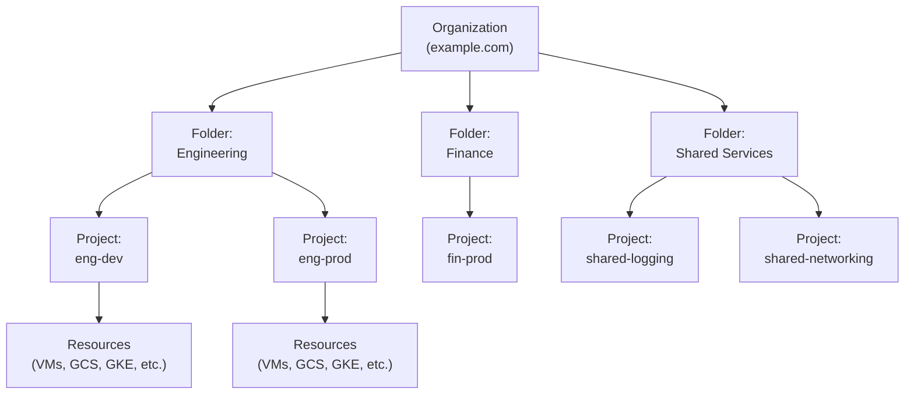
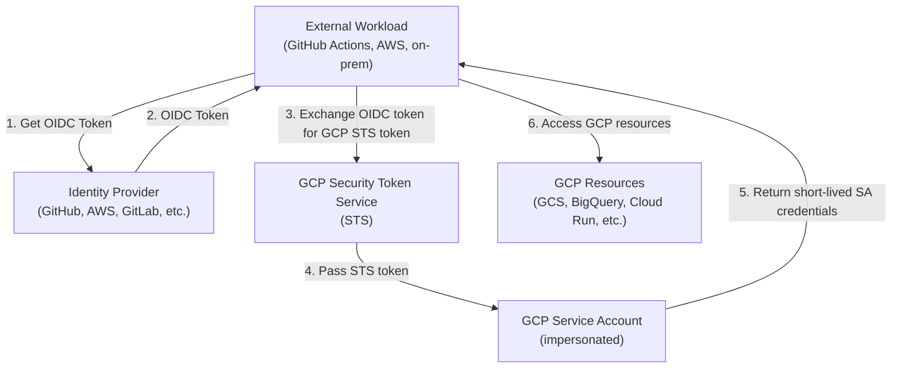

> **Complexity**: [MEDIUM] | **Time to Complete**: 2h | **Prerequisites**: Cloud Native 101

## What You'll Be Able to Do

When you finish this module, you will be able to configure IAM across the full resource hierarchy, run service accounts with Workload Identity Federation instead of exported keys, scope access with custom roles, and explain denials with Policy Troubleshooter and audit logs. The outcomes below are what you should be able to demonstrate in a real GCP organization:

- **Configure GCP IAM policies across the resource hierarchy (Organization, Folders, Projects) with proper inheritance**
- **Implement least-privilege service accounts with Workload Identity Federation to eliminate exported key files**
- **Design custom IAM roles that precisely scope permissions beyond predefined roles for production workloads**
- **Diagnose IAM policy evaluation failures using Policy Troubleshooter and audit log analysis**

---

## Why This Module Matters

In September 2020, a mid-sized fintech company discovered that their entire Google Cloud production environment had been compromised. The root cause was not a sophisticated exploit or a zero-day vulnerability. A developer had created a service account with Project Owner permissions "temporarily" to debug an integration issue with Cloud Storage. That service account key was committed to a private GitHub repository. When the repository was briefly made public during an open-source release, automated scanners harvested the key within minutes. Because the service account had Owner-level access to the production project, the attacker was able to exfiltrate customer financial records, spin up cryptocurrency mining instances across multiple regions, and delete audit logs. The total cost exceeded $2.3 million in direct damages, not including the regulatory fines that followed.

This incident reveals the fundamental truth about Google Cloud Platform security: **the resource hierarchy is your blast radius, and IAM is the control plane for everything**. Unlike traditional infrastructure where network firewalls form the primary defense, in GCP almost every action---creating a VM, reading a storage object, deploying a Cloud Run service---is governed by IAM. If your IAM posture is weak, every other security measure becomes irrelevant. An attacker with the right IAM permissions can bypass VPC firewalls, read encrypted data, and delete entire projects with a single API call.

In this module, you will learn how GCP organizes resources into a hierarchy (Organization, Folders, and Projects), how IAM policies are inherited through that hierarchy, and how to design access control that follows the principle of least privilege. You will understand the critical differences between basic roles, predefined roles, and custom roles. Most importantly, you will learn how to handle service accounts correctly---because misconfigured service accounts remain the number one attack vector in cloud breaches.

---

## The Resource Hierarchy: Your Organizational Blueprint

Before you can understand IAM in GCP, you must understand *where* IAM policies live. In GCP, resources are organized into a strict hierarchy, and IAM policies **inherit downward** through that hierarchy. This is fundamentally different from AWS, where each account is largely isolated and cross-account access requires explicit trust policies.

### The Four Levels



At the top, the **Organization** is the root node: it is created when you set up Google Workspace or Cloud Identity for your domain, and IAM policies bound here apply to every resource underneath. **Folders** are optional groupings for teams, environments, or business units (you can nest them up to ten levels, though more than three or four usually signals over-engineering); they are how you apply environment-wide guardrails, such as denying external IPs on every VM in a Production folder. **Projects** are the fundamental unit of ownership—every VM, bucket, and Cloud Run service lives in exactly one project, which also defines billing, API enablement, and the default scope for most IAM operations. Each project exposes three identifiers you will see constantly in commands and audit logs:

| Identifier | Example | Mutable | Unique Across |
| :--- | :--- | :--- | :--- |
| **Project Name** | "Engineering Dev" | Yes | Not unique (display only) |
| **Project ID** | `eng-dev-382910` | No (set at creation) | Globally unique, forever |
| **Project Number** | `481726359042` | No (auto-assigned) | Globally unique, forever |

Below the project line, **resources** are the concrete services and objects you create—VMs, databases, buckets, Pub/Sub topics, and everything else you bill and secure day to day.

> **Pause and predict**: If you move a Project from the "Engineering" folder to the "Finance" folder, what happens to the IAM policies applied to the Project?
> <details>
> <summary>Answer</summary>
> The project will stop inheriting permissions from the "Engineering" folder and begin inheriting permissions from the "Finance" folder after IAM propagation completes. Any IAM policies applied directly to the Project itself will remain unchanged. This dynamic inheritance is why moving projects across folders is a high-risk operation.
> </details>

### Policy Inheritance: The Cascade Effect

This is the single most important concept to understand about GCP IAM. **IAM policies are additive and inherit downward**. If you grant a user the `roles/editor` role at the Organization level, that user has Editor permissions on every single project in the entire organization. You cannot revoke an inherited permission at a lower level (though you can use Organization Policy Constraints or IAM Deny Policies to restrict specific actions).

```bash
# View the IAM policy at the organization level
gcloud organizations get-iam-policy ORGANIZATION_ID

# View the IAM policy at a folder level
gcloud resource-manager folders get-iam-policy FOLDER_ID

# View the IAM policy at a project level
gcloud projects get-iam-policy PROJECT_ID

# Check IAM bindings directly on this project
# (does NOT include inherited permissions from org/folders)
gcloud projects get-iam-policy PROJECT_ID \
  --flatten="bindings[].members" \
  --filter="bindings.members:user:alice@example.com" \
  --format="table(bindings.role)"
```

A practical analogy: Think of the resource hierarchy like a building. The Organization is the master key---anyone with the master key can open every door. Folders are floor-level keys, and Projects are individual room keys. You can always grant more specific access at lower levels, but you cannot take away access that was granted at a higher level (without using deny policies, which we will cover shortly).

### Organization Policies vs IAM Policies

New GCP practitioners often confuse **Organization Policies** with **IAM policies**, but they solve different problems: IAM answers *who may act*, while organization policies answer *what may exist* regardless of who is signed in. The table below contrasts the two so you reach for the right control when designing guardrails versus granting access.

| Aspect | IAM Policy | Organization Policy |
| :--- | :--- | :--- |
| **What it controls** | Who can do what (identity-based) | What is allowed to exist (resource-based) |
| **Example** | "Alice can create VMs" | "No VM can have an external IP" |
| **Scope** | Org, Folder, Project, Resource | Org, Folder, Project |
| **Override behavior** | Additive (cannot revoke inherited) | Can override parent (with boolean constraints) |
| **Use case** | Access control | Guardrails, compliance enforcement |

```bash
# List available organization policy constraints
gcloud org-policies list --organization=ORGANIZATION_ID

# Set a constraint to deny external IPs on all VMs in a folder
gcloud org-policies set-policy policy.yaml --folder=FOLDER_ID
```

To block external IPs on every VM under a folder, you attach an organization policy document such as the following `policy.yaml` (the constraint name is what the API enforces; the list policy denies all values):

```yaml
constraint: constraints/compute.vmExternalIpAccess
listPolicy:
  allValues: DENY
```

---

## Principals and IAM Roles: The Access Control Model

### Principals: Who Can Act?

A **principal** in GCP is any identity that can be authenticated and then authorized. Production environments mix several principal types, and the member string format in IAM bindings must match exactly what the policy engine expects:

| Principal Type | Format | Use Case |
| :--- | :--- | :--- |
| **Google Account** | `user:alice@example.com` | Human users with Google accounts |
| **Service Account** | `serviceAccount:sa@project.iam.gserviceaccount.com` | Applications, VMs, Cloud Run services |
| **Google Group** | `group:devs@example.com` | Teams of humans (recommended over individual grants) |
| **Google Workspace Domain** | `domain:example.com` | Everyone in the organization |
| **allAuthenticatedUsers** | `allAuthenticatedUsers` | Any Google account (dangerous) |
| **allUsers** | `allUsers` | Anyone on the internet (very dangerous) |

**Best Practice**: Use Google Groups for human access in most cases. Granting roles to individual users creates an audit nightmare and makes offboarding error-prone. When an engineer leaves, you remove them from the group. You do not need to hunt through dozens of IAM policies across projects.

### The Three Types of Roles

GCP has three categories of IAM roles, and understanding the distinction is critical for both security and operations because the wrong category is how teams accidentally grant thousands of permissions at once.

#### 1. Basic Roles (Formerly "Primitive Roles")

**Basic roles** are the broadest grants in GCP: they predate fine-grained IAM and are considered **legacy roles** that should not appear on production projects except during initial bootstrap.

| Role | Permissions | When to Use |
| :--- | :--- | :--- |
| `roles/viewer` | Read-only access to all resources | Rarely in production; prefer narrower predefined roles |
| `roles/editor` | Read-write access to most resources | Never in production (can modify everything) |
| `roles/owner` | Full control including IAM and billing | Only for initial setup, then remove |

The `roles/editor` role is particularly dangerous because it grants write access to nearly everything *except* IAM policy modification. Many teams use it as a shortcut for developers, not realizing it allows deleting databases, modifying firewall rules, and reading secrets.

#### 2. Predefined Roles

**Predefined roles** are maintained by Google for each service and are the roles you should reach for day to day; they bundle permissions for realistic job functions without spanning the entire project.

```bash
# List all predefined roles (there are 1000+)
gcloud iam roles list --filter="name:roles/"

# View the permissions in a specific predefined role
gcloud iam roles describe roles/storage.objectViewer

# Search for roles related to a specific service
gcloud iam roles list --filter="name:roles/cloudsql"
```

The table below lists predefined roles you will reference constantly when wiring applications, operators, and auditors—notice how each name maps to a narrow API surface rather than a job title.

| Role | What It Grants |
| :--- | :--- |
| `roles/storage.objectViewer` | Read GCS objects (not list buckets) |
| `roles/storage.objectAdmin` | Full control over GCS objects |
| `roles/compute.instanceAdmin.v1` | Manage Compute Engine instances |
| `roles/run.invoker` | Invoke Cloud Run services |
| `roles/cloudsql.client` | Connect to Cloud SQL instances |
| `roles/logging.viewer` | Read Cloud Logging logs |
| `roles/monitoring.viewer` | Read Cloud Monitoring metrics |
| `roles/iam.serviceAccountUser` | Act as (impersonate) a service account |

> **Stop and think**: Your developers need to deploy Cloud Run services and connect them to Cloud SQL. Should you create a custom role combining both sets of permissions, or grant multiple predefined roles?
> <details>
> <summary>Answer</summary>
> You should grant multiple predefined roles (e.g., `roles/run.admin` and `roles/cloudsql.client`). Predefined roles are maintained by Google and automatically updated when new permissions are added to a service. Custom roles must be manually maintained, which becomes an operational burden. Only use custom roles when predefined roles are explicitly too broad or too narrow.
> </details>

#### 3. Custom Roles

When predefined roles are either too broad or too narrow for a regulated workload, you can create **custom roles** that include exactly the permission strings you want—and nothing else.

```bash
# Create a custom role from a YAML definition
gcloud iam roles create customStorageReader \
  --project=my-project \
  --file=role-definition.yaml

# role-definition.yaml
cat <<'YAML'
title: "Custom Storage Reader"
description: "Can read objects and list buckets, but not delete"
stage: "GA"
includedPermissions:
  - storage.buckets.list
  - storage.objects.get
  - storage.objects.list
YAML

# List custom roles in a project
gcloud iam roles list --project=my-project

# Update a custom role (add a permission)
gcloud iam roles update customStorageReader \
  --project=my-project \
  --add-permissions=storage.buckets.get
```

Custom roles trade precision for operational ownership: they can be created at the organization or project level (not on folders), support up to 3,000 permissions, and exclude some permissions whose launch stage is `TESTING` or `NOT_SUPPORTED` in the IAM catalog. Most importantly, Google does not auto-update your custom roles when a service ships new APIs—you must review release notes and patch roles yourself, unlike predefined roles that track service growth for you.

### IAM Deny Policies

Introduced in 2022, **IAM Deny Policies** solve the inheritance problem that frustrates security teams: allow policies are additive, so you cannot subtract an inherited `roles/editor` at a child project, but a deny policy can block specific permissions for everyone except principals you list as exceptions.

```bash
# Create a deny policy that prevents anyone from deleting projects
# (even if they have Owner role)
gcloud iam policies create prevent-project-deletion \
  --attachment-point="cloudresourcemanager.googleapis.com/organizations/ORGANIZATION_ID" \
  --kind=denypolicies \
  --policy-file=deny-policy.json
```

```json
{
  "displayName": "Prevent Project Deletion",
  "rules": [
    {
      "denyRule": {
        "deniedPrincipals": [
          "principalSet://goog/public:all"
        ],
        "exceptionPrincipals": [
          "principal://goog/subject/admin@example.com"
        ],
        "deniedPermissions": [
          "cloudresourcemanager.googleapis.com/projects.delete"
        ]
      }
    }
  ]
}
```

At evaluation time, deny policies run **before** allow policies, and organization policy constraints run even earlier. The full decision stack is worth memorizing because Policy Troubleshooter walks the same sequence when it explains a `403`:

```text
1. Organization Policy Constraints  →  "Is this action even allowed to exist?"
2. IAM Deny Policies                →  "Is this action explicitly denied?"
3. IAM Allow Policies               →  "Is this action explicitly allowed?"
4. Default: DENY                    →  "If no allow policy matches, deny."
```

---

## Service Accounts: Machine Identity Done Right

Service accounts are the most critical---and most frequently misconfigured---aspect of GCP IAM. They represent non-human identities used by applications, VMs, and services.

### Types of Service Accounts

| Type | Created By | Example | Managed By |
| :--- | :--- | :--- | :--- |
| **User-managed** | You | `my-app@my-project.iam.gserviceaccount.com` | You (full control) |
| **Default** | GCP (auto) | `PROJECT_NUMBER-compute@developer.gserviceaccount.com` | You (but auto-created) |
| **Google-managed** | GCP | `service-PROJECT_NUMBER@compute-system.iam.gserviceaccount.com` | Google (do not modify) |

**War Story**: The default Compute Engine service account (`PROJECT_NUMBER-compute@developer.gserviceaccount.com`) is automatically granted the `roles/editor` role on the project. This means that every VM you create without specifying a service account gets Editor access to your entire project. This is the single most common privilege escalation vector in GCP. Create dedicated service accounts with minimal permissions whenever possible.

```bash
# Create a dedicated service account
gcloud iam service-accounts create gcs-reader \
  --display-name="GCS Reader for Data Pipeline" \
  --project=my-project

# Grant it only the permissions it needs
gcloud projects add-iam-binding my-project \
  --member="serviceAccount:gcs-reader@my-project.iam.gserviceaccount.com" \
  --role="roles/storage.objectViewer"

# Create a VM using this dedicated service account
gcloud compute instances create data-worker \
  --service-account=gcs-reader@my-project.iam.gserviceaccount.com \
  --scopes=cloud-platform \
  --zone=us-central1-a
```

### Service Account Keys: The Danger Zone

**Service account keys** are JSON files containing long-lived credentials—the GCP equivalent of AWS access keys—and they are equally dangerous because they work from any network until someone deletes them.

```bash
# Creating a key (avoid this whenever possible)
gcloud iam service-accounts keys create key.json \
  --iam-account=my-sa@my-project.iam.gserviceaccount.com

# List existing keys for a service account
gcloud iam service-accounts keys list \
  --iam-account=my-sa@my-project.iam.gserviceaccount.com

# Delete a key
gcloud iam service-accounts keys delete KEY_ID \
  --iam-account=my-sa@my-project.iam.gserviceaccount.com
```

**Rule of thumb**: If you are creating a service account key, you are probably doing it wrong. In nearly every case, there is a better alternative:

| Scenario | Instead of Keys, Use |
| :--- | :--- |
| Code running on GCE/GKE | Attached service account (metadata server) |
| Cloud Run / Cloud Functions | Attached service account (automatic) |
| CI/CD from GitHub Actions | Workload Identity Federation |
| CI/CD from GitLab | Workload Identity Federation |
| On-premises application | Workload Identity Federation |
| Local development | `gcloud auth application-default login` |

### Service Account Impersonation

Instead of downloading keys, you can **impersonate** a service account so the Security Token Service mints short-lived credentials for a single command or shell session, which means nothing sensitive lands on disk in a CI runner or laptop.

```bash
# Impersonate a service account for a single command
gcloud storage ls gs://my-bucket \
  --impersonate-service-account=gcs-reader@my-project.iam.gserviceaccount.com

# Set impersonation for all subsequent gcloud commands
gcloud config set auth/impersonate_service_account \
  gcs-reader@my-project.iam.gserviceaccount.com

# To stop impersonating
gcloud config unset auth/impersonate_service_account
```

Impersonation only succeeds when the human or service account calling `gcloud` already holds `roles/iam.serviceAccountTokenCreator` (or a broader role that includes `iam.serviceAccounts.getAccessToken`) on the target service account, because that permission is what authorizes the token exchange.

---

## Workload Identity Federation: Keyless Authentication

Workload Identity Federation allows external identities (from AWS, Azure, GitHub Actions, GitLab CI, or any OIDC/SAML provider) to access GCP resources **without service account keys**. This is the modern, recommended approach for any workload running outside of GCP.

### How It Works



### Setting Up Workload Identity Federation for GitHub Actions

The most common Workload Identity Federation pattern is deploying from **GitHub Actions** without storing a service account JSON key in GitHub Secrets: the workflow exchanges the GitHub OIDC token for a federated credential, then impersonates a dedicated deployer service account.

```bash
# Step 1: Create a Workload Identity Pool
gcloud iam workload-identity-pools create "github-pool" \
  --project="my-project" \
  --location="global" \
  --display-name="GitHub Actions Pool"

# Step 2: Create a Provider in the pool (for GitHub OIDC)
gcloud iam workload-identity-pools providers create-oidc "github-provider" \
  --project="my-project" \
  --location="global" \
  --workload-identity-pool="github-pool" \
  --display-name="GitHub Provider" \
  --attribute-mapping="google.subject=assertion.sub,attribute.actor=assertion.actor,attribute.repository=assertion.repository" \
  --issuer-uri="https://token.actions.githubusercontent.com"

# Step 3: Create a service account for GitHub Actions to impersonate
gcloud iam service-accounts create github-deployer \
  --display-name="GitHub Actions Deployer" \
  --project=my-project

# Step 4: Grant the service account permissions it needs
gcloud projects add-iam-binding my-project \
  --member="serviceAccount:github-deployer@my-project.iam.gserviceaccount.com" \
  --role="roles/run.admin"

# Step 5: Allow the GitHub repo to impersonate the service account
gcloud iam service-accounts add-iam-binding \
  github-deployer@my-project.iam.gserviceaccount.com \
  --project="my-project" \
  --role="roles/iam.workloadIdentityUser" \
  --member="principalSet://iam.googleapis.com/projects/PROJECT_NUMBER/locations/global/workloadIdentityPools/github-pool/attribute.repository/my-org/my-repo"
```

After the pool, provider, and `roles/iam.workloadIdentityUser` binding exist, your GitHub Actions workflow only needs the `google-github-actions/auth` step (with `id-token: write`) before deploy tools run:

```yaml
# .github/workflows/deploy.yaml
jobs:
  deploy:
    runs-on: ubuntu-latest
    permissions:
      contents: read
      id-token: write  # Required for OIDC
    steps:
      - uses: actions/checkout@v4

      - id: auth
        uses: google-github-actions/auth@v2
        with:
          workload_identity_provider: "projects/PROJECT_NUMBER/locations/global/workloadIdentityPools/github-pool/providers/github-provider"
          service_account: "github-deployer@my-project.iam.gserviceaccount.com"

      - name: Deploy to Cloud Run
        uses: google-github-actions/deploy-cloudrun@v2
        with:
          service: my-api
          region: us-central1
          image: us-central1-docker.pkg.dev/my-project/my-repo/my-api:latest
```

---

## IAM Best Practices and Audit

### The IAM Recommender

The **IAM Recommender** is a built-in analyzer that inspects which permissions principals actually exercised and suggests narrower predefined roles, which is how you shrink standing access without guessing from job titles alone.

```bash
# List IAM recommendations for a project
gcloud recommender recommendations list \
  --project=my-project \
  --location=global \
  --recommender=google.iam.policy.Recommender \
  --format="table(content.operationGroups[0].operations[0].resource, content.operationGroups[0].operations[0].value.bindings[0].role)"
```

### Audit Logging

Every IAM change and most data-plane call leaves a trail in **Cloud Audit Logs**, which splits into three families you configure differently. **Admin Activity** logs (always on, no charge) capture IAM policy updates and resource lifecycle events. **Data Access** logs (opt-in, billable) record who read or wrote sensitive payloads such as object bytes or query results. **System Event** logs (always on) capture Google-managed operations like live migration. For investigations, Admin Activity is where `SetIamPolicy` appears; enable Data Access when compliance requires proving who opened a specific record.

```bash
# Enable Data Access audit logs for Cloud Storage
gcloud projects get-iam-policy my-project --format=json > policy.json
# Edit policy.json to add auditConfigs, then set it back
gcloud projects set-iam-policy my-project policy.json

# Query audit logs for IAM changes
gcloud logging read 'logName="projects/my-project/logs/cloudaudit.googleapis.com%2Factivity" AND protoPayload.methodName="SetIamPolicy"' \
  --limit=10 \
  --format=json
```

---

## Diagnosing Access Issues: Policy Troubleshooter

When a user or service account hits `403 Permission Denied`, guessing which binding is missing wastes hours. **Policy Troubleshooter** answers a precise question: *why does (or doesn't) this principal have this permission on this resource?* It walks direct bindings on the resource, inherited bindings from parent folders and the organization, deny policies that override allows, and the expanded permission set inside each granted role so you see the exact API string under test.

```bash
# Check if a specific service account has permission to list objects in a bucket
gcloud policy-troubleshoot iam \
  //storage.googleapis.com/projects/_/buckets/my-bucket \
  --principal="serviceAccount:gcs-reader@my-project.iam.gserviceaccount.com" \
  --permission="storage.objects.list"
```

The output will clearly state whether access is `GRANTED` or `DENIED` and, crucially, it will show the exact binding (or lack thereof) that resulted in the decision. 

**Pro-tip for troubleshooting with Audit Logs**: If you don't know exactly which permission is missing, look at the Cloud Audit Logs first. Find the `403` error in the logs, look at the `protoPayload.authorizationInfo` field, and it will tell you exactly which permission was evaluated and returned false. Then, use the Policy Troubleshooter to determine *why* they don't have that permission.

---

## Did You Know?

1. **GCP has over 11,000 individual IAM permissions** spread across hundreds of services. The `roles/editor` basic role grants access to roughly 6,000 of them. This is why narrower predefined or custom roles are usually the better choice.

2. **Service account keys never expire by default**. Unlike AWS access keys (which have no built-in expiration either), GCP does not enforce rotation. An abandoned key from 2019 is still valid today unless someone explicitly deletes it. Google recommends setting an Organization Policy to disable key creation entirely (`constraints/iam.disableServiceAccountKeyCreation`).

3. **The project number (not the project ID) is what GCP uses internally**. When you see `service-481726359042@compute-system.iam.gserviceaccount.com`, the number is the project number. Project IDs are just human-friendly aliases. Even if you delete a project, its project ID can never be reused by anyone, ever.

4. **IAM Conditions let you create time-bound access**. You can grant a role that automatically expires. For example, you can give an on-call engineer `roles/compute.instanceAdmin` that is only valid for 8 hours, or grant access only during business hours in a specific timezone. This eliminates the "forgot to revoke access" problem entirely.

---

## Common Mistakes

| Mistake | Why It Happens | How to Fix It |
| :--- | :--- | :--- |
| Using `roles/editor` for developers | It seems like a reasonable "developer" role | Use predefined roles like `roles/compute.instanceAdmin.v1` + `roles/storage.objectViewer` |
| Granting IAM at the Organization level | Convenience; applies everywhere at once | Grant at the lowest possible level (project or resource) |
| Using the default Compute Engine SA | It is automatic; you don't have to do anything | Always create dedicated service accounts per workload |
| Creating service account keys | External tools "require" a JSON key file | Use Workload Identity Federation or impersonation instead |
| Granting `allUsers` or `allAuthenticatedUsers` | Quick fix when auth is "not working" | Debug the actual auth issue; these grants expose data publicly |
| Not using Google Groups | Adding individual users is faster initially | Prefer creating groups; they simplify audits and offboarding |
| Ignoring IAM Recommender suggestions | Teams do not know the Recommender exists | Schedule monthly reviews of IAM Recommender output |
| Forgetting about inherited permissions | The hierarchy is invisible in the console by default | Use `gcloud asset search-all-iam-policies` to see the full picture |

---

## Quiz

<details>
<summary>1. Scenario: An engineer leaves the company. You remove them from the 'gcp-developers' Google Group. However, they are still able to modify instances in the 'sandbox' project. Why might this happen, and how do you find out?</summary>

They likely have a direct IAM binding on the project or a specific resource (like a VM), bypassing the Google Group. In GCP, IAM policies are purely additive and inherit downward through the resource hierarchy. This means that removing them from the group only revokes the group's inherited permissions, but any directly assigned roles remain intact. To definitively find out where these lingering permissions exist, you should use `gcloud asset search-all-iam-policies` to search across the entire organization for their specific email address. Alternatively, you can use the Policy Troubleshooter if you already know which specific resource they are still modifying.
</details>

<details>
<summary>2. Scenario: Your CI/CD pipeline in GitLab needs to deploy a container to Cloud Run. The security team has strictly forbidden the creation of long-lived service account JSON keys. How do you authenticate the pipeline?</summary>

You must implement Workload Identity Federation to securely authenticate without persistent keys. This process involves creating a Workload Identity Pool and a Provider that is explicitly configured to trust GitLab's OIDC issuer. During the deployment, the GitLab pipeline uses its native JWT to authenticate to the GCP provider, which then exchanges it for a short-lived GCP STS token. The pipeline subsequently uses this temporary token to impersonate a specific GCP service account that has been granted the `roles/run.admin` permission. This approach completely eliminates the need for long-lived secrets, satisfying the security team's requirements while maintaining automated deployment capabilities.
</details>

<details>
<summary>3. Scenario: You assign <code>roles/storage.objectAdmin</code> to a service account at the Folder level. You want to prevent this service account from deleting objects in one specific production project within that folder. Can you do this by removing the role in the project's IAM policy? Why or why not?</summary>

No, you cannot achieve this by modifying the project's allow policy because of how IAM inheritance works. In GCP, IAM allow policies are strictly additive and inherit downward from the Organization to Folders to Projects. This means you cannot subtract or override an inherited allow permission by simply omitting it at a lower level in the hierarchy. To successfully block the deletion action, you must create an IAM Deny Policy attached directly to the production project that explicitly denies the `storage.objects.delete` permission for that specific service account. Because Deny policies are evaluated before Allow policies, this will effectively override the inherited permissions and protect the objects.
</details>

<details>
<summary>4. Scenario: A developer complains they are getting a `403 Permission Denied` when trying to view Cloud SQL backups. They insist they have the `roles/editor` role on the project. How do you systematically identify the missing permission without blindly guessing?</summary>

First, you should check the Cloud Audit Logs for the specific `403` error event generated by the developer's action. By expanding the `protoPayload.authorizationInfo` field in the log entry, you can identify the exact API permission that was evaluated and rejected (e.g., `cloudsql.backupRuns.get`). Once you have isolated the exact permission string, you should use the IAM Policy Troubleshooter in the console or CLI. By inputting the developer's email, the target resource name, and the identified permission, the troubleshooter will analyze the role bindings. It will then provide a clear explanation of exactly why the permission is missing or if it is being actively blocked by an overriding deny policy.
</details>

<details>
<summary>5. Scenario: A developer manually created a VM to run an internal script without explicitly specifying a service account. Two days later, a security scanner alerts that the VM has full read-write access to every resource in the project. Why did this happen?</summary>

When a Compute Engine VM is created without specifying a service account, GCP automatically assigns it the default Compute Engine service account. This default service account is inherently dangerous because it is automatically granted the legacy `roles/editor` role on the project when the Compute API is first enabled. Because the `roles/editor` role grants sweeping read-write access to almost all GCP services, the VM effectively inherited broad administrative power over the entire project. This design violates the principle of least privilege and serves as a common vector for privilege escalation. To prevent this, you should enforce the use of dedicated, least-privilege service accounts for every VM whenever practical.
</details>

---

## Hands-On Exercise: Multi-Project IAM with Least Privilege

### Objective

You will stand up a realistic two-project lab (Dev and Prod) with dedicated service accounts, cross-project least-privilege grants, a Workload Identity Federation pool for GitHub-style deploys, a custom role, and Policy Troubleshooter checks—then tear everything down so no billable resources linger.

### Prerequisites

- `gcloud` CLI installed and authenticated
- Billing account linked (both projects will be within free tier)
- Organization access (or use two standalone projects if no org)

### Tasks

**Task 1: Create the Project Structure.** Create two projects that simulate a Dev/Prod split, link billing, and enable the Storage and IAM APIs so later tasks have a working foundation.

<details>
<summary>Solution</summary>

```bash
# Generate unique project IDs (project IDs must be globally unique)
export DEV_PROJECT="iam-lab-dev-$(date +%s | tail -c 7)"
export PROD_PROJECT="iam-lab-prod-$(date +%s | tail -c 7)"

# Create the dev project
gcloud projects create $DEV_PROJECT --name="IAM Lab Dev"

# Create the prod project
gcloud projects create $PROD_PROJECT --name="IAM Lab Prod"

# Get your active billing account ID and link it to the projects
export BILLING_ACCOUNT_ID=$(gcloud billing accounts list --format="value(name)" | head -n 1 | cut -d '/' -f 2)

gcloud billing projects link $DEV_PROJECT --billing-account=$BILLING_ACCOUNT_ID
gcloud billing projects link $PROD_PROJECT --billing-account=$BILLING_ACCOUNT_ID

# Enable required APIs in both projects
for PROJECT in $DEV_PROJECT $PROD_PROJECT; do
  gcloud services enable \
    storage.googleapis.com \
    iam.googleapis.com \
    --project=$PROJECT
done

echo "Dev Project: $DEV_PROJECT"
echo "Prod Project: $PROD_PROJECT"
```
</details>

**Task 2: Create Dedicated Service Accounts.** In the Dev project, create a data-pipeline service account that can read Cloud Storage objects and write logs—without using the default Compute Engine service account.

<details>
<summary>Solution</summary>

```bash
# Create the service account in the dev project
gcloud iam service-accounts create data-pipeline \
  --display-name="Data Pipeline SA" \
  --project=$DEV_PROJECT

export DEV_SA="data-pipeline@${DEV_PROJECT}.iam.gserviceaccount.com"

# Grant minimal permissions: read GCS objects
gcloud projects add-iam-binding $DEV_PROJECT \
  --member="serviceAccount:$DEV_SA" \
  --role="roles/storage.objectViewer"

# Grant permission to write logs
gcloud projects add-iam-binding $DEV_PROJECT \
  --member="serviceAccount:$DEV_SA" \
  --role="roles/logging.logWriter"

# Verify the bindings
gcloud projects get-iam-policy $DEV_PROJECT \
  --flatten="bindings[].members" \
  --filter="bindings.members:serviceAccount:$DEV_SA" \
  --format="table(bindings.role)"
```
</details>

**Task 3: Create a Prod Service Account with Cross-Project Access.** Create a Prod service account that reads artifacts from a Dev bucket, which models a promotion pipeline where production workloads pull build outputs from a lower environment.

<details>
<summary>Solution</summary>

```bash
# Create service account in prod
gcloud iam service-accounts create artifact-reader \
  --display-name="Artifact Reader for Prod" \
  --project=$PROD_PROJECT

export PROD_SA="artifact-reader@${PROD_PROJECT}.iam.gserviceaccount.com"

# Grant it read access to the DEV project's storage (cross-project)
gcloud projects add-iam-binding $DEV_PROJECT \
  --member="serviceAccount:$PROD_SA" \
  --role="roles/storage.objectViewer"

# Create a test bucket in dev and upload a file
gcloud storage buckets create gs://${DEV_PROJECT}-artifacts \
  --project=$DEV_PROJECT \
  --location=us-central1

echo "build-v1.0.tar.gz" | gcloud storage cp - gs://${DEV_PROJECT}-artifacts/build-v1.0.tar.gz \
  --project=$DEV_PROJECT

# Verify the prod SA can read from the dev bucket using impersonation
gcloud storage ls gs://${DEV_PROJECT}-artifacts/ \
  --impersonate-service-account=$PROD_SA
```
</details>

**Task 4: Configure Workload Identity Federation for GitHub Actions.** Create a workload identity pool and OIDC provider, then bind a repository principal to the Dev service account so a GitHub workflow could deploy without JSON keys.

<details>
<summary>Solution</summary>

```bash
# Create a Workload Identity Pool
gcloud iam workload-identity-pools create "github-actions-pool" \
  --project=$DEV_PROJECT \
  --location="global" \
  --display-name="GitHub Actions Pool"

# Create an OIDC Provider in the pool
gcloud iam workload-identity-pools providers create-oidc "github-provider" \
  --project=$DEV_PROJECT \
  --location="global" \
  --workload-identity-pool="github-actions-pool" \
  --display-name="GitHub Provider" \
  --attribute-mapping="google.subject=assertion.sub,attribute.repository=assertion.repository" \
  --issuer-uri="https://token.actions.githubusercontent.com"

# Allow a specific GitHub repository to impersonate the dev service account
export PROJECT_NUM=$(gcloud projects describe $DEV_PROJECT --format="value(projectNumber)")
export REPO_NAME="my-org/my-repo"

gcloud iam service-accounts add-iam-binding $DEV_SA \
  --project=$DEV_PROJECT \
  --role="roles/iam.workloadIdentityUser" \
  --member="principalSet://iam.googleapis.com/projects/${PROJECT_NUM}/locations/global/workloadIdentityPools/github-actions-pool/attribute.repository/${REPO_NAME}"
```
</details>

**Task 5: Diagnose Access with Policy Troubleshooter.** Use the troubleshooter to confirm the Dev service account is denied `storage.objects.delete` because you granted only `objectViewer`, not because of a mysterious org-wide deny.

<details>
<summary>Solution</summary>

```bash
# Attempt to check deletion permission using the troubleshooter
# (Remember we only granted roles/storage.objectViewer earlier)
gcloud policy-troubleshoot iam \
  //storage.googleapis.com/projects/_/buckets/${DEV_PROJECT}-artifacts \
  --principal="serviceAccount:$DEV_SA" \
  --permission="storage.objects.delete" \
  --project=$DEV_PROJECT

# The output should clearly indicate "DENIED" and show that no bindings grant this permission.
```
</details>

**Task 6: Audit the IAM Configuration.** Dump IAM bindings for both projects and flag any basic roles (`roles/editor`, `roles/owner`) still attached to humans or service accounts.

<details>
<summary>Solution</summary>

```bash
# Audit dev project IAM
echo "=== Dev Project IAM Bindings ==="
gcloud projects get-iam-policy $DEV_PROJECT \
  --format="table(bindings.role, bindings.members)"

# Audit prod project IAM
echo "=== Prod Project IAM Bindings ==="
gcloud projects get-iam-policy $PROD_PROJECT \
  --format="table(bindings.role, bindings.members)"

# Check for dangerous basic roles
echo "=== Checking for Basic Roles (should be minimal) ==="
for PROJECT in $DEV_PROJECT $PROD_PROJECT; do
  echo "Project: $PROJECT"
  gcloud projects get-iam-policy $PROJECT \
    --flatten="bindings[]" \
    --filter="bindings.role:(roles/editor OR roles/owner OR roles/viewer)" \
    --format="table(bindings.role, bindings.members)"
done

# List all service accounts and their keys
for PROJECT in $DEV_PROJECT $PROD_PROJECT; do
  echo "=== Service Accounts in $PROJECT ==="
  gcloud iam service-accounts list --project=$PROJECT \
    --format="table(email, displayName)"
done
```
</details>

**Task 7: Implement a Custom Role.** Define a project-level custom role that lists and reads GCS objects but omits delete permissions, then assign it to the Prod artifact reader.

<details>
<summary>Solution</summary>

```bash
# Create the custom role definition
cat > /tmp/custom-reader-role.yaml <<'YAML'
title: "Safe Storage Reader"
description: "Can list and read GCS objects but cannot delete or overwrite"
stage: "GA"
includedPermissions:
  - storage.buckets.get
  - storage.buckets.list
  - storage.objects.get
  - storage.objects.list
YAML

# Create the custom role in the prod project
gcloud iam roles create safeStorageReader \
  --project=$PROD_PROJECT \
  --file=/tmp/custom-reader-role.yaml

# Verify the custom role was created
gcloud iam roles describe safeStorageReader --project=$PROD_PROJECT

# Grant the custom role to the prod service account
gcloud projects add-iam-binding $PROD_PROJECT \
  --member="serviceAccount:$PROD_SA" \
  --role="projects/${PROD_PROJECT}/roles/safeStorageReader"
```
</details>

**Task 8: Clean Up.** Delete buckets and projects so the lab does not incur ongoing storage or compute charges (projects enter a 30-day recovery window).

<details>
<summary>Solution</summary>

```bash
# Delete the test bucket
gcloud storage rm -r gs://${DEV_PROJECT}-artifacts/

# Delete the projects (this deletes all resources inside them)
gcloud projects delete $DEV_PROJECT --quiet
gcloud projects delete $PROD_PROJECT --quiet

echo "Cleanup complete. Projects scheduled for deletion (30-day recovery window)."
```
</details>

### Success Criteria

- [ ] Two projects created with billing linked
- [ ] Dedicated service accounts created (not using default SA)
- [ ] Cross-project access configured using minimal roles
- [ ] Workload Identity Federation pool and provider configured
- [ ] IAM access diagnosed using Policy Troubleshooter
- [ ] Custom role created and assigned
- [ ] No basic roles (Editor/Owner) granted to service accounts
- [ ] All resources cleaned up

---

## Next Module

Next up: **[Module 2.2: VPC Networking](../module-2.2-vpc/)** --- Learn how GCP's global VPC model differs from other clouds, configure firewall rules using service account targets, and build a Shared VPC connecting multiple projects through a single network.

## Sources

- [IAM Overview](https://cloud.google.com/iam/docs/overview) — Primary reference for how permissions, roles, principals, and policy inheritance work in Google Cloud.
- [Workload Identity Federation for Deployment Pipelines](https://cloud.google.com/iam/docs/workload-identity-federation-with-deployment-pipelines) — Directly covers the GitHub Actions and external-CI use cases this module teaches.
- [Troubleshoot IAM Policies](https://cloud.google.com/iam/docs/troubleshoot-policies) — Best primary reference for how Policy Troubleshooter explains allow, deny, and inherited access decisions.
