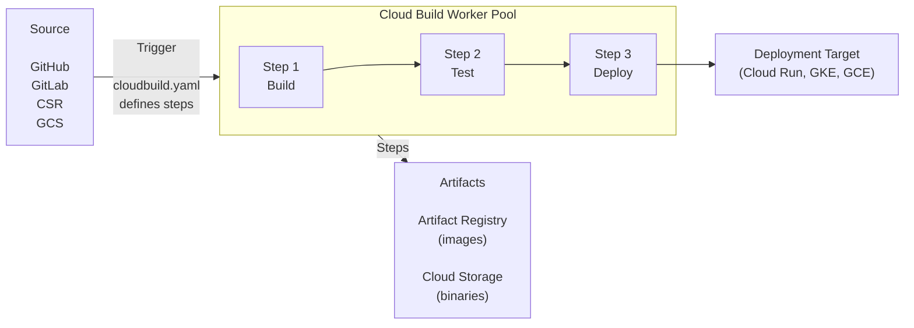
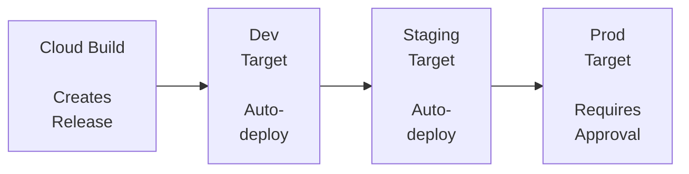

**Complexity**: [MEDIUM] | **Time to Complete**: 2h | **Prerequisites**: Module 2.6 (Artifact Registry), Module 2.7 (Cloud Run)

## What You'll Be Able to Do

After completing this module, you will be able to:

- **Deploy Cloud Build pipelines with multi-step build configurations, container image builds, and Artifact Registry integration**
- **Configure Cloud Build triggers for GitHub, Cloud Source Repositories, and Pub/Sub event-driven builds**
- **Implement Cloud Deploy delivery pipelines with promotion, approval, and canary rollout strategies for GKE**
- **Secure CI/CD pipelines with Binary Authorization, Workload Identity, and VPC-SC protected build environments**

---

## Why This Module Matters

In September 2022, a fast-growing startup's deployment process consisted of a senior engineer SSH-ing into a VM, running `git pull`, building a Docker image, and pushing it to the registry manually. This worked when the team had 3 engineers and deployed once a week. By the time the team grew to 15 engineers deploying multiple times per day, the process had become the bottleneck. One Friday afternoon, the "deploy engineer" accidentally ran a production deploy with a debug flag that logged all customer request payloads to stdout. The issue was not caught until Monday morning because there was no automated testing in the deployment pipeline, no approval gates for production, and no way to quickly roll back. The company's security officer estimated that 72 hours of customer data was exposed in plain-text logs. The post-incident review identified the root cause as the absence of a CI/CD pipeline---the entire deployment process depended on a human remembering every step correctly, every time.

CI/CD is not a luxury or an optimization. It is the fundamental mechanism that makes software delivery reliable, repeatable, and auditable. **Cloud Build** is GCP's serverless CI/CD platform that builds, tests, and deploys your code without any infrastructure to manage. Combined with **Cloud Deploy** for continuous delivery pipelines, it provides a complete path from code commit to production deployment with approval gates, canary analysis, and automated rollbacks.

In this module, you will learn how to write `cloudbuild.yaml` configurations, use built-in and custom builders, set up triggers for automatic builds from GitHub and GitLab, and orchestrate multi-environment deployments with Cloud Deploy.

---

## Cloud Build Architecture

### How Cloud Build Works



Each Cloud Build execution runs in a **fresh, ephemeral environment**. Steps run in Docker containers that share a workspace volume (`/workspace`). The workspace persists across steps, so step 1 can build code that step 2 tests.

> **Pause and predict**: Cloud Build executes each step in a brand new, ephemeral Docker container. If Step 1 installs a custom software package globally using `apt-get install`, will Step 2 be able to use that software? Why or why not?

### Key Concepts

| Concept | Description |
| :--- | :--- |
| **Build** | A single execution of your pipeline |
| **Step** | A Docker container that runs a command |
| **Builder** | The Docker image used for a step (e.g., `gcr.io/cloud-builders/docker`) |
| **Trigger** | Automation that starts a build (e.g., on git push) |
| **Substitution** | Variables you can pass into the build (e.g., `$SHORT_SHA`, `$BRANCH_NAME`) |
| **Worker Pool** | The infrastructure that runs your builds (default or private) |

---

## cloudbuild.yaml: The Build Configuration

### Basic Structure

```yaml
# cloudbuild.yaml
steps:
  # Step 1: Build the Docker image
  - name: 'gcr.io/cloud-builders/docker'
    args: ['build', '-t', 'us-central1-docker.pkg.dev/$PROJECT_ID/docker-repo/my-api:$SHORT_SHA', '.']

  # Step 2: Push to Artifact Registry
  - name: 'gcr.io/cloud-builders/docker'
    args: ['push', 'us-central1-docker.pkg.dev/$PROJECT_ID/docker-repo/my-api:$SHORT_SHA']

  # Step 3: Deploy to Cloud Run
  - name: 'gcr.io/google.com/cloudsdktool/cloud-sdk'
    entrypoint: gcloud
    args:
      - 'run'
      - 'deploy'
      - 'my-api'
      - '--image=us-central1-docker.pkg.dev/$PROJECT_ID/docker-repo/my-api:$SHORT_SHA'
      - '--region=us-central1'

# Optional: Define images for automatic pushing
images:
  - 'us-central1-docker.pkg.dev/$PROJECT_ID/docker-repo/my-api:$SHORT_SHA'

# Optional: Build configuration
options:
  logging: CLOUD_LOGGING_ONLY
  machineType: 'E2_HIGHCPU_8'

# Optional: Build timeout
timeout: '1200s'
```

### Built-in Substitution Variables

| Variable | Value | Example |
| :--- | :--- | :--- |
| `$PROJECT_ID` | GCP project ID | `my-project-123` |
| `$BUILD_ID` | Unique build ID | `b1234-5678-90ab` |
| `$COMMIT_SHA` | Full commit SHA | `a1b2c3d4e5f6...` |
| `$SHORT_SHA` | 7-char commit SHA | `a1b2c3d` |
| `$BRANCH_NAME` | Git branch name | `main`, `feature/auth` |
| `$TAG_NAME` | Git tag | `v1.2.0` |
| `$REPO_NAME` | Repository name | `my-repo` |
| `$REVISION_ID` | Revision ID | Same as `$COMMIT_SHA` for git |

> **Stop and think**: You are using `$BRANCH_NAME` as part of your Docker image tag. If two developers commit to the same branch simultaneously, what race condition might occur in Artifact Registry, and how could using `$COMMIT_SHA` solve it?

### Custom Substitutions

```yaml
# cloudbuild.yaml with custom substitutions
substitutions:
  _REGION: 'us-central1'
  _SERVICE_NAME: 'my-api'
  _REPO: 'docker-repo'

steps:
  - name: 'gcr.io/cloud-builders/docker'
    args:
      - 'build'
      - '-t'
      - '${_REGION}-docker.pkg.dev/$PROJECT_ID/${_REPO}/${_SERVICE_NAME}:$SHORT_SHA'
      - '.'

  - name: 'gcr.io/google.com/cloudsdktool/cloud-sdk'
    entrypoint: gcloud
    args:
      - 'run'
      - 'deploy'
      - '${_SERVICE_NAME}'
      - '--image=${_REGION}-docker.pkg.dev/$PROJECT_ID/${_REPO}/${_SERVICE_NAME}:$SHORT_SHA'
      - '--region=${_REGION}'
```

```bash
# Override substitutions at build time
gcloud builds submit --config=cloudbuild.yaml \
  --substitutions=_REGION=europe-west1,_SERVICE_NAME=my-api-eu
```

---

## Builders: The Tools in Your Pipeline

### Google-Provided Builders

| Builder | Image | Use |
| :--- | :--- | :--- |
| **Docker** | `gcr.io/cloud-builders/docker` | Build/push Docker images |
| **gcloud** | `gcr.io/google.com/cloudsdktool/cloud-sdk` | Any gcloud command |
| **kubectl** | `gcr.io/cloud-builders/kubectl` | Kubernetes deployments |
| **npm** | `gcr.io/cloud-builders/npm` | Node.js builds |
| **go** | `gcr.io/cloud-builders/go` | Go builds |
| **mvn** | `gcr.io/cloud-builders/mvn` | Maven/Java builds |
| **gradle** | `gcr.io/cloud-builders/gradle` | Gradle/Java builds |
| **python** | `python` | Python scripts |
| **git** | `gcr.io/cloud-builders/git` | Git operations |

### Using Any Docker Image as a Builder

Any public Docker image can be used as a builder:

```yaml
steps:
  # Use Terraform
  - name: 'hashicorp/terraform:1.7'
    entrypoint: 'terraform'
    args: ['init']

  - name: 'hashicorp/terraform:1.7'
    entrypoint: 'terraform'
    args: ['apply', '-auto-approve']

  # Use a linting tool
  - name: 'golangci/golangci-lint:v1.55'
    args: ['golangci-lint', 'run', './...']

  # Use a custom security scanner
  - name: 'aquasec/trivy:latest'
    args: ['image', '--exit-code', '1', '--severity', 'CRITICAL', 'my-image:latest']
```

> **Pause and predict**: You need to run a proprietary, custom-built testing binary in your pipeline, but Google doesn't provide a builder image for it. What is the most efficient way to make this tool available to your Cloud Build steps?

### Creating Custom Builders

```bash
# Build and push a custom builder image
cat > Dockerfile.builder << 'EOF'
FROM ubuntu:22.04
RUN apt-get update && apt-get install -y \
    curl \
    jq \
    python3 \
    python3-pip \
    && pip3 install awscli boto3
EOF

docker build -t us-central1-docker.pkg.dev/my-project/builders/custom-tools:latest -f Dockerfile.builder .
docker push us-central1-docker.pkg.dev/my-project/builders/custom-tools:latest
```

---

## Complete Pipeline Examples

### Build, Test, and Deploy to Cloud Run

```yaml
# cloudbuild.yaml
steps:
  # Step 1: Run unit tests
  - name: 'python:3.12-slim'
    entrypoint: 'bash'
    args:
      - '-c'
      - |
        pip install -r requirements.txt
        pip install pytest
        pytest tests/ -v

  # Step 2: Run linting
  - name: 'python:3.12-slim'
    entrypoint: 'bash'
    args:
      - '-c'
      - |
        pip install ruff
        ruff check .

  # Step 3: Build Docker image
  - name: 'gcr.io/cloud-builders/docker'
    args:
      - 'build'
      - '-t'
      - 'us-central1-docker.pkg.dev/$PROJECT_ID/docker-repo/my-api:$SHORT_SHA'
      - '-t'
      - 'us-central1-docker.pkg.dev/$PROJECT_ID/docker-repo/my-api:latest'
      - '.'

  # Step 4: Push to Artifact Registry
  - name: 'gcr.io/cloud-builders/docker'
    args: ['push', '--all-tags', 'us-central1-docker.pkg.dev/$PROJECT_ID/docker-repo/my-api']

  # Step 5: Deploy to staging
  - name: 'gcr.io/google.com/cloudsdktool/cloud-sdk'
    entrypoint: gcloud
    args:
      - 'run'
      - 'deploy'
      - 'my-api-staging'
      - '--image=us-central1-docker.pkg.dev/$PROJECT_ID/docker-repo/my-api:$SHORT_SHA'
      - '--region=us-central1'
      - '--no-traffic'
      - '--tag=canary'

  # Step 6: Run integration tests against staging
  - name: 'curlimages/curl:latest'
    entrypoint: 'sh'
    args:
      - '-c'
      - |
        CANARY_URL=$(gcloud run services describe my-api-staging --region=us-central1 --format='value(status.traffic[].url)' | grep canary)
        curl -f "$CANARY_URL/health" || exit 1
        echo "Health check passed"

  # Step 7: Promote to production traffic
  - name: 'gcr.io/google.com/cloudsdktool/cloud-sdk'
    entrypoint: gcloud
    args:
      - 'run'
      - 'services'
      - 'update-traffic'
      - 'my-api-staging'
      - '--region=us-central1'
      - '--to-latest'

images:
  - 'us-central1-docker.pkg.dev/$PROJECT_ID/docker-repo/my-api:$SHORT_SHA'
  - 'us-central1-docker.pkg.dev/$PROJECT_ID/docker-repo/my-api:latest'

options:
  logging: CLOUD_LOGGING_ONLY
  machineType: 'E2_HIGHCPU_8'

timeout: '1800s'
```

### Build with Parallel Steps

Steps can run in parallel when they have the same `waitFor` or when `waitFor` is set to `['-']` (start immediately).

```yaml
steps:
  # Build image (starts immediately)
  - id: 'build'
    name: 'gcr.io/cloud-builders/docker'
    args: ['build', '-t', 'my-image:$SHORT_SHA', '.']

  # Run unit tests (in parallel with build - different source)
  - id: 'unit-tests'
    name: 'python:3.12-slim'
    waitFor: ['-']  # Start immediately, do not wait for 'build'
    entrypoint: 'bash'
    args:
      - '-c'
      - 'pip install -r requirements.txt && pytest tests/unit/'

  # Run linting (in parallel with build and tests)
  - id: 'lint'
    name: 'python:3.12-slim'
    waitFor: ['-']
    entrypoint: 'bash'
    args:
      - '-c'
      - 'pip install ruff && ruff check .'

  # Push image (waits for build, tests, and lint to pass)
  - id: 'push'
    name: 'gcr.io/cloud-builders/docker'
    waitFor: ['build', 'unit-tests', 'lint']
    args: ['push', 'my-image:$SHORT_SHA']
```

> **Pause and predict**: If your unit tests take 5 minutes, linting takes 2 minutes, and building the image takes 4 minutes, what is the absolute minimum time your pipeline could take if you configure these steps to run in parallel using `waitFor: ['-']`?

---

## Build Triggers

Triggers automatically start builds when code changes.

### GitHub Trigger

```bash
# Connect GitHub repository first (one-time setup via console)
# Then create a trigger:

# Trigger on push to main branch
gcloud builds triggers create github \
  --name="deploy-on-push-to-main" \
  --repo-name="my-repo" \
  --repo-owner="my-org" \
  --branch-pattern="^main$" \
  --build-config="cloudbuild.yaml" \
  --description="Build and deploy on push to main"

# Trigger on pull request (for CI checks)
gcloud builds triggers create github \
  --name="ci-checks-on-pr" \
  --repo-name="my-repo" \
  --repo-owner="my-org" \
  --pull-request-pattern="^main$" \
  --build-config="cloudbuild-ci.yaml" \
  --description="Run CI checks on pull requests" \
  --comment-control=COMMENTS_ENABLED_FOR_EXTERNAL_CONTRIBUTORS_ONLY

# Trigger on Git tag (for releases)
gcloud builds triggers create github \
  --name="release-on-tag" \
  --repo-name="my-repo" \
  --repo-owner="my-org" \
  --tag-pattern="^v[0-9]+\\.[0-9]+\\.[0-9]+$" \
  --build-config="cloudbuild-release.yaml" \
  --description="Build and release on version tag" \
  --substitutions="_VERSION=$TAG_NAME"
```

### GitLab Trigger

```bash
# Create a GitLab connection first
gcloud builds connections create gitlab my-gitlab-conn \
  --region=us-central1 \
  --host-uri="https://gitlab.com" \
  --api-access-token-secret-version="projects/my-project/secrets/gitlab-token/versions/latest"

# Link a repository
gcloud builds repositories create my-gitlab-repo \
  --connection=my-gitlab-conn \
  --region=us-central1 \
  --remote-uri="https://gitlab.com/my-org/my-repo.git"

# Create a trigger
gcloud builds triggers create gitlab-enterprise \
  --name="deploy-from-gitlab" \
  --repository="projects/my-project/locations/us-central1/connections/my-gitlab-conn/repositories/my-gitlab-repo" \
  --branch-pattern="^main$" \
  --build-config="cloudbuild.yaml" \
  --region=us-central1
```

### Manual Triggers

```bash
# Submit a build manually (from local source)
gcloud builds submit --config=cloudbuild.yaml .

# Submit with substitutions
gcloud builds submit --config=cloudbuild.yaml \
  --substitutions=_ENV=staging,SHORT_SHA=local123 .

# Submit from a GCS archive
gcloud builds submit --config=cloudbuild.yaml \
  gs://my-bucket/source.tar.gz

# List builds
gcloud builds list --limit=10 \
  --format="table(id, status, createTime, source.repoSource.branchName)"

# View build logs
gcloud builds log BUILD_ID
```

---

## Cloud Build Service Account

Cloud Build runs as a service account. By default, it uses a project-level service account with broad permissions.

```bash
# View the default Cloud Build service account
gcloud projects get-iam-policy $PROJECT_ID \
  --flatten="bindings[].members" \
  --filter="bindings.members:cloudbuild.gserviceaccount.com" \
  --format="table(bindings.role)"

# Use a custom service account (recommended for production)
gcloud iam service-accounts create cloud-build-sa \
  --display-name="Custom Cloud Build SA"

# Grant specific permissions
gcloud projects add-iam-binding $PROJECT_ID \
  --member="serviceAccount:cloud-build-sa@${PROJECT_ID}.iam.gserviceaccount.com" \
  --role="roles/run.admin"

gcloud projects add-iam-binding $PROJECT_ID \
  --member="serviceAccount:cloud-build-sa@${PROJECT_ID}.iam.gserviceaccount.com" \
  --role="roles/artifactregistry.writer"

# Use the custom SA in a trigger
gcloud builds triggers update my-trigger \
  --service-account="projects/$PROJECT_ID/serviceAccounts/cloud-build-sa@${PROJECT_ID}.iam.gserviceaccount.com"
```

---

## Cloud Deploy: Continuous Delivery Pipelines

Cloud Deploy manages the promotion of releases across environments (dev, staging, production) with approval gates and rollback capabilities.



### Setting Up a Delivery Pipeline

> **Stop and think**: In a multi-stage delivery pipeline, you notice that deployments to `prod` are causing a bottleneck because the QA team is overwhelmed with manual approvals. How could you leverage Cloud Deploy's `strategy.canary` feature (which automates traffic splitting and verification) to reduce the risk of production deployments and potentially reduce the reliance on human approval gates?

```yaml
# deploy/pipeline.yaml
apiVersion: deploy.cloud.google.com/v1
kind: DeliveryPipeline
metadata:
  name: my-api-pipeline
description: "Delivery pipeline for my-api"
serialPipeline:
  stages:
    - targetId: dev
      profiles: [dev]
    - targetId: staging
      profiles: [staging]
    - targetId: prod
      profiles: [prod]
      strategy:
        canary:
          runtimeConfig:
            cloudRun:
              automaticTrafficControl: true
          canaryDeployment:
            percentages: [10, 50]
            verify: true
---
# deploy/dev-target.yaml
apiVersion: deploy.cloud.google.com/v1
kind: Target
metadata:
  name: dev
description: "Dev environment"
run:
  location: projects/my-project/locations/us-central1
---
# deploy/staging-target.yaml
apiVersion: deploy.cloud.google.com/v1
kind: Target
metadata:
  name: staging
description: "Staging environment"
run:
  location: projects/my-project/locations/us-central1
---
# deploy/prod-target.yaml
apiVersion: deploy.cloud.google.com/v1
kind: Target
metadata:
  name: prod
description: "Production environment"
requireApproval: true
run:
  location: projects/my-project/locations/us-central1
```

```bash
# Register the pipeline and targets
gcloud deploy apply --file=deploy/pipeline.yaml --region=us-central1
gcloud deploy apply --file=deploy/dev-target.yaml --region=us-central1
gcloud deploy apply --file=deploy/staging-target.yaml --region=us-central1
gcloud deploy apply --file=deploy/prod-target.yaml --region=us-central1

# Create a release (typically done by Cloud Build)
gcloud deploy releases create release-v1-0 \
  --delivery-pipeline=my-api-pipeline \
  --region=us-central1 \
  --images=my-api=us-central1-docker.pkg.dev/my-project/docker-repo/my-api:v1.0.0

# Promote a release to the next stage
gcloud deploy releases promote --release=release-v1-0 \
  --delivery-pipeline=my-api-pipeline \
  --region=us-central1

# Approve a release for production
gcloud deploy rollouts approve rollout-id \
  --delivery-pipeline=my-api-pipeline \
  --release=release-v1-0 \
  --region=us-central1

# Rollback
gcloud deploy targets rollback prod \
  --delivery-pipeline=my-api-pipeline \
  --region=us-central1
```

---

## Secrets in Cloud Build

```yaml
# Accessing secrets from Secret Manager in Cloud Build
steps:
  - name: 'gcr.io/cloud-builders/docker'
    args:
      - 'build'
      - '--build-arg'
      - 'NPM_TOKEN=$$NPM_TOKEN'
      - '-t'
      - 'my-image:$SHORT_SHA'
      - '.'
    secretEnv: ['NPM_TOKEN']

availableSecrets:
  secretManager:
    - versionName: projects/$PROJECT_ID/secrets/npm-token/versions/latest
      env: 'NPM_TOKEN'
```

---

## Did You Know?

1. **Cloud Build's default worker pool runs on Google-managed infrastructure** with no minimum fees. You only pay for the build minutes consumed. The first 120 build-minutes per day are free for the `e2-medium` machine type. For a team doing 10 builds per day averaging 5 minutes each, the CI/CD platform costs literally nothing.

2. **Cloud Build steps share a `/workspace` volume** that persists across steps. This means step 1 can clone code, step 2 can compile it, and step 3 can test the compiled binaries---all without pushing/pulling artifacts between steps. The workspace is a mounted directory, not a Docker volume, so it performs at native filesystem speed.

3. **Private worker pools run inside your VPC**, allowing builds to access private resources (private Artifact Registry, internal APIs, databases) without exposing them to the internet. They also support custom machine types up to 32 vCPUs for faster builds. Private pools are essential for enterprises with strict network security requirements.

4. **Cloud Build supports build caching through `kaniko`**, a tool that builds Docker images without a Docker daemon. Kaniko can cache intermediate layers in Artifact Registry, so subsequent builds that share base layers skip the redundant steps. This can reduce build times by 50-80% for large Docker images with many dependencies.

---

## Common Mistakes

| Mistake | Why It Happens | How to Fix It |
| :--- | :--- | :--- |
| Using the default Cloud Build SA for everything | Convenience; it has broad permissions | Create a custom SA per pipeline with minimal permissions |
| Not using parallel steps | Steps run sequentially by default | Use `waitFor: ['-']` to run independent steps concurrently |
| Hardcoding project IDs in cloudbuild.yaml | Works during initial development | Use `$PROJECT_ID` substitution for portability |
| Not setting build timeouts | Default 10-minute timeout is too short for large builds | Set `timeout: '1800s'` (30 minutes) for complex pipelines |
| Skipping tests in the CI pipeline | "We test locally" | Always run tests in CI; the pipeline is the source of truth |
| Not using `images:` field for Docker pushes | Pushing images manually in steps | Use the `images:` field for automatic pushing and provenance |
| Building everything on every commit | Simplest configuration | Use path filters in triggers to build only what changed |
| Not encrypting build secrets | Storing secrets as plain substitutions | Use `availableSecrets` with Secret Manager |

---

## Quiz

<details>
<summary>1. Your Cloud Build pipeline has three steps: a Node.js builder that runs `npm run build`, a custom security scanner builder, and a Docker builder that creates an image. You notice that the `dist` folder generated by the first step is accessible by the subsequent steps, even though they run in completely different container images. How is this possible without explicitly copying files between containers?</summary>

The `/workspace` directory is a shared volume that persists across all steps in a single Cloud Build execution. When a build starts, the source code is checked out into `/workspace`. Each subsequent step runs in a new, ephemeral Docker container, but the `/workspace` directory is seamlessly mounted into every single one of those containers. This architectural choice means step 1 can download dependencies or compile code, and step 2 can test or package that exact compiled output without needing to push or pull artifacts over the network between steps. The workspace acts as the common scratchpad for the entire pipeline lifecycle.
</details>

<details>
<summary>2. You are optimizing a pipeline that currently takes 15 minutes: 5 minutes for unit tests, 5 minutes for security scanning, and 5 minutes for building the Docker image. The security scan and the unit tests do not depend on each other, nor do they depend on the Docker build. How can you configure your `cloudbuild.yaml` to execute these three steps simultaneously and reduce the total build time to 5 minutes?</summary>

You can configure parallel execution by utilizing the `waitFor` property in your `cloudbuild.yaml` step definitions. By default, Cloud Build runs steps sequentially, waiting for the previous step to finish. To run steps concurrently, you assign an `id` to each step and set `waitFor: ['-']`, which instructs Cloud Build to start the step immediately without waiting for any prior steps. If you have a final step (like pushing an image) that needs all three parallel steps to finish first, you would configure that final step with `waitFor: ['test-id', 'scan-id', 'build-id']`. This dependency graph execution minimizes pipeline duration by running independent tasks at the same time.
</details>

<details>
<summary>3. Your engineering team wants to automatically deploy to the staging environment whenever a developer merges code into the `main` branch. However, they only want to trigger a production deployment when a specific release version (like `v2.1.0`) is cut. How would you configure Cloud Build triggers differently to satisfy both of these workflow requirements?</summary>

You would configure two separate Cloud Build triggers using different Git matching mechanisms: a branch pattern trigger and a tag pattern trigger. For the staging environment, you configure a branch pattern trigger matching `^main$`, which fires every time a commit is pushed or merged into that branch. This is ideal for continuous integration. For production, you create a tag pattern trigger matching a regex like `^v[0-9]+\.[0-9]+\.[0-9]+$`. This trigger will ignore regular branch commits and only execute when a developer creates and pushes a Git tag that matches semantic versioning. This creates a clear distinction between ongoing development builds and explicit, immutable release artifacts.
</details>

<details>
<summary>4. A junior developer creates a basic Cloud Build pipeline that just runs `npm test` on a React frontend and outputs the results. During a security audit, you notice this pipeline is using the default Cloud Build service account. You immediately recommend switching it to a custom service account. What is the security risk of leaving it as the default?</summary>

The risk lies in the violation of the principle of least privilege due to the default service account's broad, overly permissive roles. By default, the Cloud Build service account (`PROJECT_NUMBER@cloudbuild.gserviceaccount.com`) is granted the `Cloud Build Service Account` role, which includes permissions to push to Artifact Registry, deploy to Cloud Run, modify GKE clusters, and more. If a malicious actor compromises the React repository and alters the `cloudbuild.yaml` or a test script, they could use that pipeline's default credentials to deploy rogue containers or delete production infrastructure. A custom service account should be created with absolutely no permissions, and only the specific IAM roles required for that exact pipeline (e.g., just logging) should be granted.
</details>

<details>
<summary>5. Your team currently deploys to GKE by adding a final step in `cloudbuild.yaml` that runs `kubectl apply`. The CTO now requires that all deployments to production must be manually approved by the QA team, and there must be an automated way to roll back traffic if errors spike. Why is your current `kubectl` step insufficient, and how does Cloud Deploy solve this?</summary>

A simple `kubectl apply` or `gcloud run deploy` step inside Cloud Build is a "fire-and-forget" imperative command that lacks lifecycle management, approval gates, and environment awareness. Once Cloud Build executes the command, its job is done. Cloud Deploy, on the other hand, is a declarative continuous delivery (CD) platform that separates the deployment logic from the build process. It allows you to define a Delivery Pipeline with specific targets (dev, staging, prod). When Cloud Build finishes, it creates a "Release" in Cloud Deploy. Cloud Deploy then natively enforces `requireApproval: true` on the production target, pausing the rollout until QA clicks approve. Furthermore, it tracks the history of all releases, providing a native "Rollback" button that instantly restores the previous working state without needing to rerun a build pipeline.
</details>

<details>
<summary>6. Your build pipeline needs to download a proprietary library from a third-party registry, which requires a private API token. A developer suggests simply adding the token as a substitution variable when triggering the build (`--substitutions=_API_TOKEN=xyz`). Why is this a severe security vulnerability, and what is the proper GCP-native way to handle this token?</summary>

Passing secrets as substitution variables is highly insecure because substitutions are stored in plain text and are fully visible in the Cloud Build UI, the build history logs, and the API responses for anyone with basic viewer access to the project. The proper, GCP-native approach is to store the API token in Google Secret Manager. In your `cloudbuild.yaml`, you define an `availableSecrets` block pointing to the specific Secret Manager version. You then inject it into the specific step using `secretEnv`. This securely pulls the secret at runtime directly into the container's environment variables, ensuring the token is never logged, persisted in the build configuration, or exposed to unauthorized users viewing the build history.
</details>

---

## Hands-On Exercise: Build and Deploy Pipeline

### Objective

Create a complete CI/CD pipeline that builds a Docker image, runs tests, pushes to Artifact Registry, and deploys to Cloud Run.

### Prerequisites

- `gcloud` CLI installed and authenticated
- A GCP project with billing enabled
- Docker installed locally

### Tasks

**Task 1: Set Up the Application and Infrastructure**

<details>
<summary>Solution</summary>

```bash
export PROJECT_ID=$(gcloud config get-value project)
export REGION=us-central1

# Enable APIs
gcloud services enable \
  cloudbuild.googleapis.com \
  artifactregistry.googleapis.com \
  run.googleapis.com \
  secretmanager.googleapis.com

# Create Artifact Registry repository
gcloud artifacts repositories create cicd-lab \
  --repository-format=docker \
  --location=$REGION \
  --description="CI/CD lab images"

# Create the application
mkdir -p /tmp/cicd-lab && cd /tmp/cicd-lab

cat > main.py << 'PYEOF'
import os
from flask import Flask, jsonify

app = Flask(__name__)
VERSION = os.environ.get("APP_VERSION", "unknown")

@app.route("/")
def home():
    return jsonify({"version": VERSION, "status": "running"})

@app.route("/health")
def health():
    return jsonify({"status": "healthy"})

if __name__ == "__main__":
    port = int(os.environ.get("PORT", 8080))
    app.run(host="0.0.0.0", port=port)
PYEOF

cat > requirements.txt << 'EOF'
flask>=3.0.0
gunicorn>=21.2.0
pytest>=8.0.0
EOF

cat > test_main.py << 'PYEOF'
from main import app

def test_home():
    client = app.test_client()
    response = client.get("/")
    assert response.status_code == 200
    data = response.get_json()
    assert "version" in data
    assert "status" in data

def test_health():
    client = app.test_client()
    response = client.get("/health")
    assert response.status_code == 200
    data = response.get_json()
    assert data["status"] == "healthy"
PYEOF

cat > Dockerfile << 'DEOF'
FROM python:3.12-slim
WORKDIR /app
COPY requirements.txt .
RUN pip install --no-cache-dir -r requirements.txt
COPY main.py .
CMD ["gunicorn", "--bind", "0.0.0.0:8080", "main:app"]
DEOF
```
</details>

**Task 2: Write the cloudbuild.yaml**

<details>
<summary>Solution</summary>

```bash
cat > cloudbuild.yaml << 'EOF'
steps:
  # Step 1: Run unit tests
  - id: 'test'
    name: 'python:3.12-slim'
    entrypoint: 'bash'
    args:
      - '-c'
      - |
        pip install -r requirements.txt
        pytest test_main.py -v

  # Step 2: Build Docker image
  - id: 'build'
    name: 'gcr.io/cloud-builders/docker'
    waitFor: ['test']
    args:
      - 'build'
      - '-t'
      - '${_REGION}-docker.pkg.dev/$PROJECT_ID/${_REPO}/${_SERVICE}:${SHORT_SHA}'
      - '.'

  # Step 3: Push to Artifact Registry
  - id: 'push'
    name: 'gcr.io/cloud-builders/docker'
    waitFor: ['build']
    args:
      - 'push'
      - '${_REGION}-docker.pkg.dev/$PROJECT_ID/${_REPO}/${_SERVICE}:${SHORT_SHA}'

  # Step 4: Deploy to Cloud Run
  - id: 'deploy'
    name: 'gcr.io/google.com/cloudsdktool/cloud-sdk'
    waitFor: ['push']
    entrypoint: gcloud
    args:
      - 'run'
      - 'deploy'
      - '${_SERVICE}'
      - '--image=${_REGION}-docker.pkg.dev/$PROJECT_ID/${_REPO}/${_SERVICE}:${SHORT_SHA}'
      - '--region=${_REGION}'
      - '--allow-unauthenticated'
      - '--set-env-vars=APP_VERSION=${SHORT_SHA}'

substitutions:
  _REGION: 'us-central1'
  _REPO: 'cicd-lab'
  _SERVICE: 'cicd-lab-api'

images:
  - '${_REGION}-docker.pkg.dev/$PROJECT_ID/${_REPO}/${_SERVICE}:${SHORT_SHA}'

options:
  logging: CLOUD_LOGGING_ONLY

timeout: '900s'
EOF

echo "cloudbuild.yaml created."
```
</details>

**Task 3: Run the Build Manually**

<details>
<summary>Solution</summary>

```bash
cd /tmp/cicd-lab

# Submit the build
gcloud builds submit \
  --config=cloudbuild.yaml \
  --substitutions=SHORT_SHA=manual01 \
  .

# Check build status
gcloud builds list --limit=3 \
  --format="table(id, status, createTime, images[0])"

# Get the Cloud Run service URL
SERVICE_URL=$(gcloud run services describe cicd-lab-api \
  --region=$REGION --format="value(status.url)")
echo "Service URL: $SERVICE_URL"

# Test the deployment
curl -s $SERVICE_URL | python3 -m json.tool
```
</details>

**Task 4: Deploy a Second Version**

<details>
<summary>Solution</summary>

```bash
# Modify the application
cat > main.py << 'PYEOF'
import os
from flask import Flask, jsonify

app = Flask(__name__)
VERSION = os.environ.get("APP_VERSION", "unknown")

@app.route("/")
def home():
    return jsonify({
        "version": VERSION,
        "status": "running",
        "features": ["health-check", "version-api"]
    })

@app.route("/health")
def health():
    return jsonify({"status": "healthy"})

if __name__ == "__main__":
    port = int(os.environ.get("PORT", 8080))
    app.run(host="0.0.0.0", port=port)
PYEOF

# Build and deploy v2
gcloud builds submit \
  --config=cloudbuild.yaml \
  --substitutions=SHORT_SHA=manual02 \
  .

# Verify the new version
sleep 15
curl -s $SERVICE_URL | python3 -m json.tool
```
</details>

**Task 5: View Build History and Logs**

<details>
<summary>Solution</summary>

```bash
# List recent builds
gcloud builds list --limit=5 \
  --format="table(id, status, createTime, substitutions.SHORT_SHA)"

# Get the latest build ID
BUILD_ID=$(gcloud builds list --limit=1 --format="value(id)")

# View build logs
gcloud builds log $BUILD_ID

# View build details
gcloud builds describe $BUILD_ID --format="yaml(steps, results, timing)"
```
</details>

**Task 6: Clean Up**

<details>
<summary>Solution</summary>

```bash
# Delete Cloud Run service
gcloud run services delete cicd-lab-api --region=$REGION --quiet

# Delete images from Artifact Registry
gcloud artifacts docker images delete \
  ${REGION}-docker.pkg.dev/${PROJECT_ID}/cicd-lab/cicd-lab-api:manual01 \
  --quiet --delete-tags 2>/dev/null || true
gcloud artifacts docker images delete \
  ${REGION}-docker.pkg.dev/${PROJECT_ID}/cicd-lab/cicd-lab-api:manual02 \
  --quiet --delete-tags 2>/dev/null || true

# Delete repository
gcloud artifacts repositories delete cicd-lab \
  --location=$REGION --quiet

# Clean up local files
rm -rf /tmp/cicd-lab

echo "Cleanup complete."
```
</details>

### Success Criteria

- [ ] Application with tests created locally
- [ ] cloudbuild.yaml with test, build, push, and deploy steps
- [ ] Build submitted and completed successfully
- [ ] Tests pass in the CI pipeline
- [ ] Image pushed to Artifact Registry
- [ ] Cloud Run service deployed and accessible
- [ ] Second version deployed successfully
- [ ] All resources cleaned up

---

## Next Module

Next up: **[Module 2.12: GCP Architectural Patterns](../module-2.12-patterns/)** --- Learn about project vending machines, landing zones, Identity-Aware Proxy, and get an overview of Anthos and GKE for container orchestration at scale.