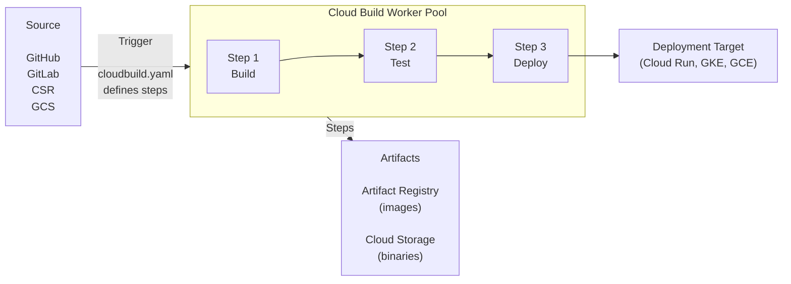
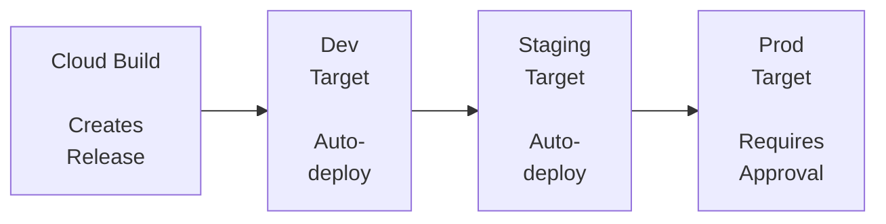

**Complexity**: [MEDIUM] | **Time to Complete**: 2h | **Prerequisites**: Module 2.6 (Artifact Registry), Module 2.7 (Cloud Run)

## What You'll Be Able to Do

After completing this module, you will be able to:

- **Design** multi-step Cloud Build pipelines that compile code, execute concurrent tests, and natively push container images to Artifact Registry using the declarative build configuration schema.
- **Implement** 2nd generation Developer Connect build triggers to automate complex deployment workflows across GitHub, GitLab, and Bitbucket repositories using sophisticated inclusion and exclusion glob patterns.
- **Evaluate** and generate SLSA Level 3 build provenance to ensure cryptographic supply chain security across your artifact lifecycle, ensuring compliance with modern security postures.
- **Compare** default and private worker pools to optimize for concurrent scaling limits, VPC peering access to internal networks, and custom machine type requirements.
- **Diagnose** CI/CD pipeline bottlenecks and security vulnerabilities related to service account impersonation and Google Secret Manager integration to enforce the principle of least privilege.

## Why This Module Matters

On August 1, 2012, Knight Capital Group, a leading American financial services firm, attempted to deploy a new high-frequency trading algorithm. The deployment was executed manually by an engineer running ad-hoc commands to copy compiled binaries and update configuration flags across their entire server fleet. Unfortunately, the engineer successfully updated only seven of their eight production servers. When the market opened, the eighth server—still running obsolete code but receiving new configuration flags intended for the updated system—began executing erratic and massive trades. In just 45 minutes, Knight Capital flooded the market with over four million erroneous trades, resulting in a staggering $460 million loss. This catastrophic failure effectively bankrupted the firm before lunchtime. The root cause was not a complex logical anomaly; it was the absence of an automated, deterministic deployment pipeline.

Continuous Integration and Continuous Deployment (CI/CD) is fundamentally about mitigating existential business risk. When deployments rely on human memory, bespoke shell scripts, and manual server interactions, catastrophic failures are a mathematical certainty over time. A human being will eventually type the wrong IP address, forget to run a critical database migration script, or inadvertently deploy from a local feature branch rather than the validated release branch. CI/CD transforms software delivery from a high-stakes, nerve-wracking event into a boring, routine, and fully auditable process. By codifying every step—from dependency resolution and security scanning to testing and production rollout—organizations ensure that what gets tested is exactly what gets deployed, every single time.

In the Google Cloud ecosystem, Cloud Build serves as the fully managed, serverless engine that executes these codified workflows. Combined with Cloud Deploy for multi-environment delivery orchestration, it provides a comprehensive platform that scales to zero, demands no infrastructure management, and integrates natively with GCP's stringent security perimeter. In this module, you will master the architecture of Cloud Build, design complex pipelines that handle modern supply chain security requirements, and implement automated delivery strategies that would have saved Knight Capital from its catastrophic half-billion-dollar manual typo.

## Cloud Build Architecture & Execution Model

### How Cloud Build Works

Cloud Build is a fully managed, serverless CI/CD service that executes builds on Google Cloud infrastructure. It operates on a simple but highly scalable premise: Cloud Build executes each build as a series of steps, where each step runs inside a Docker container. There is no persistent build server to patch, no Jenkins master node to secure, and no capacity planning required. 



When a build is triggered, Cloud Build sets up a new virtual machine environment for every build and destroys it after the build completes. This ephemeral VM ensures that your build executes in a pristine state, completely free from the "it works on my machine" syndrome caused by lingering caching, leftover files, or configuration drift from previous executions. Currently, Cloud Build runs Docker engine version 20.10.24 on these ephemeral instances. Once the final pipeline step completes, or if the timeout limit is reached, the underlying virtual machine is immediately and securely wiped out.

> **Pause and predict**: Cloud Build executes each step in a brand new, ephemeral Docker container. If Step 1 installs a custom software package globally using `apt-get install`, will Step 2 be able to use that software? Why or why not?

### The Shared Workspace

The architectural secret that makes Cloud Build highly efficient is the concept of the shared workspace. By default, Cloud Build executes all steps of a build serially on the same machine. During this process, Cloud Build automatically mounts a shared volume, located at `/workspace`, into every step's Docker container.

Think of the virtual machine as a commercial kitchen, the `/workspace` as the central stainless-steel prep counter, and each build step as a highly specialized chef who enters the kitchen, performs one specific task at the counter, and leaves. Step 1 might be a Git container that clones the source repository onto the counter. Step 2 might be a Node.js container that compiles the code resting on that counter. Step 3 is a Docker container that takes the compiled binaries from the counter and packages them into an immutable image. Because the counter (`/workspace`) is shared and persists throughout the lifetime of the build execution, no network transfers, heavy caching, or artifact archiving are required between the individual steps. The state resides entirely in the file system.

### Worker Pools: Default vs. Private

Cloud Build offers two primary types of execution environments to accommodate different scaling, compliance, and networking security paradigms. Both default pools and private pools are fully managed by Google and scale to zero when no builds are executing.

1. **Default Pools**: These are multi-tenant environments managed by Google. The default machine type for the default pool is `e2-standard-2` (2 vCPUs, 8 GB RAM). A critical constraint to be aware of is that the default pool supports a maximum of 30 concurrent builds per region; this limit cannot be increased. If you submit 40 builds simultaneously to the default pool, 10 will queue until capacity frees up.
2. **Private Pools**: Designed for enterprise scaling and strict compliance perimeters, private pools offer greater customization over the build environment. Crucially, private pools support VPC peering to access resources in a private network—such as a private GKE cluster, an on-premises database via Cloud Interconnect, or an internal Artifact Registry—without ever traversing the public internet. Private pools support massive concurrency limits (100+ builds) and offer access to powerful custom hardware. For instance, C3 and N2D machine families reached general availability in private pools on August 15, 2025.

| Concept | Description |
| :--- | :--- |
| **Build** | A single execution of your pipeline |
| **Step** | A Docker container that runs a command |
| **Builder** | The Docker image used for a step (e.g., `gcr.io/cloud-builders/docker`) |
| **Trigger** | Automation that starts a build (e.g., on git push) |
| **Substitution** | Variables you can pass into the build (e.g., `$SHORT_SHA`, `$BRANCH_NAME`) |
| **Worker Pool** | The infrastructure that runs your builds (default or private) |

## cloudbuild.yaml: The Build Configuration

The authoritative blueprint for your deployment pipeline is the build configuration file. Build configuration files are written in YAML or JSON syntax (conventionally named `cloudbuild.yaml`), though YAML is vastly preferred across the industry for its readability and native support for inline comments. This declarative file defines exactly what steps to execute, in what order, and with what execution parameters.

### Basic Structure

Below is an example of a fundamental build configuration demonstrating a classic build, push, and deploy lifecycle using standard containerized builders.

```yaml
# cloudbuild.yaml
steps:
  # Step 1: Build the Docker image
  - name: 'gcr.io/cloud-builders/docker'
    args: ['build', '-t', 'us-central1-docker.pkg.dev/$PROJECT_ID/docker-repo/my-api:$SHORT_SHA', '.']

  # Step 2: Push to Artifact Registry
  - name: 'gcr.io/cloud-builders/docker'
    args: ['push', 'us-central1-docker.pkg.dev/$PROJECT_ID/docker-repo/my-api:$SHORT_SHA']

  # Step 3: Deploy to Cloud Run
  - name: 'gcr.io/google.com/cloudsdktool/cloud-sdk'
    entrypoint: gcloud
    args:
      - 'run'
      - 'deploy'
      - 'my-api'
      - '--image=us-central1-docker.pkg.dev/$PROJECT_ID/docker-repo/my-api:$SHORT_SHA'
      - '--region=us-central1'

# Optional: Define images for automatic pushing
images:
  - 'us-central1-docker.pkg.dev/$PROJECT_ID/docker-repo/my-api:$SHORT_SHA'

# Optional: Build configuration
options:
  logging: CLOUD_LOGGING_ONLY
  machineType: 'E2_HIGHCPU_8'

# Optional: Build timeout
timeout: '1200s'
```

### Limits and Constraints

When designing CI/CD pipelines, you must architect within Cloud Build's enforced system limits to prevent unexpected failures and hanging executions:
- **Maximum Steps**: A build configuration file supports a maximum of 300 build steps. This is a fixed, non-adjustable limit enforced by the API.
- **Timeouts**: The default build timeout is 60 minutes and the maximum build timeout is 24 hours. For most modern microservices, you should explicitly set a much lower timeout (e.g., 15 minutes) to ensure stuck tests fail fast rather than burning build minutes.
- **Queue Limits**: The `queueTtl` field (time a build can wait in the queue before being abandoned) defaults to 3,600 seconds (1 hour).
- **Disk Size**: The maximum disk size for a build worker is 4,000 GB, providing immense capacity for monolithic repositories or heavy data-processing transformations without exhausting disk space.

### Understanding Substitution Variables

Substitutions empower you to inject dynamic contextual data into your build at runtime, ensuring your `cloudbuild.yaml` remains highly reusable across different branches, projects, and deployment environments. Cloud Build provides several built-in variables that are populated automatically based on the trigger context.

| Variable | Value | Example |
| :--- | :--- | :--- |
| `$PROJECT_ID` | GCP project ID | `my-project-123` |
| `$BUILD_ID` | Unique build ID | `b1234-5678-90ab` |
| `$COMMIT_SHA` | Full commit SHA | `a1b2c3d4e5f6...` |
| `$SHORT_SHA` | 7-char commit SHA | `a1b2c3d` |
| `$BRANCH_NAME` | Git branch name | `main`, `feature/auth` |
| `$TAG_NAME` | Git tag | `v1.2.0` |
| `$REPO_NAME` | Repository name | `my-repo` |
| `$REVISION_ID` | Revision ID | Same as `$COMMIT_SHA` for git |

> **Stop and think**: You are using `$BRANCH_NAME` as part of your Docker image tag. If two developers commit to the same branch simultaneously, what race condition might occur in Artifact Registry, and how could using `$COMMIT_SHA` solve it?

### Custom Substitutions

You are not limited to built-in variables. Cloud Build allows you to define your own variables, but they are subject to specific quotas and syntactical rules. The maximum number of substitution parameters per build is 200 (fixed limit).

Custom substitution variable names must begin with an underscore (e.g., `_MY_VAR`, `_REGION`). By default, builds fail on missing substitutions unless the `ALLOW_LOOSE` option is explicitly set in the configuration.

```yaml
# cloudbuild.yaml with custom substitutions
substitutions:
  _REGION: 'us-central1'
  _SERVICE_NAME: 'my-api'
  _REPO: 'docker-repo'

steps:
  - name: 'gcr.io/cloud-builders/docker'
    args:
      - 'build'
      - '-t'
      - '${_REGION}-docker.pkg.dev/$PROJECT_ID/${_REPO}/${_SERVICE_NAME}:$SHORT_SHA'
      - '.'

  - name: 'gcr.io/google.com/cloudsdktool/cloud-sdk'
    entrypoint: gcloud
    args:
      - 'run'
      - 'deploy'
      - '${_SERVICE_NAME}'
      - '--image=${_REGION}-docker.pkg.dev/$PROJECT_ID/${_REPO}/${_SERVICE_NAME}:$SHORT_SHA'
      - '--region=${_REGION}'
```

You can dynamically override these substitution values when submitting a build manually via the CLI, enabling powerful local testing workflows without hardcoding temporary values:

```bash
# Override substitutions at build time
gcloud builds submit --config=cloudbuild.yaml \
  --substitutions=_REGION=europe-west1,_SERVICE_NAME=my-api-eu
```

## Builders: The Engines of Execution

A "builder" is simply the Docker container image that executes a specific step in your pipeline. Because Cloud Build treats standard containers as the primary unit of execution, your pipeline has native access to virtually any software tool, script, compiler, or binary that can be packaged into a container.

### Google-Provided Builders

Google formally supports and maintains a library of cloud builders available at `gcr.io/cloud-builders/`. These images are heavily optimized for the Cloud Build environment, automatically inheriting the workspace mounts and credential contexts necessary to interface smoothly with other GCP services. Google-supported cloud builders include: `bazel`, `docker`, `git`, `gcloud`, `gke-deploy`, `gradle`, and `maven`.

| Builder | Image | Use |
| :--- | :--- | :--- |
| **Docker** | `gcr.io/cloud-builders/docker` | Build/push Docker images |
| **gcloud** | `gcr.io/google.com/cloudsdktool/cloud-sdk` | Any gcloud command |
| **kubectl** | `gcr.io/cloud-builders/kubectl` | Kubernetes deployments |
| **npm** | `gcr.io/cloud-builders/npm` | Node.js builds |
| **go** | `gcr.io/cloud-builders/go` | Go builds |
| **mvn** | `gcr.io/cloud-builders/mvn` | Maven/Java builds |
| **gradle** | `gcr.io/cloud-builders/gradle` | Gradle/Java builds |
| **python** | `python` | Python scripts |
| **git** | `gcr.io/cloud-builders/git` | Git operations |

### Using Arbitrary Docker Images

You are not restricted to Google's official builders. Any container image publicly available on Docker Hub, Quay, or hosted securely in your private Artifact Registry, can serve as a builder. This flexibility is what makes Cloud Build infinitely extensible for teams operating esoteric or highly customized technology stacks.

```yaml
steps:
  # Use Terraform
  - name: 'hashicorp/terraform:1.7'
    entrypoint: 'terraform'
    args: ['init']

  - name: 'hashicorp/terraform:1.7'
    entrypoint: 'terraform'
    args: ['apply', '-auto-approve']

  # Use a linting tool
  - name: 'golangci/golangci-lint:v1.55'
    args: ['golangci-lint', 'run', './...']

  # Use a custom security scanner
  - name: 'aquasec/trivy:latest'
    args: ['image', '--exit-code', '1', '--severity', 'CRITICAL', 'my-image:latest']
```

> **Pause and predict**: You need to run a proprietary, custom-built testing binary in your pipeline, but Google doesn't provide a builder image for it. What is the most efficient way to make this tool available to your Cloud Build steps?

### Creating Custom Builders

In advanced enterprise scenarios, you might require a highly specific combination of tools—for example, a single builder image containing Python, the AWS CLI, `jq`, and internal proprietary scripts for cross-cloud deployment routines. Instead of redundantly installing these dependencies via `apt-get` during every single pipeline execution (which drastically wastes precious build minutes and introduces network unreliability), you should pre-bake a custom builder image.

```bash
# Build and push a custom builder image
cat > Dockerfile.builder << 'EOF'
FROM ubuntu:22.04
RUN apt-get update && apt-get install -y \
    curl \
    jq \
    python3 \
    python3-pip \
    && pip3 install awscli boto3
EOF

docker build -t us-central1-docker.pkg.dev/my-project/builders/custom-tools:latest -f Dockerfile.builder .
docker push us-central1-docker.pkg.dev/my-project/builders/custom-tools:latest
```

Once pushed to Artifact Registry, you simply reference `us-central1-docker.pkg.dev/my-project/builders/custom-tools:latest` as the `name` field in your `cloudbuild.yaml` step. 

It is also highly useful to know that build dependencies can be specified in the build configuration file (a feature added May 27, 2025), granting further granular control over execution orchestration.

## Complete Pipeline Examples and Optimization

A robust CI/CD pipeline does significantly more than just blind image compilation. It acts as the authoritative gatekeeper for code quality. A complete pipeline will run stylistic linters, execute comprehensive unit tests, build the artifact, natively push it to a secure registry, and deploy it to a staging environment to facilitate integration testing against real databases.

### Build, Test, and Deploy to Cloud Run

This pipeline demonstrates a mature workflow traversing unit testing, linting, packaging, and an automated canary rollout to a staging tier.

```yaml
# cloudbuild.yaml
steps:
  # Step 1: Run unit tests
  - name: 'python:3.12-slim'
    entrypoint: 'bash'
    args:
      - '-c'
      - |
        pip install -r requirements.txt
        pip install pytest
        pytest tests/ -v

  # Step 2: Run linting
  - name: 'python:3.12-slim'
    entrypoint: 'bash'
    args:
      - '-c'
      - |
        pip install ruff
        ruff check .

  # Step 3: Build Docker image
  - name: 'gcr.io/cloud-builders/docker'
    args:
      - 'build'
      - '-t'
      - 'us-central1-docker.pkg.dev/$PROJECT_ID/docker-repo/my-api:$SHORT_SHA'
      - '-t'
      - 'us-central1-docker.pkg.dev/$PROJECT_ID/docker-repo/my-api:latest'
      - '.'

  # Step 4: Push to Artifact Registry
  - name: 'gcr.io/cloud-builders/docker'
    args: ['push', '--all-tags', 'us-central1-docker.pkg.dev/$PROJECT_ID/docker-repo/my-api']

  # Step 5: Deploy to staging
  - name: 'gcr.io/google.com/cloudsdktool/cloud-sdk'
    entrypoint: gcloud
    args:
      - 'run'
      - 'deploy'
      - 'my-api-staging'
      - '--image=us-central1-docker.pkg.dev/$PROJECT_ID/docker-repo/my-api:$SHORT_SHA'
      - '--region=us-central1'
      - '--no-traffic'
      - '--tag=canary'

  # Step 6: Run integration tests against staging
  - name: 'curlimages/curl:latest'
    entrypoint: 'sh'
    args:
      - '-c'
      - |
        CANARY_URL=$(gcloud run services describe my-api-staging --region=us-central1 --format='value(status.traffic[].url)' | grep canary)
        curl -f "$CANARY_URL/health" || exit 1
        echo "Health check passed"

  # Step 7: Promote to production traffic
  - name: 'gcr.io/google.com/cloudsdktool/cloud-sdk'
    entrypoint: gcloud
    args:
      - 'run'
      - 'services'
      - 'update-traffic'
      - 'my-api-staging'
      - '--region=us-central1'
      - '--to-latest'

images:
  - 'us-central1-docker.pkg.dev/$PROJECT_ID/docker-repo/my-api:$SHORT_SHA'
  - 'us-central1-docker.pkg.dev/$PROJECT_ID/docker-repo/my-api:latest'

options:
  logging: CLOUD_LOGGING_ONLY
  machineType: 'E2_HIGHCPU_8'

timeout: '1800s'
```

### Pipeline Optimization and Parallelism

Build steps run serially by default on the same machine; steps can run concurrently using the `waitFor` field. In a mature engineering pipeline containing extensive security scans, frontend asset compilation, and backend testing, serial execution leads to unacceptably long developer feedback loops. 

You can drastically reduce your total pipeline duration by executing independent steps concurrently. When you assign an `id` to a step and set `waitFor: ['-']`, you instruct Cloud Build to launch that specific step instantaneously when the build begins, completely ignoring the completion status of any previous steps.

```yaml
steps:
  # Build image (starts immediately)
  - id: 'build'
    name: 'gcr.io/cloud-builders/docker'
    args: ['build', '-t', 'my-image:$SHORT_SHA', '.']

  # Run unit tests (in parallel with build - different source)
  - id: 'unit-tests'
    name: 'python:3.12-slim'
    waitFor: ['-']  # Start immediately, do not wait for 'build'
    entrypoint: 'bash'
    args:
      - '-c'
      - 'pip install -r requirements.txt && pytest tests/unit/'

  # Run linting (in parallel with build and tests)
  - id: 'lint'
    name: 'python:3.12-slim'
    waitFor: ['-']
    entrypoint: 'bash'
    args:
      - '-c'
      - 'pip install ruff && ruff check .'

  # Push image (waits for build, tests, and lint to pass)
  - id: 'push'
    name: 'gcr.io/cloud-builders/docker'
    waitFor: ['build', 'unit-tests', 'lint']
    args: ['push', 'my-image:$SHORT_SHA']
```

> **Pause and predict**: If your unit tests take 5 minutes, linting takes 2 minutes, and building the image takes 4 minutes, what is the absolute minimum time your pipeline could take if you configure these steps to run in parallel using `waitFor: ['-']`?

## Artifacts and Supply Chain Security

In the era of highly sophisticated cyberattacks against software supply chains, simply compiling source code into a binary is insufficient. You must cryptographically prove exactly how the artifact was built, what dependencies it contains, and verify that the CI system itself was not compromised during compilation.

### Supported Artifact Types

Cloud Build supports a wide ecosystem of artifact types natively. Beyond standard container images, Cloud Build supports the following artifact types: Cloud Storage objects, `goModules`, `mavenArtifacts`, `pythonPackages`, `npmPackages`, OCI images, and `genericArtifacts`. 

Google continually enhances this native support matrix to accommodate modern package managers. Support for publishing Go modules to Artifact Registry was added on January 17, 2025. The `mavenArtifacts` field in build config files gained support for the `deployFolder` subfield on December 8, 2025, enabling critical batch upload operations for Java shops. OCI image upload to Artifact Registry during a build was added on March 16, 2026. Furthermore, generic artifact upload to and download from generic Artifact Registry repositories was added on March 30, 2026, granting immense flexibility for non-standard binary distribution.

### Build Provenance and SLSA Assurance

Cloud Build meets SLSA level 3 requirements for supply chain security. Upon successful completion of a build pipeline, Cloud Build generates unforgeable build provenance metadata. This metadata proves cryptographically that the artifact was built by a specific, verifiable trigger, from an exact source commit hash, utilizing an untampered pipeline definition.

Cloud Build generates build provenance meeting both SLSA specification v0.1 and v1.0. However, there are fundamental operational caveats you must understand to secure your supply chain:
- SLSA v1.0 provenance is only generated when builds are triggered via build triggers; manually triggered builds (gcloud CLI) produce only SLSA v0.1 provenance due to the inherently untrustworthy nature of client-side execution.
- Cloud Build cannot generate build provenance if container images are pushed to Artifact Registry using an explicit docker push step in the build config. To ensure provenance generation, you must rely on the top-level `images:` or `artifacts:` YAML blocks.
- Build provenance is stored as repository attachments in Artifact Registry and is deleted when the attached image is deleted, eliminating the need for complex, independent lifecycle retention policies.

## Automating Execution: Build Triggers

Pipelines provide maximum value when they execute automatically upon code integration. Cloud Build Triggers establish the critical webhook connections between your version control system and your pipeline definitions.

### Repository Connections

Historically, Google offered Cloud Source Repositories (CSR) alongside 1st generation repository connections. However, 1st gen Cloud Build repository connections are deprecated/superseded; 2nd gen is the current standard. Additionally, Cloud Source Repositories is not supported for new customers in either 1st or 2nd gen repository connections.

The modern standard is the Developer Connect framework. Developer Connect build triggers reached general availability on September 29, 2025, supporting Google Cloud Console, gcloud, Cloud Build API, and Terraform. These 2nd gen repository connections support: GitHub, GitHub Enterprise, GitLab, GitLab Enterprise Edition, Bitbucket Data Center, and Bitbucket Cloud.

Build triggers support three event types: push to a branch, push a new tag, and pull request. You can refine exactly when these triggers execute because build triggers support file inclusion and exclusion filters using glob patterns (Go match syntax plus `**` recursive matching). For sensitive operational workflows, build triggers support optional approval gates that require human approval before a build executes. Furthermore, custom Pub/Sub topic support for build notifications was added to build configuration files on March 21, 2025, enabling powerful external alerting integrations across ChatOps platforms.

Be aware of hard system limits: The maximum number of build triggers per project is 600 (fixed, non-adjustable quota).

### GitHub Trigger

```bash
# Connect GitHub repository first (one-time setup via console)
# Then create a trigger:

# Trigger on push to main branch
gcloud builds triggers create github \
  --name="deploy-on-push-to-main" \
  --repo-name="my-repo" \
  --repo-owner="my-org" \
  --branch-pattern="^main$" \
  --build-config="cloudbuild.yaml" \
  --description="Build and deploy on push to main"

# Trigger on pull request (for CI checks)
gcloud builds triggers create github \
  --name="ci-checks-on-pr" \
  --repo-name="my-repo" \
  --repo-owner="my-org" \
  --pull-request-pattern="^main$" \
  --build-config="cloudbuild-ci.yaml" \
  --description="Run CI checks on pull requests" \
  --comment-control=COMMENTS_ENABLED_FOR_EXTERNAL_CONTRIBUTORS_ONLY

# Trigger on Git tag (for releases)
gcloud builds triggers create github \
  --name="release-on-tag" \
  --repo-name="my-repo" \
  --repo-owner="my-org" \
  --tag-pattern="^v[0-9]+\\.[0-9]+\\.[0-9]+$" \
  --build-config="cloudbuild-release.yaml" \
  --description="Build and release on version tag" \
  --substitutions="_VERSION=$TAG_NAME"
```

### GitLab Trigger

```bash
# Create a GitLab connection first
gcloud builds connections create gitlab my-gitlab-conn \
  --region=us-central1 \
  --host-uri="https://gitlab.com" \
  --api-access-token-secret-version="projects/my-project/secrets/gitlab-token/versions/latest"

# Link a repository
gcloud builds repositories create my-gitlab-repo \
  --connection=my-gitlab-conn \
  --region=us-central1 \
  --remote-uri="https://gitlab.com/my-org/my-repo.git"

# Create a trigger
gcloud builds triggers create gitlab-enterprise \
  --name="deploy-from-gitlab" \
  --repository="projects/my-project/locations/us-central1/connections/my-gitlab-conn/repositories/my-gitlab-repo" \
  --branch-pattern="^main$" \
  --build-config="cloudbuild.yaml" \
  --region=us-central1
```

### Manual Triggers

While total automation is the ultimate goal, manual executions remain absolutely critical for debugging broken configurations, running one-off operational scripts, or executing pipelines locally against uncommitted code before pushing changes to the remote origin.

```bash
# Submit a build manually (from local source)
gcloud builds submit --config=cloudbuild.yaml .

# Submit with substitutions
gcloud builds submit --config=cloudbuild.yaml \
  --substitutions=_ENV=staging,SHORT_SHA=local123 .

# Submit from a GCS archive
gcloud builds submit --config=cloudbuild.yaml \
  gs://my-bucket/source.tar.gz

# List builds
gcloud builds list --limit=10 \
  --format="table(id, status, createTime, source.repoSource.branchName)"

# View build logs
gcloud builds log BUILD_ID
```

## Identity and Access Management

### The Cloud Build Service Account

By default, Cloud Build previously executed its operations using a ubiquitous project-level service account. Historically, this default account possessed incredibly broad permissions, violating the core principle of least privilege. The modern, secure approach mandates explicitly attaching a dedicated, custom-scoped service account to each trigger. 

Following a major security architecture overhaul, the Service Account User role was removed from the Cloud Build Permissions page on October 9, 2025; service account impersonation for managed services is now used instead. This pivotal shift significantly improved platform security and closed dangerous escalation vectors. Additionally, CVE-2026-3136, an authorization vulnerability in Cloud Build, was rapidly identified and fixed on March 3, 2026, further reinforcing Google's commitment to protecting continuous integration perimeters.

```bash
# View the default Cloud Build service account
gcloud projects get-iam-policy $PROJECT_ID \
  --flatten="bindings[].members" \
  --filter="bindings.members:cloudbuild.gserviceaccount.com" \
  --format="table(bindings.role)"

# Use a custom service account (recommended for production)
gcloud iam service-accounts create cloud-build-sa \
  --display-name="Custom Cloud Build SA"

# Grant specific permissions
gcloud projects add-iam-binding $PROJECT_ID \
  --member="serviceAccount:cloud-build-sa@${PROJECT_ID}.iam.gserviceaccount.com" \
  --role="roles/run.admin"

gcloud projects add-iam-binding $PROJECT_ID \
  --member="serviceAccount:cloud-build-sa@${PROJECT_ID}.iam.gserviceaccount.com" \
  --role="roles/artifactregistry.writer"

# Use the custom SA in a trigger
gcloud builds triggers update my-trigger \
  --service-account="projects/$PROJECT_ID/serviceAccounts/cloud-build-sa@${PROJECT_ID}.iam.gserviceaccount.com"
```

### Securing Secrets in Pipelines

Pipelines frequently require highly sensitive data to function, such as third-party API keys, database administrative passwords, or external package registry tokens. Hardcoding these in your YAML configuration or passing them as plaintext substitutions is a critical security failure that will permanently expose your secrets in the build history logs. Cloud Build integrates natively with Google Secret Manager to safely inject secrets directly into the container's isolated execution environment at runtime.

In the configuration below, notice the use of the double dollar sign (`$$`) in the argument `NPM_TOKEN=$$NPM_TOKEN`. This is the explicit secret escaping syntax in Cloud Build. If you were to use a single dollar sign (`$NPM_TOKEN`), the Cloud Build initialization engine would attempt to evaluate it as a standard substitution variable before the step even begins running. Since it is a secret and not a standard substitution, the build would immediately fail due to a missing variable error. The double dollar sign escapes the evaluation, safely passing the literal string `$NPM_TOKEN` directly into the container's environment. Once inside the execution environment, the underlying script or process can properly resolve the value using the secret securely injected from Google Secret Manager via the `secretEnv` declaration.

```yaml
# Accessing secrets from Secret Manager in Cloud Build
steps:
  - name: 'gcr.io/cloud-builders/docker'
    args:
      - 'build'
      - '--build-arg'
      - 'NPM_TOKEN=$$NPM_TOKEN'
      - '-t'
      - 'my-image:$SHORT_SHA'
      - '.'
    secretEnv: ['NPM_TOKEN']

availableSecrets:
  secretManager:
    - versionName: projects/$PROJECT_ID/secrets/npm-token/versions/latest
      env: 'NPM_TOKEN'
```

## Continuous Delivery with Cloud Deploy

While Cloud Build excels at the continuous integration side of the equation (compiling, running unit tests, and packaging artifacts securely), it is fundamentally an imperative tool—it executes commands sequentially and exits. Continuous Delivery (CD) requires a profoundly different paradigm: declarative state management, multi-environment promotion orchestration, and instantaneous rollback capabilities.

Cloud Deploy is a fully managed CD platform that seamlessly extends Cloud Build's capabilities. Instead of Cloud Build running a brute-force `kubectl apply` or `gcloud run deploy` command directly against a production environment, Cloud Build simply creates a "Release" asset inside Cloud Deploy. Cloud Deploy then rigorously manages the lifecycle of that release across a strictly defined sequence of deployment targets.



### Setting Up a Delivery Pipeline

> **Stop and think**: In a multi-stage delivery pipeline, you notice that deployments to `prod` are causing a bottleneck because the QA team is overwhelmed with manual approvals. How could you leverage Cloud Deploy's `strategy.canary` feature (which automates traffic splitting and verification) to reduce the risk of production deployments and potentially reduce the reliance on human approval gates?

The declarative configuration for Cloud Deploy is divided into the delivery pipeline definition and the target definitions. It is common practice to store these in the same repository as your application code. Below is a consolidated view of these configuration files. First, the `DeliveryPipeline` defines the progression of your software from the `dev` stage, to `staging`, and finally to `prod`. Crucially, the `prod` stage incorporates a `strategy.canary` block, which dictates that traffic should be split into 10 percent and 50 percent increments to limit the blast radius of a new release. Following the pipeline definition, the three `Target` manifests define the physical execution environments. Pay close attention to the `prod` target: the `requireApproval: true` parameter enforces a mandatory human quality gate. Cloud Deploy will halt the rollout to production until an authorized user explicitly approves it.

```yaml
# deploy/pipeline.yaml
apiVersion: deploy.cloud.google.com/v1
kind: DeliveryPipeline
metadata:
  name: my-api-pipeline
description: "Delivery pipeline for my-api"
serialPipeline:
  stages:
    - targetId: dev
      profiles: [dev]
    - targetId: staging
      profiles: [staging]
    - targetId: prod
      profiles: [prod]
      strategy:
        canary:
          runtimeConfig:
            cloudRun:
              automaticTrafficControl: true
          canaryDeployment:
            percentages: [10, 50]
            verify: true
---
# deploy/dev-target.yaml
apiVersion: deploy.cloud.google.com/v1
kind: Target
metadata:
  name: dev
description: "Dev environment"
run:
  location: projects/my-project/locations/us-central1
---
# deploy/staging-target.yaml
apiVersion: deploy.cloud.google.com/v1
kind: Target
metadata:
  name: staging
description: "Staging environment"
run:
  location: projects/my-project/locations/us-central1
---
# deploy/prod-target.yaml
apiVersion: deploy.cloud.google.com/v1
kind: Target
metadata:
  name: prod
description: "Production environment"
requireApproval: true
run:
  location: projects/my-project/locations/us-central1
```

Once defined, you apply these configurations using standard CLI commands and trigger release promotions iteratively.

```bash
# Register the pipeline and targets
gcloud deploy apply --file=deploy/pipeline.yaml --region=us-central1
gcloud deploy apply --file=deploy/dev-target.yaml --region=us-central1
gcloud deploy apply --file=deploy/staging-target.yaml --region=us-central1
gcloud deploy apply --file=deploy/prod-target.yaml --region=us-central1

# Create a release (typically done by Cloud Build)
gcloud deploy releases create release-v1-0 \
  --delivery-pipeline=my-api-pipeline \
  --region=us-central1 \
  --images=my-api=us-central1-docker.pkg.dev/my-project/docker-repo/my-api:v1.0.0

# Promote a release to the next stage
gcloud deploy releases promote --release=release-v1-0 \
  --delivery-pipeline=my-api-pipeline \
  --region=us-central1

# Approve a release for production
gcloud deploy rollouts approve rollout-id \
  --delivery-pipeline=my-api-pipeline \
  --release=release-v1-0 \
  --region=us-central1

# Rollback
gcloud deploy targets rollback prod \
  --delivery-pipeline=my-api-pipeline \
  --region=us-central1
```

## Did You Know?

1. **Cloud Build provides 2,500 free build-minutes per month per billing account.** This allowance applies exclusively to the `e2-standard-2` machine type within the default pool. Furthermore, partial build minutes are billed at the actual number of seconds consumed, and queued build time is not charged. A subsequent pricing update for e2 machine types took effect November 1, 2025, which introduced 30-50 percent price decreases in private pool pricing.
2. **Private pools offer massive hardware customization for heavy compilation.** C3 and N2D machine families reached general availability in private pools on August 15, 2025, drastically increasing the compute options available for enterprise workloads requiring specialized hardware.
3. **The regional availability continues to rapidly scale globally.** Service availability expanded when Cloud Build became available in the `northamerica-south1` region on March 4, 2025, and shortly thereafter launched in the `asia-southeast3` region on February 12, 2026.
4. **Kaniko Caching:** Cloud Build natively supports the Kaniko executor for building container images. By utilizing Kaniko caching, Cloud Build can cache individual image layers in Artifact Registry for up to 336 hours (14 days), frequently reducing subsequent build times by over 50 percent for large, dependency-heavy images.

## Common Mistakes

| Mistake | Why It Happens | How to Fix It |
| :--- | :--- | :--- |
| Using the default Cloud Build SA for everything | Convenience; it has broad, overly permissive roles out-of-the-box | Create a custom Service Account per pipeline with minimal, granular IAM permissions |
| Not using parallel steps | Steps execute sequentially by default, slowing down the feedback loop | Use `waitFor: ['-']` to explicitly run independent steps concurrently |
| Hardcoding project IDs in cloudbuild.yaml | Works smoothly during initial local development | Use the `$PROJECT_ID` built-in substitution variable to ensure cross-project portability |
| Not setting custom build timeouts | The default 60-minute timeout is a sledgehammer that can mask hanging scripts | Set explicit constraints like `timeout: '1800s'` (30 minutes) for tighter execution bounds |
| Skipping exhaustive tests in the CI pipeline | Engineering culture claiming "we test it locally" before committing | Always run comprehensive tests in CI; the pipeline must be the ultimate source of truth |
| Not using `images:` field for Docker pushes | Pushing images manually using brittle shell scripts inside steps | Use the declarative `images:` field to ensure automatic pushing and provenance generation |
| Building the entire monolith on every commit | It is mathematically the simplest configuration to implement | Use explicit path filters within your triggers to build only the modules that actually changed |
| Not encrypting sensitive build secrets | Storing API tokens and passwords as plain-text substitutions | Use the `availableSecrets` block deeply integrated directly with Google Secret Manager |

## Quiz

<details>
<summary>1. Your Cloud Build pipeline has three steps: a Node.js builder that runs `npm run build`, a custom security scanner builder, and a Docker builder that creates an image. You notice that the `dist` folder generated by the first step is accessible by the subsequent steps, even though they run in completely different container images. How is this possible without explicitly copying files between containers?</summary>

The `/workspace` directory is a shared volume that persists across all steps in a single Cloud Build execution. When a build starts, the source code is checked out into `/workspace`. Each subsequent step runs in a new, ephemeral Docker container, but the `/workspace` directory is seamlessly mounted into every single one of those containers. This architectural choice means step 1 can download dependencies or compile code, and step 2 can test or package that exact compiled output without needing to push or pull artifacts over the network between steps. The workspace acts as the common scratchpad for the entire pipeline lifecycle.
</details>

<details>
<summary>2. You are optimizing a pipeline that currently takes 15 minutes: 5 minutes for unit tests, 5 minutes for security scanning, and 5 minutes for building the Docker image. The security scan and the unit tests do not depend on each other, nor do they depend on the Docker build. How can you configure your `cloudbuild.yaml` to execute these three steps simultaneously and reduce the total build time to 5 minutes?</summary>

You can configure parallel execution by utilizing the `waitFor` property in your `cloudbuild.yaml` step definitions. By default, Cloud Build runs steps sequentially, waiting for the previous step to finish. To run steps concurrently, you assign an `id` to each step and set `waitFor: ['-']`, which instructs Cloud Build to start the step immediately without waiting for any prior steps. If you have a final step (like pushing an image) that needs all three parallel steps to finish first, you would configure that final step with `waitFor: ['test-id', 'scan-id', 'build-id']`. This dependency graph execution minimizes pipeline duration by running independent tasks at the same time.
</details>

<details>
<summary>3. Your engineering team wants to automatically deploy to the staging environment whenever a developer merges code into the `main` branch. However, they only want to trigger a production deployment when a specific release version (like `v2.1.0`) is cut. How would you configure Cloud Build triggers differently to satisfy both of these workflow requirements?</summary>

You would configure two separate Cloud Build triggers using different Git matching mechanisms: a branch pattern trigger and a tag pattern trigger. For the staging environment, you configure a branch pattern trigger matching `^main$`, which fires every time a commit is pushed or merged into that branch. This is ideal for continuous integration. For production, you create a tag pattern trigger matching a regex like `^v[0-9]+\.[0-9]+\.[0-9]+$`. This trigger will ignore regular branch commits and only execute when a developer creates and pushes a Git tag that matches semantic versioning. This creates a clear distinction between ongoing development builds and explicit, immutable release artifacts.
</details>

<details>
<summary>4. A junior developer creates a basic Cloud Build pipeline that just runs `npm test` on a React frontend and outputs the results. During a security audit, you notice this pipeline is using the default Cloud Build service account. You immediately recommend switching it to a custom service account. What is the security risk of leaving it as the default?</summary>

The risk lies in the violation of the principle of least privilege due to the default service account's broad, overly permissive roles. By default, the Cloud Build service account (`PROJECT_NUMBER@cloudbuild.gserviceaccount.com`) is granted the `Cloud Build Service Account` role, which includes permissions to push to Artifact Registry, deploy to Cloud Run, modify GKE clusters, and more. If a malicious actor compromises the React repository and alters the `cloudbuild.yaml` or a test script, they could use that pipeline's default credentials to deploy rogue containers or delete production infrastructure. A custom service account should be created with absolutely no permissions, and only the specific IAM roles required for that exact pipeline (e.g., just logging) should be granted.
</details>

<details>
<summary>5. Your team currently deploys to GKE by adding a final step in `cloudbuild.yaml` that runs `kubectl apply`. The CTO now requires that all deployments to production must be manually approved by the QA team, and there must be an automated way to roll back traffic if errors spike. Why is your current `kubectl` step insufficient, and how does Cloud Deploy solve this?</summary>

A simple `kubectl apply` or `gcloud run deploy` step inside Cloud Build is a "fire-and-forget" imperative command that lacks lifecycle management, approval gates, and environment awareness. Once Cloud Build executes the command, its job is done. Cloud Deploy, on the other hand, is a declarative continuous delivery (CD) platform that separates the deployment logic from the build process. It allows you to define a Delivery Pipeline with specific targets (dev, staging, prod). When Cloud Build finishes, it creates a "Release" in Cloud Deploy. Cloud Deploy then natively enforces `requireApproval: true` on the production target, pausing the rollout until QA clicks approve. Furthermore, it tracks the history of all releases, providing a native "Rollback" button that instantly restores the previous working state without needing to rerun a build pipeline.
</details>

<details>
<summary>6. Your build pipeline needs to download a proprietary library from a third-party registry, which requires a private API token. A developer suggests simply adding the token as a substitution variable when triggering the build (`--substitutions=_API_TOKEN=xyz`). Why is this a severe security vulnerability, and what is the proper GCP-native way to handle this token?</summary>

Passing secrets as substitution variables is highly insecure because substitutions are stored in plain text and are fully visible in the Cloud Build UI, the build history logs, and the API responses for anyone with basic viewer access to the project. The proper, GCP-native approach is to store the API token in Google Secret Manager. In your `cloudbuild.yaml`, you define an `availableSecrets` block pointing to the specific Secret Manager version. You then inject it into the specific step using `secretEnv`. This securely pulls the secret at runtime directly into the container's environment variables, ensuring the token is never logged, persisted in the build configuration, or exposed to unauthorized users viewing the build history.
</details>

## Hands-On Exercise: Build and Deploy Pipeline

### Objective

Create a complete CI/CD pipeline that builds a Docker image, runs tests, pushes to Artifact Registry, and deploys to Cloud Run.

### Prerequisites

- `gcloud` CLI installed and authenticated
- A GCP project with billing enabled
- Docker installed locally

### Tasks

**Task 1: Set Up the Application and Infrastructure**
<details>
<summary>Solution</summary>

```bash
export PROJECT_ID=$(gcloud config get-value project)
export REGION=us-central1

# Enable APIs
gcloud services enable \
  cloudbuild.googleapis.com \
  artifactregistry.googleapis.com \
  run.googleapis.com \
  secretmanager.googleapis.com

# Create Artifact Registry repository
gcloud artifacts repositories create cicd-lab \
  --repository-format=docker \
  --location=$REGION \
  --description="CI/CD lab images"

# Create the application
mkdir -p /tmp/cicd-lab && cd /tmp/cicd-lab

cat > main.py << 'PYEOF'
import os
from flask import Flask, jsonify

app = Flask(__name__)
VERSION = os.environ.get("APP_VERSION", "unknown")

@app.route("/")
def home():
    return jsonify({"version": VERSION, "status": "running"})

@app.route("/health")
def health():
    return jsonify({"status": "healthy"})

if __name__ == "__main__":
    port = int(os.environ.get("PORT", 8080))
    app.run(host="0.0.0.0", port=port)
PYEOF

cat > requirements.txt << 'EOF'
flask>=3.0.0
gunicorn>=21.2.0
pytest>=8.0.0
EOF

cat > test_main.py << 'PYEOF'
from main import app

def test_home():
    client = app.test_client()
    response = client.get("/")
    assert response.status_code == 200
    data = response.get_json()
    assert "version" in data
    assert "status" in data

def test_health():
    client = app.test_client()
    response = client.get("/health")
    assert response.status_code == 200
    data = response.get_json()
    assert data["status"] == "healthy"
PYEOF

cat > Dockerfile << 'DEOF'
FROM python:3.12-slim
WORKDIR /app
COPY requirements.txt .
RUN pip install --no-cache-dir -r requirements.txt
COPY main.py .
CMD ["gunicorn", "--bind", "0.0.0.0:8080", "main:app"]
DEOF
```
</details>

**Task 2: Write the cloudbuild.yaml**
<details>
<summary>Solution</summary>

```bash
cat > cloudbuild.yaml << 'EOF'
steps:
  # Step 1: Run unit tests
  - id: 'test'
    name: 'python:3.12-slim'
    entrypoint: 'bash'
    args:
      - '-c'
      - |
        pip install -r requirements.txt
        pytest test_main.py -v

  # Step 2: Build Docker image
  - id: 'build'
    name: 'gcr.io/cloud-builders/docker'
    waitFor: ['test']
    args:
      - 'build'
      - '-t'
      - '${_REGION}-docker.pkg.dev/$PROJECT_ID/${_REPO}/${_SERVICE}:${SHORT_SHA}'
      - '.'

  # Step 3: Push to Artifact Registry
  - id: 'push'
    name: 'gcr.io/cloud-builders/docker'
    waitFor: ['build']
    args:
      - 'push'
      - '${_REGION}-docker.pkg.dev/$PROJECT_ID/${_REPO}/${_SERVICE}:${SHORT_SHA}'

  # Step 4: Deploy to Cloud Run
  - id: 'deploy'
    name: 'gcr.io/google.com/cloudsdktool/cloud-sdk'
    waitFor: ['push']
    entrypoint: gcloud
    args:
      - 'run'
      - 'deploy'
      - '${_SERVICE}'
      - '--image=${_REGION}-docker.pkg.dev/$PROJECT_ID/${_REPO}/${_SERVICE}:${SHORT_SHA}'
      - '--region=${_REGION}'
      - '--allow-unauthenticated'
      - '--set-env-vars=APP_VERSION=${SHORT_SHA}'

substitutions:
  _REGION: 'us-central1'
  _REPO: 'cicd-lab'
  _SERVICE: 'cicd-lab-api'

images:
  - '${_REGION}-docker.pkg.dev/$PROJECT_ID/${_REPO}/${_SERVICE}:${SHORT_SHA}'

options:
  logging: CLOUD_LOGGING_ONLY

timeout: '900s'
EOF

echo "cloudbuild.yaml created."
```
</details>

**Task 3: Run the Build Manually**
<details>
<summary>Solution</summary>

```bash
cd /tmp/cicd-lab

# Submit the build
gcloud builds submit \
  --config=cloudbuild.yaml \
  --substitutions=SHORT_SHA=manual01 \
  .

# Check build status
gcloud builds list --limit=3 \
  --format="table(id, status, createTime, images[0])"

# Get the Cloud Run service URL
SERVICE_URL=$(gcloud run services describe cicd-lab-api \
  --region=$REGION --format="value(status.url)")
echo "Service URL: $SERVICE_URL"

# Test the deployment
curl -s $SERVICE_URL | python3 -m json.tool
```
</details>

**Task 4: Deploy a Second Version**
<details>
<summary>Solution</summary>

```bash
# Modify the application
cat > main.py << 'PYEOF'
import os
from flask import Flask, jsonify

app = Flask(__name__)
VERSION = os.environ.get("APP_VERSION", "unknown")

@app.route("/")
def home():
    return jsonify({
        "version": VERSION,
        "status": "running",
        "features": ["health-check", "version-api"]
    })

@app.route("/health")
def health():
    return jsonify({"status": "healthy"})

if __name__ == "__main__":
    port = int(os.environ.get("PORT", 8080))
    app.run(host="0.0.0.0", port=port)
PYEOF

# Build and deploy v2
gcloud builds submit \
  --config=cloudbuild.yaml \
  --substitutions=SHORT_SHA=manual02 \
  .

# Verify the new version
sleep 15
curl -s $SERVICE_URL | python3 -m json.tool
```
</details>

**Task 5: View Build History and Logs**
<details>
<summary>Solution</summary>

```bash
# List recent builds
gcloud builds list --limit=5 \
  --format="table(id, status, createTime, substitutions.SHORT_SHA)"

# Get the latest build ID
BUILD_ID=$(gcloud builds list --limit=1 --format="value(id)")

# View build logs
gcloud builds log $BUILD_ID

# View build details
gcloud builds describe $BUILD_ID --format="yaml(steps, results, timing)"
```
</details>

**Task 6: Clean Up**
<details>
<summary>Solution</summary>

```bash
# Delete Cloud Run service
gcloud run services delete cicd-lab-api --region=$REGION --quiet

# Delete images from Artifact Registry
gcloud artifacts docker images delete \
  ${REGION}-docker.pkg.dev/${PROJECT_ID}/cicd-lab/cicd-lab-api:manual01 \
  --quiet --delete-tags 2>/dev/null || true
gcloud artifacts docker images delete \
  ${REGION}-docker.pkg.dev/${PROJECT_ID}/cicd-lab/cicd-lab-api:manual02 \
  --quiet --delete-tags 2>/dev/null || true

# Delete repository
gcloud artifacts repositories delete cicd-lab \
  --location=$REGION --quiet

# Clean up local files
rm -rf /tmp/cicd-lab

echo "Cleanup complete."
```
</details>

### Success Criteria

- [ ] Application with tests created locally
- [ ] `cloudbuild.yaml` with test, build, push, and deploy steps properly defined
- [ ] Build submitted manually and completed successfully
- [ ] Tests pass strictly inside the continuous integration pipeline environment
- [ ] Immutable image pushed natively to Artifact Registry utilizing declarative blocks
- [ ] Cloud Run service deployed and publicly accessible via URL
- [ ] Second version deployed seamlessly over the first through dynamic substitutions
- [ ] All lab resources, service accounts, and repositories safely cleaned up

## Next Module

Next up: **[Module 2.12: GCP Architectural Patterns](../module-2.12-patterns/)** — Learn about automated project vending machines, secure enterprise landing zones, Identity-Aware Proxy integration, and get a high-level overview of robust architectural strategies designed for massive scale environments.