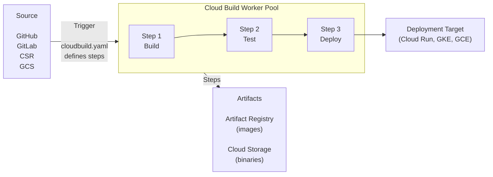
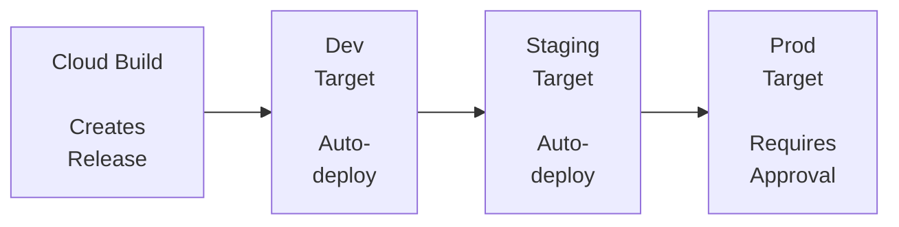

## What You'll Be Able to Do

After completing this module, you will be able to:

- **Design** sophisticated Cloud Build pipelines that orchestrate multi-step container image builds, execute parallel testing suites, and seamlessly integrate with Artifact Registry.
- **Implement** automated build triggers for GitHub, GitLab, and Cloud Source Repositories, utilizing advanced branch and tag filtering patterns to align with specific organizational release workflows.
- **Evaluate** and **diagnose** pipeline performance bottlenecks by analyzing build execution times, optimizing step parallelism, and implementing custom caching strategies.
- **Design** declarative Cloud Deploy continuous delivery pipelines that execute progressive canary rollouts, enforce manual approval gates for production environments, and enable automated rollbacks for Google Kubernetes Engine (GKE) and Cloud Run.
- **Debug** complex permission boundaries and secure CI/CD pipelines by enforcing the principle of least privilege through custom Workload Identity configurations and Secret Manager integrations.

## Why This Module Matters

In August 2012, Knight Capital Group, one of the largest market makers in the United States equities market, deployed a new version of their high-frequency trading software. The deployment process involved a technician manually logging into eight separate load-balanced servers to copy the new compiled code and restart the service. The technician successfully updated seven of the servers but inexplicably missed the eighth server. When the market opened, the outdated code on the eighth server began executing a dormant, highly aggressive test algorithm against live market data. Because the deployment process lacked an automated deployment pipeline, there was no uniform rollout, no automated verification, and no quick rollback mechanism. In exactly 45 minutes, Knight Capital Group lost $460 million---effectively bankrupting the company and forcing an emergency acquisition just to cover the clearing house obligations. 

While the Knight Capital incident occurred before the modern cloud era, the fundamental lesson remains universally critical: relying on human intervention for software delivery is an unacceptable business risk. Manual deployments are inherently fragile, subject to fatigue, oversight, and inconsistent execution. As your infrastructure scales from a single monolithic application to dozens or hundreds of microservices deployed across multiple regions, the operational overhead of manual building, testing, and deploying becomes mathematically impossible to sustain. You need a system that treats your deployment process with the exact same rigor, reproducibility, and immutability as the source code itself. 

Continuous Integration and Continuous Delivery (CI/CD) is the engineering discipline that solves this existential threat. In the Google Cloud ecosystem, **Cloud Build** and **Cloud Deploy** represent the state-of-the-art managed toolchain for implementing these practices. Cloud Build operates as a serverless execution engine, pulling your code, running it through a gauntlet of automated tests, and packaging it into immutable container images. Cloud Deploy then takes the baton, orchestrating the progressive delivery of those images across your environments (Dev, Staging, Production) with built-in safety nets like canary deployments, traffic shifting, and one-click rollbacks. Mastering these tools is not merely an operational optimization; it is the absolute prerequisite for operating cloud-native applications safely at scale.

## Cloud Build Architecture

### How Cloud Build Works

At its core, Google Cloud Build is a fully managed, serverless continuous integration and continuous delivery platform that executes your builds on Google's global infrastructure. Unlike traditional CI servers (like a self-hosted Jenkins instance) where you must manage the underlying virtual machines, handle operating system patches, and scale the worker nodes to accommodate peak development hours, Cloud Build abstracts all of this infrastructure away. You simply declare a set of build steps, and Google provisions ephemeral, isolated virtual machines on demand to execute your instructions, tearing them down the moment the build completes.



The architecture relies heavily on containerization. Every single step in your build pipeline is executed within a brand new, ephemeral Docker container. You specify the Docker image (known as a "builder") that should be used for each step. When a build is triggered, Cloud Build provisions a virtual machine, pulls down your source code, and then sequentially or concurrently launches the specified Docker containers to perform the work.

A critical design feature of Cloud Build is the `/workspace` volume. Because each step runs in an entirely separate Docker container, you might assume that files generated in Step 1 would be lost before Step 2 begins. However, Cloud Build automatically mounts a shared network volume at `/workspace` into every container that participates in the build. The source code is initially cloned into this directory. When Step 1 compiles a binary or downloads node modules, those files reside on the `/workspace` volume. When Step 1 terminates and Step 2 spins up in a completely different container image (perhaps switching from a Java compilation image to a Docker build image), it mounts that exact same `/workspace` directory, inheriting all the compiled artifacts seamlessly.

> **Pause and predict**: Cloud Build executes each step in a brand new, ephemeral Docker container. If Step 1 installs a custom software package globally using `apt-get install`, will Step 2 be able to use that software? Why or why not?

### Key Concepts

To fully leverage the platform, you must internalize the vocabulary that Google Cloud uses to describe its CI/CD primitives:

| Concept | Description |
| :--- | :--- |
| **Build** | A single execution of your pipeline |
| **Step** | A Docker container that runs a command |
| **Builder** | The Docker image used for a step (e.g., `gcr.io/cloud-builders/docker`) |
| **Trigger** | Automation that starts a build (e.g., on git push) |
| **Substitution** | Variables you can pass into the build (e.g., `$SHORT_SHA`, `$BRANCH_NAME`) |
| **Worker Pool** | The infrastructure that runs your builds (default or private) |

Understanding the distinction between a Step and a Builder is paramount. A Builder is merely the environment (the Docker image) that contains the necessary toolchain—for example, the `npm` binary or the `kubectl` CLI. The Step is the actual execution of that Builder with a specific set of arguments against your source code. You might use the exact same Builder in multiple different Steps throughout your pipeline, passing different arguments each time.

## cloudbuild.yaml: The Build Configuration

### Basic Structure

The lifeblood of your pipeline is the `cloudbuild.yaml` file. This YAML document is typically committed directly into the root of your source code repository alongside your application code, adhering to the "Infrastructure as Code" philosophy. By defining the build instructions in version control, you ensure that any changes to the build process are subject to the same peer review, linting, and historical auditing as your application logic.

Let us examine a canonical, sequential pipeline that builds a container, pushes it to Artifact Registry, and deploys it to Cloud Run:

```yaml
# cloudbuild.yaml
steps:
  # Step 1: Build the Docker image
  - name: 'gcr.io/cloud-builders/docker'
    args: ['build', '-t', 'us-central1-docker.pkg.dev/$PROJECT_ID/docker-repo/my-api:$SHORT_SHA', '.']

  # Step 2: Push to Artifact Registry
  - name: 'gcr.io/cloud-builders/docker'
    args: ['push', 'us-central1-docker.pkg.dev/$PROJECT_ID/docker-repo/my-api:$SHORT_SHA']

  # Step 3: Deploy to Cloud Run
  - name: 'gcr.io/google.com/cloudsdktool/cloud-sdk'
    entrypoint: gcloud
    args:
      - 'run'
      - 'deploy'
      - 'my-api'
      - '--image=us-central1-docker.pkg.dev/$PROJECT_ID/docker-repo/my-api:$SHORT_SHA'
      - '--region=us-central1'

# Optional: Define images for automatic pushing
images:
  - 'us-central1-docker.pkg.dev/$PROJECT_ID/docker-repo/my-api:$SHORT_SHA'

# Optional: Build configuration
options:
  logging: CLOUD_LOGGING_ONLY
  machineType: 'E2_HIGHCPU_8'

# Optional: Build timeout
timeout: '1200s'
```

In this configuration, the `steps` array defines the sequential workflow. For each step, the `name` field dictates which Docker image to pull and run. The `args` array provides the command-line arguments that are passed to the container's entrypoint. Notice the use of the `images` field at the bottom. While we explicitly run a `docker push` in Step 2, defining the image in the `images` array instructs Cloud Build to automatically push the image upon successful completion of the build and, crucially, to generate proper build provenance metadata (Software Bill of Materials) which is vital for software supply chain security.

The `options` block allows you to request more powerful underlying hardware. By default, Cloud Build provisions standard virtual machines. If you are compiling a massive C++ application or building an intricate machine learning container, you can specify `machineType: 'E2_HIGHCPU_8'` to provision an 8-core machine, drastically reducing compilation times at the cost of higher per-minute billing.

### Built-in Substitution Variables

To make your `cloudbuild.yaml` dynamic and reusable across different environments, Google Cloud Build provides a suite of default substitution variables. These variables are automatically populated by the platform based on the Git context or the project environment when the build is triggered.

| Variable | Value | Example |
| :--- | :--- | :--- |
| `$PROJECT_ID` | GCP project ID | `my-project-123` |
| `$BUILD_ID` | Unique build ID | `b1234-5678-90ab` |
| `$COMMIT_SHA` | Full commit SHA | `a1b2c3d4e5f6...` |
| `$SHORT_SHA` | 7-char commit SHA | `a1b2c3d` |
| `$BRANCH_NAME` | Git branch name | `main`, `feature/auth` |
| `$TAG_NAME` | Git tag | `v1.2.0` |
| `$REPO_NAME` | Repository name | `my-repo` |
| `$REVISION_ID` | Revision ID | Same as `$COMMIT_SHA` for git |

Utilizing these variables prevents hardcoding environment-specific values. For instance, using `$PROJECT_ID` allows the exact same `cloudbuild.yaml` file to be tested in a developer sandbox project and subsequently run in a production project without requiring any modifications to the file itself. 

> **Stop and think**: You are using `$BRANCH_NAME` as part of your Docker image tag. If two developers commit to the same branch simultaneously, what race condition might occur in Artifact Registry, and how could using `$COMMIT_SHA` solve it?

### Custom Substitutions

Beyond the built-in variables, you can define your own custom substitution variables. By convention, custom substitution variables must begin with an underscore `_` to distinguish them from the built-in variables. These act as default parameters that can be overridden at trigger time, providing immense flexibility for deploying to different regions or altering service names dynamically.

```yaml
# cloudbuild.yaml with custom substitutions
substitutions:
  _REGION: 'us-central1'
  _SERVICE_NAME: 'my-api'
  _REPO: 'docker-repo'

steps:
  - name: 'gcr.io/cloud-builders/docker'
    args:
      - 'build'
      - '-t'
      - '${_REGION}-docker.pkg.dev/$PROJECT_ID/${_REPO}/${_SERVICE_NAME}:$SHORT_SHA'
      - '.'

  - name: 'gcr.io/google.com/cloudsdktool/cloud-sdk'
    entrypoint: gcloud
    args:
      - 'run'
      - 'deploy'
      - '${_SERVICE_NAME}'
      - '--image=${_REGION}-docker.pkg.dev/$PROJECT_ID/${_REPO}/${_SERVICE_NAME}:$SHORT_SHA'
      - '--region=${_REGION}'
```

When invoking this build manually via the command line, you can pass the `--substitutions` flag to override the default values. This allows you to rapidly test deployments in alternative regions or deploy a completely separate instance of the application for integration testing:

```bash
# Override substitutions at build time
gcloud builds submit --config=cloudbuild.yaml \
  --substitutions=_REGION=europe-west1,_SERVICE_NAME=my-api-eu
```

## Builders: The Tools in Your Pipeline

### Google-Provided Builders

Google maintains a highly optimized repository of standard builder images containing the most common toolchains required for software development. Because these images are cached directly on the Cloud Build worker nodes, pulling them incurs virtually zero network latency, ensuring your pipeline starts executing your code almost instantly.

| Builder | Image | Use |
| :--- | :--- | :--- |
| **Docker** | `gcr.io/cloud-builders/docker` | Build/push Docker images |
| **gcloud** | `gcr.io/google.com/cloudsdktool/cloud-sdk` | Any gcloud command |
| **kubectl** | `gcr.io/cloud-builders/kubectl` | Kubernetes deployments |
| **npm** | `gcr.io/cloud-builders/npm` | Node.js builds |
| **go** | `gcr.io/cloud-builders/go` | Go builds |
| **mvn** | `gcr.io/cloud-builders/mvn` | Maven/Java builds |
| **gradle** | `gcr.io/cloud-builders/gradle` | Gradle/Java builds |
| **python** | `python` | Python scripts |
| **git** | `gcr.io/cloud-builders/git` | Git operations |

Using these standard builders simplifies your configuration. Instead of writing custom Dockerfiles that install Java, Maven, and all associated dependencies, you merely invoke the `mvn` builder and pass your testing arguments. 

### Using Any Docker Image as a Builder

One of the most powerful architectural decisions in Cloud Build is that there is absolutely nothing proprietary about a "builder." Any container image that can execute a shell command can function as a builder. This democratizes the pipeline, allowing you to seamlessly integrate third-party open-source tools, linting engines, security scanners, or infrastructure management CLI tools.

```yaml
steps:
  # Use Terraform
  - name: 'hashicorp/terraform:1.7'
    entrypoint: 'terraform'
    args: ['init']

  - name: 'hashicorp/terraform:1.7'
    entrypoint: 'terraform'
    args: ['apply', '-auto-approve']

  # Use a linting tool
  - name: 'golangci/golangci-lint:v1.55'
    args: ['golangci-lint', 'run', './...']

  # Use a custom security scanner
  - name: 'aquasec/trivy:latest'
    args: ['image', '--exit-code', '1', '--severity', 'CRITICAL', 'my-image:latest']
```

In this example, we pull official images directly from Docker Hub (like `hashicorp/terraform` or `aquasec/trivy`). The `entrypoint` directive overrides the container's default startup command, allowing us to explicitly call the desired binary. 

> **Pause and predict**: You need to run a proprietary, custom-built testing binary in your pipeline, but Google doesn't provide a builder image for it. What is the most efficient way to make this tool available to your Cloud Build steps?

### Creating Custom Builders

While downloading public images is convenient, doing so heavily relies on the external registry's uptime and exposes your pipeline to potential upstream supply chain attacks if the public image is compromised. For enterprise-grade pipelines, the best practice is to construct custom builder images containing the precise, verified toolchain your organization requires, and store those images in your own private Artifact Registry.

```bash
# Build and push a custom builder image
cat > Dockerfile.builder << 'EOF'
FROM ubuntu:22.04
RUN apt-get update && apt-get install -y \
    curl \
    jq \
    python3 \
    python3-pip \
    && pip3 install awscli boto3
EOF

docker build -t us-central1-docker.pkg.dev/my-project/builders/custom-tools:latest -f Dockerfile.builder .
docker push us-central1-docker.pkg.dev/my-project/builders/custom-tools:latest
```

Once this custom builder is pushed, you simply reference `us-central1-docker.pkg.dev/my-project/builders/custom-tools:latest` as the `name` attribute in your `cloudbuild.yaml` step. This ensures complete control over the execution environment and eliminates external dependencies during the critical build phase.

## Complete Pipeline Examples

### Build, Test, and Deploy to Cloud Run

To illustrate the orchestration capabilities of Cloud Build, consider a comprehensive pipeline for a Python application. This pipeline does not merely build a container; it runs unit tests, enforces code quality via linting, builds the artifact, tags it correctly, deploys it to a staging environment without exposing it to public traffic, runs integration tests against that staging instance, and finally promotes the traffic to production upon successful verification.

```yaml
# cloudbuild.yaml
steps:
  # Step 1: Run unit tests
  - name: 'python:3.12-slim'
    entrypoint: 'bash'
    args:
      - '-c'
      - |
        pip install -r requirements.txt
        pip install pytest
        pytest tests/ -v

  # Step 2: Run linting
  - name: 'python:3.12-slim'
    entrypoint: 'bash'
    args:
      - '-c'
      - |
        pip install ruff
        ruff check .

  # Step 3: Build Docker image
  - name: 'gcr.io/cloud-builders/docker'
    args:
      - 'build'
      - '-t'
      - 'us-central1-docker.pkg.dev/$PROJECT_ID/docker-repo/my-api:$SHORT_SHA'
      - '-t'
      - 'us-central1-docker.pkg.dev/$PROJECT_ID/docker-repo/my-api:latest'
      - '.'

  # Step 4: Push to Artifact Registry
  - name: 'gcr.io/cloud-builders/docker'
    args: ['push', '--all-tags', 'us-central1-docker.pkg.dev/$PROJECT_ID/docker-repo/my-api']

  # Step 5: Deploy to staging
  - name: 'gcr.io/google.com/cloudsdktool/cloud-sdk'
    entrypoint: gcloud
    args:
      - 'run'
      - 'deploy'
      - 'my-api-staging'
      - '--image=us-central1-docker.pkg.dev/$PROJECT_ID/docker-repo/my-api:$SHORT_SHA'
      - '--region=us-central1'
      - '--no-traffic'
      - '--tag=canary'

  # Step 6: Run integration tests against staging
  - name: 'curlimages/curl:latest'
    entrypoint: 'sh'
    args:
      - '-c'
      - |
        CANARY_URL=$(gcloud run services describe my-api-staging --region=us-central1 --format='value(status.traffic[].url)' | grep canary)
        curl -f "$CANARY_URL/health" || exit 1
        echo "Health check passed"

  # Step 7: Promote to production traffic
  - name: 'gcr.io/google.com/cloudsdktool/cloud-sdk'
    entrypoint: gcloud
    args:
      - 'run'
      - 'services'
      - 'update-traffic'
      - 'my-api-staging'
      - '--region=us-central1'
      - '--to-latest'

images:
  - 'us-central1-docker.pkg.dev/$PROJECT_ID/docker-repo/my-api:$SHORT_SHA'
  - 'us-central1-docker.pkg.dev/$PROJECT_ID/docker-repo/my-api:latest'

options:
  logging: CLOUD_LOGGING_ONLY
  machineType: 'E2_HIGHCPU_8'

timeout: '1800s'
```

Notice the progressive safety checks woven into this pipeline. If the unit tests in Step 1 fail, the entire build halts immediately, preventing a broken application from ever being packaged into an image. Step 5 introduces a sophisticated Cloud Run feature: it deploys the new revision but assigns it zero percent of the active traffic, attaching a custom `canary` URL tag instead. Step 6 uses a simple `curl` command against this isolated canary URL to verify that the application is responding healthily in the actual staging environment. Only if this empirical check passes does Step 7 execute the final traffic promotion.

### Build with Parallel Steps

As your application grows, running rigorous test suites, complex linting rules, and heavy Docker builds sequentially will inevitably slow down your feedback loop. Developer velocity is directly correlated to pipeline speed. Fortunately, Cloud Build natively supports Directed Acyclic Graph (DAG) execution, allowing independent steps to execute in parallel.

By utilizing the `id` field to uniquely identify a step, and the `waitFor` array to declare dependencies, you can instruct the execution engine to orchestrate complex concurrent workflows. If a step defines `waitFor: ['-']`, it instructs Cloud Build to completely detach that step from the sequential order and execute it immediately upon pipeline initialization.

```yaml
steps:
  # Build image (starts immediately)
  - id: 'build'
    name: 'gcr.io/cloud-builders/docker'
    args: ['build', '-t', 'my-image:$SHORT_SHA', '.']

  # Run unit tests (in parallel with build - different source)
  - id: 'unit-tests'
    name: 'python:3.12-slim'
    waitFor: ['-']  # Start immediately, do not wait for 'build'
    entrypoint: 'bash'
    args:
      - '-c'
      - 'pip install -r requirements.txt && pytest tests/unit/'

  # Run linting (in parallel with build and tests)
  - id: 'lint'
    name: 'python:3.12-slim'
    waitFor: ['-']
    entrypoint: 'bash'
    args:
      - '-c'
      - 'pip install ruff && ruff check .'

  # Push image (waits for build, tests, and lint to pass)
  - id: 'push'
    name: 'gcr.io/cloud-builders/docker'
    waitFor: ['build', 'unit-tests', 'lint']
    args: ['push', 'my-image:$SHORT_SHA']
```

In this optimized configuration, the Docker build, the Python unit tests, and the Ruff linting checks all launch simultaneously across separate containers. The final `push` step acts as the convergence point. It will idle in a pending state until all three preceding steps complete successfully. If the linting step fails rapidly, the pipeline will still abort, but by parallelizing the execution, the total pipeline duration is reduced to the time of the single longest running step, rather than the sum of all steps.

> **Pause and predict**: If your unit tests take 5 minutes, linting takes 2 minutes, and building the image takes 4 minutes, what is the absolute minimum time your pipeline could take if you configure these steps to run in parallel using `waitFor: ['-']`?

## Build Triggers

Writing a `cloudbuild.yaml` file is only the first half of the CI/CD equation; the second half is automating its execution. Build Triggers form the connective tissue between your version control system and the Cloud Build execution engine. Triggers constantly listen for webhook events originating from your source repositories and automatically spin up pipeline executions based on filtering rules.

### GitHub Trigger

For organizations utilizing GitHub, Cloud Build offers a deeply integrated, native application architecture. By installing the Google Cloud Build app in your GitHub organization, you can configure granular triggers that respond dynamically to different developer actions. A robust DevOps strategy generally utilizes multiple overlapping triggers to address different phases of the software development lifecycle.

```bash
# Connect GitHub repository first (one-time setup via console)
# Then create a trigger:

# Trigger on push to main branch
gcloud builds triggers create github \
  --name="deploy-on-push-to-main" \
  --repo-name="my-repo" \
  --repo-owner="my-org" \
  --branch-pattern="^main$" \
  --build-config="cloudbuild.yaml" \
  --description="Build and deploy on push to main"

# Trigger on pull request (for CI checks)
gcloud builds triggers create github \
  --name="ci-checks-on-pr" \
  --repo-name="my-repo" \
  --repo-owner="my-org" \
  --pull-request-pattern="^main$" \
  --build-config="cloudbuild-ci.yaml" \
  --description="Run CI checks on pull requests" \
  --comment-control=COMMENTS_ENABLED_FOR_EXTERNAL_CONTRIBUTORS_ONLY

# Trigger on Git tag (for releases)
gcloud builds triggers create github \
  --name="release-on-tag" \
  --repo-name="my-repo" \
  --repo-owner="my-org" \
  --tag-pattern="^v[0-9]+\\.[0-9]+\\.[0-9]+$" \
  --build-config="cloudbuild-release.yaml" \
  --description="Build and release on version tag" \
  --substitutions="_VERSION=$TAG_NAME"
```

In this setup, a Pull Request trigger runs a subset of tasks defined in a separate `cloudbuild-ci.yaml` (likely omitting the deployment steps) to validate the integrity of proposed changes before they are permitted to merge. A branch trigger listens exclusively to `main` for continuous delivery. The tag trigger utilizes regular expression parsing (`^v[0-9]+\.[0-9]+\.[0-9]+$`) to capture strict semantic versioning tags (like `v1.2.4`) and execute immutable release packaging.

### GitLab Trigger

For organizations operating enterprise instances of GitLab, Cloud Build facilitates seamless integration through the concept of "Connections." Rather than relying on a simple webhook, Cloud Build creates an authenticated, regional connection leveraging a Personal Access Token securely stored within Google Secret Manager.

```bash
# Create a GitLab connection first
gcloud builds connections create gitlab my-gitlab-conn \
  --region=us-central1 \
  --host-uri="https://gitlab.com" \
  --api-access-token-secret-version="projects/my-project/secrets/gitlab-token/versions/latest"

# Link a repository
gcloud builds repositories create my-gitlab-repo \
  --connection=my-gitlab-conn \
  --region=us-central1 \
  --remote-uri="https://gitlab.com/my-org/my-repo.git"

# Create a trigger
gcloud builds triggers create gitlab-enterprise \
  --name="deploy-from-gitlab" \
  --repository="projects/my-project/locations/us-central1/connections/my-gitlab-conn/repositories/my-gitlab-repo" \
  --branch-pattern="^main$" \
  --build-config="cloudbuild.yaml" \
  --region=us-central1
```

This configuration strategy anchors the repository metadata strictly within a designated Google Cloud region, ensuring compliance with data sovereignty and location requirements.

### Manual Triggers

While automated triggers drive the day-to-day continuous integration loop, manual triggers are indispensable for immediate debugging, disaster recovery, or executing ad-hoc operational tasks (like running database migrations). When you submit a build manually from your local terminal, the `gcloud` CLI packages your local directory into a compressed archive, uploads it to a temporary Cloud Storage bucket, and invokes the Cloud Build API to execute the pipeline using that uploaded artifact.

```bash
# Submit a build manually (from local source)
gcloud builds submit --config=cloudbuild.yaml .

# Submit with substitutions
gcloud builds submit --config=cloudbuild.yaml \
  --substitutions=_ENV=staging,SHORT_SHA=local123 .

# Submit from a GCS archive
gcloud builds submit --config=cloudbuild.yaml \
  gs://my-bucket/source.tar.gz

# List builds
gcloud builds list --limit=10 \
  --format="table(id, status, createTime, source.repoSource.branchName)"

# View build logs
gcloud builds log BUILD_ID
```

## Cloud Build Service Account

A pipeline is fundamentally an automated process acting on behalf of your organization. When Cloud Build pushes an image to Artifact Registry or deploys a service to Cloud Run, it must authenticate and authorize those actions. It achieves this by assuming the identity of an IAM Service Account.

By default, Cloud Build historically leveraged a single, powerful "legacy" service account (`[PROJECT_NUMBER]@cloudbuild.gserviceaccount.com`) which possessed sweeping administrative privileges across the entire project. Relying on this default account violates the core security tenet of least privilege. A compromised pipeline configuration could theoretically be used to alter routing configurations, delete databases, or modify core infrastructure far beyond the scope of a simple deployment.

Best practices dictate creating dedicated, custom service accounts explicitly tailored to the precise requirements of individual pipelines.

```bash
# View the default Cloud Build service account
gcloud projects get-iam-policy $PROJECT_ID \
  --flatten="bindings[].members" \
  --filter="bindings.members:cloudbuild.gserviceaccount.com" \
  --format="table(bindings.role)"

# Use a custom service account (recommended for production)
gcloud iam service-accounts create cloud-build-sa \
  --display-name="Custom Cloud Build SA"

# Grant specific permissions
gcloud projects add-iam-binding $PROJECT_ID \
  --member="serviceAccount:cloud-build-sa@${PROJECT_ID}.iam.gserviceaccount.com" \
  --role="roles/run.admin"

gcloud projects add-iam-binding $PROJECT_ID \
  --member="serviceAccount:cloud-build-sa@${PROJECT_ID}.iam.gserviceaccount.com" \
  --role="roles/artifactregistry.writer"

# Use the custom SA in a trigger
gcloud builds triggers update my-trigger \
  --service-account="projects/$PROJECT_ID/serviceAccounts/cloud-build-sa@${PROJECT_ID}.iam.gserviceaccount.com"
```

By binding minimal permissions (like strictly `roles/run.admin` and `roles/artifactregistry.writer`) to a bespoke service account, and attaching that account directly to the trigger, you dramatically contain the blast radius. Even if malicious code were somehow injected into the execution phase, the pipeline simply lacks the IAM privileges to inflict structural damage on adjacent cloud resources.

## Cloud Deploy: Continuous Delivery Pipelines

While Cloud Build excels at continuous integration (compiling code and creating container artifacts), using it to handle complex, multi-environment deployments via raw bash scripts and `gcloud` commands quickly becomes unwieldy. The imperative "fire-and-forget" nature of running `kubectl apply` inside a build step lacks robust state tracking, visual representation of environments, and formal approval gates. 

To bridge this gap, Google introduced **Cloud Deploy**, a fully managed continuous delivery (CD) service specifically engineered to orchestrate declarative application deployments to Google Kubernetes Engine (GKE), Cloud Run, and Anthos. 



Cloud Deploy introduces a distinct ontological model. You define a **Delivery Pipeline** which outlines a sequential series of environments, known as **Targets**. When your CI tool (like Cloud Build) completes its work, it generates an immutable **Release** referencing specific container images. Cloud Deploy then assumes responsibility for orchestrating **Rollouts** of that release across your designated targets.

### Setting Up a Delivery Pipeline

> **Stop and think**: In a multi-stage delivery pipeline, you notice that deployments to `prod` are causing a bottleneck because the QA team is overwhelmed with manual approvals. How could you leverage Cloud Deploy's `strategy.canary` feature (which automates traffic splitting and verification) to reduce the risk of production deployments and potentially reduce the reliance on human approval gates?

A Cloud Deploy pipeline is defined using Kubernetes Resource Model (KRM) YAML syntax. The configuration distinctly separates the overarching pipeline definition from the individual environment targets. 

To resolve parsing complexities, it is critical to supply these as independent, well-formed YAML files rather than concatenating them in a single stream. The architectural approach maps the conceptual pipeline explicitly: 

```yaml
# deploy/pipeline.yaml
apiVersion: deploy.cloud.google.com/v1
kind: DeliveryPipeline
metadata:
  name: my-api-pipeline
description: "Delivery pipeline for my-api"
serialPipeline:
  stages:
    - targetId: dev
      profiles: [dev]
    - targetId: staging
      profiles: [staging]
    - targetId: prod
      profiles: [prod]
      strategy:
        canary:
          runtimeConfig:
            cloudRun:
              automaticTrafficControl: true
          canaryDeployment:
            percentages: [10, 50]
            verify: true
```

The pipeline configuration above maps out the promotional lifecycle: Dev -> Staging -> Prod. Crucially, the production stage incorporates an advanced `strategy.canary` block. Instead of abruptly shifting 100% of customer traffic to the newly released software, the canary strategy intelligently reroutes only 10% of traffic initially. It then pauses, performing an automated verification check against application metrics. If the error rates remain nominal, it progressively advances to 50% traffic before finally completing the rollout.

The environments themselves are defined individually as target definitions, stipulating the regional coordinates of the actual infrastructure:

```yaml
# deploy/dev-target.yaml
apiVersion: deploy.cloud.google.com/v1
kind: Target
metadata:
  name: dev
description: "Dev environment"
run:
  location: projects/my-project/locations/us-central1
```

```yaml
# deploy/staging-target.yaml
apiVersion: deploy.cloud.google.com/v1
kind: Target
metadata:
  name: staging
description: "Staging environment"
run:
  location: projects/my-project/locations/us-central1
```

The production target, holding the highest stakes, utilizes the `requireApproval: true` directive. This parameter natively halts the entire deployment machinery, suspending the release in a pending state until a designated administrator formally approves the rollout via the GCP Console or API.

```yaml
# deploy/prod-target.yaml
apiVersion: deploy.cloud.google.com/v1
kind: Target
metadata:
  name: prod
description: "Production environment"
requireApproval: true
run:
  location: projects/my-project/locations/us-central1
```

With the declarative configurations established, the operational lifecycle shifts to the command line, enabling the registration of these constructs and the execution of the release promotion lifecycle:

```bash
# Register the pipeline and targets
gcloud deploy apply --file=deploy/pipeline.yaml --region=us-central1
gcloud deploy apply --file=deploy/dev-target.yaml --region=us-central1
gcloud deploy apply --file=deploy/staging-target.yaml --region=us-central1
gcloud deploy apply --file=deploy/prod-target.yaml --region=us-central1

# Create a release (typically done by Cloud Build)
gcloud deploy releases create release-v1-0 \
  --delivery-pipeline=my-api-pipeline \
  --region=us-central1 \
  --images=my-api=us-central1-docker.pkg.dev/my-project/docker-repo/my-api:v1.0.0

# Promote a release to the next stage
gcloud deploy releases promote --release=release-v1-0 \
  --delivery-pipeline=my-api-pipeline \
  --region=us-central1

# Approve a release for production
gcloud deploy rollouts approve rollout-id \
  --delivery-pipeline=my-api-pipeline \
  --release=release-v1-0 \
  --region=us-central1

# Rollback
gcloud deploy targets rollback prod \
  --delivery-pipeline=my-api-pipeline \
  --region=us-central1
```

Cloud Deploy's true value proposition materializes during an incident. The `gcloud deploy targets rollback` command entirely bypasses the need to locate previous source code commits, revert git history, or rerun a lengthy pipeline build. It immediately re-applies the known-good container image artifacts from the previous successful release back onto the targeted environment, stabilizing production in seconds rather than minutes.

## Secrets in Cloud Build

Modern applications invariably interact with external dependencies—requiring API keys, private NPM tokens, database passwords, or third-party service credentials during the build or deployment phase. A catastrophic anti-pattern is attempting to inject these credentials using raw substitution variables or storing them as plaintext within the `cloudbuild.yaml` document. Cloud Build substitutions are thoroughly logged and visible in plain text throughout the build history and GCP console interface.

The only acceptable architecture for secret management involves a tight integration with Google Cloud Secret Manager. 

```yaml
# Accessing secrets from Secret Manager in Cloud Build
steps:
  - name: 'gcr.io/cloud-builders/docker'
    args:
      - 'build'
      - '--build-arg'
      - 'NPM_TOKEN=$$NPM_TOKEN'
      - '-t'
      - 'my-image:$SHORT_SHA'
      - '.'
    secretEnv: ['NPM_TOKEN']

availableSecrets:
  secretManager:
    - versionName: projects/$PROJECT_ID/secrets/npm-token/versions/latest
      env: 'NPM_TOKEN'
```

In this configuration, the `availableSecrets` block references the highly secure cryptographic payload stored within Secret Manager. During execution, the Cloud Build engine utilizes its service account identity to request the decrypted payload from the API. The secret is then injected dynamically into the runtime environment of the executing Docker container via the `secretEnv` array. Crucially, the double-dollar sign `$$NPM_TOKEN` escapes the variable, ensuring it evaluates directly as a shell parameter inside the container instead of attempting a premature Cloud Build substitution evaluation, completely obscuring the secret from the visible logs and build output.

## Did You Know?

1. **Cloud Build's default worker pool runs on Google-managed infrastructure** with no minimum fees. You only pay for the build minutes consumed. The first 120 build-minutes per day are free for the `e2-medium` machine type. For a team doing 10 builds per day averaging 5 minutes each, the CI/CD platform costs literally nothing.

2. **Cloud Build steps share a `/workspace` volume** that persists across steps. This means step 1 can clone code, step 2 can compile it, and step 3 can test the compiled binaries---all without pushing/pulling artifacts between steps. The workspace is a mounted directory, not a Docker volume, so it performs at native filesystem speed.

3. **Private worker pools run inside your VPC**, allowing builds to access private resources (private Artifact Registry, internal APIs, databases) without exposing them to the internet. They also support custom machine types up to 32 vCPUs for faster builds. Private pools are essential for enterprises with strict network security requirements.

4. **Cloud Build supports build caching through `kaniko`**, a tool that builds Docker images without a Docker daemon. Kaniko can cache intermediate layers in Artifact Registry, so subsequent builds that share base layers skip the redundant steps. This can reduce build times by 50-80% for large Docker images with many dependencies.

## Common Mistakes

| Mistake | Why It Happens | How to Fix It |
| :--- | :--- | :--- |
| Using the default Cloud Build SA for everything | Convenience; it has broad permissions | Create a custom SA per pipeline with minimal permissions |
| Not using parallel steps | Steps run sequentially by default | Use `waitFor: ['-']` to run independent steps concurrently |
| Hardcoding project IDs in cloudbuild.yaml | Works during initial development | Use `$PROJECT_ID` substitution for portability |
| Not setting build timeouts | Default 10-minute timeout is too short for large builds | Set `timeout: '1800s'` (30 minutes) for complex pipelines |
| Skipping tests in the CI pipeline | "We test locally" | Always run tests in CI; the pipeline is the source of truth |
| Not using `images:` field for Docker pushes | Pushing images manually in steps | Use the `images:` field for automatic pushing and provenance |
| Building everything on every commit | Simplest configuration | Use path filters in triggers to build only what changed |
| Not encrypting build secrets | Storing secrets as plain substitutions | Use `availableSecrets` with Secret Manager |

## Quiz

<details>
<summary>1. Your Cloud Build pipeline has three steps: a Node.js builder that runs `npm run build`, a custom security scanner builder, and a Docker builder that creates an image. You notice that the `dist` folder generated by the first step is accessible by the subsequent steps, even though they run in completely different container images. How is this possible without explicitly copying files between containers?</summary>

The `/workspace` directory is a shared volume that persists across all steps in a single Cloud Build execution. When a build starts, the source code is checked out into `/workspace`. Each subsequent step runs in a new, ephemeral Docker container, but the `/workspace` directory is seamlessly mounted into every single one of those containers. This architectural choice means step 1 can download dependencies or compile code, and step 2 can test or package that exact compiled output without needing to push or pull artifacts over the network between steps. The workspace acts as the common scratchpad for the entire pipeline lifecycle.
</details>

<details>
<summary>2. You are optimizing a pipeline that currently takes 15 minutes: 5 minutes for unit tests, 5 minutes for security scanning, and 5 minutes for building the Docker image. The security scan and the unit tests do not depend on each other, nor do they depend on the Docker build. How can you configure your `cloudbuild.yaml` to execute these three steps simultaneously and reduce the total build time to 5 minutes?</summary>

You can configure parallel execution by utilizing the `waitFor` property in your `cloudbuild.yaml` step definitions. By default, Cloud Build runs steps sequentially, waiting for the previous step to finish. To run steps concurrently, you assign an `id` to each step and set `waitFor: ['-']`, which instructs Cloud Build to start the step immediately without waiting for any prior steps. If you have a final step (like pushing an image) that needs all three parallel steps to finish first, you would configure that final step with `waitFor: ['test-id', 'scan-id', 'build-id']`. This dependency graph execution minimizes pipeline duration by running independent tasks at the same time.
</details>

<details>
<summary>3. Your engineering team wants to automatically deploy to the staging environment whenever a developer merges code into the `main` branch. However, they only want to trigger a production deployment when a specific release version (like `v2.1.0`) is cut. How would you configure Cloud Build triggers differently to satisfy both of these workflow requirements?</summary>

You would configure two separate Cloud Build triggers using different Git matching mechanisms: a branch pattern trigger and a tag pattern trigger. For the staging environment, you configure a branch pattern trigger matching `^main$`, which fires every time a commit is pushed or merged into that branch. This is ideal for continuous integration. For production, you create a tag pattern trigger matching a regex like `^v[0-9]+\.[0-9]+\.[0-9]+$`. This trigger will ignore regular branch commits and only execute when a developer creates and pushes a Git tag that matches semantic versioning. This creates a clear distinction between ongoing development builds and explicit, immutable release artifacts.
</details>

<details>
<summary>4. A junior developer creates a basic Cloud Build pipeline that just runs `npm test` on a React frontend and outputs the results. During a security audit, you notice this pipeline is using the default Cloud Build service account. You immediately recommend switching it to a custom service account. What is the security risk of leaving it as the default?</summary>

The risk lies in the violation of the principle of least privilege due to the default service account's broad, overly permissive roles. By default, the Cloud Build service account (`PROJECT_NUMBER@cloudbuild.gserviceaccount.com`) is granted the `Cloud Build Service Account` role, which includes permissions to push to Artifact Registry, deploy to Cloud Run, modify GKE clusters, and more. If a malicious actor compromises the React repository and alters the `cloudbuild.yaml` or a test script, they could use that pipeline's default credentials to deploy rogue containers or delete production infrastructure. A custom service account should be created with absolutely no permissions, and only the specific IAM roles required for that exact pipeline (e.g., just logging) should be granted.
</details>

<details>
<summary>5. Your team currently deploys to GKE by adding a final step in `cloudbuild.yaml` that runs `kubectl apply`. The CTO now requires that all deployments to production must be manually approved by the QA team, and there must be an automated way to roll back traffic if errors spike. Why is your current `kubectl` step insufficient, and how does Cloud Deploy solve this?</summary>

A simple `kubectl apply` or `gcloud run deploy` step inside Cloud Build is a "fire-and-forget" imperative command that lacks lifecycle management, approval gates, and environment awareness. Once Cloud Build executes the command, its job is done. Cloud Deploy, on the other hand, is a declarative continuous delivery (CD) platform that separates the deployment logic from the build process. It allows you to define a Delivery Pipeline with specific targets (dev, staging, prod). When Cloud Build finishes, it creates a "Release" in Cloud Deploy. Cloud Deploy then natively enforces `requireApproval: true` on the production target, pausing the rollout until QA clicks approve. Furthermore, it tracks the history of all releases, providing a native "Rollback" button that instantly restores the previous working state without needing to rerun a build pipeline.
</details>

<details>
<summary>6. Your build pipeline needs to download a proprietary library from a third-party registry, which requires a private API token. A developer suggests simply adding the token as a substitution variable when triggering the build (`--substitutions=_API_TOKEN=xyz`). Why is this a severe security vulnerability, and what is the proper GCP-native way to handle this token?</summary>

Passing secrets as substitution variables is highly insecure because substitutions are stored in plain text and are fully visible in the Cloud Build UI, the build history logs, and the API responses for anyone with basic viewer access to the project. The proper, GCP-native approach is to store the API token in Google Secret Manager. In your `cloudbuild.yaml`, you define an `availableSecrets` block pointing to the specific Secret Manager version. You then inject it into the specific step using `secretEnv`. This securely pulls the secret at runtime directly into the container's environment variables, ensuring the token is never logged, persisted in the build configuration, or exposed to unauthorized users viewing the build history.
</details>

## Hands-On Exercise: Build and Deploy Pipeline

### Objective

Create a complete CI/CD pipeline that autonomously orchestrates the building of a Docker image, rigorously evaluates unit tests, pushes the resulting artifact to Artifact Registry, and securely deploys the containerized service directly to Google Cloud Run.

### Prerequisites

- `gcloud` CLI installed and authenticated locally against your development environment
- A GCP project with active billing enabled
- A local installation of Docker to verify components locally if necessary

### Tasks

**Task 1: Set Up the Application and Infrastructure**
Initialize your project environment and generate a simple Python Flask API wrapped securely in a Docker container, complete with pytest validation logic.

<details>
<summary>Solution</summary>

```bash
export PROJECT_ID=$(gcloud config get-value project)
export REGION=us-central1

# Enable APIs
gcloud services enable \
  cloudbuild.googleapis.com \
  artifactregistry.googleapis.com \
  run.googleapis.com \
  secretmanager.googleapis.com

# Create Artifact Registry repository
gcloud artifacts repositories create cicd-lab \
  --repository-format=docker \
  --location=$REGION \
  --description="CI/CD lab images"

# Create the application
mkdir -p /tmp/cicd-lab && cd /tmp/cicd-lab

cat > main.py << 'PYEOF'
import os
from flask import Flask, jsonify

app = Flask(__name__)
VERSION = os.environ.get("APP_VERSION", "unknown")

@app.route("/")
def home():
    return jsonify({"version": VERSION, "status": "running"})

@app.route("/health")
def health():
    return jsonify({"status": "healthy"})

if __name__ == "__main__":
    port = int(os.environ.get("PORT", 8080))
    app.run(host="0.0.0.0", port=port)
PYEOF

cat > requirements.txt << 'EOF'
flask>=3.0.0
gunicorn>=21.2.0
pytest>=8.0.0
EOF

cat > test_main.py << 'PYEOF'
from main import app

def test_home():
    client = app.test_client()
    response = client.get("/")
    assert response.status_code == 200
    data = response.get_json()
    assert "version" in data
    assert "status" in data

def test_health():
    client = app.test_client()
    response = client.get("/health")
    assert response.status_code == 200
    data = response.get_json()
    assert data["status"] == "healthy"
PYEOF

cat > Dockerfile << 'DEOF'
FROM python:3.12-slim
WORKDIR /app
COPY requirements.txt .
RUN pip install --no-cache-dir -r requirements.txt
COPY main.py .
CMD ["gunicorn", "--bind", "0.0.0.0:8080", "main:app"]
DEOF
```
</details>

**Task 2: Write the cloudbuild.yaml**
Construct the multi-step `cloudbuild.yaml` file leveraging directed dependencies. Ensure the deployment step strictly waits for the push step to complete, and incorporates proper dynamic substitutions.

<details>
<summary>Solution</summary>

```bash
cat > cloudbuild.yaml << 'EOF'
steps:
  # Step 1: Run unit tests
  - id: 'test'
    name: 'python:3.12-slim'
    entrypoint: 'bash'
    args:
      - '-c'
      - |
        pip install -r requirements.txt
        pytest test_main.py -v

  # Step 2: Build Docker image
  - id: 'build'
    name: 'gcr.io/cloud-builders/docker'
    waitFor: ['test']
    args:
      - 'build'
      - '-t'
      - '${_REGION}-docker.pkg.dev/$PROJECT_ID/${_REPO}/${_SERVICE}:${SHORT_SHA}'
      - '.'

  # Step 3: Push to Artifact Registry
  - id: 'push'
    name: 'gcr.io/cloud-builders/docker'
    waitFor: ['build']
    args:
      - 'push'
      - '${_REGION}-docker.pkg.dev/$PROJECT_ID/${_REPO}/${_SERVICE}:${SHORT_SHA}'

  # Step 4: Deploy to Cloud Run
  - id: 'deploy'
    name: 'gcr.io/google.com/cloudsdktool/cloud-sdk'
    waitFor: ['push']
    entrypoint: gcloud
    args:
      - 'run'
      - 'deploy'
      - '${_SERVICE}'
      - '--image=${_REGION}-docker.pkg.dev/$PROJECT_ID/${_REPO}/${_SERVICE}:${SHORT_SHA}'
      - '--region=${_REGION}'
      - '--allow-unauthenticated'
      - '--set-env-vars=APP_VERSION=${SHORT_SHA}'

substitutions:
  _REGION: 'us-central1'
  _REPO: 'cicd-lab'
  _SERVICE: 'cicd-lab-api'

images:
  - '${_REGION}-docker.pkg.dev/$PROJECT_ID/${_REPO}/${_SERVICE}:${SHORT_SHA}'

options:
  logging: CLOUD_LOGGING_ONLY

timeout: '900s'
EOF

echo "cloudbuild.yaml created."
```
</details>

**Task 3: Run the Build Manually**
Invoke the `gcloud` command to execute the pipeline utilizing local files as the codebase snapshot, injecting an explicit commit short SHA variable.

<details>
<summary>Solution</summary>

```bash
cd /tmp/cicd-lab

# Submit the build
gcloud builds submit \
  --config=cloudbuild.yaml \
  --substitutions=SHORT_SHA=manual01 \
  .

# Check build status
gcloud builds list --limit=3 \
  --format="table(id, status, createTime, images[0])"

# Get the Cloud Run service URL
SERVICE_URL=$(gcloud run services describe cicd-lab-api \
  --region=$REGION --format="value(status.url)")
echo "Service URL: $SERVICE_URL"

# Test the deployment
curl -s $SERVICE_URL | python3 -m json.tool
```
</details>

**Task 4: Deploy a Second Version**
Mutate the Flask API application logic directly, then trigger a secondary pipeline execution to dynamically apply the update to the running Cloud Run service.

<details>
<summary>Solution</summary>

```bash
# Modify the application
cat > main.py << 'PYEOF'
import os
from flask import Flask, jsonify

app = Flask(__name__)
VERSION = os.environ.get("APP_VERSION", "unknown")

@app.route("/")
def home():
    return jsonify({
        "version": VERSION,
        "status": "running",
        "features": ["health-check", "version-api"]
    })

@app.route("/health")
def health():
    return jsonify({"status": "healthy"})

if __name__ == "__main__":
    port = int(os.environ.get("PORT", 8080))
    app.run(host="0.0.0.0", port=port)
PYEOF

# Build and deploy v2
gcloud builds submit \
  --config=cloudbuild.yaml \
  --substitutions=SHORT_SHA=manual02 \
  .

# Verify the new version
sleep 15
curl -s $SERVICE_URL | python3 -m json.tool
```
</details>

**Task 5: View Build History and Logs**
Audit your pipeline execution metadata locally using command-line filters to visualize execution parameters.

<details>
<summary>Solution</summary>

```bash
# List recent builds
gcloud builds list --limit=5 \
  --format="table(id, status, createTime, substitutions.SHORT_SHA)"

# Get the latest build ID
BUILD_ID=$(gcloud builds list --limit=1 --format="value(id)")

# View build logs
gcloud builds log $BUILD_ID

# View build details
gcloud builds describe $BUILD_ID --format="yaml(steps, results, timing)"
```
</details>

**Task 6: Clean Up**
Systematically dismantle all the resources provisioned during this exercise, preserving the hygiene of the GCP environment and halting unnecessary billing accruals.

<details>
<summary>Solution</summary>

```bash
# Delete Cloud Run service
gcloud run services delete cicd-lab-api --region=$REGION --quiet

# Delete images from Artifact Registry
gcloud artifacts docker images delete \
  ${REGION}-docker.pkg.dev/${PROJECT_ID}/cicd-lab/cicd-lab-api:manual01 \
  --quiet --delete-tags 2>/dev/null || true
gcloud artifacts docker images delete \
  ${REGION}-docker.pkg.dev/${PROJECT_ID}/cicd-lab/cicd-lab-api:manual02 \
  --quiet --delete-tags 2>/dev/null || true

# Delete repository
gcloud artifacts repositories delete cicd-lab \
  --location=$REGION --quiet

# Clean up local files
rm -rf /tmp/cicd-lab

echo "Cleanup complete."
```
</details>

### Success Criteria

- [ ] Application with tests created locally securely using standardized frameworks
- [ ] `cloudbuild.yaml` with explicit test, build, push, and deploy steps fully implemented
- [ ] Build execution submitted manually and completed processing successfully
- [ ] Software reliability confirmed as tests pass fully in the CI pipeline execution layer
- [ ] Docker artifact securely compiled and definitively pushed to regional Artifact Registry
- [ ] Cloud Run service rapidly deployed and globally accessible via public HTTPS
- [ ] Application safely mutated and a subsequent second version deployed successfully
- [ ] All infrastructure components fully documented and completely cleaned up, zeroing cost implications

## Next Module

Now that you have established a reliable and immutable pathway for releasing code into production, you need an architectural blueprint to securely organize those applications at scale. Next up: **[Module 2.12: GCP Architectural Patterns](../module-2.12-patterns/)** --- Learn how to construct sophisticated project vending machines, design secure landing zones, configure Identity-Aware Proxy for zero-trust access, and survey Anthos and GKE for massive-scale container orchestration.