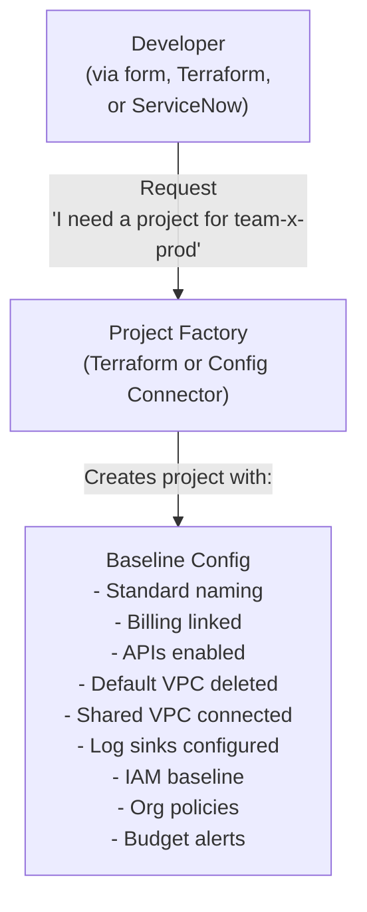
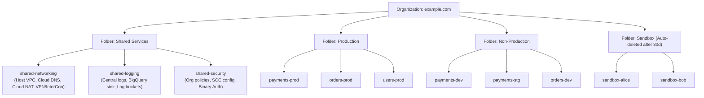
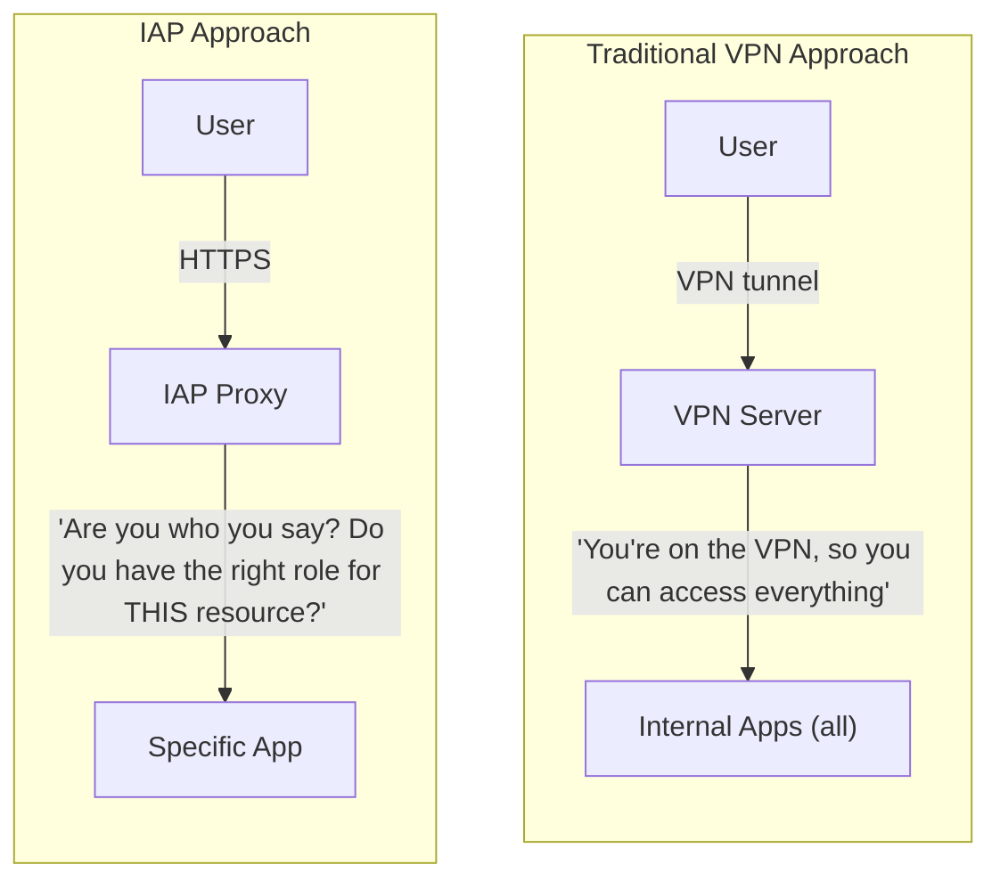
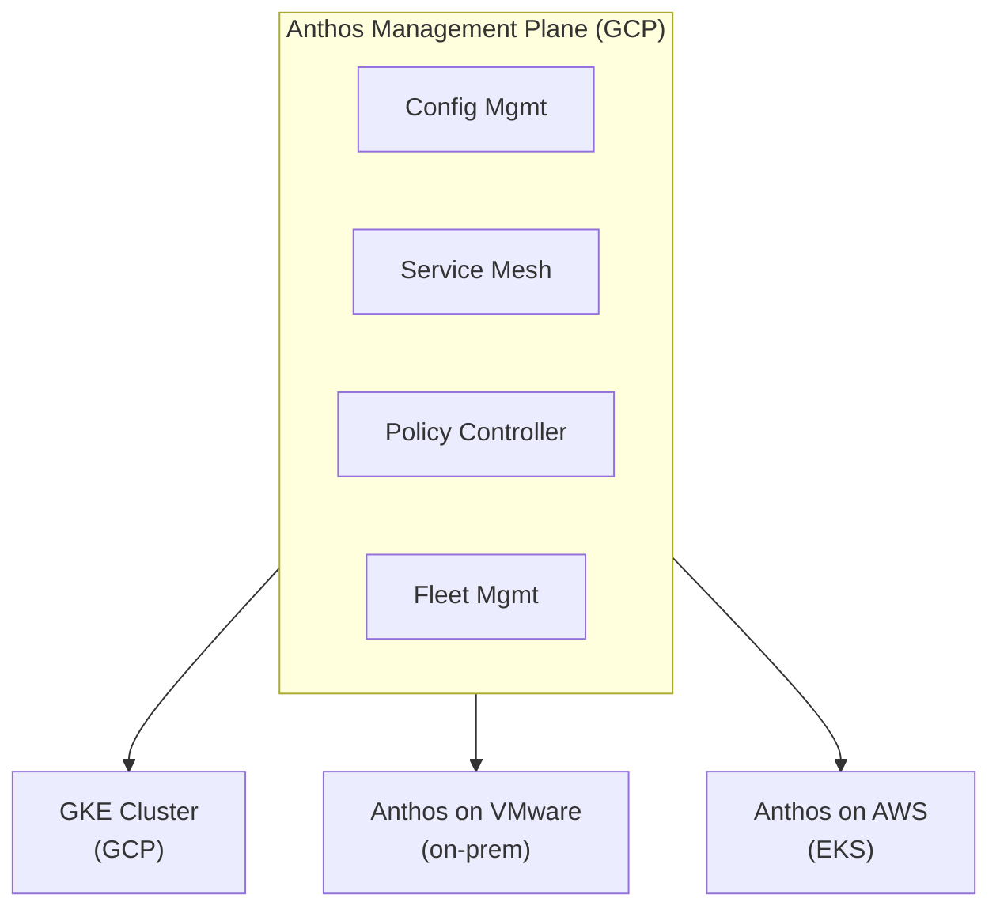

**Complexity**: [COMPLEX] | **Time to Complete**: 1.5h | **Prerequisites**: Modules 1-11 (all previous GCP Essentials modules)

## What You'll Be Able to Do

After completing this module, you will be able to:

- **Design** GCP architectures using Shared VPC, Private Service Connect, and hub-spoke network topologies to ensure secure, isolated communication.
- **Evaluate** GCP-native patterns for microservices (Cloud Run, GKE, App Engine) and select the right compute tier based on workload requirements.
- **Implement** high-availability architectures with regional failover, global load balancing, and multi-region data replication to eliminate single points of failure.
- **Compare** GCP architectural patterns with AWS and Azure equivalents to inform multi-cloud design decisions and strategy.

---

## Why This Module Matters

In 2021, a rapidly growing healthcare analytics company named MedData Innovations had 6 GCP projects. By mid-2022, fueled by massive venture funding and unchecked hiring, they had 84 projects. Each project had been created manually by whichever engineer needed one, with no centralized naming convention, no consistent network configuration, and no centralized audit logging. When the security team was asked to produce a comprehensive audit report for a mandatory HIPAA compliance review, they discovered a fragmented nightmare: 23 projects had the default VPC still active and exposed, 11 had public Cloud Storage buckets containing sensitive patient telemetry, and 4 had long-lived service account keys that had not been rotated in over a year.

The security engineer responsible for the audit spent six grueling weeks manually checking each project using raw CLI commands and spreadsheets. Inevitably, the compliance review failed. This failure resulted in a 90-day forced remediation period that halted all new feature development, cost the company over $850,000 in diverted engineering time and external consultant fees, and significantly delayed a major product launch, leading to the loss of a key enterprise client. 

This catastrophic failure was not a failure of individual GCP services, but a complete absence of architectural discipline. Individual GCP services---IAM, VPCs, Compute Engine, Cloud Run---are merely raw building blocks. Architectural patterns are how you systematically assemble those blocks into a cohesive, governed system that scales, stays inherently secure, and remains manageable as your organization grows. A project vending machine ensures every new project is born with an identical, secure configuration. A landing zone provides the organizational structure that actively prevents the chaos of ungoverned growth. In this module, you will master the foundational patterns that distinguish a robust, enterprise-grade GCP environment from an accidental, unmanageable one.

---

## Project Vending: Automated Project Creation

### The Problem of Manual Provisioning

Manually creating GCP projects leads to severe operational bottlenecks and security risks:
- Inconsistent naming conventions across different teams and environments.
- Missing security baselines, such as the default VPC remaining active instead of being strictly deleted.
- Network isolation issues, where new projects act as disconnected islands rather than integrating into a centralized security perimeter.
- Manual IAM configurations, which inevitably lead to overly broad permissions and missing audit trails.

> **Stop and think**: How many manual steps would it take to configure a VPC, delete the default network, enable 10 APIs, set up log sinks, and configure IAM for a single project? Now multiply that by 50 projects a year.

### The Solution: Project Factory

A project vending machine (or "project factory") is an automated, codified system that provisions new projects with all required baseline configurations already applied. By automating this process, you eliminate human error and ensure that security guardrails are embedded from the very first second a project exists.



### Implementing a Terraform Project Factory

Using Infrastructure as Code to stamp out projects is an industry standard. Below is an implementation leveraging the Google-provided Terraform module for project generation. Notice how it explicitly handles API enablement, default network deletion, and centralized logging.

```hcl
# modules/project-factory/main.tf
module "project" {
  source  = "terraform-google-modules/project-factory/google"
  version = "~> 15.0"

  name                 = "${var.team}-${var.env}"
  org_id               = var.org_id
  folder_id            = var.folder_id
  billing_account      = var.billing_account
  default_service_account = "disable"

  # Network
  shared_vpc         = var.host_project_id
  shared_vpc_subnets = var.subnet_self_links

  # APIs to enable
  activate_apis = [
    "compute.googleapis.com",
    "container.googleapis.com",
    "run.googleapis.com",
    "cloudbuild.googleapis.com",
    "secretmanager.googleapis.com",
    "monitoring.googleapis.com",
    "logging.googleapis.com",
    "artifactregistry.googleapis.com",
  ]

  labels = {
    team        = var.team
    environment = var.env
    cost_center = var.cost_center
    managed_by  = "terraform"
  }

  budget_amount = var.budget_amount
}

# Delete the default VPC
resource "google_compute_network" "delete_default" {
  name    = "default"
  project = module.project.project_id

  lifecycle {
    prevent_destroy = false
  }
}

# Configure log sinks
resource "google_logging_project_sink" "audit_to_central" {
  name        = "audit-to-central-logging"
  project     = module.project.project_id
  destination = "logging.googleapis.com/projects/${var.central_logging_project}/locations/global/buckets/audit-logs"
  filter      = "logName:\"cloudaudit.googleapis.com\""
}

# IAM baseline
resource "google_project_iam_binding" "team_editors" {
  project = module.project.project_id
  role    = "roles/editor"
  members = [
    "group:${var.team}-devs@example.com",
  ]
}
```

### Using the Factory

When a team needs a new environment, platform engineers simply invoke the factory with variable inputs. The complexity is abstracted entirely away from the end user.

```bash
# Create a project for team-payments in production
terraform apply -var="team=payments" -var="env=prod" \
  -var="folder_id=123456" -var="budget_amount=5000"

# The factory creates:
# - Project: payments-prod (with proper naming)
# - Shared VPC connected to host project
# - All required APIs enabled
# - Default VPC deleted
# - Audit logs routing to central project
# - Team IAM configured
# - Budget alert at $5000
```

---

## Landing Zones: The Organizational Blueprint

> **Pause and predict**: If a developer creates a project outside of a structured landing zone folder hierarchy, what critical security controls might they inadvertently bypass?

A landing zone represents the foundational GCP environment upon which your entire organization is built. It meticulously defines the resource hierarchy, network boundaries, security perimeters, and operational patterns that all subsequent projects and workloads must strictly follow.

### The Three-Layer Architecture

An effective landing zone isolates distinct concerns into separate folders. This hierarchical arrangement enables granular inheritance of organization policies and IAM controls.



### Organization Policies for the Landing Zone

Organization Policies are absolute, programmatic guardrails that cannot be overridden by individual developers, regardless of their local IAM roles. They enforce your security baseline across the entire organization or at specific folder levels.

```bash
# Restrict which regions can be used (data residency)
cat > /tmp/region-policy.yaml << 'EOF'
constraint: constraints/gcp.resourceLocations
listPolicy:
  allowedValues:
    - in:us-locations
    - in:eu-locations
  deniedValues:
    - in:asia-locations
EOF
gcloud org-policies set-policy /tmp/region-policy.yaml --organization=ORG_ID

# Disable service account key creation org-wide
cat > /tmp/no-sa-keys.yaml << 'EOF'
constraint: constraints/iam.disableServiceAccountKeyCreation
booleanPolicy:
  enforced: true
EOF
gcloud org-policies set-policy /tmp/no-sa-keys.yaml --organization=ORG_ID

# Restrict external IP addresses on VMs
cat > /tmp/no-ext-ip.yaml << 'EOF'
constraint: constraints/compute.vmExternalIpAccess
listPolicy:
  allValues: DENY
EOF
gcloud org-policies set-policy /tmp/no-ext-ip.yaml --folder=PROD_FOLDER_ID

# Enforce uniform bucket-level access
cat > /tmp/uniform-access.yaml << 'EOF'
constraint: constraints/storage.uniformBucketLevelAccess
booleanPolicy:
  enforced: true
EOF
gcloud org-policies set-policy /tmp/uniform-access.yaml --organization=ORG_ID

# Restrict which services can be used
cat > /tmp/allowed-services.yaml << 'EOF'
constraint: constraints/serviceuser.services
listPolicy:
  allowedValues:
    - compute.googleapis.com
    - container.googleapis.com
    - run.googleapis.com
    - storage.googleapis.com
    - cloudbuild.googleapis.com
    - secretmanager.googleapis.com
EOF
gcloud org-policies set-policy /tmp/allowed-services.yaml --folder=SANDBOX_FOLDER_ID
```

### Google Cloud Foundation Toolkit

Google provides the **Cloud Foundation Toolkit** (CFT), a set of deeply vetted Terraform modules that implement landing zone best practices right out of the box. Using these modules accelerates deployment and guarantees alignment with Google's own internal standards.

```bash
# The CFT includes these key modules:
# - terraform-google-modules/project-factory    → Project creation
# - terraform-google-modules/network           → VPC + subnets
# - terraform-google-modules/cloud-nat         → NAT gateways
# - terraform-google-modules/iam               → IAM bindings
# - terraform-google-modules/log-export        → Log sinks
# - terraform-google-modules/org-policy        → Organization policies
# - terraform-google-modules/slo               → SLO monitoring

# Example: Create a complete landing zone
git clone https://github.com/terraform-google-modules/terraform-example-foundation
cd terraform-example-foundation
# Follow the README for step-by-step deployment
```

---

## Network Architectures: Shared VPC, PSC, and Hub-Spoke

Google Cloud's networking is uniquely powerful due to its global nature. However, connecting massive enterprises securely requires specific architectural topologies.

### Shared VPC

A Shared VPC allows an organization to connect resources from multiple service projects to a common Virtual Private Cloud (VPC) network managed within a central host project. This establishes a strict separation of duties: network administrators control subnets, routes, and firewalls centrally, while application developers create VMs and GKE clusters in their respective service projects using those central resources.

### Hub-Spoke Network Topologies

As your footprint expands, you may need multiple Shared VPCs (for instance, maintaining total isolation between a highly regulated Production VPC and a Sandbox VPC). When communication between different VPCs is required, the traditional approach was VPC Network Peering. 

However, VPC Peering has critical limits: it is inherently non-transitive. If VPC A peers with VPC B, and B peers with C, A cannot directly route traffic to C. To solve this at an enterprise scale, organizations deploy a Hub-Spoke topology using Network Connectivity Center (NCC). The Hub acts as a centralized routing appliance. All Spoke VPCs attach to the Hub, allowing administrators to implement transitive routing, centralize inspection firewalls, and govern inter-VPC traffic seamlessly.

### Private Service Connect (PSC)

Exposing internal services to other environments or consuming third-party managed services historically involved complex VPC peering or exposing endpoints to the public internet. Private Service Connect (PSC) fundamentally changes this.

PSC allows you to consume services across different VPC networks and organizations without ever managing routing tables or coordinating non-overlapping IP address ranges. It does this by creating a localized endpoint directly inside your consumer VPC. This endpoint NATs traffic securely across Google's backbone to the producer service. Traffic remains entirely internal, eliminating the operational overhead of peering while maintaining rigid security boundaries.

---

## Compute & Microservices Evaluation

When designing applications in GCP, choosing the right compute tier is crucial for balancing operational overhead, cost, and control.

### App Engine
App Engine is Google's original serverless PaaS, designed for web applications and mobile backends.
- **Standard Environment**: Offers near-instantaneous scaling, including scaling to zero. It runs applications in a heavily sandboxed environment and only supports specific language runtimes. It is incredibly cost-effective for spiky, HTTP-driven workloads.
- **Flexible Environment**: Runs applications within Docker containers on standard Compute Engine VMs. It supports any runtime but scales much slower than Standard and cannot scale to zero, making it less popular since the release of Cloud Run.

### Cloud Run
Cloud Run represents the modern evolution of stateless, serverless computing. Built upon the open-source Knative project, it accepts any container image that listens for HTTP requests. It scales to zero, bills by the millisecond only while requests are processing, and can handle multiple concurrent requests per container instance. For the vast majority of modern microservices, Cloud Run should be your default choice.

### Google Kubernetes Engine (GKE)
For complex, stateful workloads, or systems requiring intricate network policies and sidecar containers, Cloud Run is insufficient. GKE provides the full Kubernetes ecosystem.

| Need | Why GKE | Cloud Run Alternative |
| :--- | :--- | :--- |
| **Stateful workloads** | Persistent volumes, StatefulSets | Not supported (stateless only) |
| **Complex networking** | Service mesh, network policies | Limited VPC integration |
| **Custom scheduling** | DaemonSets, node affinity, GPU scheduling | Not supported |
| **Multi-container pods** | Sidecar pattern, init containers | Single container per instance |
| **Long-running processes** | Beyond 1-hour timeout | 60-minute max timeout |
| **Full Kubernetes API** | CRDs, operators, Helm charts | Knative only |

### GKE Modes

GKE offers two primary operating modes:

| Mode | Control Plane | Nodes | Use Case |
| :--- | :--- | :--- | :--- |
| **Autopilot** | Google-managed | Google-managed (pod-level billing) | Most workloads (recommended default) |
| **Standard** | Google-managed | You manage node pools | Custom node configurations, GPUs |

```bash
# Create an Autopilot cluster (recommended)
gcloud container clusters create-auto my-cluster \
  --region=us-central1 \
  --network=prod-vpc \
  --subnetwork=gke-subnet \
  --enable-private-nodes \
  --enable-master-authorized-networks \
  --master-authorized-networks=10.0.0.0/8

# Create a Standard cluster (when you need node-level control)
gcloud container clusters create my-standard-cluster \
  --region=us-central1 \
  --num-nodes=3 \
  --machine-type=e2-standard-4 \
  --network=prod-vpc \
  --subnetwork=gke-subnet \
  --enable-private-nodes \
  --enable-ip-alias \
  --enable-autorepair \
  --enable-autoupgrade

# Deploy a workload
kubectl create deployment nginx --image=nginx:1.25
kubectl expose deployment nginx --port=80 --type=LoadBalancer
```

### GKE Workload Identity

Managing raw JSON service account keys is a severe security anti-pattern. Workload Identity securely maps a Kubernetes service account directly to a GCP service account, allowing pods to authenticate to GCP APIs via short-lived, auto-rotating credentials.

```bash
# Enable Workload Identity on the cluster
gcloud container clusters update my-cluster \
  --region=us-central1 \
  --workload-pool=my-project.svc.id.goog

# Create a Kubernetes service account
kubectl create serviceaccount my-app-ksa

# Create a GCP service account
gcloud iam service-accounts create my-app-gsa

# Bind them together
gcloud iam service-accounts add-iam-binding my-app-gsa@my-project.iam.gserviceaccount.com \
  --role=roles/iam.workloadIdentityUser \
  --member="serviceAccount:my-project.svc.id.goog[default/my-app-ksa]"

# Annotate the Kubernetes SA
kubectl annotate serviceaccount my-app-ksa \
  iam.gke.io/gcp-service-account=my-app-gsa@my-project.iam.gserviceaccount.com

# Pods using my-app-ksa now automatically authenticate as my-app-gsa
```

---

## Identity-Aware Proxy (IAP): Zero-Trust Access

> **Stop and think**: If a VPN provides access to an internal network segment, and a remote user's laptop is compromised by malware, what internal resources can that malware attempt to reach? How does IAP alter this blast radius?

IAP implements Google's BeyondCorp architecture, enabling zero-trust access to internal applications and VMs without a client-side VPN. Instead of trusting network placement, IAP intercepts every individual request and dynamically verifies the user's identity, IAM authorization, and context before forwarding traffic.



### Enabling IAP for Cloud Run

```bash
# IAP for Cloud Run (requires setting up OAuth consent)

# Step 1: Configure OAuth consent screen (one-time, via console)
# Go to: APIs & Services → OAuth consent screen

# Step 2: Create an OAuth client ID (via console)
# Go to: APIs & Services → Credentials → Create OAuth 2.0 Client ID

# Step 3: Deploy Cloud Run with authentication required
gcloud run deploy internal-dashboard \
  --image=us-central1-docker.pkg.dev/my-project/docker-repo/dashboard:latest \
  --region=us-central1 \
  --no-allow-unauthenticated

# Step 4: Enable IAP
gcloud iap web enable \
  --resource-type=cloud-run \
  --service=internal-dashboard

# Step 5: Grant access to specific users
gcloud iap web add-iam-policy-binding \
  --resource-type=cloud-run \
  --service=internal-dashboard \
  --member="user:alice@example.com" \
  --role="roles/iap.httpsResourceAccessor"

gcloud iap web add-iam-policy-binding \
  --resource-type=cloud-run \
  --service=internal-dashboard \
  --member="group:engineering@example.com" \
  --role="roles/iap.httpsResourceAccessor"
```

### IAP for SSH (Replacing Bastion Hosts)

```bash
# SSH to a VM through IAP (no external IP needed, no VPN needed)
gcloud compute ssh my-vm \
  --zone=us-central1-a \
  --tunnel-through-iap

# This works by:
# 1. Authenticating you via IAM
# 2. Creating an encrypted tunnel from your machine to the VM
# 3. Routing SSH through the tunnel (port 22 over HTTPS)
# 4. No external IP or public-facing port 22 required

# Allow IAP tunnel access via firewall rule
gcloud compute firewall-rules create allow-iap-ssh \
  --network=prod-vpc \
  --direction=INGRESS \
  --action=ALLOW \
  --rules=tcp:22 \
  --source-ranges=35.235.240.0/20 \
  --description="Allow SSH via IAP tunnel"

# Forward TCP traffic through IAP (useful for databases, RDP)
gcloud compute start-iap-tunnel my-vm 5432 \
  --local-host-port=localhost:5432 \
  --zone=us-central1-a

# Now connect to localhost:5432 as if you were on the VM's network
# psql -h localhost -p 5432 -U myuser mydb
```

### IAP Context-Aware Access

IAP enforces granular conditions far beyond simple identity authentication, incorporating real-time device telemetry.

| Condition | Example | Use Case |
| :--- | :--- | :--- |
| **Device policy** | Require encrypted disk, screen lock | Accessing sensitive data |
| **IP address** | Only from corporate network | Restricting admin access |
| **Access level** | Combine multiple conditions | Production access requires corporate device from office network |

---

## High Availability & Disaster Recovery

Building robust applications demands architectures designed to withstand infrastructure failure at massive scales.

### Global Load Balancing
Google Cloud's Global HTTPS Load Balancer leverages a single, static Anycast IP address accessible worldwide. When a user connects, their traffic enters the Google private backbone at the closest global Edge PoP. From there, the load balancer intelligently routes the request to the nearest healthy backend region. If a catastrophic event takes an entire region offline, the load balancer instantaneously shunts all new traffic to surviving regions without waiting for sluggish DNS propagation.

### Regional Failover
Deploying identically configured instances in `us-central1` and `europe-west1` provides strong compute redundancy. Managed Instance Groups (MIGs) or GKE Multi-Cluster Ingress handle the compute failover. You maintain application statelessness to ensure the surviving region can cleanly absorb the unexpected traffic spike.

### Multi-Region Data Replication
While compute is inherently replaceable, state is difficult.
- **Cloud Spanner** provides synchronous, globally distributed SQL replication with strict serializability guaranteed by atomic clocks (TrueTime), surviving full regional outages effortlessly.
- **Cloud SQL** supports cross-region asynchronous read replicas. In a disaster recovery scenario, a platform team can execute a failover operation, promoting the secondary region's replica to become the primary instance.
- **Cloud Storage** offers dual-region and multi-region buckets, ensuring blobs remain highly available across geographical boundaries seamlessly.

---

## Anthos: Multi-Cloud and Hybrid

> **Stop and think**: What operational challenges arise when a company runs Kubernetes on GCP, AWS, and their own on-premises data center simultaneously? How would you enforce a consistent security policy across all three?

Anthos dramatically extends GKE's capabilities to run on-premises (VMware, bare metal) and on external clouds like AWS and Azure. It provides a unified, single pane of glass for management.



---

## Security Command Center

Security Command Center (SCC) serves as GCP's centralized security intelligence and risk management platform.

```bash
# List active findings (requires Security Command Center Premium)
gcloud scc findings list organizations/ORG_ID \
  --source="-" \
  --filter='state="ACTIVE" AND severity="CRITICAL"' \
  --format="table(finding.category, finding.resourceName, finding.severity)"

# List assets
gcloud scc assets list organizations/ORG_ID \
  --filter='securityCenterProperties.resourceType="google.compute.Instance"' \
  --format="table(asset.name, asset.securityCenterProperties.resourceType)"
```

---

## Multi-Cloud Perspectives: AWS and Azure Equivalents

For architects operating across multiple cloud providers, understanding equivalent services is vital.

- **Resource Hierarchy & Governance**: 
  - GCP's rigid structure of Organizations, Folders, and Projects aligns with AWS Organizations and Organizational Units (OUs), or Azure Management Groups and Subscriptions.
  - The GCP Landing Zone deployment using the Cloud Foundation Toolkit is conceptually identical to deploying AWS Control Tower.
- **Networking**: 
  - GCP's Global VPC provides significant routing simplicity compared to AWS, which restricts VPCs to a single region.
  - AWS Transit Gateway is the direct functional equivalent to GCP Network Connectivity Center for hub-and-spoke topologies.
  - AWS PrivateLink maps precisely to GCP Private Service Connect for secure service consumption.
- **Compute**:
  - GCP Cloud Run and AWS App Runner both provide abstracted container execution. AWS Fargate offers serverless containers but functions more as a compute tier for EKS/ECS rather than a standalone platform like Cloud Run.
  - GCP's Global Load Balancer maps to Azure Front Door, offering anycast-based global edge routing.

---

## Did You Know?

1. **Google's own internal infrastructure uses a project factory pattern** that has created over 4 million projects internally. The external Cloud Foundation Toolkit is inspired by the same principles Google uses to manage its own cloud environment at scale.
2. **Identity-Aware Proxy handles over 500 million authentication decisions per day** across all GCP customers. It uses the same BeyondCorp infrastructure that Google built to eliminate VPNs for its own 150,000+ employees. Google employees access all internal tools through IAP without any VPN.
3. **GKE Autopilot bills per pod, not per node**. This means you typically do not pay for unused node capacity. A pod requesting 0.5 vCPU and 1 GB RAM is billed for exactly that, even if the underlying node has 32 vCPUs. This can save 30-50% compared to Standard mode for workloads with variable resource requirements.
4. **The GCP Cloud Foundation Toolkit Terraform modules have been downloaded over 20 million times** and are used by thousands of enterprises to set up their landing zones. Google Cloud Professional Services uses these same modules when helping customers design their GCP environments.

---

## Common Mistakes

| Mistake | Why It Happens | How to Fix It |
| :--- | :--- | :--- |
| Creating projects manually | Seems faster for "just one project" | Implement a project factory from the start; manual projects accumulate technical debt |
| No organizational folder structure | Small teams do not think about hierarchy | Define folders for Shared Services, Production, Non-Production, and Sandbox before the first project |
| Using VPNs instead of IAP | Familiarity with VPN-based access | Deploy IAP for web applications and SSH; it is more secure and requires no client software |
| Choosing GKE when Cloud Run would suffice | Kubernetes is the default assumption | Start with Cloud Run; move to GKE only when you need features Cloud Run does not offer |
| Not setting organization policies | Individual project configuration seems enough | Organization policies enforce guardrails across all projects; they are your first line of defense |
| Ignoring Security Command Center | Not knowing it exists or thinking it is optional | Enable SCC Premium for production organizations; it catches misconfigurations that humans miss |
| No centralized logging | Each project manages its own logs | Create a shared-logging project with sinks from all projects for centralized audit and analysis |
| Skipping budget alerts | "We will monitor costs manually" | Automate budget alerts at the project and folder level; unexpected costs compound quickly |

---

## Quiz

<details>
<summary>1. A rapidly growing startup has just hired 50 new engineers and formed 8 new product teams. The platform team is currently creating GCP projects manually via the Cloud Console, taking about 3 days per request. What architectural pattern should they implement, and what specific problems will this solve for their scaling organization?</summary>

They should implement a project vending machine (or project factory) using tools like Terraform or Config Connector. This automated system creates GCP projects with a consistent baseline configuration, eliminating manual provisioning bottlenecks that slow down engineering velocity. By using a factory, they ensure every new project automatically includes standardized naming, correct billing, connected Shared VPCs, audit logging, and organization policies right from inception. This definitively solves the problems of inconsistent security postures, slow onboarding times, and the rapid accumulation of technical debt that inevitably occurs when projects are created manually and divergently by multiple different individuals.
</details>

<details>
<summary>2. Your company is adopting a remote-first work policy. Historically, engineers used a corporate VPN to access an internal dashboard (running on Cloud Run) and SSH into development VMs. The security team wants to move to a zero-trust model and retire the VPN. How does replacing the VPN with Identity-Aware Proxy (IAP) change the security model for accessing these resources?</summary>

Replacing the VPN with IAP shifts the security model from network-centric trust to an identity-centric zero-trust architecture. With a traditional VPN, any user who successfully connects to the network segment gains broad, implicit access to resources within that network, regardless of the specific application they actually need to do their job. IAP, conversely, intercepts every individual request to a specific application or VM and strictly verifies the user's identity, context, and IAM authorization before allowing the connection to proceed. This means there is no implicit network trust whatsoever; access is granted exclusively on a granular, per-resource basis. This fundamentally limits lateral movement, significantly reducing the blast radius if a user's device is compromised, while simultaneously entirely removing the administrative burden of client-side VPN software.
</details>

<details>
<summary>3. A data science team needs to run a machine learning workload that requires specific NVIDIA GPUs and custom node taints to ensure only specific pods are scheduled on those expensive nodes. Meanwhile, the web backend team needs to deploy a standard stateless microservice that scales based on HTTP traffic. Which GKE operating mode should each team choose and why?</summary>

The data science team should use GKE Standard, while the web backend team should use GKE Autopilot. GKE Standard is necessary for the data science team because they require custom node configurations, specific GPU accelerators, and node-level controls like taints and tolerations, which are fully managed by the user in Standard mode. In contrast, the web backend team should choose Autopilot because it completely removes the operational overhead of managing nodes and handles node auto-scaling automatically behind the scenes. Furthermore, Autopilot bills precisely per pod rather than per node, ensuring you only pay for exactly what the microservice consumes. This makes Autopilot the ideal choice for standard, scalable workloads where Google can manage the underlying infrastructure efficiency and reduce operational burden.
</details>

<details>
<summary>4. A financial enterprise is migrating to GCP and needs to ensure that all future workloads comply with strict regulatory requirements before any developer is allowed to deploy code. They need to establish a foundational environment. What foundational components must they build in their landing zone to enforce this organization-wide?</summary>

They must build a comprehensive landing zone consisting of a defined resource hierarchy, centralized networking, and strongly enforced security policies. The resource hierarchy (Organization and Folders) provides the structural foundation to rigidly separate production from non-production environments and apply inheritance-based access control. Centralized networking, typically implemented via a Shared VPC in a dedicated host project, ensures all workloads strictly adhere to approved network routes, egress paths, and internal connectivity standards. Most importantly for compliance, they must implement Organization Policies at the root or folder level to actively enforce guardrails (like disabling external IPs or requiring specific regions) and configure centralized log sinks to automatically route all audit logs to a secure, tamper-proof project. Together, these foundational components guarantee that every new project automatically inherits a secure, auditable, and compliant baseline by default.
</details>

<details>
<summary>5. A developer has deployed a pod in GKE that needs to read files from a Cloud Storage bucket. To authenticate, they generated a JSON service account key, base64-encoded it, and stored it as a Kubernetes Secret mounted into the pod. A security auditor flags this as a critical vulnerability. What mechanism should they use instead, and why does it resolve the security finding?</summary>

The developer should use Workload Identity instead of a static service account key, as it provides a fundamentally more secure authentication pattern for Kubernetes. Workload Identity securely maps a Kubernetes service account directly to a GCP service account, allowing the pod to automatically authenticate to GCP APIs without relying on any static credentials. This directly resolves the security finding because it entirely eliminates the need to generate, distribute, store, or manage long-lived JSON keys, which are highly prone to accidental leakage and are not natively encrypted by Kubernetes Secrets. Instead, Workload Identity provides short-lived, automatically rotated credentials handled seamlessly by the platform. This drastically reduces the risk of credential compromise while flawlessly maintaining precise, IAM-controlled access to the required Cloud Storage bucket.
</details>

<details>
<summary>6. During a routine security audit, a cloud architect discovers that developers across 40 different GCP projects have accidentally made their Cloud Storage buckets publicly readable, despite an internal company policy forbidding it. What specific architectural control should the platform team have implemented in their landing zone to mathematically prevent this from happening, regardless of developer actions?</summary>

The platform team should have implemented an Organization Policy constraint specifically enforcing `constraints/storage.publicAccessPrevention` at the Organization or top-level Folder level. Organization Policies act as immutable, centrally managed guardrails that completely override any individual project or resource-level IAM permissions that a developer might attempt to set. If this specific policy had been in place within their landing zone, any developer attempting to grant public access to a bucket (or create a new publicly readable bucket) would be actively blocked by the GCP API at the moment of creation. Relying purely on documentation, training, or developer compliance is inevitably prone to human error at scale. In contrast, Organization Policies provide programmatic, foolproof enforcement of non-negotiable security baselines across the entire organizational resource hierarchy.
</details>

---

## Hands-On Exercise: Landing Zone Foundations

### Objective

Implement a simplified landing zone pattern with a shared services project, a workload project, centralized logging, and IAP-based SSH access.

### Prerequisites

- `gcloud` CLI installed and authenticated
- A GCP project with billing enabled (or organization access for multi-project setup)
- Familiarity with all previous modules

### Tasks

**Task 1: Create the Foundation**

<details>
<summary>Solution</summary>

```bash
export PROJECT_ID=$(gcloud config get-value project)
export REGION=us-central1

# Enable required APIs
gcloud services enable \
  compute.googleapis.com \
  iap.googleapis.com \
  logging.googleapis.com \
  monitoring.googleapis.com \
  secretmanager.googleapis.com

# Create a custom VPC (simulating shared networking)
gcloud compute networks create landing-zone-vpc \
  --subnet-mode=custom

gcloud compute networks subnets create workload-subnet \
  --network=landing-zone-vpc \
  --region=$REGION \
  --range=10.100.0.0/24 \
  --enable-private-ip-google-access

# Create IAP firewall rule
gcloud compute firewall-rules create lz-allow-iap \
  --network=landing-zone-vpc \
  --direction=INGRESS \
  --action=ALLOW \
  --rules=tcp:22 \
  --source-ranges=35.235.240.0/20 \
  --description="Allow SSH via IAP"

# Deny all other ingress
gcloud compute firewall-rules create lz-deny-all \
  --network=landing-zone-vpc \
  --direction=INGRESS \
  --action=DENY \
  --rules=all \
  --source-ranges=0.0.0.0/0 \
  --priority=65000
```
</details>

**Task 2: Deploy a Workload VM with Proper IAM**

<details>
<summary>Solution</summary>

```bash
# Create a dedicated service account for the workload
gcloud iam service-accounts create workload-vm-sa \
  --display-name="Workload VM SA"

export VM_SA="workload-vm-sa@${PROJECT_ID}.iam.gserviceaccount.com"

# Grant minimal permissions
gcloud projects add-iam-binding $PROJECT_ID \
  --member="serviceAccount:$VM_SA" \
  --role="roles/logging.logWriter"

gcloud projects add-iam-binding $PROJECT_ID \
  --member="serviceAccount:$VM_SA" \
  --role="roles/monitoring.metricWriter"

# Create the VM (no external IP, IAP only)
gcloud compute instances create workload-vm \
  --zone=${REGION}-a \
  --machine-type=e2-micro \
  --network=landing-zone-vpc \
  --subnet=workload-subnet \
  --no-address \
  --service-account=$VM_SA \
  --scopes=cloud-platform \
  --image-family=debian-12 \
  --image-project=debian-cloud \
  --metadata=startup-script='#!/bin/bash
    echo "Landing zone workload VM initialized at $(date)" | logger'
```
</details>

**Task 3: Access the VM via IAP (No External IP)**

<details>
<summary>Solution</summary>

```bash
# SSH via IAP tunnel (no VPN, no external IP needed)
gcloud compute ssh workload-vm \
  --zone=${REGION}-a \
  --tunnel-through-iap \
  --command="hostname && echo 'IAP tunnel working!' && curl -s ifconfig.me 2>&1 || echo 'No external access (expected for private VM)'"

# Forward a port through IAP (e.g., for a database)
# This runs in the background; connect to localhost:8080
gcloud compute start-iap-tunnel workload-vm 8080 \
  --local-host-port=localhost:8080 \
  --zone=${REGION}-a &

# Kill the tunnel
kill %1 2>/dev/null
```
</details>

**Task 4: Set Up Centralized Logging**

<details>
<summary>Solution</summary>

```bash
# Create a Cloud Storage bucket for long-term log archival
export LOG_BUCKET="${PROJECT_ID}-central-logs"
gcloud storage buckets create gs://$LOG_BUCKET \
  --location=$REGION

# Create a log sink for all audit logs
gcloud logging sinks create audit-log-archive \
  storage.googleapis.com/$LOG_BUCKET \
  --log-filter='logName:"cloudaudit.googleapis.com"'

# Grant the sink's writer identity access to the bucket
WRITER=$(gcloud logging sinks describe audit-log-archive --format="value(writerIdentity)")
gcloud storage buckets add-iam-policy-binding gs://$LOG_BUCKET \
  --member="$WRITER" \
  --role="roles/storage.objectCreator"

# Create a log-based metric for SSH access attempts
gcloud logging metrics create ssh_access_attempts \
  --description="Count of SSH access attempts via IAP" \
  --log-filter='resource.type="gce_instance" AND protoPayload.methodName="google.cloud.iap.v1.IdentityAwareProxyService.AccessViaIAP"'

# Verify the sink
gcloud logging sinks list \
  --format="table(name, destination, filter)"
```
</details>

**Task 5: Verify the Landing Zone**

<details>
<summary>Solution</summary>

```bash
echo "=== Landing Zone Verification ==="
echo ""

# Check VPC configuration
echo "--- VPC ---"
gcloud compute networks describe landing-zone-vpc \
  --format="yaml(name, subnetworks)"

# Check firewall rules
echo ""
echo "--- Firewall Rules ---"
gcloud compute firewall-rules list \
  --filter="network=landing-zone-vpc" \
  --format="table(name, direction, priority, allowed[].map().firewall_rule().list():label=ALLOW, sourceRanges.list():label=SRC)"

# Check VM has no external IP
echo ""
echo "--- VM Network ---"
gcloud compute instances describe workload-vm \
  --zone=${REGION}-a \
  --format="yaml(networkInterfaces[0].accessConfigs)"

# Check service account permissions
echo ""
echo "--- Service Account Roles ---"
gcloud projects get-iam-policy $PROJECT_ID \
  --flatten="bindings[].members" \
  --filter="bindings.members:$VM_SA" \
  --format="table(bindings.role)"

# Check log sinks
echo ""
echo "--- Log Sinks ---"
gcloud logging sinks list \
  --format="table(name, destination)"

echo ""
echo "=== Verification Complete ==="
```
</details>

**Task 6: Clean Up**

<details>
<summary>Solution</summary>

```bash
# Delete VM
gcloud compute instances delete workload-vm --zone=${REGION}-a --quiet

# Delete log sink and metric
gcloud logging sinks delete audit-log-archive --quiet
gcloud logging metrics delete ssh_access_attempts --quiet

# Delete log bucket
gcloud storage rm -r gs://$LOG_BUCKET/ 2>/dev/null
gcloud storage buckets delete gs://$LOG_BUCKET 2>/dev/null

# Delete service account
gcloud iam service-accounts delete $VM_SA --quiet

# Delete firewall rules
gcloud compute firewall-rules delete lz-allow-iap --quiet
gcloud compute firewall-rules delete lz-deny-all --quiet

# Delete network
gcloud compute networks subnets delete workload-subnet --region=$REGION --quiet
gcloud compute networks delete landing-zone-vpc --quiet

echo "Cleanup complete."
```
</details>

### Success Criteria

- [ ] Custom VPC created (no default VPC usage)
- [ ] VM deployed with no external IP
- [ ] SSH access works only through IAP
- [ ] Dedicated service account with minimal permissions
- [ ] Centralized log sink configured for audit logs
- [ ] Firewall rules follow deny-all-ingress baseline
- [ ] All resources cleaned up

---

## Next Steps

Congratulations on completing the **GCP DevOps Essentials** track! You now have hands-on knowledge of the core GCP services that every DevOps and platform engineer needs.

**Where to go next:**

- **[Hyperscaler Rosetta Stone](/cloud/hyperscaler-rosetta-stone/)** --- Map GCP concepts directly to their AWS and Azure equivalents to broaden your multi-cloud expertise.
- **[KubeDojo Kubernetes Tracks](/k8s/)** --- Deep dive into container orchestration with the CKA, CKAD, CKS, KCNA, and KCSA certifications.
- **[Platform Engineering Track](/platform/)** --- Learn advanced SRE, GitOps, DevSecOps, and MLOps practices that power modern infrastructure.

The patterns in this module are foundational starting points. Every organization's landing zone is entirely unique, heavily shaped by their specific compliance requirements, engineering team structures, and distinct workload characteristics. The overarching key principle remains the same: **build the foundation right, and everything built on top of it automatically inherits that correctness.**

## Sources

- [terraform-example-foundation](https://github.com/terraform-google-modules/terraform-example-foundation) — Google's reference example for composing Cloud Foundation Toolkit modules into a governed cloud foundation.
- [Shared VPC Overview](https://cloud.google.com/vpc/docs/shared-vpc) — Explains the host-project and service-project model that underpins the module's networking guidance.
- [Identity-Aware Proxy Documentation](https://cloud.google.com/iap/docs) — Primary reference for IAP-secured web apps, TCP forwarding, and context-aware zero-trust access patterns.
