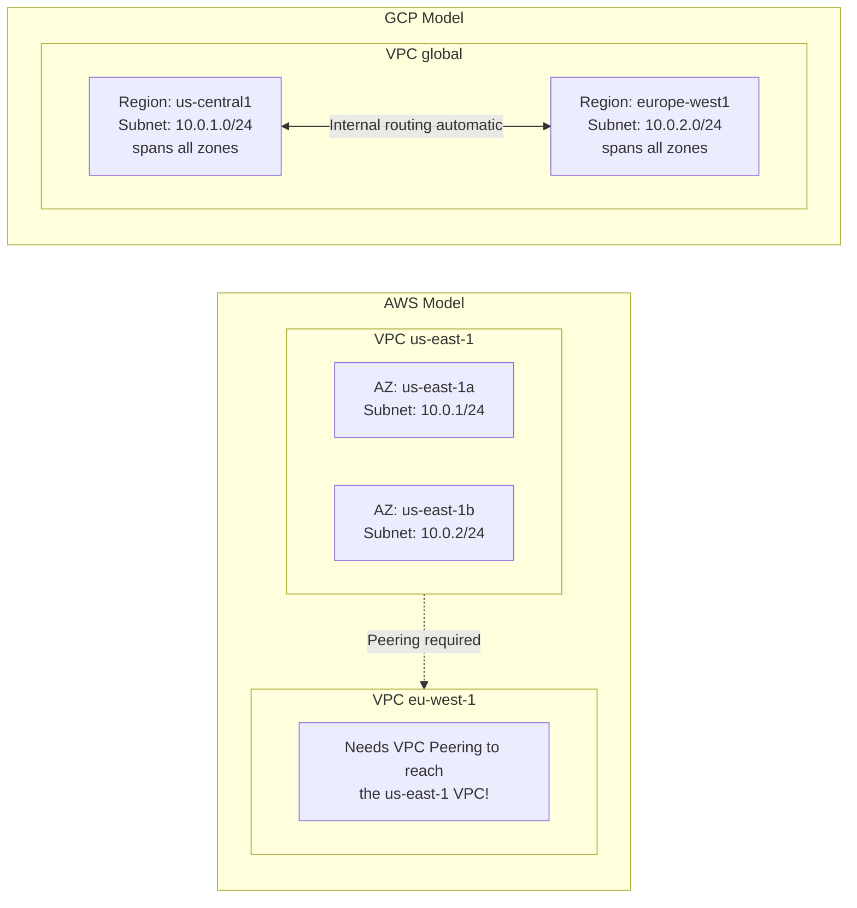
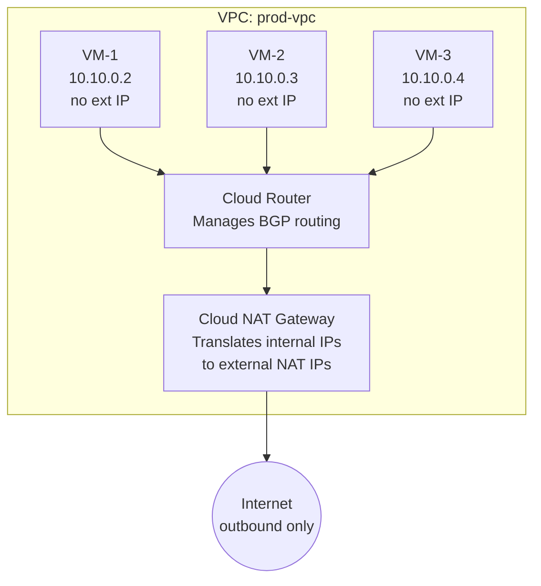
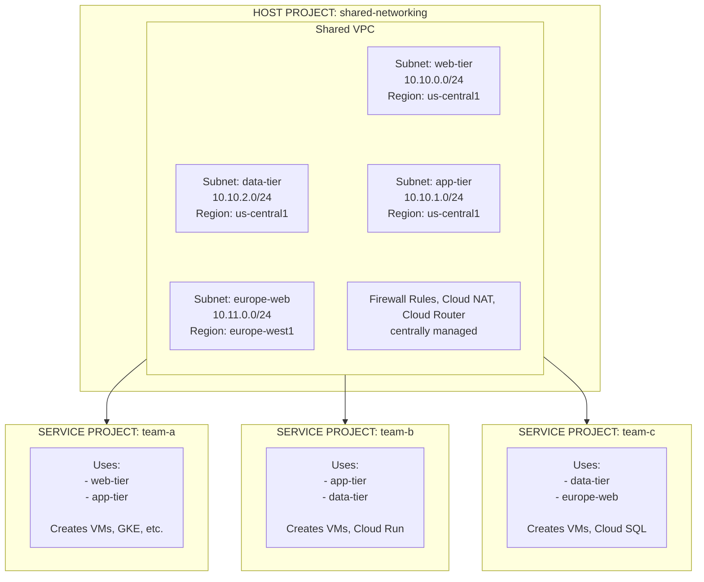

**Complexity**: [COMPLEX] | **Time to Complete**: 3h | **Prerequisites**: Module 2.1 (IAM & Resource Hierarchy)

## What You'll Be Able to Do

After completing this module, you will be able to:

- **Design GCP's global VPC architecture with regional subnets, firewall rules, and Private Google Access**
- **Configure Shared VPC to centralize network management across multiple GCP projects**
- **Deploy Cloud NAT and Cloud Router for outbound internet access from private instances without public IPs**
- **Compare GCP's global VPC model with AWS regional VPCs to avoid common multi-cloud networking mistakes**

---

## Why This Module Matters

In March 2021, a logistics company running on GCP experienced a cascading outage that took down their entire order-tracking system for 14 hours. The root cause was a firewall rule misconfiguration during a routine deployment. An engineer had added a new firewall rule using network tags to allow traffic from their monitoring system to a set of backend VMs. The tag name had a typo---`monitoring-target` instead of `monitor-target`---and because GCP firewall rules are deny-by-default, the monitoring traffic was silently dropped. No alerts fired because the monitoring system itself was what stopped working. Meanwhile, a second engineer had created an overly broad "debug" firewall rule allowing all ingress from `0.0.0.0/0` on port 8080 to any VM with the tag `debug`, not realizing that 34 production VMs still carried that tag from a previous troubleshooting session. Within hours, automated scanners found the exposed endpoints and began probing for vulnerabilities. The incident cost the company over $800,000 in lost revenue and required a full security audit.

This story illustrates two truths about GCP networking. First, **GCP's VPC model is global by default**, which is both its greatest strength and its most dangerous trap. A single misconfigured firewall rule can affect VMs across every region. Second, **network tags are fragile**---they are arbitrary strings with no validation, and a typo creates a silent failure. Understanding VPC architecture, firewall rule design, and the difference between tag-based and service-account-based firewalling is not optional knowledge---it is the foundation that every other GCP service builds on.

In this module, you will learn how GCP VPCs differ fundamentally from AWS VPCs, how to design subnet strategies that scale, how to build firewall rules that are both secure and maintainable, and how to connect projects together using Shared VPCs. You will also master Cloud NAT and Cloud Router, the components that give private VMs controlled access to the internet.

---

## Global VPCs vs Regional Subnets

### The Fundamental Difference

If you are coming from AWS, this is the most important mental model shift: **in GCP, a VPC is a global resource. Subnets are regional, but they all belong to the same global VPC.** There are no availability zone-scoped subnets.



> **Stop and think**: If a GCP VPC spans the globe by default, what happens if an application team in `europe-west1` requests a new subnet with the CIDR block `10.10.0.0/20` when the `us-central1` team is already using that exact range? How does this differ from managing CIDRs across multiple AWS regions?

This has massive implications:

| Feature | AWS VPC | GCP VPC |
| :--- | :--- | :--- |
| **Scope** | Regional | Global |
| **Cross-region communication** | Requires VPC Peering or Transit Gateway | Automatic (same VPC) |
| **Subnet scope** | Availability Zone | Region (spans all zones) |
| **Firewall rules** | Per security group (stateful) + NACLs (stateless) | Global firewall rules (stateful) |
| **Route tables** | Per subnet | Per VPC (with regional routing for subnets) |
| **Default behavior** | Allow all outbound, deny all inbound | Deny all ingress, allow all egress |

### VPC Types: Auto Mode vs Custom Mode

GCP offers two VPC modes, but in practice you should always use Custom Mode.

```bash
# Create a custom-mode VPC (recommended)
gcloud compute networks create prod-vpc \
  --subnet-mode=custom \
  --bgp-routing-mode=global

# Create subnets in specific regions
gcloud compute networks subnets create prod-us-central1 \
  --network=prod-vpc \
  --region=us-central1 \
  --range=10.10.0.0/20 \
  --secondary-ranges=pods=10.20.0.0/16,services=10.30.0.0/20 \
  --enable-private-ip-google-access

gcloud compute networks subnets create prod-europe-west1 \
  --network=prod-vpc \
  --region=europe-west1 \
  --range=10.11.0.0/20 \
  --enable-private-ip-google-access
```

| Feature | Auto Mode VPC | Custom Mode VPC |
| :--- | :--- | :--- |
| **Subnet creation** | Automatic in every region | You create only what you need |
| **IP ranges** | Predefined (10.128.0.0/9) | You choose the CIDR ranges |
| **Secondary ranges** | Not included | You define them (needed for GKE) |
| **Production use** | Not recommended | Always use this |
| **Default VPC** | Auto mode (created automatically) | Must be explicitly created |

**War Story**: The auto-mode VPC creates a subnet with a `/20` range in every GCP region (currently over 40 regions). That consumes a massive amount of IP space from the `10.128.0.0/9` range, and these subnets often conflict with on-premises networks. Every GCP Well-Architected Review starts with "delete the default VPC and create a custom one."

```bash
# Delete the default auto-mode VPC (do this in every new project)
gcloud compute networks delete default --quiet
```

### Private Google Access

By default, VMs without external IPs cannot reach Google APIs (like Cloud Storage or BigQuery). **Private Google Access** allows VMs with only internal IPs to reach Google APIs through Google's internal network rather than the public internet.

```bash
# Enable Private Google Access on an existing subnet
gcloud compute networks subnets update prod-us-central1 \
  --region=us-central1 \
  --enable-private-ip-google-access

# Verify it is enabled
gcloud compute networks subnets describe prod-us-central1 \
  --region=us-central1 \
  --format="get(privateIpGoogleAccess)"
```

---

## Firewall Rules: Tags vs Service Accounts

GCP firewall rules are global resources that apply to a specific VPC network. They are **stateful** (return traffic is automatically allowed) and evaluated by **priority** (lower number = higher priority, range 0-65535).

### Firewall Rule Anatomy

```bash
# Basic firewall rule structure
gcloud compute firewall-rules create allow-ssh-from-iap \
  --network=prod-vpc \
  --direction=INGRESS \
  --action=ALLOW \
  --rules=tcp:22 \
  --source-ranges=35.235.240.0/20 \
  --target-tags=allow-ssh \
  --priority=1000 \
  --description="Allow SSH via IAP tunnel"
```

Every firewall rule has these components:

| Component | Description | Default |
| :--- | :--- | :--- |
| **Direction** | INGRESS or EGRESS | INGRESS |
| **Action** | ALLOW or DENY | (required) |
| **Priority** | 0 (highest) to 65535 (lowest) | 1000 |
| **Source** | IP ranges, tags, or service accounts | (required for INGRESS) |
| **Target** | Tags, service accounts, or all instances | All instances in VPC |
| **Protocol/Ports** | tcp:80, udp:53, icmp, all | (required) |
| **Logging** | On or Off | Off |

### The Tag Problem

Network tags are strings you attach to VM instances. Firewall rules can use them for both source filtering and target selection. The problem is that tags are **just strings**---there is no validation, no IAM control over who can set them, and a typo creates a silent failure.

```bash
# Create a VM with a tag
gcloud compute instances create web-server-1 \
  --zone=us-central1-a \
  --tags=web-server,allow-ssh \
  --network=prod-vpc \
  --subnet=prod-us-central1

# Create a firewall rule targeting that tag
gcloud compute firewall-rules create allow-http \
  --network=prod-vpc \
  --direction=INGRESS \
  --action=ALLOW \
  --rules=tcp:80,tcp:443 \
  --source-ranges=0.0.0.0/0 \
  --target-tags=web-server \
  --priority=1000

# The danger: anyone with compute.instances.setTags permission
# can add the "web-server" tag to ANY VM, opening ports 80/443 on it
```

> **Pause and predict**: An engineer applies the network tag `allow-db-access` to a compromised frontend VM. If the firewall rule allowing database connections on port 5432 uses `--source-tags=allow-db-access`, why does the database immediately become vulnerable, and how would using a service account have prevented this exact exploitation path?

### Service Account-Based Firewall Rules (The Better Way)

Instead of tags, you can target firewall rules based on the **service account** attached to a VM. This is significantly more secure because:

1. Service accounts are IAM resources with access control.
2. You cannot change a VM's service account without `iam.serviceAccounts.actAs` permission.
3. There are no typos---service accounts either exist or they do not.

```bash
# Create service accounts for different VM roles
gcloud iam service-accounts create web-server-sa \
  --display-name="Web Server SA" \
  --project=my-project

gcloud iam service-accounts create backend-sa \
  --display-name="Backend Server SA" \
  --project=my-project

# Create firewall rules using service account targets
gcloud compute firewall-rules create allow-http-to-web \
  --network=prod-vpc \
  --direction=INGRESS \
  --action=ALLOW \
  --rules=tcp:80,tcp:443 \
  --source-ranges=0.0.0.0/0 \
  --target-service-accounts=web-server-sa@my-project.iam.gserviceaccount.com \
  --priority=1000

# Allow backend communication: only web servers can reach backends on port 8080
gcloud compute firewall-rules create allow-web-to-backend \
  --network=prod-vpc \
  --direction=INGRESS \
  --action=ALLOW \
  --rules=tcp:8080 \
  --source-service-accounts=web-server-sa@my-project.iam.gserviceaccount.com \
  --target-service-accounts=backend-sa@my-project.iam.gserviceaccount.com \
  --priority=1000
```

### Comparison: Tags vs Service Accounts for Firewalling

| Aspect | Network Tags | Service Accounts |
| :--- | :--- | :--- |
| **IAM controlled** | No (anyone with setTags can modify) | Yes (requires actAs permission) |
| **Typo resilience** | No (silent failure) | Yes (error if SA does not exist) |
| **Cross-project** | No | Yes (with Shared VPC) |
| **Granularity** | Per instance (arbitrary) | Per instance (identity-based) |
| **Recommended by Google** | Legacy workloads only | Yes, for all new deployments |
| **Works with MIGs** | Yes | Yes |

### Firewall Logging and Troubleshooting

```bash
# Enable logging on a firewall rule
gcloud compute firewall-rules update allow-http-to-web \
  --enable-logging

# View firewall logs (after enabling)
gcloud logging read 'resource.type="gce_subnetwork" AND jsonPayload.connection.dest_port=80' \
  --limit=10 \
  --format=json

# List all firewall rules in a VPC, sorted by priority
gcloud compute firewall-rules list \
  --filter="network=prod-vpc" \
  --sort-by=priority \
  --format="table(name, direction, priority, sourceRanges.list():label=SRC, allowed[].map().firewall_rule().list():label=ALLOW, targetServiceAccounts.list():label=TARGET_SA)"
```

### Hierarchical Firewall Policies

For organizations managing many projects, **Hierarchical Firewall Policies** allow you to define firewall rules at the Organization or Folder level that apply to all projects underneath. These are evaluated **before** VPC firewall rules.

```text
Evaluation Order:
1. Organization-level firewall policy rules
2. Folder-level firewall policy rules
3. VPC firewall rules (by priority)
4. Implied rules (deny all ingress, allow all egress)
```

```bash
# Create a firewall policy at the organization level
gcloud compute firewall-policies create \
  --organization=ORGANIZATION_ID \
  --short-name=org-baseline \
  --description="Organization baseline firewall policy"

# Add a rule to allow IAP SSH from anywhere in the org
gcloud compute firewall-policies rules create 100 \
  --firewall-policy=org-baseline \
  --organization=ORGANIZATION_ID \
  --action=allow \
  --direction=INGRESS \
  --src-ip-ranges=35.235.240.0/20 \
  --layer4-configs=tcp:22 \
  --description="Allow SSH via IAP tunnel"

# Associate the policy with the organization
gcloud compute firewall-policies associations create \
  --firewall-policy=org-baseline \
  --organization=ORGANIZATION_ID
```

---

## Cloud NAT: Giving Private VMs Internet Access

Cloud NAT allows VMs without external IP addresses to make outbound connections to the internet (for package updates, API calls, etc.) without exposing them to inbound traffic.



### Setting Up Cloud NAT

Cloud NAT requires a Cloud Router (which handles the BGP routing even though Cloud NAT itself does not use BGP---the router is the management plane).

```bash
# Step 1: Create a Cloud Router
gcloud compute routers create prod-router \
  --network=prod-vpc \
  --region=us-central1

# Step 2: Create a Cloud NAT gateway
gcloud compute routers nats create prod-nat \
  --router=prod-router \
  --region=us-central1 \
  --auto-allocate-nat-external-ips \
  --nat-all-subnet-ip-ranges

# Step 3: Verify NAT is working from a private VM
gcloud compute ssh vm-1 --zone=us-central1-a --tunnel-through-iap \
  --command="curl -s ifconfig.me"
# Should return the NAT gateway's external IP

# View NAT configuration
gcloud compute routers nats describe prod-nat \
  --router=prod-router \
  --region=us-central1
```

### Cloud NAT Options

| Option | Description | When to Use |
| :--- | :--- | :--- |
| `--auto-allocate-nat-external-ips` | GCP assigns IPs automatically | Most use cases |
| `--nat-external-ip-pool=IP1,IP2` | You specify the external IPs | When you need a known egress IP (allowlisting) |
| `--nat-all-subnet-ip-ranges` | NAT all subnets in the region | Simple setups |
| `--nat-custom-subnet-ip-ranges` | NAT only specific subnets | Multi-team VPCs with different egress needs |
| `--min-ports-per-vm=64` | Minimum NAT ports per VM | Default 64, increase for high-connection workloads |
| `--enable-logging` | Log NAT translations | Debugging, compliance |

```bash
# Advanced: Fixed external IP for allowlisting
gcloud compute addresses create nat-ip-1 \
  --region=us-central1

gcloud compute routers nats update prod-nat \
  --router=prod-router \
  --region=us-central1 \
  --nat-external-ip-pool=nat-ip-1

# Enable logging
gcloud compute routers nats update prod-nat \
  --router=prod-router \
  --region=us-central1 \
  --enable-logging \
  --log-filter=ERRORS_ONLY
```

---

## Cloud Router and Hybrid Connectivity

Cloud Router is the BGP speaker that dynamically exchanges routes between your VPC and external networks (on-premises data centers, other clouds, or other VPCs).

### Cloud Router with VPN

```bash
# Create a Cloud VPN gateway
gcloud compute vpn-gateways create prod-vpn-gw \
  --network=prod-vpc \
  --region=us-central1

# Create a Cloud Router for BGP
gcloud compute routers create prod-vpn-router \
  --network=prod-vpc \
  --region=us-central1 \
  --asn=65001

# Add a BGP peer (your on-premises router)
gcloud compute routers add-bgp-peer prod-vpn-router \
  --peer-name=onprem-peer \
  --peer-asn=65002 \
  --interface=vpn-tunnel-int \
  --region=us-central1

# View learned routes
gcloud compute routers get-status prod-vpn-router \
  --region=us-central1
```

### BGP Routing Mode: Regional vs Global

| Mode | Routes Advertised | Use Case |
| :--- | :--- | :--- |
| **Regional** | Only subnets in the router's region | Single-region deployments |
| **Global** | All subnets in the VPC, all regions | Multi-region deployments (recommended) |

```bash
# Set global routing mode
gcloud compute networks update prod-vpc \
  --bgp-routing-mode=global
```

---

## Shared VPC: Multi-Project Networking

Shared VPC is the mechanism that allows multiple GCP projects to share a single VPC network. This is the foundation of enterprise GCP networking and is critical for centralizing network administration while allowing teams to manage their own compute resources.

### Architecture



> **Stop and think**: In a Shared VPC architecture, a Host Project administrator grants a Service Project developer the `compute.networkUser` role. If no IAM conditions are applied to this binding, what is the immediate blast radius of this permission, and how could a compromised developer account exploit it across different environments?

### Key Concepts

**Host Project**: The project that owns the Shared VPC network. The network team manages this project and controls all networking resources (subnets, firewall rules, Cloud NAT, VPN connections).

**Service Projects**: Projects that are attached to the Shared VPC and can use its subnets. Application teams own these projects and create compute resources (VMs, GKE clusters, Cloud Run services) that connect to the shared network.

### Setting Up Shared VPC

```bash
# Step 1: Enable Shared VPC on the host project
# (requires Organization Admin or Shared VPC Admin role)
gcloud compute shared-vpc enable shared-networking

# Step 2: Associate service projects with the host project
gcloud compute shared-vpc associated-projects add team-a \
  --host-project=shared-networking

gcloud compute shared-vpc associated-projects add team-b \
  --host-project=shared-networking

# Step 3: Grant service project users access to specific subnets
# (This is where least privilege matters most)
gcloud projects add-iam-binding shared-networking \
  --member="group:team-a-devs@example.com" \
  --role="roles/compute.networkUser" \
  --condition="expression=resource.name.endsWith('subnets/web-tier') || resource.name.endsWith('subnets/app-tier'),title=web-and-app-subnets-only"

# Step 4: Create a VM in a service project using a shared subnet
gcloud compute instances create web-app-1 \
  --project=team-a \
  --zone=us-central1-a \
  --subnet=projects/shared-networking/regions/us-central1/subnetworks/web-tier \
  --no-address

# List service projects
gcloud compute shared-vpc list-associated-resources shared-networking
```

### Shared VPC Permissions

| Role | Where to Grant | What It Allows |
| :--- | :--- | :--- |
| `roles/compute.xpnAdmin` | Organization or Folder | Enable/disable Shared VPC, add/remove service projects |
| `roles/compute.networkUser` | Host project (on specific subnets) | Use subnets from service projects |
| `roles/compute.networkAdmin` | Host project | Manage subnets, firewall rules, routes |
| `roles/compute.securityAdmin` | Host project | Manage firewall rules only |

---

## VPC Peering

When you need two separate VPCs to communicate (either within the same project or across projects), VPC Network Peering creates a direct route between them using internal IPs.

```bash
# Peer vpc-a with vpc-b (must create peering in both directions)
gcloud compute networks peerings create peer-a-to-b \
  --network=vpc-a \
  --peer-network=vpc-b \
  --peer-project=project-b

gcloud compute networks peerings create peer-b-to-a \
  --network=vpc-b \
  --peer-network=vpc-a \
  --peer-project=project-a \
  --project=project-b

# Important: VPC peering is NOT transitive
# If A peers with B, and B peers with C, A CANNOT reach C through B
```

| Feature | Shared VPC | VPC Peering |
| :--- | :--- | :--- |
| **Same VPC** | Yes (one network) | No (two separate networks) |
| **Centralized firewall** | Yes | No (each VPC has its own) |
| **IP overlap allowed** | No | No (ranges must not overlap) |
| **Transitive** | N/A (same network) | No (A-B-C: A cannot reach C) |
| **Cross-organization** | No | Yes |
| **Use case** | Teams within same org | Partner orgs, acquisitions |

---

## Did You Know?

1. **GCP firewall rules have a hidden "implied deny all ingress" rule at priority 65535** and an "implied allow all egress" rule at priority 65535. You cannot see these rules in the console or CLI, but they are always present. This means a brand-new VPC with no custom firewall rules will block all inbound traffic and allow all outbound traffic.

2. **A single GCP VPC can span all 40+ regions without any peering or gateway**. VMs in Tokyo and Sao Paulo on the same VPC can communicate using internal IPs at no additional cost beyond the standard inter-region network pricing. This is fundamentally different from AWS, where each VPC is confined to a single region.

3. **Cloud NAT does not use a VM or instance**. Unlike AWS NAT Gateway (which runs on managed instances in your VPC), GCP Cloud NAT is a software-defined networking service that operates outside your VPC entirely. It has no single point of failure, requires no instance management, and scales automatically.

4. **Shared VPC supports up to 1,000 service projects per host project**. Before this limit was increased, large enterprises would hit the ceiling and need to create multiple host projects with complex peering. If you are designing for scale, Shared VPC is almost always preferred over VPC peering for intra-organization networking.

---

## Common Mistakes

| Mistake | Why It Happens | How to Fix It |
| :--- | :--- | :--- |
| Using the default VPC for production | It exists automatically in every project | Delete it and create a custom-mode VPC with planned CIDR ranges |
| Using network tags instead of service accounts for firewalling | Tags are simpler to set up initially | Migrate to SA-based firewall rules; they are IAM-controlled and typo-resistant |
| Not enabling Private Google Access | Engineers do not realize private VMs cannot reach Google APIs | Enable it on every subnet: `--enable-private-ip-google-access` |
| Overlapping CIDR ranges between VPCs | No central IP address management | Use an IPAM tool or spreadsheet; plan ranges before creating subnets |
| Creating overly broad firewall rules (0.0.0.0/0) | "Debug" rules that never get removed | Use IAP for SSH instead of opening port 22 to the world; set expiration reminders |
| Forgetting that VPC peering is not transitive | Assumption from AWS Transit Gateway experience | Use Shared VPC for intra-org, or deploy a Network Connectivity Center hub for transit routing |
| Not configuring Cloud NAT logging | Engineers do not know NAT logging exists | Enable it with `--enable-logging` for debugging connection issues |
| Granting `roles/compute.networkUser` at project level | Seems simpler than per-subnet conditions | Use IAM conditions to restrict network user role to specific subnets |

---

## Quiz

<details>
<summary>1. You are migrating a multi-tier application from AWS to GCP. In AWS, the frontend in us-east-1 communicates with a backend in eu-west-1 via an inter-region VPC Peering connection. In GCP, you deploy the frontend to us-central1 and the backend to europe-west1 within the same Custom Mode VPC. What additional networking resources must you deploy to enable private IP communication between these two tiers?</summary>

None. In GCP, a single VPC is a global resource that automatically spans all regions without requiring peering, transit gateways, or VPNs. Subnets are regional, but instances in different regions within the same VPC can natively route to one another using internal IP addresses. This fundamentally simplifies multi-region architectures by treating the global backbone as a single contiguous network space. By not needing complex overlays or extra hops, network latency and administrative overhead are greatly reduced.
</details>

<details>
<summary>2. During a security audit, your team discovers that a junior developer accidentally opened port 22 to the public internet on a critical production database by adding a string to the instance metadata. You need to ensure that firewall rules can only be applied to instances by principals who have explicitly been granted IAM privileges for that specific role. Which firewall target type should you migrate to, and why?</summary>

You should migrate from target network tags to target service accounts. Network tags are arbitrary strings with no strict validation, meaning anyone with `compute.instances.setTags` permission can add a tag and unintentionally expose a VM to an existing firewall rule. Service accounts, by contrast, are IAM identities; to attach one to a VM, a user must possess the `iam.serviceAccounts.actAs` permission on that specific service account. This guarantees that only authorized identities can bind a VM to the permissions and network access rules associated with that role, preventing silent failures and privilege escalation. This structural difference ensures security rules are fundamentally tied to authenticated machine identities rather than fragile, human-typed strings.
</details>

<details>
<summary>3. A batch processing VM in us-central1 has only an internal IP address and needs to upload 500 GB of processed data to a Cloud Storage bucket every night. The infrastructure team proposes deploying a Cloud NAT gateway to allow the VM to reach the internet and access the bucket. Why is this a suboptimal design, and what feature should be enabled instead?</summary>

Deploying Cloud NAT for this use case is suboptimal because it routes the traffic through a NAT gateway to the public internet, which incurs unnecessary egress data transfer costs and introduces a potential bottleneck. Instead, you should enable Private Google Access on the VM's subnet. Private Google Access allows resources with only internal IP addresses to reach Google APIs and services directly through Google's internal backbone. This approach is significantly more cost-effective, faster, and keeps the data entirely within the Google network boundary. Furthermore, utilizing Private Google Access reduces the public attack surface since data never traverses the public internet to reach the destination bucket.
</details>

<details>
<summary>4. Your enterprise has 50 application teams, each requiring their own GCP project for billing and resource isolation. The security team mandates that all outbound internet traffic must be funneled through a centralized set of firewall rules and a single pair of Cloud NAT gateways. Which GCP networking architecture pattern best fulfills both the application teams' need for project isolation and the security team's need for centralized network control?</summary>

The organization should implement a Shared VPC architecture. In this model, a centralized Host Project owns the VPC network, subnets, firewall rules, and Cloud NAT gateways, managed strictly by the network and security teams. The 50 application teams are given their own Service Projects, which are attached to the Host Project, allowing them to deploy compute resources into the shared subnets. This separation of concerns ensures application teams maintain autonomy over their instances while the security team retains absolute control over the network boundary and routing policies. Without Shared VPC, managing 50 disconnected VPCs would require complex peering meshes and decentralized security rules that are prone to configuration drift.
</details>

<details>
<summary>5. Company A acquires Company B and Company C. Company A's VPC is peered with Company B's VPC, and Company B's VPC is subsequently peered with Company C's VPC. A developer in Company A attempts to ping an internal web server in Company C using its private IP address, but the connection times out. Based on GCP's networking rules, what is the root cause of this failure?</summary>

The connection times out because GCP VPC Network Peering is strictly non-transitive. Even though Company B has direct peering connections with both A and C, it cannot act as a transit network to route traffic between them. In a non-transitive networking model, hops beyond directly peered networks drop traffic automatically to preserve explicit security boundaries. Because of this architectural behavior, Company A's internal network fundamentally has no knowledge of Company C's subnets or routing tables. To enable direct communication without relying on the public internet, you must establish an explicit peer connection directly between Company A and Company C, or adopt a centralized hub-and-spoke model using Network Connectivity Center.
</details>

<details>
<summary>6. The global CISO mandates that SSH access (port 22) from the public internet (0.0.0.0/0) must be blocked across all 200 GCP projects in your organization, with absolutely no exceptions allowed for individual project owners. How can you implement this mandate so that a project owner cannot override it with a higher-priority VPC firewall rule?</summary>

You must implement a Hierarchical Firewall Policy at the Organization level with an explicit `DENY` action for port 22 from `0.0.0.0/0`. In GCP, firewall evaluation order processes Organization-level policies first, followed by Folder-level policies, and finally VPC-level rules. Because the Organization-level deny rule is evaluated and enforced before any VPC rules are even checked, project owners cannot circumvent the mandate, regardless of the priority number they assign to their local VPC firewall rules. This hierarchical enforcement guarantees baseline security standards remain intact during large-scale operations or accidental misconfigurations at the project level. Even if a local developer applies a VPC firewall rule with a priority of 0 (the highest possible local priority) to allow SSH, it will be overridden by the higher-level policy. Consequently, deploying hierarchical rules provides a structural safety net against shadow IT and non-compliant network exposures.
</details>

<details>
<summary>7. An architect is designing a purely cloud-native environment with no on-premises data centers and no VPN connections. The design includes a requirement for private VMs to access the internet via Cloud NAT. A junior engineer questions why a Cloud Router is included in the Terraform configuration since no BGP routing is required. How should the architect justify the inclusion of the Cloud Router?</summary>

The architect should explain that Cloud Router serves as the mandatory management and control plane for Cloud NAT, even when BGP routing is entirely absent from the architecture. While Cloud NAT is a software-defined service that translates IP addresses, the Cloud Router orchestrates this translation, manages the mapping of internal to external IPs, and distributes the NAT configuration across Google's infrastructure. Without the Cloud Router acting as its foundation, the Cloud NAT gateway cannot be created or function. Therefore, in a GCP context, 'Router' does not exclusively mean a BGP speaker or traditional transit gateway, but rather a dynamic configuration engine for network services. When instances in the subnets scale out or require more NAT ports, it is the Cloud Router that recalculates and updates these allocations dynamically behind the scenes. Omitting the Cloud Router would fundamentally break the capability to provision egress access, making it a strict dependency.
</details>

---

## Hands-On Exercise: Shared VPC with Service Account-Based Firewalls

### Objective

Build a Shared VPC architecture with a host project and two service projects, using service account-based firewall rules for secure network segmentation.

### Prerequisites

- `gcloud` CLI installed and authenticated
- Organization access (required for Shared VPC)
- Three projects (or ability to create them)
- Billing account linked

### Tasks

**Task 1: Create the Project Structure and VPC**

Create a host project with a custom VPC and two subnets.

<details>
<summary>Solution</summary>

```bash
# Set variables
# IMPORTANT: Replace YOUR_BILLING_ACCOUNT_ID with your actual billing ID (find via 'gcloud billing accounts list')
export BILLING_ACCOUNT_ID="YOUR_BILLING_ACCOUNT_ID"
export HOST_PROJECT="vpc-lab-host-$(date +%s | tail -c 7)"
export SVC_PROJECT_A="vpc-lab-svc-a-$(date +%s | tail -c 7)"
export SVC_PROJECT_B="vpc-lab-svc-b-$(date +%s | tail -c 7)"
export REGION="us-central1"

# Create projects
gcloud projects create $HOST_PROJECT --name="VPC Lab Host"
gcloud projects create $SVC_PROJECT_A --name="VPC Lab Service A"
gcloud projects create $SVC_PROJECT_B --name="VPC Lab Service B"

# Link billing to all projects
for P in $HOST_PROJECT $SVC_PROJECT_A $SVC_PROJECT_B; do
  gcloud billing projects link $P --billing-account=$BILLING_ACCOUNT_ID
done

# Enable compute API
for P in $HOST_PROJECT $SVC_PROJECT_A $SVC_PROJECT_B; do
  gcloud services enable compute.googleapis.com --project=$P
done

# Create custom VPC in host project
gcloud compute networks create shared-vpc \
  --project=$HOST_PROJECT \
  --subnet-mode=custom \
  --bgp-routing-mode=global

# Create subnets
gcloud compute networks subnets create web-tier \
  --project=$HOST_PROJECT \
  --network=shared-vpc \
  --region=$REGION \
  --range=10.10.0.0/24 \
  --enable-private-ip-google-access

gcloud compute networks subnets create app-tier \
  --project=$HOST_PROJECT \
  --network=shared-vpc \
  --region=$REGION \
  --range=10.10.1.0/24 \
  --enable-private-ip-google-access

# Verify VPC and subnets were created successfully
gcloud compute networks subnets list \
  --project=$HOST_PROJECT \
  --network=shared-vpc
```
</details>

**Task 2: Enable Shared VPC and Attach Service Projects**

<details>
<summary>Solution</summary>

```bash
# Enable Shared VPC on the host project
gcloud compute shared-vpc enable $HOST_PROJECT

# Attach service projects
gcloud compute shared-vpc associated-projects add $SVC_PROJECT_A \
  --host-project=$HOST_PROJECT

gcloud compute shared-vpc associated-projects add $SVC_PROJECT_B \
  --host-project=$HOST_PROJECT

# Verify
gcloud compute shared-vpc list-associated-resources $HOST_PROJECT
```
</details>

**Task 3: Create Service Accounts for Firewall Targeting**

<details>
<summary>Solution</summary>

```bash
# Create service accounts in service projects
gcloud iam service-accounts create web-sa \
  --display-name="Web Server SA" \
  --project=$SVC_PROJECT_A

gcloud iam service-accounts create app-sa \
  --display-name="App Server SA" \
  --project=$SVC_PROJECT_B

export WEB_SA="web-sa@${SVC_PROJECT_A}.iam.gserviceaccount.com"
export APP_SA="app-sa@${SVC_PROJECT_B}.iam.gserviceaccount.com"

# Grant network user permissions on specific subnets
gcloud projects add-iam-binding $HOST_PROJECT \
  --member="serviceAccount:$WEB_SA" \
  --role="roles/compute.networkUser"

gcloud projects add-iam-binding $HOST_PROJECT \
  --member="serviceAccount:$APP_SA" \
  --role="roles/compute.networkUser"

# Verify IAM bindings on the host project
gcloud projects get-iam-policy $HOST_PROJECT \
  --flatten="bindings[].members" \
  --format="table(bindings.role,bindings.members)" \
  --filter="bindings.role:roles/compute.networkUser"
```
</details>

**Task 4: Create Service Account-Based Firewall Rules**

<details>
<summary>Solution</summary>

```bash
# Allow HTTP/HTTPS to web servers only
gcloud compute firewall-rules create allow-http-to-web \
  --project=$HOST_PROJECT \
  --network=shared-vpc \
  --direction=INGRESS \
  --action=ALLOW \
  --rules=tcp:80,tcp:443 \
  --source-ranges=0.0.0.0/0 \
  --target-service-accounts=$WEB_SA \
  --priority=1000

# Allow web servers to reach app servers on port 8080
gcloud compute firewall-rules create allow-web-to-app \
  --project=$HOST_PROJECT \
  --network=shared-vpc \
  --direction=INGRESS \
  --action=ALLOW \
  --rules=tcp:8080 \
  --source-service-accounts=$WEB_SA \
  --target-service-accounts=$APP_SA \
  --priority=1000

# Allow SSH via IAP only
gcloud compute firewall-rules create allow-iap-ssh \
  --project=$HOST_PROJECT \
  --network=shared-vpc \
  --direction=INGRESS \
  --action=ALLOW \
  --rules=tcp:22 \
  --source-ranges=35.235.240.0/20 \
  --priority=900

# Deny all other ingress (explicit, for clarity)
gcloud compute firewall-rules create deny-all-ingress \
  --project=$HOST_PROJECT \
  --network=shared-vpc \
  --direction=INGRESS \
  --action=DENY \
  --rules=all \
  --source-ranges=0.0.0.0/0 \
  --priority=65000

# List firewall rules
gcloud compute firewall-rules list \
  --project=$HOST_PROJECT \
  --filter="network=shared-vpc" \
  --format="table(name, direction, priority, allowed[].map().firewall_rule().list():label=ALLOW)"
```
</details>

**Task 5: Deploy VMs in Service Projects Using the Shared VPC**

<details>
<summary>Solution</summary>

```bash
# Create a web server VM in service project A
gcloud compute instances create web-server-1 \
  --project=$SVC_PROJECT_A \
  --zone=${REGION}-a \
  --machine-type=e2-micro \
  --subnet=projects/$HOST_PROJECT/regions/$REGION/subnetworks/web-tier \
  --service-account=$WEB_SA \
  --scopes=cloud-platform \
  --no-address \
  --metadata=startup-script='#!/bin/bash
    apt-get update && apt-get install -y nginx
    echo "Web Server 1" > /var/www/html/index.html
    systemctl start nginx'

# Create an app server VM in service project B
gcloud compute instances create app-server-1 \
  --project=$SVC_PROJECT_B \
  --zone=${REGION}-a \
  --machine-type=e2-micro \
  --subnet=projects/$HOST_PROJECT/regions/$REGION/subnetworks/app-tier \
  --service-account=$APP_SA \
  --scopes=cloud-platform \
  --no-address \
  --metadata=startup-script='#!/bin/bash
    apt-get update && apt-get install -y python3
    python3 -m http.server 8080 &'

# Verify connectivity: SSH via IAP to web server, then curl app server
gcloud compute ssh web-server-1 \
  --project=$SVC_PROJECT_A \
  --zone=${REGION}-a \
  --tunnel-through-iap \
  --command="curl -s http://10.10.1.2:8080"
```
</details>

**Task 6: Clean Up**

<details>
<summary>Solution</summary>

```bash
# Delete VMs
gcloud compute instances delete web-server-1 \
  --project=$SVC_PROJECT_A --zone=${REGION}-a --quiet
gcloud compute instances delete app-server-1 \
  --project=$SVC_PROJECT_B --zone=${REGION}-a --quiet

# Detach service projects
gcloud compute shared-vpc associated-projects remove $SVC_PROJECT_A \
  --host-project=$HOST_PROJECT
gcloud compute shared-vpc associated-projects remove $SVC_PROJECT_B \
  --host-project=$HOST_PROJECT

# Disable Shared VPC
gcloud compute shared-vpc disable $HOST_PROJECT

# Delete projects
for P in $HOST_PROJECT $SVC_PROJECT_A $SVC_PROJECT_B; do
  gcloud projects delete $P --quiet
done

echo "Cleanup complete."
```
</details>

### Success Criteria

- [ ] Custom VPC created with two subnets (web-tier, app-tier)
- [ ] Shared VPC enabled with two service projects attached
- [ ] Service accounts created in service projects
- [ ] Firewall rules use service account targets (not tags)
- [ ] Web server can reach app server on port 8080
- [ ] App server is NOT reachable from the internet directly
- [ ] SSH access works only through IAP tunnels
- [ ] All resources cleaned up

---

## Next Module

Next up: **[Module 2.3: Compute Engine](../module-2.3-compute/)** --- Learn machine families, preemptible and Spot VMs, instance templates, managed instance groups, and how to build a globally load-balanced application across two regions.