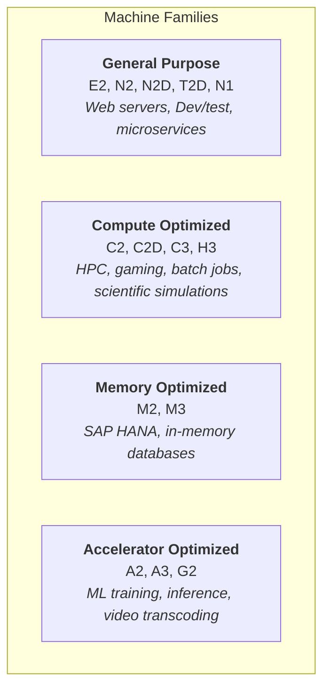
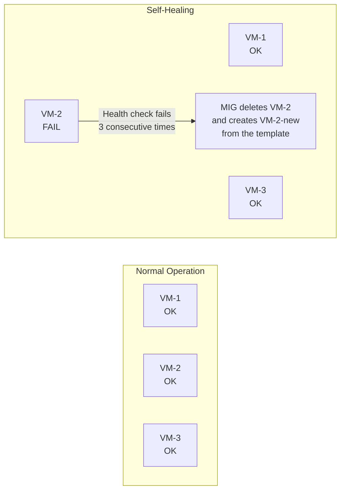
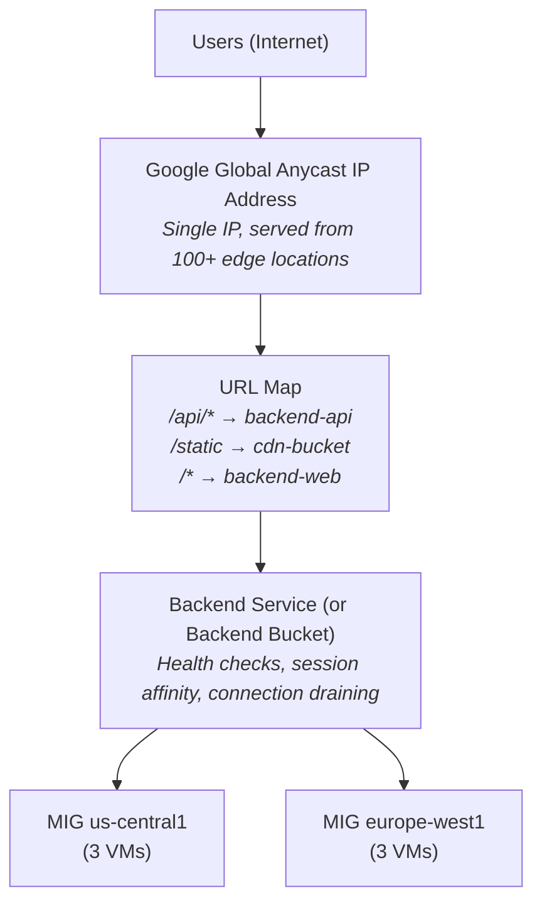

**Complexity**: [MEDIUM] | **Time to Complete**: 2.5h | **Prerequisites**: Module 2.2 (VPC Networking)

## What You'll Be Able to Do

After completing this module, you will be able to:

- **Deploy Compute Engine instances with custom machine types, preemptible VMs, and managed instance groups**
- **Configure instance templates and autoscaling policies for self-healing compute clusters on GCP**
- **Implement OS Login and metadata-based SSH key management to secure instance access**
- **Evaluate Compute Engine pricing models (on-demand, committed use, preemptible, Spot) to optimize costs**

---

## Why This Module Matters

Teams that run fixed pools of Compute Engine VMs without autoscaling can be overwhelmed by sudden traffic spikes, turning slow boot times and manual scaling into lost revenue.

This incident captures why Compute Engine is more than "just VMs." Choosing the right machine family, configuring instance templates, using Managed Instance Groups with autoscaling, and setting up global load balancing are the difference between an architecture that handles traffic spikes gracefully and one that collapses under load. Compute Engine is a foundational GCP compute service, and understanding it helps you reason about how many Google Cloud workloads are executed.

In this module, you will learn how to select the right machine family for your workload, leverage preemptible and Spot VMs for massive cost savings, build golden images with custom images, configure Managed Instance Groups for automatic scaling and self-healing, and tie everything together with Cloud Load Balancing.

---

## Machine Families: Choosing the Right Hardware

Compute Engine offers several machine families; this module focuses on four common categories for learning purposes. Selecting the wrong family is one of the most common ways to overspend.

### The Four Families



### [General Purpose: The Workhorse](https://cloud.google.com/compute/docs/general-purpose-machines)

| Series | CPU | vCPU:Memory Ratio | Best For | Notes |
| :--- | :--- | :--- | :--- | :--- |
| **E2** | Intel/AMD (automatic) | 1:4 (0.25 to 32 vCPUs) | Cost-sensitive, dev/test | Cheapest, shared-core options (e2-micro: 0.25 vCPU) |
| **N2** | Intel Cascade Lake/Ice Lake | 1:4 (2 to 128 vCPUs) | General production | Good balance, use CUDs for savings (no SUDs) |
| **N2D** | AMD EPYC | 1:4 (series-specific limits) | General production workloads | Compare current N2D and N2 pricing in your region |
| **T2D** | AMD EPYC | 1:4 | Scale-out workloads | Evaluate against current workload benchmarks |
| **N1** | Intel Skylake/older | 1:3.75 | Legacy (avoid for new) | Still supported but outdated |

```bash
# Create a general-purpose VM
gcloud compute instances create web-server \
  --machine-type=e2-medium \
  --zone=us-central1-a \
  --image-family=debian-12 \
  --image-project=debian-cloud \
  --boot-disk-size=20GB \
  --boot-disk-type=pd-balanced

# List available machine types in a zone
gcloud compute machine-types list \
  --zones=us-central1-a \
  --filter="name~'^e2'" \
  --format="table(name, guestCpus, memoryMb)"
```

### Custom Machine Types

If predefined machine types do not fit your workload, GCP allows you to specify exact vCPU and memory combinations.

```bash
# Custom machine type: 6 vCPUs, 24GB RAM
gcloud compute instances create custom-vm \
  --custom-cpu=6 \
  --custom-memory=24GB \
  --zone=us-central1-a \
  --image-family=debian-12 \
  --image-project=debian-cloud

# Custom with extended memory (more than 8GB per vCPU)
gcloud compute instances create high-mem-vm \
  --custom-cpu=4 \
  --custom-memory=64GB \
  --custom-vm-type=n2 \
  --custom-extensions \
  --zone=us-central1-a \
  --image-family=debian-12 \
  --image-project=debian-cloud
```

Rules for custom machine types:
- Allowed vCPU counts depend on the machine series; check the current custom-machine-type limits for the series you selected.
- Allowed memory ranges depend on the machine series, and extended-memory limits are defined per series rather than by one universal GB-per-vCPU rule.
- Extended memory costs more per GB than standard memory.

### Shared-Core Machines

For lightweight workloads that do not need a full vCPU, E2 offers shared-core options:

| Type | vCPUs | Memory | Use Case | Cost (approx vs e2-medium) |
| :--- | :--- | :--- | :--- | :--- |
| `e2-micro` | 0.25 shared | 1 GB | Micro-services, tiny APIs | Lower-cost than `e2-medium` |
| `e2-small` | 0.5 shared | 2 GB | Low-traffic web, dev | Lower-cost than `e2-medium` |
| `e2-medium` | 1 shared | 4 GB | Moderate web, Jenkins agents | Baseline |

---

## Preemptible and Spot VMs: Saving 60-91%

### The Pricing Tiers

GCP offers three pricing tiers for the same hardware:

| Tier | Discount vs On-Demand | Max Lifetime | Guarantee | Use Case |
| :--- | :--- | :--- | :--- | :--- |
| **On-Demand** | 0% (baseline) | Unlimited | Will not be preempted | Production, stateful workloads |
| **Committed Use (CUD)** | 28-52% | 1 or 3 year term | Will not be preempted | Steady-state production |
| **Spot** | 60-91% | None (no 24h limit) | Can be preempted anytime | Batch, CI/CD, fault-tolerant |
| **Preemptible (legacy)** | 60-91% | 24 hours max | Preempted at 24h, or earlier | Use Spot instead (superset) |

[**Spot VMs** replaced Preemptible VMs as the recommended ephemeral option. They offer the same discount but without the 24-hour maximum lifetime. Both can be preempted at any time with a 30-second warning.](https://cloud.google.com/compute/docs/instances/preemptible)

```bash
# Create a Spot VM
gcloud compute instances create batch-worker \
  --machine-type=n2-standard-4 \
  --zone=us-central1-a \
  --provisioning-model=SPOT \
  --instance-termination-action=STOP \
  --image-family=debian-12 \
  --image-project=debian-cloud

# termination-action options:
# STOP  - VM is stopped (can be restarted later if capacity available)
# DELETE - VM is deleted (for truly ephemeral workloads)

# Create with preemptible (legacy, avoid for new workloads)
gcloud compute instances create legacy-worker \
  --machine-type=n2-standard-4 \
  --zone=us-central1-a \
  --preemptible \
  --image-family=debian-12 \
  --image-project=debian-cloud
```

### Handling Preemption Gracefully

```bash
# Inside the VM: check if a preemption notice has been issued
# (the metadata server returns a termination timestamp 30s before preemption)
curl -s "http://metadata.google.internal/computeMetadata/v1/instance/preempted" \
  -H "Metadata-Flavor: Google"

# Create a shutdown script that handles graceful termination
gcloud compute instances create batch-worker \
  --machine-type=n2-standard-4 \
  --zone=us-central1-a \
  --provisioning-model=SPOT \
  --instance-termination-action=STOP \
  --metadata=shutdown-script='#!/bin/bash
    echo "Preemption detected at $(date)" >> /var/log/preemption.log
    # Save checkpoint, flush buffers, deregister from load balancer
    /opt/app/save-checkpoint.sh
    /opt/app/deregister.sh'
```

### Committed Use Discounts (CUDs)

For steady-state production workloads, CUDs offer significant savings without any preemption risk.

| Commitment | Duration | Discount |
| :--- | :--- | :--- |
| **Resource-based** | 1 year | Varies by eligible resource and current pricing model |
| **Resource-based** | 3 years | Varies by eligible resource and current pricing model |
| **Spend-based** | 1 year | Varies by billing account model and eligible spend |
| **Spend-based** | 3 years | Varies by billing account model and eligible spend |

```bash
# Purchase a committed use discount (resource-based)
gcloud compute commitments create my-commitment \
  --region=us-central1 \
  --resources=vcpu=100,memory=400GB \
  --plan=36-month \
  --type=GENERAL_PURPOSE

# View existing commitments
gcloud compute commitments list --region=us-central1
```

Sustained Use Discounts (SUDs) apply automatically to eligible machine families---no commitment required. After 25% of monthly use, Google Cloud applies incremental discounts, and the maximum discount depends on the machine series and resource type.

> **Pause and predict**: You are designing a video rendering pipeline. If a rendering job is interrupted, it must start over from the beginning. Some jobs take up to 36 hours. Should you use Spot VMs to save costs here?

---

## Custom Images and Image Families

### Why Custom Images Matter

Every time you create a VM from a public image (like `debian-12`), you start with a bare OS. Installing your application, dependencies, and configuration on every new VM wastes time and creates inconsistency. Custom images solve this by baking your software into a reusable image.

```bash
# Step 1: Create a VM and configure it
gcloud compute instances create image-builder \
  --machine-type=e2-medium \
  --zone=us-central1-a \
  --image-family=debian-12 \
  --image-project=debian-cloud

# SSH in and install your software
gcloud compute ssh image-builder --zone=us-central1-a
# Inside the VM:
# sudo apt-get update && sudo apt-get install -y nginx nodejs npm
# sudo npm install -g your-app
# sudo systemctl enable nginx
# exit

# Step 2: Stop the VM (required for image creation)
gcloud compute instances stop image-builder --zone=us-central1-a

# Step 3: Create a custom image from the VM's disk
gcloud compute images create my-app-v1-0 \
  --source-disk=image-builder \
  --source-disk-zone=us-central1-a \
  --family=my-app \
  --description="My App v1.0 with nginx and Node.js"

# Step 4: Clean up the builder VM
gcloud compute instances delete image-builder --zone=us-central1-a --quiet
```

### Image Families

[Image families are like a "latest" pointer for your custom images. When you create a new image in a family, it automatically becomes the default.](https://cloud.google.com/compute/docs/images/deprecate-custom)

```bash
# Create new version in the same family
gcloud compute images create my-app-v1-1 \
  --source-disk=image-builder-v2 \
  --source-disk-zone=us-central1-a \
  --family=my-app

# Create a VM using the latest image in the family
gcloud compute instances create web-1 \
  --image-family=my-app \
  --zone=us-central1-a

# List images in a family
gcloud compute images list --filter="family=my-app" \
  --format="table(name, creationTimestamp, status)"

# Roll back: deprecate the latest image, making the previous one current
gcloud compute images deprecate my-app-v1-1 \
  --state=DEPRECATED \
  --replacement=my-app-v1-0
```

> **Pause and predict**: You need to apply a critical security patch to an OS used by 50 VMs. If you're using image families, what steps must you take to ensure all VMs run the patched OS?

---

## Instance Templates and Managed Instance Groups

### Instance Templates

An instance template is a blueprint that defines the machine type, image, disks, network, and other settings for a VM. [Templates are **immutable**---to change a setting, you create a new template.](https://cloud.google.com/compute/docs/instance-templates)

```bash
# Create an instance template
gcloud compute instance-templates create web-template-v1 \
  --machine-type=e2-standard-2 \
  --image-family=my-app \
  --boot-disk-size=20GB \
  --boot-disk-type=pd-balanced \
  --network=prod-vpc \
  --subnet=web-tier \
  --region=us-central1 \
  --no-address \
  --service-account=web-sa@my-project.iam.gserviceaccount.com \
  --scopes=cloud-platform \
  --tags=web-server \
  --metadata=startup-script='#!/bin/bash
    systemctl start nginx
    echo "$(hostname) ready" > /var/www/html/health'

# List templates
gcloud compute instance-templates list

# Create a new version (templates are immutable)
gcloud compute instance-templates create web-template-v2 \
  --machine-type=e2-standard-4 \
  --image-family=my-app \
  --boot-disk-size=20GB \
  --boot-disk-type=pd-balanced \
  --network=prod-vpc \
  --subnet=web-tier \
  --region=us-central1 \
  --no-address \
  --service-account=web-sa@my-project.iam.gserviceaccount.com \
  --scopes=cloud-platform
```

### Managed Instance Groups (MIGs)

A MIG is a group of identical VMs created from an instance template. [MIGs provide autoscaling, self-healing, rolling updates, and load balancer integration.](https://cloud.google.com/compute/docs/instance-groups)

```bash
# Create a regional MIG (recommended: spans all zones in a region)
gcloud compute instance-groups managed create web-mig \
  --template=web-template-v1 \
  --size=3 \
  --region=us-central1 \
  --health-check=web-health-check \
  --initial-delay=120

# Create the health check first
gcloud compute health-checks create http web-health-check \
  --port=80 \
  --request-path=/health \
  --check-interval=10s \
  --timeout=5s \
  --healthy-threshold=2 \
  --unhealthy-threshold=3
```

### Autoscaling

```bash
# Add autoscaling to the MIG
gcloud compute instance-groups managed set-autoscaling web-mig \
  --region=us-central1 \
  --min-num-replicas=2 \
  --max-num-replicas=20 \
  --target-cpu-utilization=0.6 \
  --cool-down-period=120

# Scale based on HTTP load balancing utilization
gcloud compute instance-groups managed set-autoscaling web-mig \
  --region=us-central1 \
  --min-num-replicas=2 \
  --max-num-replicas=20 \
  --custom-metric-utilization=metric=loadbalancing.googleapis.com/https/request_count,utilization-target=1000,utilization-target-type=GAUGE

# View current autoscaling status
gcloud compute instance-groups managed describe web-mig \
  --region=us-central1 \
  --format="yaml(status.autoscaler)"
```

### Rolling Updates

MIGs support zero-downtime updates by gradually replacing instances with a new template.

```bash
# Start a rolling update to the new template
gcloud compute instance-groups managed rolling-action start-update web-mig \
  --version=template=web-template-v2 \
  --region=us-central1 \
  --max-surge=3 \
  --max-unavailable=0

# Canary update: run new template on a subset of instances
gcloud compute instance-groups managed rolling-action start-update web-mig \
  --version=template=web-template-v1 \
  --canary-version=template=web-template-v2,target-size=20% \
  --region=us-central1

# Monitor the update
gcloud compute instance-groups managed describe web-mig \
  --region=us-central1 \
  --format="yaml(status.versionTarget, status.isStable)"

# Roll back (just update back to the old template)
gcloud compute instance-groups managed rolling-action start-update web-mig \
  --version=template=web-template-v1 \
  --region=us-central1
```

| Update Parameter | Description | Recommended |
| :--- | :--- | :--- |
| `--max-surge` | Extra instances during update | 3 or 20% |
| `--max-unavailable` | Instances that can be offline | 0 (zero downtime) |
| `--replacement-method=SUBSTITUTE` | Create new, then delete old | Default (safest) |
| `--replacement-method=RECREATE` | Delete old, then create new | Only when IP must stay |
| `--minimal-action=REPLACE` | Replace entire VM | When image/template changes |
| `--minimal-action=RESTART` | Just restart existing VM | When only metadata changes |

### Self-Healing

When a health check fails, the MIG automatically recreates the unhealthy VM. This is the simplest form of self-healing in GCP.



> **Stop and think**: If you manually SSH into a VM managed by a MIG and update a configuration file, what will happen if the VM fails a health check later that day?

---

## Cloud Load Balancing

GCP offers multiple load balancer types, but the most common is the **External Application Load Balancer** (formerly known as the External HTTP(S) Load Balancer).

### Load Balancer Types

| Type | Scope | Layer | Protocol | Use Case |
| :--- | :--- | :--- | :--- | :--- |
| **External Application LB** | Global | L7 | HTTP/HTTPS | Public web apps, APIs |
| **Internal Application LB** | Regional | L7 | HTTP/HTTPS | Internal microservices |
| **External Network LB** | Regional | L4 | TCP/UDP | Non-HTTP (gaming, VoIP) |
| **Internal Network LB** | Regional | L4 | TCP/UDP | Internal TCP/UDP services |
| **External Proxy Network LB** | Global | L4 | TCP/SSL | Global TCP with Anycast |

### Architecture of the External Application Load Balancer



### Setting Up a Global Load Balancer

```bash
# Step 1: Reserve a global static IP
gcloud compute addresses create web-lb-ip \
  --ip-version=IPV4 \
  --global

# Step 2: Create a health check for the backend service
gcloud compute health-checks create http web-lb-health \
  --port=80 \
  --request-path=/health

# Step 3: Create a backend service
gcloud compute backend-services create web-backend \
  --protocol=HTTP \
  --port-name=http \
  --health-checks=web-lb-health \
  --global

# Step 4: Add MIG backends to the backend service
gcloud compute backend-services add-backend web-backend \
  --instance-group=web-mig-us \
  --instance-group-region=us-central1 \
  --balancing-mode=UTILIZATION \
  --max-utilization=0.8 \
  --global

gcloud compute backend-services add-backend web-backend \
  --instance-group=web-mig-eu \
  --instance-group-region=europe-west1 \
  --balancing-mode=UTILIZATION \
  --max-utilization=0.8 \
  --global

# Step 5: Create a URL map
gcloud compute url-maps create web-url-map \
  --default-service=web-backend

# Step 6: Create an HTTPS target proxy with a managed SSL certificate
gcloud compute ssl-certificates create web-cert \
  --domains=www.example.com \
  --global

gcloud compute target-https-proxies create web-https-proxy \
  --url-map=web-url-map \
  --ssl-certificates=web-cert

# Step 7: Create a forwarding rule
gcloud compute forwarding-rules create web-https-rule \
  --address=web-lb-ip \
  --global \
  --target-https-proxy=web-https-proxy \
  --ports=443
```

### Named Ports

MIGs communicate port mappings through named ports. The backend service references a name (like "http"), and the MIG maps that name to an actual port number.

```bash
# Set named port on the MIG
gcloud compute instance-groups managed set-named-ports web-mig-us \
  --named-ports=http:80 \
  --region=us-central1

gcloud compute instance-groups managed set-named-ports web-mig-eu \
  --named-ports=http:80 \
  --region=europe-west1
```

---

## Disk Types and Storage

| Disk Type | IOPS (Read) | Throughput | Use Case | Cost |
| :--- | :--- | :--- | :--- | :--- |
| **pd-standard** | 0.75 per GiB | 0.12 MiB/s per GiB | Bulk storage, logs | Lowest |
| **pd-balanced** | 6 per GiB | 0.28 MiB/s per GiB | General purpose | Medium |
| **pd-ssd** | 30 per GiB | 0.48 MiB/s per GiB | Databases, high I/O | Higher |
| **pd-extreme** | Configurable | Configurable | SAP HANA, Oracle DB | Highest |
| **local-ssd** | Varies by machine type and disk count | Varies by machine type and disk count | Temp storage, caches | Depends on the selected VM shape |

```bash
# Create a VM with an additional SSD data disk
gcloud compute instances create db-server \
  --machine-type=n2-standard-8 \
  --zone=us-central1-a \
  --boot-disk-size=20GB \
  --boot-disk-type=pd-balanced \
  --create-disk=name=data-disk,size=200GB,type=pd-ssd,auto-delete=no

# Create a snapshot (backup)
gcloud compute disks snapshot data-disk \
  --zone=us-central1-a \
  --snapshot-names=data-disk-backup-$(date +%Y%m%d)

# Schedule automatic snapshots
gcloud compute resource-policies create snapshot-schedule daily-snapshot \
  --region=us-central1 \
  --max-retention-days=14 \
  --start-time=02:00 \
  --daily-schedule
```

---

## Securing Access: OS Login and SSH Keys

Historically, accessing a Linux VM involved generating an SSH key pair and pasting the public key into the project or instance metadata. This approach does not scale well: when an employee leaves, you must hunt down and remove their keys across all instances. 

[OS Login solves this by linking SSH access to IAM (Identity and Access Management). Instead of managing individual SSH keys, you assign IAM roles (`roles/compute.osLogin` or `roles/compute.osAdminLogin`) to users or groups.](https://cloud.google.com/compute/docs/oslogin/set-up-oslogin)

```bash
# Enable OS Login at the project level
gcloud compute project-info add-metadata \
  --metadata enable-oslogin=TRUE

# Grant OS Login IAM role to a user
gcloud projects add-iam-policy-binding my-project \
  --member="user:alice@example.com" \
  --role="roles/compute.osLogin"
```

When a user connects using `gcloud compute ssh`, GCP automatically generates a short-lived SSH key, pushes it to their OS Login profile, and allows them to log in. When IAM access is removed, future OS Login SSH connections are denied across VMs that use OS Login. For VMs that do not have external IPs, you combine OS Login with [Identity-Aware Proxy (IAP) TCP forwarding](https://cloud.google.com/iap/docs/using-tcp-forwarding) to securely tunnel SSH traffic without exposing ports to the internet.

---

## Did You Know?

1. [**GCP's global load balancer uses Anycast routing**, meaning a single IP address is advertised from over 100 Google edge locations worldwide. When a user in Tokyo connects to your load balancer IP, they are routed to the nearest Google edge, which then forwards the request to the closest healthy backend.](https://cloud.google.com/load-balancing/docs/locations) This happens at the network layer---no DNS-based routing tricks needed.

2. [**Spot VMs can save up to 91% compared to on-demand pricing**](https://cloud.google.com/compute/docs/instances/spot). The actual discount varies by machine type and region. For a batch processing job running `n2-standard-16` instances, the gap between on-demand and Spot pricing can materially reduce the monthly bill, but the exact savings depend on region, machine type, and current Spot prices.

3. **Live migration is a GCP superpower that most users never notice**. [When Google needs to perform host maintenance, your VMs are transparently migrated to another physical host with no reboot and typically less than a second of degraded performance.](https://cloud.google.com/compute/docs/instances/live-migration-process) [This is enabled by default on all standard VMs. Preemptible/Spot VMs do not support live migration---they are terminated instead.](https://cloud.google.com/compute/docs/instances/setting-vm-host-options)

4. **You can create a VM with up to 416 vCPUs and 12 TB of memory** using the M3 machine family. These ultra-high-memory machines are designed for SAP HANA, large in-memory databases, and genomics workloads. These ultra-high-memory machines are expensive on an hourly basis, but they can still be attractive when you need short-term capacity without buying hardware.

---

## Common Mistakes

| Mistake | Why It Happens | How to Fix It |
| :--- | :--- | :--- |
| Using N1 machines for new workloads | N1 appears first in old tutorials | Use N2, N2D, or E2---they offer better price-performance |
| Not using Managed Instance Groups | Individual VMs seem simpler initially | Use MIGs for most production VM workloads; they provide autoscaling and self-healing |
| Setting autoscaler min to 1 | Want to minimize cost | Min should be 2+ for high availability across zones |
| Not configuring health checks | Assumed MIG "just knows" when VMs are unhealthy | Create HTTP health checks with appropriate thresholds |
| Using external IPs on every VM | Easier to SSH directly | Use IAP tunneling; VMs should not have external IPs unless they serve public traffic |
| Ignoring Sustained Use Discounts | Assuming CUDs are the only option | SUDs apply automatically; check billing reports to see your effective discount |
| Choosing pd-standard for databases | It is the cheapest disk type | Use pd-ssd for any workload with latency requirements; pd-standard IOPS scales with disk size |
| Not setting shutdown scripts on Spot VMs | Assuming preemption never happens | Implement graceful shutdown so Spot VMs can save state and deregister from services when interrupted |

---

## Quiz

<details>
<summary>1. Your team is running a batch processing workload that takes 30 hours to complete. A junior engineer suggests using Preemptible VMs to save money. How would you explain to them why Spot VMs are a better choice for this specific scenario?</summary>

Preemptible VMs have a hard limitation: GCP will always terminate them after exactly 24 hours of uptime, regardless of whether there is available capacity in the zone. Because your workload takes 30 hours to complete, it would never finish on a Preemptible VM without being interrupted. Spot VMs are the modern successor to Preemptible VMs and remove this 24-hour maximum lifetime restriction. While Spot VMs can still be preempted at any time if GCP needs the capacity, they are allowed to run indefinitely during periods of low demand, making them the only viable low-cost option for uninterrupted jobs longer than 24 hours.
</details>

<details>
<summary>2. During a high-traffic event, one of the three VMs in your Managed Instance Group (MIG) runs out of memory and starts returning 502 Bad Gateway errors. The MIG is configured with an HTTP health check requiring 3 consecutive failures. Describe the exact sequence of events the MIG and load balancer will trigger to resolve this.</summary>

As soon as the VM fails the health check three consecutive times, the load balancer stops routing new user traffic to that specific VM to prevent further errors. Concurrently, the MIG's self-healing mechanism detects the unhealthy state and forcefully deletes the unresponsive VM. The MIG then automatically provisions a brand new VM using the exact specifications defined in the attached instance template. Once the newly created VM boots up and successfully passes its own health checks, the load balancer resumes sending it user traffic, restoring the group to full capacity without manual intervention.
</details>

<details>
<summary>3. Your company is deploying a mission-critical payment processing API. The architecture review board has rejected your proposal to use a zonal Managed Instance Group (MIG) in us-central1-a. Why is a regional MIG a strictly better choice for this architecture?</summary>

A zonal MIG places all of your VM instances into a single datacenter zone, which creates a single point of failure if that specific facility experiences a power outage or network partition. By contrast, a regional MIG automatically distributes your VMs across multiple independent zones (like us-central1-a, us-central1-b, and us-central1-c) within the same region. This ensures that even if an entire Google Cloud zone goes offline, your application continues to serve traffic from the remaining healthy zones. Furthermore, a regional MIG allows the autoscaler to intelligently provision new instances in whichever zone currently has the most available hardware capacity.
</details>

<details>
<summary>4. You have just built a new instance template containing a major software update. Instead of updating all 100 production VMs at once, you want to test the new version on just 10% of your traffic. How do you execute this safely using a MIG?</summary>

You can achieve this by triggering a rolling update on the MIG using the `--canary-version` flag and specifying the new instance template. By setting the target size to 10%, the MIG will gradually replace only 10 of your existing VMs with the new template, while leaving the other 90 VMs untouched. You can then monitor application logs and error rates for those specific canary instances to ensure the new software is stable under real-world traffic. If everything looks good, you issue a subsequent command to roll out the update to 100%, or simply rollback the 10% if errors spike.
</details>

<details>
<summary>5. You are provisioning a new Compute Engine VM that will host a high-throughput PostgreSQL database. Your colleague suggests using the `pd-standard` disk type because it is the cheapest option. Why is this a poor choice for a database, and what should you choose instead?</summary>

The `pd-standard` persistent disk is backed by standard Hard Disk Drives (HDDs) and offers extremely low IOPS (0.75 per GB), making it suitable only for sequential data like log archives or backups. A database requires random, high-speed read/write operations, and running it on a standard HDD will result in severe I/O bottlenecks and unacceptable latency. For a high-throughput database, you must choose `pd-ssd` or `pd-extreme`, which are backed by Solid State Drives (SSDs) and deliver massively higher IOPS and throughput. While `pd-balanced` offers a middle-ground of performance and cost, `pd-ssd` is strictly recommended for latency-sensitive workloads like enterprise databases.
</details>

<details>
<summary>6. Google Cloud notifies you that the physical host running your primary web server requires emergency hardware maintenance. You are using standard e2-medium VMs, and you panic because you cannot afford any downtime. Why shouldn't you worry, and under what circumstances would this actually cause an outage?</summary>

You shouldn't worry because standard Compute Engine VMs benefit from a feature called live migration, which transparently moves your running VM from the failing physical host to a healthy one. This process happens automatically without rebooting the VM and typically results in less than a second of degraded performance, meaning your users will not notice the event. However, this would cause an outage if you were using Spot VMs, Preemptible VMs, or VMs with attached GPUs. These specific VM types do not support live migration, and would instead be terminated or stopped entirely when Google performs host maintenance.
</details>

<details>
<summary>7. A developer who recently left the company claims they still have SSH access to several production VMs because they manually added their public SSH key to the `~/.ssh/authorized_keys` file on those machines. How could your organization have prevented this by using OS Login?</summary>

When OS Login is enabled at the project level, Compute Engine completely bypasses local SSH key files like `~/.ssh/authorized_keys` and exclusively relies on IAM policies to authorize access. With OS Login, a user's ability to SSH into a VM is directly tied to their Google Cloud identity and IAM roles (like `roles/compute.osLogin`). Once the departed developer's Google Workspace account is suspended or their IAM role is revoked, their SSH access is typically cut off across all VMs in the project. This eliminates the operational nightmare of hunting down and deleting rogue public keys scattered across individual instances.
</details>

---

## Hands-On Exercise: Globally Load-Balanced App Across Two Regions

### Objective

Build a production-like architecture with MIGs in two regions behind a global HTTPS load balancer.

### Prerequisites

- `gcloud` CLI installed and authenticated
- A GCP project with billing enabled
- A custom VPC with subnets in `us-central1` and `europe-west1`

### Tasks

**Task 1: Create the Network Foundation**

<details>
<summary>Solution</summary>

```bash
export PROJECT_ID=$(gcloud config get-value project)
export REGION_US=us-central1
export REGION_EU=europe-west1

# Create custom VPC
gcloud compute networks create web-vpc \
  --subnet-mode=custom \
  --bgp-routing-mode=global

# Create subnets
gcloud compute networks subnets create web-us \
  --network=web-vpc \
  --region=$REGION_US \
  --range=10.10.0.0/24 \
  --enable-private-ip-google-access

gcloud compute networks subnets create web-eu \
  --network=web-vpc \
  --region=$REGION_EU \
  --range=10.11.0.0/24 \
  --enable-private-ip-google-access

# Create firewall rules
gcloud compute firewall-rules create web-vpc-allow-http \
  --network=web-vpc \
  --direction=INGRESS \
  --action=ALLOW \
  --rules=tcp:80 \
  --source-ranges=130.211.0.0/22,35.191.0.0/16 \
  --description="Allow health checks and LB traffic"

gcloud compute firewall-rules create web-vpc-allow-iap \
  --network=web-vpc \
  --direction=INGRESS \
  --action=ALLOW \
  --rules=tcp:22 \
  --source-ranges=35.235.240.0/20
```
</details>

**Task 2: Create an Instance Template**

<details>
<summary>Solution</summary>

```bash
# Create instance template (uses startup script to install nginx)
gcloud compute instance-templates create web-template \
  --machine-type=e2-small \
  --image-family=debian-12 \
  --image-project=debian-cloud \
  --boot-disk-size=10GB \
  --boot-disk-type=pd-balanced \
  --network=web-vpc \
  --no-address \
  --metadata=startup-script='#!/bin/bash
    apt-get update
    apt-get install -y nginx
    ZONE=$(curl -s "http://metadata.google.internal/computeMetadata/v1/instance/zone" -H "Metadata-Flavor: Google" | cut -d/ -f4)
    HOSTNAME=$(hostname)
    cat > /var/www/html/index.html <<HTMLEOF
    <h1>Hello from $HOSTNAME</h1>
    <p>Zone: $ZONE</p>
    <p>Served at: $(date)</p>
HTMLEOF
    cat > /var/www/html/health <<HTMLEOF
    OK
HTMLEOF
    systemctl restart nginx'

# Verify
gcloud compute instance-templates describe web-template \
  --format="yaml(properties.machineType, properties.networkInterfaces)"
```
</details>

**Task 3: Create Regional MIGs with Autoscaling**

<details>
<summary>Solution</summary>

```bash
# Create health check
gcloud compute health-checks create http web-hc \
  --port=80 \
  --request-path=/health \
  --check-interval=10s \
  --timeout=5s \
  --healthy-threshold=2 \
  --unhealthy-threshold=3

# Create MIG in US
gcloud compute instance-groups managed create web-mig-us \
  --template=web-template \
  --size=2 \
  --region=$REGION_US \
  --health-check=web-hc \
  --initial-delay=120

# Create MIG in EU
gcloud compute instance-groups managed create web-mig-eu \
  --template=web-template \
  --size=2 \
  --region=$REGION_EU \
  --health-check=web-hc \
  --initial-delay=120

# Set named ports
gcloud compute instance-groups managed set-named-ports web-mig-us \
  --named-ports=http:80 --region=$REGION_US

gcloud compute instance-groups managed set-named-ports web-mig-eu \
  --named-ports=http:80 --region=$REGION_EU

# Add autoscaling
for MIG_REGION in $REGION_US $REGION_EU; do
  MIG_NAME="web-mig-$(echo $MIG_REGION | cut -d- -f1)"
  [ "$MIG_REGION" = "$REGION_US" ] && MIG_NAME="web-mig-us"
  [ "$MIG_REGION" = "$REGION_EU" ] && MIG_NAME="web-mig-eu"

  gcloud compute instance-groups managed set-autoscaling $MIG_NAME \
    --region=$MIG_REGION \
    --min-num-replicas=2 \
    --max-num-replicas=10 \
    --target-cpu-utilization=0.6 \
    --cool-down-period=120
done
```
</details>

**Task 4: Create the Global Load Balancer**

<details>
<summary>Solution</summary>

```bash
# Reserve global IP
gcloud compute addresses create web-global-ip --ip-version=IPV4 --global

# Get the IP address
WEB_IP=$(gcloud compute addresses describe web-global-ip --global --format="get(address)")
echo "Load Balancer IP: $WEB_IP"

# Create backend service
gcloud compute backend-services create web-backend-svc \
  --protocol=HTTP \
  --port-name=http \
  --health-checks=web-hc \
  --global

# Add both MIGs as backends
gcloud compute backend-services add-backend web-backend-svc \
  --instance-group=web-mig-us \
  --instance-group-region=$REGION_US \
  --balancing-mode=UTILIZATION \
  --max-utilization=0.8 \
  --global

gcloud compute backend-services add-backend web-backend-svc \
  --instance-group=web-mig-eu \
  --instance-group-region=$REGION_EU \
  --balancing-mode=UTILIZATION \
  --max-utilization=0.8 \
  --global

# Create URL map
gcloud compute url-maps create web-url-map \
  --default-service=web-backend-svc

# Create HTTP target proxy (use HTTPS with cert in production)
gcloud compute target-http-proxies create web-http-proxy \
  --url-map=web-url-map

# Create forwarding rule
gcloud compute forwarding-rules create web-http-rule \
  --address=web-global-ip \
  --global \
  --target-http-proxy=web-http-proxy \
  --ports=80

echo "Load balancer will be available at http://$WEB_IP in 3-5 minutes"
```
</details>

**Task 5: Test and Verify**

<details>
<summary>Solution</summary>

```bash
# Wait for backends to become healthy (check every 30 seconds)
echo "Waiting for backends to become healthy..."
while true; do
  STATUS=$(gcloud compute backend-services get-health web-backend-svc --global 2>&1)
  HEALTHY=$(echo "$STATUS" | grep -c "HEALTHY" || true)
  echo "Healthy backends: $HEALTHY"
  if [ "$HEALTHY" -ge 4 ]; then
    echo "All backends healthy!"
    break
  fi
  sleep 30
done

# Test the load balancer (run multiple times to see different backends)
WEB_IP=$(gcloud compute addresses describe web-global-ip --global --format="get(address)")

for i in $(seq 1 6); do
  echo "--- Request $i ---"
  curl -s http://$WEB_IP
  echo
done

# Check backend health status
gcloud compute backend-services get-health web-backend-svc --global
```
</details>

**Task 6: Clean Up**

<details>
<summary>Solution</summary>

```bash
# Delete in reverse order of dependencies
gcloud compute forwarding-rules delete web-http-rule --global --quiet
gcloud compute target-http-proxies delete web-http-proxy --quiet
gcloud compute url-maps delete web-url-map --quiet
gcloud compute backend-services delete web-backend-svc --global --quiet
gcloud compute addresses delete web-global-ip --global --quiet

# Delete MIGs
gcloud compute instance-groups managed delete web-mig-us --region=$REGION_US --quiet
gcloud compute instance-groups managed delete web-mig-eu --region=$REGION_EU --quiet

# Delete health check and template
gcloud compute health-checks delete web-hc --quiet
gcloud compute instance-templates delete web-template --quiet

# Delete firewall rules and network
gcloud compute firewall-rules delete web-vpc-allow-http --quiet
gcloud compute firewall-rules delete web-vpc-allow-iap --quiet
gcloud compute networks subnets delete web-us --region=$REGION_US --quiet
gcloud compute networks subnets delete web-eu --region=$REGION_EU --quiet
gcloud compute networks delete web-vpc --quiet

echo "Cleanup complete."
```
</details>

### Success Criteria

- [ ] Custom VPC with subnets in two regions
- [ ] Instance template configured with startup script
- [ ] MIGs in both regions with health checks and autoscaling
- [ ] Global load balancer distributing traffic to both regions
- [ ] Multiple curl requests show responses from different VMs/zones
- [ ] All resources cleaned up

---

## Next Module

Next up: **[Module 2.4: Cloud Storage (GCS)](../module-2.4-gcs/)** --- Master storage classes, lifecycle management, versioning, signed URLs, and the gsutil/gcloud commands you will use every day.

## Sources

- [cloud.google.com: general purpose machines](https://cloud.google.com/compute/docs/general-purpose-machines) — Google Cloud's general-purpose machine-family documentation is the primary source for these series characteristics.
- [cloud.google.com: pricing](https://cloud.google.com/compute/pricing) — General lesson point for an illustrative rewrite.
- [cloud.google.com: preemptible](https://cloud.google.com/compute/docs/instances/preemptible) — The preemptible VM documentation directly covers the recommendation to use Spot VMs, the 24-hour limit, and the preemption shutdown period.
- [cloud.google.com: deprecate custom](https://cloud.google.com/compute/docs/images/deprecate-custom) — The custom-image deprecation documentation explicitly states that image families point to the most recent active image.
- [cloud.google.com: instance templates](https://cloud.google.com/compute/docs/instance-templates) — The instance template documentation directly states that templates cannot be updated after creation.
- [cloud.google.com: instance groups](https://cloud.google.com/compute/docs/instance-groups) — The MIG overview page lists these core managed-instance-group capabilities.
- [cloud.google.com: locations](https://cloud.google.com/load-balancing/docs/locations) — The load-balancing locations documentation directly describes the single-IP anycast model, 100+ locations, and routing behavior.
- [cloud.google.com: set up oslogin](https://cloud.google.com/compute/docs/oslogin/set-up-oslogin) — The OS Login setup documentation directly covers the required IAM roles and the disabling of metadata-based SSH keys.
- [cloud.google.com: using tcp forwarding](https://cloud.google.com/iap/docs/using-tcp-forwarding) — The IAP TCP forwarding documentation directly states that you can SSH to Linux instances without external IP addresses through IAP.
- [cloud.google.com: spot](https://cloud.google.com/compute/docs/instances/spot) — The Spot VM documentation explicitly states discounts of up to 91% for many resources.
- [cloud.google.com: live migration process](https://cloud.google.com/compute/docs/instances/live-migration-process) — The live migration process documentation directly states that disruption is typically much less than one second.
- [cloud.google.com: setting vm host options](https://cloud.google.com/compute/docs/instances/setting-vm-host-options) — The host maintenance policy documentation is the primary source for default maintenance behavior.
- [Application Load Balancer overview](https://cloud.google.com/load-balancing/docs/application-load-balancer) — This gives the current product model for Google Cloud application load balancers and their global and regional modes.
