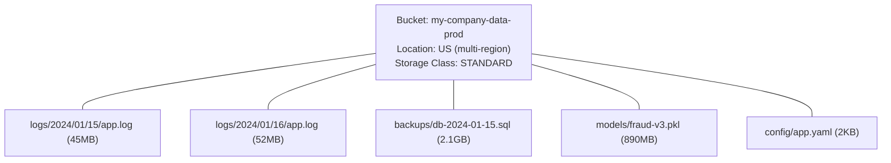

**Complexity**: [QUICK] | **Time to Complete**: 1.5h | **Prerequisites**: Module 2.1 (IAM & Resource Hierarchy)

## What You'll Be Able to Do

After completing this module, you will be able to:

- **Configure Cloud Storage buckets with uniform bucket-level access and signed URL policies**
- **Implement lifecycle management rules to automate object transitions across storage classes (Standard, Nearline, Coldline, Archive)**
- **Deploy object versioning and retention policies to protect data from accidental deletion**
- **Design cross-region replication and Turbo Replication strategies for disaster recovery workloads**

---

## Why This Module Matters

In 2019, a healthcare analytics company discovered that an internal GCS bucket containing patient diagnostic data had been publicly readable for over four months. The misconfiguration was traced to a single IAM binding: `allUsers` had been granted `roles/storage.objectViewer` on the bucket. An engineer had set this permission during development to share files with an external contractor and never revoked it. The data was exposed for months before an automated compliance scan flagged it. The ensuing investigation, security audit, and remediation cost the company over $2 million in fines and legal fees.

This was not an isolated incident. Publicly exposed cloud storage buckets have been responsible for some of the largest data breaches in cloud computing history. The common thread is always the same: cloud storage is trivially easy to use, which makes it trivially easy to misconfigure. Google Cloud Storage is the backbone of almost every GCP architecture. It stores application artifacts, database backups, logs, ML training data, static website assets, and Terraform state files. If you do not understand storage classes, lifecycle policies, versioning, and access control, you will eventually either overspend on storage or leak data publicly.

In this module, you will learn how GCS organizes data, how to choose the right storage class to optimize costs, how lifecycle rules automate data management, how versioning protects against accidental deletion, and how signed URLs provide time-limited access without modifying IAM policies.

---

## GCS Fundamentals

### Buckets and Objects

GCS has a flat namespace despite appearing hierarchical. There are no directories---object names like `logs/2024/01/app.log` are just strings that happen to contain slashes. The console and `gcloud storage` simulate folder-like navigation, but under the hood it is a flat key-value store.



Key rules:
- **Bucket names are globally unique** across all of GCP (not just your project).
- Bucket names must be 3-63 characters, lowercase letters, numbers, hyphens, and underscores.
- Object names can be up to 1024 characters and can contain any UTF-8 character.
- Maximum object size is 5 TiB.
- There is no limit on the number of objects in a bucket.

```bash
# Create a bucket
gcloud storage buckets create gs://my-company-data-prod \
  --location=US \
  --default-storage-class=STANDARD \
  --uniform-bucket-level-access

# List buckets in a project
gcloud storage ls

# Upload a file
gcloud storage cp local-file.txt gs://my-company-data-prod/uploads/

# Upload a directory recursively
gcloud storage cp -r ./data/ gs://my-company-data-prod/datasets/

# Download a file
gcloud storage cp gs://my-company-data-prod/config/app.yaml ./

# List objects in a bucket
gcloud storage ls gs://my-company-data-prod/

# List with details (size, timestamp)
gcloud storage ls -l gs://my-company-data-prod/logs/

# Delete an object
gcloud storage rm gs://my-company-data-prod/uploads/old-file.txt

# Delete a "directory" (all objects with that prefix)
gcloud storage rm -r gs://my-company-data-prod/temp/
```

### Bucket Locations

| Location Type | Example | Redundancy | Latency | Cost | Use Case |
| :--- | :--- | :--- | :--- | :--- | :--- |
| **Multi-region** | `US`, `EU`, `ASIA` | Geo-redundant (2+ regions) | Higher | Highest | Global apps, disaster recovery |
| **Dual-region** | `NAM4`, custom | 2 specific regions | Medium | Medium-high | Compliance + availability |
| **Region** | `us-central1` | Within one region | Lowest | Lowest | Co-located with compute, cost-sensitive |

```bash
# Regional bucket (cheapest, co-locate with your VMs)
gcloud storage buckets create gs://my-logs-regional \
  --location=us-central1

# Custom dual-region bucket (compliance + availability)
gcloud storage buckets create gs://my-backups-dual \
  --location=US \
  --placement=us-central1,us-east1 \
  --default-storage-class=NEARLINE

# Multi-region bucket (global access)
gcloud storage buckets create gs://my-static-global \
  --location=US
```

---

> **Stop and think**: If Autoclass automatically optimizes storage costs with zero retrieval fees, why wouldn't you enable it on every single bucket by default? What specific workload pattern or architectural requirement would make Autoclass a financial or operational mistake?

## Storage Classes: Matching Cost to Access Patterns

GCS offers four storage classes. The key insight is that **cheaper storage has higher retrieval costs and minimum storage durations**.

| Storage Class | Monthly Cost (per GB) | Retrieval Cost (per GB) | Min Duration | Availability SLA | Use Case |
| :--- | :--- | :--- | :--- | :--- | :--- |
| **STANDARD** | $0.020-0.026 | $0.00 | None | 99.95% (multi-region) | Frequently accessed data |
| **NEARLINE** | $0.010-0.013 | $0.01 | 30 days | 99.9% | Monthly access (backups) |
| **COLDLINE** | $0.004-0.006 | $0.02 | 90 days | 99.9% | Quarterly access (archives) |
| **ARCHIVE** | $0.0012 | $0.05 | 365 days | 99.9% | Yearly access (compliance) |

**Critical concept**: The minimum storage duration means you are **billed for the full period** even if you delete the object early. If you upload a file to COLDLINE and delete it after 10 days, you are still charged for the remaining 80 days of storage as an early deletion fee.

```bash
# Set storage class per object during upload
gcloud storage cp archive.tar.gz gs://my-bucket/ \
  --storage-class=COLDLINE

# Change the default storage class of a bucket
gcloud storage buckets update gs://my-bucket \
  --default-storage-class=NEARLINE

# View the storage class of objects
gcloud storage ls -L gs://my-bucket/archive.tar.gz 2>&1 | grep "Storage class"
```

### Autoclass

Autoclass automatically moves objects between storage classes based on access patterns. It eliminates the need to manually manage lifecycle rules for class transitions.

```bash
# Enable Autoclass on a new bucket
gcloud storage buckets create gs://my-smart-bucket \
  --location=us-central1 \
  --enable-autoclass

# Enable Autoclass on an existing bucket
gcloud storage buckets update gs://existing-bucket \
  --enable-autoclass
```

With Autoclass enabled:
- All objects start as STANDARD.
- After 30 days without access, they move to NEARLINE.
- After 90 days without access, they move to COLDLINE.
- After 365 days without access, they move to ARCHIVE.
- If accessed again, they automatically move back to STANDARD.
- No retrieval fees apply when Autoclass moves objects between classes.

---

> **Pause and predict**: You configure a lifecycle rule to forcefully delete objects older than 30 days. However, your bucket also has versioning enabled. If an engineer overwrote a highly sensitive 40-day-old object just 5 days ago, what exactly happens when the 30-day lifecycle deletion rule evaluates this object today?

## Lifecycle Management

Lifecycle rules automate actions on objects based on age, storage class, versioning status, or other conditions. This is how you prevent storage costs from growing unbounded.

```bash
# Set lifecycle rules using a JSON file
cat > /tmp/lifecycle.json << 'EOF'
{
  "rule": [
    {
      "action": {"type": "Delete"},
      "condition": {
        "age": 365,
        "matchesStorageClass": ["STANDARD"]
      }
    },
    {
      "action": {
        "type": "SetStorageClass",
        "storageClass": "NEARLINE"
      },
      "condition": {
        "age": 30,
        "matchesStorageClass": ["STANDARD"]
      }
    },
    {
      "action": {
        "type": "SetStorageClass",
        "storageClass": "COLDLINE"
      },
      "condition": {
        "age": 90,
        "matchesStorageClass": ["NEARLINE"]
      }
    },
    {
      "action": {"type": "Delete"},
      "condition": {
        "isLive": false,
        "numNewerVersions": 3
      }
    }
  ]
}
EOF

gcloud storage buckets update gs://my-bucket \
  --lifecycle-file=/tmp/lifecycle.json

# View lifecycle rules
gcloud storage buckets describe gs://my-bucket \
  --format="json(lifecycle)"

# Remove lifecycle rules
gcloud storage buckets update gs://my-bucket \
  --clear-lifecycle
```

### Common Lifecycle Patterns

| Pattern | Rule | Why |
| :--- | :--- | :--- |
| **Log rotation** | Delete STANDARD objects older than 90 days | Logs lose value after analysis |
| **Backup tiering** | STANDARD → NEARLINE at 30 days → COLDLINE at 90 days | Reduce cost as backups age |
| **Version cleanup** | Delete non-current versions after 3 newer versions exist | Prevent version sprawl |
| **Compliance archive** | Move to ARCHIVE at 365 days, delete at 2555 days (7 years) | Meet regulatory retention |
| **Temp file cleanup** | Delete objects with prefix `tmp/` older than 1 day | Clean up temporary uploads |

---

## Object Versioning

Versioning keeps a history of every change to every object. When you overwrite or delete an object, the previous version is preserved as a "non-current" version.

```bash
# Enable versioning on a bucket
gcloud storage buckets update gs://my-bucket \
  --versioning

# Upload a file (creates version 1)
echo "version 1" | gcloud storage cp - gs://my-bucket/config.yaml

# Upload again (creates version 2; version 1 becomes non-current)
echo "version 2" | gcloud storage cp - gs://my-bucket/config.yaml

# List all versions of an object
gcloud storage ls -a gs://my-bucket/config.yaml

# Restore a previous version (copy it back as the current version)
gcloud storage cp gs://my-bucket/config.yaml#GENERATION_NUMBER \
  gs://my-bucket/config.yaml

# Delete a specific version
gcloud storage rm gs://my-bucket/config.yaml#GENERATION_NUMBER

# Disable versioning (existing versions are kept)
gcloud storage buckets update gs://my-bucket \
  --no-versioning
```

**War Story**: A platform engineer at a media company accidentally ran `gcloud storage rm -r gs://prod-assets/` and deleted 2.3 million production images. Because versioning was enabled, the objects became "non-current" instead of permanently deleted. The team restored all objects within an hour using a script that copied non-current versions back. Without versioning, recovery would have required restoring from a 12-hour-old backup, losing an entire morning of uploaded content.

### Object Holds and Retention

For compliance use cases, you can lock objects to prevent deletion.

```bash
# Set a retention policy (objects cannot be deleted for 90 days)
gcloud storage buckets update gs://my-compliance-bucket \
  --retention-period=90d

# Lock the retention policy (IRREVERSIBLE - cannot be shortened after locking)
gcloud storage buckets update gs://my-compliance-bucket \
  --lock-retention-policy

# Place a temporary hold on a specific object
gcloud storage objects update gs://my-bucket/evidence.pdf \
  --temporary-hold

# Remove the temporary hold
gcloud storage objects update gs://my-bucket/evidence.pdf \
  --no-temporary-hold
```

---

> **Stop and think**: If Uniform Bucket-Level Access forces you to manage permissions solely at the bucket level, how would you securely handle an architectural requirement where 100 different external clients each strictly need read access to only their specific client folder within a single shared "invoices" bucket?

## Access Control: IAM vs ACLs

### Uniform Bucket-Level Access (Recommended)

Uniform bucket-level access means that all access control is managed exclusively through IAM. Object-level ACLs are disabled. This is the recommended mode because it simplifies auditing and eliminates the confusion of having two access control systems.

```bash
# Enable uniform bucket-level access (recommended for all new buckets)
gcloud storage buckets update gs://my-bucket \
  --uniform-bucket-level-access

# Grant a group read access to all objects in the bucket
gcloud storage buckets add-iam-policy-binding gs://my-bucket \
  --member="group:data-analysts@example.com" \
  --role="roles/storage.objectViewer"

# Grant a service account write access
gcloud storage buckets add-iam-policy-binding gs://my-bucket \
  --member="serviceAccount:data-pipeline@my-project.iam.gserviceaccount.com" \
  --role="roles/storage.objectCreator"

# View bucket IAM policy
gcloud storage buckets get-iam-policy gs://my-bucket
```

### Common Storage IAM Roles

| Role | Permissions | Typical User |
| :--- | :--- | :--- |
| `roles/storage.objectViewer` | Read objects, list objects | Analysts, read-only services |
| `roles/storage.objectCreator` | Create objects (cannot overwrite or delete) | Upload-only pipelines |
| `roles/storage.objectAdmin` | Full control over objects | Application service accounts |
| `roles/storage.admin` | Full control over buckets and objects | Platform engineers |
| `roles/storage.legacyBucketReader` | List bucket contents | Legacy compatibility |

### Preventing Public Access

```bash
# Set organization policy to prevent public access on ALL buckets
# (recommended as an org-wide guardrail)
gcloud org-policies set-policy /tmp/prevent-public.yaml --organization=ORG_ID

# /tmp/prevent-public.yaml:
# constraint: constraints/storage.publicAccessPrevention
# booleanPolicy:
#   enforced: true

# Check if a specific bucket is publicly accessible
gcloud storage buckets get-iam-policy gs://my-bucket \
  --format=json | grep -E "allUsers|allAuthenticatedUsers"
```

---

> **Pause and predict**: A developer securely generates a Signed URL allowing a client to upload a massive 50GB database dump. The developer configures the URL to expire in exactly 15 minutes. The client begins the upload immediately upon receiving the URL, but due to bandwidth constraints, the transfer takes 45 minutes to complete. What happens to the upload?

## Signed URLs: Time-Limited Access

Signed URLs allow you to grant temporary access to a specific object without modifying IAM policies. They are ideal for sharing files with external users or providing download links in web applications.

```bash
# Generate a signed URL valid for 1 hour
# (requires a service account key or impersonation)
gcloud storage sign-url gs://my-bucket/report.pdf \
  --duration=1h

# Generate a signed URL using service account impersonation (no key needed)
gcloud storage sign-url gs://my-bucket/report.pdf \
  --duration=1h \
  --impersonate-service-account=signer@my-project.iam.gserviceaccount.com

# Generate a signed URL for uploading (PUT)
gcloud storage sign-url gs://my-bucket/uploads/incoming.csv \
  --duration=30m \
  --http-verb=PUT
```

### Using Signed URLs in Applications

```python
# Python example: Generate a signed URL programmatically
from google.cloud import storage
import datetime

def generate_signed_url(bucket_name, blob_name, expiration_minutes=60):
    """Generate a signed URL for downloading an object."""
    client = storage.Client()
    bucket = client.bucket(bucket_name)
    blob = bucket.blob(blob_name)

    url = blob.generate_signed_url(
        version="v4",
        expiration=datetime.timedelta(minutes=expiration_minutes),
        method="GET",
    )
    return url

# Usage
url = generate_signed_url("my-bucket", "report.pdf", expiration_minutes=30)
print(f"Download URL (valid for 30 minutes): {url}")
```

### Signed URLs vs Signed Policy Documents

| Feature | Signed URL | Signed Policy Document |
| :--- | :--- | :--- |
| **Purpose** | Download or upload a specific object | Upload with constraints (size, type) |
| **Max duration** | 7 days (V4 signing) | 7 days |
| **Use case** | Share a file, programmatic downloads | HTML form uploads |
| **Object specific** | Yes (one URL per object) | Can allow any object name matching conditions |

---

## gsutil vs gcloud storage

Google has been migrating commands from `gsutil` to `gcloud storage`. Both work, but `gcloud storage` is the recommended tool going forward.

| Operation | gsutil (legacy) | gcloud storage (recommended) |
| :--- | :--- | :--- |
| List | `gsutil ls gs://bucket/` | `gcloud storage ls gs://bucket/` |
| Copy | `gsutil cp file gs://bucket/` | `gcloud storage cp file gs://bucket/` |
| Move | `gsutil mv gs://b/old gs://b/new` | `gcloud storage mv gs://b/old gs://b/new` |
| Delete | `gsutil rm gs://bucket/file` | `gcloud storage rm gs://bucket/file` |
| Sync | `gsutil rsync -r local/ gs://b/` | `gcloud storage rsync local/ gs://b/` |
| ACL | `gsutil acl set public-read gs://b/f` | Use IAM instead |
| Hash | `gsutil hash file` | `gcloud storage hash file` |

### Parallel and Resumable Uploads

```bash
# Parallel composite upload for large files (splits into parts, uploads in parallel)
gcloud storage cp large-file.tar.gz gs://my-bucket/ \
  --content-type=application/gzip

# Rsync a local directory to a bucket (only uploads changed files)
gcloud storage rsync ./build/ gs://my-static-site/ \
  --delete-unmatched-destination-objects \
  --recursive

# Rsync between buckets (cross-region replication)
gcloud storage rsync gs://source-bucket/ gs://dest-bucket/ \
  --recursive
```

---

## Did You Know?

1. **GCS processes over 2 trillion objects per day** across all customers. The service has been running since 2010 and has achieved 99.999999999% (11 nines) durability. This means that if you store 10 million objects, you can statistically expect to lose one object every 10 million years.

2. **The "flat namespace" design means listing millions of objects is expensive**. A `gcloud storage ls gs://my-bucket/` on a bucket with 50 million objects will take minutes and consume significant API quota. Use prefixes to narrow your listing (`gs://my-bucket/logs/2024/01/`), or use Cloud Storage Inventory Reports for bulk analysis.

3. **Cloud Storage has a hidden "requester pays" feature** that shifts download costs to the requester instead of the bucket owner. This is commonly used for public datasets where the dataset provider does not want to pay for bandwidth. The Human Genome Project and many scientific datasets on GCS use requester pays.

4. **Object names that begin with a period (`.`) are not hidden**---GCS does not have a concept of hidden files. The name `.env` is just a regular object name. However, some tools (like `gcloud storage rsync`) have flags to skip dotfiles, which can cause confusion when `.env` files are not synced as expected.

---

## Common Mistakes

| Mistake | Why It Happens | How to Fix It |
| :--- | :--- | :--- |
| Using `allUsers` for "quick sharing" | Easiest way to make something accessible | Use signed URLs for temporary access; IAM groups for persistent access |
| Not enabling versioning on critical buckets | Default is off; teams forget to enable it | Enable versioning on all production buckets; use lifecycle rules to control version count |
| Storing everything in STANDARD class | Engineers do not think about storage costs | Use lifecycle rules to move data to NEARLINE/COLDLINE; consider Autoclass |
| Using Fine-Grained ACLs instead of Uniform IAM | Legacy tutorials still show ACLs | Enable Uniform Bucket-Level Access on all buckets |
| Not co-locating buckets with compute | Creating all buckets in US multi-region | Use regional buckets in the same region as your VMs for lowest latency and cost |
| Deleting without versioning enabled | "Delete means delete" | Enable versioning first, then deletes create non-current versions instead of permanent loss |
| Listing entire large buckets | Using `gcloud storage ls` without a prefix | Always use a prefix filter; use Inventory Reports for bulk analysis |
| Ignoring minimum storage duration charges | Uploading to COLDLINE then deleting after 10 days | You are billed for 90 days regardless; use STANDARD for short-lived objects |

---

## Quiz

<details>
<summary>1. Your backup pipeline uploads a 5 TB database dump to a COLDLINE bucket on the 1st of the month. Due to a script error, a cleanup job deletes this dump on the 15th of the same month. Calculate the financial impact regarding storage duration and explain the billing mechanics.</summary>

You will be billed for the 15 days the object existed, plus an early deletion fee equivalent to the remaining 75 days of Coldline storage for the 5 TB file. Coldline storage has a strict minimum storage duration of 90 days built into its pricing model to offset the cheaper monthly rate. Even though the object only existed for 15 days, Google Cloud automatically calculates and applies this early deletion charge to ensure that users do not exploit archival storage classes for short-lived temporary data. If a workload involves creating and deleting files within a month, Standard or Nearline storage will mathematically always be the cheaper option because they have shorter or zero minimum duration requirements.
</details>

<details>
<summary>2. Your security team discovers that a specific highly-sensitive file in a private bucket is publicly accessible on the internet, even though the bucket's IAM policy clearly states no public access is granted. Explain how this misconfiguration occurred and the architectural change required to prevent it permanently.</summary>

This misconfiguration occurred because the bucket is utilizing Fine-Grained Access Control Lists (ACLs) instead of relying solely on IAM. Under the legacy ACL system, individual objects can have their own independent permission lists that override or exist entirely outside the bucket-level IAM policy. An engineer or automated process likely set a public read ACL directly on that specific sensitive file. To prevent this permanently, you must enable Uniform Bucket-Level Access on the bucket. This action immediately disables all object-level ACLs, ensuring that the centralized IAM policy becomes the absolute single, verifiable source of truth for access control.
</details>

<details>
<summary>3. During a midnight deployment, a tired engineer runs a script that accidentally overwrites the production `config.yaml` with a blank file. The bucket has versioning enabled. Describe the exact mechanism of what happened to the original data and the steps the engineer must take to restore the application's configuration.</summary>

Because versioning is enabled, the GCS bucket did not destroy the original configuration data. Instead, the overwrite operation turned the original `config.yaml` into a "non-current" version hidden from standard list operations, while the new blank file became the active, live version. To restore the data, the engineer must first run `gcloud storage ls -a` to list all versions and identify the specific generation number of the original correct file. Once the generation number is identified, they must use `gcloud storage cp` referencing that specific generation (e.g., `file.yaml#12345`) to copy it back over the live version. This simple copy operation promotes the old data back to the current active state without requiring external backup restoration.
</details>

<details>
<summary>4. You are building a web application where users can download their monthly PDF invoices. The users do not have Google Cloud accounts, and the invoices must remain strictly confidential between the application and the specific user. Evaluate the options and justify the most secure method to serve these files.</summary>

The most secure and appropriate method is to dynamically generate Signed URLs on the backend when a user explicitly requests a download. Granting an IAM role directly is impossible because the end users lack Google Cloud identities, and making the entire bucket or objects public would catastrophically violate strict confidentiality requirements. A Signed URL uses a backend service account's credentials to cryptographically sign a link that grants temporary, time-limited access exclusively to one specific object. This ensures the user can only download their exact invoice for a brief window (e.g., 15 minutes), keeping the bucket entirely private while securely bridging the identity gap.
</details>

<details>
<summary>5. Your data science team operates a data lake where some machine learning datasets are accessed millions of times a day, while others are uploaded and never touched again. The access patterns change weekly based on which models are being trained. Contrast the use of manual lifecycle rules versus Autoclass for this specific workload, explaining which is optimal and why.</summary>

Autoclass is the optimal solution for this specific data lake because the access patterns are highly unpredictable and change frequently. Manual lifecycle rules require you to confidently predict when data will become cold, forcing object transitions based strictly on age rather than actual utility. If a manual rule aggressively moves a dataset to Coldline and the data science team suddenly needs it for training next week, you will incur massive retrieval fees and early deletion penalties. Autoclass, by contrast, continuously monitors actual usage and dynamically shifts untouched objects to cheaper tiers while moving accessed objects back to Standard with absolutely zero retrieval fees, automatically optimizing costs for fluctuating workloads.
</details>

<details>
<summary>6. A new DevOps engineer attempts to create a bucket named `app-logs` in your organization's production project, but the command fails with a '409 Conflict' error stating the bucket already exists. However, they verified no such bucket exists anywhere in your project. Explain the architectural reason behind this failure and propose a robust naming strategy to avoid it.</summary>

The command fails because Google Cloud Storage uses a single, global flat namespace for all bucket names across every single customer worldwide. Buckets are addressable via public DNS (like `storage.googleapis.com/bucket-name`), meaning two different organizations cannot possess the exact same bucket name simultaneously. The generic name `app-logs` was undoubtedly claimed years ago by another Google Cloud customer on their own distinct account. To avoid this architectural constraint, you must adopt a strict, globally unique naming strategy. A robust standard is to consistently prepend your organization's domain name, project ID, and environment to the bucket name (e.g., `acmecorp-prod-app-logs`), which virtually guarantees uniqueness and provides clear operational context.
</details>

---

## Hands-On Exercise: GCS Lifecycle, Versioning, and Signed URLs

### Objective

Create a bucket with versioning and lifecycle rules, demonstrate version recovery, and generate signed URLs for temporary access.

### Prerequisites

- `gcloud` CLI installed and authenticated
- A GCP project with billing enabled

### Tasks

**Task 1: Create a Bucket with Versioning**

<details>
<summary>Solution</summary>

```bash
export BUCKET_NAME="gcs-lab-$(gcloud config get-value project)-$(date +%s | tail -c 7)"

# Create bucket with uniform access and versioning
gcloud storage buckets create gs://$BUCKET_NAME \
  --location=us-central1 \
  --default-storage-class=STANDARD \
  --uniform-bucket-level-access

# Enable versioning
gcloud storage buckets update gs://$BUCKET_NAME --versioning

# Verify settings
gcloud storage buckets describe gs://$BUCKET_NAME \
  --format="yaml(versioning, iamConfiguration.uniformBucketLevelAccess)"
```
</details>

**Task 2: Upload Files and Create Multiple Versions**

<details>
<summary>Solution</summary>

```bash
# Create and upload version 1
echo '{"version": 1, "database_url": "db.example.com:5432"}' > /tmp/config.json
gcloud storage cp /tmp/config.json gs://$BUCKET_NAME/config.json

# Create and upload version 2 (overwrites version 1)
echo '{"version": 2, "database_url": "db-new.example.com:5432"}' > /tmp/config.json
gcloud storage cp /tmp/config.json gs://$BUCKET_NAME/config.json

# Create and upload version 3
echo '{"version": 3, "database_url": "db-prod.example.com:5432"}' > /tmp/config.json
gcloud storage cp /tmp/config.json gs://$BUCKET_NAME/config.json

# List all versions
echo "=== All Versions ==="
gcloud storage ls -a gs://$BUCKET_NAME/config.json

# Read the current version
echo "=== Current Version ==="
gcloud storage cat gs://$BUCKET_NAME/config.json
```
</details>

**Task 3: Simulate Accidental Deletion and Recover**

<details>
<summary>Solution</summary>

```bash
# Delete the current version (simulating an accident)
gcloud storage rm gs://$BUCKET_NAME/config.json
echo "File deleted!"

# Try to read it (should fail)
gcloud storage cat gs://$BUCKET_NAME/config.json 2>&1 || echo "File not found (expected)"

# List non-current versions (the data is still there)
echo "=== Non-current Versions ==="
gcloud storage ls -a gs://$BUCKET_NAME/config.json

# Get the generation number of the version you want to restore
GENERATION=$(gcloud storage ls -a gs://$BUCKET_NAME/config.json \
  --format="value(name)" | tail -1 | grep -o '#[0-9]*' | tr -d '#')

echo "Restoring generation: $GENERATION"

# Restore by copying the non-current version back
gcloud storage cp "gs://$BUCKET_NAME/config.json#$GENERATION" \
  gs://$BUCKET_NAME/config.json

# Verify recovery
echo "=== Restored Content ==="
gcloud storage cat gs://$BUCKET_NAME/config.json
```
</details>

**Task 4: Set Up Lifecycle Rules**

<details>
<summary>Solution</summary>

```bash
# Create lifecycle rules:
# 1. Delete non-current versions older than 30 days
# 2. Keep only 3 non-current versions
# 3. Move current objects to NEARLINE after 60 days
cat > /tmp/lifecycle-rules.json << 'EOF'
{
  "rule": [
    {
      "action": {"type": "Delete"},
      "condition": {
        "isLive": false,
        "daysSinceNoncurrentTime": 30
      }
    },
    {
      "action": {"type": "Delete"},
      "condition": {
        "isLive": false,
        "numNewerVersions": 3
      }
    },
    {
      "action": {
        "type": "SetStorageClass",
        "storageClass": "NEARLINE"
      },
      "condition": {
        "age": 60,
        "matchesStorageClass": ["STANDARD"]
      }
    }
  ]
}
EOF

gcloud storage buckets update gs://$BUCKET_NAME \
  --lifecycle-file=/tmp/lifecycle-rules.json

# Verify
gcloud storage buckets describe gs://$BUCKET_NAME \
  --format="json(lifecycle)"
```
</details>

**Task 5: Generate a Signed URL**

<details>
<summary>Solution</summary>

```bash
# Upload a sample file
echo "Confidential Report - Q4 2024" > /tmp/report.txt
gcloud storage cp /tmp/report.txt gs://$BUCKET_NAME/reports/q4-2024.txt

# Generate a signed URL valid for 15 minutes
# Note: This requires either a service account key or impersonation
gcloud storage sign-url gs://$BUCKET_NAME/reports/q4-2024.txt \
  --duration=15m

# The output will contain a URL that anyone can use to download
# the file for the next 15 minutes without authentication

# Test the signed URL (copy it from the output above)
# curl "SIGNED_URL_HERE" -o downloaded-report.txt
```
</details>

**Task 6: Clean Up**

<details>
<summary>Solution</summary>

```bash
# Delete all objects (including non-current versions)
gcloud storage rm -r gs://$BUCKET_NAME/ --all-versions

# Delete the bucket
gcloud storage buckets delete gs://$BUCKET_NAME

echo "Cleanup complete."
```
</details>

### Success Criteria

- [ ] Bucket created with versioning and uniform access
- [ ] Multiple versions of a file uploaded
- [ ] Accidental deletion recovered from non-current versions
- [ ] Lifecycle rules configured for version cleanup and class transition
- [ ] Signed URL generated and functional
- [ ] All resources cleaned up

---

## Next Module

Next up: **[Module 2.5: Cloud DNS](../module-2.5-dns/)** --- Learn how to manage DNS zones (public and private), configure DNS forwarding for hybrid environments, and set up peering zones for cross-VPC name resolution.