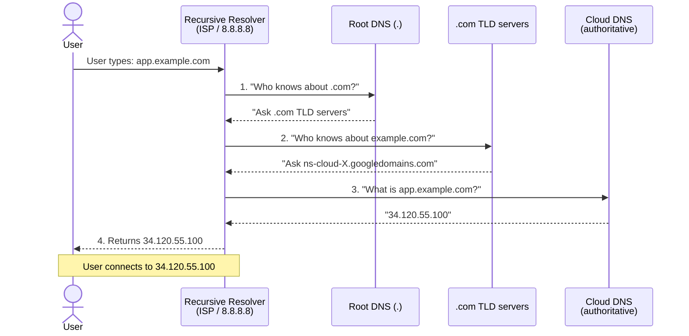
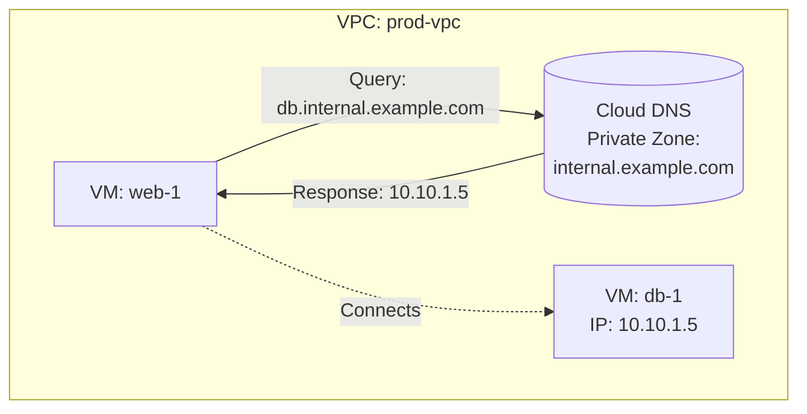
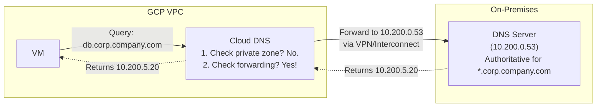
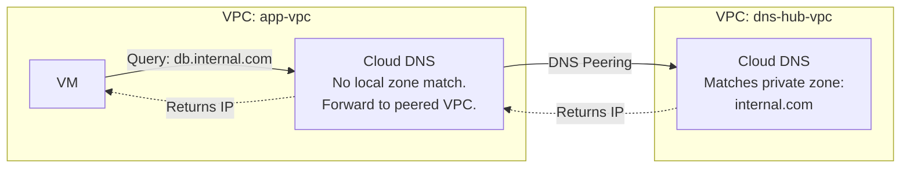

**Complexity**: [MEDIUM] | **Time to Complete**: 1.5h | **Prerequisites**: Module 2.2 (VPC Networking)

## What You'll Be Able to Do

After completing this module, you will be able to:

- **Configure Cloud DNS managed zones with A and CNAME records for internal and external resolution**
- **Implement DNS-based routing policies (weighted, geolocation, failover) for multi-region traffic distribution**
- **Deploy private DNS zones for VPC-internal name resolution between GCP services and Kubernetes clusters**
- **Design split-horizon DNS architectures that serve different records to internal and external clients**

---

## Why This Module Matters

A control-plane or routing failure can make authoritative DNS unreachable, which can take dependent services and even recovery tooling offline. The operational lesson is to design DNS and break-glass access paths so they do not depend on the same failing control plane.

This incident is the most dramatic demonstration of a simple truth: **DNS is the foundation of everything on the internet.** When DNS works, nobody thinks about it. When DNS breaks, nothing works. Every HTTP request, every API call, every service-to-service communication in a microservices architecture begins with a DNS lookup. If you are running workloads on GCP, Cloud DNS is the managed service that resolves names for both your public-facing applications and your internal infrastructure.

In this module, you will learn how Cloud DNS works as a globally distributed, managed DNS service. You will understand the difference between public zones (for internet-facing domains) and private zones (for internal VPC name resolution). You will learn how DNS forwarding connects your GCP environment to on-premises DNS servers, and how peering zones allow DNS resolution across VPCs without exposing records to the broader network.

---

## DNS Fundamentals Review

Before diving into Cloud DNS, a quick refresher on how DNS resolution works is essential for understanding the configurations that follow.



### Record Types You Will Use

| Record Type | Purpose | Example |
| :--- | :--- | :--- |
| **A** | Maps hostname to IPv4 address | `app.example.com → 34.120.55.100` |
| **AAAA** | Maps hostname to IPv6 address | `app.example.com → 2600:1901::1` |
| **CNAME** | Alias to another hostname | `www.example.com → app.example.com` |
| **MX** | Mail server routing | `example.com → 10 mail.example.com` |
| **TXT** | Arbitrary text (SPF, DKIM, verification) | `example.com → "v=spf1 include:..."` |
| **NS** | Nameserver delegation | `example.com → ns-cloud-a1.googledomains.com` |
| **SOA** | Start of authority (zone metadata) | Serial number, refresh intervals |
| **SRV** | Service location (port + priority) | `_http._tcp.example.com → 0 5 80 app.example.com` |
| **PTR** | Reverse DNS (IP to hostname) | `100.55.120.34.in-addr.arpa → app.example.com` |

---

## Public Zones: Internet-Facing DNS

A public DNS zone in Cloud DNS makes your domain resolvable from anywhere on the internet. When you create a public zone, Google assigns it [four authoritative nameservers from the `googledomains.com` pool](https://cloud.google.com/dns/docs/update-name-servers).

### Creating a Public Zone

```bash
# Create a public managed zone
gcloud dns managed-zones create example-zone \
  --dns-name="example.com." \
  --description="Production DNS zone for example.com" \
  --visibility=public

# Note: The trailing dot after the domain name is required (DNS convention)

# View the assigned nameservers
gcloud dns managed-zones describe example-zone \
  --format="yaml(nameServers)"

# Output will be something like:
# nameServers:
# - ns-cloud-a1.googledomains.com.
# - ns-cloud-a2.googledomains.com.
# - ns-cloud-a3.googledomains.com.
# - ns-cloud-a4.googledomains.com.
#
# You must update your domain registrar's NS records to point to these.
```

### Managing DNS Records

```bash
# Start a transaction (atomic change set)
gcloud dns record-sets transaction start --zone=example-zone

# Add an A record pointing to a load balancer IP
gcloud dns record-sets transaction add "34.120.55.100" \
  --name="app.example.com." \
  --ttl=300 \
  --type=A \
  --zone=example-zone

# Add a CNAME for www
gcloud dns record-sets transaction add "app.example.com." \
  --name="www.example.com." \
  --ttl=300 \
  --type=CNAME \
  --zone=example-zone

# Add an MX record for email
gcloud dns record-sets transaction add "10 mail.example.com." \
  --name="example.com." \
  --ttl=3600 \
  --type=MX \
  --zone=example-zone

# Add a TXT record for domain verification
gcloud dns record-sets transaction add '"google-site-verification=abc123"' \
  --name="example.com." \
  --ttl=300 \
  --type=TXT \
  --zone=example-zone

# Execute the transaction (all changes are applied atomically)
gcloud dns record-sets transaction execute --zone=example-zone

# List all records in the zone
gcloud dns record-sets list --zone=example-zone \
  --format="table(name, type, ttl, rrdatas[0])"

# Abort a transaction (if you made a mistake before executing)
gcloud dns record-sets transaction abort --zone=example-zone
```

### Modifying and Deleting Records

```bash
# To modify a record, you must remove the old one and add the new one
# in the same transaction
gcloud dns record-sets transaction start --zone=example-zone

gcloud dns record-sets transaction remove "34.120.55.100" \
  --name="app.example.com." \
  --ttl=300 \
  --type=A \
  --zone=example-zone

gcloud dns record-sets transaction add "34.120.55.200" \
  --name="app.example.com." \
  --ttl=300 \
  --type=A \
  --zone=example-zone

gcloud dns record-sets transaction execute --zone=example-zone
```

### TTL Strategy

TTL (Time to Live) controls how long resolvers cache a DNS response. Choosing the right TTL is a trade-off between performance and agility.

| TTL | Duration | Use Case | Trade-off |
| :--- | :--- | :--- | :--- |
| **60** | 1 minute | Records that change during failover | More DNS queries, faster propagation |
| **300** | 5 minutes | General web application records | Good balance for most use cases |
| **3600** | 1 hour | Stable records (MX, NS) | Fewer queries, slow to change |
| **86400** | 1 day | Records that rarely change | Most efficient, very slow to propagate changes |

**Pro tip**: Before a planned migration, lower the TTL at least one full current-TTL interval in advance so existing cached answers can expire before the cutover.

> **Stop and think**: You are planning to switch a critical database to a new instance this coming Saturday at midnight. The current `db.example.com` A record has a TTL of 86400 (24 hours). What specific action should you take on Friday, and what should you do after the migration is complete?

---

## DNS Routing Policies

Cloud DNS allows you to configure [routing policies that intelligently direct traffic based on weight, geolocation, or health checks](https://cloud.google.com/dns/docs/routing-policies-overview). This is essential for building highly available, multi-region architectures.

### Weighted Round Robin
Weighted routing distributes traffic across multiple IP addresses based on weights you define. This is incredibly useful for A/B testing, canary deployments, or gradually shifting traffic to a new environment (e.g., sending 10% of traffic to a new version of your application).

```bash
# Add a weighted round-robin policy to split traffic 80/20
gcloud dns record-sets transaction add "34.120.55.200,34.120.55.201" \
  --name="api.example.com." \
  --ttl=300 \
  --type=A \
  --zone=example-zone \
  --routing-policy-type=WRR \
  --routing-policy-data="34.120.55.200=80;34.120.55.201=20"
```

### Geolocation Routing
Geolocation routing minimizes latency by directing users to the endpoint geographically closest to them. If you run application clusters in both `us-central1` and `europe-west1`, you can ensure users in Europe are routed to the European cluster automatically.

```bash
# Add a geolocation routing policy
gcloud dns record-sets transaction add "34.120.55.200,34.120.55.202" \
  --name="app.example.com." \
  --ttl=300 \
  --type=A \
  --zone=example-zone \
  --routing-policy-type=GEO \
  --routing-policy-data="us-central1=34.120.55.200;europe-west1=34.120.55.202"
```

### Failover Routing
Failover routing directs traffic to a primary endpoint and automatically switches to a backup endpoint if the primary fails health checks.

```bash
# Add a failover routing policy
gcloud dns record-sets transaction add "34.120.55.200,34.120.55.203" \
  --name="app.example.com." \
  --ttl=300 \
  --type=A \
  --zone=example-zone \
  --routing-policy-type=FAILOVER \
  --routing-policy-primary-data="34.120.55.200" \
  --routing-policy-backup-data="34.120.55.203"
```

---

## Private Zones: Internal DNS

Private DNS zones are [visible only from within specified VPC networks](https://cloud.google.com/dns/docs/key-terms). They are essential for internal service discovery---allowing you to give friendly names to internal resources without exposing those names to the internet.



### Creating a Private Zone

```bash
# Create a private managed zone visible to a specific VPC
gcloud dns managed-zones create internal-zone \
  --dns-name="internal.example.com." \
  --description="Internal DNS for prod VPC" \
  --visibility=private \
  --networks=prod-vpc

# Add internal records
gcloud dns record-sets transaction start --zone=internal-zone

gcloud dns record-sets transaction add "10.10.1.5" \
  --name="db.internal.example.com." \
  --ttl=300 \
  --type=A \
  --zone=internal-zone

gcloud dns record-sets transaction add "10.10.1.10" \
  --name="api.internal.example.com." \
  --ttl=300 \
  --type=A \
  --zone=internal-zone

gcloud dns record-sets transaction add "10.10.1.15" \
  --name="cache.internal.example.com." \
  --ttl=60 \
  --type=A \
  --zone=internal-zone

gcloud dns record-sets transaction execute --zone=internal-zone

# Verify resolution from within the VPC
gcloud compute ssh vm-in-prod-vpc --zone=us-central1-a --quiet \
  --command="dig db.internal.example.com +short"
```

> **Pause and predict**: You have a VPC with a private zone for `internal.company.com`. You just spun up a new VM in a completely different VPC in the same project and want it to resolve `db.internal.company.com`. Will the new VM be able to resolve it out of the box? If not, what must you do?

### Making a Private Zone Visible to Multiple VPCs

```bash
# Add another VPC to the zone's visibility
gcloud dns managed-zones update internal-zone \
  --networks=prod-vpc,staging-vpc

# You can also add VPCs from other projects (cross-project visibility)
gcloud dns managed-zones update internal-zone \
  --networks=projects/project-a/global/networks/vpc-a,projects/project-b/global/networks/vpc-b
```

### Integration with Kubernetes (GKE)
GKE nodes participate in Google Cloud DNS resolution for their network, and Cloud DNS for GKE integrates cluster DNS records with Google Cloud's DNS path. In practice, cluster workloads can resolve VPC-visible names when the cluster's DNS mode and scope are configured to expose them.

### Private Zone Resolution Order

When a VM or GKE node uses Google Cloud DNS, the official resolution order includes alternative name servers and response policies before private, forwarding, peering, internal, and public DNS lookups; use the Google Cloud documentation for the exact sequence:

```text
1. Private zones attached to the VM's VPC
   (e.g., internal.example.com → private zone answers)

2. Forwarding zones (if configured)
   (e.g., corp.company.com → forwarded to on-premises DNS)

3. Peering zones (if configured)
   (e.g., partner.example.com → resolved via peered VPC)

4. Google public DNS
   (e.g., www.google.com → resolved via public DNS)
```

---

## DNS Forwarding: Hybrid Cloud DNS

DNS forwarding allows you to [forward queries for specific domains to external DNS servers](https://cloud.google.com/dns/docs/zones/zones-overview). This is critical in hybrid environments where on-premises resources have DNS records in on-premises DNS servers.

### Outbound Forwarding (GCP to On-Premises)



```bash
# Create a forwarding zone
gcloud dns managed-zones create corp-forwarding \
  --dns-name="corp.company.com." \
  --description="Forward queries to on-premises DNS" \
  --visibility=private \
  --networks=prod-vpc \
  --forwarding-targets="10.200.0.53,10.200.0.54"

# Forwarding with private routing (uses VPN/Interconnect, not internet)
gcloud dns managed-zones create corp-forwarding-private \
  --dns-name="corp.company.com." \
  --description="Forward queries via private routing" \
  --visibility=private \
  --networks=prod-vpc \
  --forwarding-targets="10.200.0.53[private],10.200.0.54[private]"
```

### Inbound Forwarding (On-Premises to GCP)

For on-premises systems to resolve GCP private DNS zones, you need to set up an [**inbound DNS policy** that creates a forwarding IP in your VPC](https://cloud.google.com/dns/docs/server-policies-overview). On-premises DNS servers then forward queries to this IP.

```bash
# Create a DNS server policy with inbound forwarding enabled
gcloud dns policies create allow-inbound \
  --description="Allow inbound DNS forwarding from on-premises" \
  --networks=prod-vpc \
  --enable-inbound-forwarding

# View the inbound forwarder IPs (one per subnet)
gcloud compute addresses list \
  --filter="purpose=DNS_RESOLVER" \
  --format="table(name, address, subnetwork)"

# On your on-premises DNS server, create a conditional forwarder:
# Forward *.internal.example.com → <inbound forwarder IP>
```

### Alternative Forwarding via DNS Policies

DNS policies allow you to configure forwarding behavior at the VPC level instead of creating forwarding zones.

```bash
# Create a policy that forwards all DNS to custom nameservers
gcloud dns policies create custom-dns \
  --description="Use custom DNS servers for all resolution" \
  --networks=prod-vpc \
  --alternative-name-servers="10.200.0.53,10.200.0.54" \
  --enable-logging

# List DNS policies
gcloud dns policies list

# Delete a policy
gcloud dns policies delete custom-dns
```

---

## DNS Peering: Cross-VPC Resolution

DNS peering zones [allow one VPC to resolve DNS names using another VPC's private zones, without creating a full VPC peering](https://cloud.google.com/dns/docs/zones/zones-overview) or sharing the zones directly. This is useful when you have a central "DNS hub" VPC.



```bash
# Create a peering zone in app-vpc that peers with dns-hub-vpc
gcloud dns managed-zones create peer-to-hub \
  --dns-name="internal.com." \
  --description="Peer DNS resolution to hub VPC" \
  --visibility=private \
  --networks=app-vpc \
  --target-network=dns-hub-vpc \
  --target-project=shared-networking
```

### When to Use Which

| Scenario | Solution | Why |
| :--- | :--- | :--- |
| Internal names within a single VPC | Private zone | Simplest setup |
| Internal names shared across VPCs | Private zone with multiple networks | Direct, no peering needed |
| Centralized DNS management (hub-spoke) | DNS peering zones | Hub VPC manages all zones |
| On-premises to GCP resolution | Inbound forwarding policy | On-prem DNS forwards to GCP |
| GCP to on-premises resolution | Forwarding zone | Cloud DNS forwards to on-prem |
| Shared VPC with private DNS | Private zone on shared VPC | All service projects resolve automatically |

---

## DNSSEC: Securing DNS

DNSSEC (Domain Name System Security Extensions) [protects against DNS spoofing by digitally signing DNS records. Cloud DNS supports DNSSEC for public zones](https://cloud.google.com/dns/docs/dnssec).

```bash
# Enable DNSSEC on a public zone
gcloud dns managed-zones update example-zone \
  --dnssec-state=on

# View DNSSEC configuration (DS records to add at your registrar)
gcloud dns dns-keys list --zone=example-zone \
  --format="table(keyTag, type, algorithm, dsRecord())"

# Transfer the DS record to your domain registrar to complete the chain of trust
```

---

## DNS Logging

DNS query logging helps you understand what your workloads are resolving and detect anomalous behavior.

```bash
# Enable DNS logging via a policy
gcloud dns policies create logging-policy \
  --description="Enable DNS query logging" \
  --networks=prod-vpc \
  --enable-logging

# View DNS logs in Cloud Logging
gcloud logging read 'resource.type="dns_query"' \
  --limit=20 \
  --format="table(jsonPayload.queryName, jsonPayload.queryType, jsonPayload.responseCode, jsonPayload.sourceIP)"
```

---

## Did You Know?

1. **Cloud DNS publishes a high serving-DNS-queries SLO in its SLA** and uses anycast name servers to serve zones from multiple locations around the world for high availability and low latency.

2. **Resolvers can continue serving cached answers until the relevant TTLs expire**, and some resolvers or client-side caches might not refresh exactly when you expect. For planned changes, lower TTLs ahead of time and verify propagation against authoritative name servers.

3. **Private zones override public zones for the same domain**. If you create a private zone for `example.com` in your VPC, [VMs in that VPC will resolve `example.com` using the private zone and will NOT be able to reach the public `example.com` records](https://cloud.google.com/dns/docs/zones/zones-overview). This is both a feature (for split-horizon DNS) and a trap (if you accidentally create a private zone for a domain you also need to reach publicly).

4. **Cloud DNS supports response policies**, which let you override answers for selected names inside your network by serving local DNS data or using passthrough exceptions.

---

## Common Mistakes

| Mistake | Why It Happens | How to Fix It |
| :--- | :--- | :--- |
| Forgetting the trailing dot on DNS names | Not familiar with DNS convention | Use a trailing `.` for fully qualified domain names in Cloud DNS when you need to specify an absolute name |
| Creating a private zone for a public domain | Wanting split-horizon DNS without understanding the override | Only create private zones for domains you do not need to resolve publicly, or carefully manage the split |
| Setting TTL too high before a migration | Not planning the migration in advance | Lower TTL to 60 seconds at least 24 hours before the change |
| Not configuring DNS forwarding for hybrid setups | Assuming on-premises names "just work" | Create forwarding zones for each on-premises domain |
| Exposing private DNS to unauthorized VPCs | Adding too many networks to a private zone | Use DNS peering via a hub VPC instead of adding every VPC to every zone |
| Ignoring DNS logging | Not knowing the feature exists | Enable DNS logging on all production VPCs; invaluable for security investigations |
| Using CNAME at the zone apex | DNS standards prohibit it | Use an A record for the zone apex; CNAME works only for subdomains |
| Not setting up DNSSEC for public zones | Perceived as complex to configure | Cloud DNS makes it simple; enable it and add the DS record to your registrar |

---

## Quiz

<details>
<summary>1. You are running a production web application with a public DNS zone for "company.com" that resolves to your public load balancer. An engineer creates a private DNS zone for "company.com" in your production VPC to handle internal service discovery for a new database, but they only add the database records. Several minutes later, applications in the production VPC start throwing connection errors when trying to reach the public website API. What caused this outage?</summary>

The **private zone takes precedence** over the public zone for VMs within that specific VPC. When the engineer created the private zone for "company.com", it established a split-horizon DNS architecture, meaning all DNS queries from VMs in that VPC for "company.com" and any of its subdomains were routed exclusively to the private zone. Because the private zone only contained the database records, queries for the public API endpoints returned an NXDOMAIN (not found) error rather than falling back to the public zone. To resolve this, the engineer must either add all required public records to the private zone, or preferably, use a dedicated internal subdomain like "internal.company.com" for the private zone to avoid shadowing the public namespace.
</details>

<details>
<summary>2. Your organization has 50 different GCP projects, each with its own VPC network. The platform team manages a set of 20 private DNS zones containing core infrastructure endpoints. A junior engineer suggests iterating through all 50 VPCs and adding each one directly to the "visibility" list of all 20 private DNS zones. You suggest using DNS peering instead. Why is DNS peering the superior architectural choice in this scenario?</summary>

When you add multiple VPCs directly to a private zone, each VPC gets direct visibility, but this approach does not scale well organizationally or operationally. In the junior engineer's proposal, you would need to manage and maintain 1,000 separate zone-to-VPC bindings (50 VPCs x 20 zones), creating massive administrative overhead every time a new VPC or zone is created. **DNS peering** allows you to create a delegation relationship where the 50 "spoke" VPCs simply forward their DNS queries to a single central "hub" VPC for resolution. The hub VPC acts as the single source of truth that is directly attached to the private zones, dramatically simplifying lifecycle management and ensuring consistent resolution across the enterprise.
</details>

<details>
<summary>3. Your company recently established a dedicated Cloud Interconnect between your on-premises data center and a GCP VPC. You have a private DNS zone in GCP (`gcp.internal`) and you want an on-premises legacy application server to resolve a GCP database hostname (`db.gcp.internal`). However, when you query the hostname from the on-premises server, it fails to resolve. What two specific configuration steps are required to establish this inbound resolution path?</summary>

To enable on-premises systems to resolve GCP private DNS zones, you must establish an explicit inbound resolution path. First, you must create a **DNS server policy** with inbound forwarding enabled on the VPC where the private zone is attached, which provisions dedicated inbound forwarding IP addresses in each of your VPC subnets. Second, you must configure your **on-premises DNS server** with a conditional forwarding rule that directs queries for the `gcp.internal` domain to those specific inbound forwarding IP addresses. The query will then travel across the Cloud Interconnect to the GCP forwarder, which resolves the name against the private zone and returns the result back to the on-premises server.
</details>

<details>
<summary>4. You are migrating your company's main marketing website to a new managed hosting provider. The provider gives you a hostname (`proxy.hostingprovider.com`) and instructs you to map your root domain (`example.com`) to this hostname. You open Cloud DNS and attempt to create a CNAME record for `example.com` (the zone apex) pointing to `proxy.hostingprovider.com`, but the Google Cloud Console rejects the change with an error. Why does this operation fail, and what is the standard workaround?</summary>

The operation fails because the fundamental DNS specification (RFC 1034) strictly prohibits creating CNAME records at the zone apex. The zone apex must always contain Start of Authority (SOA) and Name Server (NS) records to function, and the DNS protocol explicitly dictates that a CNAME record cannot coexist with any other record types at the same namespace level. Because Cloud DNS strictly adheres to DNS RFCs, it rejects the configuration. The standard solution is to use an **A record** (or AAAA record) at the zone apex pointing directly to the application's static IPv4 address, while using CNAME records only for subdomains like `www.example.com`.
</details>

<details>
<summary>5. Your security team alerts you that several developer VMs in your GCP environment have been compromised and are attempting to communicate with a known malicious command-and-control server at `c2.hacker-network.com`. You need to immediately prevent any further communication with this domain across your entire GCP organization without modifying individual VM firewalls. How can Cloud DNS Response Policy Zones (RPZs) solve this immediate crisis?</summary>

Response Policy Zones (RPZs) provide a mechanism to intercept and override normal DNS resolution behavior for specific domains at the network level. In this crisis scenario, you can create a response policy rule that explicitly matches the malicious domain `c2.hacker-network.com` and configures it to return an NXDOMAIN (not found) response or redirect traffic to a safe internal sinkhole IP address. Because Cloud DNS evaluates RPZs before standard resolution, this effectively creates a network-wide DNS firewall. The compromised VMs will typically fail to resolve the command-and-control server's IP address for new lookups once the policy is in effect, disrupting the communication channel without requiring any agent deployments or complex firewall rule updates.
</details>

<details>
<summary>6. It is Thursday afternoon, and your team is preparing for a high-stakes migration of your primary payment gateway API to a new GCP load balancer scheduled for Saturday at 2:00 AM. The API currently uses an A record with a Time to Live (TTL) of 86400 seconds (24 hours). A junior engineer suggests simply updating the A record to the new IP address on Saturday at 2:00 AM. Why will this plan cause an extended outage, and what is the correct sequence of steps to ensure a seamless migration?</summary>

The junior engineer's plan will cause an extended outage because recursive DNS resolvers across the internet will have cached the old IP address for up to 24 hours, meaning global traffic will slowly trickle to the new load balancer over a full day while many users continue hitting the old, potentially decommissioned endpoint. The correct procedure requires proactive preparation by lowering the TTL to a very short duration (e.g., 60 seconds) on Thursday—at least 24 hours before the migration window—giving global caches time to expire and pick up the short TTL. When Saturday at 2:00 AM arrives, you can safely update the A record to the new IP, and the short TTL will ensure global traffic shifts within a matter of minutes. Finally, after validating the migration, you should increase the TTL back to a longer duration to optimize performance and reduce query volume.
</details>

---

## Hands-On Exercise: Public and Private DNS Zones

### Objective

Create and manage public and private DNS zones, demonstrate split-horizon DNS behavior, configure DNS routing policies, and set up DNS forwarding.

### Prerequisites

- `gcloud` CLI installed and authenticated
- A GCP project with billing enabled
- A custom VPC (from Module 2.2 or create one)

### Tasks

**Task 1: Create a Custom VPC and VM for Testing**

<details>
<summary>Solution</summary>

```bash
export PROJECT_ID=$(gcloud config get-value project)
export REGION=us-central1

# Enable DNS API
gcloud services enable dns.googleapis.com --project=$PROJECT_ID --quiet

# Create a VPC for testing (skip if you already have one)
gcloud compute networks create dns-test-vpc \
  --subnet-mode=custom

gcloud compute networks subnets create dns-test-subnet \
  --network=dns-test-vpc \
  --region=$REGION \
  --range=10.50.0.0/24

# Create firewall rule for IAP SSH
gcloud compute firewall-rules create dns-vpc-allow-iap \
  --network=dns-test-vpc \
  --direction=INGRESS \
  --action=ALLOW \
  --rules=tcp:22 \
  --source-ranges=35.235.240.0/20

# Create a test VM
gcloud compute instances create dns-test-vm \
  --zone=${REGION}-a \
  --machine-type=e2-micro \
  --subnet=dns-test-subnet \
  --image-family=debian-12 \
  --image-project=debian-cloud

# Verify VM is running
gcloud compute instances describe dns-test-vm --zone=${REGION}-a --format="value(status)"
```
</details>

**Task 2: Create a Public DNS Zone**

<details>
<summary>Solution</summary>

```bash
# Create a public zone (use a domain you own, or a test domain)
gcloud dns managed-zones create lab-public-zone \
  --dns-name="lab.example.com." \
  --description="Lab public DNS zone" \
  --visibility=public

# View the assigned nameservers
gcloud dns managed-zones describe lab-public-zone \
  --format="yaml(nameServers)"

# Add records via transaction
gcloud dns record-sets transaction start --zone=lab-public-zone

gcloud dns record-sets transaction add "34.120.55.100" \
  --name="web.lab.example.com." \
  --ttl=300 \
  --type=A \
  --zone=lab-public-zone

gcloud dns record-sets transaction add "web.lab.example.com." \
  --name="www.lab.example.com." \
  --ttl=300 \
  --type=CNAME \
  --zone=lab-public-zone

gcloud dns record-sets transaction execute --zone=lab-public-zone

# List records
gcloud dns record-sets list --zone=lab-public-zone \
  --format="table(name, type, ttl, rrdatas[0])"
```
</details>

**Task 3: Create a Weighted Routing Policy**

<details>
<summary>Solution</summary>

```bash
# Create a weighted round-robin record to split traffic
gcloud dns record-sets transaction start --zone=lab-public-zone

gcloud dns record-sets transaction add "34.120.55.200,34.120.55.201" \
  --name="api.lab.example.com." \
  --ttl=300 \
  --type=A \
  --zone=lab-public-zone \
  --routing-policy-type=WRR \
  --routing-policy-data="34.120.55.200=80;34.120.55.201=20"

gcloud dns record-sets transaction execute --zone=lab-public-zone

# List records to verify the routing policy
gcloud dns record-sets list --zone=lab-public-zone
```
</details>

**Task 4: Create a Private DNS Zone**

<details>
<summary>Solution</summary>

```bash
# Create a private zone for internal service discovery
gcloud dns managed-zones create lab-private-zone \
  --dns-name="internal.lab.com." \
  --description="Internal DNS for lab VPC" \
  --visibility=private \
  --networks=dns-test-vpc

# Add internal records
gcloud dns record-sets transaction start --zone=lab-private-zone

gcloud dns record-sets transaction add "10.50.0.10" \
  --name="db.internal.lab.com." \
  --ttl=60 \
  --type=A \
  --zone=lab-private-zone

gcloud dns record-sets transaction add "10.50.0.20" \
  --name="api.internal.lab.com." \
  --ttl=60 \
  --type=A \
  --zone=lab-private-zone

gcloud dns record-sets transaction add "10.50.0.30" \
  --name="cache.internal.lab.com." \
  --ttl=60 \
  --type=A \
  --zone=lab-private-zone

gcloud dns record-sets transaction execute --zone=lab-private-zone

# Test from the VM
gcloud compute ssh dns-test-vm --zone=${REGION}-a --tunnel-through-iap --quiet \
  --command="sudo apt-get update && sudo apt-get install -y dnsutils && dig db.internal.lab.com +short && dig api.internal.lab.com +short"
```
</details>

**Task 5: Enable DNS Logging**

<details>
<summary>Solution</summary>

```bash
# Create a DNS policy with logging enabled
gcloud dns policies create dns-logging \
  --description="Enable DNS query logging" \
  --networks=dns-test-vpc \
  --enable-logging

# Generate some DNS queries from the VM
gcloud compute ssh dns-test-vm --zone=${REGION}-a --tunnel-through-iap --quiet \
  --command="dig db.internal.lab.com && dig www.google.com && dig api.internal.lab.com"

# Wait a moment for logs to appear, then query them
sleep 15
gcloud logging read 'resource.type="dns_query"' \
  --limit=10 \
  --format="table(jsonPayload.queryName, jsonPayload.queryType, jsonPayload.responseCode)"
```
</details>

**Task 6: Modify Records (Simulating a Migration)**

<details>
<summary>Solution</summary>

```bash
# Lower TTL first (migration preparation)
gcloud dns record-sets transaction start --zone=lab-private-zone

gcloud dns record-sets transaction remove "10.50.0.10" \
  --name="db.internal.lab.com." \
  --ttl=60 \
  --type=A \
  --zone=lab-private-zone

gcloud dns record-sets transaction add "10.50.0.11" \
  --name="db.internal.lab.com." \
  --ttl=60 \
  --type=A \
  --zone=lab-private-zone

gcloud dns record-sets transaction execute --zone=lab-private-zone

# Verify the change
gcloud compute ssh dns-test-vm --zone=${REGION}-a --tunnel-through-iap --quiet \
  --command="dig db.internal.lab.com +short"
# Should return 10.50.0.11
```
</details>

**Task 7: Clean Up**

<details>
<summary>Solution</summary>

```bash
# Delete DNS policies
gcloud dns policies delete dns-logging --quiet

# Delete record sets (must delete non-default records before zone)
gcloud dns record-sets transaction start --zone=lab-public-zone
gcloud dns record-sets transaction remove "34.120.55.200,34.120.55.201" \
  --name="api.lab.example.com." --ttl=300 --type=A --zone=lab-public-zone \
  --routing-policy-type=WRR \
  --routing-policy-data="34.120.55.200=80;34.120.55.201=20"
gcloud dns record-sets transaction remove "34.120.55.100" \
  --name="web.lab.example.com." --ttl=300 --type=A --zone=lab-public-zone
gcloud dns record-sets transaction remove "web.lab.example.com." \
  --name="www.lab.example.com." --ttl=300 --type=CNAME --zone=lab-public-zone
gcloud dns record-sets transaction execute --zone=lab-public-zone

gcloud dns record-sets transaction start --zone=lab-private-zone
gcloud dns record-sets transaction remove "10.50.0.11" \
  --name="db.internal.lab.com." --ttl=60 --type=A --zone=lab-private-zone
gcloud dns record-sets transaction remove "10.50.0.20" \
  --name="api.internal.lab.com." --ttl=60 --type=A --zone=lab-private-zone
gcloud dns record-sets transaction remove "10.50.0.30" \
  --name="cache.internal.lab.com." --ttl=60 --type=A --zone=lab-private-zone
gcloud dns record-sets transaction execute --zone=lab-private-zone

# Delete zones
gcloud dns managed-zones delete lab-public-zone --quiet
gcloud dns managed-zones delete lab-private-zone --quiet

# Delete VM and network
gcloud compute instances delete dns-test-vm --zone=${REGION}-a --quiet
gcloud compute firewall-rules delete dns-vpc-allow-iap --quiet
gcloud compute networks subnets delete dns-test-subnet --region=$REGION --quiet
gcloud compute networks delete dns-test-vpc --quiet

echo "Cleanup complete."
```
</details>

### Success Criteria

- [ ] Public DNS zone created with A and CNAME records
- [ ] Weighted routing policy created for traffic distribution
- [ ] Private DNS zone created and resolvable from within the VPC
- [ ] DNS logging enabled and queries visible in Cloud Logging
- [ ] DNS record modified (simulated migration)
- [ ] Private zone records NOT resolvable from outside the VPC
- [ ] All resources cleaned up

---

## Next Module

Next up: **[Module 2.6: Artifact Registry](../module-2.6-artifact-registry/)** --- Learn how to store container images, scan for vulnerabilities, configure IAM-based access control, and set up upstream caching for public registries.

## Sources

- [cloud.google.com: update name servers](https://cloud.google.com/dns/docs/update-name-servers) — Google Cloud documentation shows Cloud DNS returning four `ns-cloud-*.googledomains.com` nameservers for a managed public zone.
- [cloud.google.com: routing policies overview](https://cloud.google.com/dns/docs/routing-policies-overview) — Google's routing-policies overview explicitly documents weighted round robin, geolocation routing, and health-check-based failover behavior.
- [cloud.google.com: key terms](https://cloud.google.com/dns/docs/key-terms) — Google's Cloud DNS terminology defines private zones as queryable only by the VPC networks you authorize.
- [cloud.google.com: zones overview](https://cloud.google.com/dns/docs/zones/zones-overview) — Google documents forwarding zones as a private-zone type that targets on-premises or other DNS servers for outbound forwarding.
- [cloud.google.com: server policies overview](https://cloud.google.com/dns/docs/server-policies-overview) — Google's server-policies documentation describes inbound server policy entry points sourced from subnet ranges to expose VPC name resolution to on-premises networks.
- [cloud.google.com: dnssec](https://cloud.google.com/dns/docs/dnssec) — Google's DNSSEC overview explains the security property and documents DNSSEC support for Cloud DNS managed public zones.
- [Cloud DNS overview](https://cloud.google.com/dns/docs/overview) — Covers the core service model, public versus private zones, anycast serving, and propagation behavior.
- [Name resolution order](https://cloud.google.com/dns/docs/vpc-name-res-order) — Documents the exact lookup sequence for VMs and GKE nodes, including policies, private zones, peering, and public DNS.
- [Use Cloud DNS for GKE](https://cloud.google.com/kubernetes-engine/docs/how-to/cloud-dns) — Explains Cloud DNS integration modes for GKE, including cluster scope, VPC scope, and how GKE DNS resolution works.
