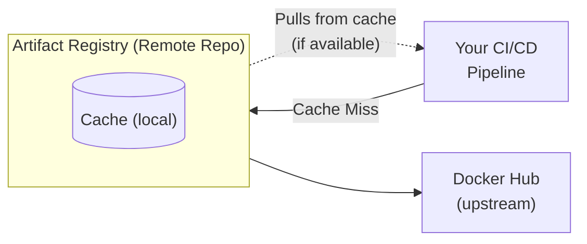

**Complexity**: [MEDIUM] | **Time to Complete**: 1h | **Prerequisites**: Module 2.1 (IAM & Resource Hierarchy)

## What You'll Be Able to Do

After completing this module, you will be able to:

- **Configure Artifact Registry repositories for container images, language packages, and OS packages**
- **Implement vulnerability scanning policies and understand Binary Authorization integration**
- **Configure remote and virtual repositories for upstream caching and package aggregation**
- **Secure Artifact Registry with IAM policies scoped to specific repositories**

---

## Why This Module Matters

In November 2021, the `ua-parser-js` npm package---downloaded over 7 million times per week---was compromised. An attacker gained access to the maintainer's npm account and published three malicious versions that installed cryptocurrency miners on Linux and Windows systems, and also stole passwords from infected machines. Any CI/CD pipeline that ran `npm install` during the window when the malicious versions were available pulled compromised code directly into production builds. Companies that pulled packages directly from the public npm registry had no defense. Companies that used a private registry with upstream caching had a critical advantage: in many cases, the malicious versions were not cached because their pipelines pulled the cached (clean) versions already stored in the private registry.

This incident represents a growing threat: **supply chain attacks targeting public package registries**. Whether you are pulling container images from Docker Hub, npm packages from the npm registry, or Python packages from PyPI, you are trusting code written by strangers. Artifact Registry is GCP's managed solution for storing, managing, and securing software artifacts. It replaces the older Container Registry (GCR) and extends beyond Docker images to support npm, Maven, Python, Go, and OS packages.

In this module, you will learn how to create Artifact Registry repositories, push and pull container images, configure vulnerability scanning, set up IAM-based access control, and use remote repositories as upstream caches for public registries.

---

## Artifact Registry vs Container Registry

Container Registry (GCR) was GCP's original image registry, built on top of Cloud Storage buckets. Artifact Registry is its successor with significant improvements:

| Feature | Container Registry (GCR) | Artifact Registry |
| :--- | :--- | :--- |
| **Formats** | Docker images only | Docker, npm, Maven, Python, Go, Apt, Yum, KubeFlow |
| **Repository granularity** | One registry per region, per project | Multiple named repositories per project |
| **IAM granularity** | Per-image is complex (bucket-level ACLs) | Per-repository IAM policies |
| **Vulnerability scanning** | Basic (Container Analysis) | Integrated, automatic, on-push scanning |
| **Remote repositories** | Not supported | Upstream caching for Docker Hub, npm, Maven, PyPI |
| **Virtual repositories** | Not supported | Aggregate multiple repos behind a single endpoint |
| **Cleanup policies** | Manual scripting | Built-in tag and version cleanup policies |
| **Status** | Deprecated (sunset planned) | Active development, recommended |

```bash
# Enable the Artifact Registry API
gcloud services enable artifactregistry.googleapis.com

# If you are still using GCR, migrate with:
gcloud artifacts docker upgrade migrate --projects=my-project
```

---

## Creating Repositories

### Docker Repository

```bash
# Create a Docker repository
gcloud artifacts repositories create docker-repo \
  --repository-format=docker \
  --location=us-central1 \
  --description="Production Docker images" \
  --immutable-tags

# The --immutable-tags flag prevents overwriting existing tags.
# Once you push myapp:v1.0, nobody can push a different image with the same tag.
# This is critical for reproducibility and security.

# List repositories
gcloud artifacts repositories list --location=us-central1

# Describe a repository
gcloud artifacts repositories describe docker-repo \
  --location=us-central1
```

### Multi-Format Repositories

```bash
# Create npm repository
gcloud artifacts repositories create npm-repo \
  --repository-format=npm \
  --location=us-central1 \
  --description="Internal npm packages"

# Create Python (PyPI) repository
gcloud artifacts repositories create python-repo \
  --repository-format=python \
  --location=us-central1 \
  --description="Internal Python packages"

# Create Maven repository
gcloud artifacts repositories create maven-repo \
  --repository-format=maven \
  --location=us-central1 \
  --description="Internal Java artifacts"

# Create Apt repository (for Debian/Ubuntu packages)
gcloud artifacts repositories create apt-repo \
  --repository-format=apt \
  --location=us-central1 \
  --description="Internal Debian packages"
```

---

## Working with Container Images

### Authentication

```bash
# Configure Docker to authenticate with Artifact Registry
gcloud auth configure-docker us-central1-docker.pkg.dev --quiet

# This adds a credential helper to your Docker config (~/.docker/config.json)
# For other regions, specify them:
gcloud auth configure-docker us-central1-docker.pkg.dev,europe-west1-docker.pkg.dev
```

### Building, Tagging, and Pushing

```bash
# Image URL format:
# REGION-docker.pkg.dev/PROJECT_ID/REPOSITORY/IMAGE:TAG

export PROJECT_ID=$(gcloud config get-value project)
export REGION=us-central1
export REPO=docker-repo

# Build an image locally
docker build -t my-api:v1.2.0 .

# Tag it for Artifact Registry
docker tag my-api:v1.2.0 \
  ${REGION}-docker.pkg.dev/${PROJECT_ID}/${REPO}/my-api:v1.2.0

# Push to Artifact Registry
docker push ${REGION}-docker.pkg.dev/${PROJECT_ID}/${REPO}/my-api:v1.2.0

# Also tag as latest
docker tag my-api:v1.2.0 \
  ${REGION}-docker.pkg.dev/${PROJECT_ID}/${REPO}/my-api:latest
docker push ${REGION}-docker.pkg.dev/${PROJECT_ID}/${REPO}/my-api:latest

# List images in the repository
gcloud artifacts docker images list \
  ${REGION}-docker.pkg.dev/${PROJECT_ID}/${REPO}

# List tags for a specific image
gcloud artifacts docker tags list \
  ${REGION}-docker.pkg.dev/${PROJECT_ID}/${REPO}/my-api

# Delete an image by digest
gcloud artifacts docker images delete \
  ${REGION}-docker.pkg.dev/${PROJECT_ID}/${REPO}/my-api@sha256:abc123... \
  --quiet
```

### Pulling Images

```bash
# Pull from Artifact Registry
docker pull ${REGION}-docker.pkg.dev/${PROJECT_ID}/${REPO}/my-api:v1.2.0

# Use in Kubernetes deployment
cat <<'YAML'
apiVersion: apps/v1
kind: Deployment
metadata:
  name: my-api
spec:
  replicas: 3
  selector:
    matchLabels:
      app: my-api
  template:
    metadata:
      labels:
        app: my-api
    spec:
      containers:
        - name: my-api
          image: us-central1-docker.pkg.dev/my-project/docker-repo/my-api:v1.2.0
          ports:
            - containerPort: 8080
YAML
```

---

## Vulnerability Scanning

Artifact Registry integrates with Container Analysis (also called Artifact Analysis) to automatically scan images for known vulnerabilities.

### Enabling and Configuring Scanning

```bash
# Enable the Container Analysis API
gcloud services enable containeranalysis.googleapis.com

# Enable automatic scanning on a repository
gcloud artifacts repositories update docker-repo \
  --location=us-central1 \
  --enable-vulnerability-scanning

# Scanning happens automatically when you push an image.
# You can also trigger an on-demand scan:
gcloud artifacts docker images scan \
  ${REGION}-docker.pkg.dev/${PROJECT_ID}/${REPO}/my-api:v1.2.0 \
  --location=us-central1
```

### Viewing Scan Results

```bash
# List vulnerabilities for a specific image
gcloud artifacts docker images list \
  ${REGION}-docker.pkg.dev/${PROJECT_ID}/${REPO} \
  --show-occurrences \
  --format="table(package, version, createTime, updateTime)"

# Get detailed vulnerability report
gcloud artifacts vulnerabilities list \
  ${REGION}-docker.pkg.dev/${PROJECT_ID}/${REPO}/my-api:v1.2.0 \
  --format="table(vulnerability.shortDescription, vulnerability.cvssScore, vulnerability.severity, vulnerability.packageIssue[0].affectedPackage)"
```

### Severity Levels

| Severity | CVSS Score | Action |
| :--- | :--- | :--- |
| **CRITICAL** | 9.0 - 10.0 | Block deployment, fix immediately |
| **HIGH** | 7.0 - 8.9 | Fix before next release |
| **MEDIUM** | 4.0 - 6.9 | Fix within sprint |
| **LOW** | 0.1 - 3.9 | Track and fix at convenience |
| **MINIMAL** | 0.0 | Informational |

> **Stop and think**: If vulnerability scanning is automatic, what prevents a developer from deploying an image that was scanned but found to have CRITICAL vulnerabilities?

### Binary Authorization Integration

For production environments, you can enforce that only scanned and approved images are deployed to GKE.

```bash
# Enable Binary Authorization
gcloud services enable binaryauthorization.googleapis.com

# The full Binary Authorization setup is beyond this module,
# but the key concept is:
# 1. Images are pushed to Artifact Registry
# 2. Vulnerability scanning runs automatically
# 3. An attestor signs images that pass the scan
# 4. GKE clusters only run images with valid attestations
```

---

## IAM Access Control

Artifact Registry supports fine-grained IAM at the repository level.

### Common Roles

| Role | Permissions | Typical User |
| :--- | :--- | :--- |
| `roles/artifactregistry.reader` | Pull images, list repos | GKE nodes, Cloud Run, developers |
| `roles/artifactregistry.writer` | Pull + push images | CI/CD pipelines |
| `roles/artifactregistry.repoAdmin` | Full control over a repo | Platform engineers |
| `roles/artifactregistry.admin` | Full control over all repos | Registry administrators |

```bash
# Grant a CI/CD service account push access to a specific repository
gcloud artifacts repositories add-iam-policy-binding docker-repo \
  --location=us-central1 \
  --member="serviceAccount:ci-pipeline@my-project.iam.gserviceaccount.com" \
  --role="roles/artifactregistry.writer"

# Grant GKE node service account read access
gcloud artifacts repositories add-iam-policy-binding docker-repo \
  --location=us-central1 \
  --member="serviceAccount:gke-nodes@my-project.iam.gserviceaccount.com" \
  --role="roles/artifactregistry.reader"

# Grant a developer group read access (for pulling images locally)
gcloud artifacts repositories add-iam-policy-binding docker-repo \
  --location=us-central1 \
  --member="group:developers@example.com" \
  --role="roles/artifactregistry.reader"

# View repository IAM policy
gcloud artifacts repositories get-iam-policy docker-repo \
  --location=us-central1
```

---

## Remote Repositories: Upstream Caching

Remote repositories act as caching proxies for public registries. When you pull an image through a remote repository, it is cached locally in Artifact Registry. Subsequent pulls come from your cache, improving speed and protecting against upstream outages or supply chain attacks.



> **Pause and predict**: If a public registry goes down for maintenance, what happens to a CI/CD pipeline that pulls images through an Artifact Registry remote repository?

```bash
# Create a remote repository that caches Docker Hub
gcloud artifacts repositories create dockerhub-cache \
  --repository-format=docker \
  --location=us-central1 \
  --description="Docker Hub upstream cache" \
  --mode=remote-repository \
  --remote-repo-config-desc="Docker Hub" \
  --remote-docker-repo=DOCKER-HUB

# Create a remote repository for npm
gcloud artifacts repositories create npm-cache \
  --repository-format=npm \
  --location=us-central1 \
  --description="npm registry upstream cache" \
  --mode=remote-repository \
  --remote-repo-config-desc="npm Registry" \
  --remote-npm-repo=NPMJS

# Create a remote repository for PyPI
gcloud artifacts repositories create pypi-cache \
  --repository-format=python \
  --location=us-central1 \
  --description="PyPI upstream cache" \
  --mode=remote-repository \
  --remote-repo-config-desc="PyPI" \
  --remote-python-repo=PYPI

# Pull an image through the remote repository
# Note: Docker Hub official images require the 'library/' namespace prefix
docker pull us-central1-docker.pkg.dev/${PROJECT_ID}/dockerhub-cache/library/nginx:1.25

# Subsequent pulls of the same image come from your local cache
```

### Virtual Repositories

Virtual repositories provide a single endpoint that aggregates multiple upstream repositories (both standard and remote).

```bash
# Create a virtual repository that combines your internal repo and Docker Hub cache
gcloud artifacts repositories create docker-virtual \
  --repository-format=docker \
  --location=us-central1 \
  --description="Virtual Docker repository" \
  --mode=virtual-repository \
  --upstream-policy-file=upstream-policy.json
```

```json
[
  {
    "id": "internal",
    "repository": "projects/my-project/locations/us-central1/repositories/docker-repo",
    "priority": 100
  },
  {
    "id": "dockerhub",
    "repository": "projects/my-project/locations/us-central1/repositories/dockerhub-cache",
    "priority": 200
  }
]
```

With this configuration, pulls from the virtual repository first check your internal repo (priority 100, checked first), then fall back to the Docker Hub cache (priority 200).

---

## Cleanup Policies

Cleanup policies automatically delete old images to prevent storage cost growth.

```bash
# Create a cleanup policy that deletes untagged images older than 30 days
gcloud artifacts repositories set-cleanup-policies docker-repo \
  --location=us-central1 \
  --policy=cleanup-policy.json
```

```json
[
  {
    "name": "delete-untagged",
    "action": {"type": "Delete"},
    "condition": {
      "tagState": "untagged",
      "olderThan": "2592000s"
    }
  },
  {
    "name": "keep-recent-tagged",
    "action": {"type": "Keep"},
    "condition": {
      "tagState": "tagged",
      "tagPrefixes": ["v"]
    },
    "mostRecentVersions": {
      "keepCount": 10
    }
  }
]
```

---

## Did You Know?

1. **Artifact Registry stores over 10 billion container images** across all GCP customers. It is the same infrastructure that Google uses internally to store the images for Google Cloud services like Cloud Run, GKE, and Cloud Functions.

2. **The `--immutable-tags` flag prevents tag mutation attacks**. Without it, someone with push access can overwrite `myapp:v1.0` with a completely different image. This is a real attack vector---an attacker who compromises a CI/CD pipeline can replace a known-good image tag with a malicious one. Immutable tags guarantee that `v1.0` always refers to the exact same image digest.

3. **Remote repositories save an average of 60-80% on egress costs** for teams that pull heavily from public registries. Instead of every CI/CD run pulling `node:20-slim` from Docker Hub (incurring egress costs and being subject to Docker Hub rate limits), the image is cached locally after the first pull.

4. **Artifact Registry supports multi-architecture images (manifests lists)** out of the box. You can push both `linux/amd64` and `linux/arm64` variants under the same tag, and Docker or Kubernetes will automatically pull the correct architecture for the host platform. This is increasingly important as ARM-based instances (like GCP's Tau T2A) become popular for cost savings.

---

## Common Mistakes

| Mistake | Why It Happens | How to Fix It |
| :--- | :--- | :--- |
| Still using Container Registry (gcr.io) | Old tutorials and existing pipelines reference it | Migrate to Artifact Registry; GCR is deprecated |
| Not enabling vulnerability scanning | Scanning is not enabled by default on all repos | Enable it on every Docker repository |
| Using `latest` tag in production | Convenient during development | Always use specific version tags; enable `--immutable-tags` |
| Granting `artifactregistry.admin` to CI/CD | Shortcut to avoid permission errors | CI/CD only needs `artifactregistry.writer` for push |
| Not setting up cleanup policies | Storage seems cheap initially | Implement cleanup policies; untagged images accumulate fast |
| Pulling public images directly in CI/CD | Works fine until Docker Hub rate-limits you | Set up remote repositories as upstream caches |
| Forgetting to configure Docker auth | `docker push` fails with "denied" | Run `gcloud auth configure-docker REGION-docker.pkg.dev` |
| Not using immutable tags | Default behavior allows tag overwriting | Enable `--immutable-tags` on all production repositories |

---

## Quiz

<details>
<summary>1. Your organization has multiple teams publishing internal npm packages, while also relying heavily on public packages from the npm registry. Developers are complaining that they have to configure multiple registry URLs in their `.npmrc` files, and CI builds occasionally fail due to rate limits on the public npm registry. How can you use Artifact Registry's repository types to solve these issues simultaneously?</summary>

You should create a standard repository for the internal packages and a remote repository configured to cache the public npm registry. Then, you can create a virtual repository that aggregates both the standard and remote repositories behind a single endpoint. This solves the developers' configuration issue because they only need to point their `.npmrc` to the single virtual repository URL. It also solves the CI rate-limiting issue because the remote repository caches the public npm packages locally upon the first pull, serving all subsequent CI requests directly from GCP's internal network without hitting the public registry.
</details>

<details>
<summary>2. A deployment of your `frontend:v2.1` image worked flawlessly in the staging environment yesterday. Today, the exact same deployment YAML (referencing `frontend:v2.1`) was deployed to production, but the application crashed on startup with a missing dependency error. Assuming no environmental differences, what security and reliability risk likely occurred, and how could it have been prevented in Artifact Registry?</summary>

The likely cause is that a developer or a compromised pipeline overwrote the `frontend:v2.1` image tag with a new, defective image digest after the staging deployment. This is a classic tag mutation issue, which poses a severe security and reliability risk because a known-good tag can be silently swapped with malicious or broken code. You could have prevented this by enabling the `--immutable-tags` flag on the production Docker repository. When this flag is enabled, Artifact Registry permanently locks the tag to the original image digest, ensuring that once `v2.1` is pushed, it can never be altered or overwritten.
</details>

<details>
<summary>3. You are configuring a new GKE cluster that will run workloads using container images stored in a private Artifact Registry repository within the same GCP project. You want to follow the principle of least privilege. When configuring IAM for the GKE nodes, which specific role should you grant to the node's service account to ensure it can run the containers without exposing the repository to unnecessary risks?</summary>

You should grant the `roles/artifactregistry.reader` role to the GKE node's service account (or the Workload Identity service account), scoped specifically to the target repository rather than the entire project. This role provides the exact permissions needed to pull and download container images, but explicitly denies the ability to push, overwrite, or delete artifacts. Granting a broader role like `artifactregistry.writer` or `artifactregistry.admin` to a compute node violates the principle of least privilege, as a compromised node could then poison the repository by pushing malicious images. By scoping the reader role only to the necessary repository, you limit the blast radius if the node is ever compromised.
</details>

<details>
<summary>4. A critical zero-day vulnerability is discovered in a popular open-source Python library, and malicious actors have managed to upload a compromised version of the package to PyPI. Your CI/CD pipelines automatically build new container images every night using `pip install`. If your organization uses an Artifact Registry remote repository for PyPI, how does this architecture protect your nightly builds from pulling the compromised package?</summary>

Remote repositories act as a caching proxy, meaning they store a local copy of any package the first time it is pulled from the upstream registry. Because your pipelines have likely pulled the clean, older version of the Python library previously, that clean version is already cached in your Artifact Registry. When the nightly build runs, it pulls the package from the local cache rather than reaching out to PyPI, completely bypassing the newly compromised version. This caching mechanism provides a critical buffer, allowing your security team time to pin the dependency to a known-safe version before the cache is ever invalidated or updated.
</details>

<details>
<summary>5. A new developer joins your team and is trying to push their first Docker image to the company's Artifact Registry repository (`us-central1-docker.pkg.dev/my-project/docker-repo/app:v1`). The developer runs `docker push` but receives a "denied: Permission denied" error. They confirm they are logged into `gcloud` with their corporate account. What are the three most likely configuration issues or missing steps causing this failure?</summary>

The first likely cause is that the developer has not configured Docker to authenticate with Artifact Registry; they must run `gcloud auth configure-docker us-central1-docker.pkg.dev` to inject the credential helper into their Docker configuration. The second common cause is that the developer's identity has not been granted the `roles/artifactregistry.writer` role on that specific repository, leaving them without the necessary permissions to push. Finally, they may be trying to push to a repository that doesn't exist or isn't in the correct region, which Artifact Registry often masks behind a generic permission denied error to prevent information disclosure. Troubleshooting these three areas resolves almost all initial push access issues.
</details>

<details>
<summary>6. Your company uses a virtual repository to consolidate access. It is configured with an internal standard repository at priority 100, and a remote repository caching Docker Hub at priority 200. A developer accidentally names their internal helper script `ubuntu` and publishes it as a container image to the internal repository. When a CI pipeline runs `docker pull <virtual-repo-url>/ubuntu:latest`, what exactly happens and what security benefit does this priority configuration provide?</summary>

When the `docker pull` command is executed, the virtual repository evaluates its upstreams in priority order, starting with the lowest number. It checks the internal standard repository (priority 100) first, finds the internally published `ubuntu:latest` image, and returns it immediately without ever querying the remote repository (priority 200). This priority configuration provides a critical security benefit by preventing dependency confusion attacks. If an attacker publishes a malicious package to a public registry with the exact same name as an internal package, the virtual repository will prioritize and serve the internal version first in the normal case, which helps mitigate this attack.
</details>

---

## Hands-On Exercise: Container Registry with Scanning and Caching

### Objective

Create an Artifact Registry setup with a standard Docker repository, enable vulnerability scanning, and configure an upstream Docker Hub cache.

### Prerequisites

- `gcloud` CLI installed and authenticated
- Docker installed locally
- A GCP project with billing enabled

### Tasks

**Task 1: Create Docker Repositories**

<details>
<summary>Solution</summary>

```bash
export PROJECT_ID=$(gcloud config get-value project)
export REGION=us-central1

# Enable APIs
gcloud services enable artifactregistry.googleapis.com \
  containeranalysis.googleapis.com

# Create a standard Docker repository with immutable tags
gcloud artifacts repositories create app-images \
  --repository-format=docker \
  --location=$REGION \
  --description="Application container images" \
  --immutable-tags

# Create a remote repository caching Docker Hub
gcloud artifacts repositories create dockerhub-mirror \
  --repository-format=docker \
  --location=$REGION \
  --description="Docker Hub cache" \
  --mode=remote-repository \
  --remote-repo-config-desc="Docker Hub" \
  --remote-docker-repo=DOCKER-HUB

# Configure Docker authentication
gcloud auth configure-docker ${REGION}-docker.pkg.dev --quiet

# Verify repositories
gcloud artifacts repositories list --location=$REGION
```
</details>

**Task 2: Build and Push a Container Image**

<details>
<summary>Solution</summary>

```bash
# Create a simple Dockerfile
mkdir -p /tmp/ar-lab && cd /tmp/ar-lab

cat > Dockerfile << 'EOF'
FROM debian:bookworm-slim
RUN apt-get update && apt-get install -y curl && rm -rf /var/lib/apt/lists/*
COPY index.html /var/www/html/
CMD ["python3", "-m", "http.server", "8080", "--directory", "/var/www/html"]
EOF

cat > index.html << 'EOF'
<h1>Artifact Registry Lab</h1>
<p>Image built and pushed successfully.</p>
EOF

# Build the image
docker build -t my-web:v1.0.0 .

# Tag for Artifact Registry
docker tag my-web:v1.0.0 \
  ${REGION}-docker.pkg.dev/${PROJECT_ID}/app-images/my-web:v1.0.0

# Push
docker push ${REGION}-docker.pkg.dev/${PROJECT_ID}/app-images/my-web:v1.0.0

# List images in the repository
gcloud artifacts docker images list \
  ${REGION}-docker.pkg.dev/${PROJECT_ID}/app-images
```
</details>

**Task 3: Check Vulnerability Scan Results**

<details>
<summary>Solution</summary>

```bash
# Wait for the scan to complete (usually takes 1-3 minutes after push)
echo "Waiting for vulnerability scan to complete..."
sleep 60

# List vulnerabilities
gcloud artifacts docker images describe \
  ${REGION}-docker.pkg.dev/${PROJECT_ID}/app-images/my-web:v1.0.0 \
  --show-all-metadata

# If the above does not show vulnerabilities yet, check scan status:
gcloud artifacts docker images list \
  ${REGION}-docker.pkg.dev/${PROJECT_ID}/app-images \
  --include-tags \
  --format="table(package, version, createTime, tags)"
```
</details>

**Task 4: Pull Through the Docker Hub Cache**

<details>
<summary>Solution</summary>

```bash
# Pull nginx through your Docker Hub cache (not directly from Docker Hub)
docker pull ${REGION}-docker.pkg.dev/${PROJECT_ID}/dockerhub-mirror/library/nginx:1.25-alpine

# Verify it was cached
gcloud artifacts docker images list \
  ${REGION}-docker.pkg.dev/${PROJECT_ID}/dockerhub-mirror

# Second pull will be faster (served from cache)
docker pull ${REGION}-docker.pkg.dev/${PROJECT_ID}/dockerhub-mirror/library/nginx:1.25-alpine
```
</details>

**Task 5: Configure Repository IAM**

<details>
<summary>Solution</summary>

```bash
# View current IAM policy
gcloud artifacts repositories get-iam-policy app-images \
  --location=$REGION

# Simulate granting a CI/CD SA write access (create SA first if needed)
gcloud iam service-accounts create ci-pipeline \
  --display-name="CI Pipeline SA" 2>/dev/null || true

gcloud artifacts repositories add-iam-policy-binding app-images \
  --location=$REGION \
  --member="serviceAccount:ci-pipeline@${PROJECT_ID}.iam.gserviceaccount.com" \
  --role="roles/artifactregistry.writer"

# Verify
gcloud artifacts repositories get-iam-policy app-images \
  --location=$REGION \
  --format="table(bindings.role, bindings.members)"
```
</details>

**Task 6: Clean Up**

<details>
<summary>Solution</summary>

```bash
# Delete images
gcloud artifacts docker images delete \
  ${REGION}-docker.pkg.dev/${PROJECT_ID}/app-images/my-web:v1.0.0 \
  --quiet --delete-tags 2>/dev/null || true

# Delete repositories
gcloud artifacts repositories delete app-images \
  --location=$REGION --quiet
gcloud artifacts repositories delete dockerhub-mirror \
  --location=$REGION --quiet

# Delete service account
gcloud iam service-accounts delete \
  ci-pipeline@${PROJECT_ID}.iam.gserviceaccount.com --quiet 2>/dev/null || true

# Clean up local files
rm -rf /tmp/ar-lab

echo "Cleanup complete."
```
</details>

### Success Criteria

- [ ] Standard Docker repository created with immutable tags
- [ ] Container image built, tagged, and pushed successfully
- [ ] Vulnerability scan results viewable
- [ ] Docker Hub remote repository (cache) created and functional
- [ ] Repository-level IAM configured for CI/CD service account
- [ ] All resources cleaned up

---

## Next Module

Next up: **[Module 2.7: Cloud Run (Serverless Containers)](../module-2.7-cloud-run/)** --- Deploy stateless containers without managing infrastructure, master revisions and traffic splitting for blue/green deployments, and connect Cloud Run to your VPC for private backend access.

## Sources

- [Artifact Registry Overview](https://cloud.google.com/artifact-registry/docs/overview) — Gives the product-level model for repositories, access control, and integrations.
- [Remote Repository Overview](https://cloud.google.com/artifact-registry/docs/repositories/remote-overview) — Explains how upstream caching works and what guarantees remote repositories do and do not provide.
- [Container Scanning Overview](https://cloud.google.com/artifact-analysis/docs/container-scanning-overview) — Covers automatic scanning, on-demand scanning, and how vulnerability findings are produced for Artifact Registry images.
