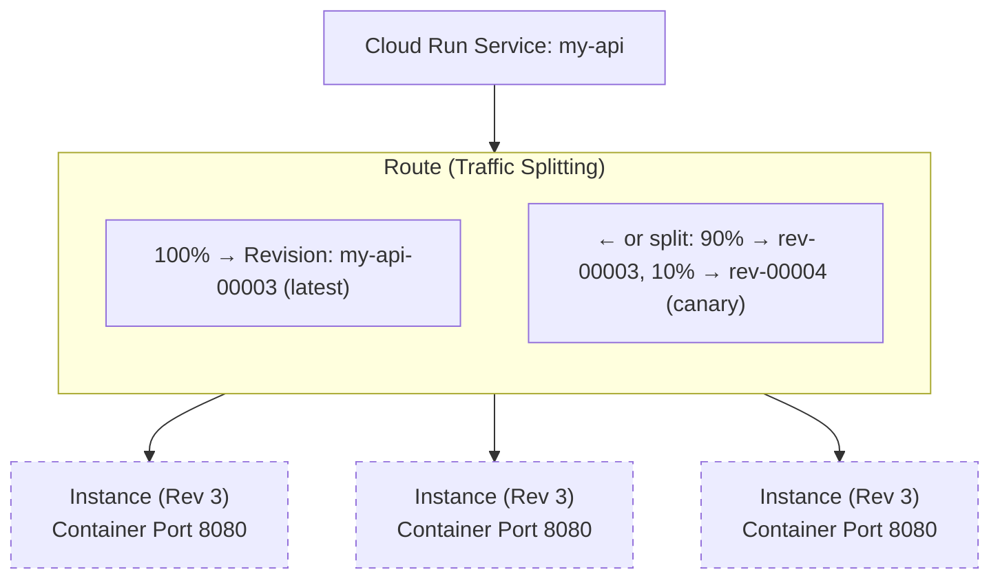
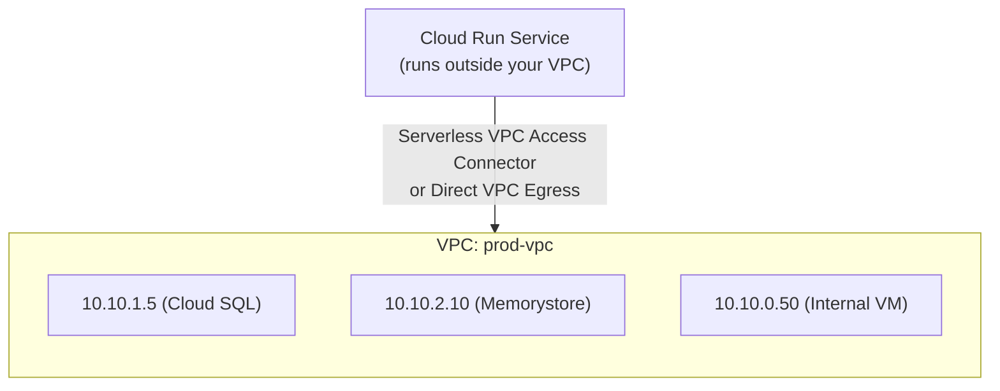

**Complexity**: [COMPLEX] | **Time to Complete**: 2.5h | **Prerequisites**: Module 2.1 (IAM), Module 2.6 (Artifact Registry)

## What You'll Be Able to Do

After completing this module, you will be able to:

- **Deploy containerized applications on Cloud Run with custom domains, autoscaling, and traffic splitting**
- **Configure Cloud Run services with VPC connectors for private network access to databases and internal APIs**
- **Implement canary deployments using Cloud Run traffic revisions and gradual rollout strategies**
- **Evaluate Cloud Run versus GKE for container workloads by comparing cost, cold start, and operational complexity**

---

## Why This Module Matters

In early 2023, a health-tech startup was running their patient-facing API on a Kubernetes cluster managed by a two-person platform team. The cluster required constant maintenance: node upgrades, autoscaler tuning, certificate renewals, and security patching. When one of the two engineers left the company, the remaining engineer was overwhelmed. A routine GKE node pool upgrade went wrong during a weekend, taking down the patient portal for 6 hours. The post-incident review concluded that the team was spending 70% of their engineering time managing infrastructure instead of building product features. They migrated their stateless API services to Cloud Run in three weeks. Their infrastructure management time dropped to near zero, and their monthly compute bill decreased by 40% because Cloud Run scaled to zero during off-peak hours. The service handled a 25x traffic spike during a product launch without any intervention.

This story illustrates Cloud Run's core value proposition: **run containers without managing servers, clusters, or scaling infrastructure**. Cloud Run is built on Knative, the open-source Kubernetes-based serverless platform, but abstracts away all of the Kubernetes complexity. You give it a container image, and it handles everything else---provisioning, scaling, TLS, load balancing, and zero-to-N autoscaling. It scales to zero when there is no traffic (you pay nothing), and it scales up to thousands of instances within seconds when traffic spikes.

In this module, you will learn the Knative concepts that underpin Cloud Run, how to deploy and manage services, how concurrency settings affect performance and cost, how revisions and traffic splitting enable safe deployments, and how to connect Cloud Run to your VPC for accessing private resources.

---

## Knative Concepts: The Foundation

Cloud Run is a managed implementation of Knative Serving. Understanding the Knative model helps you reason about Cloud Run's behavior.



**Service**: The top-level resource. A service has a stable URL, manages multiple revisions, and controls traffic routing.

**Revision**: An immutable snapshot of your service configuration (container image, environment variables, memory, CPU, concurrency). Every deployment creates a new revision. Old revisions are kept and can receive traffic.

**Instance**: A running container. Cloud Run autoscales the number of instances per revision based on incoming requests.

---

## Deploying Your First Service

### Basic Deployment

```bash
# Deploy directly from a container image
gcloud run deploy my-api \
  --image=us-central1-docker.pkg.dev/my-project/docker-repo/my-api:v1.0.0 \
  --region=us-central1 \
  --allow-unauthenticated \
  --port=8080 \
  --memory=512Mi \
  --cpu=1 \
  --min-instances=0 \
  --max-instances=100

# The output will include the service URL:
# Service URL: https://my-api-abc123-uc.a.run.app
```

### Deploying from Source (Cloud Build Integration)

Cloud Run can build and deploy directly from source code.

```bash
# Deploy from source (builds using Cloud Build, then deploys)
gcloud run deploy my-api \
  --source=. \
  --region=us-central1

# This uses buildpacks by default. For a Dockerfile:
gcloud run deploy my-api \
  --source=. \
  --region=us-central1 \
  --dockerfile=Dockerfile
```

### Service Configuration Options

| Setting | Flag | Default | Notes |
| :--- | :--- | :--- | :--- |
| **Memory** | `--memory` | 512 Mi | 128Mi to 32Gi |
| **CPU** | `--cpu` | 1 | 1, 2, 4, 6, or 8 |
| **Port** | `--port` | 8080 | Container must listen on this port |
| **Min instances** | `--min-instances` | 0 | Set > 0 to avoid cold starts |
| **Max instances** | `--max-instances` | 100 | Up to 1000 |
| **Timeout** | `--timeout` | 300s | Up to 3600s (1 hour) |
| **Concurrency** | `--concurrency` | 80 | Requests per instance (1 to 1000) |
| **CPU allocation** | `--cpu-throttling` | yes | See "Always-on CPU" below |
| **Execution environment** | `--execution-environment` | gen1 | gen1 (gVisor) or gen2 (full Linux) |

```bash
# Update service configuration
gcloud run services update my-api \
  --region=us-central1 \
  --memory=1Gi \
  --cpu=2 \
  --min-instances=2 \
  --max-instances=200 \
  --concurrency=100 \
  --timeout=60

# Set environment variables
gcloud run services update my-api \
  --region=us-central1 \
  --set-env-vars="DATABASE_URL=postgres://db:5432/mydb,LOG_LEVEL=info"

# Mount secrets from Secret Manager
gcloud run services update my-api \
  --region=us-central1 \
  --set-secrets="DB_PASSWORD=db-password:latest"
```

### Custom Domains

By default, Cloud Run provides a stable `*.a.run.app` URL for your service with a managed TLS certificate. For production workloads, you will likely want to map a custom domain (e.g., `api.example.com`).

You can configure a custom domain in two main ways:
1. **Global External Application Load Balancer**: The recommended approach for production. You place a Google Cloud Load Balancer in front of Cloud Run, which gives you a static Anycast IP, integration with Cloud Armor (WAF), and custom domains with Google-managed certificates.
2. **Cloud Run Domain Mappings**: A simpler, built-in feature where you map a verified domain directly to the service. Cloud Run provisions the TLS certificate automatically. Note: This feature has limited availability in some regions and does not support Cloud Armor.

```bash
# Map a custom domain directly to a Cloud Run service
gcloud beta run domain-mappings create \
  --service=my-api \
  --domain=api.example.com \
  --region=us-central1
```

---

## Concurrency: The Key to Cost Optimization

Concurrency is the number of simultaneous requests a single instance can handle. This is Cloud Run's most important performance and cost setting, and it is frequently misconfigured.

```text
  Concurrency = 1 (like Lambda)          Concurrency = 80 (default)
  ─────────────────────────               ─────────────────────────

  Request 1 → Instance 1                 Request 1  ┐
  Request 2 → Instance 2                 Request 2  ├─→ Instance 1 (handles all 80)
  Request 3 → Instance 3                 ...        │
  Request 4 → Instance 4                 Request 80 ┘
                                          Request 81 → Instance 2 (new instance)
  4 requests = 4 instances               81 requests = 2 instances
  $$$$ (expensive)                        $ (cheap)
```

### Choosing the Right Concurrency

| Concurrency | When to Use | Example |
| :--- | :--- | :--- |
| **1** | CPU-intensive, no shared state | Image processing, ML inference |
| **10-20** | I/O-heavy with connection pooling limits | API with database pool of 10 connections |
| **80** (default) | General web applications | REST APIs, web servers |
| **250-1000** | Lightweight, stateless proxies | API gateways, static file servers |

```bash
# Set concurrency
gcloud run services update my-api \
  --region=us-central1 \
  --concurrency=80
```

**War Story**: A team set their Cloud Run concurrency to 1 because they assumed it worked "like Lambda." Their API received 500 requests per second, which meant Cloud Run spun up 500 instances. Their monthly bill jumped from $200 to $12,000. Setting concurrency to 80 reduced the required instances from 500 to 7, and the bill dropped back to $250.

> **Stop and think**: If your Node.js application is heavily CPU-bound (e.g., synchronously resizing large images on the main thread) and you leave the concurrency at the default of 80, what will happen when 50 requests arrive simultaneously? Since Node.js is single-threaded, the requests will be queued inside the single instance, leading to massive latency spikes and likely timeouts for the user. In this scenario, lowering concurrency to 1 or 2 is critical for performance.

---

## CPU Allocation: Throttled vs Always-On

By default, Cloud Run only allocates CPU during request processing ("CPU throttled" mode). Between requests, the CPU is taken away. This is a cost optimization but causes issues for background work.

| Mode | CPU Between Requests | Billing | Use Case |
| :--- | :--- | :--- | :--- |
| **Throttled** (default) | CPU removed | Per-request | Standard request/response APIs |
| **Always-on** | CPU available | Per-instance-second | Background tasks, WebSockets, connection pools |

```bash
# Enable always-on CPU (CPU is not throttled between requests)
gcloud run services update my-api \
  --region=us-central1 \
  --no-cpu-throttling

# Revert to throttled (default)
gcloud run services update my-api \
  --region=us-central1 \
  --cpu-throttling
```

You need always-on CPU if your application:
- Runs background threads or timers
- Maintains WebSocket connections
- Pre-warms caches or connection pools
- Performs async processing after sending the response

> **Pause and predict**: You deployed a microservice to Cloud Run that receives an HTTP request, immediately returns a `202 Accepted` response, and then spawns a background goroutine to process the data over the next 10 seconds. In production, you notice that the background processing rarely finishes, or only finishes sporadically when new requests come in. Why? Because the CPU is throttled immediately after the `202` response is sent. The background thread is effectively frozen until a new request arrives and wakes the CPU up again. You must enable `--no-cpu-throttling`.

---

## Revisions and Traffic Splitting

Every deployment creates a new revision. Cloud Run keeps all revisions and lets you split traffic between them.

### Deploying a New Revision

```bash
# Deploy a new version (creates a new revision)
gcloud run deploy my-api \
  --image=us-central1-docker.pkg.dev/my-project/docker-repo/my-api:v2.0.0 \
  --region=us-central1

# By default, 100% of traffic goes to the latest revision.

# Deploy without sending traffic (for testing)
gcloud run deploy my-api \
  --image=us-central1-docker.pkg.dev/my-project/docker-repo/my-api:v2.0.0 \
  --region=us-central1 \
  --no-traffic \
  --tag=canary

# This creates a unique URL for the revision:
# https://canary---my-api-abc123-uc.a.run.app
```

### Traffic Splitting for Blue/Green and Canary

```bash
# List all revisions
gcloud run revisions list --service=my-api --region=us-central1

# Canary: Send 10% of traffic to the new revision
gcloud run services update-traffic my-api \
  --region=us-central1 \
  --to-revisions=my-api-00001=90,my-api-00002=10

# Gradual rollout: 50/50
gcloud run services update-traffic my-api \
  --region=us-central1 \
  --to-revisions=my-api-00001=50,my-api-00002=50

# Full cutover: 100% to new revision
gcloud run services update-traffic my-api \
  --region=us-central1 \
  --to-latest

# Instant rollback: send all traffic back to old revision
gcloud run services update-traffic my-api \
  --region=us-central1 \
  --to-revisions=my-api-00001=100

# View current traffic distribution
gcloud run services describe my-api \
  --region=us-central1 \
  --format="yaml(status.traffic)"
```

### Revision Tags for Testing

```bash
# Tag a specific revision for direct access
gcloud run services update-traffic my-api \
  --region=us-central1 \
  --set-tags=blue=my-api-00001,green=my-api-00002

# Access tagged revisions directly:
# https://blue---my-api-abc123-uc.a.run.app
# https://green---my-api-abc123-uc.a.run.app

# Remove a tag
gcloud run services update-traffic my-api \
  --region=us-central1 \
  --remove-tags=green
```

---

## Authentication and Authorization

### Public vs Authenticated Services

```bash
# Public service (anyone can invoke)
gcloud run deploy my-api \
  --allow-unauthenticated

# Authenticated service (requires IAM permission to invoke)
gcloud run deploy my-api \
  --no-allow-unauthenticated

# Grant invoke permission to specific users/SAs
gcloud run services add-iam-policy-binding my-api \
  --region=us-central1 \
  --member="serviceAccount:invoker@my-project.iam.gserviceaccount.com" \
  --role="roles/run.invoker"

# Grant invoke to a group
gcloud run services add-iam-policy-binding my-api \
  --region=us-central1 \
  --member="group:api-consumers@example.com" \
  --role="roles/run.invoker"
```

### Invoking Authenticated Services

```bash
# From gcloud (uses your identity)
curl -H "Authorization: Bearer $(gcloud auth print-identity-token)" \
  https://my-api-abc123-uc.a.run.app/

# Service-to-service (automatic with proper SA configuration)
# Cloud Run automatically fetches an ID token for the runtime SA
# when making requests to other Cloud Run services.

# From code (Python example)
# import google.auth.transport.requests
# import google.oauth2.id_token
# audience = "https://my-api-abc123-uc.a.run.app"
# request = google.auth.transport.requests.Request()
# token = google.oauth2.id_token.fetch_id_token(request, audience)
# headers = {"Authorization": f"Bearer {token}"}
```

### Service Identity

Every Cloud Run service runs as a service account. This determines what GCP resources the service can access.

```bash
# Deploy with a specific service account
gcloud run deploy my-api \
  --image=us-central1-docker.pkg.dev/my-project/docker-repo/my-api:v1.0.0 \
  --region=us-central1 \
  --service-account=my-api-sa@my-project.iam.gserviceaccount.com

# Never use the default Compute Engine service account.
# Always create a dedicated SA with minimal permissions.
```

---

## Serverless VPC Access: Connecting to Private Resources

By default, Cloud Run services can only access the public internet. To reach private resources (Cloud SQL, Memorystore, internal VMs), you need Serverless VPC Access.



### Option 1: VPC Access Connector (Legacy)

```bash
# Create a VPC Access connector
gcloud compute networks vpc-access connectors create my-connector \
  --region=us-central1 \
  --network=prod-vpc \
  --range=10.8.0.0/28 \
  --min-instances=2 \
  --max-instances=10

# Deploy Cloud Run with the connector
gcloud run deploy my-api \
  --image=us-central1-docker.pkg.dev/my-project/docker-repo/my-api:v1.0.0 \
  --region=us-central1 \
  --vpc-connector=my-connector \
  --vpc-egress=private-ranges-only

# vpc-egress options:
# private-ranges-only - Only private IP traffic goes through VPC (default)
# all-traffic         - ALL traffic goes through VPC (including public)
```

### Option 2: Direct VPC Egress (Recommended)

Direct VPC Egress connects Cloud Run directly to your VPC subnet without needing a separate connector resource.

```bash
# Deploy with Direct VPC Egress
gcloud run deploy my-api \
  --image=us-central1-docker.pkg.dev/my-project/docker-repo/my-api:v1.0.0 \
  --region=us-central1 \
  --network=prod-vpc \
  --subnet=app-subnet \
  --vpc-egress=private-ranges-only
```

| Feature | VPC Access Connector | Direct VPC Egress |
| :--- | :--- | :--- |
| **Setup** | Separate resource to create | Configured per service |
| **Cost** | Connector instances cost money | No additional cost |
| **Throughput** | Limited by connector size | Higher throughput |
| **IP range** | Requires a /28 subnet | Uses existing subnet |
| **Recommended** | Legacy deployments | All new deployments |

---

## Evaluating Cloud Run vs. GKE

When designing your architecture on GCP, you must choose where to run your containers. While Google Kubernetes Engine (GKE) is the industry standard for orchestration, Cloud Run has become the default recommendation for most web applications and microservices. Understanding the trade-offs is crucial.

| Feature | Cloud Run | Google Kubernetes Engine (GKE) |
| :--- | :--- | :--- |
| **Operational Complexity** | Very Low. No clusters, nodes, or control plane to manage. You only manage the container and service config. | High. Requires expertise in Kubernetes manifests, node pools, cluster upgrades, and networking (Ingress, Services). |
| **Cost Model** | Pay-per-use. Scales to zero. You only pay for CPU/Memory while processing requests (unless always-on is enabled). | Pay-for-allocation. You pay for the underlying VMs (nodes) regardless of whether your containers are actively receiving traffic. |
| **Cold Starts** | Occur when scaling from zero or during rapid scale-up. Can add 1-3 seconds of latency to the first request. | Rare. Containers are kept running on the nodes, so traffic hits pre-warmed pods immediately. |
| **Infrastructure Control** | Limited. You cannot access the underlying host, run privileged containers, or use custom DaemonSets. | Full. You have complete control over the cluster, nodes, networking plugins, and can run any Kubernetes-native software. |
| **Best For** | Stateless web apps, REST/gRPC APIs, event-driven workers, and startups wanting to minimize DevOps overhead. | Complex microservice architectures, stateful workloads, legacy apps requiring custom networking, and large enterprise platforms. |

> **Stop and think**: If your team is migrating a legacy monolithic application that takes 45 seconds to start up and relies on a local disk for temporary caching, which platform should you choose? GKE is the better choice. Cloud Run's cold starts would be disastrous with a 45-second startup time, and its ephemeral filesystem is not suited for heavy local disk caching.

---

## Cloud Run Jobs

Cloud Run Jobs are for tasks that run to completion (batch processing, data migration, scheduled tasks) rather than serving HTTP requests.

```bash
# Create a job
gcloud run jobs create data-processor \
  --image=us-central1-docker.pkg.dev/my-project/docker-repo/processor:v1.0.0 \
  --region=us-central1 \
  --task-count=10 \
  --parallelism=5 \
  --max-retries=3 \
  --task-timeout=600 \
  --memory=2Gi \
  --cpu=2

# Execute the job
gcloud run jobs execute data-processor --region=us-central1

# Execute with environment variable overrides
gcloud run jobs execute data-processor \
  --region=us-central1 \
  --update-env-vars="BATCH_DATE=2024-01-15"

# List job executions
gcloud run jobs executions list --job=data-processor --region=us-central1

# Schedule a job (using Cloud Scheduler)
gcloud scheduler jobs create http daily-processor \
  --location=us-central1 \
  --schedule="0 2 * * *" \
  --uri="https://us-central1-run.googleapis.com/apis/run.googleapis.com/v1/namespaces/my-project/jobs/data-processor:run" \
  --http-method=POST \
  --oauth-service-account-email=scheduler@my-project.iam.gserviceaccount.com
```

---

## Did You Know?

1. **Cloud Run can scale from zero to 1,000 instances in under 10 seconds**. Google achieves this by pre-warming infrastructure pools. Your container image is pulled and cached at the edge, so cold starts are typically 300ms to 2 seconds for most container sizes. Setting `--min-instances=1` eliminates cold starts entirely for latency-sensitive APIs.

2. **Cloud Run's second-generation execution environment (gen2) runs a full Linux kernel** instead of the gVisor sandbox used in gen1. This means gen2 supports `mmap`, full filesystem operations, and native system calls that some applications require (like FFmpeg, ImageMagick, or applications that use `/dev/shm`). If your container works locally but fails on Cloud Run, try switching to gen2.

3. **Cloud Run supports WebSockets and HTTP/2 streaming** with always-on CPU. This makes it suitable for real-time applications that previously required dedicated server infrastructure. A single Cloud Run instance can maintain hundreds of concurrent WebSocket connections.

4. **Google runs over 8 billion container instances per week** across their serverless platforms (Cloud Run, Cloud Functions gen2). Cloud Run services collectively handle over 3 million requests per second at peak. The same infrastructure that runs Google's own services (like Google Maps APIs) powers Cloud Run.

---

## Common Mistakes

| Mistake | Why It Happens | How to Fix It |
| :--- | :--- | :--- |
| Setting concurrency to 1 | Assuming it works like Lambda | Most web apps handle 80+ concurrent requests; only use 1 for CPU-heavy tasks |
| Using the default service account | It is automatic and works | Create a dedicated service account with minimal permissions per service |
| Not setting `--min-instances` for production | Cost optimization (scale to zero) | Set min-instances=2+ for latency-sensitive services to avoid cold starts |
| Ignoring the 512Mi memory default | Works for small apps | Profile your app; many need 1Gi+ especially with connection pools or caches |
| Not using Direct VPC Egress | VPC connectors are shown in older docs | Use Direct VPC Egress for all new services; it is cheaper and simpler |
| Deploying with `--allow-unauthenticated` on internal APIs | Quick testing that becomes permanent | Internal APIs should use `--no-allow-unauthenticated` with `roles/run.invoker` |
| Not using revision tags for testing | Deploying directly to production traffic | Deploy with `--no-traffic --tag=canary` first, test, then shift traffic |
| Forgetting that CPU is throttled between requests | Default behavior is not obvious | Enable `--no-cpu-throttling` for services that do background work |

---

## Quiz

<details>
<summary>1. A developer deploys a new version of their API to Cloud Run, but users immediately report critical errors. The developer needs to restore the previous version instantly. How should they accomplish this using Cloud Run's architecture?</summary>

The developer should update the service traffic configuration to route 100% of incoming requests back to the previous revision ID. Cloud Run treats every deployment as an immutable snapshot called a revision, which is never deleted automatically when a new deployment occurs. By using a command like `gcloud run services update-traffic`, the developer shifts the routing rules at the load balancer level, resulting in an instant rollback without needing to rebuild or redeploy the older container image.
</details>

<details>
<summary>2. You have a Python API running on Cloud Run with the default concurrency setting (80). Load testing shows that when 100 simultaneous requests hit the service, 20 of them fail with database connection pool exhaustion errors. The database is configured to allow a maximum of 10 connections per instance. What is the most cost-effective way to fix this?</summary>

You must lower the Cloud Run concurrency setting to 10 to match your application's database connection pool limit. By default, Cloud Run sends up to 80 concurrent requests to a single instance. If your code is configured to only handle 10 simultaneous database connections, the 11th request on that instance will fail to acquire a connection and time out. By aligning the concurrency setting (10) with the connection pool size (10), Cloud Run's autoscaler will automatically spin up a new instance for the 11th request, ensuring stability while remaining cost-effective.
</details>

<details>
<summary>3. Your team deployed a Node.js service to Cloud Run that processes webhooks. The service receives a webhook, immediately sends a `200 OK` HTTP response to the caller, and then attempts to upload the payload to Cloud Storage asynchronously in the background. However, the files are rarely arriving in the storage bucket. What is causing this failure?</summary>

The failure is caused by Cloud Run's default "CPU throttled" mode, which removes CPU allocation from the container immediately after the HTTP response is sent. Because the Node.js application attempts to perform the Cloud Storage upload asynchronously after returning the `200 OK`, the background thread is frozen before it can complete the network transfer. To resolve this, you must configure the service to use "Always-on CPU" (`--no-cpu-throttling`), which ensures the CPU remains active and available for background tasks between requests.
</details>

<details>
<summary>4. You want to test a risky new feature in production without affecting all users. You deploy the container to Cloud Run, but you don't want it to receive general traffic immediately. Instead, you want developers to access it via a specific URL for verification before routing 5% of real user traffic to it. How do you implement this?</summary>

First, deploy the new container image using the `--no-traffic` and `--tag=canary` flags. This creates a new revision and generates a dedicated testing URL (e.g., `https://canary---my-api.run.app`) without shifting any production traffic to it. Once the developers verify the feature using the tagged URL, you can safely initiate a canary release by using the `update-traffic` command to route 5% of traffic to the new revision ID and 95% to the existing revision ID. This minimizes risk by isolating the initial deployment and allowing gradual exposure.
</details>

<details>
<summary>5. A newly deployed Cloud Run service needs to execute queries against a private Cloud SQL PostgreSQL database located in your production VPC. Currently, the service logs show connection timeouts when trying to reach the database's internal IP (10.10.1.5). What networking configuration is missing?</summary>

The Cloud Run service requires Serverless VPC Access to route traffic into your private network. Because Cloud Run instances operate outside of your VPC by default, they cannot route packets to private IP addresses like `10.10.1.5`. You must configure the service to use Direct VPC Egress by specifying the target network and subnet in the deployment command (e.g., `--network=prod-vpc --subnet=app-subnet`). This creates the necessary networking bridge, allowing the container to resolve and communicate with the database's private IP.
</details>

<details>
<summary>6. Your company is launching a new stateless microservice. The engineering team is debating whether to deploy it on their existing Google Kubernetes Engine (GKE) cluster or use Cloud Run. The service will experience massive traffic spikes during marketing events but will sit idle overnight. Which platform is the better choice and why?</summary>

Cloud Run is the superior choice for this specific workload because of its pay-per-use cost model and operational simplicity. Cloud Run can automatically scale from zero to thousands of instances in seconds to handle the marketing spikes, and then scale back down to zero overnight, meaning you pay nothing during idle hours. In contrast, GKE requires you to pay for the underlying VMs (nodes) running the cluster 24/7, even when the service is idle, and managing the node autoscaling to handle sudden, massive spikes is significantly more complex and slower.
</details>

---

## Hands-On Exercise: Stateless API with Blue/Green Traffic Splitting

### Objective

Deploy a simple API to Cloud Run, create a second version, and perform a blue/green deployment using traffic splitting.

### Prerequisites

- `gcloud` CLI installed and authenticated
- Docker installed locally (or use `--source` for source-based deployment)
- A GCP project with billing enabled

### Tasks

**Task 1: Create and Deploy the Initial Service (Blue)**

<details>
<summary>Solution</summary>

```bash
export PROJECT_ID=$(gcloud config get-value project)
export REGION=us-central1

# Enable Cloud Run API
gcloud services enable run.googleapis.com

# Create a simple app
mkdir -p /tmp/cloud-run-lab && cd /tmp/cloud-run-lab

cat > main.py << 'PYEOF'
import os
from flask import Flask, jsonify

app = Flask(__name__)
VERSION = os.environ.get("APP_VERSION", "1.0.0")

@app.route("/")
def home():
    return jsonify({
        "version": VERSION,
        "color": "blue",
        "message": f"Hello from version {VERSION}"
    })

@app.route("/health")
def health():
    return jsonify({"status": "healthy", "version": VERSION})

if __name__ == "__main__":
    port = int(os.environ.get("PORT", 8080))
    app.run(host="0.0.0.0", port=port)
PYEOF

cat > requirements.txt << 'EOF'
flask>=3.0.0
gunicorn>=21.2.0
EOF

cat > Dockerfile << 'DEOF'
FROM python:3.12-slim
WORKDIR /app
COPY requirements.txt .
RUN pip install --no-cache-dir -r requirements.txt
COPY main.py .
EXPOSE 8080
CMD ["gunicorn", "--bind", "0.0.0.0:8080", "--workers", "2", "main:app"]
DEOF

# Deploy from source
gcloud run deploy color-api \
  --source=. \
  --region=$REGION \
  --allow-unauthenticated \
  --set-env-vars="APP_VERSION=1.0.0" \
  --memory=256Mi \
  --cpu=1 \
  --min-instances=0 \
  --max-instances=5

# Get the service URL
SERVICE_URL=$(gcloud run services describe color-api \
  --region=$REGION --format="value(status.url)")
echo "Service URL: $SERVICE_URL"

# Test it
curl -s $SERVICE_URL | python3 -m json.tool
```
</details>

**Task 2: Deploy a New Version (Green) Without Traffic**

<details>
<summary>Solution</summary>

```bash
# Modify the app for v2
cat > main.py << 'PYEOF'
import os
from flask import Flask, jsonify

app = Flask(__name__)
VERSION = os.environ.get("APP_VERSION", "2.0.0")

@app.route("/")
def home():
    return jsonify({
        "version": VERSION,
        "color": "green",
        "message": f"Hello from version {VERSION} - new and improved!"
    })

@app.route("/health")
def health():
    return jsonify({"status": "healthy", "version": VERSION})

if __name__ == "__main__":
    port = int(os.environ.get("PORT", 8080))
    app.run(host="0.0.0.0", port=port)
PYEOF

# Deploy without traffic, with a "green" tag
gcloud run deploy color-api \
  --source=. \
  --region=$REGION \
  --set-env-vars="APP_VERSION=2.0.0" \
  --no-traffic \
  --tag=green

# Get the tagged URL for testing
GREEN_URL=$(gcloud run services describe color-api \
  --region=$REGION \
  --format="value(status.traffic[1].url)" 2>/dev/null)
echo "Green URL: $GREEN_URL"

# If the above does not work, construct it manually:
# GREEN_URL="https://green---$(gcloud run services describe color-api --region=$REGION --format='value(status.url)' | sed 's|https://||')"

# Test the green revision directly
curl -s $GREEN_URL | python3 -m json.tool
```
</details>

**Task 3: Canary Deployment (10% to Green)**

<details>
<summary>Solution</summary>

```bash
# List revisions to get their names
gcloud run revisions list --service=color-api --region=$REGION

# Get revision names
BLUE_REV=$(gcloud run revisions list --service=color-api --region=$REGION \
  --format="value(REVISION)" | tail -1)
GREEN_REV=$(gcloud run revisions list --service=color-api --region=$REGION \
  --format="value(REVISION)" | head -1)

echo "Blue: $BLUE_REV, Green: $GREEN_REV"

# Send 10% to green (canary)
gcloud run services update-traffic color-api \
  --region=$REGION \
  --to-revisions=${BLUE_REV}=90,${GREEN_REV}=10

# Verify traffic split
gcloud run services describe color-api \
  --region=$REGION \
  --format="yaml(status.traffic)"

# Test: run 20 requests and count blue vs green
SERVICE_URL=$(gcloud run services describe color-api \
  --region=$REGION --format="value(status.url)")

for i in $(seq 1 20); do
  curl -s $SERVICE_URL | python3 -c "import sys, json; print(json.load(sys.stdin)['color'])"
done | sort | uniq -c
```
</details>

**Task 4: Full Cutover to Green**

<details>
<summary>Solution</summary>

```bash
# Send 100% traffic to the latest (green) revision
gcloud run services update-traffic color-api \
  --region=$REGION \
  --to-latest

# Verify
gcloud run services describe color-api \
  --region=$REGION \
  --format="yaml(status.traffic)"

# Test
curl -s $SERVICE_URL | python3 -m json.tool
# Should always return "green"
```
</details>

**Task 5: Rollback to Blue**

<details>
<summary>Solution</summary>

```bash
# Instant rollback: send all traffic back to the blue revision
gcloud run services update-traffic color-api \
  --region=$REGION \
  --to-revisions=${BLUE_REV}=100

# Verify rollback
curl -s $SERVICE_URL | python3 -m json.tool
# Should return "blue"

# Confirm traffic configuration
gcloud run services describe color-api \
  --region=$REGION \
  --format="yaml(status.traffic)"
```
</details>

**Task 6: Clean Up**

<details>
<summary>Solution</summary>

```bash
# Delete the Cloud Run service (deletes all revisions)
gcloud run services delete color-api --region=$REGION --quiet

# Clean up local files
rm -rf /tmp/cloud-run-lab

echo "Cleanup complete."
```
</details>

### Success Criteria

- [ ] Cloud Run service deployed and accessible via URL
- [ ] Second revision deployed with `--no-traffic` and `--tag=green`
- [ ] Green revision testable via tagged URL
- [ ] Canary deployment with 10% traffic to green revision
- [ ] Full cutover to green with 100% traffic
- [ ] Rollback to blue revision confirmed
- [ ] All resources cleaned up

---

## Next Module

Next up: **[Module 2.8: Cloud Functions & Event-Driven Architecture](../module-2.8-cloud-functions/)** --- Learn the difference between Gen 1 and Gen 2 functions, trigger types (HTTP, Eventarc, Pub/Sub), and how to build event-driven pipelines that react to Cloud Storage uploads and other events.