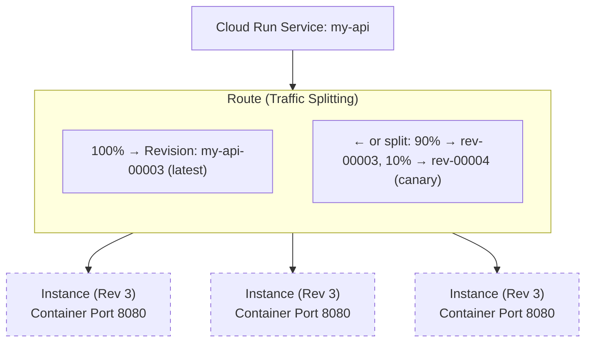

**Complexity**: [COMPLEX] | **Time to Complete**: 2.5h | **Prerequisites**: Module 2.1 (IAM), Module 2.6 (Artifact Registry)

## What You'll Be Able to Do

After completing this module, you will be able to:

- **Deploy containerized applications on Cloud Run with custom domains, autoscaling, and traffic splitting**
- **Configure Cloud Run services with VPC connectors for private network access to databases and internal APIs**
- **Implement canary deployments using Cloud Run traffic revisions and gradual rollout strategies**
- **Evaluate Cloud Run versus GKE for container workloads by comparing cost, cold start, and operational complexity**

---

## Why This Module Matters

In early 2023, a health-tech startup was running their patient-facing API on a Kubernetes cluster managed by a two-person platform team. The cluster required constant maintenance: node upgrades, autoscaler tuning, certificate renewals, and security patching. When one of the two engineers left the company, the remaining engineer was overwhelmed. A routine GKE node pool upgrade went wrong during a weekend, taking down the patient portal for 6 hours. The post-incident review concluded that the team was spending 70% of their engineering time managing infrastructure instead of building product features. They migrated their stateless API services to Cloud Run in three weeks. Their infrastructure management time dropped to near zero, and their monthly compute bill decreased by 40% because Cloud Run scaled to zero during off-peak hours. The service handled a 25x traffic spike during a product launch without any intervention.

This story illustrates Cloud Run's core value proposition: **run containers without managing servers, clusters, or scaling infrastructure**. Cloud Run is built on Knative, the open-source Kubernetes-based serverless platform, but abstracts away all of the Kubernetes complexity. You give it a container image, and it handles everything else---provisioning, scaling, TLS, load balancing, and zero-to-N autoscaling. It scales to zero when there is no traffic (you pay nothing), and it scales up to thousands of instances within seconds when traffic spikes.

In this module, you will learn the Knative concepts that underpin Cloud Run, how to deploy and manage services, how concurrency settings affect performance and cost, how revisions and traffic splitting enable safe deployments, and how to connect Cloud Run to your VPC for accessing private resources.

---

## Knative Concepts: The Foundation

Cloud Run is a managed implementation of Knative Serving. Understanding the Knative model helps you reason about Cloud Run's behavior.



**Service**: The top-level resource. A service has a stable URL, manages multiple revisions, and controls traffic routing.

**Revision**: An immutable snapshot of your service configuration (container image, environment variables, memory, CPU, concurrency). Every deployment creates a new revision. Old revisions are kept and can receive traffic.

**Instance**: A running container. Cloud Run autoscales the number of instances per revision based on incoming requests.

---

## Deploying Your First Service

### Basic Deployment

```bash
# Deploy directly from a container image
gcloud run deploy my-api \
  --image=us-central1-docker.pkg.dev/my-project/docker-repo/my-api:v1.0.0 \
  --region=us-central1 \
  --allow-unauthenticated \
  --port=8080 \
  --memory=512Mi \
  --cpu=1 \
  --min-instances=0 \
  --max-instances=100

# The output will include the service URL:
# Service URL: https://my-api-abc123-uc.a.run.app