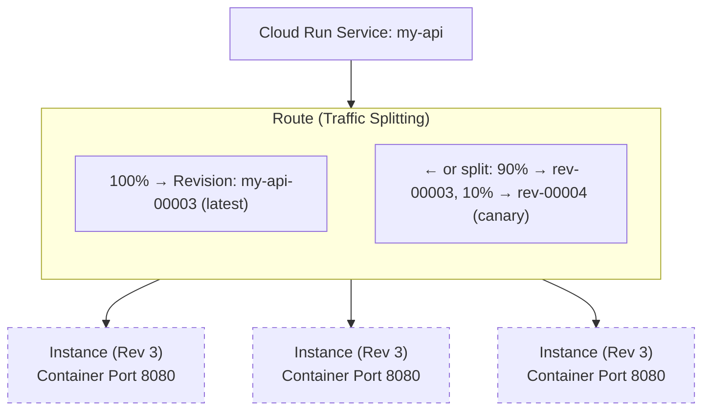

**Complexity**: [COMPLEX] | **Time to Complete**: 2.5h | **Prerequisites**: Module 2.1 (IAM), Module 2.6 (Artifact Registry)

## What You'll Be Able to Do

After completing this module, you will be able to:

- **Deploy containerized applications on Cloud Run with custom domains, autoscaling, and traffic splitting**
- **Configure Cloud Run services with VPC connectors for private network access to databases and internal APIs**
- **Implement canary deployments using Cloud Run traffic revisions and gradual rollout strategies**
- **Evaluate Cloud Run versus GKE for container workloads by comparing cost, cold start, and operational complexity**

---

## Why This Module Matters

In early 2023, a health-tech startup was running their patient-facing API on a Kubernetes cluster managed by a two-person platform team. The cluster required constant maintenance: node upgrades, autoscaler tuning, certificate renewals, and security patching. When one of the two engineers left the company, the remaining engineer was overwhelmed. A routine GKE node pool upgrade went wrong during a weekend, taking down the patient portal for 6 hours. The post-incident review concluded that the team was spending 70% of their engineering time managing infrastructure instead of building product features. They migrated their stateless API services to Cloud Run in three weeks. Their infrastructure management time dropped to near zero, and their monthly compute bill decreased by 40% because Cloud Run scaled to zero during off-peak hours. The service handled a 25x traffic spike during a product launch without any intervention.

This story illustrates Cloud Run's core value proposition: **run containers without managing servers, clusters, or scaling infrastructure**. Cloud Run is built on Knative, the open-source Kubernetes-based serverless platform, but abstracts away all of the Kubernetes complexity. You give it a container image, and it handles everything else---provisioning, scaling, TLS, load balancing, and zero-to-N autoscaling. It scales to zero when there is no traffic (you pay nothing), and it scales up to thousands of instances within seconds when traffic spikes.

In this module, you will learn the Knative concepts that underpin Cloud Run, how to deploy and manage services, how concurrency settings affect performance and cost, how revisions and traffic splitting enable safe deployments, and how to connect Cloud Run to your VPC for accessing private resources.

---

## Knative Concepts: The Foundation

Cloud Run is a managed implementation of Knative Serving. Understanding the Knative model helps you reason about Cloud Run's behavior.



**Service**: The top-level resource. A service has a stable URL, manages multiple revisions, and controls traffic routing.

**Revision**: An immutable snapshot of your service configuration (container image, environment variables, memory, CPU, concurrency). Every deployment creates a new revision. Old revisions are kept and can receive traffic.

**Instance**: A running container. Cloud Run autoscales the number of instances per revision based on incoming requests.

---
<!-- v4:generated type=thin model=gemini turn=1 -->

In the underlying Knative API, a **Configuration** resource acts as the template for the desired state. When you update a Configuration, Knative doesn't modify the existing Revision; it stamps out a new one. This architectural pattern ensures that any given Revision is an immutable artifact. In practice, this immutability is what enables "gradual rollouts" and "instant rollbacks." If a new deployment exhibits a memory leak or latent bug, you are not modifying code in place; you are simply re-pointing the **Route** to a known-good, previous Revision ID, which remains cached and ready to receive traffic.

A critical distinction between Knative-based services and traditional Function-as-a-Service (FaaS) is the concept of **Soft Concurrency**. While standard serverless functions often operate on a strict 1:1 request-to-instance ratio, Cloud Run allows you to tune how many requests a single container instance handles simultaneously (up to 1000). This matters because it allows shared resources—such as memory-resident caches, database connection pools, or TCP sockets—to be reused across multiple concurrent requests within the same process. For I/O-bound applications, high concurrency settings can drastically reduce the number of instances required, lowering both "cold start" frequency and overall billing costs.

The Knative control plane manages the "Scale-to-Zero" lifecycle through an internal component called the **Activator**. When a service has zero running instances, the Activator holds incoming requests in a buffer while signaling the Autoscaler to provision new capacity. This "cold start" period is the trade-off for zero idle costs. To mitigate this in production, practitioners use the `min-instances` setting, which keeps a base layer of "Warm Revisions" active. This ensures that the Knative Route always has a target ready to handle the initial burst of traffic without waiting for the container runtime to initialize.

```yaml
# Example: Knative-style traffic splitting in a Service spec
apiVersion: serving.knative.dev/v1
kind: Service
metadata:
  name: my-api
spec:
  template:
    metadata:
      name: my-api-v2 # New Revision name
  traffic:
  - revisionName: my-api-v1
    percent: 90
  - revisionName: my-api-v2
    percent: 10   # Canary traffic
    tag: preview  # Accessible via preview---my-api-xyz.a.run.app
```

This granular control over the Route object allows for advanced deployment patterns like **Tag-based Routing**. By assigning a specific tag to a revision, you can provide developers or QA teams with a unique URL to test a new revision in the production environment without exposing it to the general public. This separation of "Deployment" (creating the revision) from "Release" (moving the traffic) is a hallmark of mature DevOps practices and is native to the Knative foundation upon which Cloud Run is built.

<!-- /v4:generated -->
<!-- v4:generated type=thin model=gemini turn=3 -->

Beyond the core resources, the **Container Contract** is the set of requirements your code must satisfy to operate within the Knative environment. Most critically, your application must be stateless and listen for HTTP requests on the port defined by the `$PORT` environment variable (typically 8080). A frequently overlooked aspect of this contract is the **Graceful Shutdown** sequence. When the Autoscaler terminates an instance due to scale-down or a revision update, Knative sends a `SIGTERM` signal. Your application has a configurable grace period—up to 10 seconds by default—to finish processing active requests and flush telemetry buffers. Handling this signal is vital for data integrity; failing to do so leads to truncated logs and interrupted transactions that are notoriously difficult to debug in a distributed system.

Knative also provides advanced **Health Probes** that extend beyond basic port-check liveness. While the platform automatically detects if a container is listening, explicit `startupProbes` and `livenessProbes` allow you to delay traffic routing until internal states, such as a large machine learning model or a heavy cache, are fully hydrated. These probes are lifecycle-aware: if a `livenessProbe` fails repeatedly, the instance is immediately evicted from the Route's target pool. This prevents "zombie" instances—containers that are running but functionally stalled—from impacting your end-user experience while the Autoscaler works to provision healthy replacements.

The evolution of the Knative spec has introduced formal support for **Sidecar Containers**, allowing auxiliary processes to run alongside your primary application container in the same execution environment. This pattern is essential for implementing a clean "Separation of Concerns." For instance, you might deploy a local logging agent to pre-process spans before they reach a collector, or use the Cloud SQL Auth Proxy to manage secure database tunneling without embedding connection logic in your code. Because sidecars share the same network namespace and memory space (`/dev/shm`), they enable high-performance inter-process communication without the overhead of network hops.

```yaml
# Example: Knative-style Probes and Sidecars
spec:
  template:
    spec:
      containers:
      - image: us-docker.pkg.dev/my-project/api:v2
        startupProbe:
          httpGet:
            path: /healthz/ready
          initialDelaySeconds: 10
        livenessProbe:
          httpGet:
            path: /healthz/live
      - image: gcr.io/cloud-sql-connectors/cloud-sql-proxy:latest
        name: cloud-sql-proxy
        args: ["my-project:region:my-instance"]
```

In practice, this architecture dictates a specific approach to **Resource Allocation**. By default, Cloud Run employs "CPU Throttling," where CPU cycles are only allocated during active request processing. If your application attempts to perform background tasks or asynchronous cleanup after sending the HTTP response, it will be throttled to near-zero CPU, causing those tasks to hang or time out. To mitigate this, practitioners must either opt into "Always-on CPU"—which changes the billing model to be instance-duration based—or ensure all critical logic is completed within the request-response lifecycle, a fundamental design constraint of the Knative Serving model.

<!-- /v4:generated -->
<!-- v4:generated type=thin model=gemini turn=5 -->

In the underlying Knative architecture, the **Configuration** and **Route** resources work in tandem to manage the service lifecycle. The Configuration maintains the desired state of the application—including container images, environment variables, and resource limits—and is responsible for "stamping out" new Revisions whenever a change is detected. This ensures that every Revision is a reproducible, immutable snapshot of the service at a point in time. The Route then maps a stable URL to one or more of these Revisions. In practice, this separation allows for **Blue/Green deployments** and **Canary releases** without modifying the application code itself; you simply update the Route's traffic percentages to shift users between the old and new versions.

The transition from zero to one instance is orchestrated by a component known as the **Activator**. When a service is scaled to zero, the Activator acts as a placeholder, intercepting incoming requests and holding them in a buffer while signaling the Autoscaler to provision new capacity. This "request buffering" is what makes Cloud Run feel like a standard HTTP server even when it's starting from a cold state. However, for production-critical paths, practitioners often set a `min-instances` floor. This keeps a base layer of containers "warm," ensuring that the Activator is bypassed and requests are routed directly to a running instance, thus eliminating the cold-start penalty for the majority of users.

A significant architectural advantage of the Knative model is its support for **Soft Concurrency**, which contrasts with the rigid 1:1 request-to-instance ratio found in many serverless platforms. By configuring an instance to handle multiple concurrent requests (up to 1,000 in Cloud Run), you can optimize resource utilization for I/O-bound workloads. This matters because it allows shared resources—such as database connection pools, local caches, and TCP sockets—to be reused across multiple requests within the same process. This not only improves throughput but also significantly reduces the frequency of cold starts, as a single instance can absorb a sudden spike in traffic without requiring the platform to spin up additional containers.

```yaml
# Example: Traffic splitting and concurrency tuning
spec:
  template:
    spec:
      containerConcurrency: 80
      containers:
      - image: us-docker.pkg.dev/my-project/api:v2
  traffic:
  - revisionName: api-v1
    percent: 90
  - revisionName: api-v2
    percent: 10
    tag: canary
```

Finally, adhering to the **Container Contract** is essential for ensuring that Knative can manage your service effectively. Beyond listening on the `$PORT` environment variable, your application must handle the **Graceful Shutdown** sequence. When the Autoscaler decides to terminate an instance due to scale-down or a revision update, it sends a `SIGTERM` signal. Your application has a configurable grace period to finish in-flight requests and flush telemetry data. Neglecting this often leads to mysterious 502/504 errors during scale-down events, as the load balancer may still be routing traffic to an instance that has abruptly stopped accepting new connections. Proper signal handling ensures a seamless experience for users even as the underlying infrastructure fluctuates.

<!-- /v4:generated -->
## Deploying Your First Service

### Basic Deployment

```bash
# Deploy directly from a container image
gcloud run deploy my-api \
  --image=us-central1-docker.pkg.dev/my-project/docker-repo/my-api:v1.0.0 \
  --region=us-central1 \
  --allow-unauthenticated \
  --port=8080 \
  --memory=512Mi \
  --cpu=1 \
  --min-instances=0 \
  --max-instances=100

# The output will include the service URL:
# Service URL: https://my-api-abc123-uc.a.run.app
<!-- v4:generated type=thin model=gemini turn=2 -->

Behind the scenes, every successful deployment creates an immutable **Revision**. This abstraction is the cornerstone of Cloud Run's reliability; you are never patching a running server, but rather rolling out a versioned snapshot of your application environment. For production CI/CD pipelines, practitioners transition from CLI flags to declarative management using a Knative-compliant YAML manifest, which ensures configuration parity across development, staging, and production environments.

```yaml
apiVersion: serving.knative.dev/v1
kind: Service
metadata:
  name: my-api
  labels:
    cloud.googleapis.com/location: us-central1
spec:
  template:
    metadata:
      annotations:
        autoscaling.knative.dev/maxScale: '10'
    spec:
      containerConcurrency: 80
      containers:
      - image: us-central1-docker.pkg.dev/my-project/repo/image:tag
        resources:
          limits:
            cpu: 1000m
            memory: 512Mi
```

The `containerConcurrency` setting is a critical performance lever that distinguishes Cloud Run from traditional FaaS. While many serverless platforms enforce a strict one-request-per-instance model, Cloud Run allows a single container to multiplex up to 250 requests simultaneously. Tuning this value to align with your application’s memory overhead and I/O patterns is essential for optimizing cost-per-request and preventing unnecessary horizontal scaling during traffic bursts.

**Why this matters in practice:** The decision to set `--min-instances` to zero or a higher value is a direct trade-off between the "pure serverless" cost model and the "cold start" latency penalty. In latency-sensitive production environments, maintaining a small "warm" pool of instances prevents the P99 spikes associated with container initialization and runtime bootstrapping. Furthermore, integrating with **Secret Manager** to inject credentials as environment variables at runtime—rather than embedding them in the Docker image—is a non-negotiable requirement for maintaining enterprise-grade security and compliance standards.

<!-- /v4:generated -->
<!-- v4:generated type=thin model=gemini turn=4 -->

Beyond simple deployment, Cloud Run enables sophisticated **Traffic Management** strategies that allow you to decouple deployment from release. 
By assigning a unique tag to a specific revision within the `traffic` block of your service definition, you can generate a "preview" URL (e.g., `https://green-tag---my-api-abc123.a.run.app`). 
This allows QA teams and stakeholders to verify a new build in the production environment without exposing it to the public or disrupting the live traffic stream. 
Once validated, you can perform a gradual canary rollout, shifting traffic in 5% or 10% increments to monitor for regressions in real-time. 
This level of control is fundamental for implementing "Ship-then-Test" workflows that minimize production risk.

To ensure high availability, production manifests should include custom **Startup and Liveness Probes**. 
While Cloud Run monitors the container's port for basic TCP readiness, specific application-level checks—such as verifying a database connection pool or internal cache availability—prevent "zombie" instances from entering the load balancer rotation. 
This is particularly vital for runtimes like Java/JVM or heavy Python frameworks where the process might be "up" but the application context is still bootstrapping. 
Without these probes, Cloud Run may route requests to a container that is not yet ready to process them, resulting in avoidable 503 errors during scale-up events. 
Custom probes also allow for "graceful termination" logic, ensuring the instance finishes in-flight requests before the infrastructure shuts it down.

```yaml
spec:
  template:
    metadata:
      annotations:
        # Routing egress through a VPC for private database access
        run.googleapis.com/vpc-access-connector: projects/my-project/locations/us-central1/connectors/my-vpc-conn
        run.googleapis.com/vpc-access-egress: private-ranges-only
    spec:
      containers:
      - image: us-central1-docker.pkg.dev/my-project/repo/image:v1.1.0
        startupProbe:
          httpGet:
            path: /health/startup
          initialDelaySeconds: 5
          periodSeconds: 10
          failureThreshold: 3
  traffic:
  - revisionName: my-api-v1-0-0
    percent: 90
  - revisionName: my-api-v1-1-0
    percent: 10
    tag: canary
```

**Why this matters in practice:** Integrating **VPC Access Connectors** and traffic splitting transforms Cloud Run from a simple "code runner" into a robust component of a zero-trust architecture. 
Routing traffic through a VPC allows you to apply fine-grained Firewall Rules and Cloud NAT policies to outbound requests, ensuring that your serverless functions carry a predictable identity when communicating with legacy systems. 
Furthermore, using a `canary` tag ensures that your automated rollback scripts have a deterministic path to revert traffic if error rates spike. 
This provides a safety net that is impossible to achieve with standard container-on-VM deployments without significant orchestration overhead. 
Ultimately, these features allow developers to focus on application logic while the platform handles the complexities of secure, phased delivery at scale.

<!-- /v4:generated -->
<!-- v4:generated type=no_quiz model=codex turn=1 -->
## Quiz


**Q1.** Your team runs a stateless HTTP API on GKE, but the platform team is spending most of its time on node upgrades, autoscaler tuning, and patching. Traffic is highly variable, with almost no usage overnight and sharp spikes during launches. You want to reduce infrastructure overhead without rewriting the app. Which platform is the better fit, and why?

<details>
<summary>Answer</summary>
Cloud Run is the better fit because it runs stateless containers without requiring cluster management. It scales to zero when there is no traffic, reducing idle cost, and can rapidly scale up during spikes. That matches the team's goal of lowering operational overhead while still handling unpredictable traffic.
</details>

**Q2.** A customer-facing Cloud Run service has excellent average latency during the day, but the first request after quiet periods is noticeably slow. The app is already lightweight and listens correctly on port `8080`. What Cloud Run setting would you adjust first, and what trade-off does it introduce?

<details>
<summary>Answer</summary>
Set `min-instances` above `0` to keep at least one warm instance available. This reduces cold-start latency because requests do not need to wait for scale-up from zero. The trade-off is cost: you pay for those warm instances even when traffic is low.
</details>

**Q3.** Your team deploys a new container image for `my-api`, and the deployment completes successfully. Shortly afterward, error rates rise. You need the fastest low-risk recovery option without rebuilding anything. What Cloud Run feature should you use?

<details>
<summary>Answer</summary>
Route traffic back to the previous revision. In Cloud Run, each deployment creates an immutable revision, and old revisions remain available. Because release is separated from deployment, you can quickly shift traffic back to the known-good revision for an immediate rollback.
</details>

**Q4.** An I/O-bound API on Cloud Run makes frequent database calls and spends most of its time waiting on responses. During traffic bursts, the service spins up many instances and cold starts become common. Which runtime setting should you evaluate first to improve efficiency, and why?

<details>
<summary>Answer</summary>
Evaluate `containerConcurrency`. For an I/O-bound workload, increasing concurrency lets each instance handle multiple requests at the same time, which improves reuse of connection pools and cached resources. That can reduce the number of instances needed, lowering cold-start frequency and overall cost.
</details>

**Q5.** Your team wants to release version 2 of a Cloud Run service carefully. QA needs to test it in production using a dedicated URL, but regular users should continue hitting version 1 until confidence is higher. How should you deploy this?

<details>
<summary>Answer</summary>
Deploy version 2 as a new revision, assign it a traffic tag such as `preview` or `canary`, and keep public traffic on version 1 initially. The tag provides a dedicated revision URL for QA, while traffic splitting lets you later shift a small percentage of user traffic to version 2 for a canary rollout.
</details>

**Q6.** A Cloud Run service must connect to a private database and an internal API that are only reachable inside your VPC. The application itself should remain serverless. What Cloud Run capability solves this, and what problem does it address?

<details>
<summary>Answer</summary>
Use a VPC Access Connector. It allows the Cloud Run service to send traffic into the VPC so it can reach private resources such as internal APIs and private databases. This keeps the app serverless while enabling controlled access to internal network dependencies.
</details>

**Q7.** After a new revision rolls out, some requests fail during scale-down events and logs suggest the container exits before finishing active work. The app currently stops immediately when the process receives a termination signal. What behavior should the application implement to fit Cloud Run’s execution model?

<details>
<summary>Answer</summary>
The application should handle `SIGTERM` gracefully so it can finish in-flight requests and flush telemetry before shutdown. Cloud Run gives the container a short grace period during termination. Ignoring that contract can cause interrupted transactions, truncated logs, and user-facing errors during scale-down or revision changes.
</details>

<!-- /v4:generated -->
<!-- v4:generated type=no_exercise model=codex turn=1 -->
## Hands-On Exercise


Goal: Build and push a small container image, deploy it to Cloud Run, tune autoscaling and concurrency, attach a Serverless VPC Access connector, and perform a canary rollout with revision traffic splitting.

- [ ] Set the lab variables and default region.
  ```bash
  export PROJECT_ID="$(gcloud config get-value project)"
  export REGION="us-central1"
  export REPO="cloud-run-lab"
  export SERVICE="hello-cloud-run"
  export IMAGE="${REGION}-docker.pkg.dev/${PROJECT_ID}/${REPO}/${SERVICE}"
  export CONNECTOR="cloud-run-conn"

  gcloud config set run/region "${REGION}"
  ```
  Verification:
  ```bash
  echo "${PROJECT_ID}"
  gcloud config get-value run/region
  ```

- [ ] Enable the required APIs and create an Artifact Registry repository if it does not already exist.
  ```bash
  gcloud services enable \
    run.googleapis.com \
    cloudbuild.googleapis.com \
    artifactregistry.googleapis.com \
    vpcaccess.googleapis.com \
    compute.googleapis.com

  gcloud artifacts repositories create "${REPO}" \
    --repository-format=docker \
    --location="${REGION}" \
    --description="Images for the Cloud Run lab" || true

  gcloud auth configure-docker "${REGION}-docker.pkg.dev"
  ```
  Verification:
  ```bash
  gcloud services list --enabled \
    --filter="name:(run.googleapis.com OR cloudbuild.googleapis.com OR artifactregistry.googleapis.com OR vpcaccess.googleapis.com)" \
    --format="value(name)"

  gcloud artifacts repositories describe "${REPO}" --location="${REGION}"
  ```

- [ ] Create a minimal HTTP application and Dockerfile.
  ```bash
  mkdir -p /tmp/cloud-run-lab
  cd /tmp/cloud-run-lab

  cat > app.py <<'PY'
  import os
  from flask import Flask

  app = Flask(__name__)

  @app.get("/")
  def index():
      return f"hello from {os.environ.get('APP_VERSION', 'v1')}\n"

  @app.get("/healthz")
  def healthz():
      return "ok\n"

  if __name__ == "__main__":
      app.run(host="0.0.0.0", port=int(os.environ.get("PORT", 8080)))
  PY

  cat > requirements.txt <<'TXT'
  flask==3.1.0
  gunicorn==23.0.0
  TXT

  cat > Dockerfile <<'DOCKER'
  FROM python:3.12-slim
  WORKDIR /app
  COPY requirements.txt .
  RUN pip install --no-cache-dir -r requirements.txt
  COPY app.py .
  CMD exec gunicorn --bind :${PORT:-8080} --workers 1 --threads 8 app:app
  DOCKER
  ```
  Verification:
  ```bash
  ls -1
  sed -n '1,120p' app.py
  sed -n '1,120p' Dockerfile
  ```

- [ ] Build and push the first image with Cloud Build.
  ```bash
  cd /tmp/cloud-run-lab
  gcloud builds submit --tag "${IMAGE}:v1"
  ```
  Verification:
  ```bash
  gcloud artifacts docker images list "${REGION}-docker.pkg.dev/${PROJECT_ID}/${REPO}" \
    --include-tags
  ```

- [ ] Deploy the first Cloud Run revision with explicit autoscaling and concurrency settings.
  ```bash
  gcloud run deploy "${SERVICE}" \
    --image "${IMAGE}:v1" \
    --region "${REGION}" \
    --allow-unauthenticated \
    --port 8080 \
    --memory 512Mi \
    --cpu 1 \
    --concurrency 20 \
    --min-instances 0 \
    --max-instances 5 \
    --set-env-vars APP_VERSION=v1
  ```
  Verification:
  ```bash
  export SERVICE_URL="$(gcloud run services describe "${SERVICE}" --region "${REGION}" --format='value(status.url)')"
  echo "${SERVICE_URL}"
  curl -s "${SERVICE_URL}"
  gcloud run revisions list --service "${SERVICE}" --region "${REGION}"
  gcloud run services describe "${SERVICE}" --region "${REGION}" \
    --format="yaml(spec.template.spec.containerConcurrency,spec.template.metadata.annotations)"
  ```

- [ ] Create a Serverless VPC Access connector and attach it to the service.
  ```bash
  gcloud compute networks vpc-access connectors create "${CONNECTOR}" \
    --region "${REGION}" \
    --network default \
    --range 10.8.0.0/28 || true

  gcloud run services update "${SERVICE}" \
    --region "${REGION}" \
    --vpc-connector "${CONNECTOR}" \
    --vpc-egress private-ranges-only
  ```
  Verification:
  ```bash
  gcloud compute networks vpc-access connectors describe "${CONNECTOR}" --region "${REGION}"
  gcloud run services describe "${SERVICE}" --region "${REGION}" \
    --format="yaml(spec.template.metadata.annotations)"
  ```

- [ ] Deploy a second revision with different runtime settings, but keep it off the public route at first.
  ```bash
  gcloud run deploy "${SERVICE}" \
    --image "${IMAGE}:v1" \
    --region "${REGION}" \
    --no-traffic \
    --tag canary \
    --concurrency 40 \
    --min-instances 1 \
    --max-instances 10 \
    --set-env-vars APP_VERSION=v2
  ```
  Verification:
  ```bash
  gcloud run revisions list --service "${SERVICE}" --region "${REGION}"
  gcloud run services describe "${SERVICE}" --region "${REGION}" \
    --format="yaml(status.traffic)"
  ```
  Use the tagged `canary` URL from the `status.traffic` output, then verify it directly:
  ```bash
  curl -s "TAGGED_CANARY_URL"
  ```

- [ ] Split traffic between the stable and canary revisions.
  ```bash
  export REV_NEW="$(gcloud run revisions list --service "${SERVICE}" --region "${REGION}" \
    --sort-by='~metadata.creationTimestamp' --format='value(metadata.name)' | sed -n '1p')"

  export REV_OLD="$(gcloud run revisions list --service "${SERVICE}" --region "${REGION}" \
    --sort-by='~metadata.creationTimestamp' --format='value(metadata.name)' | sed -n '2p')"

  gcloud run services update-traffic "${SERVICE}" \
    --region "${REGION}" \
    --to-revisions "${REV_OLD}=90,${REV_NEW}=10"
  ```
  Verification:
  ```bash
  gcloud run services describe "${SERVICE}" --region "${REGION}" \
    --format="yaml(status.traffic)"

  for i in $(seq 1 20); do curl -s "${SERVICE_URL}"; done | sort | uniq -c
  ```

- [ ] Roll back to the previous revision if the canary does not behave as expected.
  ```bash
  gcloud run services update-traffic "${SERVICE}" \
    --region "${REGION}" \
    --to-revisions "${REV_OLD}=100"
  ```
  Verification:
  ```bash
  gcloud run services describe "${SERVICE}" --region "${REGION}" \
    --format="yaml(status.traffic)"

  for i in $(seq 1 10); do curl -s "${SERVICE_URL}"; done | sort | uniq -c
  ```

Success criteria:
- The container image is stored in Artifact Registry with a visible tag.
- The Cloud Run service is reachable over HTTPS and returns an application response.
- The service has at least two revisions.
- Autoscaling and concurrency settings are visible in the Cloud Run service configuration.
- A Serverless VPC Access connector is attached to the service.
- Traffic can be shifted between revisions and rolled back to the previous version.

<!-- /v4:generated -->
