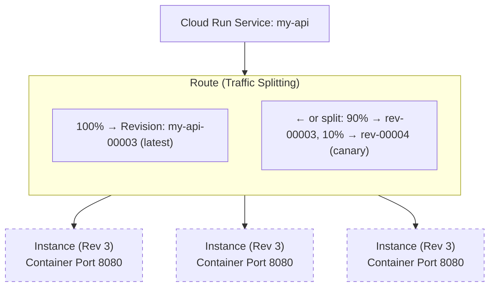

# Module 2.7: GCP Cloud Run (Serverless Containers)

**Complexity**: [COMPLEX] | **Time to Complete**: 2.5h | **Prerequisites**: Module 2.1 (IAM), Module 2.6 (Artifact Registry)

## Learning Outcomes

After completing this module, you will be able to:

- **Design** Cloud Run services that apply the container contract, autoscaling settings, custom domains, and revision routing for stateless HTTP workloads.
- **Configure** Cloud Run VPC access, ingress, identity, and private dependency connections for databases and internal APIs.
- **Implement** canary deployments with tagged revisions, traffic splitting, rollback commands, and health probes.
- **Evaluate** Cloud Run versus GKE and other serverless options by comparing cost, cold starts, concurrency, and operational complexity.

## Why This Module Matters

In early 2023, a health-tech startup ran its patient-facing API on a Kubernetes cluster managed by a two-person platform team. The cluster was not unusually large, but it still demanded node upgrades, autoscaler tuning, certificate renewal work, security patching, and incident response. When one engineer left, the remaining engineer tried to keep the platform stable while also supporting product delivery. A routine GKE node pool upgrade failed on a weekend, the patient portal stayed unavailable for 6 hours, and the incident review estimated that the team had been spending roughly 70% of its engineering time on infrastructure care instead of application features.

The company did not need a bespoke cluster for that API. The workload was stateless, packaged as a container, and exposed through HTTPS, while traffic nearly disappeared overnight and spiked sharply during launches. The team migrated the API services to Cloud Run in three weeks, kept the same container packaging flow through Artifact Registry, and removed most of the operational surface that had been consuming the platform team. Their monthly compute bill decreased by about 40% because idle services could scale to zero, and a later product launch produced a 25x traffic spike without manual node scaling or weekend cluster surgery.

Cloud Run matters because it changes the question from "how do we operate this container platform?" to "what contract must this container satisfy so the platform can operate it for us?" That distinction is the whole lesson. Cloud Run is built on Knative ideas such as services, immutable revisions, routes, and scale-to-zero autoscaling, but Google manages the control plane, load balancing, TLS, instance lifecycle, and regional serving infrastructure. You still need engineering judgment around concurrency, cold starts, VPC access, custom domains, observability, rollout safety, and when a full Kubernetes 1.35+ cluster is the better fit. You just make those decisions at the service boundary rather than by managing nodes.

If you are comparing Cloud Run with a Kubernetes 1.35+ lab or GKE cluster, this course uses `k` as the short alias for `kubectl` after defining it once. Cloud Run examples use `gcloud`, but the alias keeps later cluster comparisons consistent.

```bash
alias k=kubectl
k version --short
```

## Knative Concepts: The Foundation

Cloud Run is easiest to reason about when you separate the public service from the running containers behind it. A Cloud Run service has a stable name and URL, but each deployment creates a new immutable revision containing the exact container image, environment variables, CPU, memory, concurrency, probe configuration, VPC annotations, and traffic-relevant settings for that release. Requests do not go to "the latest container" in some vague sense. They go through a route that assigns percentages of traffic to one or more revisions, which is why Cloud Run can roll forward, roll back, or expose a tagged preview revision without rebuilding the image.



The Knative vocabulary gives names to the moving parts that Cloud Run hides behind the console and `gcloud` commands. A **Service** is the top-level resource with a stable endpoint. A **Revision** is an immutable snapshot of service configuration. An **Instance** is a running container process serving requests for one revision. A **Route** decides which revision receives which requests. In upstream Knative, a **Configuration** stores the desired template and stamps out a new revision when the template changes, while the route maps traffic to those revisions. Cloud Run exposes these ideas through service descriptions, revision lists, traffic splits, tags, and YAML exports.

This immutability is more than a convenient audit trail. It is the reason Cloud Run can decouple deployment from release. You can deploy revision `my-api-v2`, send it zero public traffic, give QA a tagged URL, run synthetic checks against production dependencies, and only then move 10% of users to the new revision. If latency, errors, or business metrics regress, rollback is a route update rather than a rebuild. Pause and predict: if an environment variable changes but the image tag stays the same, what do you think Cloud Run creates, and why would that matter during rollback?

```yaml
# Example: Knative-style traffic splitting in a Service spec
apiVersion: serving.knative.dev/v1
kind: Service
metadata:
  name: my-api
spec:
  template:
    metadata:
      name: my-api-v2 # New Revision name
  traffic:
  - revisionName: my-api-v1
    percent: 90
  - revisionName: my-api-v2
    percent: 10   # Canary traffic
    tag: preview  # Accessible via preview---my-api-xyz.a.run.app
```

The answer is that a new revision appears, because the revision records the full serving configuration, not only the image digest. That behavior can surprise teams that treat Cloud Run like a mutable virtual machine process, but it is the feature that makes production recovery clean. If the new environment variable points at a misconfigured dependency, traffic can move back to the previous revision with the previous configuration. You are not trying to unwind a partially patched process on a running host.

Cloud Run's scale-to-zero behavior comes from the same Knative serving model. When no revision needs instances, the platform can remove them and leave an activator-like path ready to receive the next request. The first request after an idle period waits while a container instance starts, listens on the configured port, and becomes healthy enough to receive traffic. That delay is the cold start trade-off. You can keep minimum instances warm for important paths, but the moment you do, you are choosing lower tail latency in exchange for paying some idle cost.

Concurrency is the other lever that makes Cloud Run different from a simple function runtime. A single instance can handle multiple requests at the same time, so I/O-bound applications can reuse database connections, memory caches, TLS sessions, and runtime initialization across many requests. The maximum concurrency can be high, but the correct value depends on application behavior. CPU-bound work, global mutable state, thread-unsafe libraries, and small memory limits all push you toward lower concurrency, while lightweight request handlers that mostly wait on external services can often run efficiently with higher concurrency.

```yaml
# Example: Traffic splitting and concurrency tuning
spec:
  template:
    spec:
      containerConcurrency: 80
      containers:
      - image: us-docker.pkg.dev/my-project/api:v2
  traffic:
  - revisionName: api-v1
    percent: 90
  - revisionName: api-v2
    percent: 10
    tag: canary
```

The container contract is the price of getting this managed behavior. For a Cloud Run service, the ingress container must listen on `0.0.0.0` using the port provided by the `PORT` environment variable, which defaults to `8080` unless you configure another value. The container should not terminate TLS itself, because Cloud Run terminates HTTPS and forwards requests to the container. The filesystem is writable but memory-backed and not persistent, so local writes can consume memory and disappear when the instance stops. These are not arbitrary rules; they let Cloud Run move, replace, scale, and restart instances without pretending that the container is a long-lived server.

Graceful shutdown is part of the same contract. During scale-down or revision replacement, the platform sends a termination signal and gives the process a brief window to finish active work, close connections, and flush telemetry. Applications that exit immediately may create intermittent 502 or 504 symptoms that only appear during deploys or quiet periods, which makes them hard to reproduce. A practical production service treats shutdown like a normal path, not an exceptional one, and makes request handlers idempotent enough that a retry is safe when infrastructure changes under them.

There is also a subtle difference between "stateless" and "no state anywhere." A Cloud Run instance can keep memory caches, connection pools, compiled templates, and warmed runtime objects while it is alive, and those local objects are often the reason concurrency improves efficiency. Stateless means the service remains correct when any particular instance disappears, not that every request must rebuild every local object from nothing. Durable truth belongs in managed storage, but per-instance acceleration is fine when cache misses are safe and startup behavior is measured.

```yaml
# Example: Knative-style Probes and Sidecars
spec:
  template:
    spec:
      containers:
      - image: us-docker.pkg.dev/my-project/api:v2
        startupProbe:
          httpGet:
            path: /healthz/ready
          initialDelaySeconds: 10
        livenessProbe:
          httpGet:
            path: /healthz/live
      - image: gcr.io/cloud-sql-connectors/cloud-sql-proxy:latest
        name: cloud-sql-proxy
        args: ["my-project:region:my-instance"]
```

Probes and sidecars let Cloud Run handle more serious applications than toy HTTP demos. A startup probe can keep traffic away from a process until a heavy cache, machine learning model, or database connection pool is ready. A liveness probe can remove a process that is still listening but functionally stuck. Sidecars can run supporting processes such as local proxies or telemetry agents in the same instance, which preserves a clean separation between application code and platform plumbing. The trade-off is resource sharing: sidecars consume memory and CPU from the same instance budget, so they must be sized deliberately.

CPU allocation also changes application design. By default, request-based billing allocates CPU during request processing, while idle instances may have little or no useful CPU for background work. If your service sends a response and then expects a background task to finish, that task may be delayed or stalled unless you enable always-allocated CPU or move the work to a proper asynchronous system. Before running a production migration, ask yourself which work absolutely must complete before the response, which work can be retried later, and which work belongs in Cloud Run jobs, Cloud Tasks, Pub/Sub, or another worker pattern.

The most reliable Cloud Run services therefore make failure boundaries visible in code. Request handlers validate input early, call dependencies with explicit timeouts, return useful errors, and avoid hidden global state that only works when one request runs at a time. Startup code fails fast when required configuration is missing, rather than letting a half-configured process sit behind a load balancer. Shutdown code stops accepting new work, finishes the current request when practical, and emits enough telemetry to explain what happened. These habits are ordinary service engineering, but Cloud Run makes them more important because instances appear and disappear as normal behavior.

## Deploying and Operating a Service

A Cloud Run deployment starts with a container image that already exists in Artifact Registry or another supported registry. The deployment command does not build your application unless you ask Cloud Build or source deployments to do that separately. That boundary is useful because it lets the image promotion process stay explicit: build once, scan once, tag or digest-pin the artifact, then deploy the same artifact through environments with different service configuration. In a disciplined pipeline, the image answers "what code is this?" and the Cloud Run revision answers "how is this code served?"

```bash
# Deploy directly from a container image
gcloud run deploy my-api \
  --image=us-central1-docker.pkg.dev/my-project/docker-repo/my-api:v1.0.0 \
  --region=us-central1 \
  --allow-unauthenticated \
  --port=8080 \
  --memory=512Mi \
  --cpu=1 \
  --min-instances=0 \
  --max-instances=100

# The output will include the service URL:
# Service URL: https://my-api-abc123-uc.a.run.app
```

The command above makes several design choices that are easy to overlook. `--allow-unauthenticated` exposes the service publicly, which might be right for a public website or API but wrong for an internal service that should require IAM. `--min-instances=0` optimizes for idle cost, while `--max-instances=100` protects downstream systems from unlimited fan-out. The memory and CPU choices affect cold start time, request throughput, and billing. A senior review of a Cloud Run deployment should read these flags as architecture, not as incidental CLI noise.

Declarative YAML becomes important when teams want reviewable changes and repeatable deployments. You can export or manage a Knative-style service definition, keep the image reference, resources, concurrency, annotations, and traffic block in version control, and let the deployment pipeline apply an intentional diff. That does not mean every team must start with YAML on day one. It means that once production behavior depends on several flags, you should make the serving contract visible enough for code review.

```yaml
apiVersion: serving.knative.dev/v1
kind: Service
metadata:
  name: my-api
  labels:
    cloud.googleapis.com/location: us-central1
spec:
  template:
    metadata:
      annotations:
        autoscaling.knative.dev/maxScale: '10'
    spec:
      containerConcurrency: 80
      containers:
      - image: us-central1-docker.pkg.dev/my-project/repo/image:tag
        resources:
          limits:
            cpu: 1000m
            memory: 512Mi
```

Concurrency tuning is where many teams either waste money or overload themselves. Imagine an API that spends most of its time waiting on Cloud SQL and a small amount of time formatting JSON. If concurrency is set too low, a traffic burst forces Cloud Run to create many instances, which increases cold starts and opens many database connections. If concurrency is set too high, each instance may run out of memory, exhaust a connection pool, or create head-of-line blocking where one slow dependency call delays many requests. The right process is to load test realistic traffic, watch latency percentiles, memory, CPU, connection counts, and error rates, and then choose a value that protects both the service and its dependencies.

Minimum instances deserve the same kind of explicit decision. A public checkout API, login callback, or webhook receiver may justify one or more warm instances because user-facing latency or third-party retry behavior is sensitive to cold starts. A back-office admin endpoint that is used a few times per day probably should scale to zero. The practical framing is not "cold starts are bad" or "idle cost is bad." The framing is whether the business path being served can tolerate a startup delay and whether paying for warm capacity is cheaper than losing reliability or user trust.

Custom domains sit above this service lifecycle. Cloud Run gives every service a generated HTTPS URL, but production users usually need a stable domain owned by the organization, with DNS, certificate provisioning, and traffic policies managed intentionally. The custom domain does not change the container contract, but it changes the blast radius of mistakes. A bad route split or unauthenticated deployment behind an official domain is immediately user-visible, so domain mapping should be handled with the same release discipline as traffic splitting and IAM.

Before running this, what output do you expect from a service description after a fresh deployment: one revision with all traffic, or multiple revisions with a split? The expected answer after the first deployment is a single ready revision receiving all public traffic, because no later revision exists yet. That baseline matters because future commands such as `--no-traffic`, tags, and `update-traffic` only make sense when you can read the service's current traffic state.

Cloud Run observability should be part of the first deployment, not a cleanup task after an incident. Logs, request metrics, revision labels, and error reporting give you the evidence needed to decide whether a canary is healthy. Without those signals, traffic splitting only gives you a steering wheel with no dashboard. At minimum, know how to inspect revisions, watch request latency, group errors by revision, and correlate a deployment timestamp with changes in request volume or downstream dependency behavior.

Service descriptions are especially useful because they expose both desired configuration and observed status. The desired side tells you what the next revision template should contain, while the status side tells you which revisions are receiving traffic and what URLs or tags exist. During an incident, avoid relying on memory or on the last command someone thinks they ran. Read the service, read the revision list, and compare what the platform is actually serving with the deployment plan. Many Cloud Run incidents are resolved quickly once the team notices that a revision has the wrong service account, an old image tag, or traffic it was never supposed to receive.

## Networking, Identity, and Private Dependencies

Cloud Run services often begin life as public HTTPS endpoints, but production systems rarely remain that simple. They call private databases, internal APIs, queues, identity providers, and partner services with strict allowlists. Cloud Run networking is therefore a design surface rather than a checkbox. You must decide what can call the service, what the service can call, whether traffic should stay on private ranges, whether all egress should route through a VPC, and which service account identity represents the workload.

Ingress controls answer who can reach the service endpoint. A public API may allow unauthenticated access at the edge while enforcing application-level auth, but an internal service should usually restrict invocation to specific principals or internal ingress paths. IAM controls answer which identity can invoke the service or manage it. Service accounts answer who the running code is when it calls Google Cloud APIs. These three concepts are related but not interchangeable, and many incidents come from treating one as if it replaces the others.

VPC access answers a different question: how does a serverless service reach resources that live on private addresses? A Serverless VPC Access connector creates managed capacity that lets Cloud Run send selected egress traffic into a VPC network. With `private-ranges-only`, only private destination ranges use the connector, while public internet traffic leaves through the normal path. With broader egress routing, you can force more traffic through VPC controls and Cloud NAT, which may be necessary for fixed egress IP allowlists or centralized inspection.

```yaml
spec:
  template:
    metadata:
      annotations:
        # Routing egress through a VPC for private database access
        run.googleapis.com/vpc-access-connector: projects/my-project/locations/us-central1/connectors/my-vpc-conn
        run.googleapis.com/vpc-access-egress: private-ranges-only
    spec:
      containers:
      - image: us-central1-docker.pkg.dev/my-project/repo/image:v1.1.0
        startupProbe:
          httpGet:
            path: /health/startup
          initialDelaySeconds: 5
          periodSeconds: 10
          failureThreshold: 3
  traffic:
  - revisionName: my-api-v1-0-0
    percent: 90
  - revisionName: my-api-v1-1-0
    percent: 10
    tag: canary
```

This YAML intentionally combines networking, probes, and traffic, because real production revisions combine them too. A canary that uses a new VPC connector path is not only testing code; it is testing DNS, firewall rules, connector capacity, service identity, and dependency behavior under a small amount of real traffic. If a canary receives 10% of user requests but all of those requests call the same private database, the database still sees a new client pattern. Good rollout plans account for downstream impact instead of assuming Cloud Run is isolated from the rest of the system.

Which approach would you choose here and why: route only private ranges through the connector, or send all egress through the VPC? For most services that simply need private database or internal API access, private-ranges-only keeps public traffic simpler and avoids unnecessary connector dependence. For services that need centralized egress controls, fixed outbound IPs, or inspection through VPC infrastructure, all-traffic routing may be worth the extra operational surface. The right answer depends on security requirements and dependency paths, not on a universal preference.

Direct VPC egress is another option in modern Cloud Run deployments, and it can remove the connector resource for some designs. A module focused on essentials still teaches connectors because they remain common in existing environments and explain the egress model clearly. When you evaluate a real architecture, compare connector capacity, operational ownership, Shared VPC constraints, firewall logging needs, and the simplicity of direct egress. The best design is the one your network and security teams can reason about during an incident at 2 a.m.

Identity should be least privilege from the first deploy. The default Compute Engine service account is too broad for many organizations, and using it makes later audits harder. Create a service-specific account, grant only the roles needed for Secret Manager, Cloud SQL, Pub/Sub, or other dependencies, and set that account on the Cloud Run service. When a revision behaves badly, logs and audit entries should tell you which workload identity acted, not merely that some default project identity had permission.

Secrets belong in Secret Manager or another managed secret system, not in images, source files, or copied environment examples. Cloud Run can mount secrets or inject them as environment variables, but the operational question is rotation and blast radius. If a credential is tied to the service account and can be rotated centrally, rollback and redeploy become safer. If a credential is baked into an image, every replica and every copied artifact becomes part of the incident response.

Private connectivity should also be tested from the revision that will serve users, not from a developer laptop or a nearby virtual machine. A laptop may use a different DNS resolver, a different identity, a different source IP, and a completely different route to the dependency. A VM in the same VPC proves that the dependency exists, but it does not prove Cloud Run egress and identity are configured correctly. A small diagnostic endpoint or startup check can be valuable during rollout, provided it does not expose secrets or turn a temporary dependency problem into a permanent liveness failure.

## Safe Releases with Revisions and Traffic Splitting

Cloud Run makes canary delivery simple enough that teams are tempted to treat it as a button. The better mental model is a controlled experiment. You create a new revision, hold it away from public traffic, test it through a tag, then expose a small percentage of real users while comparing revision-level signals. The goal is not merely to move from version 1 to version 2. The goal is to learn whether version 2 behaves well under production identity, network paths, data shape, and user behavior before the blast radius grows.

Tagged revisions are useful because they separate validation from release. A tag creates a revision-specific URL that can be exercised by QA, smoke tests, or a deployment pipeline without affecting normal users. That URL still runs in the real Cloud Run environment, which means it sees the same container contract, VPC configuration, secrets, startup behavior, and service account identity. If the tagged revision fails before public traffic moves, you have found a release problem at the cheapest possible moment.

```bash
gcloud run deploy my-api \
  --image=us-central1-docker.pkg.dev/my-project/docker-repo/my-api:v1.1.0 \
  --region=us-central1 \
  --no-traffic \
  --tag=canary \
  --port=8080 \
  --memory=512Mi \
  --cpu=1 \
  --concurrency=80
```

After a tagged deployment, the service has at least two important URLs: the stable service URL and the tag URL. The stable URL follows the current traffic split. The tag URL targets the tagged revision directly. This is powerful, but it also creates a governance question: who can access tag URLs, and do they bypass expectations attached to the public domain? Treat tag URLs as production endpoints for the purpose of auth, data handling, and logging, because they are running production code in a production environment.

The first public canary step should be small enough that a failure is tolerable and large enough that your signals are meaningful. A 1% canary might be appropriate for a high-volume service, while a low-traffic internal API may need a synthetic load test or a time-boxed manual test to produce useful evidence. The rollout should define guardrails before traffic moves: error budget impact, latency regression thresholds, dependency saturation, business metric checks, and the exact rollback command. A canary without predeclared guardrails often becomes a slow manual debate during an incident.

```bash
gcloud run services update-traffic my-api \
  --region=us-central1 \
  --to-revisions my-api-00003=90,my-api-00004=10
```

Rollback is intentionally boring when revisions are healthy. You point traffic back to the known-good revision and investigate later. That does not remove the need for database migration discipline. If revision 2 performs an irreversible schema write that revision 1 cannot read, traffic rollback alone may not restore service. Cloud Run solves release routing, not all compatibility problems. Mature teams pair Cloud Run canaries with backward-compatible schema changes, feature flags, idempotent retries, and migration plans that allow both old and new revisions to operate during the rollout window.

```bash
gcloud run services update-traffic my-api \
  --region=us-central1 \
  --to-revisions my-api-00003=100
```

Health probes improve release safety because they keep bad instances out of rotation before user requests become the health check. A startup probe is especially important for frameworks that listen on a port before the application is truly ready, such as services loading large models or warming expensive caches. Liveness probes should be stricter than "the process exists" but not so strict that a temporary dependency hiccup causes a restart storm. A good probe checks the service's own readiness without turning every downstream outage into an instance churn event.

Canary analysis is easier when revision names and labels are visible in logs and metrics. Cloud Run already records revision information, but your application can also log version markers such as `APP_VERSION`, build SHA, or feature flag state. The goal is to answer operational questions quickly: did errors come from only the new revision, from a shared dependency, or from all traffic after a configuration change? When the answer is revision-specific, traffic routing can reduce user impact while you inspect the code. When the answer is dependency-wide, rollback may not help and could distract the response team.

Rollout speed should match reversibility. A purely presentation-level change with no schema effect, no dependency change, and strong automated checks can move faster than a revision that changes payment authorization, database writes, or private networking. The Cloud Run interface makes both changes look like the same traffic update, so the release process must add the missing context. State which assumptions make the rollout safe, which signals would prove those assumptions wrong, and which command returns users to the previous path. This turns traffic splitting from a ceremony into an engineering control.

## Performance, Cost, and Platform Fit

Cloud Run's cost model rewards services that are stateless, bursty, and request-driven. If a service receives no traffic and has zero minimum instances, compute cost can fall away for that idle period. If it receives many concurrent lightweight requests, a modest number of instances can serve significant throughput. The platform is less attractive for workloads that need long-running background CPU after responses, specialized node-level controls, very large local state, custom network appliances, or deep Kubernetes ecosystem integration. Serverless containers are a strong default, not a universal replacement for clusters.

The most important cost mistake is focusing only on Cloud Run price per vCPU-second while ignoring the system around it. High concurrency can lower Cloud Run instance count but overload a database. Minimum instances can improve latency but run continuously. VPC egress choices can add network costs or connector capacity needs. Always-allocated CPU can make background work reliable but changes the billing shape. A realistic evaluation includes request volume, latency targets, cold start tolerance, downstream capacity, engineer time, and incident risk, not only a line item comparison.

| Workload signal | Cloud Run is usually a strong fit | GKE or another platform may fit better |
|---|---|---|
| Traffic pattern | Bursty HTTP traffic, quiet periods, launch spikes | Constant high utilization with predictable capacity |
| Operational ownership | Small team wants managed serving and fewer cluster duties | Team needs node pools, custom controllers, or cluster APIs |
| State model | Stateless request handlers with external durable storage | Local state, daemon behavior, or tight pod-to-pod coordination |
| Release model | Revision traffic splitting and quick rollback are enough | Complex multi-service orchestration needs Kubernetes-native tools |
| Runtime needs | Standard Linux containers listening on a port | Privileged workloads, custom kernels, or special hardware scheduling |

Cold starts are not a moral failure; they are the economic trade-off that lets unused capacity disappear. You reduce them by keeping minimum instances, improving startup time, shrinking images, avoiding heavy import paths, using startup CPU boost where appropriate, and setting concurrency so an existing instance can absorb bursts. You should measure cold starts separately from steady-state latency because they have different causes. A service with excellent steady-state P50 can still have painful P99 after quiet periods, and a service with a warm minimum instance can still stall if each instance handles too much concurrent work.

Concurrency tuning is also a resilience control. Suppose a revision has concurrency 80 and max instances 10, so it can accept a large number of simultaneous requests before Cloud Run refuses new capacity. If every request opens a database connection, the database may see a far larger burst than it can handle. Lowering concurrency, using connection pooling, setting max instances, and introducing queues or backpressure can protect dependencies. Cloud Run autoscaling is fast, but it cannot know the real safe limit of your database unless you encode that limit through service configuration and application behavior.

Cloud Run and GKE can coexist in the same architecture. A platform team might keep shared stateful services, service mesh experiments, custom controllers, or batch systems on GKE, while moving stateless APIs, webhooks, internal admin UIs, and scheduled jobs to Cloud Run. That split can reduce cluster pressure and let teams choose the operational model per workload. The mistake is turning the decision into identity politics. The useful question is which platform exposes the fewest failure modes while meeting the service's needs.

War story: a retail team moved a promotion API from a small GKE node pool to Cloud Run before a seasonal sale. They set high concurrency because load tests looked efficient, then discovered that the real database connection pool saturated when multiple instances warmed at once. Cloud Run scaled exactly as configured, but the database could not absorb the shape of traffic. The fix was not to abandon Cloud Run. The fix was to lower concurrency, cap max instances, increase database pool discipline, and add dashboards that showed revision-level latency alongside database saturation.

The same team later found that Cloud Run simplified the parts of operations they had previously postponed. Because revisions were explicit, release notes could point to exact images and traffic percentages. Because service accounts were per workload, audit findings were easier to close. Because scaling was configured per service, product teams could own cost and latency trade-offs without asking the platform group to resize node pools. The migration was not magic; it forced configuration decisions into a smaller, reviewable surface. That smaller surface is one of Cloud Run's underrated advantages.

## Patterns & Anti-Patterns

Production Cloud Run patterns are mostly about making the managed platform's assumptions explicit. The platform assumes stateless containers, immutable revisions, autoscaling based on request pressure, and service-level identity. Strong designs embrace those assumptions and add controls for the places Cloud Run cannot infer business intent, such as how much cold start latency users can tolerate, how much traffic a database can absorb, and how much blast radius a canary should have. Weak designs pretend Cloud Run is just a cheaper VM and then get surprised by lifecycle behavior.

| Pattern | When to use it | Why it works | Scaling consideration |
|---|---|---|---|
| Deploy once, release by traffic | You need safe rollout, preview testing, or quick rollback | Revisions are immutable, so traffic can move without rebuilding | Keep old and new revisions compatible during the rollout window |
| Tune concurrency from load tests | The service is I/O-bound or has expensive startup cost | Each instance can reuse memory, sockets, and runtime state | Watch downstream limits, not only Cloud Run CPU and memory |
| Keep warm instances for critical paths | First-request latency affects users or partner retries | Minimum instances avoid scale-from-zero on quiet periods | Treat the idle spend as part of the reliability budget |
| Use service-specific identities | The service calls Google APIs or private resources | Audit logs and IAM policies map to a workload, not a default account | Rotate permissions as dependencies change and remove unused roles |

The corresponding anti-patterns usually start as shortcuts that seem harmless in a small demo. Teams deploy with public unauthenticated access because it is convenient, leave concurrency at a default without load testing, store secrets in images, or connect to a private database without modeling connector capacity. Those shortcuts are survivable for a lab and dangerous for production because Cloud Run makes it easy for a service to scale quickly. A small configuration mistake can therefore become a large dependency or security problem very fast.

A useful review habit is to ask what the service will do at the worst possible moment: after a quiet weekend, during a deploy, when a dependency slows down, and when a traffic spike arrives before humans are watching. Cloud Run handles infrastructure reaction quickly, but it cannot decide whether your database should receive that many connections or whether a cold start on a partner webhook path is acceptable. The patterns above work because they encode those human decisions into settings, probes, limits, and rollout steps before the stressful moment arrives.

| Anti-pattern | What goes wrong | Better alternative |
|---|---|---|
| Treating Cloud Run as a mutable server | Teams expect to patch a running process and lose rollback clarity | Treat every deploy as a new revision and release by routing |
| Maximum instances with no dependency model | Autoscaling protects the service but overloads databases or APIs | Cap instances based on downstream capacity and add backpressure |
| Background work after responses on request-based CPU | Cleanup, telemetry, or follow-up tasks stall when CPU is throttled | Complete critical work before responding or move work to a worker system |
| Tag URLs with weaker access assumptions | Preview endpoints expose production behavior unexpectedly | Apply the same auth, logging, and data handling to tags as to public URLs |

## Decision Framework

Use Cloud Run when the workload can honor the container contract, serve requests over HTTP or gRPC, keep durable state outside the instance, and tolerate autoscaling semantics. Use GKE when the workload needs Kubernetes-native scheduling, custom controllers, pod-level networking features, node-level tuning, or a broader platform ecosystem that Cloud Run intentionally abstracts away. Use Cloud Functions when the code is truly function-shaped and you do not need container packaging control. Use Cloud Run jobs when the work is finite and does not need to serve requests.

```text
Start with the workload shape
|
+-- Is it a stateless HTTP/gRPC container?
|   |
|   +-- Yes --> Can it tolerate Cloud Run lifecycle and filesystem rules?
|   |          |
|   |          +-- Yes --> Cloud Run service is the default candidate
|   |          +-- No  --> Evaluate GKE or a VM-based design
|   |
|   +-- No --> Is it finite batch work packaged as a container?
|              |
|              +-- Yes --> Cloud Run jobs may fit
|              +-- No  --> Evaluate GKE, Batch, Dataflow, or another service
|
+-- Does it need private dependencies?
    |
    +-- Yes --> Choose Direct VPC egress or a Serverless VPC Access connector
    +-- No  --> Keep networking simple and restrict identity deliberately
```

| Decision | Prefer this choice when | Watch out for |
|---|---|---|
| `min-instances=0` | Idle cost matters and cold starts are acceptable | First request after quiet periods may be slow |
| `min-instances>0` | User or partner latency is sensitive | You pay for warm capacity even when quiet |
| Higher concurrency | Requests are mostly I/O-bound and thread-safe | Shared memory, pools, and downstream services can saturate |
| Lower concurrency | Requests are CPU-heavy or not safely parallel | More instances and more cold starts may appear during bursts |
| VPC private-ranges-only | Only internal destinations need VPC routing | Public egress will not use VPC controls |
| All egress through VPC | Fixed egress, inspection, or centralized routing is required | Connector or network design becomes part of service reliability |

The decision framework should be revisited after the first production week. Initial settings are educated guesses until real traffic arrives. Look at revision-level latency, instance count, concurrency, cold starts, memory, CPU, database connection counts, and error logs. Then make one controlled change at a time. If you change concurrency, minimum instances, VPC routing, image size, and database pool settings all at once, you may improve the service but learn almost nothing about which decision mattered.

When the data is ambiguous, choose the option that is easiest to observe and reverse. For example, increasing minimum instances for one critical service is usually easy to validate through latency metrics and easy to undo if the cost is not justified. Rewriting a service around background work after responses is harder to observe and may hide correctness issues until scale-down. Moving every service from GKE to Cloud Run in one sweep creates organizational noise that can mask which workloads were good candidates. The mature path is incremental: pick a stateless service, define success, migrate it cleanly, and let the evidence guide the next move.

## Did You Know?

- Cloud Run services can scale a revision down to zero instances by default, which is why an idle service can avoid compute charges while still keeping a stable HTTPS endpoint.
- Every Cloud Run deployment that changes serving configuration creates an immutable revision, so rollback can be a traffic routing operation rather than a new build.
- Cloud Run's container contract requires the ingress container to listen on `0.0.0.0` and the configured `PORT`, with `8080` used by default when no custom port is set.
- In October 2023, Cloud Run added support for multi-container services generally, making sidecar-style patterns practical without moving the workload to a cluster.

## Common Mistakes

| Mistake | Why It Happens | How to Fix It |
|---|---|---|
| Deploying public unauthenticated services by habit | Demo commands often use `--allow-unauthenticated`, and the flag becomes muscle memory | Decide ingress and IAM per service, then document why public access is acceptable when you use it |
| Setting high concurrency without dependency limits | Load tests focus on Cloud Run cost and miss database or API saturation | Tune concurrency with downstream metrics, connection pool limits, and max instance caps visible |
| Assuming rollback fixes every bad release | Schema changes, irreversible writes, and shared dependency changes can outlive a revision rollback | Use backward-compatible migrations and feature flags before shifting traffic |
| Ignoring graceful shutdown | Local tests rarely simulate scale-down or revision replacement | Handle termination signals, finish in-flight requests, and flush logs before exit |
| Baking secrets into images | It feels simpler than wiring Secret Manager during early development | Inject or mount secrets from a managed system and rotate them without rebuilding images |
| Treating tag URLs as harmless preview links | Tags are convenient, so teams forget they target production revisions | Apply the same authentication, logging, and data policies to tagged revisions |
| Routing all egress through a connector without capacity planning | Security requirements push teams toward centralized egress quickly | Size and monitor the egress path, or use private-ranges-only when that meets the requirement |
| Leaving observability until after launch | Cloud Run deploys quickly, so dashboards are postponed | Add revision-aware logs, latency metrics, and error alerts before the first canary |

## Quiz

<details><summary>Your team must design a Cloud Run service for a stateless checkout API that needs custom domain access, autoscaling, and safe revision routing. The first request after quiet periods cannot exceed the latency objective. Which settings and release approach would you choose?</summary>

Use Cloud Run with the checkout container deployed as a service, map the official domain only after ingress and IAM are reviewed, and keep at least one minimum instance warm for the latency-sensitive path. Release new versions as revisions, test them through a tag, and move user traffic gradually with an explicit rollback command ready. This design uses Cloud Run's managed scaling while acknowledging that the custom domain makes mistakes immediately visible to users. The warm instance is a cost trade-off, but checkout latency is usually important enough to justify it.

</details>

<details><summary>A new Cloud Run revision returns errors only when it calls a private database. Public health checks pass, and the old revision still works. What do you check first, and why?</summary>

Check the new revision's VPC access configuration, service account permissions, firewall path, DNS resolution, and any connector or direct egress settings changed in the revision. Cloud Run revisions capture configuration as well as image identity, so two revisions can run the same code while using different networking or identity. The public health check proves the container can start, but it does not prove the private dependency path works. Compare the old and new revision configuration before assuming the application code is broken.

</details>

<details><summary>Your team deployed a canary with a tag, then shifted 10% of traffic to it. Latency rises for the canary only, but error rates stay flat. Should you roll forward, roll back, or hold? Explain the reasoning.</summary>

Hold or roll back depending on the predeclared latency guardrail, but do not roll forward just because errors are flat. Latency regressions can be user-visible and may indicate dependency saturation, excessive cold starts, startup work on request paths, or unsafe concurrency. The benefit of a canary is that the blast radius is still small while you inspect revision-level metrics. If the latency breach violates the rollout policy, route traffic back to the stable revision and investigate from the tagged revision URL.

</details>

<details><summary>An I/O-bound Cloud Run API uses a database connection pool and sees many cold starts during bursts. You can change concurrency, max instances, and minimum instances. What experiment would you run first?</summary>

Run a load test that gradually increases concurrency while watching request latency, memory, CPU, instance count, and database connection usage. For an I/O-bound service, a moderate concurrency increase may let each instance reuse connections and absorb bursts without creating as many cold starts. However, the database pool is the constraint, so you should not simply raise concurrency to the highest value. Pair the test with max instance limits and dependency metrics so Cloud Run scaling does not hide downstream overload.

</details>

<details><summary>A service sends an HTTP response and then writes an audit record in a background task. The audit record sometimes disappears when the service scales down. How should the design change?</summary>

The service is relying on background CPU after the response, which may not be reliable under request-based CPU allocation and scale-down behavior. Critical audit work should either complete before the response is sent, be handed to a durable queue such as Pub/Sub or Cloud Tasks, or run under a configuration that intentionally keeps CPU allocated. The important design principle is that durable side effects must not depend on an idle instance continuing to run. Cloud Run can host the container, but the application must still respect the execution model.

</details>

<details><summary>You are evaluating Cloud Run versus GKE for a team that runs stateless HTTP APIs and one controller that needs Kubernetes custom resources. How would you split the platform choice?</summary>

Move the stateless HTTP APIs to Cloud Run if they satisfy the container contract and benefit from managed autoscaling, revision routing, and lower cluster operations. Keep the controller on GKE because it depends on Kubernetes APIs and custom resources that Cloud Run does not expose. This is not a failure to standardize; it is choosing the right operational model per workload. The evaluation should compare cost, cold starts, team ownership, and dependency needs instead of treating one platform as universally better.

</details>

<details><summary>A tagged preview revision works for QA, but a security reviewer objects that the tag URL may bypass the official custom domain policy. What is the right response?</summary>

Treat the tag URL as a production endpoint and apply the same authentication, authorization, logging, and data handling expectations that apply to the official domain. Tags are useful because they target a specific revision, not because they are outside production controls. If policy requires all user access through the custom domain, the preview process should use internal callers, IAM-restricted invocation, or a controlled test path rather than an open tag URL. The release convenience must not weaken the security model.

</details>

## Hands-On Exercise

Goal: Build and push a small container image, deploy it to Cloud Run, tune autoscaling and concurrency, attach a Serverless VPC Access connector, and perform a canary rollout with revision traffic splitting. The exercise uses a temporary application under `/tmp/cloud-run-lab` so it does not alter this repository. Use a real Google Cloud project where you are allowed to enable APIs, create Artifact Registry repositories, deploy Cloud Run services, and create Serverless VPC Access connectors.

- [ ] Set the lab variables and default region.
  ```bash
  export PROJECT_ID="$(gcloud config get-value project)"
  export REGION="us-central1"
  export REPO="cloud-run-lab"
  export SERVICE="hello-cloud-run"
  export IMAGE="${REGION}-docker.pkg.dev/${PROJECT_ID}/${REPO}/${SERVICE}"
  export CONNECTOR="cloud-run-conn"

  gcloud config set run/region "${REGION}"
  ```
  Verification:
  ```bash
  echo "${PROJECT_ID}"
  gcloud config get-value run/region
  ```

- [ ] Enable the required APIs and create an Artifact Registry repository if it does not already exist.
  ```bash
  gcloud services enable \
    run.googleapis.com \
    cloudbuild.googleapis.com \
    artifactregistry.googleapis.com \
    vpcaccess.googleapis.com \
    compute.googleapis.com

  gcloud artifacts repositories create "${REPO}" \
    --repository-format=docker \
    --location="${REGION}" \
    --description="Images for the Cloud Run lab" || true

  gcloud auth configure-docker "${REGION}-docker.pkg.dev"
  ```
  Verification:
  ```bash
  gcloud services list --enabled \
    --filter="name:(run.googleapis.com OR cloudbuild.googleapis.com OR artifactregistry.googleapis.com OR vpcaccess.googleapis.com)" \
    --format="value(name)"

  gcloud artifacts repositories describe "${REPO}" --location="${REGION}"
  ```

- [ ] Create a minimal HTTP application and Dockerfile.
  ```bash
  mkdir -p /tmp/cloud-run-lab
  cd /tmp/cloud-run-lab

  cat > app.py <<'PY'
  import os
  from flask import Flask

  app = Flask(__name__)

  @app.get("/")
  def index():
      return f"hello from {os.environ.get('APP_VERSION', 'v1')}\n"

  @app.get("/healthz")
  def healthz():
      return "ok\n"

  if __name__ == "__main__":
      app.run(host="0.0.0.0", port=int(os.environ.get("PORT", 8080)))
  PY

  cat > requirements.txt <<'TXT'
  flask==3.1.0
  gunicorn==23.0.0
  TXT

  cat > Dockerfile <<'DOCKER'
  FROM python:3.12-slim
  WORKDIR /app
  COPY requirements.txt .
  RUN pip install --no-cache-dir -r requirements.txt
  COPY app.py .
  CMD exec gunicorn --bind :${PORT:-8080} --workers 1 --threads 8 app:app
  DOCKER
  ```
  Verification:
  ```bash
  ls -1
  sed -n '1,120p' app.py
  sed -n '1,120p' Dockerfile
  ```

- [ ] Build and push the first image with Cloud Build.
  ```bash
  cd /tmp/cloud-run-lab
  gcloud builds submit --tag "${IMAGE}:v1"
  ```
  Verification:
  ```bash
  gcloud artifacts docker images list "${REGION}-docker.pkg.dev/${PROJECT_ID}/${REPO}" \
    --include-tags
  ```

- [ ] Deploy the first Cloud Run revision with explicit autoscaling and concurrency settings.
  ```bash
  gcloud run deploy "${SERVICE}" \
    --image "${IMAGE}:v1" \
    --region "${REGION}" \
    --allow-unauthenticated \
    --port 8080 \
    --memory 512Mi \
    --cpu 1 \
    --concurrency 20 \
    --min-instances 0 \
    --max-instances 5 \
    --set-env-vars APP_VERSION=v1
  ```
  Verification:
  ```bash
  export SERVICE_URL="$(gcloud run services describe "${SERVICE}" --region "${REGION}" --format='value(status.url)')"
  echo "${SERVICE_URL}"
  curl -s "${SERVICE_URL}"
  gcloud run revisions list --service "${SERVICE}" --region "${REGION}"
  gcloud run services describe "${SERVICE}" --region "${REGION}" \
    --format="yaml(spec.template.spec.containerConcurrency,spec.template.metadata.annotations)"
  ```

- [ ] Create a Serverless VPC Access connector and attach it to the service.
  ```bash
  gcloud compute networks vpc-access connectors create "${CONNECTOR}" \
    --region "${REGION}" \
    --network default \
    --range 10.8.0.0/28 || true

  gcloud run services update "${SERVICE}" \
    --region "${REGION}" \
    --vpc-connector "${CONNECTOR}" \
    --vpc-egress private-ranges-only
  ```
  Verification:
  ```bash
  gcloud compute networks vpc-access connectors describe "${CONNECTOR}" --region "${REGION}"
  gcloud run services describe "${SERVICE}" --region "${REGION}" \
    --format="yaml(spec.template.metadata.annotations)"
  ```

- [ ] Deploy a second revision with different runtime settings, but keep it off the public route at first.
  ```bash
  gcloud run deploy "${SERVICE}" \
    --image "${IMAGE}:v1" \
    --region "${REGION}" \
    --no-traffic \
    --tag canary \
    --concurrency 40 \
    --min-instances 1 \
    --max-instances 10 \
    --set-env-vars APP_VERSION=v2
  ```
  Verification:
  ```bash
  gcloud run revisions list --service "${SERVICE}" --region "${REGION}"
  gcloud run services describe "${SERVICE}" --region "${REGION}" \
    --format="yaml(status.traffic)"
  ```
  Use the tagged `canary` URL from the `status.traffic` output, then verify it directly:
  ```bash
  curl -s "TAGGED_CANARY_URL"
  ```

- [ ] Split traffic between the stable and canary revisions.
  ```bash
  export REV_NEW="$(gcloud run revisions list --service "${SERVICE}" --region "${REGION}" \
    --sort-by='~metadata.creationTimestamp' --format='value(metadata.name)' | sed -n '1p')"

  export REV_OLD="$(gcloud run revisions list --service "${SERVICE}" --region "${REGION}" \
    --sort-by='~metadata.creationTimestamp' --format='value(metadata.name)' | sed -n '2p')"

  gcloud run services update-traffic "${SERVICE}" \
    --region "${REGION}" \
    --to-revisions "${REV_OLD}=90,${REV_NEW}=10"
  ```
  Verification:
  ```bash
  gcloud run services describe "${SERVICE}" --region "${REGION}" \
    --format="yaml(status.traffic)"

  for i in $(seq 1 20); do curl -s "${SERVICE_URL}"; done | sort | uniq -c
  ```

- [ ] Roll back to the previous revision if the canary does not behave as expected.
  ```bash
  gcloud run services update-traffic "${SERVICE}" \
    --region "${REGION}" \
    --to-revisions "${REV_OLD}=100"
  ```
  Verification:
  ```bash
  gcloud run services describe "${SERVICE}" --region "${REGION}" \
    --format="yaml(status.traffic)"

  for i in $(seq 1 10); do curl -s "${SERVICE_URL}"; done | sort | uniq -c
  ```

This lab deliberately keeps the custom domain portion as a design review rather than a live DNS change, because domain mapping requires a domain you control and can create cleanup work outside the module. After the service is reachable, inspect whether it should ever be public, which service account it runs as, what domain would front it, and whether a tag URL should be accessible to anyone outside the deployment team. That review is part of the same production readiness skill as the commands.

<details><summary>Solution guidance for the deployment and first revision tasks</summary>

The first successful deployment should produce a service URL, one ready revision, and an application response that says `hello from v1`. If the deploy fails before creating a revision, check that the Artifact Registry repository exists in the selected region, the image build completed, and the Cloud Run API is enabled. If the service starts but requests fail, inspect whether the container listens on the `PORT` environment variable and binds to `0.0.0.0`. That is the most common container contract issue in first Cloud Run deployments.

</details>

<details><summary>Solution guidance for VPC access</summary>

The connector task should add VPC access annotations to the service template and create a new revision, because networking configuration is revision configuration. If the connector creation fails, verify that the VPC Access API is enabled, the selected IP range does not overlap another connector range, and the region matches the Cloud Run service. If private dependency calls still fail, compare firewall rules, DNS behavior, and service account permissions before changing application code. The connector only provides a path; it does not grant database privileges by itself.

</details>

<details><summary>Solution guidance for canary and rollback</summary>

The second deployment should create a tagged revision with no public traffic at first. The tagged URL should return `hello from v2`, while the stable service URL should continue returning `hello from v1` until you update the traffic split. After the 90/10 split, repeated requests may show both versions, and the exact sample distribution can vary because a small local loop is not a statistically precise load test. The rollback command should move all stable service traffic back to `REV_OLD` while leaving the newer revision available for inspection.

</details>

Success criteria:

- [ ] The container image is stored in Artifact Registry with a visible tag.
- [ ] The Cloud Run service is reachable over HTTPS and returns an application response.
- [ ] The service has at least two revisions.
- [ ] Autoscaling and concurrency settings are visible in the Cloud Run service configuration.
- [ ] A Serverless VPC Access connector is attached to the service.
- [ ] Traffic can be shifted between revisions and rolled back to the previous version.
- [ ] You can explain whether this workload belongs on Cloud Run, GKE, Cloud Functions, or Cloud Run jobs.

## Next Module

Next: [Module 2.8: Cloud Functions](./module-2.8-cloud-functions.md) explores event-driven functions and when they are a better fit than containerized services.

## Sources

- [Cloud Run overview](https://cloud.google.com/run/docs/overview/what-is-cloud-run) - Google Cloud's introduction to Cloud Run covers its Knative foundation, revisions, and the services and jobs model referenced throughout this module.
- [Cloud Run: About instance autoscaling](https://cloud.google.com/run/docs/about-instance-autoscaling) - Authoritative reference for the concurrency-driven autoscaling model, scale-to-zero behavior, and cold-start trade-offs.
- [Cloud Run: Manage traffic](https://cloud.google.com/run/docs/managing/traffic) - Describes the revision-based traffic splitting and gradual-rollout commands used in the canary deployment section.
- [Connecting to a VPC network from serverless environments](https://cloud.google.com/vpc/docs/serverless-vpc-access) - Primary reference for Serverless VPC Access connectors, the mechanism Cloud Run uses to reach internal databases and private APIs.
- [Cloud Run pricing](https://cloud.google.com/run/pricing) - Canonical source for request-based billing, CPU allocation, always-allocated CPU choices, and scale-to-zero cost analysis.
- [Knative Serving: Concepts](https://knative.dev/docs/serving/) - Upstream Knative documentation for Service, Revision, Route, and Configuration primitives that underpin Cloud Run's API surface.
- [Cloud Run container runtime contract](https://cloud.google.com/run/docs/container-contract) - Defines the port, filesystem, lifecycle, startup, and shutdown requirements used in the container contract section.
- [Cloud Run concurrency](https://cloud.google.com/run/docs/about-concurrency) - Explains maximum concurrent requests per instance and the trade-offs of tuning concurrency for services.
- [Configure minimum instances for services](https://cloud.google.com/run/docs/configuring/min-instances) - Details the warm-instance setting used to reduce cold-start latency on critical paths.
- [Configure containers for services](https://cloud.google.com/run/docs/configuring/services/containers) - Covers service container settings including ports, resources, commands, and arguments.
- [Map custom domains](https://cloud.google.com/run/docs/mapping-custom-domains) - Documents custom domain mapping for Cloud Run services and the DNS implications referenced in release planning.
- [Configure VPC egress for Cloud Run](https://cloud.google.com/run/docs/configuring/connecting-vpc) - Compares Direct VPC egress and Serverless VPC Access connector choices for private dependency access.
- [Artifact Registry Docker images](https://cloud.google.com/artifact-registry/docs/docker/store-docker-container-images) - Provides the container image repository model used by the build and deploy exercise.
