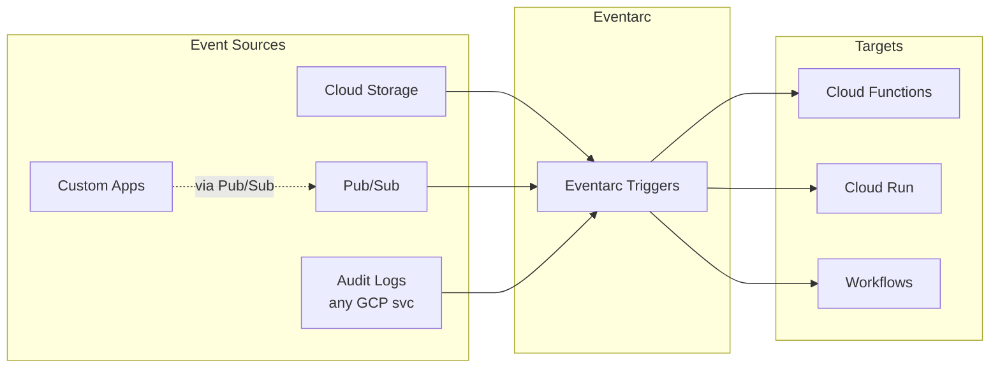
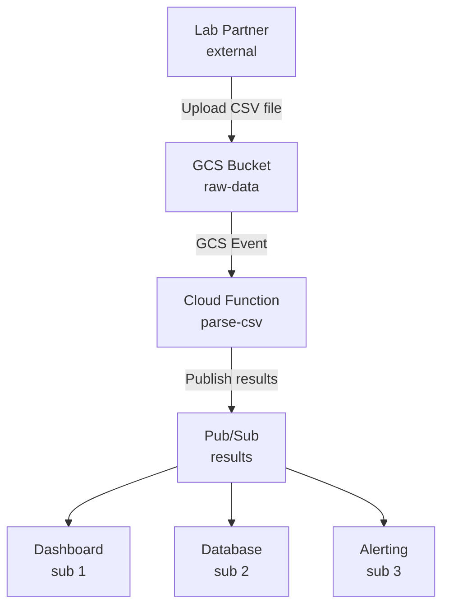

**Complexity**: [MEDIUM] | **Time to Complete**: 2h | **Prerequisites**: Module 2.4 (GCS), Module 2.7 (Cloud Run)

## What You'll Be Able to Do

After completing this module, you will be able to:

- **Deploy Cloud Functions (2nd gen) with event triggers from Pub/Sub, Cloud Storage, and Eventarc**
- **Configure Cloud Functions with VPC connectors, environment variables, and Secret Manager integration**
- **Implement event-driven architectures using Cloud Functions with dead-letter topics and retry policies**
- **Optimize Cloud Functions performance by tuning memory, concurrency, and minimum instance settings**

---

## Why This Module Matters

In March 2020, a healthcare data platform needed to process incoming patient lab results in near real-time. Each result arrived as a PDF uploaded to a Cloud Storage bucket by external lab partners. The original architecture used a VM that polled the bucket every 30 seconds, downloaded new files, parsed the PDFs, extracted structured data, and published it to downstream systems. This polling approach had three problems. First, the 30-second polling interval meant results could be delayed by up to 30 seconds---unacceptable for critical lab values. Second, the VM ran 24/7 even though uploads only happened during business hours, costing $450 per month in idle compute. Third, when a lab partner accidentally uploaded 15,000 files in a single batch (a backlog dump), the single VM took 6 hours to process them all, creating a dangerous delay in critical result delivery.

The team replaced the polling VM with a Cloud Function triggered by Cloud Storage events. Each upload immediately triggered the function, eliminating the polling delay. Cloud Functions automatically scaled to process 15,000 files concurrently, completing the batch in under 4 minutes instead of 6 hours. The monthly compute cost dropped from $450 to $12 because the functions only ran when files were uploaded. The total engineering time to build and deploy the solution was two days.

This is the essence of event-driven architecture: **instead of constantly checking for things to do, you react to events as they happen**. Cloud Functions is GCP's function-as-a-service offering that lets you write small, focused pieces of code that execute in response to events. In this module, you will learn the difference between Gen 1 and Gen 2 Cloud Functions, the various trigger mechanisms, how Eventarc enables event-driven workflows, and how to build a practical event pipeline from Cloud Storage to Pub/Sub.

---

## Gen 1 vs Gen 2: Which to Choose

Cloud Functions has two generations, and understanding the differences is critical for choosing the right one.

| Feature | Gen 1 | Gen 2 |
| :--- | :--- | :--- |
| **Runtime** | Custom sandboxed environment | Built on Cloud Run |
| **Max timeout** | 540 seconds (9 minutes) | 3,600 seconds (60 minutes) |
| **Max memory** | 8 GB | 32 GB |
| **Max concurrency** | 1 request per instance | Up to 1,000 requests per instance |
| **Min instances** | Not supported | Supported (reduce cold starts) |
| **Traffic splitting** | Not supported | Supported (via Cloud Run) |
| **VPC connectivity** | VPC Access Connector | Direct VPC Egress or Connector |
| **Event triggers** | Cloud Storage, Pub/Sub, HTTP, Firestore | All of Gen 1 + Eventarc (100+ event sources) |
| **Languages** | Node.js, Python, Go, Java, .NET, Ruby, PHP | Same |
| **Recommendation** | Legacy only | Use for all new functions |

```bash
# Deploy a Gen 2 function (default since late 2023)
gcloud functions deploy my-function \
  --gen2 \
  --runtime=python312 \
  --region=us-central1 \
  --source=. \
  --entry-point=hello_http \
  --trigger-http \
  --allow-unauthenticated

# Deploy a Gen 1 function (legacy, avoid for new work)
gcloud functions deploy my-function-v1 \
  --no-gen2 \
  --runtime=python312 \
  --region=us-central1 \
  --source=. \
  --entry-point=hello_http \
  --trigger-http
```

**Why Gen 2 matters**: Because Gen 2 is built on Cloud Run, each function instance can handle multiple concurrent requests. A Gen 1 function processing 100 concurrent requests needs 100 instances. A Gen 2 function with concurrency set to 50 needs only 2 instances. This drastically reduces costs and cold starts.

> **Stop and think**: If Gen 2 instances can handle multiple requests concurrently, how does this affect the memory and CPU requirements of the instance itself compared to a Gen 1 instance handling a single request?

---

## HTTP Triggers: Request-Response Functions

The simplest trigger type. Your function receives an HTTP request and returns a response.

### Python Example

```python
# main.py
import functions_framework
from flask import jsonify

@functions_framework.http
def hello_http(request):
    """HTTP Cloud Function.
    Args:
        request (flask.Request): The request object.
    Returns:
        Response object using flask.jsonify.
    """
    name = request.args.get("name", "World")

    return jsonify({
        "message": f"Hello, {name}!",
        "method": request.method,
        "path": request.path
    })
```

```text
# requirements.txt
functions-framework==3.*
flask>=3.0.0
```

```bash
# Deploy the HTTP function
gcloud functions deploy hello-api \
  --gen2 \
  --runtime=python312 \
  --region=us-central1 \
  --source=. \
  --entry-point=hello_http \
  --trigger-http \
  --allow-unauthenticated \
  --memory=256Mi \
  --timeout=60

# Test it
FUNCTION_URL=$(gcloud functions describe hello-api \
  --gen2 --region=us-central1 --format="value(serviceConfig.uri)")

curl "$FUNCTION_URL?name=KubeDojo"
```

### Node.js Example

```javascript
// index.js
const functions = require('@google-cloud/functions-framework');

functions.http('helloHttp', (req, res) => {
  const name = req.query.name || 'World';
  res.json({
    message: `Hello, ${name}!`,
    timestamp: new Date().toISOString()
  });
});
```

```json
{
  "dependencies": {
    "@google-cloud/functions-framework": "^3.0.0"
  }
}
```

---

## Cloud Storage Triggers: Reacting to File Events

Cloud Storage triggers fire when objects are created, deleted, archived, or have their metadata updated in a bucket.

### Event Types

| Event | Gen 1 Trigger | Gen 2 (Eventarc) Event Type |
| :--- | :--- | :--- |
| **Object created** | `google.storage.object.finalize` | `google.cloud.storage.object.v1.finalized` |
| **Object deleted** | `google.storage.object.delete` | `google.cloud.storage.object.v1.deleted` |
| **Object archived** | `google.storage.object.archive` | `google.cloud.storage.object.v1.archived` |
| **Metadata updated** | `google.storage.object.metadataUpdate` | `google.cloud.storage.object.v1.metadataUpdated` |

### Processing Uploaded Files

```python
# main.py
import functions_framework
from google.cloud import storage
import json

@functions_framework.cloud_event
def process_upload(cloud_event):
    """Triggered by a Cloud Storage event.

    Args:
        cloud_event: The CloudEvent containing the GCS event data.
    """
    data = cloud_event.data

    bucket_name = data["bucket"]
    file_name = data["name"]
    content_type = data.get("contentType", "unknown")
    size = data.get("size", "unknown")

    print(f"Processing: gs://{bucket_name}/{file_name}")
    print(f"Content-Type: {content_type}, Size: {size} bytes")

    # Example: Read the file, process it, write results
    client = storage.Client()
    bucket = client.bucket(bucket_name)
    blob = bucket.blob(file_name)

    # Only process CSV files
    if not file_name.endswith(".csv"):
        print(f"Skipping non-CSV file: {file_name}")
        return

    content = blob.download_as_text()
    line_count = len(content.strip().split("\n"))

    # Write a processing receipt
    receipt = {
        "source_file": file_name,
        "line_count": line_count,
        "status": "processed"
    }

    receipt_blob = bucket.blob(f"receipts/{file_name}.json")
    receipt_blob.upload_from_string(
        json.dumps(receipt),
        content_type="application/json"
    )

    print(f"Processed {file_name}: {line_count} lines")
```

```bash
# Deploy with Cloud Storage trigger (Gen 2 / Eventarc)
gcloud functions deploy process-upload \
  --gen2 \
  --runtime=python312 \
  --region=us-central1 \
  --source=. \
  --entry-point=process_upload \
  --trigger-event-filters="type=google.cloud.storage.object.v1.finalized" \
  --trigger-event-filters="bucket=my-data-bucket" \
  --memory=512Mi \
  --timeout=120

# Test by uploading a file
echo "name,email,city
Alice,alice@example.com,NYC
Bob,bob@example.com,London" | gcloud storage cp - gs://my-data-bucket/data/users.csv

# Check the function logs
gcloud functions logs read process-upload \
  --gen2 --region=us-central1 --limit=20
```

---

## Eventarc: The Event Router

Eventarc is the unified event routing layer for GCP. It connects event sources (Cloud Storage, Pub/Sub, Cloud Audit Logs, and 100+ GCP services) to event targets (Cloud Functions, Cloud Run, GKE, Workflows).



> **Pause and predict**: If Eventarc relies on Cloud Audit Logs for many of its triggers, what does that mean for the latency between an action occurring and your function being triggered?

### Creating Eventarc Triggers

```bash
# Trigger on Cloud Audit Log events (e.g., when a VM is created)
gcloud eventarc triggers create vm-created-trigger \
  --location=us-central1 \
  --destination-run-service=audit-handler \
  --destination-run-region=us-central1 \
  --event-filters="type=google.cloud.audit.log.v1.written" \
  --event-filters="serviceName=compute.googleapis.com" \
  --event-filters="methodName=v1.compute.instances.insert" \
  --service-account=eventarc-sa@my-project.iam.gserviceaccount.com

# Trigger on Pub/Sub messages
gcloud eventarc triggers create pubsub-trigger \
  --location=us-central1 \
  --destination-run-service=message-processor \
  --destination-run-region=us-central1 \
  --transport-topic=my-topic \
  --event-filters="type=google.cloud.pubsub.topic.v1.messagePublished" \
  --service-account=eventarc-sa@my-project.iam.gserviceaccount.com

# List triggers
gcloud eventarc triggers list --location=us-central1

# List available event types
gcloud eventarc providers list --location=us-central1
```

### Eventarc vs Direct Triggers

| Approach | How It Works | When to Use |
| :--- | :--- | :--- |
| **Direct trigger** (Gen 1 style) | Function directly subscribes to event source | Simple setups, single trigger per function |
| **Eventarc trigger** | Event routed through Eventarc's event bus | Complex routing, audit log events, multiple targets, filtering |

---

## Pub/Sub Integration: Decoupled Processing

Pub/Sub is the messaging backbone for event-driven architectures in GCP. Cloud Functions can both consume and produce Pub/Sub messages.

### Pub/Sub-Triggered Function

```python
# main.py
import base64
import json
import functions_framework

@functions_framework.cloud_event
def process_message(cloud_event):
    """Triggered by a Pub/Sub message.

    Args:
        cloud_event: The CloudEvent containing Pub/Sub message data.
    """
    # Decode the Pub/Sub message
    message_data = base64.b64decode(
        cloud_event.data["message"]["data"]
    ).decode("utf-8")

    attributes = cloud_event.data["message"].get("attributes", {})

    print(f"Received message: {message_data}")
    print(f"Attributes: {attributes}")

    # Process the message
    payload = json.loads(message_data)
    # ... your business logic here
```

```bash
# Create a Pub/Sub topic
gcloud pubsub topics create file-events

# Deploy function triggered by Pub/Sub
gcloud functions deploy process-message \
  --gen2 \
  --runtime=python312 \
  --region=us-central1 \
  --source=. \
  --entry-point=process_message \
  --trigger-topic=file-events \
  --memory=256Mi

# Test by publishing a message
gcloud pubsub topics publish file-events \
  --message='{"file": "data.csv", "action": "process"}' \
  --attribute="source=upload-api,priority=high"

# Check logs
gcloud functions logs read process-message \
  --gen2 --region=us-central1 --limit=10
```

---

## Building an Event Pipeline: GCS to Function to Pub/Sub

A common pattern: a file upload triggers a Cloud Function that processes the file and publishes results to Pub/Sub for downstream consumers.



### The Pipeline Function

```python
# main.py
import csv
import io
import json
import functions_framework
from google.cloud import storage, pubsub_v1

publisher = pubsub_v1.PublisherClient()
PROJECT_ID = "my-project"
RESULTS_TOPIC = f"projects/{PROJECT_ID}/topics/processed-results"

@functions_framework.cloud_event
def parse_csv(cloud_event):
    """Parse uploaded CSV and publish results to Pub/Sub."""
    data = cloud_event.data
    bucket_name = data["bucket"]
    file_name = data["name"]

    # Skip non-CSV files and avoid infinite loops from receipts
    if not file_name.endswith(".csv") or file_name.startswith("receipts/"):
        print(f"Skipping: {file_name}")
        return

    print(f"Processing: gs://{bucket_name}/{file_name}")

    # Download and parse CSV
    client = storage.Client()
    bucket = client.bucket(bucket_name)
    blob = bucket.blob(file_name)
    content = blob.download_as_text()

    reader = csv.DictReader(io.StringIO(content))
    records_processed = 0

    for row in reader:
        # Publish each row as a Pub/Sub message
        message = json.dumps({
            "source_file": file_name,
            "data": dict(row),
            "timestamp": data.get("timeCreated", "")
        }).encode("utf-8")

        future = publisher.publish(
            RESULTS_TOPIC,
            message,
            source_file=file_name,
            content_type="application/json"
        )
        future.result()  # Wait for publish to complete
        records_processed += 1

    print(f"Published {records_processed} records from {file_name}")
```

```text
# requirements.txt
functions-framework==3.*
google-cloud-storage>=2.14.0
google-cloud-pubsub>=2.19.0
```

```bash
# Create the Pub/Sub topic for results
gcloud pubsub topics create processed-results

# Create a subscription (for testing)
gcloud pubsub subscriptions create results-sub \
  --topic=processed-results

# Deploy the pipeline function
gcloud functions deploy parse-csv \
  --gen2 \
  --runtime=python312 \
  --region=us-central1 \
  --source=. \
  --entry-point=parse_csv \
  --trigger-event-filters="type=google.cloud.storage.object.v1.finalized" \
  --trigger-event-filters="bucket=raw-data-bucket" \
  --memory=512Mi \
  --timeout=120 \
  --service-account=csv-processor@my-project.iam.gserviceaccount.com

# Test the pipeline
echo "patient_id,result,value
P001,glucose,95
P002,glucose,142
P003,hemoglobin,13.5" | gcloud storage cp - gs://raw-data-bucket/lab-results-2024-01-15.csv

# Check function logs
gcloud functions logs read parse-csv \
  --gen2 --region=us-central1 --limit=20

# Pull messages from the subscription
gcloud pubsub subscriptions pull results-sub --limit=5 --auto-ack
```

---

## Error Handling and Retries

### Retry Behavior

| Trigger Type | Default Retry | Configurable |
| :--- | :--- | :--- |
| **HTTP** | No retry (caller must retry) | N/A |
| **Cloud Storage** | Retries for 7 days | Yes (can disable) |
| **Pub/Sub** | Retries until ack deadline | Yes (ack deadline, retry policy) |
| **Eventarc** | Retries for 24 hours | Yes |

```bash
# Deploy with retries disabled (for functions that should not retry)
gcloud functions deploy my-function \
  --gen2 \
  --runtime=python312 \
  --region=us-central1 \
  --source=. \
  --entry-point=process_upload \
  --trigger-event-filters="type=google.cloud.storage.object.v1.finalized" \
  --trigger-event-filters="bucket=my-bucket" \
  --retry
  # Use --no-retry to disable retries
```

### Idempotency: The Golden Rule

Event-driven functions **must be idempotent**---processing the same event twice should produce the same result. Events can be delivered more than once.

> **Stop and think**: If an event ID is the best way to deduplicate events, where should you store these processed IDs, and how long should you retain them?

```python
# BAD: Not idempotent (counter increments on every retry)
def process_event(cloud_event):
    db.execute("UPDATE counters SET count = count + 1 WHERE id = ?", event_id)

# GOOD: Idempotent (uses event ID to deduplicate)
def process_event(cloud_event):
    event_id = cloud_event["id"]

    # Check if we already processed this event
    if db.execute("SELECT 1 FROM processed_events WHERE id = ?", event_id):
        print(f"Already processed event {event_id}, skipping")
        return

    # Process the event
    db.execute("INSERT INTO processed_events (id) VALUES (?)", event_id)
    db.execute("UPDATE counters SET count = count + 1 WHERE id = ?", event_id)
```

---

## Did You Know?

1. **Cloud Functions Gen 2 is built entirely on Cloud Run**. When you deploy a Gen 2 function, GCP creates a Cloud Run service behind the scenes. You can actually see it in the Cloud Run console. This means Gen 2 functions inherit all Cloud Run features: traffic splitting, min instances, concurrency, and Direct VPC Egress.

2. **Cloud Functions can be triggered by over 120 GCP event types** through Eventarc. This includes events from services you might not expect: BigQuery job completions, Cloud SQL instance restarts, IAM policy changes, and even GKE cluster events. Any GCP service that writes to Cloud Audit Logs can trigger a function.

3. **The cold start time for a Python Cloud Function is typically 200-800 milliseconds**. For Node.js, it is 100-500ms. For Java, it can be 3-10 seconds due to JVM startup. Setting `--min-instances=1` on Gen 2 functions eliminates cold starts by keeping at least one instance warm at all times (at a cost of ~$5-10/month for a small function).

4. **Eventarc can filter events using CEL (Common Expression Language) expressions**. This means you can create triggers that only fire for specific conditions---for example, only when a file with a `.csv` extension is uploaded, or only when a VM in a specific zone is created. This reduces unnecessary function invocations and saves money.

---

## Common Mistakes

| Mistake | Why It Happens | How to Fix It |
| :--- | :--- | :--- |
| Using Gen 1 for new functions | Old tutorials reference Gen 1 | Always use `--gen2` for new functions |
| Not handling retries (non-idempotent code) | Developers assume exactly-once delivery | Always implement idempotency using event IDs |
| Function triggers infinite loop | Function writes to the same bucket it is triggered by | Use prefixes to separate input/output, or use a different bucket |
| Setting timeout too low | Default of 60s seems enough | Set timeout based on worst-case processing time; Gen 2 supports up to 3600s |
| Not using concurrency on Gen 2 | Default is 1 (same as Gen 1) | Set `--concurrency=80` for I/O-bound functions to reduce instances and cost |
| Ignoring cold start impact | Works fine in testing | Set `--min-instances=1` for latency-sensitive functions |
| Hardcoding project ID in function code | Works in development | Use environment variables or the metadata server for project ID |
| Not creating a dedicated service account | Default SA has Editor role | Create a function-specific SA with minimal permissions |

---

## Quiz

<details>
<summary>1. You are migrating a high-traffic image processing API to Cloud Functions. The API receives sporadic bursts of thousands of requests per second. Your team is debating whether to use Gen 1 or Gen 2 functions. Which generation should you choose and why is its underlying architecture better suited for this scenario?</summary>

You should choose Gen 2 Cloud Functions because it is built entirely on Cloud Run. This architectural shift allows a single Gen 2 instance to handle up to 1,000 concurrent requests, whereas Gen 1 can only handle one request per instance. For bursty workloads, Gen 2 will drastically reduce the number of instances required, significantly lowering your costs. Additionally, Gen 2 supports setting minimum instances to eliminate cold starts during traffic spikes.
</details>

<details>
<summary>2. A financial services company deployed a Cloud Function triggered by Pub/Sub to process bank transfers. A week later, they discovered several duplicate transfers in their database. The code logic for creating the transfer is correct. What fundamental property of event-driven architectures in GCP did the developers likely ignore, and how should it be addressed?</summary>

The developers likely ignored the principle of idempotency, failing to account for GCP's "at-least-once" delivery guarantee. Event-driven systems in GCP, like Pub/Sub and Eventarc, may deliver the same event multiple times due to retries or network anomalies. If the function does not check whether a transfer was already processed, a duplicate event will result in a duplicate database entry. The function must be made idempotent by verifying the unique event ID against a database of processed events before executing the transfer logic.
</details>

<details>
<summary>3. A developer writes a Gen 2 Cloud Function to resize images. The function triggers when an image is uploaded to `company-media-bucket`, resizes it, and saves the new image back to `company-media-bucket`. Shortly after deployment, the GCP billing alert triggers due to massive function invocations. What caused this, and what are two architectural ways to fix it?</summary>

The function created an infinite loop because saving the resized image back to the same bucket triggered the function again, and this cycle continued indefinitely. To fix this, the developer should separate the input and output boundaries. The most robust solution is to use a completely different bucket for the output images. Alternatively, if using the same bucket is mandatory, the developer must use prefix filtering (e.g., trigger only on `raw/` uploads) and ensure the resized image is saved to a different prefix (e.g., `processed/`) that the function is not listening to.
</details>

<details>
<summary>4. Your security team requires a Cloud Function to run and notify a Slack channel whenever a new IAM policy is applied or a Cloud SQL instance is restarted anywhere in your GCP project. Standard Cloud Functions triggers (HTTP, GCS, Pub/Sub) do not support these services directly. Which GCP service must you use to route these events to your function, and how does it integrate with them?</summary>

You must use Eventarc to route these complex events to your Cloud Function. Eventarc acts as a unified event router that can trigger functions based on actions from over 120 GCP services by hooking into Cloud Audit Logs. Whenever an action (like an IAM change or SQL restart) writes an entry to Cloud Audit Logs, Eventarc captures it and forwards it as a standardized CloudEvent to your function. You can use Eventarc's filtering capabilities to ensure the function only triggers for the specific resource types and methods the security team cares about.
</details>

<details>
<summary>5. You have two Gen 2 Cloud Functions. Function A calls a third-party REST API and waits 5 seconds for a response. Function B transcodes a 4K video using FFmpeg, utilizing 100% of the CPU for 30 seconds. To optimize costs and performance, how should you configure the concurrency setting for each function?</summary>

You should set a high concurrency (e.g., 80) for Function A and leave concurrency at 1 for Function B. Function A is heavily I/O-bound; it spends almost all its time waiting for the network, so a single instance can easily juggle many concurrent requests while waiting, significantly reducing instance costs. Function B is completely CPU-bound; if you increased its concurrency, multiple transcoding tasks would fight for the same CPU resources, drastically slowing down processing and likely causing timeouts. By keeping Function B at a concurrency of 1, you ensure each invocation gets dedicated CPU time to complete the intensive transcoding task efficiently.
</details>

<details>
<summary>6. A new team member is writing a Gen 2 Python Cloud Function triggered by Cloud Storage uploads. They need to extract the filename and the unique event identifier to ensure idempotency. They are using the `@functions_framework.cloud_event` decorator but are unsure how to parse the incoming object. Where precisely in the function arguments will they find the filename and the event ID?</summary>

The team member will find these values within the attributes of the `cloud_event` object passed to the function. The filename (along with bucket name, content type, and size) is located inside the data payload dictionary, accessed via `cloud_event.data["name"]`. The unique event identifier, which is crucial for building idempotent logic, is a top-level attribute of the CloudEvent standard and is accessed directly via `cloud_event["id"]`. Understanding this structure is essential because the data payload contains the resource-specific details, while the top-level attributes provide the standardized routing and identification metadata required by Eventarc.
</details>

---

## Hands-On Exercise: GCS Upload to Cloud Function to Pub/Sub Pipeline

### Objective

Build an event-driven pipeline: uploading a file to Cloud Storage triggers a Cloud Function that processes the file and publishes results to Pub/Sub.

### Prerequisites

- `gcloud` CLI installed and authenticated
- A GCP project with billing enabled
- Python 3.12 installed locally (for local testing)

### Tasks

**Task 1: Create the Infrastructure**

<details>
<summary>Solution</summary>

```bash
export PROJECT_ID=$(gcloud config get-value project)
export REGION=us-central1

# Enable APIs
gcloud services enable \
  cloudfunctions.googleapis.com \
  cloudbuild.googleapis.com \
  eventarc.googleapis.com \
  pubsub.googleapis.com \
  storage.googleapis.com \
  run.googleapis.com

# Create a GCS bucket for uploads
export BUCKET="${PROJECT_ID}-upload-lab"
gcloud storage buckets create gs://$BUCKET \
  --location=$REGION

# Create a Pub/Sub topic for processed results
gcloud pubsub topics create processed-files

# Create a subscription for testing
gcloud pubsub subscriptions create processed-files-sub \
  --topic=processed-files

# Create a service account for the function
gcloud iam service-accounts create func-processor \
  --display-name="File Processor Function SA"

export FUNC_SA="func-processor@${PROJECT_ID}.iam.gserviceaccount.com"

# Grant permissions
gcloud projects add-iam-binding $PROJECT_ID \
  --member="serviceAccount:$FUNC_SA" \
  --role="roles/storage.objectViewer"

gcloud projects add-iam-binding $PROJECT_ID \
  --member="serviceAccount:$FUNC_SA" \
  --role="roles/pubsub.publisher"

# Grant Eventarc permissions
gcloud projects add-iam-binding $PROJECT_ID \
  --member="serviceAccount:$FUNC_SA" \
  --role="roles/eventarc.eventReceiver"
```
</details>

**Task 2: Write the Cloud Function**

<details>
<summary>Solution</summary>

```bash
mkdir -p /tmp/func-lab && cd /tmp/func-lab

cat > main.py << 'PYEOF'
import json
import functions_framework
from google.cloud import storage, pubsub_v1
import os

publisher = pubsub_v1.PublisherClient()
PROJECT_ID = os.environ.get("GCP_PROJECT", os.environ.get("GOOGLE_CLOUD_PROJECT", ""))
TOPIC_PATH = f"projects/{PROJECT_ID}/topics/processed-files"

@functions_framework.cloud_event
def process_file(cloud_event):
    """Process uploaded file and publish summary to Pub/Sub."""
    data = cloud_event.data
    bucket_name = data["bucket"]
    file_name = data["name"]
    event_id = cloud_event["id"]

    # Skip non-txt and non-csv files
    if not (file_name.endswith(".txt") or file_name.endswith(".csv")):
        print(f"Skipping unsupported file type: {file_name}")
        return

    print(f"Processing event {event_id}: gs://{bucket_name}/{file_name}")

    # Download and analyze
    client = storage.Client()
    bucket = client.bucket(bucket_name)
    blob = bucket.blob(file_name)
    content = blob.download_as_text()

    lines = content.strip().split("\n")
    line_count = len(lines)
    char_count = len(content)
    word_count = len(content.split())

    # Build summary
    summary = {
        "event_id": event_id,
        "file": f"gs://{bucket_name}/{file_name}",
        "line_count": line_count,
        "word_count": word_count,
        "char_count": char_count,
        "size_bytes": int(data.get("size", 0)),
        "content_type": data.get("contentType", "unknown")
    }

    # Publish to Pub/Sub
    message = json.dumps(summary).encode("utf-8")
    future = publisher.publish(
        TOPIC_PATH,
        message,
        source_file=file_name,
        event_id=event_id
    )
    message_id = future.result()

    print(f"Published summary to Pub/Sub (message ID: {message_id})")
    print(f"Summary: {json.dumps(summary, indent=2)}")
PYEOF

cat > requirements.txt << 'EOF'
functions-framework==3.*
google-cloud-storage>=2.14.0
google-cloud-pubsub>=2.19.0
EOF

echo "Function source created."
```
</details>

**Task 3: Deploy the Cloud Function**

<details>
<summary>Solution</summary>

```bash
cd /tmp/func-lab

gcloud functions deploy process-file \
  --gen2 \
  --runtime=python312 \
  --region=$REGION \
  --source=. \
  --entry-point=process_file \
  --trigger-event-filters="type=google.cloud.storage.object.v1.finalized" \
  --trigger-event-filters="bucket=$BUCKET" \
  --service-account=$FUNC_SA \
  --memory=256Mi \
  --timeout=120 \
  --set-env-vars="GCP_PROJECT=$PROJECT_ID"

# Verify deployment
gcloud functions describe process-file \
  --gen2 --region=$REGION \
  --format="yaml(name, state, serviceConfig.uri)"
```
</details>

**Task 4: Test the Pipeline**

<details>
<summary>Solution</summary>

```bash
# Upload a test file
cat > /tmp/test-data.csv << 'EOF'
name,department,salary
Alice,Engineering,125000
Bob,Marketing,95000
Charlie,Engineering,130000
Diana,Sales,88000
Eve,Engineering,118000
EOF

gcloud storage cp /tmp/test-data.csv gs://$BUCKET/test-data.csv

# Wait for processing
echo "Waiting for function to process..."
sleep 15

# Check function logs
gcloud functions logs read process-file \
  --gen2 --region=$REGION --limit=10

# Pull the Pub/Sub message
gcloud pubsub subscriptions pull processed-files-sub \
  --limit=5 --auto-ack

# Upload another file
echo "This is a simple text file for testing.
It has multiple lines.
Each line will be counted." > /tmp/test-note.txt

gcloud storage cp /tmp/test-note.txt gs://$BUCKET/test-note.txt

sleep 10

# Check for the second message
gcloud pubsub subscriptions pull processed-files-sub \
  --limit=5 --auto-ack
```
</details>

**Task 5: Test Filtering (Non-Matching Files)**

<details>
<summary>Solution</summary>

```bash
# Upload a file that should be skipped (not .txt or .csv)
echo '{"key": "value"}' | gcloud storage cp - gs://$BUCKET/test.json

sleep 10

# Check logs - should show "Skipping unsupported file type"
gcloud functions logs read process-file \
  --gen2 --region=$REGION --limit=5

# No Pub/Sub message should appear for .json files
gcloud pubsub subscriptions pull processed-files-sub --limit=5 --auto-ack
```
</details>

**Task 6: Clean Up**

<details>
<summary>Solution</summary>

```bash
# Delete the function
gcloud functions delete process-file \
  --gen2 --region=$REGION --quiet

# Delete Pub/Sub resources
gcloud pubsub subscriptions delete processed-files-sub --quiet
gcloud pubsub topics delete processed-files --quiet

# Delete GCS bucket
gcloud storage rm -r gs://$BUCKET/
gcloud storage buckets delete gs://$BUCKET

# Delete service account
gcloud iam service-accounts delete $FUNC_SA --quiet

# Clean up local files
rm -rf /tmp/func-lab /tmp/test-data.csv /tmp/test-note.txt

echo "Cleanup complete."
```
</details>

### Success Criteria

- [ ] GCS bucket, Pub/Sub topic, and service account created
- [ ] Cloud Function deployed with GCS trigger
- [ ] Uploading a CSV file triggers the function
- [ ] Function publishes a summary message to Pub/Sub
- [ ] Non-matching file types are skipped (no Pub/Sub message)
- [ ] All resources cleaned up

---

## Next Module

Next up: **[Module 2.9: Secret Manager](../module-2.9-secret-manager/)** --- Learn how to securely store and manage secrets, control access with IAM, version and rotate secrets, and integrate them with Cloud Run and Compute Engine.