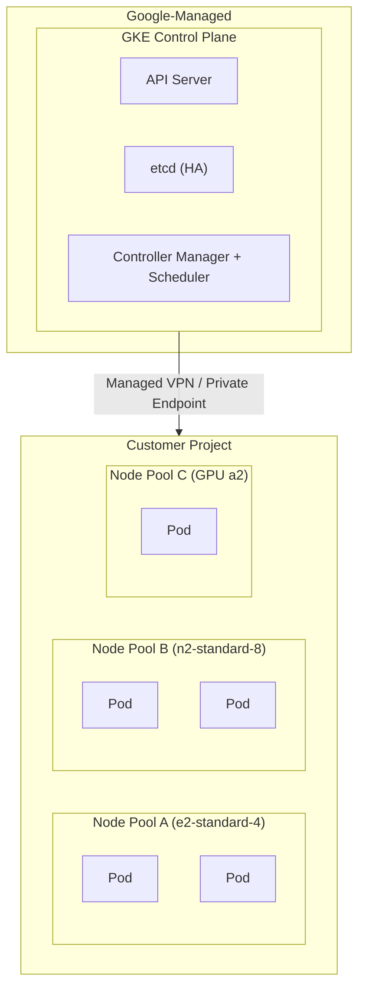
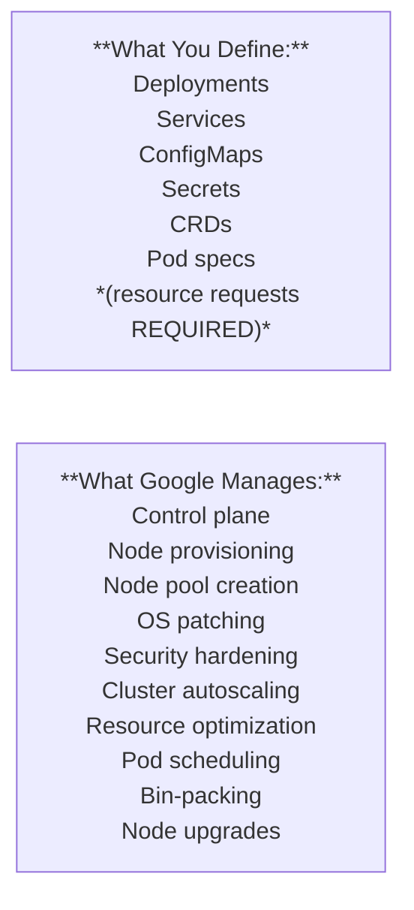
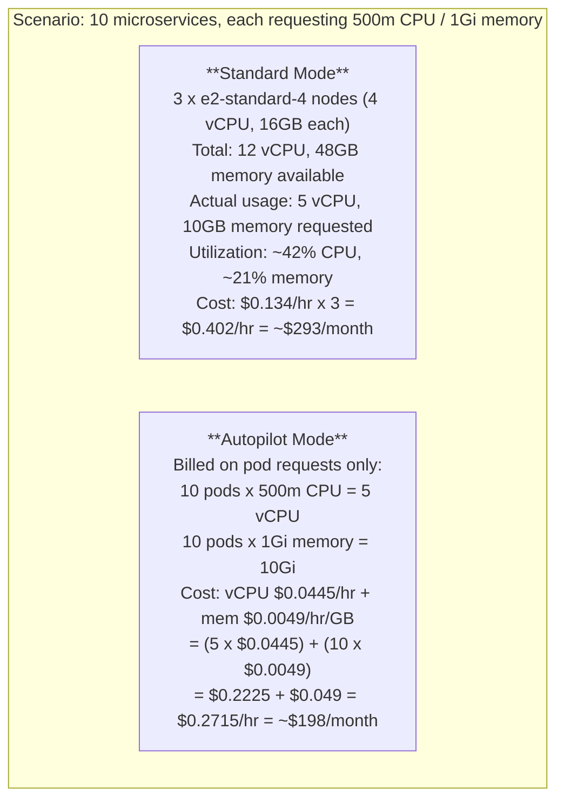
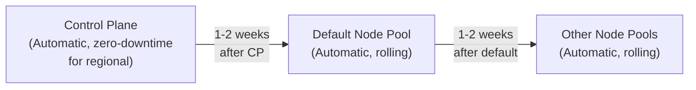
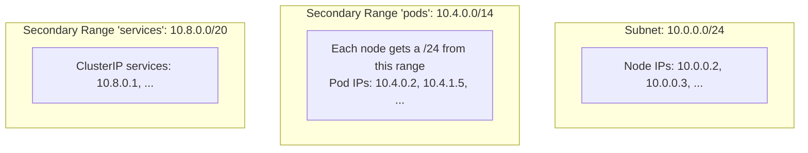

**Complexity**: [MEDIUM] | **Time to Complete**: 2h | **Prerequisites**: GCP Essentials, Cloud Architecture Patterns

## What You'll Be Able to Do

After completing this module, you will be able to:

- **Configure GKE Standard and Autopilot clusters with release channels, regional topology, and node auto-provisioning**
- **Evaluate GKE Standard vs Autopilot mode for workload requirements including GPU, DaemonSet, and cost constraints**
- **Implement GKE cluster upgrade strategies using release channels, maintenance windows, and surge upgrades**
- **Design regional GKE clusters with multi-zonal node pools for high-availability production workloads**

---

## Why This Module Matters

A team can still suffer upgrade-related outages on a managed Kubernetes service if they choose an aggressive release cadence and don't test their manifests against the next Kubernetes version before production rollouts.

This story captures the central tension of GKE: Google manages massive amounts of infrastructure for you, but you still need to understand what decisions GKE is making on your behalf. The choice between Standard and Autopilot mode, the selection of a release channel, the configuration of regional versus zonal clusters, and the behavior of auto-upgrades and auto-repair all have direct consequences for your application's availability, cost, and security posture.

In this module, you will learn the GKE architecture from the ground up: how the control plane and node pools work, the fundamental differences between Standard and Autopilot modes, how release channels govern your upgrade lifecycle, and how to make informed decisions about cluster topology. By the end, you will deploy the same application to both Standard and Autopilot clusters and compare the operational experience.

---

## GKE Architecture Fundamentals

Before choosing between Standard and Autopilot, you need to understand what GKE actually provisions when you create a cluster.

### Control Plane and Node Architecture

Every GKE cluster consists of two layers: the **control plane** (managed entirely by Google) and the **nodes** (where your workloads run).



Key facts about the GKE control plane:

- **Cluster fee and free tier**: GKE charges a cluster management fee, and the free tier provides monthly credits equivalent to one free Autopilot or zonal Standard cluster per billing account; regional cluster fees aren't covered by that credit.
- **SLA-backed**: [Regional clusters provide a 99.95% SLA for the control plane. Zonal clusters offer 99.5%.](https://cloud.google.com/kubernetes-engine/pricing)
- **Invisible**: You cannot SSH into the control plane. You interact with it exclusively through the Kubernetes API.
- **Auto-scaled**: Google automatically scales control plane resources based on the number of nodes, pods, and API request volume.

### [Regional vs Zonal Clusters](https://cloud.google.com/kubernetes-engine/docs/concepts/regional-clusters)

This is one of the first decisions you make when creating a GKE cluster, and it has significant implications.

| Aspect | Zonal Cluster | Regional Cluster |
| :--- | :--- | :--- |
| **Control plane** | Single zone (1 replica) | Three zones (3 replicas) |
| **Control plane SLA** | 99.5% | 99.95% |
| **Node distribution** | Single zone (default) | Spread across 3 zones |
| **Control plane upgrade** | Temporary control plane unavailability during upgrades | Highly available rolling upgrades with continued API access |
| **Cost** | Lower (fewer nodes by default) | Higher (3x nodes by default) |
| **Best for** | Dev/test, cost-sensitive | Production workloads |

```bash
# Create a regional cluster (recommended for production)
gcloud container clusters create prod-cluster \
  --region=us-central1 \
  --num-nodes=2 \
  --machine-type=e2-standard-4 \
  --release-channel=regular

# This creates 2 nodes PER ZONE (3 zones) = 6 nodes total
# Many teams are surprised by this multiplication

# Create a zonal cluster (for dev/test)
gcloud container clusters create dev-cluster \
  --zone=us-central1-a \
  --num-nodes=3 \
  --machine-type=e2-standard-2 \
  --release-channel=rapid
```

**War Story**: Regional clusters can create more nodes than teams expect because node counts are distributed across zones. In the default three-zone layout, a `--num-nodes` value applies per zone rather than as a single cluster-wide total, so plan capacity and cost accordingly.

---

## Standard Mode: Full Control

Standard mode is the original GKE experience. You manage node pools, choose machine types, configure autoscaling, and handle node-level operations. Google manages only the control plane.

### Node Pools

A node pool is a group of nodes within a cluster that share the same configuration. You can have multiple node pools with different machine types, taints, labels, and scaling behavior.

```bash
# Create a cluster with a default node pool
gcloud container clusters create standard-cluster \
  --region=us-central1 \
  --num-nodes=1 \
  --machine-type=e2-standard-4 \
  --release-channel=regular \
  --enable-ip-alias \
  --workload-pool=$(gcloud config get-value project).svc.id.goog

# Add a high-memory node pool for databases
gcloud container node-pools create highmem-pool \
  --cluster=standard-cluster \
  --region=us-central1 \
  --machine-type=n2-highmem-8 \
  --num-nodes=1 \
  --node-taints=workload=database:NoSchedule \
  --node-labels=tier=database \
  --enable-autoscaling \
  --min-nodes=1 \
  --max-nodes=5

# Add a spot node pool for batch workloads (60-91% cheaper)
gcloud container node-pools create spot-pool \
  --cluster=standard-cluster \
  --region=us-central1 \
  --machine-type=e2-standard-8 \
  --spot \
  --num-nodes=0 \
  --enable-autoscaling \
  --min-nodes=0 \
  --max-nodes=20 \
  --node-taints=cloud.google.com/gke-spot=true:NoSchedule
```

### Cluster Autoscaler vs Node Auto-Provisioning

Standard mode offers two approaches to scaling nodes:

| Feature | Cluster Autoscaler | Node Auto-Provisioning (NAP) |
| :--- | :--- | :--- |
| **What it does** | Scales existing node pools up/down | Creates entirely new node pools on demand |
| **You define** | Min/max per node pool | Resource limits (total CPU, memory, GPU) |
| **Machine types** | Fixed per pool | GKE chooses optimal machine type |
| **Flexibility** | Lower (pre-defined pools) | Higher (adapts to workload needs) |
| **Complexity** | Simpler to understand | More "magic" happening behind the scenes |

```bash
# Enable Node Auto-Provisioning
gcloud container clusters update standard-cluster \
  --region=us-central1 \
  --enable-autoprovisioning \
  --autoprovisioning-max-cpu=100 \
  --autoprovisioning-max-memory=400 \
  --autoprovisioning-min-cpu=4 \
  --autoprovisioning-min-memory=16
```

With NAP enabled, if a pod requests a GPU and no GPU node pool exists, [GKE will automatically create one. When the pod finishes and the pool is idle, GKE scales it back to zero and eventually removes it.](https://cloud.google.com/kubernetes-engine/docs/concepts/node-auto-provisioning)

### What You Manage in Standard Mode

- Node pool sizing and machine types
- OS image selection (Container-Optimized OS vs Ubuntu)
- Node security patches (auto-upgrade handles this if enabled)
- System pod resource reservations
- Network policies and firewall rules
- Pod resource requests and limits (optional but strongly recommended)

> **Stop and think**: If you create a Standard cluster with a spot node pool for batch processing, but also need a few guaranteed nodes for your control applications, how would you ensure the control pods don't get scheduled on the preemptible spot nodes?

---

## Autopilot Mode: Google Manages the Nodes

[Autopilot is GKE's fully managed mode, introduced in 2021. Google manages everything except your workloads: the control plane, the nodes, the node pools, the OS patches, and the security hardening.](https://cloud.google.com/blog/products/containers-kubernetes/introducing-gke-autopilot) You only define pods.

### How Autopilot Works



```bash
# Create an Autopilot cluster
gcloud container clusters create-auto autopilot-cluster \
  --region=us-central1 \
  --release-channel=regular \
  --enable-ip-alias \
  --workload-pool=$(gcloud config get-value project).svc.id.goog
```

That single command creates a production-ready cluster. No node pools to configure, no machine types to choose, no autoscaling to tune.

### Autopilot Billing Model

This is the most important difference for budgeting. Standard mode charges for the VMs (nodes) whether or not pods are using them. Autopilot charges for the **pod resource requests** only.

| Billing Dimension | Standard Mode | Autopilot Mode |
| :--- | :--- | :--- |
| **What you pay for** | Compute Engine nodes | Usually Pod requests for general-purpose workloads, or node-based billing for workloads that request specific hardware |
| **Idle nodes** | You pay for node capacity whether Pods fully use it or not | For general-purpose Pod-based billing, you aren't separately managing idle nodes, but hardware-specific Autopilot workloads can still use node-based billing |
| **Over-provisioned pods** | Unused node capacity still costs money | Over-requesting Pod resources increases your bill, and some hardware-specific Autopilot workloads use node-based pricing instead |
| **Minimum charge** | Node cost applies even when the cluster is mostly empty | Billing depends on the Autopilot model in use; general-purpose workloads are request-based, while hardware-specific workloads use node-based pricing |
| [**Spot pricing**](https://cloud.google.com/kubernetes-engine/docs/concepts/spot-vms) | Available via Spot node pools | Available via Spot pods |

```yaml
# In Autopilot, resource requests are MANDATORY
# Autopilot will set defaults if you omit them, but you should be explicit
apiVersion: apps/v1
kind: Deployment
metadata:
  name: web-app
spec:
  replicas: 3
  selector:
    matchLabels:
      app: web-app
  template:
    metadata:
      labels:
        app: web-app
    spec:
      containers:
      - name: web
        image: nginx:1.27
        resources:
          requests:
            cpu: 250m      # Autopilot bills on this
            memory: 512Mi  # and this
          limits:
            cpu: 500m
            memory: 1Gi
```

### Autopilot Restrictions

[Autopilot enforces security best practices by restricting certain operations](https://cloud.google.com/kubernetes-engine/docs/concepts/autopilot-security):

| Restriction | Reason | Workaround |
| :--- | :--- | :--- |
| [No SSH to nodes](https://cloud.google.com/kubernetes-engine/docs/concepts/cluster-architecture) | Nodes are managed by Google | Use `kubectl exec` or `kubectl debug` |
| No privileged containers | Security hardening | Use `securityContext.capabilities` for specific caps |
| No host network/PID/IPC | Prevents node-level access | Redesign the workload |
| DaemonSets that need elevated node access are restricted | Google manages the nodes | Use only DaemonSets that comply with current Autopilot constraints or approved allowlisted workloads |
| [No custom node images](https://cloud.google.com/kubernetes-engine/docs/concepts/cluster-architecture) | Consistency guarantee | Use init containers instead |
| Resource requests strongly influence billing and scheduling | GKE uses or adjusts requests when sizing infrastructure | Explicitly specify requests so Autopilot doesn't rely on defaults or automatic adjustments |
| Pods per node are pre-configured by GKE | Scheduling density depends on the selected node configuration | You can't directly tune this setting in Autopilot |

> **Pause and predict**: If you deploy a DaemonSet to an Autopilot cluster that requires privileged access to the host network namespace to monitor traffic, what will happen when you apply the manifest?

---

## Standard vs Autopilot: The Decision Framework

This is the question every GKE user faces. Here is a decision framework based on real-world patterns.

### Choose Autopilot When

- You want to minimize operational overhead
- Your workloads have well-defined resource requests
- You do not need node-level access (SSH, custom kernels, privileged containers)
- Your team is small and cannot dedicate engineers to cluster operations
- You want pay-per-pod billing to avoid paying for idle nodes
- You are running stateless microservices or batch jobs

### Choose Standard When

- You need node-level customization (GPU drivers, custom OS, kernel tuning)
- You run workloads that require privileged access (some monitoring agents, CNI plugins)
- You want fine-grained control over node placement (specific zones, sole-tenant nodes)
- You need to optimize cost with Spot node pools and careful bin-packing
- You are running ML training workloads with GPUs or TPUs
- You have strict compliance requirements that mandate node-level controls

### Cost Comparison



The math can flip when utilization is consistently high. If your Standard cluster is tightly tuned and uses capacity efficiently, Standard can sometimes be cheaper than Autopilot.

> **Stop and think**: A team runs a fleet of 50 microservices that have highly variable traffic patterns, frequently scaling from 2 to 50 replicas and back down. They currently use Standard mode and struggle to keep node utilization above 30%. Would Autopilot be a good fit for them?

---

## Release Channels and Upgrade Strategy

GKE uses release channels to manage Kubernetes version upgrades. Understanding these is critical for production stability.

### [The Three Channels](https://cloud.google.com/kubernetes-engine/docs/concepts/release-channels)

| Channel | Upgrade Speed | Version Lag | Best For |
| :--- | :--- | :--- | :--- |
| **Rapid** | Weeks after K8s release | Newest available | Testing, non-prod, early adopters |
| **Regular** (default) | 2-3 months after Rapid | ~3 months behind latest | Most production workloads |
| **Stable** | 2-3 months after Regular | ~5 months behind latest | Risk-averse, compliance-heavy |

```bash
# Check available versions per channel
gcloud container get-server-config --region=us-central1 \
  --format="yaml(channels)"

# Create a cluster on the Stable channel
gcloud container clusters create conservative-cluster \
  --region=us-central1 \
  --release-channel=stable \
  --num-nodes=1

# Check what version your cluster is running
gcloud container clusters describe conservative-cluster \
  --region=us-central1 \
  --format="value(currentMasterVersion, currentNodeVersion)"
```

### Auto-Upgrade Behavior

[When enrolled in a release channel, GKE automatically upgrades both the control plane and nodes.](https://cloud.google.com/kubernetes-engine/docs/concepts/release-channels)



You can influence **when** upgrades happen with maintenance windows and exclusions:

```bash
# Set a maintenance window (upgrades only during this time)
gcloud container clusters update prod-cluster \
  --region=us-central1 \
  --maintenance-window-start=2024-01-01T02:00:00Z \
  --maintenance-window-end=2024-01-01T06:00:00Z \
  --maintenance-window-recurrence="FREQ=WEEKLY;BYDAY=SA,SU"

# Exclude upgrades during critical business periods
gcloud container clusters update prod-cluster \
  --region=us-central1 \
  --add-maintenance-exclusion-name=holiday-freeze \
  --add-maintenance-exclusion-start=2025-11-25T00:00:00Z \
  --add-maintenance-exclusion-end=2025-12-31T23:59:59Z \
  --add-maintenance-exclusion-scope=no_upgrades
```

### [Auto-Repair](https://cloud.google.com/kubernetes-engine/docs/how-to/node-auto-repair)

Separate from auto-upgrade, auto-repair monitors node health and replaces unhealthy nodes automatically. A node is considered unhealthy if:

- It reports a `NotReady` status for more than approximately 10 minutes
- It has no disk space
- It has a boot disk that is not functioning

```bash
# Auto-repair is enabled by default; explicitly enable it
gcloud container node-pools update default-pool \
  --cluster=prod-cluster \
  --region=us-central1 \
  --enable-autorepair

# Check node pool repair/upgrade settings
gcloud container node-pools describe default-pool \
  --cluster=prod-cluster \
  --region=us-central1 \
  --format="yaml(management)"
```

> **Pause and predict**: You are on the Regular release channel and have a maintenance window set for Saturday at 2 AM. A critical security patch is released by Google on Tuesday. When will your cluster be upgraded?

---

## Cluster Networking Basics

Every GKE cluster needs IP addresses for nodes, pods, and services. GKE strongly recommends **VPC-native clusters** (alias IP mode), [which is the default for all new clusters](https://cloud.google.com/kubernetes-engine/docs/concepts/alias-ips).

```bash
# Create a VPC-native cluster with explicit secondary ranges
gcloud container clusters create vpc-native-cluster \
  --region=us-central1 \
  --num-nodes=1 \
  --network=my-vpc \
  --subnetwork=my-subnet \
  --cluster-secondary-range-name=pods \
  --services-secondary-range-name=services \
  --enable-ip-alias

# If you let GKE manage ranges automatically:
gcloud container clusters create auto-range-cluster \
  --region=us-central1 \
  --num-nodes=1 \
  --network=my-vpc \
  --subnetwork=my-subnet \
  --enable-ip-alias \
  --cluster-ipv4-cidr=/17 \
  --services-ipv4-cidr=/22
```



---

## Did You Know?

1. **GKE Autopilot launched in February 2021** as a mode of operation designed to reduce manual node management and improve how infrastructure is matched to workload needs.

2. **The GKE control plane runs in Google-managed infrastructure** that is separate from your project's worker nodes. That's why customers interact with the control plane through managed endpoints and don't directly access the control plane VMs.

3. **GKE operates at very large scale inside Google Cloud**, which gives Google significant operational experience running Kubernetes for many customers. Avoid uncited deployment-volume rankings or causal claims about patch timing here.

4. **Maintenance exclusions are bounded by release-channel support rules**. Short "No upgrades" exclusions are limited, and longer exclusions must still end by the minor version's end-of-support date, so you can't postpone upgrades indefinitely.

---

## Common Mistakes

| Mistake | Why It Happens | How to Fix It |
| :--- | :--- | :--- |
| Using zonal clusters for production | Cheaper, simpler setup | Use regional clusters; the control plane SLA jumps from 99.5% to 99.95% |
| Choosing Rapid channel for production | "We want the latest features" | Use Regular or Stable; Rapid versions can have bugs not yet caught at scale |
| Not setting maintenance windows | Unaware that auto-upgrades can happen anytime | Configure maintenance windows to restrict upgrades to low-traffic periods |
| Confusing `--num-nodes` in regional clusters | Expecting total count, not per-zone | Remember: regional means N nodes x 3 zones; use `--total-min-nodes` and `--total-max-nodes` for clarity |
| Running Autopilot without resource requests | Assuming defaults are optimal | Autopilot can apply default requests when you omit them, but the defaults vary by workload class and might not match your needs; specify your own for accurate billing and scheduling |
| Creating clusters without `--enable-ip-alias` | Following old tutorials | VPC-native (alias IP) is now the default and required for many features; never disable it |
| Ignoring node auto-upgrade | "We will upgrade when we are ready" | Disabling auto-upgrade leads to unsupported versions; use maintenance windows instead |
| Not enabling Workload Identity | Using node service account for all pods | Enable `--workload-pool` at cluster creation; retrofitting later is more complex |

---

## Quiz

<details>
<summary>1. A retail company runs an e-commerce platform with massive traffic spikes during holidays and very low traffic at night. They currently use GKE Standard mode but find their monthly bill is too high because they leave large nodes running overnight "just in case." If they switch to Autopilot, how will their billing model change to address this issue?</summary>

In Autopilot mode, the billing model shifts from paying for the underlying compute instances to paying only for the requested pod resources. When traffic is low at night and pods scale down, the company will only be billed for the remaining pods' requested CPU and memory. They no longer pay for the idle capacity of the underlying VMs, which Google manages and packs efficiently behind the scenes. This makes Autopilot highly cost-effective for spiky, unpredictable workloads compared to Standard mode, where you pay for the nodes regardless of utilization.
</details>

<details>
<summary>2. A junior platform engineer is tasked with creating a highly available production environment. They execute `gcloud container clusters create prod-cluster --region=us-east1 --num-nodes=3`. A week later, the finance team flags a massive spike in compute costs, noting that 9 VMs were provisioned instead of the expected 3. What caused this misunderstanding?</summary>

The engineer misunderstood how the `--num-nodes` flag behaves when creating a regional cluster. In a regional GKE cluster, the control plane and the nodes are replicated across three zones within the specified region to ensure high availability. The `--num-nodes=3` flag specifies the number of nodes per zone, not the total number of nodes for the entire cluster. Therefore, GKE provisioned 3 nodes in each of the 3 zones, resulting in 9 nodes total. To avoid this, teams should use `--total-min-nodes` and `--total-max-nodes` when configuring autoscaling, or clearly document the multiplication factor for regional deployments.
</details>

<details>
<summary>3. Your team is deploying a critical hotfix to production when GKE initiates an automatic control plane upgrade. Your production environment is a regional cluster, while your staging environment is a zonal cluster. You notice `kubectl` commands are failing in staging but succeeding in production. Why are the two environments behaving differently during the upgrade?</summary>

The staging environment uses a zonal cluster, which has only a single control plane replica. During an upgrade, this single replica goes offline for 5-10 minutes, rendering the Kubernetes API unavailable and blocking any `kubectl` commands or new deployments, though existing pods continue to run. In contrast, the production environment is a regional cluster, which features a highly available control plane with three replicas spread across different zones. GKE upgrades these regional replicas one at a time in a rolling fashion, ensuring the Kubernetes API remains accessible and operations like your hotfix deployment can proceed without downtime. This architectural difference underscores why zonal clusters should be avoided for production environments.
</details>

<details>
<summary>4. A developer writes a Kubernetes Deployment manifest for a new Node.js microservice and applies it to a GKE Autopilot cluster. They omitted the `resources.requests` block because they were unsure how much memory the app would need. The pod starts, but the developer later notices their department's cloud bill is higher than expected, and the application seems to be running on very constrained hardware. Why did omitting the resource requests cause this outcome in Autopilot?</summary>

In GKE Autopilot, resource requests are mandatory because they drive both the billing mechanism and the node provisioning logic. When the developer omitted the requests, Autopilot automatically applied default values (typically 500m CPU and 512Mi memory) to the pods. The department was billed based on these arbitrary defaults, which might have been higher than necessary, causing the bill spike. Furthermore, Autopilot used these defaults to provision the underlying nodes and schedule the pods; if the Node.js app actually required more memory than the default 512Mi, it would experience performance degradation or OOM kills because it was scheduled on a node sized only for the default constraints. To prevent this, explicitly define both requests and limits based on observed or reasonably expected application behavior.
</details>

<details>
<summary>5. During a busy week, a background process running on a GKE node goes rogue and fills up the entire boot disk with log files, causing the node to become unresponsive. The next day, Google releases a new minor version of Kubernetes on the Regular channel. Which automated GKE systems will handle the unresponsive node and the new Kubernetes version, respectively, and how do their actions differ?</summary>

The unresponsive node with the full boot disk will be handled by the auto-repair system, while the new Kubernetes version will be handled by the auto-upgrade system. Auto-repair constantly monitors node health to ensure workload reliability. When it detects the node has been `NotReady` for about 10 minutes due to the full disk, it deletes the broken node and provisions a fresh one from the node pool template to restore cluster capacity. Auto-upgrade, on the other hand, is responsible for lifecycle management; when the new K8s version becomes available in the Regular channel, it performs a rolling update of all nodes, draining them and recreating them with the new software version, regardless of their current health status. Understanding these distinct mechanisms is crucial for distinguishing between temporary node failures and planned lifecycle events.
</details>

<details>
<summary>6. A data science team shares a Standard mode GKE cluster for running ML training jobs. Some jobs require high-memory CPUs, others require T4 GPUs, and some require A100 GPUs. They currently have six different node pools configured with Cluster Autoscaler, but managing the minimums, maximums, and taints for all these pools is becoming an operational nightmare. How could they solve this scaling complexity?</summary>

The team should enable Node Auto-Provisioning (NAP) to replace their complex web of static node pools. With standard Cluster Autoscaler, you must pre-create every specific machine type and configuration as a separate node pool before pods can request them. NAP eliminates this burden by dynamically creating entirely new node pools on the fly based on the specific resource requirements (like GPUs or high memory) of pending pods. Once the ML jobs finish and the dynamic node pools sit idle, NAP will automatically scale them down to zero and delete them, drastically reducing the team's operational overhead while ensuring jobs get exactly the hardware they need. This approach transforms cluster scaling from a static, declarative burden into a dynamic, workload-driven process.
</details>

<details>
<summary>7. A company has been running a GKE Standard cluster for two years. Due to a recent reduction in their DevOps staff, the CTO mandates that all infrastructure should be moved to fully managed services to reduce operational toil. The engineering lead suggests running a `gcloud` command to toggle their existing Standard cluster into Autopilot mode during the weekend maintenance window. Why will this plan fail, and what is the correct approach?</summary>

This plan will fail because a cluster's mode (Standard or Autopilot) is a fundamental, immutable architectural property set at creation time and cannot be toggled or converted later. Autopilot clusters are built with different underlying infrastructure assumptions and security boundaries that prevent an in-place conversion from a Standard cluster. The correct approach is to provision a brand-new Autopilot cluster side-by-side with the existing one. The team must then audit their manifests to ensure compatibility (e.g., adding explicit resource requests, removing unsupported privileged access), deploy the workloads to the new cluster, and carefully shift traffic over before decommissioning the old Standard cluster.
</details>

---

## Hands-On Exercise: Deploy to Standard and Autopilot

### Objective

Create both a GKE Standard and Autopilot cluster, deploy the same application to each, and compare the operational experience, billing model, and scheduling behavior.

### Prerequisites

- `gcloud` CLI installed and authenticated
- A GCP project with billing enabled and the GKE API enabled
- `kubectl` installed

### Tasks

**Task 1: Enable APIs and Set Up Variables**

<details>
<summary>Solution</summary>

```bash
export PROJECT_ID=$(gcloud config get-value project)
export REGION=us-central1
export ZONE=us-central1-a

# Enable required APIs
gcloud services enable container.googleapis.com \
  --project=$PROJECT_ID

# Verify
gcloud services list --enabled --filter="name:container" \
  --format="value(name)"
```
</details>

**Task 2: Create a GKE Standard Cluster**

<details>
<summary>Solution</summary>

```bash
# Create a Standard cluster with a single node pool
gcloud container clusters create standard-demo \
  --region=$REGION \
  --num-nodes=1 \
  --machine-type=e2-standard-2 \
  --release-channel=regular \
  --enable-ip-alias \
  --workload-pool=$PROJECT_ID.svc.id.goog \
  --enable-autorepair \
  --enable-autoupgrade

# Get credentials
gcloud container clusters get-credentials standard-demo \
  --region=$REGION

# Verify nodes (should be 3: 1 per zone x 3 zones)
kubectl get nodes -o wide

# Check cluster version
kubectl version
```
</details>

**Task 3: Create a GKE Autopilot Cluster**

<details>
<summary>Solution</summary>

```bash
# Create an Autopilot cluster
gcloud container clusters create-auto autopilot-demo \
  --region=$REGION \
  --release-channel=regular

# Get credentials (switch context)
gcloud container clusters get-credentials autopilot-demo \
  --region=$REGION

# Check nodes (Autopilot provisions nodes as needed)
kubectl get nodes -o wide

# You may see 0 nodes initially, or a few small nodes
# Autopilot scales from zero when you deploy workloads
```
</details>

**Task 4: Deploy the Same Application to Both Clusters**

<details>
<summary>Solution</summary>

```bash
# Save this as demo-app.yaml
cat <<'EOF' > /tmp/demo-app.yaml
apiVersion: apps/v1
kind: Deployment
metadata:
  name: gke-demo
spec:
  replicas: 3
  selector:
    matchLabels:
      app: gke-demo
  template:
    metadata:
      labels:
        app: gke-demo
    spec:
      containers:
      - name: web
        image: nginx:1.27
        ports:
        - containerPort: 80
        resources:
          requests:
            cpu: 250m
            memory: 256Mi
          limits:
            cpu: 500m
            memory: 512Mi
        readinessProbe:
          httpGet:
            path: /
            port: 80
          initialDelaySeconds: 5
          periodSeconds: 10
---
apiVersion: v1
kind: Service
metadata:
  name: gke-demo
spec:
  type: LoadBalancer
  selector:
    app: gke-demo
  ports:
  - port: 80
    targetPort: 80
EOF

# Deploy to Standard cluster
gcloud container clusters get-credentials standard-demo --region=$REGION
kubectl apply -f /tmp/demo-app.yaml
echo "--- Standard cluster pods ---"
kubectl get pods -o wide
kubectl get svc gke-demo

# Deploy to Autopilot cluster
gcloud container clusters get-credentials autopilot-demo --region=$REGION
kubectl apply -f /tmp/demo-app.yaml
echo "--- Autopilot cluster pods ---"
kubectl get pods -o wide
kubectl get svc gke-demo
```
</details>

**Task 5: Compare Node Behavior and Resource Allocation**

<details>
<summary>Solution</summary>

```bash
# Compare nodes on Standard
gcloud container clusters get-credentials standard-demo --region=$REGION
echo "=== STANDARD CLUSTER ==="
echo "Nodes:"
kubectl get nodes -o custom-columns=\
NAME:.metadata.name,\
STATUS:.status.conditions[-1].type,\
MACHINE:.metadata.labels.node\\.kubernetes\\.io/instance-type,\
ZONE:.metadata.labels.topology\\.kubernetes\\.io/zone
echo ""
echo "Pod placement:"
kubectl get pods -o custom-columns=\
NAME:.metadata.name,\
NODE:.spec.nodeName,\
CPU_REQ:.spec.containers[0].resources.requests.cpu,\
MEM_REQ:.spec.containers[0].resources.requests.memory
echo ""
echo "Node allocatable resources:"
kubectl describe nodes | grep -A 5 "Allocatable:" | head -20

# Compare nodes on Autopilot
gcloud container clusters get-credentials autopilot-demo --region=$REGION
echo ""
echo "=== AUTOPILOT CLUSTER ==="
echo "Nodes:"
kubectl get nodes -o custom-columns=\
NAME:.metadata.name,\
STATUS:.status.conditions[-1].type,\
MACHINE:.metadata.labels.node\\.kubernetes\\.io/instance-type,\
ZONE:.metadata.labels.topology\\.kubernetes\\.io/zone
echo ""
echo "Pod placement:"
kubectl get pods -o custom-columns=\
NAME:.metadata.name,\
NODE:.spec.nodeName,\
CPU_REQ:.spec.containers[0].resources.requests.cpu,\
MEM_REQ:.spec.containers[0].resources.requests.memory

# Notice: Autopilot chose machine types based on your pod requests
# Standard used the machine type you specified (e2-standard-2)
```
</details>

**Task 6: Clean Up**

<details>
<summary>Solution</summary>

```bash
# Delete both clusters
gcloud container clusters delete standard-demo \
  --region=$REGION --quiet --async

gcloud container clusters delete autopilot-demo \
  --region=$REGION --quiet --async

# Clean up local file
rm /tmp/demo-app.yaml

echo "Both clusters are being deleted (async). This takes 5-10 minutes."
echo "Verify deletion:"
echo "  gcloud container clusters list --region=$REGION"
```
</details>

### Success Criteria

- [ ] Standard cluster created with 3 nodes (1 per zone)
- [ ] Autopilot cluster created successfully
- [ ] Same deployment YAML works on both clusters
- [ ] Pods are running and accessible via LoadBalancer on both clusters
- [ ] You observed different node provisioning behavior between modes
- [ ] Both clusters deleted and resources cleaned up

---

## Next Module

Next up: **[Module 6.2: GKE Networking (Dataplane V2 and Gateway API)](../module-6.2-gke-networking/)** --- Dive into VPC-native networking, eBPF-powered Dataplane V2, Cloud Load Balancing integration, and the new Gateway API that is replacing Ingress.

## Sources

- [cloud.google.com: pricing](https://cloud.google.com/kubernetes-engine/pricing) — The GKE pricing page explicitly lists these financially backed availability figures.
- [cloud.google.com: regional clusters](https://cloud.google.com/kubernetes-engine/docs/concepts/regional-clusters) — The regional-clusters documentation directly describes replicated control planes and default three-zone worker-node distribution.
- [cloud.google.com: node auto provisioning](https://cloud.google.com/kubernetes-engine/docs/concepts/node-auto-provisioning) — The node auto-provisioning documentation explicitly says GKE creates node pools for pending workloads and deletes empty auto-created pools.
- [cloud.google.com: introducing gke autopilot](https://cloud.google.com/blog/products/containers-kubernetes/introducing-gke-autopilot) — Google's launch post provides the February 2021 introduction date and describes the Autopilot management model.
- [cloud.google.com: spot vms](https://cloud.google.com/kubernetes-engine/docs/concepts/spot-vms) — The GKE Spot VMs documentation explicitly covers Spot node pools and notes that Spot Pods are an Autopilot feature.
- [cloud.google.com: cluster architecture](https://cloud.google.com/kubernetes-engine/docs/concepts/cluster-architecture) — The cluster-architecture documentation states that Autopilot underlying VMs are not visible or directly accessible.
- [cloud.google.com: autopilot security](https://cloud.google.com/kubernetes-engine/docs/concepts/autopilot-security) — The Autopilot security documentation explicitly says Autopilot blocks privileged containers and host namespaces by default.
- [cloud.google.com: release channels](https://cloud.google.com/kubernetes-engine/docs/concepts/release-channels) — The release-channels documentation directly describes channel timing, default status, and recommended use cases.
- [cloud.google.com: node auto repair](https://cloud.google.com/kubernetes-engine/docs/how-to/node-auto-repair) — The node auto-repair guide documents both the default setting and the repair criteria with these approximate thresholds.
- [cloud.google.com: alias ips](https://cloud.google.com/kubernetes-engine/docs/concepts/alias-ips) — The VPC-native clusters documentation explicitly states that VPC-native is the default mode for new GKE clusters.
- [Compare features in Autopilot and Standard clusters](https://cloud.google.com/kubernetes-engine/docs/resources/autopilot-standard-feature-comparison) — This comparison page is the fastest way to verify which cluster mode supports specific operational or security features.
