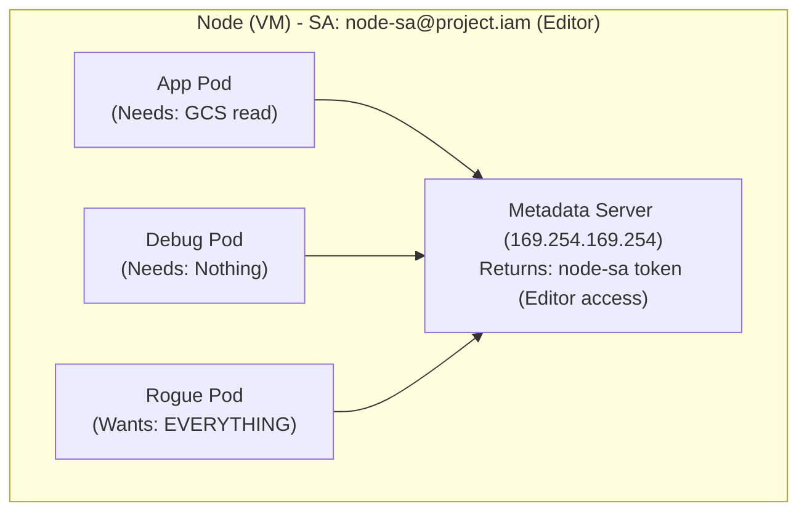
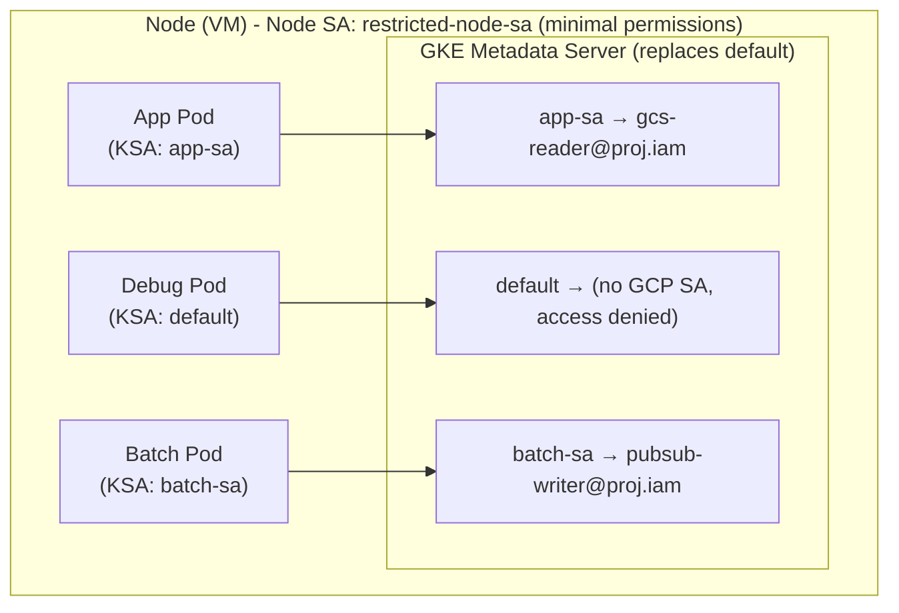
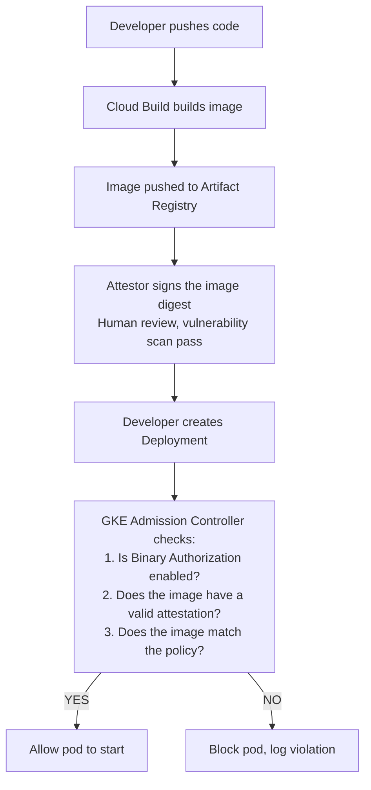

**Complexity**: [MEDIUM] | **Time to Complete**: 2.5h | **Prerequisites**: Module 6.1 (GKE Architecture)

## What You'll Be Able to Do

After completing this module, you will be able to:

- **Configure GKE Workload Identity to map Kubernetes service accounts to GCP IAM service accounts**
- **Implement Binary Authorization to enforce container image provenance and deploy-time attestation policies**
- **Deploy GKE security posture features to identify workload misconfigurations and enforce Pod Security Standards**
- **Integrate Google Cloud Secret Manager using the CSI driver for secure external secret management**

---

## Why This Module Matters

In January 2024, a logistics company discovered that every pod in their GKE cluster had read/write access to every Cloud Storage bucket and every Pub/Sub topic in their project. A junior developer had deployed a debug pod that scraped all Pub/Sub messages from the production order queue and wrote them to a personal GCS bucket for "testing." The data included customer addresses, phone numbers, and delivery instructions for 2.1 million orders. The root cause was depressingly common: when the cluster was created, the default node service account was granted the `Editor` role on the project, and every pod on the cluster inherited that identity. No one had configured Workload Identity. The remediation cost $890,000 in legal fees, notification costs, and a GDPR fine. The fix---configuring Workload Identity and scoping IAM permissions per pod---took two days.

This incident illustrates the most dangerous default in GKE: without Workload Identity, every pod on a node shares the same GCP identity. A compromised pod, a rogue container, or even a developer with kubectl access can impersonate the node's service account and access any GCP resource that account can reach. Workload Identity solves this by binding individual Kubernetes ServiceAccounts to individual GCP service accounts, giving each workload only the permissions it needs.

In this module, you will learn how Workload Identity Federation for GKE works, how to configure Binary Authorization to ensure only trusted container images run in your cluster, how Shielded and Confidential Nodes protect the node itself, and how to integrate Secret Manager with GKE. By the end, you will set up a pod that securely accesses Pub/Sub using Workload Identity and enforce a Binary Authorization policy that blocks unsigned images.

---

## The Problem: Node-Level Identity

Without Workload Identity, GKE pods access GCP services using the **node's service account**. Every VM (node) in a node pool runs with a GCP service account attached, and every pod on that node can access the metadata server to obtain OAuth tokens for that account.



This is a violation of the **principle of least privilege**. The app pod only needs GCS read access, but it gets Editor. The debug pod needs nothing, but it gets Editor. The rogue pod gets Editor too.

---

## Workload Identity Federation for GKE

Workload Identity Federation (WIF) for GKE maps Kubernetes ServiceAccounts to GCP IAM service accounts. Each pod gets credentials scoped to exactly the GCP resources it needs.

### How It Works



### Setting Up Workload Identity

```bash
export PROJECT_ID=$(gcloud config get-value project)
export PROJECT_NUMBER=$(gcloud projects describe $PROJECT_ID --format="value(projectNumber)")

# Step 1: Enable Workload Identity on the cluster (if not already)
# Best practice: enable at cluster creation with --workload-pool
gcloud container clusters update my-cluster \
  --region=us-central1 \
  --workload-pool=$PROJECT_ID.svc.id.goog

# Step 2: Create a GCP service account for the workload
gcloud iam service-accounts create gcs-reader-sa \
  --display-name="GCS Reader for App Pod"

# Step 3: Grant the GCP SA only the permissions it needs
gcloud projects add-iam-policy-binding $PROJECT_ID \
  --member="serviceAccount:gcs-reader-sa@$PROJECT_ID.iam.gserviceaccount.com" \
  --role="roles/storage.objectViewer"

# Step 4: Create a Kubernetes ServiceAccount
kubectl create serviceaccount app-sa --namespace=default

# Step 5: Bind the Kubernetes SA to the GCP SA
gcloud iam service-accounts add-iam-policy-binding \
  gcs-reader-sa@$PROJECT_ID.iam.gserviceaccount.com \
  --role="roles/iam.workloadIdentityUser" \
  --member="serviceAccount:$PROJECT_ID.svc.id.goog[default/app-sa]"

# Step 6: Annotate the Kubernetes SA with the GCP SA email
kubectl annotate serviceaccount app-sa \
  --namespace=default \
  iam.gke.io/gcp-service-account=gcs-reader-sa@$PROJECT_ID.iam.gserviceaccount.com
```

### Using Workload Identity in a Pod

```yaml
apiVersion: v1
kind: Pod
metadata:
  name: gcs-reader
  namespace: default
spec:
  serviceAccountName: app-sa  # This is the key line
  containers:
  - name: reader
    image: google/cloud-sdk:slim
    command: ["sleep", "infinity"]
    resources:
      requests:
        cpu: 100m
        memory: 128Mi
```

```bash
# Deploy and verify
kubectl apply -f gcs-reader-pod.yaml

# Exec into the pod and verify the identity
kubectl exec -it gcs-reader -- gcloud auth list
# Should show: gcs-reader-sa@PROJECT_ID.iam.gserviceaccount.com

# Test GCS access (should work)
kubectl exec -it gcs-reader -- gsutil ls gs://some-readable-bucket/

# Test Pub/Sub access (should be denied)
kubectl exec -it gcs-reader -- gcloud pubsub topics list
# Should fail with permission denied
```

### Fleet Workload Identity Federation (Cross-Project)

For multi-project setups, Fleet Workload Identity Federation allows pods in one project to access resources in another project without creating service accounts in every project.

```bash
# Register the cluster with a Fleet
gcloud container fleet memberships register my-cluster \
  --gke-cluster=$REGION/my-cluster \
  --enable-workload-identity

# Grant cross-project access using the Fleet identity
gcloud projects add-iam-policy-binding OTHER_PROJECT_ID \
  --member="serviceAccount:$PROJECT_ID.svc.id.goog[NAMESPACE/KSA_NAME]" \
  --role="roles/storage.objectViewer"
```

> **Stop and think**: If a pod in the `default` namespace does not have a `serviceAccountName` specified in its spec, which Kubernetes ServiceAccount does it use? How does this impact Workload Identity if that ServiceAccount is not annotated?

---

## Binary Authorization

Binary Authorization ensures that only trusted container images can be deployed to your GKE cluster. It works by requiring cryptographic attestations on images before they are allowed to run.

### How Binary Authorization Works



### Setting Up Binary Authorization

```bash
# Step 1: Enable Binary Authorization API
gcloud services enable binaryauthorization.googleapis.com \
  --project=$PROJECT_ID

# Step 2: Enable Binary Authorization on the cluster
gcloud container clusters update my-cluster \
  --region=us-central1 \
  --binauthz-evaluation-mode=PROJECT_SINGLETON_POLICY_ENFORCE

# Step 3: View the default policy
gcloud container binauthz policy export

# Step 4: Create a policy that allows only Artifact Registry images
cat <<'EOF' > /tmp/binauthz-policy.yaml
admissionWhitelistPatterns:
- namePattern: gcr.io/google-containers/*
- namePattern: gcr.io/google-samples/*
- namePattern: us-docker.pkg.dev/google-samples/*
defaultAdmissionRule:
  enforcementMode: ENFORCED_BLOCK_AND_AUDIT_LOG
  evaluationMode: ALWAYS_DENY
globalPolicyEvaluationMode: ENABLE
clusterAdmissionRules:
  us-central1.my-cluster:
    enforcementMode: ENFORCED_BLOCK_AND_AUDIT_LOG
    evaluationMode: REQUIRE_ATTESTATION
    requireAttestationsBy:
    - projects/PROJECT_ID/attestors/build-attestor
EOF

# Step 5: Import the policy
gcloud container binauthz policy import /tmp/binauthz-policy.yaml
```

### Creating an Attestor

```bash
# Create a key ring and key for signing
gcloud kms keyrings create binauthz-keyring \
  --location=global

gcloud kms keys create attestor-key \
  --keyring=binauthz-keyring \
  --location=global \
  --purpose=asymmetric-signing \
  --default-algorithm=ec-sign-p256-sha256

# Create a Container Analysis note
cat <<EOF > /tmp/note.json
{
  "attestation": {
    "hint": {
      "humanReadableName": "Build Attestor Note"
    }
  }
}
EOF

curl -X POST \
  "https://containeranalysis.googleapis.com/v1/projects/$PROJECT_ID/notes/?noteId=build-attestor-note" \
  -H "Authorization: Bearer $(gcloud auth print-access-token)" \
  -H "Content-Type: application/json" \
  -d @/tmp/note.json

# Create the attestor
gcloud container binauthz attestors create build-attestor \
  --attestation-authority-note=build-attestor-note \
  --attestation-authority-note-project=$PROJECT_ID

# Add the KMS key to the attestor
gcloud container binauthz attestors public-keys add \
  --attestor=build-attestor \
  --keyversion-project=$PROJECT_ID \
  --keyversion-location=global \
  --keyversion-keyring=binauthz-keyring \
  --keyversion-key=attestor-key \
  --keyversion=1

# Sign an image
IMAGE_PATH="us-central1-docker.pkg.dev/$PROJECT_ID/my-repo/my-app"
IMAGE_DIGEST=$(gcloud container images describe $IMAGE_PATH:latest \
  --format="value(image_summary.digest)")

gcloud container binauthz attestations sign-and-create \
  --artifact-url="$IMAGE_PATH@$IMAGE_DIGEST" \
  --attestor=build-attestor \
  --attestor-project=$PROJECT_ID \
  --keyversion-project=$PROJECT_ID \
  --keyversion-location=global \
  --keyversion-keyring=binauthz-keyring \
  --keyversion-key=attestor-key \
  --keyversion=1
```

### Testing Binary Authorization

```bash
# This should succeed (signed image or whitelisted pattern)
kubectl run trusted --image=gcr.io/google-samples/hello-app:1.0

# This should be BLOCKED (unsigned image from Docker Hub)
kubectl run untrusted --image=nginx:latest
# Error: admission webhook "imagepolicywebhook.image-policy.k8s.io"
# denied the request: Image nginx:latest denied by Binary Authorization policy

# Check audit logs for denials
gcloud logging read \
  'resource.type="k8s_cluster" AND protoPayload.response.reason="BINARY_AUTHORIZATION"' \
  --limit=5
```

**War Story**: A team enabled Binary Authorization in enforce mode on a Friday afternoon. On Monday morning, their CI/CD pipeline had broken because Cloud Build was pushing images but not creating attestations. Every deployment for 48 hours was blocked. Start with `DRYRUN_AUDIT_LOG_ONLY` mode to identify what would be blocked before switching to enforce mode.

> **Pause and predict**: You enable Binary Authorization in enforce mode with a policy requiring an attestation from a specific KMS key. A developer deploys an image signed by a different, older KMS key that was recently removed from the attestor. What will happen when the pod starts, and where would you look to verify this?

---

## Shielded GKE Nodes and Confidential Nodes

### Shielded GKE Nodes

Shielded nodes provide verifiable integrity for your cluster nodes, protecting against rootkits and boot-level tampering.

| Feature | Protection | How It Works |
| :--- | :--- | :--- |
| **Secure Boot** | Prevents unsigned kernel modules | Only Google-signed boot components load |
| **vTPM** | Measured boot integrity | Stores measurements for remote attestation |
| **Integrity Monitoring** | Detects runtime tampering | Compares boot measurements to known-good baseline |

```bash
# Shielded nodes are enabled by default on new GKE clusters
# Verify on an existing cluster:
gcloud container clusters describe my-cluster \
  --region=us-central1 \
  --format="yaml(shieldedNodes)"

# Explicitly enable if not set:
gcloud container clusters update my-cluster \
  --region=us-central1 \
  --enable-shielded-nodes
```

### Confidential Nodes

Confidential Nodes go beyond Shielded Nodes by encrypting data **in memory** using AMD SEV (Secure Encrypted Virtualization). Even if an attacker has physical access to the server or can perform a cold-boot attack, they cannot read the node's memory.

```bash
# Create a node pool with Confidential Nodes
gcloud container node-pools create confidential-pool \
  --cluster=my-cluster \
  --region=us-central1 \
  --machine-type=n2d-standard-4 \
  --num-nodes=1 \
  --enable-confidential-nodes

# Note: Confidential Nodes require N2D machine types (AMD EPYC)
# and are available in limited regions
```

| Feature | Shielded Nodes | Confidential Nodes |
| :--- | :--- | :--- |
| **Boot integrity** | Yes | Yes |
| **Memory encryption** | No | Yes (AMD SEV) |
| **Performance impact** | None | ~2-6% overhead |
| **Machine types** | All | N2D only (AMD) |
| **Cost** | No additional cost | ~10% premium |
| **Use case** | All production clusters | Financial, healthcare, PII |

> **Stop and think**: Your compliance team requires that data in use (in memory) must be encrypted. Which node type must you choose, and what specific CPU architecture is required to support this feature?

---

## GKE Security Posture Dashboard

The Security Posture dashboard provides a centralized view of security issues across your GKE clusters. It scans for misconfigurations, vulnerability exposure, and policy violations.

### What It Detects

```bash
# Enable Security Posture on the cluster
gcloud container clusters update my-cluster \
  --region=us-central1 \
  --security-posture=standard \
  --workload-vulnerability-scanning=standard

# Check security posture findings via gcloud
gcloud container security-posture findings list \
  --project=$PROJECT_ID \
  --format="table(finding.severity, finding.category, finding.description)"
```

The dashboard checks for:

- **Workload configuration**: Pods running as root, missing security contexts, privileged containers
- **Container vulnerabilities**: CVEs in container images from Artifact Registry
- **Network exposure**: Services exposed to the internet without authentication
- **RBAC issues**: Overly permissive ClusterRoleBindings
- **Supply chain**: Images not from trusted registries

### Hardening Pod Security

GKE supports Pod Security Standards (PSS) through the built-in Pod Security Admission controller:

```bash
# Enforce restricted Pod Security Standard on a namespace
kubectl label namespace production \
  pod-security.kubernetes.io/enforce=restricted \
  pod-security.kubernetes.io/warn=restricted \
  pod-security.kubernetes.io/audit=restricted
```

```yaml
# A pod that passes the "restricted" security standard
apiVersion: v1
kind: Pod
metadata:
  name: secure-pod
  namespace: production
spec:
  securityContext:
    runAsNonRoot: true
    runAsUser: 1000
    fsGroup: 2000
    seccompProfile:
      type: RuntimeDefault
  containers:
  - name: app
    image: us-central1-docker.pkg.dev/my-project/repo/app:v1
    securityContext:
      allowPrivilegeEscalation: false
      readOnlyRootFilesystem: true
      capabilities:
        drop:
        - ALL
    resources:
      requests:
        cpu: 100m
        memory: 128Mi
      limits:
        cpu: 200m
        memory: 256Mi
```

> **Pause and predict**: You apply the `restricted` Pod Security Standard to a namespace in `enforce` mode. A developer tries to deploy a pod with `runAsNonRoot: false`. Will the pod be created? What happens if the namespace was set to `warn` mode instead?

---

## Secret Manager Integration

GKE integrates with Google Cloud Secret Manager through the **Secret Manager add-on**, which uses the Secrets Store CSI Driver to mount secrets as files in pods.

### Setting Up Secret Manager CSI Driver

```bash
# Enable the Secret Manager add-on on the cluster
gcloud container clusters update my-cluster \
  --region=us-central1 \
  --enable-secret-manager

# Verify the driver is installed
kubectl get csidriver secrets-store.csi.k8s.io

# Create a secret in Secret Manager
echo -n "my-database-password" | gcloud secrets create db-password \
  --data-file=- \
  --replication-policy=automatic

# Grant the workload's GCP SA access to the secret
gcloud secrets add-iam-policy-binding db-password \
  --member="serviceAccount:app-sa@$PROJECT_ID.iam.gserviceaccount.com" \
  --role="roles/secretmanager.secretAccessor"
```

### Mounting Secrets in Pods

```yaml
# SecretProviderClass defines which secrets to mount
apiVersion: secrets-store.csi.x-k8s.io/v1
kind: SecretProviderClass
metadata:
  name: gcp-secrets
spec:
  provider: gcp
  parameters:
    secrets: |
      - resourceName: "projects/PROJECT_NUMBER/secrets/db-password/versions/latest"
        path: "db-password"
      - resourceName: "projects/PROJECT_NUMBER/secrets/api-key/versions/latest"
        path: "api-key"

---
apiVersion: v1
kind: Pod
metadata:
  name: app-with-secrets
spec:
  serviceAccountName: app-sa  # Must have Workload Identity configured
  containers:
  - name: app
    image: us-central1-docker.pkg.dev/my-project/repo/app:v1
    volumeMounts:
    - name: secrets
      mountPath: /var/secrets
      readOnly: true
    resources:
      requests:
        cpu: 100m
        memory: 128Mi
  volumes:
  - name: secrets
    csi:
      driver: secrets-store.csi.k8s.io
      readOnly: true
      volumeAttributes:
        secretProviderClass: gcp-secrets
```

```bash
# After deploying, verify the secret is mounted
kubectl exec app-with-secrets -- cat /var/secrets/db-password
# Output: my-database-password

# Secrets are NOT stored in etcd, reducing the blast radius
# if the cluster's etcd encryption is compromised
```

### Secret Manager vs Kubernetes Secrets

| Aspect | Kubernetes Secrets | Secret Manager + CSI |
| :--- | :--- | :--- |
| **Storage** | etcd (in cluster) | Google-managed (external) |
| **Encryption at rest** | Application-layer encryption | Automatic, Google-managed keys or CMEK |
| **Versioning** | No (replace only) | Full version history |
| **Rotation** | Manual (update + rollout) | Automatic with periodic sync |
| **Audit logging** | Kubernetes audit logs | Cloud Audit Logs (who accessed what, when) |
| **Cross-cluster sharing** | Not supported | Same secret across clusters/projects |
| **Access control** | RBAC (namespace-scoped) | IAM (project/org-scoped) |

> **Stop and think**: A developer wants to roll back a deployment that uses Secret Manager for database credentials. The older version of the deployment needs an older password. How does the Secret Manager CSI driver handle versioning compared to native Kubernetes Secrets?

---

## Did You Know?

1. **Before Workload Identity existed, the recommended workaround was to distribute service account JSON key files as Kubernetes Secrets.** This meant private key material was stored in etcd, potentially logged, and visible to anyone with RBAC access to the namespace. Google internal security audits in 2019 found that 34% of GKE clusters in a sample had service account keys stored as Kubernetes Secrets. Workload Identity, launched in 2019, eliminated the need for key files entirely by using short-lived, automatically-rotated tokens.

2. **Binary Authorization attestations are immutable and tied to the exact image digest (SHA-256), not the tag.** If someone pushes a new image with the tag `v1.0` (overwriting the old one), the attestation on the original image becomes invalid for the new image because the digest changed. This prevents a supply chain attack where an attacker replaces a trusted image with a malicious one while keeping the same tag. Always deploy by digest in production: `image: us-central1-docker.pkg.dev/proj/repo/app@sha256:abc123...`

3. **Confidential GKE Nodes encrypt each node's memory with a unique key that changes on every boot.** The key is generated inside the AMD Secure Processor and is designed not to leave the CPU. Google's hypervisor, host OS, and other VMs on the same physical host cannot read the node's memory. The performance overhead is typically 2-6% for most workloads because the encryption happens in the CPU's memory controller at hardware speed, not in software.

4. **The GKE metadata server that enables Workload Identity intercepts all traffic to 169.254.169.254** (the standard cloud metadata endpoint) from pods. When a pod with Workload Identity configured requests an access token, the GKE metadata server contacts Google's Security Token Service (STS) to exchange the Kubernetes ServiceAccount token for a short-lived GCP access token scoped to the mapped GCP service account. These tokens expire after 1 hour and are automatically refreshed. Pods without Workload Identity receive a "permission denied" response instead of the node's credentials.

---

## Common Mistakes

| Mistake | Why It Happens | How to Fix It |
| :--- | :--- | :--- |
| Using the default Compute Engine service account for nodes | Cluster created without specifying a custom node SA | Create a dedicated node SA with minimal permissions; use `--service-account` flag |
| Not annotating the Kubernetes ServiceAccount | Workload Identity binding created but annotation forgotten | Always annotate: `iam.gke.io/gcp-service-account=GSA@PROJECT.iam` |
| Enabling Binary Authorization in enforce mode immediately | Wanting security without testing impact first | Start with `DRYRUN_AUDIT_LOG_ONLY` mode; review logs for 1-2 weeks before enforcing |
| Granting `roles/editor` to workload service accounts | "Editor" seems like a reasonable default | Use least-privilege roles: `storage.objectViewer`, `pubsub.subscriber`, etc. |
| Storing secrets as Kubernetes Secrets without encryption | Assuming K8s Secrets are encrypted by default | Enable application-layer encryption or use Secret Manager CSI driver |
| Forgetting to create the IAM binding for Workload Identity | Creating the KSA and GSA but not connecting them | The `iam.workloadIdentityUser` binding on the GSA is required for the mapping to work |
| Not setting `pod-security.kubernetes.io` labels | Assuming GKE blocks unsafe pods by default | Apply Pod Security Standards labels to namespaces; start with `warn` mode |
| Using image tags instead of digests with Binary Authorization | Tags are mutable and can be overwritten | Deploy by digest (`@sha256:...`) to ensure attestation matches the exact image |

---

## Quiz

<details>
<summary>1. Your security team discovers that three different applications running on the same GKE node can all read from a sensitive Cloud Storage bucket, even though only one application actually requires this access. You are tasked with implementing Workload Identity to fix this. How will configuring Workload Identity fundamentally change the way these pods authenticate with Google Cloud APIs?</summary>

Without Workload Identity, every pod on a node shares the node VM's GCP service account, allowing any pod to retrieve an access token for that shared identity from the default metadata server. Workload Identity Federation solves this by running a specialized GKE metadata server as a DaemonSet on each node, which intercepts metadata requests from pods. Instead of returning the node's credentials, the GKE metadata server checks the pod's specific Kubernetes ServiceAccount and exchanges it for a short-lived GCP access token scoped only to the mapped GCP service account. This ensures that the two applications not requiring bucket access receive permission denied errors, while the authorized application successfully authenticates.
</details>

<details>
<summary>2. You are preparing to roll out Binary Authorization across all production GKE clusters. The lead developer is concerned that enabling this feature might block emergency hotfixes if the automated attestation pipeline fails during an incident. How should you configure the rollout to address this concern while still gaining visibility into unsigned images?</summary>

You should configure the Binary Authorization policy to use "dry run" mode (`DRYRUN_AUDIT_LOG_ONLY`) instead of the default enforce mode (`ENFORCED_BLOCK_AND_AUDIT_LOG`). In dry run mode, Binary Authorization evaluates every pod creation request against the policy but does not actually block the pod from starting, even if it lacks the required attestations. Instead, it logs a detailed violation event to Cloud Audit Logs indicating that the pod would have been blocked. This allows you to deploy the policy and observe its impact over time, ensuring emergency hotfixes can still deploy while you identify and fix pipeline gaps before switching to full enforcement.
</details>

<details>
<summary>3. During a routine audit, an inspector notices that your deployment manifests use tags like `image: frontend:v2.1` instead of SHA-256 digests. They flag this as a critical violation of your Binary Authorization policy, even though the images are successfully passing the attestation checks. Why is deploying by tag considered a security risk when using Binary Authorization?</summary>

Container image tags are mutable, meaning a developer or an attacker can push a new image with the exact same tag, overwriting the original content in the registry. Binary Authorization attestations are cryptographically bound to the immutable SHA-256 digest of the image, not the mutable tag. If you deploy by tag, Kubernetes might pull a modified image, and the original attestation will no longer be valid for the new digest, which could lead to unexpected deployment failures or bypasses if caching is involved. Deploying by digest guarantees that the cluster runs the exact identical bits that were scanned, tested, and attested during your secure supply chain process.
</details>

<details>
<summary>4. Your architecture currently uses native Kubernetes Secrets to store third-party API keys. A security review mandates that all secrets must have a verifiable access audit trail and must not be stored in the cluster's etcd database. Why is migrating to the Google Cloud Secret Manager CSI driver the correct architectural choice to meet these requirements?</summary>

With native Kubernetes Secrets, the secret values are stored directly within the cluster's etcd database, meaning anyone with administrative access to the control plane or broad RBAC permissions can view them without generating a granular access log. The Secret Manager CSI driver fundamentally changes this architecture by storing the secrets externally in Google Cloud Secret Manager and mounting them into pods as temporary, in-memory files at runtime. Because the secrets are fetched directly from the external service, they never pass through or rest in etcd. Furthermore, every retrieval of the secret by a workload generates a distinct entry in Cloud Audit Logs, satisfying the requirement for a verifiable access audit trail.
</details>

<details>
<summary>5. Your company is hosting a multi-tenant SaaS application on GKE and needs to protect the node's boot sequence from being compromised by persistent rootkits. You are deciding between Shielded Nodes and Confidential Nodes. Why would Shielded Nodes be sufficient for this specific requirement?</summary>

Shielded Nodes are specifically designed to provide verifiable integrity for the node's boot process by utilizing Secure Boot, which ensures that only Google-signed boot components and kernel modules are loaded. They also leverage a Virtual Trusted Platform Module (vTPM) to create a measured boot chain, continuously monitoring for any tampering against a known-good baseline. While Confidential Nodes offer these same boot protections, their primary differentiating feature is the encryption of data in use (in memory) using specialized hardware. Since your specific requirement is focused solely on protecting the boot sequence from rootkits rather than encrypting active memory, Shielded Nodes fully address the threat model without incurring the performance or cost overhead of Confidential Nodes.
</details>

<details>
<summary>6. You have just enabled Workload Identity on a legacy GKE cluster that has been running in production for two years. Immediately after the update completes, several applications begin crashing because they are receiving "403 Permission Denied" errors when trying to read from Cloud Storage. What architectural change caused this outage, and how do you resolve it?</summary>

Enabling Workload Identity on an existing cluster changes the behavior of the metadata server interception for all pods on the affected nodes. Pods that previously defaulted to the node's underlying Compute Engine service account now have their metadata requests intercepted by the Workload Identity DaemonSet, which requires a specific mapping to grant access. Because these legacy applications lacked a configured Kubernetes ServiceAccount annotated with a GCP service account mapping, the metadata server denied them access to GCP credentials entirely. To resolve the outage, you must create the necessary GCP service accounts, bind them to Kubernetes ServiceAccounts with the `iam.workloadIdentityUser` role, annotate the KSAs, and update the application Deployments to explicitly reference these new ServiceAccounts.
</details>

---

## Hands-On Exercise: Workload Identity for Pub/Sub and Binary Authorization

### Objective

Configure Workload Identity to securely access Pub/Sub from a pod, and set up Binary Authorization to block untrusted images.

### Prerequisites

- `gcloud` CLI installed and authenticated
- A GCP project with billing enabled
- GKE, Pub/Sub, Binary Authorization, and KMS APIs enabled

### Tasks

**Task 1: Create a GKE Cluster with Workload Identity**

<details>
<summary>Solution</summary>

```bash
export PROJECT_ID=$(gcloud config get-value project)
export REGION=us-central1

# Enable required APIs
gcloud services enable \
  container.googleapis.com \
  pubsub.googleapis.com \
  binaryauthorization.googleapis.com \
  cloudkms.googleapis.com \
  secretmanager.googleapis.com \
  --project=$PROJECT_ID

# Create cluster with Workload Identity
gcloud container clusters create security-demo \
  --region=$REGION \
  --num-nodes=1 \
  --machine-type=e2-standard-2 \
  --release-channel=regular \
  --enable-ip-alias \
  --workload-pool=$PROJECT_ID.svc.id.goog \
  --enable-shielded-nodes

# Get credentials
gcloud container clusters get-credentials security-demo --region=$REGION
```
</details>

**Task 2: Set Up Workload Identity for Pub/Sub Access**

<details>
<summary>Solution</summary>

```bash
# Create a Pub/Sub topic and subscription
gcloud pubsub topics create demo-orders
gcloud pubsub subscriptions create demo-orders-sub \
  --topic=demo-orders

# Create a GCP service account for the publisher
gcloud iam service-accounts create pubsub-publisher \
  --display-name="Pub/Sub Publisher"

# Grant Pub/Sub publisher role
gcloud pubsub topics add-iam-policy-binding demo-orders \
  --member="serviceAccount:pubsub-publisher@$PROJECT_ID.iam.gserviceaccount.com" \
  --role="roles/pubsub.publisher"

# Create Kubernetes ServiceAccount
kubectl create serviceaccount pubsub-sa

# Bind KSA to GSA
gcloud iam service-accounts add-iam-policy-binding \
  pubsub-publisher@$PROJECT_ID.iam.gserviceaccount.com \
  --role="roles/iam.workloadIdentityUser" \
  --member="serviceAccount:$PROJECT_ID.svc.id.goog[default/pubsub-sa]"

# Annotate KSA
kubectl annotate serviceaccount pubsub-sa \
  iam.gke.io/gcp-service-account=pubsub-publisher@$PROJECT_ID.iam.gserviceaccount.com
```
</details>

**Task 3: Deploy a Pod That Publishes to Pub/Sub**

<details>
<summary>Solution</summary>

```bash
# Deploy a pod with Workload Identity
kubectl apply -f - <<EOF
apiVersion: v1
kind: Pod
metadata:
  name: publisher
spec:
  serviceAccountName: pubsub-sa
  containers:
  - name: publisher
    image: google/cloud-sdk:slim
    command: ["sleep", "3600"]
    resources:
      requests:
        cpu: 100m
        memory: 256Mi
EOF

# Wait for pod to be ready
kubectl wait --for=condition=Ready pod/publisher --timeout=120s

# Verify Workload Identity is working
kubectl exec publisher -- gcloud auth list
# Should show pubsub-publisher@PROJECT_ID.iam.gserviceaccount.com

# Publish a message
kubectl exec publisher -- \
  gcloud pubsub topics publish demo-orders \
  --message='{"order_id": "12345", "item": "widget", "qty": 3}'

# Verify the message was published
gcloud pubsub subscriptions pull demo-orders-sub --auto-ack --limit=1

# Try to access a resource NOT granted (should fail)
kubectl exec publisher -- gsutil ls gs://
# Should fail with permission denied (403)
```
</details>

**Task 4: Enable Binary Authorization in Dry Run Mode**

<details>
<summary>Solution</summary>

```bash
# Enable Binary Authorization on the cluster
gcloud container clusters update security-demo \
  --region=$REGION \
  --binauthz-evaluation-mode=PROJECT_SINGLETON_POLICY_ENFORCE

# Export and examine the current policy
gcloud container binauthz policy export

# Create a policy that blocks everything except Google images (dry run)
cat <<EOF > /tmp/binauthz-policy.yaml
admissionWhitelistPatterns:
- namePattern: gcr.io/google-containers/*
- namePattern: gcr.io/google-samples/*
- namePattern: gke.gcr.io/*
- namePattern: gcr.io/gke-release/*
- namePattern: $REGION-docker.pkg.dev/$PROJECT_ID/*
- namePattern: registry.k8s.io/*
- namePattern: google/cloud-sdk*
defaultAdmissionRule:
  enforcementMode: DRYRUN_AUDIT_LOG_ONLY
  evaluationMode: ALWAYS_DENY
globalPolicyEvaluationMode: ENABLE
EOF

gcloud container binauthz policy import /tmp/binauthz-policy.yaml

echo "Binary Authorization is now in DRY RUN mode."
echo "Unsigned images will be LOGGED but not blocked."
```
</details>

**Task 5: Test Binary Authorization Behavior**

<details>
<summary>Solution</summary>

```bash
# Deploy an image from Docker Hub (would be blocked in enforce mode)
kubectl run nginx-test --image=nginx:1.27 --restart=Never \
  --overrides='{"spec":{"containers":[{"name":"nginx-test","image":"nginx:1.27","resources":{"requests":{"cpu":"100m","memory":"64Mi"}}}]}}'

# In dry run mode, this will succeed but generate an audit log
kubectl get pod nginx-test

# Check audit logs for Binary Authorization dry-run violations
sleep 30  # Give logs time to propagate
gcloud logging read \
  'resource.type="k8s_cluster" AND protoPayload.methodName="io.k8s.core.v1.pods.create" AND labels."binaryauthorization.googleapis.com/decision"="DENIED"' \
  --limit=5 \
  --format="table(timestamp, protoPayload.resourceName)"

# Clean up test pod
kubectl delete pod nginx-test

echo "In a real deployment, you would:"
echo "1. Review dry-run logs for 1-2 weeks"
echo "2. Whitelist or attest all legitimate images"
echo "3. Switch to ENFORCED_BLOCK_AND_AUDIT_LOG mode"
```
</details>

**Task 6: Enable Security Posture and Test Pod Security Standards**

<details>
<summary>Solution</summary>

```bash
# Enable Security Posture on the cluster
gcloud container clusters update security-demo \
  --region=$REGION \
  --security-posture=standard \
  --workload-vulnerability-scanning=standard

# Create a namespace with restricted Pod Security Standards
kubectl create namespace secure-ns
kubectl label namespace secure-ns \
  pod-security.kubernetes.io/enforce=restricted \
  pod-security.kubernetes.io/warn=restricted

# Try to deploy a privileged pod (should be blocked)
kubectl apply -n secure-ns -f - <<EOF
apiVersion: v1
kind: Pod
metadata:
  name: bad-pod
spec:
  containers:
  - name: nginx
    image: nginx:1.27
    securityContext:
      privileged: true
EOF
# The API server will reject this pod creation immediately

# Deploy a compliant pod
kubectl apply -n secure-ns -f - <<EOF
apiVersion: v1
kind: Pod
metadata:
  name: good-pod
spec:
  securityContext:
    runAsNonRoot: true
    runAsUser: 1000
    seccompProfile:
      type: RuntimeDefault
  containers:
  - name: nginx
    image: nginx:1.27
    securityContext:
      allowPrivilegeEscalation: false
      capabilities:
        drop:
        - ALL
EOF
# This pod will be created successfully
```
</details>

**Task 7: Mount External Secrets using Secret Manager CSI Driver**

<details>
<summary>Solution</summary>

```bash
# Enable Secret Manager add-on
gcloud container clusters update security-demo \
  --region=$REGION \
  --enable-secret-manager

# Create a secret in GCP Secret Manager
echo -n "super-secret-api-key" | gcloud secrets create demo-api-key \
  --data-file=- \
  --replication-policy=automatic

# Grant the Workload Identity SA access to the secret
gcloud secrets add-iam-policy-binding demo-api-key \
  --member="serviceAccount:pubsub-publisher@$PROJECT_ID.iam.gserviceaccount.com" \
  --role="roles/secretmanager.secretAccessor"

# Create SecretProviderClass in the cluster
kubectl apply -f - <<EOF
apiVersion: secrets-store.csi.x-k8s.io/v1
kind: SecretProviderClass
metadata:
  name: gcp-secrets
spec:
  provider: gcp
  parameters:
    secrets: |
      - resourceName: "projects/$PROJECT_ID/secrets/demo-api-key/versions/latest"
        path: "api-key.txt"
EOF

# Deploy a pod that mounts the secret
kubectl apply -f - <<EOF
apiVersion: v1
kind: Pod
metadata:
  name: secret-reader
spec:
  serviceAccountName: pubsub-sa
  containers:
  - name: reader
    image: google/cloud-sdk:slim
    command: ["sleep", "3600"]
    volumeMounts:
    - name: secrets-volume
      mountPath: /var/secrets
      readOnly: true
  volumes:
  - name: secrets-volume
    csi:
      driver: secrets-store.csi.k8s.io
      readOnly: true
      volumeAttributes:
        secretProviderClass: gcp-secrets
EOF

# Verify the secret is mounted correctly
kubectl wait --for=condition=Ready pod/secret-reader --timeout=120s
kubectl exec secret-reader -- cat /var/secrets/api-key.txt
```
</details>

**Task 8: Clean Up**

<details>
<summary>Solution</summary>

```bash
# Delete the cluster
gcloud container clusters delete security-demo \
  --region=$REGION --quiet

# Delete Pub/Sub resources
gcloud pubsub subscriptions delete demo-orders-sub --quiet
gcloud pubsub topics delete demo-orders --quiet

# Delete the secret
gcloud secrets delete demo-api-key --quiet

# Delete the GCP service account
gcloud iam service-accounts delete \
  pubsub-publisher@$PROJECT_ID.iam.gserviceaccount.com --quiet

# Reset Binary Authorization policy to allow all
cat <<EOF > /tmp/binauthz-default.yaml
defaultAdmissionRule:
  enforcementMode: ENFORCED_BLOCK_AND_AUDIT_LOG
  evaluationMode: ALWAYS_ALLOW
globalPolicyEvaluationMode: ENABLE
EOF
gcloud container binauthz policy import /tmp/binauthz-default.yaml

# Clean up temp files
rm -f /tmp/binauthz-policy.yaml /tmp/binauthz-default.yaml /tmp/note.json

echo "Cleanup complete."
```
</details>

### Success Criteria

- [ ] Cluster created with Workload Identity enabled
- [ ] Pub/Sub topic and subscription created
- [ ] Pod successfully publishes to Pub/Sub using Workload Identity (no key files)
- [ ] Pod cannot access resources not granted to its service account
- [ ] Binary Authorization enabled in dry run mode
- [ ] Audit logs show denied images from untrusted sources
- [ ] Security Posture enabled and Pod Security Standards enforce `restricted` mode
- [ ] Secret Manager CSI driver mounts an external secret successfully
- [ ] All resources cleaned up

---

## Next Module

Next up: **[Module 6.4: GKE Storage](../module-6.4-gke-storage/)** --- Master Persistent Disk CSI drivers, regional PD failover, Filestore for shared NFS, Cloud Storage FUSE for object storage access, and Backup for GKE to protect your stateful workloads.

## Sources

- [Workload Identity Federation for GKE](https://docs.cloud.google.com/kubernetes-engine/docs/concepts/workload-identity) — Primary concept doc for metadata flow, STS exchange, token lifetime, and identity design.
- [Binary Authorization Overview](https://docs.cloud.google.com/binary-authorization/docs/overview) — Primary reference for attestations, deployment enforcement, and audit-log behavior.
- [Shielded GKE Nodes](https://docs.cloud.google.com/kubernetes-engine/docs/how-to/shielded-gke-nodes) — Canonical GKE guide for node identity and integrity protections.
- [Kubernetes Security Posture Scanning](https://docs.cloud.google.com/kubernetes-engine/docs/concepts/about-configuration-scanning) — Best source for what GKE posture scanning actually checks in current releases.
- [Secret Manager Add-on for GKE](https://docs.cloud.google.com/secret-manager/docs/secret-manager-managed-csi-component) — Primary doc for mounting externally managed secrets into Pods and for rotation support.
