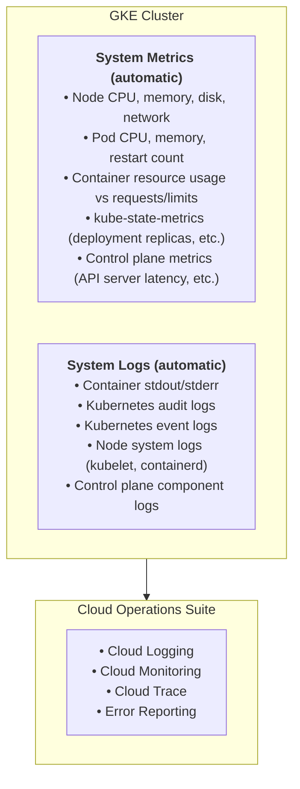
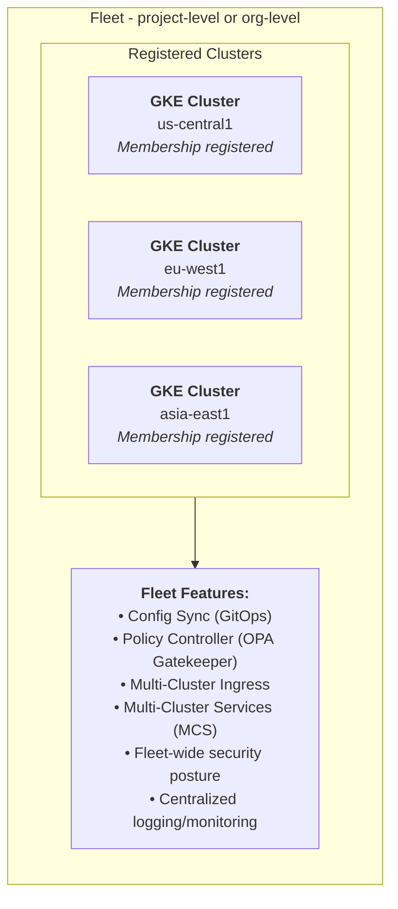
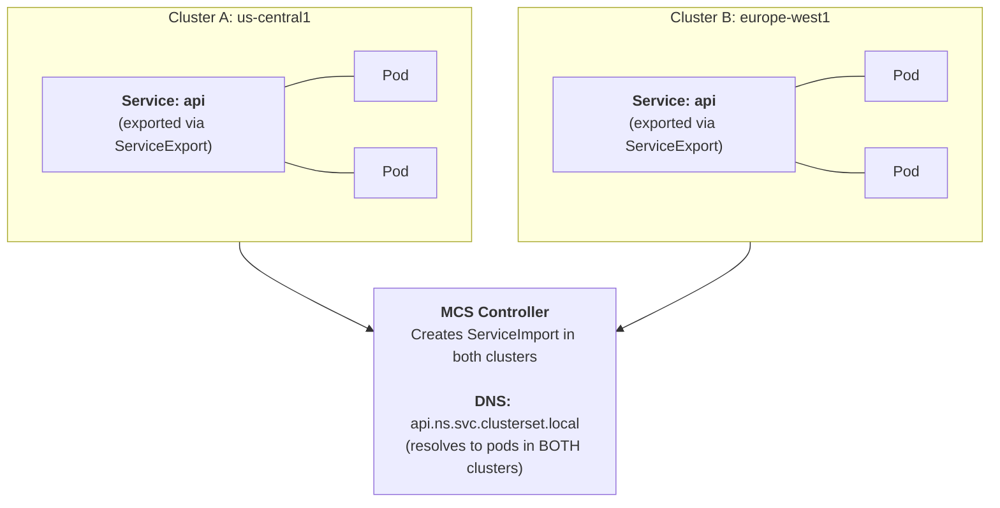
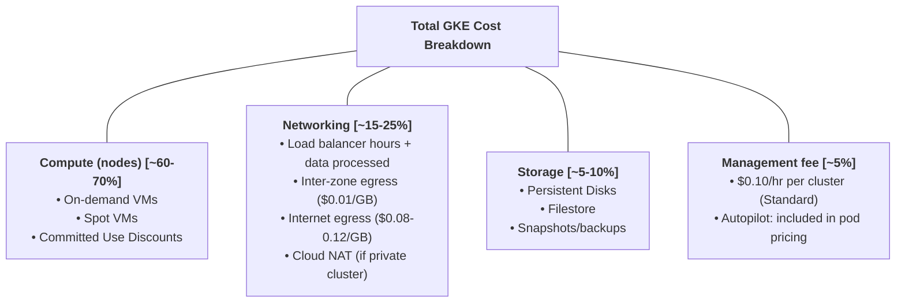

**Complexity**: [COMPLEX] | **Time to Complete**: 3h | **Prerequisites**: Module 6.1 (GKE Architecture)

## What You'll Be Able to Do

After completing this module, you will be able to:

- **Configure GKE Fleet management to register and manage clusters across multiple projects and regions**
- **Implement fleet-wide observability using Cloud Monitoring metrics scoping and centralized logging pipelines**
- **Deploy Config Sync and Policy Controller for fleet-wide GitOps-based configuration and policy enforcement**
- **Design multi-cluster GKE architectures using Multi Cluster Ingress and Multi Cluster Services for global routing**

---

## Why This Module Matters

In November 2023, a ride-sharing company with 12 GKE clusters across 4 regions discovered a critical vulnerability in their payment service. The CVE had been patched in the latest image, but only 3 of the 12 clusters were running the fixed version. The other 9 clusters had drifted---some were still on images built two months earlier, and two clusters had deployment configurations that differed from the canonical Helm chart. The security team spent 11 days identifying which clusters were affected, which versions were deployed where, and how to roll out the fix consistently. During that time, they disclosed the vulnerability window to their payment processor, triggering a PCI compliance review that took six months to close. The CTO's post-mortem conclusion: "We had 12 clusters, but no way to see or manage them as a single fleet. Each cluster was its own island."

This story captures the operational reality of multi-cluster Kubernetes: without centralized observability and fleet management, every additional cluster multiplies your operational burden. You need consistent monitoring across clusters, a way to enforce configuration policies at scale, cross-cluster service discovery, and visibility into where your money is going. GKE addresses these challenges through Cloud Operations Suite for observability, Managed Prometheus (GMP) for metrics, Fleet management for multi-cluster governance, Multi-Cluster Services for cross-cluster communication, and cost allocation for chargeback.

In this module, you will learn how to set up comprehensive observability for GKE using Cloud Operations, deploy and query Managed Prometheus, register clusters in a Fleet for centralized management, enable Multi-Cluster Services for cross-cluster traffic, and implement cost allocation to track spending by team and application.

---

## Cloud Operations Suite for GKE

GKE integrates natively with Google Cloud's operations suite (formerly Stackdriver). When you create a GKE cluster, logging and monitoring are enabled by default.

### What Gets Collected Automatically



### Configuring Logging and Monitoring Scope

```bash
# Check current logging/monitoring configuration
gcloud container clusters describe my-cluster \
  --region=us-central1 \
  --format="yaml(loggingConfig, monitoringConfig)"

# Enable comprehensive logging (system + workloads)
gcloud container clusters update my-cluster \
  --region=us-central1 \
  --logging=SYSTEM,WORKLOAD,API_SERVER,SCHEDULER,CONTROLLER_MANAGER

# Enable comprehensive monitoring
gcloud container clusters update my-cluster \
  --region=us-central1 \
  --monitoring=SYSTEM,WORKLOAD,API_SERVER,SCHEDULER,CONTROLLER_MANAGER,POD,DEPLOYMENT,DAEMONSET,STATEFULSET,HPA
```

> **Stop and think**: If you enable logging for all workloads in a large cluster with noisy debug logs, what are the direct financial implications and how might you mitigate them without losing visibility into critical application errors?

### Log-Based Metrics and Alerts

You can create custom metrics from log entries and alert on them.

```bash
# Create a log-based metric for application errors
gcloud logging metrics create app-error-rate \
  --description="Rate of ERROR level logs from application pods" \
  --log-filter='resource.type="k8s_container"
    resource.labels.namespace_name="production"
    severity>=ERROR'

# Create an alerting policy based on the metric
gcloud alpha monitoring policies create \
  --display-name="High Application Error Rate" \
  --condition-display-name="Error rate > 10/min" \
  --condition-filter='resource.type="k8s_container" AND metric.type="logging.googleapis.com/user/app-error-rate"' \
  --condition-threshold-value=10 \
  --condition-threshold-duration=60s \
  --notification-channels=projects/$PROJECT_ID/notificationChannels/CHANNEL_ID
```

### GKE Dashboard in Cloud Console

The GKE section of Cloud Console provides pre-built dashboards:

| Dashboard | Shows | Use When |
| :--- | :--- | :--- |
| **Cluster overview** | Health, node count, resource utilization | Daily cluster health check |
| **Workloads** | Deployment status, pod restarts, errors | Investigating application issues |
| **Services** | Service endpoints, latency, error rates | Debugging connectivity |
| **Storage** | PV/PVC status, capacity, IOPS | Capacity planning |
| **Security Posture** | Vulnerabilities, misconfigurations | Security audits |

```bash
# Query logs from the command line
gcloud logging read \
  'resource.type="k8s_container" AND
   resource.labels.cluster_name="prod-cluster" AND
   resource.labels.namespace_name="payments" AND
   severity>=WARNING' \
  --limit=20 \
  --format="table(timestamp, resource.labels.pod_name, textPayload)"

# Query specific pod logs
gcloud logging read \
  'resource.type="k8s_container" AND
   resource.labels.pod_name="payments-api-7f8b9c4d5-x2k9m"' \
  --limit=50 \
  --format=json
```

---

## Managed Prometheus (GMP)

Google Cloud Managed Service for Prometheus provides a fully managed, Prometheus-compatible monitoring solution. It collects metrics from your GKE workloads and stores them in Google Cloud's Monarch backend, the same system that stores Google's own production metrics.

### Why GMP Over Self-Managed Prometheus

| Aspect | Self-Managed Prometheus | Managed Prometheus (GMP) |
| :--- | :--- | :--- |
| **Storage** | Local disk (limited retention) | Google Cloud Monarch (unlimited) |
| **High availability** | Manual (Thanos/Cortex) | Built-in |
| **Retention** | Weeks to months (disk-limited) | 24 months automatic |
| **Multi-cluster** | Federation or remote write | Native cross-cluster queries |
| **Scaling** | Manual shard management | Automatic |
| **PromQL** | Full support | Full support |
| **Grafana** | Self-managed | Works with GMP as datasource |
| **Cost** | Compute + storage for Prometheus | Per metric sample ingested |

### Enabling GMP

```bash
# GMP is enabled by default on new GKE clusters
# For existing clusters:
gcloud container clusters update my-cluster \
  --region=us-central1 \
  --enable-managed-prometheus

# Verify GMP components are running
kubectl get pods -n gmp-system
# Should see: collector, rule-evaluator, operator pods
```

### Deploying PodMonitoring Resources

GMP uses `PodMonitoring` CRDs (similar to Prometheus ServiceMonitors) to define what to scrape.

```yaml
# Scrape metrics from an application exposing /metrics
apiVersion: monitoring.googleapis.com/v1
kind: PodMonitoring
metadata:
  name: app-metrics
  namespace: production
spec:
  selector:
    matchLabels:
      app: payments-api
  endpoints:
  - port: metrics
    interval: 30s
    path: /metrics

---
# Scrape metrics from all pods with a specific annotation
apiVersion: monitoring.googleapis.com/v1
kind: PodMonitoring
metadata:
  name: annotated-pods
  namespace: production
spec:
  selector:
    matchLabels:
      monitoring: enabled
  endpoints:
  - port: http
    interval: 60s
    path: /metrics
```

```yaml
# ClusterPodMonitoring: scrape across ALL namespaces
apiVersion: monitoring.googleapis.com/v1
kind: ClusterPodMonitoring
metadata:
  name: kube-state-metrics
spec:
  selector:
    matchLabels:
      app.kubernetes.io/name: kube-state-metrics
  endpoints:
  - port: http-metrics
    interval: 30s
```

### Querying GMP with PromQL

GMP exposes a Prometheus-compatible API that you can query with `promql` or Grafana.

```bash
# Query GMP from the command line using the Prometheus API
# First, set up a proxy to the GMP query endpoint
kubectl port-forward -n gmp-system svc/frontend 9090:9090 &

# Then query using curl
curl -s 'http://localhost:9090/api/v1/query' \
  --data-urlencode 'query=up{namespace="production"}' | jq .

# Top 5 pods by CPU usage
curl -s 'http://localhost:9090/api/v1/query' \
  --data-urlencode 'query=topk(5, rate(container_cpu_usage_seconds_total{namespace="production"}[5m]))' \
  | jq '.data.result[] | {pod: .metric.pod, cpu: .value[1]}'
```

> **Pause and predict**: You are migrating a 50-node cluster from self-managed Prometheus to GMP. Your existing Prometheus server crashes twice a week due to OOM errors when executing a specific high-cardinality PromQL query. What will happen to that query's performance and stability after migrating to GMP?

### Setting Up Grafana with GMP

```bash
# Deploy Grafana in the cluster
kubectl create namespace grafana

kubectl apply -n grafana -f - <<'EOF'
apiVersion: apps/v1
kind: Deployment
metadata:
  name: grafana
spec:
  replicas: 1
  selector:
    matchLabels:
      app: grafana
  template:
    metadata:
      labels:
        app: grafana
    spec:
      containers:
      - name: grafana
        image: grafana/grafana:11.0.0
        ports:
        - containerPort: 3000
        env:
        - name: GF_AUTH_ANONYMOUS_ENABLED
          value: "true"
        - name: GF_AUTH_ANONYMOUS_ORG_ROLE
          value: "Admin"
        resources:
          requests:
            cpu: 200m
            memory: 256Mi
---
apiVersion: v1
kind: Service
metadata:
  name: grafana
spec:
  type: LoadBalancer
  selector:
    app: grafana
  ports:
  - port: 80
    targetPort: 3000
EOF

# In Grafana, add GMP as a Prometheus data source:
# URL: http://frontend.gmp-system.svc:9090
# No authentication needed (cluster-internal)
```

### Custom Metrics for HPA

GMP can feed custom metrics to the Horizontal Pod Autoscaler.

```yaml
# Deploy the Stackdriver adapter for custom metrics
# Then create an HPA based on a custom Prometheus metric
apiVersion: autoscaling/v2
kind: HorizontalPodAutoscaler
metadata:
  name: payments-hpa
  namespace: production
spec:
  scaleTargetRef:
    apiVersion: apps/v1
    kind: Deployment
    name: payments-api
  minReplicas: 3
  maxReplicas: 50
  metrics:
  - type: Pods
    pods:
      metric:
        name: http_requests_per_second
      target:
        type: AverageValue
        averageValue: "100"
```

---

## Fleet Management (GKE Enterprise)

A Fleet is a logical grouping of GKE clusters (and non-GKE Kubernetes clusters) that you manage as a single entity. Fleet management is part of GKE Enterprise (formerly Anthos) and provides centralized policy enforcement, configuration management, and security posture across all clusters.

### Fleet Architecture



### Registering Clusters in a Fleet

```bash
# Enable Fleet APIs
gcloud services enable \
  gkehub.googleapis.com \
  multiclusterservicediscovery.googleapis.com \
  multiclusteringress.googleapis.com \
  --project=$PROJECT_ID

# Register a GKE cluster with the Fleet
gcloud container fleet memberships register cluster-us \
  --gke-cluster=$REGION/cluster-us \
  --enable-workload-identity \
  --project=$PROJECT_ID

gcloud container fleet memberships register cluster-eu \
  --gke-cluster=europe-west1/cluster-eu \
  --enable-workload-identity \
  --project=$PROJECT_ID

# List Fleet members
gcloud container fleet memberships list --project=$PROJECT_ID

# Describe a membership
gcloud container fleet memberships describe cluster-us \
  --project=$PROJECT_ID \
  --format="yaml(authority, endpoint)"
```

### Config Sync (Fleet-Wide GitOps)

Config Sync applies Kubernetes configurations from a Git repository to all clusters in the Fleet.

```bash
# Enable Config Sync on the Fleet
gcloud container fleet config-management apply \
  --membership=cluster-us \
  --config=/tmp/config-sync.yaml

# Config Sync configuration
cat <<'EOF' > /tmp/config-sync.yaml
applySpecVersion: 1
spec:
  configSync:
    enabled: true
    sourceFormat: unstructured
    git:
      repo: https://github.com/my-org/fleet-configs
      branch: main
      dir: /clusters/common
      auth: token
      secretType: token
    preventDrift: true
    sourceType: git
  policyController:
    enabled: true
    referentialRulesEnabled: true
    templateLibraryInstalled: true
EOF
```

> **Stop and think**: If Config Sync is configured to prevent drift on a production cluster, and an SRE manually patches a Deployment via 'kubectl edit' to urgently revert a failing image tag during an incident, what sequence of events will immediately follow?

### Policy Controller (Fleet-Wide OPA Gatekeeper)

```yaml
# Enforce that all containers must have resource requests
# This policy is applied Fleet-wide through Config Sync
apiVersion: constraints.gatekeeper.sh/v1beta1
kind: K8sRequiredResources
metadata:
  name: require-resource-requests
spec:
  enforcementAction: deny
  match:
    kinds:
    - apiGroups: ["apps"]
      kinds: ["Deployment", "StatefulSet", "DaemonSet"]
    namespaces:
    - production
    - staging
  parameters:
    requiredResources:
    - requests
```

---

## Multi-Cluster Services (MCS)

Multi-Cluster Services enables pods in one cluster to discover and communicate with Services in another cluster within the same Fleet. This is service mesh-lite: cross-cluster connectivity without the complexity of Istio.

### How MCS Works



### Setting Up MCS

```bash
# Enable MCS on the Fleet
gcloud container fleet multi-cluster-services enable \
  --project=$PROJECT_ID

# Grant the MCS controller the required IAM role
gcloud projects add-iam-policy-binding $PROJECT_ID \
  --member="serviceAccount:$PROJECT_ID.svc.id.goog[gke-mcs/gke-mcs-importer]" \
  --role="roles/compute.networkViewer"

# Verify MCS is enabled
gcloud container fleet multi-cluster-services describe \
  --project=$PROJECT_ID
```

### Exporting and Consuming Services

```yaml
# In Cluster A: Export the "api" Service
# First, deploy the normal Service
apiVersion: v1
kind: Service
metadata:
  name: api
  namespace: backend
spec:
  selector:
    app: api
  ports:
  - port: 8080
    targetPort: 8080

---
# Then create a ServiceExport to make it available Fleet-wide
apiVersion: net.gke.io/v1
kind: ServiceExport
metadata:
  name: api
  namespace: backend
```

```bash
# After exporting, MCS automatically creates ServiceImport resources
# in ALL Fleet clusters

# In Cluster B: verify the ServiceImport was created
kubectl get serviceimport -n backend
# NAME   TYPE           IP                  AGE
# api    ClusterSetIP   10.112.0.15         2m

# Pods in Cluster B can now reach the Service using:
# api.backend.svc.clusterset.local
# This resolves to pods in BOTH clusters

# Test cross-cluster connectivity from Cluster B
kubectl run curl-test --rm -it --restart=Never \
  --image=curlimages/curl -- \
  curl -s http://api.backend.svc.clusterset.local:8080
```

> **Pause and predict**: A frontend service in 'cluster-us' needs to communicate with a backend service running in both 'cluster-us' and 'cluster-eu'. If the backend service in 'cluster-us' experiences a complete outage, how will the MCS DNS resolution and traffic flow adapt?

### Multi-Cluster Ingress

Multi-Cluster Ingress routes external traffic to Services across multiple clusters, with geographic load balancing.

```bash
# Enable Multi-Cluster Ingress and designate a config cluster
gcloud container fleet ingress enable \
  --config-membership=cluster-us \
  --project=$PROJECT_ID
```

```yaml
# MultiClusterIngress resource (deployed to config cluster only)
apiVersion: networking.gke.io/v1
kind: MultiClusterIngress
metadata:
  name: global-ingress
  namespace: backend
  annotations:
    networking.gke.io/static-ip: "34.120.x.x"  # Reserved global IP
spec:
  template:
    spec:
      backend:
        serviceName: api
        servicePort: 8080
      rules:
      - host: api.example.com
        http:
          paths:
          - path: /*
            backend:
              serviceName: api
              servicePort: 8080

---
# MultiClusterService (references the exported Service)
apiVersion: networking.gke.io/v1
kind: MultiClusterService
metadata:
  name: api
  namespace: backend
spec:
  template:
    spec:
      selector:
        app: api
      ports:
      - port: 8080
        targetPort: 8080
  clusters:
  - link: "us-central1/cluster-us"
  - link: "europe-west1/cluster-eu"
```

---

## Cost Allocation and Optimization

GKE provides detailed cost visibility through GKE cost allocation, which breaks down cluster costs by namespace, label, and team.

### Enabling Cost Allocation

```bash
# Enable cost allocation on the cluster
gcloud container clusters update my-cluster \
  --region=us-central1 \
  --enable-cost-allocation

# Cost data flows to BigQuery (via billing export)
# and is visible in the GKE cost allocation dashboard
```

### Understanding GKE Costs



### Cost Allocation by Namespace and Label

```bash
# BigQuery query to see costs by namespace
# (requires billing export to BigQuery)
cat <<'SQL'
SELECT
  labels.value AS namespace,
  SUM(cost) AS total_cost,
  SUM(usage.amount) AS total_usage
FROM
  `project.dataset.gcp_billing_export_v1_XXXXXX`
LEFT JOIN
  UNNEST(labels) AS labels ON labels.key = "k8s-namespace"
WHERE
  service.description = "Kubernetes Engine"
  AND invoice.month = "202403"
GROUP BY
  namespace
ORDER BY
  total_cost DESC
SQL
```

### Cost Optimization Strategies

| Strategy | Savings | Effort | Risk |
| :--- | :--- | :--- | :--- |
| **Right-size pods** (match requests to usage) | 20-40% | Medium | Low (if monitored) |
| **Use Spot node pools** for fault-tolerant workloads | 60-91% | Low | Medium (preemption) |
| **Committed Use Discounts** for steady-state | 28-52% | Low | Low (lock-in) |
| **Scale to zero** (dev/test clusters off-hours) | 50-70% | Medium | Low |
| **Autopilot** (pay per pod, not per node) | 10-40% | High (migration) | Low |
| **Bin-pack aggressively** (fewer, larger nodes) | 10-20% | Medium | Medium |

```bash
# Find over-provisioned pods (requests >> actual usage)
# Using GMP/Prometheus:
# Pods requesting more than 2x their actual CPU usage
curl -s 'http://localhost:9090/api/v1/query' \
  --data-urlencode 'query=
    (
      kube_pod_container_resource_requests{resource="cpu"}
      /
      rate(container_cpu_usage_seconds_total[24h])
    ) > 2
  ' | jq '.data.result[] | {
    namespace: .metric.namespace,
    pod: .metric.pod,
    overprovisioning_ratio: .value[1]
  }'
```

### GKE Recommendations

GKE provides automated recommendations for cost and performance optimization:

```bash
# View active recommendations
gcloud recommender recommendations list \
  --project=$PROJECT_ID \
  --location=$REGION \
  --recommender=google.container.DiagnosisRecommender \
  --format="table(name, description, priority, stateInfo.state)"

# Common recommendations:
# - "Resize node pool: current utilization is 23%"
# - "Switch to e2-medium: n2-standard-4 is over-provisioned"
# - "Enable Cluster Autoscaler: static node count wastes resources"
```

---

## Did You Know?

1. **Google Cloud Managed Prometheus stores metrics in Monarch**, the same system that monitors all of Google's production services (Search, Gmail, YouTube, Cloud). Monarch ingests over 2 billion time series and processes over 4 trillion metric points per day. When you send a metric to GMP, it is stored with the same durability and query performance that Google relies on for its own SRE operations. This is why GMP can offer 24-month retention without the capacity planning headaches of self-managed Prometheus.

2. **Multi-Cluster Services DNS resolution uses a special domain: `.svc.clusterset.local`.** This domain is separate from the standard `.svc.cluster.local` used for intra-cluster DNS. When a pod looks up `api.backend.svc.clusterset.local`, CoreDNS forwards the request to the MCS controller, which returns endpoints from all clusters that have exported that Service. The endpoints are weighted by the number of healthy pods in each cluster, so traffic naturally flows to the cluster with the most available capacity.

3. **Inter-zone egress within a GKE cluster costs $0.01 per GB**, and this can add up fast. A regional cluster with nodes in 3 zones incurs inter-zone charges for every pod-to-pod call that crosses zone boundaries. For a microservice architecture with 50 services making 1,000 requests per second with 10KB payloads, inter-zone traffic can cost $300-500 per month. Using topology-aware routing (`topologySpreadConstraints` or Service `internalTrafficPolicy: Local`) can reduce this by keeping traffic within the same zone.

4. **Fleet workload identity allows a single Kubernetes ServiceAccount identity to be recognized across all clusters in the Fleet.** This means you can register a ServiceAccount in Cluster A and have it authenticated in Cluster B without creating duplicate IAM bindings. The identity format is `PROJECT_ID.svc.id.goog[NAMESPACE/KSA_NAME]`, and it works the same regardless of which Fleet member the pod runs in. This is the foundation for zero-trust networking across a multi-cluster architecture.

---

## Common Mistakes

| Mistake | Why It Happens | How to Fix It |
| :--- | :--- | :--- |
| Enabling WORKLOAD logging without understanding volume | All container stdout goes to Cloud Logging | Set log exclusion filters or reduce application verbosity; Cloud Logging charges per GB ingested |
| Not enabling cost allocation | Assuming billing breakdown is automatic | Enable `--enable-cost-allocation` on the cluster; without it, costs are aggregated at the project level |
| Running Prometheus alongside GMP | Not realizing GMP replaces self-managed Prometheus | Migrate scrape configs to PodMonitoring CRDs; remove the self-managed Prometheus deployment |
| Ignoring inter-zone egress costs | Not aware that cross-zone traffic is billed | Use topology-aware routing; co-locate tightly-coupled services in the same zone |
| Registering clusters in a Fleet without Workload Identity | Fleet features require WIF for authentication | Enable `--workload-pool` on the cluster and `--enable-workload-identity` during Fleet registration |
| Deploying MultiClusterIngress to all clusters | Only the config cluster processes MCI resources | Deploy MCI and MCS resources only to the designated config cluster |
| Not setting resource requests (affecting cost allocation) | Pods without requests cannot be attributed to cost centers | Require resource requests via Policy Controller; Autopilot enforces this automatically |
| Querying GMP with high-cardinality labels | Creating millions of unique time series | Avoid labels with unbounded values (user IDs, request IDs); use histograms instead of per-request metrics |

---

## Quiz

<details>
<summary>1. You are the lead engineer for a financial application spanning two GKE clusters (US and EU). A new compliance rule requires you to scrape custom metrics from a specific subset of payment pods labeled `pci-scope: true` across all namespaces in both clusters, but you must not scrape any other pods. How should you configure Managed Prometheus (GMP) to achieve this efficiently?</summary>

To achieve this, you should deploy a `ClusterPodMonitoring` resource in both clusters with a `matchLabels` selector for `pci-scope: true`. A `ClusterPodMonitoring` resource is required because the pods are distributed across multiple namespaces, and standard `PodMonitoring` is namespace-scoped and would require creating a separate resource for every single namespace. By applying this configuration to both clusters using Fleet management or Config Sync, GMP's collectors will automatically identify and scrape the target pods regardless of their namespace. This approach minimizes configuration overhead and ensures that any new namespaces containing PCI-scoped pods are automatically monitored without manual intervention.
</details>

<details>
<summary>2. Your organization runs a high-traffic e-commerce platform across three regional GKE clusters. Currently, each cluster has its own independent Istio service mesh, which is causing significant operational overhead and high latency for cross-cluster database calls. You want to simplify cross-cluster service discovery and routing without the complexity of a full mesh. What is the most appropriate Fleet feature to solve this, and how does it change the traffic flow?</summary>

The most appropriate solution is to enable Multi-Cluster Services (MCS) and export the database services using `ServiceExport`. MCS directly addresses the operational overhead by replacing the complex multi-cluster Istio mesh with simple, native DNS-based service discovery using the `svc.clusterset.local` domain. When a frontend pod queries this domain, CoreDNS resolves it to endpoints across all clusters where the service is exported. This approach eliminates the need for sidecar proxies and complex gateway configurations, reducing both latency and operational burden while still providing robust, cross-cluster connectivity.
</details>

<details>
<summary>3. The CFO of your company reviews the monthly GCP bill and notices that a regional GKE cluster running a distributed cache has unexpectedly high network charges, specifically for inter-zone egress. The pods are evenly distributed across three zones, but the cost is eating into the project's margin. What architectural changes should you implement to reduce these specific charges while maintaining high availability?</summary>

To reduce these inter-zone network costs, you should implement topology-aware routing by setting `internalTrafficPolicy: Local` on the cache Services or by configuring topology spread constraints to co-locate clients with the cache nodes. In a regional GKE cluster, traffic crossing availability zones incurs a $0.01 per GB charge, which becomes extremely expensive for high-volume chatty workloads like distributed caches. By forcing the network traffic to stay within the same zone where the requesting pod resides, you completely bypass the cross-zone billing meter. The cluster still maintains high availability because if an entire zone fails, the routing policy will gracefully fall back to routing traffic to the remaining healthy zones.
</details>

<details>
<summary>4. During a major marketing event, the Multi-Cluster Ingress (MCI) configuration cluster in `us-central1` experiences a catastrophic regional outage and goes completely offline. However, the application clusters in `europe-west1` and `asia-east1` are still fully operational. What will happen to the global external traffic currently being routed to the EU and Asia clusters?</summary>

The global external traffic will continue to be routed normally to the surviving application clusters in Europe and Asia without interruption. The config cluster is only responsible for processing the MCI resources and programming the Google Cloud Load Balancer's control plane. Once the load balancer is programmed, the data plane operates independently of the config cluster. However, you will be completely unable to create new routing rules, update TLS certificates, or add new backend services until the config cluster is restored or you designate a new config cluster, because the MCI controller responsible for reconciling those changes is offline.
</details>

<details>
<summary>5. Your engineering team recently enabled GKE cost allocation to track spending by microservice. After a month, the dashboard shows that 40% of the cluster's compute cost is grouped under an "Unallocated" bucket rather than being attributed to specific application namespaces. What is the most likely cause of this reporting gap, and how can you enforce accurate cost tracking?</summary>

The most likely cause is that a significant portion of the application pods are deployed without explicit CPU and memory resource requests defined in their pod specifications. GKE cost allocation relies entirely on these resource requests to mathematically distribute the hourly cost of the underlying VM nodes to the individual pods running on them. When pods lack these requests, the billing system cannot determine their share of the node's capacity, dumping the cost into the unallocated pool. To enforce accurate tracking going forward, you should deploy a Policy Controller constraint (like `K8sRequiredResources`) across the Fleet to reject any pod deployments that fail to specify resource requests.
</details>

<details>
<summary>6. An SRE team is troubleshooting a persistent issue where an internal API service is unreachable from newly deployed pods in a secondary cluster within the Fleet. They confirm that the API service is running perfectly in the primary cluster and that the `ServiceExport` object exists there. However, querying `api.backend.svc.clusterset.local` from the secondary cluster returns a DNS resolution error. What fundamental Fleet configuration is likely missing or misconfigured?</summary>

The most likely missing configuration is that the Multi-Cluster Services (MCS) importer service account (`gke-mcs-importer`) lacks the necessary IAM permissions, or Fleet Workload Identity is not properly enabled on the secondary cluster. For MCS to function, the controller must be able to read the exported services and dynamically create `ServiceImport` resources in all other Fleet member clusters. Without the `roles/compute.networkViewer` permission bound to the correct workload identity pool, the controller silently fails to synchronize these endpoints to the secondary cluster. Consequently, the local CoreDNS in the secondary cluster has no record of the `.clusterset.local` domain for that service, resulting in a complete DNS resolution failure.
</details>

---

## Hands-On Exercise: Fleet Registration, GMP, and Multi-Cluster Services

### Objective

Register two GKE clusters in a Fleet, deploy Managed Prometheus with custom metrics, enable Multi-Cluster Services for cross-cluster communication, and observe metrics from both clusters in a single GMP query.

### Prerequisites

- `gcloud` CLI installed and authenticated
- A GCP project with billing enabled
- GKE, GKE Hub, and MCS APIs enabled

### Tasks

**Task 1: Create Two GKE Clusters**

<details>
<summary>Solution</summary>

```bash
export PROJECT_ID=$(gcloud config get-value project)
export REGION_US=us-central1
export REGION_EU=europe-west1

# Enable APIs
gcloud services enable \
  container.googleapis.com \
  gkehub.googleapis.com \
  multiclusterservicediscovery.googleapis.com \
  multiclusteringress.googleapis.com \
  --project=$PROJECT_ID

# Create Cluster 1 (US)
gcloud container clusters create cluster-us \
  --region=$REGION_US \
  --num-nodes=1 \
  --machine-type=e2-standard-2 \
  --release-channel=regular \
  --enable-ip-alias \
  --workload-pool=$PROJECT_ID.svc.id.goog \
  --enable-managed-prometheus

# Create Cluster 2 (EU)
gcloud container clusters create cluster-eu \
  --region=$REGION_EU \
  --num-nodes=1 \
  --machine-type=e2-standard-2 \
  --release-channel=regular \
  --enable-ip-alias \
  --workload-pool=$PROJECT_ID.svc.id.goog \
  --enable-managed-prometheus

echo "Both clusters created."
```
</details>

**Task 2: Register Both Clusters in a Fleet**

<details>
<summary>Solution</summary>

```bash
# Register Cluster US
gcloud container fleet memberships register cluster-us \
  --gke-cluster=$REGION_US/cluster-us \
  --enable-workload-identity \
  --project=$PROJECT_ID

# Register Cluster EU
gcloud container fleet memberships register cluster-eu \
  --gke-cluster=$REGION_EU/cluster-eu \
  --enable-workload-identity \
  --project=$PROJECT_ID

# Verify Fleet memberships
gcloud container fleet memberships list --project=$PROJECT_ID

# Enable Multi-Cluster Services
gcloud container fleet multi-cluster-services enable \
  --project=$PROJECT_ID

# Grant MCS controller permissions
gcloud projects add-iam-policy-binding $PROJECT_ID \
  --member="serviceAccount:$PROJECT_ID.svc.id.goog[gke-mcs/gke-mcs-importer]" \
  --role="roles/compute.networkViewer"

echo "Fleet configured with MCS enabled."
```
</details>

**Task 3: Deploy an Application to Both Clusters**

<details>
<summary>Solution</summary>

```bash
# Deploy to Cluster US
gcloud container clusters get-credentials cluster-us --region=$REGION_US

kubectl create namespace backend

kubectl apply -n backend -f - <<'EOF'
apiVersion: apps/v1
kind: Deployment
metadata:
  name: echo
spec:
  replicas: 2
  selector:
    matchLabels:
      app: echo
  template:
    metadata:
      labels:
        app: echo
        monitoring: enabled
    spec:
      containers:
      - name: echo
        image: hashicorp/http-echo
        args: ["-text=Hello from cluster-us", "-listen=:8080"]
        ports:
        - name: http
          containerPort: 8080
        resources:
          requests:
            cpu: 100m
            memory: 64Mi
---
apiVersion: v1
kind: Service
metadata:
  name: echo
spec:
  selector:
    app: echo
  ports:
  - port: 8080
    targetPort: 8080
---
apiVersion: net.gke.io/v1
kind: ServiceExport
metadata:
  name: echo
EOF

# Deploy to Cluster EU
gcloud container clusters get-credentials cluster-eu --region=$REGION_EU

kubectl create namespace backend

kubectl apply -n backend -f - <<'EOF'
apiVersion: apps/v1
kind: Deployment
metadata:
  name: echo
spec:
  replicas: 2
  selector:
    matchLabels:
      app: echo
  template:
    metadata:
      labels:
        app: echo
        monitoring: enabled
    spec:
      containers:
      - name: echo
        image: hashicorp/http-echo
        args: ["-text=Hello from cluster-eu", "-listen=:8080"]
        ports:
        - name: http
          containerPort: 8080
        resources:
          requests:
            cpu: 100m
            memory: 64Mi
---
apiVersion: v1
kind: Service
metadata:
  name: echo
spec:
  selector:
    app: echo
  ports:
  - port: 8080
    targetPort: 8080
---
apiVersion: net.gke.io/v1
kind: ServiceExport
metadata:
  name: echo
EOF

echo "Application deployed and exported in both clusters."
```
</details>

**Task 4: Test Multi-Cluster Service Discovery**

<details>
<summary>Solution</summary>

```bash
# Switch to Cluster US
gcloud container clusters get-credentials cluster-us --region=$REGION_US

# Wait for ServiceImport to be created (may take 1-3 minutes)
echo "Waiting for ServiceImport..."
for i in $(seq 1 12); do
  SI=$(kubectl get serviceimport -n backend 2>/dev/null | grep echo || true)
  if [ -n "$SI" ]; then
    echo "ServiceImport found:"
    kubectl get serviceimport -n backend
    break
  fi
  echo "  Waiting... ($i/12)"
  sleep 15
done

# Test cross-cluster DNS from Cluster US
# This should reach pods in BOTH clusters
kubectl run curl-test --rm -it --restart=Never \
  -n backend --image=curlimages/curl -- \
  sh -c 'for i in $(seq 1 8); do curl -s http://echo.backend.svc.clusterset.local:8080; echo; done'

# You should see responses from both cluster-us and cluster-eu
```
</details>

**Task 5: Deploy PodMonitoring and Query GMP**

<details>
<summary>Solution</summary>

```bash
# Deploy PodMonitoring on Cluster US
gcloud container clusters get-credentials cluster-us --region=$REGION_US

kubectl apply -n backend -f - <<'EOF'
apiVersion: monitoring.googleapis.com/v1
kind: PodMonitoring
metadata:
  name: echo-metrics
spec:
  selector:
    matchLabels:
      monitoring: enabled
  endpoints:
  - port: http
    interval: 30s
    path: /metrics
EOF

# Deploy PodMonitoring on Cluster EU
gcloud container clusters get-credentials cluster-eu --region=$REGION_EU

kubectl apply -n backend -f - <<'EOF'
apiVersion: monitoring.googleapis.com/v1
kind: PodMonitoring
metadata:
  name: echo-metrics
spec:
  selector:
    matchLabels:
      monitoring: enabled
  endpoints:
  - port: http
    interval: 30s
    path: /metrics
EOF

# Query GMP for metrics across both clusters
# Switch back to Cluster US for querying
gcloud container clusters get-credentials cluster-us --region=$REGION_US

# Use gcloud to query metrics across the project (all clusters)
echo "Metrics from both clusters are available in Cloud Monitoring."
echo "You can query them using:"
echo "  - Cloud Console > Monitoring > Metrics Explorer"
echo "  - PromQL: up{namespace='backend'}"
echo ""
echo "Both clusters' metrics are automatically aggregated in GMP"
echo "because they share the same project."

# Verify GMP is collecting metrics
kubectl get pods -n gmp-system
echo ""
echo "GMP collectors are running and forwarding metrics to Monarch."
```
</details>

**Task 6: Clean Up**

<details>
<summary>Solution</summary>

```bash
# Unregister Fleet memberships
gcloud container fleet memberships unregister cluster-us \
  --gke-cluster=$REGION_US/cluster-us \
  --project=$PROJECT_ID

gcloud container fleet memberships unregister cluster-eu \
  --gke-cluster=$REGION_EU/cluster-eu \
  --project=$PROJECT_ID

# Disable MCS
gcloud container fleet multi-cluster-services disable \
  --project=$PROJECT_ID 2>/dev/null || true

# Delete both clusters
gcloud container clusters delete cluster-us \
  --region=$REGION_US --quiet --async

gcloud container clusters delete cluster-eu \
  --region=$REGION_EU --quiet --async

echo "Both clusters are being deleted (async)."
echo "Verify with: gcloud container clusters list"
```
</details>

### Success Criteria

- [ ] Two GKE clusters created in different regions
- [ ] Both clusters registered in a Fleet
- [ ] Multi-Cluster Services enabled with ServiceExport in both clusters
- [ ] ServiceImport automatically created in both clusters
- [ ] Cross-cluster DNS resolution works (`svc.clusterset.local`)
- [ ] PodMonitoring deployed in both clusters for GMP
- [ ] GMP is collecting metrics from both clusters
- [ ] All resources cleaned up (Fleet memberships, clusters)

---

## Next Module

You have completed the GKE Deep Dive series. From here, consider exploring:

- **[Hyperscaler Rosetta Stone](/cloud/hyperscaler-rosetta-stone/)** --- Compare GKE concepts with EKS and AKS for multi-cloud fluency
- **[Platform Engineering Foundations](/platform/foundations/)** --- Apply what you learned about GKE to build internal developer platforms
- **[SRE Disciplines](/platform/disciplines/core-platform/sre/)** --- Use GKE observability and Fleet management in an SRE practice