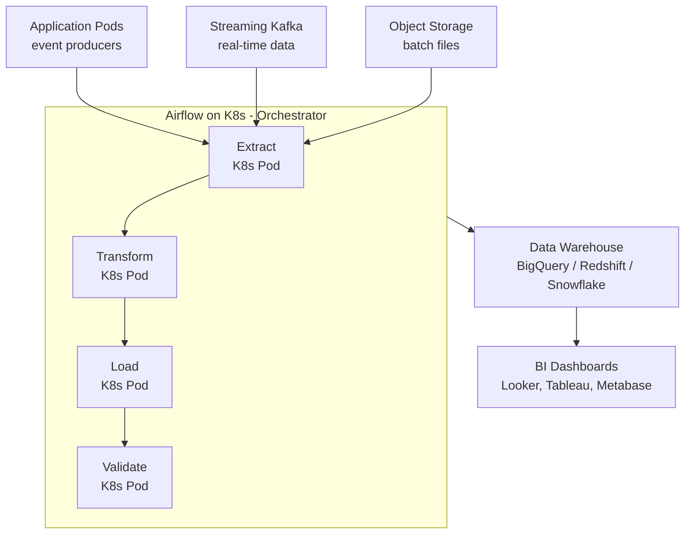
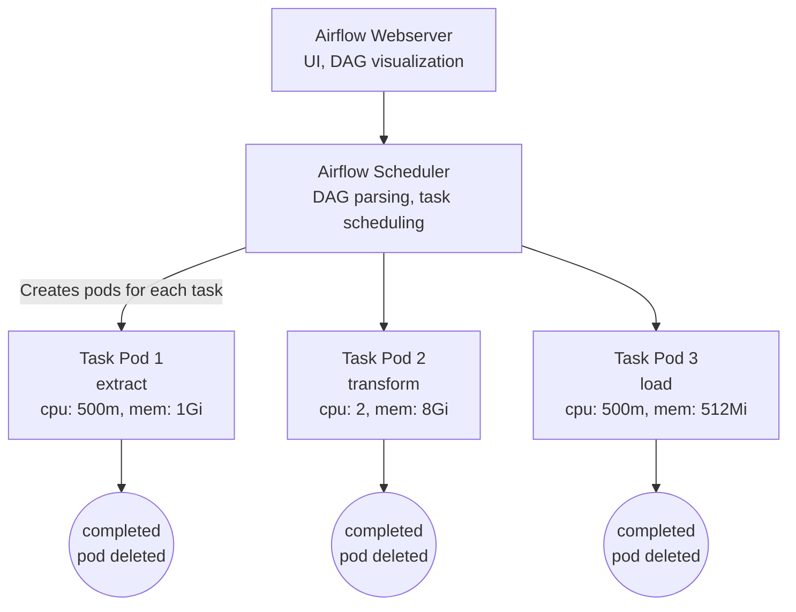

**Complexity**: [COMPLEX] | **Time to Complete**: 2.5h | **Prerequisites**: Module 9.4 (Object Storage), Module 9.7 (Streaming Pipelines), SQL basics

## What You'll Be Able to Do

After completing this module, you will be able to:

- **Configure Kubernetes workloads to write to managed data warehouses (Redshift, BigQuery, Synapse Analytics) using private connectivity**
- **Implement ETL/ELT pipelines on Kubernetes that transform and load data into cloud analytics platforms**
- **Deploy Apache Spark on Kubernetes with managed storage backends for large-scale data processing**
- **Design data lake architectures that combine Kubernetes data pipelines with cloud-native analytics and query services**

---

## Why This Module Matters

In May 2024, a ride-sharing company processed 8 million trips per day. Their analytics pipeline was a tangle of CronJobs running on EKS: Python scripts that extracted data from PostgreSQL, transformed it in memory, and loaded it into BigQuery. Each CronJob ran on a dedicated pod with 16 GB of RAM to handle the largest tables. The pipeline consumed 12 always-on pods -- $6,800/month in compute -- and took 4 hours to complete the daily ETL. When a single CronJob failed (out-of-memory on a growing table), downstream analysts discovered the data gap 6 hours later when their dashboards showed zeros.

> **Stop and think**: If a CronJob is only running for 4 hours a day, why was the company paying for 12 always-on pods? What Kubernetes architectural choice leads to this?

The data engineering team rebuilt the pipeline with Apache Airflow on Kubernetes. Airflow orchestrated the workflow as a DAG (Directed Acyclic Graph), with each task running as an ephemeral KubernetesPodOperator. Tasks requested only the resources they needed. The BigQuery load step used BigQuery's native LOAD command instead of streaming inserts, cutting costs by 90%. Ephemeral pods meant compute cost dropped to $1,200/month (pods only existed during the 4-hour window). Airflow's built-in retry logic and alerting caught failures within minutes. Same data, 82% less cost, faster incident detection.

This module teaches you how to connect Kubernetes workloads to managed data warehouses (BigQuery, Redshift, Snowflake), orchestrate data pipelines with Airflow on Kubernetes, use ephemeral compute for analytics jobs, manage IAM for data access, and control costs in analytics workloads.

---

## Data Warehouse Landscape

### Managed Data Warehouses Compared

| Feature | BigQuery (GCP) | Redshift (AWS) | Snowflake (Multi-cloud) |
|---------|---------------|----------------|------------------------|
| Pricing model | Per-query (on-demand) or slots (capacity) | Per-node-hour (provisioned) or Serverless | Per-credit (compute) + per-TB (storage) |
| Separation of storage/compute | Yes (native) | Serverless only | Yes (native) |
| Auto-scaling | Yes (on-demand) | Serverless: yes; Provisioned: manual | Yes (multi-cluster warehouse) |
| K8s integration | Workload Identity, BQ API | IRSA, Redshift Data API | Snowflake Connector for Spark/Python |
| Streaming ingestion | Storage Write API | Kinesis/MSK integration | Snowpipe |
| Serverless option | Default (on-demand) | Redshift Serverless | Default |
| Minimum cost | ~$0 (on-demand, pay per query) | ~$180/month (Serverless minimum) | ~$0 (pay per credit used) |

### Architecture: K8s to Data Warehouse



---

## Connecting Kubernetes to Data Warehouses

### BigQuery from GKE

> **Pause and predict**: When using Workload Identity to connect a Kubernetes pod to BigQuery, does the pod need to store a GCP JSON key file? How does the authentication flow work?

```yaml
# ServiceAccount with Workload Identity for BigQuery access
apiVersion: v1
kind: ServiceAccount
metadata:
  name: bigquery-writer
  namespace: data-pipeline
  annotations:
    iam.gke.io/gcp-service-account: bq-writer@my-project.iam.gserviceaccount.com
```

```bash
# Grant BigQuery roles to the GCP service account
gcloud projects add-iam-policy-binding my-project \
  --member="serviceAccount:bq-writer@my-project.iam.gserviceaccount.com" \
  --role="roles/bigquery.dataEditor"

gcloud projects add-iam-policy-binding my-project \
  --member="serviceAccount:bq-writer@my-project.iam.gserviceaccount.com" \
  --role="roles/bigquery.jobUser"

# Bind K8s SA to GCP SA
gcloud iam service-accounts add-iam-policy-binding \
  bq-writer@my-project.iam.gserviceaccount.com \
  --role roles/iam.workloadIdentityUser \
  --member "serviceAccount:my-project.svc.id.goog[data-pipeline/bigquery-writer]"
```

```python
# Python job loading data to BigQuery from a K8s pod
from google.cloud import bigquery

client = bigquery.Client(project='my-project')

# Load from GCS (most efficient for large datasets)
job_config = bigquery.LoadJobConfig(
    source_format=bigquery.SourceFormat.PARQUET,
    write_disposition=bigquery.WriteDisposition.WRITE_APPEND,
)

uri = "gs://data-pipeline-staging/trips/2025-11-15/*.parquet"
load_job = client.load_table_from_uri(
    uri,
    "my-project.analytics.trips",
    job_config=job_config,
)
load_job.result()  # Wait for completion

print(f"Loaded {load_job.output_rows} rows to BigQuery")
```

### Redshift from EKS

```yaml
apiVersion: v1
kind: ServiceAccount
metadata:
  name: redshift-writer
  namespace: data-pipeline
  annotations:
    eks.amazonaws.com/role-arn: arn:aws:iam::123456789:role/RedshiftWriterRole
```

```python
# Using Redshift Data API (serverless, no persistent connection needed)
import boto3
import time

client = boto3.client('redshift-data')

# Execute COPY command to load from S3
response = client.execute_statement(
    WorkgroupName='analytics-serverless',
    Database='analytics',
    Sql="""
        COPY trips FROM 's3://data-pipeline-staging/trips/2025-11-15/'
        IAM_ROLE 'arn:aws:iam::123456789:role/RedshiftS3Role'
        FORMAT AS PARQUET;
    """
)

statement_id = response['Id']

# Poll for completion
while True:
    status = client.describe_statement(Id=statement_id)
    if status['Status'] in ('FINISHED', 'FAILED', 'ABORTED'):
        break
    time.sleep(5)

if status['Status'] == 'FINISHED':
    print(f"Loaded {status['ResultRows']} rows")
else:
    print(f"Failed: {status.get('Error', 'unknown')}")
```

### Snowflake from Any K8s Cluster

```python
# Snowflake connector with key-pair authentication (no password needed)
import snowflake.connector
import os

conn = snowflake.connector.connect(
    account='my-org-my-account',
    user='ETL_SERVICE_USER',
    private_key_file='/mnt/secrets/snowflake-private-key.pem',
    warehouse='ETL_WH',
    database='ANALYTICS',
    schema='PUBLIC',
)

cursor = conn.cursor()

# Load from cloud storage
cursor.execute("""
    COPY INTO trips
    FROM @my_s3_stage/trips/2025-11-15/
    FILE_FORMAT = (TYPE = PARQUET)
    ON_ERROR = 'CONTINUE';
""")

result = cursor.fetchone()
print(f"Loaded: {result}")
```

---

## Airflow on Kubernetes

Apache Airflow is the standard orchestrator for data pipelines. Running it on Kubernetes gives you dynamic task execution with ephemeral pods.

### Installing Airflow with Helm

```bash
helm repo add apache-airflow https://airflow.apache.org
helm install airflow apache-airflow/airflow \
  --namespace airflow --create-namespace \
  --set executor=KubernetesExecutor \
  --set webserver.defaultUser.enabled=true \
  --set webserver.defaultUser.username=admin \
  --set webserver.defaultUser.password=airflow-admin-pass \
  --set dags.persistence.enabled=true \
  --set dags.gitSync.enabled=true \
  --set dags.gitSync.repo=https://github.com/mycompany/airflow-dags.git \
  --set dags.gitSync.branch=main \
  --set dags.gitSync.subPath=dags \
  --set config.core.dags_folder=/opt/airflow/dags/repo/dags
```

### KubernetesExecutor Architecture



> **Stop and think**: If Airflow's KubernetesExecutor creates a new pod for every task, how does this impact pipeline execution time compared to having workers already running?

Each task runs in its own pod with its own resource requests. When the task completes, the pod is deleted. You pay only for the compute you use.

### Airflow DAG with KubernetesPodOperator

```python
# dags/daily_etl.py
from airflow import DAG
from airflow.providers.cncf.kubernetes.operators.pod import KubernetesPodOperator
from airflow.utils.dates import days_ago
from datetime import timedelta

default_args = {
    'owner': 'data-engineering',
    'retries': 2,
    'retry_delay': timedelta(minutes=5),
    'execution_timeout': timedelta(hours=2),
}

with DAG(
    'daily_trip_etl',
    default_args=default_args,
    schedule_interval='0 6 * * *',  # Daily at 6 AM UTC
    start_date=days_ago(1),
    catchup=False,
    tags=['analytics', 'production'],
) as dag:

    extract = KubernetesPodOperator(
        task_id='extract_trips',
        name='extract-trips',
        namespace='data-pipeline',
        image='mycompany/etl-extract:2.1.0',
        cmds=['python', 'extract.py'],
        arguments=['--date={{ ds }}', '--output=gs://staging/trips/{{ ds }}/'],
        service_account_name='bigquery-writer',
        container_resources={
            'requests': {'cpu': '500m', 'memory': '1Gi'},
            'limits': {'cpu': '1', 'memory': '2Gi'},
        },
        is_delete_operator_pod=True,
        get_logs=True,
    )

    transform = KubernetesPodOperator(
        task_id='transform_trips',
        name='transform-trips',
        namespace='data-pipeline',
        image='mycompany/etl-transform:2.1.0',
        cmds=['python', 'transform.py'],
        arguments=['--input=gs://staging/trips/{{ ds }}/', '--output=gs://staging/trips-clean/{{ ds }}/'],
        service_account_name='bigquery-writer',
        container_resources={
            'requests': {'cpu': '2', 'memory': '8Gi'},
            'limits': {'cpu': '4', 'memory': '16Gi'},
        },
        is_delete_operator_pod=True,
        get_logs=True,
    )

    load = KubernetesPodOperator(
        task_id='load_to_bigquery',
        name='load-bigquery',
        namespace='data-pipeline',
        image='mycompany/etl-load:2.1.0',
        cmds=['python', 'load.py'],
        arguments=['--input=gs://staging/trips-clean/{{ ds }}/', '--table=analytics.trips'],
        service_account_name='bigquery-writer',
        container_resources={
            'requests': {'cpu': '500m', 'memory': '512Mi'},
            'limits': {'cpu': '1', 'memory': '1Gi'},
        },
        is_delete_operator_pod=True,
        get_logs=True,
    )

    validate = KubernetesPodOperator(
        task_id='validate_data',
        name='validate-data',
        namespace='data-pipeline',
        image='mycompany/etl-validate:2.1.0',
        cmds=['python', 'validate.py'],
        arguments=['--table=analytics.trips', '--date={{ ds }}', '--min-rows=100000'],
        service_account_name='bigquery-writer',
        container_resources={
            'requests': {'cpu': '200m', 'memory': '256Mi'},
        },
        is_delete_operator_pod=True,
        get_logs=True,
    )

    extract >> transform >> load >> validate
```

### Why KubernetesExecutor Over CeleryExecutor

| Factor | KubernetesExecutor | CeleryExecutor |
|--------|-------------------|----------------|
| Worker management | No persistent workers; pods per task | Persistent worker pods |
| Resource isolation | Each task gets dedicated resources | Tasks share worker resources |
| Cost | Pay only when tasks run | Workers run 24/7 |
| Startup time | Pod creation overhead (10-30s) | Immediate (workers already running) |
| Best for | Batch pipelines, varied resource needs | High-frequency, low-latency tasks |

---

## Ephemeral Analytics Clusters

Some analytics workloads need significant compute for a short time -- processing a month of data, retraining an ML model, or running a large backfill. Ephemeral clusters or node pools appear for the job and disappear after.

### Spot/Preemptible Node Pools for Analytics

```bash
# AWS: Create a spot node group for analytics
aws eks create-nodegroup \
  --cluster-name production \
  --nodegroup-name analytics-spot \
  --capacity-type SPOT \
  --instance-types r6i.2xlarge r6i.4xlarge r5.2xlarge \
  --scaling-config minSize=0,maxSize=20,desiredSize=0 \
  --labels workload=analytics \
  --taints "key=analytics,value=true,effect=NoSchedule"

# GCP: Create a preemptible node pool
gcloud container node-pools create analytics-spot \
  --cluster production \
  --machine-type n2-highmem-8 \
  --spot \
  --num-nodes 0 \
  --enable-autoscaling --min-nodes 0 --max-nodes 20 \
  --node-labels workload=analytics \
  --node-taints analytics=true:NoSchedule
```

### Airflow Tasks with Node Selection

```python
analytics_task = KubernetesPodOperator(
    task_id='heavy_transform',
    name='heavy-transform',
    namespace='data-pipeline',
    image='mycompany/etl-transform:2.1.0',
    node_selector={'workload': 'analytics'},
    tolerations=[{
        'key': 'analytics',
        'operator': 'Equal',
        'value': 'true',
        'effect': 'NoSchedule'
    }],
    container_resources={
        'requests': {'cpu': '4', 'memory': '32Gi'},
        'limits': {'cpu': '8', 'memory': '64Gi'},
    },
    is_delete_operator_pod=True,
)
```

When this task runs, the cluster autoscaler detects pending pods that can only be scheduled on the analytics-spot node group, scales it up from 0 to the needed size, runs the task, and scales back to 0 after the pod completes. Total cost: the minutes of compute actually used.

### Ephemeral Spark on Kubernetes

```yaml
# SparkApplication for large-scale data processing
apiVersion: sparkoperator.k8s.io/v1beta2
kind: SparkApplication
metadata:
  name: daily-aggregation
  namespace: data-pipeline
spec:
  type: Python
  mode: cluster
  image: mycompany/spark-etl:3.5.0
  mainApplicationFile: gs://spark-jobs/aggregate_trips.py
  arguments:
    - "--date=2025-11-15"
    - "--output=gs://analytics-output/aggregated/"
  sparkVersion: "3.5.0"
  driver:
    cores: 1
    memory: "2g"
    serviceAccount: spark-sa
    nodeSelector:
      workload: analytics
    tolerations:
      - key: analytics
        operator: Equal
        value: "true"
        effect: NoSchedule
  executor:
    cores: 2
    instances: 10
    memory: "8g"
    nodeSelector:
      workload: analytics
    tolerations:
      - key: analytics
        operator: Equal
        value: "true"
        effect: NoSchedule
  restartPolicy:
    type: OnFailure
    onFailureRetries: 2
```

---

## IAM for Data Access

Data warehouse access from Kubernetes should follow the same workload identity patterns as other cloud services, but with additional considerations for data governance.

### Principle of Least Privilege for Analytics

| Role | BigQuery Permission | Redshift Permission | What They Can Do |
|------|-------------------|--------------------|--------------------|
| ETL Writer | `bigquery.dataEditor` + `bigquery.jobUser` | `INSERT`, `COPY`, `CREATE TABLE` | Write data, run load jobs |
| Analyst Reader | `bigquery.dataViewer` + `bigquery.jobUser` | `SELECT` on specific schemas | Read data, run queries |
| Admin | `bigquery.admin` | Superuser | Everything (restrict to platform team) |
| Dashboard Service | `bigquery.dataViewer` on specific datasets | `SELECT` on specific tables | Read only what dashboards need |

### Column-Level Security

```sql
-- BigQuery: Restrict PII columns
CREATE OR REPLACE ROW ACCESS POLICY trip_region_policy
ON analytics.trips
GRANT TO ('serviceAccount:analyst@my-project.iam.gserviceaccount.com')
FILTER USING (region = 'us-east');

-- Redshift: Column-level GRANT
GRANT SELECT(trip_id, distance, fare_amount, region) ON trips TO analyst_role;
-- Note: PII columns (rider_name, email) are NOT granted
```

### Data Masking

```sql
-- BigQuery: Policy tags for column masking
-- Configured via Data Catalog taxonomy
-- Columns tagged with "PII" are masked for non-privileged users

-- Snowflake: Dynamic masking
CREATE OR REPLACE MASKING POLICY email_mask AS (val STRING)
RETURNS STRING ->
    CASE
        WHEN CURRENT_ROLE() IN ('ADMIN_ROLE', 'DATA_ENGINEER_ROLE') THEN val
        ELSE REGEXP_REPLACE(val, '.+@', '***@')
    END;

ALTER TABLE trips MODIFY COLUMN rider_email SET MASKING POLICY email_mask;
```

---

## Cost Control for Analytics

Analytics workloads can generate surprise bills quickly. A single bad query on BigQuery can scan petabytes. A misconfigured Redshift cluster can run 24/7 doing nothing.

> **Pause and predict**: If you forget to partition a BigQuery table, what happens to your querying costs as the table grows over several years?

### BigQuery Cost Controls

```bash
# Set project-level query quota (max 10 TB/day)
bq update --project_id my-project \
  --default_table_expiration 7776000 \
  --max_bytes_billed 10995116277760  # 10 TB in bytes

# Set per-user quota
bq update --project_id my-project \
  --quota_per_user_bytes 1099511627776  # 1 TB per user per day
```

```python
# In code: Always set maximum bytes billed
from google.cloud import bigquery

client = bigquery.Client()
job_config = bigquery.QueryJobConfig(
    maximum_bytes_billed=10 * 1024 ** 3,  # 10 GB max per query
    use_query_cache=True,
)

query = "SELECT * FROM analytics.trips WHERE date = '2025-11-15'"
result = client.query(query, job_config=job_config).result()
```

### Redshift Cost Controls

```bash
# Use Redshift Serverless with usage limits
aws redshift-serverless create-usage-limit \
  --resource-arn arn:aws:redshift-serverless:us-east-1:123456789:workgroup/analytics \
  --usage-type serverless-compute \
  --amount 500 \
  --period monthly \
  --breach-action deactivate
```

### Cost Monitoring Dashboard

```yaml
# PrometheusRule for analytics cost alerting
apiVersion: monitoring.coreos.com/v1
kind: PrometheusRule
metadata:
  name: analytics-cost-alerts
  namespace: monitoring
spec:
  groups:
    - name: analytics-costs
      rules:
        - alert: AnalyticsPodCostHigh
          expr: |
            sum by (namespace) (
              container_cpu_usage_seconds_total{namespace="data-pipeline"}
            ) > 100
          for: 1h
          labels:
            severity: warning
          annotations:
            summary: "Analytics pipeline CPU usage high -- check for runaway jobs"
```

### Cost Optimization Strategies

| Strategy | Savings | Implementation |
|----------|---------|---------------|
| Use COPY/LOAD instead of streaming inserts | 80-90% on ingestion | BQ Load Jobs, Redshift COPY, Snowflake COPY INTO |
| Partition tables by date | 70-90% on queries | BigQuery: partition by `_PARTITIONDATE`; Redshift: DISTKEY/SORTKEY |
| Use Parquet/ORC instead of CSV/JSON | 60-80% on storage + queries | Columnar formats compress better and skip irrelevant columns |
| Spot instances for batch processing | 60-80% on compute | EKS spot node groups, GKE preemptible/spot pools |
| Schedule Redshift pause/resume | 100% when idle | `aws redshift-serverless update-workgroup --base-capacity 0` during off-hours |
| BigQuery flat-rate (Editions) | 30-50% at scale | Predictable cost for >$10K/month spend |
| Materialized views | 50-80% on repeated queries | Pre-compute common aggregations |

---

## Did You Know?

1. **BigQuery processes over 110 PB of data per day** across all customers. Its architecture separates storage (Colossus) from compute (Dremel), which means you can scale query processing to thousands of nodes for a single query without any cluster management. This serverless model inspired Snowflake and Redshift Serverless.

2. **Apache Airflow was created at Airbnb in 2014** by Maxime Beauchemin to orchestrate the company's growing data pipelines. It became an Apache top-level project in 2019 and is now used by over 10,000 organizations. The name "Airflow" was chosen because data flows through it like air -- invisibly and reliably (in theory).

3. **Snowflake's multi-cluster warehouse feature automatically scales** from 1 to 10 clusters based on query queuing. A data warehouse that serves 5 analysts during the day and 500 during a quarterly review scales automatically without anyone touching the configuration. This is why Snowflake charges per-second of compute rather than per-node.

4. **The COPY command in Redshift is up to 1000x faster than INSERT statements** for bulk loading because it reads directly from S3 in parallel across all nodes. Each slice in a Redshift node reads a portion of the S3 files simultaneously. A 100 GB load that would take hours with INSERT completes in minutes with COPY.

---

## Common Mistakes

| Mistake | Why It Happens | How to Fix It |
|---------|---------------|---------------|
| Running ETL with streaming inserts instead of batch loads | Streaming API seems simpler | Use COPY/LOAD for batch; streaming only for real-time requirements |
| Not partitioning warehouse tables | "We will optimize later" | Partition by date/region at table creation; retrofitting is expensive |
| Using CSV format for data pipeline files | Universal compatibility | Use Parquet or ORC; they are smaller, faster, and schema-aware |
| Running analytics on production database | "Just a quick query" | ETL to a warehouse; production databases should not serve analytics |
| Not setting maximum_bytes_billed on BigQuery queries | Trust that queries will be efficient | Always set a byte limit; a `SELECT *` on a 50 TB table costs $250 |
| Running Airflow workers 24/7 with CeleryExecutor | Default Helm chart configuration | Use KubernetesExecutor; pay only for compute when tasks actually run |
| Not using spot instances for batch analytics | Concern about interruption | Airflow retries handle spot interruptions; 60-80% savings is worth it |
| Granting broad warehouse access to ETL service accounts | Convenient during initial setup | Follow least privilege; ETL writes to staging tables, separate role promotes to production |

---

## Quiz

<details>
<summary>1. Scenario: Your team runs a daily ETL pipeline that takes 4 hours to complete. The pipeline consists of 50 tasks with wildly different resource requirements (some need 32GB RAM, others need 512MB). You are currently deciding between Airflow's CeleryExecutor and KubernetesExecutor. Why would the KubernetesExecutor be the more cost-effective and operationally sound choice for this specific workload?</summary>

The KubernetesExecutor spins up a dedicated pod for each individual task with its specific resource requests, and then terminates the pod when the task finishes. In this scenario, tasks needing 32GB RAM will only consume that memory for the duration of the task, rather than requiring permanent heavy worker nodes. With the CeleryExecutor, you would need always-on worker nodes scaled to handle the peak 32GB requirement, resulting in massive wasted compute during the 20 hours a day the pipeline is idle. The KubernetesExecutor ensures you pay exclusively for the exact compute used during the 4-hour window, providing perfect resource isolation for varying task sizes.
</details>

<details>
<summary>2. Scenario: A developer on your team has configured a Kubernetes deployment to read an entire day's worth of transactions (about 50 million rows) from an S3 bucket and ingest them into Amazon Redshift using standard SQL `INSERT` statements in a tight loop. The job has been running for 12 hours and is still not finished. What architectural flaw causes this performance issue, and what command should be used instead to solve it?</summary>

The architectural flaw is treating a columnar data warehouse like a transactional database by sending data row-by-row over a single connection, which incurs massive network and serialization overhead. Data warehouses are designed for massively parallel processing (MPP). By using the `COPY` (or `LOAD`) command instead, you instruct the warehouse compute nodes to read directly from the S3 object storage in parallel. Each node in the Redshift cluster will grab a chunk of the files and load them simultaneously, bypassing the single-connection bottleneck and reducing ingestion time from hours to minutes while significantly lowering compute costs.
</details>

<details>
<summary>3. Scenario: Your data science team needs to run a massive Spark job once a week that requires 50 nodes with 64GB of RAM each. The job takes about 2 hours to complete. They are asking you to provision these nodes permanently in the EKS cluster so they don't have to wait for infrastructure when they trigger the job. How can you use ephemeral node pools and Kubernetes scheduling to satisfy their compute needs without paying for 50 massive nodes 24/7?</summary>

You can configure an ephemeral node pool (using Spot or Preemptible instances) with a minimum size of 0 and a maximum size of 50, strictly tainted for analytics workloads. When the data science team submits their Spark application, the pods will request these specific nodes using node selectors and tolerations. The Kubernetes cluster autoscaler will detect the pending pods, automatically scale the node group from 0 to 50, run the 2-hour job, and then scale back down to 0 after 10 minutes of inactivity. This approach provides the massive burst capacity the team needs while ensuring you only pay for 2 hours of compute per week instead of 168 hours, leveraging spot pricing for even deeper discounts.
</details>

<details>
<summary>4. Scenario: A junior analyst runs a query on BigQuery to find the total revenue for yesterday: `SELECT SUM(revenue) FROM analytics.transactions WHERE transaction_date = '2025-11-15'`. The `transactions` table contains 5 years of historical data and is 200 TB in size. The query costs $1,000 to execute. What critical data warehouse design feature was missing from the `transactions` table, and how would it have prevented this massive charge?</summary>

The table was not partitioned by the `transaction_date` column when it was created. Without partitioning, BigQuery has no way to isolate the data for a specific day, forcing it to perform a full table scan of all 200 TB across the entire 5-year history just to find yesterday's records. If the table had been partitioned by date, the query engine would have completely ignored the partitions for the other 1,824 days. The query would have only scanned the single partition for '2025-11-15', which might be just 100 GB in size, reducing the cost of the query from $1,000 to less than $1.
</details>

<details>
<summary>5. Scenario: The marketing department wants a live dashboard showing customer signups and purchasing behavior in real-time. To accomplish this, a developer points the BI tool (Looker) directly at the primary PostgreSQL database used by the production Kubernetes application. During a major marketing campaign, the application crashes because the database is unresponsive. Why did connecting the analytics dashboard directly to the production database cause an outage, and what architectural pattern should be used instead?</summary>

Analytics queries typically involve complex aggregations, large table scans, and multi-table joins that require significant CPU, memory, and disk I/O, often running for long durations. When run directly against the production database, these heavy queries compete with the application's transactional (OLTP) workloads, exhausting the connection pool and locking rows, ultimately bringing down the live service. The correct architectural pattern is to implement an ETL/ELT pipeline that periodically extracts data from the production database, transforms it, and loads it into an isolated Data Warehouse (OLAP) specifically designed to handle heavy analytical read workloads without impacting production users.
</details>

<details>
<summary>6. Scenario: You are managing a BigQuery environment for a team of 50 analysts. Despite your training sessions on writing efficient queries, you regularly receive surprise monthly bills because analysts accidentally run unoptimized cross joins or full table scans on multi-petabyte datasets. Without restricting their ability to query the data, how can you implement a technical guardrail to prevent these catastrophic query costs?</summary>

You must enforce cost controls by setting a `maximum_bytes_billed` limit on the project, per user, or within the specific query job configurations. When an analyst submits a query, BigQuery calculates the amount of data it will scan before execution begins. If the scan size exceeds the configured quota (e.g., a 1 TB limit per query), BigQuery immediately rejects and aborts the query without charging you a single cent. This technical guardrail acts as a circuit breaker, forcing analysts to rewrite their queries to use partitions or limit the scope before they can successfully execute, entirely preventing runaway costs.
</details>

---

## Hands-On Exercise: Data Pipeline with Airflow on Kubernetes

### Setup

```bash
# Create kind cluster
cat > /tmp/kind-analytics.yaml << 'EOF'
kind: Cluster
apiVersion: kind.x-k8s.io/v1alpha4
nodes:
  - role: control-plane
  - role: worker
  - role: worker
EOF

kind create cluster --name analytics-lab --config /tmp/kind-analytics.yaml

# Create namespace for the data pipeline
k create namespace data-pipeline
```

### Task 1: Deploy a Simple Airflow-Like Orchestrator

Since full Airflow requires significant resources, we will simulate the pattern using Kubernetes Jobs with dependencies.

<details>
<summary>Solution</summary>

```bash
# Create a ConfigMap with sample data
cat <<'EOF' | k apply -n data-pipeline -f -
apiVersion: v1
kind: ConfigMap
metadata:
  name: sample-data
data:
  trips.csv: |
    trip_id,date,distance_km,fare_usd,region
    T001,2025-11-15,12.5,18.75,us-east
    T002,2025-11-15,5.2,8.50,us-east
    T003,2025-11-15,25.0,35.00,us-west
    T004,2025-11-15,8.7,12.90,us-east
    T005,2025-11-15,15.3,22.50,us-west
    T006,2025-11-15,3.1,6.00,eu-west
    T007,2025-11-15,42.0,55.00,eu-west
    T008,2025-11-15,7.8,11.25,us-east
    T009,2025-11-15,18.6,27.00,us-west
    T010,2025-11-15,9.4,14.50,eu-west
EOF
```
</details>

### Task 2: Create the Extract Job

Build a Job that reads raw data and outputs cleaned JSON.

<details>
<summary>Solution</summary>

```yaml
apiVersion: batch/v1
kind: Job
metadata:
  name: etl-extract
  namespace: data-pipeline
spec:
  backoffLimit: 2
  template:
    spec:
      restartPolicy: OnFailure
      containers:
        - name: extract
          image: python:3.12-slim
          command:
            - python3
            - -c
            - |
              import csv
              import json
              import os

              # Read raw CSV
              with open('/data/trips.csv') as f:
                  reader = csv.DictReader(f)
                  trips = list(reader)

              print(f"Extracted {len(trips)} trips")

              # Write as JSON (simulate staging to object storage)
              os.makedirs('/output', exist_ok=True)
              with open('/output/trips.json', 'w') as f:
                  json.dump(trips, f, indent=2)

              print("Extract complete: /output/trips.json")
              # Verify
              with open('/output/trips.json') as f:
                  data = json.load(f)
                  print(f"Verified: {len(data)} records")
          volumeMounts:
            - name: data
              mountPath: /data
            - name: output
              mountPath: /output
          resources:
            requests:
              cpu: 100m
              memory: 128Mi
      volumes:
        - name: data
          configMap:
            name: sample-data
        - name: output
          emptyDir: {}
```

```bash
k apply -f /tmp/extract-job.yaml
k wait --for=condition=complete job/etl-extract -n data-pipeline --timeout=60s
k logs job/etl-extract -n data-pipeline
```
</details>

### Task 3: Create the Transform Job

Build a Job that aggregates trip data by region.

<details>
<summary>Solution</summary>

```yaml
apiVersion: batch/v1
kind: Job
metadata:
  name: etl-transform
  namespace: data-pipeline
spec:
  backoffLimit: 2
  template:
    spec:
      restartPolicy: OnFailure
      containers:
        - name: transform
          image: python:3.12-slim
          command:
            - python3
            - -c
            - |
              import csv
              import json
              from collections import defaultdict

              # Read raw data (in real pipeline, this comes from object storage)
              with open('/data/trips.csv') as f:
                  reader = csv.DictReader(f)
                  trips = list(reader)

              print(f"Transforming {len(trips)} trips")

              # Aggregate by region
              regions = defaultdict(lambda: {'trips': 0, 'total_km': 0, 'total_fare': 0})
              for trip in trips:
                  r = trip['region']
                  regions[r]['trips'] += 1
                  regions[r]['total_km'] += float(trip['distance_km'])
                  regions[r]['total_fare'] += float(trip['fare_usd'])

              # Calculate averages
              results = []
              for region, data in regions.items():
                  results.append({
                      'region': region,
                      'trip_count': data['trips'],
                      'total_distance_km': round(data['total_km'], 2),
                      'total_fare_usd': round(data['total_fare'], 2),
                      'avg_fare_per_km': round(data['total_fare'] / data['total_km'], 2) if data['total_km'] > 0 else 0,
                  })

              print("\n=== Regional Summary ===")
              for r in sorted(results, key=lambda x: x['trip_count'], reverse=True):
                  print(f"  {r['region']}: {r['trip_count']} trips, "
                        f"${r['total_fare_usd']} revenue, "
                        f"${r['avg_fare_per_km']}/km avg")

              print(f"\nTransform complete: {len(results)} regions")
          volumeMounts:
            - name: data
              mountPath: /data
          resources:
            requests:
              cpu: 200m
              memory: 256Mi
      volumes:
        - name: data
          configMap:
            name: sample-data
```

```bash
k apply -f /tmp/transform-job.yaml
k wait --for=condition=complete job/etl-transform -n data-pipeline --timeout=60s
k logs job/etl-transform -n data-pipeline
```
</details>

### Task 4: Create a Pipeline Orchestrator

Build a Job that runs extract, then transform, then validate in sequence (simulating Airflow).

<details>
<summary>Solution</summary>

```yaml
apiVersion: batch/v1
kind: Job
metadata:
  name: pipeline-orchestrator
  namespace: data-pipeline
spec:
  backoffLimit: 1
  template:
    spec:
      restartPolicy: OnFailure
      serviceAccountName: pipeline-runner
      containers:
        - name: orchestrator
          image: bitnami/kubectl:1.35
          command:
            - /bin/sh
            - -c
            - |
              echo "=== Pipeline Orchestrator ==="
              echo "Starting ETL pipeline at $(date)"

              # Step 1: Extract
              echo ""
              echo "Step 1: Extract"
              kubectl delete job etl-extract -n data-pipeline --ignore-not-found
              kubectl apply -f /pipeline/extract-job.yaml
              kubectl wait --for=condition=complete job/etl-extract -n data-pipeline --timeout=120s
              if [ $? -ne 0 ]; then
                echo "FAILED: Extract step"
                exit 1
              fi
              echo "Extract: COMPLETE"

              # Step 2: Transform
              echo ""
              echo "Step 2: Transform"
              kubectl delete job etl-transform -n data-pipeline --ignore-not-found
              kubectl apply -f /pipeline/transform-job.yaml
              kubectl wait --for=condition=complete job/etl-transform -n data-pipeline --timeout=120s
              if [ $? -ne 0 ]; then
                echo "FAILED: Transform step"
                exit 1
              fi
              echo "Transform: COMPLETE"

              echo ""
              echo "=== Pipeline completed successfully at $(date) ==="
          volumeMounts:
            - name: pipeline-specs
              mountPath: /pipeline
      volumes:
        - name: pipeline-specs
          configMap:
            name: pipeline-specs
---
apiVersion: v1
kind: ServiceAccount
metadata:
  name: pipeline-runner
  namespace: data-pipeline
---
apiVersion: rbac.authorization.k8s.io/v1
kind: Role
metadata:
  name: job-manager
  namespace: data-pipeline
rules:
  - apiGroups: ["batch"]
    resources: ["jobs"]
    verbs: ["create", "delete", "get", "list", "watch"]
  - apiGroups: [""]
    resources: ["pods", "pods/log"]
    verbs: ["get", "list", "watch"]
---
apiVersion: rbac.authorization.k8s.io/v1
kind: RoleBinding
metadata:
  name: pipeline-runner-binding
  namespace: data-pipeline
subjects:
  - kind: ServiceAccount
    name: pipeline-runner
roleRef:
  kind: Role
  name: job-manager
  apiGroup: rbac.authorization.k8s.io
```

```bash
# Create ConfigMap with job specs
k create configmap pipeline-specs -n data-pipeline \
  --from-file=extract-job.yaml=/tmp/extract-job.yaml \
  --from-file=transform-job.yaml=/tmp/transform-job.yaml

# Clean up previous jobs
k delete job etl-extract etl-transform -n data-pipeline --ignore-not-found

# Run the orchestrator
k apply -f /tmp/orchestrator.yaml
k wait --for=condition=complete job/pipeline-orchestrator -n data-pipeline --timeout=180s
k logs job/pipeline-orchestrator -n data-pipeline
```
</details>

### Task 5: Schedule the Pipeline as a CronJob

Convert the orchestrator to run daily.

<details>
<summary>Solution</summary>

```yaml
apiVersion: batch/v1
kind: CronJob
metadata:
  name: daily-etl-pipeline
  namespace: data-pipeline
spec:
  schedule: "0 6 * * *"
  concurrencyPolicy: Forbid
  successfulJobsHistoryLimit: 3
  failedJobsHistoryLimit: 3
  jobTemplate:
    spec:
      backoffLimit: 1
      template:
        spec:
          restartPolicy: OnFailure
          serviceAccountName: pipeline-runner
          containers:
            - name: orchestrator
              image: bitnami/kubectl:1.35
              command:
                - /bin/sh
                - -c
                - |
                  echo "Daily ETL Pipeline - $(date)"
                  echo "In production, this would:"
                  echo "  1. Extract data from production DB"
                  echo "  2. Transform and aggregate"
                  echo "  3. Load into BigQuery/Redshift/Snowflake"
                  echo "  4. Validate row counts and data quality"
                  echo "Pipeline simulation complete."
```

```bash
k apply -f /tmp/cronjob-pipeline.yaml
k get cronjobs -n data-pipeline

# Trigger a manual run to test
k create job --from=cronjob/daily-etl-pipeline manual-test -n data-pipeline
k wait --for=condition=complete job/manual-test -n data-pipeline --timeout=60s
k logs job/manual-test -n data-pipeline
```
</details>

### Success Criteria

- [ ] Extract Job completes and reads 10 trip records
- [ ] Transform Job produces regional aggregations
- [ ] Pipeline orchestrator runs both jobs in sequence
- [ ] CronJob is created and a manual trigger succeeds
- [ ] RBAC allows the orchestrator to manage jobs in its namespace

### Cleanup

```bash
kind delete cluster --name analytics-lab
```

---

**Next**: Return to the [Managed Services README]() for the complete module index and learning path recommendations.